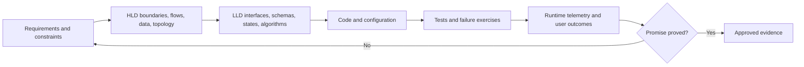
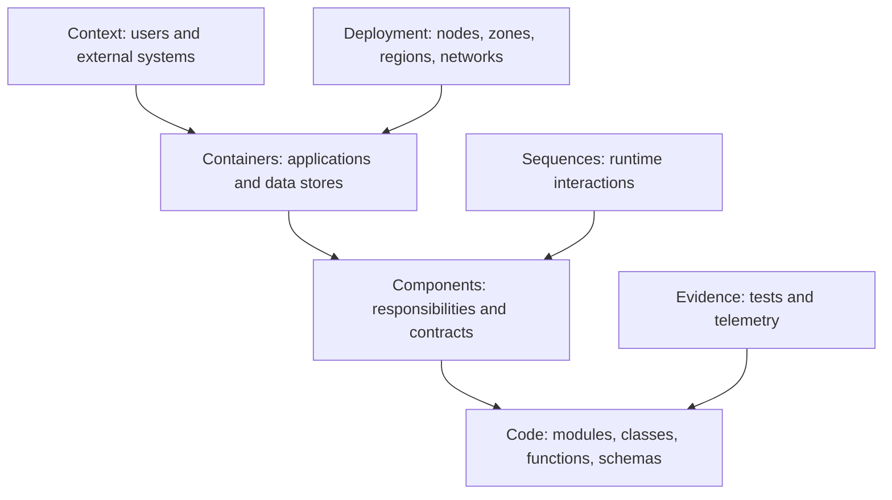
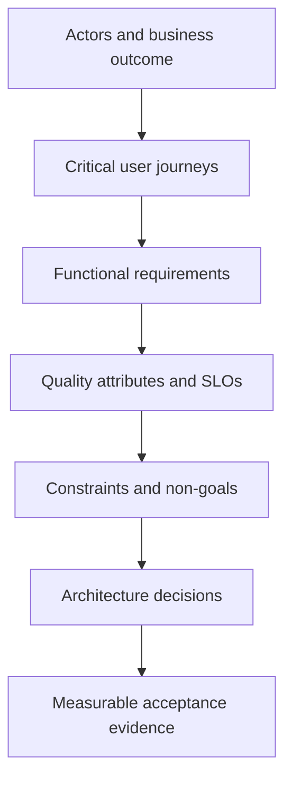
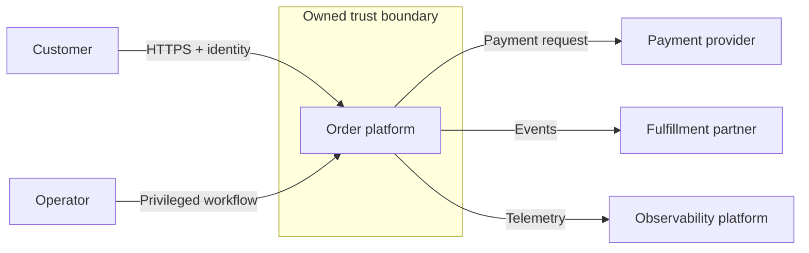
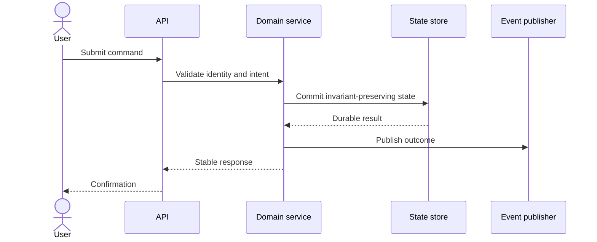
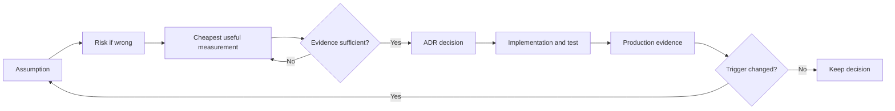

# Module 17 — System Design for DevOps/SRE

## Lesson 1: Requirements, Constraints and the System Model

System design is disciplined tradeoff reasoning. Begin with behavior and constraints; technologies come later.

# 17.1.1 Requirement frame

```text
functional      what users and integrations must do
quality         availability, latency, durability, security, cost
scale           traffic, data, tenants, regions, growth
operational     deploy, observe, recover, audit, support
constraints     team, deadline, regulation, existing systems
out of scope    intentionally excluded behavior
```

Convert vague language into measurable objectives. “Highly available” becomes a journey SLO and failure model. “Fast” becomes a percentile latency under defined load and payload.

# 17.1.2 Start from critical journeys

For an order service:

```text
create order
read order status
cancel order before fulfillment
process payment callback
publish fulfillment event
```

For each, define correctness, idempotency, consistency, latency, availability, data loss tolerance, and dependency behavior.

# 17.1.3 Context diagram

```text
customer ─► edge/API ─► order service ─► database
                         │      │
                         │      └────► payment provider
                         └───────────► event bus ─► fulfillment
```

Mark trust boundaries, authoritative data owners, synchronous dependencies, and failure domains. Every arrow is a latency, security, capacity, and availability dependency.

# 17.1.4 Architecture decision record

```markdown
# ADR: Store order state in relational database
Status: Accepted
Context: transactional state transitions and query needs
Decision: managed PostgreSQL, one writer, read replicas
Alternatives: DynamoDB, document database
Consequences: schema migrations and regional-write strategy required
Evidence: load test, recovery test, cost estimate
```

Record why and consequences, not just the chosen product.

# 17.1.5 Lab

Design a URL shortener or order service. Produce requirements, SLOs, load assumptions, context diagram, data ownership, failure model, three ADRs, and open questions. Review which assumption would most change the architecture.

# 17.1.6 Interview structure

> **I clarify journeys and scale, quantify quality attributes, draw the context and data flow, identify state and consistency, estimate capacity, design the normal path, then examine failure, security, delivery, observability, recovery, and cost. I make tradeoffs explicit and revisit the highest-risk assumption.**

# 17.1.7 Beginner mental model: design is choosing under limits

System design is not drawing the most boxes. It is deciding how a system should meet valuable outcomes despite limited time, money, people, capacity, and technology.

```text
requirements + constraints + assumptions
          -> options and tradeoffs
          -> architecture
          -> validation evidence
          -> revised decisions
```

A good design explains why each important component exists and what happens when it fails.

# 17.1.8 Functional and quality requirements

Functional requirements describe behavior:

```text
create, read, update, and delete a todo
share a list with another user
notify a user when a deadline approaches
```

Quality attributes describe how well:

```text
availability, latency, correctness, durability
scale, security, privacy, compliance
operability, maintainability, cost, portability
RTO/RPO and data residency
```

Make them measurable. “Fast and scalable” is vague; “P99 create latency below 500 ms at 5,000 requests/s” is testable.

# 17.1.9 Constraints versus assumptions

```text
constraint: production data must remain in India
constraint: team supports PostgreSQL and Kubernetes today
assumption: peak traffic is 10× average
assumption: 80% of operations are reads
decision: start with one regional PostgreSQL writer
```

Assumptions need owners and validation dates. If an assumption is wrong, the decision may change without anyone having made a bad choice.

# 17.1.10 Prioritize and resolve conflicts

Requirements conflict:

```text
strong consistency vs multi-region write latency
high availability vs cost
fast feature delivery vs change risk
long retention vs privacy/cost
custom platform flexibility vs cognitive load
```

Ask the accountable stakeholder which tradeoff protects the critical journey. Record rejected alternatives and consequences.

# 17.1.11 User journeys and invariants

Write each journey as steps and identify invariants—facts that must always remain true:

```text
Create todo:
authenticate -> validate -> persist -> acknowledge -> publish event

Invariants:
one idempotency key cannot create two todos
an acknowledged create must be retrievable
unauthorized user cannot read another list
eventual notification cannot precede authoritative persistence
```

Invariants guide database, transaction, retry, and security design better than product names do.

# 17.1.12 Scope and non-goals

Declare the first design boundary:

```text
IN SCOPE
API, persistence, reminders, production operations for 1 million users

OUT OF SCOPE FOR V1
real-time collaborative editing, offline conflict merge, public marketplace

FUTURE PRESSURE
multi-region read latency and enterprise tenant isolation
```

Non-goals prevent an interview or project from expanding without limit. Revisit them when requirements change.

# 17.1.13 Context and container diagrams

Start broad:

```text
[User] -> [Todo System] -> [Identity Provider]
                         -> [Email Provider]
```

Then show major runtime containers:

```text
client -> edge/load balancer -> API -> PostgreSQL
                                  -> queue -> worker -> email provider
operators -> observability / delivery control planes
```

Label trust boundaries, protocols, data ownership, synchronous/asynchronous calls, and failure assumptions. Do not begin with internal classes.

# 17.1.14 Data-flow and trust-boundary view

Trace one sensitive operation:

```text
credential/token enters edge
-> identity validated
-> tenant/user authorization enforced
-> todo content encrypted in transit
-> persistence encrypted with controlled key
-> audit event records safe identity/action
-> logs/traces exclude token and prohibited content
```

This reveals security decisions that a component diagram hides.

# 17.1.15 Real hands-on: requirement discovery workshop

For the todo system, answer:

1. Who are the users and business owner?
2. What are the top three journeys and invariants?
3. What is average/peak traffic and data growth?
4. What latency/availability/durability/RTO/RPO is actually required?
5. What data classification/residency applies?
6. Which dependencies and team skills constrain choices?
7. What can degrade or wait asynchronously?
8. What is deliberately excluded from version one?

Mark every unknown as an assumption with a validation plan.

# 17.1.16 Architecture decision record example

```markdown
# ADR-004: Use a queue for reminder delivery

Status: Accepted
Context: API acknowledgement must not depend on email provider latency.
Decision: Persist todo, publish through transactional outbox, process asynchronously.
Alternatives: synchronous email; scheduled DB polling.
Consequences: eventual delivery, duplicate handling, queue monitoring, DLQ/replay.
Validation: load test, duplicate event test, provider outage game day.
Owner/review: Team Todo, review at 10× volume or new channel requirement.
```

# 17.1.17 Failure-mode table before implementation

| Component/boundary | Failure | User effect | Control | Evidence |
|---|---|---|---|---|
| Identity | slow/unavailable | login/create blocked | bounded timeout, cached safe session policy | latency/error SLI |
| Database | writer unavailable | creates fail | HA/failover, queue only if semantics allow | write SLI, DB state |
| Queue | backlog | reminders late | age SLO, scaling, DLQ | oldest message age |
| Email | rejected | notification delayed/lost | retry budget, classification, fallback | delivery outcomes |

Design prevention, containment, detection, and recovery for high risks.

# 17.1.18 Review with Well-Architected lenses

Evaluate operational excellence, security, reliability, performance efficiency, cost optimization, and sustainability. These lenses expose missing questions; they do not mechanically decide the architecture.

For every review item, record current state, evidence, risk, owner, decision, and review date. Avoid checkbox compliance without user outcome.

# 17.1.19 Interview whiteboard structure

```text
0–5 min   clarify users, journeys, scope, quality targets
5–10 min  estimate traffic/data and state assumptions
10–20 min draw high-level flow and data ownership
20–30 min deep-dive critical tradeoff
30–38 min failure, security, observability, capacity, DR
38–42 min evolution, cost, and recap decisions
```

Say why. Interviewers usually value a coherent decision under requirements more than a fashionable component.

# 17.1.20 Certification and interview preparation

System-design reasoning supports cloud-architecture and DevOps/SRE certification scenarios. Always use current official certification objectives and service limits.

**Beginner: Functional versus non-functional requirement?**  Functional states what the system does; quality requirements state measurable properties such as latency, availability, security, and cost.

**Intermediate: Constraint versus assumption?**  A constraint is a required boundary; an assumption is believed true but must be validated and can change.

**Intermediate: Why define non-goals?**  They protect scope and make tradeoffs explicit.

**Senior: What do you clarify first in a design interview?**  Users, critical journeys/invariants, scale, quality objectives, data/security, constraints, and scope.

**Senior: Why write ADRs?**  They preserve context, considered options, decision, consequences, evidence, and revisit conditions.

**Expert: How do you handle conflicting requirements?**  Quantify the tradeoff, identify accountable stakeholder/user risk, propose options/fallbacks, and record the decision and consequence.

**Architect: What proves a design is operable?**  Ownership, objectives, telemetry, alert/runbook, capacity, failure behavior, safe delivery, security, backup/DR, and tested operational paths.

**Never-forget answer:** requirements drive architecture. State assumptions, protect invariants, explain tradeoffs, and validate the failure behavior.

<!-- GENERATED-MASTERY-WORKBOOK:START -->

# 17.1.21 Professional Mastery Workbook

This workbook expands **Requirements, Constraints and the System Model** into deliberate practice without replacing the authored tutorial above.

Use it after reading the core explanation. The goal is not to memorize thousands of lines; the goal is to repeatedly explain, build, break, secure, observe, recover, and defend the lesson in different conditions.

## Workbook learning contract

- Concepts covered: 20 lesson-specific anchors.
- Progression: beginner, intermediate, expert, professional, industry-ready, certification review, and interview defense.
- Safety: use synthetic data, disposable resources, explicit placeholders, least privilege, and bounded failure experiments.
- Completion: retain commands or configuration, observations, screenshots or query output, decisions, rollback evidence, and a short reflection.
- Quality rule: a passing answer states assumptions, protects a user or business outcome, names ownership, and validates the final result end to end.
- Currency rule: verify current official documentation, versions, limits, pricing, and certification objectives before relying on changing product behavior.

## Seven-stage progression

| Stage | Learner must demonstrate |
|---|---|
| Beginner | Explain the concept in plain language and give one safe example. |
| Intermediate | Connect components, data, control flow, and normal operating behavior. |
| Expert | Analyze trade-offs, edge cases, scaling pressure, and correlated failures. |
| Professional | Make a reviewed decision with owner, evidence, rollout, and rollback. |
| Industry-ready | Operate the design under security, failure, recovery, cost, and compliance constraints. |
| Certification review | Map durable concepts to the latest official objectives without relying on stale wording. |
| Interview defense | Answer concisely, clarify assumptions, draw the model, and defend alternatives. |

## Concept mastery cards

### Concept card 1 - Requirement frame

- Lesson anchor: functional      what users and integrations must do quality         availability, latency, durability, security, cost scale           traffic, data, tenants, regions, growth operational     deploy, observe, recover, audit, support
- Beginner explanation: Restate **Requirement frame** using a household, workplace, or public-service analogy without hiding the technical truth.
- Terminology check: Define every important noun, state, actor, and boundary before using abbreviations.
- Concrete example: Apply **Requirement frame** to a small todo, checkout, or platform service and name the expected outcome.
- Intermediate connection: Draw the request, data, identity, and control flow that reaches this concept.
- Trade-off question: Compare at least two valid alternatives and state when each becomes the better choice.
- Expert edge case: Describe concurrency, retry, partial failure, scale, or stale-state behavior that a happy-path explanation misses.
- Hands-on artifact: Produce a requirement, invariant, and architecture decision record focused on **Requirement frame**.
- Failure exercise: In an isolated environment, introduce a timeout and retry amplification path while observing the boundaries around **Requirement frame**.
- Security review: Identify identity, authorization, sensitive-data, supply-chain, and abuse assumptions.
- Reliability review: Define the user-visible failure, containment, degraded mode, recovery, and final validation.
- Performance and cost review: Name the load driver, capacity limit, useful unit, and waste or amplification risk.
- Observability review: Specify the metric, structured event, trace boundary, change marker, and missing-data behavior.
- Professional decision: Record context, options, decision, consequences, owner, evidence, and revisit trigger.
- Certification checkpoint: Map the design evidence to the current cloud architecture, DevOps, or Kubernetes objectives and defend the trade-off provider-neutrally.
- Interview prompt: Explain **Requirement frame** first in 30 seconds, then defend it in a five-minute system scenario.
- Strong-answer rubric: lead with outcome, state assumptions, explain mechanism, discuss failure and security, then validate with evidence.
- Completion evidence: retain the artifact, commands or query, observed failure, safe recovery, and one improvement.

### Concept card 2 - Start from critical journeys

- Lesson anchor: For an order service: create order read order status cancel order before fulfillment process payment callback publish fulfillment event For each, define correctness, idempotency, consistency, latency, availability, data loss tolerance, and dependency behavior.
- Beginner explanation: Restate **Start from critical journeys** using a household, workplace, or public-service analogy without hiding the technical truth.
- Terminology check: Define every important noun, state, actor, and boundary before using abbreviations.
- Concrete example: Apply **Start from critical journeys** to a small todo, checkout, or platform service and name the expected outcome.
- Intermediate connection: Draw the request, data, identity, and control flow that reaches this concept.
- Trade-off question: Compare at least two valid alternatives and state when each becomes the better choice.
- Expert edge case: Describe concurrency, retry, partial failure, scale, or stale-state behavior that a happy-path explanation misses.
- Hands-on artifact: Produce a capacity, latency, storage, and bandwidth calculation focused on **Start from critical journeys**.
- Failure exercise: In an isolated environment, create a hot key, partition, cache, or queue condition while observing the boundaries around **Start from critical journeys**.
- Security review: Identify identity, authorization, sensitive-data, supply-chain, and abuse assumptions.
- Reliability review: Define the user-visible failure, containment, degraded mode, recovery, and final validation.
- Performance and cost review: Name the load driver, capacity limit, useful unit, and waste or amplification risk.
- Observability review: Specify the metric, structured event, trace boundary, change marker, and missing-data behavior.
- Professional decision: Record context, options, decision, consequences, owner, evidence, and revisit trigger.
- Certification checkpoint: Map the design evidence to the current cloud architecture, DevOps, or Kubernetes objectives and defend the trade-off provider-neutrally.
- Interview prompt: Explain **Start from critical journeys** first in 30 seconds, then defend it in a five-minute system scenario.
- Strong-answer rubric: lead with outcome, state assumptions, explain mechanism, discuss failure and security, then validate with evidence.
- Completion evidence: retain the artifact, commands or query, observed failure, safe recovery, and one improvement.

### Concept card 3 - Context diagram

- Lesson anchor: customer ─► edge/API ─► order service ─► database │      │ │      └────► payment provider └───────────► event bus ─► fulfillment Mark trust boundaries, authoritative data owners, synchronous dependencies, and failure domains. Every arrow is a latency, secur...
- Beginner explanation: Restate **Context diagram** using a household, workplace, or public-service analogy without hiding the technical truth.
- Terminology check: Define every important noun, state, actor, and boundary before using abbreviations.
- Concrete example: Apply **Context diagram** to a small todo, checkout, or platform service and name the expected outcome.
- Intermediate connection: Draw the request, data, identity, and control flow that reaches this concept.
- Trade-off question: Compare at least two valid alternatives and state when each becomes the better choice.
- Expert edge case: Describe concurrency, retry, partial failure, scale, or stale-state behavior that a happy-path explanation misses.
- Hands-on artifact: Produce an API, data, or event contract with failure semantics focused on **Context diagram**.
- Failure exercise: In an isolated environment, remove a shared dependency or one failure domain while observing the boundaries around **Context diagram**.
- Security review: Identify identity, authorization, sensitive-data, supply-chain, and abuse assumptions.
- Reliability review: Define the user-visible failure, containment, degraded mode, recovery, and final validation.
- Performance and cost review: Name the load driver, capacity limit, useful unit, and waste or amplification risk.
- Observability review: Specify the metric, structured event, trace boundary, change marker, and missing-data behavior.
- Professional decision: Record context, options, decision, consequences, owner, evidence, and revisit trigger.
- Certification checkpoint: Map the design evidence to the current cloud architecture, DevOps, or Kubernetes objectives and defend the trade-off provider-neutrally.
- Interview prompt: Explain **Context diagram** first in 30 seconds, then defend it in a five-minute system scenario.
- Strong-answer rubric: lead with outcome, state assumptions, explain mechanism, discuss failure and security, then validate with evidence.
- Completion evidence: retain the artifact, commands or query, observed failure, safe recovery, and one improvement.

### Concept card 4 - Architecture decision record

- Lesson anchor: Status: Accepted Context: transactional state transitions and query needs Decision: managed PostgreSQL, one writer, read replicas Alternatives: DynamoDB, document database Consequences: schema migrations and regional-write strategy required
- Beginner explanation: Restate **Architecture decision record** using a household, workplace, or public-service analogy without hiding the technical truth.
- Terminology check: Define every important noun, state, actor, and boundary before using abbreviations.
- Concrete example: Apply **Architecture decision record** to a small todo, checkout, or platform service and name the expected outcome.
- Intermediate connection: Draw the request, data, identity, and control flow that reaches this concept.
- Trade-off question: Compare at least two valid alternatives and state when each becomes the better choice.
- Expert edge case: Describe concurrency, retry, partial failure, scale, or stale-state behavior that a happy-path explanation misses.
- Hands-on artifact: Produce a context, data-flow, trust, and failure-domain diagram focused on **Architecture decision record**.
- Failure exercise: In an isolated environment, make data arrive duplicated, late, or out of order while observing the boundaries around **Architecture decision record**.
- Security review: Identify identity, authorization, sensitive-data, supply-chain, and abuse assumptions.
- Reliability review: Define the user-visible failure, containment, degraded mode, recovery, and final validation.
- Performance and cost review: Name the load driver, capacity limit, useful unit, and waste or amplification risk.
- Observability review: Specify the metric, structured event, trace boundary, change marker, and missing-data behavior.
- Professional decision: Record context, options, decision, consequences, owner, evidence, and revisit trigger.
- Certification checkpoint: Map the design evidence to the current cloud architecture, DevOps, or Kubernetes objectives and defend the trade-off provider-neutrally.
- Interview prompt: Explain **Architecture decision record** first in 30 seconds, then defend it in a five-minute system scenario.
- Strong-answer rubric: lead with outcome, state assumptions, explain mechanism, discuss failure and security, then validate with evidence.
- Completion evidence: retain the artifact, commands or query, observed failure, safe recovery, and one improvement.

### Concept card 5 - Lab

- Lesson anchor: Design a URL shortener or order service. Produce requirements, SLOs, load assumptions, context diagram, data ownership, failure model, three ADRs, and open questions. Review which assumption would most change the architecture.
- Beginner explanation: Restate **Lab** using a household, workplace, or public-service analogy without hiding the technical truth.
- Terminology check: Define every important noun, state, actor, and boundary before using abbreviations.
- Concrete example: Apply **Lab** to a small todo, checkout, or platform service and name the expected outcome.
- Intermediate connection: Draw the request, data, identity, and control flow that reaches this concept.
- Trade-off question: Compare at least two valid alternatives and state when each becomes the better choice.
- Expert edge case: Describe concurrency, retry, partial failure, scale, or stale-state behavior that a happy-path explanation misses.
- Hands-on artifact: Produce a load-test and graceful-degradation report focused on **Lab**.
- Failure exercise: In an isolated environment, overload the system beyond its modeled queueing knee while observing the boundaries around **Lab**.
- Security review: Identify identity, authorization, sensitive-data, supply-chain, and abuse assumptions.
- Reliability review: Define the user-visible failure, containment, degraded mode, recovery, and final validation.
- Performance and cost review: Name the load driver, capacity limit, useful unit, and waste or amplification risk.
- Observability review: Specify the metric, structured event, trace boundary, change marker, and missing-data behavior.
- Professional decision: Record context, options, decision, consequences, owner, evidence, and revisit trigger.
- Certification checkpoint: Map the design evidence to the current cloud architecture, DevOps, or Kubernetes objectives and defend the trade-off provider-neutrally.
- Interview prompt: Explain **Lab** first in 30 seconds, then defend it in a five-minute system scenario.
- Strong-answer rubric: lead with outcome, state assumptions, explain mechanism, discuss failure and security, then validate with evidence.
- Completion evidence: retain the artifact, commands or query, observed failure, safe recovery, and one improvement.

### Concept card 6 - Interview structure

- Lesson anchor: I clarify journeys and scale, quantify quality attributes, draw the context and data flow, identify state and consistency, estimate capacity, design the normal path, then examine failure, security, delivery, observability, recovery, and cost. I make tradeof...
- Beginner explanation: Restate **Interview structure** using a household, workplace, or public-service analogy without hiding the technical truth.
- Terminology check: Define every important noun, state, actor, and boundary before using abbreviations.
- Concrete example: Apply **Interview structure** to a small todo, checkout, or platform service and name the expected outcome.
- Intermediate connection: Draw the request, data, identity, and control flow that reaches this concept.
- Trade-off question: Compare at least two valid alternatives and state when each becomes the better choice.
- Expert edge case: Describe concurrency, retry, partial failure, scale, or stale-state behavior that a happy-path explanation misses.
- Hands-on artifact: Produce a multi-region failover and failback state machine focused on **Interview structure**.
- Failure exercise: In an isolated environment, make a regional writer or routing decision ambiguous while observing the boundaries around **Interview structure**.
- Security review: Identify identity, authorization, sensitive-data, supply-chain, and abuse assumptions.
- Reliability review: Define the user-visible failure, containment, degraded mode, recovery, and final validation.
- Performance and cost review: Name the load driver, capacity limit, useful unit, and waste or amplification risk.
- Observability review: Specify the metric, structured event, trace boundary, change marker, and missing-data behavior.
- Professional decision: Record context, options, decision, consequences, owner, evidence, and revisit trigger.
- Certification checkpoint: Map the design evidence to the current cloud architecture, DevOps, or Kubernetes objectives and defend the trade-off provider-neutrally.
- Interview prompt: Explain **Interview structure** first in 30 seconds, then defend it in a five-minute system scenario.
- Strong-answer rubric: lead with outcome, state assumptions, explain mechanism, discuss failure and security, then validate with evidence.
- Completion evidence: retain the artifact, commands or query, observed failure, safe recovery, and one improvement.

### Concept card 7 - Beginner mental model: design is choosing under limits

- Lesson anchor: System design is not drawing the most boxes. It is deciding how a system should meet valuable outcomes despite limited time, money, people, capacity, and technology. requirements + constraints + assumptions - options and tradeoffs
- Beginner explanation: Restate **Beginner mental model: design is choosing under limits** using a household, workplace, or public-service analogy without hiding the technical truth.
- Terminology check: Define every important noun, state, actor, and boundary before using abbreviations.
- Concrete example: Apply **Beginner mental model: design is choosing under limits** to a small todo, checkout, or platform service and name the expected outcome.
- Intermediate connection: Draw the request, data, identity, and control flow that reaches this concept.
- Trade-off question: Compare at least two valid alternatives and state when each becomes the better choice.
- Expert edge case: Describe concurrency, retry, partial failure, scale, or stale-state behavior that a happy-path explanation misses.
- Hands-on artifact: Produce a requirement, invariant, and architecture decision record focused on **Beginner mental model: design is choosing under limits**.
- Failure exercise: In an isolated environment, introduce a timeout and retry amplification path while observing the boundaries around **Beginner mental model: design is choosing under limits**.
- Security review: Identify identity, authorization, sensitive-data, supply-chain, and abuse assumptions.
- Reliability review: Define the user-visible failure, containment, degraded mode, recovery, and final validation.
- Performance and cost review: Name the load driver, capacity limit, useful unit, and waste or amplification risk.
- Observability review: Specify the metric, structured event, trace boundary, change marker, and missing-data behavior.
- Professional decision: Record context, options, decision, consequences, owner, evidence, and revisit trigger.
- Certification checkpoint: Map the design evidence to the current cloud architecture, DevOps, or Kubernetes objectives and defend the trade-off provider-neutrally.
- Interview prompt: Explain **Beginner mental model: design is choosing under limits** first in 30 seconds, then defend it in a five-minute system scenario.
- Strong-answer rubric: lead with outcome, state assumptions, explain mechanism, discuss failure and security, then validate with evidence.
- Completion evidence: retain the artifact, commands or query, observed failure, safe recovery, and one improvement.

### Concept card 8 - Functional and quality requirements

- Lesson anchor: Functional requirements describe behavior: create, read, update, and delete a todo share a list with another user notify a user when a deadline approaches Quality attributes describe how well: availability, latency, correctness, durability
- Beginner explanation: Restate **Functional and quality requirements** using a household, workplace, or public-service analogy without hiding the technical truth.
- Terminology check: Define every important noun, state, actor, and boundary before using abbreviations.
- Concrete example: Apply **Functional and quality requirements** to a small todo, checkout, or platform service and name the expected outcome.
- Intermediate connection: Draw the request, data, identity, and control flow that reaches this concept.
- Trade-off question: Compare at least two valid alternatives and state when each becomes the better choice.
- Expert edge case: Describe concurrency, retry, partial failure, scale, or stale-state behavior that a happy-path explanation misses.
- Hands-on artifact: Produce a capacity, latency, storage, and bandwidth calculation focused on **Functional and quality requirements**.
- Failure exercise: In an isolated environment, create a hot key, partition, cache, or queue condition while observing the boundaries around **Functional and quality requirements**.
- Security review: Identify identity, authorization, sensitive-data, supply-chain, and abuse assumptions.
- Reliability review: Define the user-visible failure, containment, degraded mode, recovery, and final validation.
- Performance and cost review: Name the load driver, capacity limit, useful unit, and waste or amplification risk.
- Observability review: Specify the metric, structured event, trace boundary, change marker, and missing-data behavior.
- Professional decision: Record context, options, decision, consequences, owner, evidence, and revisit trigger.
- Certification checkpoint: Map the design evidence to the current cloud architecture, DevOps, or Kubernetes objectives and defend the trade-off provider-neutrally.
- Interview prompt: Explain **Functional and quality requirements** first in 30 seconds, then defend it in a five-minute system scenario.
- Strong-answer rubric: lead with outcome, state assumptions, explain mechanism, discuss failure and security, then validate with evidence.
- Completion evidence: retain the artifact, commands or query, observed failure, safe recovery, and one improvement.

### Concept card 9 - Constraints versus assumptions

- Lesson anchor: constraint: production data must remain in India constraint: team supports PostgreSQL and Kubernetes today assumption: peak traffic is 10× average assumption: 80% of operations are reads decision: start with one regional PostgreSQL writer
- Beginner explanation: Restate **Constraints versus assumptions** using a household, workplace, or public-service analogy without hiding the technical truth.
- Terminology check: Define every important noun, state, actor, and boundary before using abbreviations.
- Concrete example: Apply **Constraints versus assumptions** to a small todo, checkout, or platform service and name the expected outcome.
- Intermediate connection: Draw the request, data, identity, and control flow that reaches this concept.
- Trade-off question: Compare at least two valid alternatives and state when each becomes the better choice.
- Expert edge case: Describe concurrency, retry, partial failure, scale, or stale-state behavior that a happy-path explanation misses.
- Hands-on artifact: Produce an API, data, or event contract with failure semantics focused on **Constraints versus assumptions**.
- Failure exercise: In an isolated environment, remove a shared dependency or one failure domain while observing the boundaries around **Constraints versus assumptions**.
- Security review: Identify identity, authorization, sensitive-data, supply-chain, and abuse assumptions.
- Reliability review: Define the user-visible failure, containment, degraded mode, recovery, and final validation.
- Performance and cost review: Name the load driver, capacity limit, useful unit, and waste or amplification risk.
- Observability review: Specify the metric, structured event, trace boundary, change marker, and missing-data behavior.
- Professional decision: Record context, options, decision, consequences, owner, evidence, and revisit trigger.
- Certification checkpoint: Map the design evidence to the current cloud architecture, DevOps, or Kubernetes objectives and defend the trade-off provider-neutrally.
- Interview prompt: Explain **Constraints versus assumptions** first in 30 seconds, then defend it in a five-minute system scenario.
- Strong-answer rubric: lead with outcome, state assumptions, explain mechanism, discuss failure and security, then validate with evidence.
- Completion evidence: retain the artifact, commands or query, observed failure, safe recovery, and one improvement.

### Concept card 10 - Prioritize and resolve conflicts

- Lesson anchor: Requirements conflict: strong consistency vs multi-region write latency high availability vs cost fast feature delivery vs change risk long retention vs privacy/cost custom platform flexibility vs cognitive load Ask the accountable stakeholder which tradeof...
- Beginner explanation: Restate **Prioritize and resolve conflicts** using a household, workplace, or public-service analogy without hiding the technical truth.
- Terminology check: Define every important noun, state, actor, and boundary before using abbreviations.
- Concrete example: Apply **Prioritize and resolve conflicts** to a small todo, checkout, or platform service and name the expected outcome.
- Intermediate connection: Draw the request, data, identity, and control flow that reaches this concept.
- Trade-off question: Compare at least two valid alternatives and state when each becomes the better choice.
- Expert edge case: Describe concurrency, retry, partial failure, scale, or stale-state behavior that a happy-path explanation misses.
- Hands-on artifact: Produce a context, data-flow, trust, and failure-domain diagram focused on **Prioritize and resolve conflicts**.
- Failure exercise: In an isolated environment, make data arrive duplicated, late, or out of order while observing the boundaries around **Prioritize and resolve conflicts**.
- Security review: Identify identity, authorization, sensitive-data, supply-chain, and abuse assumptions.
- Reliability review: Define the user-visible failure, containment, degraded mode, recovery, and final validation.
- Performance and cost review: Name the load driver, capacity limit, useful unit, and waste or amplification risk.
- Observability review: Specify the metric, structured event, trace boundary, change marker, and missing-data behavior.
- Professional decision: Record context, options, decision, consequences, owner, evidence, and revisit trigger.
- Certification checkpoint: Map the design evidence to the current cloud architecture, DevOps, or Kubernetes objectives and defend the trade-off provider-neutrally.
- Interview prompt: Explain **Prioritize and resolve conflicts** first in 30 seconds, then defend it in a five-minute system scenario.
- Strong-answer rubric: lead with outcome, state assumptions, explain mechanism, discuss failure and security, then validate with evidence.
- Completion evidence: retain the artifact, commands or query, observed failure, safe recovery, and one improvement.

### Concept card 11 - User journeys and invariants

- Lesson anchor: Write each journey as steps and identify invariants—facts that must always remain true: Create todo: authenticate - validate - persist - acknowledge - publish event Invariants: one idempotency key cannot create two todos
- Beginner explanation: Restate **User journeys and invariants** using a household, workplace, or public-service analogy without hiding the technical truth.
- Terminology check: Define every important noun, state, actor, and boundary before using abbreviations.
- Concrete example: Apply **User journeys and invariants** to a small todo, checkout, or platform service and name the expected outcome.
- Intermediate connection: Draw the request, data, identity, and control flow that reaches this concept.
- Trade-off question: Compare at least two valid alternatives and state when each becomes the better choice.
- Expert edge case: Describe concurrency, retry, partial failure, scale, or stale-state behavior that a happy-path explanation misses.
- Hands-on artifact: Produce a load-test and graceful-degradation report focused on **User journeys and invariants**.
- Failure exercise: In an isolated environment, overload the system beyond its modeled queueing knee while observing the boundaries around **User journeys and invariants**.
- Security review: Identify identity, authorization, sensitive-data, supply-chain, and abuse assumptions.
- Reliability review: Define the user-visible failure, containment, degraded mode, recovery, and final validation.
- Performance and cost review: Name the load driver, capacity limit, useful unit, and waste or amplification risk.
- Observability review: Specify the metric, structured event, trace boundary, change marker, and missing-data behavior.
- Professional decision: Record context, options, decision, consequences, owner, evidence, and revisit trigger.
- Certification checkpoint: Map the design evidence to the current cloud architecture, DevOps, or Kubernetes objectives and defend the trade-off provider-neutrally.
- Interview prompt: Explain **User journeys and invariants** first in 30 seconds, then defend it in a five-minute system scenario.
- Strong-answer rubric: lead with outcome, state assumptions, explain mechanism, discuss failure and security, then validate with evidence.
- Completion evidence: retain the artifact, commands or query, observed failure, safe recovery, and one improvement.

### Concept card 12 - Scope and non-goals

- Lesson anchor: Declare the first design boundary: IN SCOPE API, persistence, reminders, production operations for 1 million users OUT OF SCOPE FOR V1 real-time collaborative editing, offline conflict merge, public marketplace FUTURE PRESSURE
- Beginner explanation: Restate **Scope and non-goals** using a household, workplace, or public-service analogy without hiding the technical truth.
- Terminology check: Define every important noun, state, actor, and boundary before using abbreviations.
- Concrete example: Apply **Scope and non-goals** to a small todo, checkout, or platform service and name the expected outcome.
- Intermediate connection: Draw the request, data, identity, and control flow that reaches this concept.
- Trade-off question: Compare at least two valid alternatives and state when each becomes the better choice.
- Expert edge case: Describe concurrency, retry, partial failure, scale, or stale-state behavior that a happy-path explanation misses.
- Hands-on artifact: Produce a multi-region failover and failback state machine focused on **Scope and non-goals**.
- Failure exercise: In an isolated environment, make a regional writer or routing decision ambiguous while observing the boundaries around **Scope and non-goals**.
- Security review: Identify identity, authorization, sensitive-data, supply-chain, and abuse assumptions.
- Reliability review: Define the user-visible failure, containment, degraded mode, recovery, and final validation.
- Performance and cost review: Name the load driver, capacity limit, useful unit, and waste or amplification risk.
- Observability review: Specify the metric, structured event, trace boundary, change marker, and missing-data behavior.
- Professional decision: Record context, options, decision, consequences, owner, evidence, and revisit trigger.
- Certification checkpoint: Map the design evidence to the current cloud architecture, DevOps, or Kubernetes objectives and defend the trade-off provider-neutrally.
- Interview prompt: Explain **Scope and non-goals** first in 30 seconds, then defend it in a five-minute system scenario.
- Strong-answer rubric: lead with outcome, state assumptions, explain mechanism, discuss failure and security, then validate with evidence.
- Completion evidence: retain the artifact, commands or query, observed failure, safe recovery, and one improvement.

### Concept card 13 - Context and container diagrams

- Lesson anchor: Start broad: [User] - [Todo System] - [Identity Provider] - [Email Provider] Then show major runtime containers: client - edge/load balancer - API - PostgreSQL - queue - worker - email provider operators - observability / delivery control planes
- Beginner explanation: Restate **Context and container diagrams** using a household, workplace, or public-service analogy without hiding the technical truth.
- Terminology check: Define every important noun, state, actor, and boundary before using abbreviations.
- Concrete example: Apply **Context and container diagrams** to a small todo, checkout, or platform service and name the expected outcome.
- Intermediate connection: Draw the request, data, identity, and control flow that reaches this concept.
- Trade-off question: Compare at least two valid alternatives and state when each becomes the better choice.
- Expert edge case: Describe concurrency, retry, partial failure, scale, or stale-state behavior that a happy-path explanation misses.
- Hands-on artifact: Produce a requirement, invariant, and architecture decision record focused on **Context and container diagrams**.
- Failure exercise: In an isolated environment, introduce a timeout and retry amplification path while observing the boundaries around **Context and container diagrams**.
- Security review: Identify identity, authorization, sensitive-data, supply-chain, and abuse assumptions.
- Reliability review: Define the user-visible failure, containment, degraded mode, recovery, and final validation.
- Performance and cost review: Name the load driver, capacity limit, useful unit, and waste or amplification risk.
- Observability review: Specify the metric, structured event, trace boundary, change marker, and missing-data behavior.
- Professional decision: Record context, options, decision, consequences, owner, evidence, and revisit trigger.
- Certification checkpoint: Map the design evidence to the current cloud architecture, DevOps, or Kubernetes objectives and defend the trade-off provider-neutrally.
- Interview prompt: Explain **Context and container diagrams** first in 30 seconds, then defend it in a five-minute system scenario.
- Strong-answer rubric: lead with outcome, state assumptions, explain mechanism, discuss failure and security, then validate with evidence.
- Completion evidence: retain the artifact, commands or query, observed failure, safe recovery, and one improvement.

### Concept card 14 - Data-flow and trust-boundary view

- Lesson anchor: Trace one sensitive operation: credential/token enters edge - identity validated - tenant/user authorization enforced - todo content encrypted in transit - persistence encrypted with controlled key - audit event records safe identity/action
- Beginner explanation: Restate **Data-flow and trust-boundary view** using a household, workplace, or public-service analogy without hiding the technical truth.
- Terminology check: Define every important noun, state, actor, and boundary before using abbreviations.
- Concrete example: Apply **Data-flow and trust-boundary view** to a small todo, checkout, or platform service and name the expected outcome.
- Intermediate connection: Draw the request, data, identity, and control flow that reaches this concept.
- Trade-off question: Compare at least two valid alternatives and state when each becomes the better choice.
- Expert edge case: Describe concurrency, retry, partial failure, scale, or stale-state behavior that a happy-path explanation misses.
- Hands-on artifact: Produce a capacity, latency, storage, and bandwidth calculation focused on **Data-flow and trust-boundary view**.
- Failure exercise: In an isolated environment, create a hot key, partition, cache, or queue condition while observing the boundaries around **Data-flow and trust-boundary view**.
- Security review: Identify identity, authorization, sensitive-data, supply-chain, and abuse assumptions.
- Reliability review: Define the user-visible failure, containment, degraded mode, recovery, and final validation.
- Performance and cost review: Name the load driver, capacity limit, useful unit, and waste or amplification risk.
- Observability review: Specify the metric, structured event, trace boundary, change marker, and missing-data behavior.
- Professional decision: Record context, options, decision, consequences, owner, evidence, and revisit trigger.
- Certification checkpoint: Map the design evidence to the current cloud architecture, DevOps, or Kubernetes objectives and defend the trade-off provider-neutrally.
- Interview prompt: Explain **Data-flow and trust-boundary view** first in 30 seconds, then defend it in a five-minute system scenario.
- Strong-answer rubric: lead with outcome, state assumptions, explain mechanism, discuss failure and security, then validate with evidence.
- Completion evidence: retain the artifact, commands or query, observed failure, safe recovery, and one improvement.

### Concept card 15 - Real hands-on: requirement discovery workshop

- Lesson anchor: For the todo system, answer: Mark every unknown as an assumption with a validation plan.
- Beginner explanation: Restate **Real hands-on: requirement discovery workshop** using a household, workplace, or public-service analogy without hiding the technical truth.
- Terminology check: Define every important noun, state, actor, and boundary before using abbreviations.
- Concrete example: Apply **Real hands-on: requirement discovery workshop** to a small todo, checkout, or platform service and name the expected outcome.
- Intermediate connection: Draw the request, data, identity, and control flow that reaches this concept.
- Trade-off question: Compare at least two valid alternatives and state when each becomes the better choice.
- Expert edge case: Describe concurrency, retry, partial failure, scale, or stale-state behavior that a happy-path explanation misses.
- Hands-on artifact: Produce an API, data, or event contract with failure semantics focused on **Real hands-on: requirement discovery workshop**.
- Failure exercise: In an isolated environment, remove a shared dependency or one failure domain while observing the boundaries around **Real hands-on: requirement discovery workshop**.
- Security review: Identify identity, authorization, sensitive-data, supply-chain, and abuse assumptions.
- Reliability review: Define the user-visible failure, containment, degraded mode, recovery, and final validation.
- Performance and cost review: Name the load driver, capacity limit, useful unit, and waste or amplification risk.
- Observability review: Specify the metric, structured event, trace boundary, change marker, and missing-data behavior.
- Professional decision: Record context, options, decision, consequences, owner, evidence, and revisit trigger.
- Certification checkpoint: Map the design evidence to the current cloud architecture, DevOps, or Kubernetes objectives and defend the trade-off provider-neutrally.
- Interview prompt: Explain **Real hands-on: requirement discovery workshop** first in 30 seconds, then defend it in a five-minute system scenario.
- Strong-answer rubric: lead with outcome, state assumptions, explain mechanism, discuss failure and security, then validate with evidence.
- Completion evidence: retain the artifact, commands or query, observed failure, safe recovery, and one improvement.

### Concept card 16 - Architecture decision record example

- Lesson anchor: Status: Accepted Context: API acknowledgement must not depend on email provider latency. Decision: Persist todo, publish through transactional outbox, process asynchronously. Alternatives: synchronous email; scheduled DB polling.
- Beginner explanation: Restate **Architecture decision record example** using a household, workplace, or public-service analogy without hiding the technical truth.
- Terminology check: Define every important noun, state, actor, and boundary before using abbreviations.
- Concrete example: Apply **Architecture decision record example** to a small todo, checkout, or platform service and name the expected outcome.
- Intermediate connection: Draw the request, data, identity, and control flow that reaches this concept.
- Trade-off question: Compare at least two valid alternatives and state when each becomes the better choice.
- Expert edge case: Describe concurrency, retry, partial failure, scale, or stale-state behavior that a happy-path explanation misses.
- Hands-on artifact: Produce a context, data-flow, trust, and failure-domain diagram focused on **Architecture decision record example**.
- Failure exercise: In an isolated environment, make data arrive duplicated, late, or out of order while observing the boundaries around **Architecture decision record example**.
- Security review: Identify identity, authorization, sensitive-data, supply-chain, and abuse assumptions.
- Reliability review: Define the user-visible failure, containment, degraded mode, recovery, and final validation.
- Performance and cost review: Name the load driver, capacity limit, useful unit, and waste or amplification risk.
- Observability review: Specify the metric, structured event, trace boundary, change marker, and missing-data behavior.
- Professional decision: Record context, options, decision, consequences, owner, evidence, and revisit trigger.
- Certification checkpoint: Map the design evidence to the current cloud architecture, DevOps, or Kubernetes objectives and defend the trade-off provider-neutrally.
- Interview prompt: Explain **Architecture decision record example** first in 30 seconds, then defend it in a five-minute system scenario.
- Strong-answer rubric: lead with outcome, state assumptions, explain mechanism, discuss failure and security, then validate with evidence.
- Completion evidence: retain the artifact, commands or query, observed failure, safe recovery, and one improvement.

### Concept card 17 - Failure-mode table before implementation

- Lesson anchor: Design prevention, containment, detection, and recovery for high risks.
- Beginner explanation: Restate **Failure-mode table before implementation** using a household, workplace, or public-service analogy without hiding the technical truth.
- Terminology check: Define every important noun, state, actor, and boundary before using abbreviations.
- Concrete example: Apply **Failure-mode table before implementation** to a small todo, checkout, or platform service and name the expected outcome.
- Intermediate connection: Draw the request, data, identity, and control flow that reaches this concept.
- Trade-off question: Compare at least two valid alternatives and state when each becomes the better choice.
- Expert edge case: Describe concurrency, retry, partial failure, scale, or stale-state behavior that a happy-path explanation misses.
- Hands-on artifact: Produce a load-test and graceful-degradation report focused on **Failure-mode table before implementation**.
- Failure exercise: In an isolated environment, overload the system beyond its modeled queueing knee while observing the boundaries around **Failure-mode table before implementation**.
- Security review: Identify identity, authorization, sensitive-data, supply-chain, and abuse assumptions.
- Reliability review: Define the user-visible failure, containment, degraded mode, recovery, and final validation.
- Performance and cost review: Name the load driver, capacity limit, useful unit, and waste or amplification risk.
- Observability review: Specify the metric, structured event, trace boundary, change marker, and missing-data behavior.
- Professional decision: Record context, options, decision, consequences, owner, evidence, and revisit trigger.
- Certification checkpoint: Map the design evidence to the current cloud architecture, DevOps, or Kubernetes objectives and defend the trade-off provider-neutrally.
- Interview prompt: Explain **Failure-mode table before implementation** first in 30 seconds, then defend it in a five-minute system scenario.
- Strong-answer rubric: lead with outcome, state assumptions, explain mechanism, discuss failure and security, then validate with evidence.
- Completion evidence: retain the artifact, commands or query, observed failure, safe recovery, and one improvement.

### Concept card 18 - Review with Well-Architected lenses

- Lesson anchor: Evaluate operational excellence, security, reliability, performance efficiency, cost optimization, and sustainability. These lenses expose missing questions; they do not mechanically decide the architecture. For every review item, record current state, evid...
- Beginner explanation: Restate **Review with Well-Architected lenses** using a household, workplace, or public-service analogy without hiding the technical truth.
- Terminology check: Define every important noun, state, actor, and boundary before using abbreviations.
- Concrete example: Apply **Review with Well-Architected lenses** to a small todo, checkout, or platform service and name the expected outcome.
- Intermediate connection: Draw the request, data, identity, and control flow that reaches this concept.
- Trade-off question: Compare at least two valid alternatives and state when each becomes the better choice.
- Expert edge case: Describe concurrency, retry, partial failure, scale, or stale-state behavior that a happy-path explanation misses.
- Hands-on artifact: Produce a multi-region failover and failback state machine focused on **Review with Well-Architected lenses**.
- Failure exercise: In an isolated environment, make a regional writer or routing decision ambiguous while observing the boundaries around **Review with Well-Architected lenses**.
- Security review: Identify identity, authorization, sensitive-data, supply-chain, and abuse assumptions.
- Reliability review: Define the user-visible failure, containment, degraded mode, recovery, and final validation.
- Performance and cost review: Name the load driver, capacity limit, useful unit, and waste or amplification risk.
- Observability review: Specify the metric, structured event, trace boundary, change marker, and missing-data behavior.
- Professional decision: Record context, options, decision, consequences, owner, evidence, and revisit trigger.
- Certification checkpoint: Map the design evidence to the current cloud architecture, DevOps, or Kubernetes objectives and defend the trade-off provider-neutrally.
- Interview prompt: Explain **Review with Well-Architected lenses** first in 30 seconds, then defend it in a five-minute system scenario.
- Strong-answer rubric: lead with outcome, state assumptions, explain mechanism, discuss failure and security, then validate with evidence.
- Completion evidence: retain the artifact, commands or query, observed failure, safe recovery, and one improvement.

### Concept card 19 - Interview whiteboard structure

- Lesson anchor: 0–5 min   clarify users, journeys, scope, quality targets 5–10 min  estimate traffic/data and state assumptions 10–20 min draw high-level flow and data ownership 20–30 min deep-dive critical tradeoff 30–38 min failure, security, observability, capacity, DR
- Beginner explanation: Restate **Interview whiteboard structure** using a household, workplace, or public-service analogy without hiding the technical truth.
- Terminology check: Define every important noun, state, actor, and boundary before using abbreviations.
- Concrete example: Apply **Interview whiteboard structure** to a small todo, checkout, or platform service and name the expected outcome.
- Intermediate connection: Draw the request, data, identity, and control flow that reaches this concept.
- Trade-off question: Compare at least two valid alternatives and state when each becomes the better choice.
- Expert edge case: Describe concurrency, retry, partial failure, scale, or stale-state behavior that a happy-path explanation misses.
- Hands-on artifact: Produce a requirement, invariant, and architecture decision record focused on **Interview whiteboard structure**.
- Failure exercise: In an isolated environment, introduce a timeout and retry amplification path while observing the boundaries around **Interview whiteboard structure**.
- Security review: Identify identity, authorization, sensitive-data, supply-chain, and abuse assumptions.
- Reliability review: Define the user-visible failure, containment, degraded mode, recovery, and final validation.
- Performance and cost review: Name the load driver, capacity limit, useful unit, and waste or amplification risk.
- Observability review: Specify the metric, structured event, trace boundary, change marker, and missing-data behavior.
- Professional decision: Record context, options, decision, consequences, owner, evidence, and revisit trigger.
- Certification checkpoint: Map the design evidence to the current cloud architecture, DevOps, or Kubernetes objectives and defend the trade-off provider-neutrally.
- Interview prompt: Explain **Interview whiteboard structure** first in 30 seconds, then defend it in a five-minute system scenario.
- Strong-answer rubric: lead with outcome, state assumptions, explain mechanism, discuss failure and security, then validate with evidence.
- Completion evidence: retain the artifact, commands or query, observed failure, safe recovery, and one improvement.

### Concept card 20 - Certification and interview preparation

- Lesson anchor: System-design reasoning supports cloud-architecture and DevOps/SRE certification scenarios. Always use current official certification objectives and service limits. Beginner: Functional versus non-functional requirement?  Functional states what the system d...
- Beginner explanation: Restate **Certification and interview preparation** using a household, workplace, or public-service analogy without hiding the technical truth.
- Terminology check: Define every important noun, state, actor, and boundary before using abbreviations.
- Concrete example: Apply **Certification and interview preparation** to a small todo, checkout, or platform service and name the expected outcome.
- Intermediate connection: Draw the request, data, identity, and control flow that reaches this concept.
- Trade-off question: Compare at least two valid alternatives and state when each becomes the better choice.
- Expert edge case: Describe concurrency, retry, partial failure, scale, or stale-state behavior that a happy-path explanation misses.
- Hands-on artifact: Produce a capacity, latency, storage, and bandwidth calculation focused on **Certification and interview preparation**.
- Failure exercise: In an isolated environment, create a hot key, partition, cache, or queue condition while observing the boundaries around **Certification and interview preparation**.
- Security review: Identify identity, authorization, sensitive-data, supply-chain, and abuse assumptions.
- Reliability review: Define the user-visible failure, containment, degraded mode, recovery, and final validation.
- Performance and cost review: Name the load driver, capacity limit, useful unit, and waste or amplification risk.
- Observability review: Specify the metric, structured event, trace boundary, change marker, and missing-data behavior.
- Professional decision: Record context, options, decision, consequences, owner, evidence, and revisit trigger.
- Certification checkpoint: Map the design evidence to the current cloud architecture, DevOps, or Kubernetes objectives and defend the trade-off provider-neutrally.
- Interview prompt: Explain **Certification and interview preparation** first in 30 seconds, then defend it in a five-minute system scenario.
- Strong-answer rubric: lead with outcome, state assumptions, explain mechanism, discuss failure and security, then validate with evidence.
- Completion evidence: retain the artifact, commands or query, observed failure, safe recovery, and one improvement.

## HLD and LLD - the complete design chain

High-level design decides system boundaries, responsibilities, interactions, data authority, topology, quality attributes, and major trade-offs. Low-level design turns those decisions into interfaces, schemas, state machines, algorithms, concurrency rules, failure semantics, instrumentation, and tests.

HLD without LLD can look convincing while hiding impossible contracts. LLD without HLD can produce clean code that solves the wrong boundary or violates a system objective. Every decision below therefore requires a trace from user outcome to production evidence.

| Design level | Primary question | Required evidence |
|---|---|---|
| HLD | What system should exist, why, and under which constraints? | Context, containers, flows, data authority, topology, SLOs, threats, capacity, ADRs, and operations. |
| LLD | Exactly how will each unit behave and remain correct? | Interfaces, schemas, states, algorithms, errors, concurrency, tests, telemetry, and rollout compatibility. |
| Traceability | How does implementation prove the architecture promise? | Requirement IDs, contracts, test IDs, dashboards, runbooks, change evidence, and review decisions. |

### Mandatory diagram set

- HLD diagrams: system context, containers or services, end-to-end sequence, data flow, trust boundaries, deployment topology, failure domains, and multi-region or recovery state where relevant.
- LLD diagrams: component or package view, class or collaboration view where useful, detailed sequence, state machine, schema or entity relationship, concurrency ownership, and rollout or migration state.
- Diagram rule: every box needs a responsibility and owner; every arrow needs a protocol, direction, data, authentication, timeout, retry, and failure meaning where applicable.
- Evidence rule: diagrams are hypotheses until configuration, code, test output, runtime signals, and recovery behavior agree with them.

## Comprehensive HLD decision track

### HLD dimension 01 - Problem framing, outcomes, and non-goals

- Plain-language meaning: Define whose problem is being solved, the measurable outcome, and work deliberately excluded from the design.
- Lesson anchor: **Requirement frame** - functional      what users and integrations must do quality         availability, latency, durability, security, cost scale           traffic, data, tenants, regions, growth operational     deploy, observe, recover, audit, support
- Connected concern: explain how **Context diagram** changes this HLD decision.
- Requirements input: list actors, critical journey, measurable outcome, scale, data sensitivity, constraints, non-goals, and unresolved questions.
- Decision: state the selected boundary or behavior, two realistic alternatives, rejection reasons, owner, and revisit trigger.
- Diagram: show components, responsibilities, protocols, data authority, identity, trust boundaries, deployment locations, and failure domains relevant to this dimension.
- Interface view: name each external contract, direction, version owner, latency expectation, timeout, retry, idempotency, and failure response.
- Data view: identify authoritative state, read and write paths, consistency, classification, retention, backup, restore, and reconciliation.
- Scale view: quantify workload, peak multiplier, skew, growth, bottleneck, headroom, queueing point, and scaling limit.
- Failure review: introduce a timeout and retry amplification path; predict user impact, containment, degraded mode, recovery sequence, and residual risk.
- Security review: identify principal, credential, authorization, sensitive data, attacker goal, abuse path, preventive control, detective control, and audit event.
- Operations review: define SLI, alert, dashboard, logs or traces, runbook, on-call owner, safe diagnostic access, and maintenance action.
- Cost review: connect paid resources and engineering effort to one useful unit, demand assumption, resilience reserve, and cost guardrail.
- Hands-on evidence: produce a requirement, invariant, and architecture decision record and attach the decision, rendered or calculated evidence, controlled test, and recovery result.
- Review gate: a peer can find every critical assumption, challenge the trade-off, and trace the chosen architecture to a measurable outcome.
- Interview defense: explain the decision in two minutes, draw it in five, then answer one scale, failure, security, and migration challenge.

### HLD dimension 02 - Functional requirements and user journeys

- Plain-language meaning: Describe what each actor must accomplish and the important success, alternate, and failure journeys.
- Lesson anchor: **Start from critical journeys** - For an order service: create order read order status cancel order before fulfillment process payment callback publish fulfillment event For each, define correctness, idempotency, consistency, latency, availability, data loss tolerance, and dependency behavior.
- Connected concern: explain how **Functional and quality requirements** changes this HLD decision.
- Requirements input: list actors, critical journey, measurable outcome, scale, data sensitivity, constraints, non-goals, and unresolved questions.
- Decision: state the selected boundary or behavior, two realistic alternatives, rejection reasons, owner, and revisit trigger.
- Diagram: show components, responsibilities, protocols, data authority, identity, trust boundaries, deployment locations, and failure domains relevant to this dimension.
- Interface view: name each external contract, direction, version owner, latency expectation, timeout, retry, idempotency, and failure response.
- Data view: identify authoritative state, read and write paths, consistency, classification, retention, backup, restore, and reconciliation.
- Scale view: quantify workload, peak multiplier, skew, growth, bottleneck, headroom, queueing point, and scaling limit.
- Failure review: create a hot key, partition, cache, or queue condition; predict user impact, containment, degraded mode, recovery sequence, and residual risk.
- Security review: identify principal, credential, authorization, sensitive data, attacker goal, abuse path, preventive control, detective control, and audit event.
- Operations review: define SLI, alert, dashboard, logs or traces, runbook, on-call owner, safe diagnostic access, and maintenance action.
- Cost review: connect paid resources and engineering effort to one useful unit, demand assumption, resilience reserve, and cost guardrail.
- Hands-on evidence: produce a capacity, latency, storage, and bandwidth calculation and attach the decision, rendered or calculated evidence, controlled test, and recovery result.
- Review gate: a peer can find every critical assumption, challenge the trade-off, and trace the chosen architecture to a measurable outcome.
- Interview defense: explain the decision in two minutes, draw it in five, then answer one scale, failure, security, and migration challenge.

### HLD dimension 03 - Quality attributes and constraint priorities

- Plain-language meaning: Rank availability, latency, durability, security, cost, compliance, delivery speed, and simplicity instead of claiming every attribute is equally critical.
- Lesson anchor: **Context diagram** - customer ─► edge/API ─► order service ─► database │      │ │      └────► payment provider └───────────► event bus ─► fulfillment Mark trust boundaries, authoritative data owners, synchronous dependencies, and failure domains. Every arrow is a latency, secur...
- Connected concern: explain how **Context and container diagrams** changes this HLD decision.
- Requirements input: list actors, critical journey, measurable outcome, scale, data sensitivity, constraints, non-goals, and unresolved questions.
- Decision: state the selected boundary or behavior, two realistic alternatives, rejection reasons, owner, and revisit trigger.
- Diagram: show components, responsibilities, protocols, data authority, identity, trust boundaries, deployment locations, and failure domains relevant to this dimension.
- Interface view: name each external contract, direction, version owner, latency expectation, timeout, retry, idempotency, and failure response.
- Data view: identify authoritative state, read and write paths, consistency, classification, retention, backup, restore, and reconciliation.
- Scale view: quantify workload, peak multiplier, skew, growth, bottleneck, headroom, queueing point, and scaling limit.
- Failure review: remove a shared dependency or one failure domain; predict user impact, containment, degraded mode, recovery sequence, and residual risk.
- Security review: identify principal, credential, authorization, sensitive data, attacker goal, abuse path, preventive control, detective control, and audit event.
- Operations review: define SLI, alert, dashboard, logs or traces, runbook, on-call owner, safe diagnostic access, and maintenance action.
- Cost review: connect paid resources and engineering effort to one useful unit, demand assumption, resilience reserve, and cost guardrail.
- Hands-on evidence: produce an API, data, or event contract with failure semantics and attach the decision, rendered or calculated evidence, controlled test, and recovery result.
- Review gate: a peer can find every critical assumption, challenge the trade-off, and trace the chosen architecture to a measurable outcome.
- Interview defense: explain the decision in two minutes, draw it in five, then answer one scale, failure, security, and migration challenge.

### HLD dimension 04 - System context and external actors

- Plain-language meaning: Place the system inside its business and technical environment, showing people, upstream systems, downstream systems, and ownership.
- Lesson anchor: **Architecture decision record** - Status: Accepted Context: transactional state transitions and query needs Decision: managed PostgreSQL, one writer, read replicas Alternatives: DynamoDB, document database Consequences: schema migrations and regional-write strategy required
- Connected concern: explain how **Review with Well-Architected lenses** changes this HLD decision.
- Requirements input: list actors, critical journey, measurable outcome, scale, data sensitivity, constraints, non-goals, and unresolved questions.
- Decision: state the selected boundary or behavior, two realistic alternatives, rejection reasons, owner, and revisit trigger.
- Diagram: show components, responsibilities, protocols, data authority, identity, trust boundaries, deployment locations, and failure domains relevant to this dimension.
- Interface view: name each external contract, direction, version owner, latency expectation, timeout, retry, idempotency, and failure response.
- Data view: identify authoritative state, read and write paths, consistency, classification, retention, backup, restore, and reconciliation.
- Scale view: quantify workload, peak multiplier, skew, growth, bottleneck, headroom, queueing point, and scaling limit.
- Failure review: make data arrive duplicated, late, or out of order; predict user impact, containment, degraded mode, recovery sequence, and residual risk.
- Security review: identify principal, credential, authorization, sensitive data, attacker goal, abuse path, preventive control, detective control, and audit event.
- Operations review: define SLI, alert, dashboard, logs or traces, runbook, on-call owner, safe diagnostic access, and maintenance action.
- Cost review: connect paid resources and engineering effort to one useful unit, demand assumption, resilience reserve, and cost guardrail.
- Hands-on evidence: produce a context, data-flow, trust, and failure-domain diagram and attach the decision, rendered or calculated evidence, controlled test, and recovery result.
- Review gate: a peer can find every critical assumption, challenge the trade-off, and trace the chosen architecture to a measurable outcome.
- Interview defense: explain the decision in two minutes, draw it in five, then answer one scale, failure, security, and migration challenge.

### HLD dimension 05 - Architecture boundaries and decomposition

- Plain-language meaning: Split responsibilities into cohesive components with explicit ownership, reasons to change, and dependency direction.
- Lesson anchor: **Lab** - Design a URL shortener or order service. Produce requirements, SLOs, load assumptions, context diagram, data ownership, failure model, three ADRs, and open questions. Review which assumption would most change the architecture.
- Connected concern: explain how **Context diagram** changes this HLD decision.
- Requirements input: list actors, critical journey, measurable outcome, scale, data sensitivity, constraints, non-goals, and unresolved questions.
- Decision: state the selected boundary or behavior, two realistic alternatives, rejection reasons, owner, and revisit trigger.
- Diagram: show components, responsibilities, protocols, data authority, identity, trust boundaries, deployment locations, and failure domains relevant to this dimension.
- Interface view: name each external contract, direction, version owner, latency expectation, timeout, retry, idempotency, and failure response.
- Data view: identify authoritative state, read and write paths, consistency, classification, retention, backup, restore, and reconciliation.
- Scale view: quantify workload, peak multiplier, skew, growth, bottleneck, headroom, queueing point, and scaling limit.
- Failure review: overload the system beyond its modeled queueing knee; predict user impact, containment, degraded mode, recovery sequence, and residual risk.
- Security review: identify principal, credential, authorization, sensitive data, attacker goal, abuse path, preventive control, detective control, and audit event.
- Operations review: define SLI, alert, dashboard, logs or traces, runbook, on-call owner, safe diagnostic access, and maintenance action.
- Cost review: connect paid resources and engineering effort to one useful unit, demand assumption, resilience reserve, and cost guardrail.
- Hands-on evidence: produce a load-test and graceful-degradation report and attach the decision, rendered or calculated evidence, controlled test, and recovery result.
- Review gate: a peer can find every critical assumption, challenge the trade-off, and trace the chosen architecture to a measurable outcome.
- Interview defense: explain the decision in two minutes, draw it in five, then answer one scale, failure, security, and migration challenge.

### HLD dimension 06 - Architecture style and macro-pattern selection

- Plain-language meaning: Choose deliberately among modular monolith, services, microservices, event-driven, serverless, data-pipeline, and hybrid styles from constraints rather than fashion.
- Lesson anchor: **Interview structure** - I clarify journeys and scale, quantify quality attributes, draw the context and data flow, identify state and consistency, estimate capacity, design the normal path, then examine failure, security, delivery, observability, recovery, and cost. I make tradeof...
- Connected concern: explain how **Functional and quality requirements** changes this HLD decision.
- Requirements input: list actors, critical journey, measurable outcome, scale, data sensitivity, constraints, non-goals, and unresolved questions.
- Decision: state the selected boundary or behavior, two realistic alternatives, rejection reasons, owner, and revisit trigger.
- Diagram: show components, responsibilities, protocols, data authority, identity, trust boundaries, deployment locations, and failure domains relevant to this dimension.
- Interface view: name each external contract, direction, version owner, latency expectation, timeout, retry, idempotency, and failure response.
- Data view: identify authoritative state, read and write paths, consistency, classification, retention, backup, restore, and reconciliation.
- Scale view: quantify workload, peak multiplier, skew, growth, bottleneck, headroom, queueing point, and scaling limit.
- Failure review: make a regional writer or routing decision ambiguous; predict user impact, containment, degraded mode, recovery sequence, and residual risk.
- Security review: identify principal, credential, authorization, sensitive data, attacker goal, abuse path, preventive control, detective control, and audit event.
- Operations review: define SLI, alert, dashboard, logs or traces, runbook, on-call owner, safe diagnostic access, and maintenance action.
- Cost review: connect paid resources and engineering effort to one useful unit, demand assumption, resilience reserve, and cost guardrail.
- Hands-on evidence: produce a multi-region failover and failback state machine and attach the decision, rendered or calculated evidence, controlled test, and recovery result.
- Review gate: a peer can find every critical assumption, challenge the trade-off, and trace the chosen architecture to a measurable outcome.
- Interview defense: explain the decision in two minutes, draw it in five, then answer one scale, failure, security, and migration challenge.

### HLD dimension 07 - End-to-end request and data flows

- Plain-language meaning: Trace normal and exceptional work across synchronous calls, asynchronous messages, storage, identity, and control-plane decisions.
- Lesson anchor: **Beginner mental model: design is choosing under limits** - System design is not drawing the most boxes. It is deciding how a system should meet valuable outcomes despite limited time, money, people, capacity, and technology. requirements + constraints + assumptions - options and tradeoffs
- Connected concern: explain how **Context and container diagrams** changes this HLD decision.
- Requirements input: list actors, critical journey, measurable outcome, scale, data sensitivity, constraints, non-goals, and unresolved questions.
- Decision: state the selected boundary or behavior, two realistic alternatives, rejection reasons, owner, and revisit trigger.
- Diagram: show components, responsibilities, protocols, data authority, identity, trust boundaries, deployment locations, and failure domains relevant to this dimension.
- Interface view: name each external contract, direction, version owner, latency expectation, timeout, retry, idempotency, and failure response.
- Data view: identify authoritative state, read and write paths, consistency, classification, retention, backup, restore, and reconciliation.
- Scale view: quantify workload, peak multiplier, skew, growth, bottleneck, headroom, queueing point, and scaling limit.
- Failure review: introduce a timeout and retry amplification path; predict user impact, containment, degraded mode, recovery sequence, and residual risk.
- Security review: identify principal, credential, authorization, sensitive data, attacker goal, abuse path, preventive control, detective control, and audit event.
- Operations review: define SLI, alert, dashboard, logs or traces, runbook, on-call owner, safe diagnostic access, and maintenance action.
- Cost review: connect paid resources and engineering effort to one useful unit, demand assumption, resilience reserve, and cost guardrail.
- Hands-on evidence: produce a requirement, invariant, and architecture decision record and attach the decision, rendered or calculated evidence, controlled test, and recovery result.
- Review gate: a peer can find every critical assumption, challenge the trade-off, and trace the chosen architecture to a measurable outcome.
- Interview defense: explain the decision in two minutes, draw it in five, then answer one scale, failure, security, and migration challenge.

### HLD dimension 08 - Control plane, data plane, and management plane

- Plain-language meaning: Separate policy and desired state, runtime workload traffic, and administrative operations so failure and privilege boundaries are explicit.
- Lesson anchor: **Functional and quality requirements** - Functional requirements describe behavior: create, read, update, and delete a todo share a list with another user notify a user when a deadline approaches Quality attributes describe how well: availability, latency, correctness, durability
- Connected concern: explain how **Review with Well-Architected lenses** changes this HLD decision.
- Requirements input: list actors, critical journey, measurable outcome, scale, data sensitivity, constraints, non-goals, and unresolved questions.
- Decision: state the selected boundary or behavior, two realistic alternatives, rejection reasons, owner, and revisit trigger.
- Diagram: show components, responsibilities, protocols, data authority, identity, trust boundaries, deployment locations, and failure domains relevant to this dimension.
- Interface view: name each external contract, direction, version owner, latency expectation, timeout, retry, idempotency, and failure response.
- Data view: identify authoritative state, read and write paths, consistency, classification, retention, backup, restore, and reconciliation.
- Scale view: quantify workload, peak multiplier, skew, growth, bottleneck, headroom, queueing point, and scaling limit.
- Failure review: create a hot key, partition, cache, or queue condition; predict user impact, containment, degraded mode, recovery sequence, and residual risk.
- Security review: identify principal, credential, authorization, sensitive data, attacker goal, abuse path, preventive control, detective control, and audit event.
- Operations review: define SLI, alert, dashboard, logs or traces, runbook, on-call owner, safe diagnostic access, and maintenance action.
- Cost review: connect paid resources and engineering effort to one useful unit, demand assumption, resilience reserve, and cost guardrail.
- Hands-on evidence: produce a capacity, latency, storage, and bandwidth calculation and attach the decision, rendered or calculated evidence, controlled test, and recovery result.
- Review gate: a peer can find every critical assumption, challenge the trade-off, and trace the chosen architecture to a measurable outcome.
- Interview defense: explain the decision in two minutes, draw it in five, then answer one scale, failure, security, and migration challenge.

### HLD dimension 09 - Build, buy, managed-service, and reuse decisions

- Plain-language meaning: Compare internal implementation, platform reuse, open source, and managed services using capability, risk, operations, lock-in, and total cost.
- Lesson anchor: **Constraints versus assumptions** - constraint: production data must remain in India constraint: team supports PostgreSQL and Kubernetes today assumption: peak traffic is 10× average assumption: 80% of operations are reads decision: start with one regional PostgreSQL writer
- Connected concern: explain how **Context diagram** changes this HLD decision.
- Requirements input: list actors, critical journey, measurable outcome, scale, data sensitivity, constraints, non-goals, and unresolved questions.
- Decision: state the selected boundary or behavior, two realistic alternatives, rejection reasons, owner, and revisit trigger.
- Diagram: show components, responsibilities, protocols, data authority, identity, trust boundaries, deployment locations, and failure domains relevant to this dimension.
- Interface view: name each external contract, direction, version owner, latency expectation, timeout, retry, idempotency, and failure response.
- Data view: identify authoritative state, read and write paths, consistency, classification, retention, backup, restore, and reconciliation.
- Scale view: quantify workload, peak multiplier, skew, growth, bottleneck, headroom, queueing point, and scaling limit.
- Failure review: remove a shared dependency or one failure domain; predict user impact, containment, degraded mode, recovery sequence, and residual risk.
- Security review: identify principal, credential, authorization, sensitive data, attacker goal, abuse path, preventive control, detective control, and audit event.
- Operations review: define SLI, alert, dashboard, logs or traces, runbook, on-call owner, safe diagnostic access, and maintenance action.
- Cost review: connect paid resources and engineering effort to one useful unit, demand assumption, resilience reserve, and cost guardrail.
- Hands-on evidence: produce an API, data, or event contract with failure semantics and attach the decision, rendered or calculated evidence, controlled test, and recovery result.
- Review gate: a peer can find every critical assumption, challenge the trade-off, and trace the chosen architecture to a measurable outcome.
- Interview defense: explain the decision in two minutes, draw it in five, then answer one scale, failure, security, and migration challenge.

### HLD dimension 10 - API, protocol, and integration style

- Plain-language meaning: Choose request-response, streaming, events, batch, files, or shared data deliberately and define boundary semantics.
- Lesson anchor: **Prioritize and resolve conflicts** - Requirements conflict: strong consistency vs multi-region write latency high availability vs cost fast feature delivery vs change risk long retention vs privacy/cost custom platform flexibility vs cognitive load Ask the accountable stakeholder which tradeof...
- Connected concern: explain how **Functional and quality requirements** changes this HLD decision.
- Requirements input: list actors, critical journey, measurable outcome, scale, data sensitivity, constraints, non-goals, and unresolved questions.
- Decision: state the selected boundary or behavior, two realistic alternatives, rejection reasons, owner, and revisit trigger.
- Diagram: show components, responsibilities, protocols, data authority, identity, trust boundaries, deployment locations, and failure domains relevant to this dimension.
- Interface view: name each external contract, direction, version owner, latency expectation, timeout, retry, idempotency, and failure response.
- Data view: identify authoritative state, read and write paths, consistency, classification, retention, backup, restore, and reconciliation.
- Scale view: quantify workload, peak multiplier, skew, growth, bottleneck, headroom, queueing point, and scaling limit.
- Failure review: make data arrive duplicated, late, or out of order; predict user impact, containment, degraded mode, recovery sequence, and residual risk.
- Security review: identify principal, credential, authorization, sensitive data, attacker goal, abuse path, preventive control, detective control, and audit event.
- Operations review: define SLI, alert, dashboard, logs or traces, runbook, on-call owner, safe diagnostic access, and maintenance action.
- Cost review: connect paid resources and engineering effort to one useful unit, demand assumption, resilience reserve, and cost guardrail.
- Hands-on evidence: produce a context, data-flow, trust, and failure-domain diagram and attach the decision, rendered or calculated evidence, controlled test, and recovery result.
- Review gate: a peer can find every critical assumption, challenge the trade-off, and trace the chosen architecture to a measurable outcome.
- Interview defense: explain the decision in two minutes, draw it in five, then answer one scale, failure, security, and migration challenge.

### HLD dimension 11 - Data ownership, classification, and lifecycle

- Plain-language meaning: Assign an authoritative owner and define sensitivity, residency, retention, deletion, archival, lineage, and legal obligations.
- Lesson anchor: **User journeys and invariants** - Write each journey as steps and identify invariants—facts that must always remain true: Create todo: authenticate - validate - persist - acknowledge - publish event Invariants: one idempotency key cannot create two todos
- Connected concern: explain how **Context and container diagrams** changes this HLD decision.
- Requirements input: list actors, critical journey, measurable outcome, scale, data sensitivity, constraints, non-goals, and unresolved questions.
- Decision: state the selected boundary or behavior, two realistic alternatives, rejection reasons, owner, and revisit trigger.
- Diagram: show components, responsibilities, protocols, data authority, identity, trust boundaries, deployment locations, and failure domains relevant to this dimension.
- Interface view: name each external contract, direction, version owner, latency expectation, timeout, retry, idempotency, and failure response.
- Data view: identify authoritative state, read and write paths, consistency, classification, retention, backup, restore, and reconciliation.
- Scale view: quantify workload, peak multiplier, skew, growth, bottleneck, headroom, queueing point, and scaling limit.
- Failure review: overload the system beyond its modeled queueing knee; predict user impact, containment, degraded mode, recovery sequence, and residual risk.
- Security review: identify principal, credential, authorization, sensitive data, attacker goal, abuse path, preventive control, detective control, and audit event.
- Operations review: define SLI, alert, dashboard, logs or traces, runbook, on-call owner, safe diagnostic access, and maintenance action.
- Cost review: connect paid resources and engineering effort to one useful unit, demand assumption, resilience reserve, and cost guardrail.
- Hands-on evidence: produce a load-test and graceful-degradation report and attach the decision, rendered or calculated evidence, controlled test, and recovery result.
- Review gate: a peer can find every critical assumption, challenge the trade-off, and trace the chosen architecture to a measurable outcome.
- Interview defense: explain the decision in two minutes, draw it in five, then answer one scale, failure, security, and migration challenge.

### HLD dimension 12 - Storage, indexing, and retrieval architecture

- Plain-language meaning: Select storage engines and access paths from workload shape, query patterns, correctness, recovery, scale, and operational skill.
- Lesson anchor: **Scope and non-goals** - Declare the first design boundary: IN SCOPE API, persistence, reminders, production operations for 1 million users OUT OF SCOPE FOR V1 real-time collaborative editing, offline conflict merge, public marketplace FUTURE PRESSURE
- Connected concern: explain how **Review with Well-Architected lenses** changes this HLD decision.
- Requirements input: list actors, critical journey, measurable outcome, scale, data sensitivity, constraints, non-goals, and unresolved questions.
- Decision: state the selected boundary or behavior, two realistic alternatives, rejection reasons, owner, and revisit trigger.
- Diagram: show components, responsibilities, protocols, data authority, identity, trust boundaries, deployment locations, and failure domains relevant to this dimension.
- Interface view: name each external contract, direction, version owner, latency expectation, timeout, retry, idempotency, and failure response.
- Data view: identify authoritative state, read and write paths, consistency, classification, retention, backup, restore, and reconciliation.
- Scale view: quantify workload, peak multiplier, skew, growth, bottleneck, headroom, queueing point, and scaling limit.
- Failure review: make a regional writer or routing decision ambiguous; predict user impact, containment, degraded mode, recovery sequence, and residual risk.
- Security review: identify principal, credential, authorization, sensitive data, attacker goal, abuse path, preventive control, detective control, and audit event.
- Operations review: define SLI, alert, dashboard, logs or traces, runbook, on-call owner, safe diagnostic access, and maintenance action.
- Cost review: connect paid resources and engineering effort to one useful unit, demand assumption, resilience reserve, and cost guardrail.
- Hands-on evidence: produce a multi-region failover and failback state machine and attach the decision, rendered or calculated evidence, controlled test, and recovery result.
- Review gate: a peer can find every critical assumption, challenge the trade-off, and trace the chosen architecture to a measurable outcome.
- Interview defense: explain the decision in two minutes, draw it in five, then answer one scale, failure, security, and migration challenge.

### HLD dimension 13 - Consistency, transactions, and correctness model

- Plain-language meaning: State invariants and decide where strong consistency, eventual convergence, sagas, compensation, or reconciliation is acceptable.
- Lesson anchor: **Context and container diagrams** - Start broad: [User] - [Todo System] - [Identity Provider] - [Email Provider] Then show major runtime containers: client - edge/load balancer - API - PostgreSQL - queue - worker - email provider operators - observability / delivery control planes
- Connected concern: explain how **Context diagram** changes this HLD decision.
- Requirements input: list actors, critical journey, measurable outcome, scale, data sensitivity, constraints, non-goals, and unresolved questions.
- Decision: state the selected boundary or behavior, two realistic alternatives, rejection reasons, owner, and revisit trigger.
- Diagram: show components, responsibilities, protocols, data authority, identity, trust boundaries, deployment locations, and failure domains relevant to this dimension.
- Interface view: name each external contract, direction, version owner, latency expectation, timeout, retry, idempotency, and failure response.
- Data view: identify authoritative state, read and write paths, consistency, classification, retention, backup, restore, and reconciliation.
- Scale view: quantify workload, peak multiplier, skew, growth, bottleneck, headroom, queueing point, and scaling limit.
- Failure review: introduce a timeout and retry amplification path; predict user impact, containment, degraded mode, recovery sequence, and residual risk.
- Security review: identify principal, credential, authorization, sensitive data, attacker goal, abuse path, preventive control, detective control, and audit event.
- Operations review: define SLI, alert, dashboard, logs or traces, runbook, on-call owner, safe diagnostic access, and maintenance action.
- Cost review: connect paid resources and engineering effort to one useful unit, demand assumption, resilience reserve, and cost guardrail.
- Hands-on evidence: produce a requirement, invariant, and architecture decision record and attach the decision, rendered or calculated evidence, controlled test, and recovery result.
- Review gate: a peer can find every critical assumption, challenge the trade-off, and trace the chosen architecture to a measurable outcome.
- Interview defense: explain the decision in two minutes, draw it in five, then answer one scale, failure, security, and migration challenge.

### HLD dimension 14 - Events, queues, streams, and background work

- Plain-language meaning: Define producers, consumers, ordering, duplication, replay, poison work, backpressure, and ownership of asynchronous outcomes.
- Lesson anchor: **Data-flow and trust-boundary view** - Trace one sensitive operation: credential/token enters edge - identity validated - tenant/user authorization enforced - todo content encrypted in transit - persistence encrypted with controlled key - audit event records safe identity/action
- Connected concern: explain how **Functional and quality requirements** changes this HLD decision.
- Requirements input: list actors, critical journey, measurable outcome, scale, data sensitivity, constraints, non-goals, and unresolved questions.
- Decision: state the selected boundary or behavior, two realistic alternatives, rejection reasons, owner, and revisit trigger.
- Diagram: show components, responsibilities, protocols, data authority, identity, trust boundaries, deployment locations, and failure domains relevant to this dimension.
- Interface view: name each external contract, direction, version owner, latency expectation, timeout, retry, idempotency, and failure response.
- Data view: identify authoritative state, read and write paths, consistency, classification, retention, backup, restore, and reconciliation.
- Scale view: quantify workload, peak multiplier, skew, growth, bottleneck, headroom, queueing point, and scaling limit.
- Failure review: create a hot key, partition, cache, or queue condition; predict user impact, containment, degraded mode, recovery sequence, and residual risk.
- Security review: identify principal, credential, authorization, sensitive data, attacker goal, abuse path, preventive control, detective control, and audit event.
- Operations review: define SLI, alert, dashboard, logs or traces, runbook, on-call owner, safe diagnostic access, and maintenance action.
- Cost review: connect paid resources and engineering effort to one useful unit, demand assumption, resilience reserve, and cost guardrail.
- Hands-on evidence: produce a capacity, latency, storage, and bandwidth calculation and attach the decision, rendered or calculated evidence, controlled test, and recovery result.
- Review gate: a peer can find every critical assumption, challenge the trade-off, and trace the chosen architecture to a measurable outcome.
- Interview defense: explain the decision in two minutes, draw it in five, then answer one scale, failure, security, and migration challenge.

### HLD dimension 15 - Caching and content-delivery architecture

- Plain-language meaning: Place caches by access pattern and define ownership, keys, freshness, invalidation, stampede protection, and bypass behavior.
- Lesson anchor: **Real hands-on: requirement discovery workshop** - For the todo system, answer: Mark every unknown as an assumption with a validation plan.
- Connected concern: explain how **Context and container diagrams** changes this HLD decision.
- Requirements input: list actors, critical journey, measurable outcome, scale, data sensitivity, constraints, non-goals, and unresolved questions.
- Decision: state the selected boundary or behavior, two realistic alternatives, rejection reasons, owner, and revisit trigger.
- Diagram: show components, responsibilities, protocols, data authority, identity, trust boundaries, deployment locations, and failure domains relevant to this dimension.
- Interface view: name each external contract, direction, version owner, latency expectation, timeout, retry, idempotency, and failure response.
- Data view: identify authoritative state, read and write paths, consistency, classification, retention, backup, restore, and reconciliation.
- Scale view: quantify workload, peak multiplier, skew, growth, bottleneck, headroom, queueing point, and scaling limit.
- Failure review: remove a shared dependency or one failure domain; predict user impact, containment, degraded mode, recovery sequence, and residual risk.
- Security review: identify principal, credential, authorization, sensitive data, attacker goal, abuse path, preventive control, detective control, and audit event.
- Operations review: define SLI, alert, dashboard, logs or traces, runbook, on-call owner, safe diagnostic access, and maintenance action.
- Cost review: connect paid resources and engineering effort to one useful unit, demand assumption, resilience reserve, and cost guardrail.
- Hands-on evidence: produce an API, data, or event contract with failure semantics and attach the decision, rendered or calculated evidence, controlled test, and recovery result.
- Review gate: a peer can find every critical assumption, challenge the trade-off, and trace the chosen architecture to a measurable outcome.
- Interview defense: explain the decision in two minutes, draw it in five, then answer one scale, failure, security, and migration challenge.

### HLD dimension 16 - Traffic management and service discovery

- Plain-language meaning: Explain naming, routing, load balancing, health, locality, failover, connection management, and overload behavior.
- Lesson anchor: **Architecture decision record example** - Status: Accepted Context: API acknowledgement must not depend on email provider latency. Decision: Persist todo, publish through transactional outbox, process asynchronously. Alternatives: synchronous email; scheduled DB polling.
- Connected concern: explain how **Review with Well-Architected lenses** changes this HLD decision.
- Requirements input: list actors, critical journey, measurable outcome, scale, data sensitivity, constraints, non-goals, and unresolved questions.
- Decision: state the selected boundary or behavior, two realistic alternatives, rejection reasons, owner, and revisit trigger.
- Diagram: show components, responsibilities, protocols, data authority, identity, trust boundaries, deployment locations, and failure domains relevant to this dimension.
- Interface view: name each external contract, direction, version owner, latency expectation, timeout, retry, idempotency, and failure response.
- Data view: identify authoritative state, read and write paths, consistency, classification, retention, backup, restore, and reconciliation.
- Scale view: quantify workload, peak multiplier, skew, growth, bottleneck, headroom, queueing point, and scaling limit.
- Failure review: make data arrive duplicated, late, or out of order; predict user impact, containment, degraded mode, recovery sequence, and residual risk.
- Security review: identify principal, credential, authorization, sensitive data, attacker goal, abuse path, preventive control, detective control, and audit event.
- Operations review: define SLI, alert, dashboard, logs or traces, runbook, on-call owner, safe diagnostic access, and maintenance action.
- Cost review: connect paid resources and engineering effort to one useful unit, demand assumption, resilience reserve, and cost guardrail.
- Hands-on evidence: produce a context, data-flow, trust, and failure-domain diagram and attach the decision, rendered or calculated evidence, controlled test, and recovery result.
- Review gate: a peer can find every critical assumption, challenge the trade-off, and trace the chosen architecture to a measurable outcome.
- Interview defense: explain the decision in two minutes, draw it in five, then answer one scale, failure, security, and migration challenge.

### HLD dimension 17 - Edge, network, transport, and connectivity architecture

- Plain-language meaning: Design DNS, TLS, proxies, gateways, firewalls, private connectivity, egress, protocol negotiation, connection reuse, and network failure behavior.
- Lesson anchor: **Failure-mode table before implementation** - Design prevention, containment, detection, and recovery for high risks.
- Connected concern: explain how **Context diagram** changes this HLD decision.
- Requirements input: list actors, critical journey, measurable outcome, scale, data sensitivity, constraints, non-goals, and unresolved questions.
- Decision: state the selected boundary or behavior, two realistic alternatives, rejection reasons, owner, and revisit trigger.
- Diagram: show components, responsibilities, protocols, data authority, identity, trust boundaries, deployment locations, and failure domains relevant to this dimension.
- Interface view: name each external contract, direction, version owner, latency expectation, timeout, retry, idempotency, and failure response.
- Data view: identify authoritative state, read and write paths, consistency, classification, retention, backup, restore, and reconciliation.
- Scale view: quantify workload, peak multiplier, skew, growth, bottleneck, headroom, queueing point, and scaling limit.
- Failure review: overload the system beyond its modeled queueing knee; predict user impact, containment, degraded mode, recovery sequence, and residual risk.
- Security review: identify principal, credential, authorization, sensitive data, attacker goal, abuse path, preventive control, detective control, and audit event.
- Operations review: define SLI, alert, dashboard, logs or traces, runbook, on-call owner, safe diagnostic access, and maintenance action.
- Cost review: connect paid resources and engineering effort to one useful unit, demand assumption, resilience reserve, and cost guardrail.
- Hands-on evidence: produce a load-test and graceful-degradation report and attach the decision, rendered or calculated evidence, controlled test, and recovery result.
- Review gate: a peer can find every critical assumption, challenge the trade-off, and trace the chosen architecture to a measurable outcome.
- Interview defense: explain the decision in two minutes, draw it in five, then answer one scale, failure, security, and migration challenge.

### HLD dimension 18 - Capacity model and scaling strategy

- Plain-language meaning: Translate demand into CPU, memory, storage, bandwidth, connections, queue depth, replicas, headroom, and scaling triggers.
- Lesson anchor: **Review with Well-Architected lenses** - Evaluate operational excellence, security, reliability, performance efficiency, cost optimization, and sustainability. These lenses expose missing questions; they do not mechanically decide the architecture. For every review item, record current state, evid...
- Connected concern: explain how **Functional and quality requirements** changes this HLD decision.
- Requirements input: list actors, critical journey, measurable outcome, scale, data sensitivity, constraints, non-goals, and unresolved questions.
- Decision: state the selected boundary or behavior, two realistic alternatives, rejection reasons, owner, and revisit trigger.
- Diagram: show components, responsibilities, protocols, data authority, identity, trust boundaries, deployment locations, and failure domains relevant to this dimension.
- Interface view: name each external contract, direction, version owner, latency expectation, timeout, retry, idempotency, and failure response.
- Data view: identify authoritative state, read and write paths, consistency, classification, retention, backup, restore, and reconciliation.
- Scale view: quantify workload, peak multiplier, skew, growth, bottleneck, headroom, queueing point, and scaling limit.
- Failure review: make a regional writer or routing decision ambiguous; predict user impact, containment, degraded mode, recovery sequence, and residual risk.
- Security review: identify principal, credential, authorization, sensitive data, attacker goal, abuse path, preventive control, detective control, and audit event.
- Operations review: define SLI, alert, dashboard, logs or traces, runbook, on-call owner, safe diagnostic access, and maintenance action.
- Cost review: connect paid resources and engineering effort to one useful unit, demand assumption, resilience reserve, and cost guardrail.
- Hands-on evidence: produce a multi-region failover and failback state machine and attach the decision, rendered or calculated evidence, controlled test, and recovery result.
- Review gate: a peer can find every critical assumption, challenge the trade-off, and trace the chosen architecture to a measurable outcome.
- Interview defense: explain the decision in two minutes, draw it in five, then answer one scale, failure, security, and migration challenge.

### HLD dimension 19 - Latency budgets and performance architecture

- Plain-language meaning: Allocate an end-to-end latency objective across network, compute, storage, queues, retries, and user-perceived rendering.
- Lesson anchor: **Interview whiteboard structure** - 0–5 min   clarify users, journeys, scope, quality targets 5–10 min  estimate traffic/data and state assumptions 10–20 min draw high-level flow and data ownership 20–30 min deep-dive critical tradeoff 30–38 min failure, security, observability, capacity, DR
- Connected concern: explain how **Context and container diagrams** changes this HLD decision.
- Requirements input: list actors, critical journey, measurable outcome, scale, data sensitivity, constraints, non-goals, and unresolved questions.
- Decision: state the selected boundary or behavior, two realistic alternatives, rejection reasons, owner, and revisit trigger.
- Diagram: show components, responsibilities, protocols, data authority, identity, trust boundaries, deployment locations, and failure domains relevant to this dimension.
- Interface view: name each external contract, direction, version owner, latency expectation, timeout, retry, idempotency, and failure response.
- Data view: identify authoritative state, read and write paths, consistency, classification, retention, backup, restore, and reconciliation.
- Scale view: quantify workload, peak multiplier, skew, growth, bottleneck, headroom, queueing point, and scaling limit.
- Failure review: introduce a timeout and retry amplification path; predict user impact, containment, degraded mode, recovery sequence, and residual risk.
- Security review: identify principal, credential, authorization, sensitive data, attacker goal, abuse path, preventive control, detective control, and audit event.
- Operations review: define SLI, alert, dashboard, logs or traces, runbook, on-call owner, safe diagnostic access, and maintenance action.
- Cost review: connect paid resources and engineering effort to one useful unit, demand assumption, resilience reserve, and cost guardrail.
- Hands-on evidence: produce a requirement, invariant, and architecture decision record and attach the decision, rendered or calculated evidence, controlled test, and recovery result.
- Review gate: a peer can find every critical assumption, challenge the trade-off, and trace the chosen architecture to a measurable outcome.
- Interview defense: explain the decision in two minutes, draw it in five, then answer one scale, failure, security, and migration challenge.

### HLD dimension 20 - Availability model and failure domains

- Plain-language meaning: Map component and dependency failure modes across process, node, zone, region, provider, control plane, and human operation.
- Lesson anchor: **Certification and interview preparation** - System-design reasoning supports cloud-architecture and DevOps/SRE certification scenarios. Always use current official certification objectives and service limits. Beginner: Functional versus non-functional requirement?  Functional states what the system d...
- Connected concern: explain how **Review with Well-Architected lenses** changes this HLD decision.
- Requirements input: list actors, critical journey, measurable outcome, scale, data sensitivity, constraints, non-goals, and unresolved questions.
- Decision: state the selected boundary or behavior, two realistic alternatives, rejection reasons, owner, and revisit trigger.
- Diagram: show components, responsibilities, protocols, data authority, identity, trust boundaries, deployment locations, and failure domains relevant to this dimension.
- Interface view: name each external contract, direction, version owner, latency expectation, timeout, retry, idempotency, and failure response.
- Data view: identify authoritative state, read and write paths, consistency, classification, retention, backup, restore, and reconciliation.
- Scale view: quantify workload, peak multiplier, skew, growth, bottleneck, headroom, queueing point, and scaling limit.
- Failure review: create a hot key, partition, cache, or queue condition; predict user impact, containment, degraded mode, recovery sequence, and residual risk.
- Security review: identify principal, credential, authorization, sensitive data, attacker goal, abuse path, preventive control, detective control, and audit event.
- Operations review: define SLI, alert, dashboard, logs or traces, runbook, on-call owner, safe diagnostic access, and maintenance action.
- Cost review: connect paid resources and engineering effort to one useful unit, demand assumption, resilience reserve, and cost guardrail.
- Hands-on evidence: produce a capacity, latency, storage, and bandwidth calculation and attach the decision, rendered or calculated evidence, controlled test, and recovery result.
- Review gate: a peer can find every critical assumption, challenge the trade-off, and trace the chosen architecture to a measurable outcome.
- Interview defense: explain the decision in two minutes, draw it in five, then answer one scale, failure, security, and migration challenge.

### HLD dimension 21 - Resilience and graceful degradation

- Plain-language meaning: Prioritize critical journeys and define timeouts, load shedding, isolation, fallback, partial results, and safe recovery.
- Lesson anchor: **Requirement frame** - functional      what users and integrations must do quality         availability, latency, durability, security, cost scale           traffic, data, tenants, regions, growth operational     deploy, observe, recover, audit, support
- Connected concern: explain how **Context diagram** changes this HLD decision.
- Requirements input: list actors, critical journey, measurable outcome, scale, data sensitivity, constraints, non-goals, and unresolved questions.
- Decision: state the selected boundary or behavior, two realistic alternatives, rejection reasons, owner, and revisit trigger.
- Diagram: show components, responsibilities, protocols, data authority, identity, trust boundaries, deployment locations, and failure domains relevant to this dimension.
- Interface view: name each external contract, direction, version owner, latency expectation, timeout, retry, idempotency, and failure response.
- Data view: identify authoritative state, read and write paths, consistency, classification, retention, backup, restore, and reconciliation.
- Scale view: quantify workload, peak multiplier, skew, growth, bottleneck, headroom, queueing point, and scaling limit.
- Failure review: remove a shared dependency or one failure domain; predict user impact, containment, degraded mode, recovery sequence, and residual risk.
- Security review: identify principal, credential, authorization, sensitive data, attacker goal, abuse path, preventive control, detective control, and audit event.
- Operations review: define SLI, alert, dashboard, logs or traces, runbook, on-call owner, safe diagnostic access, and maintenance action.
- Cost review: connect paid resources and engineering effort to one useful unit, demand assumption, resilience reserve, and cost guardrail.
- Hands-on evidence: produce an API, data, or event contract with failure semantics and attach the decision, rendered or calculated evidence, controlled test, and recovery result.
- Review gate: a peer can find every critical assumption, challenge the trade-off, and trace the chosen architecture to a measurable outcome.
- Interview defense: explain the decision in two minutes, draw it in five, then answer one scale, failure, security, and migration challenge.

### HLD dimension 22 - Multi-region topology and data authority

- Plain-language meaning: Choose active-passive or active-active behavior and make routing, writer authority, replication lag, conflict, and failback explicit.
- Lesson anchor: **Start from critical journeys** - For an order service: create order read order status cancel order before fulfillment process payment callback publish fulfillment event For each, define correctness, idempotency, consistency, latency, availability, data loss tolerance, and dependency behavior.
- Connected concern: explain how **Functional and quality requirements** changes this HLD decision.
- Requirements input: list actors, critical journey, measurable outcome, scale, data sensitivity, constraints, non-goals, and unresolved questions.
- Decision: state the selected boundary or behavior, two realistic alternatives, rejection reasons, owner, and revisit trigger.
- Diagram: show components, responsibilities, protocols, data authority, identity, trust boundaries, deployment locations, and failure domains relevant to this dimension.
- Interface view: name each external contract, direction, version owner, latency expectation, timeout, retry, idempotency, and failure response.
- Data view: identify authoritative state, read and write paths, consistency, classification, retention, backup, restore, and reconciliation.
- Scale view: quantify workload, peak multiplier, skew, growth, bottleneck, headroom, queueing point, and scaling limit.
- Failure review: make data arrive duplicated, late, or out of order; predict user impact, containment, degraded mode, recovery sequence, and residual risk.
- Security review: identify principal, credential, authorization, sensitive data, attacker goal, abuse path, preventive control, detective control, and audit event.
- Operations review: define SLI, alert, dashboard, logs or traces, runbook, on-call owner, safe diagnostic access, and maintenance action.
- Cost review: connect paid resources and engineering effort to one useful unit, demand assumption, resilience reserve, and cost guardrail.
- Hands-on evidence: produce a context, data-flow, trust, and failure-domain diagram and attach the decision, rendered or calculated evidence, controlled test, and recovery result.
- Review gate: a peer can find every critical assumption, challenge the trade-off, and trace the chosen architecture to a measurable outcome.
- Interview defense: explain the decision in two minutes, draw it in five, then answer one scale, failure, security, and migration challenge.

### HLD dimension 23 - Backup, restore, disaster recovery, and continuity

- Plain-language meaning: Connect business impact to RTO, RPO, backup integrity, restore sequence, dependency recovery, communications, and exercises.
- Lesson anchor: **Context diagram** - customer ─► edge/API ─► order service ─► database │      │ │      └────► payment provider └───────────► event bus ─► fulfillment Mark trust boundaries, authoritative data owners, synchronous dependencies, and failure domains. Every arrow is a latency, secur...
- Connected concern: explain how **Context and container diagrams** changes this HLD decision.
- Requirements input: list actors, critical journey, measurable outcome, scale, data sensitivity, constraints, non-goals, and unresolved questions.
- Decision: state the selected boundary or behavior, two realistic alternatives, rejection reasons, owner, and revisit trigger.
- Diagram: show components, responsibilities, protocols, data authority, identity, trust boundaries, deployment locations, and failure domains relevant to this dimension.
- Interface view: name each external contract, direction, version owner, latency expectation, timeout, retry, idempotency, and failure response.
- Data view: identify authoritative state, read and write paths, consistency, classification, retention, backup, restore, and reconciliation.
- Scale view: quantify workload, peak multiplier, skew, growth, bottleneck, headroom, queueing point, and scaling limit.
- Failure review: overload the system beyond its modeled queueing knee; predict user impact, containment, degraded mode, recovery sequence, and residual risk.
- Security review: identify principal, credential, authorization, sensitive data, attacker goal, abuse path, preventive control, detective control, and audit event.
- Operations review: define SLI, alert, dashboard, logs or traces, runbook, on-call owner, safe diagnostic access, and maintenance action.
- Cost review: connect paid resources and engineering effort to one useful unit, demand assumption, resilience reserve, and cost guardrail.
- Hands-on evidence: produce a load-test and graceful-degradation report and attach the decision, rendered or calculated evidence, controlled test, and recovery result.
- Review gate: a peer can find every critical assumption, challenge the trade-off, and trace the chosen architecture to a measurable outcome.
- Interview defense: explain the decision in two minutes, draw it in five, then answer one scale, failure, security, and migration challenge.

### HLD dimension 24 - Identity, trust boundaries, and authorization

- Plain-language meaning: Identify principals and credentials, authenticate every boundary, authorize least privilege, and preserve auditable decisions.
- Lesson anchor: **Architecture decision record** - Status: Accepted Context: transactional state transitions and query needs Decision: managed PostgreSQL, one writer, read replicas Alternatives: DynamoDB, document database Consequences: schema migrations and regional-write strategy required
- Connected concern: explain how **Review with Well-Architected lenses** changes this HLD decision.
- Requirements input: list actors, critical journey, measurable outcome, scale, data sensitivity, constraints, non-goals, and unresolved questions.
- Decision: state the selected boundary or behavior, two realistic alternatives, rejection reasons, owner, and revisit trigger.
- Diagram: show components, responsibilities, protocols, data authority, identity, trust boundaries, deployment locations, and failure domains relevant to this dimension.
- Interface view: name each external contract, direction, version owner, latency expectation, timeout, retry, idempotency, and failure response.
- Data view: identify authoritative state, read and write paths, consistency, classification, retention, backup, restore, and reconciliation.
- Scale view: quantify workload, peak multiplier, skew, growth, bottleneck, headroom, queueing point, and scaling limit.
- Failure review: make a regional writer or routing decision ambiguous; predict user impact, containment, degraded mode, recovery sequence, and residual risk.
- Security review: identify principal, credential, authorization, sensitive data, attacker goal, abuse path, preventive control, detective control, and audit event.
- Operations review: define SLI, alert, dashboard, logs or traces, runbook, on-call owner, safe diagnostic access, and maintenance action.
- Cost review: connect paid resources and engineering effort to one useful unit, demand assumption, resilience reserve, and cost guardrail.
- Hands-on evidence: produce a multi-region failover and failback state machine and attach the decision, rendered or calculated evidence, controlled test, and recovery result.
- Review gate: a peer can find every critical assumption, challenge the trade-off, and trace the chosen architecture to a measurable outcome.
- Interview defense: explain the decision in two minutes, draw it in five, then answer one scale, failure, security, and migration challenge.

### HLD dimension 25 - Threat model, abuse cases, and privacy

- Plain-language meaning: Model assets, attackers, entry points, misuse, data exposure, denial of service, supply-chain risk, and privacy harm.
- Lesson anchor: **Lab** - Design a URL shortener or order service. Produce requirements, SLOs, load assumptions, context diagram, data ownership, failure model, three ADRs, and open questions. Review which assumption would most change the architecture.
- Connected concern: explain how **Context diagram** changes this HLD decision.
- Requirements input: list actors, critical journey, measurable outcome, scale, data sensitivity, constraints, non-goals, and unresolved questions.
- Decision: state the selected boundary or behavior, two realistic alternatives, rejection reasons, owner, and revisit trigger.
- Diagram: show components, responsibilities, protocols, data authority, identity, trust boundaries, deployment locations, and failure domains relevant to this dimension.
- Interface view: name each external contract, direction, version owner, latency expectation, timeout, retry, idempotency, and failure response.
- Data view: identify authoritative state, read and write paths, consistency, classification, retention, backup, restore, and reconciliation.
- Scale view: quantify workload, peak multiplier, skew, growth, bottleneck, headroom, queueing point, and scaling limit.
- Failure review: introduce a timeout and retry amplification path; predict user impact, containment, degraded mode, recovery sequence, and residual risk.
- Security review: identify principal, credential, authorization, sensitive data, attacker goal, abuse path, preventive control, detective control, and audit event.
- Operations review: define SLI, alert, dashboard, logs or traces, runbook, on-call owner, safe diagnostic access, and maintenance action.
- Cost review: connect paid resources and engineering effort to one useful unit, demand assumption, resilience reserve, and cost guardrail.
- Hands-on evidence: produce a requirement, invariant, and architecture decision record and attach the decision, rendered or calculated evidence, controlled test, and recovery result.
- Review gate: a peer can find every critical assumption, challenge the trade-off, and trace the chosen architecture to a measurable outcome.
- Interview defense: explain the decision in two minutes, draw it in five, then answer one scale, failure, security, and migration challenge.

### HLD dimension 26 - Tenant isolation, quotas, and fairness

- Plain-language meaning: Define isolation for identity, data, compute, network, keys, logs, and noisy-neighbor control across tenant tiers.
- Lesson anchor: **Interview structure** - I clarify journeys and scale, quantify quality attributes, draw the context and data flow, identify state and consistency, estimate capacity, design the normal path, then examine failure, security, delivery, observability, recovery, and cost. I make tradeof...
- Connected concern: explain how **Functional and quality requirements** changes this HLD decision.
- Requirements input: list actors, critical journey, measurable outcome, scale, data sensitivity, constraints, non-goals, and unresolved questions.
- Decision: state the selected boundary or behavior, two realistic alternatives, rejection reasons, owner, and revisit trigger.
- Diagram: show components, responsibilities, protocols, data authority, identity, trust boundaries, deployment locations, and failure domains relevant to this dimension.
- Interface view: name each external contract, direction, version owner, latency expectation, timeout, retry, idempotency, and failure response.
- Data view: identify authoritative state, read and write paths, consistency, classification, retention, backup, restore, and reconciliation.
- Scale view: quantify workload, peak multiplier, skew, growth, bottleneck, headroom, queueing point, and scaling limit.
- Failure review: create a hot key, partition, cache, or queue condition; predict user impact, containment, degraded mode, recovery sequence, and residual risk.
- Security review: identify principal, credential, authorization, sensitive data, attacker goal, abuse path, preventive control, detective control, and audit event.
- Operations review: define SLI, alert, dashboard, logs or traces, runbook, on-call owner, safe diagnostic access, and maintenance action.
- Cost review: connect paid resources and engineering effort to one useful unit, demand assumption, resilience reserve, and cost guardrail.
- Hands-on evidence: produce a capacity, latency, storage, and bandwidth calculation and attach the decision, rendered or calculated evidence, controlled test, and recovery result.
- Review gate: a peer can find every critical assumption, challenge the trade-off, and trace the chosen architecture to a measurable outcome.
- Interview defense: explain the decision in two minutes, draw it in five, then answer one scale, failure, security, and migration challenge.

### HLD dimension 27 - Observability and diagnostic architecture

- Plain-language meaning: Design metrics, logs, traces, profiles, audit events, correlation, change markers, retention, and missing-telemetry behavior.
- Lesson anchor: **Beginner mental model: design is choosing under limits** - System design is not drawing the most boxes. It is deciding how a system should meet valuable outcomes despite limited time, money, people, capacity, and technology. requirements + constraints + assumptions - options and tradeoffs
- Connected concern: explain how **Context and container diagrams** changes this HLD decision.
- Requirements input: list actors, critical journey, measurable outcome, scale, data sensitivity, constraints, non-goals, and unresolved questions.
- Decision: state the selected boundary or behavior, two realistic alternatives, rejection reasons, owner, and revisit trigger.
- Diagram: show components, responsibilities, protocols, data authority, identity, trust boundaries, deployment locations, and failure domains relevant to this dimension.
- Interface view: name each external contract, direction, version owner, latency expectation, timeout, retry, idempotency, and failure response.
- Data view: identify authoritative state, read and write paths, consistency, classification, retention, backup, restore, and reconciliation.
- Scale view: quantify workload, peak multiplier, skew, growth, bottleneck, headroom, queueing point, and scaling limit.
- Failure review: remove a shared dependency or one failure domain; predict user impact, containment, degraded mode, recovery sequence, and residual risk.
- Security review: identify principal, credential, authorization, sensitive data, attacker goal, abuse path, preventive control, detective control, and audit event.
- Operations review: define SLI, alert, dashboard, logs or traces, runbook, on-call owner, safe diagnostic access, and maintenance action.
- Cost review: connect paid resources and engineering effort to one useful unit, demand assumption, resilience reserve, and cost guardrail.
- Hands-on evidence: produce an API, data, or event contract with failure semantics and attach the decision, rendered or calculated evidence, controlled test, and recovery result.
- Review gate: a peer can find every critical assumption, challenge the trade-off, and trace the chosen architecture to a measurable outcome.
- Interview defense: explain the decision in two minutes, draw it in five, then answer one scale, failure, security, and migration challenge.

### HLD dimension 28 - Operability, ownership, and support model

- Plain-language meaning: Define owners, on-call boundaries, runbooks, access paths, maintenance, escalation, dependency contacts, and operational readiness.
- Lesson anchor: **Functional and quality requirements** - Functional requirements describe behavior: create, read, update, and delete a todo share a list with another user notify a user when a deadline approaches Quality attributes describe how well: availability, latency, correctness, durability
- Connected concern: explain how **Review with Well-Architected lenses** changes this HLD decision.
- Requirements input: list actors, critical journey, measurable outcome, scale, data sensitivity, constraints, non-goals, and unresolved questions.
- Decision: state the selected boundary or behavior, two realistic alternatives, rejection reasons, owner, and revisit trigger.
- Diagram: show components, responsibilities, protocols, data authority, identity, trust boundaries, deployment locations, and failure domains relevant to this dimension.
- Interface view: name each external contract, direction, version owner, latency expectation, timeout, retry, idempotency, and failure response.
- Data view: identify authoritative state, read and write paths, consistency, classification, retention, backup, restore, and reconciliation.
- Scale view: quantify workload, peak multiplier, skew, growth, bottleneck, headroom, queueing point, and scaling limit.
- Failure review: make data arrive duplicated, late, or out of order; predict user impact, containment, degraded mode, recovery sequence, and residual risk.
- Security review: identify principal, credential, authorization, sensitive data, attacker goal, abuse path, preventive control, detective control, and audit event.
- Operations review: define SLI, alert, dashboard, logs or traces, runbook, on-call owner, safe diagnostic access, and maintenance action.
- Cost review: connect paid resources and engineering effort to one useful unit, demand assumption, resilience reserve, and cost guardrail.
- Hands-on evidence: produce a context, data-flow, trust, and failure-domain diagram and attach the decision, rendered or calculated evidence, controlled test, and recovery result.
- Review gate: a peer can find every critical assumption, challenge the trade-off, and trace the chosen architecture to a measurable outcome.
- Interview defense: explain the decision in two minutes, draw it in five, then answer one scale, failure, security, and migration challenge.

### HLD dimension 29 - Deployment topology and release safety

- Plain-language meaning: Map artifacts to runtime units and define immutable delivery, compatibility, progressive exposure, rollback, and desired-state convergence.
- Lesson anchor: **Constraints versus assumptions** - constraint: production data must remain in India constraint: team supports PostgreSQL and Kubernetes today assumption: peak traffic is 10× average assumption: 80% of operations are reads decision: start with one regional PostgreSQL writer
- Connected concern: explain how **Context diagram** changes this HLD decision.
- Requirements input: list actors, critical journey, measurable outcome, scale, data sensitivity, constraints, non-goals, and unresolved questions.
- Decision: state the selected boundary or behavior, two realistic alternatives, rejection reasons, owner, and revisit trigger.
- Diagram: show components, responsibilities, protocols, data authority, identity, trust boundaries, deployment locations, and failure domains relevant to this dimension.
- Interface view: name each external contract, direction, version owner, latency expectation, timeout, retry, idempotency, and failure response.
- Data view: identify authoritative state, read and write paths, consistency, classification, retention, backup, restore, and reconciliation.
- Scale view: quantify workload, peak multiplier, skew, growth, bottleneck, headroom, queueing point, and scaling limit.
- Failure review: overload the system beyond its modeled queueing knee; predict user impact, containment, degraded mode, recovery sequence, and residual risk.
- Security review: identify principal, credential, authorization, sensitive data, attacker goal, abuse path, preventive control, detective control, and audit event.
- Operations review: define SLI, alert, dashboard, logs or traces, runbook, on-call owner, safe diagnostic access, and maintenance action.
- Cost review: connect paid resources and engineering effort to one useful unit, demand assumption, resilience reserve, and cost guardrail.
- Hands-on evidence: produce a load-test and graceful-degradation report and attach the decision, rendered or calculated evidence, controlled test, and recovery result.
- Review gate: a peer can find every critical assumption, challenge the trade-off, and trace the chosen architecture to a measurable outcome.
- Interview defense: explain the decision in two minutes, draw it in five, then answer one scale, failure, security, and migration challenge.

### HLD dimension 30 - Runtime platform, infrastructure, and provisioning

- Plain-language meaning: Define compute, orchestration, network, storage, identity, infrastructure as code, policy, environment parity, and control-plane dependencies.
- Lesson anchor: **Prioritize and resolve conflicts** - Requirements conflict: strong consistency vs multi-region write latency high availability vs cost fast feature delivery vs change risk long retention vs privacy/cost custom platform flexibility vs cognitive load Ask the accountable stakeholder which tradeof...
- Connected concern: explain how **Functional and quality requirements** changes this HLD decision.
- Requirements input: list actors, critical journey, measurable outcome, scale, data sensitivity, constraints, non-goals, and unresolved questions.
- Decision: state the selected boundary or behavior, two realistic alternatives, rejection reasons, owner, and revisit trigger.
- Diagram: show components, responsibilities, protocols, data authority, identity, trust boundaries, deployment locations, and failure domains relevant to this dimension.
- Interface view: name each external contract, direction, version owner, latency expectation, timeout, retry, idempotency, and failure response.
- Data view: identify authoritative state, read and write paths, consistency, classification, retention, backup, restore, and reconciliation.
- Scale view: quantify workload, peak multiplier, skew, growth, bottleneck, headroom, queueing point, and scaling limit.
- Failure review: make a regional writer or routing decision ambiguous; predict user impact, containment, degraded mode, recovery sequence, and residual risk.
- Security review: identify principal, credential, authorization, sensitive data, attacker goal, abuse path, preventive control, detective control, and audit event.
- Operations review: define SLI, alert, dashboard, logs or traces, runbook, on-call owner, safe diagnostic access, and maintenance action.
- Cost review: connect paid resources and engineering effort to one useful unit, demand assumption, resilience reserve, and cost guardrail.
- Hands-on evidence: produce a multi-region failover and failback state machine and attach the decision, rendered or calculated evidence, controlled test, and recovery result.
- Review gate: a peer can find every critical assumption, challenge the trade-off, and trace the chosen architecture to a measurable outcome.
- Interview defense: explain the decision in two minutes, draw it in five, then answer one scale, failure, security, and migration challenge.

### HLD dimension 31 - Configuration, secrets, and key management

- Plain-language meaning: Separate code from environment configuration and define validation, distribution, rotation, revocation, encryption, and audit.
- Lesson anchor: **User journeys and invariants** - Write each journey as steps and identify invariants—facts that must always remain true: Create todo: authenticate - validate - persist - acknowledge - publish event Invariants: one idempotency key cannot create two todos
- Connected concern: explain how **Context and container diagrams** changes this HLD decision.
- Requirements input: list actors, critical journey, measurable outcome, scale, data sensitivity, constraints, non-goals, and unresolved questions.
- Decision: state the selected boundary or behavior, two realistic alternatives, rejection reasons, owner, and revisit trigger.
- Diagram: show components, responsibilities, protocols, data authority, identity, trust boundaries, deployment locations, and failure domains relevant to this dimension.
- Interface view: name each external contract, direction, version owner, latency expectation, timeout, retry, idempotency, and failure response.
- Data view: identify authoritative state, read and write paths, consistency, classification, retention, backup, restore, and reconciliation.
- Scale view: quantify workload, peak multiplier, skew, growth, bottleneck, headroom, queueing point, and scaling limit.
- Failure review: introduce a timeout and retry amplification path; predict user impact, containment, degraded mode, recovery sequence, and residual risk.
- Security review: identify principal, credential, authorization, sensitive data, attacker goal, abuse path, preventive control, detective control, and audit event.
- Operations review: define SLI, alert, dashboard, logs or traces, runbook, on-call owner, safe diagnostic access, and maintenance action.
- Cost review: connect paid resources and engineering effort to one useful unit, demand assumption, resilience reserve, and cost guardrail.
- Hands-on evidence: produce a requirement, invariant, and architecture decision record and attach the decision, rendered or calculated evidence, controlled test, and recovery result.
- Review gate: a peer can find every critical assumption, challenge the trade-off, and trace the chosen architecture to a measurable outcome.
- Interview defense: explain the decision in two minutes, draw it in five, then answer one scale, failure, security, and migration challenge.

### HLD dimension 32 - Cost architecture and unit economics

- Plain-language meaning: Connect resource drivers and shared costs to a useful business unit, budgets, scaling decisions, waste, and resilience reserve.
- Lesson anchor: **Scope and non-goals** - Declare the first design boundary: IN SCOPE API, persistence, reminders, production operations for 1 million users OUT OF SCOPE FOR V1 real-time collaborative editing, offline conflict merge, public marketplace FUTURE PRESSURE
- Connected concern: explain how **Review with Well-Architected lenses** changes this HLD decision.
- Requirements input: list actors, critical journey, measurable outcome, scale, data sensitivity, constraints, non-goals, and unresolved questions.
- Decision: state the selected boundary or behavior, two realistic alternatives, rejection reasons, owner, and revisit trigger.
- Diagram: show components, responsibilities, protocols, data authority, identity, trust boundaries, deployment locations, and failure domains relevant to this dimension.
- Interface view: name each external contract, direction, version owner, latency expectation, timeout, retry, idempotency, and failure response.
- Data view: identify authoritative state, read and write paths, consistency, classification, retention, backup, restore, and reconciliation.
- Scale view: quantify workload, peak multiplier, skew, growth, bottleneck, headroom, queueing point, and scaling limit.
- Failure review: create a hot key, partition, cache, or queue condition; predict user impact, containment, degraded mode, recovery sequence, and residual risk.
- Security review: identify principal, credential, authorization, sensitive data, attacker goal, abuse path, preventive control, detective control, and audit event.
- Operations review: define SLI, alert, dashboard, logs or traces, runbook, on-call owner, safe diagnostic access, and maintenance action.
- Cost review: connect paid resources and engineering effort to one useful unit, demand assumption, resilience reserve, and cost guardrail.
- Hands-on evidence: produce a capacity, latency, storage, and bandwidth calculation and attach the decision, rendered or calculated evidence, controlled test, and recovery result.
- Review gate: a peer can find every critical assumption, challenge the trade-off, and trace the chosen architecture to a measurable outcome.
- Interview defense: explain the decision in two minutes, draw it in five, then answer one scale, failure, security, and migration challenge.

### HLD dimension 33 - Evolution, migration, and decommissioning

- Plain-language meaning: Plan version coexistence, data movement, strangler paths, rollback boundaries, ownership transfer, retention, and safe removal.
- Lesson anchor: **Context and container diagrams** - Start broad: [User] - [Todo System] - [Identity Provider] - [Email Provider] Then show major runtime containers: client - edge/load balancer - API - PostgreSQL - queue - worker - email provider operators - observability / delivery control planes
- Connected concern: explain how **Context diagram** changes this HLD decision.
- Requirements input: list actors, critical journey, measurable outcome, scale, data sensitivity, constraints, non-goals, and unresolved questions.
- Decision: state the selected boundary or behavior, two realistic alternatives, rejection reasons, owner, and revisit trigger.
- Diagram: show components, responsibilities, protocols, data authority, identity, trust boundaries, deployment locations, and failure domains relevant to this dimension.
- Interface view: name each external contract, direction, version owner, latency expectation, timeout, retry, idempotency, and failure response.
- Data view: identify authoritative state, read and write paths, consistency, classification, retention, backup, restore, and reconciliation.
- Scale view: quantify workload, peak multiplier, skew, growth, bottleneck, headroom, queueing point, and scaling limit.
- Failure review: remove a shared dependency or one failure domain; predict user impact, containment, degraded mode, recovery sequence, and residual risk.
- Security review: identify principal, credential, authorization, sensitive data, attacker goal, abuse path, preventive control, detective control, and audit event.
- Operations review: define SLI, alert, dashboard, logs or traces, runbook, on-call owner, safe diagnostic access, and maintenance action.
- Cost review: connect paid resources and engineering effort to one useful unit, demand assumption, resilience reserve, and cost guardrail.
- Hands-on evidence: produce an API, data, or event contract with failure semantics and attach the decision, rendered or calculated evidence, controlled test, and recovery result.
- Review gate: a peer can find every critical assumption, challenge the trade-off, and trace the chosen architecture to a measurable outcome.
- Interview defense: explain the decision in two minutes, draw it in five, then answer one scale, failure, security, and migration challenge.

### HLD dimension 34 - Organization, team topology, and cognitive load

- Plain-language meaning: Align system boundaries with ownership, communication paths, operational skill, platform capabilities, and the amount of complexity a team can safely carry.
- Lesson anchor: **Data-flow and trust-boundary view** - Trace one sensitive operation: credential/token enters edge - identity validated - tenant/user authorization enforced - todo content encrypted in transit - persistence encrypted with controlled key - audit event records safe identity/action
- Connected concern: explain how **Functional and quality requirements** changes this HLD decision.
- Requirements input: list actors, critical journey, measurable outcome, scale, data sensitivity, constraints, non-goals, and unresolved questions.
- Decision: state the selected boundary or behavior, two realistic alternatives, rejection reasons, owner, and revisit trigger.
- Diagram: show components, responsibilities, protocols, data authority, identity, trust boundaries, deployment locations, and failure domains relevant to this dimension.
- Interface view: name each external contract, direction, version owner, latency expectation, timeout, retry, idempotency, and failure response.
- Data view: identify authoritative state, read and write paths, consistency, classification, retention, backup, restore, and reconciliation.
- Scale view: quantify workload, peak multiplier, skew, growth, bottleneck, headroom, queueing point, and scaling limit.
- Failure review: make data arrive duplicated, late, or out of order; predict user impact, containment, degraded mode, recovery sequence, and residual risk.
- Security review: identify principal, credential, authorization, sensitive data, attacker goal, abuse path, preventive control, detective control, and audit event.
- Operations review: define SLI, alert, dashboard, logs or traces, runbook, on-call owner, safe diagnostic access, and maintenance action.
- Cost review: connect paid resources and engineering effort to one useful unit, demand assumption, resilience reserve, and cost guardrail.
- Hands-on evidence: produce a context, data-flow, trust, and failure-domain diagram and attach the decision, rendered or calculated evidence, controlled test, and recovery result.
- Review gate: a peer can find every critical assumption, challenge the trade-off, and trace the chosen architecture to a measurable outcome.
- Interview defense: explain the decision in two minutes, draw it in five, then answer one scale, failure, security, and migration challenge.

### HLD dimension 35 - Architecture governance and decision records

- Plain-language meaning: Record assumptions, options, decisions, consequences, evidence, owner, expiry, standards exceptions, and revisit triggers.
- Lesson anchor: **Real hands-on: requirement discovery workshop** - For the todo system, answer: Mark every unknown as an assumption with a validation plan.
- Connected concern: explain how **Context and container diagrams** changes this HLD decision.
- Requirements input: list actors, critical journey, measurable outcome, scale, data sensitivity, constraints, non-goals, and unresolved questions.
- Decision: state the selected boundary or behavior, two realistic alternatives, rejection reasons, owner, and revisit trigger.
- Diagram: show components, responsibilities, protocols, data authority, identity, trust boundaries, deployment locations, and failure domains relevant to this dimension.
- Interface view: name each external contract, direction, version owner, latency expectation, timeout, retry, idempotency, and failure response.
- Data view: identify authoritative state, read and write paths, consistency, classification, retention, backup, restore, and reconciliation.
- Scale view: quantify workload, peak multiplier, skew, growth, bottleneck, headroom, queueing point, and scaling limit.
- Failure review: overload the system beyond its modeled queueing knee; predict user impact, containment, degraded mode, recovery sequence, and residual risk.
- Security review: identify principal, credential, authorization, sensitive data, attacker goal, abuse path, preventive control, detective control, and audit event.
- Operations review: define SLI, alert, dashboard, logs or traces, runbook, on-call owner, safe diagnostic access, and maintenance action.
- Cost review: connect paid resources and engineering effort to one useful unit, demand assumption, resilience reserve, and cost guardrail.
- Hands-on evidence: produce a load-test and graceful-degradation report and attach the decision, rendered or calculated evidence, controlled test, and recovery result.
- Review gate: a peer can find every critical assumption, challenge the trade-off, and trace the chosen architecture to a measurable outcome.
- Interview defense: explain the decision in two minutes, draw it in five, then answer one scale, failure, security, and migration challenge.

## Comprehensive LLD implementation track

### LLD dimension 01 - Module, package, and namespace structure

- Plain-language meaning: Translate architecture boundaries into cohesive code units with visible APIs and controlled dependency direction.
- HLD source: identify which boundary, quality attribute, invariant, or risk from **Start from critical journeys** requires this detailed design.
- Connected concern: explain how **Lab** constrains the implementation.
- Contract: write preconditions, inputs, outputs, postconditions, side effects, stable errors, retryability, compatibility, and ownership.
- Model: define types, identity, invariants, lifecycle, state transitions, illegal states, and where each rule is enforced.
- Algorithm: provide pseudocode for the success path, partial failure, cancellation, duplicate work, concurrency conflict, and recovery.
- Persistence: specify keys, constraints, indexes, transaction boundary, isolation, retention, migration, and reconciliation where state exists.
- Concurrency: name shared state, atomic boundary, ordering, lock or version strategy, timeout, fairness, and crash behavior.
- Dependency behavior: define client timeout, retry budget, backoff, circuit or isolation rule, response validation, fallback, and ownership.
- Security behavior: validate input, authenticate principal, authorize action and resource, protect sensitive values, encode output, and audit outcome.
- Instrumentation: define structured outcome event, metric units and labels, trace spans, profile point, correlation key, redaction, and cardinality limit.
- Test design: include examples, boundaries, property or invariant checks, contract cases, integration behavior, race or concurrency tests, load, and faults.
- Failure exercise: create a hot key, partition, cache, or queue condition; demonstrate containment, stable error semantics, cleanup, idempotent retry, and final authoritative state.
- Rollout: prove mixed-version compatibility, expand-migrate-contract ordering, feature control, observability, abort condition, and rollback limit.
- Hands-on evidence: produce a capacity, latency, storage, and bandwidth calculation plus interface or schema, pseudocode or implementation sketch, test table, and observed result.
- Code-review gate: behavior is understandable without hidden global state, unsafe defaults, ambiguous errors, unbounded work, or unowned cleanup.
- Interview defense: move from class, interface, schema, or algorithm detail back to the HLD outcome and defend one alternative implementation.

### LLD dimension 02 - Layered, hexagonal, clean, and vertical-slice structure

- Plain-language meaning: Choose an implementation structure that keeps business rules testable while transport, persistence, framework, and vendor details remain replaceable.
- HLD source: identify which boundary, quality attribute, invariant, or risk from **Lab** requires this detailed design.
- Connected concern: explain how **Scope and non-goals** constrains the implementation.
- Contract: write preconditions, inputs, outputs, postconditions, side effects, stable errors, retryability, compatibility, and ownership.
- Model: define types, identity, invariants, lifecycle, state transitions, illegal states, and where each rule is enforced.
- Algorithm: provide pseudocode for the success path, partial failure, cancellation, duplicate work, concurrency conflict, and recovery.
- Persistence: specify keys, constraints, indexes, transaction boundary, isolation, retention, migration, and reconciliation where state exists.
- Concurrency: name shared state, atomic boundary, ordering, lock or version strategy, timeout, fairness, and crash behavior.
- Dependency behavior: define client timeout, retry budget, backoff, circuit or isolation rule, response validation, fallback, and ownership.
- Security behavior: validate input, authenticate principal, authorize action and resource, protect sensitive values, encode output, and audit outcome.
- Instrumentation: define structured outcome event, metric units and labels, trace spans, profile point, correlation key, redaction, and cardinality limit.
- Test design: include examples, boundaries, property or invariant checks, contract cases, integration behavior, race or concurrency tests, load, and faults.
- Failure exercise: introduce a timeout and retry amplification path; demonstrate containment, stable error semantics, cleanup, idempotent retry, and final authoritative state.
- Rollout: prove mixed-version compatibility, expand-migrate-contract ordering, feature control, observability, abort condition, and rollback limit.
- Hands-on evidence: produce a context, data-flow, trust, and failure-domain diagram plus interface or schema, pseudocode or implementation sketch, test table, and observed result.
- Code-review gate: behavior is understandable without hidden global state, unsafe defaults, ambiguous errors, unbounded work, or unowned cleanup.
- Interview defense: move from class, interface, schema, or algorithm detail back to the HLD outcome and defend one alternative implementation.

### LLD dimension 03 - SOLID, cohesion, coupling, and dependency direction

- Plain-language meaning: Give units focused reasons to change, depend on stable abstractions, expose narrow contracts, and avoid hidden temporal or global coupling.
- HLD source: identify which boundary, quality attribute, invariant, or risk from **Functional and quality requirements** requires this detailed design.
- Connected concern: explain how **Interview whiteboard structure** constrains the implementation.
- Contract: write preconditions, inputs, outputs, postconditions, side effects, stable errors, retryability, compatibility, and ownership.
- Model: define types, identity, invariants, lifecycle, state transitions, illegal states, and where each rule is enforced.
- Algorithm: provide pseudocode for the success path, partial failure, cancellation, duplicate work, concurrency conflict, and recovery.
- Persistence: specify keys, constraints, indexes, transaction boundary, isolation, retention, migration, and reconciliation where state exists.
- Concurrency: name shared state, atomic boundary, ordering, lock or version strategy, timeout, fairness, and crash behavior.
- Dependency behavior: define client timeout, retry budget, backoff, circuit or isolation rule, response validation, fallback, and ownership.
- Security behavior: validate input, authenticate principal, authorize action and resource, protect sensitive values, encode output, and audit outcome.
- Instrumentation: define structured outcome event, metric units and labels, trace spans, profile point, correlation key, redaction, and cardinality limit.
- Test design: include examples, boundaries, property or invariant checks, contract cases, integration behavior, race or concurrency tests, load, and faults.
- Failure exercise: make a regional writer or routing decision ambiguous; demonstrate containment, stable error semantics, cleanup, idempotent retry, and final authoritative state.
- Rollout: prove mixed-version compatibility, expand-migrate-contract ordering, feature control, observability, abort condition, and rollback limit.
- Hands-on evidence: produce a multi-region failover and failback state machine plus interface or schema, pseudocode or implementation sketch, test table, and observed result.
- Code-review gate: behavior is understandable without hidden global state, unsafe defaults, ambiguous errors, unbounded work, or unowned cleanup.
- Interview defense: move from class, interface, schema, or algorithm detail back to the HLD outcome and defend one alternative implementation.

### LLD dimension 04 - Interfaces, ports, adapters, and contracts

- Plain-language meaning: Define behavior at each boundary so implementations can change without leaking transport, vendor, or storage details.
- HLD source: identify which boundary, quality attribute, invariant, or risk from **User journeys and invariants** requires this detailed design.
- Connected concern: explain how **Interview structure** constrains the implementation.
- Contract: write preconditions, inputs, outputs, postconditions, side effects, stable errors, retryability, compatibility, and ownership.
- Model: define types, identity, invariants, lifecycle, state transitions, illegal states, and where each rule is enforced.
- Algorithm: provide pseudocode for the success path, partial failure, cancellation, duplicate work, concurrency conflict, and recovery.
- Persistence: specify keys, constraints, indexes, transaction boundary, isolation, retention, migration, and reconciliation where state exists.
- Concurrency: name shared state, atomic boundary, ordering, lock or version strategy, timeout, fairness, and crash behavior.
- Dependency behavior: define client timeout, retry budget, backoff, circuit or isolation rule, response validation, fallback, and ownership.
- Security behavior: validate input, authenticate principal, authorize action and resource, protect sensitive values, encode output, and audit outcome.
- Instrumentation: define structured outcome event, metric units and labels, trace spans, profile point, correlation key, redaction, and cardinality limit.
- Test design: include examples, boundaries, property or invariant checks, contract cases, integration behavior, race or concurrency tests, load, and faults.
- Failure exercise: overload the system beyond its modeled queueing knee; demonstrate containment, stable error semantics, cleanup, idempotent retry, and final authoritative state.
- Rollout: prove mixed-version compatibility, expand-migrate-contract ordering, feature control, observability, abort condition, and rollback limit.
- Hands-on evidence: produce a capacity, latency, storage, and bandwidth calculation plus interface or schema, pseudocode or implementation sketch, test table, and observed result.
- Code-review gate: behavior is understandable without hidden global state, unsafe defaults, ambiguous errors, unbounded work, or unowned cleanup.
- Interview defense: move from class, interface, schema, or algorithm detail back to the HLD outcome and defend one alternative implementation.

### LLD dimension 05 - Domain model, entities, and value objects

- Plain-language meaning: Represent business identity, values, relationships, lifecycle, and language without turning persistence rows into the entire model.
- HLD source: identify which boundary, quality attribute, invariant, or risk from **Data-flow and trust-boundary view** requires this detailed design.
- Connected concern: explain how **Context and container diagrams** constrains the implementation.
- Contract: write preconditions, inputs, outputs, postconditions, side effects, stable errors, retryability, compatibility, and ownership.
- Model: define types, identity, invariants, lifecycle, state transitions, illegal states, and where each rule is enforced.
- Algorithm: provide pseudocode for the success path, partial failure, cancellation, duplicate work, concurrency conflict, and recovery.
- Persistence: specify keys, constraints, indexes, transaction boundary, isolation, retention, migration, and reconciliation where state exists.
- Concurrency: name shared state, atomic boundary, ordering, lock or version strategy, timeout, fairness, and crash behavior.
- Dependency behavior: define client timeout, retry budget, backoff, circuit or isolation rule, response validation, fallback, and ownership.
- Security behavior: validate input, authenticate principal, authorize action and resource, protect sensitive values, encode output, and audit outcome.
- Instrumentation: define structured outcome event, metric units and labels, trace spans, profile point, correlation key, redaction, and cardinality limit.
- Test design: include examples, boundaries, property or invariant checks, contract cases, integration behavior, race or concurrency tests, load, and faults.
- Failure exercise: make data arrive duplicated, late, or out of order; demonstrate containment, stable error semantics, cleanup, idempotent retry, and final authoritative state.
- Rollout: prove mixed-version compatibility, expand-migrate-contract ordering, feature control, observability, abort condition, and rollback limit.
- Hands-on evidence: produce a context, data-flow, trust, and failure-domain diagram plus interface or schema, pseudocode or implementation sketch, test table, and observed result.
- Code-review gate: behavior is understandable without hidden global state, unsafe defaults, ambiguous errors, unbounded work, or unowned cleanup.
- Interview defense: move from class, interface, schema, or algorithm detail back to the HLD outcome and defend one alternative implementation.

### LLD dimension 06 - Aggregates, repositories, domain services, and domain events

- Plain-language meaning: Choose consistency boundaries and collaboration patterns that enforce invariants without creating oversized aggregates or infrastructure-dependent domain logic.
- HLD source: identify which boundary, quality attribute, invariant, or risk from **Failure-mode table before implementation** requires this detailed design.
- Connected concern: explain how **Certification and interview preparation** constrains the implementation.
- Contract: write preconditions, inputs, outputs, postconditions, side effects, stable errors, retryability, compatibility, and ownership.
- Model: define types, identity, invariants, lifecycle, state transitions, illegal states, and where each rule is enforced.
- Algorithm: provide pseudocode for the success path, partial failure, cancellation, duplicate work, concurrency conflict, and recovery.
- Persistence: specify keys, constraints, indexes, transaction boundary, isolation, retention, migration, and reconciliation where state exists.
- Concurrency: name shared state, atomic boundary, ordering, lock or version strategy, timeout, fairness, and crash behavior.
- Dependency behavior: define client timeout, retry budget, backoff, circuit or isolation rule, response validation, fallback, and ownership.
- Security behavior: validate input, authenticate principal, authorize action and resource, protect sensitive values, encode output, and audit outcome.
- Instrumentation: define structured outcome event, metric units and labels, trace spans, profile point, correlation key, redaction, and cardinality limit.
- Test design: include examples, boundaries, property or invariant checks, contract cases, integration behavior, race or concurrency tests, load, and faults.
- Failure exercise: remove a shared dependency or one failure domain; demonstrate containment, stable error semantics, cleanup, idempotent retry, and final authoritative state.
- Rollout: prove mixed-version compatibility, expand-migrate-contract ordering, feature control, observability, abort condition, and rollback limit.
- Hands-on evidence: produce a multi-region failover and failback state machine plus interface or schema, pseudocode or implementation sketch, test table, and observed result.
- Code-review gate: behavior is understandable without hidden global state, unsafe defaults, ambiguous errors, unbounded work, or unowned cleanup.
- Interview defense: move from class, interface, schema, or algorithm detail back to the HLD outcome and defend one alternative implementation.

### LLD dimension 07 - Invariants, validation, and policy rules

- Plain-language meaning: Place every rule where it can be enforced consistently and distinguish malformed input, forbidden action, and business conflict.
- HLD source: identify which boundary, quality attribute, invariant, or risk from **Certification and interview preparation** requires this detailed design.
- Connected concern: explain how **Beginner mental model: design is choosing under limits** constrains the implementation.
- Contract: write preconditions, inputs, outputs, postconditions, side effects, stable errors, retryability, compatibility, and ownership.
- Model: define types, identity, invariants, lifecycle, state transitions, illegal states, and where each rule is enforced.
- Algorithm: provide pseudocode for the success path, partial failure, cancellation, duplicate work, concurrency conflict, and recovery.
- Persistence: specify keys, constraints, indexes, transaction boundary, isolation, retention, migration, and reconciliation where state exists.
- Concurrency: name shared state, atomic boundary, ordering, lock or version strategy, timeout, fairness, and crash behavior.
- Dependency behavior: define client timeout, retry budget, backoff, circuit or isolation rule, response validation, fallback, and ownership.
- Security behavior: validate input, authenticate principal, authorize action and resource, protect sensitive values, encode output, and audit outcome.
- Instrumentation: define structured outcome event, metric units and labels, trace spans, profile point, correlation key, redaction, and cardinality limit.
- Test design: include examples, boundaries, property or invariant checks, contract cases, integration behavior, race or concurrency tests, load, and faults.
- Failure exercise: create a hot key, partition, cache, or queue condition; demonstrate containment, stable error semantics, cleanup, idempotent retry, and final authoritative state.
- Rollout: prove mixed-version compatibility, expand-migrate-contract ordering, feature control, observability, abort condition, and rollback limit.
- Hands-on evidence: produce a capacity, latency, storage, and bandwidth calculation plus interface or schema, pseudocode or implementation sketch, test table, and observed result.
- Code-review gate: behavior is understandable without hidden global state, unsafe defaults, ambiguous errors, unbounded work, or unowned cleanup.
- Interview defense: move from class, interface, schema, or algorithm detail back to the HLD outcome and defend one alternative implementation.

### LLD dimension 08 - Class and object responsibilities

- Plain-language meaning: Prefer focused responsibilities, composition, explicit collaborators, and testable behavior over deep inheritance and god objects.
- HLD source: identify which boundary, quality attribute, invariant, or risk from **Context diagram** requires this detailed design.
- Connected concern: explain how **Data-flow and trust-boundary view** constrains the implementation.
- Contract: write preconditions, inputs, outputs, postconditions, side effects, stable errors, retryability, compatibility, and ownership.
- Model: define types, identity, invariants, lifecycle, state transitions, illegal states, and where each rule is enforced.
- Algorithm: provide pseudocode for the success path, partial failure, cancellation, duplicate work, concurrency conflict, and recovery.
- Persistence: specify keys, constraints, indexes, transaction boundary, isolation, retention, migration, and reconciliation where state exists.
- Concurrency: name shared state, atomic boundary, ordering, lock or version strategy, timeout, fairness, and crash behavior.
- Dependency behavior: define client timeout, retry budget, backoff, circuit or isolation rule, response validation, fallback, and ownership.
- Security behavior: validate input, authenticate principal, authorize action and resource, protect sensitive values, encode output, and audit outcome.
- Instrumentation: define structured outcome event, metric units and labels, trace spans, profile point, correlation key, redaction, and cardinality limit.
- Test design: include examples, boundaries, property or invariant checks, contract cases, integration behavior, race or concurrency tests, load, and faults.
- Failure exercise: introduce a timeout and retry amplification path; demonstrate containment, stable error semantics, cleanup, idempotent retry, and final authoritative state.
- Rollout: prove mixed-version compatibility, expand-migrate-contract ordering, feature control, observability, abort condition, and rollback limit.
- Hands-on evidence: produce a context, data-flow, trust, and failure-domain diagram plus interface or schema, pseudocode or implementation sketch, test table, and observed result.
- Code-review gate: behavior is understandable without hidden global state, unsafe defaults, ambiguous errors, unbounded work, or unowned cleanup.
- Interview defense: move from class, interface, schema, or algorithm detail back to the HLD outcome and defend one alternative implementation.

### LLD dimension 09 - Creational, structural, and behavioral pattern selection

- Plain-language meaning: Use factories, builders, adapters, decorators, strategies, observers, commands, or other patterns only when their specific collaboration problem and cost are explicit.
- HLD source: identify which boundary, quality attribute, invariant, or risk from **Interview structure** requires this detailed design.
- Connected concern: explain how **Requirement frame** constrains the implementation.
- Contract: write preconditions, inputs, outputs, postconditions, side effects, stable errors, retryability, compatibility, and ownership.
- Model: define types, identity, invariants, lifecycle, state transitions, illegal states, and where each rule is enforced.
- Algorithm: provide pseudocode for the success path, partial failure, cancellation, duplicate work, concurrency conflict, and recovery.
- Persistence: specify keys, constraints, indexes, transaction boundary, isolation, retention, migration, and reconciliation where state exists.
- Concurrency: name shared state, atomic boundary, ordering, lock or version strategy, timeout, fairness, and crash behavior.
- Dependency behavior: define client timeout, retry budget, backoff, circuit or isolation rule, response validation, fallback, and ownership.
- Security behavior: validate input, authenticate principal, authorize action and resource, protect sensitive values, encode output, and audit outcome.
- Instrumentation: define structured outcome event, metric units and labels, trace spans, profile point, correlation key, redaction, and cardinality limit.
- Test design: include examples, boundaries, property or invariant checks, contract cases, integration behavior, race or concurrency tests, load, and faults.
- Failure exercise: make a regional writer or routing decision ambiguous; demonstrate containment, stable error semantics, cleanup, idempotent retry, and final authoritative state.
- Rollout: prove mixed-version compatibility, expand-migrate-contract ordering, feature control, observability, abort condition, and rollback limit.
- Hands-on evidence: produce a multi-region failover and failback state machine plus interface or schema, pseudocode or implementation sketch, test table, and observed result.
- Code-review gate: behavior is understandable without hidden global state, unsafe defaults, ambiguous errors, unbounded work, or unowned cleanup.
- Interview defense: move from class, interface, schema, or algorithm detail back to the HLD outcome and defend one alternative implementation.

### LLD dimension 10 - Function signatures and dependency injection

- Plain-language meaning: Make inputs, outputs, side effects, clock, randomness, configuration, and external dependencies explicit and replaceable.
- HLD source: identify which boundary, quality attribute, invariant, or risk from **Constraints versus assumptions** requires this detailed design.
- Connected concern: explain how **Functional and quality requirements** constrains the implementation.
- Contract: write preconditions, inputs, outputs, postconditions, side effects, stable errors, retryability, compatibility, and ownership.
- Model: define types, identity, invariants, lifecycle, state transitions, illegal states, and where each rule is enforced.
- Algorithm: provide pseudocode for the success path, partial failure, cancellation, duplicate work, concurrency conflict, and recovery.
- Persistence: specify keys, constraints, indexes, transaction boundary, isolation, retention, migration, and reconciliation where state exists.
- Concurrency: name shared state, atomic boundary, ordering, lock or version strategy, timeout, fairness, and crash behavior.
- Dependency behavior: define client timeout, retry budget, backoff, circuit or isolation rule, response validation, fallback, and ownership.
- Security behavior: validate input, authenticate principal, authorize action and resource, protect sensitive values, encode output, and audit outcome.
- Instrumentation: define structured outcome event, metric units and labels, trace spans, profile point, correlation key, redaction, and cardinality limit.
- Test design: include examples, boundaries, property or invariant checks, contract cases, integration behavior, race or concurrency tests, load, and faults.
- Failure exercise: overload the system beyond its modeled queueing knee; demonstrate containment, stable error semantics, cleanup, idempotent retry, and final authoritative state.
- Rollout: prove mixed-version compatibility, expand-migrate-contract ordering, feature control, observability, abort condition, and rollback limit.
- Hands-on evidence: produce a capacity, latency, storage, and bandwidth calculation plus interface or schema, pseudocode or implementation sketch, test table, and observed result.
- Code-review gate: behavior is understandable without hidden global state, unsafe defaults, ambiguous errors, unbounded work, or unowned cleanup.
- Interview defense: move from class, interface, schema, or algorithm detail back to the HLD outcome and defend one alternative implementation.

### LLD dimension 11 - API resource and operation design

- Plain-language meaning: Specify resources, commands, query semantics, pagination, filtering, status, errors, versioning, compatibility, and deprecation.
- HLD source: identify which boundary, quality attribute, invariant, or risk from **Scope and non-goals** requires this detailed design.
- Connected concern: explain how **Real hands-on: requirement discovery workshop** constrains the implementation.
- Contract: write preconditions, inputs, outputs, postconditions, side effects, stable errors, retryability, compatibility, and ownership.
- Model: define types, identity, invariants, lifecycle, state transitions, illegal states, and where each rule is enforced.
- Algorithm: provide pseudocode for the success path, partial failure, cancellation, duplicate work, concurrency conflict, and recovery.
- Persistence: specify keys, constraints, indexes, transaction boundary, isolation, retention, migration, and reconciliation where state exists.
- Concurrency: name shared state, atomic boundary, ordering, lock or version strategy, timeout, fairness, and crash behavior.
- Dependency behavior: define client timeout, retry budget, backoff, circuit or isolation rule, response validation, fallback, and ownership.
- Security behavior: validate input, authenticate principal, authorize action and resource, protect sensitive values, encode output, and audit outcome.
- Instrumentation: define structured outcome event, metric units and labels, trace spans, profile point, correlation key, redaction, and cardinality limit.
- Test design: include examples, boundaries, property or invariant checks, contract cases, integration behavior, race or concurrency tests, load, and faults.
- Failure exercise: make data arrive duplicated, late, or out of order; demonstrate containment, stable error semantics, cleanup, idempotent retry, and final authoritative state.
- Rollout: prove mixed-version compatibility, expand-migrate-contract ordering, feature control, observability, abort condition, and rollback limit.
- Hands-on evidence: produce a context, data-flow, trust, and failure-domain diagram plus interface or schema, pseudocode or implementation sketch, test table, and observed result.
- Code-review gate: behavior is understandable without hidden global state, unsafe defaults, ambiguous errors, unbounded work, or unowned cleanup.
- Interview defense: move from class, interface, schema, or algorithm detail back to the HLD outcome and defend one alternative implementation.

### LLD dimension 12 - Request, response, and schema validation

- Plain-language meaning: Define required and optional fields, bounds, formats, defaults, unknown-field behavior, normalization, and safe error disclosure.
- HLD source: identify which boundary, quality attribute, invariant, or risk from **Real hands-on: requirement discovery workshop** requires this detailed design.
- Connected concern: explain how **Start from critical journeys** constrains the implementation.
- Contract: write preconditions, inputs, outputs, postconditions, side effects, stable errors, retryability, compatibility, and ownership.
- Model: define types, identity, invariants, lifecycle, state transitions, illegal states, and where each rule is enforced.
- Algorithm: provide pseudocode for the success path, partial failure, cancellation, duplicate work, concurrency conflict, and recovery.
- Persistence: specify keys, constraints, indexes, transaction boundary, isolation, retention, migration, and reconciliation where state exists.
- Concurrency: name shared state, atomic boundary, ordering, lock or version strategy, timeout, fairness, and crash behavior.
- Dependency behavior: define client timeout, retry budget, backoff, circuit or isolation rule, response validation, fallback, and ownership.
- Security behavior: validate input, authenticate principal, authorize action and resource, protect sensitive values, encode output, and audit outcome.
- Instrumentation: define structured outcome event, metric units and labels, trace spans, profile point, correlation key, redaction, and cardinality limit.
- Test design: include examples, boundaries, property or invariant checks, contract cases, integration behavior, race or concurrency tests, load, and faults.
- Failure exercise: remove a shared dependency or one failure domain; demonstrate containment, stable error semantics, cleanup, idempotent retry, and final authoritative state.
- Rollout: prove mixed-version compatibility, expand-migrate-contract ordering, feature control, observability, abort condition, and rollback limit.
- Hands-on evidence: produce a multi-region failover and failback state machine plus interface or schema, pseudocode or implementation sketch, test table, and observed result.
- Code-review gate: behavior is understandable without hidden global state, unsafe defaults, ambiguous errors, unbounded work, or unowned cleanup.
- Interview defense: move from class, interface, schema, or algorithm detail back to the HLD outcome and defend one alternative implementation.

### LLD dimension 13 - Error model and failure semantics

- Plain-language meaning: Use stable error categories with retryability, ownership, client action, correlation, and safe diagnostic context.
- HLD source: identify which boundary, quality attribute, invariant, or risk from **Review with Well-Architected lenses** requires this detailed design.
- Connected concern: explain how **Constraints versus assumptions** constrains the implementation.
- Contract: write preconditions, inputs, outputs, postconditions, side effects, stable errors, retryability, compatibility, and ownership.
- Model: define types, identity, invariants, lifecycle, state transitions, illegal states, and where each rule is enforced.
- Algorithm: provide pseudocode for the success path, partial failure, cancellation, duplicate work, concurrency conflict, and recovery.
- Persistence: specify keys, constraints, indexes, transaction boundary, isolation, retention, migration, and reconciliation where state exists.
- Concurrency: name shared state, atomic boundary, ordering, lock or version strategy, timeout, fairness, and crash behavior.
- Dependency behavior: define client timeout, retry budget, backoff, circuit or isolation rule, response validation, fallback, and ownership.
- Security behavior: validate input, authenticate principal, authorize action and resource, protect sensitive values, encode output, and audit outcome.
- Instrumentation: define structured outcome event, metric units and labels, trace spans, profile point, correlation key, redaction, and cardinality limit.
- Test design: include examples, boundaries, property or invariant checks, contract cases, integration behavior, race or concurrency tests, load, and faults.
- Failure exercise: create a hot key, partition, cache, or queue condition; demonstrate containment, stable error semantics, cleanup, idempotent retry, and final authoritative state.
- Rollout: prove mixed-version compatibility, expand-migrate-contract ordering, feature control, observability, abort condition, and rollback limit.
- Hands-on evidence: produce a capacity, latency, storage, and bandwidth calculation plus interface or schema, pseudocode or implementation sketch, test table, and observed result.
- Code-review gate: behavior is understandable without hidden global state, unsafe defaults, ambiguous errors, unbounded work, or unowned cleanup.
- Interview defense: move from class, interface, schema, or algorithm detail back to the HLD outcome and defend one alternative implementation.

### LLD dimension 14 - Idempotency and duplicate suppression

- Plain-language meaning: Give retried work a stable identity and persist enough outcome state to prevent duplicate externally visible effects.
- HLD source: identify which boundary, quality attribute, invariant, or risk from **Requirement frame** requires this detailed design.
- Connected concern: explain how **Architecture decision record example** constrains the implementation.
- Contract: write preconditions, inputs, outputs, postconditions, side effects, stable errors, retryability, compatibility, and ownership.
- Model: define types, identity, invariants, lifecycle, state transitions, illegal states, and where each rule is enforced.
- Algorithm: provide pseudocode for the success path, partial failure, cancellation, duplicate work, concurrency conflict, and recovery.
- Persistence: specify keys, constraints, indexes, transaction boundary, isolation, retention, migration, and reconciliation where state exists.
- Concurrency: name shared state, atomic boundary, ordering, lock or version strategy, timeout, fairness, and crash behavior.
- Dependency behavior: define client timeout, retry budget, backoff, circuit or isolation rule, response validation, fallback, and ownership.
- Security behavior: validate input, authenticate principal, authorize action and resource, protect sensitive values, encode output, and audit outcome.
- Instrumentation: define structured outcome event, metric units and labels, trace spans, profile point, correlation key, redaction, and cardinality limit.
- Test design: include examples, boundaries, property or invariant checks, contract cases, integration behavior, race or concurrency tests, load, and faults.
- Failure exercise: introduce a timeout and retry amplification path; demonstrate containment, stable error semantics, cleanup, idempotent retry, and final authoritative state.
- Rollout: prove mixed-version compatibility, expand-migrate-contract ordering, feature control, observability, abort condition, and rollback limit.
- Hands-on evidence: produce a context, data-flow, trust, and failure-domain diagram plus interface or schema, pseudocode or implementation sketch, test table, and observed result.
- Code-review gate: behavior is understandable without hidden global state, unsafe defaults, ambiguous errors, unbounded work, or unowned cleanup.
- Interview defense: move from class, interface, schema, or algorithm detail back to the HLD outcome and defend one alternative implementation.

### LLD dimension 15 - State machines and lifecycle transitions

- Plain-language meaning: Enumerate states, legal transitions, guards, commands, events, terminal conditions, timeouts, and recovery from partial transitions.
- HLD source: identify which boundary, quality attribute, invariant, or risk from **Architecture decision record** requires this detailed design.
- Connected concern: explain how **Context diagram** constrains the implementation.
- Contract: write preconditions, inputs, outputs, postconditions, side effects, stable errors, retryability, compatibility, and ownership.
- Model: define types, identity, invariants, lifecycle, state transitions, illegal states, and where each rule is enforced.
- Algorithm: provide pseudocode for the success path, partial failure, cancellation, duplicate work, concurrency conflict, and recovery.
- Persistence: specify keys, constraints, indexes, transaction boundary, isolation, retention, migration, and reconciliation where state exists.
- Concurrency: name shared state, atomic boundary, ordering, lock or version strategy, timeout, fairness, and crash behavior.
- Dependency behavior: define client timeout, retry budget, backoff, circuit or isolation rule, response validation, fallback, and ownership.
- Security behavior: validate input, authenticate principal, authorize action and resource, protect sensitive values, encode output, and audit outcome.
- Instrumentation: define structured outcome event, metric units and labels, trace spans, profile point, correlation key, redaction, and cardinality limit.
- Test design: include examples, boundaries, property or invariant checks, contract cases, integration behavior, race or concurrency tests, load, and faults.
- Failure exercise: make a regional writer or routing decision ambiguous; demonstrate containment, stable error semantics, cleanup, idempotent retry, and final authoritative state.
- Rollout: prove mixed-version compatibility, expand-migrate-contract ordering, feature control, observability, abort condition, and rollback limit.
- Hands-on evidence: produce a multi-region failover and failback state machine plus interface or schema, pseudocode or implementation sketch, test table, and observed result.
- Code-review gate: behavior is understandable without hidden global state, unsafe defaults, ambiguous errors, unbounded work, or unowned cleanup.
- Interview defense: move from class, interface, schema, or algorithm detail back to the HLD outcome and defend one alternative implementation.

### LLD dimension 16 - Algorithms and complexity budgets

- Plain-language meaning: Choose an algorithm from correctness and workload bounds, then state time, space, I/O, contention, and degradation complexity.
- HLD source: identify which boundary, quality attribute, invariant, or risk from **Beginner mental model: design is choosing under limits** requires this detailed design.
- Connected concern: explain how **Prioritize and resolve conflicts** constrains the implementation.
- Contract: write preconditions, inputs, outputs, postconditions, side effects, stable errors, retryability, compatibility, and ownership.
- Model: define types, identity, invariants, lifecycle, state transitions, illegal states, and where each rule is enforced.
- Algorithm: provide pseudocode for the success path, partial failure, cancellation, duplicate work, concurrency conflict, and recovery.
- Persistence: specify keys, constraints, indexes, transaction boundary, isolation, retention, migration, and reconciliation where state exists.
- Concurrency: name shared state, atomic boundary, ordering, lock or version strategy, timeout, fairness, and crash behavior.
- Dependency behavior: define client timeout, retry budget, backoff, circuit or isolation rule, response validation, fallback, and ownership.
- Security behavior: validate input, authenticate principal, authorize action and resource, protect sensitive values, encode output, and audit outcome.
- Instrumentation: define structured outcome event, metric units and labels, trace spans, profile point, correlation key, redaction, and cardinality limit.
- Test design: include examples, boundaries, property or invariant checks, contract cases, integration behavior, race or concurrency tests, load, and faults.
- Failure exercise: overload the system beyond its modeled queueing knee; demonstrate containment, stable error semantics, cleanup, idempotent retry, and final authoritative state.
- Rollout: prove mixed-version compatibility, expand-migrate-contract ordering, feature control, observability, abort condition, and rollback limit.
- Hands-on evidence: produce a capacity, latency, storage, and bandwidth calculation plus interface or schema, pseudocode or implementation sketch, test table, and observed result.
- Code-review gate: behavior is understandable without hidden global state, unsafe defaults, ambiguous errors, unbounded work, or unowned cleanup.
- Interview defense: move from class, interface, schema, or algorithm detail back to the HLD outcome and defend one alternative implementation.

### LLD dimension 17 - Numeric precision, money, units, and overflow

- Plain-language meaning: Choose representations and rounding rules for currency, measurements, counters, timestamps, and large values while preventing unit confusion and overflow.
- HLD source: identify which boundary, quality attribute, invariant, or risk from **Prioritize and resolve conflicts** requires this detailed design.
- Connected concern: explain how **Failure-mode table before implementation** constrains the implementation.
- Contract: write preconditions, inputs, outputs, postconditions, side effects, stable errors, retryability, compatibility, and ownership.
- Model: define types, identity, invariants, lifecycle, state transitions, illegal states, and where each rule is enforced.
- Algorithm: provide pseudocode for the success path, partial failure, cancellation, duplicate work, concurrency conflict, and recovery.
- Persistence: specify keys, constraints, indexes, transaction boundary, isolation, retention, migration, and reconciliation where state exists.
- Concurrency: name shared state, atomic boundary, ordering, lock or version strategy, timeout, fairness, and crash behavior.
- Dependency behavior: define client timeout, retry budget, backoff, circuit or isolation rule, response validation, fallback, and ownership.
- Security behavior: validate input, authenticate principal, authorize action and resource, protect sensitive values, encode output, and audit outcome.
- Instrumentation: define structured outcome event, metric units and labels, trace spans, profile point, correlation key, redaction, and cardinality limit.
- Test design: include examples, boundaries, property or invariant checks, contract cases, integration behavior, race or concurrency tests, load, and faults.
- Failure exercise: make data arrive duplicated, late, or out of order; demonstrate containment, stable error semantics, cleanup, idempotent retry, and final authoritative state.
- Rollout: prove mixed-version compatibility, expand-migrate-contract ordering, feature control, observability, abort condition, and rollback limit.
- Hands-on evidence: produce a context, data-flow, trust, and failure-domain diagram plus interface or schema, pseudocode or implementation sketch, test table, and observed result.
- Code-review gate: behavior is understandable without hidden global state, unsafe defaults, ambiguous errors, unbounded work, or unowned cleanup.
- Interview defense: move from class, interface, schema, or algorithm detail back to the HLD outcome and defend one alternative implementation.

### LLD dimension 18 - Data structures and memory behavior

- Plain-language meaning: Select structures from access, mutation, ordering, uniqueness, locality, allocation, concurrency, and bounded-memory needs.
- HLD source: identify which boundary, quality attribute, invariant, or risk from **Context and container diagrams** requires this detailed design.
- Connected concern: explain how **Architecture decision record** constrains the implementation.
- Contract: write preconditions, inputs, outputs, postconditions, side effects, stable errors, retryability, compatibility, and ownership.
- Model: define types, identity, invariants, lifecycle, state transitions, illegal states, and where each rule is enforced.
- Algorithm: provide pseudocode for the success path, partial failure, cancellation, duplicate work, concurrency conflict, and recovery.
- Persistence: specify keys, constraints, indexes, transaction boundary, isolation, retention, migration, and reconciliation where state exists.
- Concurrency: name shared state, atomic boundary, ordering, lock or version strategy, timeout, fairness, and crash behavior.
- Dependency behavior: define client timeout, retry budget, backoff, circuit or isolation rule, response validation, fallback, and ownership.
- Security behavior: validate input, authenticate principal, authorize action and resource, protect sensitive values, encode output, and audit outcome.
- Instrumentation: define structured outcome event, metric units and labels, trace spans, profile point, correlation key, redaction, and cardinality limit.
- Test design: include examples, boundaries, property or invariant checks, contract cases, integration behavior, race or concurrency tests, load, and faults.
- Failure exercise: remove a shared dependency or one failure domain; demonstrate containment, stable error semantics, cleanup, idempotent retry, and final authoritative state.
- Rollout: prove mixed-version compatibility, expand-migrate-contract ordering, feature control, observability, abort condition, and rollback limit.
- Hands-on evidence: produce a multi-region failover and failback state machine plus interface or schema, pseudocode or implementation sketch, test table, and observed result.
- Code-review gate: behavior is understandable without hidden global state, unsafe defaults, ambiguous errors, unbounded work, or unowned cleanup.
- Interview defense: move from class, interface, schema, or algorithm detail back to the HLD outcome and defend one alternative implementation.

### LLD dimension 19 - Language runtime, memory, threads, and asynchronous execution

- Plain-language meaning: Account for allocation, garbage collection, stack and heap use, thread or event-loop behavior, cancellation, scheduling, and runtime failure.
- HLD source: identify which boundary, quality attribute, invariant, or risk from **Architecture decision record example** requires this detailed design.
- Connected concern: explain how **User journeys and invariants** constrains the implementation.
- Contract: write preconditions, inputs, outputs, postconditions, side effects, stable errors, retryability, compatibility, and ownership.
- Model: define types, identity, invariants, lifecycle, state transitions, illegal states, and where each rule is enforced.
- Algorithm: provide pseudocode for the success path, partial failure, cancellation, duplicate work, concurrency conflict, and recovery.
- Persistence: specify keys, constraints, indexes, transaction boundary, isolation, retention, migration, and reconciliation where state exists.
- Concurrency: name shared state, atomic boundary, ordering, lock or version strategy, timeout, fairness, and crash behavior.
- Dependency behavior: define client timeout, retry budget, backoff, circuit or isolation rule, response validation, fallback, and ownership.
- Security behavior: validate input, authenticate principal, authorize action and resource, protect sensitive values, encode output, and audit outcome.
- Instrumentation: define structured outcome event, metric units and labels, trace spans, profile point, correlation key, redaction, and cardinality limit.
- Test design: include examples, boundaries, property or invariant checks, contract cases, integration behavior, race or concurrency tests, load, and faults.
- Failure exercise: create a hot key, partition, cache, or queue condition; demonstrate containment, stable error semantics, cleanup, idempotent retry, and final authoritative state.
- Rollout: prove mixed-version compatibility, expand-migrate-contract ordering, feature control, observability, abort condition, and rollback limit.
- Hands-on evidence: produce a capacity, latency, storage, and bandwidth calculation plus interface or schema, pseudocode or implementation sketch, test table, and observed result.
- Code-review gate: behavior is understandable without hidden global state, unsafe defaults, ambiguous errors, unbounded work, or unowned cleanup.
- Interview defense: move from class, interface, schema, or algorithm detail back to the HLD outcome and defend one alternative implementation.

### LLD dimension 20 - Relational schema, keys, and constraints

- Plain-language meaning: Encode identity, relationships, uniqueness, nullability, checks, referential integrity, lifecycle, and ownership in the schema.
- HLD source: identify which boundary, quality attribute, invariant, or risk from **Interview whiteboard structure** requires this detailed design.
- Connected concern: explain how **Review with Well-Architected lenses** constrains the implementation.
- Contract: write preconditions, inputs, outputs, postconditions, side effects, stable errors, retryability, compatibility, and ownership.
- Model: define types, identity, invariants, lifecycle, state transitions, illegal states, and where each rule is enforced.
- Algorithm: provide pseudocode for the success path, partial failure, cancellation, duplicate work, concurrency conflict, and recovery.
- Persistence: specify keys, constraints, indexes, transaction boundary, isolation, retention, migration, and reconciliation where state exists.
- Concurrency: name shared state, atomic boundary, ordering, lock or version strategy, timeout, fairness, and crash behavior.
- Dependency behavior: define client timeout, retry budget, backoff, circuit or isolation rule, response validation, fallback, and ownership.
- Security behavior: validate input, authenticate principal, authorize action and resource, protect sensitive values, encode output, and audit outcome.
- Instrumentation: define structured outcome event, metric units and labels, trace spans, profile point, correlation key, redaction, and cardinality limit.
- Test design: include examples, boundaries, property or invariant checks, contract cases, integration behavior, race or concurrency tests, load, and faults.
- Failure exercise: introduce a timeout and retry amplification path; demonstrate containment, stable error semantics, cleanup, idempotent retry, and final authoritative state.
- Rollout: prove mixed-version compatibility, expand-migrate-contract ordering, feature control, observability, abort condition, and rollback limit.
- Hands-on evidence: produce a context, data-flow, trust, and failure-domain diagram plus interface or schema, pseudocode or implementation sketch, test table, and observed result.
- Code-review gate: behavior is understandable without hidden global state, unsafe defaults, ambiguous errors, unbounded work, or unowned cleanup.
- Interview defense: move from class, interface, schema, or algorithm detail back to the HLD outcome and defend one alternative implementation.

### LLD dimension 21 - Indexes and query plans

- Plain-language meaning: Design indexes from measured query patterns and verify selectivity, ordering, write amplification, storage, and planner behavior.
- HLD source: identify which boundary, quality attribute, invariant, or risk from **Start from critical journeys** requires this detailed design.
- Connected concern: explain how **Lab** constrains the implementation.
- Contract: write preconditions, inputs, outputs, postconditions, side effects, stable errors, retryability, compatibility, and ownership.
- Model: define types, identity, invariants, lifecycle, state transitions, illegal states, and where each rule is enforced.
- Algorithm: provide pseudocode for the success path, partial failure, cancellation, duplicate work, concurrency conflict, and recovery.
- Persistence: specify keys, constraints, indexes, transaction boundary, isolation, retention, migration, and reconciliation where state exists.
- Concurrency: name shared state, atomic boundary, ordering, lock or version strategy, timeout, fairness, and crash behavior.
- Dependency behavior: define client timeout, retry budget, backoff, circuit or isolation rule, response validation, fallback, and ownership.
- Security behavior: validate input, authenticate principal, authorize action and resource, protect sensitive values, encode output, and audit outcome.
- Instrumentation: define structured outcome event, metric units and labels, trace spans, profile point, correlation key, redaction, and cardinality limit.
- Test design: include examples, boundaries, property or invariant checks, contract cases, integration behavior, race or concurrency tests, load, and faults.
- Failure exercise: make a regional writer or routing decision ambiguous; demonstrate containment, stable error semantics, cleanup, idempotent retry, and final authoritative state.
- Rollout: prove mixed-version compatibility, expand-migrate-contract ordering, feature control, observability, abort condition, and rollback limit.
- Hands-on evidence: produce a multi-region failover and failback state machine plus interface or schema, pseudocode or implementation sketch, test table, and observed result.
- Code-review gate: behavior is understandable without hidden global state, unsafe defaults, ambiguous errors, unbounded work, or unowned cleanup.
- Interview defense: move from class, interface, schema, or algorithm detail back to the HLD outcome and defend one alternative implementation.

### LLD dimension 22 - Transactions and isolation

- Plain-language meaning: Choose transaction boundaries and isolation by invariant, anomaly risk, lock behavior, contention, retry, and user-visible outcome.
- HLD source: identify which boundary, quality attribute, invariant, or risk from **Lab** requires this detailed design.
- Connected concern: explain how **Scope and non-goals** constrains the implementation.
- Contract: write preconditions, inputs, outputs, postconditions, side effects, stable errors, retryability, compatibility, and ownership.
- Model: define types, identity, invariants, lifecycle, state transitions, illegal states, and where each rule is enforced.
- Algorithm: provide pseudocode for the success path, partial failure, cancellation, duplicate work, concurrency conflict, and recovery.
- Persistence: specify keys, constraints, indexes, transaction boundary, isolation, retention, migration, and reconciliation where state exists.
- Concurrency: name shared state, atomic boundary, ordering, lock or version strategy, timeout, fairness, and crash behavior.
- Dependency behavior: define client timeout, retry budget, backoff, circuit or isolation rule, response validation, fallback, and ownership.
- Security behavior: validate input, authenticate principal, authorize action and resource, protect sensitive values, encode output, and audit outcome.
- Instrumentation: define structured outcome event, metric units and labels, trace spans, profile point, correlation key, redaction, and cardinality limit.
- Test design: include examples, boundaries, property or invariant checks, contract cases, integration behavior, race or concurrency tests, load, and faults.
- Failure exercise: overload the system beyond its modeled queueing knee; demonstrate containment, stable error semantics, cleanup, idempotent retry, and final authoritative state.
- Rollout: prove mixed-version compatibility, expand-migrate-contract ordering, feature control, observability, abort condition, and rollback limit.
- Hands-on evidence: produce a capacity, latency, storage, and bandwidth calculation plus interface or schema, pseudocode or implementation sketch, test table, and observed result.
- Code-review gate: behavior is understandable without hidden global state, unsafe defaults, ambiguous errors, unbounded work, or unowned cleanup.
- Interview defense: move from class, interface, schema, or algorithm detail back to the HLD outcome and defend one alternative implementation.

### LLD dimension 23 - Concurrency, synchronization, and race safety

- Plain-language meaning: Identify shared state and define atomic operations, ownership, locks, optimistic checks, queues, immutability, or actor boundaries.
- HLD source: identify which boundary, quality attribute, invariant, or risk from **Functional and quality requirements** requires this detailed design.
- Connected concern: explain how **Interview whiteboard structure** constrains the implementation.
- Contract: write preconditions, inputs, outputs, postconditions, side effects, stable errors, retryability, compatibility, and ownership.
- Model: define types, identity, invariants, lifecycle, state transitions, illegal states, and where each rule is enforced.
- Algorithm: provide pseudocode for the success path, partial failure, cancellation, duplicate work, concurrency conflict, and recovery.
- Persistence: specify keys, constraints, indexes, transaction boundary, isolation, retention, migration, and reconciliation where state exists.
- Concurrency: name shared state, atomic boundary, ordering, lock or version strategy, timeout, fairness, and crash behavior.
- Dependency behavior: define client timeout, retry budget, backoff, circuit or isolation rule, response validation, fallback, and ownership.
- Security behavior: validate input, authenticate principal, authorize action and resource, protect sensitive values, encode output, and audit outcome.
- Instrumentation: define structured outcome event, metric units and labels, trace spans, profile point, correlation key, redaction, and cardinality limit.
- Test design: include examples, boundaries, property or invariant checks, contract cases, integration behavior, race or concurrency tests, load, and faults.
- Failure exercise: make data arrive duplicated, late, or out of order; demonstrate containment, stable error semantics, cleanup, idempotent retry, and final authoritative state.
- Rollout: prove mixed-version compatibility, expand-migrate-contract ordering, feature control, observability, abort condition, and rollback limit.
- Hands-on evidence: produce a context, data-flow, trust, and failure-domain diagram plus interface or schema, pseudocode or implementation sketch, test table, and observed result.
- Code-review gate: behavior is understandable without hidden global state, unsafe defaults, ambiguous errors, unbounded work, or unowned cleanup.
- Interview defense: move from class, interface, schema, or algorithm detail back to the HLD outcome and defend one alternative implementation.

### LLD dimension 24 - Distributed leases, locks, and leader work

- Plain-language meaning: Define lease identity, fencing, expiry, clock assumptions, failover, split-brain protection, and idempotent ownership changes.
- HLD source: identify which boundary, quality attribute, invariant, or risk from **User journeys and invariants** requires this detailed design.
- Connected concern: explain how **Interview structure** constrains the implementation.
- Contract: write preconditions, inputs, outputs, postconditions, side effects, stable errors, retryability, compatibility, and ownership.
- Model: define types, identity, invariants, lifecycle, state transitions, illegal states, and where each rule is enforced.
- Algorithm: provide pseudocode for the success path, partial failure, cancellation, duplicate work, concurrency conflict, and recovery.
- Persistence: specify keys, constraints, indexes, transaction boundary, isolation, retention, migration, and reconciliation where state exists.
- Concurrency: name shared state, atomic boundary, ordering, lock or version strategy, timeout, fairness, and crash behavior.
- Dependency behavior: define client timeout, retry budget, backoff, circuit or isolation rule, response validation, fallback, and ownership.
- Security behavior: validate input, authenticate principal, authorize action and resource, protect sensitive values, encode output, and audit outcome.
- Instrumentation: define structured outcome event, metric units and labels, trace spans, profile point, correlation key, redaction, and cardinality limit.
- Test design: include examples, boundaries, property or invariant checks, contract cases, integration behavior, race or concurrency tests, load, and faults.
- Failure exercise: remove a shared dependency or one failure domain; demonstrate containment, stable error semantics, cleanup, idempotent retry, and final authoritative state.
- Rollout: prove mixed-version compatibility, expand-migrate-contract ordering, feature control, observability, abort condition, and rollback limit.
- Hands-on evidence: produce a multi-region failover and failback state machine plus interface or schema, pseudocode or implementation sketch, test table, and observed result.
- Code-review gate: behavior is understandable without hidden global state, unsafe defaults, ambiguous errors, unbounded work, or unowned cleanup.
- Interview defense: move from class, interface, schema, or algorithm detail back to the HLD outcome and defend one alternative implementation.

### LLD dimension 25 - Time, ordering, and identifier semantics

- Plain-language meaning: Separate wall time from monotonic duration and define timezone, skew, ordering, uniqueness, and sortable identifier assumptions.
- HLD source: identify which boundary, quality attribute, invariant, or risk from **Data-flow and trust-boundary view** requires this detailed design.
- Connected concern: explain how **Context and container diagrams** constrains the implementation.
- Contract: write preconditions, inputs, outputs, postconditions, side effects, stable errors, retryability, compatibility, and ownership.
- Model: define types, identity, invariants, lifecycle, state transitions, illegal states, and where each rule is enforced.
- Algorithm: provide pseudocode for the success path, partial failure, cancellation, duplicate work, concurrency conflict, and recovery.
- Persistence: specify keys, constraints, indexes, transaction boundary, isolation, retention, migration, and reconciliation where state exists.
- Concurrency: name shared state, atomic boundary, ordering, lock or version strategy, timeout, fairness, and crash behavior.
- Dependency behavior: define client timeout, retry budget, backoff, circuit or isolation rule, response validation, fallback, and ownership.
- Security behavior: validate input, authenticate principal, authorize action and resource, protect sensitive values, encode output, and audit outcome.
- Instrumentation: define structured outcome event, metric units and labels, trace spans, profile point, correlation key, redaction, and cardinality limit.
- Test design: include examples, boundaries, property or invariant checks, contract cases, integration behavior, race or concurrency tests, load, and faults.
- Failure exercise: create a hot key, partition, cache, or queue condition; demonstrate containment, stable error semantics, cleanup, idempotent retry, and final authoritative state.
- Rollout: prove mixed-version compatibility, expand-migrate-contract ordering, feature control, observability, abort condition, and rollback limit.
- Hands-on evidence: produce a capacity, latency, storage, and bandwidth calculation plus interface or schema, pseudocode or implementation sketch, test table, and observed result.
- Code-review gate: behavior is understandable without hidden global state, unsafe defaults, ambiguous errors, unbounded work, or unowned cleanup.
- Interview defense: move from class, interface, schema, or algorithm detail back to the HLD outcome and defend one alternative implementation.

### LLD dimension 26 - Timeout, retry, backoff, and jitter policy

- Plain-language meaning: Budget attempts end to end, retry only safe failures, spread retries, cap work, and avoid multiplying downstream overload.
- HLD source: identify which boundary, quality attribute, invariant, or risk from **Failure-mode table before implementation** requires this detailed design.
- Connected concern: explain how **Certification and interview preparation** constrains the implementation.
- Contract: write preconditions, inputs, outputs, postconditions, side effects, stable errors, retryability, compatibility, and ownership.
- Model: define types, identity, invariants, lifecycle, state transitions, illegal states, and where each rule is enforced.
- Algorithm: provide pseudocode for the success path, partial failure, cancellation, duplicate work, concurrency conflict, and recovery.
- Persistence: specify keys, constraints, indexes, transaction boundary, isolation, retention, migration, and reconciliation where state exists.
- Concurrency: name shared state, atomic boundary, ordering, lock or version strategy, timeout, fairness, and crash behavior.
- Dependency behavior: define client timeout, retry budget, backoff, circuit or isolation rule, response validation, fallback, and ownership.
- Security behavior: validate input, authenticate principal, authorize action and resource, protect sensitive values, encode output, and audit outcome.
- Instrumentation: define structured outcome event, metric units and labels, trace spans, profile point, correlation key, redaction, and cardinality limit.
- Test design: include examples, boundaries, property or invariant checks, contract cases, integration behavior, race or concurrency tests, load, and faults.
- Failure exercise: introduce a timeout and retry amplification path; demonstrate containment, stable error semantics, cleanup, idempotent retry, and final authoritative state.
- Rollout: prove mixed-version compatibility, expand-migrate-contract ordering, feature control, observability, abort condition, and rollback limit.
- Hands-on evidence: produce a context, data-flow, trust, and failure-domain diagram plus interface or schema, pseudocode or implementation sketch, test table, and observed result.
- Code-review gate: behavior is understandable without hidden global state, unsafe defaults, ambiguous errors, unbounded work, or unowned cleanup.
- Interview defense: move from class, interface, schema, or algorithm detail back to the HLD outcome and defend one alternative implementation.

### LLD dimension 27 - Rate limits, quotas, and admission control

- Plain-language meaning: Choose scope, algorithm, fairness, burst, storage, response, bypass authority, and behavior when the limiter is unavailable.
- HLD source: identify which boundary, quality attribute, invariant, or risk from **Certification and interview preparation** requires this detailed design.
- Connected concern: explain how **Beginner mental model: design is choosing under limits** constrains the implementation.
- Contract: write preconditions, inputs, outputs, postconditions, side effects, stable errors, retryability, compatibility, and ownership.
- Model: define types, identity, invariants, lifecycle, state transitions, illegal states, and where each rule is enforced.
- Algorithm: provide pseudocode for the success path, partial failure, cancellation, duplicate work, concurrency conflict, and recovery.
- Persistence: specify keys, constraints, indexes, transaction boundary, isolation, retention, migration, and reconciliation where state exists.
- Concurrency: name shared state, atomic boundary, ordering, lock or version strategy, timeout, fairness, and crash behavior.
- Dependency behavior: define client timeout, retry budget, backoff, circuit or isolation rule, response validation, fallback, and ownership.
- Security behavior: validate input, authenticate principal, authorize action and resource, protect sensitive values, encode output, and audit outcome.
- Instrumentation: define structured outcome event, metric units and labels, trace spans, profile point, correlation key, redaction, and cardinality limit.
- Test design: include examples, boundaries, property or invariant checks, contract cases, integration behavior, race or concurrency tests, load, and faults.
- Failure exercise: make a regional writer or routing decision ambiguous; demonstrate containment, stable error semantics, cleanup, idempotent retry, and final authoritative state.
- Rollout: prove mixed-version compatibility, expand-migrate-contract ordering, feature control, observability, abort condition, and rollback limit.
- Hands-on evidence: produce a multi-region failover and failback state machine plus interface or schema, pseudocode or implementation sketch, test table, and observed result.
- Code-review gate: behavior is understandable without hidden global state, unsafe defaults, ambiguous errors, unbounded work, or unowned cleanup.
- Interview defense: move from class, interface, schema, or algorithm detail back to the HLD outcome and defend one alternative implementation.

### LLD dimension 28 - Cache keys, TTLs, and invalidation

- Plain-language meaning: Specify key completeness, value ownership, freshness, negative caching, invalidation events, stampede control, and bypass.
- HLD source: identify which boundary, quality attribute, invariant, or risk from **Context diagram** requires this detailed design.
- Connected concern: explain how **Data-flow and trust-boundary view** constrains the implementation.
- Contract: write preconditions, inputs, outputs, postconditions, side effects, stable errors, retryability, compatibility, and ownership.
- Model: define types, identity, invariants, lifecycle, state transitions, illegal states, and where each rule is enforced.
- Algorithm: provide pseudocode for the success path, partial failure, cancellation, duplicate work, concurrency conflict, and recovery.
- Persistence: specify keys, constraints, indexes, transaction boundary, isolation, retention, migration, and reconciliation where state exists.
- Concurrency: name shared state, atomic boundary, ordering, lock or version strategy, timeout, fairness, and crash behavior.
- Dependency behavior: define client timeout, retry budget, backoff, circuit or isolation rule, response validation, fallback, and ownership.
- Security behavior: validate input, authenticate principal, authorize action and resource, protect sensitive values, encode output, and audit outcome.
- Instrumentation: define structured outcome event, metric units and labels, trace spans, profile point, correlation key, redaction, and cardinality limit.
- Test design: include examples, boundaries, property or invariant checks, contract cases, integration behavior, race or concurrency tests, load, and faults.
- Failure exercise: overload the system beyond its modeled queueing knee; demonstrate containment, stable error semantics, cleanup, idempotent retry, and final authoritative state.
- Rollout: prove mixed-version compatibility, expand-migrate-contract ordering, feature control, observability, abort condition, and rollback limit.
- Hands-on evidence: produce a capacity, latency, storage, and bandwidth calculation plus interface or schema, pseudocode or implementation sketch, test table, and observed result.
- Code-review gate: behavior is understandable without hidden global state, unsafe defaults, ambiguous errors, unbounded work, or unowned cleanup.
- Interview defense: move from class, interface, schema, or algorithm detail back to the HLD outcome and defend one alternative implementation.

### LLD dimension 29 - Event schema and consumer contract

- Plain-language meaning: Define event meaning, identity, producer, partition key, ordering, version evolution, sensitive fields, retention, and consumer obligations.
- HLD source: identify which boundary, quality attribute, invariant, or risk from **Interview structure** requires this detailed design.
- Connected concern: explain how **Requirement frame** constrains the implementation.
- Contract: write preconditions, inputs, outputs, postconditions, side effects, stable errors, retryability, compatibility, and ownership.
- Model: define types, identity, invariants, lifecycle, state transitions, illegal states, and where each rule is enforced.
- Algorithm: provide pseudocode for the success path, partial failure, cancellation, duplicate work, concurrency conflict, and recovery.
- Persistence: specify keys, constraints, indexes, transaction boundary, isolation, retention, migration, and reconciliation where state exists.
- Concurrency: name shared state, atomic boundary, ordering, lock or version strategy, timeout, fairness, and crash behavior.
- Dependency behavior: define client timeout, retry budget, backoff, circuit or isolation rule, response validation, fallback, and ownership.
- Security behavior: validate input, authenticate principal, authorize action and resource, protect sensitive values, encode output, and audit outcome.
- Instrumentation: define structured outcome event, metric units and labels, trace spans, profile point, correlation key, redaction, and cardinality limit.
- Test design: include examples, boundaries, property or invariant checks, contract cases, integration behavior, race or concurrency tests, load, and faults.
- Failure exercise: make data arrive duplicated, late, or out of order; demonstrate containment, stable error semantics, cleanup, idempotent retry, and final authoritative state.
- Rollout: prove mixed-version compatibility, expand-migrate-contract ordering, feature control, observability, abort condition, and rollback limit.
- Hands-on evidence: produce a context, data-flow, trust, and failure-domain diagram plus interface or schema, pseudocode or implementation sketch, test table, and observed result.
- Code-review gate: behavior is understandable without hidden global state, unsafe defaults, ambiguous errors, unbounded work, or unowned cleanup.
- Interview defense: move from class, interface, schema, or algorithm detail back to the HLD outcome and defend one alternative implementation.

### LLD dimension 30 - Outbox, inbox, replay, and poison work

- Plain-language meaning: Bridge state and messaging safely with atomic publication, deduplication, bounded retries, quarantine, replay controls, and audit.
- HLD source: identify which boundary, quality attribute, invariant, or risk from **Constraints versus assumptions** requires this detailed design.
- Connected concern: explain how **Functional and quality requirements** constrains the implementation.
- Contract: write preconditions, inputs, outputs, postconditions, side effects, stable errors, retryability, compatibility, and ownership.
- Model: define types, identity, invariants, lifecycle, state transitions, illegal states, and where each rule is enforced.
- Algorithm: provide pseudocode for the success path, partial failure, cancellation, duplicate work, concurrency conflict, and recovery.
- Persistence: specify keys, constraints, indexes, transaction boundary, isolation, retention, migration, and reconciliation where state exists.
- Concurrency: name shared state, atomic boundary, ordering, lock or version strategy, timeout, fairness, and crash behavior.
- Dependency behavior: define client timeout, retry budget, backoff, circuit or isolation rule, response validation, fallback, and ownership.
- Security behavior: validate input, authenticate principal, authorize action and resource, protect sensitive values, encode output, and audit outcome.
- Instrumentation: define structured outcome event, metric units and labels, trace spans, profile point, correlation key, redaction, and cardinality limit.
- Test design: include examples, boundaries, property or invariant checks, contract cases, integration behavior, race or concurrency tests, load, and faults.
- Failure exercise: remove a shared dependency or one failure domain; demonstrate containment, stable error semantics, cleanup, idempotent retry, and final authoritative state.
- Rollout: prove mixed-version compatibility, expand-migrate-contract ordering, feature control, observability, abort condition, and rollback limit.
- Hands-on evidence: produce a multi-region failover and failback state machine plus interface or schema, pseudocode or implementation sketch, test table, and observed result.
- Code-review gate: behavior is understandable without hidden global state, unsafe defaults, ambiguous errors, unbounded work, or unowned cleanup.
- Interview defense: move from class, interface, schema, or algorithm detail back to the HLD outcome and defend one alternative implementation.

### LLD dimension 31 - Serialization and compatibility

- Plain-language meaning: Define wire types, precision, defaults, unknown fields, enum evolution, size limits, canonicalization, and backward compatibility.
- HLD source: identify which boundary, quality attribute, invariant, or risk from **Scope and non-goals** requires this detailed design.
- Connected concern: explain how **Real hands-on: requirement discovery workshop** constrains the implementation.
- Contract: write preconditions, inputs, outputs, postconditions, side effects, stable errors, retryability, compatibility, and ownership.
- Model: define types, identity, invariants, lifecycle, state transitions, illegal states, and where each rule is enforced.
- Algorithm: provide pseudocode for the success path, partial failure, cancellation, duplicate work, concurrency conflict, and recovery.
- Persistence: specify keys, constraints, indexes, transaction boundary, isolation, retention, migration, and reconciliation where state exists.
- Concurrency: name shared state, atomic boundary, ordering, lock or version strategy, timeout, fairness, and crash behavior.
- Dependency behavior: define client timeout, retry budget, backoff, circuit or isolation rule, response validation, fallback, and ownership.
- Security behavior: validate input, authenticate principal, authorize action and resource, protect sensitive values, encode output, and audit outcome.
- Instrumentation: define structured outcome event, metric units and labels, trace spans, profile point, correlation key, redaction, and cardinality limit.
- Test design: include examples, boundaries, property or invariant checks, contract cases, integration behavior, race or concurrency tests, load, and faults.
- Failure exercise: create a hot key, partition, cache, or queue condition; demonstrate containment, stable error semantics, cleanup, idempotent retry, and final authoritative state.
- Rollout: prove mixed-version compatibility, expand-migrate-contract ordering, feature control, observability, abort condition, and rollback limit.
- Hands-on evidence: produce a capacity, latency, storage, and bandwidth calculation plus interface or schema, pseudocode or implementation sketch, test table, and observed result.
- Code-review gate: behavior is understandable without hidden global state, unsafe defaults, ambiguous errors, unbounded work, or unowned cleanup.
- Interview defense: move from class, interface, schema, or algorithm detail back to the HLD outcome and defend one alternative implementation.

### LLD dimension 32 - DTO, mapper, and boundary-model separation

- Plain-language meaning: Translate transport, persistence, domain, and presentation models explicitly so validation, versioning, and sensitive fields do not leak across boundaries.
- HLD source: identify which boundary, quality attribute, invariant, or risk from **Real hands-on: requirement discovery workshop** requires this detailed design.
- Connected concern: explain how **Start from critical journeys** constrains the implementation.
- Contract: write preconditions, inputs, outputs, postconditions, side effects, stable errors, retryability, compatibility, and ownership.
- Model: define types, identity, invariants, lifecycle, state transitions, illegal states, and where each rule is enforced.
- Algorithm: provide pseudocode for the success path, partial failure, cancellation, duplicate work, concurrency conflict, and recovery.
- Persistence: specify keys, constraints, indexes, transaction boundary, isolation, retention, migration, and reconciliation where state exists.
- Concurrency: name shared state, atomic boundary, ordering, lock or version strategy, timeout, fairness, and crash behavior.
- Dependency behavior: define client timeout, retry budget, backoff, circuit or isolation rule, response validation, fallback, and ownership.
- Security behavior: validate input, authenticate principal, authorize action and resource, protect sensitive values, encode output, and audit outcome.
- Instrumentation: define structured outcome event, metric units and labels, trace spans, profile point, correlation key, redaction, and cardinality limit.
- Test design: include examples, boundaries, property or invariant checks, contract cases, integration behavior, race or concurrency tests, load, and faults.
- Failure exercise: introduce a timeout and retry amplification path; demonstrate containment, stable error semantics, cleanup, idempotent retry, and final authoritative state.
- Rollout: prove mixed-version compatibility, expand-migrate-contract ordering, feature control, observability, abort condition, and rollback limit.
- Hands-on evidence: produce a context, data-flow, trust, and failure-domain diagram plus interface or schema, pseudocode or implementation sketch, test table, and observed result.
- Code-review gate: behavior is understandable without hidden global state, unsafe defaults, ambiguous errors, unbounded work, or unowned cleanup.
- Interview defense: move from class, interface, schema, or algorithm detail back to the HLD outcome and defend one alternative implementation.

### LLD dimension 33 - Files, objects, uploads, downloads, and streaming I/O

- Plain-language meaning: Bound size and memory, validate type and name, stream safely, handle partial transfer, scan untrusted content, preserve integrity, and clean temporary state.
- HLD source: identify which boundary, quality attribute, invariant, or risk from **Review with Well-Architected lenses** requires this detailed design.
- Connected concern: explain how **Constraints versus assumptions** constrains the implementation.
- Contract: write preconditions, inputs, outputs, postconditions, side effects, stable errors, retryability, compatibility, and ownership.
- Model: define types, identity, invariants, lifecycle, state transitions, illegal states, and where each rule is enforced.
- Algorithm: provide pseudocode for the success path, partial failure, cancellation, duplicate work, concurrency conflict, and recovery.
- Persistence: specify keys, constraints, indexes, transaction boundary, isolation, retention, migration, and reconciliation where state exists.
- Concurrency: name shared state, atomic boundary, ordering, lock or version strategy, timeout, fairness, and crash behavior.
- Dependency behavior: define client timeout, retry budget, backoff, circuit or isolation rule, response validation, fallback, and ownership.
- Security behavior: validate input, authenticate principal, authorize action and resource, protect sensitive values, encode output, and audit outcome.
- Instrumentation: define structured outcome event, metric units and labels, trace spans, profile point, correlation key, redaction, and cardinality limit.
- Test design: include examples, boundaries, property or invariant checks, contract cases, integration behavior, race or concurrency tests, load, and faults.
- Failure exercise: make a regional writer or routing decision ambiguous; demonstrate containment, stable error semantics, cleanup, idempotent retry, and final authoritative state.
- Rollout: prove mixed-version compatibility, expand-migrate-contract ordering, feature control, observability, abort condition, and rollback limit.
- Hands-on evidence: produce a multi-region failover and failback state machine plus interface or schema, pseudocode or implementation sketch, test table, and observed result.
- Code-review gate: behavior is understandable without hidden global state, unsafe defaults, ambiguous errors, unbounded work, or unowned cleanup.
- Interview defense: move from class, interface, schema, or algorithm detail back to the HLD outcome and defend one alternative implementation.

### LLD dimension 34 - Configuration and feature-flag behavior

- Plain-language meaning: Type and validate settings, define precedence and dynamic reload, assign owners and expiry, and specify failure defaults.
- HLD source: identify which boundary, quality attribute, invariant, or risk from **Requirement frame** requires this detailed design.
- Connected concern: explain how **Architecture decision record example** constrains the implementation.
- Contract: write preconditions, inputs, outputs, postconditions, side effects, stable errors, retryability, compatibility, and ownership.
- Model: define types, identity, invariants, lifecycle, state transitions, illegal states, and where each rule is enforced.
- Algorithm: provide pseudocode for the success path, partial failure, cancellation, duplicate work, concurrency conflict, and recovery.
- Persistence: specify keys, constraints, indexes, transaction boundary, isolation, retention, migration, and reconciliation where state exists.
- Concurrency: name shared state, atomic boundary, ordering, lock or version strategy, timeout, fairness, and crash behavior.
- Dependency behavior: define client timeout, retry budget, backoff, circuit or isolation rule, response validation, fallback, and ownership.
- Security behavior: validate input, authenticate principal, authorize action and resource, protect sensitive values, encode output, and audit outcome.
- Instrumentation: define structured outcome event, metric units and labels, trace spans, profile point, correlation key, redaction, and cardinality limit.
- Test design: include examples, boundaries, property or invariant checks, contract cases, integration behavior, race or concurrency tests, load, and faults.
- Failure exercise: overload the system beyond its modeled queueing knee; demonstrate containment, stable error semantics, cleanup, idempotent retry, and final authoritative state.
- Rollout: prove mixed-version compatibility, expand-migrate-contract ordering, feature control, observability, abort condition, and rollback limit.
- Hands-on evidence: produce a capacity, latency, storage, and bandwidth calculation plus interface or schema, pseudocode or implementation sketch, test table, and observed result.
- Code-review gate: behavior is understandable without hidden global state, unsafe defaults, ambiguous errors, unbounded work, or unowned cleanup.
- Interview defense: move from class, interface, schema, or algorithm detail back to the HLD outcome and defend one alternative implementation.

### LLD dimension 35 - Authentication and authorization implementation

- Plain-language meaning: Validate credentials and claims, bind decisions to resource and action, deny safely, prevent confused deputy behavior, and audit.
- HLD source: identify which boundary, quality attribute, invariant, or risk from **Architecture decision record** requires this detailed design.
- Connected concern: explain how **Context diagram** constrains the implementation.
- Contract: write preconditions, inputs, outputs, postconditions, side effects, stable errors, retryability, compatibility, and ownership.
- Model: define types, identity, invariants, lifecycle, state transitions, illegal states, and where each rule is enforced.
- Algorithm: provide pseudocode for the success path, partial failure, cancellation, duplicate work, concurrency conflict, and recovery.
- Persistence: specify keys, constraints, indexes, transaction boundary, isolation, retention, migration, and reconciliation where state exists.
- Concurrency: name shared state, atomic boundary, ordering, lock or version strategy, timeout, fairness, and crash behavior.
- Dependency behavior: define client timeout, retry budget, backoff, circuit or isolation rule, response validation, fallback, and ownership.
- Security behavior: validate input, authenticate principal, authorize action and resource, protect sensitive values, encode output, and audit outcome.
- Instrumentation: define structured outcome event, metric units and labels, trace spans, profile point, correlation key, redaction, and cardinality limit.
- Test design: include examples, boundaries, property or invariant checks, contract cases, integration behavior, race or concurrency tests, load, and faults.
- Failure exercise: make data arrive duplicated, late, or out of order; demonstrate containment, stable error semantics, cleanup, idempotent retry, and final authoritative state.
- Rollout: prove mixed-version compatibility, expand-migrate-contract ordering, feature control, observability, abort condition, and rollback limit.
- Hands-on evidence: produce a context, data-flow, trust, and failure-domain diagram plus interface or schema, pseudocode or implementation sketch, test table, and observed result.
- Code-review gate: behavior is understandable without hidden global state, unsafe defaults, ambiguous errors, unbounded work, or unowned cleanup.
- Interview defense: move from class, interface, schema, or algorithm detail back to the HLD outcome and defend one alternative implementation.

### LLD dimension 36 - Sensitive data, secret, and cryptographic handling

- Plain-language meaning: Minimize sensitive material, prevent logging and copying, use approved primitives, rotate keys, and define deletion and incident response.
- HLD source: identify which boundary, quality attribute, invariant, or risk from **Beginner mental model: design is choosing under limits** requires this detailed design.
- Connected concern: explain how **Prioritize and resolve conflicts** constrains the implementation.
- Contract: write preconditions, inputs, outputs, postconditions, side effects, stable errors, retryability, compatibility, and ownership.
- Model: define types, identity, invariants, lifecycle, state transitions, illegal states, and where each rule is enforced.
- Algorithm: provide pseudocode for the success path, partial failure, cancellation, duplicate work, concurrency conflict, and recovery.
- Persistence: specify keys, constraints, indexes, transaction boundary, isolation, retention, migration, and reconciliation where state exists.
- Concurrency: name shared state, atomic boundary, ordering, lock or version strategy, timeout, fairness, and crash behavior.
- Dependency behavior: define client timeout, retry budget, backoff, circuit or isolation rule, response validation, fallback, and ownership.
- Security behavior: validate input, authenticate principal, authorize action and resource, protect sensitive values, encode output, and audit outcome.
- Instrumentation: define structured outcome event, metric units and labels, trace spans, profile point, correlation key, redaction, and cardinality limit.
- Test design: include examples, boundaries, property or invariant checks, contract cases, integration behavior, race or concurrency tests, load, and faults.
- Failure exercise: remove a shared dependency or one failure domain; demonstrate containment, stable error semantics, cleanup, idempotent retry, and final authoritative state.
- Rollout: prove mixed-version compatibility, expand-migrate-contract ordering, feature control, observability, abort condition, and rollback limit.
- Hands-on evidence: produce a multi-region failover and failback state machine plus interface or schema, pseudocode or implementation sketch, test table, and observed result.
- Code-review gate: behavior is understandable without hidden global state, unsafe defaults, ambiguous errors, unbounded work, or unowned cleanup.
- Interview defense: move from class, interface, schema, or algorithm detail back to the HLD outcome and defend one alternative implementation.

### LLD dimension 37 - Input safety and output encoding

- Plain-language meaning: Constrain parsers, paths, queries, templates, uploads, redirects, and rendered output at the boundary where context is known.
- HLD source: identify which boundary, quality attribute, invariant, or risk from **Prioritize and resolve conflicts** requires this detailed design.
- Connected concern: explain how **Failure-mode table before implementation** constrains the implementation.
- Contract: write preconditions, inputs, outputs, postconditions, side effects, stable errors, retryability, compatibility, and ownership.
- Model: define types, identity, invariants, lifecycle, state transitions, illegal states, and where each rule is enforced.
- Algorithm: provide pseudocode for the success path, partial failure, cancellation, duplicate work, concurrency conflict, and recovery.
- Persistence: specify keys, constraints, indexes, transaction boundary, isolation, retention, migration, and reconciliation where state exists.
- Concurrency: name shared state, atomic boundary, ordering, lock or version strategy, timeout, fairness, and crash behavior.
- Dependency behavior: define client timeout, retry budget, backoff, circuit or isolation rule, response validation, fallback, and ownership.
- Security behavior: validate input, authenticate principal, authorize action and resource, protect sensitive values, encode output, and audit outcome.
- Instrumentation: define structured outcome event, metric units and labels, trace spans, profile point, correlation key, redaction, and cardinality limit.
- Test design: include examples, boundaries, property or invariant checks, contract cases, integration behavior, race or concurrency tests, load, and faults.
- Failure exercise: create a hot key, partition, cache, or queue condition; demonstrate containment, stable error semantics, cleanup, idempotent retry, and final authoritative state.
- Rollout: prove mixed-version compatibility, expand-migrate-contract ordering, feature control, observability, abort condition, and rollback limit.
- Hands-on evidence: produce a capacity, latency, storage, and bandwidth calculation plus interface or schema, pseudocode or implementation sketch, test table, and observed result.
- Code-review gate: behavior is understandable without hidden global state, unsafe defaults, ambiguous errors, unbounded work, or unowned cleanup.
- Interview defense: move from class, interface, schema, or algorithm detail back to the HLD outcome and defend one alternative implementation.

### LLD dimension 38 - Logging, metrics, tracing, and audit instrumentation

- Plain-language meaning: Place structured signals at outcome and boundary transitions with stable names, correlation, cardinality controls, and redaction.
- HLD source: identify which boundary, quality attribute, invariant, or risk from **Context and container diagrams** requires this detailed design.
- Connected concern: explain how **Architecture decision record** constrains the implementation.
- Contract: write preconditions, inputs, outputs, postconditions, side effects, stable errors, retryability, compatibility, and ownership.
- Model: define types, identity, invariants, lifecycle, state transitions, illegal states, and where each rule is enforced.
- Algorithm: provide pseudocode for the success path, partial failure, cancellation, duplicate work, concurrency conflict, and recovery.
- Persistence: specify keys, constraints, indexes, transaction boundary, isolation, retention, migration, and reconciliation where state exists.
- Concurrency: name shared state, atomic boundary, ordering, lock or version strategy, timeout, fairness, and crash behavior.
- Dependency behavior: define client timeout, retry budget, backoff, circuit or isolation rule, response validation, fallback, and ownership.
- Security behavior: validate input, authenticate principal, authorize action and resource, protect sensitive values, encode output, and audit outcome.
- Instrumentation: define structured outcome event, metric units and labels, trace spans, profile point, correlation key, redaction, and cardinality limit.
- Test design: include examples, boundaries, property or invariant checks, contract cases, integration behavior, race or concurrency tests, load, and faults.
- Failure exercise: introduce a timeout and retry amplification path; demonstrate containment, stable error semantics, cleanup, idempotent retry, and final authoritative state.
- Rollout: prove mixed-version compatibility, expand-migrate-contract ordering, feature control, observability, abort condition, and rollback limit.
- Hands-on evidence: produce a context, data-flow, trust, and failure-domain diagram plus interface or schema, pseudocode or implementation sketch, test table, and observed result.
- Code-review gate: behavior is understandable without hidden global state, unsafe defaults, ambiguous errors, unbounded work, or unowned cleanup.
- Interview defense: move from class, interface, schema, or algorithm detail back to the HLD outcome and defend one alternative implementation.

### LLD dimension 39 - Health, readiness, liveness, and dependency checks

- Plain-language meaning: Make each check answer one operational question without causing restart loops, dependency storms, or false readiness.
- HLD source: identify which boundary, quality attribute, invariant, or risk from **Architecture decision record example** requires this detailed design.
- Connected concern: explain how **User journeys and invariants** constrains the implementation.
- Contract: write preconditions, inputs, outputs, postconditions, side effects, stable errors, retryability, compatibility, and ownership.
- Model: define types, identity, invariants, lifecycle, state transitions, illegal states, and where each rule is enforced.
- Algorithm: provide pseudocode for the success path, partial failure, cancellation, duplicate work, concurrency conflict, and recovery.
- Persistence: specify keys, constraints, indexes, transaction boundary, isolation, retention, migration, and reconciliation where state exists.
- Concurrency: name shared state, atomic boundary, ordering, lock or version strategy, timeout, fairness, and crash behavior.
- Dependency behavior: define client timeout, retry budget, backoff, circuit or isolation rule, response validation, fallback, and ownership.
- Security behavior: validate input, authenticate principal, authorize action and resource, protect sensitive values, encode output, and audit outcome.
- Instrumentation: define structured outcome event, metric units and labels, trace spans, profile point, correlation key, redaction, and cardinality limit.
- Test design: include examples, boundaries, property or invariant checks, contract cases, integration behavior, race or concurrency tests, load, and faults.
- Failure exercise: make a regional writer or routing decision ambiguous; demonstrate containment, stable error semantics, cleanup, idempotent retry, and final authoritative state.
- Rollout: prove mixed-version compatibility, expand-migrate-contract ordering, feature control, observability, abort condition, and rollback limit.
- Hands-on evidence: produce a multi-region failover and failback state machine plus interface or schema, pseudocode or implementation sketch, test table, and observed result.
- Code-review gate: behavior is understandable without hidden global state, unsafe defaults, ambiguous errors, unbounded work, or unowned cleanup.
- Interview defense: move from class, interface, schema, or algorithm detail back to the HLD outcome and defend one alternative implementation.

### LLD dimension 40 - Resource lifecycle and cleanup

- Plain-language meaning: Own files, sockets, goroutines, threads, pools, subscriptions, temporary data, and cancellation through success and every failure path.
- HLD source: identify which boundary, quality attribute, invariant, or risk from **Interview whiteboard structure** requires this detailed design.
- Connected concern: explain how **Review with Well-Architected lenses** constrains the implementation.
- Contract: write preconditions, inputs, outputs, postconditions, side effects, stable errors, retryability, compatibility, and ownership.
- Model: define types, identity, invariants, lifecycle, state transitions, illegal states, and where each rule is enforced.
- Algorithm: provide pseudocode for the success path, partial failure, cancellation, duplicate work, concurrency conflict, and recovery.
- Persistence: specify keys, constraints, indexes, transaction boundary, isolation, retention, migration, and reconciliation where state exists.
- Concurrency: name shared state, atomic boundary, ordering, lock or version strategy, timeout, fairness, and crash behavior.
- Dependency behavior: define client timeout, retry budget, backoff, circuit or isolation rule, response validation, fallback, and ownership.
- Security behavior: validate input, authenticate principal, authorize action and resource, protect sensitive values, encode output, and audit outcome.
- Instrumentation: define structured outcome event, metric units and labels, trace spans, profile point, correlation key, redaction, and cardinality limit.
- Test design: include examples, boundaries, property or invariant checks, contract cases, integration behavior, race or concurrency tests, load, and faults.
- Failure exercise: overload the system beyond its modeled queueing knee; demonstrate containment, stable error semantics, cleanup, idempotent retry, and final authoritative state.
- Rollout: prove mixed-version compatibility, expand-migrate-contract ordering, feature control, observability, abort condition, and rollback limit.
- Hands-on evidence: produce a capacity, latency, storage, and bandwidth calculation plus interface or schema, pseudocode or implementation sketch, test table, and observed result.
- Code-review gate: behavior is understandable without hidden global state, unsafe defaults, ambiguous errors, unbounded work, or unowned cleanup.
- Interview defense: move from class, interface, schema, or algorithm detail back to the HLD outcome and defend one alternative implementation.

### LLD dimension 41 - Unit, property, and mutation tests

- Plain-language meaning: Prove local behavior, invariants, boundary values, generated cases, and test-suite sensitivity without depending on remote systems.
- HLD source: identify which boundary, quality attribute, invariant, or risk from **Start from critical journeys** requires this detailed design.
- Connected concern: explain how **Lab** constrains the implementation.
- Contract: write preconditions, inputs, outputs, postconditions, side effects, stable errors, retryability, compatibility, and ownership.
- Model: define types, identity, invariants, lifecycle, state transitions, illegal states, and where each rule is enforced.
- Algorithm: provide pseudocode for the success path, partial failure, cancellation, duplicate work, concurrency conflict, and recovery.
- Persistence: specify keys, constraints, indexes, transaction boundary, isolation, retention, migration, and reconciliation where state exists.
- Concurrency: name shared state, atomic boundary, ordering, lock or version strategy, timeout, fairness, and crash behavior.
- Dependency behavior: define client timeout, retry budget, backoff, circuit or isolation rule, response validation, fallback, and ownership.
- Security behavior: validate input, authenticate principal, authorize action and resource, protect sensitive values, encode output, and audit outcome.
- Instrumentation: define structured outcome event, metric units and labels, trace spans, profile point, correlation key, redaction, and cardinality limit.
- Test design: include examples, boundaries, property or invariant checks, contract cases, integration behavior, race or concurrency tests, load, and faults.
- Failure exercise: make data arrive duplicated, late, or out of order; demonstrate containment, stable error semantics, cleanup, idempotent retry, and final authoritative state.
- Rollout: prove mixed-version compatibility, expand-migrate-contract ordering, feature control, observability, abort condition, and rollback limit.
- Hands-on evidence: produce a context, data-flow, trust, and failure-domain diagram plus interface or schema, pseudocode or implementation sketch, test table, and observed result.
- Code-review gate: behavior is understandable without hidden global state, unsafe defaults, ambiguous errors, unbounded work, or unowned cleanup.
- Interview defense: move from class, interface, schema, or algorithm detail back to the HLD outcome and defend one alternative implementation.

### LLD dimension 42 - Contract, integration, and component tests

- Plain-language meaning: Verify real boundary semantics, compatibility, persistence, messaging, and failure behavior with controlled dependencies.
- HLD source: identify which boundary, quality attribute, invariant, or risk from **Lab** requires this detailed design.
- Connected concern: explain how **Scope and non-goals** constrains the implementation.
- Contract: write preconditions, inputs, outputs, postconditions, side effects, stable errors, retryability, compatibility, and ownership.
- Model: define types, identity, invariants, lifecycle, state transitions, illegal states, and where each rule is enforced.
- Algorithm: provide pseudocode for the success path, partial failure, cancellation, duplicate work, concurrency conflict, and recovery.
- Persistence: specify keys, constraints, indexes, transaction boundary, isolation, retention, migration, and reconciliation where state exists.
- Concurrency: name shared state, atomic boundary, ordering, lock or version strategy, timeout, fairness, and crash behavior.
- Dependency behavior: define client timeout, retry budget, backoff, circuit or isolation rule, response validation, fallback, and ownership.
- Security behavior: validate input, authenticate principal, authorize action and resource, protect sensitive values, encode output, and audit outcome.
- Instrumentation: define structured outcome event, metric units and labels, trace spans, profile point, correlation key, redaction, and cardinality limit.
- Test design: include examples, boundaries, property or invariant checks, contract cases, integration behavior, race or concurrency tests, load, and faults.
- Failure exercise: remove a shared dependency or one failure domain; demonstrate containment, stable error semantics, cleanup, idempotent retry, and final authoritative state.
- Rollout: prove mixed-version compatibility, expand-migrate-contract ordering, feature control, observability, abort condition, and rollback limit.
- Hands-on evidence: produce a multi-region failover and failback state machine plus interface or schema, pseudocode or implementation sketch, test table, and observed result.
- Code-review gate: behavior is understandable without hidden global state, unsafe defaults, ambiguous errors, unbounded work, or unowned cleanup.
- Interview defense: move from class, interface, schema, or algorithm detail back to the HLD outcome and defend one alternative implementation.

### LLD dimension 43 - End-to-end, load, and fault tests

- Plain-language meaning: Protect a small set of critical journeys and validate scale, overload, partial failure, recovery, and evidence in realistic topology.
- HLD source: identify which boundary, quality attribute, invariant, or risk from **Functional and quality requirements** requires this detailed design.
- Connected concern: explain how **Interview whiteboard structure** constrains the implementation.
- Contract: write preconditions, inputs, outputs, postconditions, side effects, stable errors, retryability, compatibility, and ownership.
- Model: define types, identity, invariants, lifecycle, state transitions, illegal states, and where each rule is enforced.
- Algorithm: provide pseudocode for the success path, partial failure, cancellation, duplicate work, concurrency conflict, and recovery.
- Persistence: specify keys, constraints, indexes, transaction boundary, isolation, retention, migration, and reconciliation where state exists.
- Concurrency: name shared state, atomic boundary, ordering, lock or version strategy, timeout, fairness, and crash behavior.
- Dependency behavior: define client timeout, retry budget, backoff, circuit or isolation rule, response validation, fallback, and ownership.
- Security behavior: validate input, authenticate principal, authorize action and resource, protect sensitive values, encode output, and audit outcome.
- Instrumentation: define structured outcome event, metric units and labels, trace spans, profile point, correlation key, redaction, and cardinality limit.
- Test design: include examples, boundaries, property or invariant checks, contract cases, integration behavior, race or concurrency tests, load, and faults.
- Failure exercise: create a hot key, partition, cache, or queue condition; demonstrate containment, stable error semantics, cleanup, idempotent retry, and final authoritative state.
- Rollout: prove mixed-version compatibility, expand-migrate-contract ordering, feature control, observability, abort condition, and rollback limit.
- Hands-on evidence: produce a capacity, latency, storage, and bandwidth calculation plus interface or schema, pseudocode or implementation sketch, test table, and observed result.
- Code-review gate: behavior is understandable without hidden global state, unsafe defaults, ambiguous errors, unbounded work, or unowned cleanup.
- Interview defense: move from class, interface, schema, or algorithm detail back to the HLD outcome and defend one alternative implementation.

### LLD dimension 44 - Performance profiling and optimization

- Plain-language meaning: Measure latency distributions, allocation, CPU, I/O, locks, queries, and queues before changing the smallest proven bottleneck.
- HLD source: identify which boundary, quality attribute, invariant, or risk from **User journeys and invariants** requires this detailed design.
- Connected concern: explain how **Interview structure** constrains the implementation.
- Contract: write preconditions, inputs, outputs, postconditions, side effects, stable errors, retryability, compatibility, and ownership.
- Model: define types, identity, invariants, lifecycle, state transitions, illegal states, and where each rule is enforced.
- Algorithm: provide pseudocode for the success path, partial failure, cancellation, duplicate work, concurrency conflict, and recovery.
- Persistence: specify keys, constraints, indexes, transaction boundary, isolation, retention, migration, and reconciliation where state exists.
- Concurrency: name shared state, atomic boundary, ordering, lock or version strategy, timeout, fairness, and crash behavior.
- Dependency behavior: define client timeout, retry budget, backoff, circuit or isolation rule, response validation, fallback, and ownership.
- Security behavior: validate input, authenticate principal, authorize action and resource, protect sensitive values, encode output, and audit outcome.
- Instrumentation: define structured outcome event, metric units and labels, trace spans, profile point, correlation key, redaction, and cardinality limit.
- Test design: include examples, boundaries, property or invariant checks, contract cases, integration behavior, race or concurrency tests, load, and faults.
- Failure exercise: introduce a timeout and retry amplification path; demonstrate containment, stable error semantics, cleanup, idempotent retry, and final authoritative state.
- Rollout: prove mixed-version compatibility, expand-migrate-contract ordering, feature control, observability, abort condition, and rollback limit.
- Hands-on evidence: produce a context, data-flow, trust, and failure-domain diagram plus interface or schema, pseudocode or implementation sketch, test table, and observed result.
- Code-review gate: behavior is understandable without hidden global state, unsafe defaults, ambiguous errors, unbounded work, or unowned cleanup.
- Interview defense: move from class, interface, schema, or algorithm detail back to the HLD outcome and defend one alternative implementation.

### LLD dimension 45 - Third-party dependency and software-supply-chain design

- Plain-language meaning: Control versions, provenance, licenses, vulnerabilities, transitive risk, initialization, failure isolation, upgrade testing, and emergency replacement.
- HLD source: identify which boundary, quality attribute, invariant, or risk from **Data-flow and trust-boundary view** requires this detailed design.
- Connected concern: explain how **Context and container diagrams** constrains the implementation.
- Contract: write preconditions, inputs, outputs, postconditions, side effects, stable errors, retryability, compatibility, and ownership.
- Model: define types, identity, invariants, lifecycle, state transitions, illegal states, and where each rule is enforced.
- Algorithm: provide pseudocode for the success path, partial failure, cancellation, duplicate work, concurrency conflict, and recovery.
- Persistence: specify keys, constraints, indexes, transaction boundary, isolation, retention, migration, and reconciliation where state exists.
- Concurrency: name shared state, atomic boundary, ordering, lock or version strategy, timeout, fairness, and crash behavior.
- Dependency behavior: define client timeout, retry budget, backoff, circuit or isolation rule, response validation, fallback, and ownership.
- Security behavior: validate input, authenticate principal, authorize action and resource, protect sensitive values, encode output, and audit outcome.
- Instrumentation: define structured outcome event, metric units and labels, trace spans, profile point, correlation key, redaction, and cardinality limit.
- Test design: include examples, boundaries, property or invariant checks, contract cases, integration behavior, race or concurrency tests, load, and faults.
- Failure exercise: make a regional writer or routing decision ambiguous; demonstrate containment, stable error semantics, cleanup, idempotent retry, and final authoritative state.
- Rollout: prove mixed-version compatibility, expand-migrate-contract ordering, feature control, observability, abort condition, and rollback limit.
- Hands-on evidence: produce a multi-region failover and failback state machine plus interface or schema, pseudocode or implementation sketch, test table, and observed result.
- Code-review gate: behavior is understandable without hidden global state, unsafe defaults, ambiguous errors, unbounded work, or unowned cleanup.
- Interview defense: move from class, interface, schema, or algorithm detail back to the HLD outcome and defend one alternative implementation.

### LLD dimension 46 - Backward-compatible rollout and migration code

- Plain-language meaning: Implement expand-migrate-contract, mixed-version behavior, feature control, resumability, rollback, and cleanup verification.
- HLD source: identify which boundary, quality attribute, invariant, or risk from **Failure-mode table before implementation** requires this detailed design.
- Connected concern: explain how **Certification and interview preparation** constrains the implementation.
- Contract: write preconditions, inputs, outputs, postconditions, side effects, stable errors, retryability, compatibility, and ownership.
- Model: define types, identity, invariants, lifecycle, state transitions, illegal states, and where each rule is enforced.
- Algorithm: provide pseudocode for the success path, partial failure, cancellation, duplicate work, concurrency conflict, and recovery.
- Persistence: specify keys, constraints, indexes, transaction boundary, isolation, retention, migration, and reconciliation where state exists.
- Concurrency: name shared state, atomic boundary, ordering, lock or version strategy, timeout, fairness, and crash behavior.
- Dependency behavior: define client timeout, retry budget, backoff, circuit or isolation rule, response validation, fallback, and ownership.
- Security behavior: validate input, authenticate principal, authorize action and resource, protect sensitive values, encode output, and audit outcome.
- Instrumentation: define structured outcome event, metric units and labels, trace spans, profile point, correlation key, redaction, and cardinality limit.
- Test design: include examples, boundaries, property or invariant checks, contract cases, integration behavior, race or concurrency tests, load, and faults.
- Failure exercise: overload the system beyond its modeled queueing knee; demonstrate containment, stable error semantics, cleanup, idempotent retry, and final authoritative state.
- Rollout: prove mixed-version compatibility, expand-migrate-contract ordering, feature control, observability, abort condition, and rollback limit.
- Hands-on evidence: produce a capacity, latency, storage, and bandwidth calculation plus interface or schema, pseudocode or implementation sketch, test table, and observed result.
- Code-review gate: behavior is understandable without hidden global state, unsafe defaults, ambiguous errors, unbounded work, or unowned cleanup.
- Interview defense: move from class, interface, schema, or algorithm detail back to the HLD outcome and defend one alternative implementation.

### LLD dimension 47 - Code ownership, documentation, and maintainability

- Plain-language meaning: Keep contracts, examples, rationale, operational notes, owners, review rules, and removal criteria beside the implementation.
- HLD source: identify which boundary, quality attribute, invariant, or risk from **Certification and interview preparation** requires this detailed design.
- Connected concern: explain how **Beginner mental model: design is choosing under limits** constrains the implementation.
- Contract: write preconditions, inputs, outputs, postconditions, side effects, stable errors, retryability, compatibility, and ownership.
- Model: define types, identity, invariants, lifecycle, state transitions, illegal states, and where each rule is enforced.
- Algorithm: provide pseudocode for the success path, partial failure, cancellation, duplicate work, concurrency conflict, and recovery.
- Persistence: specify keys, constraints, indexes, transaction boundary, isolation, retention, migration, and reconciliation where state exists.
- Concurrency: name shared state, atomic boundary, ordering, lock or version strategy, timeout, fairness, and crash behavior.
- Dependency behavior: define client timeout, retry budget, backoff, circuit or isolation rule, response validation, fallback, and ownership.
- Security behavior: validate input, authenticate principal, authorize action and resource, protect sensitive values, encode output, and audit outcome.
- Instrumentation: define structured outcome event, metric units and labels, trace spans, profile point, correlation key, redaction, and cardinality limit.
- Test design: include examples, boundaries, property or invariant checks, contract cases, integration behavior, race or concurrency tests, load, and faults.
- Failure exercise: make data arrive duplicated, late, or out of order; demonstrate containment, stable error semantics, cleanup, idempotent retry, and final authoritative state.
- Rollout: prove mixed-version compatibility, expand-migrate-contract ordering, feature control, observability, abort condition, and rollback limit.
- Hands-on evidence: produce a context, data-flow, trust, and failure-domain diagram plus interface or schema, pseudocode or implementation sketch, test table, and observed result.
- Code-review gate: behavior is understandable without hidden global state, unsafe defaults, ambiguous errors, unbounded work, or unowned cleanup.
- Interview defense: move from class, interface, schema, or algorithm detail back to the HLD outcome and defend one alternative implementation.

## HLD-to-LLD traceability contracts

### Traceability contract 01 - business outcome to architecture capability

- Lesson focus: **Context diagram**.
- HLD statement: write the user, business, security, reliability, performance, compliance, or cost promise in measurable terms.
- LLD realization: name the exact interface, state, schema, algorithm, guard, timeout, telemetry, or test that enforces the promise.
- Identifier: assign stable requirement, ADR, contract, test, dashboard, runbook, and change IDs that reviewers can follow.
- Positive proof: record a reproducible success case with inputs, environment, version, expected outcome, actual outcome, and evidence.
- Negative proof: violate one assumption safely and show the implemented containment, error, alert, cleanup, and recovery behavior.
- Drift check: identify how code, configuration, schema, infrastructure, dashboard, or runbook can stop matching the approved design.
- Review question: could the HLD remain apparently correct while this LLD silently violates it, and what automated check prevents that?
- Completion rule: another engineer can travel from outcome to design to implementation to runtime evidence and back without guessing.

### Traceability contract 02 - user journey to component interaction

- Lesson focus: **Data-flow and trust-boundary view**.
- HLD statement: write the user, business, security, reliability, performance, compliance, or cost promise in measurable terms.
- LLD realization: name the exact interface, state, schema, algorithm, guard, timeout, telemetry, or test that enforces the promise.
- Identifier: assign stable requirement, ADR, contract, test, dashboard, runbook, and change IDs that reviewers can follow.
- Positive proof: record a reproducible success case with inputs, environment, version, expected outcome, actual outcome, and evidence.
- Negative proof: violate one assumption safely and show the implemented containment, error, alert, cleanup, and recovery behavior.
- Drift check: identify how code, configuration, schema, infrastructure, dashboard, or runbook can stop matching the approved design.
- Review question: could the HLD remain apparently correct while this LLD silently violates it, and what automated check prevents that?
- Completion rule: another engineer can travel from outcome to design to implementation to runtime evidence and back without guessing.

### Traceability contract 03 - functional requirement to API operation

- Lesson focus: **Lab**.
- HLD statement: write the user, business, security, reliability, performance, compliance, or cost promise in measurable terms.
- LLD realization: name the exact interface, state, schema, algorithm, guard, timeout, telemetry, or test that enforces the promise.
- Identifier: assign stable requirement, ADR, contract, test, dashboard, runbook, and change IDs that reviewers can follow.
- Positive proof: record a reproducible success case with inputs, environment, version, expected outcome, actual outcome, and evidence.
- Negative proof: violate one assumption safely and show the implemented containment, error, alert, cleanup, and recovery behavior.
- Drift check: identify how code, configuration, schema, infrastructure, dashboard, or runbook can stop matching the approved design.
- Review question: could the HLD remain apparently correct while this LLD silently violates it, and what automated check prevents that?
- Completion rule: another engineer can travel from outcome to design to implementation to runtime evidence and back without guessing.

### Traceability contract 04 - SLO to latency budget and timeout

- Lesson focus: **Architecture decision record example**.
- HLD statement: write the user, business, security, reliability, performance, compliance, or cost promise in measurable terms.
- LLD realization: name the exact interface, state, schema, algorithm, guard, timeout, telemetry, or test that enforces the promise.
- Identifier: assign stable requirement, ADR, contract, test, dashboard, runbook, and change IDs that reviewers can follow.
- Positive proof: record a reproducible success case with inputs, environment, version, expected outcome, actual outcome, and evidence.
- Negative proof: violate one assumption safely and show the implemented containment, error, alert, cleanup, and recovery behavior.
- Drift check: identify how code, configuration, schema, infrastructure, dashboard, or runbook can stop matching the approved design.
- Review question: could the HLD remain apparently correct while this LLD silently violates it, and what automated check prevents that?
- Completion rule: another engineer can travel from outcome to design to implementation to runtime evidence and back without guessing.

### Traceability contract 05 - throughput estimate to capacity and data structure

- Lesson focus: **Beginner mental model: design is choosing under limits**.
- HLD statement: write the user, business, security, reliability, performance, compliance, or cost promise in measurable terms.
- LLD realization: name the exact interface, state, schema, algorithm, guard, timeout, telemetry, or test that enforces the promise.
- Identifier: assign stable requirement, ADR, contract, test, dashboard, runbook, and change IDs that reviewers can follow.
- Positive proof: record a reproducible success case with inputs, environment, version, expected outcome, actual outcome, and evidence.
- Negative proof: violate one assumption safely and show the implemented containment, error, alert, cleanup, and recovery behavior.
- Drift check: identify how code, configuration, schema, infrastructure, dashboard, or runbook can stop matching the approved design.
- Review question: could the HLD remain apparently correct while this LLD silently violates it, and what automated check prevents that?
- Completion rule: another engineer can travel from outcome to design to implementation to runtime evidence and back without guessing.

### Traceability contract 06 - business invariant to schema constraint and transaction

- Lesson focus: **Review with Well-Architected lenses**.
- HLD statement: write the user, business, security, reliability, performance, compliance, or cost promise in measurable terms.
- LLD realization: name the exact interface, state, schema, algorithm, guard, timeout, telemetry, or test that enforces the promise.
- Identifier: assign stable requirement, ADR, contract, test, dashboard, runbook, and change IDs that reviewers can follow.
- Positive proof: record a reproducible success case with inputs, environment, version, expected outcome, actual outcome, and evidence.
- Negative proof: violate one assumption safely and show the implemented containment, error, alert, cleanup, and recovery behavior.
- Drift check: identify how code, configuration, schema, infrastructure, dashboard, or runbook can stop matching the approved design.
- Review question: could the HLD remain apparently correct while this LLD silently violates it, and what automated check prevents that?
- Completion rule: another engineer can travel from outcome to design to implementation to runtime evidence and back without guessing.

### Traceability contract 07 - consistency choice to read and write behavior

- Lesson focus: **Constraints versus assumptions**.
- HLD statement: write the user, business, security, reliability, performance, compliance, or cost promise in measurable terms.
- LLD realization: name the exact interface, state, schema, algorithm, guard, timeout, telemetry, or test that enforces the promise.
- Identifier: assign stable requirement, ADR, contract, test, dashboard, runbook, and change IDs that reviewers can follow.
- Positive proof: record a reproducible success case with inputs, environment, version, expected outcome, actual outcome, and evidence.
- Negative proof: violate one assumption safely and show the implemented containment, error, alert, cleanup, and recovery behavior.
- Drift check: identify how code, configuration, schema, infrastructure, dashboard, or runbook can stop matching the approved design.
- Review question: could the HLD remain apparently correct while this LLD silently violates it, and what automated check prevents that?
- Completion rule: another engineer can travel from outcome to design to implementation to runtime evidence and back without guessing.

### Traceability contract 08 - trust boundary to authentication and authorization check

- Lesson focus: **Certification and interview preparation**.
- HLD statement: write the user, business, security, reliability, performance, compliance, or cost promise in measurable terms.
- LLD realization: name the exact interface, state, schema, algorithm, guard, timeout, telemetry, or test that enforces the promise.
- Identifier: assign stable requirement, ADR, contract, test, dashboard, runbook, and change IDs that reviewers can follow.
- Positive proof: record a reproducible success case with inputs, environment, version, expected outcome, actual outcome, and evidence.
- Negative proof: violate one assumption safely and show the implemented containment, error, alert, cleanup, and recovery behavior.
- Drift check: identify how code, configuration, schema, infrastructure, dashboard, or runbook can stop matching the approved design.
- Review question: could the HLD remain apparently correct while this LLD silently violates it, and what automated check prevents that?
- Completion rule: another engineer can travel from outcome to design to implementation to runtime evidence and back without guessing.

### Traceability contract 09 - data classification to field handling and retention

- Lesson focus: **User journeys and invariants**.
- HLD statement: write the user, business, security, reliability, performance, compliance, or cost promise in measurable terms.
- LLD realization: name the exact interface, state, schema, algorithm, guard, timeout, telemetry, or test that enforces the promise.
- Identifier: assign stable requirement, ADR, contract, test, dashboard, runbook, and change IDs that reviewers can follow.
- Positive proof: record a reproducible success case with inputs, environment, version, expected outcome, actual outcome, and evidence.
- Negative proof: violate one assumption safely and show the implemented containment, error, alert, cleanup, and recovery behavior.
- Drift check: identify how code, configuration, schema, infrastructure, dashboard, or runbook can stop matching the approved design.
- Review question: could the HLD remain apparently correct while this LLD silently violates it, and what automated check prevents that?
- Completion rule: another engineer can travel from outcome to design to implementation to runtime evidence and back without guessing.

### Traceability contract 10 - failure domain to redundancy and containment

- Lesson focus: **Start from critical journeys**.
- HLD statement: write the user, business, security, reliability, performance, compliance, or cost promise in measurable terms.
- LLD realization: name the exact interface, state, schema, algorithm, guard, timeout, telemetry, or test that enforces the promise.
- Identifier: assign stable requirement, ADR, contract, test, dashboard, runbook, and change IDs that reviewers can follow.
- Positive proof: record a reproducible success case with inputs, environment, version, expected outcome, actual outcome, and evidence.
- Negative proof: violate one assumption safely and show the implemented containment, error, alert, cleanup, and recovery behavior.
- Drift check: identify how code, configuration, schema, infrastructure, dashboard, or runbook can stop matching the approved design.
- Review question: could the HLD remain apparently correct while this LLD silently violates it, and what automated check prevents that?
- Completion rule: another engineer can travel from outcome to design to implementation to runtime evidence and back without guessing.

### Traceability contract 11 - retry policy to idempotency and duplicate suppression

- Lesson focus: **Context and container diagrams**.
- HLD statement: write the user, business, security, reliability, performance, compliance, or cost promise in measurable terms.
- LLD realization: name the exact interface, state, schema, algorithm, guard, timeout, telemetry, or test that enforces the promise.
- Identifier: assign stable requirement, ADR, contract, test, dashboard, runbook, and change IDs that reviewers can follow.
- Positive proof: record a reproducible success case with inputs, environment, version, expected outcome, actual outcome, and evidence.
- Negative proof: violate one assumption safely and show the implemented containment, error, alert, cleanup, and recovery behavior.
- Drift check: identify how code, configuration, schema, infrastructure, dashboard, or runbook can stop matching the approved design.
- Review question: could the HLD remain apparently correct while this LLD silently violates it, and what automated check prevents that?
- Completion rule: another engineer can travel from outcome to design to implementation to runtime evidence and back without guessing.

### Traceability contract 12 - event flow to schema, partitioning, and replay

- Lesson focus: **Architecture decision record**.
- HLD statement: write the user, business, security, reliability, performance, compliance, or cost promise in measurable terms.
- LLD realization: name the exact interface, state, schema, algorithm, guard, timeout, telemetry, or test that enforces the promise.
- Identifier: assign stable requirement, ADR, contract, test, dashboard, runbook, and change IDs that reviewers can follow.
- Positive proof: record a reproducible success case with inputs, environment, version, expected outcome, actual outcome, and evidence.
- Negative proof: violate one assumption safely and show the implemented containment, error, alert, cleanup, and recovery behavior.
- Drift check: identify how code, configuration, schema, infrastructure, dashboard, or runbook can stop matching the approved design.
- Review question: could the HLD remain apparently correct while this LLD silently violates it, and what automated check prevents that?
- Completion rule: another engineer can travel from outcome to design to implementation to runtime evidence and back without guessing.

### Traceability contract 13 - cache policy to key, freshness, and invalidation

- Lesson focus: **Real hands-on: requirement discovery workshop**.
- HLD statement: write the user, business, security, reliability, performance, compliance, or cost promise in measurable terms.
- LLD realization: name the exact interface, state, schema, algorithm, guard, timeout, telemetry, or test that enforces the promise.
- Identifier: assign stable requirement, ADR, contract, test, dashboard, runbook, and change IDs that reviewers can follow.
- Positive proof: record a reproducible success case with inputs, environment, version, expected outcome, actual outcome, and evidence.
- Negative proof: violate one assumption safely and show the implemented containment, error, alert, cleanup, and recovery behavior.
- Drift check: identify how code, configuration, schema, infrastructure, dashboard, or runbook can stop matching the approved design.
- Review question: could the HLD remain apparently correct while this LLD silently violates it, and what automated check prevents that?
- Completion rule: another engineer can travel from outcome to design to implementation to runtime evidence and back without guessing.

### Traceability contract 14 - release strategy to compatibility and feature control

- Lesson focus: **Interview structure**.
- HLD statement: write the user, business, security, reliability, performance, compliance, or cost promise in measurable terms.
- LLD realization: name the exact interface, state, schema, algorithm, guard, timeout, telemetry, or test that enforces the promise.
- Identifier: assign stable requirement, ADR, contract, test, dashboard, runbook, and change IDs that reviewers can follow.
- Positive proof: record a reproducible success case with inputs, environment, version, expected outcome, actual outcome, and evidence.
- Negative proof: violate one assumption safely and show the implemented containment, error, alert, cleanup, and recovery behavior.
- Drift check: identify how code, configuration, schema, infrastructure, dashboard, or runbook can stop matching the approved design.
- Review question: could the HLD remain apparently correct while this LLD silently violates it, and what automated check prevents that?
- Completion rule: another engineer can travel from outcome to design to implementation to runtime evidence and back without guessing.

### Traceability contract 15 - observability objective to instrumentation and runbook

- Lesson focus: **Failure-mode table before implementation**.
- HLD statement: write the user, business, security, reliability, performance, compliance, or cost promise in measurable terms.
- LLD realization: name the exact interface, state, schema, algorithm, guard, timeout, telemetry, or test that enforces the promise.
- Identifier: assign stable requirement, ADR, contract, test, dashboard, runbook, and change IDs that reviewers can follow.
- Positive proof: record a reproducible success case with inputs, environment, version, expected outcome, actual outcome, and evidence.
- Negative proof: violate one assumption safely and show the implemented containment, error, alert, cleanup, and recovery behavior.
- Drift check: identify how code, configuration, schema, infrastructure, dashboard, or runbook can stop matching the approved design.
- Review question: could the HLD remain apparently correct while this LLD silently violates it, and what automated check prevents that?
- Completion rule: another engineer can travel from outcome to design to implementation to runtime evidence and back without guessing.

### Traceability contract 16 - recovery objective to persistence, restore, and reconciliation

- Lesson focus: **Functional and quality requirements**.
- HLD statement: write the user, business, security, reliability, performance, compliance, or cost promise in measurable terms.
- LLD realization: name the exact interface, state, schema, algorithm, guard, timeout, telemetry, or test that enforces the promise.
- Identifier: assign stable requirement, ADR, contract, test, dashboard, runbook, and change IDs that reviewers can follow.
- Positive proof: record a reproducible success case with inputs, environment, version, expected outcome, actual outcome, and evidence.
- Negative proof: violate one assumption safely and show the implemented containment, error, alert, cleanup, and recovery behavior.
- Drift check: identify how code, configuration, schema, infrastructure, dashboard, or runbook can stop matching the approved design.
- Review question: could the HLD remain apparently correct while this LLD silently violates it, and what automated check prevents that?
- Completion rule: another engineer can travel from outcome to design to implementation to runtime evidence and back without guessing.

### Traceability contract 17 - tenant model to partitioning, quota, and access checks

- Lesson focus: **Interview whiteboard structure**.
- HLD statement: write the user, business, security, reliability, performance, compliance, or cost promise in measurable terms.
- LLD realization: name the exact interface, state, schema, algorithm, guard, timeout, telemetry, or test that enforces the promise.
- Identifier: assign stable requirement, ADR, contract, test, dashboard, runbook, and change IDs that reviewers can follow.
- Positive proof: record a reproducible success case with inputs, environment, version, expected outcome, actual outcome, and evidence.
- Negative proof: violate one assumption safely and show the implemented containment, error, alert, cleanup, and recovery behavior.
- Drift check: identify how code, configuration, schema, infrastructure, dashboard, or runbook can stop matching the approved design.
- Review question: could the HLD remain apparently correct while this LLD silently violates it, and what automated check prevents that?
- Completion rule: another engineer can travel from outcome to design to implementation to runtime evidence and back without guessing.

### Traceability contract 18 - cost driver to resource budget and useful unit

- Lesson focus: **Prioritize and resolve conflicts**.
- HLD statement: write the user, business, security, reliability, performance, compliance, or cost promise in measurable terms.
- LLD realization: name the exact interface, state, schema, algorithm, guard, timeout, telemetry, or test that enforces the promise.
- Identifier: assign stable requirement, ADR, contract, test, dashboard, runbook, and change IDs that reviewers can follow.
- Positive proof: record a reproducible success case with inputs, environment, version, expected outcome, actual outcome, and evidence.
- Negative proof: violate one assumption safely and show the implemented containment, error, alert, cleanup, and recovery behavior.
- Drift check: identify how code, configuration, schema, infrastructure, dashboard, or runbook can stop matching the approved design.
- Review question: could the HLD remain apparently correct while this LLD silently violates it, and what automated check prevents that?
- Completion rule: another engineer can travel from outcome to design to implementation to runtime evidence and back without guessing.

### Traceability contract 19 - architecture decision to code ownership and tests

- Lesson focus: **Requirement frame**.
- HLD statement: write the user, business, security, reliability, performance, compliance, or cost promise in measurable terms.
- LLD realization: name the exact interface, state, schema, algorithm, guard, timeout, telemetry, or test that enforces the promise.
- Identifier: assign stable requirement, ADR, contract, test, dashboard, runbook, and change IDs that reviewers can follow.
- Positive proof: record a reproducible success case with inputs, environment, version, expected outcome, actual outcome, and evidence.
- Negative proof: violate one assumption safely and show the implemented containment, error, alert, cleanup, and recovery behavior.
- Drift check: identify how code, configuration, schema, infrastructure, dashboard, or runbook can stop matching the approved design.
- Review question: could the HLD remain apparently correct while this LLD silently violates it, and what automated check prevents that?
- Completion rule: another engineer can travel from outcome to design to implementation to runtime evidence and back without guessing.

### Traceability contract 20 - threat or abuse case to preventive and detective control

- Lesson focus: **Scope and non-goals**.
- HLD statement: write the user, business, security, reliability, performance, compliance, or cost promise in measurable terms.
- LLD realization: name the exact interface, state, schema, algorithm, guard, timeout, telemetry, or test that enforces the promise.
- Identifier: assign stable requirement, ADR, contract, test, dashboard, runbook, and change IDs that reviewers can follow.
- Positive proof: record a reproducible success case with inputs, environment, version, expected outcome, actual outcome, and evidence.
- Negative proof: violate one assumption safely and show the implemented containment, error, alert, cleanup, and recovery behavior.
- Drift check: identify how code, configuration, schema, infrastructure, dashboard, or runbook can stop matching the approved design.
- Review question: could the HLD remain apparently correct while this LLD silently violates it, and what automated check prevents that?
- Completion rule: another engineer can travel from outcome to design to implementation to runtime evidence and back without guessing.

### Traceability contract 21 - migration plan to resumable step and rollback boundary

- Lesson focus: **Context diagram**.
- HLD statement: write the user, business, security, reliability, performance, compliance, or cost promise in measurable terms.
- LLD realization: name the exact interface, state, schema, algorithm, guard, timeout, telemetry, or test that enforces the promise.
- Identifier: assign stable requirement, ADR, contract, test, dashboard, runbook, and change IDs that reviewers can follow.
- Positive proof: record a reproducible success case with inputs, environment, version, expected outcome, actual outcome, and evidence.
- Negative proof: violate one assumption safely and show the implemented containment, error, alert, cleanup, and recovery behavior.
- Drift check: identify how code, configuration, schema, infrastructure, dashboard, or runbook can stop matching the approved design.
- Review question: could the HLD remain apparently correct while this LLD silently violates it, and what automated check prevents that?
- Completion rule: another engineer can travel from outcome to design to implementation to runtime evidence and back without guessing.

### Traceability contract 22 - operational risk to health check and failure injection

- Lesson focus: **Data-flow and trust-boundary view**.
- HLD statement: write the user, business, security, reliability, performance, compliance, or cost promise in measurable terms.
- LLD realization: name the exact interface, state, schema, algorithm, guard, timeout, telemetry, or test that enforces the promise.
- Identifier: assign stable requirement, ADR, contract, test, dashboard, runbook, and change IDs that reviewers can follow.
- Positive proof: record a reproducible success case with inputs, environment, version, expected outcome, actual outcome, and evidence.
- Negative proof: violate one assumption safely and show the implemented containment, error, alert, cleanup, and recovery behavior.
- Drift check: identify how code, configuration, schema, infrastructure, dashboard, or runbook can stop matching the approved design.
- Review question: could the HLD remain apparently correct while this LLD silently violates it, and what automated check prevents that?
- Completion rule: another engineer can travel from outcome to design to implementation to runtime evidence and back without guessing.

### Traceability contract 23 - architecture boundary to package and dependency rule

- Lesson focus: **Lab**.
- HLD statement: write the user, business, security, reliability, performance, compliance, or cost promise in measurable terms.
- LLD realization: name the exact interface, state, schema, algorithm, guard, timeout, telemetry, or test that enforces the promise.
- Identifier: assign stable requirement, ADR, contract, test, dashboard, runbook, and change IDs that reviewers can follow.
- Positive proof: record a reproducible success case with inputs, environment, version, expected outcome, actual outcome, and evidence.
- Negative proof: violate one assumption safely and show the implemented containment, error, alert, cleanup, and recovery behavior.
- Drift check: identify how code, configuration, schema, infrastructure, dashboard, or runbook can stop matching the approved design.
- Review question: could the HLD remain apparently correct while this LLD silently violates it, and what automated check prevents that?
- Completion rule: another engineer can travel from outcome to design to implementation to runtime evidence and back without guessing.

### Traceability contract 24 - business lifecycle to domain model and state machine

- Lesson focus: **Architecture decision record example**.
- HLD statement: write the user, business, security, reliability, performance, compliance, or cost promise in measurable terms.
- LLD realization: name the exact interface, state, schema, algorithm, guard, timeout, telemetry, or test that enforces the promise.
- Identifier: assign stable requirement, ADR, contract, test, dashboard, runbook, and change IDs that reviewers can follow.
- Positive proof: record a reproducible success case with inputs, environment, version, expected outcome, actual outcome, and evidence.
- Negative proof: violate one assumption safely and show the implemented containment, error, alert, cleanup, and recovery behavior.
- Drift check: identify how code, configuration, schema, infrastructure, dashboard, or runbook can stop matching the approved design.
- Review question: could the HLD remain apparently correct while this LLD silently violates it, and what automated check prevents that?
- Completion rule: another engineer can travel from outcome to design to implementation to runtime evidence and back without guessing.

### Traceability contract 25 - performance budget to algorithm, index, and profile evidence

- Lesson focus: **Beginner mental model: design is choosing under limits**.
- HLD statement: write the user, business, security, reliability, performance, compliance, or cost promise in measurable terms.
- LLD realization: name the exact interface, state, schema, algorithm, guard, timeout, telemetry, or test that enforces the promise.
- Identifier: assign stable requirement, ADR, contract, test, dashboard, runbook, and change IDs that reviewers can follow.
- Positive proof: record a reproducible success case with inputs, environment, version, expected outcome, actual outcome, and evidence.
- Negative proof: violate one assumption safely and show the implemented containment, error, alert, cleanup, and recovery behavior.
- Drift check: identify how code, configuration, schema, infrastructure, dashboard, or runbook can stop matching the approved design.
- Review question: could the HLD remain apparently correct while this LLD silently violates it, and what automated check prevents that?
- Completion rule: another engineer can travel from outcome to design to implementation to runtime evidence and back without guessing.

### Traceability contract 26 - external dependency to adapter, resilience, and replacement plan

- Lesson focus: **Review with Well-Architected lenses**.
- HLD statement: write the user, business, security, reliability, performance, compliance, or cost promise in measurable terms.
- LLD realization: name the exact interface, state, schema, algorithm, guard, timeout, telemetry, or test that enforces the promise.
- Identifier: assign stable requirement, ADR, contract, test, dashboard, runbook, and change IDs that reviewers can follow.
- Positive proof: record a reproducible success case with inputs, environment, version, expected outcome, actual outcome, and evidence.
- Negative proof: violate one assumption safely and show the implemented containment, error, alert, cleanup, and recovery behavior.
- Drift check: identify how code, configuration, schema, infrastructure, dashboard, or runbook can stop matching the approved design.
- Review question: could the HLD remain apparently correct while this LLD silently violates it, and what automated check prevents that?
- Completion rule: another engineer can travel from outcome to design to implementation to runtime evidence and back without guessing.

## Professional design review packet

- One-page brief: problem, actors, outcomes, constraints, non-goals, scale, data classification, SLOs, budget, owner, and open questions.
- HLD packet: context, component, sequence, data-flow, trust-boundary, deployment, failure-domain, and recovery diagrams with ADRs.
- LLD packet: interfaces, schemas, state machines, core pseudocode, concurrency model, stable errors, dependency policies, and instrumentation.
- Verification packet: requirement-to-test matrix, contract tests, load model, threat tests, fault injection, restore evidence, and user-journey proof.
- Delivery packet: compatibility matrix, migrations, feature controls, canary measures, abort conditions, rollback limits, and cleanup plan.
- Operations packet: ownership, service catalog entry, SLOs, dashboards, alerts, logs or traces, runbooks, access, escalation, maintenance, and capacity review.
- Decision packet: options, trade-offs, dissent, risks, mitigations, accepted debt, expiry, follow-up owners, and approval evidence.
- Interview packet: 30-second summary, five-minute diagram, estimates, deep-dive component, failure scenario, security challenge, and evolution path.

## Visual memory atlas

These diagrams turn the lesson into visual recall cues. Render Mermaid in a compatible Markdown preview, then practice redrawing each diagram without looking.

Use the **memory hook** as the shortest possible reconstruction key. During an interview or incident, draw the main boxes first, add arrows second, and annotate constraints, failure, identity, and evidence last.

### Visual 01 - HLD-to-LLD evidence chain

Memory hook: **WHY - WHERE - HOW - PROOF**.



How to read it: Requirements explain why; HLD chooses boundaries and topology; LLD defines exact behavior; tests and telemetry prove the promise.

Recall drill: close the diagram, redraw it from the memory hook, label every arrow, then explain one failure and one security concern.

### Visual 02 - Architecture zoom levels

Memory hook: **Context - Containers - Components - Code**.



How to read it: Move from the outside world to deployable units, internal collaborators, and implementation detail without mixing abstraction levels.

Recall drill: close the diagram, redraw it from the memory hook, label every arrow, then explain one failure and one security concern.

### Visual 03 - Requirement funnel

Memory hook: **WHO - WHAT - HOW WELL - LIMITS**.



How to read it: Start with people and journeys, then quality attributes and hard constraints, before selecting architecture.

Recall drill: close the diagram, redraw it from the memory hook, label every arrow, then explain one failure and one security concern.

### Visual 04 - System context and trust boundary

Memory hook: **People outside, system inside, trust at every arrow**.



How to read it: The boundary makes external actors, dependencies, data movement, and trust decisions visible.

Recall drill: close the diagram, redraw it from the memory hook, label every arrow, then explain one failure and one security concern.

### Visual 05 - Critical journey sequence

Memory hook: **Accept - Validate - Decide - Persist - Confirm**.



How to read it: A sequence diagram exposes ordering, synchronous latency, authoritative writes, and failure boundaries.

Recall drill: close the diagram, redraw it from the memory hook, label every arrow, then explain one failure and one security concern.

### Visual 06 - Assumption-to-decision loop

Memory hook: **Assume - Measure - Decide - Prove - Revisit**.



How to read it: Unverified assumptions become explicit experiments and architecture decisions with revisit triggers.

Recall drill: close the diagram, redraw it from the memory hook, label every arrow, then explain one failure and one security concern.

### Practice case 001 - Requirement frame x availability

- Learning level: Beginner.
- Environment: a security and audit review.
- Scenario: The team must apply **Requirement frame** while a change involving **Architecture decision record** places **availability** at risk.
- Plain-language question: What problem does **Requirement frame** solve here, and who notices first when it fails?
- Lesson evidence anchor: functional      what users and integrations must do quality         availability, latency, durability, security, cost scale           traffic, data, tenants, regions, growth operational     deploy, observe, recover, audit, support
- Objective: Preserve a measurable user or business outcome while making the availability decision explicit.
- Assumptions to write first: traffic or work volume, data sensitivity, ownership, environment, failure domain, and acceptable risk.
- Diagram task: Mark actors, source of truth, synchronous and asynchronous paths, identity, data, control plane, and recovery boundary.
- Hands-on build: Produce a capacity, latency, storage, and bandwidth calculation and link it to this practice case ID.
- Safe execution rule: use synthetic data, explicit placeholders, a disposable target, least privilege, and a written abort condition.
- Read-only first check: capture current version, configuration, health, recent changes, workload scope, and the exact user signal.
- Failure injection: make a regional writer or routing decision ambiguous.
- Expected observation: predict one user signal, one component signal, and one control-plane or change signal before running the test.
- Troubleshooting branch: write two competing hypotheses and the cheapest safe check that distinguishes them.
- Security check: test unauthorized access, unsafe input, secret exposure, excessive privilege, and audit evidence where relevant.
- Reliability check: test timeout, retry, partial success, duplicate work, degraded mode, and recovery within the stated objective.
- Performance and cost check: record demand, latency or queueing, capacity, amplification, paid resources, and one useful unit.
- Rollback or containment: identify the smallest reversible action, its authority, expected result, risk, and stop condition.
- Recovery proof: validate the original user journey, authoritative state, backlog, telemetry, desired-state convergence, and side effects.
- Evidence package: save sanitized configuration or command, query output, UTC timeline, decision, result, and unresolved risk.
- Certification checkpoint: Map the design evidence to the current cloud architecture, DevOps, or Kubernetes objectives and defend the trade-off provider-neutrally.
- Interview prompt: Defend **Requirement frame** against an alternative while protecting availability under this scenario.
- Strong-answer outline: clarify requirements; draw the mechanism; quantify scale; cover security and failure; choose; validate; state limitation.
- Common mistake to avoid: naming a tool, replica count, dashboard, or discount as proof without demonstrating the end-to-end outcome.
- Completion rule: another learner can reproduce the safe test, explain the evidence, and reach the same conclusion without private coaching.

### Practice case 002 - Start from critical journeys x security

- Learning level: Intermediate.
- Environment: a production canary with an approved change window.
- Scenario: The team must apply **Start from critical journeys** while a change involving **User journeys and invariants** places **security** at risk.
- Plain-language question: What problem does **Start from critical journeys** solve here, and who notices first when it fails?
- Lesson evidence anchor: For an order service: create order read order status cancel order before fulfillment process payment callback publish fulfillment event For each, define correctness, idempotency, consistency, latency, availability, data loss tolerance, and dependency behavior.
- Objective: Preserve a measurable user or business outcome while making the security decision explicit.
- Assumptions to write first: traffic or work volume, data sensitivity, ownership, environment, failure domain, and acceptable risk.
- Diagram task: Mark actors, source of truth, synchronous and asynchronous paths, identity, data, control plane, and recovery boundary.
- Hands-on build: Produce a context, data-flow, trust, and failure-domain diagram and link it to this practice case ID.
- Safe execution rule: use synthetic data, explicit placeholders, a disposable target, least privilege, and a written abort condition.
- Read-only first check: capture current version, configuration, health, recent changes, workload scope, and the exact user signal.
- Failure injection: overload the system beyond its modeled queueing knee.
- Expected observation: predict one user signal, one component signal, and one control-plane or change signal before running the test.
- Troubleshooting branch: write two competing hypotheses and the cheapest safe check that distinguishes them.
- Security check: test unauthorized access, unsafe input, secret exposure, excessive privilege, and audit evidence where relevant.
- Reliability check: test timeout, retry, partial success, duplicate work, degraded mode, and recovery within the stated objective.
- Performance and cost check: record demand, latency or queueing, capacity, amplification, paid resources, and one useful unit.
- Rollback or containment: identify the smallest reversible action, its authority, expected result, risk, and stop condition.
- Recovery proof: validate the original user journey, authoritative state, backlog, telemetry, desired-state convergence, and side effects.
- Evidence package: save sanitized configuration or command, query output, UTC timeline, decision, result, and unresolved risk.
- Certification checkpoint: Map the design evidence to the current cloud architecture, DevOps, or Kubernetes objectives and defend the trade-off provider-neutrally.
- Interview prompt: Defend **Start from critical journeys** against an alternative while protecting security under this scenario.
- Strong-answer outline: clarify requirements; draw the mechanism; quantify scale; cover security and failure; choose; validate; state limitation.
- Common mistake to avoid: naming a tool, replica count, dashboard, or discount as proof without demonstrating the end-to-end outcome.
- Completion rule: another learner can reproduce the safe test, explain the evidence, and reach the same conclusion without private coaching.

### Practice case 003 - Context diagram x delivery safety

- Learning level: Expert.
- Environment: a security and audit review.
- Scenario: The team must apply **Context diagram** while a change involving **Review with Well-Architected lenses** places **delivery safety** at risk.
- Plain-language question: What problem does **Context diagram** solve here, and who notices first when it fails?
- Lesson evidence anchor: customer ─► edge/API ─► order service ─► database │      │ │      └────► payment provider └───────────► event bus ─► fulfillment Mark trust boundaries, authoritative data owners, synchronous dependencies, and failure domains. Every arrow is a latency, secur...
- Objective: Preserve a measurable user or business outcome while making the delivery safety decision explicit.
- Assumptions to write first: traffic or work volume, data sensitivity, ownership, environment, failure domain, and acceptable risk.
- Diagram task: Mark actors, source of truth, synchronous and asynchronous paths, identity, data, control plane, and recovery boundary.
- Hands-on build: Produce a multi-region failover and failback state machine and link it to this practice case ID.
- Safe execution rule: use synthetic data, explicit placeholders, a disposable target, least privilege, and a written abort condition.
- Read-only first check: capture current version, configuration, health, recent changes, workload scope, and the exact user signal.
- Failure injection: make data arrive duplicated, late, or out of order.
- Expected observation: predict one user signal, one component signal, and one control-plane or change signal before running the test.
- Troubleshooting branch: write two competing hypotheses and the cheapest safe check that distinguishes them.
- Security check: test unauthorized access, unsafe input, secret exposure, excessive privilege, and audit evidence where relevant.
- Reliability check: test timeout, retry, partial success, duplicate work, degraded mode, and recovery within the stated objective.
- Performance and cost check: record demand, latency or queueing, capacity, amplification, paid resources, and one useful unit.
- Rollback or containment: identify the smallest reversible action, its authority, expected result, risk, and stop condition.
- Recovery proof: validate the original user journey, authoritative state, backlog, telemetry, desired-state convergence, and side effects.
- Evidence package: save sanitized configuration or command, query output, UTC timeline, decision, result, and unresolved risk.
- Certification checkpoint: Map the design evidence to the current cloud architecture, DevOps, or Kubernetes objectives and defend the trade-off provider-neutrally.
- Interview prompt: Defend **Context diagram** against an alternative while protecting delivery safety under this scenario.
- Strong-answer outline: clarify requirements; draw the mechanism; quantify scale; cover security and failure; choose; validate; state limitation.
- Common mistake to avoid: naming a tool, replica count, dashboard, or discount as proof without demonstrating the end-to-end outcome.
- Completion rule: another learner can reproduce the safe test, explain the evidence, and reach the same conclusion without private coaching.

### Practice case 004 - Architecture decision record x multi-tenancy

- Learning level: Professional.
- Environment: a production canary with an approved change window.
- Scenario: The team must apply **Architecture decision record** while a change involving **Lab** places **multi-tenancy** at risk.
- Plain-language question: What problem does **Architecture decision record** solve here, and who notices first when it fails?
- Lesson evidence anchor: Status: Accepted Context: transactional state transitions and query needs Decision: managed PostgreSQL, one writer, read replicas Alternatives: DynamoDB, document database Consequences: schema migrations and regional-write strategy required
- Objective: Preserve a measurable user or business outcome while making the multi-tenancy decision explicit.
- Assumptions to write first: traffic or work volume, data sensitivity, ownership, environment, failure domain, and acceptable risk.
- Diagram task: Mark actors, source of truth, synchronous and asynchronous paths, identity, data, control plane, and recovery boundary.
- Hands-on build: Produce a capacity, latency, storage, and bandwidth calculation and link it to this practice case ID.
- Safe execution rule: use synthetic data, explicit placeholders, a disposable target, least privilege, and a written abort condition.
- Read-only first check: capture current version, configuration, health, recent changes, workload scope, and the exact user signal.
- Failure injection: remove a shared dependency or one failure domain.
- Expected observation: predict one user signal, one component signal, and one control-plane or change signal before running the test.
- Troubleshooting branch: write two competing hypotheses and the cheapest safe check that distinguishes them.
- Security check: test unauthorized access, unsafe input, secret exposure, excessive privilege, and audit evidence where relevant.
- Reliability check: test timeout, retry, partial success, duplicate work, degraded mode, and recovery within the stated objective.
- Performance and cost check: record demand, latency or queueing, capacity, amplification, paid resources, and one useful unit.
- Rollback or containment: identify the smallest reversible action, its authority, expected result, risk, and stop condition.
- Recovery proof: validate the original user journey, authoritative state, backlog, telemetry, desired-state convergence, and side effects.
- Evidence package: save sanitized configuration or command, query output, UTC timeline, decision, result, and unresolved risk.
- Certification checkpoint: Map the design evidence to the current cloud architecture, DevOps, or Kubernetes objectives and defend the trade-off provider-neutrally.
- Interview prompt: Defend **Architecture decision record** against an alternative while protecting multi-tenancy under this scenario.
- Strong-answer outline: clarify requirements; draw the mechanism; quantify scale; cover security and failure; choose; validate; state limitation.
- Common mistake to avoid: naming a tool, replica count, dashboard, or discount as proof without demonstrating the end-to-end outcome.
- Completion rule: another learner can reproduce the safe test, explain the evidence, and reach the same conclusion without private coaching.

### Practice case 005 - Lab x observability

- Learning level: Industry-ready.
- Environment: a security and audit review.
- Scenario: The team must apply **Lab** while a change involving **Scope and non-goals** places **observability** at risk.
- Plain-language question: What problem does **Lab** solve here, and who notices first when it fails?
- Lesson evidence anchor: Design a URL shortener or order service. Produce requirements, SLOs, load assumptions, context diagram, data ownership, failure model, three ADRs, and open questions. Review which assumption would most change the architecture.
- Objective: Preserve a measurable user or business outcome while making the observability decision explicit.
- Assumptions to write first: traffic or work volume, data sensitivity, ownership, environment, failure domain, and acceptable risk.
- Diagram task: Mark actors, source of truth, synchronous and asynchronous paths, identity, data, control plane, and recovery boundary.
- Hands-on build: Produce a context, data-flow, trust, and failure-domain diagram and link it to this practice case ID.
- Safe execution rule: use synthetic data, explicit placeholders, a disposable target, least privilege, and a written abort condition.
- Read-only first check: capture current version, configuration, health, recent changes, workload scope, and the exact user signal.
- Failure injection: create a hot key, partition, cache, or queue condition.
- Expected observation: predict one user signal, one component signal, and one control-plane or change signal before running the test.
- Troubleshooting branch: write two competing hypotheses and the cheapest safe check that distinguishes them.
- Security check: test unauthorized access, unsafe input, secret exposure, excessive privilege, and audit evidence where relevant.
- Reliability check: test timeout, retry, partial success, duplicate work, degraded mode, and recovery within the stated objective.
- Performance and cost check: record demand, latency or queueing, capacity, amplification, paid resources, and one useful unit.
- Rollback or containment: identify the smallest reversible action, its authority, expected result, risk, and stop condition.
- Recovery proof: validate the original user journey, authoritative state, backlog, telemetry, desired-state convergence, and side effects.
- Evidence package: save sanitized configuration or command, query output, UTC timeline, decision, result, and unresolved risk.
- Certification checkpoint: Map the design evidence to the current cloud architecture, DevOps, or Kubernetes objectives and defend the trade-off provider-neutrally.
- Interview prompt: Defend **Lab** against an alternative while protecting observability under this scenario.
- Strong-answer outline: clarify requirements; draw the mechanism; quantify scale; cover security and failure; choose; validate; state limitation.
- Common mistake to avoid: naming a tool, replica count, dashboard, or discount as proof without demonstrating the end-to-end outcome.
- Completion rule: another learner can reproduce the safe test, explain the evidence, and reach the same conclusion without private coaching.

### Practice case 006 - Interview structure x regional resilience

- Learning level: Certification review.
- Environment: a production canary with an approved change window.
- Scenario: The team must apply **Interview structure** while a change involving **Interview whiteboard structure** places **regional resilience** at risk.
- Plain-language question: What problem does **Interview structure** solve here, and who notices first when it fails?
- Lesson evidence anchor: I clarify journeys and scale, quantify quality attributes, draw the context and data flow, identify state and consistency, estimate capacity, design the normal path, then examine failure, security, delivery, observability, recovery, and cost. I make tradeof...
- Objective: Preserve a measurable user or business outcome while making the regional resilience decision explicit.
- Assumptions to write first: traffic or work volume, data sensitivity, ownership, environment, failure domain, and acceptable risk.
- Diagram task: Mark actors, source of truth, synchronous and asynchronous paths, identity, data, control plane, and recovery boundary.
- Hands-on build: Produce a multi-region failover and failback state machine and link it to this practice case ID.
- Safe execution rule: use synthetic data, explicit placeholders, a disposable target, least privilege, and a written abort condition.
- Read-only first check: capture current version, configuration, health, recent changes, workload scope, and the exact user signal.
- Failure injection: introduce a timeout and retry amplification path.
- Expected observation: predict one user signal, one component signal, and one control-plane or change signal before running the test.
- Troubleshooting branch: write two competing hypotheses and the cheapest safe check that distinguishes them.
- Security check: test unauthorized access, unsafe input, secret exposure, excessive privilege, and audit evidence where relevant.
- Reliability check: test timeout, retry, partial success, duplicate work, degraded mode, and recovery within the stated objective.
- Performance and cost check: record demand, latency or queueing, capacity, amplification, paid resources, and one useful unit.
- Rollback or containment: identify the smallest reversible action, its authority, expected result, risk, and stop condition.
- Recovery proof: validate the original user journey, authoritative state, backlog, telemetry, desired-state convergence, and side effects.
- Evidence package: save sanitized configuration or command, query output, UTC timeline, decision, result, and unresolved risk.
- Certification checkpoint: Map the design evidence to the current cloud architecture, DevOps, or Kubernetes objectives and defend the trade-off provider-neutrally.
- Interview prompt: Defend **Interview structure** against an alternative while protecting regional resilience under this scenario.
- Strong-answer outline: clarify requirements; draw the mechanism; quantify scale; cover security and failure; choose; validate; state limitation.
- Common mistake to avoid: naming a tool, replica count, dashboard, or discount as proof without demonstrating the end-to-end outcome.
- Completion rule: another learner can reproduce the safe test, explain the evidence, and reach the same conclusion without private coaching.

### Practice case 007 - Beginner mental model: design is choosing under limits x business value

- Learning level: Interview defense.
- Environment: a security and audit review.
- Scenario: The team must apply **Beginner mental model: design is choosing under limits** while a change involving **Interview structure** places **business value** at risk.
- Plain-language question: What problem does **Beginner mental model: design is choosing under limits** solve here, and who notices first when it fails?
- Lesson evidence anchor: System design is not drawing the most boxes. It is deciding how a system should meet valuable outcomes despite limited time, money, people, capacity, and technology. requirements + constraints + assumptions - options and tradeoffs
- Objective: Preserve a measurable user or business outcome while making the business value decision explicit.
- Assumptions to write first: traffic or work volume, data sensitivity, ownership, environment, failure domain, and acceptable risk.
- Diagram task: Mark actors, source of truth, synchronous and asynchronous paths, identity, data, control plane, and recovery boundary.
- Hands-on build: Produce a capacity, latency, storage, and bandwidth calculation and link it to this practice case ID.
- Safe execution rule: use synthetic data, explicit placeholders, a disposable target, least privilege, and a written abort condition.
- Read-only first check: capture current version, configuration, health, recent changes, workload scope, and the exact user signal.
- Failure injection: make a regional writer or routing decision ambiguous.
- Expected observation: predict one user signal, one component signal, and one control-plane or change signal before running the test.
- Troubleshooting branch: write two competing hypotheses and the cheapest safe check that distinguishes them.
- Security check: test unauthorized access, unsafe input, secret exposure, excessive privilege, and audit evidence where relevant.
- Reliability check: test timeout, retry, partial success, duplicate work, degraded mode, and recovery within the stated objective.
- Performance and cost check: record demand, latency or queueing, capacity, amplification, paid resources, and one useful unit.
- Rollback or containment: identify the smallest reversible action, its authority, expected result, risk, and stop condition.
- Recovery proof: validate the original user journey, authoritative state, backlog, telemetry, desired-state convergence, and side effects.
- Evidence package: save sanitized configuration or command, query output, UTC timeline, decision, result, and unresolved risk.
- Certification checkpoint: Map the design evidence to the current cloud architecture, DevOps, or Kubernetes objectives and defend the trade-off provider-neutrally.
- Interview prompt: Defend **Beginner mental model: design is choosing under limits** against an alternative while protecting business value under this scenario.
- Strong-answer outline: clarify requirements; draw the mechanism; quantify scale; cover security and failure; choose; validate; state limitation.
- Common mistake to avoid: naming a tool, replica count, dashboard, or discount as proof without demonstrating the end-to-end outcome.
- Completion rule: another learner can reproduce the safe test, explain the evidence, and reach the same conclusion without private coaching.

### Practice case 008 - Functional and quality requirements x latency

- Learning level: Beginner.
- Environment: a production canary with an approved change window.
- Scenario: The team must apply **Functional and quality requirements** while a change involving **Context and container diagrams** places **latency** at risk.
- Plain-language question: What problem does **Functional and quality requirements** solve here, and who notices first when it fails?
- Lesson evidence anchor: Functional requirements describe behavior: create, read, update, and delete a todo share a list with another user notify a user when a deadline approaches Quality attributes describe how well: availability, latency, correctness, durability
- Objective: Preserve a measurable user or business outcome while making the latency decision explicit.
- Assumptions to write first: traffic or work volume, data sensitivity, ownership, environment, failure domain, and acceptable risk.
- Diagram task: Mark actors, source of truth, synchronous and asynchronous paths, identity, data, control plane, and recovery boundary.
- Hands-on build: Produce a context, data-flow, trust, and failure-domain diagram and link it to this practice case ID.
- Safe execution rule: use synthetic data, explicit placeholders, a disposable target, least privilege, and a written abort condition.
- Read-only first check: capture current version, configuration, health, recent changes, workload scope, and the exact user signal.
- Failure injection: overload the system beyond its modeled queueing knee.
- Expected observation: predict one user signal, one component signal, and one control-plane or change signal before running the test.
- Troubleshooting branch: write two competing hypotheses and the cheapest safe check that distinguishes them.
- Security check: test unauthorized access, unsafe input, secret exposure, excessive privilege, and audit evidence where relevant.
- Reliability check: test timeout, retry, partial success, duplicate work, degraded mode, and recovery within the stated objective.
- Performance and cost check: record demand, latency or queueing, capacity, amplification, paid resources, and one useful unit.
- Rollback or containment: identify the smallest reversible action, its authority, expected result, risk, and stop condition.
- Recovery proof: validate the original user journey, authoritative state, backlog, telemetry, desired-state convergence, and side effects.
- Evidence package: save sanitized configuration or command, query output, UTC timeline, decision, result, and unresolved risk.
- Certification checkpoint: Map the design evidence to the current cloud architecture, DevOps, or Kubernetes objectives and defend the trade-off provider-neutrally.
- Interview prompt: Defend **Functional and quality requirements** against an alternative while protecting latency under this scenario.
- Strong-answer outline: clarify requirements; draw the mechanism; quantify scale; cover security and failure; choose; validate; state limitation.
- Common mistake to avoid: naming a tool, replica count, dashboard, or discount as proof without demonstrating the end-to-end outcome.
- Completion rule: another learner can reproduce the safe test, explain the evidence, and reach the same conclusion without private coaching.

### Practice case 009 - Constraints versus assumptions x privacy

- Learning level: Intermediate.
- Environment: a security and audit review.
- Scenario: The team must apply **Constraints versus assumptions** while a change involving **Certification and interview preparation** places **privacy** at risk.
- Plain-language question: What problem does **Constraints versus assumptions** solve here, and who notices first when it fails?
- Lesson evidence anchor: constraint: production data must remain in India constraint: team supports PostgreSQL and Kubernetes today assumption: peak traffic is 10× average assumption: 80% of operations are reads decision: start with one regional PostgreSQL writer
- Objective: Preserve a measurable user or business outcome while making the privacy decision explicit.
- Assumptions to write first: traffic or work volume, data sensitivity, ownership, environment, failure domain, and acceptable risk.
- Diagram task: Mark actors, source of truth, synchronous and asynchronous paths, identity, data, control plane, and recovery boundary.
- Hands-on build: Produce a multi-region failover and failback state machine and link it to this practice case ID.
- Safe execution rule: use synthetic data, explicit placeholders, a disposable target, least privilege, and a written abort condition.
- Read-only first check: capture current version, configuration, health, recent changes, workload scope, and the exact user signal.
- Failure injection: make data arrive duplicated, late, or out of order.
- Expected observation: predict one user signal, one component signal, and one control-plane or change signal before running the test.
- Troubleshooting branch: write two competing hypotheses and the cheapest safe check that distinguishes them.
- Security check: test unauthorized access, unsafe input, secret exposure, excessive privilege, and audit evidence where relevant.
- Reliability check: test timeout, retry, partial success, duplicate work, degraded mode, and recovery within the stated objective.
- Performance and cost check: record demand, latency or queueing, capacity, amplification, paid resources, and one useful unit.
- Rollback or containment: identify the smallest reversible action, its authority, expected result, risk, and stop condition.
- Recovery proof: validate the original user journey, authoritative state, backlog, telemetry, desired-state convergence, and side effects.
- Evidence package: save sanitized configuration or command, query output, UTC timeline, decision, result, and unresolved risk.
- Certification checkpoint: Map the design evidence to the current cloud architecture, DevOps, or Kubernetes objectives and defend the trade-off provider-neutrally.
- Interview prompt: Defend **Constraints versus assumptions** against an alternative while protecting privacy under this scenario.
- Strong-answer outline: clarify requirements; draw the mechanism; quantify scale; cover security and failure; choose; validate; state limitation.
- Common mistake to avoid: naming a tool, replica count, dashboard, or discount as proof without demonstrating the end-to-end outcome.
- Completion rule: another learner can reproduce the safe test, explain the evidence, and reach the same conclusion without private coaching.

### Practice case 010 - Prioritize and resolve conflicts x operability

- Learning level: Expert.
- Environment: a production canary with an approved change window.
- Scenario: The team must apply **Prioritize and resolve conflicts** while a change involving **Beginner mental model: design is choosing under limits** places **operability** at risk.
- Plain-language question: What problem does **Prioritize and resolve conflicts** solve here, and who notices first when it fails?
- Lesson evidence anchor: Requirements conflict: strong consistency vs multi-region write latency high availability vs cost fast feature delivery vs change risk long retention vs privacy/cost custom platform flexibility vs cognitive load Ask the accountable stakeholder which tradeof...
- Objective: Preserve a measurable user or business outcome while making the operability decision explicit.
- Assumptions to write first: traffic or work volume, data sensitivity, ownership, environment, failure domain, and acceptable risk.
- Diagram task: Mark actors, source of truth, synchronous and asynchronous paths, identity, data, control plane, and recovery boundary.
- Hands-on build: Produce a capacity, latency, storage, and bandwidth calculation and link it to this practice case ID.
- Safe execution rule: use synthetic data, explicit placeholders, a disposable target, least privilege, and a written abort condition.
- Read-only first check: capture current version, configuration, health, recent changes, workload scope, and the exact user signal.
- Failure injection: remove a shared dependency or one failure domain.
- Expected observation: predict one user signal, one component signal, and one control-plane or change signal before running the test.
- Troubleshooting branch: write two competing hypotheses and the cheapest safe check that distinguishes them.
- Security check: test unauthorized access, unsafe input, secret exposure, excessive privilege, and audit evidence where relevant.
- Reliability check: test timeout, retry, partial success, duplicate work, degraded mode, and recovery within the stated objective.
- Performance and cost check: record demand, latency or queueing, capacity, amplification, paid resources, and one useful unit.
- Rollback or containment: identify the smallest reversible action, its authority, expected result, risk, and stop condition.
- Recovery proof: validate the original user journey, authoritative state, backlog, telemetry, desired-state convergence, and side effects.
- Evidence package: save sanitized configuration or command, query output, UTC timeline, decision, result, and unresolved risk.
- Certification checkpoint: Map the design evidence to the current cloud architecture, DevOps, or Kubernetes objectives and defend the trade-off provider-neutrally.
- Interview prompt: Defend **Prioritize and resolve conflicts** against an alternative while protecting operability under this scenario.
- Strong-answer outline: clarify requirements; draw the mechanism; quantify scale; cover security and failure; choose; validate; state limitation.
- Common mistake to avoid: naming a tool, replica count, dashboard, or discount as proof without demonstrating the end-to-end outcome.
- Completion rule: another learner can reproduce the safe test, explain the evidence, and reach the same conclusion without private coaching.

### Practice case 011 - User journeys and invariants x data integrity

- Learning level: Professional.
- Environment: a security and audit review.
- Scenario: The team must apply **User journeys and invariants** while a change involving **Data-flow and trust-boundary view** places **data integrity** at risk.
- Plain-language question: What problem does **User journeys and invariants** solve here, and who notices first when it fails?
- Lesson evidence anchor: Write each journey as steps and identify invariants—facts that must always remain true: Create todo: authenticate - validate - persist - acknowledge - publish event Invariants: one idempotency key cannot create two todos
- Objective: Preserve a measurable user or business outcome while making the data integrity decision explicit.
- Assumptions to write first: traffic or work volume, data sensitivity, ownership, environment, failure domain, and acceptable risk.
- Diagram task: Mark actors, source of truth, synchronous and asynchronous paths, identity, data, control plane, and recovery boundary.
- Hands-on build: Produce a context, data-flow, trust, and failure-domain diagram and link it to this practice case ID.
- Safe execution rule: use synthetic data, explicit placeholders, a disposable target, least privilege, and a written abort condition.
- Read-only first check: capture current version, configuration, health, recent changes, workload scope, and the exact user signal.
- Failure injection: create a hot key, partition, cache, or queue condition.
- Expected observation: predict one user signal, one component signal, and one control-plane or change signal before running the test.
- Troubleshooting branch: write two competing hypotheses and the cheapest safe check that distinguishes them.
- Security check: test unauthorized access, unsafe input, secret exposure, excessive privilege, and audit evidence where relevant.
- Reliability check: test timeout, retry, partial success, duplicate work, degraded mode, and recovery within the stated objective.
- Performance and cost check: record demand, latency or queueing, capacity, amplification, paid resources, and one useful unit.
- Rollback or containment: identify the smallest reversible action, its authority, expected result, risk, and stop condition.
- Recovery proof: validate the original user journey, authoritative state, backlog, telemetry, desired-state convergence, and side effects.
- Evidence package: save sanitized configuration or command, query output, UTC timeline, decision, result, and unresolved risk.
- Certification checkpoint: Map the design evidence to the current cloud architecture, DevOps, or Kubernetes objectives and defend the trade-off provider-neutrally.
- Interview prompt: Defend **User journeys and invariants** against an alternative while protecting data integrity under this scenario.
- Strong-answer outline: clarify requirements; draw the mechanism; quantify scale; cover security and failure; choose; validate; state limitation.
- Common mistake to avoid: naming a tool, replica count, dashboard, or discount as proof without demonstrating the end-to-end outcome.
- Completion rule: another learner can reproduce the safe test, explain the evidence, and reach the same conclusion without private coaching.

### Practice case 012 - Scope and non-goals x automation safety

- Learning level: Industry-ready.
- Environment: a production canary with an approved change window.
- Scenario: The team must apply **Scope and non-goals** while a change involving **Requirement frame** places **automation safety** at risk.
- Plain-language question: What problem does **Scope and non-goals** solve here, and who notices first when it fails?
- Lesson evidence anchor: Declare the first design boundary: IN SCOPE API, persistence, reminders, production operations for 1 million users OUT OF SCOPE FOR V1 real-time collaborative editing, offline conflict merge, public marketplace FUTURE PRESSURE
- Objective: Preserve a measurable user or business outcome while making the automation safety decision explicit.
- Assumptions to write first: traffic or work volume, data sensitivity, ownership, environment, failure domain, and acceptable risk.
- Diagram task: Mark actors, source of truth, synchronous and asynchronous paths, identity, data, control plane, and recovery boundary.
- Hands-on build: Produce a multi-region failover and failback state machine and link it to this practice case ID.
- Safe execution rule: use synthetic data, explicit placeholders, a disposable target, least privilege, and a written abort condition.
- Read-only first check: capture current version, configuration, health, recent changes, workload scope, and the exact user signal.
- Failure injection: introduce a timeout and retry amplification path.
- Expected observation: predict one user signal, one component signal, and one control-plane or change signal before running the test.
- Troubleshooting branch: write two competing hypotheses and the cheapest safe check that distinguishes them.
- Security check: test unauthorized access, unsafe input, secret exposure, excessive privilege, and audit evidence where relevant.
- Reliability check: test timeout, retry, partial success, duplicate work, degraded mode, and recovery within the stated objective.
- Performance and cost check: record demand, latency or queueing, capacity, amplification, paid resources, and one useful unit.
- Rollback or containment: identify the smallest reversible action, its authority, expected result, risk, and stop condition.
- Recovery proof: validate the original user journey, authoritative state, backlog, telemetry, desired-state convergence, and side effects.
- Evidence package: save sanitized configuration or command, query output, UTC timeline, decision, result, and unresolved risk.
- Certification checkpoint: Map the design evidence to the current cloud architecture, DevOps, or Kubernetes objectives and defend the trade-off provider-neutrally.
- Interview prompt: Defend **Scope and non-goals** against an alternative while protecting automation safety under this scenario.
- Strong-answer outline: clarify requirements; draw the mechanism; quantify scale; cover security and failure; choose; validate; state limitation.
- Common mistake to avoid: naming a tool, replica count, dashboard, or discount as proof without demonstrating the end-to-end outcome.
- Completion rule: another learner can reproduce the safe test, explain the evidence, and reach the same conclusion without private coaching.

### Practice case 013 - Context and container diagrams x governance

- Learning level: Certification review.
- Environment: a security and audit review.
- Scenario: The team must apply **Context and container diagrams** while a change involving **Functional and quality requirements** places **governance** at risk.
- Plain-language question: What problem does **Context and container diagrams** solve here, and who notices first when it fails?
- Lesson evidence anchor: Start broad: [User] - [Todo System] - [Identity Provider] - [Email Provider] Then show major runtime containers: client - edge/load balancer - API - PostgreSQL - queue - worker - email provider operators - observability / delivery control planes
- Objective: Preserve a measurable user or business outcome while making the governance decision explicit.
- Assumptions to write first: traffic or work volume, data sensitivity, ownership, environment, failure domain, and acceptable risk.
- Diagram task: Mark actors, source of truth, synchronous and asynchronous paths, identity, data, control plane, and recovery boundary.
- Hands-on build: Produce a capacity, latency, storage, and bandwidth calculation and link it to this practice case ID.
- Safe execution rule: use synthetic data, explicit placeholders, a disposable target, least privilege, and a written abort condition.
- Read-only first check: capture current version, configuration, health, recent changes, workload scope, and the exact user signal.
- Failure injection: make a regional writer or routing decision ambiguous.
- Expected observation: predict one user signal, one component signal, and one control-plane or change signal before running the test.
- Troubleshooting branch: write two competing hypotheses and the cheapest safe check that distinguishes them.
- Security check: test unauthorized access, unsafe input, secret exposure, excessive privilege, and audit evidence where relevant.
- Reliability check: test timeout, retry, partial success, duplicate work, degraded mode, and recovery within the stated objective.
- Performance and cost check: record demand, latency or queueing, capacity, amplification, paid resources, and one useful unit.
- Rollback or containment: identify the smallest reversible action, its authority, expected result, risk, and stop condition.
- Recovery proof: validate the original user journey, authoritative state, backlog, telemetry, desired-state convergence, and side effects.
- Evidence package: save sanitized configuration or command, query output, UTC timeline, decision, result, and unresolved risk.
- Certification checkpoint: Map the design evidence to the current cloud architecture, DevOps, or Kubernetes objectives and defend the trade-off provider-neutrally.
- Interview prompt: Defend **Context and container diagrams** against an alternative while protecting governance under this scenario.
- Strong-answer outline: clarify requirements; draw the mechanism; quantify scale; cover security and failure; choose; validate; state limitation.
- Common mistake to avoid: naming a tool, replica count, dashboard, or discount as proof without demonstrating the end-to-end outcome.
- Completion rule: another learner can reproduce the safe test, explain the evidence, and reach the same conclusion without private coaching.

### Practice case 014 - Data-flow and trust-boundary view x correctness

- Learning level: Interview defense.
- Environment: a production canary with an approved change window.
- Scenario: The team must apply **Data-flow and trust-boundary view** while a change involving **Real hands-on: requirement discovery workshop** places **correctness** at risk.
- Plain-language question: What problem does **Data-flow and trust-boundary view** solve here, and who notices first when it fails?
- Lesson evidence anchor: Trace one sensitive operation: credential/token enters edge - identity validated - tenant/user authorization enforced - todo content encrypted in transit - persistence encrypted with controlled key - audit event records safe identity/action
- Objective: Preserve a measurable user or business outcome while making the correctness decision explicit.
- Assumptions to write first: traffic or work volume, data sensitivity, ownership, environment, failure domain, and acceptable risk.
- Diagram task: Mark actors, source of truth, synchronous and asynchronous paths, identity, data, control plane, and recovery boundary.
- Hands-on build: Produce a context, data-flow, trust, and failure-domain diagram and link it to this practice case ID.
- Safe execution rule: use synthetic data, explicit placeholders, a disposable target, least privilege, and a written abort condition.
- Read-only first check: capture current version, configuration, health, recent changes, workload scope, and the exact user signal.
- Failure injection: overload the system beyond its modeled queueing knee.
- Expected observation: predict one user signal, one component signal, and one control-plane or change signal before running the test.
- Troubleshooting branch: write two competing hypotheses and the cheapest safe check that distinguishes them.
- Security check: test unauthorized access, unsafe input, secret exposure, excessive privilege, and audit evidence where relevant.
- Reliability check: test timeout, retry, partial success, duplicate work, degraded mode, and recovery within the stated objective.
- Performance and cost check: record demand, latency or queueing, capacity, amplification, paid resources, and one useful unit.
- Rollback or containment: identify the smallest reversible action, its authority, expected result, risk, and stop condition.
- Recovery proof: validate the original user journey, authoritative state, backlog, telemetry, desired-state convergence, and side effects.
- Evidence package: save sanitized configuration or command, query output, UTC timeline, decision, result, and unresolved risk.
- Certification checkpoint: Map the design evidence to the current cloud architecture, DevOps, or Kubernetes objectives and defend the trade-off provider-neutrally.
- Interview prompt: Defend **Data-flow and trust-boundary view** against an alternative while protecting correctness under this scenario.
- Strong-answer outline: clarify requirements; draw the mechanism; quantify scale; cover security and failure; choose; validate; state limitation.
- Common mistake to avoid: naming a tool, replica count, dashboard, or discount as proof without demonstrating the end-to-end outcome.
- Completion rule: another learner can reproduce the safe test, explain the evidence, and reach the same conclusion without private coaching.

### Practice case 015 - Real hands-on: requirement discovery workshop x capacity

- Learning level: Beginner.
- Environment: a security and audit review.
- Scenario: The team must apply **Real hands-on: requirement discovery workshop** while a change involving **Start from critical journeys** places **capacity** at risk.
- Plain-language question: What problem does **Real hands-on: requirement discovery workshop** solve here, and who notices first when it fails?
- Lesson evidence anchor: For the todo system, answer: Mark every unknown as an assumption with a validation plan.
- Objective: Preserve a measurable user or business outcome while making the capacity decision explicit.
- Assumptions to write first: traffic or work volume, data sensitivity, ownership, environment, failure domain, and acceptable risk.
- Diagram task: Mark actors, source of truth, synchronous and asynchronous paths, identity, data, control plane, and recovery boundary.
- Hands-on build: Produce a multi-region failover and failback state machine and link it to this practice case ID.
- Safe execution rule: use synthetic data, explicit placeholders, a disposable target, least privilege, and a written abort condition.
- Read-only first check: capture current version, configuration, health, recent changes, workload scope, and the exact user signal.
- Failure injection: make data arrive duplicated, late, or out of order.
- Expected observation: predict one user signal, one component signal, and one control-plane or change signal before running the test.
- Troubleshooting branch: write two competing hypotheses and the cheapest safe check that distinguishes them.
- Security check: test unauthorized access, unsafe input, secret exposure, excessive privilege, and audit evidence where relevant.
- Reliability check: test timeout, retry, partial success, duplicate work, degraded mode, and recovery within the stated objective.
- Performance and cost check: record demand, latency or queueing, capacity, amplification, paid resources, and one useful unit.
- Rollback or containment: identify the smallest reversible action, its authority, expected result, risk, and stop condition.
- Recovery proof: validate the original user journey, authoritative state, backlog, telemetry, desired-state convergence, and side effects.
- Evidence package: save sanitized configuration or command, query output, UTC timeline, decision, result, and unresolved risk.
- Certification checkpoint: Map the design evidence to the current cloud architecture, DevOps, or Kubernetes objectives and defend the trade-off provider-neutrally.
- Interview prompt: Defend **Real hands-on: requirement discovery workshop** against an alternative while protecting capacity under this scenario.
- Strong-answer outline: clarify requirements; draw the mechanism; quantify scale; cover security and failure; choose; validate; state limitation.
- Common mistake to avoid: naming a tool, replica count, dashboard, or discount as proof without demonstrating the end-to-end outcome.
- Completion rule: another learner can reproduce the safe test, explain the evidence, and reach the same conclusion without private coaching.

### Practice case 016 - Architecture decision record example x cost efficiency

- Learning level: Intermediate.
- Environment: a production canary with an approved change window.
- Scenario: The team must apply **Architecture decision record example** while a change involving **Constraints versus assumptions** places **cost efficiency** at risk.
- Plain-language question: What problem does **Architecture decision record example** solve here, and who notices first when it fails?
- Lesson evidence anchor: Status: Accepted Context: API acknowledgement must not depend on email provider latency. Decision: Persist todo, publish through transactional outbox, process asynchronously. Alternatives: synchronous email; scheduled DB polling.
- Objective: Preserve a measurable user or business outcome while making the cost efficiency decision explicit.
- Assumptions to write first: traffic or work volume, data sensitivity, ownership, environment, failure domain, and acceptable risk.
- Diagram task: Mark actors, source of truth, synchronous and asynchronous paths, identity, data, control plane, and recovery boundary.
- Hands-on build: Produce a capacity, latency, storage, and bandwidth calculation and link it to this practice case ID.
- Safe execution rule: use synthetic data, explicit placeholders, a disposable target, least privilege, and a written abort condition.
- Read-only first check: capture current version, configuration, health, recent changes, workload scope, and the exact user signal.
- Failure injection: remove a shared dependency or one failure domain.
- Expected observation: predict one user signal, one component signal, and one control-plane or change signal before running the test.
- Troubleshooting branch: write two competing hypotheses and the cheapest safe check that distinguishes them.
- Security check: test unauthorized access, unsafe input, secret exposure, excessive privilege, and audit evidence where relevant.
- Reliability check: test timeout, retry, partial success, duplicate work, degraded mode, and recovery within the stated objective.
- Performance and cost check: record demand, latency or queueing, capacity, amplification, paid resources, and one useful unit.
- Rollback or containment: identify the smallest reversible action, its authority, expected result, risk, and stop condition.
- Recovery proof: validate the original user journey, authoritative state, backlog, telemetry, desired-state convergence, and side effects.
- Evidence package: save sanitized configuration or command, query output, UTC timeline, decision, result, and unresolved risk.
- Certification checkpoint: Map the design evidence to the current cloud architecture, DevOps, or Kubernetes objectives and defend the trade-off provider-neutrally.
- Interview prompt: Defend **Architecture decision record example** against an alternative while protecting cost efficiency under this scenario.
- Strong-answer outline: clarify requirements; draw the mechanism; quantify scale; cover security and failure; choose; validate; state limitation.
- Common mistake to avoid: naming a tool, replica count, dashboard, or discount as proof without demonstrating the end-to-end outcome.
- Completion rule: another learner can reproduce the safe test, explain the evidence, and reach the same conclusion without private coaching.

### Practice case 017 - Failure-mode table before implementation x recovery

- Learning level: Expert.
- Environment: a security and audit review.
- Scenario: The team must apply **Failure-mode table before implementation** while a change involving **Architecture decision record example** places **recovery** at risk.
- Plain-language question: What problem does **Failure-mode table before implementation** solve here, and who notices first when it fails?
- Lesson evidence anchor: Design prevention, containment, detection, and recovery for high risks.
- Objective: Preserve a measurable user or business outcome while making the recovery decision explicit.
- Assumptions to write first: traffic or work volume, data sensitivity, ownership, environment, failure domain, and acceptable risk.
- Diagram task: Mark actors, source of truth, synchronous and asynchronous paths, identity, data, control plane, and recovery boundary.
- Hands-on build: Produce a context, data-flow, trust, and failure-domain diagram and link it to this practice case ID.
- Safe execution rule: use synthetic data, explicit placeholders, a disposable target, least privilege, and a written abort condition.
- Read-only first check: capture current version, configuration, health, recent changes, workload scope, and the exact user signal.
- Failure injection: create a hot key, partition, cache, or queue condition.
- Expected observation: predict one user signal, one component signal, and one control-plane or change signal before running the test.
- Troubleshooting branch: write two competing hypotheses and the cheapest safe check that distinguishes them.
- Security check: test unauthorized access, unsafe input, secret exposure, excessive privilege, and audit evidence where relevant.
- Reliability check: test timeout, retry, partial success, duplicate work, degraded mode, and recovery within the stated objective.
- Performance and cost check: record demand, latency or queueing, capacity, amplification, paid resources, and one useful unit.
- Rollback or containment: identify the smallest reversible action, its authority, expected result, risk, and stop condition.
- Recovery proof: validate the original user journey, authoritative state, backlog, telemetry, desired-state convergence, and side effects.
- Evidence package: save sanitized configuration or command, query output, UTC timeline, decision, result, and unresolved risk.
- Certification checkpoint: Map the design evidence to the current cloud architecture, DevOps, or Kubernetes objectives and defend the trade-off provider-neutrally.
- Interview prompt: Defend **Failure-mode table before implementation** against an alternative while protecting recovery under this scenario.
- Strong-answer outline: clarify requirements; draw the mechanism; quantify scale; cover security and failure; choose; validate; state limitation.
- Common mistake to avoid: naming a tool, replica count, dashboard, or discount as proof without demonstrating the end-to-end outcome.
- Completion rule: another learner can reproduce the safe test, explain the evidence, and reach the same conclusion without private coaching.

### Practice case 018 - Review with Well-Architected lenses x change management

- Learning level: Professional.
- Environment: a production canary with an approved change window.
- Scenario: The team must apply **Review with Well-Architected lenses** while a change involving **Context diagram** places **change management** at risk.
- Plain-language question: What problem does **Review with Well-Architected lenses** solve here, and who notices first when it fails?
- Lesson evidence anchor: Evaluate operational excellence, security, reliability, performance efficiency, cost optimization, and sustainability. These lenses expose missing questions; they do not mechanically decide the architecture. For every review item, record current state, evid...
- Objective: Preserve a measurable user or business outcome while making the change management decision explicit.
- Assumptions to write first: traffic or work volume, data sensitivity, ownership, environment, failure domain, and acceptable risk.
- Diagram task: Mark actors, source of truth, synchronous and asynchronous paths, identity, data, control plane, and recovery boundary.
- Hands-on build: Produce a multi-region failover and failback state machine and link it to this practice case ID.
- Safe execution rule: use synthetic data, explicit placeholders, a disposable target, least privilege, and a written abort condition.
- Read-only first check: capture current version, configuration, health, recent changes, workload scope, and the exact user signal.
- Failure injection: introduce a timeout and retry amplification path.
- Expected observation: predict one user signal, one component signal, and one control-plane or change signal before running the test.
- Troubleshooting branch: write two competing hypotheses and the cheapest safe check that distinguishes them.
- Security check: test unauthorized access, unsafe input, secret exposure, excessive privilege, and audit evidence where relevant.
- Reliability check: test timeout, retry, partial success, duplicate work, degraded mode, and recovery within the stated objective.
- Performance and cost check: record demand, latency or queueing, capacity, amplification, paid resources, and one useful unit.
- Rollback or containment: identify the smallest reversible action, its authority, expected result, risk, and stop condition.
- Recovery proof: validate the original user journey, authoritative state, backlog, telemetry, desired-state convergence, and side effects.
- Evidence package: save sanitized configuration or command, query output, UTC timeline, decision, result, and unresolved risk.
- Certification checkpoint: Map the design evidence to the current cloud architecture, DevOps, or Kubernetes objectives and defend the trade-off provider-neutrally.
- Interview prompt: Defend **Review with Well-Architected lenses** against an alternative while protecting change management under this scenario.
- Strong-answer outline: clarify requirements; draw the mechanism; quantify scale; cover security and failure; choose; validate; state limitation.
- Common mistake to avoid: naming a tool, replica count, dashboard, or discount as proof without demonstrating the end-to-end outcome.
- Completion rule: another learner can reproduce the safe test, explain the evidence, and reach the same conclusion without private coaching.

### Practice case 019 - Interview whiteboard structure x dependency failure

- Learning level: Industry-ready.
- Environment: a security and audit review.
- Scenario: The team must apply **Interview whiteboard structure** while a change involving **Prioritize and resolve conflicts** places **dependency failure** at risk.
- Plain-language question: What problem does **Interview whiteboard structure** solve here, and who notices first when it fails?
- Lesson evidence anchor: 0–5 min   clarify users, journeys, scope, quality targets 5–10 min  estimate traffic/data and state assumptions 10–20 min draw high-level flow and data ownership 20–30 min deep-dive critical tradeoff 30–38 min failure, security, observability, capacity, DR
- Objective: Preserve a measurable user or business outcome while making the dependency failure decision explicit.
- Assumptions to write first: traffic or work volume, data sensitivity, ownership, environment, failure domain, and acceptable risk.
- Diagram task: Mark actors, source of truth, synchronous and asynchronous paths, identity, data, control plane, and recovery boundary.
- Hands-on build: Produce a capacity, latency, storage, and bandwidth calculation and link it to this practice case ID.
- Safe execution rule: use synthetic data, explicit placeholders, a disposable target, least privilege, and a written abort condition.
- Read-only first check: capture current version, configuration, health, recent changes, workload scope, and the exact user signal.
- Failure injection: make a regional writer or routing decision ambiguous.
- Expected observation: predict one user signal, one component signal, and one control-plane or change signal before running the test.
- Troubleshooting branch: write two competing hypotheses and the cheapest safe check that distinguishes them.
- Security check: test unauthorized access, unsafe input, secret exposure, excessive privilege, and audit evidence where relevant.
- Reliability check: test timeout, retry, partial success, duplicate work, degraded mode, and recovery within the stated objective.
- Performance and cost check: record demand, latency or queueing, capacity, amplification, paid resources, and one useful unit.
- Rollback or containment: identify the smallest reversible action, its authority, expected result, risk, and stop condition.
- Recovery proof: validate the original user journey, authoritative state, backlog, telemetry, desired-state convergence, and side effects.
- Evidence package: save sanitized configuration or command, query output, UTC timeline, decision, result, and unresolved risk.
- Certification checkpoint: Map the design evidence to the current cloud architecture, DevOps, or Kubernetes objectives and defend the trade-off provider-neutrally.
- Interview prompt: Defend **Interview whiteboard structure** against an alternative while protecting dependency failure under this scenario.
- Strong-answer outline: clarify requirements; draw the mechanism; quantify scale; cover security and failure; choose; validate; state limitation.
- Common mistake to avoid: naming a tool, replica count, dashboard, or discount as proof without demonstrating the end-to-end outcome.
- Completion rule: another learner can reproduce the safe test, explain the evidence, and reach the same conclusion without private coaching.

### Practice case 020 - Certification and interview preparation x developer experience

- Learning level: Certification review.
- Environment: a production canary with an approved change window.
- Scenario: The team must apply **Certification and interview preparation** while a change involving **Failure-mode table before implementation** places **developer experience** at risk.
- Plain-language question: What problem does **Certification and interview preparation** solve here, and who notices first when it fails?
- Lesson evidence anchor: System-design reasoning supports cloud-architecture and DevOps/SRE certification scenarios. Always use current official certification objectives and service limits. Beginner: Functional versus non-functional requirement?  Functional states what the system d...
- Objective: Preserve a measurable user or business outcome while making the developer experience decision explicit.
- Assumptions to write first: traffic or work volume, data sensitivity, ownership, environment, failure domain, and acceptable risk.
- Diagram task: Mark actors, source of truth, synchronous and asynchronous paths, identity, data, control plane, and recovery boundary.
- Hands-on build: Produce a context, data-flow, trust, and failure-domain diagram and link it to this practice case ID.
- Safe execution rule: use synthetic data, explicit placeholders, a disposable target, least privilege, and a written abort condition.
- Read-only first check: capture current version, configuration, health, recent changes, workload scope, and the exact user signal.
- Failure injection: overload the system beyond its modeled queueing knee.
- Expected observation: predict one user signal, one component signal, and one control-plane or change signal before running the test.
- Troubleshooting branch: write two competing hypotheses and the cheapest safe check that distinguishes them.
- Security check: test unauthorized access, unsafe input, secret exposure, excessive privilege, and audit evidence where relevant.
- Reliability check: test timeout, retry, partial success, duplicate work, degraded mode, and recovery within the stated objective.
- Performance and cost check: record demand, latency or queueing, capacity, amplification, paid resources, and one useful unit.
- Rollback or containment: identify the smallest reversible action, its authority, expected result, risk, and stop condition.
- Recovery proof: validate the original user journey, authoritative state, backlog, telemetry, desired-state convergence, and side effects.
- Evidence package: save sanitized configuration or command, query output, UTC timeline, decision, result, and unresolved risk.
- Certification checkpoint: Map the design evidence to the current cloud architecture, DevOps, or Kubernetes objectives and defend the trade-off provider-neutrally.
- Interview prompt: Defend **Certification and interview preparation** against an alternative while protecting developer experience under this scenario.
- Strong-answer outline: clarify requirements; draw the mechanism; quantify scale; cover security and failure; choose; validate; state limitation.
- Common mistake to avoid: naming a tool, replica count, dashboard, or discount as proof without demonstrating the end-to-end outcome.
- Completion rule: another learner can reproduce the safe test, explain the evidence, and reach the same conclusion without private coaching.

### Practice case 021 - Requirement frame x availability

- Learning level: Interview defense.
- Environment: a security and audit review.
- Scenario: The team must apply **Requirement frame** while a change involving **Architecture decision record** places **availability** at risk.
- Plain-language question: What problem does **Requirement frame** solve here, and who notices first when it fails?
- Lesson evidence anchor: functional      what users and integrations must do quality         availability, latency, durability, security, cost scale           traffic, data, tenants, regions, growth operational     deploy, observe, recover, audit, support
- Objective: Preserve a measurable user or business outcome while making the availability decision explicit.
- Assumptions to write first: traffic or work volume, data sensitivity, ownership, environment, failure domain, and acceptable risk.
- Diagram task: Mark actors, source of truth, synchronous and asynchronous paths, identity, data, control plane, and recovery boundary.
- Hands-on build: Produce a multi-region failover and failback state machine and link it to this practice case ID.
- Safe execution rule: use synthetic data, explicit placeholders, a disposable target, least privilege, and a written abort condition.
- Read-only first check: capture current version, configuration, health, recent changes, workload scope, and the exact user signal.
- Failure injection: make data arrive duplicated, late, or out of order.
- Expected observation: predict one user signal, one component signal, and one control-plane or change signal before running the test.
- Troubleshooting branch: write two competing hypotheses and the cheapest safe check that distinguishes them.
- Security check: test unauthorized access, unsafe input, secret exposure, excessive privilege, and audit evidence where relevant.
- Reliability check: test timeout, retry, partial success, duplicate work, degraded mode, and recovery within the stated objective.
- Performance and cost check: record demand, latency or queueing, capacity, amplification, paid resources, and one useful unit.
- Rollback or containment: identify the smallest reversible action, its authority, expected result, risk, and stop condition.
- Recovery proof: validate the original user journey, authoritative state, backlog, telemetry, desired-state convergence, and side effects.
- Evidence package: save sanitized configuration or command, query output, UTC timeline, decision, result, and unresolved risk.
- Certification checkpoint: Map the design evidence to the current cloud architecture, DevOps, or Kubernetes objectives and defend the trade-off provider-neutrally.
- Interview prompt: Defend **Requirement frame** against an alternative while protecting availability under this scenario.
- Strong-answer outline: clarify requirements; draw the mechanism; quantify scale; cover security and failure; choose; validate; state limitation.
- Common mistake to avoid: naming a tool, replica count, dashboard, or discount as proof without demonstrating the end-to-end outcome.
- Completion rule: another learner can reproduce the safe test, explain the evidence, and reach the same conclusion without private coaching.

### Practice case 022 - Start from critical journeys x security

- Learning level: Beginner.
- Environment: a production canary with an approved change window.
- Scenario: The team must apply **Start from critical journeys** while a change involving **User journeys and invariants** places **security** at risk.
- Plain-language question: What problem does **Start from critical journeys** solve here, and who notices first when it fails?
- Lesson evidence anchor: For an order service: create order read order status cancel order before fulfillment process payment callback publish fulfillment event For each, define correctness, idempotency, consistency, latency, availability, data loss tolerance, and dependency behavior.
- Objective: Preserve a measurable user or business outcome while making the security decision explicit.
- Assumptions to write first: traffic or work volume, data sensitivity, ownership, environment, failure domain, and acceptable risk.
- Diagram task: Mark actors, source of truth, synchronous and asynchronous paths, identity, data, control plane, and recovery boundary.
- Hands-on build: Produce a capacity, latency, storage, and bandwidth calculation and link it to this practice case ID.
- Safe execution rule: use synthetic data, explicit placeholders, a disposable target, least privilege, and a written abort condition.
- Read-only first check: capture current version, configuration, health, recent changes, workload scope, and the exact user signal.
- Failure injection: remove a shared dependency or one failure domain.
- Expected observation: predict one user signal, one component signal, and one control-plane or change signal before running the test.
- Troubleshooting branch: write two competing hypotheses and the cheapest safe check that distinguishes them.
- Security check: test unauthorized access, unsafe input, secret exposure, excessive privilege, and audit evidence where relevant.
- Reliability check: test timeout, retry, partial success, duplicate work, degraded mode, and recovery within the stated objective.
- Performance and cost check: record demand, latency or queueing, capacity, amplification, paid resources, and one useful unit.
- Rollback or containment: identify the smallest reversible action, its authority, expected result, risk, and stop condition.
- Recovery proof: validate the original user journey, authoritative state, backlog, telemetry, desired-state convergence, and side effects.
- Evidence package: save sanitized configuration or command, query output, UTC timeline, decision, result, and unresolved risk.
- Certification checkpoint: Map the design evidence to the current cloud architecture, DevOps, or Kubernetes objectives and defend the trade-off provider-neutrally.
- Interview prompt: Defend **Start from critical journeys** against an alternative while protecting security under this scenario.
- Strong-answer outline: clarify requirements; draw the mechanism; quantify scale; cover security and failure; choose; validate; state limitation.
- Common mistake to avoid: naming a tool, replica count, dashboard, or discount as proof without demonstrating the end-to-end outcome.
- Completion rule: another learner can reproduce the safe test, explain the evidence, and reach the same conclusion without private coaching.

### Practice case 023 - Context diagram x delivery safety

- Learning level: Intermediate.
- Environment: a security and audit review.
- Scenario: The team must apply **Context diagram** while a change involving **Review with Well-Architected lenses** places **delivery safety** at risk.
- Plain-language question: What problem does **Context diagram** solve here, and who notices first when it fails?
- Lesson evidence anchor: customer ─► edge/API ─► order service ─► database │      │ │      └────► payment provider └───────────► event bus ─► fulfillment Mark trust boundaries, authoritative data owners, synchronous dependencies, and failure domains. Every arrow is a latency, secur...
- Objective: Preserve a measurable user or business outcome while making the delivery safety decision explicit.
- Assumptions to write first: traffic or work volume, data sensitivity, ownership, environment, failure domain, and acceptable risk.
- Diagram task: Mark actors, source of truth, synchronous and asynchronous paths, identity, data, control plane, and recovery boundary.
- Hands-on build: Produce a context, data-flow, trust, and failure-domain diagram and link it to this practice case ID.
- Safe execution rule: use synthetic data, explicit placeholders, a disposable target, least privilege, and a written abort condition.
- Read-only first check: capture current version, configuration, health, recent changes, workload scope, and the exact user signal.
- Failure injection: create a hot key, partition, cache, or queue condition.
- Expected observation: predict one user signal, one component signal, and one control-plane or change signal before running the test.
- Troubleshooting branch: write two competing hypotheses and the cheapest safe check that distinguishes them.
- Security check: test unauthorized access, unsafe input, secret exposure, excessive privilege, and audit evidence where relevant.
- Reliability check: test timeout, retry, partial success, duplicate work, degraded mode, and recovery within the stated objective.
- Performance and cost check: record demand, latency or queueing, capacity, amplification, paid resources, and one useful unit.
- Rollback or containment: identify the smallest reversible action, its authority, expected result, risk, and stop condition.
- Recovery proof: validate the original user journey, authoritative state, backlog, telemetry, desired-state convergence, and side effects.
- Evidence package: save sanitized configuration or command, query output, UTC timeline, decision, result, and unresolved risk.
- Certification checkpoint: Map the design evidence to the current cloud architecture, DevOps, or Kubernetes objectives and defend the trade-off provider-neutrally.
- Interview prompt: Defend **Context diagram** against an alternative while protecting delivery safety under this scenario.
- Strong-answer outline: clarify requirements; draw the mechanism; quantify scale; cover security and failure; choose; validate; state limitation.
- Common mistake to avoid: naming a tool, replica count, dashboard, or discount as proof without demonstrating the end-to-end outcome.
- Completion rule: another learner can reproduce the safe test, explain the evidence, and reach the same conclusion without private coaching.

### Practice case 024 - Architecture decision record x multi-tenancy

- Learning level: Expert.
- Environment: a production canary with an approved change window.
- Scenario: The team must apply **Architecture decision record** while a change involving **Lab** places **multi-tenancy** at risk.
- Plain-language question: What problem does **Architecture decision record** solve here, and who notices first when it fails?
- Lesson evidence anchor: Status: Accepted Context: transactional state transitions and query needs Decision: managed PostgreSQL, one writer, read replicas Alternatives: DynamoDB, document database Consequences: schema migrations and regional-write strategy required
- Objective: Preserve a measurable user or business outcome while making the multi-tenancy decision explicit.
- Assumptions to write first: traffic or work volume, data sensitivity, ownership, environment, failure domain, and acceptable risk.
- Diagram task: Mark actors, source of truth, synchronous and asynchronous paths, identity, data, control plane, and recovery boundary.
- Hands-on build: Produce a multi-region failover and failback state machine and link it to this practice case ID.
- Safe execution rule: use synthetic data, explicit placeholders, a disposable target, least privilege, and a written abort condition.
- Read-only first check: capture current version, configuration, health, recent changes, workload scope, and the exact user signal.
- Failure injection: introduce a timeout and retry amplification path.
- Expected observation: predict one user signal, one component signal, and one control-plane or change signal before running the test.
- Troubleshooting branch: write two competing hypotheses and the cheapest safe check that distinguishes them.
- Security check: test unauthorized access, unsafe input, secret exposure, excessive privilege, and audit evidence where relevant.
- Reliability check: test timeout, retry, partial success, duplicate work, degraded mode, and recovery within the stated objective.
- Performance and cost check: record demand, latency or queueing, capacity, amplification, paid resources, and one useful unit.
- Rollback or containment: identify the smallest reversible action, its authority, expected result, risk, and stop condition.
- Recovery proof: validate the original user journey, authoritative state, backlog, telemetry, desired-state convergence, and side effects.
- Evidence package: save sanitized configuration or command, query output, UTC timeline, decision, result, and unresolved risk.
- Certification checkpoint: Map the design evidence to the current cloud architecture, DevOps, or Kubernetes objectives and defend the trade-off provider-neutrally.
- Interview prompt: Defend **Architecture decision record** against an alternative while protecting multi-tenancy under this scenario.
- Strong-answer outline: clarify requirements; draw the mechanism; quantify scale; cover security and failure; choose; validate; state limitation.
- Common mistake to avoid: naming a tool, replica count, dashboard, or discount as proof without demonstrating the end-to-end outcome.
- Completion rule: another learner can reproduce the safe test, explain the evidence, and reach the same conclusion without private coaching.

### Practice case 025 - Lab x observability

- Learning level: Professional.
- Environment: a security and audit review.
- Scenario: The team must apply **Lab** while a change involving **Scope and non-goals** places **observability** at risk.
- Plain-language question: What problem does **Lab** solve here, and who notices first when it fails?
- Lesson evidence anchor: Design a URL shortener or order service. Produce requirements, SLOs, load assumptions, context diagram, data ownership, failure model, three ADRs, and open questions. Review which assumption would most change the architecture.
- Objective: Preserve a measurable user or business outcome while making the observability decision explicit.
- Assumptions to write first: traffic or work volume, data sensitivity, ownership, environment, failure domain, and acceptable risk.
- Diagram task: Mark actors, source of truth, synchronous and asynchronous paths, identity, data, control plane, and recovery boundary.
- Hands-on build: Produce a capacity, latency, storage, and bandwidth calculation and link it to this practice case ID.
- Safe execution rule: use synthetic data, explicit placeholders, a disposable target, least privilege, and a written abort condition.
- Read-only first check: capture current version, configuration, health, recent changes, workload scope, and the exact user signal.
- Failure injection: make a regional writer or routing decision ambiguous.
- Expected observation: predict one user signal, one component signal, and one control-plane or change signal before running the test.
- Troubleshooting branch: write two competing hypotheses and the cheapest safe check that distinguishes them.
- Security check: test unauthorized access, unsafe input, secret exposure, excessive privilege, and audit evidence where relevant.
- Reliability check: test timeout, retry, partial success, duplicate work, degraded mode, and recovery within the stated objective.
- Performance and cost check: record demand, latency or queueing, capacity, amplification, paid resources, and one useful unit.
- Rollback or containment: identify the smallest reversible action, its authority, expected result, risk, and stop condition.
- Recovery proof: validate the original user journey, authoritative state, backlog, telemetry, desired-state convergence, and side effects.
- Evidence package: save sanitized configuration or command, query output, UTC timeline, decision, result, and unresolved risk.
- Certification checkpoint: Map the design evidence to the current cloud architecture, DevOps, or Kubernetes objectives and defend the trade-off provider-neutrally.
- Interview prompt: Defend **Lab** against an alternative while protecting observability under this scenario.
- Strong-answer outline: clarify requirements; draw the mechanism; quantify scale; cover security and failure; choose; validate; state limitation.
- Common mistake to avoid: naming a tool, replica count, dashboard, or discount as proof without demonstrating the end-to-end outcome.
- Completion rule: another learner can reproduce the safe test, explain the evidence, and reach the same conclusion without private coaching.

### Practice case 026 - Interview structure x regional resilience

- Learning level: Industry-ready.
- Environment: a production canary with an approved change window.
- Scenario: The team must apply **Interview structure** while a change involving **Interview whiteboard structure** places **regional resilience** at risk.
- Plain-language question: What problem does **Interview structure** solve here, and who notices first when it fails?
- Lesson evidence anchor: I clarify journeys and scale, quantify quality attributes, draw the context and data flow, identify state and consistency, estimate capacity, design the normal path, then examine failure, security, delivery, observability, recovery, and cost. I make tradeof...
- Objective: Preserve a measurable user or business outcome while making the regional resilience decision explicit.
- Assumptions to write first: traffic or work volume, data sensitivity, ownership, environment, failure domain, and acceptable risk.
- Diagram task: Mark actors, source of truth, synchronous and asynchronous paths, identity, data, control plane, and recovery boundary.
- Hands-on build: Produce a context, data-flow, trust, and failure-domain diagram and link it to this practice case ID.
- Safe execution rule: use synthetic data, explicit placeholders, a disposable target, least privilege, and a written abort condition.
- Read-only first check: capture current version, configuration, health, recent changes, workload scope, and the exact user signal.
- Failure injection: overload the system beyond its modeled queueing knee.
- Expected observation: predict one user signal, one component signal, and one control-plane or change signal before running the test.
- Troubleshooting branch: write two competing hypotheses and the cheapest safe check that distinguishes them.
- Security check: test unauthorized access, unsafe input, secret exposure, excessive privilege, and audit evidence where relevant.
- Reliability check: test timeout, retry, partial success, duplicate work, degraded mode, and recovery within the stated objective.
- Performance and cost check: record demand, latency or queueing, capacity, amplification, paid resources, and one useful unit.
- Rollback or containment: identify the smallest reversible action, its authority, expected result, risk, and stop condition.
- Recovery proof: validate the original user journey, authoritative state, backlog, telemetry, desired-state convergence, and side effects.
- Evidence package: save sanitized configuration or command, query output, UTC timeline, decision, result, and unresolved risk.
- Certification checkpoint: Map the design evidence to the current cloud architecture, DevOps, or Kubernetes objectives and defend the trade-off provider-neutrally.
- Interview prompt: Defend **Interview structure** against an alternative while protecting regional resilience under this scenario.
- Strong-answer outline: clarify requirements; draw the mechanism; quantify scale; cover security and failure; choose; validate; state limitation.
- Common mistake to avoid: naming a tool, replica count, dashboard, or discount as proof without demonstrating the end-to-end outcome.
- Completion rule: another learner can reproduce the safe test, explain the evidence, and reach the same conclusion without private coaching.

### Practice case 027 - Beginner mental model: design is choosing under limits x business value

- Learning level: Certification review.
- Environment: a security and audit review.
- Scenario: The team must apply **Beginner mental model: design is choosing under limits** while a change involving **Interview structure** places **business value** at risk.
- Plain-language question: What problem does **Beginner mental model: design is choosing under limits** solve here, and who notices first when it fails?
- Lesson evidence anchor: System design is not drawing the most boxes. It is deciding how a system should meet valuable outcomes despite limited time, money, people, capacity, and technology. requirements + constraints + assumptions - options and tradeoffs
- Objective: Preserve a measurable user or business outcome while making the business value decision explicit.
- Assumptions to write first: traffic or work volume, data sensitivity, ownership, environment, failure domain, and acceptable risk.
- Diagram task: Mark actors, source of truth, synchronous and asynchronous paths, identity, data, control plane, and recovery boundary.
- Hands-on build: Produce a multi-region failover and failback state machine and link it to this practice case ID.
- Safe execution rule: use synthetic data, explicit placeholders, a disposable target, least privilege, and a written abort condition.
- Read-only first check: capture current version, configuration, health, recent changes, workload scope, and the exact user signal.
- Failure injection: make data arrive duplicated, late, or out of order.
- Expected observation: predict one user signal, one component signal, and one control-plane or change signal before running the test.
- Troubleshooting branch: write two competing hypotheses and the cheapest safe check that distinguishes them.
- Security check: test unauthorized access, unsafe input, secret exposure, excessive privilege, and audit evidence where relevant.
- Reliability check: test timeout, retry, partial success, duplicate work, degraded mode, and recovery within the stated objective.
- Performance and cost check: record demand, latency or queueing, capacity, amplification, paid resources, and one useful unit.
- Rollback or containment: identify the smallest reversible action, its authority, expected result, risk, and stop condition.
- Recovery proof: validate the original user journey, authoritative state, backlog, telemetry, desired-state convergence, and side effects.
- Evidence package: save sanitized configuration or command, query output, UTC timeline, decision, result, and unresolved risk.
- Certification checkpoint: Map the design evidence to the current cloud architecture, DevOps, or Kubernetes objectives and defend the trade-off provider-neutrally.
- Interview prompt: Defend **Beginner mental model: design is choosing under limits** against an alternative while protecting business value under this scenario.
- Strong-answer outline: clarify requirements; draw the mechanism; quantify scale; cover security and failure; choose; validate; state limitation.
- Common mistake to avoid: naming a tool, replica count, dashboard, or discount as proof without demonstrating the end-to-end outcome.
- Completion rule: another learner can reproduce the safe test, explain the evidence, and reach the same conclusion without private coaching.

### Practice case 028 - Functional and quality requirements x latency

- Learning level: Interview defense.
- Environment: a production canary with an approved change window.
- Scenario: The team must apply **Functional and quality requirements** while a change involving **Context and container diagrams** places **latency** at risk.
- Plain-language question: What problem does **Functional and quality requirements** solve here, and who notices first when it fails?
- Lesson evidence anchor: Functional requirements describe behavior: create, read, update, and delete a todo share a list with another user notify a user when a deadline approaches Quality attributes describe how well: availability, latency, correctness, durability
- Objective: Preserve a measurable user or business outcome while making the latency decision explicit.
- Assumptions to write first: traffic or work volume, data sensitivity, ownership, environment, failure domain, and acceptable risk.
- Diagram task: Mark actors, source of truth, synchronous and asynchronous paths, identity, data, control plane, and recovery boundary.
- Hands-on build: Produce a capacity, latency, storage, and bandwidth calculation and link it to this practice case ID.
- Safe execution rule: use synthetic data, explicit placeholders, a disposable target, least privilege, and a written abort condition.
- Read-only first check: capture current version, configuration, health, recent changes, workload scope, and the exact user signal.
- Failure injection: remove a shared dependency or one failure domain.
- Expected observation: predict one user signal, one component signal, and one control-plane or change signal before running the test.
- Troubleshooting branch: write two competing hypotheses and the cheapest safe check that distinguishes them.
- Security check: test unauthorized access, unsafe input, secret exposure, excessive privilege, and audit evidence where relevant.
- Reliability check: test timeout, retry, partial success, duplicate work, degraded mode, and recovery within the stated objective.
- Performance and cost check: record demand, latency or queueing, capacity, amplification, paid resources, and one useful unit.
- Rollback or containment: identify the smallest reversible action, its authority, expected result, risk, and stop condition.
- Recovery proof: validate the original user journey, authoritative state, backlog, telemetry, desired-state convergence, and side effects.
- Evidence package: save sanitized configuration or command, query output, UTC timeline, decision, result, and unresolved risk.
- Certification checkpoint: Map the design evidence to the current cloud architecture, DevOps, or Kubernetes objectives and defend the trade-off provider-neutrally.
- Interview prompt: Defend **Functional and quality requirements** against an alternative while protecting latency under this scenario.
- Strong-answer outline: clarify requirements; draw the mechanism; quantify scale; cover security and failure; choose; validate; state limitation.
- Common mistake to avoid: naming a tool, replica count, dashboard, or discount as proof without demonstrating the end-to-end outcome.
- Completion rule: another learner can reproduce the safe test, explain the evidence, and reach the same conclusion without private coaching.

### Practice case 029 - Constraints versus assumptions x privacy

- Learning level: Beginner.
- Environment: a security and audit review.
- Scenario: The team must apply **Constraints versus assumptions** while a change involving **Certification and interview preparation** places **privacy** at risk.
- Plain-language question: What problem does **Constraints versus assumptions** solve here, and who notices first when it fails?
- Lesson evidence anchor: constraint: production data must remain in India constraint: team supports PostgreSQL and Kubernetes today assumption: peak traffic is 10× average assumption: 80% of operations are reads decision: start with one regional PostgreSQL writer
- Objective: Preserve a measurable user or business outcome while making the privacy decision explicit.
- Assumptions to write first: traffic or work volume, data sensitivity, ownership, environment, failure domain, and acceptable risk.
- Diagram task: Mark actors, source of truth, synchronous and asynchronous paths, identity, data, control plane, and recovery boundary.
- Hands-on build: Produce a context, data-flow, trust, and failure-domain diagram and link it to this practice case ID.
- Safe execution rule: use synthetic data, explicit placeholders, a disposable target, least privilege, and a written abort condition.
- Read-only first check: capture current version, configuration, health, recent changes, workload scope, and the exact user signal.
- Failure injection: create a hot key, partition, cache, or queue condition.
- Expected observation: predict one user signal, one component signal, and one control-plane or change signal before running the test.
- Troubleshooting branch: write two competing hypotheses and the cheapest safe check that distinguishes them.
- Security check: test unauthorized access, unsafe input, secret exposure, excessive privilege, and audit evidence where relevant.
- Reliability check: test timeout, retry, partial success, duplicate work, degraded mode, and recovery within the stated objective.
- Performance and cost check: record demand, latency or queueing, capacity, amplification, paid resources, and one useful unit.
- Rollback or containment: identify the smallest reversible action, its authority, expected result, risk, and stop condition.
- Recovery proof: validate the original user journey, authoritative state, backlog, telemetry, desired-state convergence, and side effects.
- Evidence package: save sanitized configuration or command, query output, UTC timeline, decision, result, and unresolved risk.
- Certification checkpoint: Map the design evidence to the current cloud architecture, DevOps, or Kubernetes objectives and defend the trade-off provider-neutrally.
- Interview prompt: Defend **Constraints versus assumptions** against an alternative while protecting privacy under this scenario.
- Strong-answer outline: clarify requirements; draw the mechanism; quantify scale; cover security and failure; choose; validate; state limitation.
- Common mistake to avoid: naming a tool, replica count, dashboard, or discount as proof without demonstrating the end-to-end outcome.
- Completion rule: another learner can reproduce the safe test, explain the evidence, and reach the same conclusion without private coaching.

### Practice case 030 - Prioritize and resolve conflicts x operability

- Learning level: Intermediate.
- Environment: a production canary with an approved change window.
- Scenario: The team must apply **Prioritize and resolve conflicts** while a change involving **Beginner mental model: design is choosing under limits** places **operability** at risk.
- Plain-language question: What problem does **Prioritize and resolve conflicts** solve here, and who notices first when it fails?
- Lesson evidence anchor: Requirements conflict: strong consistency vs multi-region write latency high availability vs cost fast feature delivery vs change risk long retention vs privacy/cost custom platform flexibility vs cognitive load Ask the accountable stakeholder which tradeof...
- Objective: Preserve a measurable user or business outcome while making the operability decision explicit.
- Assumptions to write first: traffic or work volume, data sensitivity, ownership, environment, failure domain, and acceptable risk.
- Diagram task: Mark actors, source of truth, synchronous and asynchronous paths, identity, data, control plane, and recovery boundary.
- Hands-on build: Produce a multi-region failover and failback state machine and link it to this practice case ID.
- Safe execution rule: use synthetic data, explicit placeholders, a disposable target, least privilege, and a written abort condition.
- Read-only first check: capture current version, configuration, health, recent changes, workload scope, and the exact user signal.
- Failure injection: introduce a timeout and retry amplification path.
- Expected observation: predict one user signal, one component signal, and one control-plane or change signal before running the test.
- Troubleshooting branch: write two competing hypotheses and the cheapest safe check that distinguishes them.
- Security check: test unauthorized access, unsafe input, secret exposure, excessive privilege, and audit evidence where relevant.
- Reliability check: test timeout, retry, partial success, duplicate work, degraded mode, and recovery within the stated objective.
- Performance and cost check: record demand, latency or queueing, capacity, amplification, paid resources, and one useful unit.
- Rollback or containment: identify the smallest reversible action, its authority, expected result, risk, and stop condition.
- Recovery proof: validate the original user journey, authoritative state, backlog, telemetry, desired-state convergence, and side effects.
- Evidence package: save sanitized configuration or command, query output, UTC timeline, decision, result, and unresolved risk.
- Certification checkpoint: Map the design evidence to the current cloud architecture, DevOps, or Kubernetes objectives and defend the trade-off provider-neutrally.
- Interview prompt: Defend **Prioritize and resolve conflicts** against an alternative while protecting operability under this scenario.
- Strong-answer outline: clarify requirements; draw the mechanism; quantify scale; cover security and failure; choose; validate; state limitation.
- Common mistake to avoid: naming a tool, replica count, dashboard, or discount as proof without demonstrating the end-to-end outcome.
- Completion rule: another learner can reproduce the safe test, explain the evidence, and reach the same conclusion without private coaching.

### Practice case 031 - User journeys and invariants x data integrity

- Learning level: Expert.
- Environment: a security and audit review.
- Scenario: The team must apply **User journeys and invariants** while a change involving **Data-flow and trust-boundary view** places **data integrity** at risk.
- Plain-language question: What problem does **User journeys and invariants** solve here, and who notices first when it fails?
- Lesson evidence anchor: Write each journey as steps and identify invariants—facts that must always remain true: Create todo: authenticate - validate - persist - acknowledge - publish event Invariants: one idempotency key cannot create two todos
- Objective: Preserve a measurable user or business outcome while making the data integrity decision explicit.
- Assumptions to write first: traffic or work volume, data sensitivity, ownership, environment, failure domain, and acceptable risk.
- Diagram task: Mark actors, source of truth, synchronous and asynchronous paths, identity, data, control plane, and recovery boundary.
- Hands-on build: Produce a capacity, latency, storage, and bandwidth calculation and link it to this practice case ID.
- Safe execution rule: use synthetic data, explicit placeholders, a disposable target, least privilege, and a written abort condition.
- Read-only first check: capture current version, configuration, health, recent changes, workload scope, and the exact user signal.
- Failure injection: make a regional writer or routing decision ambiguous.
- Expected observation: predict one user signal, one component signal, and one control-plane or change signal before running the test.
- Troubleshooting branch: write two competing hypotheses and the cheapest safe check that distinguishes them.
- Security check: test unauthorized access, unsafe input, secret exposure, excessive privilege, and audit evidence where relevant.
- Reliability check: test timeout, retry, partial success, duplicate work, degraded mode, and recovery within the stated objective.
- Performance and cost check: record demand, latency or queueing, capacity, amplification, paid resources, and one useful unit.
- Rollback or containment: identify the smallest reversible action, its authority, expected result, risk, and stop condition.
- Recovery proof: validate the original user journey, authoritative state, backlog, telemetry, desired-state convergence, and side effects.
- Evidence package: save sanitized configuration or command, query output, UTC timeline, decision, result, and unresolved risk.
- Certification checkpoint: Map the design evidence to the current cloud architecture, DevOps, or Kubernetes objectives and defend the trade-off provider-neutrally.
- Interview prompt: Defend **User journeys and invariants** against an alternative while protecting data integrity under this scenario.
- Strong-answer outline: clarify requirements; draw the mechanism; quantify scale; cover security and failure; choose; validate; state limitation.
- Common mistake to avoid: naming a tool, replica count, dashboard, or discount as proof without demonstrating the end-to-end outcome.
- Completion rule: another learner can reproduce the safe test, explain the evidence, and reach the same conclusion without private coaching.

### Practice case 032 - Scope and non-goals x automation safety

- Learning level: Professional.
- Environment: a production canary with an approved change window.
- Scenario: The team must apply **Scope and non-goals** while a change involving **Requirement frame** places **automation safety** at risk.
- Plain-language question: What problem does **Scope and non-goals** solve here, and who notices first when it fails?
- Lesson evidence anchor: Declare the first design boundary: IN SCOPE API, persistence, reminders, production operations for 1 million users OUT OF SCOPE FOR V1 real-time collaborative editing, offline conflict merge, public marketplace FUTURE PRESSURE
- Objective: Preserve a measurable user or business outcome while making the automation safety decision explicit.
- Assumptions to write first: traffic or work volume, data sensitivity, ownership, environment, failure domain, and acceptable risk.
- Diagram task: Mark actors, source of truth, synchronous and asynchronous paths, identity, data, control plane, and recovery boundary.
- Hands-on build: Produce a context, data-flow, trust, and failure-domain diagram and link it to this practice case ID.
- Safe execution rule: use synthetic data, explicit placeholders, a disposable target, least privilege, and a written abort condition.
- Read-only first check: capture current version, configuration, health, recent changes, workload scope, and the exact user signal.
- Failure injection: overload the system beyond its modeled queueing knee.
- Expected observation: predict one user signal, one component signal, and one control-plane or change signal before running the test.
- Troubleshooting branch: write two competing hypotheses and the cheapest safe check that distinguishes them.
- Security check: test unauthorized access, unsafe input, secret exposure, excessive privilege, and audit evidence where relevant.
- Reliability check: test timeout, retry, partial success, duplicate work, degraded mode, and recovery within the stated objective.
- Performance and cost check: record demand, latency or queueing, capacity, amplification, paid resources, and one useful unit.
- Rollback or containment: identify the smallest reversible action, its authority, expected result, risk, and stop condition.
- Recovery proof: validate the original user journey, authoritative state, backlog, telemetry, desired-state convergence, and side effects.
- Evidence package: save sanitized configuration or command, query output, UTC timeline, decision, result, and unresolved risk.
- Certification checkpoint: Map the design evidence to the current cloud architecture, DevOps, or Kubernetes objectives and defend the trade-off provider-neutrally.
- Interview prompt: Defend **Scope and non-goals** against an alternative while protecting automation safety under this scenario.
- Strong-answer outline: clarify requirements; draw the mechanism; quantify scale; cover security and failure; choose; validate; state limitation.
- Common mistake to avoid: naming a tool, replica count, dashboard, or discount as proof without demonstrating the end-to-end outcome.
- Completion rule: another learner can reproduce the safe test, explain the evidence, and reach the same conclusion without private coaching.

### Practice case 033 - Context and container diagrams x governance

- Learning level: Industry-ready.
- Environment: a security and audit review.
- Scenario: The team must apply **Context and container diagrams** while a change involving **Functional and quality requirements** places **governance** at risk.
- Plain-language question: What problem does **Context and container diagrams** solve here, and who notices first when it fails?
- Lesson evidence anchor: Start broad: [User] - [Todo System] - [Identity Provider] - [Email Provider] Then show major runtime containers: client - edge/load balancer - API - PostgreSQL - queue - worker - email provider operators - observability / delivery control planes
- Objective: Preserve a measurable user or business outcome while making the governance decision explicit.
- Assumptions to write first: traffic or work volume, data sensitivity, ownership, environment, failure domain, and acceptable risk.
- Diagram task: Mark actors, source of truth, synchronous and asynchronous paths, identity, data, control plane, and recovery boundary.
- Hands-on build: Produce a multi-region failover and failback state machine and link it to this practice case ID.
- Safe execution rule: use synthetic data, explicit placeholders, a disposable target, least privilege, and a written abort condition.
- Read-only first check: capture current version, configuration, health, recent changes, workload scope, and the exact user signal.
- Failure injection: make data arrive duplicated, late, or out of order.
- Expected observation: predict one user signal, one component signal, and one control-plane or change signal before running the test.
- Troubleshooting branch: write two competing hypotheses and the cheapest safe check that distinguishes them.
- Security check: test unauthorized access, unsafe input, secret exposure, excessive privilege, and audit evidence where relevant.
- Reliability check: test timeout, retry, partial success, duplicate work, degraded mode, and recovery within the stated objective.
- Performance and cost check: record demand, latency or queueing, capacity, amplification, paid resources, and one useful unit.
- Rollback or containment: identify the smallest reversible action, its authority, expected result, risk, and stop condition.
- Recovery proof: validate the original user journey, authoritative state, backlog, telemetry, desired-state convergence, and side effects.
- Evidence package: save sanitized configuration or command, query output, UTC timeline, decision, result, and unresolved risk.
- Certification checkpoint: Map the design evidence to the current cloud architecture, DevOps, or Kubernetes objectives and defend the trade-off provider-neutrally.
- Interview prompt: Defend **Context and container diagrams** against an alternative while protecting governance under this scenario.
- Strong-answer outline: clarify requirements; draw the mechanism; quantify scale; cover security and failure; choose; validate; state limitation.
- Common mistake to avoid: naming a tool, replica count, dashboard, or discount as proof without demonstrating the end-to-end outcome.
- Completion rule: another learner can reproduce the safe test, explain the evidence, and reach the same conclusion without private coaching.

### Practice case 034 - Data-flow and trust-boundary view x correctness

- Learning level: Certification review.
- Environment: a production canary with an approved change window.
- Scenario: The team must apply **Data-flow and trust-boundary view** while a change involving **Real hands-on: requirement discovery workshop** places **correctness** at risk.
- Plain-language question: What problem does **Data-flow and trust-boundary view** solve here, and who notices first when it fails?
- Lesson evidence anchor: Trace one sensitive operation: credential/token enters edge - identity validated - tenant/user authorization enforced - todo content encrypted in transit - persistence encrypted with controlled key - audit event records safe identity/action
- Objective: Preserve a measurable user or business outcome while making the correctness decision explicit.
- Assumptions to write first: traffic or work volume, data sensitivity, ownership, environment, failure domain, and acceptable risk.
- Diagram task: Mark actors, source of truth, synchronous and asynchronous paths, identity, data, control plane, and recovery boundary.
- Hands-on build: Produce a capacity, latency, storage, and bandwidth calculation and link it to this practice case ID.
- Safe execution rule: use synthetic data, explicit placeholders, a disposable target, least privilege, and a written abort condition.
- Read-only first check: capture current version, configuration, health, recent changes, workload scope, and the exact user signal.
- Failure injection: remove a shared dependency or one failure domain.
- Expected observation: predict one user signal, one component signal, and one control-plane or change signal before running the test.
- Troubleshooting branch: write two competing hypotheses and the cheapest safe check that distinguishes them.
- Security check: test unauthorized access, unsafe input, secret exposure, excessive privilege, and audit evidence where relevant.
- Reliability check: test timeout, retry, partial success, duplicate work, degraded mode, and recovery within the stated objective.
- Performance and cost check: record demand, latency or queueing, capacity, amplification, paid resources, and one useful unit.
- Rollback or containment: identify the smallest reversible action, its authority, expected result, risk, and stop condition.
- Recovery proof: validate the original user journey, authoritative state, backlog, telemetry, desired-state convergence, and side effects.
- Evidence package: save sanitized configuration or command, query output, UTC timeline, decision, result, and unresolved risk.
- Certification checkpoint: Map the design evidence to the current cloud architecture, DevOps, or Kubernetes objectives and defend the trade-off provider-neutrally.
- Interview prompt: Defend **Data-flow and trust-boundary view** against an alternative while protecting correctness under this scenario.
- Strong-answer outline: clarify requirements; draw the mechanism; quantify scale; cover security and failure; choose; validate; state limitation.
- Common mistake to avoid: naming a tool, replica count, dashboard, or discount as proof without demonstrating the end-to-end outcome.
- Completion rule: another learner can reproduce the safe test, explain the evidence, and reach the same conclusion without private coaching.

### Practice case 035 - Real hands-on: requirement discovery workshop x capacity

- Learning level: Interview defense.
- Environment: a security and audit review.
- Scenario: The team must apply **Real hands-on: requirement discovery workshop** while a change involving **Start from critical journeys** places **capacity** at risk.
- Plain-language question: What problem does **Real hands-on: requirement discovery workshop** solve here, and who notices first when it fails?
- Lesson evidence anchor: For the todo system, answer: Mark every unknown as an assumption with a validation plan.
- Objective: Preserve a measurable user or business outcome while making the capacity decision explicit.
- Assumptions to write first: traffic or work volume, data sensitivity, ownership, environment, failure domain, and acceptable risk.
- Diagram task: Mark actors, source of truth, synchronous and asynchronous paths, identity, data, control plane, and recovery boundary.
- Hands-on build: Produce a context, data-flow, trust, and failure-domain diagram and link it to this practice case ID.
- Safe execution rule: use synthetic data, explicit placeholders, a disposable target, least privilege, and a written abort condition.
- Read-only first check: capture current version, configuration, health, recent changes, workload scope, and the exact user signal.
- Failure injection: create a hot key, partition, cache, or queue condition.
- Expected observation: predict one user signal, one component signal, and one control-plane or change signal before running the test.
- Troubleshooting branch: write two competing hypotheses and the cheapest safe check that distinguishes them.
- Security check: test unauthorized access, unsafe input, secret exposure, excessive privilege, and audit evidence where relevant.
- Reliability check: test timeout, retry, partial success, duplicate work, degraded mode, and recovery within the stated objective.
- Performance and cost check: record demand, latency or queueing, capacity, amplification, paid resources, and one useful unit.
- Rollback or containment: identify the smallest reversible action, its authority, expected result, risk, and stop condition.
- Recovery proof: validate the original user journey, authoritative state, backlog, telemetry, desired-state convergence, and side effects.
- Evidence package: save sanitized configuration or command, query output, UTC timeline, decision, result, and unresolved risk.
- Certification checkpoint: Map the design evidence to the current cloud architecture, DevOps, or Kubernetes objectives and defend the trade-off provider-neutrally.
- Interview prompt: Defend **Real hands-on: requirement discovery workshop** against an alternative while protecting capacity under this scenario.
- Strong-answer outline: clarify requirements; draw the mechanism; quantify scale; cover security and failure; choose; validate; state limitation.
- Common mistake to avoid: naming a tool, replica count, dashboard, or discount as proof without demonstrating the end-to-end outcome.
- Completion rule: another learner can reproduce the safe test, explain the evidence, and reach the same conclusion without private coaching.

### Practice case 036 - Architecture decision record example x cost efficiency

- Learning level: Beginner.
- Environment: a production canary with an approved change window.
- Scenario: The team must apply **Architecture decision record example** while a change involving **Constraints versus assumptions** places **cost efficiency** at risk.
- Plain-language question: What problem does **Architecture decision record example** solve here, and who notices first when it fails?
- Lesson evidence anchor: Status: Accepted Context: API acknowledgement must not depend on email provider latency. Decision: Persist todo, publish through transactional outbox, process asynchronously. Alternatives: synchronous email; scheduled DB polling.
- Objective: Preserve a measurable user or business outcome while making the cost efficiency decision explicit.
- Assumptions to write first: traffic or work volume, data sensitivity, ownership, environment, failure domain, and acceptable risk.
- Diagram task: Mark actors, source of truth, synchronous and asynchronous paths, identity, data, control plane, and recovery boundary.
- Hands-on build: Produce a multi-region failover and failback state machine and link it to this practice case ID.
- Safe execution rule: use synthetic data, explicit placeholders, a disposable target, least privilege, and a written abort condition.
- Read-only first check: capture current version, configuration, health, recent changes, workload scope, and the exact user signal.
- Failure injection: introduce a timeout and retry amplification path.
- Expected observation: predict one user signal, one component signal, and one control-plane or change signal before running the test.
- Troubleshooting branch: write two competing hypotheses and the cheapest safe check that distinguishes them.
- Security check: test unauthorized access, unsafe input, secret exposure, excessive privilege, and audit evidence where relevant.
- Reliability check: test timeout, retry, partial success, duplicate work, degraded mode, and recovery within the stated objective.
- Performance and cost check: record demand, latency or queueing, capacity, amplification, paid resources, and one useful unit.
- Rollback or containment: identify the smallest reversible action, its authority, expected result, risk, and stop condition.
- Recovery proof: validate the original user journey, authoritative state, backlog, telemetry, desired-state convergence, and side effects.
- Evidence package: save sanitized configuration or command, query output, UTC timeline, decision, result, and unresolved risk.
- Certification checkpoint: Map the design evidence to the current cloud architecture, DevOps, or Kubernetes objectives and defend the trade-off provider-neutrally.
- Interview prompt: Defend **Architecture decision record example** against an alternative while protecting cost efficiency under this scenario.
- Strong-answer outline: clarify requirements; draw the mechanism; quantify scale; cover security and failure; choose; validate; state limitation.
- Common mistake to avoid: naming a tool, replica count, dashboard, or discount as proof without demonstrating the end-to-end outcome.
- Completion rule: another learner can reproduce the safe test, explain the evidence, and reach the same conclusion without private coaching.

### Practice case 037 - Failure-mode table before implementation x recovery

- Learning level: Intermediate.
- Environment: a security and audit review.
- Scenario: The team must apply **Failure-mode table before implementation** while a change involving **Architecture decision record example** places **recovery** at risk.
- Plain-language question: What problem does **Failure-mode table before implementation** solve here, and who notices first when it fails?
- Lesson evidence anchor: Design prevention, containment, detection, and recovery for high risks.
- Objective: Preserve a measurable user or business outcome while making the recovery decision explicit.
- Assumptions to write first: traffic or work volume, data sensitivity, ownership, environment, failure domain, and acceptable risk.
- Diagram task: Mark actors, source of truth, synchronous and asynchronous paths, identity, data, control plane, and recovery boundary.
- Hands-on build: Produce a capacity, latency, storage, and bandwidth calculation and link it to this practice case ID.
- Safe execution rule: use synthetic data, explicit placeholders, a disposable target, least privilege, and a written abort condition.
- Read-only first check: capture current version, configuration, health, recent changes, workload scope, and the exact user signal.
- Failure injection: make a regional writer or routing decision ambiguous.
- Expected observation: predict one user signal, one component signal, and one control-plane or change signal before running the test.
- Troubleshooting branch: write two competing hypotheses and the cheapest safe check that distinguishes them.
- Security check: test unauthorized access, unsafe input, secret exposure, excessive privilege, and audit evidence where relevant.
- Reliability check: test timeout, retry, partial success, duplicate work, degraded mode, and recovery within the stated objective.
- Performance and cost check: record demand, latency or queueing, capacity, amplification, paid resources, and one useful unit.
- Rollback or containment: identify the smallest reversible action, its authority, expected result, risk, and stop condition.
- Recovery proof: validate the original user journey, authoritative state, backlog, telemetry, desired-state convergence, and side effects.
- Evidence package: save sanitized configuration or command, query output, UTC timeline, decision, result, and unresolved risk.
- Certification checkpoint: Map the design evidence to the current cloud architecture, DevOps, or Kubernetes objectives and defend the trade-off provider-neutrally.
- Interview prompt: Defend **Failure-mode table before implementation** against an alternative while protecting recovery under this scenario.
- Strong-answer outline: clarify requirements; draw the mechanism; quantify scale; cover security and failure; choose; validate; state limitation.
- Common mistake to avoid: naming a tool, replica count, dashboard, or discount as proof without demonstrating the end-to-end outcome.
- Completion rule: another learner can reproduce the safe test, explain the evidence, and reach the same conclusion without private coaching.

### Practice case 038 - Review with Well-Architected lenses x change management

- Learning level: Expert.
- Environment: a production canary with an approved change window.
- Scenario: The team must apply **Review with Well-Architected lenses** while a change involving **Context diagram** places **change management** at risk.
- Plain-language question: What problem does **Review with Well-Architected lenses** solve here, and who notices first when it fails?
- Lesson evidence anchor: Evaluate operational excellence, security, reliability, performance efficiency, cost optimization, and sustainability. These lenses expose missing questions; they do not mechanically decide the architecture. For every review item, record current state, evid...
- Objective: Preserve a measurable user or business outcome while making the change management decision explicit.
- Assumptions to write first: traffic or work volume, data sensitivity, ownership, environment, failure domain, and acceptable risk.
- Diagram task: Mark actors, source of truth, synchronous and asynchronous paths, identity, data, control plane, and recovery boundary.
- Hands-on build: Produce a context, data-flow, trust, and failure-domain diagram and link it to this practice case ID.
- Safe execution rule: use synthetic data, explicit placeholders, a disposable target, least privilege, and a written abort condition.
- Read-only first check: capture current version, configuration, health, recent changes, workload scope, and the exact user signal.
- Failure injection: overload the system beyond its modeled queueing knee.
- Expected observation: predict one user signal, one component signal, and one control-plane or change signal before running the test.
- Troubleshooting branch: write two competing hypotheses and the cheapest safe check that distinguishes them.
- Security check: test unauthorized access, unsafe input, secret exposure, excessive privilege, and audit evidence where relevant.
- Reliability check: test timeout, retry, partial success, duplicate work, degraded mode, and recovery within the stated objective.
- Performance and cost check: record demand, latency or queueing, capacity, amplification, paid resources, and one useful unit.
- Rollback or containment: identify the smallest reversible action, its authority, expected result, risk, and stop condition.
- Recovery proof: validate the original user journey, authoritative state, backlog, telemetry, desired-state convergence, and side effects.
- Evidence package: save sanitized configuration or command, query output, UTC timeline, decision, result, and unresolved risk.
- Certification checkpoint: Map the design evidence to the current cloud architecture, DevOps, or Kubernetes objectives and defend the trade-off provider-neutrally.
- Interview prompt: Defend **Review with Well-Architected lenses** against an alternative while protecting change management under this scenario.
- Strong-answer outline: clarify requirements; draw the mechanism; quantify scale; cover security and failure; choose; validate; state limitation.
- Common mistake to avoid: naming a tool, replica count, dashboard, or discount as proof without demonstrating the end-to-end outcome.
- Completion rule: another learner can reproduce the safe test, explain the evidence, and reach the same conclusion without private coaching.

### Practice case 039 - Interview whiteboard structure x dependency failure

- Learning level: Professional.
- Environment: a security and audit review.
- Scenario: The team must apply **Interview whiteboard structure** while a change involving **Prioritize and resolve conflicts** places **dependency failure** at risk.
- Plain-language question: What problem does **Interview whiteboard structure** solve here, and who notices first when it fails?
- Lesson evidence anchor: 0–5 min   clarify users, journeys, scope, quality targets 5–10 min  estimate traffic/data and state assumptions 10–20 min draw high-level flow and data ownership 20–30 min deep-dive critical tradeoff 30–38 min failure, security, observability, capacity, DR
- Objective: Preserve a measurable user or business outcome while making the dependency failure decision explicit.
- Assumptions to write first: traffic or work volume, data sensitivity, ownership, environment, failure domain, and acceptable risk.
- Diagram task: Mark actors, source of truth, synchronous and asynchronous paths, identity, data, control plane, and recovery boundary.
- Hands-on build: Produce a multi-region failover and failback state machine and link it to this practice case ID.
- Safe execution rule: use synthetic data, explicit placeholders, a disposable target, least privilege, and a written abort condition.
- Read-only first check: capture current version, configuration, health, recent changes, workload scope, and the exact user signal.
- Failure injection: make data arrive duplicated, late, or out of order.
- Expected observation: predict one user signal, one component signal, and one control-plane or change signal before running the test.
- Troubleshooting branch: write two competing hypotheses and the cheapest safe check that distinguishes them.
- Security check: test unauthorized access, unsafe input, secret exposure, excessive privilege, and audit evidence where relevant.
- Reliability check: test timeout, retry, partial success, duplicate work, degraded mode, and recovery within the stated objective.
- Performance and cost check: record demand, latency or queueing, capacity, amplification, paid resources, and one useful unit.
- Rollback or containment: identify the smallest reversible action, its authority, expected result, risk, and stop condition.
- Recovery proof: validate the original user journey, authoritative state, backlog, telemetry, desired-state convergence, and side effects.
- Evidence package: save sanitized configuration or command, query output, UTC timeline, decision, result, and unresolved risk.
- Certification checkpoint: Map the design evidence to the current cloud architecture, DevOps, or Kubernetes objectives and defend the trade-off provider-neutrally.
- Interview prompt: Defend **Interview whiteboard structure** against an alternative while protecting dependency failure under this scenario.
- Strong-answer outline: clarify requirements; draw the mechanism; quantify scale; cover security and failure; choose; validate; state limitation.
- Common mistake to avoid: naming a tool, replica count, dashboard, or discount as proof without demonstrating the end-to-end outcome.
- Completion rule: another learner can reproduce the safe test, explain the evidence, and reach the same conclusion without private coaching.

### Practice case 040 - Certification and interview preparation x developer experience

- Learning level: Industry-ready.
- Environment: a production canary with an approved change window.
- Scenario: The team must apply **Certification and interview preparation** while a change involving **Failure-mode table before implementation** places **developer experience** at risk.
- Plain-language question: What problem does **Certification and interview preparation** solve here, and who notices first when it fails?
- Lesson evidence anchor: System-design reasoning supports cloud-architecture and DevOps/SRE certification scenarios. Always use current official certification objectives and service limits. Beginner: Functional versus non-functional requirement?  Functional states what the system d...
- Objective: Preserve a measurable user or business outcome while making the developer experience decision explicit.
- Assumptions to write first: traffic or work volume, data sensitivity, ownership, environment, failure domain, and acceptable risk.
- Diagram task: Mark actors, source of truth, synchronous and asynchronous paths, identity, data, control plane, and recovery boundary.
- Hands-on build: Produce a capacity, latency, storage, and bandwidth calculation and link it to this practice case ID.
- Safe execution rule: use synthetic data, explicit placeholders, a disposable target, least privilege, and a written abort condition.
- Read-only first check: capture current version, configuration, health, recent changes, workload scope, and the exact user signal.
- Failure injection: remove a shared dependency or one failure domain.
- Expected observation: predict one user signal, one component signal, and one control-plane or change signal before running the test.
- Troubleshooting branch: write two competing hypotheses and the cheapest safe check that distinguishes them.
- Security check: test unauthorized access, unsafe input, secret exposure, excessive privilege, and audit evidence where relevant.
- Reliability check: test timeout, retry, partial success, duplicate work, degraded mode, and recovery within the stated objective.
- Performance and cost check: record demand, latency or queueing, capacity, amplification, paid resources, and one useful unit.
- Rollback or containment: identify the smallest reversible action, its authority, expected result, risk, and stop condition.
- Recovery proof: validate the original user journey, authoritative state, backlog, telemetry, desired-state convergence, and side effects.
- Evidence package: save sanitized configuration or command, query output, UTC timeline, decision, result, and unresolved risk.
- Certification checkpoint: Map the design evidence to the current cloud architecture, DevOps, or Kubernetes objectives and defend the trade-off provider-neutrally.
- Interview prompt: Defend **Certification and interview preparation** against an alternative while protecting developer experience under this scenario.
- Strong-answer outline: clarify requirements; draw the mechanism; quantify scale; cover security and failure; choose; validate; state limitation.
- Common mistake to avoid: naming a tool, replica count, dashboard, or discount as proof without demonstrating the end-to-end outcome.
- Completion rule: another learner can reproduce the safe test, explain the evidence, and reach the same conclusion without private coaching.

### Practice case 041 - Requirement frame x availability

- Learning level: Certification review.
- Environment: a security and audit review.
- Scenario: The team must apply **Requirement frame** while a change involving **Architecture decision record** places **availability** at risk.
- Plain-language question: What problem does **Requirement frame** solve here, and who notices first when it fails?
- Lesson evidence anchor: functional      what users and integrations must do quality         availability, latency, durability, security, cost scale           traffic, data, tenants, regions, growth operational     deploy, observe, recover, audit, support
- Objective: Preserve a measurable user or business outcome while making the availability decision explicit.
- Assumptions to write first: traffic or work volume, data sensitivity, ownership, environment, failure domain, and acceptable risk.
- Diagram task: Mark actors, source of truth, synchronous and asynchronous paths, identity, data, control plane, and recovery boundary.
- Hands-on build: Produce a context, data-flow, trust, and failure-domain diagram and link it to this practice case ID.
- Safe execution rule: use synthetic data, explicit placeholders, a disposable target, least privilege, and a written abort condition.
- Read-only first check: capture current version, configuration, health, recent changes, workload scope, and the exact user signal.
- Failure injection: create a hot key, partition, cache, or queue condition.
- Expected observation: predict one user signal, one component signal, and one control-plane or change signal before running the test.
- Troubleshooting branch: write two competing hypotheses and the cheapest safe check that distinguishes them.
- Security check: test unauthorized access, unsafe input, secret exposure, excessive privilege, and audit evidence where relevant.
- Reliability check: test timeout, retry, partial success, duplicate work, degraded mode, and recovery within the stated objective.
- Performance and cost check: record demand, latency or queueing, capacity, amplification, paid resources, and one useful unit.
- Rollback or containment: identify the smallest reversible action, its authority, expected result, risk, and stop condition.
- Recovery proof: validate the original user journey, authoritative state, backlog, telemetry, desired-state convergence, and side effects.
- Evidence package: save sanitized configuration or command, query output, UTC timeline, decision, result, and unresolved risk.
- Certification checkpoint: Map the design evidence to the current cloud architecture, DevOps, or Kubernetes objectives and defend the trade-off provider-neutrally.
- Interview prompt: Defend **Requirement frame** against an alternative while protecting availability under this scenario.
- Strong-answer outline: clarify requirements; draw the mechanism; quantify scale; cover security and failure; choose; validate; state limitation.
- Common mistake to avoid: naming a tool, replica count, dashboard, or discount as proof without demonstrating the end-to-end outcome.
- Completion rule: another learner can reproduce the safe test, explain the evidence, and reach the same conclusion without private coaching.

### Practice case 042 - Start from critical journeys x security

- Learning level: Interview defense.
- Environment: a production canary with an approved change window.
- Scenario: The team must apply **Start from critical journeys** while a change involving **User journeys and invariants** places **security** at risk.
- Plain-language question: What problem does **Start from critical journeys** solve here, and who notices first when it fails?
- Lesson evidence anchor: For an order service: create order read order status cancel order before fulfillment process payment callback publish fulfillment event For each, define correctness, idempotency, consistency, latency, availability, data loss tolerance, and dependency behavior.
- Objective: Preserve a measurable user or business outcome while making the security decision explicit.
- Assumptions to write first: traffic or work volume, data sensitivity, ownership, environment, failure domain, and acceptable risk.
- Diagram task: Mark actors, source of truth, synchronous and asynchronous paths, identity, data, control plane, and recovery boundary.
- Hands-on build: Produce a multi-region failover and failback state machine and link it to this practice case ID.
- Safe execution rule: use synthetic data, explicit placeholders, a disposable target, least privilege, and a written abort condition.
- Read-only first check: capture current version, configuration, health, recent changes, workload scope, and the exact user signal.
- Failure injection: introduce a timeout and retry amplification path.
- Expected observation: predict one user signal, one component signal, and one control-plane or change signal before running the test.
- Troubleshooting branch: write two competing hypotheses and the cheapest safe check that distinguishes them.
- Security check: test unauthorized access, unsafe input, secret exposure, excessive privilege, and audit evidence where relevant.
- Reliability check: test timeout, retry, partial success, duplicate work, degraded mode, and recovery within the stated objective.
- Performance and cost check: record demand, latency or queueing, capacity, amplification, paid resources, and one useful unit.
- Rollback or containment: identify the smallest reversible action, its authority, expected result, risk, and stop condition.
- Recovery proof: validate the original user journey, authoritative state, backlog, telemetry, desired-state convergence, and side effects.
- Evidence package: save sanitized configuration or command, query output, UTC timeline, decision, result, and unresolved risk.
- Certification checkpoint: Map the design evidence to the current cloud architecture, DevOps, or Kubernetes objectives and defend the trade-off provider-neutrally.
- Interview prompt: Defend **Start from critical journeys** against an alternative while protecting security under this scenario.
- Strong-answer outline: clarify requirements; draw the mechanism; quantify scale; cover security and failure; choose; validate; state limitation.
- Common mistake to avoid: naming a tool, replica count, dashboard, or discount as proof without demonstrating the end-to-end outcome.
- Completion rule: another learner can reproduce the safe test, explain the evidence, and reach the same conclusion without private coaching.

### Practice case 043 - Context diagram x delivery safety

- Learning level: Beginner.
- Environment: a security and audit review.
- Scenario: The team must apply **Context diagram** while a change involving **Review with Well-Architected lenses** places **delivery safety** at risk.
- Plain-language question: What problem does **Context diagram** solve here, and who notices first when it fails?
- Lesson evidence anchor: customer ─► edge/API ─► order service ─► database │      │ │      └────► payment provider └───────────► event bus ─► fulfillment Mark trust boundaries, authoritative data owners, synchronous dependencies, and failure domains. Every arrow is a latency, secur...
- Objective: Preserve a measurable user or business outcome while making the delivery safety decision explicit.
- Assumptions to write first: traffic or work volume, data sensitivity, ownership, environment, failure domain, and acceptable risk.
- Diagram task: Mark actors, source of truth, synchronous and asynchronous paths, identity, data, control plane, and recovery boundary.
- Hands-on build: Produce a capacity, latency, storage, and bandwidth calculation and link it to this practice case ID.
- Safe execution rule: use synthetic data, explicit placeholders, a disposable target, least privilege, and a written abort condition.
- Read-only first check: capture current version, configuration, health, recent changes, workload scope, and the exact user signal.
- Failure injection: make a regional writer or routing decision ambiguous.
- Expected observation: predict one user signal, one component signal, and one control-plane or change signal before running the test.
- Troubleshooting branch: write two competing hypotheses and the cheapest safe check that distinguishes them.
- Security check: test unauthorized access, unsafe input, secret exposure, excessive privilege, and audit evidence where relevant.
- Reliability check: test timeout, retry, partial success, duplicate work, degraded mode, and recovery within the stated objective.
- Performance and cost check: record demand, latency or queueing, capacity, amplification, paid resources, and one useful unit.
- Rollback or containment: identify the smallest reversible action, its authority, expected result, risk, and stop condition.
- Recovery proof: validate the original user journey, authoritative state, backlog, telemetry, desired-state convergence, and side effects.
- Evidence package: save sanitized configuration or command, query output, UTC timeline, decision, result, and unresolved risk.
- Certification checkpoint: Map the design evidence to the current cloud architecture, DevOps, or Kubernetes objectives and defend the trade-off provider-neutrally.
- Interview prompt: Defend **Context diagram** against an alternative while protecting delivery safety under this scenario.
- Strong-answer outline: clarify requirements; draw the mechanism; quantify scale; cover security and failure; choose; validate; state limitation.
- Common mistake to avoid: naming a tool, replica count, dashboard, or discount as proof without demonstrating the end-to-end outcome.
- Completion rule: another learner can reproduce the safe test, explain the evidence, and reach the same conclusion without private coaching.

### Practice case 044 - Architecture decision record x multi-tenancy

- Learning level: Intermediate.
- Environment: a production canary with an approved change window.
- Scenario: The team must apply **Architecture decision record** while a change involving **Lab** places **multi-tenancy** at risk.
- Plain-language question: What problem does **Architecture decision record** solve here, and who notices first when it fails?
- Lesson evidence anchor: Status: Accepted Context: transactional state transitions and query needs Decision: managed PostgreSQL, one writer, read replicas Alternatives: DynamoDB, document database Consequences: schema migrations and regional-write strategy required
- Objective: Preserve a measurable user or business outcome while making the multi-tenancy decision explicit.
- Assumptions to write first: traffic or work volume, data sensitivity, ownership, environment, failure domain, and acceptable risk.
- Diagram task: Mark actors, source of truth, synchronous and asynchronous paths, identity, data, control plane, and recovery boundary.
- Hands-on build: Produce a context, data-flow, trust, and failure-domain diagram and link it to this practice case ID.
- Safe execution rule: use synthetic data, explicit placeholders, a disposable target, least privilege, and a written abort condition.
- Read-only first check: capture current version, configuration, health, recent changes, workload scope, and the exact user signal.
- Failure injection: overload the system beyond its modeled queueing knee.
- Expected observation: predict one user signal, one component signal, and one control-plane or change signal before running the test.
- Troubleshooting branch: write two competing hypotheses and the cheapest safe check that distinguishes them.
- Security check: test unauthorized access, unsafe input, secret exposure, excessive privilege, and audit evidence where relevant.
- Reliability check: test timeout, retry, partial success, duplicate work, degraded mode, and recovery within the stated objective.
- Performance and cost check: record demand, latency or queueing, capacity, amplification, paid resources, and one useful unit.
- Rollback or containment: identify the smallest reversible action, its authority, expected result, risk, and stop condition.
- Recovery proof: validate the original user journey, authoritative state, backlog, telemetry, desired-state convergence, and side effects.
- Evidence package: save sanitized configuration or command, query output, UTC timeline, decision, result, and unresolved risk.
- Certification checkpoint: Map the design evidence to the current cloud architecture, DevOps, or Kubernetes objectives and defend the trade-off provider-neutrally.
- Interview prompt: Defend **Architecture decision record** against an alternative while protecting multi-tenancy under this scenario.
- Strong-answer outline: clarify requirements; draw the mechanism; quantify scale; cover security and failure; choose; validate; state limitation.
- Common mistake to avoid: naming a tool, replica count, dashboard, or discount as proof without demonstrating the end-to-end outcome.
- Completion rule: another learner can reproduce the safe test, explain the evidence, and reach the same conclusion without private coaching.

### Practice case 045 - Lab x observability

- Learning level: Expert.
- Environment: a security and audit review.
- Scenario: The team must apply **Lab** while a change involving **Scope and non-goals** places **observability** at risk.
- Plain-language question: What problem does **Lab** solve here, and who notices first when it fails?
- Lesson evidence anchor: Design a URL shortener or order service. Produce requirements, SLOs, load assumptions, context diagram, data ownership, failure model, three ADRs, and open questions. Review which assumption would most change the architecture.
- Objective: Preserve a measurable user or business outcome while making the observability decision explicit.
- Assumptions to write first: traffic or work volume, data sensitivity, ownership, environment, failure domain, and acceptable risk.
- Diagram task: Mark actors, source of truth, synchronous and asynchronous paths, identity, data, control plane, and recovery boundary.
- Hands-on build: Produce a multi-region failover and failback state machine and link it to this practice case ID.
- Safe execution rule: use synthetic data, explicit placeholders, a disposable target, least privilege, and a written abort condition.
- Read-only first check: capture current version, configuration, health, recent changes, workload scope, and the exact user signal.
- Failure injection: make data arrive duplicated, late, or out of order.
- Expected observation: predict one user signal, one component signal, and one control-plane or change signal before running the test.
- Troubleshooting branch: write two competing hypotheses and the cheapest safe check that distinguishes them.
- Security check: test unauthorized access, unsafe input, secret exposure, excessive privilege, and audit evidence where relevant.
- Reliability check: test timeout, retry, partial success, duplicate work, degraded mode, and recovery within the stated objective.
- Performance and cost check: record demand, latency or queueing, capacity, amplification, paid resources, and one useful unit.
- Rollback or containment: identify the smallest reversible action, its authority, expected result, risk, and stop condition.
- Recovery proof: validate the original user journey, authoritative state, backlog, telemetry, desired-state convergence, and side effects.
- Evidence package: save sanitized configuration or command, query output, UTC timeline, decision, result, and unresolved risk.
- Certification checkpoint: Map the design evidence to the current cloud architecture, DevOps, or Kubernetes objectives and defend the trade-off provider-neutrally.
- Interview prompt: Defend **Lab** against an alternative while protecting observability under this scenario.
- Strong-answer outline: clarify requirements; draw the mechanism; quantify scale; cover security and failure; choose; validate; state limitation.
- Common mistake to avoid: naming a tool, replica count, dashboard, or discount as proof without demonstrating the end-to-end outcome.
- Completion rule: another learner can reproduce the safe test, explain the evidence, and reach the same conclusion without private coaching.

### Practice case 046 - Interview structure x regional resilience

- Learning level: Professional.
- Environment: a production canary with an approved change window.
- Scenario: The team must apply **Interview structure** while a change involving **Interview whiteboard structure** places **regional resilience** at risk.
- Plain-language question: What problem does **Interview structure** solve here, and who notices first when it fails?
- Lesson evidence anchor: I clarify journeys and scale, quantify quality attributes, draw the context and data flow, identify state and consistency, estimate capacity, design the normal path, then examine failure, security, delivery, observability, recovery, and cost. I make tradeof...
- Objective: Preserve a measurable user or business outcome while making the regional resilience decision explicit.
- Assumptions to write first: traffic or work volume, data sensitivity, ownership, environment, failure domain, and acceptable risk.
- Diagram task: Mark actors, source of truth, synchronous and asynchronous paths, identity, data, control plane, and recovery boundary.
- Hands-on build: Produce a capacity, latency, storage, and bandwidth calculation and link it to this practice case ID.
- Safe execution rule: use synthetic data, explicit placeholders, a disposable target, least privilege, and a written abort condition.
- Read-only first check: capture current version, configuration, health, recent changes, workload scope, and the exact user signal.
- Failure injection: remove a shared dependency or one failure domain.
- Expected observation: predict one user signal, one component signal, and one control-plane or change signal before running the test.
- Troubleshooting branch: write two competing hypotheses and the cheapest safe check that distinguishes them.
- Security check: test unauthorized access, unsafe input, secret exposure, excessive privilege, and audit evidence where relevant.
- Reliability check: test timeout, retry, partial success, duplicate work, degraded mode, and recovery within the stated objective.
- Performance and cost check: record demand, latency or queueing, capacity, amplification, paid resources, and one useful unit.
- Rollback or containment: identify the smallest reversible action, its authority, expected result, risk, and stop condition.
- Recovery proof: validate the original user journey, authoritative state, backlog, telemetry, desired-state convergence, and side effects.
- Evidence package: save sanitized configuration or command, query output, UTC timeline, decision, result, and unresolved risk.
- Certification checkpoint: Map the design evidence to the current cloud architecture, DevOps, or Kubernetes objectives and defend the trade-off provider-neutrally.
- Interview prompt: Defend **Interview structure** against an alternative while protecting regional resilience under this scenario.
- Strong-answer outline: clarify requirements; draw the mechanism; quantify scale; cover security and failure; choose; validate; state limitation.
- Common mistake to avoid: naming a tool, replica count, dashboard, or discount as proof without demonstrating the end-to-end outcome.
- Completion rule: another learner can reproduce the safe test, explain the evidence, and reach the same conclusion without private coaching.

### Practice case 047 - Beginner mental model: design is choosing under limits x business value

- Learning level: Industry-ready.
- Environment: a security and audit review.
- Scenario: The team must apply **Beginner mental model: design is choosing under limits** while a change involving **Interview structure** places **business value** at risk.
- Plain-language question: What problem does **Beginner mental model: design is choosing under limits** solve here, and who notices first when it fails?
- Lesson evidence anchor: System design is not drawing the most boxes. It is deciding how a system should meet valuable outcomes despite limited time, money, people, capacity, and technology. requirements + constraints + assumptions - options and tradeoffs
- Objective: Preserve a measurable user or business outcome while making the business value decision explicit.
- Assumptions to write first: traffic or work volume, data sensitivity, ownership, environment, failure domain, and acceptable risk.
- Diagram task: Mark actors, source of truth, synchronous and asynchronous paths, identity, data, control plane, and recovery boundary.
- Hands-on build: Produce a context, data-flow, trust, and failure-domain diagram and link it to this practice case ID.
- Safe execution rule: use synthetic data, explicit placeholders, a disposable target, least privilege, and a written abort condition.
- Read-only first check: capture current version, configuration, health, recent changes, workload scope, and the exact user signal.
- Failure injection: create a hot key, partition, cache, or queue condition.
- Expected observation: predict one user signal, one component signal, and one control-plane or change signal before running the test.
- Troubleshooting branch: write two competing hypotheses and the cheapest safe check that distinguishes them.
- Security check: test unauthorized access, unsafe input, secret exposure, excessive privilege, and audit evidence where relevant.
- Reliability check: test timeout, retry, partial success, duplicate work, degraded mode, and recovery within the stated objective.
- Performance and cost check: record demand, latency or queueing, capacity, amplification, paid resources, and one useful unit.
- Rollback or containment: identify the smallest reversible action, its authority, expected result, risk, and stop condition.
- Recovery proof: validate the original user journey, authoritative state, backlog, telemetry, desired-state convergence, and side effects.
- Evidence package: save sanitized configuration or command, query output, UTC timeline, decision, result, and unresolved risk.
- Certification checkpoint: Map the design evidence to the current cloud architecture, DevOps, or Kubernetes objectives and defend the trade-off provider-neutrally.
- Interview prompt: Defend **Beginner mental model: design is choosing under limits** against an alternative while protecting business value under this scenario.
- Strong-answer outline: clarify requirements; draw the mechanism; quantify scale; cover security and failure; choose; validate; state limitation.
- Common mistake to avoid: naming a tool, replica count, dashboard, or discount as proof without demonstrating the end-to-end outcome.
- Completion rule: another learner can reproduce the safe test, explain the evidence, and reach the same conclusion without private coaching.

### Practice case 048 - Functional and quality requirements x latency

- Learning level: Certification review.
- Environment: a production canary with an approved change window.
- Scenario: The team must apply **Functional and quality requirements** while a change involving **Context and container diagrams** places **latency** at risk.
- Plain-language question: What problem does **Functional and quality requirements** solve here, and who notices first when it fails?
- Lesson evidence anchor: Functional requirements describe behavior: create, read, update, and delete a todo share a list with another user notify a user when a deadline approaches Quality attributes describe how well: availability, latency, correctness, durability
- Objective: Preserve a measurable user or business outcome while making the latency decision explicit.
- Assumptions to write first: traffic or work volume, data sensitivity, ownership, environment, failure domain, and acceptable risk.
- Diagram task: Mark actors, source of truth, synchronous and asynchronous paths, identity, data, control plane, and recovery boundary.
- Hands-on build: Produce a multi-region failover and failback state machine and link it to this practice case ID.
- Safe execution rule: use synthetic data, explicit placeholders, a disposable target, least privilege, and a written abort condition.
- Read-only first check: capture current version, configuration, health, recent changes, workload scope, and the exact user signal.
- Failure injection: introduce a timeout and retry amplification path.
- Expected observation: predict one user signal, one component signal, and one control-plane or change signal before running the test.
- Troubleshooting branch: write two competing hypotheses and the cheapest safe check that distinguishes them.
- Security check: test unauthorized access, unsafe input, secret exposure, excessive privilege, and audit evidence where relevant.
- Reliability check: test timeout, retry, partial success, duplicate work, degraded mode, and recovery within the stated objective.
- Performance and cost check: record demand, latency or queueing, capacity, amplification, paid resources, and one useful unit.
- Rollback or containment: identify the smallest reversible action, its authority, expected result, risk, and stop condition.
- Recovery proof: validate the original user journey, authoritative state, backlog, telemetry, desired-state convergence, and side effects.
- Evidence package: save sanitized configuration or command, query output, UTC timeline, decision, result, and unresolved risk.
- Certification checkpoint: Map the design evidence to the current cloud architecture, DevOps, or Kubernetes objectives and defend the trade-off provider-neutrally.
- Interview prompt: Defend **Functional and quality requirements** against an alternative while protecting latency under this scenario.
- Strong-answer outline: clarify requirements; draw the mechanism; quantify scale; cover security and failure; choose; validate; state limitation.
- Common mistake to avoid: naming a tool, replica count, dashboard, or discount as proof without demonstrating the end-to-end outcome.
- Completion rule: another learner can reproduce the safe test, explain the evidence, and reach the same conclusion without private coaching.

### Practice case 049 - Constraints versus assumptions x privacy

- Learning level: Interview defense.
- Environment: a security and audit review.
- Scenario: The team must apply **Constraints versus assumptions** while a change involving **Certification and interview preparation** places **privacy** at risk.
- Plain-language question: What problem does **Constraints versus assumptions** solve here, and who notices first when it fails?
- Lesson evidence anchor: constraint: production data must remain in India constraint: team supports PostgreSQL and Kubernetes today assumption: peak traffic is 10× average assumption: 80% of operations are reads decision: start with one regional PostgreSQL writer
- Objective: Preserve a measurable user or business outcome while making the privacy decision explicit.
- Assumptions to write first: traffic or work volume, data sensitivity, ownership, environment, failure domain, and acceptable risk.
- Diagram task: Mark actors, source of truth, synchronous and asynchronous paths, identity, data, control plane, and recovery boundary.
- Hands-on build: Produce a capacity, latency, storage, and bandwidth calculation and link it to this practice case ID.
- Safe execution rule: use synthetic data, explicit placeholders, a disposable target, least privilege, and a written abort condition.
- Read-only first check: capture current version, configuration, health, recent changes, workload scope, and the exact user signal.
- Failure injection: make a regional writer or routing decision ambiguous.
- Expected observation: predict one user signal, one component signal, and one control-plane or change signal before running the test.
- Troubleshooting branch: write two competing hypotheses and the cheapest safe check that distinguishes them.
- Security check: test unauthorized access, unsafe input, secret exposure, excessive privilege, and audit evidence where relevant.
- Reliability check: test timeout, retry, partial success, duplicate work, degraded mode, and recovery within the stated objective.
- Performance and cost check: record demand, latency or queueing, capacity, amplification, paid resources, and one useful unit.
- Rollback or containment: identify the smallest reversible action, its authority, expected result, risk, and stop condition.
- Recovery proof: validate the original user journey, authoritative state, backlog, telemetry, desired-state convergence, and side effects.
- Evidence package: save sanitized configuration or command, query output, UTC timeline, decision, result, and unresolved risk.
- Certification checkpoint: Map the design evidence to the current cloud architecture, DevOps, or Kubernetes objectives and defend the trade-off provider-neutrally.
- Interview prompt: Defend **Constraints versus assumptions** against an alternative while protecting privacy under this scenario.
- Strong-answer outline: clarify requirements; draw the mechanism; quantify scale; cover security and failure; choose; validate; state limitation.
- Common mistake to avoid: naming a tool, replica count, dashboard, or discount as proof without demonstrating the end-to-end outcome.
- Completion rule: another learner can reproduce the safe test, explain the evidence, and reach the same conclusion without private coaching.

### Practice case 050 - Prioritize and resolve conflicts x operability

- Learning level: Beginner.
- Environment: a production canary with an approved change window.
- Scenario: The team must apply **Prioritize and resolve conflicts** while a change involving **Beginner mental model: design is choosing under limits** places **operability** at risk.
- Plain-language question: What problem does **Prioritize and resolve conflicts** solve here, and who notices first when it fails?
- Lesson evidence anchor: Requirements conflict: strong consistency vs multi-region write latency high availability vs cost fast feature delivery vs change risk long retention vs privacy/cost custom platform flexibility vs cognitive load Ask the accountable stakeholder which tradeof...
- Objective: Preserve a measurable user or business outcome while making the operability decision explicit.
- Assumptions to write first: traffic or work volume, data sensitivity, ownership, environment, failure domain, and acceptable risk.
- Diagram task: Mark actors, source of truth, synchronous and asynchronous paths, identity, data, control plane, and recovery boundary.
- Hands-on build: Produce a context, data-flow, trust, and failure-domain diagram and link it to this practice case ID.
- Safe execution rule: use synthetic data, explicit placeholders, a disposable target, least privilege, and a written abort condition.
- Read-only first check: capture current version, configuration, health, recent changes, workload scope, and the exact user signal.
- Failure injection: overload the system beyond its modeled queueing knee.
- Expected observation: predict one user signal, one component signal, and one control-plane or change signal before running the test.
- Troubleshooting branch: write two competing hypotheses and the cheapest safe check that distinguishes them.
- Security check: test unauthorized access, unsafe input, secret exposure, excessive privilege, and audit evidence where relevant.
- Reliability check: test timeout, retry, partial success, duplicate work, degraded mode, and recovery within the stated objective.
- Performance and cost check: record demand, latency or queueing, capacity, amplification, paid resources, and one useful unit.
- Rollback or containment: identify the smallest reversible action, its authority, expected result, risk, and stop condition.
- Recovery proof: validate the original user journey, authoritative state, backlog, telemetry, desired-state convergence, and side effects.
- Evidence package: save sanitized configuration or command, query output, UTC timeline, decision, result, and unresolved risk.
- Certification checkpoint: Map the design evidence to the current cloud architecture, DevOps, or Kubernetes objectives and defend the trade-off provider-neutrally.
- Interview prompt: Defend **Prioritize and resolve conflicts** against an alternative while protecting operability under this scenario.
- Strong-answer outline: clarify requirements; draw the mechanism; quantify scale; cover security and failure; choose; validate; state limitation.
- Common mistake to avoid: naming a tool, replica count, dashboard, or discount as proof without demonstrating the end-to-end outcome.
- Completion rule: another learner can reproduce the safe test, explain the evidence, and reach the same conclusion without private coaching.

### Practice case 051 - User journeys and invariants x data integrity

- Learning level: Intermediate.
- Environment: a security and audit review.
- Scenario: The team must apply **User journeys and invariants** while a change involving **Data-flow and trust-boundary view** places **data integrity** at risk.
- Plain-language question: What problem does **User journeys and invariants** solve here, and who notices first when it fails?
- Lesson evidence anchor: Write each journey as steps and identify invariants—facts that must always remain true: Create todo: authenticate - validate - persist - acknowledge - publish event Invariants: one idempotency key cannot create two todos
- Objective: Preserve a measurable user or business outcome while making the data integrity decision explicit.
- Assumptions to write first: traffic or work volume, data sensitivity, ownership, environment, failure domain, and acceptable risk.
- Diagram task: Mark actors, source of truth, synchronous and asynchronous paths, identity, data, control plane, and recovery boundary.
- Hands-on build: Produce a multi-region failover and failback state machine and link it to this practice case ID.
- Safe execution rule: use synthetic data, explicit placeholders, a disposable target, least privilege, and a written abort condition.
- Read-only first check: capture current version, configuration, health, recent changes, workload scope, and the exact user signal.
- Failure injection: make data arrive duplicated, late, or out of order.
- Expected observation: predict one user signal, one component signal, and one control-plane or change signal before running the test.
- Troubleshooting branch: write two competing hypotheses and the cheapest safe check that distinguishes them.
- Security check: test unauthorized access, unsafe input, secret exposure, excessive privilege, and audit evidence where relevant.
- Reliability check: test timeout, retry, partial success, duplicate work, degraded mode, and recovery within the stated objective.
- Performance and cost check: record demand, latency or queueing, capacity, amplification, paid resources, and one useful unit.
- Rollback or containment: identify the smallest reversible action, its authority, expected result, risk, and stop condition.
- Recovery proof: validate the original user journey, authoritative state, backlog, telemetry, desired-state convergence, and side effects.
- Evidence package: save sanitized configuration or command, query output, UTC timeline, decision, result, and unresolved risk.
- Certification checkpoint: Map the design evidence to the current cloud architecture, DevOps, or Kubernetes objectives and defend the trade-off provider-neutrally.
- Interview prompt: Defend **User journeys and invariants** against an alternative while protecting data integrity under this scenario.
- Strong-answer outline: clarify requirements; draw the mechanism; quantify scale; cover security and failure; choose; validate; state limitation.
- Common mistake to avoid: naming a tool, replica count, dashboard, or discount as proof without demonstrating the end-to-end outcome.
- Completion rule: another learner can reproduce the safe test, explain the evidence, and reach the same conclusion without private coaching.

### Practice case 052 - Scope and non-goals x automation safety

- Learning level: Expert.
- Environment: a production canary with an approved change window.
- Scenario: The team must apply **Scope and non-goals** while a change involving **Requirement frame** places **automation safety** at risk.
- Plain-language question: What problem does **Scope and non-goals** solve here, and who notices first when it fails?
- Lesson evidence anchor: Declare the first design boundary: IN SCOPE API, persistence, reminders, production operations for 1 million users OUT OF SCOPE FOR V1 real-time collaborative editing, offline conflict merge, public marketplace FUTURE PRESSURE
- Objective: Preserve a measurable user or business outcome while making the automation safety decision explicit.
- Assumptions to write first: traffic or work volume, data sensitivity, ownership, environment, failure domain, and acceptable risk.
- Diagram task: Mark actors, source of truth, synchronous and asynchronous paths, identity, data, control plane, and recovery boundary.
- Hands-on build: Produce a capacity, latency, storage, and bandwidth calculation and link it to this practice case ID.
- Safe execution rule: use synthetic data, explicit placeholders, a disposable target, least privilege, and a written abort condition.
- Read-only first check: capture current version, configuration, health, recent changes, workload scope, and the exact user signal.
- Failure injection: remove a shared dependency or one failure domain.
- Expected observation: predict one user signal, one component signal, and one control-plane or change signal before running the test.
- Troubleshooting branch: write two competing hypotheses and the cheapest safe check that distinguishes them.
- Security check: test unauthorized access, unsafe input, secret exposure, excessive privilege, and audit evidence where relevant.
- Reliability check: test timeout, retry, partial success, duplicate work, degraded mode, and recovery within the stated objective.
- Performance and cost check: record demand, latency or queueing, capacity, amplification, paid resources, and one useful unit.
- Rollback or containment: identify the smallest reversible action, its authority, expected result, risk, and stop condition.
- Recovery proof: validate the original user journey, authoritative state, backlog, telemetry, desired-state convergence, and side effects.
- Evidence package: save sanitized configuration or command, query output, UTC timeline, decision, result, and unresolved risk.
- Certification checkpoint: Map the design evidence to the current cloud architecture, DevOps, or Kubernetes objectives and defend the trade-off provider-neutrally.
- Interview prompt: Defend **Scope and non-goals** against an alternative while protecting automation safety under this scenario.
- Strong-answer outline: clarify requirements; draw the mechanism; quantify scale; cover security and failure; choose; validate; state limitation.
- Common mistake to avoid: naming a tool, replica count, dashboard, or discount as proof without demonstrating the end-to-end outcome.
- Completion rule: another learner can reproduce the safe test, explain the evidence, and reach the same conclusion without private coaching.

### Practice case 053 - Context and container diagrams x governance

- Learning level: Professional.
- Environment: a security and audit review.
- Scenario: The team must apply **Context and container diagrams** while a change involving **Functional and quality requirements** places **governance** at risk.
- Plain-language question: What problem does **Context and container diagrams** solve here, and who notices first when it fails?
- Lesson evidence anchor: Start broad: [User] - [Todo System] - [Identity Provider] - [Email Provider] Then show major runtime containers: client - edge/load balancer - API - PostgreSQL - queue - worker - email provider operators - observability / delivery control planes
- Objective: Preserve a measurable user or business outcome while making the governance decision explicit.
- Assumptions to write first: traffic or work volume, data sensitivity, ownership, environment, failure domain, and acceptable risk.
- Diagram task: Mark actors, source of truth, synchronous and asynchronous paths, identity, data, control plane, and recovery boundary.
- Hands-on build: Produce a context, data-flow, trust, and failure-domain diagram and link it to this practice case ID.
- Safe execution rule: use synthetic data, explicit placeholders, a disposable target, least privilege, and a written abort condition.
- Read-only first check: capture current version, configuration, health, recent changes, workload scope, and the exact user signal.
- Failure injection: create a hot key, partition, cache, or queue condition.
- Expected observation: predict one user signal, one component signal, and one control-plane or change signal before running the test.
- Troubleshooting branch: write two competing hypotheses and the cheapest safe check that distinguishes them.
- Security check: test unauthorized access, unsafe input, secret exposure, excessive privilege, and audit evidence where relevant.
- Reliability check: test timeout, retry, partial success, duplicate work, degraded mode, and recovery within the stated objective.
- Performance and cost check: record demand, latency or queueing, capacity, amplification, paid resources, and one useful unit.
- Rollback or containment: identify the smallest reversible action, its authority, expected result, risk, and stop condition.
- Recovery proof: validate the original user journey, authoritative state, backlog, telemetry, desired-state convergence, and side effects.
- Evidence package: save sanitized configuration or command, query output, UTC timeline, decision, result, and unresolved risk.
- Certification checkpoint: Map the design evidence to the current cloud architecture, DevOps, or Kubernetes objectives and defend the trade-off provider-neutrally.
- Interview prompt: Defend **Context and container diagrams** against an alternative while protecting governance under this scenario.
- Strong-answer outline: clarify requirements; draw the mechanism; quantify scale; cover security and failure; choose; validate; state limitation.
- Common mistake to avoid: naming a tool, replica count, dashboard, or discount as proof without demonstrating the end-to-end outcome.
- Completion rule: another learner can reproduce the safe test, explain the evidence, and reach the same conclusion without private coaching.

### Practice case 054 - Data-flow and trust-boundary view x correctness

- Learning level: Industry-ready.
- Environment: a production canary with an approved change window.
- Scenario: The team must apply **Data-flow and trust-boundary view** while a change involving **Real hands-on: requirement discovery workshop** places **correctness** at risk.
- Plain-language question: What problem does **Data-flow and trust-boundary view** solve here, and who notices first when it fails?
- Lesson evidence anchor: Trace one sensitive operation: credential/token enters edge - identity validated - tenant/user authorization enforced - todo content encrypted in transit - persistence encrypted with controlled key - audit event records safe identity/action
- Objective: Preserve a measurable user or business outcome while making the correctness decision explicit.
- Assumptions to write first: traffic or work volume, data sensitivity, ownership, environment, failure domain, and acceptable risk.
- Diagram task: Mark actors, source of truth, synchronous and asynchronous paths, identity, data, control plane, and recovery boundary.
- Hands-on build: Produce a multi-region failover and failback state machine and link it to this practice case ID.
- Safe execution rule: use synthetic data, explicit placeholders, a disposable target, least privilege, and a written abort condition.
- Read-only first check: capture current version, configuration, health, recent changes, workload scope, and the exact user signal.
- Failure injection: introduce a timeout and retry amplification path.
- Expected observation: predict one user signal, one component signal, and one control-plane or change signal before running the test.
- Troubleshooting branch: write two competing hypotheses and the cheapest safe check that distinguishes them.
- Security check: test unauthorized access, unsafe input, secret exposure, excessive privilege, and audit evidence where relevant.
- Reliability check: test timeout, retry, partial success, duplicate work, degraded mode, and recovery within the stated objective.
- Performance and cost check: record demand, latency or queueing, capacity, amplification, paid resources, and one useful unit.
- Rollback or containment: identify the smallest reversible action, its authority, expected result, risk, and stop condition.
- Recovery proof: validate the original user journey, authoritative state, backlog, telemetry, desired-state convergence, and side effects.
- Evidence package: save sanitized configuration or command, query output, UTC timeline, decision, result, and unresolved risk.
- Certification checkpoint: Map the design evidence to the current cloud architecture, DevOps, or Kubernetes objectives and defend the trade-off provider-neutrally.
- Interview prompt: Defend **Data-flow and trust-boundary view** against an alternative while protecting correctness under this scenario.
- Strong-answer outline: clarify requirements; draw the mechanism; quantify scale; cover security and failure; choose; validate; state limitation.
- Common mistake to avoid: naming a tool, replica count, dashboard, or discount as proof without demonstrating the end-to-end outcome.
- Completion rule: another learner can reproduce the safe test, explain the evidence, and reach the same conclusion without private coaching.

### Practice case 055 - Real hands-on: requirement discovery workshop x capacity

- Learning level: Certification review.
- Environment: a security and audit review.
- Scenario: The team must apply **Real hands-on: requirement discovery workshop** while a change involving **Start from critical journeys** places **capacity** at risk.
- Plain-language question: What problem does **Real hands-on: requirement discovery workshop** solve here, and who notices first when it fails?
- Lesson evidence anchor: For the todo system, answer: Mark every unknown as an assumption with a validation plan.
- Objective: Preserve a measurable user or business outcome while making the capacity decision explicit.
- Assumptions to write first: traffic or work volume, data sensitivity, ownership, environment, failure domain, and acceptable risk.
- Diagram task: Mark actors, source of truth, synchronous and asynchronous paths, identity, data, control plane, and recovery boundary.
- Hands-on build: Produce a capacity, latency, storage, and bandwidth calculation and link it to this practice case ID.
- Safe execution rule: use synthetic data, explicit placeholders, a disposable target, least privilege, and a written abort condition.
- Read-only first check: capture current version, configuration, health, recent changes, workload scope, and the exact user signal.
- Failure injection: make a regional writer or routing decision ambiguous.
- Expected observation: predict one user signal, one component signal, and one control-plane or change signal before running the test.
- Troubleshooting branch: write two competing hypotheses and the cheapest safe check that distinguishes them.
- Security check: test unauthorized access, unsafe input, secret exposure, excessive privilege, and audit evidence where relevant.
- Reliability check: test timeout, retry, partial success, duplicate work, degraded mode, and recovery within the stated objective.
- Performance and cost check: record demand, latency or queueing, capacity, amplification, paid resources, and one useful unit.
- Rollback or containment: identify the smallest reversible action, its authority, expected result, risk, and stop condition.
- Recovery proof: validate the original user journey, authoritative state, backlog, telemetry, desired-state convergence, and side effects.
- Evidence package: save sanitized configuration or command, query output, UTC timeline, decision, result, and unresolved risk.
- Certification checkpoint: Map the design evidence to the current cloud architecture, DevOps, or Kubernetes objectives and defend the trade-off provider-neutrally.
- Interview prompt: Defend **Real hands-on: requirement discovery workshop** against an alternative while protecting capacity under this scenario.
- Strong-answer outline: clarify requirements; draw the mechanism; quantify scale; cover security and failure; choose; validate; state limitation.
- Common mistake to avoid: naming a tool, replica count, dashboard, or discount as proof without demonstrating the end-to-end outcome.
- Completion rule: another learner can reproduce the safe test, explain the evidence, and reach the same conclusion without private coaching.

### Practice case 056 - Architecture decision record example x cost efficiency

- Learning level: Interview defense.
- Environment: a production canary with an approved change window.
- Scenario: The team must apply **Architecture decision record example** while a change involving **Constraints versus assumptions** places **cost efficiency** at risk.
- Plain-language question: What problem does **Architecture decision record example** solve here, and who notices first when it fails?
- Lesson evidence anchor: Status: Accepted Context: API acknowledgement must not depend on email provider latency. Decision: Persist todo, publish through transactional outbox, process asynchronously. Alternatives: synchronous email; scheduled DB polling.
- Objective: Preserve a measurable user or business outcome while making the cost efficiency decision explicit.
- Assumptions to write first: traffic or work volume, data sensitivity, ownership, environment, failure domain, and acceptable risk.
- Diagram task: Mark actors, source of truth, synchronous and asynchronous paths, identity, data, control plane, and recovery boundary.
- Hands-on build: Produce a context, data-flow, trust, and failure-domain diagram and link it to this practice case ID.
- Safe execution rule: use synthetic data, explicit placeholders, a disposable target, least privilege, and a written abort condition.
- Read-only first check: capture current version, configuration, health, recent changes, workload scope, and the exact user signal.
- Failure injection: overload the system beyond its modeled queueing knee.
- Expected observation: predict one user signal, one component signal, and one control-plane or change signal before running the test.
- Troubleshooting branch: write two competing hypotheses and the cheapest safe check that distinguishes them.
- Security check: test unauthorized access, unsafe input, secret exposure, excessive privilege, and audit evidence where relevant.
- Reliability check: test timeout, retry, partial success, duplicate work, degraded mode, and recovery within the stated objective.
- Performance and cost check: record demand, latency or queueing, capacity, amplification, paid resources, and one useful unit.
- Rollback or containment: identify the smallest reversible action, its authority, expected result, risk, and stop condition.
- Recovery proof: validate the original user journey, authoritative state, backlog, telemetry, desired-state convergence, and side effects.
- Evidence package: save sanitized configuration or command, query output, UTC timeline, decision, result, and unresolved risk.
- Certification checkpoint: Map the design evidence to the current cloud architecture, DevOps, or Kubernetes objectives and defend the trade-off provider-neutrally.
- Interview prompt: Defend **Architecture decision record example** against an alternative while protecting cost efficiency under this scenario.
- Strong-answer outline: clarify requirements; draw the mechanism; quantify scale; cover security and failure; choose; validate; state limitation.
- Common mistake to avoid: naming a tool, replica count, dashboard, or discount as proof without demonstrating the end-to-end outcome.
- Completion rule: another learner can reproduce the safe test, explain the evidence, and reach the same conclusion without private coaching.

### Practice case 057 - Failure-mode table before implementation x recovery

- Learning level: Beginner.
- Environment: a security and audit review.
- Scenario: The team must apply **Failure-mode table before implementation** while a change involving **Architecture decision record example** places **recovery** at risk.
- Plain-language question: What problem does **Failure-mode table before implementation** solve here, and who notices first when it fails?
- Lesson evidence anchor: Design prevention, containment, detection, and recovery for high risks.
- Objective: Preserve a measurable user or business outcome while making the recovery decision explicit.
- Assumptions to write first: traffic or work volume, data sensitivity, ownership, environment, failure domain, and acceptable risk.
- Diagram task: Mark actors, source of truth, synchronous and asynchronous paths, identity, data, control plane, and recovery boundary.
- Hands-on build: Produce a multi-region failover and failback state machine and link it to this practice case ID.
- Safe execution rule: use synthetic data, explicit placeholders, a disposable target, least privilege, and a written abort condition.
- Read-only first check: capture current version, configuration, health, recent changes, workload scope, and the exact user signal.
- Failure injection: make data arrive duplicated, late, or out of order.
- Expected observation: predict one user signal, one component signal, and one control-plane or change signal before running the test.
- Troubleshooting branch: write two competing hypotheses and the cheapest safe check that distinguishes them.
- Security check: test unauthorized access, unsafe input, secret exposure, excessive privilege, and audit evidence where relevant.
- Reliability check: test timeout, retry, partial success, duplicate work, degraded mode, and recovery within the stated objective.
- Performance and cost check: record demand, latency or queueing, capacity, amplification, paid resources, and one useful unit.
- Rollback or containment: identify the smallest reversible action, its authority, expected result, risk, and stop condition.
- Recovery proof: validate the original user journey, authoritative state, backlog, telemetry, desired-state convergence, and side effects.
- Evidence package: save sanitized configuration or command, query output, UTC timeline, decision, result, and unresolved risk.
- Certification checkpoint: Map the design evidence to the current cloud architecture, DevOps, or Kubernetes objectives and defend the trade-off provider-neutrally.
- Interview prompt: Defend **Failure-mode table before implementation** against an alternative while protecting recovery under this scenario.
- Strong-answer outline: clarify requirements; draw the mechanism; quantify scale; cover security and failure; choose; validate; state limitation.
- Common mistake to avoid: naming a tool, replica count, dashboard, or discount as proof without demonstrating the end-to-end outcome.
- Completion rule: another learner can reproduce the safe test, explain the evidence, and reach the same conclusion without private coaching.

### Practice case 058 - Review with Well-Architected lenses x change management

- Learning level: Intermediate.
- Environment: a production canary with an approved change window.
- Scenario: The team must apply **Review with Well-Architected lenses** while a change involving **Context diagram** places **change management** at risk.
- Plain-language question: What problem does **Review with Well-Architected lenses** solve here, and who notices first when it fails?
- Lesson evidence anchor: Evaluate operational excellence, security, reliability, performance efficiency, cost optimization, and sustainability. These lenses expose missing questions; they do not mechanically decide the architecture. For every review item, record current state, evid...
- Objective: Preserve a measurable user or business outcome while making the change management decision explicit.
- Assumptions to write first: traffic or work volume, data sensitivity, ownership, environment, failure domain, and acceptable risk.
- Diagram task: Mark actors, source of truth, synchronous and asynchronous paths, identity, data, control plane, and recovery boundary.
- Hands-on build: Produce a capacity, latency, storage, and bandwidth calculation and link it to this practice case ID.
- Safe execution rule: use synthetic data, explicit placeholders, a disposable target, least privilege, and a written abort condition.
- Read-only first check: capture current version, configuration, health, recent changes, workload scope, and the exact user signal.
- Failure injection: remove a shared dependency or one failure domain.
- Expected observation: predict one user signal, one component signal, and one control-plane or change signal before running the test.
- Troubleshooting branch: write two competing hypotheses and the cheapest safe check that distinguishes them.
- Security check: test unauthorized access, unsafe input, secret exposure, excessive privilege, and audit evidence where relevant.
- Reliability check: test timeout, retry, partial success, duplicate work, degraded mode, and recovery within the stated objective.
- Performance and cost check: record demand, latency or queueing, capacity, amplification, paid resources, and one useful unit.
- Rollback or containment: identify the smallest reversible action, its authority, expected result, risk, and stop condition.
- Recovery proof: validate the original user journey, authoritative state, backlog, telemetry, desired-state convergence, and side effects.
- Evidence package: save sanitized configuration or command, query output, UTC timeline, decision, result, and unresolved risk.
- Certification checkpoint: Map the design evidence to the current cloud architecture, DevOps, or Kubernetes objectives and defend the trade-off provider-neutrally.
- Interview prompt: Defend **Review with Well-Architected lenses** against an alternative while protecting change management under this scenario.
- Strong-answer outline: clarify requirements; draw the mechanism; quantify scale; cover security and failure; choose; validate; state limitation.
- Common mistake to avoid: naming a tool, replica count, dashboard, or discount as proof without demonstrating the end-to-end outcome.
- Completion rule: another learner can reproduce the safe test, explain the evidence, and reach the same conclusion without private coaching.

### Practice case 059 - Interview whiteboard structure x dependency failure

- Learning level: Expert.
- Environment: a security and audit review.
- Scenario: The team must apply **Interview whiteboard structure** while a change involving **Prioritize and resolve conflicts** places **dependency failure** at risk.
- Plain-language question: What problem does **Interview whiteboard structure** solve here, and who notices first when it fails?
- Lesson evidence anchor: 0–5 min   clarify users, journeys, scope, quality targets 5–10 min  estimate traffic/data and state assumptions 10–20 min draw high-level flow and data ownership 20–30 min deep-dive critical tradeoff 30–38 min failure, security, observability, capacity, DR
- Objective: Preserve a measurable user or business outcome while making the dependency failure decision explicit.
- Assumptions to write first: traffic or work volume, data sensitivity, ownership, environment, failure domain, and acceptable risk.
- Diagram task: Mark actors, source of truth, synchronous and asynchronous paths, identity, data, control plane, and recovery boundary.
- Hands-on build: Produce a context, data-flow, trust, and failure-domain diagram and link it to this practice case ID.
- Safe execution rule: use synthetic data, explicit placeholders, a disposable target, least privilege, and a written abort condition.
- Read-only first check: capture current version, configuration, health, recent changes, workload scope, and the exact user signal.
- Failure injection: create a hot key, partition, cache, or queue condition.
- Expected observation: predict one user signal, one component signal, and one control-plane or change signal before running the test.
- Troubleshooting branch: write two competing hypotheses and the cheapest safe check that distinguishes them.
- Security check: test unauthorized access, unsafe input, secret exposure, excessive privilege, and audit evidence where relevant.
- Reliability check: test timeout, retry, partial success, duplicate work, degraded mode, and recovery within the stated objective.
- Performance and cost check: record demand, latency or queueing, capacity, amplification, paid resources, and one useful unit.
- Rollback or containment: identify the smallest reversible action, its authority, expected result, risk, and stop condition.
- Recovery proof: validate the original user journey, authoritative state, backlog, telemetry, desired-state convergence, and side effects.
- Evidence package: save sanitized configuration or command, query output, UTC timeline, decision, result, and unresolved risk.
- Certification checkpoint: Map the design evidence to the current cloud architecture, DevOps, or Kubernetes objectives and defend the trade-off provider-neutrally.
- Interview prompt: Defend **Interview whiteboard structure** against an alternative while protecting dependency failure under this scenario.
- Strong-answer outline: clarify requirements; draw the mechanism; quantify scale; cover security and failure; choose; validate; state limitation.
- Common mistake to avoid: naming a tool, replica count, dashboard, or discount as proof without demonstrating the end-to-end outcome.
- Completion rule: another learner can reproduce the safe test, explain the evidence, and reach the same conclusion without private coaching.

### Practice case 060 - Certification and interview preparation x developer experience

- Learning level: Professional.
- Environment: a production canary with an approved change window.
- Scenario: The team must apply **Certification and interview preparation** while a change involving **Failure-mode table before implementation** places **developer experience** at risk.
- Plain-language question: What problem does **Certification and interview preparation** solve here, and who notices first when it fails?
- Lesson evidence anchor: System-design reasoning supports cloud-architecture and DevOps/SRE certification scenarios. Always use current official certification objectives and service limits. Beginner: Functional versus non-functional requirement?  Functional states what the system d...
- Objective: Preserve a measurable user or business outcome while making the developer experience decision explicit.
- Assumptions to write first: traffic or work volume, data sensitivity, ownership, environment, failure domain, and acceptable risk.
- Diagram task: Mark actors, source of truth, synchronous and asynchronous paths, identity, data, control plane, and recovery boundary.
- Hands-on build: Produce a multi-region failover and failback state machine and link it to this practice case ID.
- Safe execution rule: use synthetic data, explicit placeholders, a disposable target, least privilege, and a written abort condition.
- Read-only first check: capture current version, configuration, health, recent changes, workload scope, and the exact user signal.
- Failure injection: introduce a timeout and retry amplification path.
- Expected observation: predict one user signal, one component signal, and one control-plane or change signal before running the test.
- Troubleshooting branch: write two competing hypotheses and the cheapest safe check that distinguishes them.
- Security check: test unauthorized access, unsafe input, secret exposure, excessive privilege, and audit evidence where relevant.
- Reliability check: test timeout, retry, partial success, duplicate work, degraded mode, and recovery within the stated objective.
- Performance and cost check: record demand, latency or queueing, capacity, amplification, paid resources, and one useful unit.
- Rollback or containment: identify the smallest reversible action, its authority, expected result, risk, and stop condition.
- Recovery proof: validate the original user journey, authoritative state, backlog, telemetry, desired-state convergence, and side effects.
- Evidence package: save sanitized configuration or command, query output, UTC timeline, decision, result, and unresolved risk.
- Certification checkpoint: Map the design evidence to the current cloud architecture, DevOps, or Kubernetes objectives and defend the trade-off provider-neutrally.
- Interview prompt: Defend **Certification and interview preparation** against an alternative while protecting developer experience under this scenario.
- Strong-answer outline: clarify requirements; draw the mechanism; quantify scale; cover security and failure; choose; validate; state limitation.
- Common mistake to avoid: naming a tool, replica count, dashboard, or discount as proof without demonstrating the end-to-end outcome.
- Completion rule: another learner can reproduce the safe test, explain the evidence, and reach the same conclusion without private coaching.

### Practice case 061 - Requirement frame x availability

- Learning level: Industry-ready.
- Environment: a security and audit review.
- Scenario: The team must apply **Requirement frame** while a change involving **Architecture decision record** places **availability** at risk.
- Plain-language question: What problem does **Requirement frame** solve here, and who notices first when it fails?
- Lesson evidence anchor: functional      what users and integrations must do quality         availability, latency, durability, security, cost scale           traffic, data, tenants, regions, growth operational     deploy, observe, recover, audit, support
- Objective: Preserve a measurable user or business outcome while making the availability decision explicit.
- Assumptions to write first: traffic or work volume, data sensitivity, ownership, environment, failure domain, and acceptable risk.
- Diagram task: Mark actors, source of truth, synchronous and asynchronous paths, identity, data, control plane, and recovery boundary.
- Hands-on build: Produce a capacity, latency, storage, and bandwidth calculation and link it to this practice case ID.
- Safe execution rule: use synthetic data, explicit placeholders, a disposable target, least privilege, and a written abort condition.
- Read-only first check: capture current version, configuration, health, recent changes, workload scope, and the exact user signal.
- Failure injection: make a regional writer or routing decision ambiguous.
- Expected observation: predict one user signal, one component signal, and one control-plane or change signal before running the test.
- Troubleshooting branch: write two competing hypotheses and the cheapest safe check that distinguishes them.
- Security check: test unauthorized access, unsafe input, secret exposure, excessive privilege, and audit evidence where relevant.
- Reliability check: test timeout, retry, partial success, duplicate work, degraded mode, and recovery within the stated objective.
- Performance and cost check: record demand, latency or queueing, capacity, amplification, paid resources, and one useful unit.
- Rollback or containment: identify the smallest reversible action, its authority, expected result, risk, and stop condition.
- Recovery proof: validate the original user journey, authoritative state, backlog, telemetry, desired-state convergence, and side effects.
- Evidence package: save sanitized configuration or command, query output, UTC timeline, decision, result, and unresolved risk.
- Certification checkpoint: Map the design evidence to the current cloud architecture, DevOps, or Kubernetes objectives and defend the trade-off provider-neutrally.
- Interview prompt: Defend **Requirement frame** against an alternative while protecting availability under this scenario.
- Strong-answer outline: clarify requirements; draw the mechanism; quantify scale; cover security and failure; choose; validate; state limitation.
- Common mistake to avoid: naming a tool, replica count, dashboard, or discount as proof without demonstrating the end-to-end outcome.
- Completion rule: another learner can reproduce the safe test, explain the evidence, and reach the same conclusion without private coaching.

### Practice case 062 - Start from critical journeys x security

- Learning level: Certification review.
- Environment: a production canary with an approved change window.
- Scenario: The team must apply **Start from critical journeys** while a change involving **User journeys and invariants** places **security** at risk.
- Plain-language question: What problem does **Start from critical journeys** solve here, and who notices first when it fails?
- Lesson evidence anchor: For an order service: create order read order status cancel order before fulfillment process payment callback publish fulfillment event For each, define correctness, idempotency, consistency, latency, availability, data loss tolerance, and dependency behavior.
- Objective: Preserve a measurable user or business outcome while making the security decision explicit.
- Assumptions to write first: traffic or work volume, data sensitivity, ownership, environment, failure domain, and acceptable risk.
- Diagram task: Mark actors, source of truth, synchronous and asynchronous paths, identity, data, control plane, and recovery boundary.
- Hands-on build: Produce a context, data-flow, trust, and failure-domain diagram and link it to this practice case ID.
- Safe execution rule: use synthetic data, explicit placeholders, a disposable target, least privilege, and a written abort condition.
- Read-only first check: capture current version, configuration, health, recent changes, workload scope, and the exact user signal.
- Failure injection: overload the system beyond its modeled queueing knee.
- Expected observation: predict one user signal, one component signal, and one control-plane or change signal before running the test.
- Troubleshooting branch: write two competing hypotheses and the cheapest safe check that distinguishes them.
- Security check: test unauthorized access, unsafe input, secret exposure, excessive privilege, and audit evidence where relevant.
- Reliability check: test timeout, retry, partial success, duplicate work, degraded mode, and recovery within the stated objective.
- Performance and cost check: record demand, latency or queueing, capacity, amplification, paid resources, and one useful unit.
- Rollback or containment: identify the smallest reversible action, its authority, expected result, risk, and stop condition.
- Recovery proof: validate the original user journey, authoritative state, backlog, telemetry, desired-state convergence, and side effects.
- Evidence package: save sanitized configuration or command, query output, UTC timeline, decision, result, and unresolved risk.
- Certification checkpoint: Map the design evidence to the current cloud architecture, DevOps, or Kubernetes objectives and defend the trade-off provider-neutrally.
- Interview prompt: Defend **Start from critical journeys** against an alternative while protecting security under this scenario.
- Strong-answer outline: clarify requirements; draw the mechanism; quantify scale; cover security and failure; choose; validate; state limitation.
- Common mistake to avoid: naming a tool, replica count, dashboard, or discount as proof without demonstrating the end-to-end outcome.
- Completion rule: another learner can reproduce the safe test, explain the evidence, and reach the same conclusion without private coaching.

### Practice case 063 - Context diagram x delivery safety

- Learning level: Interview defense.
- Environment: a security and audit review.
- Scenario: The team must apply **Context diagram** while a change involving **Review with Well-Architected lenses** places **delivery safety** at risk.
- Plain-language question: What problem does **Context diagram** solve here, and who notices first when it fails?
- Lesson evidence anchor: customer ─► edge/API ─► order service ─► database │      │ │      └────► payment provider └───────────► event bus ─► fulfillment Mark trust boundaries, authoritative data owners, synchronous dependencies, and failure domains. Every arrow is a latency, secur...
- Objective: Preserve a measurable user or business outcome while making the delivery safety decision explicit.
- Assumptions to write first: traffic or work volume, data sensitivity, ownership, environment, failure domain, and acceptable risk.
- Diagram task: Mark actors, source of truth, synchronous and asynchronous paths, identity, data, control plane, and recovery boundary.
- Hands-on build: Produce a multi-region failover and failback state machine and link it to this practice case ID.
- Safe execution rule: use synthetic data, explicit placeholders, a disposable target, least privilege, and a written abort condition.
- Read-only first check: capture current version, configuration, health, recent changes, workload scope, and the exact user signal.
- Failure injection: make data arrive duplicated, late, or out of order.
- Expected observation: predict one user signal, one component signal, and one control-plane or change signal before running the test.
- Troubleshooting branch: write two competing hypotheses and the cheapest safe check that distinguishes them.
- Security check: test unauthorized access, unsafe input, secret exposure, excessive privilege, and audit evidence where relevant.
- Reliability check: test timeout, retry, partial success, duplicate work, degraded mode, and recovery within the stated objective.
- Performance and cost check: record demand, latency or queueing, capacity, amplification, paid resources, and one useful unit.
- Rollback or containment: identify the smallest reversible action, its authority, expected result, risk, and stop condition.
- Recovery proof: validate the original user journey, authoritative state, backlog, telemetry, desired-state convergence, and side effects.
- Evidence package: save sanitized configuration or command, query output, UTC timeline, decision, result, and unresolved risk.
- Certification checkpoint: Map the design evidence to the current cloud architecture, DevOps, or Kubernetes objectives and defend the trade-off provider-neutrally.
- Interview prompt: Defend **Context diagram** against an alternative while protecting delivery safety under this scenario.
- Strong-answer outline: clarify requirements; draw the mechanism; quantify scale; cover security and failure; choose; validate; state limitation.
- Common mistake to avoid: naming a tool, replica count, dashboard, or discount as proof without demonstrating the end-to-end outcome.
- Completion rule: another learner can reproduce the safe test, explain the evidence, and reach the same conclusion without private coaching.

### Practice case 064 - Architecture decision record x multi-tenancy

- Learning level: Beginner.
- Environment: a production canary with an approved change window.
- Scenario: The team must apply **Architecture decision record** while a change involving **Lab** places **multi-tenancy** at risk.
- Plain-language question: What problem does **Architecture decision record** solve here, and who notices first when it fails?
- Lesson evidence anchor: Status: Accepted Context: transactional state transitions and query needs Decision: managed PostgreSQL, one writer, read replicas Alternatives: DynamoDB, document database Consequences: schema migrations and regional-write strategy required
- Objective: Preserve a measurable user or business outcome while making the multi-tenancy decision explicit.
- Assumptions to write first: traffic or work volume, data sensitivity, ownership, environment, failure domain, and acceptable risk.
- Diagram task: Mark actors, source of truth, synchronous and asynchronous paths, identity, data, control plane, and recovery boundary.
- Hands-on build: Produce a capacity, latency, storage, and bandwidth calculation and link it to this practice case ID.
- Safe execution rule: use synthetic data, explicit placeholders, a disposable target, least privilege, and a written abort condition.
- Read-only first check: capture current version, configuration, health, recent changes, workload scope, and the exact user signal.
- Failure injection: remove a shared dependency or one failure domain.
- Expected observation: predict one user signal, one component signal, and one control-plane or change signal before running the test.
- Troubleshooting branch: write two competing hypotheses and the cheapest safe check that distinguishes them.
- Security check: test unauthorized access, unsafe input, secret exposure, excessive privilege, and audit evidence where relevant.
- Reliability check: test timeout, retry, partial success, duplicate work, degraded mode, and recovery within the stated objective.
- Performance and cost check: record demand, latency or queueing, capacity, amplification, paid resources, and one useful unit.
- Rollback or containment: identify the smallest reversible action, its authority, expected result, risk, and stop condition.
- Recovery proof: validate the original user journey, authoritative state, backlog, telemetry, desired-state convergence, and side effects.
- Evidence package: save sanitized configuration or command, query output, UTC timeline, decision, result, and unresolved risk.
- Certification checkpoint: Map the design evidence to the current cloud architecture, DevOps, or Kubernetes objectives and defend the trade-off provider-neutrally.
- Interview prompt: Defend **Architecture decision record** against an alternative while protecting multi-tenancy under this scenario.
- Strong-answer outline: clarify requirements; draw the mechanism; quantify scale; cover security and failure; choose; validate; state limitation.
- Common mistake to avoid: naming a tool, replica count, dashboard, or discount as proof without demonstrating the end-to-end outcome.
- Completion rule: another learner can reproduce the safe test, explain the evidence, and reach the same conclusion without private coaching.

### Practice case 065 - Lab x observability

- Learning level: Intermediate.
- Environment: a security and audit review.
- Scenario: The team must apply **Lab** while a change involving **Scope and non-goals** places **observability** at risk.
- Plain-language question: What problem does **Lab** solve here, and who notices first when it fails?
- Lesson evidence anchor: Design a URL shortener or order service. Produce requirements, SLOs, load assumptions, context diagram, data ownership, failure model, three ADRs, and open questions. Review which assumption would most change the architecture.
- Objective: Preserve a measurable user or business outcome while making the observability decision explicit.
- Assumptions to write first: traffic or work volume, data sensitivity, ownership, environment, failure domain, and acceptable risk.
- Diagram task: Mark actors, source of truth, synchronous and asynchronous paths, identity, data, control plane, and recovery boundary.
- Hands-on build: Produce a context, data-flow, trust, and failure-domain diagram and link it to this practice case ID.
- Safe execution rule: use synthetic data, explicit placeholders, a disposable target, least privilege, and a written abort condition.
- Read-only first check: capture current version, configuration, health, recent changes, workload scope, and the exact user signal.
- Failure injection: create a hot key, partition, cache, or queue condition.
- Expected observation: predict one user signal, one component signal, and one control-plane or change signal before running the test.
- Troubleshooting branch: write two competing hypotheses and the cheapest safe check that distinguishes them.
- Security check: test unauthorized access, unsafe input, secret exposure, excessive privilege, and audit evidence where relevant.
- Reliability check: test timeout, retry, partial success, duplicate work, degraded mode, and recovery within the stated objective.
- Performance and cost check: record demand, latency or queueing, capacity, amplification, paid resources, and one useful unit.
- Rollback or containment: identify the smallest reversible action, its authority, expected result, risk, and stop condition.
- Recovery proof: validate the original user journey, authoritative state, backlog, telemetry, desired-state convergence, and side effects.
- Evidence package: save sanitized configuration or command, query output, UTC timeline, decision, result, and unresolved risk.
- Certification checkpoint: Map the design evidence to the current cloud architecture, DevOps, or Kubernetes objectives and defend the trade-off provider-neutrally.
- Interview prompt: Defend **Lab** against an alternative while protecting observability under this scenario.
- Strong-answer outline: clarify requirements; draw the mechanism; quantify scale; cover security and failure; choose; validate; state limitation.
- Common mistake to avoid: naming a tool, replica count, dashboard, or discount as proof without demonstrating the end-to-end outcome.
- Completion rule: another learner can reproduce the safe test, explain the evidence, and reach the same conclusion without private coaching.

### Practice case 066 - Interview structure x regional resilience

- Learning level: Expert.
- Environment: a production canary with an approved change window.
- Scenario: The team must apply **Interview structure** while a change involving **Interview whiteboard structure** places **regional resilience** at risk.
- Plain-language question: What problem does **Interview structure** solve here, and who notices first when it fails?
- Lesson evidence anchor: I clarify journeys and scale, quantify quality attributes, draw the context and data flow, identify state and consistency, estimate capacity, design the normal path, then examine failure, security, delivery, observability, recovery, and cost. I make tradeof...
- Objective: Preserve a measurable user or business outcome while making the regional resilience decision explicit.
- Assumptions to write first: traffic or work volume, data sensitivity, ownership, environment, failure domain, and acceptable risk.
- Diagram task: Mark actors, source of truth, synchronous and asynchronous paths, identity, data, control plane, and recovery boundary.
- Hands-on build: Produce a multi-region failover and failback state machine and link it to this practice case ID.
- Safe execution rule: use synthetic data, explicit placeholders, a disposable target, least privilege, and a written abort condition.
- Read-only first check: capture current version, configuration, health, recent changes, workload scope, and the exact user signal.
- Failure injection: introduce a timeout and retry amplification path.
- Expected observation: predict one user signal, one component signal, and one control-plane or change signal before running the test.
- Troubleshooting branch: write two competing hypotheses and the cheapest safe check that distinguishes them.
- Security check: test unauthorized access, unsafe input, secret exposure, excessive privilege, and audit evidence where relevant.
- Reliability check: test timeout, retry, partial success, duplicate work, degraded mode, and recovery within the stated objective.
- Performance and cost check: record demand, latency or queueing, capacity, amplification, paid resources, and one useful unit.
- Rollback or containment: identify the smallest reversible action, its authority, expected result, risk, and stop condition.
- Recovery proof: validate the original user journey, authoritative state, backlog, telemetry, desired-state convergence, and side effects.
- Evidence package: save sanitized configuration or command, query output, UTC timeline, decision, result, and unresolved risk.
- Certification checkpoint: Map the design evidence to the current cloud architecture, DevOps, or Kubernetes objectives and defend the trade-off provider-neutrally.
- Interview prompt: Defend **Interview structure** against an alternative while protecting regional resilience under this scenario.
- Strong-answer outline: clarify requirements; draw the mechanism; quantify scale; cover security and failure; choose; validate; state limitation.
- Common mistake to avoid: naming a tool, replica count, dashboard, or discount as proof without demonstrating the end-to-end outcome.
- Completion rule: another learner can reproduce the safe test, explain the evidence, and reach the same conclusion without private coaching.

### Practice case 067 - Beginner mental model: design is choosing under limits x business value

- Learning level: Professional.
- Environment: a security and audit review.
- Scenario: The team must apply **Beginner mental model: design is choosing under limits** while a change involving **Interview structure** places **business value** at risk.
- Plain-language question: What problem does **Beginner mental model: design is choosing under limits** solve here, and who notices first when it fails?
- Lesson evidence anchor: System design is not drawing the most boxes. It is deciding how a system should meet valuable outcomes despite limited time, money, people, capacity, and technology. requirements + constraints + assumptions - options and tradeoffs
- Objective: Preserve a measurable user or business outcome while making the business value decision explicit.
- Assumptions to write first: traffic or work volume, data sensitivity, ownership, environment, failure domain, and acceptable risk.
- Diagram task: Mark actors, source of truth, synchronous and asynchronous paths, identity, data, control plane, and recovery boundary.
- Hands-on build: Produce a capacity, latency, storage, and bandwidth calculation and link it to this practice case ID.
- Safe execution rule: use synthetic data, explicit placeholders, a disposable target, least privilege, and a written abort condition.
- Read-only first check: capture current version, configuration, health, recent changes, workload scope, and the exact user signal.
- Failure injection: make a regional writer or routing decision ambiguous.
- Expected observation: predict one user signal, one component signal, and one control-plane or change signal before running the test.
- Troubleshooting branch: write two competing hypotheses and the cheapest safe check that distinguishes them.
- Security check: test unauthorized access, unsafe input, secret exposure, excessive privilege, and audit evidence where relevant.
- Reliability check: test timeout, retry, partial success, duplicate work, degraded mode, and recovery within the stated objective.
- Performance and cost check: record demand, latency or queueing, capacity, amplification, paid resources, and one useful unit.
- Rollback or containment: identify the smallest reversible action, its authority, expected result, risk, and stop condition.
- Recovery proof: validate the original user journey, authoritative state, backlog, telemetry, desired-state convergence, and side effects.
- Evidence package: save sanitized configuration or command, query output, UTC timeline, decision, result, and unresolved risk.
- Certification checkpoint: Map the design evidence to the current cloud architecture, DevOps, or Kubernetes objectives and defend the trade-off provider-neutrally.
- Interview prompt: Defend **Beginner mental model: design is choosing under limits** against an alternative while protecting business value under this scenario.
- Strong-answer outline: clarify requirements; draw the mechanism; quantify scale; cover security and failure; choose; validate; state limitation.
- Common mistake to avoid: naming a tool, replica count, dashboard, or discount as proof without demonstrating the end-to-end outcome.
- Completion rule: another learner can reproduce the safe test, explain the evidence, and reach the same conclusion without private coaching.

### Practice case 068 - Functional and quality requirements x latency

- Learning level: Industry-ready.
- Environment: a production canary with an approved change window.
- Scenario: The team must apply **Functional and quality requirements** while a change involving **Context and container diagrams** places **latency** at risk.
- Plain-language question: What problem does **Functional and quality requirements** solve here, and who notices first when it fails?
- Lesson evidence anchor: Functional requirements describe behavior: create, read, update, and delete a todo share a list with another user notify a user when a deadline approaches Quality attributes describe how well: availability, latency, correctness, durability
- Objective: Preserve a measurable user or business outcome while making the latency decision explicit.
- Assumptions to write first: traffic or work volume, data sensitivity, ownership, environment, failure domain, and acceptable risk.
- Diagram task: Mark actors, source of truth, synchronous and asynchronous paths, identity, data, control plane, and recovery boundary.
- Hands-on build: Produce a context, data-flow, trust, and failure-domain diagram and link it to this practice case ID.
- Safe execution rule: use synthetic data, explicit placeholders, a disposable target, least privilege, and a written abort condition.
- Read-only first check: capture current version, configuration, health, recent changes, workload scope, and the exact user signal.
- Failure injection: overload the system beyond its modeled queueing knee.
- Expected observation: predict one user signal, one component signal, and one control-plane or change signal before running the test.
- Troubleshooting branch: write two competing hypotheses and the cheapest safe check that distinguishes them.
- Security check: test unauthorized access, unsafe input, secret exposure, excessive privilege, and audit evidence where relevant.
- Reliability check: test timeout, retry, partial success, duplicate work, degraded mode, and recovery within the stated objective.
- Performance and cost check: record demand, latency or queueing, capacity, amplification, paid resources, and one useful unit.
- Rollback or containment: identify the smallest reversible action, its authority, expected result, risk, and stop condition.
- Recovery proof: validate the original user journey, authoritative state, backlog, telemetry, desired-state convergence, and side effects.
- Evidence package: save sanitized configuration or command, query output, UTC timeline, decision, result, and unresolved risk.
- Certification checkpoint: Map the design evidence to the current cloud architecture, DevOps, or Kubernetes objectives and defend the trade-off provider-neutrally.
- Interview prompt: Defend **Functional and quality requirements** against an alternative while protecting latency under this scenario.
- Strong-answer outline: clarify requirements; draw the mechanism; quantify scale; cover security and failure; choose; validate; state limitation.
- Common mistake to avoid: naming a tool, replica count, dashboard, or discount as proof without demonstrating the end-to-end outcome.
- Completion rule: another learner can reproduce the safe test, explain the evidence, and reach the same conclusion without private coaching.

### Practice case 069 - Constraints versus assumptions x privacy

- Learning level: Certification review.
- Environment: a security and audit review.
- Scenario: The team must apply **Constraints versus assumptions** while a change involving **Certification and interview preparation** places **privacy** at risk.
- Plain-language question: What problem does **Constraints versus assumptions** solve here, and who notices first when it fails?
- Lesson evidence anchor: constraint: production data must remain in India constraint: team supports PostgreSQL and Kubernetes today assumption: peak traffic is 10× average assumption: 80% of operations are reads decision: start with one regional PostgreSQL writer
- Objective: Preserve a measurable user or business outcome while making the privacy decision explicit.
- Assumptions to write first: traffic or work volume, data sensitivity, ownership, environment, failure domain, and acceptable risk.
- Diagram task: Mark actors, source of truth, synchronous and asynchronous paths, identity, data, control plane, and recovery boundary.
- Hands-on build: Produce a multi-region failover and failback state machine and link it to this practice case ID.
- Safe execution rule: use synthetic data, explicit placeholders, a disposable target, least privilege, and a written abort condition.
- Read-only first check: capture current version, configuration, health, recent changes, workload scope, and the exact user signal.
- Failure injection: make data arrive duplicated, late, or out of order.
- Expected observation: predict one user signal, one component signal, and one control-plane or change signal before running the test.
- Troubleshooting branch: write two competing hypotheses and the cheapest safe check that distinguishes them.
- Security check: test unauthorized access, unsafe input, secret exposure, excessive privilege, and audit evidence where relevant.
- Reliability check: test timeout, retry, partial success, duplicate work, degraded mode, and recovery within the stated objective.
- Performance and cost check: record demand, latency or queueing, capacity, amplification, paid resources, and one useful unit.
- Rollback or containment: identify the smallest reversible action, its authority, expected result, risk, and stop condition.
- Recovery proof: validate the original user journey, authoritative state, backlog, telemetry, desired-state convergence, and side effects.
- Evidence package: save sanitized configuration or command, query output, UTC timeline, decision, result, and unresolved risk.
- Certification checkpoint: Map the design evidence to the current cloud architecture, DevOps, or Kubernetes objectives and defend the trade-off provider-neutrally.
- Interview prompt: Defend **Constraints versus assumptions** against an alternative while protecting privacy under this scenario.
- Strong-answer outline: clarify requirements; draw the mechanism; quantify scale; cover security and failure; choose; validate; state limitation.
- Common mistake to avoid: naming a tool, replica count, dashboard, or discount as proof without demonstrating the end-to-end outcome.
- Completion rule: another learner can reproduce the safe test, explain the evidence, and reach the same conclusion without private coaching.

### Practice case 070 - Prioritize and resolve conflicts x operability

- Learning level: Interview defense.
- Environment: a production canary with an approved change window.
- Scenario: The team must apply **Prioritize and resolve conflicts** while a change involving **Beginner mental model: design is choosing under limits** places **operability** at risk.
- Plain-language question: What problem does **Prioritize and resolve conflicts** solve here, and who notices first when it fails?
- Lesson evidence anchor: Requirements conflict: strong consistency vs multi-region write latency high availability vs cost fast feature delivery vs change risk long retention vs privacy/cost custom platform flexibility vs cognitive load Ask the accountable stakeholder which tradeof...
- Objective: Preserve a measurable user or business outcome while making the operability decision explicit.
- Assumptions to write first: traffic or work volume, data sensitivity, ownership, environment, failure domain, and acceptable risk.
- Diagram task: Mark actors, source of truth, synchronous and asynchronous paths, identity, data, control plane, and recovery boundary.
- Hands-on build: Produce a capacity, latency, storage, and bandwidth calculation and link it to this practice case ID.
- Safe execution rule: use synthetic data, explicit placeholders, a disposable target, least privilege, and a written abort condition.
- Read-only first check: capture current version, configuration, health, recent changes, workload scope, and the exact user signal.
- Failure injection: remove a shared dependency or one failure domain.
- Expected observation: predict one user signal, one component signal, and one control-plane or change signal before running the test.
- Troubleshooting branch: write two competing hypotheses and the cheapest safe check that distinguishes them.
- Security check: test unauthorized access, unsafe input, secret exposure, excessive privilege, and audit evidence where relevant.
- Reliability check: test timeout, retry, partial success, duplicate work, degraded mode, and recovery within the stated objective.
- Performance and cost check: record demand, latency or queueing, capacity, amplification, paid resources, and one useful unit.
- Rollback or containment: identify the smallest reversible action, its authority, expected result, risk, and stop condition.
- Recovery proof: validate the original user journey, authoritative state, backlog, telemetry, desired-state convergence, and side effects.
- Evidence package: save sanitized configuration or command, query output, UTC timeline, decision, result, and unresolved risk.
- Certification checkpoint: Map the design evidence to the current cloud architecture, DevOps, or Kubernetes objectives and defend the trade-off provider-neutrally.
- Interview prompt: Defend **Prioritize and resolve conflicts** against an alternative while protecting operability under this scenario.
- Strong-answer outline: clarify requirements; draw the mechanism; quantify scale; cover security and failure; choose; validate; state limitation.
- Common mistake to avoid: naming a tool, replica count, dashboard, or discount as proof without demonstrating the end-to-end outcome.
- Completion rule: another learner can reproduce the safe test, explain the evidence, and reach the same conclusion without private coaching.

### Practice case 071 - User journeys and invariants x data integrity

- Learning level: Beginner.
- Environment: a security and audit review.
- Scenario: The team must apply **User journeys and invariants** while a change involving **Data-flow and trust-boundary view** places **data integrity** at risk.
- Plain-language question: What problem does **User journeys and invariants** solve here, and who notices first when it fails?
- Lesson evidence anchor: Write each journey as steps and identify invariants—facts that must always remain true: Create todo: authenticate - validate - persist - acknowledge - publish event Invariants: one idempotency key cannot create two todos
- Objective: Preserve a measurable user or business outcome while making the data integrity decision explicit.
- Assumptions to write first: traffic or work volume, data sensitivity, ownership, environment, failure domain, and acceptable risk.
- Diagram task: Mark actors, source of truth, synchronous and asynchronous paths, identity, data, control plane, and recovery boundary.
- Hands-on build: Produce a context, data-flow, trust, and failure-domain diagram and link it to this practice case ID.
- Safe execution rule: use synthetic data, explicit placeholders, a disposable target, least privilege, and a written abort condition.
- Read-only first check: capture current version, configuration, health, recent changes, workload scope, and the exact user signal.
- Failure injection: create a hot key, partition, cache, or queue condition.
- Expected observation: predict one user signal, one component signal, and one control-plane or change signal before running the test.
- Troubleshooting branch: write two competing hypotheses and the cheapest safe check that distinguishes them.
- Security check: test unauthorized access, unsafe input, secret exposure, excessive privilege, and audit evidence where relevant.
- Reliability check: test timeout, retry, partial success, duplicate work, degraded mode, and recovery within the stated objective.
- Performance and cost check: record demand, latency or queueing, capacity, amplification, paid resources, and one useful unit.
- Rollback or containment: identify the smallest reversible action, its authority, expected result, risk, and stop condition.
- Recovery proof: validate the original user journey, authoritative state, backlog, telemetry, desired-state convergence, and side effects.
- Evidence package: save sanitized configuration or command, query output, UTC timeline, decision, result, and unresolved risk.
- Certification checkpoint: Map the design evidence to the current cloud architecture, DevOps, or Kubernetes objectives and defend the trade-off provider-neutrally.
- Interview prompt: Defend **User journeys and invariants** against an alternative while protecting data integrity under this scenario.
- Strong-answer outline: clarify requirements; draw the mechanism; quantify scale; cover security and failure; choose; validate; state limitation.
- Common mistake to avoid: naming a tool, replica count, dashboard, or discount as proof without demonstrating the end-to-end outcome.
- Completion rule: another learner can reproduce the safe test, explain the evidence, and reach the same conclusion without private coaching.

### Practice case 072 - Scope and non-goals x automation safety

- Learning level: Intermediate.
- Environment: a production canary with an approved change window.
- Scenario: The team must apply **Scope and non-goals** while a change involving **Requirement frame** places **automation safety** at risk.
- Plain-language question: What problem does **Scope and non-goals** solve here, and who notices first when it fails?
- Lesson evidence anchor: Declare the first design boundary: IN SCOPE API, persistence, reminders, production operations for 1 million users OUT OF SCOPE FOR V1 real-time collaborative editing, offline conflict merge, public marketplace FUTURE PRESSURE
- Objective: Preserve a measurable user or business outcome while making the automation safety decision explicit.
- Assumptions to write first: traffic or work volume, data sensitivity, ownership, environment, failure domain, and acceptable risk.
- Diagram task: Mark actors, source of truth, synchronous and asynchronous paths, identity, data, control plane, and recovery boundary.
- Hands-on build: Produce a multi-region failover and failback state machine and link it to this practice case ID.
- Safe execution rule: use synthetic data, explicit placeholders, a disposable target, least privilege, and a written abort condition.
- Read-only first check: capture current version, configuration, health, recent changes, workload scope, and the exact user signal.
- Failure injection: introduce a timeout and retry amplification path.
- Expected observation: predict one user signal, one component signal, and one control-plane or change signal before running the test.
- Troubleshooting branch: write two competing hypotheses and the cheapest safe check that distinguishes them.
- Security check: test unauthorized access, unsafe input, secret exposure, excessive privilege, and audit evidence where relevant.
- Reliability check: test timeout, retry, partial success, duplicate work, degraded mode, and recovery within the stated objective.
- Performance and cost check: record demand, latency or queueing, capacity, amplification, paid resources, and one useful unit.
- Rollback or containment: identify the smallest reversible action, its authority, expected result, risk, and stop condition.
- Recovery proof: validate the original user journey, authoritative state, backlog, telemetry, desired-state convergence, and side effects.
- Evidence package: save sanitized configuration or command, query output, UTC timeline, decision, result, and unresolved risk.
- Certification checkpoint: Map the design evidence to the current cloud architecture, DevOps, or Kubernetes objectives and defend the trade-off provider-neutrally.
- Interview prompt: Defend **Scope and non-goals** against an alternative while protecting automation safety under this scenario.
- Strong-answer outline: clarify requirements; draw the mechanism; quantify scale; cover security and failure; choose; validate; state limitation.
- Common mistake to avoid: naming a tool, replica count, dashboard, or discount as proof without demonstrating the end-to-end outcome.
- Completion rule: another learner can reproduce the safe test, explain the evidence, and reach the same conclusion without private coaching.

### Practice case 073 - Context and container diagrams x governance

- Learning level: Expert.
- Environment: a security and audit review.
- Scenario: The team must apply **Context and container diagrams** while a change involving **Functional and quality requirements** places **governance** at risk.
- Plain-language question: What problem does **Context and container diagrams** solve here, and who notices first when it fails?
- Lesson evidence anchor: Start broad: [User] - [Todo System] - [Identity Provider] - [Email Provider] Then show major runtime containers: client - edge/load balancer - API - PostgreSQL - queue - worker - email provider operators - observability / delivery control planes
- Objective: Preserve a measurable user or business outcome while making the governance decision explicit.
- Assumptions to write first: traffic or work volume, data sensitivity, ownership, environment, failure domain, and acceptable risk.
- Diagram task: Mark actors, source of truth, synchronous and asynchronous paths, identity, data, control plane, and recovery boundary.
- Hands-on build: Produce a capacity, latency, storage, and bandwidth calculation and link it to this practice case ID.
- Safe execution rule: use synthetic data, explicit placeholders, a disposable target, least privilege, and a written abort condition.
- Read-only first check: capture current version, configuration, health, recent changes, workload scope, and the exact user signal.
- Failure injection: make a regional writer or routing decision ambiguous.
- Expected observation: predict one user signal, one component signal, and one control-plane or change signal before running the test.
- Troubleshooting branch: write two competing hypotheses and the cheapest safe check that distinguishes them.
- Security check: test unauthorized access, unsafe input, secret exposure, excessive privilege, and audit evidence where relevant.
- Reliability check: test timeout, retry, partial success, duplicate work, degraded mode, and recovery within the stated objective.
- Performance and cost check: record demand, latency or queueing, capacity, amplification, paid resources, and one useful unit.
- Rollback or containment: identify the smallest reversible action, its authority, expected result, risk, and stop condition.
- Recovery proof: validate the original user journey, authoritative state, backlog, telemetry, desired-state convergence, and side effects.
- Evidence package: save sanitized configuration or command, query output, UTC timeline, decision, result, and unresolved risk.
- Certification checkpoint: Map the design evidence to the current cloud architecture, DevOps, or Kubernetes objectives and defend the trade-off provider-neutrally.
- Interview prompt: Defend **Context and container diagrams** against an alternative while protecting governance under this scenario.
- Strong-answer outline: clarify requirements; draw the mechanism; quantify scale; cover security and failure; choose; validate; state limitation.
- Common mistake to avoid: naming a tool, replica count, dashboard, or discount as proof without demonstrating the end-to-end outcome.
- Completion rule: another learner can reproduce the safe test, explain the evidence, and reach the same conclusion without private coaching.

### Practice case 074 - Data-flow and trust-boundary view x correctness

- Learning level: Professional.
- Environment: a production canary with an approved change window.
- Scenario: The team must apply **Data-flow and trust-boundary view** while a change involving **Real hands-on: requirement discovery workshop** places **correctness** at risk.
- Plain-language question: What problem does **Data-flow and trust-boundary view** solve here, and who notices first when it fails?
- Lesson evidence anchor: Trace one sensitive operation: credential/token enters edge - identity validated - tenant/user authorization enforced - todo content encrypted in transit - persistence encrypted with controlled key - audit event records safe identity/action
- Objective: Preserve a measurable user or business outcome while making the correctness decision explicit.
- Assumptions to write first: traffic or work volume, data sensitivity, ownership, environment, failure domain, and acceptable risk.
- Diagram task: Mark actors, source of truth, synchronous and asynchronous paths, identity, data, control plane, and recovery boundary.
- Hands-on build: Produce a context, data-flow, trust, and failure-domain diagram and link it to this practice case ID.
- Safe execution rule: use synthetic data, explicit placeholders, a disposable target, least privilege, and a written abort condition.
- Read-only first check: capture current version, configuration, health, recent changes, workload scope, and the exact user signal.
- Failure injection: overload the system beyond its modeled queueing knee.
- Expected observation: predict one user signal, one component signal, and one control-plane or change signal before running the test.
- Troubleshooting branch: write two competing hypotheses and the cheapest safe check that distinguishes them.
- Security check: test unauthorized access, unsafe input, secret exposure, excessive privilege, and audit evidence where relevant.
- Reliability check: test timeout, retry, partial success, duplicate work, degraded mode, and recovery within the stated objective.
- Performance and cost check: record demand, latency or queueing, capacity, amplification, paid resources, and one useful unit.
- Rollback or containment: identify the smallest reversible action, its authority, expected result, risk, and stop condition.
- Recovery proof: validate the original user journey, authoritative state, backlog, telemetry, desired-state convergence, and side effects.
- Evidence package: save sanitized configuration or command, query output, UTC timeline, decision, result, and unresolved risk.
- Certification checkpoint: Map the design evidence to the current cloud architecture, DevOps, or Kubernetes objectives and defend the trade-off provider-neutrally.
- Interview prompt: Defend **Data-flow and trust-boundary view** against an alternative while protecting correctness under this scenario.
- Strong-answer outline: clarify requirements; draw the mechanism; quantify scale; cover security and failure; choose; validate; state limitation.
- Common mistake to avoid: naming a tool, replica count, dashboard, or discount as proof without demonstrating the end-to-end outcome.
- Completion rule: another learner can reproduce the safe test, explain the evidence, and reach the same conclusion without private coaching.

### Practice case 075 - Real hands-on: requirement discovery workshop x capacity

- Learning level: Industry-ready.
- Environment: a security and audit review.
- Scenario: The team must apply **Real hands-on: requirement discovery workshop** while a change involving **Start from critical journeys** places **capacity** at risk.
- Plain-language question: What problem does **Real hands-on: requirement discovery workshop** solve here, and who notices first when it fails?
- Lesson evidence anchor: For the todo system, answer: Mark every unknown as an assumption with a validation plan.
- Objective: Preserve a measurable user or business outcome while making the capacity decision explicit.
- Assumptions to write first: traffic or work volume, data sensitivity, ownership, environment, failure domain, and acceptable risk.
- Diagram task: Mark actors, source of truth, synchronous and asynchronous paths, identity, data, control plane, and recovery boundary.
- Hands-on build: Produce a multi-region failover and failback state machine and link it to this practice case ID.
- Safe execution rule: use synthetic data, explicit placeholders, a disposable target, least privilege, and a written abort condition.
- Read-only first check: capture current version, configuration, health, recent changes, workload scope, and the exact user signal.
- Failure injection: make data arrive duplicated, late, or out of order.
- Expected observation: predict one user signal, one component signal, and one control-plane or change signal before running the test.
- Troubleshooting branch: write two competing hypotheses and the cheapest safe check that distinguishes them.
- Security check: test unauthorized access, unsafe input, secret exposure, excessive privilege, and audit evidence where relevant.
- Reliability check: test timeout, retry, partial success, duplicate work, degraded mode, and recovery within the stated objective.
- Performance and cost check: record demand, latency or queueing, capacity, amplification, paid resources, and one useful unit.
- Rollback or containment: identify the smallest reversible action, its authority, expected result, risk, and stop condition.
- Recovery proof: validate the original user journey, authoritative state, backlog, telemetry, desired-state convergence, and side effects.
- Evidence package: save sanitized configuration or command, query output, UTC timeline, decision, result, and unresolved risk.
- Certification checkpoint: Map the design evidence to the current cloud architecture, DevOps, or Kubernetes objectives and defend the trade-off provider-neutrally.
- Interview prompt: Defend **Real hands-on: requirement discovery workshop** against an alternative while protecting capacity under this scenario.
- Strong-answer outline: clarify requirements; draw the mechanism; quantify scale; cover security and failure; choose; validate; state limitation.
- Common mistake to avoid: naming a tool, replica count, dashboard, or discount as proof without demonstrating the end-to-end outcome.
- Completion rule: another learner can reproduce the safe test, explain the evidence, and reach the same conclusion without private coaching.

### Practice case 076 - Architecture decision record example x cost efficiency

- Learning level: Certification review.
- Environment: a production canary with an approved change window.
- Scenario: The team must apply **Architecture decision record example** while a change involving **Constraints versus assumptions** places **cost efficiency** at risk.
- Plain-language question: What problem does **Architecture decision record example** solve here, and who notices first when it fails?
- Lesson evidence anchor: Status: Accepted Context: API acknowledgement must not depend on email provider latency. Decision: Persist todo, publish through transactional outbox, process asynchronously. Alternatives: synchronous email; scheduled DB polling.
- Objective: Preserve a measurable user or business outcome while making the cost efficiency decision explicit.
- Assumptions to write first: traffic or work volume, data sensitivity, ownership, environment, failure domain, and acceptable risk.
- Diagram task: Mark actors, source of truth, synchronous and asynchronous paths, identity, data, control plane, and recovery boundary.
- Hands-on build: Produce a capacity, latency, storage, and bandwidth calculation and link it to this practice case ID.
- Safe execution rule: use synthetic data, explicit placeholders, a disposable target, least privilege, and a written abort condition.
- Read-only first check: capture current version, configuration, health, recent changes, workload scope, and the exact user signal.
- Failure injection: remove a shared dependency or one failure domain.
- Expected observation: predict one user signal, one component signal, and one control-plane or change signal before running the test.
- Troubleshooting branch: write two competing hypotheses and the cheapest safe check that distinguishes them.
- Security check: test unauthorized access, unsafe input, secret exposure, excessive privilege, and audit evidence where relevant.
- Reliability check: test timeout, retry, partial success, duplicate work, degraded mode, and recovery within the stated objective.
- Performance and cost check: record demand, latency or queueing, capacity, amplification, paid resources, and one useful unit.
- Rollback or containment: identify the smallest reversible action, its authority, expected result, risk, and stop condition.
- Recovery proof: validate the original user journey, authoritative state, backlog, telemetry, desired-state convergence, and side effects.
- Evidence package: save sanitized configuration or command, query output, UTC timeline, decision, result, and unresolved risk.
- Certification checkpoint: Map the design evidence to the current cloud architecture, DevOps, or Kubernetes objectives and defend the trade-off provider-neutrally.
- Interview prompt: Defend **Architecture decision record example** against an alternative while protecting cost efficiency under this scenario.
- Strong-answer outline: clarify requirements; draw the mechanism; quantify scale; cover security and failure; choose; validate; state limitation.
- Common mistake to avoid: naming a tool, replica count, dashboard, or discount as proof without demonstrating the end-to-end outcome.
- Completion rule: another learner can reproduce the safe test, explain the evidence, and reach the same conclusion without private coaching.

### Practice case 077 - Failure-mode table before implementation x recovery

- Learning level: Interview defense.
- Environment: a security and audit review.
- Scenario: The team must apply **Failure-mode table before implementation** while a change involving **Architecture decision record example** places **recovery** at risk.
- Plain-language question: What problem does **Failure-mode table before implementation** solve here, and who notices first when it fails?
- Lesson evidence anchor: Design prevention, containment, detection, and recovery for high risks.
- Objective: Preserve a measurable user or business outcome while making the recovery decision explicit.
- Assumptions to write first: traffic or work volume, data sensitivity, ownership, environment, failure domain, and acceptable risk.
- Diagram task: Mark actors, source of truth, synchronous and asynchronous paths, identity, data, control plane, and recovery boundary.
- Hands-on build: Produce a context, data-flow, trust, and failure-domain diagram and link it to this practice case ID.
- Safe execution rule: use synthetic data, explicit placeholders, a disposable target, least privilege, and a written abort condition.
- Read-only first check: capture current version, configuration, health, recent changes, workload scope, and the exact user signal.
- Failure injection: create a hot key, partition, cache, or queue condition.
- Expected observation: predict one user signal, one component signal, and one control-plane or change signal before running the test.
- Troubleshooting branch: write two competing hypotheses and the cheapest safe check that distinguishes them.
- Security check: test unauthorized access, unsafe input, secret exposure, excessive privilege, and audit evidence where relevant.
- Reliability check: test timeout, retry, partial success, duplicate work, degraded mode, and recovery within the stated objective.
- Performance and cost check: record demand, latency or queueing, capacity, amplification, paid resources, and one useful unit.
- Rollback or containment: identify the smallest reversible action, its authority, expected result, risk, and stop condition.
- Recovery proof: validate the original user journey, authoritative state, backlog, telemetry, desired-state convergence, and side effects.
- Evidence package: save sanitized configuration or command, query output, UTC timeline, decision, result, and unresolved risk.
- Certification checkpoint: Map the design evidence to the current cloud architecture, DevOps, or Kubernetes objectives and defend the trade-off provider-neutrally.
- Interview prompt: Defend **Failure-mode table before implementation** against an alternative while protecting recovery under this scenario.
- Strong-answer outline: clarify requirements; draw the mechanism; quantify scale; cover security and failure; choose; validate; state limitation.
- Common mistake to avoid: naming a tool, replica count, dashboard, or discount as proof without demonstrating the end-to-end outcome.
- Completion rule: another learner can reproduce the safe test, explain the evidence, and reach the same conclusion without private coaching.

### Practice case 078 - Review with Well-Architected lenses x change management

- Learning level: Beginner.
- Environment: a production canary with an approved change window.
- Scenario: The team must apply **Review with Well-Architected lenses** while a change involving **Context diagram** places **change management** at risk.
- Plain-language question: What problem does **Review with Well-Architected lenses** solve here, and who notices first when it fails?
- Lesson evidence anchor: Evaluate operational excellence, security, reliability, performance efficiency, cost optimization, and sustainability. These lenses expose missing questions; they do not mechanically decide the architecture. For every review item, record current state, evid...
- Objective: Preserve a measurable user or business outcome while making the change management decision explicit.
- Assumptions to write first: traffic or work volume, data sensitivity, ownership, environment, failure domain, and acceptable risk.
- Diagram task: Mark actors, source of truth, synchronous and asynchronous paths, identity, data, control plane, and recovery boundary.
- Hands-on build: Produce a multi-region failover and failback state machine and link it to this practice case ID.
- Safe execution rule: use synthetic data, explicit placeholders, a disposable target, least privilege, and a written abort condition.
- Read-only first check: capture current version, configuration, health, recent changes, workload scope, and the exact user signal.
- Failure injection: introduce a timeout and retry amplification path.
- Expected observation: predict one user signal, one component signal, and one control-plane or change signal before running the test.
- Troubleshooting branch: write two competing hypotheses and the cheapest safe check that distinguishes them.
- Security check: test unauthorized access, unsafe input, secret exposure, excessive privilege, and audit evidence where relevant.
- Reliability check: test timeout, retry, partial success, duplicate work, degraded mode, and recovery within the stated objective.
- Performance and cost check: record demand, latency or queueing, capacity, amplification, paid resources, and one useful unit.
- Rollback or containment: identify the smallest reversible action, its authority, expected result, risk, and stop condition.
- Recovery proof: validate the original user journey, authoritative state, backlog, telemetry, desired-state convergence, and side effects.
- Evidence package: save sanitized configuration or command, query output, UTC timeline, decision, result, and unresolved risk.
- Certification checkpoint: Map the design evidence to the current cloud architecture, DevOps, or Kubernetes objectives and defend the trade-off provider-neutrally.
- Interview prompt: Defend **Review with Well-Architected lenses** against an alternative while protecting change management under this scenario.
- Strong-answer outline: clarify requirements; draw the mechanism; quantify scale; cover security and failure; choose; validate; state limitation.
- Common mistake to avoid: naming a tool, replica count, dashboard, or discount as proof without demonstrating the end-to-end outcome.
- Completion rule: another learner can reproduce the safe test, explain the evidence, and reach the same conclusion without private coaching.

### Practice case 079 - Interview whiteboard structure x dependency failure

- Learning level: Intermediate.
- Environment: a security and audit review.
- Scenario: The team must apply **Interview whiteboard structure** while a change involving **Prioritize and resolve conflicts** places **dependency failure** at risk.
- Plain-language question: What problem does **Interview whiteboard structure** solve here, and who notices first when it fails?
- Lesson evidence anchor: 0–5 min   clarify users, journeys, scope, quality targets 5–10 min  estimate traffic/data and state assumptions 10–20 min draw high-level flow and data ownership 20–30 min deep-dive critical tradeoff 30–38 min failure, security, observability, capacity, DR
- Objective: Preserve a measurable user or business outcome while making the dependency failure decision explicit.
- Assumptions to write first: traffic or work volume, data sensitivity, ownership, environment, failure domain, and acceptable risk.
- Diagram task: Mark actors, source of truth, synchronous and asynchronous paths, identity, data, control plane, and recovery boundary.
- Hands-on build: Produce a capacity, latency, storage, and bandwidth calculation and link it to this practice case ID.
- Safe execution rule: use synthetic data, explicit placeholders, a disposable target, least privilege, and a written abort condition.
- Read-only first check: capture current version, configuration, health, recent changes, workload scope, and the exact user signal.
- Failure injection: make a regional writer or routing decision ambiguous.
- Expected observation: predict one user signal, one component signal, and one control-plane or change signal before running the test.
- Troubleshooting branch: write two competing hypotheses and the cheapest safe check that distinguishes them.
- Security check: test unauthorized access, unsafe input, secret exposure, excessive privilege, and audit evidence where relevant.
- Reliability check: test timeout, retry, partial success, duplicate work, degraded mode, and recovery within the stated objective.
- Performance and cost check: record demand, latency or queueing, capacity, amplification, paid resources, and one useful unit.
- Rollback or containment: identify the smallest reversible action, its authority, expected result, risk, and stop condition.
- Recovery proof: validate the original user journey, authoritative state, backlog, telemetry, desired-state convergence, and side effects.
- Evidence package: save sanitized configuration or command, query output, UTC timeline, decision, result, and unresolved risk.
- Certification checkpoint: Map the design evidence to the current cloud architecture, DevOps, or Kubernetes objectives and defend the trade-off provider-neutrally.
- Interview prompt: Defend **Interview whiteboard structure** against an alternative while protecting dependency failure under this scenario.
- Strong-answer outline: clarify requirements; draw the mechanism; quantify scale; cover security and failure; choose; validate; state limitation.
- Common mistake to avoid: naming a tool, replica count, dashboard, or discount as proof without demonstrating the end-to-end outcome.
- Completion rule: another learner can reproduce the safe test, explain the evidence, and reach the same conclusion without private coaching.

### Practice case 080 - Certification and interview preparation x developer experience

- Learning level: Expert.
- Environment: a production canary with an approved change window.
- Scenario: The team must apply **Certification and interview preparation** while a change involving **Failure-mode table before implementation** places **developer experience** at risk.
- Plain-language question: What problem does **Certification and interview preparation** solve here, and who notices first when it fails?
- Lesson evidence anchor: System-design reasoning supports cloud-architecture and DevOps/SRE certification scenarios. Always use current official certification objectives and service limits. Beginner: Functional versus non-functional requirement?  Functional states what the system d...
- Objective: Preserve a measurable user or business outcome while making the developer experience decision explicit.
- Assumptions to write first: traffic or work volume, data sensitivity, ownership, environment, failure domain, and acceptable risk.
- Diagram task: Mark actors, source of truth, synchronous and asynchronous paths, identity, data, control plane, and recovery boundary.
- Hands-on build: Produce a context, data-flow, trust, and failure-domain diagram and link it to this practice case ID.
- Safe execution rule: use synthetic data, explicit placeholders, a disposable target, least privilege, and a written abort condition.
- Read-only first check: capture current version, configuration, health, recent changes, workload scope, and the exact user signal.
- Failure injection: overload the system beyond its modeled queueing knee.
- Expected observation: predict one user signal, one component signal, and one control-plane or change signal before running the test.
- Troubleshooting branch: write two competing hypotheses and the cheapest safe check that distinguishes them.
- Security check: test unauthorized access, unsafe input, secret exposure, excessive privilege, and audit evidence where relevant.
- Reliability check: test timeout, retry, partial success, duplicate work, degraded mode, and recovery within the stated objective.
- Performance and cost check: record demand, latency or queueing, capacity, amplification, paid resources, and one useful unit.
- Rollback or containment: identify the smallest reversible action, its authority, expected result, risk, and stop condition.
- Recovery proof: validate the original user journey, authoritative state, backlog, telemetry, desired-state convergence, and side effects.
- Evidence package: save sanitized configuration or command, query output, UTC timeline, decision, result, and unresolved risk.
- Certification checkpoint: Map the design evidence to the current cloud architecture, DevOps, or Kubernetes objectives and defend the trade-off provider-neutrally.
- Interview prompt: Defend **Certification and interview preparation** against an alternative while protecting developer experience under this scenario.
- Strong-answer outline: clarify requirements; draw the mechanism; quantify scale; cover security and failure; choose; validate; state limitation.
- Common mistake to avoid: naming a tool, replica count, dashboard, or discount as proof without demonstrating the end-to-end outcome.
- Completion rule: another learner can reproduce the safe test, explain the evidence, and reach the same conclusion without private coaching.

### Practice case 081 - Requirement frame x availability

- Learning level: Professional.
- Environment: a security and audit review.
- Scenario: The team must apply **Requirement frame** while a change involving **Architecture decision record** places **availability** at risk.
- Plain-language question: What problem does **Requirement frame** solve here, and who notices first when it fails?
- Lesson evidence anchor: functional      what users and integrations must do quality         availability, latency, durability, security, cost scale           traffic, data, tenants, regions, growth operational     deploy, observe, recover, audit, support
- Objective: Preserve a measurable user or business outcome while making the availability decision explicit.
- Assumptions to write first: traffic or work volume, data sensitivity, ownership, environment, failure domain, and acceptable risk.
- Diagram task: Mark actors, source of truth, synchronous and asynchronous paths, identity, data, control plane, and recovery boundary.
- Hands-on build: Produce a multi-region failover and failback state machine and link it to this practice case ID.
- Safe execution rule: use synthetic data, explicit placeholders, a disposable target, least privilege, and a written abort condition.
- Read-only first check: capture current version, configuration, health, recent changes, workload scope, and the exact user signal.
- Failure injection: make data arrive duplicated, late, or out of order.
- Expected observation: predict one user signal, one component signal, and one control-plane or change signal before running the test.
- Troubleshooting branch: write two competing hypotheses and the cheapest safe check that distinguishes them.
- Security check: test unauthorized access, unsafe input, secret exposure, excessive privilege, and audit evidence where relevant.
- Reliability check: test timeout, retry, partial success, duplicate work, degraded mode, and recovery within the stated objective.
- Performance and cost check: record demand, latency or queueing, capacity, amplification, paid resources, and one useful unit.
- Rollback or containment: identify the smallest reversible action, its authority, expected result, risk, and stop condition.
- Recovery proof: validate the original user journey, authoritative state, backlog, telemetry, desired-state convergence, and side effects.
- Evidence package: save sanitized configuration or command, query output, UTC timeline, decision, result, and unresolved risk.
- Certification checkpoint: Map the design evidence to the current cloud architecture, DevOps, or Kubernetes objectives and defend the trade-off provider-neutrally.
- Interview prompt: Defend **Requirement frame** against an alternative while protecting availability under this scenario.
- Strong-answer outline: clarify requirements; draw the mechanism; quantify scale; cover security and failure; choose; validate; state limitation.
- Common mistake to avoid: naming a tool, replica count, dashboard, or discount as proof without demonstrating the end-to-end outcome.
- Completion rule: another learner can reproduce the safe test, explain the evidence, and reach the same conclusion without private coaching.

### Practice case 082 - Start from critical journeys x security

- Learning level: Industry-ready.
- Environment: a production canary with an approved change window.
- Scenario: The team must apply **Start from critical journeys** while a change involving **User journeys and invariants** places **security** at risk.
- Plain-language question: What problem does **Start from critical journeys** solve here, and who notices first when it fails?
- Lesson evidence anchor: For an order service: create order read order status cancel order before fulfillment process payment callback publish fulfillment event For each, define correctness, idempotency, consistency, latency, availability, data loss tolerance, and dependency behavior.
- Objective: Preserve a measurable user or business outcome while making the security decision explicit.
- Assumptions to write first: traffic or work volume, data sensitivity, ownership, environment, failure domain, and acceptable risk.
- Diagram task: Mark actors, source of truth, synchronous and asynchronous paths, identity, data, control plane, and recovery boundary.
- Hands-on build: Produce a capacity, latency, storage, and bandwidth calculation and link it to this practice case ID.
- Safe execution rule: use synthetic data, explicit placeholders, a disposable target, least privilege, and a written abort condition.
- Read-only first check: capture current version, configuration, health, recent changes, workload scope, and the exact user signal.
- Failure injection: remove a shared dependency or one failure domain.
- Expected observation: predict one user signal, one component signal, and one control-plane or change signal before running the test.
- Troubleshooting branch: write two competing hypotheses and the cheapest safe check that distinguishes them.
- Security check: test unauthorized access, unsafe input, secret exposure, excessive privilege, and audit evidence where relevant.
- Reliability check: test timeout, retry, partial success, duplicate work, degraded mode, and recovery within the stated objective.
- Performance and cost check: record demand, latency or queueing, capacity, amplification, paid resources, and one useful unit.
- Rollback or containment: identify the smallest reversible action, its authority, expected result, risk, and stop condition.
- Recovery proof: validate the original user journey, authoritative state, backlog, telemetry, desired-state convergence, and side effects.
- Evidence package: save sanitized configuration or command, query output, UTC timeline, decision, result, and unresolved risk.
- Certification checkpoint: Map the design evidence to the current cloud architecture, DevOps, or Kubernetes objectives and defend the trade-off provider-neutrally.
- Interview prompt: Defend **Start from critical journeys** against an alternative while protecting security under this scenario.
- Strong-answer outline: clarify requirements; draw the mechanism; quantify scale; cover security and failure; choose; validate; state limitation.
- Common mistake to avoid: naming a tool, replica count, dashboard, or discount as proof without demonstrating the end-to-end outcome.
- Completion rule: another learner can reproduce the safe test, explain the evidence, and reach the same conclusion without private coaching.

### Practice case 083 - Context diagram x delivery safety

- Learning level: Certification review.
- Environment: a security and audit review.
- Scenario: The team must apply **Context diagram** while a change involving **Review with Well-Architected lenses** places **delivery safety** at risk.
- Plain-language question: What problem does **Context diagram** solve here, and who notices first when it fails?
- Lesson evidence anchor: customer ─► edge/API ─► order service ─► database │      │ │      └────► payment provider └───────────► event bus ─► fulfillment Mark trust boundaries, authoritative data owners, synchronous dependencies, and failure domains. Every arrow is a latency, secur...
- Objective: Preserve a measurable user or business outcome while making the delivery safety decision explicit.
- Assumptions to write first: traffic or work volume, data sensitivity, ownership, environment, failure domain, and acceptable risk.
- Diagram task: Mark actors, source of truth, synchronous and asynchronous paths, identity, data, control plane, and recovery boundary.
- Hands-on build: Produce a context, data-flow, trust, and failure-domain diagram and link it to this practice case ID.
- Safe execution rule: use synthetic data, explicit placeholders, a disposable target, least privilege, and a written abort condition.
- Read-only first check: capture current version, configuration, health, recent changes, workload scope, and the exact user signal.
- Failure injection: create a hot key, partition, cache, or queue condition.
- Expected observation: predict one user signal, one component signal, and one control-plane or change signal before running the test.
- Troubleshooting branch: write two competing hypotheses and the cheapest safe check that distinguishes them.
- Security check: test unauthorized access, unsafe input, secret exposure, excessive privilege, and audit evidence where relevant.
- Reliability check: test timeout, retry, partial success, duplicate work, degraded mode, and recovery within the stated objective.
- Performance and cost check: record demand, latency or queueing, capacity, amplification, paid resources, and one useful unit.
- Rollback or containment: identify the smallest reversible action, its authority, expected result, risk, and stop condition.
- Recovery proof: validate the original user journey, authoritative state, backlog, telemetry, desired-state convergence, and side effects.
- Evidence package: save sanitized configuration or command, query output, UTC timeline, decision, result, and unresolved risk.
- Certification checkpoint: Map the design evidence to the current cloud architecture, DevOps, or Kubernetes objectives and defend the trade-off provider-neutrally.
- Interview prompt: Defend **Context diagram** against an alternative while protecting delivery safety under this scenario.
- Strong-answer outline: clarify requirements; draw the mechanism; quantify scale; cover security and failure; choose; validate; state limitation.
- Common mistake to avoid: naming a tool, replica count, dashboard, or discount as proof without demonstrating the end-to-end outcome.
- Completion rule: another learner can reproduce the safe test, explain the evidence, and reach the same conclusion without private coaching.

### Practice case 084 - Architecture decision record x multi-tenancy

- Learning level: Interview defense.
- Environment: a production canary with an approved change window.
- Scenario: The team must apply **Architecture decision record** while a change involving **Lab** places **multi-tenancy** at risk.
- Plain-language question: What problem does **Architecture decision record** solve here, and who notices first when it fails?
- Lesson evidence anchor: Status: Accepted Context: transactional state transitions and query needs Decision: managed PostgreSQL, one writer, read replicas Alternatives: DynamoDB, document database Consequences: schema migrations and regional-write strategy required
- Objective: Preserve a measurable user or business outcome while making the multi-tenancy decision explicit.
- Assumptions to write first: traffic or work volume, data sensitivity, ownership, environment, failure domain, and acceptable risk.
- Diagram task: Mark actors, source of truth, synchronous and asynchronous paths, identity, data, control plane, and recovery boundary.
- Hands-on build: Produce a multi-region failover and failback state machine and link it to this practice case ID.
- Safe execution rule: use synthetic data, explicit placeholders, a disposable target, least privilege, and a written abort condition.
- Read-only first check: capture current version, configuration, health, recent changes, workload scope, and the exact user signal.
- Failure injection: introduce a timeout and retry amplification path.
- Expected observation: predict one user signal, one component signal, and one control-plane or change signal before running the test.
- Troubleshooting branch: write two competing hypotheses and the cheapest safe check that distinguishes them.
- Security check: test unauthorized access, unsafe input, secret exposure, excessive privilege, and audit evidence where relevant.
- Reliability check: test timeout, retry, partial success, duplicate work, degraded mode, and recovery within the stated objective.
- Performance and cost check: record demand, latency or queueing, capacity, amplification, paid resources, and one useful unit.
- Rollback or containment: identify the smallest reversible action, its authority, expected result, risk, and stop condition.
- Recovery proof: validate the original user journey, authoritative state, backlog, telemetry, desired-state convergence, and side effects.
- Evidence package: save sanitized configuration or command, query output, UTC timeline, decision, result, and unresolved risk.
- Certification checkpoint: Map the design evidence to the current cloud architecture, DevOps, or Kubernetes objectives and defend the trade-off provider-neutrally.
- Interview prompt: Defend **Architecture decision record** against an alternative while protecting multi-tenancy under this scenario.
- Strong-answer outline: clarify requirements; draw the mechanism; quantify scale; cover security and failure; choose; validate; state limitation.
- Common mistake to avoid: naming a tool, replica count, dashboard, or discount as proof without demonstrating the end-to-end outcome.
- Completion rule: another learner can reproduce the safe test, explain the evidence, and reach the same conclusion without private coaching.

### Practice case 085 - Lab x observability

- Learning level: Beginner.
- Environment: a security and audit review.
- Scenario: The team must apply **Lab** while a change involving **Scope and non-goals** places **observability** at risk.
- Plain-language question: What problem does **Lab** solve here, and who notices first when it fails?
- Lesson evidence anchor: Design a URL shortener or order service. Produce requirements, SLOs, load assumptions, context diagram, data ownership, failure model, three ADRs, and open questions. Review which assumption would most change the architecture.
- Objective: Preserve a measurable user or business outcome while making the observability decision explicit.
- Assumptions to write first: traffic or work volume, data sensitivity, ownership, environment, failure domain, and acceptable risk.
- Diagram task: Mark actors, source of truth, synchronous and asynchronous paths, identity, data, control plane, and recovery boundary.
- Hands-on build: Produce a capacity, latency, storage, and bandwidth calculation and link it to this practice case ID.
- Safe execution rule: use synthetic data, explicit placeholders, a disposable target, least privilege, and a written abort condition.
- Read-only first check: capture current version, configuration, health, recent changes, workload scope, and the exact user signal.
- Failure injection: make a regional writer or routing decision ambiguous.
- Expected observation: predict one user signal, one component signal, and one control-plane or change signal before running the test.
- Troubleshooting branch: write two competing hypotheses and the cheapest safe check that distinguishes them.
- Security check: test unauthorized access, unsafe input, secret exposure, excessive privilege, and audit evidence where relevant.
- Reliability check: test timeout, retry, partial success, duplicate work, degraded mode, and recovery within the stated objective.
- Performance and cost check: record demand, latency or queueing, capacity, amplification, paid resources, and one useful unit.
- Rollback or containment: identify the smallest reversible action, its authority, expected result, risk, and stop condition.
- Recovery proof: validate the original user journey, authoritative state, backlog, telemetry, desired-state convergence, and side effects.
- Evidence package: save sanitized configuration or command, query output, UTC timeline, decision, result, and unresolved risk.
- Certification checkpoint: Map the design evidence to the current cloud architecture, DevOps, or Kubernetes objectives and defend the trade-off provider-neutrally.
- Interview prompt: Defend **Lab** against an alternative while protecting observability under this scenario.
- Strong-answer outline: clarify requirements; draw the mechanism; quantify scale; cover security and failure; choose; validate; state limitation.
- Common mistake to avoid: naming a tool, replica count, dashboard, or discount as proof without demonstrating the end-to-end outcome.
- Completion rule: another learner can reproduce the safe test, explain the evidence, and reach the same conclusion without private coaching.

### Practice case 086 - Interview structure x regional resilience

- Learning level: Intermediate.
- Environment: a production canary with an approved change window.
- Scenario: The team must apply **Interview structure** while a change involving **Interview whiteboard structure** places **regional resilience** at risk.
- Plain-language question: What problem does **Interview structure** solve here, and who notices first when it fails?
- Lesson evidence anchor: I clarify journeys and scale, quantify quality attributes, draw the context and data flow, identify state and consistency, estimate capacity, design the normal path, then examine failure, security, delivery, observability, recovery, and cost. I make tradeof...
- Objective: Preserve a measurable user or business outcome while making the regional resilience decision explicit.
- Assumptions to write first: traffic or work volume, data sensitivity, ownership, environment, failure domain, and acceptable risk.
- Diagram task: Mark actors, source of truth, synchronous and asynchronous paths, identity, data, control plane, and recovery boundary.
- Hands-on build: Produce a context, data-flow, trust, and failure-domain diagram and link it to this practice case ID.
- Safe execution rule: use synthetic data, explicit placeholders, a disposable target, least privilege, and a written abort condition.
- Read-only first check: capture current version, configuration, health, recent changes, workload scope, and the exact user signal.
- Failure injection: overload the system beyond its modeled queueing knee.
- Expected observation: predict one user signal, one component signal, and one control-plane or change signal before running the test.
- Troubleshooting branch: write two competing hypotheses and the cheapest safe check that distinguishes them.
- Security check: test unauthorized access, unsafe input, secret exposure, excessive privilege, and audit evidence where relevant.
- Reliability check: test timeout, retry, partial success, duplicate work, degraded mode, and recovery within the stated objective.
- Performance and cost check: record demand, latency or queueing, capacity, amplification, paid resources, and one useful unit.
- Rollback or containment: identify the smallest reversible action, its authority, expected result, risk, and stop condition.
- Recovery proof: validate the original user journey, authoritative state, backlog, telemetry, desired-state convergence, and side effects.
- Evidence package: save sanitized configuration or command, query output, UTC timeline, decision, result, and unresolved risk.
- Certification checkpoint: Map the design evidence to the current cloud architecture, DevOps, or Kubernetes objectives and defend the trade-off provider-neutrally.
- Interview prompt: Defend **Interview structure** against an alternative while protecting regional resilience under this scenario.
- Strong-answer outline: clarify requirements; draw the mechanism; quantify scale; cover security and failure; choose; validate; state limitation.
- Common mistake to avoid: naming a tool, replica count, dashboard, or discount as proof without demonstrating the end-to-end outcome.
- Completion rule: another learner can reproduce the safe test, explain the evidence, and reach the same conclusion without private coaching.

### Practice case 087 - Beginner mental model: design is choosing under limits x business value

- Learning level: Expert.
- Environment: a security and audit review.
- Scenario: The team must apply **Beginner mental model: design is choosing under limits** while a change involving **Interview structure** places **business value** at risk.
- Plain-language question: What problem does **Beginner mental model: design is choosing under limits** solve here, and who notices first when it fails?
- Lesson evidence anchor: System design is not drawing the most boxes. It is deciding how a system should meet valuable outcomes despite limited time, money, people, capacity, and technology. requirements + constraints + assumptions - options and tradeoffs
- Objective: Preserve a measurable user or business outcome while making the business value decision explicit.
- Assumptions to write first: traffic or work volume, data sensitivity, ownership, environment, failure domain, and acceptable risk.
- Diagram task: Mark actors, source of truth, synchronous and asynchronous paths, identity, data, control plane, and recovery boundary.
- Hands-on build: Produce a multi-region failover and failback state machine and link it to this practice case ID.
- Safe execution rule: use synthetic data, explicit placeholders, a disposable target, least privilege, and a written abort condition.
- Read-only first check: capture current version, configuration, health, recent changes, workload scope, and the exact user signal.
- Failure injection: make data arrive duplicated, late, or out of order.
- Expected observation: predict one user signal, one component signal, and one control-plane or change signal before running the test.
- Troubleshooting branch: write two competing hypotheses and the cheapest safe check that distinguishes them.
- Security check: test unauthorized access, unsafe input, secret exposure, excessive privilege, and audit evidence where relevant.
- Reliability check: test timeout, retry, partial success, duplicate work, degraded mode, and recovery within the stated objective.
- Performance and cost check: record demand, latency or queueing, capacity, amplification, paid resources, and one useful unit.
- Rollback or containment: identify the smallest reversible action, its authority, expected result, risk, and stop condition.
- Recovery proof: validate the original user journey, authoritative state, backlog, telemetry, desired-state convergence, and side effects.
- Evidence package: save sanitized configuration or command, query output, UTC timeline, decision, result, and unresolved risk.
- Certification checkpoint: Map the design evidence to the current cloud architecture, DevOps, or Kubernetes objectives and defend the trade-off provider-neutrally.
- Interview prompt: Defend **Beginner mental model: design is choosing under limits** against an alternative while protecting business value under this scenario.
- Strong-answer outline: clarify requirements; draw the mechanism; quantify scale; cover security and failure; choose; validate; state limitation.
- Common mistake to avoid: naming a tool, replica count, dashboard, or discount as proof without demonstrating the end-to-end outcome.
- Completion rule: another learner can reproduce the safe test, explain the evidence, and reach the same conclusion without private coaching.

### Practice case 088 - Functional and quality requirements x latency

- Learning level: Professional.
- Environment: a production canary with an approved change window.
- Scenario: The team must apply **Functional and quality requirements** while a change involving **Context and container diagrams** places **latency** at risk.
- Plain-language question: What problem does **Functional and quality requirements** solve here, and who notices first when it fails?
- Lesson evidence anchor: Functional requirements describe behavior: create, read, update, and delete a todo share a list with another user notify a user when a deadline approaches Quality attributes describe how well: availability, latency, correctness, durability
- Objective: Preserve a measurable user or business outcome while making the latency decision explicit.
- Assumptions to write first: traffic or work volume, data sensitivity, ownership, environment, failure domain, and acceptable risk.
- Diagram task: Mark actors, source of truth, synchronous and asynchronous paths, identity, data, control plane, and recovery boundary.
- Hands-on build: Produce a capacity, latency, storage, and bandwidth calculation and link it to this practice case ID.
- Safe execution rule: use synthetic data, explicit placeholders, a disposable target, least privilege, and a written abort condition.
- Read-only first check: capture current version, configuration, health, recent changes, workload scope, and the exact user signal.
- Failure injection: remove a shared dependency or one failure domain.
- Expected observation: predict one user signal, one component signal, and one control-plane or change signal before running the test.
- Troubleshooting branch: write two competing hypotheses and the cheapest safe check that distinguishes them.
- Security check: test unauthorized access, unsafe input, secret exposure, excessive privilege, and audit evidence where relevant.
- Reliability check: test timeout, retry, partial success, duplicate work, degraded mode, and recovery within the stated objective.
- Performance and cost check: record demand, latency or queueing, capacity, amplification, paid resources, and one useful unit.
- Rollback or containment: identify the smallest reversible action, its authority, expected result, risk, and stop condition.
- Recovery proof: validate the original user journey, authoritative state, backlog, telemetry, desired-state convergence, and side effects.
- Evidence package: save sanitized configuration or command, query output, UTC timeline, decision, result, and unresolved risk.
- Certification checkpoint: Map the design evidence to the current cloud architecture, DevOps, or Kubernetes objectives and defend the trade-off provider-neutrally.
- Interview prompt: Defend **Functional and quality requirements** against an alternative while protecting latency under this scenario.
- Strong-answer outline: clarify requirements; draw the mechanism; quantify scale; cover security and failure; choose; validate; state limitation.
- Common mistake to avoid: naming a tool, replica count, dashboard, or discount as proof without demonstrating the end-to-end outcome.
- Completion rule: another learner can reproduce the safe test, explain the evidence, and reach the same conclusion without private coaching.

### Practice case 089 - Constraints versus assumptions x privacy

- Learning level: Industry-ready.
- Environment: a security and audit review.
- Scenario: The team must apply **Constraints versus assumptions** while a change involving **Certification and interview preparation** places **privacy** at risk.
- Plain-language question: What problem does **Constraints versus assumptions** solve here, and who notices first when it fails?
- Lesson evidence anchor: constraint: production data must remain in India constraint: team supports PostgreSQL and Kubernetes today assumption: peak traffic is 10× average assumption: 80% of operations are reads decision: start with one regional PostgreSQL writer
- Objective: Preserve a measurable user or business outcome while making the privacy decision explicit.
- Assumptions to write first: traffic or work volume, data sensitivity, ownership, environment, failure domain, and acceptable risk.
- Diagram task: Mark actors, source of truth, synchronous and asynchronous paths, identity, data, control plane, and recovery boundary.
- Hands-on build: Produce a context, data-flow, trust, and failure-domain diagram and link it to this practice case ID.
- Safe execution rule: use synthetic data, explicit placeholders, a disposable target, least privilege, and a written abort condition.
- Read-only first check: capture current version, configuration, health, recent changes, workload scope, and the exact user signal.
- Failure injection: create a hot key, partition, cache, or queue condition.
- Expected observation: predict one user signal, one component signal, and one control-plane or change signal before running the test.
- Troubleshooting branch: write two competing hypotheses and the cheapest safe check that distinguishes them.
- Security check: test unauthorized access, unsafe input, secret exposure, excessive privilege, and audit evidence where relevant.
- Reliability check: test timeout, retry, partial success, duplicate work, degraded mode, and recovery within the stated objective.
- Performance and cost check: record demand, latency or queueing, capacity, amplification, paid resources, and one useful unit.
- Rollback or containment: identify the smallest reversible action, its authority, expected result, risk, and stop condition.
- Recovery proof: validate the original user journey, authoritative state, backlog, telemetry, desired-state convergence, and side effects.
- Evidence package: save sanitized configuration or command, query output, UTC timeline, decision, result, and unresolved risk.
- Certification checkpoint: Map the design evidence to the current cloud architecture, DevOps, or Kubernetes objectives and defend the trade-off provider-neutrally.
- Interview prompt: Defend **Constraints versus assumptions** against an alternative while protecting privacy under this scenario.
- Strong-answer outline: clarify requirements; draw the mechanism; quantify scale; cover security and failure; choose; validate; state limitation.
- Common mistake to avoid: naming a tool, replica count, dashboard, or discount as proof without demonstrating the end-to-end outcome.
- Completion rule: another learner can reproduce the safe test, explain the evidence, and reach the same conclusion without private coaching.

### Practice case 090 - Prioritize and resolve conflicts x operability

- Learning level: Certification review.
- Environment: a production canary with an approved change window.
- Scenario: The team must apply **Prioritize and resolve conflicts** while a change involving **Beginner mental model: design is choosing under limits** places **operability** at risk.
- Plain-language question: What problem does **Prioritize and resolve conflicts** solve here, and who notices first when it fails?
- Lesson evidence anchor: Requirements conflict: strong consistency vs multi-region write latency high availability vs cost fast feature delivery vs change risk long retention vs privacy/cost custom platform flexibility vs cognitive load Ask the accountable stakeholder which tradeof...
- Objective: Preserve a measurable user or business outcome while making the operability decision explicit.
- Assumptions to write first: traffic or work volume, data sensitivity, ownership, environment, failure domain, and acceptable risk.
- Diagram task: Mark actors, source of truth, synchronous and asynchronous paths, identity, data, control plane, and recovery boundary.
- Hands-on build: Produce a multi-region failover and failback state machine and link it to this practice case ID.
- Safe execution rule: use synthetic data, explicit placeholders, a disposable target, least privilege, and a written abort condition.
- Read-only first check: capture current version, configuration, health, recent changes, workload scope, and the exact user signal.
- Failure injection: introduce a timeout and retry amplification path.
- Expected observation: predict one user signal, one component signal, and one control-plane or change signal before running the test.
- Troubleshooting branch: write two competing hypotheses and the cheapest safe check that distinguishes them.
- Security check: test unauthorized access, unsafe input, secret exposure, excessive privilege, and audit evidence where relevant.
- Reliability check: test timeout, retry, partial success, duplicate work, degraded mode, and recovery within the stated objective.
- Performance and cost check: record demand, latency or queueing, capacity, amplification, paid resources, and one useful unit.
- Rollback or containment: identify the smallest reversible action, its authority, expected result, risk, and stop condition.
- Recovery proof: validate the original user journey, authoritative state, backlog, telemetry, desired-state convergence, and side effects.
- Evidence package: save sanitized configuration or command, query output, UTC timeline, decision, result, and unresolved risk.
- Certification checkpoint: Map the design evidence to the current cloud architecture, DevOps, or Kubernetes objectives and defend the trade-off provider-neutrally.
- Interview prompt: Defend **Prioritize and resolve conflicts** against an alternative while protecting operability under this scenario.
- Strong-answer outline: clarify requirements; draw the mechanism; quantify scale; cover security and failure; choose; validate; state limitation.
- Common mistake to avoid: naming a tool, replica count, dashboard, or discount as proof without demonstrating the end-to-end outcome.
- Completion rule: another learner can reproduce the safe test, explain the evidence, and reach the same conclusion without private coaching.

### Practice case 091 - User journeys and invariants x data integrity

- Learning level: Interview defense.
- Environment: a security and audit review.
- Scenario: The team must apply **User journeys and invariants** while a change involving **Data-flow and trust-boundary view** places **data integrity** at risk.
- Plain-language question: What problem does **User journeys and invariants** solve here, and who notices first when it fails?
- Lesson evidence anchor: Write each journey as steps and identify invariants—facts that must always remain true: Create todo: authenticate - validate - persist - acknowledge - publish event Invariants: one idempotency key cannot create two todos
- Objective: Preserve a measurable user or business outcome while making the data integrity decision explicit.
- Assumptions to write first: traffic or work volume, data sensitivity, ownership, environment, failure domain, and acceptable risk.
- Diagram task: Mark actors, source of truth, synchronous and asynchronous paths, identity, data, control plane, and recovery boundary.
- Hands-on build: Produce a capacity, latency, storage, and bandwidth calculation and link it to this practice case ID.
- Safe execution rule: use synthetic data, explicit placeholders, a disposable target, least privilege, and a written abort condition.
- Read-only first check: capture current version, configuration, health, recent changes, workload scope, and the exact user signal.
- Failure injection: make a regional writer or routing decision ambiguous.
- Expected observation: predict one user signal, one component signal, and one control-plane or change signal before running the test.
- Troubleshooting branch: write two competing hypotheses and the cheapest safe check that distinguishes them.
- Security check: test unauthorized access, unsafe input, secret exposure, excessive privilege, and audit evidence where relevant.
- Reliability check: test timeout, retry, partial success, duplicate work, degraded mode, and recovery within the stated objective.
- Performance and cost check: record demand, latency or queueing, capacity, amplification, paid resources, and one useful unit.
- Rollback or containment: identify the smallest reversible action, its authority, expected result, risk, and stop condition.
- Recovery proof: validate the original user journey, authoritative state, backlog, telemetry, desired-state convergence, and side effects.
- Evidence package: save sanitized configuration or command, query output, UTC timeline, decision, result, and unresolved risk.
- Certification checkpoint: Map the design evidence to the current cloud architecture, DevOps, or Kubernetes objectives and defend the trade-off provider-neutrally.
- Interview prompt: Defend **User journeys and invariants** against an alternative while protecting data integrity under this scenario.
- Strong-answer outline: clarify requirements; draw the mechanism; quantify scale; cover security and failure; choose; validate; state limitation.
- Common mistake to avoid: naming a tool, replica count, dashboard, or discount as proof without demonstrating the end-to-end outcome.
- Completion rule: another learner can reproduce the safe test, explain the evidence, and reach the same conclusion without private coaching.

### Practice case 092 - Scope and non-goals x automation safety

- Learning level: Beginner.
- Environment: a production canary with an approved change window.
- Scenario: The team must apply **Scope and non-goals** while a change involving **Requirement frame** places **automation safety** at risk.
- Plain-language question: What problem does **Scope and non-goals** solve here, and who notices first when it fails?
- Lesson evidence anchor: Declare the first design boundary: IN SCOPE API, persistence, reminders, production operations for 1 million users OUT OF SCOPE FOR V1 real-time collaborative editing, offline conflict merge, public marketplace FUTURE PRESSURE
- Objective: Preserve a measurable user or business outcome while making the automation safety decision explicit.
- Assumptions to write first: traffic or work volume, data sensitivity, ownership, environment, failure domain, and acceptable risk.
- Diagram task: Mark actors, source of truth, synchronous and asynchronous paths, identity, data, control plane, and recovery boundary.
- Hands-on build: Produce a context, data-flow, trust, and failure-domain diagram and link it to this practice case ID.
- Safe execution rule: use synthetic data, explicit placeholders, a disposable target, least privilege, and a written abort condition.
- Read-only first check: capture current version, configuration, health, recent changes, workload scope, and the exact user signal.
- Failure injection: overload the system beyond its modeled queueing knee.
- Expected observation: predict one user signal, one component signal, and one control-plane or change signal before running the test.
- Troubleshooting branch: write two competing hypotheses and the cheapest safe check that distinguishes them.
- Security check: test unauthorized access, unsafe input, secret exposure, excessive privilege, and audit evidence where relevant.
- Reliability check: test timeout, retry, partial success, duplicate work, degraded mode, and recovery within the stated objective.
- Performance and cost check: record demand, latency or queueing, capacity, amplification, paid resources, and one useful unit.
- Rollback or containment: identify the smallest reversible action, its authority, expected result, risk, and stop condition.
- Recovery proof: validate the original user journey, authoritative state, backlog, telemetry, desired-state convergence, and side effects.
- Evidence package: save sanitized configuration or command, query output, UTC timeline, decision, result, and unresolved risk.
- Certification checkpoint: Map the design evidence to the current cloud architecture, DevOps, or Kubernetes objectives and defend the trade-off provider-neutrally.
- Interview prompt: Defend **Scope and non-goals** against an alternative while protecting automation safety under this scenario.
- Strong-answer outline: clarify requirements; draw the mechanism; quantify scale; cover security and failure; choose; validate; state limitation.
- Common mistake to avoid: naming a tool, replica count, dashboard, or discount as proof without demonstrating the end-to-end outcome.
- Completion rule: another learner can reproduce the safe test, explain the evidence, and reach the same conclusion without private coaching.

### Practice case 093 - Context and container diagrams x governance

- Learning level: Intermediate.
- Environment: a security and audit review.
- Scenario: The team must apply **Context and container diagrams** while a change involving **Functional and quality requirements** places **governance** at risk.
- Plain-language question: What problem does **Context and container diagrams** solve here, and who notices first when it fails?
- Lesson evidence anchor: Start broad: [User] - [Todo System] - [Identity Provider] - [Email Provider] Then show major runtime containers: client - edge/load balancer - API - PostgreSQL - queue - worker - email provider operators - observability / delivery control planes
- Objective: Preserve a measurable user or business outcome while making the governance decision explicit.
- Assumptions to write first: traffic or work volume, data sensitivity, ownership, environment, failure domain, and acceptable risk.
- Diagram task: Mark actors, source of truth, synchronous and asynchronous paths, identity, data, control plane, and recovery boundary.
- Hands-on build: Produce a multi-region failover and failback state machine and link it to this practice case ID.
- Safe execution rule: use synthetic data, explicit placeholders, a disposable target, least privilege, and a written abort condition.
- Read-only first check: capture current version, configuration, health, recent changes, workload scope, and the exact user signal.
- Failure injection: make data arrive duplicated, late, or out of order.
- Expected observation: predict one user signal, one component signal, and one control-plane or change signal before running the test.
- Troubleshooting branch: write two competing hypotheses and the cheapest safe check that distinguishes them.
- Security check: test unauthorized access, unsafe input, secret exposure, excessive privilege, and audit evidence where relevant.
- Reliability check: test timeout, retry, partial success, duplicate work, degraded mode, and recovery within the stated objective.
- Performance and cost check: record demand, latency or queueing, capacity, amplification, paid resources, and one useful unit.
- Rollback or containment: identify the smallest reversible action, its authority, expected result, risk, and stop condition.
- Recovery proof: validate the original user journey, authoritative state, backlog, telemetry, desired-state convergence, and side effects.
- Evidence package: save sanitized configuration or command, query output, UTC timeline, decision, result, and unresolved risk.
- Certification checkpoint: Map the design evidence to the current cloud architecture, DevOps, or Kubernetes objectives and defend the trade-off provider-neutrally.
- Interview prompt: Defend **Context and container diagrams** against an alternative while protecting governance under this scenario.
- Strong-answer outline: clarify requirements; draw the mechanism; quantify scale; cover security and failure; choose; validate; state limitation.
- Common mistake to avoid: naming a tool, replica count, dashboard, or discount as proof without demonstrating the end-to-end outcome.
- Completion rule: another learner can reproduce the safe test, explain the evidence, and reach the same conclusion without private coaching.

### Practice case 094 - Data-flow and trust-boundary view x correctness

- Learning level: Expert.
- Environment: a production canary with an approved change window.
- Scenario: The team must apply **Data-flow and trust-boundary view** while a change involving **Real hands-on: requirement discovery workshop** places **correctness** at risk.
- Plain-language question: What problem does **Data-flow and trust-boundary view** solve here, and who notices first when it fails?
- Lesson evidence anchor: Trace one sensitive operation: credential/token enters edge - identity validated - tenant/user authorization enforced - todo content encrypted in transit - persistence encrypted with controlled key - audit event records safe identity/action
- Objective: Preserve a measurable user or business outcome while making the correctness decision explicit.
- Assumptions to write first: traffic or work volume, data sensitivity, ownership, environment, failure domain, and acceptable risk.
- Diagram task: Mark actors, source of truth, synchronous and asynchronous paths, identity, data, control plane, and recovery boundary.
- Hands-on build: Produce a capacity, latency, storage, and bandwidth calculation and link it to this practice case ID.
- Safe execution rule: use synthetic data, explicit placeholders, a disposable target, least privilege, and a written abort condition.
- Read-only first check: capture current version, configuration, health, recent changes, workload scope, and the exact user signal.
- Failure injection: remove a shared dependency or one failure domain.
- Expected observation: predict one user signal, one component signal, and one control-plane or change signal before running the test.
- Troubleshooting branch: write two competing hypotheses and the cheapest safe check that distinguishes them.
- Security check: test unauthorized access, unsafe input, secret exposure, excessive privilege, and audit evidence where relevant.
- Reliability check: test timeout, retry, partial success, duplicate work, degraded mode, and recovery within the stated objective.
- Performance and cost check: record demand, latency or queueing, capacity, amplification, paid resources, and one useful unit.
- Rollback or containment: identify the smallest reversible action, its authority, expected result, risk, and stop condition.
- Recovery proof: validate the original user journey, authoritative state, backlog, telemetry, desired-state convergence, and side effects.
- Evidence package: save sanitized configuration or command, query output, UTC timeline, decision, result, and unresolved risk.
- Certification checkpoint: Map the design evidence to the current cloud architecture, DevOps, or Kubernetes objectives and defend the trade-off provider-neutrally.
- Interview prompt: Defend **Data-flow and trust-boundary view** against an alternative while protecting correctness under this scenario.
- Strong-answer outline: clarify requirements; draw the mechanism; quantify scale; cover security and failure; choose; validate; state limitation.
- Common mistake to avoid: naming a tool, replica count, dashboard, or discount as proof without demonstrating the end-to-end outcome.
- Completion rule: another learner can reproduce the safe test, explain the evidence, and reach the same conclusion without private coaching.

### Practice case 095 - Real hands-on: requirement discovery workshop x capacity

- Learning level: Professional.
- Environment: a security and audit review.
- Scenario: The team must apply **Real hands-on: requirement discovery workshop** while a change involving **Start from critical journeys** places **capacity** at risk.
- Plain-language question: What problem does **Real hands-on: requirement discovery workshop** solve here, and who notices first when it fails?
- Lesson evidence anchor: For the todo system, answer: Mark every unknown as an assumption with a validation plan.
- Objective: Preserve a measurable user or business outcome while making the capacity decision explicit.
- Assumptions to write first: traffic or work volume, data sensitivity, ownership, environment, failure domain, and acceptable risk.
- Diagram task: Mark actors, source of truth, synchronous and asynchronous paths, identity, data, control plane, and recovery boundary.
- Hands-on build: Produce a context, data-flow, trust, and failure-domain diagram and link it to this practice case ID.
- Safe execution rule: use synthetic data, explicit placeholders, a disposable target, least privilege, and a written abort condition.
- Read-only first check: capture current version, configuration, health, recent changes, workload scope, and the exact user signal.
- Failure injection: create a hot key, partition, cache, or queue condition.
- Expected observation: predict one user signal, one component signal, and one control-plane or change signal before running the test.
- Troubleshooting branch: write two competing hypotheses and the cheapest safe check that distinguishes them.
- Security check: test unauthorized access, unsafe input, secret exposure, excessive privilege, and audit evidence where relevant.
- Reliability check: test timeout, retry, partial success, duplicate work, degraded mode, and recovery within the stated objective.
- Performance and cost check: record demand, latency or queueing, capacity, amplification, paid resources, and one useful unit.
- Rollback or containment: identify the smallest reversible action, its authority, expected result, risk, and stop condition.
- Recovery proof: validate the original user journey, authoritative state, backlog, telemetry, desired-state convergence, and side effects.
- Evidence package: save sanitized configuration or command, query output, UTC timeline, decision, result, and unresolved risk.
- Certification checkpoint: Map the design evidence to the current cloud architecture, DevOps, or Kubernetes objectives and defend the trade-off provider-neutrally.
- Interview prompt: Defend **Real hands-on: requirement discovery workshop** against an alternative while protecting capacity under this scenario.
- Strong-answer outline: clarify requirements; draw the mechanism; quantify scale; cover security and failure; choose; validate; state limitation.
- Common mistake to avoid: naming a tool, replica count, dashboard, or discount as proof without demonstrating the end-to-end outcome.
- Completion rule: another learner can reproduce the safe test, explain the evidence, and reach the same conclusion without private coaching.

### Practice case 096 - Architecture decision record example x cost efficiency

- Learning level: Industry-ready.
- Environment: a production canary with an approved change window.
- Scenario: The team must apply **Architecture decision record example** while a change involving **Constraints versus assumptions** places **cost efficiency** at risk.
- Plain-language question: What problem does **Architecture decision record example** solve here, and who notices first when it fails?
- Lesson evidence anchor: Status: Accepted Context: API acknowledgement must not depend on email provider latency. Decision: Persist todo, publish through transactional outbox, process asynchronously. Alternatives: synchronous email; scheduled DB polling.
- Objective: Preserve a measurable user or business outcome while making the cost efficiency decision explicit.
- Assumptions to write first: traffic or work volume, data sensitivity, ownership, environment, failure domain, and acceptable risk.
- Diagram task: Mark actors, source of truth, synchronous and asynchronous paths, identity, data, control plane, and recovery boundary.
- Hands-on build: Produce a multi-region failover and failback state machine and link it to this practice case ID.
- Safe execution rule: use synthetic data, explicit placeholders, a disposable target, least privilege, and a written abort condition.
- Read-only first check: capture current version, configuration, health, recent changes, workload scope, and the exact user signal.
- Failure injection: introduce a timeout and retry amplification path.
- Expected observation: predict one user signal, one component signal, and one control-plane or change signal before running the test.
- Troubleshooting branch: write two competing hypotheses and the cheapest safe check that distinguishes them.
- Security check: test unauthorized access, unsafe input, secret exposure, excessive privilege, and audit evidence where relevant.
- Reliability check: test timeout, retry, partial success, duplicate work, degraded mode, and recovery within the stated objective.
- Performance and cost check: record demand, latency or queueing, capacity, amplification, paid resources, and one useful unit.
- Rollback or containment: identify the smallest reversible action, its authority, expected result, risk, and stop condition.
- Recovery proof: validate the original user journey, authoritative state, backlog, telemetry, desired-state convergence, and side effects.
- Evidence package: save sanitized configuration or command, query output, UTC timeline, decision, result, and unresolved risk.
- Certification checkpoint: Map the design evidence to the current cloud architecture, DevOps, or Kubernetes objectives and defend the trade-off provider-neutrally.
- Interview prompt: Defend **Architecture decision record example** against an alternative while protecting cost efficiency under this scenario.
- Strong-answer outline: clarify requirements; draw the mechanism; quantify scale; cover security and failure; choose; validate; state limitation.
- Common mistake to avoid: naming a tool, replica count, dashboard, or discount as proof without demonstrating the end-to-end outcome.
- Completion rule: another learner can reproduce the safe test, explain the evidence, and reach the same conclusion without private coaching.

### Practice case 097 - Failure-mode table before implementation x recovery

- Learning level: Certification review.
- Environment: a security and audit review.
- Scenario: The team must apply **Failure-mode table before implementation** while a change involving **Architecture decision record example** places **recovery** at risk.
- Plain-language question: What problem does **Failure-mode table before implementation** solve here, and who notices first when it fails?
- Lesson evidence anchor: Design prevention, containment, detection, and recovery for high risks.
- Objective: Preserve a measurable user or business outcome while making the recovery decision explicit.
- Assumptions to write first: traffic or work volume, data sensitivity, ownership, environment, failure domain, and acceptable risk.
- Diagram task: Mark actors, source of truth, synchronous and asynchronous paths, identity, data, control plane, and recovery boundary.
- Hands-on build: Produce a capacity, latency, storage, and bandwidth calculation and link it to this practice case ID.
- Safe execution rule: use synthetic data, explicit placeholders, a disposable target, least privilege, and a written abort condition.
- Read-only first check: capture current version, configuration, health, recent changes, workload scope, and the exact user signal.
- Failure injection: make a regional writer or routing decision ambiguous.
- Expected observation: predict one user signal, one component signal, and one control-plane or change signal before running the test.
- Troubleshooting branch: write two competing hypotheses and the cheapest safe check that distinguishes them.
- Security check: test unauthorized access, unsafe input, secret exposure, excessive privilege, and audit evidence where relevant.
- Reliability check: test timeout, retry, partial success, duplicate work, degraded mode, and recovery within the stated objective.
- Performance and cost check: record demand, latency or queueing, capacity, amplification, paid resources, and one useful unit.
- Rollback or containment: identify the smallest reversible action, its authority, expected result, risk, and stop condition.
- Recovery proof: validate the original user journey, authoritative state, backlog, telemetry, desired-state convergence, and side effects.
- Evidence package: save sanitized configuration or command, query output, UTC timeline, decision, result, and unresolved risk.
- Certification checkpoint: Map the design evidence to the current cloud architecture, DevOps, or Kubernetes objectives and defend the trade-off provider-neutrally.
- Interview prompt: Defend **Failure-mode table before implementation** against an alternative while protecting recovery under this scenario.
- Strong-answer outline: clarify requirements; draw the mechanism; quantify scale; cover security and failure; choose; validate; state limitation.
- Common mistake to avoid: naming a tool, replica count, dashboard, or discount as proof without demonstrating the end-to-end outcome.
- Completion rule: another learner can reproduce the safe test, explain the evidence, and reach the same conclusion without private coaching.

### Practice case 098 - Review with Well-Architected lenses x change management

- Learning level: Interview defense.
- Environment: a production canary with an approved change window.
- Scenario: The team must apply **Review with Well-Architected lenses** while a change involving **Context diagram** places **change management** at risk.
- Plain-language question: What problem does **Review with Well-Architected lenses** solve here, and who notices first when it fails?
- Lesson evidence anchor: Evaluate operational excellence, security, reliability, performance efficiency, cost optimization, and sustainability. These lenses expose missing questions; they do not mechanically decide the architecture. For every review item, record current state, evid...
- Objective: Preserve a measurable user or business outcome while making the change management decision explicit.
- Assumptions to write first: traffic or work volume, data sensitivity, ownership, environment, failure domain, and acceptable risk.
- Diagram task: Mark actors, source of truth, synchronous and asynchronous paths, identity, data, control plane, and recovery boundary.
- Hands-on build: Produce a context, data-flow, trust, and failure-domain diagram and link it to this practice case ID.
- Safe execution rule: use synthetic data, explicit placeholders, a disposable target, least privilege, and a written abort condition.
- Read-only first check: capture current version, configuration, health, recent changes, workload scope, and the exact user signal.
- Failure injection: overload the system beyond its modeled queueing knee.
- Expected observation: predict one user signal, one component signal, and one control-plane or change signal before running the test.
- Troubleshooting branch: write two competing hypotheses and the cheapest safe check that distinguishes them.
- Security check: test unauthorized access, unsafe input, secret exposure, excessive privilege, and audit evidence where relevant.
- Reliability check: test timeout, retry, partial success, duplicate work, degraded mode, and recovery within the stated objective.
- Performance and cost check: record demand, latency or queueing, capacity, amplification, paid resources, and one useful unit.
- Rollback or containment: identify the smallest reversible action, its authority, expected result, risk, and stop condition.
- Recovery proof: validate the original user journey, authoritative state, backlog, telemetry, desired-state convergence, and side effects.
- Evidence package: save sanitized configuration or command, query output, UTC timeline, decision, result, and unresolved risk.
- Certification checkpoint: Map the design evidence to the current cloud architecture, DevOps, or Kubernetes objectives and defend the trade-off provider-neutrally.
- Interview prompt: Defend **Review with Well-Architected lenses** against an alternative while protecting change management under this scenario.
- Strong-answer outline: clarify requirements; draw the mechanism; quantify scale; cover security and failure; choose; validate; state limitation.
- Common mistake to avoid: naming a tool, replica count, dashboard, or discount as proof without demonstrating the end-to-end outcome.
- Completion rule: another learner can reproduce the safe test, explain the evidence, and reach the same conclusion without private coaching.

### Practice case 099 - Interview whiteboard structure x dependency failure

- Learning level: Beginner.
- Environment: a security and audit review.
- Scenario: The team must apply **Interview whiteboard structure** while a change involving **Prioritize and resolve conflicts** places **dependency failure** at risk.
- Plain-language question: What problem does **Interview whiteboard structure** solve here, and who notices first when it fails?
- Lesson evidence anchor: 0–5 min   clarify users, journeys, scope, quality targets 5–10 min  estimate traffic/data and state assumptions 10–20 min draw high-level flow and data ownership 20–30 min deep-dive critical tradeoff 30–38 min failure, security, observability, capacity, DR
- Objective: Preserve a measurable user or business outcome while making the dependency failure decision explicit.
- Assumptions to write first: traffic or work volume, data sensitivity, ownership, environment, failure domain, and acceptable risk.
- Diagram task: Mark actors, source of truth, synchronous and asynchronous paths, identity, data, control plane, and recovery boundary.
- Hands-on build: Produce a multi-region failover and failback state machine and link it to this practice case ID.
- Safe execution rule: use synthetic data, explicit placeholders, a disposable target, least privilege, and a written abort condition.
- Read-only first check: capture current version, configuration, health, recent changes, workload scope, and the exact user signal.
- Failure injection: make data arrive duplicated, late, or out of order.
- Expected observation: predict one user signal, one component signal, and one control-plane or change signal before running the test.
- Troubleshooting branch: write two competing hypotheses and the cheapest safe check that distinguishes them.
- Security check: test unauthorized access, unsafe input, secret exposure, excessive privilege, and audit evidence where relevant.
- Reliability check: test timeout, retry, partial success, duplicate work, degraded mode, and recovery within the stated objective.
- Performance and cost check: record demand, latency or queueing, capacity, amplification, paid resources, and one useful unit.
- Rollback or containment: identify the smallest reversible action, its authority, expected result, risk, and stop condition.
- Recovery proof: validate the original user journey, authoritative state, backlog, telemetry, desired-state convergence, and side effects.
- Evidence package: save sanitized configuration or command, query output, UTC timeline, decision, result, and unresolved risk.
- Certification checkpoint: Map the design evidence to the current cloud architecture, DevOps, or Kubernetes objectives and defend the trade-off provider-neutrally.
- Interview prompt: Defend **Interview whiteboard structure** against an alternative while protecting dependency failure under this scenario.
- Strong-answer outline: clarify requirements; draw the mechanism; quantify scale; cover security and failure; choose; validate; state limitation.
- Common mistake to avoid: naming a tool, replica count, dashboard, or discount as proof without demonstrating the end-to-end outcome.
- Completion rule: another learner can reproduce the safe test, explain the evidence, and reach the same conclusion without private coaching.

### Practice case 100 - Certification and interview preparation x developer experience

- Learning level: Intermediate.
- Environment: a production canary with an approved change window.
- Scenario: The team must apply **Certification and interview preparation** while a change involving **Failure-mode table before implementation** places **developer experience** at risk.
- Plain-language question: What problem does **Certification and interview preparation** solve here, and who notices first when it fails?
- Lesson evidence anchor: System-design reasoning supports cloud-architecture and DevOps/SRE certification scenarios. Always use current official certification objectives and service limits. Beginner: Functional versus non-functional requirement?  Functional states what the system d...
- Objective: Preserve a measurable user or business outcome while making the developer experience decision explicit.
- Assumptions to write first: traffic or work volume, data sensitivity, ownership, environment, failure domain, and acceptable risk.
- Diagram task: Mark actors, source of truth, synchronous and asynchronous paths, identity, data, control plane, and recovery boundary.
- Hands-on build: Produce a capacity, latency, storage, and bandwidth calculation and link it to this practice case ID.
- Safe execution rule: use synthetic data, explicit placeholders, a disposable target, least privilege, and a written abort condition.
- Read-only first check: capture current version, configuration, health, recent changes, workload scope, and the exact user signal.
- Failure injection: remove a shared dependency or one failure domain.
- Expected observation: predict one user signal, one component signal, and one control-plane or change signal before running the test.
- Troubleshooting branch: write two competing hypotheses and the cheapest safe check that distinguishes them.
- Security check: test unauthorized access, unsafe input, secret exposure, excessive privilege, and audit evidence where relevant.
- Reliability check: test timeout, retry, partial success, duplicate work, degraded mode, and recovery within the stated objective.
- Performance and cost check: record demand, latency or queueing, capacity, amplification, paid resources, and one useful unit.
- Rollback or containment: identify the smallest reversible action, its authority, expected result, risk, and stop condition.
- Recovery proof: validate the original user journey, authoritative state, backlog, telemetry, desired-state convergence, and side effects.
- Evidence package: save sanitized configuration or command, query output, UTC timeline, decision, result, and unresolved risk.
- Certification checkpoint: Map the design evidence to the current cloud architecture, DevOps, or Kubernetes objectives and defend the trade-off provider-neutrally.
- Interview prompt: Defend **Certification and interview preparation** against an alternative while protecting developer experience under this scenario.
- Strong-answer outline: clarify requirements; draw the mechanism; quantify scale; cover security and failure; choose; validate; state limitation.
- Common mistake to avoid: naming a tool, replica count, dashboard, or discount as proof without demonstrating the end-to-end outcome.
- Completion rule: another learner can reproduce the safe test, explain the evidence, and reach the same conclusion without private coaching.

### Practice case 101 - Requirement frame x availability

- Learning level: Expert.
- Environment: a security and audit review.
- Scenario: The team must apply **Requirement frame** while a change involving **Architecture decision record** places **availability** at risk.
- Plain-language question: What problem does **Requirement frame** solve here, and who notices first when it fails?
- Lesson evidence anchor: functional      what users and integrations must do quality         availability, latency, durability, security, cost scale           traffic, data, tenants, regions, growth operational     deploy, observe, recover, audit, support
- Objective: Preserve a measurable user or business outcome while making the availability decision explicit.
- Assumptions to write first: traffic or work volume, data sensitivity, ownership, environment, failure domain, and acceptable risk.
- Diagram task: Mark actors, source of truth, synchronous and asynchronous paths, identity, data, control plane, and recovery boundary.
- Hands-on build: Produce a context, data-flow, trust, and failure-domain diagram and link it to this practice case ID.
- Safe execution rule: use synthetic data, explicit placeholders, a disposable target, least privilege, and a written abort condition.
- Read-only first check: capture current version, configuration, health, recent changes, workload scope, and the exact user signal.
- Failure injection: create a hot key, partition, cache, or queue condition.
- Expected observation: predict one user signal, one component signal, and one control-plane or change signal before running the test.
- Troubleshooting branch: write two competing hypotheses and the cheapest safe check that distinguishes them.
- Security check: test unauthorized access, unsafe input, secret exposure, excessive privilege, and audit evidence where relevant.
- Reliability check: test timeout, retry, partial success, duplicate work, degraded mode, and recovery within the stated objective.
- Performance and cost check: record demand, latency or queueing, capacity, amplification, paid resources, and one useful unit.
- Rollback or containment: identify the smallest reversible action, its authority, expected result, risk, and stop condition.
- Recovery proof: validate the original user journey, authoritative state, backlog, telemetry, desired-state convergence, and side effects.
- Evidence package: save sanitized configuration or command, query output, UTC timeline, decision, result, and unresolved risk.
- Certification checkpoint: Map the design evidence to the current cloud architecture, DevOps, or Kubernetes objectives and defend the trade-off provider-neutrally.
- Interview prompt: Defend **Requirement frame** against an alternative while protecting availability under this scenario.
- Strong-answer outline: clarify requirements; draw the mechanism; quantify scale; cover security and failure; choose; validate; state limitation.
- Common mistake to avoid: naming a tool, replica count, dashboard, or discount as proof without demonstrating the end-to-end outcome.
- Completion rule: another learner can reproduce the safe test, explain the evidence, and reach the same conclusion without private coaching.

### Practice case 102 - Start from critical journeys x security

- Learning level: Professional.
- Environment: a production canary with an approved change window.
- Scenario: The team must apply **Start from critical journeys** while a change involving **User journeys and invariants** places **security** at risk.
- Plain-language question: What problem does **Start from critical journeys** solve here, and who notices first when it fails?
- Lesson evidence anchor: For an order service: create order read order status cancel order before fulfillment process payment callback publish fulfillment event For each, define correctness, idempotency, consistency, latency, availability, data loss tolerance, and dependency behavior.
- Objective: Preserve a measurable user or business outcome while making the security decision explicit.
- Assumptions to write first: traffic or work volume, data sensitivity, ownership, environment, failure domain, and acceptable risk.
- Diagram task: Mark actors, source of truth, synchronous and asynchronous paths, identity, data, control plane, and recovery boundary.
- Hands-on build: Produce a multi-region failover and failback state machine and link it to this practice case ID.
- Safe execution rule: use synthetic data, explicit placeholders, a disposable target, least privilege, and a written abort condition.
- Read-only first check: capture current version, configuration, health, recent changes, workload scope, and the exact user signal.
- Failure injection: introduce a timeout and retry amplification path.
- Expected observation: predict one user signal, one component signal, and one control-plane or change signal before running the test.
- Troubleshooting branch: write two competing hypotheses and the cheapest safe check that distinguishes them.
- Security check: test unauthorized access, unsafe input, secret exposure, excessive privilege, and audit evidence where relevant.
- Reliability check: test timeout, retry, partial success, duplicate work, degraded mode, and recovery within the stated objective.
- Performance and cost check: record demand, latency or queueing, capacity, amplification, paid resources, and one useful unit.
- Rollback or containment: identify the smallest reversible action, its authority, expected result, risk, and stop condition.
- Recovery proof: validate the original user journey, authoritative state, backlog, telemetry, desired-state convergence, and side effects.
- Evidence package: save sanitized configuration or command, query output, UTC timeline, decision, result, and unresolved risk.
- Certification checkpoint: Map the design evidence to the current cloud architecture, DevOps, or Kubernetes objectives and defend the trade-off provider-neutrally.
- Interview prompt: Defend **Start from critical journeys** against an alternative while protecting security under this scenario.
- Strong-answer outline: clarify requirements; draw the mechanism; quantify scale; cover security and failure; choose; validate; state limitation.
- Common mistake to avoid: naming a tool, replica count, dashboard, or discount as proof without demonstrating the end-to-end outcome.
- Completion rule: another learner can reproduce the safe test, explain the evidence, and reach the same conclusion without private coaching.

### Practice case 103 - Context diagram x delivery safety

- Learning level: Industry-ready.
- Environment: a security and audit review.
- Scenario: The team must apply **Context diagram** while a change involving **Review with Well-Architected lenses** places **delivery safety** at risk.
- Plain-language question: What problem does **Context diagram** solve here, and who notices first when it fails?
- Lesson evidence anchor: customer ─► edge/API ─► order service ─► database │      │ │      └────► payment provider └───────────► event bus ─► fulfillment Mark trust boundaries, authoritative data owners, synchronous dependencies, and failure domains. Every arrow is a latency, secur...
- Objective: Preserve a measurable user or business outcome while making the delivery safety decision explicit.
- Assumptions to write first: traffic or work volume, data sensitivity, ownership, environment, failure domain, and acceptable risk.
- Diagram task: Mark actors, source of truth, synchronous and asynchronous paths, identity, data, control plane, and recovery boundary.
- Hands-on build: Produce a capacity, latency, storage, and bandwidth calculation and link it to this practice case ID.
- Safe execution rule: use synthetic data, explicit placeholders, a disposable target, least privilege, and a written abort condition.
- Read-only first check: capture current version, configuration, health, recent changes, workload scope, and the exact user signal.
- Failure injection: make a regional writer or routing decision ambiguous.
- Expected observation: predict one user signal, one component signal, and one control-plane or change signal before running the test.
- Troubleshooting branch: write two competing hypotheses and the cheapest safe check that distinguishes them.
- Security check: test unauthorized access, unsafe input, secret exposure, excessive privilege, and audit evidence where relevant.
- Reliability check: test timeout, retry, partial success, duplicate work, degraded mode, and recovery within the stated objective.
- Performance and cost check: record demand, latency or queueing, capacity, amplification, paid resources, and one useful unit.
- Rollback or containment: identify the smallest reversible action, its authority, expected result, risk, and stop condition.
- Recovery proof: validate the original user journey, authoritative state, backlog, telemetry, desired-state convergence, and side effects.
- Evidence package: save sanitized configuration or command, query output, UTC timeline, decision, result, and unresolved risk.
- Certification checkpoint: Map the design evidence to the current cloud architecture, DevOps, or Kubernetes objectives and defend the trade-off provider-neutrally.
- Interview prompt: Defend **Context diagram** against an alternative while protecting delivery safety under this scenario.
- Strong-answer outline: clarify requirements; draw the mechanism; quantify scale; cover security and failure; choose; validate; state limitation.
- Common mistake to avoid: naming a tool, replica count, dashboard, or discount as proof without demonstrating the end-to-end outcome.
- Completion rule: another learner can reproduce the safe test, explain the evidence, and reach the same conclusion without private coaching.

### Practice case 104 - Architecture decision record x multi-tenancy

- Learning level: Certification review.
- Environment: a production canary with an approved change window.
- Scenario: The team must apply **Architecture decision record** while a change involving **Lab** places **multi-tenancy** at risk.
- Plain-language question: What problem does **Architecture decision record** solve here, and who notices first when it fails?
- Lesson evidence anchor: Status: Accepted Context: transactional state transitions and query needs Decision: managed PostgreSQL, one writer, read replicas Alternatives: DynamoDB, document database Consequences: schema migrations and regional-write strategy required
- Objective: Preserve a measurable user or business outcome while making the multi-tenancy decision explicit.
- Assumptions to write first: traffic or work volume, data sensitivity, ownership, environment, failure domain, and acceptable risk.
- Diagram task: Mark actors, source of truth, synchronous and asynchronous paths, identity, data, control plane, and recovery boundary.
- Hands-on build: Produce a context, data-flow, trust, and failure-domain diagram and link it to this practice case ID.
- Safe execution rule: use synthetic data, explicit placeholders, a disposable target, least privilege, and a written abort condition.
- Read-only first check: capture current version, configuration, health, recent changes, workload scope, and the exact user signal.
- Failure injection: overload the system beyond its modeled queueing knee.
- Expected observation: predict one user signal, one component signal, and one control-plane or change signal before running the test.
- Troubleshooting branch: write two competing hypotheses and the cheapest safe check that distinguishes them.
- Security check: test unauthorized access, unsafe input, secret exposure, excessive privilege, and audit evidence where relevant.
- Reliability check: test timeout, retry, partial success, duplicate work, degraded mode, and recovery within the stated objective.
- Performance and cost check: record demand, latency or queueing, capacity, amplification, paid resources, and one useful unit.
- Rollback or containment: identify the smallest reversible action, its authority, expected result, risk, and stop condition.
- Recovery proof: validate the original user journey, authoritative state, backlog, telemetry, desired-state convergence, and side effects.
- Evidence package: save sanitized configuration or command, query output, UTC timeline, decision, result, and unresolved risk.
- Certification checkpoint: Map the design evidence to the current cloud architecture, DevOps, or Kubernetes objectives and defend the trade-off provider-neutrally.
- Interview prompt: Defend **Architecture decision record** against an alternative while protecting multi-tenancy under this scenario.
- Strong-answer outline: clarify requirements; draw the mechanism; quantify scale; cover security and failure; choose; validate; state limitation.
- Common mistake to avoid: naming a tool, replica count, dashboard, or discount as proof without demonstrating the end-to-end outcome.
- Completion rule: another learner can reproduce the safe test, explain the evidence, and reach the same conclusion without private coaching.

### Practice case 105 - Lab x observability

- Learning level: Interview defense.
- Environment: a security and audit review.
- Scenario: The team must apply **Lab** while a change involving **Scope and non-goals** places **observability** at risk.
- Plain-language question: What problem does **Lab** solve here, and who notices first when it fails?
- Lesson evidence anchor: Design a URL shortener or order service. Produce requirements, SLOs, load assumptions, context diagram, data ownership, failure model, three ADRs, and open questions. Review which assumption would most change the architecture.
- Objective: Preserve a measurable user or business outcome while making the observability decision explicit.
- Assumptions to write first: traffic or work volume, data sensitivity, ownership, environment, failure domain, and acceptable risk.
- Diagram task: Mark actors, source of truth, synchronous and asynchronous paths, identity, data, control plane, and recovery boundary.
- Hands-on build: Produce a multi-region failover and failback state machine and link it to this practice case ID.
- Safe execution rule: use synthetic data, explicit placeholders, a disposable target, least privilege, and a written abort condition.
- Read-only first check: capture current version, configuration, health, recent changes, workload scope, and the exact user signal.
- Failure injection: make data arrive duplicated, late, or out of order.
- Expected observation: predict one user signal, one component signal, and one control-plane or change signal before running the test.
- Troubleshooting branch: write two competing hypotheses and the cheapest safe check that distinguishes them.
- Security check: test unauthorized access, unsafe input, secret exposure, excessive privilege, and audit evidence where relevant.
- Reliability check: test timeout, retry, partial success, duplicate work, degraded mode, and recovery within the stated objective.
- Performance and cost check: record demand, latency or queueing, capacity, amplification, paid resources, and one useful unit.
- Rollback or containment: identify the smallest reversible action, its authority, expected result, risk, and stop condition.
- Recovery proof: validate the original user journey, authoritative state, backlog, telemetry, desired-state convergence, and side effects.
- Evidence package: save sanitized configuration or command, query output, UTC timeline, decision, result, and unresolved risk.
- Certification checkpoint: Map the design evidence to the current cloud architecture, DevOps, or Kubernetes objectives and defend the trade-off provider-neutrally.
- Interview prompt: Defend **Lab** against an alternative while protecting observability under this scenario.
- Strong-answer outline: clarify requirements; draw the mechanism; quantify scale; cover security and failure; choose; validate; state limitation.
- Common mistake to avoid: naming a tool, replica count, dashboard, or discount as proof without demonstrating the end-to-end outcome.
- Completion rule: another learner can reproduce the safe test, explain the evidence, and reach the same conclusion without private coaching.

### Practice case 106 - Interview structure x regional resilience

- Learning level: Beginner.
- Environment: a production canary with an approved change window.
- Scenario: The team must apply **Interview structure** while a change involving **Interview whiteboard structure** places **regional resilience** at risk.
- Plain-language question: What problem does **Interview structure** solve here, and who notices first when it fails?
- Lesson evidence anchor: I clarify journeys and scale, quantify quality attributes, draw the context and data flow, identify state and consistency, estimate capacity, design the normal path, then examine failure, security, delivery, observability, recovery, and cost. I make tradeof...
- Objective: Preserve a measurable user or business outcome while making the regional resilience decision explicit.
- Assumptions to write first: traffic or work volume, data sensitivity, ownership, environment, failure domain, and acceptable risk.
- Diagram task: Mark actors, source of truth, synchronous and asynchronous paths, identity, data, control plane, and recovery boundary.
- Hands-on build: Produce a capacity, latency, storage, and bandwidth calculation and link it to this practice case ID.
- Safe execution rule: use synthetic data, explicit placeholders, a disposable target, least privilege, and a written abort condition.
- Read-only first check: capture current version, configuration, health, recent changes, workload scope, and the exact user signal.
- Failure injection: remove a shared dependency or one failure domain.
- Expected observation: predict one user signal, one component signal, and one control-plane or change signal before running the test.
- Troubleshooting branch: write two competing hypotheses and the cheapest safe check that distinguishes them.
- Security check: test unauthorized access, unsafe input, secret exposure, excessive privilege, and audit evidence where relevant.
- Reliability check: test timeout, retry, partial success, duplicate work, degraded mode, and recovery within the stated objective.
- Performance and cost check: record demand, latency or queueing, capacity, amplification, paid resources, and one useful unit.
- Rollback or containment: identify the smallest reversible action, its authority, expected result, risk, and stop condition.
- Recovery proof: validate the original user journey, authoritative state, backlog, telemetry, desired-state convergence, and side effects.
- Evidence package: save sanitized configuration or command, query output, UTC timeline, decision, result, and unresolved risk.
- Certification checkpoint: Map the design evidence to the current cloud architecture, DevOps, or Kubernetes objectives and defend the trade-off provider-neutrally.
- Interview prompt: Defend **Interview structure** against an alternative while protecting regional resilience under this scenario.
- Strong-answer outline: clarify requirements; draw the mechanism; quantify scale; cover security and failure; choose; validate; state limitation.
- Common mistake to avoid: naming a tool, replica count, dashboard, or discount as proof without demonstrating the end-to-end outcome.
- Completion rule: another learner can reproduce the safe test, explain the evidence, and reach the same conclusion without private coaching.

### Practice case 107 - Beginner mental model: design is choosing under limits x business value

- Learning level: Intermediate.
- Environment: a security and audit review.
- Scenario: The team must apply **Beginner mental model: design is choosing under limits** while a change involving **Interview structure** places **business value** at risk.
- Plain-language question: What problem does **Beginner mental model: design is choosing under limits** solve here, and who notices first when it fails?
- Lesson evidence anchor: System design is not drawing the most boxes. It is deciding how a system should meet valuable outcomes despite limited time, money, people, capacity, and technology. requirements + constraints + assumptions - options and tradeoffs
- Objective: Preserve a measurable user or business outcome while making the business value decision explicit.
- Assumptions to write first: traffic or work volume, data sensitivity, ownership, environment, failure domain, and acceptable risk.
- Diagram task: Mark actors, source of truth, synchronous and asynchronous paths, identity, data, control plane, and recovery boundary.
- Hands-on build: Produce a context, data-flow, trust, and failure-domain diagram and link it to this practice case ID.
- Safe execution rule: use synthetic data, explicit placeholders, a disposable target, least privilege, and a written abort condition.
- Read-only first check: capture current version, configuration, health, recent changes, workload scope, and the exact user signal.
- Failure injection: create a hot key, partition, cache, or queue condition.
- Expected observation: predict one user signal, one component signal, and one control-plane or change signal before running the test.
- Troubleshooting branch: write two competing hypotheses and the cheapest safe check that distinguishes them.
- Security check: test unauthorized access, unsafe input, secret exposure, excessive privilege, and audit evidence where relevant.
- Reliability check: test timeout, retry, partial success, duplicate work, degraded mode, and recovery within the stated objective.
- Performance and cost check: record demand, latency or queueing, capacity, amplification, paid resources, and one useful unit.
- Rollback or containment: identify the smallest reversible action, its authority, expected result, risk, and stop condition.
- Recovery proof: validate the original user journey, authoritative state, backlog, telemetry, desired-state convergence, and side effects.
- Evidence package: save sanitized configuration or command, query output, UTC timeline, decision, result, and unresolved risk.
- Certification checkpoint: Map the design evidence to the current cloud architecture, DevOps, or Kubernetes objectives and defend the trade-off provider-neutrally.
- Interview prompt: Defend **Beginner mental model: design is choosing under limits** against an alternative while protecting business value under this scenario.
- Strong-answer outline: clarify requirements; draw the mechanism; quantify scale; cover security and failure; choose; validate; state limitation.
- Common mistake to avoid: naming a tool, replica count, dashboard, or discount as proof without demonstrating the end-to-end outcome.
- Completion rule: another learner can reproduce the safe test, explain the evidence, and reach the same conclusion without private coaching.

### Practice case 108 - Functional and quality requirements x latency

- Learning level: Expert.
- Environment: a production canary with an approved change window.
- Scenario: The team must apply **Functional and quality requirements** while a change involving **Context and container diagrams** places **latency** at risk.
- Plain-language question: What problem does **Functional and quality requirements** solve here, and who notices first when it fails?
- Lesson evidence anchor: Functional requirements describe behavior: create, read, update, and delete a todo share a list with another user notify a user when a deadline approaches Quality attributes describe how well: availability, latency, correctness, durability
- Objective: Preserve a measurable user or business outcome while making the latency decision explicit.
- Assumptions to write first: traffic or work volume, data sensitivity, ownership, environment, failure domain, and acceptable risk.
- Diagram task: Mark actors, source of truth, synchronous and asynchronous paths, identity, data, control plane, and recovery boundary.
- Hands-on build: Produce a multi-region failover and failback state machine and link it to this practice case ID.
- Safe execution rule: use synthetic data, explicit placeholders, a disposable target, least privilege, and a written abort condition.
- Read-only first check: capture current version, configuration, health, recent changes, workload scope, and the exact user signal.
- Failure injection: introduce a timeout and retry amplification path.
- Expected observation: predict one user signal, one component signal, and one control-plane or change signal before running the test.
- Troubleshooting branch: write two competing hypotheses and the cheapest safe check that distinguishes them.
- Security check: test unauthorized access, unsafe input, secret exposure, excessive privilege, and audit evidence where relevant.
- Reliability check: test timeout, retry, partial success, duplicate work, degraded mode, and recovery within the stated objective.
- Performance and cost check: record demand, latency or queueing, capacity, amplification, paid resources, and one useful unit.
- Rollback or containment: identify the smallest reversible action, its authority, expected result, risk, and stop condition.
- Recovery proof: validate the original user journey, authoritative state, backlog, telemetry, desired-state convergence, and side effects.
- Evidence package: save sanitized configuration or command, query output, UTC timeline, decision, result, and unresolved risk.
- Certification checkpoint: Map the design evidence to the current cloud architecture, DevOps, or Kubernetes objectives and defend the trade-off provider-neutrally.
- Interview prompt: Defend **Functional and quality requirements** against an alternative while protecting latency under this scenario.
- Strong-answer outline: clarify requirements; draw the mechanism; quantify scale; cover security and failure; choose; validate; state limitation.
- Common mistake to avoid: naming a tool, replica count, dashboard, or discount as proof without demonstrating the end-to-end outcome.
- Completion rule: another learner can reproduce the safe test, explain the evidence, and reach the same conclusion without private coaching.

### Practice case 109 - Constraints versus assumptions x privacy

- Learning level: Professional.
- Environment: a security and audit review.
- Scenario: The team must apply **Constraints versus assumptions** while a change involving **Certification and interview preparation** places **privacy** at risk.
- Plain-language question: What problem does **Constraints versus assumptions** solve here, and who notices first when it fails?
- Lesson evidence anchor: constraint: production data must remain in India constraint: team supports PostgreSQL and Kubernetes today assumption: peak traffic is 10× average assumption: 80% of operations are reads decision: start with one regional PostgreSQL writer
- Objective: Preserve a measurable user or business outcome while making the privacy decision explicit.
- Assumptions to write first: traffic or work volume, data sensitivity, ownership, environment, failure domain, and acceptable risk.
- Diagram task: Mark actors, source of truth, synchronous and asynchronous paths, identity, data, control plane, and recovery boundary.
- Hands-on build: Produce a capacity, latency, storage, and bandwidth calculation and link it to this practice case ID.
- Safe execution rule: use synthetic data, explicit placeholders, a disposable target, least privilege, and a written abort condition.
- Read-only first check: capture current version, configuration, health, recent changes, workload scope, and the exact user signal.
- Failure injection: make a regional writer or routing decision ambiguous.
- Expected observation: predict one user signal, one component signal, and one control-plane or change signal before running the test.
- Troubleshooting branch: write two competing hypotheses and the cheapest safe check that distinguishes them.
- Security check: test unauthorized access, unsafe input, secret exposure, excessive privilege, and audit evidence where relevant.
- Reliability check: test timeout, retry, partial success, duplicate work, degraded mode, and recovery within the stated objective.
- Performance and cost check: record demand, latency or queueing, capacity, amplification, paid resources, and one useful unit.
- Rollback or containment: identify the smallest reversible action, its authority, expected result, risk, and stop condition.
- Recovery proof: validate the original user journey, authoritative state, backlog, telemetry, desired-state convergence, and side effects.
- Evidence package: save sanitized configuration or command, query output, UTC timeline, decision, result, and unresolved risk.
- Certification checkpoint: Map the design evidence to the current cloud architecture, DevOps, or Kubernetes objectives and defend the trade-off provider-neutrally.
- Interview prompt: Defend **Constraints versus assumptions** against an alternative while protecting privacy under this scenario.
- Strong-answer outline: clarify requirements; draw the mechanism; quantify scale; cover security and failure; choose; validate; state limitation.
- Common mistake to avoid: naming a tool, replica count, dashboard, or discount as proof without demonstrating the end-to-end outcome.
- Completion rule: another learner can reproduce the safe test, explain the evidence, and reach the same conclusion without private coaching.

### Practice case 110 - Prioritize and resolve conflicts x operability

- Learning level: Industry-ready.
- Environment: a production canary with an approved change window.
- Scenario: The team must apply **Prioritize and resolve conflicts** while a change involving **Beginner mental model: design is choosing under limits** places **operability** at risk.
- Plain-language question: What problem does **Prioritize and resolve conflicts** solve here, and who notices first when it fails?
- Lesson evidence anchor: Requirements conflict: strong consistency vs multi-region write latency high availability vs cost fast feature delivery vs change risk long retention vs privacy/cost custom platform flexibility vs cognitive load Ask the accountable stakeholder which tradeof...
- Objective: Preserve a measurable user or business outcome while making the operability decision explicit.
- Assumptions to write first: traffic or work volume, data sensitivity, ownership, environment, failure domain, and acceptable risk.
- Diagram task: Mark actors, source of truth, synchronous and asynchronous paths, identity, data, control plane, and recovery boundary.
- Hands-on build: Produce a context, data-flow, trust, and failure-domain diagram and link it to this practice case ID.
- Safe execution rule: use synthetic data, explicit placeholders, a disposable target, least privilege, and a written abort condition.
- Read-only first check: capture current version, configuration, health, recent changes, workload scope, and the exact user signal.
- Failure injection: overload the system beyond its modeled queueing knee.
- Expected observation: predict one user signal, one component signal, and one control-plane or change signal before running the test.
- Troubleshooting branch: write two competing hypotheses and the cheapest safe check that distinguishes them.
- Security check: test unauthorized access, unsafe input, secret exposure, excessive privilege, and audit evidence where relevant.
- Reliability check: test timeout, retry, partial success, duplicate work, degraded mode, and recovery within the stated objective.
- Performance and cost check: record demand, latency or queueing, capacity, amplification, paid resources, and one useful unit.
- Rollback or containment: identify the smallest reversible action, its authority, expected result, risk, and stop condition.
- Recovery proof: validate the original user journey, authoritative state, backlog, telemetry, desired-state convergence, and side effects.
- Evidence package: save sanitized configuration or command, query output, UTC timeline, decision, result, and unresolved risk.
- Certification checkpoint: Map the design evidence to the current cloud architecture, DevOps, or Kubernetes objectives and defend the trade-off provider-neutrally.
- Interview prompt: Defend **Prioritize and resolve conflicts** against an alternative while protecting operability under this scenario.
- Strong-answer outline: clarify requirements; draw the mechanism; quantify scale; cover security and failure; choose; validate; state limitation.
- Common mistake to avoid: naming a tool, replica count, dashboard, or discount as proof without demonstrating the end-to-end outcome.
- Completion rule: another learner can reproduce the safe test, explain the evidence, and reach the same conclusion without private coaching.

### Practice case 111 - User journeys and invariants x data integrity

- Learning level: Certification review.
- Environment: a security and audit review.
- Scenario: The team must apply **User journeys and invariants** while a change involving **Data-flow and trust-boundary view** places **data integrity** at risk.
- Plain-language question: What problem does **User journeys and invariants** solve here, and who notices first when it fails?
- Lesson evidence anchor: Write each journey as steps and identify invariants—facts that must always remain true: Create todo: authenticate - validate - persist - acknowledge - publish event Invariants: one idempotency key cannot create two todos
- Objective: Preserve a measurable user or business outcome while making the data integrity decision explicit.
- Assumptions to write first: traffic or work volume, data sensitivity, ownership, environment, failure domain, and acceptable risk.
- Diagram task: Mark actors, source of truth, synchronous and asynchronous paths, identity, data, control plane, and recovery boundary.
- Hands-on build: Produce a multi-region failover and failback state machine and link it to this practice case ID.
- Safe execution rule: use synthetic data, explicit placeholders, a disposable target, least privilege, and a written abort condition.
- Read-only first check: capture current version, configuration, health, recent changes, workload scope, and the exact user signal.
- Failure injection: make data arrive duplicated, late, or out of order.
- Expected observation: predict one user signal, one component signal, and one control-plane or change signal before running the test.
- Troubleshooting branch: write two competing hypotheses and the cheapest safe check that distinguishes them.
- Security check: test unauthorized access, unsafe input, secret exposure, excessive privilege, and audit evidence where relevant.
- Reliability check: test timeout, retry, partial success, duplicate work, degraded mode, and recovery within the stated objective.
- Performance and cost check: record demand, latency or queueing, capacity, amplification, paid resources, and one useful unit.
- Rollback or containment: identify the smallest reversible action, its authority, expected result, risk, and stop condition.
- Recovery proof: validate the original user journey, authoritative state, backlog, telemetry, desired-state convergence, and side effects.
- Evidence package: save sanitized configuration or command, query output, UTC timeline, decision, result, and unresolved risk.
- Certification checkpoint: Map the design evidence to the current cloud architecture, DevOps, or Kubernetes objectives and defend the trade-off provider-neutrally.
- Interview prompt: Defend **User journeys and invariants** against an alternative while protecting data integrity under this scenario.
- Strong-answer outline: clarify requirements; draw the mechanism; quantify scale; cover security and failure; choose; validate; state limitation.
- Common mistake to avoid: naming a tool, replica count, dashboard, or discount as proof without demonstrating the end-to-end outcome.
- Completion rule: another learner can reproduce the safe test, explain the evidence, and reach the same conclusion without private coaching.

### Practice case 112 - Scope and non-goals x automation safety

- Learning level: Interview defense.
- Environment: a production canary with an approved change window.
- Scenario: The team must apply **Scope and non-goals** while a change involving **Requirement frame** places **automation safety** at risk.
- Plain-language question: What problem does **Scope and non-goals** solve here, and who notices first when it fails?
- Lesson evidence anchor: Declare the first design boundary: IN SCOPE API, persistence, reminders, production operations for 1 million users OUT OF SCOPE FOR V1 real-time collaborative editing, offline conflict merge, public marketplace FUTURE PRESSURE
- Objective: Preserve a measurable user or business outcome while making the automation safety decision explicit.
- Assumptions to write first: traffic or work volume, data sensitivity, ownership, environment, failure domain, and acceptable risk.
- Diagram task: Mark actors, source of truth, synchronous and asynchronous paths, identity, data, control plane, and recovery boundary.
- Hands-on build: Produce a capacity, latency, storage, and bandwidth calculation and link it to this practice case ID.
- Safe execution rule: use synthetic data, explicit placeholders, a disposable target, least privilege, and a written abort condition.
- Read-only first check: capture current version, configuration, health, recent changes, workload scope, and the exact user signal.
- Failure injection: remove a shared dependency or one failure domain.
- Expected observation: predict one user signal, one component signal, and one control-plane or change signal before running the test.
- Troubleshooting branch: write two competing hypotheses and the cheapest safe check that distinguishes them.
- Security check: test unauthorized access, unsafe input, secret exposure, excessive privilege, and audit evidence where relevant.
- Reliability check: test timeout, retry, partial success, duplicate work, degraded mode, and recovery within the stated objective.
- Performance and cost check: record demand, latency or queueing, capacity, amplification, paid resources, and one useful unit.
- Rollback or containment: identify the smallest reversible action, its authority, expected result, risk, and stop condition.
- Recovery proof: validate the original user journey, authoritative state, backlog, telemetry, desired-state convergence, and side effects.
- Evidence package: save sanitized configuration or command, query output, UTC timeline, decision, result, and unresolved risk.
- Certification checkpoint: Map the design evidence to the current cloud architecture, DevOps, or Kubernetes objectives and defend the trade-off provider-neutrally.
- Interview prompt: Defend **Scope and non-goals** against an alternative while protecting automation safety under this scenario.
- Strong-answer outline: clarify requirements; draw the mechanism; quantify scale; cover security and failure; choose; validate; state limitation.
- Common mistake to avoid: naming a tool, replica count, dashboard, or discount as proof without demonstrating the end-to-end outcome.
- Completion rule: another learner can reproduce the safe test, explain the evidence, and reach the same conclusion without private coaching.

### Practice case 113 - Context and container diagrams x governance

- Learning level: Beginner.
- Environment: a security and audit review.
- Scenario: The team must apply **Context and container diagrams** while a change involving **Functional and quality requirements** places **governance** at risk.
- Plain-language question: What problem does **Context and container diagrams** solve here, and who notices first when it fails?
- Lesson evidence anchor: Start broad: [User] - [Todo System] - [Identity Provider] - [Email Provider] Then show major runtime containers: client - edge/load balancer - API - PostgreSQL - queue - worker - email provider operators - observability / delivery control planes
- Objective: Preserve a measurable user or business outcome while making the governance decision explicit.
- Assumptions to write first: traffic or work volume, data sensitivity, ownership, environment, failure domain, and acceptable risk.
- Diagram task: Mark actors, source of truth, synchronous and asynchronous paths, identity, data, control plane, and recovery boundary.
- Hands-on build: Produce a context, data-flow, trust, and failure-domain diagram and link it to this practice case ID.
- Safe execution rule: use synthetic data, explicit placeholders, a disposable target, least privilege, and a written abort condition.
- Read-only first check: capture current version, configuration, health, recent changes, workload scope, and the exact user signal.
- Failure injection: create a hot key, partition, cache, or queue condition.
- Expected observation: predict one user signal, one component signal, and one control-plane or change signal before running the test.
- Troubleshooting branch: write two competing hypotheses and the cheapest safe check that distinguishes them.
- Security check: test unauthorized access, unsafe input, secret exposure, excessive privilege, and audit evidence where relevant.
- Reliability check: test timeout, retry, partial success, duplicate work, degraded mode, and recovery within the stated objective.
- Performance and cost check: record demand, latency or queueing, capacity, amplification, paid resources, and one useful unit.
- Rollback or containment: identify the smallest reversible action, its authority, expected result, risk, and stop condition.
- Recovery proof: validate the original user journey, authoritative state, backlog, telemetry, desired-state convergence, and side effects.
- Evidence package: save sanitized configuration or command, query output, UTC timeline, decision, result, and unresolved risk.
- Certification checkpoint: Map the design evidence to the current cloud architecture, DevOps, or Kubernetes objectives and defend the trade-off provider-neutrally.
- Interview prompt: Defend **Context and container diagrams** against an alternative while protecting governance under this scenario.
- Strong-answer outline: clarify requirements; draw the mechanism; quantify scale; cover security and failure; choose; validate; state limitation.
- Common mistake to avoid: naming a tool, replica count, dashboard, or discount as proof without demonstrating the end-to-end outcome.
- Completion rule: another learner can reproduce the safe test, explain the evidence, and reach the same conclusion without private coaching.

### Practice case 114 - Data-flow and trust-boundary view x correctness

- Learning level: Intermediate.
- Environment: a production canary with an approved change window.
- Scenario: The team must apply **Data-flow and trust-boundary view** while a change involving **Real hands-on: requirement discovery workshop** places **correctness** at risk.
- Plain-language question: What problem does **Data-flow and trust-boundary view** solve here, and who notices first when it fails?
- Lesson evidence anchor: Trace one sensitive operation: credential/token enters edge - identity validated - tenant/user authorization enforced - todo content encrypted in transit - persistence encrypted with controlled key - audit event records safe identity/action
- Objective: Preserve a measurable user or business outcome while making the correctness decision explicit.
- Assumptions to write first: traffic or work volume, data sensitivity, ownership, environment, failure domain, and acceptable risk.
- Diagram task: Mark actors, source of truth, synchronous and asynchronous paths, identity, data, control plane, and recovery boundary.
- Hands-on build: Produce a multi-region failover and failback state machine and link it to this practice case ID.
- Safe execution rule: use synthetic data, explicit placeholders, a disposable target, least privilege, and a written abort condition.
- Read-only first check: capture current version, configuration, health, recent changes, workload scope, and the exact user signal.
- Failure injection: introduce a timeout and retry amplification path.
- Expected observation: predict one user signal, one component signal, and one control-plane or change signal before running the test.
- Troubleshooting branch: write two competing hypotheses and the cheapest safe check that distinguishes them.
- Security check: test unauthorized access, unsafe input, secret exposure, excessive privilege, and audit evidence where relevant.
- Reliability check: test timeout, retry, partial success, duplicate work, degraded mode, and recovery within the stated objective.
- Performance and cost check: record demand, latency or queueing, capacity, amplification, paid resources, and one useful unit.
- Rollback or containment: identify the smallest reversible action, its authority, expected result, risk, and stop condition.
- Recovery proof: validate the original user journey, authoritative state, backlog, telemetry, desired-state convergence, and side effects.
- Evidence package: save sanitized configuration or command, query output, UTC timeline, decision, result, and unresolved risk.
- Certification checkpoint: Map the design evidence to the current cloud architecture, DevOps, or Kubernetes objectives and defend the trade-off provider-neutrally.
- Interview prompt: Defend **Data-flow and trust-boundary view** against an alternative while protecting correctness under this scenario.
- Strong-answer outline: clarify requirements; draw the mechanism; quantify scale; cover security and failure; choose; validate; state limitation.
- Common mistake to avoid: naming a tool, replica count, dashboard, or discount as proof without demonstrating the end-to-end outcome.
- Completion rule: another learner can reproduce the safe test, explain the evidence, and reach the same conclusion without private coaching.

### Practice case 115 - Real hands-on: requirement discovery workshop x capacity

- Learning level: Expert.
- Environment: a security and audit review.
- Scenario: The team must apply **Real hands-on: requirement discovery workshop** while a change involving **Start from critical journeys** places **capacity** at risk.
- Plain-language question: What problem does **Real hands-on: requirement discovery workshop** solve here, and who notices first when it fails?
- Lesson evidence anchor: For the todo system, answer: Mark every unknown as an assumption with a validation plan.
- Objective: Preserve a measurable user or business outcome while making the capacity decision explicit.
- Assumptions to write first: traffic or work volume, data sensitivity, ownership, environment, failure domain, and acceptable risk.
- Diagram task: Mark actors, source of truth, synchronous and asynchronous paths, identity, data, control plane, and recovery boundary.
- Hands-on build: Produce a capacity, latency, storage, and bandwidth calculation and link it to this practice case ID.
- Safe execution rule: use synthetic data, explicit placeholders, a disposable target, least privilege, and a written abort condition.
- Read-only first check: capture current version, configuration, health, recent changes, workload scope, and the exact user signal.
- Failure injection: make a regional writer or routing decision ambiguous.
- Expected observation: predict one user signal, one component signal, and one control-plane or change signal before running the test.
- Troubleshooting branch: write two competing hypotheses and the cheapest safe check that distinguishes them.
- Security check: test unauthorized access, unsafe input, secret exposure, excessive privilege, and audit evidence where relevant.
- Reliability check: test timeout, retry, partial success, duplicate work, degraded mode, and recovery within the stated objective.
- Performance and cost check: record demand, latency or queueing, capacity, amplification, paid resources, and one useful unit.
- Rollback or containment: identify the smallest reversible action, its authority, expected result, risk, and stop condition.
- Recovery proof: validate the original user journey, authoritative state, backlog, telemetry, desired-state convergence, and side effects.
- Evidence package: save sanitized configuration or command, query output, UTC timeline, decision, result, and unresolved risk.
- Certification checkpoint: Map the design evidence to the current cloud architecture, DevOps, or Kubernetes objectives and defend the trade-off provider-neutrally.
- Interview prompt: Defend **Real hands-on: requirement discovery workshop** against an alternative while protecting capacity under this scenario.
- Strong-answer outline: clarify requirements; draw the mechanism; quantify scale; cover security and failure; choose; validate; state limitation.
- Common mistake to avoid: naming a tool, replica count, dashboard, or discount as proof without demonstrating the end-to-end outcome.
- Completion rule: another learner can reproduce the safe test, explain the evidence, and reach the same conclusion without private coaching.

### Practice case 116 - Architecture decision record example x cost efficiency

- Learning level: Professional.
- Environment: a production canary with an approved change window.
- Scenario: The team must apply **Architecture decision record example** while a change involving **Constraints versus assumptions** places **cost efficiency** at risk.
- Plain-language question: What problem does **Architecture decision record example** solve here, and who notices first when it fails?
- Lesson evidence anchor: Status: Accepted Context: API acknowledgement must not depend on email provider latency. Decision: Persist todo, publish through transactional outbox, process asynchronously. Alternatives: synchronous email; scheduled DB polling.
- Objective: Preserve a measurable user or business outcome while making the cost efficiency decision explicit.
- Assumptions to write first: traffic or work volume, data sensitivity, ownership, environment, failure domain, and acceptable risk.
- Diagram task: Mark actors, source of truth, synchronous and asynchronous paths, identity, data, control plane, and recovery boundary.
- Hands-on build: Produce a context, data-flow, trust, and failure-domain diagram and link it to this practice case ID.
- Safe execution rule: use synthetic data, explicit placeholders, a disposable target, least privilege, and a written abort condition.
- Read-only first check: capture current version, configuration, health, recent changes, workload scope, and the exact user signal.
- Failure injection: overload the system beyond its modeled queueing knee.
- Expected observation: predict one user signal, one component signal, and one control-plane or change signal before running the test.
- Troubleshooting branch: write two competing hypotheses and the cheapest safe check that distinguishes them.
- Security check: test unauthorized access, unsafe input, secret exposure, excessive privilege, and audit evidence where relevant.
- Reliability check: test timeout, retry, partial success, duplicate work, degraded mode, and recovery within the stated objective.
- Performance and cost check: record demand, latency or queueing, capacity, amplification, paid resources, and one useful unit.
- Rollback or containment: identify the smallest reversible action, its authority, expected result, risk, and stop condition.
- Recovery proof: validate the original user journey, authoritative state, backlog, telemetry, desired-state convergence, and side effects.
- Evidence package: save sanitized configuration or command, query output, UTC timeline, decision, result, and unresolved risk.
- Certification checkpoint: Map the design evidence to the current cloud architecture, DevOps, or Kubernetes objectives and defend the trade-off provider-neutrally.
- Interview prompt: Defend **Architecture decision record example** against an alternative while protecting cost efficiency under this scenario.
- Strong-answer outline: clarify requirements; draw the mechanism; quantify scale; cover security and failure; choose; validate; state limitation.
- Common mistake to avoid: naming a tool, replica count, dashboard, or discount as proof without demonstrating the end-to-end outcome.
- Completion rule: another learner can reproduce the safe test, explain the evidence, and reach the same conclusion without private coaching.

### Practice case 117 - Failure-mode table before implementation x recovery

- Learning level: Industry-ready.
- Environment: a security and audit review.
- Scenario: The team must apply **Failure-mode table before implementation** while a change involving **Architecture decision record example** places **recovery** at risk.
- Plain-language question: What problem does **Failure-mode table before implementation** solve here, and who notices first when it fails?
- Lesson evidence anchor: Design prevention, containment, detection, and recovery for high risks.
- Objective: Preserve a measurable user or business outcome while making the recovery decision explicit.
- Assumptions to write first: traffic or work volume, data sensitivity, ownership, environment, failure domain, and acceptable risk.
- Diagram task: Mark actors, source of truth, synchronous and asynchronous paths, identity, data, control plane, and recovery boundary.
- Hands-on build: Produce a multi-region failover and failback state machine and link it to this practice case ID.
- Safe execution rule: use synthetic data, explicit placeholders, a disposable target, least privilege, and a written abort condition.
- Read-only first check: capture current version, configuration, health, recent changes, workload scope, and the exact user signal.
- Failure injection: make data arrive duplicated, late, or out of order.
- Expected observation: predict one user signal, one component signal, and one control-plane or change signal before running the test.
- Troubleshooting branch: write two competing hypotheses and the cheapest safe check that distinguishes them.
- Security check: test unauthorized access, unsafe input, secret exposure, excessive privilege, and audit evidence where relevant.
- Reliability check: test timeout, retry, partial success, duplicate work, degraded mode, and recovery within the stated objective.
- Performance and cost check: record demand, latency or queueing, capacity, amplification, paid resources, and one useful unit.
- Rollback or containment: identify the smallest reversible action, its authority, expected result, risk, and stop condition.
- Recovery proof: validate the original user journey, authoritative state, backlog, telemetry, desired-state convergence, and side effects.
- Evidence package: save sanitized configuration or command, query output, UTC timeline, decision, result, and unresolved risk.
- Certification checkpoint: Map the design evidence to the current cloud architecture, DevOps, or Kubernetes objectives and defend the trade-off provider-neutrally.
- Interview prompt: Defend **Failure-mode table before implementation** against an alternative while protecting recovery under this scenario.
- Strong-answer outline: clarify requirements; draw the mechanism; quantify scale; cover security and failure; choose; validate; state limitation.
- Common mistake to avoid: naming a tool, replica count, dashboard, or discount as proof without demonstrating the end-to-end outcome.
- Completion rule: another learner can reproduce the safe test, explain the evidence, and reach the same conclusion without private coaching.

## Workbook completion review

- Practice cases generated for this lesson: 117.
- Select at least one case at every learning level and one case for every concept card.
- Complete at least one controlled failure, one security review, one recovery proof, one cost or capacity analysis, and one oral defense.
- Revisit any case where the result depended on an unstated assumption, unverified documentation, unsafe access, or a dashboard without authoritative evidence.
- The workbook is complete only when explanations remain correct in plain language and decisions remain defensible under realistic production constraints.

<!-- GENERATED-MASTERY-WORKBOOK:END -->

[1]: https://docs.aws.amazon.com/wellarchitected/latest/framework/welcome.html "AWS Well-Architected Framework"
[2]: https://docs.aws.amazon.com/wellarchitected/latest/operational-excellence-pillar/welcome.html "AWS Operational Excellence Pillar"
