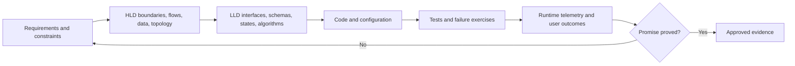
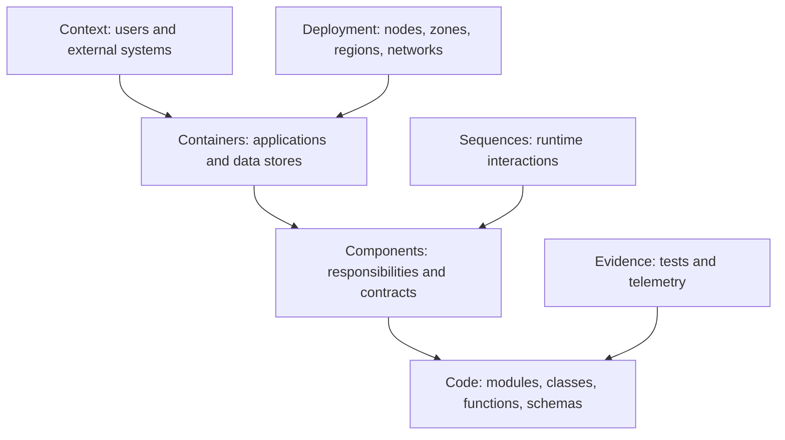
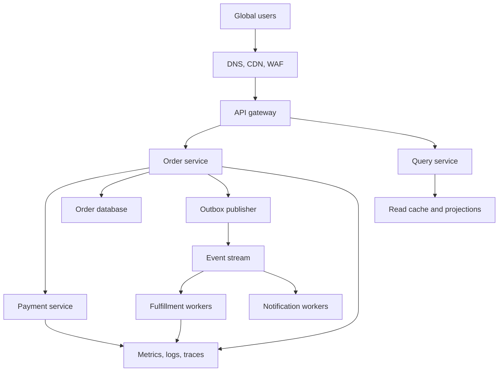
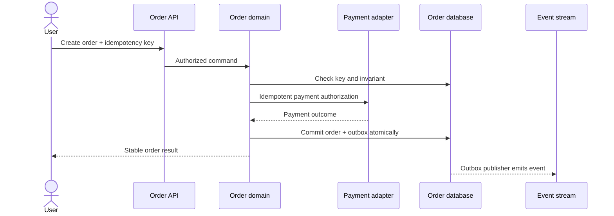
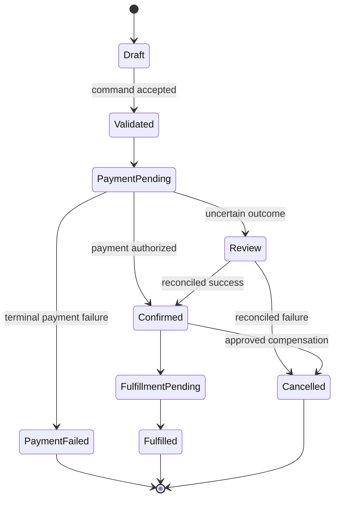
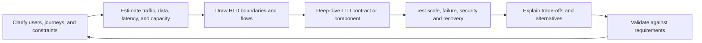

# Module 17 — System Design for DevOps/SRE

## Lesson 10: System Design Capstone and Interview Mastery

# 17.10.1 Capstone brief

Design a globally available order and fulfillment platform:

```text
10,000 peak requests/s
99.95% order-create availability
p95 API latency below 300 ms
no duplicate charge
30-minute regional RTO
5-minute RPO for non-payment metadata
tenant isolation and audit
three-year order retention
```

# 17.10.2 Required design

```text
requirements and assumptions
capacity/storage/egress estimates
context, container, and request-flow diagrams
API/idempotency contracts
data model, partitioning, consistency, migrations
cache and CDN policy
queue/event semantics and DLQ
availability/autoscaling/degradation
multi-region and DR
security/threat model
observability/SLOs/runbooks
delivery, rollback, ownership, and cost
ADRs and rejected alternatives
```

# 17.10.3 Challenge scenarios

Defend the design when:

1. A payment callback is duplicated.
2. A hot tenant creates a partition hotspot.
3. Cache fails during peak traffic.
4. Queue age grows while depth appears stable.
5. One zone is lost during deployment.
6. The primary region is partitioned, not cleanly dead.
7. A secret is compromised.
8. Cost must drop 30% without weakening the SLO.

# 17.10.4 Interview method

```text
clarify → quantify → draw → identify state
→ normal flow → scale → failure → data consistency
→ security → observability → recovery → cost → summarize tradeoffs
```

Narrate decisions. Interviewers evaluate reasoning, not the number of named products.

# 17.10.5 Rapid revision

```text
requirements before products
journeys before components
access patterns before database
deadlines before retries
idempotency before at-least-once effects
failure domains before replicas
data semantics before multi-region
operability before launch
evidence before confidence
tradeoffs before certainty
```

# 17.10.6 Graduation rubric

Score 0–3 for correctness, scalability, reliability, data reasoning, security, operability, cost, communication, and tradeoff clarity. Any zero in correctness, security, or recovery blocks graduation.

Next: Module 18 turns these reusable architecture decisions into a safe self-service internal platform.

# 17.10.7 Full capstone requirements

Design a global collaborative todo service:

```text
10 million registered users; 2 million daily active
25 operations/user/day; 12× peak-to-average
70% reads, 20% writes, 10% search/share/reminder operations
users in India, Europe, and North America
create/read P95 < 300 ms in primary market
99.95% create availability; 99.9% reminder freshness
RTO 60 minutes; RPO 5 minutes for authoritative todos
personal data residency and deletion requirements
team: 12 application + 5 platform/SRE engineers
```

State assumptions and negotiate scope before designing.

# 17.10.8 Critical journeys and invariants

At minimum:

```text
create todo -> acknowledged item must be durable/retrievable
edit todo -> idempotent retry and ordered version
share list -> unauthorized identities never gain access
reminder -> eligible reminder delivered within objective or visible failure
delete account -> data follows retention/deletion policy
```

Define good/valid events and failure/degradation behavior for each.

# 17.10.9 Estimation deliverable

Calculate:

```text
average and peak QPS by operation/region
payload/network transfer
daily/yearly authoritative and indexed data
cache working set
database write/read/connection capacity
queue event rate and backlog recovery
trace/log/metric telemetry volume
normal, rollout, one-zone, and regional recovery capacity
```

Show formulas, assumptions, sensitivity range, and redesign triggers.

# 17.10.10 High-level architecture

Your diagram should cover:

```text
client, DNS/global traffic, CDN/WAF
regional LB/gateway and Kubernetes workloads
API, cache, primary data store/read replicas/search
outbox, stream/queue, workers, notification provider
identity, keys/secrets, object storage/backups
CI/artifact/GitOps control plane
metrics/logs/traces/alerting and operations
```

Label sync/async paths, trust boundaries, source of truth, identities, protocols, regions, and owners.

# 17.10.11 API and network deep dive

Design `POST /todos`, `GET /lists/{id}/todos`, sharing, and reminder scheduling. Include auth/resource authorization, idempotency, pagination, version/conflict, status/error, deadlines/retry budget, rate/size/tenant limits, load balancing, connection draining, and regional routing.

Explain how a timeout after commit is resolved and how clients observe their own write.

# 17.10.12 Data deep dive

Choose and defend:

```text
authoritative model/store and transaction boundary
tenant/partition keys and hot-tenant strategy
indexes and search projection
single/multi-writer regional authority
consistency per journey
outbox/event contract and idempotent consumers
schema evolution and rollback compatibility
backup/restore/deletion and RTO/RPO
```

Demonstrate duplicate and out-of-order message handling.

# 17.10.13 Cache and CDN deep dive

Define which responses/assets are cacheable, cache keys including tenant/auth scope, TTL/staleness, invalidation, stampede protection, negative caching, failure fallback, memory/eviction, CDN security, and observability.

Prove no personalized content can cross users through a shared cache key.

# 17.10.14 Availability and overload deep dive

Design:

```text
replicas/topology and remaining zone capacity
autoscaling metric/lag/node/IP/quota chain
bounded queue/concurrency/connection/retry
bulkheads and per-tenant fairness
load shedding and priority
graceful-degradation matrix
health probes and rolling termination
dependency circuit/fallback
```

Load test normal, spike, dependency brownout, and zone loss during rollout.

# 17.10.15 Regional recovery deep dive

Choose a DR pattern based on RTO/RPO and data invariants. Provide a state machine for evidence, declaration, writer fencing, data promotion/restore, secondary capacity/dependencies, staged routing, integrity/SLI validation, degraded operation, reconciliation, and failback.

List every shared global dependency and what happens if it fails.

# 17.10.16 Security, observability, and operations

Deliver:

- identity/authorization and threat model;
- data classification/key/retention/deletion design;
- secure supply-chain and GitOps controls;
- metrics/log/trace schema and correlation;
- user SLOs, alerts, dashboards, runbooks;
- service ownership/on-call/incident process;
- capacity/cost and DR/restore reports;
- change, configuration, and emergency access controls.

# 17.10.17 Challenge card: viral tenant

One tenant produces 40% of writes and one list becomes a hot key. Explain detection, tenant/key isolation, quotas/fairness, partition redesign, migration, cache behavior, and contractual/product decisions without harming all users.

# 17.10.18 Challenge card: provider brownout

Identity requests become slow but do not fail cleanly. Model deadline, session/cache trust, fail-open versus fail-closed per action, circuit/load shedding, user communication, telemetry, and recovery. Never cache authorization beyond its accepted revocation risk without explicit policy.

# 17.10.19 Challenge card: queue duplicate storm

A visibility timeout is shorter than processing time, producing duplicates and database contention. Adjust lease/heartbeat, idempotent transaction, concurrency, retry/DLQ, queue-age objective, and backlog recovery. Reconcile business outcomes rather than message counts alone.

# 17.10.20 Challenge card: regional split brain

Primary appears unreachable from public traffic but remains reachable to automation. Secondary promotion risks two writers. Demonstrate independent evidence, declaration authority, identity/network/epoch fencing, data state validation, staged routing, conflict reconciliation, and safe failback.

# 17.10.21 Architecture decision records

Required ADRs:

```text
primary data store and partitioning
single-writer regional model
outbox and messaging delivery semantics
cache/CDN policy
overload and graceful degradation
DR pattern and fencing
telemetry platform and data governance
build/deploy/rollback strategy
```

Each includes context, options, decision, consequences, validation, owner, and review trigger.

# 17.10.22 Interview presentation plan

```text
minutes 0–5: clarify/scope/quality/invariants
5–10: estimate magnitude and assumptions
10–18: architecture and request/data flows
18–26: data/consistency/messaging deep dive
26–32: scale/cache/overload
32–37: failure/region/DR
37–41: security/observability/operability/cost
41–45: tradeoffs, evolution, recap
```

Adapt to interviewer signals. Deepen one critical area instead of naming every possible technology.

# 17.10.23 Evaluation rubric

Score 0–3 for requirements, estimation, APIs/network, data/consistency, async processing, caching, scale/resilience, regional DR, security, observability/operations, cost, and communication.

```text
0 absent
1 generic product list
2 requirement-driven design with failure behavior
3 quantified tradeoffs, validation, security, operations, and evolution
```

# 17.10.24 Certification completion strategy

Map the capstone to current cloud-architecture certification domains, but verify official objectives and services at preparation time. Use the Well-Architected pillars as review lenses, not memorized answers.

For each domain, retain one diagram, ADR, calculation, failure test, and recovery/security proof. Practice explaining a provider-neutral concept first, then one provider implementation.

# 17.10.25 Interview rapid questions

**Where do you start?**  Users, critical journeys/invariants, measurable qualities, scale, data/security, constraints, scope.

**How do you choose SQL or NoSQL?**  Access patterns, invariants/transactions, consistency, partitions/scale, recovery, operations—not labels.

**When add a queue?**  When asynchronous decoupling, burst buffering, or fan-out justifies delay/duplicate/backlog complexity.

**How do you prevent cache leaks?**  Correct trusted key variation plus authorization on every path, conservative shared caching, and cross-user tests.

**How do you handle overload?**  Deadlines, bounded queues/concurrency/retries, priority/fairness, load shedding, degradation, and recovery capacity.

**How do you prove multi-region?**  Game-day the data, fencing, dependencies, capacity, routing, integrity, RTO/RPO, and failback.

**How do you control cost?**  Estimate/attribute demand, set budgets/limits, remove waste, right-size by evidence, tier reliability/retention, and preserve objectives.

# 17.10.26 Final mastery checklist

```text
□ Requirements are measurable and conflicts decided
□ Scale estimates include failure and recovery
□ API retries/mutations are safe and bounded
□ Data invariants/consistency/partition/migration are explicit
□ Cache keys/freshness/failure protect correctness and privacy
□ Messages tolerate duplicates, order, backlog, replay
□ Scaling preserves dependencies and critical work
□ Regional failover fences writers and validates integrity
□ Security, telemetry, delivery, recovery, and cost are designed in
□ ADRs preserve why and when to revisit
□ Failure tests validate claims
□ Explanation leads with user tradeoffs, not product names
```

**Never-forget answer:** a strong system design is a chain of traceable decisions from user outcome to data, capacity, failure, security, operations, cost, and evidence.

<!-- GENERATED-MASTERY-WORKBOOK:START -->

# 17.10.27 Professional Mastery Workbook

This workbook expands **System Design Capstone and Interview Mastery** into deliberate practice without replacing the authored tutorial above.

Use it after reading the core explanation. The goal is not to memorize thousands of lines; the goal is to repeatedly explain, build, break, secure, observe, recover, and defend the lesson in different conditions.

## Workbook learning contract

- Concepts covered: 26 lesson-specific anchors.
- Progression: beginner, intermediate, expert, professional, industry-ready, certification review, and interview defense.
- Safety: use synthetic data, disposable resources, explicit placeholders, least privilege, and bounded failure experiments.
- Completion: retain commands or configuration, observations, screenshots or query output, decisions, rollback evidence, and a short reflection.
- Quality rule: a passing answer states assumptions, protects a user or business outcome, names ownership, and validates the final result end to end.
- Currency rule: verify current official documentation, versions, limits, pricing, and certification objectives before relying on changing product behavior.

## Seven-stage progression

| Stage | Learner must demonstrate |
|---|---|
| Beginner | Explain the concept in plain language and give one safe example. |
| Intermediate | Connect components, data, control flow, and normal operating behavior. |
| Expert | Analyze trade-offs, edge cases, scaling pressure, and correlated failures. |
| Professional | Make a reviewed decision with owner, evidence, rollout, and rollback. |
| Industry-ready | Operate the design under security, failure, recovery, cost, and compliance constraints. |
| Certification review | Map durable concepts to the latest official objectives without relying on stale wording. |
| Interview defense | Answer concisely, clarify assumptions, draw the model, and defend alternatives. |

## Concept mastery cards

### Concept card 1 - Capstone brief

- Lesson anchor: Design a globally available order and fulfillment platform: 10,000 peak requests/s 99.95% order-create availability p95 API latency below 300 ms no duplicate charge 30-minute regional RTO 5-minute RPO for non-payment metadata
- Beginner explanation: Restate **Capstone brief** using a household, workplace, or public-service analogy without hiding the technical truth.
- Terminology check: Define every important noun, state, actor, and boundary before using abbreviations.
- Concrete example: Apply **Capstone brief** to a small todo, checkout, or platform service and name the expected outcome.
- Intermediate connection: Draw the request, data, identity, and control flow that reaches this concept.
- Trade-off question: Compare at least two valid alternatives and state when each becomes the better choice.
- Expert edge case: Describe concurrency, retry, partial failure, scale, or stale-state behavior that a happy-path explanation misses.
- Hands-on artifact: Produce a requirement, invariant, and architecture decision record focused on **Capstone brief**.
- Failure exercise: In an isolated environment, introduce a timeout and retry amplification path while observing the boundaries around **Capstone brief**.
- Security review: Identify identity, authorization, sensitive-data, supply-chain, and abuse assumptions.
- Reliability review: Define the user-visible failure, containment, degraded mode, recovery, and final validation.
- Performance and cost review: Name the load driver, capacity limit, useful unit, and waste or amplification risk.
- Observability review: Specify the metric, structured event, trace boundary, change marker, and missing-data behavior.
- Professional decision: Record context, options, decision, consequences, owner, evidence, and revisit trigger.
- Certification checkpoint: Map the design evidence to the current cloud architecture, DevOps, or Kubernetes objectives and defend the trade-off provider-neutrally.
- Interview prompt: Explain **Capstone brief** first in 30 seconds, then defend it in a five-minute system scenario.
- Strong-answer rubric: lead with outcome, state assumptions, explain mechanism, discuss failure and security, then validate with evidence.
- Completion evidence: retain the artifact, commands or query, observed failure, safe recovery, and one improvement.

### Concept card 2 - Required design

- Lesson anchor: requirements and assumptions capacity/storage/egress estimates context, container, and request-flow diagrams API/idempotency contracts data model, partitioning, consistency, migrations cache and CDN policy queue/event semantics and DLQ
- Beginner explanation: Restate **Required design** using a household, workplace, or public-service analogy without hiding the technical truth.
- Terminology check: Define every important noun, state, actor, and boundary before using abbreviations.
- Concrete example: Apply **Required design** to a small todo, checkout, or platform service and name the expected outcome.
- Intermediate connection: Draw the request, data, identity, and control flow that reaches this concept.
- Trade-off question: Compare at least two valid alternatives and state when each becomes the better choice.
- Expert edge case: Describe concurrency, retry, partial failure, scale, or stale-state behavior that a happy-path explanation misses.
- Hands-on artifact: Produce a capacity, latency, storage, and bandwidth calculation focused on **Required design**.
- Failure exercise: In an isolated environment, create a hot key, partition, cache, or queue condition while observing the boundaries around **Required design**.
- Security review: Identify identity, authorization, sensitive-data, supply-chain, and abuse assumptions.
- Reliability review: Define the user-visible failure, containment, degraded mode, recovery, and final validation.
- Performance and cost review: Name the load driver, capacity limit, useful unit, and waste or amplification risk.
- Observability review: Specify the metric, structured event, trace boundary, change marker, and missing-data behavior.
- Professional decision: Record context, options, decision, consequences, owner, evidence, and revisit trigger.
- Certification checkpoint: Map the design evidence to the current cloud architecture, DevOps, or Kubernetes objectives and defend the trade-off provider-neutrally.
- Interview prompt: Explain **Required design** first in 30 seconds, then defend it in a five-minute system scenario.
- Strong-answer rubric: lead with outcome, state assumptions, explain mechanism, discuss failure and security, then validate with evidence.
- Completion evidence: retain the artifact, commands or query, observed failure, safe recovery, and one improvement.

### Concept card 3 - Challenge scenarios

- Lesson anchor: Defend the design when:
- Beginner explanation: Restate **Challenge scenarios** using a household, workplace, or public-service analogy without hiding the technical truth.
- Terminology check: Define every important noun, state, actor, and boundary before using abbreviations.
- Concrete example: Apply **Challenge scenarios** to a small todo, checkout, or platform service and name the expected outcome.
- Intermediate connection: Draw the request, data, identity, and control flow that reaches this concept.
- Trade-off question: Compare at least two valid alternatives and state when each becomes the better choice.
- Expert edge case: Describe concurrency, retry, partial failure, scale, or stale-state behavior that a happy-path explanation misses.
- Hands-on artifact: Produce an API, data, or event contract with failure semantics focused on **Challenge scenarios**.
- Failure exercise: In an isolated environment, remove a shared dependency or one failure domain while observing the boundaries around **Challenge scenarios**.
- Security review: Identify identity, authorization, sensitive-data, supply-chain, and abuse assumptions.
- Reliability review: Define the user-visible failure, containment, degraded mode, recovery, and final validation.
- Performance and cost review: Name the load driver, capacity limit, useful unit, and waste or amplification risk.
- Observability review: Specify the metric, structured event, trace boundary, change marker, and missing-data behavior.
- Professional decision: Record context, options, decision, consequences, owner, evidence, and revisit trigger.
- Certification checkpoint: Map the design evidence to the current cloud architecture, DevOps, or Kubernetes objectives and defend the trade-off provider-neutrally.
- Interview prompt: Explain **Challenge scenarios** first in 30 seconds, then defend it in a five-minute system scenario.
- Strong-answer rubric: lead with outcome, state assumptions, explain mechanism, discuss failure and security, then validate with evidence.
- Completion evidence: retain the artifact, commands or query, observed failure, safe recovery, and one improvement.

### Concept card 4 - Interview method

- Lesson anchor: clarify → quantify → draw → identify state → normal flow → scale → failure → data consistency → security → observability → recovery → cost → summarize tradeoffs Narrate decisions. Interviewers evaluate reasoning, not the number of named products.
- Beginner explanation: Restate **Interview method** using a household, workplace, or public-service analogy without hiding the technical truth.
- Terminology check: Define every important noun, state, actor, and boundary before using abbreviations.
- Concrete example: Apply **Interview method** to a small todo, checkout, or platform service and name the expected outcome.
- Intermediate connection: Draw the request, data, identity, and control flow that reaches this concept.
- Trade-off question: Compare at least two valid alternatives and state when each becomes the better choice.
- Expert edge case: Describe concurrency, retry, partial failure, scale, or stale-state behavior that a happy-path explanation misses.
- Hands-on artifact: Produce a context, data-flow, trust, and failure-domain diagram focused on **Interview method**.
- Failure exercise: In an isolated environment, make data arrive duplicated, late, or out of order while observing the boundaries around **Interview method**.
- Security review: Identify identity, authorization, sensitive-data, supply-chain, and abuse assumptions.
- Reliability review: Define the user-visible failure, containment, degraded mode, recovery, and final validation.
- Performance and cost review: Name the load driver, capacity limit, useful unit, and waste or amplification risk.
- Observability review: Specify the metric, structured event, trace boundary, change marker, and missing-data behavior.
- Professional decision: Record context, options, decision, consequences, owner, evidence, and revisit trigger.
- Certification checkpoint: Map the design evidence to the current cloud architecture, DevOps, or Kubernetes objectives and defend the trade-off provider-neutrally.
- Interview prompt: Explain **Interview method** first in 30 seconds, then defend it in a five-minute system scenario.
- Strong-answer rubric: lead with outcome, state assumptions, explain mechanism, discuss failure and security, then validate with evidence.
- Completion evidence: retain the artifact, commands or query, observed failure, safe recovery, and one improvement.

### Concept card 5 - Rapid revision

- Lesson anchor: requirements before products journeys before components access patterns before database deadlines before retries idempotency before at-least-once effects failure domains before replicas data semantics before multi-region
- Beginner explanation: Restate **Rapid revision** using a household, workplace, or public-service analogy without hiding the technical truth.
- Terminology check: Define every important noun, state, actor, and boundary before using abbreviations.
- Concrete example: Apply **Rapid revision** to a small todo, checkout, or platform service and name the expected outcome.
- Intermediate connection: Draw the request, data, identity, and control flow that reaches this concept.
- Trade-off question: Compare at least two valid alternatives and state when each becomes the better choice.
- Expert edge case: Describe concurrency, retry, partial failure, scale, or stale-state behavior that a happy-path explanation misses.
- Hands-on artifact: Produce a load-test and graceful-degradation report focused on **Rapid revision**.
- Failure exercise: In an isolated environment, overload the system beyond its modeled queueing knee while observing the boundaries around **Rapid revision**.
- Security review: Identify identity, authorization, sensitive-data, supply-chain, and abuse assumptions.
- Reliability review: Define the user-visible failure, containment, degraded mode, recovery, and final validation.
- Performance and cost review: Name the load driver, capacity limit, useful unit, and waste or amplification risk.
- Observability review: Specify the metric, structured event, trace boundary, change marker, and missing-data behavior.
- Professional decision: Record context, options, decision, consequences, owner, evidence, and revisit trigger.
- Certification checkpoint: Map the design evidence to the current cloud architecture, DevOps, or Kubernetes objectives and defend the trade-off provider-neutrally.
- Interview prompt: Explain **Rapid revision** first in 30 seconds, then defend it in a five-minute system scenario.
- Strong-answer rubric: lead with outcome, state assumptions, explain mechanism, discuss failure and security, then validate with evidence.
- Completion evidence: retain the artifact, commands or query, observed failure, safe recovery, and one improvement.

### Concept card 6 - Graduation rubric

- Lesson anchor: Score 0–3 for correctness, scalability, reliability, data reasoning, security, operability, cost, communication, and tradeoff clarity. Any zero in correctness, security, or recovery blocks graduation. Next: Module 18 turns these reusable architecture decisi...
- Beginner explanation: Restate **Graduation rubric** using a household, workplace, or public-service analogy without hiding the technical truth.
- Terminology check: Define every important noun, state, actor, and boundary before using abbreviations.
- Concrete example: Apply **Graduation rubric** to a small todo, checkout, or platform service and name the expected outcome.
- Intermediate connection: Draw the request, data, identity, and control flow that reaches this concept.
- Trade-off question: Compare at least two valid alternatives and state when each becomes the better choice.
- Expert edge case: Describe concurrency, retry, partial failure, scale, or stale-state behavior that a happy-path explanation misses.
- Hands-on artifact: Produce a multi-region failover and failback state machine focused on **Graduation rubric**.
- Failure exercise: In an isolated environment, make a regional writer or routing decision ambiguous while observing the boundaries around **Graduation rubric**.
- Security review: Identify identity, authorization, sensitive-data, supply-chain, and abuse assumptions.
- Reliability review: Define the user-visible failure, containment, degraded mode, recovery, and final validation.
- Performance and cost review: Name the load driver, capacity limit, useful unit, and waste or amplification risk.
- Observability review: Specify the metric, structured event, trace boundary, change marker, and missing-data behavior.
- Professional decision: Record context, options, decision, consequences, owner, evidence, and revisit trigger.
- Certification checkpoint: Map the design evidence to the current cloud architecture, DevOps, or Kubernetes objectives and defend the trade-off provider-neutrally.
- Interview prompt: Explain **Graduation rubric** first in 30 seconds, then defend it in a five-minute system scenario.
- Strong-answer rubric: lead with outcome, state assumptions, explain mechanism, discuss failure and security, then validate with evidence.
- Completion evidence: retain the artifact, commands or query, observed failure, safe recovery, and one improvement.

### Concept card 7 - Full capstone requirements

- Lesson anchor: Design a global collaborative todo service: 10 million registered users; 2 million daily active 25 operations/user/day; 12× peak-to-average 70% reads, 20% writes, 10% search/share/reminder operations users in India, Europe, and North America
- Beginner explanation: Restate **Full capstone requirements** using a household, workplace, or public-service analogy without hiding the technical truth.
- Terminology check: Define every important noun, state, actor, and boundary before using abbreviations.
- Concrete example: Apply **Full capstone requirements** to a small todo, checkout, or platform service and name the expected outcome.
- Intermediate connection: Draw the request, data, identity, and control flow that reaches this concept.
- Trade-off question: Compare at least two valid alternatives and state when each becomes the better choice.
- Expert edge case: Describe concurrency, retry, partial failure, scale, or stale-state behavior that a happy-path explanation misses.
- Hands-on artifact: Produce a requirement, invariant, and architecture decision record focused on **Full capstone requirements**.
- Failure exercise: In an isolated environment, introduce a timeout and retry amplification path while observing the boundaries around **Full capstone requirements**.
- Security review: Identify identity, authorization, sensitive-data, supply-chain, and abuse assumptions.
- Reliability review: Define the user-visible failure, containment, degraded mode, recovery, and final validation.
- Performance and cost review: Name the load driver, capacity limit, useful unit, and waste or amplification risk.
- Observability review: Specify the metric, structured event, trace boundary, change marker, and missing-data behavior.
- Professional decision: Record context, options, decision, consequences, owner, evidence, and revisit trigger.
- Certification checkpoint: Map the design evidence to the current cloud architecture, DevOps, or Kubernetes objectives and defend the trade-off provider-neutrally.
- Interview prompt: Explain **Full capstone requirements** first in 30 seconds, then defend it in a five-minute system scenario.
- Strong-answer rubric: lead with outcome, state assumptions, explain mechanism, discuss failure and security, then validate with evidence.
- Completion evidence: retain the artifact, commands or query, observed failure, safe recovery, and one improvement.

### Concept card 8 - Critical journeys and invariants

- Lesson anchor: At minimum: create todo - acknowledged item must be durable/retrievable edit todo - idempotent retry and ordered version share list - unauthorized identities never gain access reminder - eligible reminder delivered within objective or visible failure
- Beginner explanation: Restate **Critical journeys and invariants** using a household, workplace, or public-service analogy without hiding the technical truth.
- Terminology check: Define every important noun, state, actor, and boundary before using abbreviations.
- Concrete example: Apply **Critical journeys and invariants** to a small todo, checkout, or platform service and name the expected outcome.
- Intermediate connection: Draw the request, data, identity, and control flow that reaches this concept.
- Trade-off question: Compare at least two valid alternatives and state when each becomes the better choice.
- Expert edge case: Describe concurrency, retry, partial failure, scale, or stale-state behavior that a happy-path explanation misses.
- Hands-on artifact: Produce a capacity, latency, storage, and bandwidth calculation focused on **Critical journeys and invariants**.
- Failure exercise: In an isolated environment, create a hot key, partition, cache, or queue condition while observing the boundaries around **Critical journeys and invariants**.
- Security review: Identify identity, authorization, sensitive-data, supply-chain, and abuse assumptions.
- Reliability review: Define the user-visible failure, containment, degraded mode, recovery, and final validation.
- Performance and cost review: Name the load driver, capacity limit, useful unit, and waste or amplification risk.
- Observability review: Specify the metric, structured event, trace boundary, change marker, and missing-data behavior.
- Professional decision: Record context, options, decision, consequences, owner, evidence, and revisit trigger.
- Certification checkpoint: Map the design evidence to the current cloud architecture, DevOps, or Kubernetes objectives and defend the trade-off provider-neutrally.
- Interview prompt: Explain **Critical journeys and invariants** first in 30 seconds, then defend it in a five-minute system scenario.
- Strong-answer rubric: lead with outcome, state assumptions, explain mechanism, discuss failure and security, then validate with evidence.
- Completion evidence: retain the artifact, commands or query, observed failure, safe recovery, and one improvement.

### Concept card 9 - Estimation deliverable

- Lesson anchor: Calculate: average and peak QPS by operation/region payload/network transfer daily/yearly authoritative and indexed data cache working set database write/read/connection capacity queue event rate and backlog recovery trace/log/metric telemetry volume
- Beginner explanation: Restate **Estimation deliverable** using a household, workplace, or public-service analogy without hiding the technical truth.
- Terminology check: Define every important noun, state, actor, and boundary before using abbreviations.
- Concrete example: Apply **Estimation deliverable** to a small todo, checkout, or platform service and name the expected outcome.
- Intermediate connection: Draw the request, data, identity, and control flow that reaches this concept.
- Trade-off question: Compare at least two valid alternatives and state when each becomes the better choice.
- Expert edge case: Describe concurrency, retry, partial failure, scale, or stale-state behavior that a happy-path explanation misses.
- Hands-on artifact: Produce an API, data, or event contract with failure semantics focused on **Estimation deliverable**.
- Failure exercise: In an isolated environment, remove a shared dependency or one failure domain while observing the boundaries around **Estimation deliverable**.
- Security review: Identify identity, authorization, sensitive-data, supply-chain, and abuse assumptions.
- Reliability review: Define the user-visible failure, containment, degraded mode, recovery, and final validation.
- Performance and cost review: Name the load driver, capacity limit, useful unit, and waste or amplification risk.
- Observability review: Specify the metric, structured event, trace boundary, change marker, and missing-data behavior.
- Professional decision: Record context, options, decision, consequences, owner, evidence, and revisit trigger.
- Certification checkpoint: Map the design evidence to the current cloud architecture, DevOps, or Kubernetes objectives and defend the trade-off provider-neutrally.
- Interview prompt: Explain **Estimation deliverable** first in 30 seconds, then defend it in a five-minute system scenario.
- Strong-answer rubric: lead with outcome, state assumptions, explain mechanism, discuss failure and security, then validate with evidence.
- Completion evidence: retain the artifact, commands or query, observed failure, safe recovery, and one improvement.

### Concept card 10 - High-level architecture

- Lesson anchor: Your diagram should cover: client, DNS/global traffic, CDN/WAF regional LB/gateway and Kubernetes workloads API, cache, primary data store/read replicas/search outbox, stream/queue, workers, notification provider identity, keys/secrets, object storage/backups
- Beginner explanation: Restate **High-level architecture** using a household, workplace, or public-service analogy without hiding the technical truth.
- Terminology check: Define every important noun, state, actor, and boundary before using abbreviations.
- Concrete example: Apply **High-level architecture** to a small todo, checkout, or platform service and name the expected outcome.
- Intermediate connection: Draw the request, data, identity, and control flow that reaches this concept.
- Trade-off question: Compare at least two valid alternatives and state when each becomes the better choice.
- Expert edge case: Describe concurrency, retry, partial failure, scale, or stale-state behavior that a happy-path explanation misses.
- Hands-on artifact: Produce a context, data-flow, trust, and failure-domain diagram focused on **High-level architecture**.
- Failure exercise: In an isolated environment, make data arrive duplicated, late, or out of order while observing the boundaries around **High-level architecture**.
- Security review: Identify identity, authorization, sensitive-data, supply-chain, and abuse assumptions.
- Reliability review: Define the user-visible failure, containment, degraded mode, recovery, and final validation.
- Performance and cost review: Name the load driver, capacity limit, useful unit, and waste or amplification risk.
- Observability review: Specify the metric, structured event, trace boundary, change marker, and missing-data behavior.
- Professional decision: Record context, options, decision, consequences, owner, evidence, and revisit trigger.
- Certification checkpoint: Map the design evidence to the current cloud architecture, DevOps, or Kubernetes objectives and defend the trade-off provider-neutrally.
- Interview prompt: Explain **High-level architecture** first in 30 seconds, then defend it in a five-minute system scenario.
- Strong-answer rubric: lead with outcome, state assumptions, explain mechanism, discuss failure and security, then validate with evidence.
- Completion evidence: retain the artifact, commands or query, observed failure, safe recovery, and one improvement.

### Concept card 11 - API and network deep dive

- Lesson anchor: Design POST /todos, GET /lists/{id}/todos, sharing, and reminder scheduling. Include auth/resource authorization, idempotency, pagination, version/conflict, status/error, deadlines/retry budget, rate/size/tenant limits, load balancing, connection draining,...
- Beginner explanation: Restate **API and network deep dive** using a household, workplace, or public-service analogy without hiding the technical truth.
- Terminology check: Define every important noun, state, actor, and boundary before using abbreviations.
- Concrete example: Apply **API and network deep dive** to a small todo, checkout, or platform service and name the expected outcome.
- Intermediate connection: Draw the request, data, identity, and control flow that reaches this concept.
- Trade-off question: Compare at least two valid alternatives and state when each becomes the better choice.
- Expert edge case: Describe concurrency, retry, partial failure, scale, or stale-state behavior that a happy-path explanation misses.
- Hands-on artifact: Produce a load-test and graceful-degradation report focused on **API and network deep dive**.
- Failure exercise: In an isolated environment, overload the system beyond its modeled queueing knee while observing the boundaries around **API and network deep dive**.
- Security review: Identify identity, authorization, sensitive-data, supply-chain, and abuse assumptions.
- Reliability review: Define the user-visible failure, containment, degraded mode, recovery, and final validation.
- Performance and cost review: Name the load driver, capacity limit, useful unit, and waste or amplification risk.
- Observability review: Specify the metric, structured event, trace boundary, change marker, and missing-data behavior.
- Professional decision: Record context, options, decision, consequences, owner, evidence, and revisit trigger.
- Certification checkpoint: Map the design evidence to the current cloud architecture, DevOps, or Kubernetes objectives and defend the trade-off provider-neutrally.
- Interview prompt: Explain **API and network deep dive** first in 30 seconds, then defend it in a five-minute system scenario.
- Strong-answer rubric: lead with outcome, state assumptions, explain mechanism, discuss failure and security, then validate with evidence.
- Completion evidence: retain the artifact, commands or query, observed failure, safe recovery, and one improvement.

### Concept card 12 - Data deep dive

- Lesson anchor: Choose and defend: authoritative model/store and transaction boundary tenant/partition keys and hot-tenant strategy indexes and search projection single/multi-writer regional authority consistency per journey outbox/event contract and idempotent consumers
- Beginner explanation: Restate **Data deep dive** using a household, workplace, or public-service analogy without hiding the technical truth.
- Terminology check: Define every important noun, state, actor, and boundary before using abbreviations.
- Concrete example: Apply **Data deep dive** to a small todo, checkout, or platform service and name the expected outcome.
- Intermediate connection: Draw the request, data, identity, and control flow that reaches this concept.
- Trade-off question: Compare at least two valid alternatives and state when each becomes the better choice.
- Expert edge case: Describe concurrency, retry, partial failure, scale, or stale-state behavior that a happy-path explanation misses.
- Hands-on artifact: Produce a multi-region failover and failback state machine focused on **Data deep dive**.
- Failure exercise: In an isolated environment, make a regional writer or routing decision ambiguous while observing the boundaries around **Data deep dive**.
- Security review: Identify identity, authorization, sensitive-data, supply-chain, and abuse assumptions.
- Reliability review: Define the user-visible failure, containment, degraded mode, recovery, and final validation.
- Performance and cost review: Name the load driver, capacity limit, useful unit, and waste or amplification risk.
- Observability review: Specify the metric, structured event, trace boundary, change marker, and missing-data behavior.
- Professional decision: Record context, options, decision, consequences, owner, evidence, and revisit trigger.
- Certification checkpoint: Map the design evidence to the current cloud architecture, DevOps, or Kubernetes objectives and defend the trade-off provider-neutrally.
- Interview prompt: Explain **Data deep dive** first in 30 seconds, then defend it in a five-minute system scenario.
- Strong-answer rubric: lead with outcome, state assumptions, explain mechanism, discuss failure and security, then validate with evidence.
- Completion evidence: retain the artifact, commands or query, observed failure, safe recovery, and one improvement.

### Concept card 13 - Cache and CDN deep dive

- Lesson anchor: Define which responses/assets are cacheable, cache keys including tenant/auth scope, TTL/staleness, invalidation, stampede protection, negative caching, failure fallback, memory/eviction, CDN security, and observability.
- Beginner explanation: Restate **Cache and CDN deep dive** using a household, workplace, or public-service analogy without hiding the technical truth.
- Terminology check: Define every important noun, state, actor, and boundary before using abbreviations.
- Concrete example: Apply **Cache and CDN deep dive** to a small todo, checkout, or platform service and name the expected outcome.
- Intermediate connection: Draw the request, data, identity, and control flow that reaches this concept.
- Trade-off question: Compare at least two valid alternatives and state when each becomes the better choice.
- Expert edge case: Describe concurrency, retry, partial failure, scale, or stale-state behavior that a happy-path explanation misses.
- Hands-on artifact: Produce a requirement, invariant, and architecture decision record focused on **Cache and CDN deep dive**.
- Failure exercise: In an isolated environment, introduce a timeout and retry amplification path while observing the boundaries around **Cache and CDN deep dive**.
- Security review: Identify identity, authorization, sensitive-data, supply-chain, and abuse assumptions.
- Reliability review: Define the user-visible failure, containment, degraded mode, recovery, and final validation.
- Performance and cost review: Name the load driver, capacity limit, useful unit, and waste or amplification risk.
- Observability review: Specify the metric, structured event, trace boundary, change marker, and missing-data behavior.
- Professional decision: Record context, options, decision, consequences, owner, evidence, and revisit trigger.
- Certification checkpoint: Map the design evidence to the current cloud architecture, DevOps, or Kubernetes objectives and defend the trade-off provider-neutrally.
- Interview prompt: Explain **Cache and CDN deep dive** first in 30 seconds, then defend it in a five-minute system scenario.
- Strong-answer rubric: lead with outcome, state assumptions, explain mechanism, discuss failure and security, then validate with evidence.
- Completion evidence: retain the artifact, commands or query, observed failure, safe recovery, and one improvement.

### Concept card 14 - Availability and overload deep dive

- Lesson anchor: Design: replicas/topology and remaining zone capacity autoscaling metric/lag/node/IP/quota chain bounded queue/concurrency/connection/retry bulkheads and per-tenant fairness load shedding and priority graceful-degradation matrix
- Beginner explanation: Restate **Availability and overload deep dive** using a household, workplace, or public-service analogy without hiding the technical truth.
- Terminology check: Define every important noun, state, actor, and boundary before using abbreviations.
- Concrete example: Apply **Availability and overload deep dive** to a small todo, checkout, or platform service and name the expected outcome.
- Intermediate connection: Draw the request, data, identity, and control flow that reaches this concept.
- Trade-off question: Compare at least two valid alternatives and state when each becomes the better choice.
- Expert edge case: Describe concurrency, retry, partial failure, scale, or stale-state behavior that a happy-path explanation misses.
- Hands-on artifact: Produce a capacity, latency, storage, and bandwidth calculation focused on **Availability and overload deep dive**.
- Failure exercise: In an isolated environment, create a hot key, partition, cache, or queue condition while observing the boundaries around **Availability and overload deep dive**.
- Security review: Identify identity, authorization, sensitive-data, supply-chain, and abuse assumptions.
- Reliability review: Define the user-visible failure, containment, degraded mode, recovery, and final validation.
- Performance and cost review: Name the load driver, capacity limit, useful unit, and waste or amplification risk.
- Observability review: Specify the metric, structured event, trace boundary, change marker, and missing-data behavior.
- Professional decision: Record context, options, decision, consequences, owner, evidence, and revisit trigger.
- Certification checkpoint: Map the design evidence to the current cloud architecture, DevOps, or Kubernetes objectives and defend the trade-off provider-neutrally.
- Interview prompt: Explain **Availability and overload deep dive** first in 30 seconds, then defend it in a five-minute system scenario.
- Strong-answer rubric: lead with outcome, state assumptions, explain mechanism, discuss failure and security, then validate with evidence.
- Completion evidence: retain the artifact, commands or query, observed failure, safe recovery, and one improvement.

### Concept card 15 - Regional recovery deep dive

- Lesson anchor: Choose a DR pattern based on RTO/RPO and data invariants. Provide a state machine for evidence, declaration, writer fencing, data promotion/restore, secondary capacity/dependencies, staged routing, integrity/SLI validation, degraded operation, reconciliatio...
- Beginner explanation: Restate **Regional recovery deep dive** using a household, workplace, or public-service analogy without hiding the technical truth.
- Terminology check: Define every important noun, state, actor, and boundary before using abbreviations.
- Concrete example: Apply **Regional recovery deep dive** to a small todo, checkout, or platform service and name the expected outcome.
- Intermediate connection: Draw the request, data, identity, and control flow that reaches this concept.
- Trade-off question: Compare at least two valid alternatives and state when each becomes the better choice.
- Expert edge case: Describe concurrency, retry, partial failure, scale, or stale-state behavior that a happy-path explanation misses.
- Hands-on artifact: Produce an API, data, or event contract with failure semantics focused on **Regional recovery deep dive**.
- Failure exercise: In an isolated environment, remove a shared dependency or one failure domain while observing the boundaries around **Regional recovery deep dive**.
- Security review: Identify identity, authorization, sensitive-data, supply-chain, and abuse assumptions.
- Reliability review: Define the user-visible failure, containment, degraded mode, recovery, and final validation.
- Performance and cost review: Name the load driver, capacity limit, useful unit, and waste or amplification risk.
- Observability review: Specify the metric, structured event, trace boundary, change marker, and missing-data behavior.
- Professional decision: Record context, options, decision, consequences, owner, evidence, and revisit trigger.
- Certification checkpoint: Map the design evidence to the current cloud architecture, DevOps, or Kubernetes objectives and defend the trade-off provider-neutrally.
- Interview prompt: Explain **Regional recovery deep dive** first in 30 seconds, then defend it in a five-minute system scenario.
- Strong-answer rubric: lead with outcome, state assumptions, explain mechanism, discuss failure and security, then validate with evidence.
- Completion evidence: retain the artifact, commands or query, observed failure, safe recovery, and one improvement.

### Concept card 16 - Security, observability, and operations

- Lesson anchor: Deliver:
- Beginner explanation: Restate **Security, observability, and operations** using a household, workplace, or public-service analogy without hiding the technical truth.
- Terminology check: Define every important noun, state, actor, and boundary before using abbreviations.
- Concrete example: Apply **Security, observability, and operations** to a small todo, checkout, or platform service and name the expected outcome.
- Intermediate connection: Draw the request, data, identity, and control flow that reaches this concept.
- Trade-off question: Compare at least two valid alternatives and state when each becomes the better choice.
- Expert edge case: Describe concurrency, retry, partial failure, scale, or stale-state behavior that a happy-path explanation misses.
- Hands-on artifact: Produce a context, data-flow, trust, and failure-domain diagram focused on **Security, observability, and operations**.
- Failure exercise: In an isolated environment, make data arrive duplicated, late, or out of order while observing the boundaries around **Security, observability, and operations**.
- Security review: Identify identity, authorization, sensitive-data, supply-chain, and abuse assumptions.
- Reliability review: Define the user-visible failure, containment, degraded mode, recovery, and final validation.
- Performance and cost review: Name the load driver, capacity limit, useful unit, and waste or amplification risk.
- Observability review: Specify the metric, structured event, trace boundary, change marker, and missing-data behavior.
- Professional decision: Record context, options, decision, consequences, owner, evidence, and revisit trigger.
- Certification checkpoint: Map the design evidence to the current cloud architecture, DevOps, or Kubernetes objectives and defend the trade-off provider-neutrally.
- Interview prompt: Explain **Security, observability, and operations** first in 30 seconds, then defend it in a five-minute system scenario.
- Strong-answer rubric: lead with outcome, state assumptions, explain mechanism, discuss failure and security, then validate with evidence.
- Completion evidence: retain the artifact, commands or query, observed failure, safe recovery, and one improvement.

### Concept card 17 - Challenge card: viral tenant

- Lesson anchor: One tenant produces 40% of writes and one list becomes a hot key. Explain detection, tenant/key isolation, quotas/fairness, partition redesign, migration, cache behavior, and contractual/product decisions without harming all users.
- Beginner explanation: Restate **Challenge card: viral tenant** using a household, workplace, or public-service analogy without hiding the technical truth.
- Terminology check: Define every important noun, state, actor, and boundary before using abbreviations.
- Concrete example: Apply **Challenge card: viral tenant** to a small todo, checkout, or platform service and name the expected outcome.
- Intermediate connection: Draw the request, data, identity, and control flow that reaches this concept.
- Trade-off question: Compare at least two valid alternatives and state when each becomes the better choice.
- Expert edge case: Describe concurrency, retry, partial failure, scale, or stale-state behavior that a happy-path explanation misses.
- Hands-on artifact: Produce a load-test and graceful-degradation report focused on **Challenge card: viral tenant**.
- Failure exercise: In an isolated environment, overload the system beyond its modeled queueing knee while observing the boundaries around **Challenge card: viral tenant**.
- Security review: Identify identity, authorization, sensitive-data, supply-chain, and abuse assumptions.
- Reliability review: Define the user-visible failure, containment, degraded mode, recovery, and final validation.
- Performance and cost review: Name the load driver, capacity limit, useful unit, and waste or amplification risk.
- Observability review: Specify the metric, structured event, trace boundary, change marker, and missing-data behavior.
- Professional decision: Record context, options, decision, consequences, owner, evidence, and revisit trigger.
- Certification checkpoint: Map the design evidence to the current cloud architecture, DevOps, or Kubernetes objectives and defend the trade-off provider-neutrally.
- Interview prompt: Explain **Challenge card: viral tenant** first in 30 seconds, then defend it in a five-minute system scenario.
- Strong-answer rubric: lead with outcome, state assumptions, explain mechanism, discuss failure and security, then validate with evidence.
- Completion evidence: retain the artifact, commands or query, observed failure, safe recovery, and one improvement.

### Concept card 18 - Challenge card: provider brownout

- Lesson anchor: Identity requests become slow but do not fail cleanly. Model deadline, session/cache trust, fail-open versus fail-closed per action, circuit/load shedding, user communication, telemetry, and recovery. Never cache authorization beyond its accepted revocation...
- Beginner explanation: Restate **Challenge card: provider brownout** using a household, workplace, or public-service analogy without hiding the technical truth.
- Terminology check: Define every important noun, state, actor, and boundary before using abbreviations.
- Concrete example: Apply **Challenge card: provider brownout** to a small todo, checkout, or platform service and name the expected outcome.
- Intermediate connection: Draw the request, data, identity, and control flow that reaches this concept.
- Trade-off question: Compare at least two valid alternatives and state when each becomes the better choice.
- Expert edge case: Describe concurrency, retry, partial failure, scale, or stale-state behavior that a happy-path explanation misses.
- Hands-on artifact: Produce a multi-region failover and failback state machine focused on **Challenge card: provider brownout**.
- Failure exercise: In an isolated environment, make a regional writer or routing decision ambiguous while observing the boundaries around **Challenge card: provider brownout**.
- Security review: Identify identity, authorization, sensitive-data, supply-chain, and abuse assumptions.
- Reliability review: Define the user-visible failure, containment, degraded mode, recovery, and final validation.
- Performance and cost review: Name the load driver, capacity limit, useful unit, and waste or amplification risk.
- Observability review: Specify the metric, structured event, trace boundary, change marker, and missing-data behavior.
- Professional decision: Record context, options, decision, consequences, owner, evidence, and revisit trigger.
- Certification checkpoint: Map the design evidence to the current cloud architecture, DevOps, or Kubernetes objectives and defend the trade-off provider-neutrally.
- Interview prompt: Explain **Challenge card: provider brownout** first in 30 seconds, then defend it in a five-minute system scenario.
- Strong-answer rubric: lead with outcome, state assumptions, explain mechanism, discuss failure and security, then validate with evidence.
- Completion evidence: retain the artifact, commands or query, observed failure, safe recovery, and one improvement.

### Concept card 19 - Challenge card: queue duplicate storm

- Lesson anchor: A visibility timeout is shorter than processing time, producing duplicates and database contention. Adjust lease/heartbeat, idempotent transaction, concurrency, retry/DLQ, queue-age objective, and backlog recovery. Reconcile business outcomes rather than me...
- Beginner explanation: Restate **Challenge card: queue duplicate storm** using a household, workplace, or public-service analogy without hiding the technical truth.
- Terminology check: Define every important noun, state, actor, and boundary before using abbreviations.
- Concrete example: Apply **Challenge card: queue duplicate storm** to a small todo, checkout, or platform service and name the expected outcome.
- Intermediate connection: Draw the request, data, identity, and control flow that reaches this concept.
- Trade-off question: Compare at least two valid alternatives and state when each becomes the better choice.
- Expert edge case: Describe concurrency, retry, partial failure, scale, or stale-state behavior that a happy-path explanation misses.
- Hands-on artifact: Produce a requirement, invariant, and architecture decision record focused on **Challenge card: queue duplicate storm**.
- Failure exercise: In an isolated environment, introduce a timeout and retry amplification path while observing the boundaries around **Challenge card: queue duplicate storm**.
- Security review: Identify identity, authorization, sensitive-data, supply-chain, and abuse assumptions.
- Reliability review: Define the user-visible failure, containment, degraded mode, recovery, and final validation.
- Performance and cost review: Name the load driver, capacity limit, useful unit, and waste or amplification risk.
- Observability review: Specify the metric, structured event, trace boundary, change marker, and missing-data behavior.
- Professional decision: Record context, options, decision, consequences, owner, evidence, and revisit trigger.
- Certification checkpoint: Map the design evidence to the current cloud architecture, DevOps, or Kubernetes objectives and defend the trade-off provider-neutrally.
- Interview prompt: Explain **Challenge card: queue duplicate storm** first in 30 seconds, then defend it in a five-minute system scenario.
- Strong-answer rubric: lead with outcome, state assumptions, explain mechanism, discuss failure and security, then validate with evidence.
- Completion evidence: retain the artifact, commands or query, observed failure, safe recovery, and one improvement.

### Concept card 20 - Challenge card: regional split brain

- Lesson anchor: Primary appears unreachable from public traffic but remains reachable to automation. Secondary promotion risks two writers. Demonstrate independent evidence, declaration authority, identity/network/epoch fencing, data state validation, staged routing, confl...
- Beginner explanation: Restate **Challenge card: regional split brain** using a household, workplace, or public-service analogy without hiding the technical truth.
- Terminology check: Define every important noun, state, actor, and boundary before using abbreviations.
- Concrete example: Apply **Challenge card: regional split brain** to a small todo, checkout, or platform service and name the expected outcome.
- Intermediate connection: Draw the request, data, identity, and control flow that reaches this concept.
- Trade-off question: Compare at least two valid alternatives and state when each becomes the better choice.
- Expert edge case: Describe concurrency, retry, partial failure, scale, or stale-state behavior that a happy-path explanation misses.
- Hands-on artifact: Produce a capacity, latency, storage, and bandwidth calculation focused on **Challenge card: regional split brain**.
- Failure exercise: In an isolated environment, create a hot key, partition, cache, or queue condition while observing the boundaries around **Challenge card: regional split brain**.
- Security review: Identify identity, authorization, sensitive-data, supply-chain, and abuse assumptions.
- Reliability review: Define the user-visible failure, containment, degraded mode, recovery, and final validation.
- Performance and cost review: Name the load driver, capacity limit, useful unit, and waste or amplification risk.
- Observability review: Specify the metric, structured event, trace boundary, change marker, and missing-data behavior.
- Professional decision: Record context, options, decision, consequences, owner, evidence, and revisit trigger.
- Certification checkpoint: Map the design evidence to the current cloud architecture, DevOps, or Kubernetes objectives and defend the trade-off provider-neutrally.
- Interview prompt: Explain **Challenge card: regional split brain** first in 30 seconds, then defend it in a five-minute system scenario.
- Strong-answer rubric: lead with outcome, state assumptions, explain mechanism, discuss failure and security, then validate with evidence.
- Completion evidence: retain the artifact, commands or query, observed failure, safe recovery, and one improvement.

### Concept card 21 - Architecture decision records

- Lesson anchor: Required ADRs: primary data store and partitioning single-writer regional model outbox and messaging delivery semantics cache/CDN policy overload and graceful degradation DR pattern and fencing telemetry platform and data governance
- Beginner explanation: Restate **Architecture decision records** using a household, workplace, or public-service analogy without hiding the technical truth.
- Terminology check: Define every important noun, state, actor, and boundary before using abbreviations.
- Concrete example: Apply **Architecture decision records** to a small todo, checkout, or platform service and name the expected outcome.
- Intermediate connection: Draw the request, data, identity, and control flow that reaches this concept.
- Trade-off question: Compare at least two valid alternatives and state when each becomes the better choice.
- Expert edge case: Describe concurrency, retry, partial failure, scale, or stale-state behavior that a happy-path explanation misses.
- Hands-on artifact: Produce an API, data, or event contract with failure semantics focused on **Architecture decision records**.
- Failure exercise: In an isolated environment, remove a shared dependency or one failure domain while observing the boundaries around **Architecture decision records**.
- Security review: Identify identity, authorization, sensitive-data, supply-chain, and abuse assumptions.
- Reliability review: Define the user-visible failure, containment, degraded mode, recovery, and final validation.
- Performance and cost review: Name the load driver, capacity limit, useful unit, and waste or amplification risk.
- Observability review: Specify the metric, structured event, trace boundary, change marker, and missing-data behavior.
- Professional decision: Record context, options, decision, consequences, owner, evidence, and revisit trigger.
- Certification checkpoint: Map the design evidence to the current cloud architecture, DevOps, or Kubernetes objectives and defend the trade-off provider-neutrally.
- Interview prompt: Explain **Architecture decision records** first in 30 seconds, then defend it in a five-minute system scenario.
- Strong-answer rubric: lead with outcome, state assumptions, explain mechanism, discuss failure and security, then validate with evidence.
- Completion evidence: retain the artifact, commands or query, observed failure, safe recovery, and one improvement.

### Concept card 22 - Interview presentation plan

- Lesson anchor: minutes 0–5: clarify/scope/quality/invariants 5–10: estimate magnitude and assumptions 10–18: architecture and request/data flows 18–26: data/consistency/messaging deep dive 26–32: scale/cache/overload 32–37: failure/region/DR
- Beginner explanation: Restate **Interview presentation plan** using a household, workplace, or public-service analogy without hiding the technical truth.
- Terminology check: Define every important noun, state, actor, and boundary before using abbreviations.
- Concrete example: Apply **Interview presentation plan** to a small todo, checkout, or platform service and name the expected outcome.
- Intermediate connection: Draw the request, data, identity, and control flow that reaches this concept.
- Trade-off question: Compare at least two valid alternatives and state when each becomes the better choice.
- Expert edge case: Describe concurrency, retry, partial failure, scale, or stale-state behavior that a happy-path explanation misses.
- Hands-on artifact: Produce a context, data-flow, trust, and failure-domain diagram focused on **Interview presentation plan**.
- Failure exercise: In an isolated environment, make data arrive duplicated, late, or out of order while observing the boundaries around **Interview presentation plan**.
- Security review: Identify identity, authorization, sensitive-data, supply-chain, and abuse assumptions.
- Reliability review: Define the user-visible failure, containment, degraded mode, recovery, and final validation.
- Performance and cost review: Name the load driver, capacity limit, useful unit, and waste or amplification risk.
- Observability review: Specify the metric, structured event, trace boundary, change marker, and missing-data behavior.
- Professional decision: Record context, options, decision, consequences, owner, evidence, and revisit trigger.
- Certification checkpoint: Map the design evidence to the current cloud architecture, DevOps, or Kubernetes objectives and defend the trade-off provider-neutrally.
- Interview prompt: Explain **Interview presentation plan** first in 30 seconds, then defend it in a five-minute system scenario.
- Strong-answer rubric: lead with outcome, state assumptions, explain mechanism, discuss failure and security, then validate with evidence.
- Completion evidence: retain the artifact, commands or query, observed failure, safe recovery, and one improvement.

### Concept card 23 - Evaluation rubric

- Lesson anchor: Score 0–3 for requirements, estimation, APIs/network, data/consistency, async processing, caching, scale/resilience, regional DR, security, observability/operations, cost, and communication. 0 absent 1 generic product list
- Beginner explanation: Restate **Evaluation rubric** using a household, workplace, or public-service analogy without hiding the technical truth.
- Terminology check: Define every important noun, state, actor, and boundary before using abbreviations.
- Concrete example: Apply **Evaluation rubric** to a small todo, checkout, or platform service and name the expected outcome.
- Intermediate connection: Draw the request, data, identity, and control flow that reaches this concept.
- Trade-off question: Compare at least two valid alternatives and state when each becomes the better choice.
- Expert edge case: Describe concurrency, retry, partial failure, scale, or stale-state behavior that a happy-path explanation misses.
- Hands-on artifact: Produce a load-test and graceful-degradation report focused on **Evaluation rubric**.
- Failure exercise: In an isolated environment, overload the system beyond its modeled queueing knee while observing the boundaries around **Evaluation rubric**.
- Security review: Identify identity, authorization, sensitive-data, supply-chain, and abuse assumptions.
- Reliability review: Define the user-visible failure, containment, degraded mode, recovery, and final validation.
- Performance and cost review: Name the load driver, capacity limit, useful unit, and waste or amplification risk.
- Observability review: Specify the metric, structured event, trace boundary, change marker, and missing-data behavior.
- Professional decision: Record context, options, decision, consequences, owner, evidence, and revisit trigger.
- Certification checkpoint: Map the design evidence to the current cloud architecture, DevOps, or Kubernetes objectives and defend the trade-off provider-neutrally.
- Interview prompt: Explain **Evaluation rubric** first in 30 seconds, then defend it in a five-minute system scenario.
- Strong-answer rubric: lead with outcome, state assumptions, explain mechanism, discuss failure and security, then validate with evidence.
- Completion evidence: retain the artifact, commands or query, observed failure, safe recovery, and one improvement.

### Concept card 24 - Certification completion strategy

- Lesson anchor: Map the capstone to current cloud-architecture certification domains, but verify official objectives and services at preparation time. Use the Well-Architected pillars as review lenses, not memorized answers. For each domain, retain one diagram, ADR, calcul...
- Beginner explanation: Restate **Certification completion strategy** using a household, workplace, or public-service analogy without hiding the technical truth.
- Terminology check: Define every important noun, state, actor, and boundary before using abbreviations.
- Concrete example: Apply **Certification completion strategy** to a small todo, checkout, or platform service and name the expected outcome.
- Intermediate connection: Draw the request, data, identity, and control flow that reaches this concept.
- Trade-off question: Compare at least two valid alternatives and state when each becomes the better choice.
- Expert edge case: Describe concurrency, retry, partial failure, scale, or stale-state behavior that a happy-path explanation misses.
- Hands-on artifact: Produce a multi-region failover and failback state machine focused on **Certification completion strategy**.
- Failure exercise: In an isolated environment, make a regional writer or routing decision ambiguous while observing the boundaries around **Certification completion strategy**.
- Security review: Identify identity, authorization, sensitive-data, supply-chain, and abuse assumptions.
- Reliability review: Define the user-visible failure, containment, degraded mode, recovery, and final validation.
- Performance and cost review: Name the load driver, capacity limit, useful unit, and waste or amplification risk.
- Observability review: Specify the metric, structured event, trace boundary, change marker, and missing-data behavior.
- Professional decision: Record context, options, decision, consequences, owner, evidence, and revisit trigger.
- Certification checkpoint: Map the design evidence to the current cloud architecture, DevOps, or Kubernetes objectives and defend the trade-off provider-neutrally.
- Interview prompt: Explain **Certification completion strategy** first in 30 seconds, then defend it in a five-minute system scenario.
- Strong-answer rubric: lead with outcome, state assumptions, explain mechanism, discuss failure and security, then validate with evidence.
- Completion evidence: retain the artifact, commands or query, observed failure, safe recovery, and one improvement.

### Concept card 25 - Interview rapid questions

- Lesson anchor: Where do you start?  Users, critical journeys/invariants, measurable qualities, scale, data/security, constraints, scope. How do you choose SQL or NoSQL?  Access patterns, invariants/transactions, consistency, partitions/scale, recovery, operations—not labels.
- Beginner explanation: Restate **Interview rapid questions** using a household, workplace, or public-service analogy without hiding the technical truth.
- Terminology check: Define every important noun, state, actor, and boundary before using abbreviations.
- Concrete example: Apply **Interview rapid questions** to a small todo, checkout, or platform service and name the expected outcome.
- Intermediate connection: Draw the request, data, identity, and control flow that reaches this concept.
- Trade-off question: Compare at least two valid alternatives and state when each becomes the better choice.
- Expert edge case: Describe concurrency, retry, partial failure, scale, or stale-state behavior that a happy-path explanation misses.
- Hands-on artifact: Produce a requirement, invariant, and architecture decision record focused on **Interview rapid questions**.
- Failure exercise: In an isolated environment, introduce a timeout and retry amplification path while observing the boundaries around **Interview rapid questions**.
- Security review: Identify identity, authorization, sensitive-data, supply-chain, and abuse assumptions.
- Reliability review: Define the user-visible failure, containment, degraded mode, recovery, and final validation.
- Performance and cost review: Name the load driver, capacity limit, useful unit, and waste or amplification risk.
- Observability review: Specify the metric, structured event, trace boundary, change marker, and missing-data behavior.
- Professional decision: Record context, options, decision, consequences, owner, evidence, and revisit trigger.
- Certification checkpoint: Map the design evidence to the current cloud architecture, DevOps, or Kubernetes objectives and defend the trade-off provider-neutrally.
- Interview prompt: Explain **Interview rapid questions** first in 30 seconds, then defend it in a five-minute system scenario.
- Strong-answer rubric: lead with outcome, state assumptions, explain mechanism, discuss failure and security, then validate with evidence.
- Completion evidence: retain the artifact, commands or query, observed failure, safe recovery, and one improvement.

### Concept card 26 - Final mastery checklist

- Lesson anchor: □ Requirements are measurable and conflicts decided □ Scale estimates include failure and recovery □ API retries/mutations are safe and bounded □ Data invariants/consistency/partition/migration are explicit □ Cache keys/freshness/failure protect correctness...
- Beginner explanation: Restate **Final mastery checklist** using a household, workplace, or public-service analogy without hiding the technical truth.
- Terminology check: Define every important noun, state, actor, and boundary before using abbreviations.
- Concrete example: Apply **Final mastery checklist** to a small todo, checkout, or platform service and name the expected outcome.
- Intermediate connection: Draw the request, data, identity, and control flow that reaches this concept.
- Trade-off question: Compare at least two valid alternatives and state when each becomes the better choice.
- Expert edge case: Describe concurrency, retry, partial failure, scale, or stale-state behavior that a happy-path explanation misses.
- Hands-on artifact: Produce a capacity, latency, storage, and bandwidth calculation focused on **Final mastery checklist**.
- Failure exercise: In an isolated environment, create a hot key, partition, cache, or queue condition while observing the boundaries around **Final mastery checklist**.
- Security review: Identify identity, authorization, sensitive-data, supply-chain, and abuse assumptions.
- Reliability review: Define the user-visible failure, containment, degraded mode, recovery, and final validation.
- Performance and cost review: Name the load driver, capacity limit, useful unit, and waste or amplification risk.
- Observability review: Specify the metric, structured event, trace boundary, change marker, and missing-data behavior.
- Professional decision: Record context, options, decision, consequences, owner, evidence, and revisit trigger.
- Certification checkpoint: Map the design evidence to the current cloud architecture, DevOps, or Kubernetes objectives and defend the trade-off provider-neutrally.
- Interview prompt: Explain **Final mastery checklist** first in 30 seconds, then defend it in a five-minute system scenario.
- Strong-answer rubric: lead with outcome, state assumptions, explain mechanism, discuss failure and security, then validate with evidence.
- Completion evidence: retain the artifact, commands or query, observed failure, safe recovery, and one improvement.

## HLD and LLD - the complete design chain

High-level design decides system boundaries, responsibilities, interactions, data authority, topology, quality attributes, and major trade-offs. Low-level design turns those decisions into interfaces, schemas, state machines, algorithms, concurrency rules, failure semantics, instrumentation, and tests.

HLD without LLD can look convincing while hiding impossible contracts. LLD without HLD can produce clean code that solves the wrong boundary or violates a system objective. Every decision below therefore requires a trace from user outcome to production evidence.

| Design level | Primary question | Required evidence |
|---|---|---|
| HLD | What system should exist, why, and under which constraints? | Context, containers, flows, data authority, topology, SLOs, threats, capacity, ADRs, and operations. |
| LLD | Exactly how will each unit behave and remain correct? | Interfaces, schemas, states, algorithms, errors, concurrency, tests, telemetry, and rollout compatibility. |
| Traceability | How does implementation prove the architecture promise? | Requirement IDs, contracts, test IDs, dashboards, runbooks, change evidence, and review decisions. |

### Mandatory diagram set

- HLD diagrams: system context, containers or services, end-to-end sequence, data flow, trust boundaries, deployment topology, failure domains, and multi-region or recovery state where relevant.
- LLD diagrams: component or package view, class or collaboration view where useful, detailed sequence, state machine, schema or entity relationship, concurrency ownership, and rollout or migration state.
- Diagram rule: every box needs a responsibility and owner; every arrow needs a protocol, direction, data, authentication, timeout, retry, and failure meaning where applicable.
- Evidence rule: diagrams are hypotheses until configuration, code, test output, runtime signals, and recovery behavior agree with them.

## Comprehensive HLD decision track

### HLD dimension 01 - Problem framing, outcomes, and non-goals

- Plain-language meaning: Define whose problem is being solved, the measurable outcome, and work deliberately excluded from the design.
- Lesson anchor: **Capstone brief** - Design a globally available order and fulfillment platform: 10,000 peak requests/s 99.95% order-create availability p95 API latency below 300 ms no duplicate charge 30-minute regional RTO 5-minute RPO for non-payment metadata
- Connected concern: explain how **Challenge scenarios** changes this HLD decision.
- Requirements input: list actors, critical journey, measurable outcome, scale, data sensitivity, constraints, non-goals, and unresolved questions.
- Decision: state the selected boundary or behavior, two realistic alternatives, rejection reasons, owner, and revisit trigger.
- Diagram: show components, responsibilities, protocols, data authority, identity, trust boundaries, deployment locations, and failure domains relevant to this dimension.
- Interface view: name each external contract, direction, version owner, latency expectation, timeout, retry, idempotency, and failure response.
- Data view: identify authoritative state, read and write paths, consistency, classification, retention, backup, restore, and reconciliation.
- Scale view: quantify workload, peak multiplier, skew, growth, bottleneck, headroom, queueing point, and scaling limit.
- Failure review: introduce a timeout and retry amplification path; predict user impact, containment, degraded mode, recovery sequence, and residual risk.
- Security review: identify principal, credential, authorization, sensitive data, attacker goal, abuse path, preventive control, detective control, and audit event.
- Operations review: define SLI, alert, dashboard, logs or traces, runbook, on-call owner, safe diagnostic access, and maintenance action.
- Cost review: connect paid resources and engineering effort to one useful unit, demand assumption, resilience reserve, and cost guardrail.
- Hands-on evidence: produce a requirement, invariant, and architecture decision record and attach the decision, rendered or calculated evidence, controlled test, and recovery result.
- Review gate: a peer can find every critical assumption, challenge the trade-off, and trace the chosen architecture to a measurable outcome.
- Interview defense: explain the decision in two minutes, draw it in five, then answer one scale, failure, security, and migration challenge.

### HLD dimension 02 - Functional requirements and user journeys

- Plain-language meaning: Describe what each actor must accomplish and the important success, alternate, and failure journeys.
- Lesson anchor: **Required design** - requirements and assumptions capacity/storage/egress estimates context, container, and request-flow diagrams API/idempotency contracts data model, partitioning, consistency, migrations cache and CDN policy queue/event semantics and DLQ
- Connected concern: explain how **Critical journeys and invariants** changes this HLD decision.
- Requirements input: list actors, critical journey, measurable outcome, scale, data sensitivity, constraints, non-goals, and unresolved questions.
- Decision: state the selected boundary or behavior, two realistic alternatives, rejection reasons, owner, and revisit trigger.
- Diagram: show components, responsibilities, protocols, data authority, identity, trust boundaries, deployment locations, and failure domains relevant to this dimension.
- Interface view: name each external contract, direction, version owner, latency expectation, timeout, retry, idempotency, and failure response.
- Data view: identify authoritative state, read and write paths, consistency, classification, retention, backup, restore, and reconciliation.
- Scale view: quantify workload, peak multiplier, skew, growth, bottleneck, headroom, queueing point, and scaling limit.
- Failure review: create a hot key, partition, cache, or queue condition; predict user impact, containment, degraded mode, recovery sequence, and residual risk.
- Security review: identify principal, credential, authorization, sensitive data, attacker goal, abuse path, preventive control, detective control, and audit event.
- Operations review: define SLI, alert, dashboard, logs or traces, runbook, on-call owner, safe diagnostic access, and maintenance action.
- Cost review: connect paid resources and engineering effort to one useful unit, demand assumption, resilience reserve, and cost guardrail.
- Hands-on evidence: produce a capacity, latency, storage, and bandwidth calculation and attach the decision, rendered or calculated evidence, controlled test, and recovery result.
- Review gate: a peer can find every critical assumption, challenge the trade-off, and trace the chosen architecture to a measurable outcome.
- Interview defense: explain the decision in two minutes, draw it in five, then answer one scale, failure, security, and migration challenge.

### HLD dimension 03 - Quality attributes and constraint priorities

- Plain-language meaning: Rank availability, latency, durability, security, cost, compliance, delivery speed, and simplicity instead of claiming every attribute is equally critical.
- Lesson anchor: **Challenge scenarios** - Defend the design when:
- Connected concern: explain how **Cache and CDN deep dive** changes this HLD decision.
- Requirements input: list actors, critical journey, measurable outcome, scale, data sensitivity, constraints, non-goals, and unresolved questions.
- Decision: state the selected boundary or behavior, two realistic alternatives, rejection reasons, owner, and revisit trigger.
- Diagram: show components, responsibilities, protocols, data authority, identity, trust boundaries, deployment locations, and failure domains relevant to this dimension.
- Interface view: name each external contract, direction, version owner, latency expectation, timeout, retry, idempotency, and failure response.
- Data view: identify authoritative state, read and write paths, consistency, classification, retention, backup, restore, and reconciliation.
- Scale view: quantify workload, peak multiplier, skew, growth, bottleneck, headroom, queueing point, and scaling limit.
- Failure review: remove a shared dependency or one failure domain; predict user impact, containment, degraded mode, recovery sequence, and residual risk.
- Security review: identify principal, credential, authorization, sensitive data, attacker goal, abuse path, preventive control, detective control, and audit event.
- Operations review: define SLI, alert, dashboard, logs or traces, runbook, on-call owner, safe diagnostic access, and maintenance action.
- Cost review: connect paid resources and engineering effort to one useful unit, demand assumption, resilience reserve, and cost guardrail.
- Hands-on evidence: produce an API, data, or event contract with failure semantics and attach the decision, rendered or calculated evidence, controlled test, and recovery result.
- Review gate: a peer can find every critical assumption, challenge the trade-off, and trace the chosen architecture to a measurable outcome.
- Interview defense: explain the decision in two minutes, draw it in five, then answer one scale, failure, security, and migration challenge.

### HLD dimension 04 - System context and external actors

- Plain-language meaning: Place the system inside its business and technical environment, showing people, upstream systems, downstream systems, and ownership.
- Lesson anchor: **Interview method** - clarify → quantify → draw → identify state → normal flow → scale → failure → data consistency → security → observability → recovery → cost → summarize tradeoffs Narrate decisions. Interviewers evaluate reasoning, not the number of named products.
- Connected concern: explain how **Challenge card: provider brownout** changes this HLD decision.
- Requirements input: list actors, critical journey, measurable outcome, scale, data sensitivity, constraints, non-goals, and unresolved questions.
- Decision: state the selected boundary or behavior, two realistic alternatives, rejection reasons, owner, and revisit trigger.
- Diagram: show components, responsibilities, protocols, data authority, identity, trust boundaries, deployment locations, and failure domains relevant to this dimension.
- Interface view: name each external contract, direction, version owner, latency expectation, timeout, retry, idempotency, and failure response.
- Data view: identify authoritative state, read and write paths, consistency, classification, retention, backup, restore, and reconciliation.
- Scale view: quantify workload, peak multiplier, skew, growth, bottleneck, headroom, queueing point, and scaling limit.
- Failure review: make data arrive duplicated, late, or out of order; predict user impact, containment, degraded mode, recovery sequence, and residual risk.
- Security review: identify principal, credential, authorization, sensitive data, attacker goal, abuse path, preventive control, detective control, and audit event.
- Operations review: define SLI, alert, dashboard, logs or traces, runbook, on-call owner, safe diagnostic access, and maintenance action.
- Cost review: connect paid resources and engineering effort to one useful unit, demand assumption, resilience reserve, and cost guardrail.
- Hands-on evidence: produce a context, data-flow, trust, and failure-domain diagram and attach the decision, rendered or calculated evidence, controlled test, and recovery result.
- Review gate: a peer can find every critical assumption, challenge the trade-off, and trace the chosen architecture to a measurable outcome.
- Interview defense: explain the decision in two minutes, draw it in five, then answer one scale, failure, security, and migration challenge.

### HLD dimension 05 - Architecture boundaries and decomposition

- Plain-language meaning: Split responsibilities into cohesive components with explicit ownership, reasons to change, and dependency direction.
- Lesson anchor: **Rapid revision** - requirements before products journeys before components access patterns before database deadlines before retries idempotency before at-least-once effects failure domains before replicas data semantics before multi-region
- Connected concern: explain how **Evaluation rubric** changes this HLD decision.
- Requirements input: list actors, critical journey, measurable outcome, scale, data sensitivity, constraints, non-goals, and unresolved questions.
- Decision: state the selected boundary or behavior, two realistic alternatives, rejection reasons, owner, and revisit trigger.
- Diagram: show components, responsibilities, protocols, data authority, identity, trust boundaries, deployment locations, and failure domains relevant to this dimension.
- Interface view: name each external contract, direction, version owner, latency expectation, timeout, retry, idempotency, and failure response.
- Data view: identify authoritative state, read and write paths, consistency, classification, retention, backup, restore, and reconciliation.
- Scale view: quantify workload, peak multiplier, skew, growth, bottleneck, headroom, queueing point, and scaling limit.
- Failure review: overload the system beyond its modeled queueing knee; predict user impact, containment, degraded mode, recovery sequence, and residual risk.
- Security review: identify principal, credential, authorization, sensitive data, attacker goal, abuse path, preventive control, detective control, and audit event.
- Operations review: define SLI, alert, dashboard, logs or traces, runbook, on-call owner, safe diagnostic access, and maintenance action.
- Cost review: connect paid resources and engineering effort to one useful unit, demand assumption, resilience reserve, and cost guardrail.
- Hands-on evidence: produce a load-test and graceful-degradation report and attach the decision, rendered or calculated evidence, controlled test, and recovery result.
- Review gate: a peer can find every critical assumption, challenge the trade-off, and trace the chosen architecture to a measurable outcome.
- Interview defense: explain the decision in two minutes, draw it in five, then answer one scale, failure, security, and migration challenge.

### HLD dimension 06 - Architecture style and macro-pattern selection

- Plain-language meaning: Choose deliberately among modular monolith, services, microservices, event-driven, serverless, data-pipeline, and hybrid styles from constraints rather than fashion.
- Lesson anchor: **Graduation rubric** - Score 0–3 for correctness, scalability, reliability, data reasoning, security, operability, cost, communication, and tradeoff clarity. Any zero in correctness, security, or recovery blocks graduation. Next: Module 18 turns these reusable architecture decisi...
- Connected concern: explain how **Required design** changes this HLD decision.
- Requirements input: list actors, critical journey, measurable outcome, scale, data sensitivity, constraints, non-goals, and unresolved questions.
- Decision: state the selected boundary or behavior, two realistic alternatives, rejection reasons, owner, and revisit trigger.
- Diagram: show components, responsibilities, protocols, data authority, identity, trust boundaries, deployment locations, and failure domains relevant to this dimension.
- Interface view: name each external contract, direction, version owner, latency expectation, timeout, retry, idempotency, and failure response.
- Data view: identify authoritative state, read and write paths, consistency, classification, retention, backup, restore, and reconciliation.
- Scale view: quantify workload, peak multiplier, skew, growth, bottleneck, headroom, queueing point, and scaling limit.
- Failure review: make a regional writer or routing decision ambiguous; predict user impact, containment, degraded mode, recovery sequence, and residual risk.
- Security review: identify principal, credential, authorization, sensitive data, attacker goal, abuse path, preventive control, detective control, and audit event.
- Operations review: define SLI, alert, dashboard, logs or traces, runbook, on-call owner, safe diagnostic access, and maintenance action.
- Cost review: connect paid resources and engineering effort to one useful unit, demand assumption, resilience reserve, and cost guardrail.
- Hands-on evidence: produce a multi-region failover and failback state machine and attach the decision, rendered or calculated evidence, controlled test, and recovery result.
- Review gate: a peer can find every critical assumption, challenge the trade-off, and trace the chosen architecture to a measurable outcome.
- Interview defense: explain the decision in two minutes, draw it in five, then answer one scale, failure, security, and migration challenge.

### HLD dimension 07 - End-to-end request and data flows

- Plain-language meaning: Trace normal and exceptional work across synchronous calls, asynchronous messages, storage, identity, and control-plane decisions.
- Lesson anchor: **Full capstone requirements** - Design a global collaborative todo service: 10 million registered users; 2 million daily active 25 operations/user/day; 12× peak-to-average 70% reads, 20% writes, 10% search/share/reminder operations users in India, Europe, and North America
- Connected concern: explain how **Full capstone requirements** changes this HLD decision.
- Requirements input: list actors, critical journey, measurable outcome, scale, data sensitivity, constraints, non-goals, and unresolved questions.
- Decision: state the selected boundary or behavior, two realistic alternatives, rejection reasons, owner, and revisit trigger.
- Diagram: show components, responsibilities, protocols, data authority, identity, trust boundaries, deployment locations, and failure domains relevant to this dimension.
- Interface view: name each external contract, direction, version owner, latency expectation, timeout, retry, idempotency, and failure response.
- Data view: identify authoritative state, read and write paths, consistency, classification, retention, backup, restore, and reconciliation.
- Scale view: quantify workload, peak multiplier, skew, growth, bottleneck, headroom, queueing point, and scaling limit.
- Failure review: introduce a timeout and retry amplification path; predict user impact, containment, degraded mode, recovery sequence, and residual risk.
- Security review: identify principal, credential, authorization, sensitive data, attacker goal, abuse path, preventive control, detective control, and audit event.
- Operations review: define SLI, alert, dashboard, logs or traces, runbook, on-call owner, safe diagnostic access, and maintenance action.
- Cost review: connect paid resources and engineering effort to one useful unit, demand assumption, resilience reserve, and cost guardrail.
- Hands-on evidence: produce a requirement, invariant, and architecture decision record and attach the decision, rendered or calculated evidence, controlled test, and recovery result.
- Review gate: a peer can find every critical assumption, challenge the trade-off, and trace the chosen architecture to a measurable outcome.
- Interview defense: explain the decision in two minutes, draw it in five, then answer one scale, failure, security, and migration challenge.

### HLD dimension 08 - Control plane, data plane, and management plane

- Plain-language meaning: Separate policy and desired state, runtime workload traffic, and administrative operations so failure and privilege boundaries are explicit.
- Lesson anchor: **Critical journeys and invariants** - At minimum: create todo - acknowledged item must be durable/retrievable edit todo - idempotent retry and ordered version share list - unauthorized identities never gain access reminder - eligible reminder delivered within objective or visible failure
- Connected concern: explain how **Data deep dive** changes this HLD decision.
- Requirements input: list actors, critical journey, measurable outcome, scale, data sensitivity, constraints, non-goals, and unresolved questions.
- Decision: state the selected boundary or behavior, two realistic alternatives, rejection reasons, owner, and revisit trigger.
- Diagram: show components, responsibilities, protocols, data authority, identity, trust boundaries, deployment locations, and failure domains relevant to this dimension.
- Interface view: name each external contract, direction, version owner, latency expectation, timeout, retry, idempotency, and failure response.
- Data view: identify authoritative state, read and write paths, consistency, classification, retention, backup, restore, and reconciliation.
- Scale view: quantify workload, peak multiplier, skew, growth, bottleneck, headroom, queueing point, and scaling limit.
- Failure review: create a hot key, partition, cache, or queue condition; predict user impact, containment, degraded mode, recovery sequence, and residual risk.
- Security review: identify principal, credential, authorization, sensitive data, attacker goal, abuse path, preventive control, detective control, and audit event.
- Operations review: define SLI, alert, dashboard, logs or traces, runbook, on-call owner, safe diagnostic access, and maintenance action.
- Cost review: connect paid resources and engineering effort to one useful unit, demand assumption, resilience reserve, and cost guardrail.
- Hands-on evidence: produce a capacity, latency, storage, and bandwidth calculation and attach the decision, rendered or calculated evidence, controlled test, and recovery result.
- Review gate: a peer can find every critical assumption, challenge the trade-off, and trace the chosen architecture to a measurable outcome.
- Interview defense: explain the decision in two minutes, draw it in five, then answer one scale, failure, security, and migration challenge.

### HLD dimension 09 - Build, buy, managed-service, and reuse decisions

- Plain-language meaning: Compare internal implementation, platform reuse, open source, and managed services using capability, risk, operations, lock-in, and total cost.
- Lesson anchor: **Estimation deliverable** - Calculate: average and peak QPS by operation/region payload/network transfer daily/yearly authoritative and indexed data cache working set database write/read/connection capacity queue event rate and backlog recovery trace/log/metric telemetry volume
- Connected concern: explain how **Challenge card: viral tenant** changes this HLD decision.
- Requirements input: list actors, critical journey, measurable outcome, scale, data sensitivity, constraints, non-goals, and unresolved questions.
- Decision: state the selected boundary or behavior, two realistic alternatives, rejection reasons, owner, and revisit trigger.
- Diagram: show components, responsibilities, protocols, data authority, identity, trust boundaries, deployment locations, and failure domains relevant to this dimension.
- Interface view: name each external contract, direction, version owner, latency expectation, timeout, retry, idempotency, and failure response.
- Data view: identify authoritative state, read and write paths, consistency, classification, retention, backup, restore, and reconciliation.
- Scale view: quantify workload, peak multiplier, skew, growth, bottleneck, headroom, queueing point, and scaling limit.
- Failure review: remove a shared dependency or one failure domain; predict user impact, containment, degraded mode, recovery sequence, and residual risk.
- Security review: identify principal, credential, authorization, sensitive data, attacker goal, abuse path, preventive control, detective control, and audit event.
- Operations review: define SLI, alert, dashboard, logs or traces, runbook, on-call owner, safe diagnostic access, and maintenance action.
- Cost review: connect paid resources and engineering effort to one useful unit, demand assumption, resilience reserve, and cost guardrail.
- Hands-on evidence: produce an API, data, or event contract with failure semantics and attach the decision, rendered or calculated evidence, controlled test, and recovery result.
- Review gate: a peer can find every critical assumption, challenge the trade-off, and trace the chosen architecture to a measurable outcome.
- Interview defense: explain the decision in two minutes, draw it in five, then answer one scale, failure, security, and migration challenge.

### HLD dimension 10 - API, protocol, and integration style

- Plain-language meaning: Choose request-response, streaming, events, batch, files, or shared data deliberately and define boundary semantics.
- Lesson anchor: **High-level architecture** - Your diagram should cover: client, DNS/global traffic, CDN/WAF regional LB/gateway and Kubernetes workloads API, cache, primary data store/read replicas/search outbox, stream/queue, workers, notification provider identity, keys/secrets, object storage/backups
- Connected concern: explain how **Interview presentation plan** changes this HLD decision.
- Requirements input: list actors, critical journey, measurable outcome, scale, data sensitivity, constraints, non-goals, and unresolved questions.
- Decision: state the selected boundary or behavior, two realistic alternatives, rejection reasons, owner, and revisit trigger.
- Diagram: show components, responsibilities, protocols, data authority, identity, trust boundaries, deployment locations, and failure domains relevant to this dimension.
- Interface view: name each external contract, direction, version owner, latency expectation, timeout, retry, idempotency, and failure response.
- Data view: identify authoritative state, read and write paths, consistency, classification, retention, backup, restore, and reconciliation.
- Scale view: quantify workload, peak multiplier, skew, growth, bottleneck, headroom, queueing point, and scaling limit.
- Failure review: make data arrive duplicated, late, or out of order; predict user impact, containment, degraded mode, recovery sequence, and residual risk.
- Security review: identify principal, credential, authorization, sensitive data, attacker goal, abuse path, preventive control, detective control, and audit event.
- Operations review: define SLI, alert, dashboard, logs or traces, runbook, on-call owner, safe diagnostic access, and maintenance action.
- Cost review: connect paid resources and engineering effort to one useful unit, demand assumption, resilience reserve, and cost guardrail.
- Hands-on evidence: produce a context, data-flow, trust, and failure-domain diagram and attach the decision, rendered or calculated evidence, controlled test, and recovery result.
- Review gate: a peer can find every critical assumption, challenge the trade-off, and trace the chosen architecture to a measurable outcome.
- Interview defense: explain the decision in two minutes, draw it in five, then answer one scale, failure, security, and migration challenge.

### HLD dimension 11 - Data ownership, classification, and lifecycle

- Plain-language meaning: Assign an authoritative owner and define sensitivity, residency, retention, deletion, archival, lineage, and legal obligations.
- Lesson anchor: **API and network deep dive** - Design POST /todos, GET /lists/{id}/todos, sharing, and reminder scheduling. Include auth/resource authorization, idempotency, pagination, version/conflict, status/error, deadlines/retry budget, rate/size/tenant limits, load balancing, connection draining,...
- Connected concern: explain how **Capstone brief** changes this HLD decision.
- Requirements input: list actors, critical journey, measurable outcome, scale, data sensitivity, constraints, non-goals, and unresolved questions.
- Decision: state the selected boundary or behavior, two realistic alternatives, rejection reasons, owner, and revisit trigger.
- Diagram: show components, responsibilities, protocols, data authority, identity, trust boundaries, deployment locations, and failure domains relevant to this dimension.
- Interface view: name each external contract, direction, version owner, latency expectation, timeout, retry, idempotency, and failure response.
- Data view: identify authoritative state, read and write paths, consistency, classification, retention, backup, restore, and reconciliation.
- Scale view: quantify workload, peak multiplier, skew, growth, bottleneck, headroom, queueing point, and scaling limit.
- Failure review: overload the system beyond its modeled queueing knee; predict user impact, containment, degraded mode, recovery sequence, and residual risk.
- Security review: identify principal, credential, authorization, sensitive data, attacker goal, abuse path, preventive control, detective control, and audit event.
- Operations review: define SLI, alert, dashboard, logs or traces, runbook, on-call owner, safe diagnostic access, and maintenance action.
- Cost review: connect paid resources and engineering effort to one useful unit, demand assumption, resilience reserve, and cost guardrail.
- Hands-on evidence: produce a load-test and graceful-degradation report and attach the decision, rendered or calculated evidence, controlled test, and recovery result.
- Review gate: a peer can find every critical assumption, challenge the trade-off, and trace the chosen architecture to a measurable outcome.
- Interview defense: explain the decision in two minutes, draw it in five, then answer one scale, failure, security, and migration challenge.

### HLD dimension 12 - Storage, indexing, and retrieval architecture

- Plain-language meaning: Select storage engines and access paths from workload shape, query patterns, correctness, recovery, scale, and operational skill.
- Lesson anchor: **Data deep dive** - Choose and defend: authoritative model/store and transaction boundary tenant/partition keys and hot-tenant strategy indexes and search projection single/multi-writer regional authority consistency per journey outbox/event contract and idempotent consumers
- Connected concern: explain how **Graduation rubric** changes this HLD decision.
- Requirements input: list actors, critical journey, measurable outcome, scale, data sensitivity, constraints, non-goals, and unresolved questions.
- Decision: state the selected boundary or behavior, two realistic alternatives, rejection reasons, owner, and revisit trigger.
- Diagram: show components, responsibilities, protocols, data authority, identity, trust boundaries, deployment locations, and failure domains relevant to this dimension.
- Interface view: name each external contract, direction, version owner, latency expectation, timeout, retry, idempotency, and failure response.
- Data view: identify authoritative state, read and write paths, consistency, classification, retention, backup, restore, and reconciliation.
- Scale view: quantify workload, peak multiplier, skew, growth, bottleneck, headroom, queueing point, and scaling limit.
- Failure review: make a regional writer or routing decision ambiguous; predict user impact, containment, degraded mode, recovery sequence, and residual risk.
- Security review: identify principal, credential, authorization, sensitive data, attacker goal, abuse path, preventive control, detective control, and audit event.
- Operations review: define SLI, alert, dashboard, logs or traces, runbook, on-call owner, safe diagnostic access, and maintenance action.
- Cost review: connect paid resources and engineering effort to one useful unit, demand assumption, resilience reserve, and cost guardrail.
- Hands-on evidence: produce a multi-region failover and failback state machine and attach the decision, rendered or calculated evidence, controlled test, and recovery result.
- Review gate: a peer can find every critical assumption, challenge the trade-off, and trace the chosen architecture to a measurable outcome.
- Interview defense: explain the decision in two minutes, draw it in five, then answer one scale, failure, security, and migration challenge.

### HLD dimension 13 - Consistency, transactions, and correctness model

- Plain-language meaning: State invariants and decide where strong consistency, eventual convergence, sagas, compensation, or reconciliation is acceptable.
- Lesson anchor: **Cache and CDN deep dive** - Define which responses/assets are cacheable, cache keys including tenant/auth scope, TTL/staleness, invalidation, stampede protection, negative caching, failure fallback, memory/eviction, CDN security, and observability.
- Connected concern: explain how **API and network deep dive** changes this HLD decision.
- Requirements input: list actors, critical journey, measurable outcome, scale, data sensitivity, constraints, non-goals, and unresolved questions.
- Decision: state the selected boundary or behavior, two realistic alternatives, rejection reasons, owner, and revisit trigger.
- Diagram: show components, responsibilities, protocols, data authority, identity, trust boundaries, deployment locations, and failure domains relevant to this dimension.
- Interface view: name each external contract, direction, version owner, latency expectation, timeout, retry, idempotency, and failure response.
- Data view: identify authoritative state, read and write paths, consistency, classification, retention, backup, restore, and reconciliation.
- Scale view: quantify workload, peak multiplier, skew, growth, bottleneck, headroom, queueing point, and scaling limit.
- Failure review: introduce a timeout and retry amplification path; predict user impact, containment, degraded mode, recovery sequence, and residual risk.
- Security review: identify principal, credential, authorization, sensitive data, attacker goal, abuse path, preventive control, detective control, and audit event.
- Operations review: define SLI, alert, dashboard, logs or traces, runbook, on-call owner, safe diagnostic access, and maintenance action.
- Cost review: connect paid resources and engineering effort to one useful unit, demand assumption, resilience reserve, and cost guardrail.
- Hands-on evidence: produce a requirement, invariant, and architecture decision record and attach the decision, rendered or calculated evidence, controlled test, and recovery result.
- Review gate: a peer can find every critical assumption, challenge the trade-off, and trace the chosen architecture to a measurable outcome.
- Interview defense: explain the decision in two minutes, draw it in five, then answer one scale, failure, security, and migration challenge.

### HLD dimension 14 - Events, queues, streams, and background work

- Plain-language meaning: Define producers, consumers, ordering, duplication, replay, poison work, backpressure, and ownership of asynchronous outcomes.
- Lesson anchor: **Availability and overload deep dive** - Design: replicas/topology and remaining zone capacity autoscaling metric/lag/node/IP/quota chain bounded queue/concurrency/connection/retry bulkheads and per-tenant fairness load shedding and priority graceful-degradation matrix
- Connected concern: explain how **Security, observability, and operations** changes this HLD decision.
- Requirements input: list actors, critical journey, measurable outcome, scale, data sensitivity, constraints, non-goals, and unresolved questions.
- Decision: state the selected boundary or behavior, two realistic alternatives, rejection reasons, owner, and revisit trigger.
- Diagram: show components, responsibilities, protocols, data authority, identity, trust boundaries, deployment locations, and failure domains relevant to this dimension.
- Interface view: name each external contract, direction, version owner, latency expectation, timeout, retry, idempotency, and failure response.
- Data view: identify authoritative state, read and write paths, consistency, classification, retention, backup, restore, and reconciliation.
- Scale view: quantify workload, peak multiplier, skew, growth, bottleneck, headroom, queueing point, and scaling limit.
- Failure review: create a hot key, partition, cache, or queue condition; predict user impact, containment, degraded mode, recovery sequence, and residual risk.
- Security review: identify principal, credential, authorization, sensitive data, attacker goal, abuse path, preventive control, detective control, and audit event.
- Operations review: define SLI, alert, dashboard, logs or traces, runbook, on-call owner, safe diagnostic access, and maintenance action.
- Cost review: connect paid resources and engineering effort to one useful unit, demand assumption, resilience reserve, and cost guardrail.
- Hands-on evidence: produce a capacity, latency, storage, and bandwidth calculation and attach the decision, rendered or calculated evidence, controlled test, and recovery result.
- Review gate: a peer can find every critical assumption, challenge the trade-off, and trace the chosen architecture to a measurable outcome.
- Interview defense: explain the decision in two minutes, draw it in five, then answer one scale, failure, security, and migration challenge.

### HLD dimension 15 - Caching and content-delivery architecture

- Plain-language meaning: Place caches by access pattern and define ownership, keys, freshness, invalidation, stampede protection, and bypass behavior.
- Lesson anchor: **Regional recovery deep dive** - Choose a DR pattern based on RTO/RPO and data invariants. Provide a state machine for evidence, declaration, writer fencing, data promotion/restore, secondary capacity/dependencies, staged routing, integrity/SLI validation, degraded operation, reconciliatio...
- Connected concern: explain how **Architecture decision records** changes this HLD decision.
- Requirements input: list actors, critical journey, measurable outcome, scale, data sensitivity, constraints, non-goals, and unresolved questions.
- Decision: state the selected boundary or behavior, two realistic alternatives, rejection reasons, owner, and revisit trigger.
- Diagram: show components, responsibilities, protocols, data authority, identity, trust boundaries, deployment locations, and failure domains relevant to this dimension.
- Interface view: name each external contract, direction, version owner, latency expectation, timeout, retry, idempotency, and failure response.
- Data view: identify authoritative state, read and write paths, consistency, classification, retention, backup, restore, and reconciliation.
- Scale view: quantify workload, peak multiplier, skew, growth, bottleneck, headroom, queueing point, and scaling limit.
- Failure review: remove a shared dependency or one failure domain; predict user impact, containment, degraded mode, recovery sequence, and residual risk.
- Security review: identify principal, credential, authorization, sensitive data, attacker goal, abuse path, preventive control, detective control, and audit event.
- Operations review: define SLI, alert, dashboard, logs or traces, runbook, on-call owner, safe diagnostic access, and maintenance action.
- Cost review: connect paid resources and engineering effort to one useful unit, demand assumption, resilience reserve, and cost guardrail.
- Hands-on evidence: produce an API, data, or event contract with failure semantics and attach the decision, rendered or calculated evidence, controlled test, and recovery result.
- Review gate: a peer can find every critical assumption, challenge the trade-off, and trace the chosen architecture to a measurable outcome.
- Interview defense: explain the decision in two minutes, draw it in five, then answer one scale, failure, security, and migration challenge.

### HLD dimension 16 - Traffic management and service discovery

- Plain-language meaning: Explain naming, routing, load balancing, health, locality, failover, connection management, and overload behavior.
- Lesson anchor: **Security, observability, and operations** - Deliver:
- Connected concern: explain how **Final mastery checklist** changes this HLD decision.
- Requirements input: list actors, critical journey, measurable outcome, scale, data sensitivity, constraints, non-goals, and unresolved questions.
- Decision: state the selected boundary or behavior, two realistic alternatives, rejection reasons, owner, and revisit trigger.
- Diagram: show components, responsibilities, protocols, data authority, identity, trust boundaries, deployment locations, and failure domains relevant to this dimension.
- Interface view: name each external contract, direction, version owner, latency expectation, timeout, retry, idempotency, and failure response.
- Data view: identify authoritative state, read and write paths, consistency, classification, retention, backup, restore, and reconciliation.
- Scale view: quantify workload, peak multiplier, skew, growth, bottleneck, headroom, queueing point, and scaling limit.
- Failure review: make data arrive duplicated, late, or out of order; predict user impact, containment, degraded mode, recovery sequence, and residual risk.
- Security review: identify principal, credential, authorization, sensitive data, attacker goal, abuse path, preventive control, detective control, and audit event.
- Operations review: define SLI, alert, dashboard, logs or traces, runbook, on-call owner, safe diagnostic access, and maintenance action.
- Cost review: connect paid resources and engineering effort to one useful unit, demand assumption, resilience reserve, and cost guardrail.
- Hands-on evidence: produce a context, data-flow, trust, and failure-domain diagram and attach the decision, rendered or calculated evidence, controlled test, and recovery result.
- Review gate: a peer can find every critical assumption, challenge the trade-off, and trace the chosen architecture to a measurable outcome.
- Interview defense: explain the decision in two minutes, draw it in five, then answer one scale, failure, security, and migration challenge.

### HLD dimension 17 - Edge, network, transport, and connectivity architecture

- Plain-language meaning: Design DNS, TLS, proxies, gateways, firewalls, private connectivity, egress, protocol negotiation, connection reuse, and network failure behavior.
- Lesson anchor: **Challenge card: viral tenant** - One tenant produces 40% of writes and one list becomes a hot key. Explain detection, tenant/key isolation, quotas/fairness, partition redesign, migration, cache behavior, and contractual/product decisions without harming all users.
- Connected concern: explain how **Rapid revision** changes this HLD decision.
- Requirements input: list actors, critical journey, measurable outcome, scale, data sensitivity, constraints, non-goals, and unresolved questions.
- Decision: state the selected boundary or behavior, two realistic alternatives, rejection reasons, owner, and revisit trigger.
- Diagram: show components, responsibilities, protocols, data authority, identity, trust boundaries, deployment locations, and failure domains relevant to this dimension.
- Interface view: name each external contract, direction, version owner, latency expectation, timeout, retry, idempotency, and failure response.
- Data view: identify authoritative state, read and write paths, consistency, classification, retention, backup, restore, and reconciliation.
- Scale view: quantify workload, peak multiplier, skew, growth, bottleneck, headroom, queueing point, and scaling limit.
- Failure review: overload the system beyond its modeled queueing knee; predict user impact, containment, degraded mode, recovery sequence, and residual risk.
- Security review: identify principal, credential, authorization, sensitive data, attacker goal, abuse path, preventive control, detective control, and audit event.
- Operations review: define SLI, alert, dashboard, logs or traces, runbook, on-call owner, safe diagnostic access, and maintenance action.
- Cost review: connect paid resources and engineering effort to one useful unit, demand assumption, resilience reserve, and cost guardrail.
- Hands-on evidence: produce a load-test and graceful-degradation report and attach the decision, rendered or calculated evidence, controlled test, and recovery result.
- Review gate: a peer can find every critical assumption, challenge the trade-off, and trace the chosen architecture to a measurable outcome.
- Interview defense: explain the decision in two minutes, draw it in five, then answer one scale, failure, security, and migration challenge.

### HLD dimension 18 - Capacity model and scaling strategy

- Plain-language meaning: Translate demand into CPU, memory, storage, bandwidth, connections, queue depth, replicas, headroom, and scaling triggers.
- Lesson anchor: **Challenge card: provider brownout** - Identity requests become slow but do not fail cleanly. Model deadline, session/cache trust, fail-open versus fail-closed per action, circuit/load shedding, user communication, telemetry, and recovery. Never cache authorization beyond its accepted revocation...
- Connected concern: explain how **High-level architecture** changes this HLD decision.
- Requirements input: list actors, critical journey, measurable outcome, scale, data sensitivity, constraints, non-goals, and unresolved questions.
- Decision: state the selected boundary or behavior, two realistic alternatives, rejection reasons, owner, and revisit trigger.
- Diagram: show components, responsibilities, protocols, data authority, identity, trust boundaries, deployment locations, and failure domains relevant to this dimension.
- Interface view: name each external contract, direction, version owner, latency expectation, timeout, retry, idempotency, and failure response.
- Data view: identify authoritative state, read and write paths, consistency, classification, retention, backup, restore, and reconciliation.
- Scale view: quantify workload, peak multiplier, skew, growth, bottleneck, headroom, queueing point, and scaling limit.
- Failure review: make a regional writer or routing decision ambiguous; predict user impact, containment, degraded mode, recovery sequence, and residual risk.
- Security review: identify principal, credential, authorization, sensitive data, attacker goal, abuse path, preventive control, detective control, and audit event.
- Operations review: define SLI, alert, dashboard, logs or traces, runbook, on-call owner, safe diagnostic access, and maintenance action.
- Cost review: connect paid resources and engineering effort to one useful unit, demand assumption, resilience reserve, and cost guardrail.
- Hands-on evidence: produce a multi-region failover and failback state machine and attach the decision, rendered or calculated evidence, controlled test, and recovery result.
- Review gate: a peer can find every critical assumption, challenge the trade-off, and trace the chosen architecture to a measurable outcome.
- Interview defense: explain the decision in two minutes, draw it in five, then answer one scale, failure, security, and migration challenge.

### HLD dimension 19 - Latency budgets and performance architecture

- Plain-language meaning: Allocate an end-to-end latency objective across network, compute, storage, queues, retries, and user-perceived rendering.
- Lesson anchor: **Challenge card: queue duplicate storm** - A visibility timeout is shorter than processing time, producing duplicates and database contention. Adjust lease/heartbeat, idempotent transaction, concurrency, retry/DLQ, queue-age objective, and backlog recovery. Reconcile business outcomes rather than me...
- Connected concern: explain how **Regional recovery deep dive** changes this HLD decision.
- Requirements input: list actors, critical journey, measurable outcome, scale, data sensitivity, constraints, non-goals, and unresolved questions.
- Decision: state the selected boundary or behavior, two realistic alternatives, rejection reasons, owner, and revisit trigger.
- Diagram: show components, responsibilities, protocols, data authority, identity, trust boundaries, deployment locations, and failure domains relevant to this dimension.
- Interface view: name each external contract, direction, version owner, latency expectation, timeout, retry, idempotency, and failure response.
- Data view: identify authoritative state, read and write paths, consistency, classification, retention, backup, restore, and reconciliation.
- Scale view: quantify workload, peak multiplier, skew, growth, bottleneck, headroom, queueing point, and scaling limit.
- Failure review: introduce a timeout and retry amplification path; predict user impact, containment, degraded mode, recovery sequence, and residual risk.
- Security review: identify principal, credential, authorization, sensitive data, attacker goal, abuse path, preventive control, detective control, and audit event.
- Operations review: define SLI, alert, dashboard, logs or traces, runbook, on-call owner, safe diagnostic access, and maintenance action.
- Cost review: connect paid resources and engineering effort to one useful unit, demand assumption, resilience reserve, and cost guardrail.
- Hands-on evidence: produce a requirement, invariant, and architecture decision record and attach the decision, rendered or calculated evidence, controlled test, and recovery result.
- Review gate: a peer can find every critical assumption, challenge the trade-off, and trace the chosen architecture to a measurable outcome.
- Interview defense: explain the decision in two minutes, draw it in five, then answer one scale, failure, security, and migration challenge.

### HLD dimension 20 - Availability model and failure domains

- Plain-language meaning: Map component and dependency failure modes across process, node, zone, region, provider, control plane, and human operation.
- Lesson anchor: **Challenge card: regional split brain** - Primary appears unreachable from public traffic but remains reachable to automation. Secondary promotion risks two writers. Demonstrate independent evidence, declaration authority, identity/network/epoch fencing, data state validation, staged routing, confl...
- Connected concern: explain how **Challenge card: regional split brain** changes this HLD decision.
- Requirements input: list actors, critical journey, measurable outcome, scale, data sensitivity, constraints, non-goals, and unresolved questions.
- Decision: state the selected boundary or behavior, two realistic alternatives, rejection reasons, owner, and revisit trigger.
- Diagram: show components, responsibilities, protocols, data authority, identity, trust boundaries, deployment locations, and failure domains relevant to this dimension.
- Interface view: name each external contract, direction, version owner, latency expectation, timeout, retry, idempotency, and failure response.
- Data view: identify authoritative state, read and write paths, consistency, classification, retention, backup, restore, and reconciliation.
- Scale view: quantify workload, peak multiplier, skew, growth, bottleneck, headroom, queueing point, and scaling limit.
- Failure review: create a hot key, partition, cache, or queue condition; predict user impact, containment, degraded mode, recovery sequence, and residual risk.
- Security review: identify principal, credential, authorization, sensitive data, attacker goal, abuse path, preventive control, detective control, and audit event.
- Operations review: define SLI, alert, dashboard, logs or traces, runbook, on-call owner, safe diagnostic access, and maintenance action.
- Cost review: connect paid resources and engineering effort to one useful unit, demand assumption, resilience reserve, and cost guardrail.
- Hands-on evidence: produce a capacity, latency, storage, and bandwidth calculation and attach the decision, rendered or calculated evidence, controlled test, and recovery result.
- Review gate: a peer can find every critical assumption, challenge the trade-off, and trace the chosen architecture to a measurable outcome.
- Interview defense: explain the decision in two minutes, draw it in five, then answer one scale, failure, security, and migration challenge.

### HLD dimension 21 - Resilience and graceful degradation

- Plain-language meaning: Prioritize critical journeys and define timeouts, load shedding, isolation, fallback, partial results, and safe recovery.
- Lesson anchor: **Architecture decision records** - Required ADRs: primary data store and partitioning single-writer regional model outbox and messaging delivery semantics cache/CDN policy overload and graceful degradation DR pattern and fencing telemetry platform and data governance
- Connected concern: explain how **Interview rapid questions** changes this HLD decision.
- Requirements input: list actors, critical journey, measurable outcome, scale, data sensitivity, constraints, non-goals, and unresolved questions.
- Decision: state the selected boundary or behavior, two realistic alternatives, rejection reasons, owner, and revisit trigger.
- Diagram: show components, responsibilities, protocols, data authority, identity, trust boundaries, deployment locations, and failure domains relevant to this dimension.
- Interface view: name each external contract, direction, version owner, latency expectation, timeout, retry, idempotency, and failure response.
- Data view: identify authoritative state, read and write paths, consistency, classification, retention, backup, restore, and reconciliation.
- Scale view: quantify workload, peak multiplier, skew, growth, bottleneck, headroom, queueing point, and scaling limit.
- Failure review: remove a shared dependency or one failure domain; predict user impact, containment, degraded mode, recovery sequence, and residual risk.
- Security review: identify principal, credential, authorization, sensitive data, attacker goal, abuse path, preventive control, detective control, and audit event.
- Operations review: define SLI, alert, dashboard, logs or traces, runbook, on-call owner, safe diagnostic access, and maintenance action.
- Cost review: connect paid resources and engineering effort to one useful unit, demand assumption, resilience reserve, and cost guardrail.
- Hands-on evidence: produce an API, data, or event contract with failure semantics and attach the decision, rendered or calculated evidence, controlled test, and recovery result.
- Review gate: a peer can find every critical assumption, challenge the trade-off, and trace the chosen architecture to a measurable outcome.
- Interview defense: explain the decision in two minutes, draw it in five, then answer one scale, failure, security, and migration challenge.

### HLD dimension 22 - Multi-region topology and data authority

- Plain-language meaning: Choose active-passive or active-active behavior and make routing, writer authority, replication lag, conflict, and failback explicit.
- Lesson anchor: **Interview presentation plan** - minutes 0–5: clarify/scope/quality/invariants 5–10: estimate magnitude and assumptions 10–18: architecture and request/data flows 18–26: data/consistency/messaging deep dive 26–32: scale/cache/overload 32–37: failure/region/DR
- Connected concern: explain how **Interview method** changes this HLD decision.
- Requirements input: list actors, critical journey, measurable outcome, scale, data sensitivity, constraints, non-goals, and unresolved questions.
- Decision: state the selected boundary or behavior, two realistic alternatives, rejection reasons, owner, and revisit trigger.
- Diagram: show components, responsibilities, protocols, data authority, identity, trust boundaries, deployment locations, and failure domains relevant to this dimension.
- Interface view: name each external contract, direction, version owner, latency expectation, timeout, retry, idempotency, and failure response.
- Data view: identify authoritative state, read and write paths, consistency, classification, retention, backup, restore, and reconciliation.
- Scale view: quantify workload, peak multiplier, skew, growth, bottleneck, headroom, queueing point, and scaling limit.
- Failure review: make data arrive duplicated, late, or out of order; predict user impact, containment, degraded mode, recovery sequence, and residual risk.
- Security review: identify principal, credential, authorization, sensitive data, attacker goal, abuse path, preventive control, detective control, and audit event.
- Operations review: define SLI, alert, dashboard, logs or traces, runbook, on-call owner, safe diagnostic access, and maintenance action.
- Cost review: connect paid resources and engineering effort to one useful unit, demand assumption, resilience reserve, and cost guardrail.
- Hands-on evidence: produce a context, data-flow, trust, and failure-domain diagram and attach the decision, rendered or calculated evidence, controlled test, and recovery result.
- Review gate: a peer can find every critical assumption, challenge the trade-off, and trace the chosen architecture to a measurable outcome.
- Interview defense: explain the decision in two minutes, draw it in five, then answer one scale, failure, security, and migration challenge.

### HLD dimension 23 - Backup, restore, disaster recovery, and continuity

- Plain-language meaning: Connect business impact to RTO, RPO, backup integrity, restore sequence, dependency recovery, communications, and exercises.
- Lesson anchor: **Evaluation rubric** - Score 0–3 for requirements, estimation, APIs/network, data/consistency, async processing, caching, scale/resilience, regional DR, security, observability/operations, cost, and communication. 0 absent 1 generic product list
- Connected concern: explain how **Estimation deliverable** changes this HLD decision.
- Requirements input: list actors, critical journey, measurable outcome, scale, data sensitivity, constraints, non-goals, and unresolved questions.
- Decision: state the selected boundary or behavior, two realistic alternatives, rejection reasons, owner, and revisit trigger.
- Diagram: show components, responsibilities, protocols, data authority, identity, trust boundaries, deployment locations, and failure domains relevant to this dimension.
- Interface view: name each external contract, direction, version owner, latency expectation, timeout, retry, idempotency, and failure response.
- Data view: identify authoritative state, read and write paths, consistency, classification, retention, backup, restore, and reconciliation.
- Scale view: quantify workload, peak multiplier, skew, growth, bottleneck, headroom, queueing point, and scaling limit.
- Failure review: overload the system beyond its modeled queueing knee; predict user impact, containment, degraded mode, recovery sequence, and residual risk.
- Security review: identify principal, credential, authorization, sensitive data, attacker goal, abuse path, preventive control, detective control, and audit event.
- Operations review: define SLI, alert, dashboard, logs or traces, runbook, on-call owner, safe diagnostic access, and maintenance action.
- Cost review: connect paid resources and engineering effort to one useful unit, demand assumption, resilience reserve, and cost guardrail.
- Hands-on evidence: produce a load-test and graceful-degradation report and attach the decision, rendered or calculated evidence, controlled test, and recovery result.
- Review gate: a peer can find every critical assumption, challenge the trade-off, and trace the chosen architecture to a measurable outcome.
- Interview defense: explain the decision in two minutes, draw it in five, then answer one scale, failure, security, and migration challenge.

### HLD dimension 24 - Identity, trust boundaries, and authorization

- Plain-language meaning: Identify principals and credentials, authenticate every boundary, authorize least privilege, and preserve auditable decisions.
- Lesson anchor: **Certification completion strategy** - Map the capstone to current cloud-architecture certification domains, but verify official objectives and services at preparation time. Use the Well-Architected pillars as review lenses, not memorized answers. For each domain, retain one diagram, ADR, calcul...
- Connected concern: explain how **Availability and overload deep dive** changes this HLD decision.
- Requirements input: list actors, critical journey, measurable outcome, scale, data sensitivity, constraints, non-goals, and unresolved questions.
- Decision: state the selected boundary or behavior, two realistic alternatives, rejection reasons, owner, and revisit trigger.
- Diagram: show components, responsibilities, protocols, data authority, identity, trust boundaries, deployment locations, and failure domains relevant to this dimension.
- Interface view: name each external contract, direction, version owner, latency expectation, timeout, retry, idempotency, and failure response.
- Data view: identify authoritative state, read and write paths, consistency, classification, retention, backup, restore, and reconciliation.
- Scale view: quantify workload, peak multiplier, skew, growth, bottleneck, headroom, queueing point, and scaling limit.
- Failure review: make a regional writer or routing decision ambiguous; predict user impact, containment, degraded mode, recovery sequence, and residual risk.
- Security review: identify principal, credential, authorization, sensitive data, attacker goal, abuse path, preventive control, detective control, and audit event.
- Operations review: define SLI, alert, dashboard, logs or traces, runbook, on-call owner, safe diagnostic access, and maintenance action.
- Cost review: connect paid resources and engineering effort to one useful unit, demand assumption, resilience reserve, and cost guardrail.
- Hands-on evidence: produce a multi-region failover and failback state machine and attach the decision, rendered or calculated evidence, controlled test, and recovery result.
- Review gate: a peer can find every critical assumption, challenge the trade-off, and trace the chosen architecture to a measurable outcome.
- Interview defense: explain the decision in two minutes, draw it in five, then answer one scale, failure, security, and migration challenge.

### HLD dimension 25 - Threat model, abuse cases, and privacy

- Plain-language meaning: Model assets, attackers, entry points, misuse, data exposure, denial of service, supply-chain risk, and privacy harm.
- Lesson anchor: **Interview rapid questions** - Where do you start?  Users, critical journeys/invariants, measurable qualities, scale, data/security, constraints, scope. How do you choose SQL or NoSQL?  Access patterns, invariants/transactions, consistency, partitions/scale, recovery, operations—not labels.
- Connected concern: explain how **Challenge card: queue duplicate storm** changes this HLD decision.
- Requirements input: list actors, critical journey, measurable outcome, scale, data sensitivity, constraints, non-goals, and unresolved questions.
- Decision: state the selected boundary or behavior, two realistic alternatives, rejection reasons, owner, and revisit trigger.
- Diagram: show components, responsibilities, protocols, data authority, identity, trust boundaries, deployment locations, and failure domains relevant to this dimension.
- Interface view: name each external contract, direction, version owner, latency expectation, timeout, retry, idempotency, and failure response.
- Data view: identify authoritative state, read and write paths, consistency, classification, retention, backup, restore, and reconciliation.
- Scale view: quantify workload, peak multiplier, skew, growth, bottleneck, headroom, queueing point, and scaling limit.
- Failure review: introduce a timeout and retry amplification path; predict user impact, containment, degraded mode, recovery sequence, and residual risk.
- Security review: identify principal, credential, authorization, sensitive data, attacker goal, abuse path, preventive control, detective control, and audit event.
- Operations review: define SLI, alert, dashboard, logs or traces, runbook, on-call owner, safe diagnostic access, and maintenance action.
- Cost review: connect paid resources and engineering effort to one useful unit, demand assumption, resilience reserve, and cost guardrail.
- Hands-on evidence: produce a requirement, invariant, and architecture decision record and attach the decision, rendered or calculated evidence, controlled test, and recovery result.
- Review gate: a peer can find every critical assumption, challenge the trade-off, and trace the chosen architecture to a measurable outcome.
- Interview defense: explain the decision in two minutes, draw it in five, then answer one scale, failure, security, and migration challenge.

### HLD dimension 26 - Tenant isolation, quotas, and fairness

- Plain-language meaning: Define isolation for identity, data, compute, network, keys, logs, and noisy-neighbor control across tenant tiers.
- Lesson anchor: **Final mastery checklist** - □ Requirements are measurable and conflicts decided □ Scale estimates include failure and recovery □ API retries/mutations are safe and bounded □ Data invariants/consistency/partition/migration are explicit □ Cache keys/freshness/failure protect correctness...
- Connected concern: explain how **Certification completion strategy** changes this HLD decision.
- Requirements input: list actors, critical journey, measurable outcome, scale, data sensitivity, constraints, non-goals, and unresolved questions.
- Decision: state the selected boundary or behavior, two realistic alternatives, rejection reasons, owner, and revisit trigger.
- Diagram: show components, responsibilities, protocols, data authority, identity, trust boundaries, deployment locations, and failure domains relevant to this dimension.
- Interface view: name each external contract, direction, version owner, latency expectation, timeout, retry, idempotency, and failure response.
- Data view: identify authoritative state, read and write paths, consistency, classification, retention, backup, restore, and reconciliation.
- Scale view: quantify workload, peak multiplier, skew, growth, bottleneck, headroom, queueing point, and scaling limit.
- Failure review: create a hot key, partition, cache, or queue condition; predict user impact, containment, degraded mode, recovery sequence, and residual risk.
- Security review: identify principal, credential, authorization, sensitive data, attacker goal, abuse path, preventive control, detective control, and audit event.
- Operations review: define SLI, alert, dashboard, logs or traces, runbook, on-call owner, safe diagnostic access, and maintenance action.
- Cost review: connect paid resources and engineering effort to one useful unit, demand assumption, resilience reserve, and cost guardrail.
- Hands-on evidence: produce a capacity, latency, storage, and bandwidth calculation and attach the decision, rendered or calculated evidence, controlled test, and recovery result.
- Review gate: a peer can find every critical assumption, challenge the trade-off, and trace the chosen architecture to a measurable outcome.
- Interview defense: explain the decision in two minutes, draw it in five, then answer one scale, failure, security, and migration challenge.

### HLD dimension 27 - Observability and diagnostic architecture

- Plain-language meaning: Design metrics, logs, traces, profiles, audit events, correlation, change markers, retention, and missing-telemetry behavior.
- Lesson anchor: **Capstone brief** - Design a globally available order and fulfillment platform: 10,000 peak requests/s 99.95% order-create availability p95 API latency below 300 ms no duplicate charge 30-minute regional RTO 5-minute RPO for non-payment metadata
- Connected concern: explain how **Challenge scenarios** changes this HLD decision.
- Requirements input: list actors, critical journey, measurable outcome, scale, data sensitivity, constraints, non-goals, and unresolved questions.
- Decision: state the selected boundary or behavior, two realistic alternatives, rejection reasons, owner, and revisit trigger.
- Diagram: show components, responsibilities, protocols, data authority, identity, trust boundaries, deployment locations, and failure domains relevant to this dimension.
- Interface view: name each external contract, direction, version owner, latency expectation, timeout, retry, idempotency, and failure response.
- Data view: identify authoritative state, read and write paths, consistency, classification, retention, backup, restore, and reconciliation.
- Scale view: quantify workload, peak multiplier, skew, growth, bottleneck, headroom, queueing point, and scaling limit.
- Failure review: remove a shared dependency or one failure domain; predict user impact, containment, degraded mode, recovery sequence, and residual risk.
- Security review: identify principal, credential, authorization, sensitive data, attacker goal, abuse path, preventive control, detective control, and audit event.
- Operations review: define SLI, alert, dashboard, logs or traces, runbook, on-call owner, safe diagnostic access, and maintenance action.
- Cost review: connect paid resources and engineering effort to one useful unit, demand assumption, resilience reserve, and cost guardrail.
- Hands-on evidence: produce an API, data, or event contract with failure semantics and attach the decision, rendered or calculated evidence, controlled test, and recovery result.
- Review gate: a peer can find every critical assumption, challenge the trade-off, and trace the chosen architecture to a measurable outcome.
- Interview defense: explain the decision in two minutes, draw it in five, then answer one scale, failure, security, and migration challenge.

### HLD dimension 28 - Operability, ownership, and support model

- Plain-language meaning: Define owners, on-call boundaries, runbooks, access paths, maintenance, escalation, dependency contacts, and operational readiness.
- Lesson anchor: **Required design** - requirements and assumptions capacity/storage/egress estimates context, container, and request-flow diagrams API/idempotency contracts data model, partitioning, consistency, migrations cache and CDN policy queue/event semantics and DLQ
- Connected concern: explain how **Critical journeys and invariants** changes this HLD decision.
- Requirements input: list actors, critical journey, measurable outcome, scale, data sensitivity, constraints, non-goals, and unresolved questions.
- Decision: state the selected boundary or behavior, two realistic alternatives, rejection reasons, owner, and revisit trigger.
- Diagram: show components, responsibilities, protocols, data authority, identity, trust boundaries, deployment locations, and failure domains relevant to this dimension.
- Interface view: name each external contract, direction, version owner, latency expectation, timeout, retry, idempotency, and failure response.
- Data view: identify authoritative state, read and write paths, consistency, classification, retention, backup, restore, and reconciliation.
- Scale view: quantify workload, peak multiplier, skew, growth, bottleneck, headroom, queueing point, and scaling limit.
- Failure review: make data arrive duplicated, late, or out of order; predict user impact, containment, degraded mode, recovery sequence, and residual risk.
- Security review: identify principal, credential, authorization, sensitive data, attacker goal, abuse path, preventive control, detective control, and audit event.
- Operations review: define SLI, alert, dashboard, logs or traces, runbook, on-call owner, safe diagnostic access, and maintenance action.
- Cost review: connect paid resources and engineering effort to one useful unit, demand assumption, resilience reserve, and cost guardrail.
- Hands-on evidence: produce a context, data-flow, trust, and failure-domain diagram and attach the decision, rendered or calculated evidence, controlled test, and recovery result.
- Review gate: a peer can find every critical assumption, challenge the trade-off, and trace the chosen architecture to a measurable outcome.
- Interview defense: explain the decision in two minutes, draw it in five, then answer one scale, failure, security, and migration challenge.

### HLD dimension 29 - Deployment topology and release safety

- Plain-language meaning: Map artifacts to runtime units and define immutable delivery, compatibility, progressive exposure, rollback, and desired-state convergence.
- Lesson anchor: **Challenge scenarios** - Defend the design when:
- Connected concern: explain how **Cache and CDN deep dive** changes this HLD decision.
- Requirements input: list actors, critical journey, measurable outcome, scale, data sensitivity, constraints, non-goals, and unresolved questions.
- Decision: state the selected boundary or behavior, two realistic alternatives, rejection reasons, owner, and revisit trigger.
- Diagram: show components, responsibilities, protocols, data authority, identity, trust boundaries, deployment locations, and failure domains relevant to this dimension.
- Interface view: name each external contract, direction, version owner, latency expectation, timeout, retry, idempotency, and failure response.
- Data view: identify authoritative state, read and write paths, consistency, classification, retention, backup, restore, and reconciliation.
- Scale view: quantify workload, peak multiplier, skew, growth, bottleneck, headroom, queueing point, and scaling limit.
- Failure review: overload the system beyond its modeled queueing knee; predict user impact, containment, degraded mode, recovery sequence, and residual risk.
- Security review: identify principal, credential, authorization, sensitive data, attacker goal, abuse path, preventive control, detective control, and audit event.
- Operations review: define SLI, alert, dashboard, logs or traces, runbook, on-call owner, safe diagnostic access, and maintenance action.
- Cost review: connect paid resources and engineering effort to one useful unit, demand assumption, resilience reserve, and cost guardrail.
- Hands-on evidence: produce a load-test and graceful-degradation report and attach the decision, rendered or calculated evidence, controlled test, and recovery result.
- Review gate: a peer can find every critical assumption, challenge the trade-off, and trace the chosen architecture to a measurable outcome.
- Interview defense: explain the decision in two minutes, draw it in five, then answer one scale, failure, security, and migration challenge.

### HLD dimension 30 - Runtime platform, infrastructure, and provisioning

- Plain-language meaning: Define compute, orchestration, network, storage, identity, infrastructure as code, policy, environment parity, and control-plane dependencies.
- Lesson anchor: **Interview method** - clarify → quantify → draw → identify state → normal flow → scale → failure → data consistency → security → observability → recovery → cost → summarize tradeoffs Narrate decisions. Interviewers evaluate reasoning, not the number of named products.
- Connected concern: explain how **Challenge card: provider brownout** changes this HLD decision.
- Requirements input: list actors, critical journey, measurable outcome, scale, data sensitivity, constraints, non-goals, and unresolved questions.
- Decision: state the selected boundary or behavior, two realistic alternatives, rejection reasons, owner, and revisit trigger.
- Diagram: show components, responsibilities, protocols, data authority, identity, trust boundaries, deployment locations, and failure domains relevant to this dimension.
- Interface view: name each external contract, direction, version owner, latency expectation, timeout, retry, idempotency, and failure response.
- Data view: identify authoritative state, read and write paths, consistency, classification, retention, backup, restore, and reconciliation.
- Scale view: quantify workload, peak multiplier, skew, growth, bottleneck, headroom, queueing point, and scaling limit.
- Failure review: make a regional writer or routing decision ambiguous; predict user impact, containment, degraded mode, recovery sequence, and residual risk.
- Security review: identify principal, credential, authorization, sensitive data, attacker goal, abuse path, preventive control, detective control, and audit event.
- Operations review: define SLI, alert, dashboard, logs or traces, runbook, on-call owner, safe diagnostic access, and maintenance action.
- Cost review: connect paid resources and engineering effort to one useful unit, demand assumption, resilience reserve, and cost guardrail.
- Hands-on evidence: produce a multi-region failover and failback state machine and attach the decision, rendered or calculated evidence, controlled test, and recovery result.
- Review gate: a peer can find every critical assumption, challenge the trade-off, and trace the chosen architecture to a measurable outcome.
- Interview defense: explain the decision in two minutes, draw it in five, then answer one scale, failure, security, and migration challenge.

### HLD dimension 31 - Configuration, secrets, and key management

- Plain-language meaning: Separate code from environment configuration and define validation, distribution, rotation, revocation, encryption, and audit.
- Lesson anchor: **Rapid revision** - requirements before products journeys before components access patterns before database deadlines before retries idempotency before at-least-once effects failure domains before replicas data semantics before multi-region
- Connected concern: explain how **Evaluation rubric** changes this HLD decision.
- Requirements input: list actors, critical journey, measurable outcome, scale, data sensitivity, constraints, non-goals, and unresolved questions.
- Decision: state the selected boundary or behavior, two realistic alternatives, rejection reasons, owner, and revisit trigger.
- Diagram: show components, responsibilities, protocols, data authority, identity, trust boundaries, deployment locations, and failure domains relevant to this dimension.
- Interface view: name each external contract, direction, version owner, latency expectation, timeout, retry, idempotency, and failure response.
- Data view: identify authoritative state, read and write paths, consistency, classification, retention, backup, restore, and reconciliation.
- Scale view: quantify workload, peak multiplier, skew, growth, bottleneck, headroom, queueing point, and scaling limit.
- Failure review: introduce a timeout and retry amplification path; predict user impact, containment, degraded mode, recovery sequence, and residual risk.
- Security review: identify principal, credential, authorization, sensitive data, attacker goal, abuse path, preventive control, detective control, and audit event.
- Operations review: define SLI, alert, dashboard, logs or traces, runbook, on-call owner, safe diagnostic access, and maintenance action.
- Cost review: connect paid resources and engineering effort to one useful unit, demand assumption, resilience reserve, and cost guardrail.
- Hands-on evidence: produce a requirement, invariant, and architecture decision record and attach the decision, rendered or calculated evidence, controlled test, and recovery result.
- Review gate: a peer can find every critical assumption, challenge the trade-off, and trace the chosen architecture to a measurable outcome.
- Interview defense: explain the decision in two minutes, draw it in five, then answer one scale, failure, security, and migration challenge.

### HLD dimension 32 - Cost architecture and unit economics

- Plain-language meaning: Connect resource drivers and shared costs to a useful business unit, budgets, scaling decisions, waste, and resilience reserve.
- Lesson anchor: **Graduation rubric** - Score 0–3 for correctness, scalability, reliability, data reasoning, security, operability, cost, communication, and tradeoff clarity. Any zero in correctness, security, or recovery blocks graduation. Next: Module 18 turns these reusable architecture decisi...
- Connected concern: explain how **Required design** changes this HLD decision.
- Requirements input: list actors, critical journey, measurable outcome, scale, data sensitivity, constraints, non-goals, and unresolved questions.
- Decision: state the selected boundary or behavior, two realistic alternatives, rejection reasons, owner, and revisit trigger.
- Diagram: show components, responsibilities, protocols, data authority, identity, trust boundaries, deployment locations, and failure domains relevant to this dimension.
- Interface view: name each external contract, direction, version owner, latency expectation, timeout, retry, idempotency, and failure response.
- Data view: identify authoritative state, read and write paths, consistency, classification, retention, backup, restore, and reconciliation.
- Scale view: quantify workload, peak multiplier, skew, growth, bottleneck, headroom, queueing point, and scaling limit.
- Failure review: create a hot key, partition, cache, or queue condition; predict user impact, containment, degraded mode, recovery sequence, and residual risk.
- Security review: identify principal, credential, authorization, sensitive data, attacker goal, abuse path, preventive control, detective control, and audit event.
- Operations review: define SLI, alert, dashboard, logs or traces, runbook, on-call owner, safe diagnostic access, and maintenance action.
- Cost review: connect paid resources and engineering effort to one useful unit, demand assumption, resilience reserve, and cost guardrail.
- Hands-on evidence: produce a capacity, latency, storage, and bandwidth calculation and attach the decision, rendered or calculated evidence, controlled test, and recovery result.
- Review gate: a peer can find every critical assumption, challenge the trade-off, and trace the chosen architecture to a measurable outcome.
- Interview defense: explain the decision in two minutes, draw it in five, then answer one scale, failure, security, and migration challenge.

### HLD dimension 33 - Evolution, migration, and decommissioning

- Plain-language meaning: Plan version coexistence, data movement, strangler paths, rollback boundaries, ownership transfer, retention, and safe removal.
- Lesson anchor: **Full capstone requirements** - Design a global collaborative todo service: 10 million registered users; 2 million daily active 25 operations/user/day; 12× peak-to-average 70% reads, 20% writes, 10% search/share/reminder operations users in India, Europe, and North America
- Connected concern: explain how **Full capstone requirements** changes this HLD decision.
- Requirements input: list actors, critical journey, measurable outcome, scale, data sensitivity, constraints, non-goals, and unresolved questions.
- Decision: state the selected boundary or behavior, two realistic alternatives, rejection reasons, owner, and revisit trigger.
- Diagram: show components, responsibilities, protocols, data authority, identity, trust boundaries, deployment locations, and failure domains relevant to this dimension.
- Interface view: name each external contract, direction, version owner, latency expectation, timeout, retry, idempotency, and failure response.
- Data view: identify authoritative state, read and write paths, consistency, classification, retention, backup, restore, and reconciliation.
- Scale view: quantify workload, peak multiplier, skew, growth, bottleneck, headroom, queueing point, and scaling limit.
- Failure review: remove a shared dependency or one failure domain; predict user impact, containment, degraded mode, recovery sequence, and residual risk.
- Security review: identify principal, credential, authorization, sensitive data, attacker goal, abuse path, preventive control, detective control, and audit event.
- Operations review: define SLI, alert, dashboard, logs or traces, runbook, on-call owner, safe diagnostic access, and maintenance action.
- Cost review: connect paid resources and engineering effort to one useful unit, demand assumption, resilience reserve, and cost guardrail.
- Hands-on evidence: produce an API, data, or event contract with failure semantics and attach the decision, rendered or calculated evidence, controlled test, and recovery result.
- Review gate: a peer can find every critical assumption, challenge the trade-off, and trace the chosen architecture to a measurable outcome.
- Interview defense: explain the decision in two minutes, draw it in five, then answer one scale, failure, security, and migration challenge.

### HLD dimension 34 - Organization, team topology, and cognitive load

- Plain-language meaning: Align system boundaries with ownership, communication paths, operational skill, platform capabilities, and the amount of complexity a team can safely carry.
- Lesson anchor: **Critical journeys and invariants** - At minimum: create todo - acknowledged item must be durable/retrievable edit todo - idempotent retry and ordered version share list - unauthorized identities never gain access reminder - eligible reminder delivered within objective or visible failure
- Connected concern: explain how **Data deep dive** changes this HLD decision.
- Requirements input: list actors, critical journey, measurable outcome, scale, data sensitivity, constraints, non-goals, and unresolved questions.
- Decision: state the selected boundary or behavior, two realistic alternatives, rejection reasons, owner, and revisit trigger.
- Diagram: show components, responsibilities, protocols, data authority, identity, trust boundaries, deployment locations, and failure domains relevant to this dimension.
- Interface view: name each external contract, direction, version owner, latency expectation, timeout, retry, idempotency, and failure response.
- Data view: identify authoritative state, read and write paths, consistency, classification, retention, backup, restore, and reconciliation.
- Scale view: quantify workload, peak multiplier, skew, growth, bottleneck, headroom, queueing point, and scaling limit.
- Failure review: make data arrive duplicated, late, or out of order; predict user impact, containment, degraded mode, recovery sequence, and residual risk.
- Security review: identify principal, credential, authorization, sensitive data, attacker goal, abuse path, preventive control, detective control, and audit event.
- Operations review: define SLI, alert, dashboard, logs or traces, runbook, on-call owner, safe diagnostic access, and maintenance action.
- Cost review: connect paid resources and engineering effort to one useful unit, demand assumption, resilience reserve, and cost guardrail.
- Hands-on evidence: produce a context, data-flow, trust, and failure-domain diagram and attach the decision, rendered or calculated evidence, controlled test, and recovery result.
- Review gate: a peer can find every critical assumption, challenge the trade-off, and trace the chosen architecture to a measurable outcome.
- Interview defense: explain the decision in two minutes, draw it in five, then answer one scale, failure, security, and migration challenge.

### HLD dimension 35 - Architecture governance and decision records

- Plain-language meaning: Record assumptions, options, decisions, consequences, evidence, owner, expiry, standards exceptions, and revisit triggers.
- Lesson anchor: **Estimation deliverable** - Calculate: average and peak QPS by operation/region payload/network transfer daily/yearly authoritative and indexed data cache working set database write/read/connection capacity queue event rate and backlog recovery trace/log/metric telemetry volume
- Connected concern: explain how **Challenge card: viral tenant** changes this HLD decision.
- Requirements input: list actors, critical journey, measurable outcome, scale, data sensitivity, constraints, non-goals, and unresolved questions.
- Decision: state the selected boundary or behavior, two realistic alternatives, rejection reasons, owner, and revisit trigger.
- Diagram: show components, responsibilities, protocols, data authority, identity, trust boundaries, deployment locations, and failure domains relevant to this dimension.
- Interface view: name each external contract, direction, version owner, latency expectation, timeout, retry, idempotency, and failure response.
- Data view: identify authoritative state, read and write paths, consistency, classification, retention, backup, restore, and reconciliation.
- Scale view: quantify workload, peak multiplier, skew, growth, bottleneck, headroom, queueing point, and scaling limit.
- Failure review: overload the system beyond its modeled queueing knee; predict user impact, containment, degraded mode, recovery sequence, and residual risk.
- Security review: identify principal, credential, authorization, sensitive data, attacker goal, abuse path, preventive control, detective control, and audit event.
- Operations review: define SLI, alert, dashboard, logs or traces, runbook, on-call owner, safe diagnostic access, and maintenance action.
- Cost review: connect paid resources and engineering effort to one useful unit, demand assumption, resilience reserve, and cost guardrail.
- Hands-on evidence: produce a load-test and graceful-degradation report and attach the decision, rendered or calculated evidence, controlled test, and recovery result.
- Review gate: a peer can find every critical assumption, challenge the trade-off, and trace the chosen architecture to a measurable outcome.
- Interview defense: explain the decision in two minutes, draw it in five, then answer one scale, failure, security, and migration challenge.

## Comprehensive LLD implementation track

### LLD dimension 01 - Module, package, and namespace structure

- Plain-language meaning: Translate architecture boundaries into cohesive code units with visible APIs and controlled dependency direction.
- HLD source: identify which boundary, quality attribute, invariant, or risk from **Required design** requires this detailed design.
- Connected concern: explain how **Rapid revision** constrains the implementation.
- Contract: write preconditions, inputs, outputs, postconditions, side effects, stable errors, retryability, compatibility, and ownership.
- Model: define types, identity, invariants, lifecycle, state transitions, illegal states, and where each rule is enforced.
- Algorithm: provide pseudocode for the success path, partial failure, cancellation, duplicate work, concurrency conflict, and recovery.
- Persistence: specify keys, constraints, indexes, transaction boundary, isolation, retention, migration, and reconciliation where state exists.
- Concurrency: name shared state, atomic boundary, ordering, lock or version strategy, timeout, fairness, and crash behavior.
- Dependency behavior: define client timeout, retry budget, backoff, circuit or isolation rule, response validation, fallback, and ownership.
- Security behavior: validate input, authenticate principal, authorize action and resource, protect sensitive values, encode output, and audit outcome.
- Instrumentation: define structured outcome event, metric units and labels, trace spans, profile point, correlation key, redaction, and cardinality limit.
- Test design: include examples, boundaries, property or invariant checks, contract cases, integration behavior, race or concurrency tests, load, and faults.
- Failure exercise: create a hot key, partition, cache, or queue condition; demonstrate containment, stable error semantics, cleanup, idempotent retry, and final authoritative state.
- Rollout: prove mixed-version compatibility, expand-migrate-contract ordering, feature control, observability, abort condition, and rollback limit.
- Hands-on evidence: produce a capacity, latency, storage, and bandwidth calculation plus interface or schema, pseudocode or implementation sketch, test table, and observed result.
- Code-review gate: behavior is understandable without hidden global state, unsafe defaults, ambiguous errors, unbounded work, or unowned cleanup.
- Interview defense: move from class, interface, schema, or algorithm detail back to the HLD outcome and defend one alternative implementation.

### LLD dimension 02 - Layered, hexagonal, clean, and vertical-slice structure

- Plain-language meaning: Choose an implementation structure that keeps business rules testable while transport, persistence, framework, and vendor details remain replaceable.
- HLD source: identify which boundary, quality attribute, invariant, or risk from **Rapid revision** requires this detailed design.
- Connected concern: explain how **Data deep dive** constrains the implementation.
- Contract: write preconditions, inputs, outputs, postconditions, side effects, stable errors, retryability, compatibility, and ownership.
- Model: define types, identity, invariants, lifecycle, state transitions, illegal states, and where each rule is enforced.
- Algorithm: provide pseudocode for the success path, partial failure, cancellation, duplicate work, concurrency conflict, and recovery.
- Persistence: specify keys, constraints, indexes, transaction boundary, isolation, retention, migration, and reconciliation where state exists.
- Concurrency: name shared state, atomic boundary, ordering, lock or version strategy, timeout, fairness, and crash behavior.
- Dependency behavior: define client timeout, retry budget, backoff, circuit or isolation rule, response validation, fallback, and ownership.
- Security behavior: validate input, authenticate principal, authorize action and resource, protect sensitive values, encode output, and audit outcome.
- Instrumentation: define structured outcome event, metric units and labels, trace spans, profile point, correlation key, redaction, and cardinality limit.
- Test design: include examples, boundaries, property or invariant checks, contract cases, integration behavior, race or concurrency tests, load, and faults.
- Failure exercise: introduce a timeout and retry amplification path; demonstrate containment, stable error semantics, cleanup, idempotent retry, and final authoritative state.
- Rollout: prove mixed-version compatibility, expand-migrate-contract ordering, feature control, observability, abort condition, and rollback limit.
- Hands-on evidence: produce a context, data-flow, trust, and failure-domain diagram plus interface or schema, pseudocode or implementation sketch, test table, and observed result.
- Code-review gate: behavior is understandable without hidden global state, unsafe defaults, ambiguous errors, unbounded work, or unowned cleanup.
- Interview defense: move from class, interface, schema, or algorithm detail back to the HLD outcome and defend one alternative implementation.

### LLD dimension 03 - SOLID, cohesion, coupling, and dependency direction

- Plain-language meaning: Give units focused reasons to change, depend on stable abstractions, expose narrow contracts, and avoid hidden temporal or global coupling.
- HLD source: identify which boundary, quality attribute, invariant, or risk from **Critical journeys and invariants** requires this detailed design.
- Connected concern: explain how **Challenge card: queue duplicate storm** constrains the implementation.
- Contract: write preconditions, inputs, outputs, postconditions, side effects, stable errors, retryability, compatibility, and ownership.
- Model: define types, identity, invariants, lifecycle, state transitions, illegal states, and where each rule is enforced.
- Algorithm: provide pseudocode for the success path, partial failure, cancellation, duplicate work, concurrency conflict, and recovery.
- Persistence: specify keys, constraints, indexes, transaction boundary, isolation, retention, migration, and reconciliation where state exists.
- Concurrency: name shared state, atomic boundary, ordering, lock or version strategy, timeout, fairness, and crash behavior.
- Dependency behavior: define client timeout, retry budget, backoff, circuit or isolation rule, response validation, fallback, and ownership.
- Security behavior: validate input, authenticate principal, authorize action and resource, protect sensitive values, encode output, and audit outcome.
- Instrumentation: define structured outcome event, metric units and labels, trace spans, profile point, correlation key, redaction, and cardinality limit.
- Test design: include examples, boundaries, property or invariant checks, contract cases, integration behavior, race or concurrency tests, load, and faults.
- Failure exercise: make a regional writer or routing decision ambiguous; demonstrate containment, stable error semantics, cleanup, idempotent retry, and final authoritative state.
- Rollout: prove mixed-version compatibility, expand-migrate-contract ordering, feature control, observability, abort condition, and rollback limit.
- Hands-on evidence: produce a multi-region failover and failback state machine plus interface or schema, pseudocode or implementation sketch, test table, and observed result.
- Code-review gate: behavior is understandable without hidden global state, unsafe defaults, ambiguous errors, unbounded work, or unowned cleanup.
- Interview defense: move from class, interface, schema, or algorithm detail back to the HLD outcome and defend one alternative implementation.

### LLD dimension 04 - Interfaces, ports, adapters, and contracts

- Plain-language meaning: Define behavior at each boundary so implementations can change without leaking transport, vendor, or storage details.
- HLD source: identify which boundary, quality attribute, invariant, or risk from **API and network deep dive** requires this detailed design.
- Connected concern: explain how **Final mastery checklist** constrains the implementation.
- Contract: write preconditions, inputs, outputs, postconditions, side effects, stable errors, retryability, compatibility, and ownership.
- Model: define types, identity, invariants, lifecycle, state transitions, illegal states, and where each rule is enforced.
- Algorithm: provide pseudocode for the success path, partial failure, cancellation, duplicate work, concurrency conflict, and recovery.
- Persistence: specify keys, constraints, indexes, transaction boundary, isolation, retention, migration, and reconciliation where state exists.
- Concurrency: name shared state, atomic boundary, ordering, lock or version strategy, timeout, fairness, and crash behavior.
- Dependency behavior: define client timeout, retry budget, backoff, circuit or isolation rule, response validation, fallback, and ownership.
- Security behavior: validate input, authenticate principal, authorize action and resource, protect sensitive values, encode output, and audit outcome.
- Instrumentation: define structured outcome event, metric units and labels, trace spans, profile point, correlation key, redaction, and cardinality limit.
- Test design: include examples, boundaries, property or invariant checks, contract cases, integration behavior, race or concurrency tests, load, and faults.
- Failure exercise: overload the system beyond its modeled queueing knee; demonstrate containment, stable error semantics, cleanup, idempotent retry, and final authoritative state.
- Rollout: prove mixed-version compatibility, expand-migrate-contract ordering, feature control, observability, abort condition, and rollback limit.
- Hands-on evidence: produce a capacity, latency, storage, and bandwidth calculation plus interface or schema, pseudocode or implementation sketch, test table, and observed result.
- Code-review gate: behavior is understandable without hidden global state, unsafe defaults, ambiguous errors, unbounded work, or unowned cleanup.
- Interview defense: move from class, interface, schema, or algorithm detail back to the HLD outcome and defend one alternative implementation.

### LLD dimension 05 - Domain model, entities, and value objects

- Plain-language meaning: Represent business identity, values, relationships, lifecycle, and language without turning persistence rows into the entire model.
- HLD source: identify which boundary, quality attribute, invariant, or risk from **Availability and overload deep dive** requires this detailed design.
- Connected concern: explain how **Full capstone requirements** constrains the implementation.
- Contract: write preconditions, inputs, outputs, postconditions, side effects, stable errors, retryability, compatibility, and ownership.
- Model: define types, identity, invariants, lifecycle, state transitions, illegal states, and where each rule is enforced.
- Algorithm: provide pseudocode for the success path, partial failure, cancellation, duplicate work, concurrency conflict, and recovery.
- Persistence: specify keys, constraints, indexes, transaction boundary, isolation, retention, migration, and reconciliation where state exists.
- Concurrency: name shared state, atomic boundary, ordering, lock or version strategy, timeout, fairness, and crash behavior.
- Dependency behavior: define client timeout, retry budget, backoff, circuit or isolation rule, response validation, fallback, and ownership.
- Security behavior: validate input, authenticate principal, authorize action and resource, protect sensitive values, encode output, and audit outcome.
- Instrumentation: define structured outcome event, metric units and labels, trace spans, profile point, correlation key, redaction, and cardinality limit.
- Test design: include examples, boundaries, property or invariant checks, contract cases, integration behavior, race or concurrency tests, load, and faults.
- Failure exercise: make data arrive duplicated, late, or out of order; demonstrate containment, stable error semantics, cleanup, idempotent retry, and final authoritative state.
- Rollout: prove mixed-version compatibility, expand-migrate-contract ordering, feature control, observability, abort condition, and rollback limit.
- Hands-on evidence: produce a context, data-flow, trust, and failure-domain diagram plus interface or schema, pseudocode or implementation sketch, test table, and observed result.
- Code-review gate: behavior is understandable without hidden global state, unsafe defaults, ambiguous errors, unbounded work, or unowned cleanup.
- Interview defense: move from class, interface, schema, or algorithm detail back to the HLD outcome and defend one alternative implementation.

### LLD dimension 06 - Aggregates, repositories, domain services, and domain events

- Plain-language meaning: Choose consistency boundaries and collaboration patterns that enforce invariants without creating oversized aggregates or infrastructure-dependent domain logic.
- HLD source: identify which boundary, quality attribute, invariant, or risk from **Challenge card: viral tenant** requires this detailed design.
- Connected concern: explain how **Availability and overload deep dive** constrains the implementation.
- Contract: write preconditions, inputs, outputs, postconditions, side effects, stable errors, retryability, compatibility, and ownership.
- Model: define types, identity, invariants, lifecycle, state transitions, illegal states, and where each rule is enforced.
- Algorithm: provide pseudocode for the success path, partial failure, cancellation, duplicate work, concurrency conflict, and recovery.
- Persistence: specify keys, constraints, indexes, transaction boundary, isolation, retention, migration, and reconciliation where state exists.
- Concurrency: name shared state, atomic boundary, ordering, lock or version strategy, timeout, fairness, and crash behavior.
- Dependency behavior: define client timeout, retry budget, backoff, circuit or isolation rule, response validation, fallback, and ownership.
- Security behavior: validate input, authenticate principal, authorize action and resource, protect sensitive values, encode output, and audit outcome.
- Instrumentation: define structured outcome event, metric units and labels, trace spans, profile point, correlation key, redaction, and cardinality limit.
- Test design: include examples, boundaries, property or invariant checks, contract cases, integration behavior, race or concurrency tests, load, and faults.
- Failure exercise: remove a shared dependency or one failure domain; demonstrate containment, stable error semantics, cleanup, idempotent retry, and final authoritative state.
- Rollout: prove mixed-version compatibility, expand-migrate-contract ordering, feature control, observability, abort condition, and rollback limit.
- Hands-on evidence: produce a multi-region failover and failback state machine plus interface or schema, pseudocode or implementation sketch, test table, and observed result.
- Code-review gate: behavior is understandable without hidden global state, unsafe defaults, ambiguous errors, unbounded work, or unowned cleanup.
- Interview defense: move from class, interface, schema, or algorithm detail back to the HLD outcome and defend one alternative implementation.

### LLD dimension 07 - Invariants, validation, and policy rules

- Plain-language meaning: Place every rule where it can be enforced consistently and distinguish malformed input, forbidden action, and business conflict.
- HLD source: identify which boundary, quality attribute, invariant, or risk from **Challenge card: regional split brain** requires this detailed design.
- Connected concern: explain how **Architecture decision records** constrains the implementation.
- Contract: write preconditions, inputs, outputs, postconditions, side effects, stable errors, retryability, compatibility, and ownership.
- Model: define types, identity, invariants, lifecycle, state transitions, illegal states, and where each rule is enforced.
- Algorithm: provide pseudocode for the success path, partial failure, cancellation, duplicate work, concurrency conflict, and recovery.
- Persistence: specify keys, constraints, indexes, transaction boundary, isolation, retention, migration, and reconciliation where state exists.
- Concurrency: name shared state, atomic boundary, ordering, lock or version strategy, timeout, fairness, and crash behavior.
- Dependency behavior: define client timeout, retry budget, backoff, circuit or isolation rule, response validation, fallback, and ownership.
- Security behavior: validate input, authenticate principal, authorize action and resource, protect sensitive values, encode output, and audit outcome.
- Instrumentation: define structured outcome event, metric units and labels, trace spans, profile point, correlation key, redaction, and cardinality limit.
- Test design: include examples, boundaries, property or invariant checks, contract cases, integration behavior, race or concurrency tests, load, and faults.
- Failure exercise: create a hot key, partition, cache, or queue condition; demonstrate containment, stable error semantics, cleanup, idempotent retry, and final authoritative state.
- Rollout: prove mixed-version compatibility, expand-migrate-contract ordering, feature control, observability, abort condition, and rollback limit.
- Hands-on evidence: produce a capacity, latency, storage, and bandwidth calculation plus interface or schema, pseudocode or implementation sketch, test table, and observed result.
- Code-review gate: behavior is understandable without hidden global state, unsafe defaults, ambiguous errors, unbounded work, or unowned cleanup.
- Interview defense: move from class, interface, schema, or algorithm detail back to the HLD outcome and defend one alternative implementation.

### LLD dimension 08 - Class and object responsibilities

- Plain-language meaning: Prefer focused responsibilities, composition, explicit collaborators, and testable behavior over deep inheritance and god objects.
- HLD source: identify which boundary, quality attribute, invariant, or risk from **Evaluation rubric** requires this detailed design.
- Connected concern: explain how **Required design** constrains the implementation.
- Contract: write preconditions, inputs, outputs, postconditions, side effects, stable errors, retryability, compatibility, and ownership.
- Model: define types, identity, invariants, lifecycle, state transitions, illegal states, and where each rule is enforced.
- Algorithm: provide pseudocode for the success path, partial failure, cancellation, duplicate work, concurrency conflict, and recovery.
- Persistence: specify keys, constraints, indexes, transaction boundary, isolation, retention, migration, and reconciliation where state exists.
- Concurrency: name shared state, atomic boundary, ordering, lock or version strategy, timeout, fairness, and crash behavior.
- Dependency behavior: define client timeout, retry budget, backoff, circuit or isolation rule, response validation, fallback, and ownership.
- Security behavior: validate input, authenticate principal, authorize action and resource, protect sensitive values, encode output, and audit outcome.
- Instrumentation: define structured outcome event, metric units and labels, trace spans, profile point, correlation key, redaction, and cardinality limit.
- Test design: include examples, boundaries, property or invariant checks, contract cases, integration behavior, race or concurrency tests, load, and faults.
- Failure exercise: introduce a timeout and retry amplification path; demonstrate containment, stable error semantics, cleanup, idempotent retry, and final authoritative state.
- Rollout: prove mixed-version compatibility, expand-migrate-contract ordering, feature control, observability, abort condition, and rollback limit.
- Hands-on evidence: produce a context, data-flow, trust, and failure-domain diagram plus interface or schema, pseudocode or implementation sketch, test table, and observed result.
- Code-review gate: behavior is understandable without hidden global state, unsafe defaults, ambiguous errors, unbounded work, or unowned cleanup.
- Interview defense: move from class, interface, schema, or algorithm detail back to the HLD outcome and defend one alternative implementation.

### LLD dimension 09 - Creational, structural, and behavioral pattern selection

- Plain-language meaning: Use factories, builders, adapters, decorators, strategies, observers, commands, or other patterns only when their specific collaboration problem and cost are explicit.
- HLD source: identify which boundary, quality attribute, invariant, or risk from **Final mastery checklist** requires this detailed design.
- Connected concern: explain how **Estimation deliverable** constrains the implementation.
- Contract: write preconditions, inputs, outputs, postconditions, side effects, stable errors, retryability, compatibility, and ownership.
- Model: define types, identity, invariants, lifecycle, state transitions, illegal states, and where each rule is enforced.
- Algorithm: provide pseudocode for the success path, partial failure, cancellation, duplicate work, concurrency conflict, and recovery.
- Persistence: specify keys, constraints, indexes, transaction boundary, isolation, retention, migration, and reconciliation where state exists.
- Concurrency: name shared state, atomic boundary, ordering, lock or version strategy, timeout, fairness, and crash behavior.
- Dependency behavior: define client timeout, retry budget, backoff, circuit or isolation rule, response validation, fallback, and ownership.
- Security behavior: validate input, authenticate principal, authorize action and resource, protect sensitive values, encode output, and audit outcome.
- Instrumentation: define structured outcome event, metric units and labels, trace spans, profile point, correlation key, redaction, and cardinality limit.
- Test design: include examples, boundaries, property or invariant checks, contract cases, integration behavior, race or concurrency tests, load, and faults.
- Failure exercise: make a regional writer or routing decision ambiguous; demonstrate containment, stable error semantics, cleanup, idempotent retry, and final authoritative state.
- Rollout: prove mixed-version compatibility, expand-migrate-contract ordering, feature control, observability, abort condition, and rollback limit.
- Hands-on evidence: produce a multi-region failover and failback state machine plus interface or schema, pseudocode or implementation sketch, test table, and observed result.
- Code-review gate: behavior is understandable without hidden global state, unsafe defaults, ambiguous errors, unbounded work, or unowned cleanup.
- Interview defense: move from class, interface, schema, or algorithm detail back to the HLD outcome and defend one alternative implementation.

### LLD dimension 10 - Function signatures and dependency injection

- Plain-language meaning: Make inputs, outputs, side effects, clock, randomness, configuration, and external dependencies explicit and replaceable.
- HLD source: identify which boundary, quality attribute, invariant, or risk from **Challenge scenarios** requires this detailed design.
- Connected concern: explain how **Security, observability, and operations** constrains the implementation.
- Contract: write preconditions, inputs, outputs, postconditions, side effects, stable errors, retryability, compatibility, and ownership.
- Model: define types, identity, invariants, lifecycle, state transitions, illegal states, and where each rule is enforced.
- Algorithm: provide pseudocode for the success path, partial failure, cancellation, duplicate work, concurrency conflict, and recovery.
- Persistence: specify keys, constraints, indexes, transaction boundary, isolation, retention, migration, and reconciliation where state exists.
- Concurrency: name shared state, atomic boundary, ordering, lock or version strategy, timeout, fairness, and crash behavior.
- Dependency behavior: define client timeout, retry budget, backoff, circuit or isolation rule, response validation, fallback, and ownership.
- Security behavior: validate input, authenticate principal, authorize action and resource, protect sensitive values, encode output, and audit outcome.
- Instrumentation: define structured outcome event, metric units and labels, trace spans, profile point, correlation key, redaction, and cardinality limit.
- Test design: include examples, boundaries, property or invariant checks, contract cases, integration behavior, race or concurrency tests, load, and faults.
- Failure exercise: overload the system beyond its modeled queueing knee; demonstrate containment, stable error semantics, cleanup, idempotent retry, and final authoritative state.
- Rollout: prove mixed-version compatibility, expand-migrate-contract ordering, feature control, observability, abort condition, and rollback limit.
- Hands-on evidence: produce a capacity, latency, storage, and bandwidth calculation plus interface or schema, pseudocode or implementation sketch, test table, and observed result.
- Code-review gate: behavior is understandable without hidden global state, unsafe defaults, ambiguous errors, unbounded work, or unowned cleanup.
- Interview defense: move from class, interface, schema, or algorithm detail back to the HLD outcome and defend one alternative implementation.

### LLD dimension 11 - API resource and operation design

- Plain-language meaning: Specify resources, commands, query semantics, pagination, filtering, status, errors, versioning, compatibility, and deprecation.
- HLD source: identify which boundary, quality attribute, invariant, or risk from **Graduation rubric** requires this detailed design.
- Connected concern: explain how **Evaluation rubric** constrains the implementation.
- Contract: write preconditions, inputs, outputs, postconditions, side effects, stable errors, retryability, compatibility, and ownership.
- Model: define types, identity, invariants, lifecycle, state transitions, illegal states, and where each rule is enforced.
- Algorithm: provide pseudocode for the success path, partial failure, cancellation, duplicate work, concurrency conflict, and recovery.
- Persistence: specify keys, constraints, indexes, transaction boundary, isolation, retention, migration, and reconciliation where state exists.
- Concurrency: name shared state, atomic boundary, ordering, lock or version strategy, timeout, fairness, and crash behavior.
- Dependency behavior: define client timeout, retry budget, backoff, circuit or isolation rule, response validation, fallback, and ownership.
- Security behavior: validate input, authenticate principal, authorize action and resource, protect sensitive values, encode output, and audit outcome.
- Instrumentation: define structured outcome event, metric units and labels, trace spans, profile point, correlation key, redaction, and cardinality limit.
- Test design: include examples, boundaries, property or invariant checks, contract cases, integration behavior, race or concurrency tests, load, and faults.
- Failure exercise: make data arrive duplicated, late, or out of order; demonstrate containment, stable error semantics, cleanup, idempotent retry, and final authoritative state.
- Rollout: prove mixed-version compatibility, expand-migrate-contract ordering, feature control, observability, abort condition, and rollback limit.
- Hands-on evidence: produce a context, data-flow, trust, and failure-domain diagram plus interface or schema, pseudocode or implementation sketch, test table, and observed result.
- Code-review gate: behavior is understandable without hidden global state, unsafe defaults, ambiguous errors, unbounded work, or unowned cleanup.
- Interview defense: move from class, interface, schema, or algorithm detail back to the HLD outcome and defend one alternative implementation.

### LLD dimension 12 - Request, response, and schema validation

- Plain-language meaning: Define required and optional fields, bounds, formats, defaults, unknown-field behavior, normalization, and safe error disclosure.
- HLD source: identify which boundary, quality attribute, invariant, or risk from **Estimation deliverable** requires this detailed design.
- Connected concern: explain how **Interview method** constrains the implementation.
- Contract: write preconditions, inputs, outputs, postconditions, side effects, stable errors, retryability, compatibility, and ownership.
- Model: define types, identity, invariants, lifecycle, state transitions, illegal states, and where each rule is enforced.
- Algorithm: provide pseudocode for the success path, partial failure, cancellation, duplicate work, concurrency conflict, and recovery.
- Persistence: specify keys, constraints, indexes, transaction boundary, isolation, retention, migration, and reconciliation where state exists.
- Concurrency: name shared state, atomic boundary, ordering, lock or version strategy, timeout, fairness, and crash behavior.
- Dependency behavior: define client timeout, retry budget, backoff, circuit or isolation rule, response validation, fallback, and ownership.
- Security behavior: validate input, authenticate principal, authorize action and resource, protect sensitive values, encode output, and audit outcome.
- Instrumentation: define structured outcome event, metric units and labels, trace spans, profile point, correlation key, redaction, and cardinality limit.
- Test design: include examples, boundaries, property or invariant checks, contract cases, integration behavior, race or concurrency tests, load, and faults.
- Failure exercise: remove a shared dependency or one failure domain; demonstrate containment, stable error semantics, cleanup, idempotent retry, and final authoritative state.
- Rollout: prove mixed-version compatibility, expand-migrate-contract ordering, feature control, observability, abort condition, and rollback limit.
- Hands-on evidence: produce a multi-region failover and failback state machine plus interface or schema, pseudocode or implementation sketch, test table, and observed result.
- Code-review gate: behavior is understandable without hidden global state, unsafe defaults, ambiguous errors, unbounded work, or unowned cleanup.
- Interview defense: move from class, interface, schema, or algorithm detail back to the HLD outcome and defend one alternative implementation.

### LLD dimension 13 - Error model and failure semantics

- Plain-language meaning: Use stable error categories with retryability, ownership, client action, correlation, and safe diagnostic context.
- HLD source: identify which boundary, quality attribute, invariant, or risk from **Data deep dive** requires this detailed design.
- Connected concern: explain how **API and network deep dive** constrains the implementation.
- Contract: write preconditions, inputs, outputs, postconditions, side effects, stable errors, retryability, compatibility, and ownership.
- Model: define types, identity, invariants, lifecycle, state transitions, illegal states, and where each rule is enforced.
- Algorithm: provide pseudocode for the success path, partial failure, cancellation, duplicate work, concurrency conflict, and recovery.
- Persistence: specify keys, constraints, indexes, transaction boundary, isolation, retention, migration, and reconciliation where state exists.
- Concurrency: name shared state, atomic boundary, ordering, lock or version strategy, timeout, fairness, and crash behavior.
- Dependency behavior: define client timeout, retry budget, backoff, circuit or isolation rule, response validation, fallback, and ownership.
- Security behavior: validate input, authenticate principal, authorize action and resource, protect sensitive values, encode output, and audit outcome.
- Instrumentation: define structured outcome event, metric units and labels, trace spans, profile point, correlation key, redaction, and cardinality limit.
- Test design: include examples, boundaries, property or invariant checks, contract cases, integration behavior, race or concurrency tests, load, and faults.
- Failure exercise: create a hot key, partition, cache, or queue condition; demonstrate containment, stable error semantics, cleanup, idempotent retry, and final authoritative state.
- Rollout: prove mixed-version compatibility, expand-migrate-contract ordering, feature control, observability, abort condition, and rollback limit.
- Hands-on evidence: produce a capacity, latency, storage, and bandwidth calculation plus interface or schema, pseudocode or implementation sketch, test table, and observed result.
- Code-review gate: behavior is understandable without hidden global state, unsafe defaults, ambiguous errors, unbounded work, or unowned cleanup.
- Interview defense: move from class, interface, schema, or algorithm detail back to the HLD outcome and defend one alternative implementation.

### LLD dimension 14 - Idempotency and duplicate suppression

- Plain-language meaning: Give retried work a stable identity and persist enough outcome state to prevent duplicate externally visible effects.
- HLD source: identify which boundary, quality attribute, invariant, or risk from **Regional recovery deep dive** requires this detailed design.
- Connected concern: explain how **Challenge card: provider brownout** constrains the implementation.
- Contract: write preconditions, inputs, outputs, postconditions, side effects, stable errors, retryability, compatibility, and ownership.
- Model: define types, identity, invariants, lifecycle, state transitions, illegal states, and where each rule is enforced.
- Algorithm: provide pseudocode for the success path, partial failure, cancellation, duplicate work, concurrency conflict, and recovery.
- Persistence: specify keys, constraints, indexes, transaction boundary, isolation, retention, migration, and reconciliation where state exists.
- Concurrency: name shared state, atomic boundary, ordering, lock or version strategy, timeout, fairness, and crash behavior.
- Dependency behavior: define client timeout, retry budget, backoff, circuit or isolation rule, response validation, fallback, and ownership.
- Security behavior: validate input, authenticate principal, authorize action and resource, protect sensitive values, encode output, and audit outcome.
- Instrumentation: define structured outcome event, metric units and labels, trace spans, profile point, correlation key, redaction, and cardinality limit.
- Test design: include examples, boundaries, property or invariant checks, contract cases, integration behavior, race or concurrency tests, load, and faults.
- Failure exercise: introduce a timeout and retry amplification path; demonstrate containment, stable error semantics, cleanup, idempotent retry, and final authoritative state.
- Rollout: prove mixed-version compatibility, expand-migrate-contract ordering, feature control, observability, abort condition, and rollback limit.
- Hands-on evidence: produce a context, data-flow, trust, and failure-domain diagram plus interface or schema, pseudocode or implementation sketch, test table, and observed result.
- Code-review gate: behavior is understandable without hidden global state, unsafe defaults, ambiguous errors, unbounded work, or unowned cleanup.
- Interview defense: move from class, interface, schema, or algorithm detail back to the HLD outcome and defend one alternative implementation.

### LLD dimension 15 - State machines and lifecycle transitions

- Plain-language meaning: Enumerate states, legal transitions, guards, commands, events, terminal conditions, timeouts, and recovery from partial transitions.
- HLD source: identify which boundary, quality attribute, invariant, or risk from **Challenge card: provider brownout** requires this detailed design.
- Connected concern: explain how **Interview rapid questions** constrains the implementation.
- Contract: write preconditions, inputs, outputs, postconditions, side effects, stable errors, retryability, compatibility, and ownership.
- Model: define types, identity, invariants, lifecycle, state transitions, illegal states, and where each rule is enforced.
- Algorithm: provide pseudocode for the success path, partial failure, cancellation, duplicate work, concurrency conflict, and recovery.
- Persistence: specify keys, constraints, indexes, transaction boundary, isolation, retention, migration, and reconciliation where state exists.
- Concurrency: name shared state, atomic boundary, ordering, lock or version strategy, timeout, fairness, and crash behavior.
- Dependency behavior: define client timeout, retry budget, backoff, circuit or isolation rule, response validation, fallback, and ownership.
- Security behavior: validate input, authenticate principal, authorize action and resource, protect sensitive values, encode output, and audit outcome.
- Instrumentation: define structured outcome event, metric units and labels, trace spans, profile point, correlation key, redaction, and cardinality limit.
- Test design: include examples, boundaries, property or invariant checks, contract cases, integration behavior, race or concurrency tests, load, and faults.
- Failure exercise: make a regional writer or routing decision ambiguous; demonstrate containment, stable error semantics, cleanup, idempotent retry, and final authoritative state.
- Rollout: prove mixed-version compatibility, expand-migrate-contract ordering, feature control, observability, abort condition, and rollback limit.
- Hands-on evidence: produce a multi-region failover and failback state machine plus interface or schema, pseudocode or implementation sketch, test table, and observed result.
- Code-review gate: behavior is understandable without hidden global state, unsafe defaults, ambiguous errors, unbounded work, or unowned cleanup.
- Interview defense: move from class, interface, schema, or algorithm detail back to the HLD outcome and defend one alternative implementation.

### LLD dimension 16 - Algorithms and complexity budgets

- Plain-language meaning: Choose an algorithm from correctness and workload bounds, then state time, space, I/O, contention, and degradation complexity.
- HLD source: identify which boundary, quality attribute, invariant, or risk from **Architecture decision records** requires this detailed design.
- Connected concern: explain how **Graduation rubric** constrains the implementation.
- Contract: write preconditions, inputs, outputs, postconditions, side effects, stable errors, retryability, compatibility, and ownership.
- Model: define types, identity, invariants, lifecycle, state transitions, illegal states, and where each rule is enforced.
- Algorithm: provide pseudocode for the success path, partial failure, cancellation, duplicate work, concurrency conflict, and recovery.
- Persistence: specify keys, constraints, indexes, transaction boundary, isolation, retention, migration, and reconciliation where state exists.
- Concurrency: name shared state, atomic boundary, ordering, lock or version strategy, timeout, fairness, and crash behavior.
- Dependency behavior: define client timeout, retry budget, backoff, circuit or isolation rule, response validation, fallback, and ownership.
- Security behavior: validate input, authenticate principal, authorize action and resource, protect sensitive values, encode output, and audit outcome.
- Instrumentation: define structured outcome event, metric units and labels, trace spans, profile point, correlation key, redaction, and cardinality limit.
- Test design: include examples, boundaries, property or invariant checks, contract cases, integration behavior, race or concurrency tests, load, and faults.
- Failure exercise: overload the system beyond its modeled queueing knee; demonstrate containment, stable error semantics, cleanup, idempotent retry, and final authoritative state.
- Rollout: prove mixed-version compatibility, expand-migrate-contract ordering, feature control, observability, abort condition, and rollback limit.
- Hands-on evidence: produce a capacity, latency, storage, and bandwidth calculation plus interface or schema, pseudocode or implementation sketch, test table, and observed result.
- Code-review gate: behavior is understandable without hidden global state, unsafe defaults, ambiguous errors, unbounded work, or unowned cleanup.
- Interview defense: move from class, interface, schema, or algorithm detail back to the HLD outcome and defend one alternative implementation.

### LLD dimension 17 - Numeric precision, money, units, and overflow

- Plain-language meaning: Choose representations and rounding rules for currency, measurements, counters, timestamps, and large values while preventing unit confusion and overflow.
- HLD source: identify which boundary, quality attribute, invariant, or risk from **Certification completion strategy** requires this detailed design.
- Connected concern: explain how **Cache and CDN deep dive** constrains the implementation.
- Contract: write preconditions, inputs, outputs, postconditions, side effects, stable errors, retryability, compatibility, and ownership.
- Model: define types, identity, invariants, lifecycle, state transitions, illegal states, and where each rule is enforced.
- Algorithm: provide pseudocode for the success path, partial failure, cancellation, duplicate work, concurrency conflict, and recovery.
- Persistence: specify keys, constraints, indexes, transaction boundary, isolation, retention, migration, and reconciliation where state exists.
- Concurrency: name shared state, atomic boundary, ordering, lock or version strategy, timeout, fairness, and crash behavior.
- Dependency behavior: define client timeout, retry budget, backoff, circuit or isolation rule, response validation, fallback, and ownership.
- Security behavior: validate input, authenticate principal, authorize action and resource, protect sensitive values, encode output, and audit outcome.
- Instrumentation: define structured outcome event, metric units and labels, trace spans, profile point, correlation key, redaction, and cardinality limit.
- Test design: include examples, boundaries, property or invariant checks, contract cases, integration behavior, race or concurrency tests, load, and faults.
- Failure exercise: make data arrive duplicated, late, or out of order; demonstrate containment, stable error semantics, cleanup, idempotent retry, and final authoritative state.
- Rollout: prove mixed-version compatibility, expand-migrate-contract ordering, feature control, observability, abort condition, and rollback limit.
- Hands-on evidence: produce a context, data-flow, trust, and failure-domain diagram plus interface or schema, pseudocode or implementation sketch, test table, and observed result.
- Code-review gate: behavior is understandable without hidden global state, unsafe defaults, ambiguous errors, unbounded work, or unowned cleanup.
- Interview defense: move from class, interface, schema, or algorithm detail back to the HLD outcome and defend one alternative implementation.

### LLD dimension 18 - Data structures and memory behavior

- Plain-language meaning: Select structures from access, mutation, ordering, uniqueness, locality, allocation, concurrency, and bounded-memory needs.
- HLD source: identify which boundary, quality attribute, invariant, or risk from **Capstone brief** requires this detailed design.
- Connected concern: explain how **Challenge card: regional split brain** constrains the implementation.
- Contract: write preconditions, inputs, outputs, postconditions, side effects, stable errors, retryability, compatibility, and ownership.
- Model: define types, identity, invariants, lifecycle, state transitions, illegal states, and where each rule is enforced.
- Algorithm: provide pseudocode for the success path, partial failure, cancellation, duplicate work, concurrency conflict, and recovery.
- Persistence: specify keys, constraints, indexes, transaction boundary, isolation, retention, migration, and reconciliation where state exists.
- Concurrency: name shared state, atomic boundary, ordering, lock or version strategy, timeout, fairness, and crash behavior.
- Dependency behavior: define client timeout, retry budget, backoff, circuit or isolation rule, response validation, fallback, and ownership.
- Security behavior: validate input, authenticate principal, authorize action and resource, protect sensitive values, encode output, and audit outcome.
- Instrumentation: define structured outcome event, metric units and labels, trace spans, profile point, correlation key, redaction, and cardinality limit.
- Test design: include examples, boundaries, property or invariant checks, contract cases, integration behavior, race or concurrency tests, load, and faults.
- Failure exercise: remove a shared dependency or one failure domain; demonstrate containment, stable error semantics, cleanup, idempotent retry, and final authoritative state.
- Rollout: prove mixed-version compatibility, expand-migrate-contract ordering, feature control, observability, abort condition, and rollback limit.
- Hands-on evidence: produce a multi-region failover and failback state machine plus interface or schema, pseudocode or implementation sketch, test table, and observed result.
- Code-review gate: behavior is understandable without hidden global state, unsafe defaults, ambiguous errors, unbounded work, or unowned cleanup.
- Interview defense: move from class, interface, schema, or algorithm detail back to the HLD outcome and defend one alternative implementation.

### LLD dimension 19 - Language runtime, memory, threads, and asynchronous execution

- Plain-language meaning: Account for allocation, garbage collection, stack and heap use, thread or event-loop behavior, cancellation, scheduling, and runtime failure.
- HLD source: identify which boundary, quality attribute, invariant, or risk from **Interview method** requires this detailed design.
- Connected concern: explain how **Capstone brief** constrains the implementation.
- Contract: write preconditions, inputs, outputs, postconditions, side effects, stable errors, retryability, compatibility, and ownership.
- Model: define types, identity, invariants, lifecycle, state transitions, illegal states, and where each rule is enforced.
- Algorithm: provide pseudocode for the success path, partial failure, cancellation, duplicate work, concurrency conflict, and recovery.
- Persistence: specify keys, constraints, indexes, transaction boundary, isolation, retention, migration, and reconciliation where state exists.
- Concurrency: name shared state, atomic boundary, ordering, lock or version strategy, timeout, fairness, and crash behavior.
- Dependency behavior: define client timeout, retry budget, backoff, circuit or isolation rule, response validation, fallback, and ownership.
- Security behavior: validate input, authenticate principal, authorize action and resource, protect sensitive values, encode output, and audit outcome.
- Instrumentation: define structured outcome event, metric units and labels, trace spans, profile point, correlation key, redaction, and cardinality limit.
- Test design: include examples, boundaries, property or invariant checks, contract cases, integration behavior, race or concurrency tests, load, and faults.
- Failure exercise: create a hot key, partition, cache, or queue condition; demonstrate containment, stable error semantics, cleanup, idempotent retry, and final authoritative state.
- Rollout: prove mixed-version compatibility, expand-migrate-contract ordering, feature control, observability, abort condition, and rollback limit.
- Hands-on evidence: produce a capacity, latency, storage, and bandwidth calculation plus interface or schema, pseudocode or implementation sketch, test table, and observed result.
- Code-review gate: behavior is understandable without hidden global state, unsafe defaults, ambiguous errors, unbounded work, or unowned cleanup.
- Interview defense: move from class, interface, schema, or algorithm detail back to the HLD outcome and defend one alternative implementation.

### LLD dimension 20 - Relational schema, keys, and constraints

- Plain-language meaning: Encode identity, relationships, uniqueness, nullability, checks, referential integrity, lifecycle, and ownership in the schema.
- HLD source: identify which boundary, quality attribute, invariant, or risk from **Full capstone requirements** requires this detailed design.
- Connected concern: explain how **Critical journeys and invariants** constrains the implementation.
- Contract: write preconditions, inputs, outputs, postconditions, side effects, stable errors, retryability, compatibility, and ownership.
- Model: define types, identity, invariants, lifecycle, state transitions, illegal states, and where each rule is enforced.
- Algorithm: provide pseudocode for the success path, partial failure, cancellation, duplicate work, concurrency conflict, and recovery.
- Persistence: specify keys, constraints, indexes, transaction boundary, isolation, retention, migration, and reconciliation where state exists.
- Concurrency: name shared state, atomic boundary, ordering, lock or version strategy, timeout, fairness, and crash behavior.
- Dependency behavior: define client timeout, retry budget, backoff, circuit or isolation rule, response validation, fallback, and ownership.
- Security behavior: validate input, authenticate principal, authorize action and resource, protect sensitive values, encode output, and audit outcome.
- Instrumentation: define structured outcome event, metric units and labels, trace spans, profile point, correlation key, redaction, and cardinality limit.
- Test design: include examples, boundaries, property or invariant checks, contract cases, integration behavior, race or concurrency tests, load, and faults.
- Failure exercise: introduce a timeout and retry amplification path; demonstrate containment, stable error semantics, cleanup, idempotent retry, and final authoritative state.
- Rollout: prove mixed-version compatibility, expand-migrate-contract ordering, feature control, observability, abort condition, and rollback limit.
- Hands-on evidence: produce a context, data-flow, trust, and failure-domain diagram plus interface or schema, pseudocode or implementation sketch, test table, and observed result.
- Code-review gate: behavior is understandable without hidden global state, unsafe defaults, ambiguous errors, unbounded work, or unowned cleanup.
- Interview defense: move from class, interface, schema, or algorithm detail back to the HLD outcome and defend one alternative implementation.

### LLD dimension 21 - Indexes and query plans

- Plain-language meaning: Design indexes from measured query patterns and verify selectivity, ordering, write amplification, storage, and planner behavior.
- HLD source: identify which boundary, quality attribute, invariant, or risk from **High-level architecture** requires this detailed design.
- Connected concern: explain how **Regional recovery deep dive** constrains the implementation.
- Contract: write preconditions, inputs, outputs, postconditions, side effects, stable errors, retryability, compatibility, and ownership.
- Model: define types, identity, invariants, lifecycle, state transitions, illegal states, and where each rule is enforced.
- Algorithm: provide pseudocode for the success path, partial failure, cancellation, duplicate work, concurrency conflict, and recovery.
- Persistence: specify keys, constraints, indexes, transaction boundary, isolation, retention, migration, and reconciliation where state exists.
- Concurrency: name shared state, atomic boundary, ordering, lock or version strategy, timeout, fairness, and crash behavior.
- Dependency behavior: define client timeout, retry budget, backoff, circuit or isolation rule, response validation, fallback, and ownership.
- Security behavior: validate input, authenticate principal, authorize action and resource, protect sensitive values, encode output, and audit outcome.
- Instrumentation: define structured outcome event, metric units and labels, trace spans, profile point, correlation key, redaction, and cardinality limit.
- Test design: include examples, boundaries, property or invariant checks, contract cases, integration behavior, race or concurrency tests, load, and faults.
- Failure exercise: make a regional writer or routing decision ambiguous; demonstrate containment, stable error semantics, cleanup, idempotent retry, and final authoritative state.
- Rollout: prove mixed-version compatibility, expand-migrate-contract ordering, feature control, observability, abort condition, and rollback limit.
- Hands-on evidence: produce a multi-region failover and failback state machine plus interface or schema, pseudocode or implementation sketch, test table, and observed result.
- Code-review gate: behavior is understandable without hidden global state, unsafe defaults, ambiguous errors, unbounded work, or unowned cleanup.
- Interview defense: move from class, interface, schema, or algorithm detail back to the HLD outcome and defend one alternative implementation.

### LLD dimension 22 - Transactions and isolation

- Plain-language meaning: Choose transaction boundaries and isolation by invariant, anomaly risk, lock behavior, contention, retry, and user-visible outcome.
- HLD source: identify which boundary, quality attribute, invariant, or risk from **Cache and CDN deep dive** requires this detailed design.
- Connected concern: explain how **Interview presentation plan** constrains the implementation.
- Contract: write preconditions, inputs, outputs, postconditions, side effects, stable errors, retryability, compatibility, and ownership.
- Model: define types, identity, invariants, lifecycle, state transitions, illegal states, and where each rule is enforced.
- Algorithm: provide pseudocode for the success path, partial failure, cancellation, duplicate work, concurrency conflict, and recovery.
- Persistence: specify keys, constraints, indexes, transaction boundary, isolation, retention, migration, and reconciliation where state exists.
- Concurrency: name shared state, atomic boundary, ordering, lock or version strategy, timeout, fairness, and crash behavior.
- Dependency behavior: define client timeout, retry budget, backoff, circuit or isolation rule, response validation, fallback, and ownership.
- Security behavior: validate input, authenticate principal, authorize action and resource, protect sensitive values, encode output, and audit outcome.
- Instrumentation: define structured outcome event, metric units and labels, trace spans, profile point, correlation key, redaction, and cardinality limit.
- Test design: include examples, boundaries, property or invariant checks, contract cases, integration behavior, race or concurrency tests, load, and faults.
- Failure exercise: overload the system beyond its modeled queueing knee; demonstrate containment, stable error semantics, cleanup, idempotent retry, and final authoritative state.
- Rollout: prove mixed-version compatibility, expand-migrate-contract ordering, feature control, observability, abort condition, and rollback limit.
- Hands-on evidence: produce a capacity, latency, storage, and bandwidth calculation plus interface or schema, pseudocode or implementation sketch, test table, and observed result.
- Code-review gate: behavior is understandable without hidden global state, unsafe defaults, ambiguous errors, unbounded work, or unowned cleanup.
- Interview defense: move from class, interface, schema, or algorithm detail back to the HLD outcome and defend one alternative implementation.

### LLD dimension 23 - Concurrency, synchronization, and race safety

- Plain-language meaning: Identify shared state and define atomic operations, ownership, locks, optimistic checks, queues, immutability, or actor boundaries.
- HLD source: identify which boundary, quality attribute, invariant, or risk from **Security, observability, and operations** requires this detailed design.
- Connected concern: explain how **Challenge scenarios** constrains the implementation.
- Contract: write preconditions, inputs, outputs, postconditions, side effects, stable errors, retryability, compatibility, and ownership.
- Model: define types, identity, invariants, lifecycle, state transitions, illegal states, and where each rule is enforced.
- Algorithm: provide pseudocode for the success path, partial failure, cancellation, duplicate work, concurrency conflict, and recovery.
- Persistence: specify keys, constraints, indexes, transaction boundary, isolation, retention, migration, and reconciliation where state exists.
- Concurrency: name shared state, atomic boundary, ordering, lock or version strategy, timeout, fairness, and crash behavior.
- Dependency behavior: define client timeout, retry budget, backoff, circuit or isolation rule, response validation, fallback, and ownership.
- Security behavior: validate input, authenticate principal, authorize action and resource, protect sensitive values, encode output, and audit outcome.
- Instrumentation: define structured outcome event, metric units and labels, trace spans, profile point, correlation key, redaction, and cardinality limit.
- Test design: include examples, boundaries, property or invariant checks, contract cases, integration behavior, race or concurrency tests, load, and faults.
- Failure exercise: make data arrive duplicated, late, or out of order; demonstrate containment, stable error semantics, cleanup, idempotent retry, and final authoritative state.
- Rollout: prove mixed-version compatibility, expand-migrate-contract ordering, feature control, observability, abort condition, and rollback limit.
- Hands-on evidence: produce a context, data-flow, trust, and failure-domain diagram plus interface or schema, pseudocode or implementation sketch, test table, and observed result.
- Code-review gate: behavior is understandable without hidden global state, unsafe defaults, ambiguous errors, unbounded work, or unowned cleanup.
- Interview defense: move from class, interface, schema, or algorithm detail back to the HLD outcome and defend one alternative implementation.

### LLD dimension 24 - Distributed leases, locks, and leader work

- Plain-language meaning: Define lease identity, fencing, expiry, clock assumptions, failover, split-brain protection, and idempotent ownership changes.
- HLD source: identify which boundary, quality attribute, invariant, or risk from **Challenge card: queue duplicate storm** requires this detailed design.
- Connected concern: explain how **High-level architecture** constrains the implementation.
- Contract: write preconditions, inputs, outputs, postconditions, side effects, stable errors, retryability, compatibility, and ownership.
- Model: define types, identity, invariants, lifecycle, state transitions, illegal states, and where each rule is enforced.
- Algorithm: provide pseudocode for the success path, partial failure, cancellation, duplicate work, concurrency conflict, and recovery.
- Persistence: specify keys, constraints, indexes, transaction boundary, isolation, retention, migration, and reconciliation where state exists.
- Concurrency: name shared state, atomic boundary, ordering, lock or version strategy, timeout, fairness, and crash behavior.
- Dependency behavior: define client timeout, retry budget, backoff, circuit or isolation rule, response validation, fallback, and ownership.
- Security behavior: validate input, authenticate principal, authorize action and resource, protect sensitive values, encode output, and audit outcome.
- Instrumentation: define structured outcome event, metric units and labels, trace spans, profile point, correlation key, redaction, and cardinality limit.
- Test design: include examples, boundaries, property or invariant checks, contract cases, integration behavior, race or concurrency tests, load, and faults.
- Failure exercise: remove a shared dependency or one failure domain; demonstrate containment, stable error semantics, cleanup, idempotent retry, and final authoritative state.
- Rollout: prove mixed-version compatibility, expand-migrate-contract ordering, feature control, observability, abort condition, and rollback limit.
- Hands-on evidence: produce a multi-region failover and failback state machine plus interface or schema, pseudocode or implementation sketch, test table, and observed result.
- Code-review gate: behavior is understandable without hidden global state, unsafe defaults, ambiguous errors, unbounded work, or unowned cleanup.
- Interview defense: move from class, interface, schema, or algorithm detail back to the HLD outcome and defend one alternative implementation.

### LLD dimension 25 - Time, ordering, and identifier semantics

- Plain-language meaning: Separate wall time from monotonic duration and define timezone, skew, ordering, uniqueness, and sortable identifier assumptions.
- HLD source: identify which boundary, quality attribute, invariant, or risk from **Interview presentation plan** requires this detailed design.
- Connected concern: explain how **Challenge card: viral tenant** constrains the implementation.
- Contract: write preconditions, inputs, outputs, postconditions, side effects, stable errors, retryability, compatibility, and ownership.
- Model: define types, identity, invariants, lifecycle, state transitions, illegal states, and where each rule is enforced.
- Algorithm: provide pseudocode for the success path, partial failure, cancellation, duplicate work, concurrency conflict, and recovery.
- Persistence: specify keys, constraints, indexes, transaction boundary, isolation, retention, migration, and reconciliation where state exists.
- Concurrency: name shared state, atomic boundary, ordering, lock or version strategy, timeout, fairness, and crash behavior.
- Dependency behavior: define client timeout, retry budget, backoff, circuit or isolation rule, response validation, fallback, and ownership.
- Security behavior: validate input, authenticate principal, authorize action and resource, protect sensitive values, encode output, and audit outcome.
- Instrumentation: define structured outcome event, metric units and labels, trace spans, profile point, correlation key, redaction, and cardinality limit.
- Test design: include examples, boundaries, property or invariant checks, contract cases, integration behavior, race or concurrency tests, load, and faults.
- Failure exercise: create a hot key, partition, cache, or queue condition; demonstrate containment, stable error semantics, cleanup, idempotent retry, and final authoritative state.
- Rollout: prove mixed-version compatibility, expand-migrate-contract ordering, feature control, observability, abort condition, and rollback limit.
- Hands-on evidence: produce a capacity, latency, storage, and bandwidth calculation plus interface or schema, pseudocode or implementation sketch, test table, and observed result.
- Code-review gate: behavior is understandable without hidden global state, unsafe defaults, ambiguous errors, unbounded work, or unowned cleanup.
- Interview defense: move from class, interface, schema, or algorithm detail back to the HLD outcome and defend one alternative implementation.

### LLD dimension 26 - Timeout, retry, backoff, and jitter policy

- Plain-language meaning: Budget attempts end to end, retry only safe failures, spread retries, cap work, and avoid multiplying downstream overload.
- HLD source: identify which boundary, quality attribute, invariant, or risk from **Interview rapid questions** requires this detailed design.
- Connected concern: explain how **Certification completion strategy** constrains the implementation.
- Contract: write preconditions, inputs, outputs, postconditions, side effects, stable errors, retryability, compatibility, and ownership.
- Model: define types, identity, invariants, lifecycle, state transitions, illegal states, and where each rule is enforced.
- Algorithm: provide pseudocode for the success path, partial failure, cancellation, duplicate work, concurrency conflict, and recovery.
- Persistence: specify keys, constraints, indexes, transaction boundary, isolation, retention, migration, and reconciliation where state exists.
- Concurrency: name shared state, atomic boundary, ordering, lock or version strategy, timeout, fairness, and crash behavior.
- Dependency behavior: define client timeout, retry budget, backoff, circuit or isolation rule, response validation, fallback, and ownership.
- Security behavior: validate input, authenticate principal, authorize action and resource, protect sensitive values, encode output, and audit outcome.
- Instrumentation: define structured outcome event, metric units and labels, trace spans, profile point, correlation key, redaction, and cardinality limit.
- Test design: include examples, boundaries, property or invariant checks, contract cases, integration behavior, race or concurrency tests, load, and faults.
- Failure exercise: introduce a timeout and retry amplification path; demonstrate containment, stable error semantics, cleanup, idempotent retry, and final authoritative state.
- Rollout: prove mixed-version compatibility, expand-migrate-contract ordering, feature control, observability, abort condition, and rollback limit.
- Hands-on evidence: produce a context, data-flow, trust, and failure-domain diagram plus interface or schema, pseudocode or implementation sketch, test table, and observed result.
- Code-review gate: behavior is understandable without hidden global state, unsafe defaults, ambiguous errors, unbounded work, or unowned cleanup.
- Interview defense: move from class, interface, schema, or algorithm detail back to the HLD outcome and defend one alternative implementation.

### LLD dimension 27 - Rate limits, quotas, and admission control

- Plain-language meaning: Choose scope, algorithm, fairness, burst, storage, response, bypass authority, and behavior when the limiter is unavailable.
- HLD source: identify which boundary, quality attribute, invariant, or risk from **Required design** requires this detailed design.
- Connected concern: explain how **Rapid revision** constrains the implementation.
- Contract: write preconditions, inputs, outputs, postconditions, side effects, stable errors, retryability, compatibility, and ownership.
- Model: define types, identity, invariants, lifecycle, state transitions, illegal states, and where each rule is enforced.
- Algorithm: provide pseudocode for the success path, partial failure, cancellation, duplicate work, concurrency conflict, and recovery.
- Persistence: specify keys, constraints, indexes, transaction boundary, isolation, retention, migration, and reconciliation where state exists.
- Concurrency: name shared state, atomic boundary, ordering, lock or version strategy, timeout, fairness, and crash behavior.
- Dependency behavior: define client timeout, retry budget, backoff, circuit or isolation rule, response validation, fallback, and ownership.
- Security behavior: validate input, authenticate principal, authorize action and resource, protect sensitive values, encode output, and audit outcome.
- Instrumentation: define structured outcome event, metric units and labels, trace spans, profile point, correlation key, redaction, and cardinality limit.
- Test design: include examples, boundaries, property or invariant checks, contract cases, integration behavior, race or concurrency tests, load, and faults.
- Failure exercise: make a regional writer or routing decision ambiguous; demonstrate containment, stable error semantics, cleanup, idempotent retry, and final authoritative state.
- Rollout: prove mixed-version compatibility, expand-migrate-contract ordering, feature control, observability, abort condition, and rollback limit.
- Hands-on evidence: produce a multi-region failover and failback state machine plus interface or schema, pseudocode or implementation sketch, test table, and observed result.
- Code-review gate: behavior is understandable without hidden global state, unsafe defaults, ambiguous errors, unbounded work, or unowned cleanup.
- Interview defense: move from class, interface, schema, or algorithm detail back to the HLD outcome and defend one alternative implementation.

### LLD dimension 28 - Cache keys, TTLs, and invalidation

- Plain-language meaning: Specify key completeness, value ownership, freshness, negative caching, invalidation events, stampede control, and bypass.
- HLD source: identify which boundary, quality attribute, invariant, or risk from **Rapid revision** requires this detailed design.
- Connected concern: explain how **Data deep dive** constrains the implementation.
- Contract: write preconditions, inputs, outputs, postconditions, side effects, stable errors, retryability, compatibility, and ownership.
- Model: define types, identity, invariants, lifecycle, state transitions, illegal states, and where each rule is enforced.
- Algorithm: provide pseudocode for the success path, partial failure, cancellation, duplicate work, concurrency conflict, and recovery.
- Persistence: specify keys, constraints, indexes, transaction boundary, isolation, retention, migration, and reconciliation where state exists.
- Concurrency: name shared state, atomic boundary, ordering, lock or version strategy, timeout, fairness, and crash behavior.
- Dependency behavior: define client timeout, retry budget, backoff, circuit or isolation rule, response validation, fallback, and ownership.
- Security behavior: validate input, authenticate principal, authorize action and resource, protect sensitive values, encode output, and audit outcome.
- Instrumentation: define structured outcome event, metric units and labels, trace spans, profile point, correlation key, redaction, and cardinality limit.
- Test design: include examples, boundaries, property or invariant checks, contract cases, integration behavior, race or concurrency tests, load, and faults.
- Failure exercise: overload the system beyond its modeled queueing knee; demonstrate containment, stable error semantics, cleanup, idempotent retry, and final authoritative state.
- Rollout: prove mixed-version compatibility, expand-migrate-contract ordering, feature control, observability, abort condition, and rollback limit.
- Hands-on evidence: produce a capacity, latency, storage, and bandwidth calculation plus interface or schema, pseudocode or implementation sketch, test table, and observed result.
- Code-review gate: behavior is understandable without hidden global state, unsafe defaults, ambiguous errors, unbounded work, or unowned cleanup.
- Interview defense: move from class, interface, schema, or algorithm detail back to the HLD outcome and defend one alternative implementation.

### LLD dimension 29 - Event schema and consumer contract

- Plain-language meaning: Define event meaning, identity, producer, partition key, ordering, version evolution, sensitive fields, retention, and consumer obligations.
- HLD source: identify which boundary, quality attribute, invariant, or risk from **Critical journeys and invariants** requires this detailed design.
- Connected concern: explain how **Challenge card: queue duplicate storm** constrains the implementation.
- Contract: write preconditions, inputs, outputs, postconditions, side effects, stable errors, retryability, compatibility, and ownership.
- Model: define types, identity, invariants, lifecycle, state transitions, illegal states, and where each rule is enforced.
- Algorithm: provide pseudocode for the success path, partial failure, cancellation, duplicate work, concurrency conflict, and recovery.
- Persistence: specify keys, constraints, indexes, transaction boundary, isolation, retention, migration, and reconciliation where state exists.
- Concurrency: name shared state, atomic boundary, ordering, lock or version strategy, timeout, fairness, and crash behavior.
- Dependency behavior: define client timeout, retry budget, backoff, circuit or isolation rule, response validation, fallback, and ownership.
- Security behavior: validate input, authenticate principal, authorize action and resource, protect sensitive values, encode output, and audit outcome.
- Instrumentation: define structured outcome event, metric units and labels, trace spans, profile point, correlation key, redaction, and cardinality limit.
- Test design: include examples, boundaries, property or invariant checks, contract cases, integration behavior, race or concurrency tests, load, and faults.
- Failure exercise: make data arrive duplicated, late, or out of order; demonstrate containment, stable error semantics, cleanup, idempotent retry, and final authoritative state.
- Rollout: prove mixed-version compatibility, expand-migrate-contract ordering, feature control, observability, abort condition, and rollback limit.
- Hands-on evidence: produce a context, data-flow, trust, and failure-domain diagram plus interface or schema, pseudocode or implementation sketch, test table, and observed result.
- Code-review gate: behavior is understandable without hidden global state, unsafe defaults, ambiguous errors, unbounded work, or unowned cleanup.
- Interview defense: move from class, interface, schema, or algorithm detail back to the HLD outcome and defend one alternative implementation.

### LLD dimension 30 - Outbox, inbox, replay, and poison work

- Plain-language meaning: Bridge state and messaging safely with atomic publication, deduplication, bounded retries, quarantine, replay controls, and audit.
- HLD source: identify which boundary, quality attribute, invariant, or risk from **API and network deep dive** requires this detailed design.
- Connected concern: explain how **Final mastery checklist** constrains the implementation.
- Contract: write preconditions, inputs, outputs, postconditions, side effects, stable errors, retryability, compatibility, and ownership.
- Model: define types, identity, invariants, lifecycle, state transitions, illegal states, and where each rule is enforced.
- Algorithm: provide pseudocode for the success path, partial failure, cancellation, duplicate work, concurrency conflict, and recovery.
- Persistence: specify keys, constraints, indexes, transaction boundary, isolation, retention, migration, and reconciliation where state exists.
- Concurrency: name shared state, atomic boundary, ordering, lock or version strategy, timeout, fairness, and crash behavior.
- Dependency behavior: define client timeout, retry budget, backoff, circuit or isolation rule, response validation, fallback, and ownership.
- Security behavior: validate input, authenticate principal, authorize action and resource, protect sensitive values, encode output, and audit outcome.
- Instrumentation: define structured outcome event, metric units and labels, trace spans, profile point, correlation key, redaction, and cardinality limit.
- Test design: include examples, boundaries, property or invariant checks, contract cases, integration behavior, race or concurrency tests, load, and faults.
- Failure exercise: remove a shared dependency or one failure domain; demonstrate containment, stable error semantics, cleanup, idempotent retry, and final authoritative state.
- Rollout: prove mixed-version compatibility, expand-migrate-contract ordering, feature control, observability, abort condition, and rollback limit.
- Hands-on evidence: produce a multi-region failover and failback state machine plus interface or schema, pseudocode or implementation sketch, test table, and observed result.
- Code-review gate: behavior is understandable without hidden global state, unsafe defaults, ambiguous errors, unbounded work, or unowned cleanup.
- Interview defense: move from class, interface, schema, or algorithm detail back to the HLD outcome and defend one alternative implementation.

### LLD dimension 31 - Serialization and compatibility

- Plain-language meaning: Define wire types, precision, defaults, unknown fields, enum evolution, size limits, canonicalization, and backward compatibility.
- HLD source: identify which boundary, quality attribute, invariant, or risk from **Availability and overload deep dive** requires this detailed design.
- Connected concern: explain how **Full capstone requirements** constrains the implementation.
- Contract: write preconditions, inputs, outputs, postconditions, side effects, stable errors, retryability, compatibility, and ownership.
- Model: define types, identity, invariants, lifecycle, state transitions, illegal states, and where each rule is enforced.
- Algorithm: provide pseudocode for the success path, partial failure, cancellation, duplicate work, concurrency conflict, and recovery.
- Persistence: specify keys, constraints, indexes, transaction boundary, isolation, retention, migration, and reconciliation where state exists.
- Concurrency: name shared state, atomic boundary, ordering, lock or version strategy, timeout, fairness, and crash behavior.
- Dependency behavior: define client timeout, retry budget, backoff, circuit or isolation rule, response validation, fallback, and ownership.
- Security behavior: validate input, authenticate principal, authorize action and resource, protect sensitive values, encode output, and audit outcome.
- Instrumentation: define structured outcome event, metric units and labels, trace spans, profile point, correlation key, redaction, and cardinality limit.
- Test design: include examples, boundaries, property or invariant checks, contract cases, integration behavior, race or concurrency tests, load, and faults.
- Failure exercise: create a hot key, partition, cache, or queue condition; demonstrate containment, stable error semantics, cleanup, idempotent retry, and final authoritative state.
- Rollout: prove mixed-version compatibility, expand-migrate-contract ordering, feature control, observability, abort condition, and rollback limit.
- Hands-on evidence: produce a capacity, latency, storage, and bandwidth calculation plus interface or schema, pseudocode or implementation sketch, test table, and observed result.
- Code-review gate: behavior is understandable without hidden global state, unsafe defaults, ambiguous errors, unbounded work, or unowned cleanup.
- Interview defense: move from class, interface, schema, or algorithm detail back to the HLD outcome and defend one alternative implementation.

### LLD dimension 32 - DTO, mapper, and boundary-model separation

- Plain-language meaning: Translate transport, persistence, domain, and presentation models explicitly so validation, versioning, and sensitive fields do not leak across boundaries.
- HLD source: identify which boundary, quality attribute, invariant, or risk from **Challenge card: viral tenant** requires this detailed design.
- Connected concern: explain how **Availability and overload deep dive** constrains the implementation.
- Contract: write preconditions, inputs, outputs, postconditions, side effects, stable errors, retryability, compatibility, and ownership.
- Model: define types, identity, invariants, lifecycle, state transitions, illegal states, and where each rule is enforced.
- Algorithm: provide pseudocode for the success path, partial failure, cancellation, duplicate work, concurrency conflict, and recovery.
- Persistence: specify keys, constraints, indexes, transaction boundary, isolation, retention, migration, and reconciliation where state exists.
- Concurrency: name shared state, atomic boundary, ordering, lock or version strategy, timeout, fairness, and crash behavior.
- Dependency behavior: define client timeout, retry budget, backoff, circuit or isolation rule, response validation, fallback, and ownership.
- Security behavior: validate input, authenticate principal, authorize action and resource, protect sensitive values, encode output, and audit outcome.
- Instrumentation: define structured outcome event, metric units and labels, trace spans, profile point, correlation key, redaction, and cardinality limit.
- Test design: include examples, boundaries, property or invariant checks, contract cases, integration behavior, race or concurrency tests, load, and faults.
- Failure exercise: introduce a timeout and retry amplification path; demonstrate containment, stable error semantics, cleanup, idempotent retry, and final authoritative state.
- Rollout: prove mixed-version compatibility, expand-migrate-contract ordering, feature control, observability, abort condition, and rollback limit.
- Hands-on evidence: produce a context, data-flow, trust, and failure-domain diagram plus interface or schema, pseudocode or implementation sketch, test table, and observed result.
- Code-review gate: behavior is understandable without hidden global state, unsafe defaults, ambiguous errors, unbounded work, or unowned cleanup.
- Interview defense: move from class, interface, schema, or algorithm detail back to the HLD outcome and defend one alternative implementation.

### LLD dimension 33 - Files, objects, uploads, downloads, and streaming I/O

- Plain-language meaning: Bound size and memory, validate type and name, stream safely, handle partial transfer, scan untrusted content, preserve integrity, and clean temporary state.
- HLD source: identify which boundary, quality attribute, invariant, or risk from **Challenge card: regional split brain** requires this detailed design.
- Connected concern: explain how **Architecture decision records** constrains the implementation.
- Contract: write preconditions, inputs, outputs, postconditions, side effects, stable errors, retryability, compatibility, and ownership.
- Model: define types, identity, invariants, lifecycle, state transitions, illegal states, and where each rule is enforced.
- Algorithm: provide pseudocode for the success path, partial failure, cancellation, duplicate work, concurrency conflict, and recovery.
- Persistence: specify keys, constraints, indexes, transaction boundary, isolation, retention, migration, and reconciliation where state exists.
- Concurrency: name shared state, atomic boundary, ordering, lock or version strategy, timeout, fairness, and crash behavior.
- Dependency behavior: define client timeout, retry budget, backoff, circuit or isolation rule, response validation, fallback, and ownership.
- Security behavior: validate input, authenticate principal, authorize action and resource, protect sensitive values, encode output, and audit outcome.
- Instrumentation: define structured outcome event, metric units and labels, trace spans, profile point, correlation key, redaction, and cardinality limit.
- Test design: include examples, boundaries, property or invariant checks, contract cases, integration behavior, race or concurrency tests, load, and faults.
- Failure exercise: make a regional writer or routing decision ambiguous; demonstrate containment, stable error semantics, cleanup, idempotent retry, and final authoritative state.
- Rollout: prove mixed-version compatibility, expand-migrate-contract ordering, feature control, observability, abort condition, and rollback limit.
- Hands-on evidence: produce a multi-region failover and failback state machine plus interface or schema, pseudocode or implementation sketch, test table, and observed result.
- Code-review gate: behavior is understandable without hidden global state, unsafe defaults, ambiguous errors, unbounded work, or unowned cleanup.
- Interview defense: move from class, interface, schema, or algorithm detail back to the HLD outcome and defend one alternative implementation.

### LLD dimension 34 - Configuration and feature-flag behavior

- Plain-language meaning: Type and validate settings, define precedence and dynamic reload, assign owners and expiry, and specify failure defaults.
- HLD source: identify which boundary, quality attribute, invariant, or risk from **Evaluation rubric** requires this detailed design.
- Connected concern: explain how **Required design** constrains the implementation.
- Contract: write preconditions, inputs, outputs, postconditions, side effects, stable errors, retryability, compatibility, and ownership.
- Model: define types, identity, invariants, lifecycle, state transitions, illegal states, and where each rule is enforced.
- Algorithm: provide pseudocode for the success path, partial failure, cancellation, duplicate work, concurrency conflict, and recovery.
- Persistence: specify keys, constraints, indexes, transaction boundary, isolation, retention, migration, and reconciliation where state exists.
- Concurrency: name shared state, atomic boundary, ordering, lock or version strategy, timeout, fairness, and crash behavior.
- Dependency behavior: define client timeout, retry budget, backoff, circuit or isolation rule, response validation, fallback, and ownership.
- Security behavior: validate input, authenticate principal, authorize action and resource, protect sensitive values, encode output, and audit outcome.
- Instrumentation: define structured outcome event, metric units and labels, trace spans, profile point, correlation key, redaction, and cardinality limit.
- Test design: include examples, boundaries, property or invariant checks, contract cases, integration behavior, race or concurrency tests, load, and faults.
- Failure exercise: overload the system beyond its modeled queueing knee; demonstrate containment, stable error semantics, cleanup, idempotent retry, and final authoritative state.
- Rollout: prove mixed-version compatibility, expand-migrate-contract ordering, feature control, observability, abort condition, and rollback limit.
- Hands-on evidence: produce a capacity, latency, storage, and bandwidth calculation plus interface or schema, pseudocode or implementation sketch, test table, and observed result.
- Code-review gate: behavior is understandable without hidden global state, unsafe defaults, ambiguous errors, unbounded work, or unowned cleanup.
- Interview defense: move from class, interface, schema, or algorithm detail back to the HLD outcome and defend one alternative implementation.

### LLD dimension 35 - Authentication and authorization implementation

- Plain-language meaning: Validate credentials and claims, bind decisions to resource and action, deny safely, prevent confused deputy behavior, and audit.
- HLD source: identify which boundary, quality attribute, invariant, or risk from **Final mastery checklist** requires this detailed design.
- Connected concern: explain how **Estimation deliverable** constrains the implementation.
- Contract: write preconditions, inputs, outputs, postconditions, side effects, stable errors, retryability, compatibility, and ownership.
- Model: define types, identity, invariants, lifecycle, state transitions, illegal states, and where each rule is enforced.
- Algorithm: provide pseudocode for the success path, partial failure, cancellation, duplicate work, concurrency conflict, and recovery.
- Persistence: specify keys, constraints, indexes, transaction boundary, isolation, retention, migration, and reconciliation where state exists.
- Concurrency: name shared state, atomic boundary, ordering, lock or version strategy, timeout, fairness, and crash behavior.
- Dependency behavior: define client timeout, retry budget, backoff, circuit or isolation rule, response validation, fallback, and ownership.
- Security behavior: validate input, authenticate principal, authorize action and resource, protect sensitive values, encode output, and audit outcome.
- Instrumentation: define structured outcome event, metric units and labels, trace spans, profile point, correlation key, redaction, and cardinality limit.
- Test design: include examples, boundaries, property or invariant checks, contract cases, integration behavior, race or concurrency tests, load, and faults.
- Failure exercise: make data arrive duplicated, late, or out of order; demonstrate containment, stable error semantics, cleanup, idempotent retry, and final authoritative state.
- Rollout: prove mixed-version compatibility, expand-migrate-contract ordering, feature control, observability, abort condition, and rollback limit.
- Hands-on evidence: produce a context, data-flow, trust, and failure-domain diagram plus interface or schema, pseudocode or implementation sketch, test table, and observed result.
- Code-review gate: behavior is understandable without hidden global state, unsafe defaults, ambiguous errors, unbounded work, or unowned cleanup.
- Interview defense: move from class, interface, schema, or algorithm detail back to the HLD outcome and defend one alternative implementation.

### LLD dimension 36 - Sensitive data, secret, and cryptographic handling

- Plain-language meaning: Minimize sensitive material, prevent logging and copying, use approved primitives, rotate keys, and define deletion and incident response.
- HLD source: identify which boundary, quality attribute, invariant, or risk from **Challenge scenarios** requires this detailed design.
- Connected concern: explain how **Security, observability, and operations** constrains the implementation.
- Contract: write preconditions, inputs, outputs, postconditions, side effects, stable errors, retryability, compatibility, and ownership.
- Model: define types, identity, invariants, lifecycle, state transitions, illegal states, and where each rule is enforced.
- Algorithm: provide pseudocode for the success path, partial failure, cancellation, duplicate work, concurrency conflict, and recovery.
- Persistence: specify keys, constraints, indexes, transaction boundary, isolation, retention, migration, and reconciliation where state exists.
- Concurrency: name shared state, atomic boundary, ordering, lock or version strategy, timeout, fairness, and crash behavior.
- Dependency behavior: define client timeout, retry budget, backoff, circuit or isolation rule, response validation, fallback, and ownership.
- Security behavior: validate input, authenticate principal, authorize action and resource, protect sensitive values, encode output, and audit outcome.
- Instrumentation: define structured outcome event, metric units and labels, trace spans, profile point, correlation key, redaction, and cardinality limit.
- Test design: include examples, boundaries, property or invariant checks, contract cases, integration behavior, race or concurrency tests, load, and faults.
- Failure exercise: remove a shared dependency or one failure domain; demonstrate containment, stable error semantics, cleanup, idempotent retry, and final authoritative state.
- Rollout: prove mixed-version compatibility, expand-migrate-contract ordering, feature control, observability, abort condition, and rollback limit.
- Hands-on evidence: produce a multi-region failover and failback state machine plus interface or schema, pseudocode or implementation sketch, test table, and observed result.
- Code-review gate: behavior is understandable without hidden global state, unsafe defaults, ambiguous errors, unbounded work, or unowned cleanup.
- Interview defense: move from class, interface, schema, or algorithm detail back to the HLD outcome and defend one alternative implementation.

### LLD dimension 37 - Input safety and output encoding

- Plain-language meaning: Constrain parsers, paths, queries, templates, uploads, redirects, and rendered output at the boundary where context is known.
- HLD source: identify which boundary, quality attribute, invariant, or risk from **Graduation rubric** requires this detailed design.
- Connected concern: explain how **Evaluation rubric** constrains the implementation.
- Contract: write preconditions, inputs, outputs, postconditions, side effects, stable errors, retryability, compatibility, and ownership.
- Model: define types, identity, invariants, lifecycle, state transitions, illegal states, and where each rule is enforced.
- Algorithm: provide pseudocode for the success path, partial failure, cancellation, duplicate work, concurrency conflict, and recovery.
- Persistence: specify keys, constraints, indexes, transaction boundary, isolation, retention, migration, and reconciliation where state exists.
- Concurrency: name shared state, atomic boundary, ordering, lock or version strategy, timeout, fairness, and crash behavior.
- Dependency behavior: define client timeout, retry budget, backoff, circuit or isolation rule, response validation, fallback, and ownership.
- Security behavior: validate input, authenticate principal, authorize action and resource, protect sensitive values, encode output, and audit outcome.
- Instrumentation: define structured outcome event, metric units and labels, trace spans, profile point, correlation key, redaction, and cardinality limit.
- Test design: include examples, boundaries, property or invariant checks, contract cases, integration behavior, race or concurrency tests, load, and faults.
- Failure exercise: create a hot key, partition, cache, or queue condition; demonstrate containment, stable error semantics, cleanup, idempotent retry, and final authoritative state.
- Rollout: prove mixed-version compatibility, expand-migrate-contract ordering, feature control, observability, abort condition, and rollback limit.
- Hands-on evidence: produce a capacity, latency, storage, and bandwidth calculation plus interface or schema, pseudocode or implementation sketch, test table, and observed result.
- Code-review gate: behavior is understandable without hidden global state, unsafe defaults, ambiguous errors, unbounded work, or unowned cleanup.
- Interview defense: move from class, interface, schema, or algorithm detail back to the HLD outcome and defend one alternative implementation.

### LLD dimension 38 - Logging, metrics, tracing, and audit instrumentation

- Plain-language meaning: Place structured signals at outcome and boundary transitions with stable names, correlation, cardinality controls, and redaction.
- HLD source: identify which boundary, quality attribute, invariant, or risk from **Estimation deliverable** requires this detailed design.
- Connected concern: explain how **Interview method** constrains the implementation.
- Contract: write preconditions, inputs, outputs, postconditions, side effects, stable errors, retryability, compatibility, and ownership.
- Model: define types, identity, invariants, lifecycle, state transitions, illegal states, and where each rule is enforced.
- Algorithm: provide pseudocode for the success path, partial failure, cancellation, duplicate work, concurrency conflict, and recovery.
- Persistence: specify keys, constraints, indexes, transaction boundary, isolation, retention, migration, and reconciliation where state exists.
- Concurrency: name shared state, atomic boundary, ordering, lock or version strategy, timeout, fairness, and crash behavior.
- Dependency behavior: define client timeout, retry budget, backoff, circuit or isolation rule, response validation, fallback, and ownership.
- Security behavior: validate input, authenticate principal, authorize action and resource, protect sensitive values, encode output, and audit outcome.
- Instrumentation: define structured outcome event, metric units and labels, trace spans, profile point, correlation key, redaction, and cardinality limit.
- Test design: include examples, boundaries, property or invariant checks, contract cases, integration behavior, race or concurrency tests, load, and faults.
- Failure exercise: introduce a timeout and retry amplification path; demonstrate containment, stable error semantics, cleanup, idempotent retry, and final authoritative state.
- Rollout: prove mixed-version compatibility, expand-migrate-contract ordering, feature control, observability, abort condition, and rollback limit.
- Hands-on evidence: produce a context, data-flow, trust, and failure-domain diagram plus interface or schema, pseudocode or implementation sketch, test table, and observed result.
- Code-review gate: behavior is understandable without hidden global state, unsafe defaults, ambiguous errors, unbounded work, or unowned cleanup.
- Interview defense: move from class, interface, schema, or algorithm detail back to the HLD outcome and defend one alternative implementation.

### LLD dimension 39 - Health, readiness, liveness, and dependency checks

- Plain-language meaning: Make each check answer one operational question without causing restart loops, dependency storms, or false readiness.
- HLD source: identify which boundary, quality attribute, invariant, or risk from **Data deep dive** requires this detailed design.
- Connected concern: explain how **API and network deep dive** constrains the implementation.
- Contract: write preconditions, inputs, outputs, postconditions, side effects, stable errors, retryability, compatibility, and ownership.
- Model: define types, identity, invariants, lifecycle, state transitions, illegal states, and where each rule is enforced.
- Algorithm: provide pseudocode for the success path, partial failure, cancellation, duplicate work, concurrency conflict, and recovery.
- Persistence: specify keys, constraints, indexes, transaction boundary, isolation, retention, migration, and reconciliation where state exists.
- Concurrency: name shared state, atomic boundary, ordering, lock or version strategy, timeout, fairness, and crash behavior.
- Dependency behavior: define client timeout, retry budget, backoff, circuit or isolation rule, response validation, fallback, and ownership.
- Security behavior: validate input, authenticate principal, authorize action and resource, protect sensitive values, encode output, and audit outcome.
- Instrumentation: define structured outcome event, metric units and labels, trace spans, profile point, correlation key, redaction, and cardinality limit.
- Test design: include examples, boundaries, property or invariant checks, contract cases, integration behavior, race or concurrency tests, load, and faults.
- Failure exercise: make a regional writer or routing decision ambiguous; demonstrate containment, stable error semantics, cleanup, idempotent retry, and final authoritative state.
- Rollout: prove mixed-version compatibility, expand-migrate-contract ordering, feature control, observability, abort condition, and rollback limit.
- Hands-on evidence: produce a multi-region failover and failback state machine plus interface or schema, pseudocode or implementation sketch, test table, and observed result.
- Code-review gate: behavior is understandable without hidden global state, unsafe defaults, ambiguous errors, unbounded work, or unowned cleanup.
- Interview defense: move from class, interface, schema, or algorithm detail back to the HLD outcome and defend one alternative implementation.

### LLD dimension 40 - Resource lifecycle and cleanup

- Plain-language meaning: Own files, sockets, goroutines, threads, pools, subscriptions, temporary data, and cancellation through success and every failure path.
- HLD source: identify which boundary, quality attribute, invariant, or risk from **Regional recovery deep dive** requires this detailed design.
- Connected concern: explain how **Challenge card: provider brownout** constrains the implementation.
- Contract: write preconditions, inputs, outputs, postconditions, side effects, stable errors, retryability, compatibility, and ownership.
- Model: define types, identity, invariants, lifecycle, state transitions, illegal states, and where each rule is enforced.
- Algorithm: provide pseudocode for the success path, partial failure, cancellation, duplicate work, concurrency conflict, and recovery.
- Persistence: specify keys, constraints, indexes, transaction boundary, isolation, retention, migration, and reconciliation where state exists.
- Concurrency: name shared state, atomic boundary, ordering, lock or version strategy, timeout, fairness, and crash behavior.
- Dependency behavior: define client timeout, retry budget, backoff, circuit or isolation rule, response validation, fallback, and ownership.
- Security behavior: validate input, authenticate principal, authorize action and resource, protect sensitive values, encode output, and audit outcome.
- Instrumentation: define structured outcome event, metric units and labels, trace spans, profile point, correlation key, redaction, and cardinality limit.
- Test design: include examples, boundaries, property or invariant checks, contract cases, integration behavior, race or concurrency tests, load, and faults.
- Failure exercise: overload the system beyond its modeled queueing knee; demonstrate containment, stable error semantics, cleanup, idempotent retry, and final authoritative state.
- Rollout: prove mixed-version compatibility, expand-migrate-contract ordering, feature control, observability, abort condition, and rollback limit.
- Hands-on evidence: produce a capacity, latency, storage, and bandwidth calculation plus interface or schema, pseudocode or implementation sketch, test table, and observed result.
- Code-review gate: behavior is understandable without hidden global state, unsafe defaults, ambiguous errors, unbounded work, or unowned cleanup.
- Interview defense: move from class, interface, schema, or algorithm detail back to the HLD outcome and defend one alternative implementation.

### LLD dimension 41 - Unit, property, and mutation tests

- Plain-language meaning: Prove local behavior, invariants, boundary values, generated cases, and test-suite sensitivity without depending on remote systems.
- HLD source: identify which boundary, quality attribute, invariant, or risk from **Challenge card: provider brownout** requires this detailed design.
- Connected concern: explain how **Interview rapid questions** constrains the implementation.
- Contract: write preconditions, inputs, outputs, postconditions, side effects, stable errors, retryability, compatibility, and ownership.
- Model: define types, identity, invariants, lifecycle, state transitions, illegal states, and where each rule is enforced.
- Algorithm: provide pseudocode for the success path, partial failure, cancellation, duplicate work, concurrency conflict, and recovery.
- Persistence: specify keys, constraints, indexes, transaction boundary, isolation, retention, migration, and reconciliation where state exists.
- Concurrency: name shared state, atomic boundary, ordering, lock or version strategy, timeout, fairness, and crash behavior.
- Dependency behavior: define client timeout, retry budget, backoff, circuit or isolation rule, response validation, fallback, and ownership.
- Security behavior: validate input, authenticate principal, authorize action and resource, protect sensitive values, encode output, and audit outcome.
- Instrumentation: define structured outcome event, metric units and labels, trace spans, profile point, correlation key, redaction, and cardinality limit.
- Test design: include examples, boundaries, property or invariant checks, contract cases, integration behavior, race or concurrency tests, load, and faults.
- Failure exercise: make data arrive duplicated, late, or out of order; demonstrate containment, stable error semantics, cleanup, idempotent retry, and final authoritative state.
- Rollout: prove mixed-version compatibility, expand-migrate-contract ordering, feature control, observability, abort condition, and rollback limit.
- Hands-on evidence: produce a context, data-flow, trust, and failure-domain diagram plus interface or schema, pseudocode or implementation sketch, test table, and observed result.
- Code-review gate: behavior is understandable without hidden global state, unsafe defaults, ambiguous errors, unbounded work, or unowned cleanup.
- Interview defense: move from class, interface, schema, or algorithm detail back to the HLD outcome and defend one alternative implementation.

### LLD dimension 42 - Contract, integration, and component tests

- Plain-language meaning: Verify real boundary semantics, compatibility, persistence, messaging, and failure behavior with controlled dependencies.
- HLD source: identify which boundary, quality attribute, invariant, or risk from **Architecture decision records** requires this detailed design.
- Connected concern: explain how **Graduation rubric** constrains the implementation.
- Contract: write preconditions, inputs, outputs, postconditions, side effects, stable errors, retryability, compatibility, and ownership.
- Model: define types, identity, invariants, lifecycle, state transitions, illegal states, and where each rule is enforced.
- Algorithm: provide pseudocode for the success path, partial failure, cancellation, duplicate work, concurrency conflict, and recovery.
- Persistence: specify keys, constraints, indexes, transaction boundary, isolation, retention, migration, and reconciliation where state exists.
- Concurrency: name shared state, atomic boundary, ordering, lock or version strategy, timeout, fairness, and crash behavior.
- Dependency behavior: define client timeout, retry budget, backoff, circuit or isolation rule, response validation, fallback, and ownership.
- Security behavior: validate input, authenticate principal, authorize action and resource, protect sensitive values, encode output, and audit outcome.
- Instrumentation: define structured outcome event, metric units and labels, trace spans, profile point, correlation key, redaction, and cardinality limit.
- Test design: include examples, boundaries, property or invariant checks, contract cases, integration behavior, race or concurrency tests, load, and faults.
- Failure exercise: remove a shared dependency or one failure domain; demonstrate containment, stable error semantics, cleanup, idempotent retry, and final authoritative state.
- Rollout: prove mixed-version compatibility, expand-migrate-contract ordering, feature control, observability, abort condition, and rollback limit.
- Hands-on evidence: produce a multi-region failover and failback state machine plus interface or schema, pseudocode or implementation sketch, test table, and observed result.
- Code-review gate: behavior is understandable without hidden global state, unsafe defaults, ambiguous errors, unbounded work, or unowned cleanup.
- Interview defense: move from class, interface, schema, or algorithm detail back to the HLD outcome and defend one alternative implementation.

### LLD dimension 43 - End-to-end, load, and fault tests

- Plain-language meaning: Protect a small set of critical journeys and validate scale, overload, partial failure, recovery, and evidence in realistic topology.
- HLD source: identify which boundary, quality attribute, invariant, or risk from **Certification completion strategy** requires this detailed design.
- Connected concern: explain how **Cache and CDN deep dive** constrains the implementation.
- Contract: write preconditions, inputs, outputs, postconditions, side effects, stable errors, retryability, compatibility, and ownership.
- Model: define types, identity, invariants, lifecycle, state transitions, illegal states, and where each rule is enforced.
- Algorithm: provide pseudocode for the success path, partial failure, cancellation, duplicate work, concurrency conflict, and recovery.
- Persistence: specify keys, constraints, indexes, transaction boundary, isolation, retention, migration, and reconciliation where state exists.
- Concurrency: name shared state, atomic boundary, ordering, lock or version strategy, timeout, fairness, and crash behavior.
- Dependency behavior: define client timeout, retry budget, backoff, circuit or isolation rule, response validation, fallback, and ownership.
- Security behavior: validate input, authenticate principal, authorize action and resource, protect sensitive values, encode output, and audit outcome.
- Instrumentation: define structured outcome event, metric units and labels, trace spans, profile point, correlation key, redaction, and cardinality limit.
- Test design: include examples, boundaries, property or invariant checks, contract cases, integration behavior, race or concurrency tests, load, and faults.
- Failure exercise: create a hot key, partition, cache, or queue condition; demonstrate containment, stable error semantics, cleanup, idempotent retry, and final authoritative state.
- Rollout: prove mixed-version compatibility, expand-migrate-contract ordering, feature control, observability, abort condition, and rollback limit.
- Hands-on evidence: produce a capacity, latency, storage, and bandwidth calculation plus interface or schema, pseudocode or implementation sketch, test table, and observed result.
- Code-review gate: behavior is understandable without hidden global state, unsafe defaults, ambiguous errors, unbounded work, or unowned cleanup.
- Interview defense: move from class, interface, schema, or algorithm detail back to the HLD outcome and defend one alternative implementation.

### LLD dimension 44 - Performance profiling and optimization

- Plain-language meaning: Measure latency distributions, allocation, CPU, I/O, locks, queries, and queues before changing the smallest proven bottleneck.
- HLD source: identify which boundary, quality attribute, invariant, or risk from **Capstone brief** requires this detailed design.
- Connected concern: explain how **Challenge card: regional split brain** constrains the implementation.
- Contract: write preconditions, inputs, outputs, postconditions, side effects, stable errors, retryability, compatibility, and ownership.
- Model: define types, identity, invariants, lifecycle, state transitions, illegal states, and where each rule is enforced.
- Algorithm: provide pseudocode for the success path, partial failure, cancellation, duplicate work, concurrency conflict, and recovery.
- Persistence: specify keys, constraints, indexes, transaction boundary, isolation, retention, migration, and reconciliation where state exists.
- Concurrency: name shared state, atomic boundary, ordering, lock or version strategy, timeout, fairness, and crash behavior.
- Dependency behavior: define client timeout, retry budget, backoff, circuit or isolation rule, response validation, fallback, and ownership.
- Security behavior: validate input, authenticate principal, authorize action and resource, protect sensitive values, encode output, and audit outcome.
- Instrumentation: define structured outcome event, metric units and labels, trace spans, profile point, correlation key, redaction, and cardinality limit.
- Test design: include examples, boundaries, property or invariant checks, contract cases, integration behavior, race or concurrency tests, load, and faults.
- Failure exercise: introduce a timeout and retry amplification path; demonstrate containment, stable error semantics, cleanup, idempotent retry, and final authoritative state.
- Rollout: prove mixed-version compatibility, expand-migrate-contract ordering, feature control, observability, abort condition, and rollback limit.
- Hands-on evidence: produce a context, data-flow, trust, and failure-domain diagram plus interface or schema, pseudocode or implementation sketch, test table, and observed result.
- Code-review gate: behavior is understandable without hidden global state, unsafe defaults, ambiguous errors, unbounded work, or unowned cleanup.
- Interview defense: move from class, interface, schema, or algorithm detail back to the HLD outcome and defend one alternative implementation.

### LLD dimension 45 - Third-party dependency and software-supply-chain design

- Plain-language meaning: Control versions, provenance, licenses, vulnerabilities, transitive risk, initialization, failure isolation, upgrade testing, and emergency replacement.
- HLD source: identify which boundary, quality attribute, invariant, or risk from **Interview method** requires this detailed design.
- Connected concern: explain how **Capstone brief** constrains the implementation.
- Contract: write preconditions, inputs, outputs, postconditions, side effects, stable errors, retryability, compatibility, and ownership.
- Model: define types, identity, invariants, lifecycle, state transitions, illegal states, and where each rule is enforced.
- Algorithm: provide pseudocode for the success path, partial failure, cancellation, duplicate work, concurrency conflict, and recovery.
- Persistence: specify keys, constraints, indexes, transaction boundary, isolation, retention, migration, and reconciliation where state exists.
- Concurrency: name shared state, atomic boundary, ordering, lock or version strategy, timeout, fairness, and crash behavior.
- Dependency behavior: define client timeout, retry budget, backoff, circuit or isolation rule, response validation, fallback, and ownership.
- Security behavior: validate input, authenticate principal, authorize action and resource, protect sensitive values, encode output, and audit outcome.
- Instrumentation: define structured outcome event, metric units and labels, trace spans, profile point, correlation key, redaction, and cardinality limit.
- Test design: include examples, boundaries, property or invariant checks, contract cases, integration behavior, race or concurrency tests, load, and faults.
- Failure exercise: make a regional writer or routing decision ambiguous; demonstrate containment, stable error semantics, cleanup, idempotent retry, and final authoritative state.
- Rollout: prove mixed-version compatibility, expand-migrate-contract ordering, feature control, observability, abort condition, and rollback limit.
- Hands-on evidence: produce a multi-region failover and failback state machine plus interface or schema, pseudocode or implementation sketch, test table, and observed result.
- Code-review gate: behavior is understandable without hidden global state, unsafe defaults, ambiguous errors, unbounded work, or unowned cleanup.
- Interview defense: move from class, interface, schema, or algorithm detail back to the HLD outcome and defend one alternative implementation.

### LLD dimension 46 - Backward-compatible rollout and migration code

- Plain-language meaning: Implement expand-migrate-contract, mixed-version behavior, feature control, resumability, rollback, and cleanup verification.
- HLD source: identify which boundary, quality attribute, invariant, or risk from **Full capstone requirements** requires this detailed design.
- Connected concern: explain how **Critical journeys and invariants** constrains the implementation.
- Contract: write preconditions, inputs, outputs, postconditions, side effects, stable errors, retryability, compatibility, and ownership.
- Model: define types, identity, invariants, lifecycle, state transitions, illegal states, and where each rule is enforced.
- Algorithm: provide pseudocode for the success path, partial failure, cancellation, duplicate work, concurrency conflict, and recovery.
- Persistence: specify keys, constraints, indexes, transaction boundary, isolation, retention, migration, and reconciliation where state exists.
- Concurrency: name shared state, atomic boundary, ordering, lock or version strategy, timeout, fairness, and crash behavior.
- Dependency behavior: define client timeout, retry budget, backoff, circuit or isolation rule, response validation, fallback, and ownership.
- Security behavior: validate input, authenticate principal, authorize action and resource, protect sensitive values, encode output, and audit outcome.
- Instrumentation: define structured outcome event, metric units and labels, trace spans, profile point, correlation key, redaction, and cardinality limit.
- Test design: include examples, boundaries, property or invariant checks, contract cases, integration behavior, race or concurrency tests, load, and faults.
- Failure exercise: overload the system beyond its modeled queueing knee; demonstrate containment, stable error semantics, cleanup, idempotent retry, and final authoritative state.
- Rollout: prove mixed-version compatibility, expand-migrate-contract ordering, feature control, observability, abort condition, and rollback limit.
- Hands-on evidence: produce a capacity, latency, storage, and bandwidth calculation plus interface or schema, pseudocode or implementation sketch, test table, and observed result.
- Code-review gate: behavior is understandable without hidden global state, unsafe defaults, ambiguous errors, unbounded work, or unowned cleanup.
- Interview defense: move from class, interface, schema, or algorithm detail back to the HLD outcome and defend one alternative implementation.

### LLD dimension 47 - Code ownership, documentation, and maintainability

- Plain-language meaning: Keep contracts, examples, rationale, operational notes, owners, review rules, and removal criteria beside the implementation.
- HLD source: identify which boundary, quality attribute, invariant, or risk from **High-level architecture** requires this detailed design.
- Connected concern: explain how **Regional recovery deep dive** constrains the implementation.
- Contract: write preconditions, inputs, outputs, postconditions, side effects, stable errors, retryability, compatibility, and ownership.
- Model: define types, identity, invariants, lifecycle, state transitions, illegal states, and where each rule is enforced.
- Algorithm: provide pseudocode for the success path, partial failure, cancellation, duplicate work, concurrency conflict, and recovery.
- Persistence: specify keys, constraints, indexes, transaction boundary, isolation, retention, migration, and reconciliation where state exists.
- Concurrency: name shared state, atomic boundary, ordering, lock or version strategy, timeout, fairness, and crash behavior.
- Dependency behavior: define client timeout, retry budget, backoff, circuit or isolation rule, response validation, fallback, and ownership.
- Security behavior: validate input, authenticate principal, authorize action and resource, protect sensitive values, encode output, and audit outcome.
- Instrumentation: define structured outcome event, metric units and labels, trace spans, profile point, correlation key, redaction, and cardinality limit.
- Test design: include examples, boundaries, property or invariant checks, contract cases, integration behavior, race or concurrency tests, load, and faults.
- Failure exercise: make data arrive duplicated, late, or out of order; demonstrate containment, stable error semantics, cleanup, idempotent retry, and final authoritative state.
- Rollout: prove mixed-version compatibility, expand-migrate-contract ordering, feature control, observability, abort condition, and rollback limit.
- Hands-on evidence: produce a context, data-flow, trust, and failure-domain diagram plus interface or schema, pseudocode or implementation sketch, test table, and observed result.
- Code-review gate: behavior is understandable without hidden global state, unsafe defaults, ambiguous errors, unbounded work, or unowned cleanup.
- Interview defense: move from class, interface, schema, or algorithm detail back to the HLD outcome and defend one alternative implementation.

## HLD-to-LLD traceability contracts

### Traceability contract 01 - business outcome to architecture capability

- Lesson focus: **Challenge scenarios**.
- HLD statement: write the user, business, security, reliability, performance, compliance, or cost promise in measurable terms.
- LLD realization: name the exact interface, state, schema, algorithm, guard, timeout, telemetry, or test that enforces the promise.
- Identifier: assign stable requirement, ADR, contract, test, dashboard, runbook, and change IDs that reviewers can follow.
- Positive proof: record a reproducible success case with inputs, environment, version, expected outcome, actual outcome, and evidence.
- Negative proof: violate one assumption safely and show the implemented containment, error, alert, cleanup, and recovery behavior.
- Drift check: identify how code, configuration, schema, infrastructure, dashboard, or runbook can stop matching the approved design.
- Review question: could the HLD remain apparently correct while this LLD silently violates it, and what automated check prevents that?
- Completion rule: another engineer can travel from outcome to design to implementation to runtime evidence and back without guessing.

### Traceability contract 02 - user journey to component interaction

- Lesson focus: **Availability and overload deep dive**.
- HLD statement: write the user, business, security, reliability, performance, compliance, or cost promise in measurable terms.
- LLD realization: name the exact interface, state, schema, algorithm, guard, timeout, telemetry, or test that enforces the promise.
- Identifier: assign stable requirement, ADR, contract, test, dashboard, runbook, and change IDs that reviewers can follow.
- Positive proof: record a reproducible success case with inputs, environment, version, expected outcome, actual outcome, and evidence.
- Negative proof: violate one assumption safely and show the implemented containment, error, alert, cleanup, and recovery behavior.
- Drift check: identify how code, configuration, schema, infrastructure, dashboard, or runbook can stop matching the approved design.
- Review question: could the HLD remain apparently correct while this LLD silently violates it, and what automated check prevents that?
- Completion rule: another engineer can travel from outcome to design to implementation to runtime evidence and back without guessing.

### Traceability contract 03 - functional requirement to API operation

- Lesson focus: **Interview rapid questions**.
- HLD statement: write the user, business, security, reliability, performance, compliance, or cost promise in measurable terms.
- LLD realization: name the exact interface, state, schema, algorithm, guard, timeout, telemetry, or test that enforces the promise.
- Identifier: assign stable requirement, ADR, contract, test, dashboard, runbook, and change IDs that reviewers can follow.
- Positive proof: record a reproducible success case with inputs, environment, version, expected outcome, actual outcome, and evidence.
- Negative proof: violate one assumption safely and show the implemented containment, error, alert, cleanup, and recovery behavior.
- Drift check: identify how code, configuration, schema, infrastructure, dashboard, or runbook can stop matching the approved design.
- Review question: could the HLD remain apparently correct while this LLD silently violates it, and what automated check prevents that?
- Completion rule: another engineer can travel from outcome to design to implementation to runtime evidence and back without guessing.

### Traceability contract 04 - SLO to latency budget and timeout

- Lesson focus: **High-level architecture**.
- HLD statement: write the user, business, security, reliability, performance, compliance, or cost promise in measurable terms.
- LLD realization: name the exact interface, state, schema, algorithm, guard, timeout, telemetry, or test that enforces the promise.
- Identifier: assign stable requirement, ADR, contract, test, dashboard, runbook, and change IDs that reviewers can follow.
- Positive proof: record a reproducible success case with inputs, environment, version, expected outcome, actual outcome, and evidence.
- Negative proof: violate one assumption safely and show the implemented containment, error, alert, cleanup, and recovery behavior.
- Drift check: identify how code, configuration, schema, infrastructure, dashboard, or runbook can stop matching the approved design.
- Review question: could the HLD remain apparently correct while this LLD silently violates it, and what automated check prevents that?
- Completion rule: another engineer can travel from outcome to design to implementation to runtime evidence and back without guessing.

### Traceability contract 05 - throughput estimate to capacity and data structure

- Lesson focus: **Architecture decision records**.
- HLD statement: write the user, business, security, reliability, performance, compliance, or cost promise in measurable terms.
- LLD realization: name the exact interface, state, schema, algorithm, guard, timeout, telemetry, or test that enforces the promise.
- Identifier: assign stable requirement, ADR, contract, test, dashboard, runbook, and change IDs that reviewers can follow.
- Positive proof: record a reproducible success case with inputs, environment, version, expected outcome, actual outcome, and evidence.
- Negative proof: violate one assumption safely and show the implemented containment, error, alert, cleanup, and recovery behavior.
- Drift check: identify how code, configuration, schema, infrastructure, dashboard, or runbook can stop matching the approved design.
- Review question: could the HLD remain apparently correct while this LLD silently violates it, and what automated check prevents that?
- Completion rule: another engineer can travel from outcome to design to implementation to runtime evidence and back without guessing.

### Traceability contract 06 - business invariant to schema constraint and transaction

- Lesson focus: **Graduation rubric**.
- HLD statement: write the user, business, security, reliability, performance, compliance, or cost promise in measurable terms.
- LLD realization: name the exact interface, state, schema, algorithm, guard, timeout, telemetry, or test that enforces the promise.
- Identifier: assign stable requirement, ADR, contract, test, dashboard, runbook, and change IDs that reviewers can follow.
- Positive proof: record a reproducible success case with inputs, environment, version, expected outcome, actual outcome, and evidence.
- Negative proof: violate one assumption safely and show the implemented containment, error, alert, cleanup, and recovery behavior.
- Drift check: identify how code, configuration, schema, infrastructure, dashboard, or runbook can stop matching the approved design.
- Review question: could the HLD remain apparently correct while this LLD silently violates it, and what automated check prevents that?
- Completion rule: another engineer can travel from outcome to design to implementation to runtime evidence and back without guessing.

### Traceability contract 07 - consistency choice to read and write behavior

- Lesson focus: **Challenge card: viral tenant**.
- HLD statement: write the user, business, security, reliability, performance, compliance, or cost promise in measurable terms.
- LLD realization: name the exact interface, state, schema, algorithm, guard, timeout, telemetry, or test that enforces the promise.
- Identifier: assign stable requirement, ADR, contract, test, dashboard, runbook, and change IDs that reviewers can follow.
- Positive proof: record a reproducible success case with inputs, environment, version, expected outcome, actual outcome, and evidence.
- Negative proof: violate one assumption safely and show the implemented containment, error, alert, cleanup, and recovery behavior.
- Drift check: identify how code, configuration, schema, infrastructure, dashboard, or runbook can stop matching the approved design.
- Review question: could the HLD remain apparently correct while this LLD silently violates it, and what automated check prevents that?
- Completion rule: another engineer can travel from outcome to design to implementation to runtime evidence and back without guessing.

### Traceability contract 08 - trust boundary to authentication and authorization check

- Lesson focus: **Required design**.
- HLD statement: write the user, business, security, reliability, performance, compliance, or cost promise in measurable terms.
- LLD realization: name the exact interface, state, schema, algorithm, guard, timeout, telemetry, or test that enforces the promise.
- Identifier: assign stable requirement, ADR, contract, test, dashboard, runbook, and change IDs that reviewers can follow.
- Positive proof: record a reproducible success case with inputs, environment, version, expected outcome, actual outcome, and evidence.
- Negative proof: violate one assumption safely and show the implemented containment, error, alert, cleanup, and recovery behavior.
- Drift check: identify how code, configuration, schema, infrastructure, dashboard, or runbook can stop matching the approved design.
- Review question: could the HLD remain apparently correct while this LLD silently violates it, and what automated check prevents that?
- Completion rule: another engineer can travel from outcome to design to implementation to runtime evidence and back without guessing.

### Traceability contract 09 - data classification to field handling and retention

- Lesson focus: **Cache and CDN deep dive**.
- HLD statement: write the user, business, security, reliability, performance, compliance, or cost promise in measurable terms.
- LLD realization: name the exact interface, state, schema, algorithm, guard, timeout, telemetry, or test that enforces the promise.
- Identifier: assign stable requirement, ADR, contract, test, dashboard, runbook, and change IDs that reviewers can follow.
- Positive proof: record a reproducible success case with inputs, environment, version, expected outcome, actual outcome, and evidence.
- Negative proof: violate one assumption safely and show the implemented containment, error, alert, cleanup, and recovery behavior.
- Drift check: identify how code, configuration, schema, infrastructure, dashboard, or runbook can stop matching the approved design.
- Review question: could the HLD remain apparently correct while this LLD silently violates it, and what automated check prevents that?
- Completion rule: another engineer can travel from outcome to design to implementation to runtime evidence and back without guessing.

### Traceability contract 10 - failure domain to redundancy and containment

- Lesson focus: **Certification completion strategy**.
- HLD statement: write the user, business, security, reliability, performance, compliance, or cost promise in measurable terms.
- LLD realization: name the exact interface, state, schema, algorithm, guard, timeout, telemetry, or test that enforces the promise.
- Identifier: assign stable requirement, ADR, contract, test, dashboard, runbook, and change IDs that reviewers can follow.
- Positive proof: record a reproducible success case with inputs, environment, version, expected outcome, actual outcome, and evidence.
- Negative proof: violate one assumption safely and show the implemented containment, error, alert, cleanup, and recovery behavior.
- Drift check: identify how code, configuration, schema, infrastructure, dashboard, or runbook can stop matching the approved design.
- Review question: could the HLD remain apparently correct while this LLD silently violates it, and what automated check prevents that?
- Completion rule: another engineer can travel from outcome to design to implementation to runtime evidence and back without guessing.

### Traceability contract 11 - retry policy to idempotency and duplicate suppression

- Lesson focus: **Estimation deliverable**.
- HLD statement: write the user, business, security, reliability, performance, compliance, or cost promise in measurable terms.
- LLD realization: name the exact interface, state, schema, algorithm, guard, timeout, telemetry, or test that enforces the promise.
- Identifier: assign stable requirement, ADR, contract, test, dashboard, runbook, and change IDs that reviewers can follow.
- Positive proof: record a reproducible success case with inputs, environment, version, expected outcome, actual outcome, and evidence.
- Negative proof: violate one assumption safely and show the implemented containment, error, alert, cleanup, and recovery behavior.
- Drift check: identify how code, configuration, schema, infrastructure, dashboard, or runbook can stop matching the approved design.
- Review question: could the HLD remain apparently correct while this LLD silently violates it, and what automated check prevents that?
- Completion rule: another engineer can travel from outcome to design to implementation to runtime evidence and back without guessing.

### Traceability contract 12 - event flow to schema, partitioning, and replay

- Lesson focus: **Challenge card: regional split brain**.
- HLD statement: write the user, business, security, reliability, performance, compliance, or cost promise in measurable terms.
- LLD realization: name the exact interface, state, schema, algorithm, guard, timeout, telemetry, or test that enforces the promise.
- Identifier: assign stable requirement, ADR, contract, test, dashboard, runbook, and change IDs that reviewers can follow.
- Positive proof: record a reproducible success case with inputs, environment, version, expected outcome, actual outcome, and evidence.
- Negative proof: violate one assumption safely and show the implemented containment, error, alert, cleanup, and recovery behavior.
- Drift check: identify how code, configuration, schema, infrastructure, dashboard, or runbook can stop matching the approved design.
- Review question: could the HLD remain apparently correct while this LLD silently violates it, and what automated check prevents that?
- Completion rule: another engineer can travel from outcome to design to implementation to runtime evidence and back without guessing.

### Traceability contract 13 - cache policy to key, freshness, and invalidation

- Lesson focus: **Rapid revision**.
- HLD statement: write the user, business, security, reliability, performance, compliance, or cost promise in measurable terms.
- LLD realization: name the exact interface, state, schema, algorithm, guard, timeout, telemetry, or test that enforces the promise.
- Identifier: assign stable requirement, ADR, contract, test, dashboard, runbook, and change IDs that reviewers can follow.
- Positive proof: record a reproducible success case with inputs, environment, version, expected outcome, actual outcome, and evidence.
- Negative proof: violate one assumption safely and show the implemented containment, error, alert, cleanup, and recovery behavior.
- Drift check: identify how code, configuration, schema, infrastructure, dashboard, or runbook can stop matching the approved design.
- Review question: could the HLD remain apparently correct while this LLD silently violates it, and what automated check prevents that?
- Completion rule: another engineer can travel from outcome to design to implementation to runtime evidence and back without guessing.

### Traceability contract 14 - release strategy to compatibility and feature control

- Lesson focus: **Security, observability, and operations**.
- HLD statement: write the user, business, security, reliability, performance, compliance, or cost promise in measurable terms.
- LLD realization: name the exact interface, state, schema, algorithm, guard, timeout, telemetry, or test that enforces the promise.
- Identifier: assign stable requirement, ADR, contract, test, dashboard, runbook, and change IDs that reviewers can follow.
- Positive proof: record a reproducible success case with inputs, environment, version, expected outcome, actual outcome, and evidence.
- Negative proof: violate one assumption safely and show the implemented containment, error, alert, cleanup, and recovery behavior.
- Drift check: identify how code, configuration, schema, infrastructure, dashboard, or runbook can stop matching the approved design.
- Review question: could the HLD remain apparently correct while this LLD silently violates it, and what automated check prevents that?
- Completion rule: another engineer can travel from outcome to design to implementation to runtime evidence and back without guessing.

### Traceability contract 15 - observability objective to instrumentation and runbook

- Lesson focus: **Capstone brief**.
- HLD statement: write the user, business, security, reliability, performance, compliance, or cost promise in measurable terms.
- LLD realization: name the exact interface, state, schema, algorithm, guard, timeout, telemetry, or test that enforces the promise.
- Identifier: assign stable requirement, ADR, contract, test, dashboard, runbook, and change IDs that reviewers can follow.
- Positive proof: record a reproducible success case with inputs, environment, version, expected outcome, actual outcome, and evidence.
- Negative proof: violate one assumption safely and show the implemented containment, error, alert, cleanup, and recovery behavior.
- Drift check: identify how code, configuration, schema, infrastructure, dashboard, or runbook can stop matching the approved design.
- Review question: could the HLD remain apparently correct while this LLD silently violates it, and what automated check prevents that?
- Completion rule: another engineer can travel from outcome to design to implementation to runtime evidence and back without guessing.

### Traceability contract 16 - recovery objective to persistence, restore, and reconciliation

- Lesson focus: **Data deep dive**.
- HLD statement: write the user, business, security, reliability, performance, compliance, or cost promise in measurable terms.
- LLD realization: name the exact interface, state, schema, algorithm, guard, timeout, telemetry, or test that enforces the promise.
- Identifier: assign stable requirement, ADR, contract, test, dashboard, runbook, and change IDs that reviewers can follow.
- Positive proof: record a reproducible success case with inputs, environment, version, expected outcome, actual outcome, and evidence.
- Negative proof: violate one assumption safely and show the implemented containment, error, alert, cleanup, and recovery behavior.
- Drift check: identify how code, configuration, schema, infrastructure, dashboard, or runbook can stop matching the approved design.
- Review question: could the HLD remain apparently correct while this LLD silently violates it, and what automated check prevents that?
- Completion rule: another engineer can travel from outcome to design to implementation to runtime evidence and back without guessing.

### Traceability contract 17 - tenant model to partitioning, quota, and access checks

- Lesson focus: **Evaluation rubric**.
- HLD statement: write the user, business, security, reliability, performance, compliance, or cost promise in measurable terms.
- LLD realization: name the exact interface, state, schema, algorithm, guard, timeout, telemetry, or test that enforces the promise.
- Identifier: assign stable requirement, ADR, contract, test, dashboard, runbook, and change IDs that reviewers can follow.
- Positive proof: record a reproducible success case with inputs, environment, version, expected outcome, actual outcome, and evidence.
- Negative proof: violate one assumption safely and show the implemented containment, error, alert, cleanup, and recovery behavior.
- Drift check: identify how code, configuration, schema, infrastructure, dashboard, or runbook can stop matching the approved design.
- Review question: could the HLD remain apparently correct while this LLD silently violates it, and what automated check prevents that?
- Completion rule: another engineer can travel from outcome to design to implementation to runtime evidence and back without guessing.

### Traceability contract 18 - cost driver to resource budget and useful unit

- Lesson focus: **Critical journeys and invariants**.
- HLD statement: write the user, business, security, reliability, performance, compliance, or cost promise in measurable terms.
- LLD realization: name the exact interface, state, schema, algorithm, guard, timeout, telemetry, or test that enforces the promise.
- Identifier: assign stable requirement, ADR, contract, test, dashboard, runbook, and change IDs that reviewers can follow.
- Positive proof: record a reproducible success case with inputs, environment, version, expected outcome, actual outcome, and evidence.
- Negative proof: violate one assumption safely and show the implemented containment, error, alert, cleanup, and recovery behavior.
- Drift check: identify how code, configuration, schema, infrastructure, dashboard, or runbook can stop matching the approved design.
- Review question: could the HLD remain apparently correct while this LLD silently violates it, and what automated check prevents that?
- Completion rule: another engineer can travel from outcome to design to implementation to runtime evidence and back without guessing.

### Traceability contract 19 - architecture decision to code ownership and tests

- Lesson focus: **Challenge card: queue duplicate storm**.
- HLD statement: write the user, business, security, reliability, performance, compliance, or cost promise in measurable terms.
- LLD realization: name the exact interface, state, schema, algorithm, guard, timeout, telemetry, or test that enforces the promise.
- Identifier: assign stable requirement, ADR, contract, test, dashboard, runbook, and change IDs that reviewers can follow.
- Positive proof: record a reproducible success case with inputs, environment, version, expected outcome, actual outcome, and evidence.
- Negative proof: violate one assumption safely and show the implemented containment, error, alert, cleanup, and recovery behavior.
- Drift check: identify how code, configuration, schema, infrastructure, dashboard, or runbook can stop matching the approved design.
- Review question: could the HLD remain apparently correct while this LLD silently violates it, and what automated check prevents that?
- Completion rule: another engineer can travel from outcome to design to implementation to runtime evidence and back without guessing.

### Traceability contract 20 - threat or abuse case to preventive and detective control

- Lesson focus: **Interview method**.
- HLD statement: write the user, business, security, reliability, performance, compliance, or cost promise in measurable terms.
- LLD realization: name the exact interface, state, schema, algorithm, guard, timeout, telemetry, or test that enforces the promise.
- Identifier: assign stable requirement, ADR, contract, test, dashboard, runbook, and change IDs that reviewers can follow.
- Positive proof: record a reproducible success case with inputs, environment, version, expected outcome, actual outcome, and evidence.
- Negative proof: violate one assumption safely and show the implemented containment, error, alert, cleanup, and recovery behavior.
- Drift check: identify how code, configuration, schema, infrastructure, dashboard, or runbook can stop matching the approved design.
- Review question: could the HLD remain apparently correct while this LLD silently violates it, and what automated check prevents that?
- Completion rule: another engineer can travel from outcome to design to implementation to runtime evidence and back without guessing.

### Traceability contract 21 - migration plan to resumable step and rollback boundary

- Lesson focus: **Regional recovery deep dive**.
- HLD statement: write the user, business, security, reliability, performance, compliance, or cost promise in measurable terms.
- LLD realization: name the exact interface, state, schema, algorithm, guard, timeout, telemetry, or test that enforces the promise.
- Identifier: assign stable requirement, ADR, contract, test, dashboard, runbook, and change IDs that reviewers can follow.
- Positive proof: record a reproducible success case with inputs, environment, version, expected outcome, actual outcome, and evidence.
- Negative proof: violate one assumption safely and show the implemented containment, error, alert, cleanup, and recovery behavior.
- Drift check: identify how code, configuration, schema, infrastructure, dashboard, or runbook can stop matching the approved design.
- Review question: could the HLD remain apparently correct while this LLD silently violates it, and what automated check prevents that?
- Completion rule: another engineer can travel from outcome to design to implementation to runtime evidence and back without guessing.

### Traceability contract 22 - operational risk to health check and failure injection

- Lesson focus: **Final mastery checklist**.
- HLD statement: write the user, business, security, reliability, performance, compliance, or cost promise in measurable terms.
- LLD realization: name the exact interface, state, schema, algorithm, guard, timeout, telemetry, or test that enforces the promise.
- Identifier: assign stable requirement, ADR, contract, test, dashboard, runbook, and change IDs that reviewers can follow.
- Positive proof: record a reproducible success case with inputs, environment, version, expected outcome, actual outcome, and evidence.
- Negative proof: violate one assumption safely and show the implemented containment, error, alert, cleanup, and recovery behavior.
- Drift check: identify how code, configuration, schema, infrastructure, dashboard, or runbook can stop matching the approved design.
- Review question: could the HLD remain apparently correct while this LLD silently violates it, and what automated check prevents that?
- Completion rule: another engineer can travel from outcome to design to implementation to runtime evidence and back without guessing.

### Traceability contract 23 - architecture boundary to package and dependency rule

- Lesson focus: **API and network deep dive**.
- HLD statement: write the user, business, security, reliability, performance, compliance, or cost promise in measurable terms.
- LLD realization: name the exact interface, state, schema, algorithm, guard, timeout, telemetry, or test that enforces the promise.
- Identifier: assign stable requirement, ADR, contract, test, dashboard, runbook, and change IDs that reviewers can follow.
- Positive proof: record a reproducible success case with inputs, environment, version, expected outcome, actual outcome, and evidence.
- Negative proof: violate one assumption safely and show the implemented containment, error, alert, cleanup, and recovery behavior.
- Drift check: identify how code, configuration, schema, infrastructure, dashboard, or runbook can stop matching the approved design.
- Review question: could the HLD remain apparently correct while this LLD silently violates it, and what automated check prevents that?
- Completion rule: another engineer can travel from outcome to design to implementation to runtime evidence and back without guessing.

### Traceability contract 24 - business lifecycle to domain model and state machine

- Lesson focus: **Interview presentation plan**.
- HLD statement: write the user, business, security, reliability, performance, compliance, or cost promise in measurable terms.
- LLD realization: name the exact interface, state, schema, algorithm, guard, timeout, telemetry, or test that enforces the promise.
- Identifier: assign stable requirement, ADR, contract, test, dashboard, runbook, and change IDs that reviewers can follow.
- Positive proof: record a reproducible success case with inputs, environment, version, expected outcome, actual outcome, and evidence.
- Negative proof: violate one assumption safely and show the implemented containment, error, alert, cleanup, and recovery behavior.
- Drift check: identify how code, configuration, schema, infrastructure, dashboard, or runbook can stop matching the approved design.
- Review question: could the HLD remain apparently correct while this LLD silently violates it, and what automated check prevents that?
- Completion rule: another engineer can travel from outcome to design to implementation to runtime evidence and back without guessing.

### Traceability contract 25 - performance budget to algorithm, index, and profile evidence

- Lesson focus: **Full capstone requirements**.
- HLD statement: write the user, business, security, reliability, performance, compliance, or cost promise in measurable terms.
- LLD realization: name the exact interface, state, schema, algorithm, guard, timeout, telemetry, or test that enforces the promise.
- Identifier: assign stable requirement, ADR, contract, test, dashboard, runbook, and change IDs that reviewers can follow.
- Positive proof: record a reproducible success case with inputs, environment, version, expected outcome, actual outcome, and evidence.
- Negative proof: violate one assumption safely and show the implemented containment, error, alert, cleanup, and recovery behavior.
- Drift check: identify how code, configuration, schema, infrastructure, dashboard, or runbook can stop matching the approved design.
- Review question: could the HLD remain apparently correct while this LLD silently violates it, and what automated check prevents that?
- Completion rule: another engineer can travel from outcome to design to implementation to runtime evidence and back without guessing.

### Traceability contract 26 - external dependency to adapter, resilience, and replacement plan

- Lesson focus: **Challenge card: provider brownout**.
- HLD statement: write the user, business, security, reliability, performance, compliance, or cost promise in measurable terms.
- LLD realization: name the exact interface, state, schema, algorithm, guard, timeout, telemetry, or test that enforces the promise.
- Identifier: assign stable requirement, ADR, contract, test, dashboard, runbook, and change IDs that reviewers can follow.
- Positive proof: record a reproducible success case with inputs, environment, version, expected outcome, actual outcome, and evidence.
- Negative proof: violate one assumption safely and show the implemented containment, error, alert, cleanup, and recovery behavior.
- Drift check: identify how code, configuration, schema, infrastructure, dashboard, or runbook can stop matching the approved design.
- Review question: could the HLD remain apparently correct while this LLD silently violates it, and what automated check prevents that?
- Completion rule: another engineer can travel from outcome to design to implementation to runtime evidence and back without guessing.

## Professional design review packet

- One-page brief: problem, actors, outcomes, constraints, non-goals, scale, data classification, SLOs, budget, owner, and open questions.
- HLD packet: context, component, sequence, data-flow, trust-boundary, deployment, failure-domain, and recovery diagrams with ADRs.
- LLD packet: interfaces, schemas, state machines, core pseudocode, concurrency model, stable errors, dependency policies, and instrumentation.
- Verification packet: requirement-to-test matrix, contract tests, load model, threat tests, fault injection, restore evidence, and user-journey proof.
- Delivery packet: compatibility matrix, migrations, feature controls, canary measures, abort conditions, rollback limits, and cleanup plan.
- Operations packet: ownership, service catalog entry, SLOs, dashboards, alerts, logs or traces, runbooks, access, escalation, maintenance, and capacity review.
- Decision packet: options, trade-offs, dissent, risks, mitigations, accepted debt, expiry, follow-up owners, and approval evidence.
- Interview packet: 30-second summary, five-minute diagram, estimates, deep-dive component, failure scenario, security challenge, and evolution path.

## Visual memory atlas

These diagrams turn the lesson into visual recall cues. Render Mermaid in a compatible Markdown preview, then practice redrawing each diagram without looking.

Use the **memory hook** as the shortest possible reconstruction key. During an interview or incident, draw the main boxes first, add arrows second, and annotate constraints, failure, identity, and evidence last.

### Visual 01 - HLD-to-LLD evidence chain

Memory hook: **WHY - WHERE - HOW - PROOF**.



How to read it: Requirements explain why; HLD chooses boundaries and topology; LLD defines exact behavior; tests and telemetry prove the promise.

Recall drill: close the diagram, redraw it from the memory hook, label every arrow, then explain one failure and one security concern.

### Visual 02 - Architecture zoom levels

Memory hook: **Context - Containers - Components - Code**.



How to read it: Move from the outside world to deployable units, internal collaborators, and implementation detail without mixing abstraction levels.

Recall drill: close the diagram, redraw it from the memory hook, label every arrow, then explain one failure and one security concern.

### Visual 03 - Capstone HLD

Memory hook: **Edge - Services - Events - Data - Evidence**.



How to read it: The complete design makes request paths, asynchronous work, authoritative state, and operational evidence visible.

Recall drill: close the diagram, redraw it from the memory hook, label every arrow, then explain one failure and one security concern.

### Visual 04 - Order command sequence

Memory hook: **Identity - Idempotency - Invariant - Commit - Publish**.



How to read it: The sequence protects the no-duplicate-charge invariant while returning a stable outcome.

Recall drill: close the diagram, redraw it from the memory hook, label every arrow, then explain one failure and one security concern.

### Visual 05 - Order lifecycle LLD

Memory hook: **Every state has an owner and legal transition**.



How to read it: The state machine prevents impossible order and payment combinations and identifies compensation paths.

Recall drill: close the diagram, redraw it from the memory hook, label every arrow, then explain one failure and one security concern.

### Visual 06 - Design interview answer loop

Memory hook: **Clarify - Estimate - Design - Deep dive - Break - Improve**.



How to read it: A strong interview is an iterative reasoning process, not a memorized final diagram.

Recall drill: close the diagram, redraw it from the memory hook, label every arrow, then explain one failure and one security concern.

### Practice case 001 - Capstone brief x multi-tenancy

- Learning level: Beginner.
- Environment: an operator handoff.
- Scenario: The team must apply **Capstone brief** while a change involving **Interview method** places **multi-tenancy** at risk.
- Plain-language question: What problem does **Capstone brief** solve here, and who notices first when it fails?
- Lesson evidence anchor: Design a globally available order and fulfillment platform: 10,000 peak requests/s 99.95% order-create availability p95 API latency below 300 ms no duplicate charge 30-minute regional RTO 5-minute RPO for non-payment metadata
- Objective: Preserve a measurable user or business outcome while making the multi-tenancy decision explicit.
- Assumptions to write first: traffic or work volume, data sensitivity, ownership, environment, failure domain, and acceptable risk.
- Diagram task: Mark actors, source of truth, synchronous and asynchronous paths, identity, data, control plane, and recovery boundary.
- Hands-on build: Produce a load-test and graceful-degradation report and link it to this practice case ID.
- Safe execution rule: use synthetic data, explicit placeholders, a disposable target, least privilege, and a written abort condition.
- Read-only first check: capture current version, configuration, health, recent changes, workload scope, and the exact user signal.
- Failure injection: make a regional writer or routing decision ambiguous.
- Expected observation: predict one user signal, one component signal, and one control-plane or change signal before running the test.
- Troubleshooting branch: write two competing hypotheses and the cheapest safe check that distinguishes them.
- Security check: test unauthorized access, unsafe input, secret exposure, excessive privilege, and audit evidence where relevant.
- Reliability check: test timeout, retry, partial success, duplicate work, degraded mode, and recovery within the stated objective.
- Performance and cost check: record demand, latency or queueing, capacity, amplification, paid resources, and one useful unit.
- Rollback or containment: identify the smallest reversible action, its authority, expected result, risk, and stop condition.
- Recovery proof: validate the original user journey, authoritative state, backlog, telemetry, desired-state convergence, and side effects.
- Evidence package: save sanitized configuration or command, query output, UTC timeline, decision, result, and unresolved risk.
- Certification checkpoint: Map the design evidence to the current cloud architecture, DevOps, or Kubernetes objectives and defend the trade-off provider-neutrally.
- Interview prompt: Defend **Capstone brief** against an alternative while protecting multi-tenancy under this scenario.
- Strong-answer outline: clarify requirements; draw the mechanism; quantify scale; cover security and failure; choose; validate; state limitation.
- Common mistake to avoid: naming a tool, replica count, dashboard, or discount as proof without demonstrating the end-to-end outcome.
- Completion rule: another learner can reproduce the safe test, explain the evidence, and reach the same conclusion without private coaching.

### Practice case 002 - Required design x observability

- Learning level: Intermediate.
- Environment: a shared nonproduction cluster.
- Scenario: The team must apply **Required design** while a change involving **API and network deep dive** places **observability** at risk.
- Plain-language question: What problem does **Required design** solve here, and who notices first when it fails?
- Lesson evidence anchor: requirements and assumptions capacity/storage/egress estimates context, container, and request-flow diagrams API/idempotency contracts data model, partitioning, consistency, migrations cache and CDN policy queue/event semantics and DLQ
- Objective: Preserve a measurable user or business outcome while making the observability decision explicit.
- Assumptions to write first: traffic or work volume, data sensitivity, ownership, environment, failure domain, and acceptable risk.
- Diagram task: Mark actors, source of truth, synchronous and asynchronous paths, identity, data, control plane, and recovery boundary.
- Hands-on build: Produce a requirement, invariant, and architecture decision record and link it to this practice case ID.
- Safe execution rule: use synthetic data, explicit placeholders, a disposable target, least privilege, and a written abort condition.
- Read-only first check: capture current version, configuration, health, recent changes, workload scope, and the exact user signal.
- Failure injection: overload the system beyond its modeled queueing knee.
- Expected observation: predict one user signal, one component signal, and one control-plane or change signal before running the test.
- Troubleshooting branch: write two competing hypotheses and the cheapest safe check that distinguishes them.
- Security check: test unauthorized access, unsafe input, secret exposure, excessive privilege, and audit evidence where relevant.
- Reliability check: test timeout, retry, partial success, duplicate work, degraded mode, and recovery within the stated objective.
- Performance and cost check: record demand, latency or queueing, capacity, amplification, paid resources, and one useful unit.
- Rollback or containment: identify the smallest reversible action, its authority, expected result, risk, and stop condition.
- Recovery proof: validate the original user journey, authoritative state, backlog, telemetry, desired-state convergence, and side effects.
- Evidence package: save sanitized configuration or command, query output, UTC timeline, decision, result, and unresolved risk.
- Certification checkpoint: Map the design evidence to the current cloud architecture, DevOps, or Kubernetes objectives and defend the trade-off provider-neutrally.
- Interview prompt: Defend **Required design** against an alternative while protecting observability under this scenario.
- Strong-answer outline: clarify requirements; draw the mechanism; quantify scale; cover security and failure; choose; validate; state limitation.
- Common mistake to avoid: naming a tool, replica count, dashboard, or discount as proof without demonstrating the end-to-end outcome.
- Completion rule: another learner can reproduce the safe test, explain the evidence, and reach the same conclusion without private coaching.

### Practice case 003 - Challenge scenarios x regional resilience

- Learning level: Expert.
- Environment: an operator handoff.
- Scenario: The team must apply **Challenge scenarios** while a change involving **Challenge card: provider brownout** places **regional resilience** at risk.
- Plain-language question: What problem does **Challenge scenarios** solve here, and who notices first when it fails?
- Lesson evidence anchor: Defend the design when:
- Objective: Preserve a measurable user or business outcome while making the regional resilience decision explicit.
- Assumptions to write first: traffic or work volume, data sensitivity, ownership, environment, failure domain, and acceptable risk.
- Diagram task: Mark actors, source of truth, synchronous and asynchronous paths, identity, data, control plane, and recovery boundary.
- Hands-on build: Produce an API, data, or event contract with failure semantics and link it to this practice case ID.
- Safe execution rule: use synthetic data, explicit placeholders, a disposable target, least privilege, and a written abort condition.
- Read-only first check: capture current version, configuration, health, recent changes, workload scope, and the exact user signal.
- Failure injection: make data arrive duplicated, late, or out of order.
- Expected observation: predict one user signal, one component signal, and one control-plane or change signal before running the test.
- Troubleshooting branch: write two competing hypotheses and the cheapest safe check that distinguishes them.
- Security check: test unauthorized access, unsafe input, secret exposure, excessive privilege, and audit evidence where relevant.
- Reliability check: test timeout, retry, partial success, duplicate work, degraded mode, and recovery within the stated objective.
- Performance and cost check: record demand, latency or queueing, capacity, amplification, paid resources, and one useful unit.
- Rollback or containment: identify the smallest reversible action, its authority, expected result, risk, and stop condition.
- Recovery proof: validate the original user journey, authoritative state, backlog, telemetry, desired-state convergence, and side effects.
- Evidence package: save sanitized configuration or command, query output, UTC timeline, decision, result, and unresolved risk.
- Certification checkpoint: Map the design evidence to the current cloud architecture, DevOps, or Kubernetes objectives and defend the trade-off provider-neutrally.
- Interview prompt: Defend **Challenge scenarios** against an alternative while protecting regional resilience under this scenario.
- Strong-answer outline: clarify requirements; draw the mechanism; quantify scale; cover security and failure; choose; validate; state limitation.
- Common mistake to avoid: naming a tool, replica count, dashboard, or discount as proof without demonstrating the end-to-end outcome.
- Completion rule: another learner can reproduce the safe test, explain the evidence, and reach the same conclusion without private coaching.

### Practice case 004 - Interview method x business value

- Learning level: Professional.
- Environment: a shared nonproduction cluster.
- Scenario: The team must apply **Interview method** while a change involving **Interview rapid questions** places **business value** at risk.
- Plain-language question: What problem does **Interview method** solve here, and who notices first when it fails?
- Lesson evidence anchor: clarify → quantify → draw → identify state → normal flow → scale → failure → data consistency → security → observability → recovery → cost → summarize tradeoffs Narrate decisions. Interviewers evaluate reasoning, not the number of named products.
- Objective: Preserve a measurable user or business outcome while making the business value decision explicit.
- Assumptions to write first: traffic or work volume, data sensitivity, ownership, environment, failure domain, and acceptable risk.
- Diagram task: Mark actors, source of truth, synchronous and asynchronous paths, identity, data, control plane, and recovery boundary.
- Hands-on build: Produce a load-test and graceful-degradation report and link it to this practice case ID.
- Safe execution rule: use synthetic data, explicit placeholders, a disposable target, least privilege, and a written abort condition.
- Read-only first check: capture current version, configuration, health, recent changes, workload scope, and the exact user signal.
- Failure injection: remove a shared dependency or one failure domain.
- Expected observation: predict one user signal, one component signal, and one control-plane or change signal before running the test.
- Troubleshooting branch: write two competing hypotheses and the cheapest safe check that distinguishes them.
- Security check: test unauthorized access, unsafe input, secret exposure, excessive privilege, and audit evidence where relevant.
- Reliability check: test timeout, retry, partial success, duplicate work, degraded mode, and recovery within the stated objective.
- Performance and cost check: record demand, latency or queueing, capacity, amplification, paid resources, and one useful unit.
- Rollback or containment: identify the smallest reversible action, its authority, expected result, risk, and stop condition.
- Recovery proof: validate the original user journey, authoritative state, backlog, telemetry, desired-state convergence, and side effects.
- Evidence package: save sanitized configuration or command, query output, UTC timeline, decision, result, and unresolved risk.
- Certification checkpoint: Map the design evidence to the current cloud architecture, DevOps, or Kubernetes objectives and defend the trade-off provider-neutrally.
- Interview prompt: Defend **Interview method** against an alternative while protecting business value under this scenario.
- Strong-answer outline: clarify requirements; draw the mechanism; quantify scale; cover security and failure; choose; validate; state limitation.
- Common mistake to avoid: naming a tool, replica count, dashboard, or discount as proof without demonstrating the end-to-end outcome.
- Completion rule: another learner can reproduce the safe test, explain the evidence, and reach the same conclusion without private coaching.

### Practice case 005 - Rapid revision x latency

- Learning level: Industry-ready.
- Environment: an operator handoff.
- Scenario: The team must apply **Rapid revision** while a change involving **Graduation rubric** places **latency** at risk.
- Plain-language question: What problem does **Rapid revision** solve here, and who notices first when it fails?
- Lesson evidence anchor: requirements before products journeys before components access patterns before database deadlines before retries idempotency before at-least-once effects failure domains before replicas data semantics before multi-region
- Objective: Preserve a measurable user or business outcome while making the latency decision explicit.
- Assumptions to write first: traffic or work volume, data sensitivity, ownership, environment, failure domain, and acceptable risk.
- Diagram task: Mark actors, source of truth, synchronous and asynchronous paths, identity, data, control plane, and recovery boundary.
- Hands-on build: Produce a requirement, invariant, and architecture decision record and link it to this practice case ID.
- Safe execution rule: use synthetic data, explicit placeholders, a disposable target, least privilege, and a written abort condition.
- Read-only first check: capture current version, configuration, health, recent changes, workload scope, and the exact user signal.
- Failure injection: create a hot key, partition, cache, or queue condition.
- Expected observation: predict one user signal, one component signal, and one control-plane or change signal before running the test.
- Troubleshooting branch: write two competing hypotheses and the cheapest safe check that distinguishes them.
- Security check: test unauthorized access, unsafe input, secret exposure, excessive privilege, and audit evidence where relevant.
- Reliability check: test timeout, retry, partial success, duplicate work, degraded mode, and recovery within the stated objective.
- Performance and cost check: record demand, latency or queueing, capacity, amplification, paid resources, and one useful unit.
- Rollback or containment: identify the smallest reversible action, its authority, expected result, risk, and stop condition.
- Recovery proof: validate the original user journey, authoritative state, backlog, telemetry, desired-state convergence, and side effects.
- Evidence package: save sanitized configuration or command, query output, UTC timeline, decision, result, and unresolved risk.
- Certification checkpoint: Map the design evidence to the current cloud architecture, DevOps, or Kubernetes objectives and defend the trade-off provider-neutrally.
- Interview prompt: Defend **Rapid revision** against an alternative while protecting latency under this scenario.
- Strong-answer outline: clarify requirements; draw the mechanism; quantify scale; cover security and failure; choose; validate; state limitation.
- Common mistake to avoid: naming a tool, replica count, dashboard, or discount as proof without demonstrating the end-to-end outcome.
- Completion rule: another learner can reproduce the safe test, explain the evidence, and reach the same conclusion without private coaching.

### Practice case 006 - Graduation rubric x privacy

- Learning level: Certification review.
- Environment: a shared nonproduction cluster.
- Scenario: The team must apply **Graduation rubric** while a change involving **Cache and CDN deep dive** places **privacy** at risk.
- Plain-language question: What problem does **Graduation rubric** solve here, and who notices first when it fails?
- Lesson evidence anchor: Score 0–3 for correctness, scalability, reliability, data reasoning, security, operability, cost, communication, and tradeoff clarity. Any zero in correctness, security, or recovery blocks graduation. Next: Module 18 turns these reusable architecture decisi...
- Objective: Preserve a measurable user or business outcome while making the privacy decision explicit.
- Assumptions to write first: traffic or work volume, data sensitivity, ownership, environment, failure domain, and acceptable risk.
- Diagram task: Mark actors, source of truth, synchronous and asynchronous paths, identity, data, control plane, and recovery boundary.
- Hands-on build: Produce an API, data, or event contract with failure semantics and link it to this practice case ID.
- Safe execution rule: use synthetic data, explicit placeholders, a disposable target, least privilege, and a written abort condition.
- Read-only first check: capture current version, configuration, health, recent changes, workload scope, and the exact user signal.
- Failure injection: introduce a timeout and retry amplification path.
- Expected observation: predict one user signal, one component signal, and one control-plane or change signal before running the test.
- Troubleshooting branch: write two competing hypotheses and the cheapest safe check that distinguishes them.
- Security check: test unauthorized access, unsafe input, secret exposure, excessive privilege, and audit evidence where relevant.
- Reliability check: test timeout, retry, partial success, duplicate work, degraded mode, and recovery within the stated objective.
- Performance and cost check: record demand, latency or queueing, capacity, amplification, paid resources, and one useful unit.
- Rollback or containment: identify the smallest reversible action, its authority, expected result, risk, and stop condition.
- Recovery proof: validate the original user journey, authoritative state, backlog, telemetry, desired-state convergence, and side effects.
- Evidence package: save sanitized configuration or command, query output, UTC timeline, decision, result, and unresolved risk.
- Certification checkpoint: Map the design evidence to the current cloud architecture, DevOps, or Kubernetes objectives and defend the trade-off provider-neutrally.
- Interview prompt: Defend **Graduation rubric** against an alternative while protecting privacy under this scenario.
- Strong-answer outline: clarify requirements; draw the mechanism; quantify scale; cover security and failure; choose; validate; state limitation.
- Common mistake to avoid: naming a tool, replica count, dashboard, or discount as proof without demonstrating the end-to-end outcome.
- Completion rule: another learner can reproduce the safe test, explain the evidence, and reach the same conclusion without private coaching.

### Practice case 007 - Full capstone requirements x operability

- Learning level: Interview defense.
- Environment: an operator handoff.
- Scenario: The team must apply **Full capstone requirements** while a change involving **Challenge card: regional split brain** places **operability** at risk.
- Plain-language question: What problem does **Full capstone requirements** solve here, and who notices first when it fails?
- Lesson evidence anchor: Design a global collaborative todo service: 10 million registered users; 2 million daily active 25 operations/user/day; 12× peak-to-average 70% reads, 20% writes, 10% search/share/reminder operations users in India, Europe, and North America
- Objective: Preserve a measurable user or business outcome while making the operability decision explicit.
- Assumptions to write first: traffic or work volume, data sensitivity, ownership, environment, failure domain, and acceptable risk.
- Diagram task: Mark actors, source of truth, synchronous and asynchronous paths, identity, data, control plane, and recovery boundary.
- Hands-on build: Produce a load-test and graceful-degradation report and link it to this practice case ID.
- Safe execution rule: use synthetic data, explicit placeholders, a disposable target, least privilege, and a written abort condition.
- Read-only first check: capture current version, configuration, health, recent changes, workload scope, and the exact user signal.
- Failure injection: make a regional writer or routing decision ambiguous.
- Expected observation: predict one user signal, one component signal, and one control-plane or change signal before running the test.
- Troubleshooting branch: write two competing hypotheses and the cheapest safe check that distinguishes them.
- Security check: test unauthorized access, unsafe input, secret exposure, excessive privilege, and audit evidence where relevant.
- Reliability check: test timeout, retry, partial success, duplicate work, degraded mode, and recovery within the stated objective.
- Performance and cost check: record demand, latency or queueing, capacity, amplification, paid resources, and one useful unit.
- Rollback or containment: identify the smallest reversible action, its authority, expected result, risk, and stop condition.
- Recovery proof: validate the original user journey, authoritative state, backlog, telemetry, desired-state convergence, and side effects.
- Evidence package: save sanitized configuration or command, query output, UTC timeline, decision, result, and unresolved risk.
- Certification checkpoint: Map the design evidence to the current cloud architecture, DevOps, or Kubernetes objectives and defend the trade-off provider-neutrally.
- Interview prompt: Defend **Full capstone requirements** against an alternative while protecting operability under this scenario.
- Strong-answer outline: clarify requirements; draw the mechanism; quantify scale; cover security and failure; choose; validate; state limitation.
- Common mistake to avoid: naming a tool, replica count, dashboard, or discount as proof without demonstrating the end-to-end outcome.
- Completion rule: another learner can reproduce the safe test, explain the evidence, and reach the same conclusion without private coaching.

### Practice case 008 - Critical journeys and invariants x data integrity

- Learning level: Beginner.
- Environment: a shared nonproduction cluster.
- Scenario: The team must apply **Critical journeys and invariants** while a change involving **Capstone brief** places **data integrity** at risk.
- Plain-language question: What problem does **Critical journeys and invariants** solve here, and who notices first when it fails?
- Lesson evidence anchor: At minimum: create todo - acknowledged item must be durable/retrievable edit todo - idempotent retry and ordered version share list - unauthorized identities never gain access reminder - eligible reminder delivered within objective or visible failure
- Objective: Preserve a measurable user or business outcome while making the data integrity decision explicit.
- Assumptions to write first: traffic or work volume, data sensitivity, ownership, environment, failure domain, and acceptable risk.
- Diagram task: Mark actors, source of truth, synchronous and asynchronous paths, identity, data, control plane, and recovery boundary.
- Hands-on build: Produce a requirement, invariant, and architecture decision record and link it to this practice case ID.
- Safe execution rule: use synthetic data, explicit placeholders, a disposable target, least privilege, and a written abort condition.
- Read-only first check: capture current version, configuration, health, recent changes, workload scope, and the exact user signal.
- Failure injection: overload the system beyond its modeled queueing knee.
- Expected observation: predict one user signal, one component signal, and one control-plane or change signal before running the test.
- Troubleshooting branch: write two competing hypotheses and the cheapest safe check that distinguishes them.
- Security check: test unauthorized access, unsafe input, secret exposure, excessive privilege, and audit evidence where relevant.
- Reliability check: test timeout, retry, partial success, duplicate work, degraded mode, and recovery within the stated objective.
- Performance and cost check: record demand, latency or queueing, capacity, amplification, paid resources, and one useful unit.
- Rollback or containment: identify the smallest reversible action, its authority, expected result, risk, and stop condition.
- Recovery proof: validate the original user journey, authoritative state, backlog, telemetry, desired-state convergence, and side effects.
- Evidence package: save sanitized configuration or command, query output, UTC timeline, decision, result, and unresolved risk.
- Certification checkpoint: Map the design evidence to the current cloud architecture, DevOps, or Kubernetes objectives and defend the trade-off provider-neutrally.
- Interview prompt: Defend **Critical journeys and invariants** against an alternative while protecting data integrity under this scenario.
- Strong-answer outline: clarify requirements; draw the mechanism; quantify scale; cover security and failure; choose; validate; state limitation.
- Common mistake to avoid: naming a tool, replica count, dashboard, or discount as proof without demonstrating the end-to-end outcome.
- Completion rule: another learner can reproduce the safe test, explain the evidence, and reach the same conclusion without private coaching.

### Practice case 009 - Estimation deliverable x automation safety

- Learning level: Intermediate.
- Environment: an operator handoff.
- Scenario: The team must apply **Estimation deliverable** while a change involving **Critical journeys and invariants** places **automation safety** at risk.
- Plain-language question: What problem does **Estimation deliverable** solve here, and who notices first when it fails?
- Lesson evidence anchor: Calculate: average and peak QPS by operation/region payload/network transfer daily/yearly authoritative and indexed data cache working set database write/read/connection capacity queue event rate and backlog recovery trace/log/metric telemetry volume
- Objective: Preserve a measurable user or business outcome while making the automation safety decision explicit.
- Assumptions to write first: traffic or work volume, data sensitivity, ownership, environment, failure domain, and acceptable risk.
- Diagram task: Mark actors, source of truth, synchronous and asynchronous paths, identity, data, control plane, and recovery boundary.
- Hands-on build: Produce an API, data, or event contract with failure semantics and link it to this practice case ID.
- Safe execution rule: use synthetic data, explicit placeholders, a disposable target, least privilege, and a written abort condition.
- Read-only first check: capture current version, configuration, health, recent changes, workload scope, and the exact user signal.
- Failure injection: make data arrive duplicated, late, or out of order.
- Expected observation: predict one user signal, one component signal, and one control-plane or change signal before running the test.
- Troubleshooting branch: write two competing hypotheses and the cheapest safe check that distinguishes them.
- Security check: test unauthorized access, unsafe input, secret exposure, excessive privilege, and audit evidence where relevant.
- Reliability check: test timeout, retry, partial success, duplicate work, degraded mode, and recovery within the stated objective.
- Performance and cost check: record demand, latency or queueing, capacity, amplification, paid resources, and one useful unit.
- Rollback or containment: identify the smallest reversible action, its authority, expected result, risk, and stop condition.
- Recovery proof: validate the original user journey, authoritative state, backlog, telemetry, desired-state convergence, and side effects.
- Evidence package: save sanitized configuration or command, query output, UTC timeline, decision, result, and unresolved risk.
- Certification checkpoint: Map the design evidence to the current cloud architecture, DevOps, or Kubernetes objectives and defend the trade-off provider-neutrally.
- Interview prompt: Defend **Estimation deliverable** against an alternative while protecting automation safety under this scenario.
- Strong-answer outline: clarify requirements; draw the mechanism; quantify scale; cover security and failure; choose; validate; state limitation.
- Common mistake to avoid: naming a tool, replica count, dashboard, or discount as proof without demonstrating the end-to-end outcome.
- Completion rule: another learner can reproduce the safe test, explain the evidence, and reach the same conclusion without private coaching.

### Practice case 010 - High-level architecture x governance

- Learning level: Expert.
- Environment: a shared nonproduction cluster.
- Scenario: The team must apply **High-level architecture** while a change involving **Regional recovery deep dive** places **governance** at risk.
- Plain-language question: What problem does **High-level architecture** solve here, and who notices first when it fails?
- Lesson evidence anchor: Your diagram should cover: client, DNS/global traffic, CDN/WAF regional LB/gateway and Kubernetes workloads API, cache, primary data store/read replicas/search outbox, stream/queue, workers, notification provider identity, keys/secrets, object storage/backups
- Objective: Preserve a measurable user or business outcome while making the governance decision explicit.
- Assumptions to write first: traffic or work volume, data sensitivity, ownership, environment, failure domain, and acceptable risk.
- Diagram task: Mark actors, source of truth, synchronous and asynchronous paths, identity, data, control plane, and recovery boundary.
- Hands-on build: Produce a load-test and graceful-degradation report and link it to this practice case ID.
- Safe execution rule: use synthetic data, explicit placeholders, a disposable target, least privilege, and a written abort condition.
- Read-only first check: capture current version, configuration, health, recent changes, workload scope, and the exact user signal.
- Failure injection: remove a shared dependency or one failure domain.
- Expected observation: predict one user signal, one component signal, and one control-plane or change signal before running the test.
- Troubleshooting branch: write two competing hypotheses and the cheapest safe check that distinguishes them.
- Security check: test unauthorized access, unsafe input, secret exposure, excessive privilege, and audit evidence where relevant.
- Reliability check: test timeout, retry, partial success, duplicate work, degraded mode, and recovery within the stated objective.
- Performance and cost check: record demand, latency or queueing, capacity, amplification, paid resources, and one useful unit.
- Rollback or containment: identify the smallest reversible action, its authority, expected result, risk, and stop condition.
- Recovery proof: validate the original user journey, authoritative state, backlog, telemetry, desired-state convergence, and side effects.
- Evidence package: save sanitized configuration or command, query output, UTC timeline, decision, result, and unresolved risk.
- Certification checkpoint: Map the design evidence to the current cloud architecture, DevOps, or Kubernetes objectives and defend the trade-off provider-neutrally.
- Interview prompt: Defend **High-level architecture** against an alternative while protecting governance under this scenario.
- Strong-answer outline: clarify requirements; draw the mechanism; quantify scale; cover security and failure; choose; validate; state limitation.
- Common mistake to avoid: naming a tool, replica count, dashboard, or discount as proof without demonstrating the end-to-end outcome.
- Completion rule: another learner can reproduce the safe test, explain the evidence, and reach the same conclusion without private coaching.

### Practice case 011 - API and network deep dive x correctness

- Learning level: Professional.
- Environment: an operator handoff.
- Scenario: The team must apply **API and network deep dive** while a change involving **Interview presentation plan** places **correctness** at risk.
- Plain-language question: What problem does **API and network deep dive** solve here, and who notices first when it fails?
- Lesson evidence anchor: Design POST /todos, GET /lists/{id}/todos, sharing, and reminder scheduling. Include auth/resource authorization, idempotency, pagination, version/conflict, status/error, deadlines/retry budget, rate/size/tenant limits, load balancing, connection draining,...
- Objective: Preserve a measurable user or business outcome while making the correctness decision explicit.
- Assumptions to write first: traffic or work volume, data sensitivity, ownership, environment, failure domain, and acceptable risk.
- Diagram task: Mark actors, source of truth, synchronous and asynchronous paths, identity, data, control plane, and recovery boundary.
- Hands-on build: Produce a requirement, invariant, and architecture decision record and link it to this practice case ID.
- Safe execution rule: use synthetic data, explicit placeholders, a disposable target, least privilege, and a written abort condition.
- Read-only first check: capture current version, configuration, health, recent changes, workload scope, and the exact user signal.
- Failure injection: create a hot key, partition, cache, or queue condition.
- Expected observation: predict one user signal, one component signal, and one control-plane or change signal before running the test.
- Troubleshooting branch: write two competing hypotheses and the cheapest safe check that distinguishes them.
- Security check: test unauthorized access, unsafe input, secret exposure, excessive privilege, and audit evidence where relevant.
- Reliability check: test timeout, retry, partial success, duplicate work, degraded mode, and recovery within the stated objective.
- Performance and cost check: record demand, latency or queueing, capacity, amplification, paid resources, and one useful unit.
- Rollback or containment: identify the smallest reversible action, its authority, expected result, risk, and stop condition.
- Recovery proof: validate the original user journey, authoritative state, backlog, telemetry, desired-state convergence, and side effects.
- Evidence package: save sanitized configuration or command, query output, UTC timeline, decision, result, and unresolved risk.
- Certification checkpoint: Map the design evidence to the current cloud architecture, DevOps, or Kubernetes objectives and defend the trade-off provider-neutrally.
- Interview prompt: Defend **API and network deep dive** against an alternative while protecting correctness under this scenario.
- Strong-answer outline: clarify requirements; draw the mechanism; quantify scale; cover security and failure; choose; validate; state limitation.
- Common mistake to avoid: naming a tool, replica count, dashboard, or discount as proof without demonstrating the end-to-end outcome.
- Completion rule: another learner can reproduce the safe test, explain the evidence, and reach the same conclusion without private coaching.

### Practice case 012 - Data deep dive x capacity

- Learning level: Industry-ready.
- Environment: a shared nonproduction cluster.
- Scenario: The team must apply **Data deep dive** while a change involving **Challenge scenarios** places **capacity** at risk.
- Plain-language question: What problem does **Data deep dive** solve here, and who notices first when it fails?
- Lesson evidence anchor: Choose and defend: authoritative model/store and transaction boundary tenant/partition keys and hot-tenant strategy indexes and search projection single/multi-writer regional authority consistency per journey outbox/event contract and idempotent consumers
- Objective: Preserve a measurable user or business outcome while making the capacity decision explicit.
- Assumptions to write first: traffic or work volume, data sensitivity, ownership, environment, failure domain, and acceptable risk.
- Diagram task: Mark actors, source of truth, synchronous and asynchronous paths, identity, data, control plane, and recovery boundary.
- Hands-on build: Produce an API, data, or event contract with failure semantics and link it to this practice case ID.
- Safe execution rule: use synthetic data, explicit placeholders, a disposable target, least privilege, and a written abort condition.
- Read-only first check: capture current version, configuration, health, recent changes, workload scope, and the exact user signal.
- Failure injection: introduce a timeout and retry amplification path.
- Expected observation: predict one user signal, one component signal, and one control-plane or change signal before running the test.
- Troubleshooting branch: write two competing hypotheses and the cheapest safe check that distinguishes them.
- Security check: test unauthorized access, unsafe input, secret exposure, excessive privilege, and audit evidence where relevant.
- Reliability check: test timeout, retry, partial success, duplicate work, degraded mode, and recovery within the stated objective.
- Performance and cost check: record demand, latency or queueing, capacity, amplification, paid resources, and one useful unit.
- Rollback or containment: identify the smallest reversible action, its authority, expected result, risk, and stop condition.
- Recovery proof: validate the original user journey, authoritative state, backlog, telemetry, desired-state convergence, and side effects.
- Evidence package: save sanitized configuration or command, query output, UTC timeline, decision, result, and unresolved risk.
- Certification checkpoint: Map the design evidence to the current cloud architecture, DevOps, or Kubernetes objectives and defend the trade-off provider-neutrally.
- Interview prompt: Defend **Data deep dive** against an alternative while protecting capacity under this scenario.
- Strong-answer outline: clarify requirements; draw the mechanism; quantify scale; cover security and failure; choose; validate; state limitation.
- Common mistake to avoid: naming a tool, replica count, dashboard, or discount as proof without demonstrating the end-to-end outcome.
- Completion rule: another learner can reproduce the safe test, explain the evidence, and reach the same conclusion without private coaching.

### Practice case 013 - Cache and CDN deep dive x cost efficiency

- Learning level: Certification review.
- Environment: an operator handoff.
- Scenario: The team must apply **Cache and CDN deep dive** while a change involving **High-level architecture** places **cost efficiency** at risk.
- Plain-language question: What problem does **Cache and CDN deep dive** solve here, and who notices first when it fails?
- Lesson evidence anchor: Define which responses/assets are cacheable, cache keys including tenant/auth scope, TTL/staleness, invalidation, stampede protection, negative caching, failure fallback, memory/eviction, CDN security, and observability.
- Objective: Preserve a measurable user or business outcome while making the cost efficiency decision explicit.
- Assumptions to write first: traffic or work volume, data sensitivity, ownership, environment, failure domain, and acceptable risk.
- Diagram task: Mark actors, source of truth, synchronous and asynchronous paths, identity, data, control plane, and recovery boundary.
- Hands-on build: Produce a load-test and graceful-degradation report and link it to this practice case ID.
- Safe execution rule: use synthetic data, explicit placeholders, a disposable target, least privilege, and a written abort condition.
- Read-only first check: capture current version, configuration, health, recent changes, workload scope, and the exact user signal.
- Failure injection: make a regional writer or routing decision ambiguous.
- Expected observation: predict one user signal, one component signal, and one control-plane or change signal before running the test.
- Troubleshooting branch: write two competing hypotheses and the cheapest safe check that distinguishes them.
- Security check: test unauthorized access, unsafe input, secret exposure, excessive privilege, and audit evidence where relevant.
- Reliability check: test timeout, retry, partial success, duplicate work, degraded mode, and recovery within the stated objective.
- Performance and cost check: record demand, latency or queueing, capacity, amplification, paid resources, and one useful unit.
- Rollback or containment: identify the smallest reversible action, its authority, expected result, risk, and stop condition.
- Recovery proof: validate the original user journey, authoritative state, backlog, telemetry, desired-state convergence, and side effects.
- Evidence package: save sanitized configuration or command, query output, UTC timeline, decision, result, and unresolved risk.
- Certification checkpoint: Map the design evidence to the current cloud architecture, DevOps, or Kubernetes objectives and defend the trade-off provider-neutrally.
- Interview prompt: Defend **Cache and CDN deep dive** against an alternative while protecting cost efficiency under this scenario.
- Strong-answer outline: clarify requirements; draw the mechanism; quantify scale; cover security and failure; choose; validate; state limitation.
- Common mistake to avoid: naming a tool, replica count, dashboard, or discount as proof without demonstrating the end-to-end outcome.
- Completion rule: another learner can reproduce the safe test, explain the evidence, and reach the same conclusion without private coaching.

### Practice case 014 - Availability and overload deep dive x recovery

- Learning level: Interview defense.
- Environment: a shared nonproduction cluster.
- Scenario: The team must apply **Availability and overload deep dive** while a change involving **Challenge card: viral tenant** places **recovery** at risk.
- Plain-language question: What problem does **Availability and overload deep dive** solve here, and who notices first when it fails?
- Lesson evidence anchor: Design: replicas/topology and remaining zone capacity autoscaling metric/lag/node/IP/quota chain bounded queue/concurrency/connection/retry bulkheads and per-tenant fairness load shedding and priority graceful-degradation matrix
- Objective: Preserve a measurable user or business outcome while making the recovery decision explicit.
- Assumptions to write first: traffic or work volume, data sensitivity, ownership, environment, failure domain, and acceptable risk.
- Diagram task: Mark actors, source of truth, synchronous and asynchronous paths, identity, data, control plane, and recovery boundary.
- Hands-on build: Produce a requirement, invariant, and architecture decision record and link it to this practice case ID.
- Safe execution rule: use synthetic data, explicit placeholders, a disposable target, least privilege, and a written abort condition.
- Read-only first check: capture current version, configuration, health, recent changes, workload scope, and the exact user signal.
- Failure injection: overload the system beyond its modeled queueing knee.
- Expected observation: predict one user signal, one component signal, and one control-plane or change signal before running the test.
- Troubleshooting branch: write two competing hypotheses and the cheapest safe check that distinguishes them.
- Security check: test unauthorized access, unsafe input, secret exposure, excessive privilege, and audit evidence where relevant.
- Reliability check: test timeout, retry, partial success, duplicate work, degraded mode, and recovery within the stated objective.
- Performance and cost check: record demand, latency or queueing, capacity, amplification, paid resources, and one useful unit.
- Rollback or containment: identify the smallest reversible action, its authority, expected result, risk, and stop condition.
- Recovery proof: validate the original user journey, authoritative state, backlog, telemetry, desired-state convergence, and side effects.
- Evidence package: save sanitized configuration or command, query output, UTC timeline, decision, result, and unresolved risk.
- Certification checkpoint: Map the design evidence to the current cloud architecture, DevOps, or Kubernetes objectives and defend the trade-off provider-neutrally.
- Interview prompt: Defend **Availability and overload deep dive** against an alternative while protecting recovery under this scenario.
- Strong-answer outline: clarify requirements; draw the mechanism; quantify scale; cover security and failure; choose; validate; state limitation.
- Common mistake to avoid: naming a tool, replica count, dashboard, or discount as proof without demonstrating the end-to-end outcome.
- Completion rule: another learner can reproduce the safe test, explain the evidence, and reach the same conclusion without private coaching.

### Practice case 015 - Regional recovery deep dive x change management

- Learning level: Beginner.
- Environment: an operator handoff.
- Scenario: The team must apply **Regional recovery deep dive** while a change involving **Certification completion strategy** places **change management** at risk.
- Plain-language question: What problem does **Regional recovery deep dive** solve here, and who notices first when it fails?
- Lesson evidence anchor: Choose a DR pattern based on RTO/RPO and data invariants. Provide a state machine for evidence, declaration, writer fencing, data promotion/restore, secondary capacity/dependencies, staged routing, integrity/SLI validation, degraded operation, reconciliatio...
- Objective: Preserve a measurable user or business outcome while making the change management decision explicit.
- Assumptions to write first: traffic or work volume, data sensitivity, ownership, environment, failure domain, and acceptable risk.
- Diagram task: Mark actors, source of truth, synchronous and asynchronous paths, identity, data, control plane, and recovery boundary.
- Hands-on build: Produce an API, data, or event contract with failure semantics and link it to this practice case ID.
- Safe execution rule: use synthetic data, explicit placeholders, a disposable target, least privilege, and a written abort condition.
- Read-only first check: capture current version, configuration, health, recent changes, workload scope, and the exact user signal.
- Failure injection: make data arrive duplicated, late, or out of order.
- Expected observation: predict one user signal, one component signal, and one control-plane or change signal before running the test.
- Troubleshooting branch: write two competing hypotheses and the cheapest safe check that distinguishes them.
- Security check: test unauthorized access, unsafe input, secret exposure, excessive privilege, and audit evidence where relevant.
- Reliability check: test timeout, retry, partial success, duplicate work, degraded mode, and recovery within the stated objective.
- Performance and cost check: record demand, latency or queueing, capacity, amplification, paid resources, and one useful unit.
- Rollback or containment: identify the smallest reversible action, its authority, expected result, risk, and stop condition.
- Recovery proof: validate the original user journey, authoritative state, backlog, telemetry, desired-state convergence, and side effects.
- Evidence package: save sanitized configuration or command, query output, UTC timeline, decision, result, and unresolved risk.
- Certification checkpoint: Map the design evidence to the current cloud architecture, DevOps, or Kubernetes objectives and defend the trade-off provider-neutrally.
- Interview prompt: Defend **Regional recovery deep dive** against an alternative while protecting change management under this scenario.
- Strong-answer outline: clarify requirements; draw the mechanism; quantify scale; cover security and failure; choose; validate; state limitation.
- Common mistake to avoid: naming a tool, replica count, dashboard, or discount as proof without demonstrating the end-to-end outcome.
- Completion rule: another learner can reproduce the safe test, explain the evidence, and reach the same conclusion without private coaching.

### Practice case 016 - Security, observability, and operations x dependency failure

- Learning level: Intermediate.
- Environment: a shared nonproduction cluster.
- Scenario: The team must apply **Security, observability, and operations** while a change involving **Rapid revision** places **dependency failure** at risk.
- Plain-language question: What problem does **Security, observability, and operations** solve here, and who notices first when it fails?
- Lesson evidence anchor: Deliver:
- Objective: Preserve a measurable user or business outcome while making the dependency failure decision explicit.
- Assumptions to write first: traffic or work volume, data sensitivity, ownership, environment, failure domain, and acceptable risk.
- Diagram task: Mark actors, source of truth, synchronous and asynchronous paths, identity, data, control plane, and recovery boundary.
- Hands-on build: Produce a load-test and graceful-degradation report and link it to this practice case ID.
- Safe execution rule: use synthetic data, explicit placeholders, a disposable target, least privilege, and a written abort condition.
- Read-only first check: capture current version, configuration, health, recent changes, workload scope, and the exact user signal.
- Failure injection: remove a shared dependency or one failure domain.
- Expected observation: predict one user signal, one component signal, and one control-plane or change signal before running the test.
- Troubleshooting branch: write two competing hypotheses and the cheapest safe check that distinguishes them.
- Security check: test unauthorized access, unsafe input, secret exposure, excessive privilege, and audit evidence where relevant.
- Reliability check: test timeout, retry, partial success, duplicate work, degraded mode, and recovery within the stated objective.
- Performance and cost check: record demand, latency or queueing, capacity, amplification, paid resources, and one useful unit.
- Rollback or containment: identify the smallest reversible action, its authority, expected result, risk, and stop condition.
- Recovery proof: validate the original user journey, authoritative state, backlog, telemetry, desired-state convergence, and side effects.
- Evidence package: save sanitized configuration or command, query output, UTC timeline, decision, result, and unresolved risk.
- Certification checkpoint: Map the design evidence to the current cloud architecture, DevOps, or Kubernetes objectives and defend the trade-off provider-neutrally.
- Interview prompt: Defend **Security, observability, and operations** against an alternative while protecting dependency failure under this scenario.
- Strong-answer outline: clarify requirements; draw the mechanism; quantify scale; cover security and failure; choose; validate; state limitation.
- Common mistake to avoid: naming a tool, replica count, dashboard, or discount as proof without demonstrating the end-to-end outcome.
- Completion rule: another learner can reproduce the safe test, explain the evidence, and reach the same conclusion without private coaching.

### Practice case 017 - Challenge card: viral tenant x developer experience

- Learning level: Expert.
- Environment: an operator handoff.
- Scenario: The team must apply **Challenge card: viral tenant** while a change involving **Data deep dive** places **developer experience** at risk.
- Plain-language question: What problem does **Challenge card: viral tenant** solve here, and who notices first when it fails?
- Lesson evidence anchor: One tenant produces 40% of writes and one list becomes a hot key. Explain detection, tenant/key isolation, quotas/fairness, partition redesign, migration, cache behavior, and contractual/product decisions without harming all users.
- Objective: Preserve a measurable user or business outcome while making the developer experience decision explicit.
- Assumptions to write first: traffic or work volume, data sensitivity, ownership, environment, failure domain, and acceptable risk.
- Diagram task: Mark actors, source of truth, synchronous and asynchronous paths, identity, data, control plane, and recovery boundary.
- Hands-on build: Produce a requirement, invariant, and architecture decision record and link it to this practice case ID.
- Safe execution rule: use synthetic data, explicit placeholders, a disposable target, least privilege, and a written abort condition.
- Read-only first check: capture current version, configuration, health, recent changes, workload scope, and the exact user signal.
- Failure injection: create a hot key, partition, cache, or queue condition.
- Expected observation: predict one user signal, one component signal, and one control-plane or change signal before running the test.
- Troubleshooting branch: write two competing hypotheses and the cheapest safe check that distinguishes them.
- Security check: test unauthorized access, unsafe input, secret exposure, excessive privilege, and audit evidence where relevant.
- Reliability check: test timeout, retry, partial success, duplicate work, degraded mode, and recovery within the stated objective.
- Performance and cost check: record demand, latency or queueing, capacity, amplification, paid resources, and one useful unit.
- Rollback or containment: identify the smallest reversible action, its authority, expected result, risk, and stop condition.
- Recovery proof: validate the original user journey, authoritative state, backlog, telemetry, desired-state convergence, and side effects.
- Evidence package: save sanitized configuration or command, query output, UTC timeline, decision, result, and unresolved risk.
- Certification checkpoint: Map the design evidence to the current cloud architecture, DevOps, or Kubernetes objectives and defend the trade-off provider-neutrally.
- Interview prompt: Defend **Challenge card: viral tenant** against an alternative while protecting developer experience under this scenario.
- Strong-answer outline: clarify requirements; draw the mechanism; quantify scale; cover security and failure; choose; validate; state limitation.
- Common mistake to avoid: naming a tool, replica count, dashboard, or discount as proof without demonstrating the end-to-end outcome.
- Completion rule: another learner can reproduce the safe test, explain the evidence, and reach the same conclusion without private coaching.

### Practice case 018 - Challenge card: provider brownout x availability

- Learning level: Professional.
- Environment: a shared nonproduction cluster.
- Scenario: The team must apply **Challenge card: provider brownout** while a change involving **Challenge card: queue duplicate storm** places **availability** at risk.
- Plain-language question: What problem does **Challenge card: provider brownout** solve here, and who notices first when it fails?
- Lesson evidence anchor: Identity requests become slow but do not fail cleanly. Model deadline, session/cache trust, fail-open versus fail-closed per action, circuit/load shedding, user communication, telemetry, and recovery. Never cache authorization beyond its accepted revocation...
- Objective: Preserve a measurable user or business outcome while making the availability decision explicit.
- Assumptions to write first: traffic or work volume, data sensitivity, ownership, environment, failure domain, and acceptable risk.
- Diagram task: Mark actors, source of truth, synchronous and asynchronous paths, identity, data, control plane, and recovery boundary.
- Hands-on build: Produce an API, data, or event contract with failure semantics and link it to this practice case ID.
- Safe execution rule: use synthetic data, explicit placeholders, a disposable target, least privilege, and a written abort condition.
- Read-only first check: capture current version, configuration, health, recent changes, workload scope, and the exact user signal.
- Failure injection: introduce a timeout and retry amplification path.
- Expected observation: predict one user signal, one component signal, and one control-plane or change signal before running the test.
- Troubleshooting branch: write two competing hypotheses and the cheapest safe check that distinguishes them.
- Security check: test unauthorized access, unsafe input, secret exposure, excessive privilege, and audit evidence where relevant.
- Reliability check: test timeout, retry, partial success, duplicate work, degraded mode, and recovery within the stated objective.
- Performance and cost check: record demand, latency or queueing, capacity, amplification, paid resources, and one useful unit.
- Rollback or containment: identify the smallest reversible action, its authority, expected result, risk, and stop condition.
- Recovery proof: validate the original user journey, authoritative state, backlog, telemetry, desired-state convergence, and side effects.
- Evidence package: save sanitized configuration or command, query output, UTC timeline, decision, result, and unresolved risk.
- Certification checkpoint: Map the design evidence to the current cloud architecture, DevOps, or Kubernetes objectives and defend the trade-off provider-neutrally.
- Interview prompt: Defend **Challenge card: provider brownout** against an alternative while protecting availability under this scenario.
- Strong-answer outline: clarify requirements; draw the mechanism; quantify scale; cover security and failure; choose; validate; state limitation.
- Common mistake to avoid: naming a tool, replica count, dashboard, or discount as proof without demonstrating the end-to-end outcome.
- Completion rule: another learner can reproduce the safe test, explain the evidence, and reach the same conclusion without private coaching.

### Practice case 019 - Challenge card: queue duplicate storm x security

- Learning level: Industry-ready.
- Environment: an operator handoff.
- Scenario: The team must apply **Challenge card: queue duplicate storm** while a change involving **Final mastery checklist** places **security** at risk.
- Plain-language question: What problem does **Challenge card: queue duplicate storm** solve here, and who notices first when it fails?
- Lesson evidence anchor: A visibility timeout is shorter than processing time, producing duplicates and database contention. Adjust lease/heartbeat, idempotent transaction, concurrency, retry/DLQ, queue-age objective, and backlog recovery. Reconcile business outcomes rather than me...
- Objective: Preserve a measurable user or business outcome while making the security decision explicit.
- Assumptions to write first: traffic or work volume, data sensitivity, ownership, environment, failure domain, and acceptable risk.
- Diagram task: Mark actors, source of truth, synchronous and asynchronous paths, identity, data, control plane, and recovery boundary.
- Hands-on build: Produce a load-test and graceful-degradation report and link it to this practice case ID.
- Safe execution rule: use synthetic data, explicit placeholders, a disposable target, least privilege, and a written abort condition.
- Read-only first check: capture current version, configuration, health, recent changes, workload scope, and the exact user signal.
- Failure injection: make a regional writer or routing decision ambiguous.
- Expected observation: predict one user signal, one component signal, and one control-plane or change signal before running the test.
- Troubleshooting branch: write two competing hypotheses and the cheapest safe check that distinguishes them.
- Security check: test unauthorized access, unsafe input, secret exposure, excessive privilege, and audit evidence where relevant.
- Reliability check: test timeout, retry, partial success, duplicate work, degraded mode, and recovery within the stated objective.
- Performance and cost check: record demand, latency or queueing, capacity, amplification, paid resources, and one useful unit.
- Rollback or containment: identify the smallest reversible action, its authority, expected result, risk, and stop condition.
- Recovery proof: validate the original user journey, authoritative state, backlog, telemetry, desired-state convergence, and side effects.
- Evidence package: save sanitized configuration or command, query output, UTC timeline, decision, result, and unresolved risk.
- Certification checkpoint: Map the design evidence to the current cloud architecture, DevOps, or Kubernetes objectives and defend the trade-off provider-neutrally.
- Interview prompt: Defend **Challenge card: queue duplicate storm** against an alternative while protecting security under this scenario.
- Strong-answer outline: clarify requirements; draw the mechanism; quantify scale; cover security and failure; choose; validate; state limitation.
- Common mistake to avoid: naming a tool, replica count, dashboard, or discount as proof without demonstrating the end-to-end outcome.
- Completion rule: another learner can reproduce the safe test, explain the evidence, and reach the same conclusion without private coaching.

### Practice case 020 - Challenge card: regional split brain x delivery safety

- Learning level: Certification review.
- Environment: a shared nonproduction cluster.
- Scenario: The team must apply **Challenge card: regional split brain** while a change involving **Full capstone requirements** places **delivery safety** at risk.
- Plain-language question: What problem does **Challenge card: regional split brain** solve here, and who notices first when it fails?
- Lesson evidence anchor: Primary appears unreachable from public traffic but remains reachable to automation. Secondary promotion risks two writers. Demonstrate independent evidence, declaration authority, identity/network/epoch fencing, data state validation, staged routing, confl...
- Objective: Preserve a measurable user or business outcome while making the delivery safety decision explicit.
- Assumptions to write first: traffic or work volume, data sensitivity, ownership, environment, failure domain, and acceptable risk.
- Diagram task: Mark actors, source of truth, synchronous and asynchronous paths, identity, data, control plane, and recovery boundary.
- Hands-on build: Produce a requirement, invariant, and architecture decision record and link it to this practice case ID.
- Safe execution rule: use synthetic data, explicit placeholders, a disposable target, least privilege, and a written abort condition.
- Read-only first check: capture current version, configuration, health, recent changes, workload scope, and the exact user signal.
- Failure injection: overload the system beyond its modeled queueing knee.
- Expected observation: predict one user signal, one component signal, and one control-plane or change signal before running the test.
- Troubleshooting branch: write two competing hypotheses and the cheapest safe check that distinguishes them.
- Security check: test unauthorized access, unsafe input, secret exposure, excessive privilege, and audit evidence where relevant.
- Reliability check: test timeout, retry, partial success, duplicate work, degraded mode, and recovery within the stated objective.
- Performance and cost check: record demand, latency or queueing, capacity, amplification, paid resources, and one useful unit.
- Rollback or containment: identify the smallest reversible action, its authority, expected result, risk, and stop condition.
- Recovery proof: validate the original user journey, authoritative state, backlog, telemetry, desired-state convergence, and side effects.
- Evidence package: save sanitized configuration or command, query output, UTC timeline, decision, result, and unresolved risk.
- Certification checkpoint: Map the design evidence to the current cloud architecture, DevOps, or Kubernetes objectives and defend the trade-off provider-neutrally.
- Interview prompt: Defend **Challenge card: regional split brain** against an alternative while protecting delivery safety under this scenario.
- Strong-answer outline: clarify requirements; draw the mechanism; quantify scale; cover security and failure; choose; validate; state limitation.
- Common mistake to avoid: naming a tool, replica count, dashboard, or discount as proof without demonstrating the end-to-end outcome.
- Completion rule: another learner can reproduce the safe test, explain the evidence, and reach the same conclusion without private coaching.

### Practice case 021 - Architecture decision records x multi-tenancy

- Learning level: Interview defense.
- Environment: an operator handoff.
- Scenario: The team must apply **Architecture decision records** while a change involving **Availability and overload deep dive** places **multi-tenancy** at risk.
- Plain-language question: What problem does **Architecture decision records** solve here, and who notices first when it fails?
- Lesson evidence anchor: Required ADRs: primary data store and partitioning single-writer regional model outbox and messaging delivery semantics cache/CDN policy overload and graceful degradation DR pattern and fencing telemetry platform and data governance
- Objective: Preserve a measurable user or business outcome while making the multi-tenancy decision explicit.
- Assumptions to write first: traffic or work volume, data sensitivity, ownership, environment, failure domain, and acceptable risk.
- Diagram task: Mark actors, source of truth, synchronous and asynchronous paths, identity, data, control plane, and recovery boundary.
- Hands-on build: Produce an API, data, or event contract with failure semantics and link it to this practice case ID.
- Safe execution rule: use synthetic data, explicit placeholders, a disposable target, least privilege, and a written abort condition.
- Read-only first check: capture current version, configuration, health, recent changes, workload scope, and the exact user signal.
- Failure injection: make data arrive duplicated, late, or out of order.
- Expected observation: predict one user signal, one component signal, and one control-plane or change signal before running the test.
- Troubleshooting branch: write two competing hypotheses and the cheapest safe check that distinguishes them.
- Security check: test unauthorized access, unsafe input, secret exposure, excessive privilege, and audit evidence where relevant.
- Reliability check: test timeout, retry, partial success, duplicate work, degraded mode, and recovery within the stated objective.
- Performance and cost check: record demand, latency or queueing, capacity, amplification, paid resources, and one useful unit.
- Rollback or containment: identify the smallest reversible action, its authority, expected result, risk, and stop condition.
- Recovery proof: validate the original user journey, authoritative state, backlog, telemetry, desired-state convergence, and side effects.
- Evidence package: save sanitized configuration or command, query output, UTC timeline, decision, result, and unresolved risk.
- Certification checkpoint: Map the design evidence to the current cloud architecture, DevOps, or Kubernetes objectives and defend the trade-off provider-neutrally.
- Interview prompt: Defend **Architecture decision records** against an alternative while protecting multi-tenancy under this scenario.
- Strong-answer outline: clarify requirements; draw the mechanism; quantify scale; cover security and failure; choose; validate; state limitation.
- Common mistake to avoid: naming a tool, replica count, dashboard, or discount as proof without demonstrating the end-to-end outcome.
- Completion rule: another learner can reproduce the safe test, explain the evidence, and reach the same conclusion without private coaching.

### Practice case 022 - Interview presentation plan x observability

- Learning level: Beginner.
- Environment: a shared nonproduction cluster.
- Scenario: The team must apply **Interview presentation plan** while a change involving **Architecture decision records** places **observability** at risk.
- Plain-language question: What problem does **Interview presentation plan** solve here, and who notices first when it fails?
- Lesson evidence anchor: minutes 0–5: clarify/scope/quality/invariants 5–10: estimate magnitude and assumptions 10–18: architecture and request/data flows 18–26: data/consistency/messaging deep dive 26–32: scale/cache/overload 32–37: failure/region/DR
- Objective: Preserve a measurable user or business outcome while making the observability decision explicit.
- Assumptions to write first: traffic or work volume, data sensitivity, ownership, environment, failure domain, and acceptable risk.
- Diagram task: Mark actors, source of truth, synchronous and asynchronous paths, identity, data, control plane, and recovery boundary.
- Hands-on build: Produce a load-test and graceful-degradation report and link it to this practice case ID.
- Safe execution rule: use synthetic data, explicit placeholders, a disposable target, least privilege, and a written abort condition.
- Read-only first check: capture current version, configuration, health, recent changes, workload scope, and the exact user signal.
- Failure injection: remove a shared dependency or one failure domain.
- Expected observation: predict one user signal, one component signal, and one control-plane or change signal before running the test.
- Troubleshooting branch: write two competing hypotheses and the cheapest safe check that distinguishes them.
- Security check: test unauthorized access, unsafe input, secret exposure, excessive privilege, and audit evidence where relevant.
- Reliability check: test timeout, retry, partial success, duplicate work, degraded mode, and recovery within the stated objective.
- Performance and cost check: record demand, latency or queueing, capacity, amplification, paid resources, and one useful unit.
- Rollback or containment: identify the smallest reversible action, its authority, expected result, risk, and stop condition.
- Recovery proof: validate the original user journey, authoritative state, backlog, telemetry, desired-state convergence, and side effects.
- Evidence package: save sanitized configuration or command, query output, UTC timeline, decision, result, and unresolved risk.
- Certification checkpoint: Map the design evidence to the current cloud architecture, DevOps, or Kubernetes objectives and defend the trade-off provider-neutrally.
- Interview prompt: Defend **Interview presentation plan** against an alternative while protecting observability under this scenario.
- Strong-answer outline: clarify requirements; draw the mechanism; quantify scale; cover security and failure; choose; validate; state limitation.
- Common mistake to avoid: naming a tool, replica count, dashboard, or discount as proof without demonstrating the end-to-end outcome.
- Completion rule: another learner can reproduce the safe test, explain the evidence, and reach the same conclusion without private coaching.

### Practice case 023 - Evaluation rubric x regional resilience

- Learning level: Intermediate.
- Environment: an operator handoff.
- Scenario: The team must apply **Evaluation rubric** while a change involving **Required design** places **regional resilience** at risk.
- Plain-language question: What problem does **Evaluation rubric** solve here, and who notices first when it fails?
- Lesson evidence anchor: Score 0–3 for requirements, estimation, APIs/network, data/consistency, async processing, caching, scale/resilience, regional DR, security, observability/operations, cost, and communication. 0 absent 1 generic product list
- Objective: Preserve a measurable user or business outcome while making the regional resilience decision explicit.
- Assumptions to write first: traffic or work volume, data sensitivity, ownership, environment, failure domain, and acceptable risk.
- Diagram task: Mark actors, source of truth, synchronous and asynchronous paths, identity, data, control plane, and recovery boundary.
- Hands-on build: Produce a requirement, invariant, and architecture decision record and link it to this practice case ID.
- Safe execution rule: use synthetic data, explicit placeholders, a disposable target, least privilege, and a written abort condition.
- Read-only first check: capture current version, configuration, health, recent changes, workload scope, and the exact user signal.
- Failure injection: create a hot key, partition, cache, or queue condition.
- Expected observation: predict one user signal, one component signal, and one control-plane or change signal before running the test.
- Troubleshooting branch: write two competing hypotheses and the cheapest safe check that distinguishes them.
- Security check: test unauthorized access, unsafe input, secret exposure, excessive privilege, and audit evidence where relevant.
- Reliability check: test timeout, retry, partial success, duplicate work, degraded mode, and recovery within the stated objective.
- Performance and cost check: record demand, latency or queueing, capacity, amplification, paid resources, and one useful unit.
- Rollback or containment: identify the smallest reversible action, its authority, expected result, risk, and stop condition.
- Recovery proof: validate the original user journey, authoritative state, backlog, telemetry, desired-state convergence, and side effects.
- Evidence package: save sanitized configuration or command, query output, UTC timeline, decision, result, and unresolved risk.
- Certification checkpoint: Map the design evidence to the current cloud architecture, DevOps, or Kubernetes objectives and defend the trade-off provider-neutrally.
- Interview prompt: Defend **Evaluation rubric** against an alternative while protecting regional resilience under this scenario.
- Strong-answer outline: clarify requirements; draw the mechanism; quantify scale; cover security and failure; choose; validate; state limitation.
- Common mistake to avoid: naming a tool, replica count, dashboard, or discount as proof without demonstrating the end-to-end outcome.
- Completion rule: another learner can reproduce the safe test, explain the evidence, and reach the same conclusion without private coaching.

### Practice case 024 - Certification completion strategy x business value

- Learning level: Expert.
- Environment: a shared nonproduction cluster.
- Scenario: The team must apply **Certification completion strategy** while a change involving **Estimation deliverable** places **business value** at risk.
- Plain-language question: What problem does **Certification completion strategy** solve here, and who notices first when it fails?
- Lesson evidence anchor: Map the capstone to current cloud-architecture certification domains, but verify official objectives and services at preparation time. Use the Well-Architected pillars as review lenses, not memorized answers. For each domain, retain one diagram, ADR, calcul...
- Objective: Preserve a measurable user or business outcome while making the business value decision explicit.
- Assumptions to write first: traffic or work volume, data sensitivity, ownership, environment, failure domain, and acceptable risk.
- Diagram task: Mark actors, source of truth, synchronous and asynchronous paths, identity, data, control plane, and recovery boundary.
- Hands-on build: Produce an API, data, or event contract with failure semantics and link it to this practice case ID.
- Safe execution rule: use synthetic data, explicit placeholders, a disposable target, least privilege, and a written abort condition.
- Read-only first check: capture current version, configuration, health, recent changes, workload scope, and the exact user signal.
- Failure injection: introduce a timeout and retry amplification path.
- Expected observation: predict one user signal, one component signal, and one control-plane or change signal before running the test.
- Troubleshooting branch: write two competing hypotheses and the cheapest safe check that distinguishes them.
- Security check: test unauthorized access, unsafe input, secret exposure, excessive privilege, and audit evidence where relevant.
- Reliability check: test timeout, retry, partial success, duplicate work, degraded mode, and recovery within the stated objective.
- Performance and cost check: record demand, latency or queueing, capacity, amplification, paid resources, and one useful unit.
- Rollback or containment: identify the smallest reversible action, its authority, expected result, risk, and stop condition.
- Recovery proof: validate the original user journey, authoritative state, backlog, telemetry, desired-state convergence, and side effects.
- Evidence package: save sanitized configuration or command, query output, UTC timeline, decision, result, and unresolved risk.
- Certification checkpoint: Map the design evidence to the current cloud architecture, DevOps, or Kubernetes objectives and defend the trade-off provider-neutrally.
- Interview prompt: Defend **Certification completion strategy** against an alternative while protecting business value under this scenario.
- Strong-answer outline: clarify requirements; draw the mechanism; quantify scale; cover security and failure; choose; validate; state limitation.
- Common mistake to avoid: naming a tool, replica count, dashboard, or discount as proof without demonstrating the end-to-end outcome.
- Completion rule: another learner can reproduce the safe test, explain the evidence, and reach the same conclusion without private coaching.

### Practice case 025 - Interview rapid questions x latency

- Learning level: Professional.
- Environment: an operator handoff.
- Scenario: The team must apply **Interview rapid questions** while a change involving **Security, observability, and operations** places **latency** at risk.
- Plain-language question: What problem does **Interview rapid questions** solve here, and who notices first when it fails?
- Lesson evidence anchor: Where do you start?  Users, critical journeys/invariants, measurable qualities, scale, data/security, constraints, scope. How do you choose SQL or NoSQL?  Access patterns, invariants/transactions, consistency, partitions/scale, recovery, operations—not labels.
- Objective: Preserve a measurable user or business outcome while making the latency decision explicit.
- Assumptions to write first: traffic or work volume, data sensitivity, ownership, environment, failure domain, and acceptable risk.
- Diagram task: Mark actors, source of truth, synchronous and asynchronous paths, identity, data, control plane, and recovery boundary.
- Hands-on build: Produce a load-test and graceful-degradation report and link it to this practice case ID.
- Safe execution rule: use synthetic data, explicit placeholders, a disposable target, least privilege, and a written abort condition.
- Read-only first check: capture current version, configuration, health, recent changes, workload scope, and the exact user signal.
- Failure injection: make a regional writer or routing decision ambiguous.
- Expected observation: predict one user signal, one component signal, and one control-plane or change signal before running the test.
- Troubleshooting branch: write two competing hypotheses and the cheapest safe check that distinguishes them.
- Security check: test unauthorized access, unsafe input, secret exposure, excessive privilege, and audit evidence where relevant.
- Reliability check: test timeout, retry, partial success, duplicate work, degraded mode, and recovery within the stated objective.
- Performance and cost check: record demand, latency or queueing, capacity, amplification, paid resources, and one useful unit.
- Rollback or containment: identify the smallest reversible action, its authority, expected result, risk, and stop condition.
- Recovery proof: validate the original user journey, authoritative state, backlog, telemetry, desired-state convergence, and side effects.
- Evidence package: save sanitized configuration or command, query output, UTC timeline, decision, result, and unresolved risk.
- Certification checkpoint: Map the design evidence to the current cloud architecture, DevOps, or Kubernetes objectives and defend the trade-off provider-neutrally.
- Interview prompt: Defend **Interview rapid questions** against an alternative while protecting latency under this scenario.
- Strong-answer outline: clarify requirements; draw the mechanism; quantify scale; cover security and failure; choose; validate; state limitation.
- Common mistake to avoid: naming a tool, replica count, dashboard, or discount as proof without demonstrating the end-to-end outcome.
- Completion rule: another learner can reproduce the safe test, explain the evidence, and reach the same conclusion without private coaching.

### Practice case 026 - Final mastery checklist x privacy

- Learning level: Industry-ready.
- Environment: a shared nonproduction cluster.
- Scenario: The team must apply **Final mastery checklist** while a change involving **Evaluation rubric** places **privacy** at risk.
- Plain-language question: What problem does **Final mastery checklist** solve here, and who notices first when it fails?
- Lesson evidence anchor: □ Requirements are measurable and conflicts decided □ Scale estimates include failure and recovery □ API retries/mutations are safe and bounded □ Data invariants/consistency/partition/migration are explicit □ Cache keys/freshness/failure protect correctness...
- Objective: Preserve a measurable user or business outcome while making the privacy decision explicit.
- Assumptions to write first: traffic or work volume, data sensitivity, ownership, environment, failure domain, and acceptable risk.
- Diagram task: Mark actors, source of truth, synchronous and asynchronous paths, identity, data, control plane, and recovery boundary.
- Hands-on build: Produce a requirement, invariant, and architecture decision record and link it to this practice case ID.
- Safe execution rule: use synthetic data, explicit placeholders, a disposable target, least privilege, and a written abort condition.
- Read-only first check: capture current version, configuration, health, recent changes, workload scope, and the exact user signal.
- Failure injection: overload the system beyond its modeled queueing knee.
- Expected observation: predict one user signal, one component signal, and one control-plane or change signal before running the test.
- Troubleshooting branch: write two competing hypotheses and the cheapest safe check that distinguishes them.
- Security check: test unauthorized access, unsafe input, secret exposure, excessive privilege, and audit evidence where relevant.
- Reliability check: test timeout, retry, partial success, duplicate work, degraded mode, and recovery within the stated objective.
- Performance and cost check: record demand, latency or queueing, capacity, amplification, paid resources, and one useful unit.
- Rollback or containment: identify the smallest reversible action, its authority, expected result, risk, and stop condition.
- Recovery proof: validate the original user journey, authoritative state, backlog, telemetry, desired-state convergence, and side effects.
- Evidence package: save sanitized configuration or command, query output, UTC timeline, decision, result, and unresolved risk.
- Certification checkpoint: Map the design evidence to the current cloud architecture, DevOps, or Kubernetes objectives and defend the trade-off provider-neutrally.
- Interview prompt: Defend **Final mastery checklist** against an alternative while protecting privacy under this scenario.
- Strong-answer outline: clarify requirements; draw the mechanism; quantify scale; cover security and failure; choose; validate; state limitation.
- Common mistake to avoid: naming a tool, replica count, dashboard, or discount as proof without demonstrating the end-to-end outcome.
- Completion rule: another learner can reproduce the safe test, explain the evidence, and reach the same conclusion without private coaching.

### Practice case 027 - Capstone brief x operability

- Learning level: Certification review.
- Environment: an operator handoff.
- Scenario: The team must apply **Capstone brief** while a change involving **Interview method** places **operability** at risk.
- Plain-language question: What problem does **Capstone brief** solve here, and who notices first when it fails?
- Lesson evidence anchor: Design a globally available order and fulfillment platform: 10,000 peak requests/s 99.95% order-create availability p95 API latency below 300 ms no duplicate charge 30-minute regional RTO 5-minute RPO for non-payment metadata
- Objective: Preserve a measurable user or business outcome while making the operability decision explicit.
- Assumptions to write first: traffic or work volume, data sensitivity, ownership, environment, failure domain, and acceptable risk.
- Diagram task: Mark actors, source of truth, synchronous and asynchronous paths, identity, data, control plane, and recovery boundary.
- Hands-on build: Produce an API, data, or event contract with failure semantics and link it to this practice case ID.
- Safe execution rule: use synthetic data, explicit placeholders, a disposable target, least privilege, and a written abort condition.
- Read-only first check: capture current version, configuration, health, recent changes, workload scope, and the exact user signal.
- Failure injection: make data arrive duplicated, late, or out of order.
- Expected observation: predict one user signal, one component signal, and one control-plane or change signal before running the test.
- Troubleshooting branch: write two competing hypotheses and the cheapest safe check that distinguishes them.
- Security check: test unauthorized access, unsafe input, secret exposure, excessive privilege, and audit evidence where relevant.
- Reliability check: test timeout, retry, partial success, duplicate work, degraded mode, and recovery within the stated objective.
- Performance and cost check: record demand, latency or queueing, capacity, amplification, paid resources, and one useful unit.
- Rollback or containment: identify the smallest reversible action, its authority, expected result, risk, and stop condition.
- Recovery proof: validate the original user journey, authoritative state, backlog, telemetry, desired-state convergence, and side effects.
- Evidence package: save sanitized configuration or command, query output, UTC timeline, decision, result, and unresolved risk.
- Certification checkpoint: Map the design evidence to the current cloud architecture, DevOps, or Kubernetes objectives and defend the trade-off provider-neutrally.
- Interview prompt: Defend **Capstone brief** against an alternative while protecting operability under this scenario.
- Strong-answer outline: clarify requirements; draw the mechanism; quantify scale; cover security and failure; choose; validate; state limitation.
- Common mistake to avoid: naming a tool, replica count, dashboard, or discount as proof without demonstrating the end-to-end outcome.
- Completion rule: another learner can reproduce the safe test, explain the evidence, and reach the same conclusion without private coaching.

### Practice case 028 - Required design x data integrity

- Learning level: Interview defense.
- Environment: a shared nonproduction cluster.
- Scenario: The team must apply **Required design** while a change involving **API and network deep dive** places **data integrity** at risk.
- Plain-language question: What problem does **Required design** solve here, and who notices first when it fails?
- Lesson evidence anchor: requirements and assumptions capacity/storage/egress estimates context, container, and request-flow diagrams API/idempotency contracts data model, partitioning, consistency, migrations cache and CDN policy queue/event semantics and DLQ
- Objective: Preserve a measurable user or business outcome while making the data integrity decision explicit.
- Assumptions to write first: traffic or work volume, data sensitivity, ownership, environment, failure domain, and acceptable risk.
- Diagram task: Mark actors, source of truth, synchronous and asynchronous paths, identity, data, control plane, and recovery boundary.
- Hands-on build: Produce a load-test and graceful-degradation report and link it to this practice case ID.
- Safe execution rule: use synthetic data, explicit placeholders, a disposable target, least privilege, and a written abort condition.
- Read-only first check: capture current version, configuration, health, recent changes, workload scope, and the exact user signal.
- Failure injection: remove a shared dependency or one failure domain.
- Expected observation: predict one user signal, one component signal, and one control-plane or change signal before running the test.
- Troubleshooting branch: write two competing hypotheses and the cheapest safe check that distinguishes them.
- Security check: test unauthorized access, unsafe input, secret exposure, excessive privilege, and audit evidence where relevant.
- Reliability check: test timeout, retry, partial success, duplicate work, degraded mode, and recovery within the stated objective.
- Performance and cost check: record demand, latency or queueing, capacity, amplification, paid resources, and one useful unit.
- Rollback or containment: identify the smallest reversible action, its authority, expected result, risk, and stop condition.
- Recovery proof: validate the original user journey, authoritative state, backlog, telemetry, desired-state convergence, and side effects.
- Evidence package: save sanitized configuration or command, query output, UTC timeline, decision, result, and unresolved risk.
- Certification checkpoint: Map the design evidence to the current cloud architecture, DevOps, or Kubernetes objectives and defend the trade-off provider-neutrally.
- Interview prompt: Defend **Required design** against an alternative while protecting data integrity under this scenario.
- Strong-answer outline: clarify requirements; draw the mechanism; quantify scale; cover security and failure; choose; validate; state limitation.
- Common mistake to avoid: naming a tool, replica count, dashboard, or discount as proof without demonstrating the end-to-end outcome.
- Completion rule: another learner can reproduce the safe test, explain the evidence, and reach the same conclusion without private coaching.

### Practice case 029 - Challenge scenarios x automation safety

- Learning level: Beginner.
- Environment: an operator handoff.
- Scenario: The team must apply **Challenge scenarios** while a change involving **Challenge card: provider brownout** places **automation safety** at risk.
- Plain-language question: What problem does **Challenge scenarios** solve here, and who notices first when it fails?
- Lesson evidence anchor: Defend the design when:
- Objective: Preserve a measurable user or business outcome while making the automation safety decision explicit.
- Assumptions to write first: traffic or work volume, data sensitivity, ownership, environment, failure domain, and acceptable risk.
- Diagram task: Mark actors, source of truth, synchronous and asynchronous paths, identity, data, control plane, and recovery boundary.
- Hands-on build: Produce a requirement, invariant, and architecture decision record and link it to this practice case ID.
- Safe execution rule: use synthetic data, explicit placeholders, a disposable target, least privilege, and a written abort condition.
- Read-only first check: capture current version, configuration, health, recent changes, workload scope, and the exact user signal.
- Failure injection: create a hot key, partition, cache, or queue condition.
- Expected observation: predict one user signal, one component signal, and one control-plane or change signal before running the test.
- Troubleshooting branch: write two competing hypotheses and the cheapest safe check that distinguishes them.
- Security check: test unauthorized access, unsafe input, secret exposure, excessive privilege, and audit evidence where relevant.
- Reliability check: test timeout, retry, partial success, duplicate work, degraded mode, and recovery within the stated objective.
- Performance and cost check: record demand, latency or queueing, capacity, amplification, paid resources, and one useful unit.
- Rollback or containment: identify the smallest reversible action, its authority, expected result, risk, and stop condition.
- Recovery proof: validate the original user journey, authoritative state, backlog, telemetry, desired-state convergence, and side effects.
- Evidence package: save sanitized configuration or command, query output, UTC timeline, decision, result, and unresolved risk.
- Certification checkpoint: Map the design evidence to the current cloud architecture, DevOps, or Kubernetes objectives and defend the trade-off provider-neutrally.
- Interview prompt: Defend **Challenge scenarios** against an alternative while protecting automation safety under this scenario.
- Strong-answer outline: clarify requirements; draw the mechanism; quantify scale; cover security and failure; choose; validate; state limitation.
- Common mistake to avoid: naming a tool, replica count, dashboard, or discount as proof without demonstrating the end-to-end outcome.
- Completion rule: another learner can reproduce the safe test, explain the evidence, and reach the same conclusion without private coaching.

### Practice case 030 - Interview method x governance

- Learning level: Intermediate.
- Environment: a shared nonproduction cluster.
- Scenario: The team must apply **Interview method** while a change involving **Interview rapid questions** places **governance** at risk.
- Plain-language question: What problem does **Interview method** solve here, and who notices first when it fails?
- Lesson evidence anchor: clarify → quantify → draw → identify state → normal flow → scale → failure → data consistency → security → observability → recovery → cost → summarize tradeoffs Narrate decisions. Interviewers evaluate reasoning, not the number of named products.
- Objective: Preserve a measurable user or business outcome while making the governance decision explicit.
- Assumptions to write first: traffic or work volume, data sensitivity, ownership, environment, failure domain, and acceptable risk.
- Diagram task: Mark actors, source of truth, synchronous and asynchronous paths, identity, data, control plane, and recovery boundary.
- Hands-on build: Produce an API, data, or event contract with failure semantics and link it to this practice case ID.
- Safe execution rule: use synthetic data, explicit placeholders, a disposable target, least privilege, and a written abort condition.
- Read-only first check: capture current version, configuration, health, recent changes, workload scope, and the exact user signal.
- Failure injection: introduce a timeout and retry amplification path.
- Expected observation: predict one user signal, one component signal, and one control-plane or change signal before running the test.
- Troubleshooting branch: write two competing hypotheses and the cheapest safe check that distinguishes them.
- Security check: test unauthorized access, unsafe input, secret exposure, excessive privilege, and audit evidence where relevant.
- Reliability check: test timeout, retry, partial success, duplicate work, degraded mode, and recovery within the stated objective.
- Performance and cost check: record demand, latency or queueing, capacity, amplification, paid resources, and one useful unit.
- Rollback or containment: identify the smallest reversible action, its authority, expected result, risk, and stop condition.
- Recovery proof: validate the original user journey, authoritative state, backlog, telemetry, desired-state convergence, and side effects.
- Evidence package: save sanitized configuration or command, query output, UTC timeline, decision, result, and unresolved risk.
- Certification checkpoint: Map the design evidence to the current cloud architecture, DevOps, or Kubernetes objectives and defend the trade-off provider-neutrally.
- Interview prompt: Defend **Interview method** against an alternative while protecting governance under this scenario.
- Strong-answer outline: clarify requirements; draw the mechanism; quantify scale; cover security and failure; choose; validate; state limitation.
- Common mistake to avoid: naming a tool, replica count, dashboard, or discount as proof without demonstrating the end-to-end outcome.
- Completion rule: another learner can reproduce the safe test, explain the evidence, and reach the same conclusion without private coaching.

### Practice case 031 - Rapid revision x correctness

- Learning level: Expert.
- Environment: an operator handoff.
- Scenario: The team must apply **Rapid revision** while a change involving **Graduation rubric** places **correctness** at risk.
- Plain-language question: What problem does **Rapid revision** solve here, and who notices first when it fails?
- Lesson evidence anchor: requirements before products journeys before components access patterns before database deadlines before retries idempotency before at-least-once effects failure domains before replicas data semantics before multi-region
- Objective: Preserve a measurable user or business outcome while making the correctness decision explicit.
- Assumptions to write first: traffic or work volume, data sensitivity, ownership, environment, failure domain, and acceptable risk.
- Diagram task: Mark actors, source of truth, synchronous and asynchronous paths, identity, data, control plane, and recovery boundary.
- Hands-on build: Produce a load-test and graceful-degradation report and link it to this practice case ID.
- Safe execution rule: use synthetic data, explicit placeholders, a disposable target, least privilege, and a written abort condition.
- Read-only first check: capture current version, configuration, health, recent changes, workload scope, and the exact user signal.
- Failure injection: make a regional writer or routing decision ambiguous.
- Expected observation: predict one user signal, one component signal, and one control-plane or change signal before running the test.
- Troubleshooting branch: write two competing hypotheses and the cheapest safe check that distinguishes them.
- Security check: test unauthorized access, unsafe input, secret exposure, excessive privilege, and audit evidence where relevant.
- Reliability check: test timeout, retry, partial success, duplicate work, degraded mode, and recovery within the stated objective.
- Performance and cost check: record demand, latency or queueing, capacity, amplification, paid resources, and one useful unit.
- Rollback or containment: identify the smallest reversible action, its authority, expected result, risk, and stop condition.
- Recovery proof: validate the original user journey, authoritative state, backlog, telemetry, desired-state convergence, and side effects.
- Evidence package: save sanitized configuration or command, query output, UTC timeline, decision, result, and unresolved risk.
- Certification checkpoint: Map the design evidence to the current cloud architecture, DevOps, or Kubernetes objectives and defend the trade-off provider-neutrally.
- Interview prompt: Defend **Rapid revision** against an alternative while protecting correctness under this scenario.
- Strong-answer outline: clarify requirements; draw the mechanism; quantify scale; cover security and failure; choose; validate; state limitation.
- Common mistake to avoid: naming a tool, replica count, dashboard, or discount as proof without demonstrating the end-to-end outcome.
- Completion rule: another learner can reproduce the safe test, explain the evidence, and reach the same conclusion without private coaching.

### Practice case 032 - Graduation rubric x capacity

- Learning level: Professional.
- Environment: a shared nonproduction cluster.
- Scenario: The team must apply **Graduation rubric** while a change involving **Cache and CDN deep dive** places **capacity** at risk.
- Plain-language question: What problem does **Graduation rubric** solve here, and who notices first when it fails?
- Lesson evidence anchor: Score 0–3 for correctness, scalability, reliability, data reasoning, security, operability, cost, communication, and tradeoff clarity. Any zero in correctness, security, or recovery blocks graduation. Next: Module 18 turns these reusable architecture decisi...
- Objective: Preserve a measurable user or business outcome while making the capacity decision explicit.
- Assumptions to write first: traffic or work volume, data sensitivity, ownership, environment, failure domain, and acceptable risk.
- Diagram task: Mark actors, source of truth, synchronous and asynchronous paths, identity, data, control plane, and recovery boundary.
- Hands-on build: Produce a requirement, invariant, and architecture decision record and link it to this practice case ID.
- Safe execution rule: use synthetic data, explicit placeholders, a disposable target, least privilege, and a written abort condition.
- Read-only first check: capture current version, configuration, health, recent changes, workload scope, and the exact user signal.
- Failure injection: overload the system beyond its modeled queueing knee.
- Expected observation: predict one user signal, one component signal, and one control-plane or change signal before running the test.
- Troubleshooting branch: write two competing hypotheses and the cheapest safe check that distinguishes them.
- Security check: test unauthorized access, unsafe input, secret exposure, excessive privilege, and audit evidence where relevant.
- Reliability check: test timeout, retry, partial success, duplicate work, degraded mode, and recovery within the stated objective.
- Performance and cost check: record demand, latency or queueing, capacity, amplification, paid resources, and one useful unit.
- Rollback or containment: identify the smallest reversible action, its authority, expected result, risk, and stop condition.
- Recovery proof: validate the original user journey, authoritative state, backlog, telemetry, desired-state convergence, and side effects.
- Evidence package: save sanitized configuration or command, query output, UTC timeline, decision, result, and unresolved risk.
- Certification checkpoint: Map the design evidence to the current cloud architecture, DevOps, or Kubernetes objectives and defend the trade-off provider-neutrally.
- Interview prompt: Defend **Graduation rubric** against an alternative while protecting capacity under this scenario.
- Strong-answer outline: clarify requirements; draw the mechanism; quantify scale; cover security and failure; choose; validate; state limitation.
- Common mistake to avoid: naming a tool, replica count, dashboard, or discount as proof without demonstrating the end-to-end outcome.
- Completion rule: another learner can reproduce the safe test, explain the evidence, and reach the same conclusion without private coaching.

### Practice case 033 - Full capstone requirements x cost efficiency

- Learning level: Industry-ready.
- Environment: an operator handoff.
- Scenario: The team must apply **Full capstone requirements** while a change involving **Challenge card: regional split brain** places **cost efficiency** at risk.
- Plain-language question: What problem does **Full capstone requirements** solve here, and who notices first when it fails?
- Lesson evidence anchor: Design a global collaborative todo service: 10 million registered users; 2 million daily active 25 operations/user/day; 12× peak-to-average 70% reads, 20% writes, 10% search/share/reminder operations users in India, Europe, and North America
- Objective: Preserve a measurable user or business outcome while making the cost efficiency decision explicit.
- Assumptions to write first: traffic or work volume, data sensitivity, ownership, environment, failure domain, and acceptable risk.
- Diagram task: Mark actors, source of truth, synchronous and asynchronous paths, identity, data, control plane, and recovery boundary.
- Hands-on build: Produce an API, data, or event contract with failure semantics and link it to this practice case ID.
- Safe execution rule: use synthetic data, explicit placeholders, a disposable target, least privilege, and a written abort condition.
- Read-only first check: capture current version, configuration, health, recent changes, workload scope, and the exact user signal.
- Failure injection: make data arrive duplicated, late, or out of order.
- Expected observation: predict one user signal, one component signal, and one control-plane or change signal before running the test.
- Troubleshooting branch: write two competing hypotheses and the cheapest safe check that distinguishes them.
- Security check: test unauthorized access, unsafe input, secret exposure, excessive privilege, and audit evidence where relevant.
- Reliability check: test timeout, retry, partial success, duplicate work, degraded mode, and recovery within the stated objective.
- Performance and cost check: record demand, latency or queueing, capacity, amplification, paid resources, and one useful unit.
- Rollback or containment: identify the smallest reversible action, its authority, expected result, risk, and stop condition.
- Recovery proof: validate the original user journey, authoritative state, backlog, telemetry, desired-state convergence, and side effects.
- Evidence package: save sanitized configuration or command, query output, UTC timeline, decision, result, and unresolved risk.
- Certification checkpoint: Map the design evidence to the current cloud architecture, DevOps, or Kubernetes objectives and defend the trade-off provider-neutrally.
- Interview prompt: Defend **Full capstone requirements** against an alternative while protecting cost efficiency under this scenario.
- Strong-answer outline: clarify requirements; draw the mechanism; quantify scale; cover security and failure; choose; validate; state limitation.
- Common mistake to avoid: naming a tool, replica count, dashboard, or discount as proof without demonstrating the end-to-end outcome.
- Completion rule: another learner can reproduce the safe test, explain the evidence, and reach the same conclusion without private coaching.

### Practice case 034 - Critical journeys and invariants x recovery

- Learning level: Certification review.
- Environment: a shared nonproduction cluster.
- Scenario: The team must apply **Critical journeys and invariants** while a change involving **Capstone brief** places **recovery** at risk.
- Plain-language question: What problem does **Critical journeys and invariants** solve here, and who notices first when it fails?
- Lesson evidence anchor: At minimum: create todo - acknowledged item must be durable/retrievable edit todo - idempotent retry and ordered version share list - unauthorized identities never gain access reminder - eligible reminder delivered within objective or visible failure
- Objective: Preserve a measurable user or business outcome while making the recovery decision explicit.
- Assumptions to write first: traffic or work volume, data sensitivity, ownership, environment, failure domain, and acceptable risk.
- Diagram task: Mark actors, source of truth, synchronous and asynchronous paths, identity, data, control plane, and recovery boundary.
- Hands-on build: Produce a load-test and graceful-degradation report and link it to this practice case ID.
- Safe execution rule: use synthetic data, explicit placeholders, a disposable target, least privilege, and a written abort condition.
- Read-only first check: capture current version, configuration, health, recent changes, workload scope, and the exact user signal.
- Failure injection: remove a shared dependency or one failure domain.
- Expected observation: predict one user signal, one component signal, and one control-plane or change signal before running the test.
- Troubleshooting branch: write two competing hypotheses and the cheapest safe check that distinguishes them.
- Security check: test unauthorized access, unsafe input, secret exposure, excessive privilege, and audit evidence where relevant.
- Reliability check: test timeout, retry, partial success, duplicate work, degraded mode, and recovery within the stated objective.
- Performance and cost check: record demand, latency or queueing, capacity, amplification, paid resources, and one useful unit.
- Rollback or containment: identify the smallest reversible action, its authority, expected result, risk, and stop condition.
- Recovery proof: validate the original user journey, authoritative state, backlog, telemetry, desired-state convergence, and side effects.
- Evidence package: save sanitized configuration or command, query output, UTC timeline, decision, result, and unresolved risk.
- Certification checkpoint: Map the design evidence to the current cloud architecture, DevOps, or Kubernetes objectives and defend the trade-off provider-neutrally.
- Interview prompt: Defend **Critical journeys and invariants** against an alternative while protecting recovery under this scenario.
- Strong-answer outline: clarify requirements; draw the mechanism; quantify scale; cover security and failure; choose; validate; state limitation.
- Common mistake to avoid: naming a tool, replica count, dashboard, or discount as proof without demonstrating the end-to-end outcome.
- Completion rule: another learner can reproduce the safe test, explain the evidence, and reach the same conclusion without private coaching.

### Practice case 035 - Estimation deliverable x change management

- Learning level: Interview defense.
- Environment: an operator handoff.
- Scenario: The team must apply **Estimation deliverable** while a change involving **Critical journeys and invariants** places **change management** at risk.
- Plain-language question: What problem does **Estimation deliverable** solve here, and who notices first when it fails?
- Lesson evidence anchor: Calculate: average and peak QPS by operation/region payload/network transfer daily/yearly authoritative and indexed data cache working set database write/read/connection capacity queue event rate and backlog recovery trace/log/metric telemetry volume
- Objective: Preserve a measurable user or business outcome while making the change management decision explicit.
- Assumptions to write first: traffic or work volume, data sensitivity, ownership, environment, failure domain, and acceptable risk.
- Diagram task: Mark actors, source of truth, synchronous and asynchronous paths, identity, data, control plane, and recovery boundary.
- Hands-on build: Produce a requirement, invariant, and architecture decision record and link it to this practice case ID.
- Safe execution rule: use synthetic data, explicit placeholders, a disposable target, least privilege, and a written abort condition.
- Read-only first check: capture current version, configuration, health, recent changes, workload scope, and the exact user signal.
- Failure injection: create a hot key, partition, cache, or queue condition.
- Expected observation: predict one user signal, one component signal, and one control-plane or change signal before running the test.
- Troubleshooting branch: write two competing hypotheses and the cheapest safe check that distinguishes them.
- Security check: test unauthorized access, unsafe input, secret exposure, excessive privilege, and audit evidence where relevant.
- Reliability check: test timeout, retry, partial success, duplicate work, degraded mode, and recovery within the stated objective.
- Performance and cost check: record demand, latency or queueing, capacity, amplification, paid resources, and one useful unit.
- Rollback or containment: identify the smallest reversible action, its authority, expected result, risk, and stop condition.
- Recovery proof: validate the original user journey, authoritative state, backlog, telemetry, desired-state convergence, and side effects.
- Evidence package: save sanitized configuration or command, query output, UTC timeline, decision, result, and unresolved risk.
- Certification checkpoint: Map the design evidence to the current cloud architecture, DevOps, or Kubernetes objectives and defend the trade-off provider-neutrally.
- Interview prompt: Defend **Estimation deliverable** against an alternative while protecting change management under this scenario.
- Strong-answer outline: clarify requirements; draw the mechanism; quantify scale; cover security and failure; choose; validate; state limitation.
- Common mistake to avoid: naming a tool, replica count, dashboard, or discount as proof without demonstrating the end-to-end outcome.
- Completion rule: another learner can reproduce the safe test, explain the evidence, and reach the same conclusion without private coaching.

### Practice case 036 - High-level architecture x dependency failure

- Learning level: Beginner.
- Environment: a shared nonproduction cluster.
- Scenario: The team must apply **High-level architecture** while a change involving **Regional recovery deep dive** places **dependency failure** at risk.
- Plain-language question: What problem does **High-level architecture** solve here, and who notices first when it fails?
- Lesson evidence anchor: Your diagram should cover: client, DNS/global traffic, CDN/WAF regional LB/gateway and Kubernetes workloads API, cache, primary data store/read replicas/search outbox, stream/queue, workers, notification provider identity, keys/secrets, object storage/backups
- Objective: Preserve a measurable user or business outcome while making the dependency failure decision explicit.
- Assumptions to write first: traffic or work volume, data sensitivity, ownership, environment, failure domain, and acceptable risk.
- Diagram task: Mark actors, source of truth, synchronous and asynchronous paths, identity, data, control plane, and recovery boundary.
- Hands-on build: Produce an API, data, or event contract with failure semantics and link it to this practice case ID.
- Safe execution rule: use synthetic data, explicit placeholders, a disposable target, least privilege, and a written abort condition.
- Read-only first check: capture current version, configuration, health, recent changes, workload scope, and the exact user signal.
- Failure injection: introduce a timeout and retry amplification path.
- Expected observation: predict one user signal, one component signal, and one control-plane or change signal before running the test.
- Troubleshooting branch: write two competing hypotheses and the cheapest safe check that distinguishes them.
- Security check: test unauthorized access, unsafe input, secret exposure, excessive privilege, and audit evidence where relevant.
- Reliability check: test timeout, retry, partial success, duplicate work, degraded mode, and recovery within the stated objective.
- Performance and cost check: record demand, latency or queueing, capacity, amplification, paid resources, and one useful unit.
- Rollback or containment: identify the smallest reversible action, its authority, expected result, risk, and stop condition.
- Recovery proof: validate the original user journey, authoritative state, backlog, telemetry, desired-state convergence, and side effects.
- Evidence package: save sanitized configuration or command, query output, UTC timeline, decision, result, and unresolved risk.
- Certification checkpoint: Map the design evidence to the current cloud architecture, DevOps, or Kubernetes objectives and defend the trade-off provider-neutrally.
- Interview prompt: Defend **High-level architecture** against an alternative while protecting dependency failure under this scenario.
- Strong-answer outline: clarify requirements; draw the mechanism; quantify scale; cover security and failure; choose; validate; state limitation.
- Common mistake to avoid: naming a tool, replica count, dashboard, or discount as proof without demonstrating the end-to-end outcome.
- Completion rule: another learner can reproduce the safe test, explain the evidence, and reach the same conclusion without private coaching.

### Practice case 037 - API and network deep dive x developer experience

- Learning level: Intermediate.
- Environment: an operator handoff.
- Scenario: The team must apply **API and network deep dive** while a change involving **Interview presentation plan** places **developer experience** at risk.
- Plain-language question: What problem does **API and network deep dive** solve here, and who notices first when it fails?
- Lesson evidence anchor: Design POST /todos, GET /lists/{id}/todos, sharing, and reminder scheduling. Include auth/resource authorization, idempotency, pagination, version/conflict, status/error, deadlines/retry budget, rate/size/tenant limits, load balancing, connection draining,...
- Objective: Preserve a measurable user or business outcome while making the developer experience decision explicit.
- Assumptions to write first: traffic or work volume, data sensitivity, ownership, environment, failure domain, and acceptable risk.
- Diagram task: Mark actors, source of truth, synchronous and asynchronous paths, identity, data, control plane, and recovery boundary.
- Hands-on build: Produce a load-test and graceful-degradation report and link it to this practice case ID.
- Safe execution rule: use synthetic data, explicit placeholders, a disposable target, least privilege, and a written abort condition.
- Read-only first check: capture current version, configuration, health, recent changes, workload scope, and the exact user signal.
- Failure injection: make a regional writer or routing decision ambiguous.
- Expected observation: predict one user signal, one component signal, and one control-plane or change signal before running the test.
- Troubleshooting branch: write two competing hypotheses and the cheapest safe check that distinguishes them.
- Security check: test unauthorized access, unsafe input, secret exposure, excessive privilege, and audit evidence where relevant.
- Reliability check: test timeout, retry, partial success, duplicate work, degraded mode, and recovery within the stated objective.
- Performance and cost check: record demand, latency or queueing, capacity, amplification, paid resources, and one useful unit.
- Rollback or containment: identify the smallest reversible action, its authority, expected result, risk, and stop condition.
- Recovery proof: validate the original user journey, authoritative state, backlog, telemetry, desired-state convergence, and side effects.
- Evidence package: save sanitized configuration or command, query output, UTC timeline, decision, result, and unresolved risk.
- Certification checkpoint: Map the design evidence to the current cloud architecture, DevOps, or Kubernetes objectives and defend the trade-off provider-neutrally.
- Interview prompt: Defend **API and network deep dive** against an alternative while protecting developer experience under this scenario.
- Strong-answer outline: clarify requirements; draw the mechanism; quantify scale; cover security and failure; choose; validate; state limitation.
- Common mistake to avoid: naming a tool, replica count, dashboard, or discount as proof without demonstrating the end-to-end outcome.
- Completion rule: another learner can reproduce the safe test, explain the evidence, and reach the same conclusion without private coaching.

### Practice case 038 - Data deep dive x availability

- Learning level: Expert.
- Environment: a shared nonproduction cluster.
- Scenario: The team must apply **Data deep dive** while a change involving **Challenge scenarios** places **availability** at risk.
- Plain-language question: What problem does **Data deep dive** solve here, and who notices first when it fails?
- Lesson evidence anchor: Choose and defend: authoritative model/store and transaction boundary tenant/partition keys and hot-tenant strategy indexes and search projection single/multi-writer regional authority consistency per journey outbox/event contract and idempotent consumers
- Objective: Preserve a measurable user or business outcome while making the availability decision explicit.
- Assumptions to write first: traffic or work volume, data sensitivity, ownership, environment, failure domain, and acceptable risk.
- Diagram task: Mark actors, source of truth, synchronous and asynchronous paths, identity, data, control plane, and recovery boundary.
- Hands-on build: Produce a requirement, invariant, and architecture decision record and link it to this practice case ID.
- Safe execution rule: use synthetic data, explicit placeholders, a disposable target, least privilege, and a written abort condition.
- Read-only first check: capture current version, configuration, health, recent changes, workload scope, and the exact user signal.
- Failure injection: overload the system beyond its modeled queueing knee.
- Expected observation: predict one user signal, one component signal, and one control-plane or change signal before running the test.
- Troubleshooting branch: write two competing hypotheses and the cheapest safe check that distinguishes them.
- Security check: test unauthorized access, unsafe input, secret exposure, excessive privilege, and audit evidence where relevant.
- Reliability check: test timeout, retry, partial success, duplicate work, degraded mode, and recovery within the stated objective.
- Performance and cost check: record demand, latency or queueing, capacity, amplification, paid resources, and one useful unit.
- Rollback or containment: identify the smallest reversible action, its authority, expected result, risk, and stop condition.
- Recovery proof: validate the original user journey, authoritative state, backlog, telemetry, desired-state convergence, and side effects.
- Evidence package: save sanitized configuration or command, query output, UTC timeline, decision, result, and unresolved risk.
- Certification checkpoint: Map the design evidence to the current cloud architecture, DevOps, or Kubernetes objectives and defend the trade-off provider-neutrally.
- Interview prompt: Defend **Data deep dive** against an alternative while protecting availability under this scenario.
- Strong-answer outline: clarify requirements; draw the mechanism; quantify scale; cover security and failure; choose; validate; state limitation.
- Common mistake to avoid: naming a tool, replica count, dashboard, or discount as proof without demonstrating the end-to-end outcome.
- Completion rule: another learner can reproduce the safe test, explain the evidence, and reach the same conclusion without private coaching.

### Practice case 039 - Cache and CDN deep dive x security

- Learning level: Professional.
- Environment: an operator handoff.
- Scenario: The team must apply **Cache and CDN deep dive** while a change involving **High-level architecture** places **security** at risk.
- Plain-language question: What problem does **Cache and CDN deep dive** solve here, and who notices first when it fails?
- Lesson evidence anchor: Define which responses/assets are cacheable, cache keys including tenant/auth scope, TTL/staleness, invalidation, stampede protection, negative caching, failure fallback, memory/eviction, CDN security, and observability.
- Objective: Preserve a measurable user or business outcome while making the security decision explicit.
- Assumptions to write first: traffic or work volume, data sensitivity, ownership, environment, failure domain, and acceptable risk.
- Diagram task: Mark actors, source of truth, synchronous and asynchronous paths, identity, data, control plane, and recovery boundary.
- Hands-on build: Produce an API, data, or event contract with failure semantics and link it to this practice case ID.
- Safe execution rule: use synthetic data, explicit placeholders, a disposable target, least privilege, and a written abort condition.
- Read-only first check: capture current version, configuration, health, recent changes, workload scope, and the exact user signal.
- Failure injection: make data arrive duplicated, late, or out of order.
- Expected observation: predict one user signal, one component signal, and one control-plane or change signal before running the test.
- Troubleshooting branch: write two competing hypotheses and the cheapest safe check that distinguishes them.
- Security check: test unauthorized access, unsafe input, secret exposure, excessive privilege, and audit evidence where relevant.
- Reliability check: test timeout, retry, partial success, duplicate work, degraded mode, and recovery within the stated objective.
- Performance and cost check: record demand, latency or queueing, capacity, amplification, paid resources, and one useful unit.
- Rollback or containment: identify the smallest reversible action, its authority, expected result, risk, and stop condition.
- Recovery proof: validate the original user journey, authoritative state, backlog, telemetry, desired-state convergence, and side effects.
- Evidence package: save sanitized configuration or command, query output, UTC timeline, decision, result, and unresolved risk.
- Certification checkpoint: Map the design evidence to the current cloud architecture, DevOps, or Kubernetes objectives and defend the trade-off provider-neutrally.
- Interview prompt: Defend **Cache and CDN deep dive** against an alternative while protecting security under this scenario.
- Strong-answer outline: clarify requirements; draw the mechanism; quantify scale; cover security and failure; choose; validate; state limitation.
- Common mistake to avoid: naming a tool, replica count, dashboard, or discount as proof without demonstrating the end-to-end outcome.
- Completion rule: another learner can reproduce the safe test, explain the evidence, and reach the same conclusion without private coaching.

### Practice case 040 - Availability and overload deep dive x delivery safety

- Learning level: Industry-ready.
- Environment: a shared nonproduction cluster.
- Scenario: The team must apply **Availability and overload deep dive** while a change involving **Challenge card: viral tenant** places **delivery safety** at risk.
- Plain-language question: What problem does **Availability and overload deep dive** solve here, and who notices first when it fails?
- Lesson evidence anchor: Design: replicas/topology and remaining zone capacity autoscaling metric/lag/node/IP/quota chain bounded queue/concurrency/connection/retry bulkheads and per-tenant fairness load shedding and priority graceful-degradation matrix
- Objective: Preserve a measurable user or business outcome while making the delivery safety decision explicit.
- Assumptions to write first: traffic or work volume, data sensitivity, ownership, environment, failure domain, and acceptable risk.
- Diagram task: Mark actors, source of truth, synchronous and asynchronous paths, identity, data, control plane, and recovery boundary.
- Hands-on build: Produce a load-test and graceful-degradation report and link it to this practice case ID.
- Safe execution rule: use synthetic data, explicit placeholders, a disposable target, least privilege, and a written abort condition.
- Read-only first check: capture current version, configuration, health, recent changes, workload scope, and the exact user signal.
- Failure injection: remove a shared dependency or one failure domain.
- Expected observation: predict one user signal, one component signal, and one control-plane or change signal before running the test.
- Troubleshooting branch: write two competing hypotheses and the cheapest safe check that distinguishes them.
- Security check: test unauthorized access, unsafe input, secret exposure, excessive privilege, and audit evidence where relevant.
- Reliability check: test timeout, retry, partial success, duplicate work, degraded mode, and recovery within the stated objective.
- Performance and cost check: record demand, latency or queueing, capacity, amplification, paid resources, and one useful unit.
- Rollback or containment: identify the smallest reversible action, its authority, expected result, risk, and stop condition.
- Recovery proof: validate the original user journey, authoritative state, backlog, telemetry, desired-state convergence, and side effects.
- Evidence package: save sanitized configuration or command, query output, UTC timeline, decision, result, and unresolved risk.
- Certification checkpoint: Map the design evidence to the current cloud architecture, DevOps, or Kubernetes objectives and defend the trade-off provider-neutrally.
- Interview prompt: Defend **Availability and overload deep dive** against an alternative while protecting delivery safety under this scenario.
- Strong-answer outline: clarify requirements; draw the mechanism; quantify scale; cover security and failure; choose; validate; state limitation.
- Common mistake to avoid: naming a tool, replica count, dashboard, or discount as proof without demonstrating the end-to-end outcome.
- Completion rule: another learner can reproduce the safe test, explain the evidence, and reach the same conclusion without private coaching.

### Practice case 041 - Regional recovery deep dive x multi-tenancy

- Learning level: Certification review.
- Environment: an operator handoff.
- Scenario: The team must apply **Regional recovery deep dive** while a change involving **Certification completion strategy** places **multi-tenancy** at risk.
- Plain-language question: What problem does **Regional recovery deep dive** solve here, and who notices first when it fails?
- Lesson evidence anchor: Choose a DR pattern based on RTO/RPO and data invariants. Provide a state machine for evidence, declaration, writer fencing, data promotion/restore, secondary capacity/dependencies, staged routing, integrity/SLI validation, degraded operation, reconciliatio...
- Objective: Preserve a measurable user or business outcome while making the multi-tenancy decision explicit.
- Assumptions to write first: traffic or work volume, data sensitivity, ownership, environment, failure domain, and acceptable risk.
- Diagram task: Mark actors, source of truth, synchronous and asynchronous paths, identity, data, control plane, and recovery boundary.
- Hands-on build: Produce a requirement, invariant, and architecture decision record and link it to this practice case ID.
- Safe execution rule: use synthetic data, explicit placeholders, a disposable target, least privilege, and a written abort condition.
- Read-only first check: capture current version, configuration, health, recent changes, workload scope, and the exact user signal.
- Failure injection: create a hot key, partition, cache, or queue condition.
- Expected observation: predict one user signal, one component signal, and one control-plane or change signal before running the test.
- Troubleshooting branch: write two competing hypotheses and the cheapest safe check that distinguishes them.
- Security check: test unauthorized access, unsafe input, secret exposure, excessive privilege, and audit evidence where relevant.
- Reliability check: test timeout, retry, partial success, duplicate work, degraded mode, and recovery within the stated objective.
- Performance and cost check: record demand, latency or queueing, capacity, amplification, paid resources, and one useful unit.
- Rollback or containment: identify the smallest reversible action, its authority, expected result, risk, and stop condition.
- Recovery proof: validate the original user journey, authoritative state, backlog, telemetry, desired-state convergence, and side effects.
- Evidence package: save sanitized configuration or command, query output, UTC timeline, decision, result, and unresolved risk.
- Certification checkpoint: Map the design evidence to the current cloud architecture, DevOps, or Kubernetes objectives and defend the trade-off provider-neutrally.
- Interview prompt: Defend **Regional recovery deep dive** against an alternative while protecting multi-tenancy under this scenario.
- Strong-answer outline: clarify requirements; draw the mechanism; quantify scale; cover security and failure; choose; validate; state limitation.
- Common mistake to avoid: naming a tool, replica count, dashboard, or discount as proof without demonstrating the end-to-end outcome.
- Completion rule: another learner can reproduce the safe test, explain the evidence, and reach the same conclusion without private coaching.

### Practice case 042 - Security, observability, and operations x observability

- Learning level: Interview defense.
- Environment: a shared nonproduction cluster.
- Scenario: The team must apply **Security, observability, and operations** while a change involving **Rapid revision** places **observability** at risk.
- Plain-language question: What problem does **Security, observability, and operations** solve here, and who notices first when it fails?
- Lesson evidence anchor: Deliver:
- Objective: Preserve a measurable user or business outcome while making the observability decision explicit.
- Assumptions to write first: traffic or work volume, data sensitivity, ownership, environment, failure domain, and acceptable risk.
- Diagram task: Mark actors, source of truth, synchronous and asynchronous paths, identity, data, control plane, and recovery boundary.
- Hands-on build: Produce an API, data, or event contract with failure semantics and link it to this practice case ID.
- Safe execution rule: use synthetic data, explicit placeholders, a disposable target, least privilege, and a written abort condition.
- Read-only first check: capture current version, configuration, health, recent changes, workload scope, and the exact user signal.
- Failure injection: introduce a timeout and retry amplification path.
- Expected observation: predict one user signal, one component signal, and one control-plane or change signal before running the test.
- Troubleshooting branch: write two competing hypotheses and the cheapest safe check that distinguishes them.
- Security check: test unauthorized access, unsafe input, secret exposure, excessive privilege, and audit evidence where relevant.
- Reliability check: test timeout, retry, partial success, duplicate work, degraded mode, and recovery within the stated objective.
- Performance and cost check: record demand, latency or queueing, capacity, amplification, paid resources, and one useful unit.
- Rollback or containment: identify the smallest reversible action, its authority, expected result, risk, and stop condition.
- Recovery proof: validate the original user journey, authoritative state, backlog, telemetry, desired-state convergence, and side effects.
- Evidence package: save sanitized configuration or command, query output, UTC timeline, decision, result, and unresolved risk.
- Certification checkpoint: Map the design evidence to the current cloud architecture, DevOps, or Kubernetes objectives and defend the trade-off provider-neutrally.
- Interview prompt: Defend **Security, observability, and operations** against an alternative while protecting observability under this scenario.
- Strong-answer outline: clarify requirements; draw the mechanism; quantify scale; cover security and failure; choose; validate; state limitation.
- Common mistake to avoid: naming a tool, replica count, dashboard, or discount as proof without demonstrating the end-to-end outcome.
- Completion rule: another learner can reproduce the safe test, explain the evidence, and reach the same conclusion without private coaching.

### Practice case 043 - Challenge card: viral tenant x regional resilience

- Learning level: Beginner.
- Environment: an operator handoff.
- Scenario: The team must apply **Challenge card: viral tenant** while a change involving **Data deep dive** places **regional resilience** at risk.
- Plain-language question: What problem does **Challenge card: viral tenant** solve here, and who notices first when it fails?
- Lesson evidence anchor: One tenant produces 40% of writes and one list becomes a hot key. Explain detection, tenant/key isolation, quotas/fairness, partition redesign, migration, cache behavior, and contractual/product decisions without harming all users.
- Objective: Preserve a measurable user or business outcome while making the regional resilience decision explicit.
- Assumptions to write first: traffic or work volume, data sensitivity, ownership, environment, failure domain, and acceptable risk.
- Diagram task: Mark actors, source of truth, synchronous and asynchronous paths, identity, data, control plane, and recovery boundary.
- Hands-on build: Produce a load-test and graceful-degradation report and link it to this practice case ID.
- Safe execution rule: use synthetic data, explicit placeholders, a disposable target, least privilege, and a written abort condition.
- Read-only first check: capture current version, configuration, health, recent changes, workload scope, and the exact user signal.
- Failure injection: make a regional writer or routing decision ambiguous.
- Expected observation: predict one user signal, one component signal, and one control-plane or change signal before running the test.
- Troubleshooting branch: write two competing hypotheses and the cheapest safe check that distinguishes them.
- Security check: test unauthorized access, unsafe input, secret exposure, excessive privilege, and audit evidence where relevant.
- Reliability check: test timeout, retry, partial success, duplicate work, degraded mode, and recovery within the stated objective.
- Performance and cost check: record demand, latency or queueing, capacity, amplification, paid resources, and one useful unit.
- Rollback or containment: identify the smallest reversible action, its authority, expected result, risk, and stop condition.
- Recovery proof: validate the original user journey, authoritative state, backlog, telemetry, desired-state convergence, and side effects.
- Evidence package: save sanitized configuration or command, query output, UTC timeline, decision, result, and unresolved risk.
- Certification checkpoint: Map the design evidence to the current cloud architecture, DevOps, or Kubernetes objectives and defend the trade-off provider-neutrally.
- Interview prompt: Defend **Challenge card: viral tenant** against an alternative while protecting regional resilience under this scenario.
- Strong-answer outline: clarify requirements; draw the mechanism; quantify scale; cover security and failure; choose; validate; state limitation.
- Common mistake to avoid: naming a tool, replica count, dashboard, or discount as proof without demonstrating the end-to-end outcome.
- Completion rule: another learner can reproduce the safe test, explain the evidence, and reach the same conclusion without private coaching.

### Practice case 044 - Challenge card: provider brownout x business value

- Learning level: Intermediate.
- Environment: a shared nonproduction cluster.
- Scenario: The team must apply **Challenge card: provider brownout** while a change involving **Challenge card: queue duplicate storm** places **business value** at risk.
- Plain-language question: What problem does **Challenge card: provider brownout** solve here, and who notices first when it fails?
- Lesson evidence anchor: Identity requests become slow but do not fail cleanly. Model deadline, session/cache trust, fail-open versus fail-closed per action, circuit/load shedding, user communication, telemetry, and recovery. Never cache authorization beyond its accepted revocation...
- Objective: Preserve a measurable user or business outcome while making the business value decision explicit.
- Assumptions to write first: traffic or work volume, data sensitivity, ownership, environment, failure domain, and acceptable risk.
- Diagram task: Mark actors, source of truth, synchronous and asynchronous paths, identity, data, control plane, and recovery boundary.
- Hands-on build: Produce a requirement, invariant, and architecture decision record and link it to this practice case ID.
- Safe execution rule: use synthetic data, explicit placeholders, a disposable target, least privilege, and a written abort condition.
- Read-only first check: capture current version, configuration, health, recent changes, workload scope, and the exact user signal.
- Failure injection: overload the system beyond its modeled queueing knee.
- Expected observation: predict one user signal, one component signal, and one control-plane or change signal before running the test.
- Troubleshooting branch: write two competing hypotheses and the cheapest safe check that distinguishes them.
- Security check: test unauthorized access, unsafe input, secret exposure, excessive privilege, and audit evidence where relevant.
- Reliability check: test timeout, retry, partial success, duplicate work, degraded mode, and recovery within the stated objective.
- Performance and cost check: record demand, latency or queueing, capacity, amplification, paid resources, and one useful unit.
- Rollback or containment: identify the smallest reversible action, its authority, expected result, risk, and stop condition.
- Recovery proof: validate the original user journey, authoritative state, backlog, telemetry, desired-state convergence, and side effects.
- Evidence package: save sanitized configuration or command, query output, UTC timeline, decision, result, and unresolved risk.
- Certification checkpoint: Map the design evidence to the current cloud architecture, DevOps, or Kubernetes objectives and defend the trade-off provider-neutrally.
- Interview prompt: Defend **Challenge card: provider brownout** against an alternative while protecting business value under this scenario.
- Strong-answer outline: clarify requirements; draw the mechanism; quantify scale; cover security and failure; choose; validate; state limitation.
- Common mistake to avoid: naming a tool, replica count, dashboard, or discount as proof without demonstrating the end-to-end outcome.
- Completion rule: another learner can reproduce the safe test, explain the evidence, and reach the same conclusion without private coaching.

### Practice case 045 - Challenge card: queue duplicate storm x latency

- Learning level: Expert.
- Environment: an operator handoff.
- Scenario: The team must apply **Challenge card: queue duplicate storm** while a change involving **Final mastery checklist** places **latency** at risk.
- Plain-language question: What problem does **Challenge card: queue duplicate storm** solve here, and who notices first when it fails?
- Lesson evidence anchor: A visibility timeout is shorter than processing time, producing duplicates and database contention. Adjust lease/heartbeat, idempotent transaction, concurrency, retry/DLQ, queue-age objective, and backlog recovery. Reconcile business outcomes rather than me...
- Objective: Preserve a measurable user or business outcome while making the latency decision explicit.
- Assumptions to write first: traffic or work volume, data sensitivity, ownership, environment, failure domain, and acceptable risk.
- Diagram task: Mark actors, source of truth, synchronous and asynchronous paths, identity, data, control plane, and recovery boundary.
- Hands-on build: Produce an API, data, or event contract with failure semantics and link it to this practice case ID.
- Safe execution rule: use synthetic data, explicit placeholders, a disposable target, least privilege, and a written abort condition.
- Read-only first check: capture current version, configuration, health, recent changes, workload scope, and the exact user signal.
- Failure injection: make data arrive duplicated, late, or out of order.
- Expected observation: predict one user signal, one component signal, and one control-plane or change signal before running the test.
- Troubleshooting branch: write two competing hypotheses and the cheapest safe check that distinguishes them.
- Security check: test unauthorized access, unsafe input, secret exposure, excessive privilege, and audit evidence where relevant.
- Reliability check: test timeout, retry, partial success, duplicate work, degraded mode, and recovery within the stated objective.
- Performance and cost check: record demand, latency or queueing, capacity, amplification, paid resources, and one useful unit.
- Rollback or containment: identify the smallest reversible action, its authority, expected result, risk, and stop condition.
- Recovery proof: validate the original user journey, authoritative state, backlog, telemetry, desired-state convergence, and side effects.
- Evidence package: save sanitized configuration or command, query output, UTC timeline, decision, result, and unresolved risk.
- Certification checkpoint: Map the design evidence to the current cloud architecture, DevOps, or Kubernetes objectives and defend the trade-off provider-neutrally.
- Interview prompt: Defend **Challenge card: queue duplicate storm** against an alternative while protecting latency under this scenario.
- Strong-answer outline: clarify requirements; draw the mechanism; quantify scale; cover security and failure; choose; validate; state limitation.
- Common mistake to avoid: naming a tool, replica count, dashboard, or discount as proof without demonstrating the end-to-end outcome.
- Completion rule: another learner can reproduce the safe test, explain the evidence, and reach the same conclusion without private coaching.

### Practice case 046 - Challenge card: regional split brain x privacy

- Learning level: Professional.
- Environment: a shared nonproduction cluster.
- Scenario: The team must apply **Challenge card: regional split brain** while a change involving **Full capstone requirements** places **privacy** at risk.
- Plain-language question: What problem does **Challenge card: regional split brain** solve here, and who notices first when it fails?
- Lesson evidence anchor: Primary appears unreachable from public traffic but remains reachable to automation. Secondary promotion risks two writers. Demonstrate independent evidence, declaration authority, identity/network/epoch fencing, data state validation, staged routing, confl...
- Objective: Preserve a measurable user or business outcome while making the privacy decision explicit.
- Assumptions to write first: traffic or work volume, data sensitivity, ownership, environment, failure domain, and acceptable risk.
- Diagram task: Mark actors, source of truth, synchronous and asynchronous paths, identity, data, control plane, and recovery boundary.
- Hands-on build: Produce a load-test and graceful-degradation report and link it to this practice case ID.
- Safe execution rule: use synthetic data, explicit placeholders, a disposable target, least privilege, and a written abort condition.
- Read-only first check: capture current version, configuration, health, recent changes, workload scope, and the exact user signal.
- Failure injection: remove a shared dependency or one failure domain.
- Expected observation: predict one user signal, one component signal, and one control-plane or change signal before running the test.
- Troubleshooting branch: write two competing hypotheses and the cheapest safe check that distinguishes them.
- Security check: test unauthorized access, unsafe input, secret exposure, excessive privilege, and audit evidence where relevant.
- Reliability check: test timeout, retry, partial success, duplicate work, degraded mode, and recovery within the stated objective.
- Performance and cost check: record demand, latency or queueing, capacity, amplification, paid resources, and one useful unit.
- Rollback or containment: identify the smallest reversible action, its authority, expected result, risk, and stop condition.
- Recovery proof: validate the original user journey, authoritative state, backlog, telemetry, desired-state convergence, and side effects.
- Evidence package: save sanitized configuration or command, query output, UTC timeline, decision, result, and unresolved risk.
- Certification checkpoint: Map the design evidence to the current cloud architecture, DevOps, or Kubernetes objectives and defend the trade-off provider-neutrally.
- Interview prompt: Defend **Challenge card: regional split brain** against an alternative while protecting privacy under this scenario.
- Strong-answer outline: clarify requirements; draw the mechanism; quantify scale; cover security and failure; choose; validate; state limitation.
- Common mistake to avoid: naming a tool, replica count, dashboard, or discount as proof without demonstrating the end-to-end outcome.
- Completion rule: another learner can reproduce the safe test, explain the evidence, and reach the same conclusion without private coaching.

### Practice case 047 - Architecture decision records x operability

- Learning level: Industry-ready.
- Environment: an operator handoff.
- Scenario: The team must apply **Architecture decision records** while a change involving **Availability and overload deep dive** places **operability** at risk.
- Plain-language question: What problem does **Architecture decision records** solve here, and who notices first when it fails?
- Lesson evidence anchor: Required ADRs: primary data store and partitioning single-writer regional model outbox and messaging delivery semantics cache/CDN policy overload and graceful degradation DR pattern and fencing telemetry platform and data governance
- Objective: Preserve a measurable user or business outcome while making the operability decision explicit.
- Assumptions to write first: traffic or work volume, data sensitivity, ownership, environment, failure domain, and acceptable risk.
- Diagram task: Mark actors, source of truth, synchronous and asynchronous paths, identity, data, control plane, and recovery boundary.
- Hands-on build: Produce a requirement, invariant, and architecture decision record and link it to this practice case ID.
- Safe execution rule: use synthetic data, explicit placeholders, a disposable target, least privilege, and a written abort condition.
- Read-only first check: capture current version, configuration, health, recent changes, workload scope, and the exact user signal.
- Failure injection: create a hot key, partition, cache, or queue condition.
- Expected observation: predict one user signal, one component signal, and one control-plane or change signal before running the test.
- Troubleshooting branch: write two competing hypotheses and the cheapest safe check that distinguishes them.
- Security check: test unauthorized access, unsafe input, secret exposure, excessive privilege, and audit evidence where relevant.
- Reliability check: test timeout, retry, partial success, duplicate work, degraded mode, and recovery within the stated objective.
- Performance and cost check: record demand, latency or queueing, capacity, amplification, paid resources, and one useful unit.
- Rollback or containment: identify the smallest reversible action, its authority, expected result, risk, and stop condition.
- Recovery proof: validate the original user journey, authoritative state, backlog, telemetry, desired-state convergence, and side effects.
- Evidence package: save sanitized configuration or command, query output, UTC timeline, decision, result, and unresolved risk.
- Certification checkpoint: Map the design evidence to the current cloud architecture, DevOps, or Kubernetes objectives and defend the trade-off provider-neutrally.
- Interview prompt: Defend **Architecture decision records** against an alternative while protecting operability under this scenario.
- Strong-answer outline: clarify requirements; draw the mechanism; quantify scale; cover security and failure; choose; validate; state limitation.
- Common mistake to avoid: naming a tool, replica count, dashboard, or discount as proof without demonstrating the end-to-end outcome.
- Completion rule: another learner can reproduce the safe test, explain the evidence, and reach the same conclusion without private coaching.

### Practice case 048 - Interview presentation plan x data integrity

- Learning level: Certification review.
- Environment: a shared nonproduction cluster.
- Scenario: The team must apply **Interview presentation plan** while a change involving **Architecture decision records** places **data integrity** at risk.
- Plain-language question: What problem does **Interview presentation plan** solve here, and who notices first when it fails?
- Lesson evidence anchor: minutes 0–5: clarify/scope/quality/invariants 5–10: estimate magnitude and assumptions 10–18: architecture and request/data flows 18–26: data/consistency/messaging deep dive 26–32: scale/cache/overload 32–37: failure/region/DR
- Objective: Preserve a measurable user or business outcome while making the data integrity decision explicit.
- Assumptions to write first: traffic or work volume, data sensitivity, ownership, environment, failure domain, and acceptable risk.
- Diagram task: Mark actors, source of truth, synchronous and asynchronous paths, identity, data, control plane, and recovery boundary.
- Hands-on build: Produce an API, data, or event contract with failure semantics and link it to this practice case ID.
- Safe execution rule: use synthetic data, explicit placeholders, a disposable target, least privilege, and a written abort condition.
- Read-only first check: capture current version, configuration, health, recent changes, workload scope, and the exact user signal.
- Failure injection: introduce a timeout and retry amplification path.
- Expected observation: predict one user signal, one component signal, and one control-plane or change signal before running the test.
- Troubleshooting branch: write two competing hypotheses and the cheapest safe check that distinguishes them.
- Security check: test unauthorized access, unsafe input, secret exposure, excessive privilege, and audit evidence where relevant.
- Reliability check: test timeout, retry, partial success, duplicate work, degraded mode, and recovery within the stated objective.
- Performance and cost check: record demand, latency or queueing, capacity, amplification, paid resources, and one useful unit.
- Rollback or containment: identify the smallest reversible action, its authority, expected result, risk, and stop condition.
- Recovery proof: validate the original user journey, authoritative state, backlog, telemetry, desired-state convergence, and side effects.
- Evidence package: save sanitized configuration or command, query output, UTC timeline, decision, result, and unresolved risk.
- Certification checkpoint: Map the design evidence to the current cloud architecture, DevOps, or Kubernetes objectives and defend the trade-off provider-neutrally.
- Interview prompt: Defend **Interview presentation plan** against an alternative while protecting data integrity under this scenario.
- Strong-answer outline: clarify requirements; draw the mechanism; quantify scale; cover security and failure; choose; validate; state limitation.
- Common mistake to avoid: naming a tool, replica count, dashboard, or discount as proof without demonstrating the end-to-end outcome.
- Completion rule: another learner can reproduce the safe test, explain the evidence, and reach the same conclusion without private coaching.

### Practice case 049 - Evaluation rubric x automation safety

- Learning level: Interview defense.
- Environment: an operator handoff.
- Scenario: The team must apply **Evaluation rubric** while a change involving **Required design** places **automation safety** at risk.
- Plain-language question: What problem does **Evaluation rubric** solve here, and who notices first when it fails?
- Lesson evidence anchor: Score 0–3 for requirements, estimation, APIs/network, data/consistency, async processing, caching, scale/resilience, regional DR, security, observability/operations, cost, and communication. 0 absent 1 generic product list
- Objective: Preserve a measurable user or business outcome while making the automation safety decision explicit.
- Assumptions to write first: traffic or work volume, data sensitivity, ownership, environment, failure domain, and acceptable risk.
- Diagram task: Mark actors, source of truth, synchronous and asynchronous paths, identity, data, control plane, and recovery boundary.
- Hands-on build: Produce a load-test and graceful-degradation report and link it to this practice case ID.
- Safe execution rule: use synthetic data, explicit placeholders, a disposable target, least privilege, and a written abort condition.
- Read-only first check: capture current version, configuration, health, recent changes, workload scope, and the exact user signal.
- Failure injection: make a regional writer or routing decision ambiguous.
- Expected observation: predict one user signal, one component signal, and one control-plane or change signal before running the test.
- Troubleshooting branch: write two competing hypotheses and the cheapest safe check that distinguishes them.
- Security check: test unauthorized access, unsafe input, secret exposure, excessive privilege, and audit evidence where relevant.
- Reliability check: test timeout, retry, partial success, duplicate work, degraded mode, and recovery within the stated objective.
- Performance and cost check: record demand, latency or queueing, capacity, amplification, paid resources, and one useful unit.
- Rollback or containment: identify the smallest reversible action, its authority, expected result, risk, and stop condition.
- Recovery proof: validate the original user journey, authoritative state, backlog, telemetry, desired-state convergence, and side effects.
- Evidence package: save sanitized configuration or command, query output, UTC timeline, decision, result, and unresolved risk.
- Certification checkpoint: Map the design evidence to the current cloud architecture, DevOps, or Kubernetes objectives and defend the trade-off provider-neutrally.
- Interview prompt: Defend **Evaluation rubric** against an alternative while protecting automation safety under this scenario.
- Strong-answer outline: clarify requirements; draw the mechanism; quantify scale; cover security and failure; choose; validate; state limitation.
- Common mistake to avoid: naming a tool, replica count, dashboard, or discount as proof without demonstrating the end-to-end outcome.
- Completion rule: another learner can reproduce the safe test, explain the evidence, and reach the same conclusion without private coaching.

### Practice case 050 - Certification completion strategy x governance

- Learning level: Beginner.
- Environment: a shared nonproduction cluster.
- Scenario: The team must apply **Certification completion strategy** while a change involving **Estimation deliverable** places **governance** at risk.
- Plain-language question: What problem does **Certification completion strategy** solve here, and who notices first when it fails?
- Lesson evidence anchor: Map the capstone to current cloud-architecture certification domains, but verify official objectives and services at preparation time. Use the Well-Architected pillars as review lenses, not memorized answers. For each domain, retain one diagram, ADR, calcul...
- Objective: Preserve a measurable user or business outcome while making the governance decision explicit.
- Assumptions to write first: traffic or work volume, data sensitivity, ownership, environment, failure domain, and acceptable risk.
- Diagram task: Mark actors, source of truth, synchronous and asynchronous paths, identity, data, control plane, and recovery boundary.
- Hands-on build: Produce a requirement, invariant, and architecture decision record and link it to this practice case ID.
- Safe execution rule: use synthetic data, explicit placeholders, a disposable target, least privilege, and a written abort condition.
- Read-only first check: capture current version, configuration, health, recent changes, workload scope, and the exact user signal.
- Failure injection: overload the system beyond its modeled queueing knee.
- Expected observation: predict one user signal, one component signal, and one control-plane or change signal before running the test.
- Troubleshooting branch: write two competing hypotheses and the cheapest safe check that distinguishes them.
- Security check: test unauthorized access, unsafe input, secret exposure, excessive privilege, and audit evidence where relevant.
- Reliability check: test timeout, retry, partial success, duplicate work, degraded mode, and recovery within the stated objective.
- Performance and cost check: record demand, latency or queueing, capacity, amplification, paid resources, and one useful unit.
- Rollback or containment: identify the smallest reversible action, its authority, expected result, risk, and stop condition.
- Recovery proof: validate the original user journey, authoritative state, backlog, telemetry, desired-state convergence, and side effects.
- Evidence package: save sanitized configuration or command, query output, UTC timeline, decision, result, and unresolved risk.
- Certification checkpoint: Map the design evidence to the current cloud architecture, DevOps, or Kubernetes objectives and defend the trade-off provider-neutrally.
- Interview prompt: Defend **Certification completion strategy** against an alternative while protecting governance under this scenario.
- Strong-answer outline: clarify requirements; draw the mechanism; quantify scale; cover security and failure; choose; validate; state limitation.
- Common mistake to avoid: naming a tool, replica count, dashboard, or discount as proof without demonstrating the end-to-end outcome.
- Completion rule: another learner can reproduce the safe test, explain the evidence, and reach the same conclusion without private coaching.

### Practice case 051 - Interview rapid questions x correctness

- Learning level: Intermediate.
- Environment: an operator handoff.
- Scenario: The team must apply **Interview rapid questions** while a change involving **Security, observability, and operations** places **correctness** at risk.
- Plain-language question: What problem does **Interview rapid questions** solve here, and who notices first when it fails?
- Lesson evidence anchor: Where do you start?  Users, critical journeys/invariants, measurable qualities, scale, data/security, constraints, scope. How do you choose SQL or NoSQL?  Access patterns, invariants/transactions, consistency, partitions/scale, recovery, operations—not labels.
- Objective: Preserve a measurable user or business outcome while making the correctness decision explicit.
- Assumptions to write first: traffic or work volume, data sensitivity, ownership, environment, failure domain, and acceptable risk.
- Diagram task: Mark actors, source of truth, synchronous and asynchronous paths, identity, data, control plane, and recovery boundary.
- Hands-on build: Produce an API, data, or event contract with failure semantics and link it to this practice case ID.
- Safe execution rule: use synthetic data, explicit placeholders, a disposable target, least privilege, and a written abort condition.
- Read-only first check: capture current version, configuration, health, recent changes, workload scope, and the exact user signal.
- Failure injection: make data arrive duplicated, late, or out of order.
- Expected observation: predict one user signal, one component signal, and one control-plane or change signal before running the test.
- Troubleshooting branch: write two competing hypotheses and the cheapest safe check that distinguishes them.
- Security check: test unauthorized access, unsafe input, secret exposure, excessive privilege, and audit evidence where relevant.
- Reliability check: test timeout, retry, partial success, duplicate work, degraded mode, and recovery within the stated objective.
- Performance and cost check: record demand, latency or queueing, capacity, amplification, paid resources, and one useful unit.
- Rollback or containment: identify the smallest reversible action, its authority, expected result, risk, and stop condition.
- Recovery proof: validate the original user journey, authoritative state, backlog, telemetry, desired-state convergence, and side effects.
- Evidence package: save sanitized configuration or command, query output, UTC timeline, decision, result, and unresolved risk.
- Certification checkpoint: Map the design evidence to the current cloud architecture, DevOps, or Kubernetes objectives and defend the trade-off provider-neutrally.
- Interview prompt: Defend **Interview rapid questions** against an alternative while protecting correctness under this scenario.
- Strong-answer outline: clarify requirements; draw the mechanism; quantify scale; cover security and failure; choose; validate; state limitation.
- Common mistake to avoid: naming a tool, replica count, dashboard, or discount as proof without demonstrating the end-to-end outcome.
- Completion rule: another learner can reproduce the safe test, explain the evidence, and reach the same conclusion without private coaching.

### Practice case 052 - Final mastery checklist x capacity

- Learning level: Expert.
- Environment: a shared nonproduction cluster.
- Scenario: The team must apply **Final mastery checklist** while a change involving **Evaluation rubric** places **capacity** at risk.
- Plain-language question: What problem does **Final mastery checklist** solve here, and who notices first when it fails?
- Lesson evidence anchor: □ Requirements are measurable and conflicts decided □ Scale estimates include failure and recovery □ API retries/mutations are safe and bounded □ Data invariants/consistency/partition/migration are explicit □ Cache keys/freshness/failure protect correctness...
- Objective: Preserve a measurable user or business outcome while making the capacity decision explicit.
- Assumptions to write first: traffic or work volume, data sensitivity, ownership, environment, failure domain, and acceptable risk.
- Diagram task: Mark actors, source of truth, synchronous and asynchronous paths, identity, data, control plane, and recovery boundary.
- Hands-on build: Produce a load-test and graceful-degradation report and link it to this practice case ID.
- Safe execution rule: use synthetic data, explicit placeholders, a disposable target, least privilege, and a written abort condition.
- Read-only first check: capture current version, configuration, health, recent changes, workload scope, and the exact user signal.
- Failure injection: remove a shared dependency or one failure domain.
- Expected observation: predict one user signal, one component signal, and one control-plane or change signal before running the test.
- Troubleshooting branch: write two competing hypotheses and the cheapest safe check that distinguishes them.
- Security check: test unauthorized access, unsafe input, secret exposure, excessive privilege, and audit evidence where relevant.
- Reliability check: test timeout, retry, partial success, duplicate work, degraded mode, and recovery within the stated objective.
- Performance and cost check: record demand, latency or queueing, capacity, amplification, paid resources, and one useful unit.
- Rollback or containment: identify the smallest reversible action, its authority, expected result, risk, and stop condition.
- Recovery proof: validate the original user journey, authoritative state, backlog, telemetry, desired-state convergence, and side effects.
- Evidence package: save sanitized configuration or command, query output, UTC timeline, decision, result, and unresolved risk.
- Certification checkpoint: Map the design evidence to the current cloud architecture, DevOps, or Kubernetes objectives and defend the trade-off provider-neutrally.
- Interview prompt: Defend **Final mastery checklist** against an alternative while protecting capacity under this scenario.
- Strong-answer outline: clarify requirements; draw the mechanism; quantify scale; cover security and failure; choose; validate; state limitation.
- Common mistake to avoid: naming a tool, replica count, dashboard, or discount as proof without demonstrating the end-to-end outcome.
- Completion rule: another learner can reproduce the safe test, explain the evidence, and reach the same conclusion without private coaching.

### Practice case 053 - Capstone brief x cost efficiency

- Learning level: Professional.
- Environment: an operator handoff.
- Scenario: The team must apply **Capstone brief** while a change involving **Interview method** places **cost efficiency** at risk.
- Plain-language question: What problem does **Capstone brief** solve here, and who notices first when it fails?
- Lesson evidence anchor: Design a globally available order and fulfillment platform: 10,000 peak requests/s 99.95% order-create availability p95 API latency below 300 ms no duplicate charge 30-minute regional RTO 5-minute RPO for non-payment metadata
- Objective: Preserve a measurable user or business outcome while making the cost efficiency decision explicit.
- Assumptions to write first: traffic or work volume, data sensitivity, ownership, environment, failure domain, and acceptable risk.
- Diagram task: Mark actors, source of truth, synchronous and asynchronous paths, identity, data, control plane, and recovery boundary.
- Hands-on build: Produce a requirement, invariant, and architecture decision record and link it to this practice case ID.
- Safe execution rule: use synthetic data, explicit placeholders, a disposable target, least privilege, and a written abort condition.
- Read-only first check: capture current version, configuration, health, recent changes, workload scope, and the exact user signal.
- Failure injection: create a hot key, partition, cache, or queue condition.
- Expected observation: predict one user signal, one component signal, and one control-plane or change signal before running the test.
- Troubleshooting branch: write two competing hypotheses and the cheapest safe check that distinguishes them.
- Security check: test unauthorized access, unsafe input, secret exposure, excessive privilege, and audit evidence where relevant.
- Reliability check: test timeout, retry, partial success, duplicate work, degraded mode, and recovery within the stated objective.
- Performance and cost check: record demand, latency or queueing, capacity, amplification, paid resources, and one useful unit.
- Rollback or containment: identify the smallest reversible action, its authority, expected result, risk, and stop condition.
- Recovery proof: validate the original user journey, authoritative state, backlog, telemetry, desired-state convergence, and side effects.
- Evidence package: save sanitized configuration or command, query output, UTC timeline, decision, result, and unresolved risk.
- Certification checkpoint: Map the design evidence to the current cloud architecture, DevOps, or Kubernetes objectives and defend the trade-off provider-neutrally.
- Interview prompt: Defend **Capstone brief** against an alternative while protecting cost efficiency under this scenario.
- Strong-answer outline: clarify requirements; draw the mechanism; quantify scale; cover security and failure; choose; validate; state limitation.
- Common mistake to avoid: naming a tool, replica count, dashboard, or discount as proof without demonstrating the end-to-end outcome.
- Completion rule: another learner can reproduce the safe test, explain the evidence, and reach the same conclusion without private coaching.

### Practice case 054 - Required design x recovery

- Learning level: Industry-ready.
- Environment: a shared nonproduction cluster.
- Scenario: The team must apply **Required design** while a change involving **API and network deep dive** places **recovery** at risk.
- Plain-language question: What problem does **Required design** solve here, and who notices first when it fails?
- Lesson evidence anchor: requirements and assumptions capacity/storage/egress estimates context, container, and request-flow diagrams API/idempotency contracts data model, partitioning, consistency, migrations cache and CDN policy queue/event semantics and DLQ
- Objective: Preserve a measurable user or business outcome while making the recovery decision explicit.
- Assumptions to write first: traffic or work volume, data sensitivity, ownership, environment, failure domain, and acceptable risk.
- Diagram task: Mark actors, source of truth, synchronous and asynchronous paths, identity, data, control plane, and recovery boundary.
- Hands-on build: Produce an API, data, or event contract with failure semantics and link it to this practice case ID.
- Safe execution rule: use synthetic data, explicit placeholders, a disposable target, least privilege, and a written abort condition.
- Read-only first check: capture current version, configuration, health, recent changes, workload scope, and the exact user signal.
- Failure injection: introduce a timeout and retry amplification path.
- Expected observation: predict one user signal, one component signal, and one control-plane or change signal before running the test.
- Troubleshooting branch: write two competing hypotheses and the cheapest safe check that distinguishes them.
- Security check: test unauthorized access, unsafe input, secret exposure, excessive privilege, and audit evidence where relevant.
- Reliability check: test timeout, retry, partial success, duplicate work, degraded mode, and recovery within the stated objective.
- Performance and cost check: record demand, latency or queueing, capacity, amplification, paid resources, and one useful unit.
- Rollback or containment: identify the smallest reversible action, its authority, expected result, risk, and stop condition.
- Recovery proof: validate the original user journey, authoritative state, backlog, telemetry, desired-state convergence, and side effects.
- Evidence package: save sanitized configuration or command, query output, UTC timeline, decision, result, and unresolved risk.
- Certification checkpoint: Map the design evidence to the current cloud architecture, DevOps, or Kubernetes objectives and defend the trade-off provider-neutrally.
- Interview prompt: Defend **Required design** against an alternative while protecting recovery under this scenario.
- Strong-answer outline: clarify requirements; draw the mechanism; quantify scale; cover security and failure; choose; validate; state limitation.
- Common mistake to avoid: naming a tool, replica count, dashboard, or discount as proof without demonstrating the end-to-end outcome.
- Completion rule: another learner can reproduce the safe test, explain the evidence, and reach the same conclusion without private coaching.

### Practice case 055 - Challenge scenarios x change management

- Learning level: Certification review.
- Environment: an operator handoff.
- Scenario: The team must apply **Challenge scenarios** while a change involving **Challenge card: provider brownout** places **change management** at risk.
- Plain-language question: What problem does **Challenge scenarios** solve here, and who notices first when it fails?
- Lesson evidence anchor: Defend the design when:
- Objective: Preserve a measurable user or business outcome while making the change management decision explicit.
- Assumptions to write first: traffic or work volume, data sensitivity, ownership, environment, failure domain, and acceptable risk.
- Diagram task: Mark actors, source of truth, synchronous and asynchronous paths, identity, data, control plane, and recovery boundary.
- Hands-on build: Produce a load-test and graceful-degradation report and link it to this practice case ID.
- Safe execution rule: use synthetic data, explicit placeholders, a disposable target, least privilege, and a written abort condition.
- Read-only first check: capture current version, configuration, health, recent changes, workload scope, and the exact user signal.
- Failure injection: make a regional writer or routing decision ambiguous.
- Expected observation: predict one user signal, one component signal, and one control-plane or change signal before running the test.
- Troubleshooting branch: write two competing hypotheses and the cheapest safe check that distinguishes them.
- Security check: test unauthorized access, unsafe input, secret exposure, excessive privilege, and audit evidence where relevant.
- Reliability check: test timeout, retry, partial success, duplicate work, degraded mode, and recovery within the stated objective.
- Performance and cost check: record demand, latency or queueing, capacity, amplification, paid resources, and one useful unit.
- Rollback or containment: identify the smallest reversible action, its authority, expected result, risk, and stop condition.
- Recovery proof: validate the original user journey, authoritative state, backlog, telemetry, desired-state convergence, and side effects.
- Evidence package: save sanitized configuration or command, query output, UTC timeline, decision, result, and unresolved risk.
- Certification checkpoint: Map the design evidence to the current cloud architecture, DevOps, or Kubernetes objectives and defend the trade-off provider-neutrally.
- Interview prompt: Defend **Challenge scenarios** against an alternative while protecting change management under this scenario.
- Strong-answer outline: clarify requirements; draw the mechanism; quantify scale; cover security and failure; choose; validate; state limitation.
- Common mistake to avoid: naming a tool, replica count, dashboard, or discount as proof without demonstrating the end-to-end outcome.
- Completion rule: another learner can reproduce the safe test, explain the evidence, and reach the same conclusion without private coaching.

### Practice case 056 - Interview method x dependency failure

- Learning level: Interview defense.
- Environment: a shared nonproduction cluster.
- Scenario: The team must apply **Interview method** while a change involving **Interview rapid questions** places **dependency failure** at risk.
- Plain-language question: What problem does **Interview method** solve here, and who notices first when it fails?
- Lesson evidence anchor: clarify → quantify → draw → identify state → normal flow → scale → failure → data consistency → security → observability → recovery → cost → summarize tradeoffs Narrate decisions. Interviewers evaluate reasoning, not the number of named products.
- Objective: Preserve a measurable user or business outcome while making the dependency failure decision explicit.
- Assumptions to write first: traffic or work volume, data sensitivity, ownership, environment, failure domain, and acceptable risk.
- Diagram task: Mark actors, source of truth, synchronous and asynchronous paths, identity, data, control plane, and recovery boundary.
- Hands-on build: Produce a requirement, invariant, and architecture decision record and link it to this practice case ID.
- Safe execution rule: use synthetic data, explicit placeholders, a disposable target, least privilege, and a written abort condition.
- Read-only first check: capture current version, configuration, health, recent changes, workload scope, and the exact user signal.
- Failure injection: overload the system beyond its modeled queueing knee.
- Expected observation: predict one user signal, one component signal, and one control-plane or change signal before running the test.
- Troubleshooting branch: write two competing hypotheses and the cheapest safe check that distinguishes them.
- Security check: test unauthorized access, unsafe input, secret exposure, excessive privilege, and audit evidence where relevant.
- Reliability check: test timeout, retry, partial success, duplicate work, degraded mode, and recovery within the stated objective.
- Performance and cost check: record demand, latency or queueing, capacity, amplification, paid resources, and one useful unit.
- Rollback or containment: identify the smallest reversible action, its authority, expected result, risk, and stop condition.
- Recovery proof: validate the original user journey, authoritative state, backlog, telemetry, desired-state convergence, and side effects.
- Evidence package: save sanitized configuration or command, query output, UTC timeline, decision, result, and unresolved risk.
- Certification checkpoint: Map the design evidence to the current cloud architecture, DevOps, or Kubernetes objectives and defend the trade-off provider-neutrally.
- Interview prompt: Defend **Interview method** against an alternative while protecting dependency failure under this scenario.
- Strong-answer outline: clarify requirements; draw the mechanism; quantify scale; cover security and failure; choose; validate; state limitation.
- Common mistake to avoid: naming a tool, replica count, dashboard, or discount as proof without demonstrating the end-to-end outcome.
- Completion rule: another learner can reproduce the safe test, explain the evidence, and reach the same conclusion without private coaching.

### Practice case 057 - Rapid revision x developer experience

- Learning level: Beginner.
- Environment: an operator handoff.
- Scenario: The team must apply **Rapid revision** while a change involving **Graduation rubric** places **developer experience** at risk.
- Plain-language question: What problem does **Rapid revision** solve here, and who notices first when it fails?
- Lesson evidence anchor: requirements before products journeys before components access patterns before database deadlines before retries idempotency before at-least-once effects failure domains before replicas data semantics before multi-region
- Objective: Preserve a measurable user or business outcome while making the developer experience decision explicit.
- Assumptions to write first: traffic or work volume, data sensitivity, ownership, environment, failure domain, and acceptable risk.
- Diagram task: Mark actors, source of truth, synchronous and asynchronous paths, identity, data, control plane, and recovery boundary.
- Hands-on build: Produce an API, data, or event contract with failure semantics and link it to this practice case ID.
- Safe execution rule: use synthetic data, explicit placeholders, a disposable target, least privilege, and a written abort condition.
- Read-only first check: capture current version, configuration, health, recent changes, workload scope, and the exact user signal.
- Failure injection: make data arrive duplicated, late, or out of order.
- Expected observation: predict one user signal, one component signal, and one control-plane or change signal before running the test.
- Troubleshooting branch: write two competing hypotheses and the cheapest safe check that distinguishes them.
- Security check: test unauthorized access, unsafe input, secret exposure, excessive privilege, and audit evidence where relevant.
- Reliability check: test timeout, retry, partial success, duplicate work, degraded mode, and recovery within the stated objective.
- Performance and cost check: record demand, latency or queueing, capacity, amplification, paid resources, and one useful unit.
- Rollback or containment: identify the smallest reversible action, its authority, expected result, risk, and stop condition.
- Recovery proof: validate the original user journey, authoritative state, backlog, telemetry, desired-state convergence, and side effects.
- Evidence package: save sanitized configuration or command, query output, UTC timeline, decision, result, and unresolved risk.
- Certification checkpoint: Map the design evidence to the current cloud architecture, DevOps, or Kubernetes objectives and defend the trade-off provider-neutrally.
- Interview prompt: Defend **Rapid revision** against an alternative while protecting developer experience under this scenario.
- Strong-answer outline: clarify requirements; draw the mechanism; quantify scale; cover security and failure; choose; validate; state limitation.
- Common mistake to avoid: naming a tool, replica count, dashboard, or discount as proof without demonstrating the end-to-end outcome.
- Completion rule: another learner can reproduce the safe test, explain the evidence, and reach the same conclusion without private coaching.

### Practice case 058 - Graduation rubric x availability

- Learning level: Intermediate.
- Environment: a shared nonproduction cluster.
- Scenario: The team must apply **Graduation rubric** while a change involving **Cache and CDN deep dive** places **availability** at risk.
- Plain-language question: What problem does **Graduation rubric** solve here, and who notices first when it fails?
- Lesson evidence anchor: Score 0–3 for correctness, scalability, reliability, data reasoning, security, operability, cost, communication, and tradeoff clarity. Any zero in correctness, security, or recovery blocks graduation. Next: Module 18 turns these reusable architecture decisi...
- Objective: Preserve a measurable user or business outcome while making the availability decision explicit.
- Assumptions to write first: traffic or work volume, data sensitivity, ownership, environment, failure domain, and acceptable risk.
- Diagram task: Mark actors, source of truth, synchronous and asynchronous paths, identity, data, control plane, and recovery boundary.
- Hands-on build: Produce a load-test and graceful-degradation report and link it to this practice case ID.
- Safe execution rule: use synthetic data, explicit placeholders, a disposable target, least privilege, and a written abort condition.
- Read-only first check: capture current version, configuration, health, recent changes, workload scope, and the exact user signal.
- Failure injection: remove a shared dependency or one failure domain.
- Expected observation: predict one user signal, one component signal, and one control-plane or change signal before running the test.
- Troubleshooting branch: write two competing hypotheses and the cheapest safe check that distinguishes them.
- Security check: test unauthorized access, unsafe input, secret exposure, excessive privilege, and audit evidence where relevant.
- Reliability check: test timeout, retry, partial success, duplicate work, degraded mode, and recovery within the stated objective.
- Performance and cost check: record demand, latency or queueing, capacity, amplification, paid resources, and one useful unit.
- Rollback or containment: identify the smallest reversible action, its authority, expected result, risk, and stop condition.
- Recovery proof: validate the original user journey, authoritative state, backlog, telemetry, desired-state convergence, and side effects.
- Evidence package: save sanitized configuration or command, query output, UTC timeline, decision, result, and unresolved risk.
- Certification checkpoint: Map the design evidence to the current cloud architecture, DevOps, or Kubernetes objectives and defend the trade-off provider-neutrally.
- Interview prompt: Defend **Graduation rubric** against an alternative while protecting availability under this scenario.
- Strong-answer outline: clarify requirements; draw the mechanism; quantify scale; cover security and failure; choose; validate; state limitation.
- Common mistake to avoid: naming a tool, replica count, dashboard, or discount as proof without demonstrating the end-to-end outcome.
- Completion rule: another learner can reproduce the safe test, explain the evidence, and reach the same conclusion without private coaching.

### Practice case 059 - Full capstone requirements x security

- Learning level: Expert.
- Environment: an operator handoff.
- Scenario: The team must apply **Full capstone requirements** while a change involving **Challenge card: regional split brain** places **security** at risk.
- Plain-language question: What problem does **Full capstone requirements** solve here, and who notices first when it fails?
- Lesson evidence anchor: Design a global collaborative todo service: 10 million registered users; 2 million daily active 25 operations/user/day; 12× peak-to-average 70% reads, 20% writes, 10% search/share/reminder operations users in India, Europe, and North America
- Objective: Preserve a measurable user or business outcome while making the security decision explicit.
- Assumptions to write first: traffic or work volume, data sensitivity, ownership, environment, failure domain, and acceptable risk.
- Diagram task: Mark actors, source of truth, synchronous and asynchronous paths, identity, data, control plane, and recovery boundary.
- Hands-on build: Produce a requirement, invariant, and architecture decision record and link it to this practice case ID.
- Safe execution rule: use synthetic data, explicit placeholders, a disposable target, least privilege, and a written abort condition.
- Read-only first check: capture current version, configuration, health, recent changes, workload scope, and the exact user signal.
- Failure injection: create a hot key, partition, cache, or queue condition.
- Expected observation: predict one user signal, one component signal, and one control-plane or change signal before running the test.
- Troubleshooting branch: write two competing hypotheses and the cheapest safe check that distinguishes them.
- Security check: test unauthorized access, unsafe input, secret exposure, excessive privilege, and audit evidence where relevant.
- Reliability check: test timeout, retry, partial success, duplicate work, degraded mode, and recovery within the stated objective.
- Performance and cost check: record demand, latency or queueing, capacity, amplification, paid resources, and one useful unit.
- Rollback or containment: identify the smallest reversible action, its authority, expected result, risk, and stop condition.
- Recovery proof: validate the original user journey, authoritative state, backlog, telemetry, desired-state convergence, and side effects.
- Evidence package: save sanitized configuration or command, query output, UTC timeline, decision, result, and unresolved risk.
- Certification checkpoint: Map the design evidence to the current cloud architecture, DevOps, or Kubernetes objectives and defend the trade-off provider-neutrally.
- Interview prompt: Defend **Full capstone requirements** against an alternative while protecting security under this scenario.
- Strong-answer outline: clarify requirements; draw the mechanism; quantify scale; cover security and failure; choose; validate; state limitation.
- Common mistake to avoid: naming a tool, replica count, dashboard, or discount as proof without demonstrating the end-to-end outcome.
- Completion rule: another learner can reproduce the safe test, explain the evidence, and reach the same conclusion without private coaching.

### Practice case 060 - Critical journeys and invariants x delivery safety

- Learning level: Professional.
- Environment: a shared nonproduction cluster.
- Scenario: The team must apply **Critical journeys and invariants** while a change involving **Capstone brief** places **delivery safety** at risk.
- Plain-language question: What problem does **Critical journeys and invariants** solve here, and who notices first when it fails?
- Lesson evidence anchor: At minimum: create todo - acknowledged item must be durable/retrievable edit todo - idempotent retry and ordered version share list - unauthorized identities never gain access reminder - eligible reminder delivered within objective or visible failure
- Objective: Preserve a measurable user or business outcome while making the delivery safety decision explicit.
- Assumptions to write first: traffic or work volume, data sensitivity, ownership, environment, failure domain, and acceptable risk.
- Diagram task: Mark actors, source of truth, synchronous and asynchronous paths, identity, data, control plane, and recovery boundary.
- Hands-on build: Produce an API, data, or event contract with failure semantics and link it to this practice case ID.
- Safe execution rule: use synthetic data, explicit placeholders, a disposable target, least privilege, and a written abort condition.
- Read-only first check: capture current version, configuration, health, recent changes, workload scope, and the exact user signal.
- Failure injection: introduce a timeout and retry amplification path.
- Expected observation: predict one user signal, one component signal, and one control-plane or change signal before running the test.
- Troubleshooting branch: write two competing hypotheses and the cheapest safe check that distinguishes them.
- Security check: test unauthorized access, unsafe input, secret exposure, excessive privilege, and audit evidence where relevant.
- Reliability check: test timeout, retry, partial success, duplicate work, degraded mode, and recovery within the stated objective.
- Performance and cost check: record demand, latency or queueing, capacity, amplification, paid resources, and one useful unit.
- Rollback or containment: identify the smallest reversible action, its authority, expected result, risk, and stop condition.
- Recovery proof: validate the original user journey, authoritative state, backlog, telemetry, desired-state convergence, and side effects.
- Evidence package: save sanitized configuration or command, query output, UTC timeline, decision, result, and unresolved risk.
- Certification checkpoint: Map the design evidence to the current cloud architecture, DevOps, or Kubernetes objectives and defend the trade-off provider-neutrally.
- Interview prompt: Defend **Critical journeys and invariants** against an alternative while protecting delivery safety under this scenario.
- Strong-answer outline: clarify requirements; draw the mechanism; quantify scale; cover security and failure; choose; validate; state limitation.
- Common mistake to avoid: naming a tool, replica count, dashboard, or discount as proof without demonstrating the end-to-end outcome.
- Completion rule: another learner can reproduce the safe test, explain the evidence, and reach the same conclusion without private coaching.

### Practice case 061 - Estimation deliverable x multi-tenancy

- Learning level: Industry-ready.
- Environment: an operator handoff.
- Scenario: The team must apply **Estimation deliverable** while a change involving **Critical journeys and invariants** places **multi-tenancy** at risk.
- Plain-language question: What problem does **Estimation deliverable** solve here, and who notices first when it fails?
- Lesson evidence anchor: Calculate: average and peak QPS by operation/region payload/network transfer daily/yearly authoritative and indexed data cache working set database write/read/connection capacity queue event rate and backlog recovery trace/log/metric telemetry volume
- Objective: Preserve a measurable user or business outcome while making the multi-tenancy decision explicit.
- Assumptions to write first: traffic or work volume, data sensitivity, ownership, environment, failure domain, and acceptable risk.
- Diagram task: Mark actors, source of truth, synchronous and asynchronous paths, identity, data, control plane, and recovery boundary.
- Hands-on build: Produce a load-test and graceful-degradation report and link it to this practice case ID.
- Safe execution rule: use synthetic data, explicit placeholders, a disposable target, least privilege, and a written abort condition.
- Read-only first check: capture current version, configuration, health, recent changes, workload scope, and the exact user signal.
- Failure injection: make a regional writer or routing decision ambiguous.
- Expected observation: predict one user signal, one component signal, and one control-plane or change signal before running the test.
- Troubleshooting branch: write two competing hypotheses and the cheapest safe check that distinguishes them.
- Security check: test unauthorized access, unsafe input, secret exposure, excessive privilege, and audit evidence where relevant.
- Reliability check: test timeout, retry, partial success, duplicate work, degraded mode, and recovery within the stated objective.
- Performance and cost check: record demand, latency or queueing, capacity, amplification, paid resources, and one useful unit.
- Rollback or containment: identify the smallest reversible action, its authority, expected result, risk, and stop condition.
- Recovery proof: validate the original user journey, authoritative state, backlog, telemetry, desired-state convergence, and side effects.
- Evidence package: save sanitized configuration or command, query output, UTC timeline, decision, result, and unresolved risk.
- Certification checkpoint: Map the design evidence to the current cloud architecture, DevOps, or Kubernetes objectives and defend the trade-off provider-neutrally.
- Interview prompt: Defend **Estimation deliverable** against an alternative while protecting multi-tenancy under this scenario.
- Strong-answer outline: clarify requirements; draw the mechanism; quantify scale; cover security and failure; choose; validate; state limitation.
- Common mistake to avoid: naming a tool, replica count, dashboard, or discount as proof without demonstrating the end-to-end outcome.
- Completion rule: another learner can reproduce the safe test, explain the evidence, and reach the same conclusion without private coaching.

### Practice case 062 - High-level architecture x observability

- Learning level: Certification review.
- Environment: a shared nonproduction cluster.
- Scenario: The team must apply **High-level architecture** while a change involving **Regional recovery deep dive** places **observability** at risk.
- Plain-language question: What problem does **High-level architecture** solve here, and who notices first when it fails?
- Lesson evidence anchor: Your diagram should cover: client, DNS/global traffic, CDN/WAF regional LB/gateway and Kubernetes workloads API, cache, primary data store/read replicas/search outbox, stream/queue, workers, notification provider identity, keys/secrets, object storage/backups
- Objective: Preserve a measurable user or business outcome while making the observability decision explicit.
- Assumptions to write first: traffic or work volume, data sensitivity, ownership, environment, failure domain, and acceptable risk.
- Diagram task: Mark actors, source of truth, synchronous and asynchronous paths, identity, data, control plane, and recovery boundary.
- Hands-on build: Produce a requirement, invariant, and architecture decision record and link it to this practice case ID.
- Safe execution rule: use synthetic data, explicit placeholders, a disposable target, least privilege, and a written abort condition.
- Read-only first check: capture current version, configuration, health, recent changes, workload scope, and the exact user signal.
- Failure injection: overload the system beyond its modeled queueing knee.
- Expected observation: predict one user signal, one component signal, and one control-plane or change signal before running the test.
- Troubleshooting branch: write two competing hypotheses and the cheapest safe check that distinguishes them.
- Security check: test unauthorized access, unsafe input, secret exposure, excessive privilege, and audit evidence where relevant.
- Reliability check: test timeout, retry, partial success, duplicate work, degraded mode, and recovery within the stated objective.
- Performance and cost check: record demand, latency or queueing, capacity, amplification, paid resources, and one useful unit.
- Rollback or containment: identify the smallest reversible action, its authority, expected result, risk, and stop condition.
- Recovery proof: validate the original user journey, authoritative state, backlog, telemetry, desired-state convergence, and side effects.
- Evidence package: save sanitized configuration or command, query output, UTC timeline, decision, result, and unresolved risk.
- Certification checkpoint: Map the design evidence to the current cloud architecture, DevOps, or Kubernetes objectives and defend the trade-off provider-neutrally.
- Interview prompt: Defend **High-level architecture** against an alternative while protecting observability under this scenario.
- Strong-answer outline: clarify requirements; draw the mechanism; quantify scale; cover security and failure; choose; validate; state limitation.
- Common mistake to avoid: naming a tool, replica count, dashboard, or discount as proof without demonstrating the end-to-end outcome.
- Completion rule: another learner can reproduce the safe test, explain the evidence, and reach the same conclusion without private coaching.

### Practice case 063 - API and network deep dive x regional resilience

- Learning level: Interview defense.
- Environment: an operator handoff.
- Scenario: The team must apply **API and network deep dive** while a change involving **Interview presentation plan** places **regional resilience** at risk.
- Plain-language question: What problem does **API and network deep dive** solve here, and who notices first when it fails?
- Lesson evidence anchor: Design POST /todos, GET /lists/{id}/todos, sharing, and reminder scheduling. Include auth/resource authorization, idempotency, pagination, version/conflict, status/error, deadlines/retry budget, rate/size/tenant limits, load balancing, connection draining,...
- Objective: Preserve a measurable user or business outcome while making the regional resilience decision explicit.
- Assumptions to write first: traffic or work volume, data sensitivity, ownership, environment, failure domain, and acceptable risk.
- Diagram task: Mark actors, source of truth, synchronous and asynchronous paths, identity, data, control plane, and recovery boundary.
- Hands-on build: Produce an API, data, or event contract with failure semantics and link it to this practice case ID.
- Safe execution rule: use synthetic data, explicit placeholders, a disposable target, least privilege, and a written abort condition.
- Read-only first check: capture current version, configuration, health, recent changes, workload scope, and the exact user signal.
- Failure injection: make data arrive duplicated, late, or out of order.
- Expected observation: predict one user signal, one component signal, and one control-plane or change signal before running the test.
- Troubleshooting branch: write two competing hypotheses and the cheapest safe check that distinguishes them.
- Security check: test unauthorized access, unsafe input, secret exposure, excessive privilege, and audit evidence where relevant.
- Reliability check: test timeout, retry, partial success, duplicate work, degraded mode, and recovery within the stated objective.
- Performance and cost check: record demand, latency or queueing, capacity, amplification, paid resources, and one useful unit.
- Rollback or containment: identify the smallest reversible action, its authority, expected result, risk, and stop condition.
- Recovery proof: validate the original user journey, authoritative state, backlog, telemetry, desired-state convergence, and side effects.
- Evidence package: save sanitized configuration or command, query output, UTC timeline, decision, result, and unresolved risk.
- Certification checkpoint: Map the design evidence to the current cloud architecture, DevOps, or Kubernetes objectives and defend the trade-off provider-neutrally.
- Interview prompt: Defend **API and network deep dive** against an alternative while protecting regional resilience under this scenario.
- Strong-answer outline: clarify requirements; draw the mechanism; quantify scale; cover security and failure; choose; validate; state limitation.
- Common mistake to avoid: naming a tool, replica count, dashboard, or discount as proof without demonstrating the end-to-end outcome.
- Completion rule: another learner can reproduce the safe test, explain the evidence, and reach the same conclusion without private coaching.

### Practice case 064 - Data deep dive x business value

- Learning level: Beginner.
- Environment: a shared nonproduction cluster.
- Scenario: The team must apply **Data deep dive** while a change involving **Challenge scenarios** places **business value** at risk.
- Plain-language question: What problem does **Data deep dive** solve here, and who notices first when it fails?
- Lesson evidence anchor: Choose and defend: authoritative model/store and transaction boundary tenant/partition keys and hot-tenant strategy indexes and search projection single/multi-writer regional authority consistency per journey outbox/event contract and idempotent consumers
- Objective: Preserve a measurable user or business outcome while making the business value decision explicit.
- Assumptions to write first: traffic or work volume, data sensitivity, ownership, environment, failure domain, and acceptable risk.
- Diagram task: Mark actors, source of truth, synchronous and asynchronous paths, identity, data, control plane, and recovery boundary.
- Hands-on build: Produce a load-test and graceful-degradation report and link it to this practice case ID.
- Safe execution rule: use synthetic data, explicit placeholders, a disposable target, least privilege, and a written abort condition.
- Read-only first check: capture current version, configuration, health, recent changes, workload scope, and the exact user signal.
- Failure injection: remove a shared dependency or one failure domain.
- Expected observation: predict one user signal, one component signal, and one control-plane or change signal before running the test.
- Troubleshooting branch: write two competing hypotheses and the cheapest safe check that distinguishes them.
- Security check: test unauthorized access, unsafe input, secret exposure, excessive privilege, and audit evidence where relevant.
- Reliability check: test timeout, retry, partial success, duplicate work, degraded mode, and recovery within the stated objective.
- Performance and cost check: record demand, latency or queueing, capacity, amplification, paid resources, and one useful unit.
- Rollback or containment: identify the smallest reversible action, its authority, expected result, risk, and stop condition.
- Recovery proof: validate the original user journey, authoritative state, backlog, telemetry, desired-state convergence, and side effects.
- Evidence package: save sanitized configuration or command, query output, UTC timeline, decision, result, and unresolved risk.
- Certification checkpoint: Map the design evidence to the current cloud architecture, DevOps, or Kubernetes objectives and defend the trade-off provider-neutrally.
- Interview prompt: Defend **Data deep dive** against an alternative while protecting business value under this scenario.
- Strong-answer outline: clarify requirements; draw the mechanism; quantify scale; cover security and failure; choose; validate; state limitation.
- Common mistake to avoid: naming a tool, replica count, dashboard, or discount as proof without demonstrating the end-to-end outcome.
- Completion rule: another learner can reproduce the safe test, explain the evidence, and reach the same conclusion without private coaching.

### Practice case 065 - Cache and CDN deep dive x latency

- Learning level: Intermediate.
- Environment: an operator handoff.
- Scenario: The team must apply **Cache and CDN deep dive** while a change involving **High-level architecture** places **latency** at risk.
- Plain-language question: What problem does **Cache and CDN deep dive** solve here, and who notices first when it fails?
- Lesson evidence anchor: Define which responses/assets are cacheable, cache keys including tenant/auth scope, TTL/staleness, invalidation, stampede protection, negative caching, failure fallback, memory/eviction, CDN security, and observability.
- Objective: Preserve a measurable user or business outcome while making the latency decision explicit.
- Assumptions to write first: traffic or work volume, data sensitivity, ownership, environment, failure domain, and acceptable risk.
- Diagram task: Mark actors, source of truth, synchronous and asynchronous paths, identity, data, control plane, and recovery boundary.
- Hands-on build: Produce a requirement, invariant, and architecture decision record and link it to this practice case ID.
- Safe execution rule: use synthetic data, explicit placeholders, a disposable target, least privilege, and a written abort condition.
- Read-only first check: capture current version, configuration, health, recent changes, workload scope, and the exact user signal.
- Failure injection: create a hot key, partition, cache, or queue condition.
- Expected observation: predict one user signal, one component signal, and one control-plane or change signal before running the test.
- Troubleshooting branch: write two competing hypotheses and the cheapest safe check that distinguishes them.
- Security check: test unauthorized access, unsafe input, secret exposure, excessive privilege, and audit evidence where relevant.
- Reliability check: test timeout, retry, partial success, duplicate work, degraded mode, and recovery within the stated objective.
- Performance and cost check: record demand, latency or queueing, capacity, amplification, paid resources, and one useful unit.
- Rollback or containment: identify the smallest reversible action, its authority, expected result, risk, and stop condition.
- Recovery proof: validate the original user journey, authoritative state, backlog, telemetry, desired-state convergence, and side effects.
- Evidence package: save sanitized configuration or command, query output, UTC timeline, decision, result, and unresolved risk.
- Certification checkpoint: Map the design evidence to the current cloud architecture, DevOps, or Kubernetes objectives and defend the trade-off provider-neutrally.
- Interview prompt: Defend **Cache and CDN deep dive** against an alternative while protecting latency under this scenario.
- Strong-answer outline: clarify requirements; draw the mechanism; quantify scale; cover security and failure; choose; validate; state limitation.
- Common mistake to avoid: naming a tool, replica count, dashboard, or discount as proof without demonstrating the end-to-end outcome.
- Completion rule: another learner can reproduce the safe test, explain the evidence, and reach the same conclusion without private coaching.

### Practice case 066 - Availability and overload deep dive x privacy

- Learning level: Expert.
- Environment: a shared nonproduction cluster.
- Scenario: The team must apply **Availability and overload deep dive** while a change involving **Challenge card: viral tenant** places **privacy** at risk.
- Plain-language question: What problem does **Availability and overload deep dive** solve here, and who notices first when it fails?
- Lesson evidence anchor: Design: replicas/topology and remaining zone capacity autoscaling metric/lag/node/IP/quota chain bounded queue/concurrency/connection/retry bulkheads and per-tenant fairness load shedding and priority graceful-degradation matrix
- Objective: Preserve a measurable user or business outcome while making the privacy decision explicit.
- Assumptions to write first: traffic or work volume, data sensitivity, ownership, environment, failure domain, and acceptable risk.
- Diagram task: Mark actors, source of truth, synchronous and asynchronous paths, identity, data, control plane, and recovery boundary.
- Hands-on build: Produce an API, data, or event contract with failure semantics and link it to this practice case ID.
- Safe execution rule: use synthetic data, explicit placeholders, a disposable target, least privilege, and a written abort condition.
- Read-only first check: capture current version, configuration, health, recent changes, workload scope, and the exact user signal.
- Failure injection: introduce a timeout and retry amplification path.
- Expected observation: predict one user signal, one component signal, and one control-plane or change signal before running the test.
- Troubleshooting branch: write two competing hypotheses and the cheapest safe check that distinguishes them.
- Security check: test unauthorized access, unsafe input, secret exposure, excessive privilege, and audit evidence where relevant.
- Reliability check: test timeout, retry, partial success, duplicate work, degraded mode, and recovery within the stated objective.
- Performance and cost check: record demand, latency or queueing, capacity, amplification, paid resources, and one useful unit.
- Rollback or containment: identify the smallest reversible action, its authority, expected result, risk, and stop condition.
- Recovery proof: validate the original user journey, authoritative state, backlog, telemetry, desired-state convergence, and side effects.
- Evidence package: save sanitized configuration or command, query output, UTC timeline, decision, result, and unresolved risk.
- Certification checkpoint: Map the design evidence to the current cloud architecture, DevOps, or Kubernetes objectives and defend the trade-off provider-neutrally.
- Interview prompt: Defend **Availability and overload deep dive** against an alternative while protecting privacy under this scenario.
- Strong-answer outline: clarify requirements; draw the mechanism; quantify scale; cover security and failure; choose; validate; state limitation.
- Common mistake to avoid: naming a tool, replica count, dashboard, or discount as proof without demonstrating the end-to-end outcome.
- Completion rule: another learner can reproduce the safe test, explain the evidence, and reach the same conclusion without private coaching.

### Practice case 067 - Regional recovery deep dive x operability

- Learning level: Professional.
- Environment: an operator handoff.
- Scenario: The team must apply **Regional recovery deep dive** while a change involving **Certification completion strategy** places **operability** at risk.
- Plain-language question: What problem does **Regional recovery deep dive** solve here, and who notices first when it fails?
- Lesson evidence anchor: Choose a DR pattern based on RTO/RPO and data invariants. Provide a state machine for evidence, declaration, writer fencing, data promotion/restore, secondary capacity/dependencies, staged routing, integrity/SLI validation, degraded operation, reconciliatio...
- Objective: Preserve a measurable user or business outcome while making the operability decision explicit.
- Assumptions to write first: traffic or work volume, data sensitivity, ownership, environment, failure domain, and acceptable risk.
- Diagram task: Mark actors, source of truth, synchronous and asynchronous paths, identity, data, control plane, and recovery boundary.
- Hands-on build: Produce a load-test and graceful-degradation report and link it to this practice case ID.
- Safe execution rule: use synthetic data, explicit placeholders, a disposable target, least privilege, and a written abort condition.
- Read-only first check: capture current version, configuration, health, recent changes, workload scope, and the exact user signal.
- Failure injection: make a regional writer or routing decision ambiguous.
- Expected observation: predict one user signal, one component signal, and one control-plane or change signal before running the test.
- Troubleshooting branch: write two competing hypotheses and the cheapest safe check that distinguishes them.
- Security check: test unauthorized access, unsafe input, secret exposure, excessive privilege, and audit evidence where relevant.
- Reliability check: test timeout, retry, partial success, duplicate work, degraded mode, and recovery within the stated objective.
- Performance and cost check: record demand, latency or queueing, capacity, amplification, paid resources, and one useful unit.
- Rollback or containment: identify the smallest reversible action, its authority, expected result, risk, and stop condition.
- Recovery proof: validate the original user journey, authoritative state, backlog, telemetry, desired-state convergence, and side effects.
- Evidence package: save sanitized configuration or command, query output, UTC timeline, decision, result, and unresolved risk.
- Certification checkpoint: Map the design evidence to the current cloud architecture, DevOps, or Kubernetes objectives and defend the trade-off provider-neutrally.
- Interview prompt: Defend **Regional recovery deep dive** against an alternative while protecting operability under this scenario.
- Strong-answer outline: clarify requirements; draw the mechanism; quantify scale; cover security and failure; choose; validate; state limitation.
- Common mistake to avoid: naming a tool, replica count, dashboard, or discount as proof without demonstrating the end-to-end outcome.
- Completion rule: another learner can reproduce the safe test, explain the evidence, and reach the same conclusion without private coaching.

### Practice case 068 - Security, observability, and operations x data integrity

- Learning level: Industry-ready.
- Environment: a shared nonproduction cluster.
- Scenario: The team must apply **Security, observability, and operations** while a change involving **Rapid revision** places **data integrity** at risk.
- Plain-language question: What problem does **Security, observability, and operations** solve here, and who notices first when it fails?
- Lesson evidence anchor: Deliver:
- Objective: Preserve a measurable user or business outcome while making the data integrity decision explicit.
- Assumptions to write first: traffic or work volume, data sensitivity, ownership, environment, failure domain, and acceptable risk.
- Diagram task: Mark actors, source of truth, synchronous and asynchronous paths, identity, data, control plane, and recovery boundary.
- Hands-on build: Produce a requirement, invariant, and architecture decision record and link it to this practice case ID.
- Safe execution rule: use synthetic data, explicit placeholders, a disposable target, least privilege, and a written abort condition.
- Read-only first check: capture current version, configuration, health, recent changes, workload scope, and the exact user signal.
- Failure injection: overload the system beyond its modeled queueing knee.
- Expected observation: predict one user signal, one component signal, and one control-plane or change signal before running the test.
- Troubleshooting branch: write two competing hypotheses and the cheapest safe check that distinguishes them.
- Security check: test unauthorized access, unsafe input, secret exposure, excessive privilege, and audit evidence where relevant.
- Reliability check: test timeout, retry, partial success, duplicate work, degraded mode, and recovery within the stated objective.
- Performance and cost check: record demand, latency or queueing, capacity, amplification, paid resources, and one useful unit.
- Rollback or containment: identify the smallest reversible action, its authority, expected result, risk, and stop condition.
- Recovery proof: validate the original user journey, authoritative state, backlog, telemetry, desired-state convergence, and side effects.
- Evidence package: save sanitized configuration or command, query output, UTC timeline, decision, result, and unresolved risk.
- Certification checkpoint: Map the design evidence to the current cloud architecture, DevOps, or Kubernetes objectives and defend the trade-off provider-neutrally.
- Interview prompt: Defend **Security, observability, and operations** against an alternative while protecting data integrity under this scenario.
- Strong-answer outline: clarify requirements; draw the mechanism; quantify scale; cover security and failure; choose; validate; state limitation.
- Common mistake to avoid: naming a tool, replica count, dashboard, or discount as proof without demonstrating the end-to-end outcome.
- Completion rule: another learner can reproduce the safe test, explain the evidence, and reach the same conclusion without private coaching.

### Practice case 069 - Challenge card: viral tenant x automation safety

- Learning level: Certification review.
- Environment: an operator handoff.
- Scenario: The team must apply **Challenge card: viral tenant** while a change involving **Data deep dive** places **automation safety** at risk.
- Plain-language question: What problem does **Challenge card: viral tenant** solve here, and who notices first when it fails?
- Lesson evidence anchor: One tenant produces 40% of writes and one list becomes a hot key. Explain detection, tenant/key isolation, quotas/fairness, partition redesign, migration, cache behavior, and contractual/product decisions without harming all users.
- Objective: Preserve a measurable user or business outcome while making the automation safety decision explicit.
- Assumptions to write first: traffic or work volume, data sensitivity, ownership, environment, failure domain, and acceptable risk.
- Diagram task: Mark actors, source of truth, synchronous and asynchronous paths, identity, data, control plane, and recovery boundary.
- Hands-on build: Produce an API, data, or event contract with failure semantics and link it to this practice case ID.
- Safe execution rule: use synthetic data, explicit placeholders, a disposable target, least privilege, and a written abort condition.
- Read-only first check: capture current version, configuration, health, recent changes, workload scope, and the exact user signal.
- Failure injection: make data arrive duplicated, late, or out of order.
- Expected observation: predict one user signal, one component signal, and one control-plane or change signal before running the test.
- Troubleshooting branch: write two competing hypotheses and the cheapest safe check that distinguishes them.
- Security check: test unauthorized access, unsafe input, secret exposure, excessive privilege, and audit evidence where relevant.
- Reliability check: test timeout, retry, partial success, duplicate work, degraded mode, and recovery within the stated objective.
- Performance and cost check: record demand, latency or queueing, capacity, amplification, paid resources, and one useful unit.
- Rollback or containment: identify the smallest reversible action, its authority, expected result, risk, and stop condition.
- Recovery proof: validate the original user journey, authoritative state, backlog, telemetry, desired-state convergence, and side effects.
- Evidence package: save sanitized configuration or command, query output, UTC timeline, decision, result, and unresolved risk.
- Certification checkpoint: Map the design evidence to the current cloud architecture, DevOps, or Kubernetes objectives and defend the trade-off provider-neutrally.
- Interview prompt: Defend **Challenge card: viral tenant** against an alternative while protecting automation safety under this scenario.
- Strong-answer outline: clarify requirements; draw the mechanism; quantify scale; cover security and failure; choose; validate; state limitation.
- Common mistake to avoid: naming a tool, replica count, dashboard, or discount as proof without demonstrating the end-to-end outcome.
- Completion rule: another learner can reproduce the safe test, explain the evidence, and reach the same conclusion without private coaching.

### Practice case 070 - Challenge card: provider brownout x governance

- Learning level: Interview defense.
- Environment: a shared nonproduction cluster.
- Scenario: The team must apply **Challenge card: provider brownout** while a change involving **Challenge card: queue duplicate storm** places **governance** at risk.
- Plain-language question: What problem does **Challenge card: provider brownout** solve here, and who notices first when it fails?
- Lesson evidence anchor: Identity requests become slow but do not fail cleanly. Model deadline, session/cache trust, fail-open versus fail-closed per action, circuit/load shedding, user communication, telemetry, and recovery. Never cache authorization beyond its accepted revocation...
- Objective: Preserve a measurable user or business outcome while making the governance decision explicit.
- Assumptions to write first: traffic or work volume, data sensitivity, ownership, environment, failure domain, and acceptable risk.
- Diagram task: Mark actors, source of truth, synchronous and asynchronous paths, identity, data, control plane, and recovery boundary.
- Hands-on build: Produce a load-test and graceful-degradation report and link it to this practice case ID.
- Safe execution rule: use synthetic data, explicit placeholders, a disposable target, least privilege, and a written abort condition.
- Read-only first check: capture current version, configuration, health, recent changes, workload scope, and the exact user signal.
- Failure injection: remove a shared dependency or one failure domain.
- Expected observation: predict one user signal, one component signal, and one control-plane or change signal before running the test.
- Troubleshooting branch: write two competing hypotheses and the cheapest safe check that distinguishes them.
- Security check: test unauthorized access, unsafe input, secret exposure, excessive privilege, and audit evidence where relevant.
- Reliability check: test timeout, retry, partial success, duplicate work, degraded mode, and recovery within the stated objective.
- Performance and cost check: record demand, latency or queueing, capacity, amplification, paid resources, and one useful unit.
- Rollback or containment: identify the smallest reversible action, its authority, expected result, risk, and stop condition.
- Recovery proof: validate the original user journey, authoritative state, backlog, telemetry, desired-state convergence, and side effects.
- Evidence package: save sanitized configuration or command, query output, UTC timeline, decision, result, and unresolved risk.
- Certification checkpoint: Map the design evidence to the current cloud architecture, DevOps, or Kubernetes objectives and defend the trade-off provider-neutrally.
- Interview prompt: Defend **Challenge card: provider brownout** against an alternative while protecting governance under this scenario.
- Strong-answer outline: clarify requirements; draw the mechanism; quantify scale; cover security and failure; choose; validate; state limitation.
- Common mistake to avoid: naming a tool, replica count, dashboard, or discount as proof without demonstrating the end-to-end outcome.
- Completion rule: another learner can reproduce the safe test, explain the evidence, and reach the same conclusion without private coaching.

### Practice case 071 - Challenge card: queue duplicate storm x correctness

- Learning level: Beginner.
- Environment: an operator handoff.
- Scenario: The team must apply **Challenge card: queue duplicate storm** while a change involving **Final mastery checklist** places **correctness** at risk.
- Plain-language question: What problem does **Challenge card: queue duplicate storm** solve here, and who notices first when it fails?
- Lesson evidence anchor: A visibility timeout is shorter than processing time, producing duplicates and database contention. Adjust lease/heartbeat, idempotent transaction, concurrency, retry/DLQ, queue-age objective, and backlog recovery. Reconcile business outcomes rather than me...
- Objective: Preserve a measurable user or business outcome while making the correctness decision explicit.
- Assumptions to write first: traffic or work volume, data sensitivity, ownership, environment, failure domain, and acceptable risk.
- Diagram task: Mark actors, source of truth, synchronous and asynchronous paths, identity, data, control plane, and recovery boundary.
- Hands-on build: Produce a requirement, invariant, and architecture decision record and link it to this practice case ID.
- Safe execution rule: use synthetic data, explicit placeholders, a disposable target, least privilege, and a written abort condition.
- Read-only first check: capture current version, configuration, health, recent changes, workload scope, and the exact user signal.
- Failure injection: create a hot key, partition, cache, or queue condition.
- Expected observation: predict one user signal, one component signal, and one control-plane or change signal before running the test.
- Troubleshooting branch: write two competing hypotheses and the cheapest safe check that distinguishes them.
- Security check: test unauthorized access, unsafe input, secret exposure, excessive privilege, and audit evidence where relevant.
- Reliability check: test timeout, retry, partial success, duplicate work, degraded mode, and recovery within the stated objective.
- Performance and cost check: record demand, latency or queueing, capacity, amplification, paid resources, and one useful unit.
- Rollback or containment: identify the smallest reversible action, its authority, expected result, risk, and stop condition.
- Recovery proof: validate the original user journey, authoritative state, backlog, telemetry, desired-state convergence, and side effects.
- Evidence package: save sanitized configuration or command, query output, UTC timeline, decision, result, and unresolved risk.
- Certification checkpoint: Map the design evidence to the current cloud architecture, DevOps, or Kubernetes objectives and defend the trade-off provider-neutrally.
- Interview prompt: Defend **Challenge card: queue duplicate storm** against an alternative while protecting correctness under this scenario.
- Strong-answer outline: clarify requirements; draw the mechanism; quantify scale; cover security and failure; choose; validate; state limitation.
- Common mistake to avoid: naming a tool, replica count, dashboard, or discount as proof without demonstrating the end-to-end outcome.
- Completion rule: another learner can reproduce the safe test, explain the evidence, and reach the same conclusion without private coaching.

### Practice case 072 - Challenge card: regional split brain x capacity

- Learning level: Intermediate.
- Environment: a shared nonproduction cluster.
- Scenario: The team must apply **Challenge card: regional split brain** while a change involving **Full capstone requirements** places **capacity** at risk.
- Plain-language question: What problem does **Challenge card: regional split brain** solve here, and who notices first when it fails?
- Lesson evidence anchor: Primary appears unreachable from public traffic but remains reachable to automation. Secondary promotion risks two writers. Demonstrate independent evidence, declaration authority, identity/network/epoch fencing, data state validation, staged routing, confl...
- Objective: Preserve a measurable user or business outcome while making the capacity decision explicit.
- Assumptions to write first: traffic or work volume, data sensitivity, ownership, environment, failure domain, and acceptable risk.
- Diagram task: Mark actors, source of truth, synchronous and asynchronous paths, identity, data, control plane, and recovery boundary.
- Hands-on build: Produce an API, data, or event contract with failure semantics and link it to this practice case ID.
- Safe execution rule: use synthetic data, explicit placeholders, a disposable target, least privilege, and a written abort condition.
- Read-only first check: capture current version, configuration, health, recent changes, workload scope, and the exact user signal.
- Failure injection: introduce a timeout and retry amplification path.
- Expected observation: predict one user signal, one component signal, and one control-plane or change signal before running the test.
- Troubleshooting branch: write two competing hypotheses and the cheapest safe check that distinguishes them.
- Security check: test unauthorized access, unsafe input, secret exposure, excessive privilege, and audit evidence where relevant.
- Reliability check: test timeout, retry, partial success, duplicate work, degraded mode, and recovery within the stated objective.
- Performance and cost check: record demand, latency or queueing, capacity, amplification, paid resources, and one useful unit.
- Rollback or containment: identify the smallest reversible action, its authority, expected result, risk, and stop condition.
- Recovery proof: validate the original user journey, authoritative state, backlog, telemetry, desired-state convergence, and side effects.
- Evidence package: save sanitized configuration or command, query output, UTC timeline, decision, result, and unresolved risk.
- Certification checkpoint: Map the design evidence to the current cloud architecture, DevOps, or Kubernetes objectives and defend the trade-off provider-neutrally.
- Interview prompt: Defend **Challenge card: regional split brain** against an alternative while protecting capacity under this scenario.
- Strong-answer outline: clarify requirements; draw the mechanism; quantify scale; cover security and failure; choose; validate; state limitation.
- Common mistake to avoid: naming a tool, replica count, dashboard, or discount as proof without demonstrating the end-to-end outcome.
- Completion rule: another learner can reproduce the safe test, explain the evidence, and reach the same conclusion without private coaching.

### Practice case 073 - Architecture decision records x cost efficiency

- Learning level: Expert.
- Environment: an operator handoff.
- Scenario: The team must apply **Architecture decision records** while a change involving **Availability and overload deep dive** places **cost efficiency** at risk.
- Plain-language question: What problem does **Architecture decision records** solve here, and who notices first when it fails?
- Lesson evidence anchor: Required ADRs: primary data store and partitioning single-writer regional model outbox and messaging delivery semantics cache/CDN policy overload and graceful degradation DR pattern and fencing telemetry platform and data governance
- Objective: Preserve a measurable user or business outcome while making the cost efficiency decision explicit.
- Assumptions to write first: traffic or work volume, data sensitivity, ownership, environment, failure domain, and acceptable risk.
- Diagram task: Mark actors, source of truth, synchronous and asynchronous paths, identity, data, control plane, and recovery boundary.
- Hands-on build: Produce a load-test and graceful-degradation report and link it to this practice case ID.
- Safe execution rule: use synthetic data, explicit placeholders, a disposable target, least privilege, and a written abort condition.
- Read-only first check: capture current version, configuration, health, recent changes, workload scope, and the exact user signal.
- Failure injection: make a regional writer or routing decision ambiguous.
- Expected observation: predict one user signal, one component signal, and one control-plane or change signal before running the test.
- Troubleshooting branch: write two competing hypotheses and the cheapest safe check that distinguishes them.
- Security check: test unauthorized access, unsafe input, secret exposure, excessive privilege, and audit evidence where relevant.
- Reliability check: test timeout, retry, partial success, duplicate work, degraded mode, and recovery within the stated objective.
- Performance and cost check: record demand, latency or queueing, capacity, amplification, paid resources, and one useful unit.
- Rollback or containment: identify the smallest reversible action, its authority, expected result, risk, and stop condition.
- Recovery proof: validate the original user journey, authoritative state, backlog, telemetry, desired-state convergence, and side effects.
- Evidence package: save sanitized configuration or command, query output, UTC timeline, decision, result, and unresolved risk.
- Certification checkpoint: Map the design evidence to the current cloud architecture, DevOps, or Kubernetes objectives and defend the trade-off provider-neutrally.
- Interview prompt: Defend **Architecture decision records** against an alternative while protecting cost efficiency under this scenario.
- Strong-answer outline: clarify requirements; draw the mechanism; quantify scale; cover security and failure; choose; validate; state limitation.
- Common mistake to avoid: naming a tool, replica count, dashboard, or discount as proof without demonstrating the end-to-end outcome.
- Completion rule: another learner can reproduce the safe test, explain the evidence, and reach the same conclusion without private coaching.

### Practice case 074 - Interview presentation plan x recovery

- Learning level: Professional.
- Environment: a shared nonproduction cluster.
- Scenario: The team must apply **Interview presentation plan** while a change involving **Architecture decision records** places **recovery** at risk.
- Plain-language question: What problem does **Interview presentation plan** solve here, and who notices first when it fails?
- Lesson evidence anchor: minutes 0–5: clarify/scope/quality/invariants 5–10: estimate magnitude and assumptions 10–18: architecture and request/data flows 18–26: data/consistency/messaging deep dive 26–32: scale/cache/overload 32–37: failure/region/DR
- Objective: Preserve a measurable user or business outcome while making the recovery decision explicit.
- Assumptions to write first: traffic or work volume, data sensitivity, ownership, environment, failure domain, and acceptable risk.
- Diagram task: Mark actors, source of truth, synchronous and asynchronous paths, identity, data, control plane, and recovery boundary.
- Hands-on build: Produce a requirement, invariant, and architecture decision record and link it to this practice case ID.
- Safe execution rule: use synthetic data, explicit placeholders, a disposable target, least privilege, and a written abort condition.
- Read-only first check: capture current version, configuration, health, recent changes, workload scope, and the exact user signal.
- Failure injection: overload the system beyond its modeled queueing knee.
- Expected observation: predict one user signal, one component signal, and one control-plane or change signal before running the test.
- Troubleshooting branch: write two competing hypotheses and the cheapest safe check that distinguishes them.
- Security check: test unauthorized access, unsafe input, secret exposure, excessive privilege, and audit evidence where relevant.
- Reliability check: test timeout, retry, partial success, duplicate work, degraded mode, and recovery within the stated objective.
- Performance and cost check: record demand, latency or queueing, capacity, amplification, paid resources, and one useful unit.
- Rollback or containment: identify the smallest reversible action, its authority, expected result, risk, and stop condition.
- Recovery proof: validate the original user journey, authoritative state, backlog, telemetry, desired-state convergence, and side effects.
- Evidence package: save sanitized configuration or command, query output, UTC timeline, decision, result, and unresolved risk.
- Certification checkpoint: Map the design evidence to the current cloud architecture, DevOps, or Kubernetes objectives and defend the trade-off provider-neutrally.
- Interview prompt: Defend **Interview presentation plan** against an alternative while protecting recovery under this scenario.
- Strong-answer outline: clarify requirements; draw the mechanism; quantify scale; cover security and failure; choose; validate; state limitation.
- Common mistake to avoid: naming a tool, replica count, dashboard, or discount as proof without demonstrating the end-to-end outcome.
- Completion rule: another learner can reproduce the safe test, explain the evidence, and reach the same conclusion without private coaching.

### Practice case 075 - Evaluation rubric x change management

- Learning level: Industry-ready.
- Environment: an operator handoff.
- Scenario: The team must apply **Evaluation rubric** while a change involving **Required design** places **change management** at risk.
- Plain-language question: What problem does **Evaluation rubric** solve here, and who notices first when it fails?
- Lesson evidence anchor: Score 0–3 for requirements, estimation, APIs/network, data/consistency, async processing, caching, scale/resilience, regional DR, security, observability/operations, cost, and communication. 0 absent 1 generic product list
- Objective: Preserve a measurable user or business outcome while making the change management decision explicit.
- Assumptions to write first: traffic or work volume, data sensitivity, ownership, environment, failure domain, and acceptable risk.
- Diagram task: Mark actors, source of truth, synchronous and asynchronous paths, identity, data, control plane, and recovery boundary.
- Hands-on build: Produce an API, data, or event contract with failure semantics and link it to this practice case ID.
- Safe execution rule: use synthetic data, explicit placeholders, a disposable target, least privilege, and a written abort condition.
- Read-only first check: capture current version, configuration, health, recent changes, workload scope, and the exact user signal.
- Failure injection: make data arrive duplicated, late, or out of order.
- Expected observation: predict one user signal, one component signal, and one control-plane or change signal before running the test.
- Troubleshooting branch: write two competing hypotheses and the cheapest safe check that distinguishes them.
- Security check: test unauthorized access, unsafe input, secret exposure, excessive privilege, and audit evidence where relevant.
- Reliability check: test timeout, retry, partial success, duplicate work, degraded mode, and recovery within the stated objective.
- Performance and cost check: record demand, latency or queueing, capacity, amplification, paid resources, and one useful unit.
- Rollback or containment: identify the smallest reversible action, its authority, expected result, risk, and stop condition.
- Recovery proof: validate the original user journey, authoritative state, backlog, telemetry, desired-state convergence, and side effects.
- Evidence package: save sanitized configuration or command, query output, UTC timeline, decision, result, and unresolved risk.
- Certification checkpoint: Map the design evidence to the current cloud architecture, DevOps, or Kubernetes objectives and defend the trade-off provider-neutrally.
- Interview prompt: Defend **Evaluation rubric** against an alternative while protecting change management under this scenario.
- Strong-answer outline: clarify requirements; draw the mechanism; quantify scale; cover security and failure; choose; validate; state limitation.
- Common mistake to avoid: naming a tool, replica count, dashboard, or discount as proof without demonstrating the end-to-end outcome.
- Completion rule: another learner can reproduce the safe test, explain the evidence, and reach the same conclusion without private coaching.

### Practice case 076 - Certification completion strategy x dependency failure

- Learning level: Certification review.
- Environment: a shared nonproduction cluster.
- Scenario: The team must apply **Certification completion strategy** while a change involving **Estimation deliverable** places **dependency failure** at risk.
- Plain-language question: What problem does **Certification completion strategy** solve here, and who notices first when it fails?
- Lesson evidence anchor: Map the capstone to current cloud-architecture certification domains, but verify official objectives and services at preparation time. Use the Well-Architected pillars as review lenses, not memorized answers. For each domain, retain one diagram, ADR, calcul...
- Objective: Preserve a measurable user or business outcome while making the dependency failure decision explicit.
- Assumptions to write first: traffic or work volume, data sensitivity, ownership, environment, failure domain, and acceptable risk.
- Diagram task: Mark actors, source of truth, synchronous and asynchronous paths, identity, data, control plane, and recovery boundary.
- Hands-on build: Produce a load-test and graceful-degradation report and link it to this practice case ID.
- Safe execution rule: use synthetic data, explicit placeholders, a disposable target, least privilege, and a written abort condition.
- Read-only first check: capture current version, configuration, health, recent changes, workload scope, and the exact user signal.
- Failure injection: remove a shared dependency or one failure domain.
- Expected observation: predict one user signal, one component signal, and one control-plane or change signal before running the test.
- Troubleshooting branch: write two competing hypotheses and the cheapest safe check that distinguishes them.
- Security check: test unauthorized access, unsafe input, secret exposure, excessive privilege, and audit evidence where relevant.
- Reliability check: test timeout, retry, partial success, duplicate work, degraded mode, and recovery within the stated objective.
- Performance and cost check: record demand, latency or queueing, capacity, amplification, paid resources, and one useful unit.
- Rollback or containment: identify the smallest reversible action, its authority, expected result, risk, and stop condition.
- Recovery proof: validate the original user journey, authoritative state, backlog, telemetry, desired-state convergence, and side effects.
- Evidence package: save sanitized configuration or command, query output, UTC timeline, decision, result, and unresolved risk.
- Certification checkpoint: Map the design evidence to the current cloud architecture, DevOps, or Kubernetes objectives and defend the trade-off provider-neutrally.
- Interview prompt: Defend **Certification completion strategy** against an alternative while protecting dependency failure under this scenario.
- Strong-answer outline: clarify requirements; draw the mechanism; quantify scale; cover security and failure; choose; validate; state limitation.
- Common mistake to avoid: naming a tool, replica count, dashboard, or discount as proof without demonstrating the end-to-end outcome.
- Completion rule: another learner can reproduce the safe test, explain the evidence, and reach the same conclusion without private coaching.

### Practice case 077 - Interview rapid questions x developer experience

- Learning level: Interview defense.
- Environment: an operator handoff.
- Scenario: The team must apply **Interview rapid questions** while a change involving **Security, observability, and operations** places **developer experience** at risk.
- Plain-language question: What problem does **Interview rapid questions** solve here, and who notices first when it fails?
- Lesson evidence anchor: Where do you start?  Users, critical journeys/invariants, measurable qualities, scale, data/security, constraints, scope. How do you choose SQL or NoSQL?  Access patterns, invariants/transactions, consistency, partitions/scale, recovery, operations—not labels.
- Objective: Preserve a measurable user or business outcome while making the developer experience decision explicit.
- Assumptions to write first: traffic or work volume, data sensitivity, ownership, environment, failure domain, and acceptable risk.
- Diagram task: Mark actors, source of truth, synchronous and asynchronous paths, identity, data, control plane, and recovery boundary.
- Hands-on build: Produce a requirement, invariant, and architecture decision record and link it to this practice case ID.
- Safe execution rule: use synthetic data, explicit placeholders, a disposable target, least privilege, and a written abort condition.
- Read-only first check: capture current version, configuration, health, recent changes, workload scope, and the exact user signal.
- Failure injection: create a hot key, partition, cache, or queue condition.
- Expected observation: predict one user signal, one component signal, and one control-plane or change signal before running the test.
- Troubleshooting branch: write two competing hypotheses and the cheapest safe check that distinguishes them.
- Security check: test unauthorized access, unsafe input, secret exposure, excessive privilege, and audit evidence where relevant.
- Reliability check: test timeout, retry, partial success, duplicate work, degraded mode, and recovery within the stated objective.
- Performance and cost check: record demand, latency or queueing, capacity, amplification, paid resources, and one useful unit.
- Rollback or containment: identify the smallest reversible action, its authority, expected result, risk, and stop condition.
- Recovery proof: validate the original user journey, authoritative state, backlog, telemetry, desired-state convergence, and side effects.
- Evidence package: save sanitized configuration or command, query output, UTC timeline, decision, result, and unresolved risk.
- Certification checkpoint: Map the design evidence to the current cloud architecture, DevOps, or Kubernetes objectives and defend the trade-off provider-neutrally.
- Interview prompt: Defend **Interview rapid questions** against an alternative while protecting developer experience under this scenario.
- Strong-answer outline: clarify requirements; draw the mechanism; quantify scale; cover security and failure; choose; validate; state limitation.
- Common mistake to avoid: naming a tool, replica count, dashboard, or discount as proof without demonstrating the end-to-end outcome.
- Completion rule: another learner can reproduce the safe test, explain the evidence, and reach the same conclusion without private coaching.

### Practice case 078 - Final mastery checklist x availability

- Learning level: Beginner.
- Environment: a shared nonproduction cluster.
- Scenario: The team must apply **Final mastery checklist** while a change involving **Evaluation rubric** places **availability** at risk.
- Plain-language question: What problem does **Final mastery checklist** solve here, and who notices first when it fails?
- Lesson evidence anchor: □ Requirements are measurable and conflicts decided □ Scale estimates include failure and recovery □ API retries/mutations are safe and bounded □ Data invariants/consistency/partition/migration are explicit □ Cache keys/freshness/failure protect correctness...
- Objective: Preserve a measurable user or business outcome while making the availability decision explicit.
- Assumptions to write first: traffic or work volume, data sensitivity, ownership, environment, failure domain, and acceptable risk.
- Diagram task: Mark actors, source of truth, synchronous and asynchronous paths, identity, data, control plane, and recovery boundary.
- Hands-on build: Produce an API, data, or event contract with failure semantics and link it to this practice case ID.
- Safe execution rule: use synthetic data, explicit placeholders, a disposable target, least privilege, and a written abort condition.
- Read-only first check: capture current version, configuration, health, recent changes, workload scope, and the exact user signal.
- Failure injection: introduce a timeout and retry amplification path.
- Expected observation: predict one user signal, one component signal, and one control-plane or change signal before running the test.
- Troubleshooting branch: write two competing hypotheses and the cheapest safe check that distinguishes them.
- Security check: test unauthorized access, unsafe input, secret exposure, excessive privilege, and audit evidence where relevant.
- Reliability check: test timeout, retry, partial success, duplicate work, degraded mode, and recovery within the stated objective.
- Performance and cost check: record demand, latency or queueing, capacity, amplification, paid resources, and one useful unit.
- Rollback or containment: identify the smallest reversible action, its authority, expected result, risk, and stop condition.
- Recovery proof: validate the original user journey, authoritative state, backlog, telemetry, desired-state convergence, and side effects.
- Evidence package: save sanitized configuration or command, query output, UTC timeline, decision, result, and unresolved risk.
- Certification checkpoint: Map the design evidence to the current cloud architecture, DevOps, or Kubernetes objectives and defend the trade-off provider-neutrally.
- Interview prompt: Defend **Final mastery checklist** against an alternative while protecting availability under this scenario.
- Strong-answer outline: clarify requirements; draw the mechanism; quantify scale; cover security and failure; choose; validate; state limitation.
- Common mistake to avoid: naming a tool, replica count, dashboard, or discount as proof without demonstrating the end-to-end outcome.
- Completion rule: another learner can reproduce the safe test, explain the evidence, and reach the same conclusion without private coaching.

### Practice case 079 - Capstone brief x security

- Learning level: Intermediate.
- Environment: an operator handoff.
- Scenario: The team must apply **Capstone brief** while a change involving **Interview method** places **security** at risk.
- Plain-language question: What problem does **Capstone brief** solve here, and who notices first when it fails?
- Lesson evidence anchor: Design a globally available order and fulfillment platform: 10,000 peak requests/s 99.95% order-create availability p95 API latency below 300 ms no duplicate charge 30-minute regional RTO 5-minute RPO for non-payment metadata
- Objective: Preserve a measurable user or business outcome while making the security decision explicit.
- Assumptions to write first: traffic or work volume, data sensitivity, ownership, environment, failure domain, and acceptable risk.
- Diagram task: Mark actors, source of truth, synchronous and asynchronous paths, identity, data, control plane, and recovery boundary.
- Hands-on build: Produce a load-test and graceful-degradation report and link it to this practice case ID.
- Safe execution rule: use synthetic data, explicit placeholders, a disposable target, least privilege, and a written abort condition.
- Read-only first check: capture current version, configuration, health, recent changes, workload scope, and the exact user signal.
- Failure injection: make a regional writer or routing decision ambiguous.
- Expected observation: predict one user signal, one component signal, and one control-plane or change signal before running the test.
- Troubleshooting branch: write two competing hypotheses and the cheapest safe check that distinguishes them.
- Security check: test unauthorized access, unsafe input, secret exposure, excessive privilege, and audit evidence where relevant.
- Reliability check: test timeout, retry, partial success, duplicate work, degraded mode, and recovery within the stated objective.
- Performance and cost check: record demand, latency or queueing, capacity, amplification, paid resources, and one useful unit.
- Rollback or containment: identify the smallest reversible action, its authority, expected result, risk, and stop condition.
- Recovery proof: validate the original user journey, authoritative state, backlog, telemetry, desired-state convergence, and side effects.
- Evidence package: save sanitized configuration or command, query output, UTC timeline, decision, result, and unresolved risk.
- Certification checkpoint: Map the design evidence to the current cloud architecture, DevOps, or Kubernetes objectives and defend the trade-off provider-neutrally.
- Interview prompt: Defend **Capstone brief** against an alternative while protecting security under this scenario.
- Strong-answer outline: clarify requirements; draw the mechanism; quantify scale; cover security and failure; choose; validate; state limitation.
- Common mistake to avoid: naming a tool, replica count, dashboard, or discount as proof without demonstrating the end-to-end outcome.
- Completion rule: another learner can reproduce the safe test, explain the evidence, and reach the same conclusion without private coaching.

### Practice case 080 - Required design x delivery safety

- Learning level: Expert.
- Environment: a shared nonproduction cluster.
- Scenario: The team must apply **Required design** while a change involving **API and network deep dive** places **delivery safety** at risk.
- Plain-language question: What problem does **Required design** solve here, and who notices first when it fails?
- Lesson evidence anchor: requirements and assumptions capacity/storage/egress estimates context, container, and request-flow diagrams API/idempotency contracts data model, partitioning, consistency, migrations cache and CDN policy queue/event semantics and DLQ
- Objective: Preserve a measurable user or business outcome while making the delivery safety decision explicit.
- Assumptions to write first: traffic or work volume, data sensitivity, ownership, environment, failure domain, and acceptable risk.
- Diagram task: Mark actors, source of truth, synchronous and asynchronous paths, identity, data, control plane, and recovery boundary.
- Hands-on build: Produce a requirement, invariant, and architecture decision record and link it to this practice case ID.
- Safe execution rule: use synthetic data, explicit placeholders, a disposable target, least privilege, and a written abort condition.
- Read-only first check: capture current version, configuration, health, recent changes, workload scope, and the exact user signal.
- Failure injection: overload the system beyond its modeled queueing knee.
- Expected observation: predict one user signal, one component signal, and one control-plane or change signal before running the test.
- Troubleshooting branch: write two competing hypotheses and the cheapest safe check that distinguishes them.
- Security check: test unauthorized access, unsafe input, secret exposure, excessive privilege, and audit evidence where relevant.
- Reliability check: test timeout, retry, partial success, duplicate work, degraded mode, and recovery within the stated objective.
- Performance and cost check: record demand, latency or queueing, capacity, amplification, paid resources, and one useful unit.
- Rollback or containment: identify the smallest reversible action, its authority, expected result, risk, and stop condition.
- Recovery proof: validate the original user journey, authoritative state, backlog, telemetry, desired-state convergence, and side effects.
- Evidence package: save sanitized configuration or command, query output, UTC timeline, decision, result, and unresolved risk.
- Certification checkpoint: Map the design evidence to the current cloud architecture, DevOps, or Kubernetes objectives and defend the trade-off provider-neutrally.
- Interview prompt: Defend **Required design** against an alternative while protecting delivery safety under this scenario.
- Strong-answer outline: clarify requirements; draw the mechanism; quantify scale; cover security and failure; choose; validate; state limitation.
- Common mistake to avoid: naming a tool, replica count, dashboard, or discount as proof without demonstrating the end-to-end outcome.
- Completion rule: another learner can reproduce the safe test, explain the evidence, and reach the same conclusion without private coaching.

### Practice case 081 - Challenge scenarios x multi-tenancy

- Learning level: Professional.
- Environment: an operator handoff.
- Scenario: The team must apply **Challenge scenarios** while a change involving **Challenge card: provider brownout** places **multi-tenancy** at risk.
- Plain-language question: What problem does **Challenge scenarios** solve here, and who notices first when it fails?
- Lesson evidence anchor: Defend the design when:
- Objective: Preserve a measurable user or business outcome while making the multi-tenancy decision explicit.
- Assumptions to write first: traffic or work volume, data sensitivity, ownership, environment, failure domain, and acceptable risk.
- Diagram task: Mark actors, source of truth, synchronous and asynchronous paths, identity, data, control plane, and recovery boundary.
- Hands-on build: Produce an API, data, or event contract with failure semantics and link it to this practice case ID.
- Safe execution rule: use synthetic data, explicit placeholders, a disposable target, least privilege, and a written abort condition.
- Read-only first check: capture current version, configuration, health, recent changes, workload scope, and the exact user signal.
- Failure injection: make data arrive duplicated, late, or out of order.
- Expected observation: predict one user signal, one component signal, and one control-plane or change signal before running the test.
- Troubleshooting branch: write two competing hypotheses and the cheapest safe check that distinguishes them.
- Security check: test unauthorized access, unsafe input, secret exposure, excessive privilege, and audit evidence where relevant.
- Reliability check: test timeout, retry, partial success, duplicate work, degraded mode, and recovery within the stated objective.
- Performance and cost check: record demand, latency or queueing, capacity, amplification, paid resources, and one useful unit.
- Rollback or containment: identify the smallest reversible action, its authority, expected result, risk, and stop condition.
- Recovery proof: validate the original user journey, authoritative state, backlog, telemetry, desired-state convergence, and side effects.
- Evidence package: save sanitized configuration or command, query output, UTC timeline, decision, result, and unresolved risk.
- Certification checkpoint: Map the design evidence to the current cloud architecture, DevOps, or Kubernetes objectives and defend the trade-off provider-neutrally.
- Interview prompt: Defend **Challenge scenarios** against an alternative while protecting multi-tenancy under this scenario.
- Strong-answer outline: clarify requirements; draw the mechanism; quantify scale; cover security and failure; choose; validate; state limitation.
- Common mistake to avoid: naming a tool, replica count, dashboard, or discount as proof without demonstrating the end-to-end outcome.
- Completion rule: another learner can reproduce the safe test, explain the evidence, and reach the same conclusion without private coaching.

### Practice case 082 - Interview method x observability

- Learning level: Industry-ready.
- Environment: a shared nonproduction cluster.
- Scenario: The team must apply **Interview method** while a change involving **Interview rapid questions** places **observability** at risk.
- Plain-language question: What problem does **Interview method** solve here, and who notices first when it fails?
- Lesson evidence anchor: clarify → quantify → draw → identify state → normal flow → scale → failure → data consistency → security → observability → recovery → cost → summarize tradeoffs Narrate decisions. Interviewers evaluate reasoning, not the number of named products.
- Objective: Preserve a measurable user or business outcome while making the observability decision explicit.
- Assumptions to write first: traffic or work volume, data sensitivity, ownership, environment, failure domain, and acceptable risk.
- Diagram task: Mark actors, source of truth, synchronous and asynchronous paths, identity, data, control plane, and recovery boundary.
- Hands-on build: Produce a load-test and graceful-degradation report and link it to this practice case ID.
- Safe execution rule: use synthetic data, explicit placeholders, a disposable target, least privilege, and a written abort condition.
- Read-only first check: capture current version, configuration, health, recent changes, workload scope, and the exact user signal.
- Failure injection: remove a shared dependency or one failure domain.
- Expected observation: predict one user signal, one component signal, and one control-plane or change signal before running the test.
- Troubleshooting branch: write two competing hypotheses and the cheapest safe check that distinguishes them.
- Security check: test unauthorized access, unsafe input, secret exposure, excessive privilege, and audit evidence where relevant.
- Reliability check: test timeout, retry, partial success, duplicate work, degraded mode, and recovery within the stated objective.
- Performance and cost check: record demand, latency or queueing, capacity, amplification, paid resources, and one useful unit.
- Rollback or containment: identify the smallest reversible action, its authority, expected result, risk, and stop condition.
- Recovery proof: validate the original user journey, authoritative state, backlog, telemetry, desired-state convergence, and side effects.
- Evidence package: save sanitized configuration or command, query output, UTC timeline, decision, result, and unresolved risk.
- Certification checkpoint: Map the design evidence to the current cloud architecture, DevOps, or Kubernetes objectives and defend the trade-off provider-neutrally.
- Interview prompt: Defend **Interview method** against an alternative while protecting observability under this scenario.
- Strong-answer outline: clarify requirements; draw the mechanism; quantify scale; cover security and failure; choose; validate; state limitation.
- Common mistake to avoid: naming a tool, replica count, dashboard, or discount as proof without demonstrating the end-to-end outcome.
- Completion rule: another learner can reproduce the safe test, explain the evidence, and reach the same conclusion without private coaching.

### Practice case 083 - Rapid revision x regional resilience

- Learning level: Certification review.
- Environment: an operator handoff.
- Scenario: The team must apply **Rapid revision** while a change involving **Graduation rubric** places **regional resilience** at risk.
- Plain-language question: What problem does **Rapid revision** solve here, and who notices first when it fails?
- Lesson evidence anchor: requirements before products journeys before components access patterns before database deadlines before retries idempotency before at-least-once effects failure domains before replicas data semantics before multi-region
- Objective: Preserve a measurable user or business outcome while making the regional resilience decision explicit.
- Assumptions to write first: traffic or work volume, data sensitivity, ownership, environment, failure domain, and acceptable risk.
- Diagram task: Mark actors, source of truth, synchronous and asynchronous paths, identity, data, control plane, and recovery boundary.
- Hands-on build: Produce a requirement, invariant, and architecture decision record and link it to this practice case ID.
- Safe execution rule: use synthetic data, explicit placeholders, a disposable target, least privilege, and a written abort condition.
- Read-only first check: capture current version, configuration, health, recent changes, workload scope, and the exact user signal.
- Failure injection: create a hot key, partition, cache, or queue condition.
- Expected observation: predict one user signal, one component signal, and one control-plane or change signal before running the test.
- Troubleshooting branch: write two competing hypotheses and the cheapest safe check that distinguishes them.
- Security check: test unauthorized access, unsafe input, secret exposure, excessive privilege, and audit evidence where relevant.
- Reliability check: test timeout, retry, partial success, duplicate work, degraded mode, and recovery within the stated objective.
- Performance and cost check: record demand, latency or queueing, capacity, amplification, paid resources, and one useful unit.
- Rollback or containment: identify the smallest reversible action, its authority, expected result, risk, and stop condition.
- Recovery proof: validate the original user journey, authoritative state, backlog, telemetry, desired-state convergence, and side effects.
- Evidence package: save sanitized configuration or command, query output, UTC timeline, decision, result, and unresolved risk.
- Certification checkpoint: Map the design evidence to the current cloud architecture, DevOps, or Kubernetes objectives and defend the trade-off provider-neutrally.
- Interview prompt: Defend **Rapid revision** against an alternative while protecting regional resilience under this scenario.
- Strong-answer outline: clarify requirements; draw the mechanism; quantify scale; cover security and failure; choose; validate; state limitation.
- Common mistake to avoid: naming a tool, replica count, dashboard, or discount as proof without demonstrating the end-to-end outcome.
- Completion rule: another learner can reproduce the safe test, explain the evidence, and reach the same conclusion without private coaching.

### Practice case 084 - Graduation rubric x business value

- Learning level: Interview defense.
- Environment: a shared nonproduction cluster.
- Scenario: The team must apply **Graduation rubric** while a change involving **Cache and CDN deep dive** places **business value** at risk.
- Plain-language question: What problem does **Graduation rubric** solve here, and who notices first when it fails?
- Lesson evidence anchor: Score 0–3 for correctness, scalability, reliability, data reasoning, security, operability, cost, communication, and tradeoff clarity. Any zero in correctness, security, or recovery blocks graduation. Next: Module 18 turns these reusable architecture decisi...
- Objective: Preserve a measurable user or business outcome while making the business value decision explicit.
- Assumptions to write first: traffic or work volume, data sensitivity, ownership, environment, failure domain, and acceptable risk.
- Diagram task: Mark actors, source of truth, synchronous and asynchronous paths, identity, data, control plane, and recovery boundary.
- Hands-on build: Produce an API, data, or event contract with failure semantics and link it to this practice case ID.
- Safe execution rule: use synthetic data, explicit placeholders, a disposable target, least privilege, and a written abort condition.
- Read-only first check: capture current version, configuration, health, recent changes, workload scope, and the exact user signal.
- Failure injection: introduce a timeout and retry amplification path.
- Expected observation: predict one user signal, one component signal, and one control-plane or change signal before running the test.
- Troubleshooting branch: write two competing hypotheses and the cheapest safe check that distinguishes them.
- Security check: test unauthorized access, unsafe input, secret exposure, excessive privilege, and audit evidence where relevant.
- Reliability check: test timeout, retry, partial success, duplicate work, degraded mode, and recovery within the stated objective.
- Performance and cost check: record demand, latency or queueing, capacity, amplification, paid resources, and one useful unit.
- Rollback or containment: identify the smallest reversible action, its authority, expected result, risk, and stop condition.
- Recovery proof: validate the original user journey, authoritative state, backlog, telemetry, desired-state convergence, and side effects.
- Evidence package: save sanitized configuration or command, query output, UTC timeline, decision, result, and unresolved risk.
- Certification checkpoint: Map the design evidence to the current cloud architecture, DevOps, or Kubernetes objectives and defend the trade-off provider-neutrally.
- Interview prompt: Defend **Graduation rubric** against an alternative while protecting business value under this scenario.
- Strong-answer outline: clarify requirements; draw the mechanism; quantify scale; cover security and failure; choose; validate; state limitation.
- Common mistake to avoid: naming a tool, replica count, dashboard, or discount as proof without demonstrating the end-to-end outcome.
- Completion rule: another learner can reproduce the safe test, explain the evidence, and reach the same conclusion without private coaching.

### Practice case 085 - Full capstone requirements x latency

- Learning level: Beginner.
- Environment: an operator handoff.
- Scenario: The team must apply **Full capstone requirements** while a change involving **Challenge card: regional split brain** places **latency** at risk.
- Plain-language question: What problem does **Full capstone requirements** solve here, and who notices first when it fails?
- Lesson evidence anchor: Design a global collaborative todo service: 10 million registered users; 2 million daily active 25 operations/user/day; 12× peak-to-average 70% reads, 20% writes, 10% search/share/reminder operations users in India, Europe, and North America
- Objective: Preserve a measurable user or business outcome while making the latency decision explicit.
- Assumptions to write first: traffic or work volume, data sensitivity, ownership, environment, failure domain, and acceptable risk.
- Diagram task: Mark actors, source of truth, synchronous and asynchronous paths, identity, data, control plane, and recovery boundary.
- Hands-on build: Produce a load-test and graceful-degradation report and link it to this practice case ID.
- Safe execution rule: use synthetic data, explicit placeholders, a disposable target, least privilege, and a written abort condition.
- Read-only first check: capture current version, configuration, health, recent changes, workload scope, and the exact user signal.
- Failure injection: make a regional writer or routing decision ambiguous.
- Expected observation: predict one user signal, one component signal, and one control-plane or change signal before running the test.
- Troubleshooting branch: write two competing hypotheses and the cheapest safe check that distinguishes them.
- Security check: test unauthorized access, unsafe input, secret exposure, excessive privilege, and audit evidence where relevant.
- Reliability check: test timeout, retry, partial success, duplicate work, degraded mode, and recovery within the stated objective.
- Performance and cost check: record demand, latency or queueing, capacity, amplification, paid resources, and one useful unit.
- Rollback or containment: identify the smallest reversible action, its authority, expected result, risk, and stop condition.
- Recovery proof: validate the original user journey, authoritative state, backlog, telemetry, desired-state convergence, and side effects.
- Evidence package: save sanitized configuration or command, query output, UTC timeline, decision, result, and unresolved risk.
- Certification checkpoint: Map the design evidence to the current cloud architecture, DevOps, or Kubernetes objectives and defend the trade-off provider-neutrally.
- Interview prompt: Defend **Full capstone requirements** against an alternative while protecting latency under this scenario.
- Strong-answer outline: clarify requirements; draw the mechanism; quantify scale; cover security and failure; choose; validate; state limitation.
- Common mistake to avoid: naming a tool, replica count, dashboard, or discount as proof without demonstrating the end-to-end outcome.
- Completion rule: another learner can reproduce the safe test, explain the evidence, and reach the same conclusion without private coaching.

### Practice case 086 - Critical journeys and invariants x privacy

- Learning level: Intermediate.
- Environment: a shared nonproduction cluster.
- Scenario: The team must apply **Critical journeys and invariants** while a change involving **Capstone brief** places **privacy** at risk.
- Plain-language question: What problem does **Critical journeys and invariants** solve here, and who notices first when it fails?
- Lesson evidence anchor: At minimum: create todo - acknowledged item must be durable/retrievable edit todo - idempotent retry and ordered version share list - unauthorized identities never gain access reminder - eligible reminder delivered within objective or visible failure
- Objective: Preserve a measurable user or business outcome while making the privacy decision explicit.
- Assumptions to write first: traffic or work volume, data sensitivity, ownership, environment, failure domain, and acceptable risk.
- Diagram task: Mark actors, source of truth, synchronous and asynchronous paths, identity, data, control plane, and recovery boundary.
- Hands-on build: Produce a requirement, invariant, and architecture decision record and link it to this practice case ID.
- Safe execution rule: use synthetic data, explicit placeholders, a disposable target, least privilege, and a written abort condition.
- Read-only first check: capture current version, configuration, health, recent changes, workload scope, and the exact user signal.
- Failure injection: overload the system beyond its modeled queueing knee.
- Expected observation: predict one user signal, one component signal, and one control-plane or change signal before running the test.
- Troubleshooting branch: write two competing hypotheses and the cheapest safe check that distinguishes them.
- Security check: test unauthorized access, unsafe input, secret exposure, excessive privilege, and audit evidence where relevant.
- Reliability check: test timeout, retry, partial success, duplicate work, degraded mode, and recovery within the stated objective.
- Performance and cost check: record demand, latency or queueing, capacity, amplification, paid resources, and one useful unit.
- Rollback or containment: identify the smallest reversible action, its authority, expected result, risk, and stop condition.
- Recovery proof: validate the original user journey, authoritative state, backlog, telemetry, desired-state convergence, and side effects.
- Evidence package: save sanitized configuration or command, query output, UTC timeline, decision, result, and unresolved risk.
- Certification checkpoint: Map the design evidence to the current cloud architecture, DevOps, or Kubernetes objectives and defend the trade-off provider-neutrally.
- Interview prompt: Defend **Critical journeys and invariants** against an alternative while protecting privacy under this scenario.
- Strong-answer outline: clarify requirements; draw the mechanism; quantify scale; cover security and failure; choose; validate; state limitation.
- Common mistake to avoid: naming a tool, replica count, dashboard, or discount as proof without demonstrating the end-to-end outcome.
- Completion rule: another learner can reproduce the safe test, explain the evidence, and reach the same conclusion without private coaching.

### Practice case 087 - Estimation deliverable x operability

- Learning level: Expert.
- Environment: an operator handoff.
- Scenario: The team must apply **Estimation deliverable** while a change involving **Critical journeys and invariants** places **operability** at risk.
- Plain-language question: What problem does **Estimation deliverable** solve here, and who notices first when it fails?
- Lesson evidence anchor: Calculate: average and peak QPS by operation/region payload/network transfer daily/yearly authoritative and indexed data cache working set database write/read/connection capacity queue event rate and backlog recovery trace/log/metric telemetry volume
- Objective: Preserve a measurable user or business outcome while making the operability decision explicit.
- Assumptions to write first: traffic or work volume, data sensitivity, ownership, environment, failure domain, and acceptable risk.
- Diagram task: Mark actors, source of truth, synchronous and asynchronous paths, identity, data, control plane, and recovery boundary.
- Hands-on build: Produce an API, data, or event contract with failure semantics and link it to this practice case ID.
- Safe execution rule: use synthetic data, explicit placeholders, a disposable target, least privilege, and a written abort condition.
- Read-only first check: capture current version, configuration, health, recent changes, workload scope, and the exact user signal.
- Failure injection: make data arrive duplicated, late, or out of order.
- Expected observation: predict one user signal, one component signal, and one control-plane or change signal before running the test.
- Troubleshooting branch: write two competing hypotheses and the cheapest safe check that distinguishes them.
- Security check: test unauthorized access, unsafe input, secret exposure, excessive privilege, and audit evidence where relevant.
- Reliability check: test timeout, retry, partial success, duplicate work, degraded mode, and recovery within the stated objective.
- Performance and cost check: record demand, latency or queueing, capacity, amplification, paid resources, and one useful unit.
- Rollback or containment: identify the smallest reversible action, its authority, expected result, risk, and stop condition.
- Recovery proof: validate the original user journey, authoritative state, backlog, telemetry, desired-state convergence, and side effects.
- Evidence package: save sanitized configuration or command, query output, UTC timeline, decision, result, and unresolved risk.
- Certification checkpoint: Map the design evidence to the current cloud architecture, DevOps, or Kubernetes objectives and defend the trade-off provider-neutrally.
- Interview prompt: Defend **Estimation deliverable** against an alternative while protecting operability under this scenario.
- Strong-answer outline: clarify requirements; draw the mechanism; quantify scale; cover security and failure; choose; validate; state limitation.
- Common mistake to avoid: naming a tool, replica count, dashboard, or discount as proof without demonstrating the end-to-end outcome.
- Completion rule: another learner can reproduce the safe test, explain the evidence, and reach the same conclusion without private coaching.

### Practice case 088 - High-level architecture x data integrity

- Learning level: Professional.
- Environment: a shared nonproduction cluster.
- Scenario: The team must apply **High-level architecture** while a change involving **Regional recovery deep dive** places **data integrity** at risk.
- Plain-language question: What problem does **High-level architecture** solve here, and who notices first when it fails?
- Lesson evidence anchor: Your diagram should cover: client, DNS/global traffic, CDN/WAF regional LB/gateway and Kubernetes workloads API, cache, primary data store/read replicas/search outbox, stream/queue, workers, notification provider identity, keys/secrets, object storage/backups
- Objective: Preserve a measurable user or business outcome while making the data integrity decision explicit.
- Assumptions to write first: traffic or work volume, data sensitivity, ownership, environment, failure domain, and acceptable risk.
- Diagram task: Mark actors, source of truth, synchronous and asynchronous paths, identity, data, control plane, and recovery boundary.
- Hands-on build: Produce a load-test and graceful-degradation report and link it to this practice case ID.
- Safe execution rule: use synthetic data, explicit placeholders, a disposable target, least privilege, and a written abort condition.
- Read-only first check: capture current version, configuration, health, recent changes, workload scope, and the exact user signal.
- Failure injection: remove a shared dependency or one failure domain.
- Expected observation: predict one user signal, one component signal, and one control-plane or change signal before running the test.
- Troubleshooting branch: write two competing hypotheses and the cheapest safe check that distinguishes them.
- Security check: test unauthorized access, unsafe input, secret exposure, excessive privilege, and audit evidence where relevant.
- Reliability check: test timeout, retry, partial success, duplicate work, degraded mode, and recovery within the stated objective.
- Performance and cost check: record demand, latency or queueing, capacity, amplification, paid resources, and one useful unit.
- Rollback or containment: identify the smallest reversible action, its authority, expected result, risk, and stop condition.
- Recovery proof: validate the original user journey, authoritative state, backlog, telemetry, desired-state convergence, and side effects.
- Evidence package: save sanitized configuration or command, query output, UTC timeline, decision, result, and unresolved risk.
- Certification checkpoint: Map the design evidence to the current cloud architecture, DevOps, or Kubernetes objectives and defend the trade-off provider-neutrally.
- Interview prompt: Defend **High-level architecture** against an alternative while protecting data integrity under this scenario.
- Strong-answer outline: clarify requirements; draw the mechanism; quantify scale; cover security and failure; choose; validate; state limitation.
- Common mistake to avoid: naming a tool, replica count, dashboard, or discount as proof without demonstrating the end-to-end outcome.
- Completion rule: another learner can reproduce the safe test, explain the evidence, and reach the same conclusion without private coaching.

### Practice case 089 - API and network deep dive x automation safety

- Learning level: Industry-ready.
- Environment: an operator handoff.
- Scenario: The team must apply **API and network deep dive** while a change involving **Interview presentation plan** places **automation safety** at risk.
- Plain-language question: What problem does **API and network deep dive** solve here, and who notices first when it fails?
- Lesson evidence anchor: Design POST /todos, GET /lists/{id}/todos, sharing, and reminder scheduling. Include auth/resource authorization, idempotency, pagination, version/conflict, status/error, deadlines/retry budget, rate/size/tenant limits, load balancing, connection draining,...
- Objective: Preserve a measurable user or business outcome while making the automation safety decision explicit.
- Assumptions to write first: traffic or work volume, data sensitivity, ownership, environment, failure domain, and acceptable risk.
- Diagram task: Mark actors, source of truth, synchronous and asynchronous paths, identity, data, control plane, and recovery boundary.
- Hands-on build: Produce a requirement, invariant, and architecture decision record and link it to this practice case ID.
- Safe execution rule: use synthetic data, explicit placeholders, a disposable target, least privilege, and a written abort condition.
- Read-only first check: capture current version, configuration, health, recent changes, workload scope, and the exact user signal.
- Failure injection: create a hot key, partition, cache, or queue condition.
- Expected observation: predict one user signal, one component signal, and one control-plane or change signal before running the test.
- Troubleshooting branch: write two competing hypotheses and the cheapest safe check that distinguishes them.
- Security check: test unauthorized access, unsafe input, secret exposure, excessive privilege, and audit evidence where relevant.
- Reliability check: test timeout, retry, partial success, duplicate work, degraded mode, and recovery within the stated objective.
- Performance and cost check: record demand, latency or queueing, capacity, amplification, paid resources, and one useful unit.
- Rollback or containment: identify the smallest reversible action, its authority, expected result, risk, and stop condition.
- Recovery proof: validate the original user journey, authoritative state, backlog, telemetry, desired-state convergence, and side effects.
- Evidence package: save sanitized configuration or command, query output, UTC timeline, decision, result, and unresolved risk.
- Certification checkpoint: Map the design evidence to the current cloud architecture, DevOps, or Kubernetes objectives and defend the trade-off provider-neutrally.
- Interview prompt: Defend **API and network deep dive** against an alternative while protecting automation safety under this scenario.
- Strong-answer outline: clarify requirements; draw the mechanism; quantify scale; cover security and failure; choose; validate; state limitation.
- Common mistake to avoid: naming a tool, replica count, dashboard, or discount as proof without demonstrating the end-to-end outcome.
- Completion rule: another learner can reproduce the safe test, explain the evidence, and reach the same conclusion without private coaching.

### Practice case 090 - Data deep dive x governance

- Learning level: Certification review.
- Environment: a shared nonproduction cluster.
- Scenario: The team must apply **Data deep dive** while a change involving **Challenge scenarios** places **governance** at risk.
- Plain-language question: What problem does **Data deep dive** solve here, and who notices first when it fails?
- Lesson evidence anchor: Choose and defend: authoritative model/store and transaction boundary tenant/partition keys and hot-tenant strategy indexes and search projection single/multi-writer regional authority consistency per journey outbox/event contract and idempotent consumers
- Objective: Preserve a measurable user or business outcome while making the governance decision explicit.
- Assumptions to write first: traffic or work volume, data sensitivity, ownership, environment, failure domain, and acceptable risk.
- Diagram task: Mark actors, source of truth, synchronous and asynchronous paths, identity, data, control plane, and recovery boundary.
- Hands-on build: Produce an API, data, or event contract with failure semantics and link it to this practice case ID.
- Safe execution rule: use synthetic data, explicit placeholders, a disposable target, least privilege, and a written abort condition.
- Read-only first check: capture current version, configuration, health, recent changes, workload scope, and the exact user signal.
- Failure injection: introduce a timeout and retry amplification path.
- Expected observation: predict one user signal, one component signal, and one control-plane or change signal before running the test.
- Troubleshooting branch: write two competing hypotheses and the cheapest safe check that distinguishes them.
- Security check: test unauthorized access, unsafe input, secret exposure, excessive privilege, and audit evidence where relevant.
- Reliability check: test timeout, retry, partial success, duplicate work, degraded mode, and recovery within the stated objective.
- Performance and cost check: record demand, latency or queueing, capacity, amplification, paid resources, and one useful unit.
- Rollback or containment: identify the smallest reversible action, its authority, expected result, risk, and stop condition.
- Recovery proof: validate the original user journey, authoritative state, backlog, telemetry, desired-state convergence, and side effects.
- Evidence package: save sanitized configuration or command, query output, UTC timeline, decision, result, and unresolved risk.
- Certification checkpoint: Map the design evidence to the current cloud architecture, DevOps, or Kubernetes objectives and defend the trade-off provider-neutrally.
- Interview prompt: Defend **Data deep dive** against an alternative while protecting governance under this scenario.
- Strong-answer outline: clarify requirements; draw the mechanism; quantify scale; cover security and failure; choose; validate; state limitation.
- Common mistake to avoid: naming a tool, replica count, dashboard, or discount as proof without demonstrating the end-to-end outcome.
- Completion rule: another learner can reproduce the safe test, explain the evidence, and reach the same conclusion without private coaching.

### Practice case 091 - Cache and CDN deep dive x correctness

- Learning level: Interview defense.
- Environment: an operator handoff.
- Scenario: The team must apply **Cache and CDN deep dive** while a change involving **High-level architecture** places **correctness** at risk.
- Plain-language question: What problem does **Cache and CDN deep dive** solve here, and who notices first when it fails?
- Lesson evidence anchor: Define which responses/assets are cacheable, cache keys including tenant/auth scope, TTL/staleness, invalidation, stampede protection, negative caching, failure fallback, memory/eviction, CDN security, and observability.
- Objective: Preserve a measurable user or business outcome while making the correctness decision explicit.
- Assumptions to write first: traffic or work volume, data sensitivity, ownership, environment, failure domain, and acceptable risk.
- Diagram task: Mark actors, source of truth, synchronous and asynchronous paths, identity, data, control plane, and recovery boundary.
- Hands-on build: Produce a load-test and graceful-degradation report and link it to this practice case ID.
- Safe execution rule: use synthetic data, explicit placeholders, a disposable target, least privilege, and a written abort condition.
- Read-only first check: capture current version, configuration, health, recent changes, workload scope, and the exact user signal.
- Failure injection: make a regional writer or routing decision ambiguous.
- Expected observation: predict one user signal, one component signal, and one control-plane or change signal before running the test.
- Troubleshooting branch: write two competing hypotheses and the cheapest safe check that distinguishes them.
- Security check: test unauthorized access, unsafe input, secret exposure, excessive privilege, and audit evidence where relevant.
- Reliability check: test timeout, retry, partial success, duplicate work, degraded mode, and recovery within the stated objective.
- Performance and cost check: record demand, latency or queueing, capacity, amplification, paid resources, and one useful unit.
- Rollback or containment: identify the smallest reversible action, its authority, expected result, risk, and stop condition.
- Recovery proof: validate the original user journey, authoritative state, backlog, telemetry, desired-state convergence, and side effects.
- Evidence package: save sanitized configuration or command, query output, UTC timeline, decision, result, and unresolved risk.
- Certification checkpoint: Map the design evidence to the current cloud architecture, DevOps, or Kubernetes objectives and defend the trade-off provider-neutrally.
- Interview prompt: Defend **Cache and CDN deep dive** against an alternative while protecting correctness under this scenario.
- Strong-answer outline: clarify requirements; draw the mechanism; quantify scale; cover security and failure; choose; validate; state limitation.
- Common mistake to avoid: naming a tool, replica count, dashboard, or discount as proof without demonstrating the end-to-end outcome.
- Completion rule: another learner can reproduce the safe test, explain the evidence, and reach the same conclusion without private coaching.

### Practice case 092 - Availability and overload deep dive x capacity

- Learning level: Beginner.
- Environment: a shared nonproduction cluster.
- Scenario: The team must apply **Availability and overload deep dive** while a change involving **Challenge card: viral tenant** places **capacity** at risk.
- Plain-language question: What problem does **Availability and overload deep dive** solve here, and who notices first when it fails?
- Lesson evidence anchor: Design: replicas/topology and remaining zone capacity autoscaling metric/lag/node/IP/quota chain bounded queue/concurrency/connection/retry bulkheads and per-tenant fairness load shedding and priority graceful-degradation matrix
- Objective: Preserve a measurable user or business outcome while making the capacity decision explicit.
- Assumptions to write first: traffic or work volume, data sensitivity, ownership, environment, failure domain, and acceptable risk.
- Diagram task: Mark actors, source of truth, synchronous and asynchronous paths, identity, data, control plane, and recovery boundary.
- Hands-on build: Produce a requirement, invariant, and architecture decision record and link it to this practice case ID.
- Safe execution rule: use synthetic data, explicit placeholders, a disposable target, least privilege, and a written abort condition.
- Read-only first check: capture current version, configuration, health, recent changes, workload scope, and the exact user signal.
- Failure injection: overload the system beyond its modeled queueing knee.
- Expected observation: predict one user signal, one component signal, and one control-plane or change signal before running the test.
- Troubleshooting branch: write two competing hypotheses and the cheapest safe check that distinguishes them.
- Security check: test unauthorized access, unsafe input, secret exposure, excessive privilege, and audit evidence where relevant.
- Reliability check: test timeout, retry, partial success, duplicate work, degraded mode, and recovery within the stated objective.
- Performance and cost check: record demand, latency or queueing, capacity, amplification, paid resources, and one useful unit.
- Rollback or containment: identify the smallest reversible action, its authority, expected result, risk, and stop condition.
- Recovery proof: validate the original user journey, authoritative state, backlog, telemetry, desired-state convergence, and side effects.
- Evidence package: save sanitized configuration or command, query output, UTC timeline, decision, result, and unresolved risk.
- Certification checkpoint: Map the design evidence to the current cloud architecture, DevOps, or Kubernetes objectives and defend the trade-off provider-neutrally.
- Interview prompt: Defend **Availability and overload deep dive** against an alternative while protecting capacity under this scenario.
- Strong-answer outline: clarify requirements; draw the mechanism; quantify scale; cover security and failure; choose; validate; state limitation.
- Common mistake to avoid: naming a tool, replica count, dashboard, or discount as proof without demonstrating the end-to-end outcome.
- Completion rule: another learner can reproduce the safe test, explain the evidence, and reach the same conclusion without private coaching.

### Practice case 093 - Regional recovery deep dive x cost efficiency

- Learning level: Intermediate.
- Environment: an operator handoff.
- Scenario: The team must apply **Regional recovery deep dive** while a change involving **Certification completion strategy** places **cost efficiency** at risk.
- Plain-language question: What problem does **Regional recovery deep dive** solve here, and who notices first when it fails?
- Lesson evidence anchor: Choose a DR pattern based on RTO/RPO and data invariants. Provide a state machine for evidence, declaration, writer fencing, data promotion/restore, secondary capacity/dependencies, staged routing, integrity/SLI validation, degraded operation, reconciliatio...
- Objective: Preserve a measurable user or business outcome while making the cost efficiency decision explicit.
- Assumptions to write first: traffic or work volume, data sensitivity, ownership, environment, failure domain, and acceptable risk.
- Diagram task: Mark actors, source of truth, synchronous and asynchronous paths, identity, data, control plane, and recovery boundary.
- Hands-on build: Produce an API, data, or event contract with failure semantics and link it to this practice case ID.
- Safe execution rule: use synthetic data, explicit placeholders, a disposable target, least privilege, and a written abort condition.
- Read-only first check: capture current version, configuration, health, recent changes, workload scope, and the exact user signal.
- Failure injection: make data arrive duplicated, late, or out of order.
- Expected observation: predict one user signal, one component signal, and one control-plane or change signal before running the test.
- Troubleshooting branch: write two competing hypotheses and the cheapest safe check that distinguishes them.
- Security check: test unauthorized access, unsafe input, secret exposure, excessive privilege, and audit evidence where relevant.
- Reliability check: test timeout, retry, partial success, duplicate work, degraded mode, and recovery within the stated objective.
- Performance and cost check: record demand, latency or queueing, capacity, amplification, paid resources, and one useful unit.
- Rollback or containment: identify the smallest reversible action, its authority, expected result, risk, and stop condition.
- Recovery proof: validate the original user journey, authoritative state, backlog, telemetry, desired-state convergence, and side effects.
- Evidence package: save sanitized configuration or command, query output, UTC timeline, decision, result, and unresolved risk.
- Certification checkpoint: Map the design evidence to the current cloud architecture, DevOps, or Kubernetes objectives and defend the trade-off provider-neutrally.
- Interview prompt: Defend **Regional recovery deep dive** against an alternative while protecting cost efficiency under this scenario.
- Strong-answer outline: clarify requirements; draw the mechanism; quantify scale; cover security and failure; choose; validate; state limitation.
- Common mistake to avoid: naming a tool, replica count, dashboard, or discount as proof without demonstrating the end-to-end outcome.
- Completion rule: another learner can reproduce the safe test, explain the evidence, and reach the same conclusion without private coaching.

### Practice case 094 - Security, observability, and operations x recovery

- Learning level: Expert.
- Environment: a shared nonproduction cluster.
- Scenario: The team must apply **Security, observability, and operations** while a change involving **Rapid revision** places **recovery** at risk.
- Plain-language question: What problem does **Security, observability, and operations** solve here, and who notices first when it fails?
- Lesson evidence anchor: Deliver:
- Objective: Preserve a measurable user or business outcome while making the recovery decision explicit.
- Assumptions to write first: traffic or work volume, data sensitivity, ownership, environment, failure domain, and acceptable risk.
- Diagram task: Mark actors, source of truth, synchronous and asynchronous paths, identity, data, control plane, and recovery boundary.
- Hands-on build: Produce a load-test and graceful-degradation report and link it to this practice case ID.
- Safe execution rule: use synthetic data, explicit placeholders, a disposable target, least privilege, and a written abort condition.
- Read-only first check: capture current version, configuration, health, recent changes, workload scope, and the exact user signal.
- Failure injection: remove a shared dependency or one failure domain.
- Expected observation: predict one user signal, one component signal, and one control-plane or change signal before running the test.
- Troubleshooting branch: write two competing hypotheses and the cheapest safe check that distinguishes them.
- Security check: test unauthorized access, unsafe input, secret exposure, excessive privilege, and audit evidence where relevant.
- Reliability check: test timeout, retry, partial success, duplicate work, degraded mode, and recovery within the stated objective.
- Performance and cost check: record demand, latency or queueing, capacity, amplification, paid resources, and one useful unit.
- Rollback or containment: identify the smallest reversible action, its authority, expected result, risk, and stop condition.
- Recovery proof: validate the original user journey, authoritative state, backlog, telemetry, desired-state convergence, and side effects.
- Evidence package: save sanitized configuration or command, query output, UTC timeline, decision, result, and unresolved risk.
- Certification checkpoint: Map the design evidence to the current cloud architecture, DevOps, or Kubernetes objectives and defend the trade-off provider-neutrally.
- Interview prompt: Defend **Security, observability, and operations** against an alternative while protecting recovery under this scenario.
- Strong-answer outline: clarify requirements; draw the mechanism; quantify scale; cover security and failure; choose; validate; state limitation.
- Common mistake to avoid: naming a tool, replica count, dashboard, or discount as proof without demonstrating the end-to-end outcome.
- Completion rule: another learner can reproduce the safe test, explain the evidence, and reach the same conclusion without private coaching.

### Practice case 095 - Challenge card: viral tenant x change management

- Learning level: Professional.
- Environment: an operator handoff.
- Scenario: The team must apply **Challenge card: viral tenant** while a change involving **Data deep dive** places **change management** at risk.
- Plain-language question: What problem does **Challenge card: viral tenant** solve here, and who notices first when it fails?
- Lesson evidence anchor: One tenant produces 40% of writes and one list becomes a hot key. Explain detection, tenant/key isolation, quotas/fairness, partition redesign, migration, cache behavior, and contractual/product decisions without harming all users.
- Objective: Preserve a measurable user or business outcome while making the change management decision explicit.
- Assumptions to write first: traffic or work volume, data sensitivity, ownership, environment, failure domain, and acceptable risk.
- Diagram task: Mark actors, source of truth, synchronous and asynchronous paths, identity, data, control plane, and recovery boundary.
- Hands-on build: Produce a requirement, invariant, and architecture decision record and link it to this practice case ID.
- Safe execution rule: use synthetic data, explicit placeholders, a disposable target, least privilege, and a written abort condition.
- Read-only first check: capture current version, configuration, health, recent changes, workload scope, and the exact user signal.
- Failure injection: create a hot key, partition, cache, or queue condition.
- Expected observation: predict one user signal, one component signal, and one control-plane or change signal before running the test.
- Troubleshooting branch: write two competing hypotheses and the cheapest safe check that distinguishes them.
- Security check: test unauthorized access, unsafe input, secret exposure, excessive privilege, and audit evidence where relevant.
- Reliability check: test timeout, retry, partial success, duplicate work, degraded mode, and recovery within the stated objective.
- Performance and cost check: record demand, latency or queueing, capacity, amplification, paid resources, and one useful unit.
- Rollback or containment: identify the smallest reversible action, its authority, expected result, risk, and stop condition.
- Recovery proof: validate the original user journey, authoritative state, backlog, telemetry, desired-state convergence, and side effects.
- Evidence package: save sanitized configuration or command, query output, UTC timeline, decision, result, and unresolved risk.
- Certification checkpoint: Map the design evidence to the current cloud architecture, DevOps, or Kubernetes objectives and defend the trade-off provider-neutrally.
- Interview prompt: Defend **Challenge card: viral tenant** against an alternative while protecting change management under this scenario.
- Strong-answer outline: clarify requirements; draw the mechanism; quantify scale; cover security and failure; choose; validate; state limitation.
- Common mistake to avoid: naming a tool, replica count, dashboard, or discount as proof without demonstrating the end-to-end outcome.
- Completion rule: another learner can reproduce the safe test, explain the evidence, and reach the same conclusion without private coaching.

### Practice case 096 - Challenge card: provider brownout x dependency failure

- Learning level: Industry-ready.
- Environment: a shared nonproduction cluster.
- Scenario: The team must apply **Challenge card: provider brownout** while a change involving **Challenge card: queue duplicate storm** places **dependency failure** at risk.
- Plain-language question: What problem does **Challenge card: provider brownout** solve here, and who notices first when it fails?
- Lesson evidence anchor: Identity requests become slow but do not fail cleanly. Model deadline, session/cache trust, fail-open versus fail-closed per action, circuit/load shedding, user communication, telemetry, and recovery. Never cache authorization beyond its accepted revocation...
- Objective: Preserve a measurable user or business outcome while making the dependency failure decision explicit.
- Assumptions to write first: traffic or work volume, data sensitivity, ownership, environment, failure domain, and acceptable risk.
- Diagram task: Mark actors, source of truth, synchronous and asynchronous paths, identity, data, control plane, and recovery boundary.
- Hands-on build: Produce an API, data, or event contract with failure semantics and link it to this practice case ID.
- Safe execution rule: use synthetic data, explicit placeholders, a disposable target, least privilege, and a written abort condition.
- Read-only first check: capture current version, configuration, health, recent changes, workload scope, and the exact user signal.
- Failure injection: introduce a timeout and retry amplification path.
- Expected observation: predict one user signal, one component signal, and one control-plane or change signal before running the test.
- Troubleshooting branch: write two competing hypotheses and the cheapest safe check that distinguishes them.
- Security check: test unauthorized access, unsafe input, secret exposure, excessive privilege, and audit evidence where relevant.
- Reliability check: test timeout, retry, partial success, duplicate work, degraded mode, and recovery within the stated objective.
- Performance and cost check: record demand, latency or queueing, capacity, amplification, paid resources, and one useful unit.
- Rollback or containment: identify the smallest reversible action, its authority, expected result, risk, and stop condition.
- Recovery proof: validate the original user journey, authoritative state, backlog, telemetry, desired-state convergence, and side effects.
- Evidence package: save sanitized configuration or command, query output, UTC timeline, decision, result, and unresolved risk.
- Certification checkpoint: Map the design evidence to the current cloud architecture, DevOps, or Kubernetes objectives and defend the trade-off provider-neutrally.
- Interview prompt: Defend **Challenge card: provider brownout** against an alternative while protecting dependency failure under this scenario.
- Strong-answer outline: clarify requirements; draw the mechanism; quantify scale; cover security and failure; choose; validate; state limitation.
- Common mistake to avoid: naming a tool, replica count, dashboard, or discount as proof without demonstrating the end-to-end outcome.
- Completion rule: another learner can reproduce the safe test, explain the evidence, and reach the same conclusion without private coaching.

### Practice case 097 - Challenge card: queue duplicate storm x developer experience

- Learning level: Certification review.
- Environment: an operator handoff.
- Scenario: The team must apply **Challenge card: queue duplicate storm** while a change involving **Final mastery checklist** places **developer experience** at risk.
- Plain-language question: What problem does **Challenge card: queue duplicate storm** solve here, and who notices first when it fails?
- Lesson evidence anchor: A visibility timeout is shorter than processing time, producing duplicates and database contention. Adjust lease/heartbeat, idempotent transaction, concurrency, retry/DLQ, queue-age objective, and backlog recovery. Reconcile business outcomes rather than me...
- Objective: Preserve a measurable user or business outcome while making the developer experience decision explicit.
- Assumptions to write first: traffic or work volume, data sensitivity, ownership, environment, failure domain, and acceptable risk.
- Diagram task: Mark actors, source of truth, synchronous and asynchronous paths, identity, data, control plane, and recovery boundary.
- Hands-on build: Produce a load-test and graceful-degradation report and link it to this practice case ID.
- Safe execution rule: use synthetic data, explicit placeholders, a disposable target, least privilege, and a written abort condition.
- Read-only first check: capture current version, configuration, health, recent changes, workload scope, and the exact user signal.
- Failure injection: make a regional writer or routing decision ambiguous.
- Expected observation: predict one user signal, one component signal, and one control-plane or change signal before running the test.
- Troubleshooting branch: write two competing hypotheses and the cheapest safe check that distinguishes them.
- Security check: test unauthorized access, unsafe input, secret exposure, excessive privilege, and audit evidence where relevant.
- Reliability check: test timeout, retry, partial success, duplicate work, degraded mode, and recovery within the stated objective.
- Performance and cost check: record demand, latency or queueing, capacity, amplification, paid resources, and one useful unit.
- Rollback or containment: identify the smallest reversible action, its authority, expected result, risk, and stop condition.
- Recovery proof: validate the original user journey, authoritative state, backlog, telemetry, desired-state convergence, and side effects.
- Evidence package: save sanitized configuration or command, query output, UTC timeline, decision, result, and unresolved risk.
- Certification checkpoint: Map the design evidence to the current cloud architecture, DevOps, or Kubernetes objectives and defend the trade-off provider-neutrally.
- Interview prompt: Defend **Challenge card: queue duplicate storm** against an alternative while protecting developer experience under this scenario.
- Strong-answer outline: clarify requirements; draw the mechanism; quantify scale; cover security and failure; choose; validate; state limitation.
- Common mistake to avoid: naming a tool, replica count, dashboard, or discount as proof without demonstrating the end-to-end outcome.
- Completion rule: another learner can reproduce the safe test, explain the evidence, and reach the same conclusion without private coaching.

### Practice case 098 - Challenge card: regional split brain x availability

- Learning level: Interview defense.
- Environment: a shared nonproduction cluster.
- Scenario: The team must apply **Challenge card: regional split brain** while a change involving **Full capstone requirements** places **availability** at risk.
- Plain-language question: What problem does **Challenge card: regional split brain** solve here, and who notices first when it fails?
- Lesson evidence anchor: Primary appears unreachable from public traffic but remains reachable to automation. Secondary promotion risks two writers. Demonstrate independent evidence, declaration authority, identity/network/epoch fencing, data state validation, staged routing, confl...
- Objective: Preserve a measurable user or business outcome while making the availability decision explicit.
- Assumptions to write first: traffic or work volume, data sensitivity, ownership, environment, failure domain, and acceptable risk.
- Diagram task: Mark actors, source of truth, synchronous and asynchronous paths, identity, data, control plane, and recovery boundary.
- Hands-on build: Produce a requirement, invariant, and architecture decision record and link it to this practice case ID.
- Safe execution rule: use synthetic data, explicit placeholders, a disposable target, least privilege, and a written abort condition.
- Read-only first check: capture current version, configuration, health, recent changes, workload scope, and the exact user signal.
- Failure injection: overload the system beyond its modeled queueing knee.
- Expected observation: predict one user signal, one component signal, and one control-plane or change signal before running the test.
- Troubleshooting branch: write two competing hypotheses and the cheapest safe check that distinguishes them.
- Security check: test unauthorized access, unsafe input, secret exposure, excessive privilege, and audit evidence where relevant.
- Reliability check: test timeout, retry, partial success, duplicate work, degraded mode, and recovery within the stated objective.
- Performance and cost check: record demand, latency or queueing, capacity, amplification, paid resources, and one useful unit.
- Rollback or containment: identify the smallest reversible action, its authority, expected result, risk, and stop condition.
- Recovery proof: validate the original user journey, authoritative state, backlog, telemetry, desired-state convergence, and side effects.
- Evidence package: save sanitized configuration or command, query output, UTC timeline, decision, result, and unresolved risk.
- Certification checkpoint: Map the design evidence to the current cloud architecture, DevOps, or Kubernetes objectives and defend the trade-off provider-neutrally.
- Interview prompt: Defend **Challenge card: regional split brain** against an alternative while protecting availability under this scenario.
- Strong-answer outline: clarify requirements; draw the mechanism; quantify scale; cover security and failure; choose; validate; state limitation.
- Common mistake to avoid: naming a tool, replica count, dashboard, or discount as proof without demonstrating the end-to-end outcome.
- Completion rule: another learner can reproduce the safe test, explain the evidence, and reach the same conclusion without private coaching.

### Practice case 099 - Architecture decision records x security

- Learning level: Beginner.
- Environment: an operator handoff.
- Scenario: The team must apply **Architecture decision records** while a change involving **Availability and overload deep dive** places **security** at risk.
- Plain-language question: What problem does **Architecture decision records** solve here, and who notices first when it fails?
- Lesson evidence anchor: Required ADRs: primary data store and partitioning single-writer regional model outbox and messaging delivery semantics cache/CDN policy overload and graceful degradation DR pattern and fencing telemetry platform and data governance
- Objective: Preserve a measurable user or business outcome while making the security decision explicit.
- Assumptions to write first: traffic or work volume, data sensitivity, ownership, environment, failure domain, and acceptable risk.
- Diagram task: Mark actors, source of truth, synchronous and asynchronous paths, identity, data, control plane, and recovery boundary.
- Hands-on build: Produce an API, data, or event contract with failure semantics and link it to this practice case ID.
- Safe execution rule: use synthetic data, explicit placeholders, a disposable target, least privilege, and a written abort condition.
- Read-only first check: capture current version, configuration, health, recent changes, workload scope, and the exact user signal.
- Failure injection: make data arrive duplicated, late, or out of order.
- Expected observation: predict one user signal, one component signal, and one control-plane or change signal before running the test.
- Troubleshooting branch: write two competing hypotheses and the cheapest safe check that distinguishes them.
- Security check: test unauthorized access, unsafe input, secret exposure, excessive privilege, and audit evidence where relevant.
- Reliability check: test timeout, retry, partial success, duplicate work, degraded mode, and recovery within the stated objective.
- Performance and cost check: record demand, latency or queueing, capacity, amplification, paid resources, and one useful unit.
- Rollback or containment: identify the smallest reversible action, its authority, expected result, risk, and stop condition.
- Recovery proof: validate the original user journey, authoritative state, backlog, telemetry, desired-state convergence, and side effects.
- Evidence package: save sanitized configuration or command, query output, UTC timeline, decision, result, and unresolved risk.
- Certification checkpoint: Map the design evidence to the current cloud architecture, DevOps, or Kubernetes objectives and defend the trade-off provider-neutrally.
- Interview prompt: Defend **Architecture decision records** against an alternative while protecting security under this scenario.
- Strong-answer outline: clarify requirements; draw the mechanism; quantify scale; cover security and failure; choose; validate; state limitation.
- Common mistake to avoid: naming a tool, replica count, dashboard, or discount as proof without demonstrating the end-to-end outcome.
- Completion rule: another learner can reproduce the safe test, explain the evidence, and reach the same conclusion without private coaching.

### Practice case 100 - Interview presentation plan x delivery safety

- Learning level: Intermediate.
- Environment: a shared nonproduction cluster.
- Scenario: The team must apply **Interview presentation plan** while a change involving **Architecture decision records** places **delivery safety** at risk.
- Plain-language question: What problem does **Interview presentation plan** solve here, and who notices first when it fails?
- Lesson evidence anchor: minutes 0–5: clarify/scope/quality/invariants 5–10: estimate magnitude and assumptions 10–18: architecture and request/data flows 18–26: data/consistency/messaging deep dive 26–32: scale/cache/overload 32–37: failure/region/DR
- Objective: Preserve a measurable user or business outcome while making the delivery safety decision explicit.
- Assumptions to write first: traffic or work volume, data sensitivity, ownership, environment, failure domain, and acceptable risk.
- Diagram task: Mark actors, source of truth, synchronous and asynchronous paths, identity, data, control plane, and recovery boundary.
- Hands-on build: Produce a load-test and graceful-degradation report and link it to this practice case ID.
- Safe execution rule: use synthetic data, explicit placeholders, a disposable target, least privilege, and a written abort condition.
- Read-only first check: capture current version, configuration, health, recent changes, workload scope, and the exact user signal.
- Failure injection: remove a shared dependency or one failure domain.
- Expected observation: predict one user signal, one component signal, and one control-plane or change signal before running the test.
- Troubleshooting branch: write two competing hypotheses and the cheapest safe check that distinguishes them.
- Security check: test unauthorized access, unsafe input, secret exposure, excessive privilege, and audit evidence where relevant.
- Reliability check: test timeout, retry, partial success, duplicate work, degraded mode, and recovery within the stated objective.
- Performance and cost check: record demand, latency or queueing, capacity, amplification, paid resources, and one useful unit.
- Rollback or containment: identify the smallest reversible action, its authority, expected result, risk, and stop condition.
- Recovery proof: validate the original user journey, authoritative state, backlog, telemetry, desired-state convergence, and side effects.
- Evidence package: save sanitized configuration or command, query output, UTC timeline, decision, result, and unresolved risk.
- Certification checkpoint: Map the design evidence to the current cloud architecture, DevOps, or Kubernetes objectives and defend the trade-off provider-neutrally.
- Interview prompt: Defend **Interview presentation plan** against an alternative while protecting delivery safety under this scenario.
- Strong-answer outline: clarify requirements; draw the mechanism; quantify scale; cover security and failure; choose; validate; state limitation.
- Common mistake to avoid: naming a tool, replica count, dashboard, or discount as proof without demonstrating the end-to-end outcome.
- Completion rule: another learner can reproduce the safe test, explain the evidence, and reach the same conclusion without private coaching.

### Practice case 101 - Evaluation rubric x multi-tenancy

- Learning level: Expert.
- Environment: an operator handoff.
- Scenario: The team must apply **Evaluation rubric** while a change involving **Required design** places **multi-tenancy** at risk.
- Plain-language question: What problem does **Evaluation rubric** solve here, and who notices first when it fails?
- Lesson evidence anchor: Score 0–3 for requirements, estimation, APIs/network, data/consistency, async processing, caching, scale/resilience, regional DR, security, observability/operations, cost, and communication. 0 absent 1 generic product list
- Objective: Preserve a measurable user or business outcome while making the multi-tenancy decision explicit.
- Assumptions to write first: traffic or work volume, data sensitivity, ownership, environment, failure domain, and acceptable risk.
- Diagram task: Mark actors, source of truth, synchronous and asynchronous paths, identity, data, control plane, and recovery boundary.
- Hands-on build: Produce a requirement, invariant, and architecture decision record and link it to this practice case ID.
- Safe execution rule: use synthetic data, explicit placeholders, a disposable target, least privilege, and a written abort condition.
- Read-only first check: capture current version, configuration, health, recent changes, workload scope, and the exact user signal.
- Failure injection: create a hot key, partition, cache, or queue condition.
- Expected observation: predict one user signal, one component signal, and one control-plane or change signal before running the test.
- Troubleshooting branch: write two competing hypotheses and the cheapest safe check that distinguishes them.
- Security check: test unauthorized access, unsafe input, secret exposure, excessive privilege, and audit evidence where relevant.
- Reliability check: test timeout, retry, partial success, duplicate work, degraded mode, and recovery within the stated objective.
- Performance and cost check: record demand, latency or queueing, capacity, amplification, paid resources, and one useful unit.
- Rollback or containment: identify the smallest reversible action, its authority, expected result, risk, and stop condition.
- Recovery proof: validate the original user journey, authoritative state, backlog, telemetry, desired-state convergence, and side effects.
- Evidence package: save sanitized configuration or command, query output, UTC timeline, decision, result, and unresolved risk.
- Certification checkpoint: Map the design evidence to the current cloud architecture, DevOps, or Kubernetes objectives and defend the trade-off provider-neutrally.
- Interview prompt: Defend **Evaluation rubric** against an alternative while protecting multi-tenancy under this scenario.
- Strong-answer outline: clarify requirements; draw the mechanism; quantify scale; cover security and failure; choose; validate; state limitation.
- Common mistake to avoid: naming a tool, replica count, dashboard, or discount as proof without demonstrating the end-to-end outcome.
- Completion rule: another learner can reproduce the safe test, explain the evidence, and reach the same conclusion without private coaching.

### Practice case 102 - Certification completion strategy x observability

- Learning level: Professional.
- Environment: a shared nonproduction cluster.
- Scenario: The team must apply **Certification completion strategy** while a change involving **Estimation deliverable** places **observability** at risk.
- Plain-language question: What problem does **Certification completion strategy** solve here, and who notices first when it fails?
- Lesson evidence anchor: Map the capstone to current cloud-architecture certification domains, but verify official objectives and services at preparation time. Use the Well-Architected pillars as review lenses, not memorized answers. For each domain, retain one diagram, ADR, calcul...
- Objective: Preserve a measurable user or business outcome while making the observability decision explicit.
- Assumptions to write first: traffic or work volume, data sensitivity, ownership, environment, failure domain, and acceptable risk.
- Diagram task: Mark actors, source of truth, synchronous and asynchronous paths, identity, data, control plane, and recovery boundary.
- Hands-on build: Produce an API, data, or event contract with failure semantics and link it to this practice case ID.
- Safe execution rule: use synthetic data, explicit placeholders, a disposable target, least privilege, and a written abort condition.
- Read-only first check: capture current version, configuration, health, recent changes, workload scope, and the exact user signal.
- Failure injection: introduce a timeout and retry amplification path.
- Expected observation: predict one user signal, one component signal, and one control-plane or change signal before running the test.
- Troubleshooting branch: write two competing hypotheses and the cheapest safe check that distinguishes them.
- Security check: test unauthorized access, unsafe input, secret exposure, excessive privilege, and audit evidence where relevant.
- Reliability check: test timeout, retry, partial success, duplicate work, degraded mode, and recovery within the stated objective.
- Performance and cost check: record demand, latency or queueing, capacity, amplification, paid resources, and one useful unit.
- Rollback or containment: identify the smallest reversible action, its authority, expected result, risk, and stop condition.
- Recovery proof: validate the original user journey, authoritative state, backlog, telemetry, desired-state convergence, and side effects.
- Evidence package: save sanitized configuration or command, query output, UTC timeline, decision, result, and unresolved risk.
- Certification checkpoint: Map the design evidence to the current cloud architecture, DevOps, or Kubernetes objectives and defend the trade-off provider-neutrally.
- Interview prompt: Defend **Certification completion strategy** against an alternative while protecting observability under this scenario.
- Strong-answer outline: clarify requirements; draw the mechanism; quantify scale; cover security and failure; choose; validate; state limitation.
- Common mistake to avoid: naming a tool, replica count, dashboard, or discount as proof without demonstrating the end-to-end outcome.
- Completion rule: another learner can reproduce the safe test, explain the evidence, and reach the same conclusion without private coaching.

### Practice case 103 - Interview rapid questions x regional resilience

- Learning level: Industry-ready.
- Environment: an operator handoff.
- Scenario: The team must apply **Interview rapid questions** while a change involving **Security, observability, and operations** places **regional resilience** at risk.
- Plain-language question: What problem does **Interview rapid questions** solve here, and who notices first when it fails?
- Lesson evidence anchor: Where do you start?  Users, critical journeys/invariants, measurable qualities, scale, data/security, constraints, scope. How do you choose SQL or NoSQL?  Access patterns, invariants/transactions, consistency, partitions/scale, recovery, operations—not labels.
- Objective: Preserve a measurable user or business outcome while making the regional resilience decision explicit.
- Assumptions to write first: traffic or work volume, data sensitivity, ownership, environment, failure domain, and acceptable risk.
- Diagram task: Mark actors, source of truth, synchronous and asynchronous paths, identity, data, control plane, and recovery boundary.
- Hands-on build: Produce a load-test and graceful-degradation report and link it to this practice case ID.
- Safe execution rule: use synthetic data, explicit placeholders, a disposable target, least privilege, and a written abort condition.
- Read-only first check: capture current version, configuration, health, recent changes, workload scope, and the exact user signal.
- Failure injection: make a regional writer or routing decision ambiguous.
- Expected observation: predict one user signal, one component signal, and one control-plane or change signal before running the test.
- Troubleshooting branch: write two competing hypotheses and the cheapest safe check that distinguishes them.
- Security check: test unauthorized access, unsafe input, secret exposure, excessive privilege, and audit evidence where relevant.
- Reliability check: test timeout, retry, partial success, duplicate work, degraded mode, and recovery within the stated objective.
- Performance and cost check: record demand, latency or queueing, capacity, amplification, paid resources, and one useful unit.
- Rollback or containment: identify the smallest reversible action, its authority, expected result, risk, and stop condition.
- Recovery proof: validate the original user journey, authoritative state, backlog, telemetry, desired-state convergence, and side effects.
- Evidence package: save sanitized configuration or command, query output, UTC timeline, decision, result, and unresolved risk.
- Certification checkpoint: Map the design evidence to the current cloud architecture, DevOps, or Kubernetes objectives and defend the trade-off provider-neutrally.
- Interview prompt: Defend **Interview rapid questions** against an alternative while protecting regional resilience under this scenario.
- Strong-answer outline: clarify requirements; draw the mechanism; quantify scale; cover security and failure; choose; validate; state limitation.
- Common mistake to avoid: naming a tool, replica count, dashboard, or discount as proof without demonstrating the end-to-end outcome.
- Completion rule: another learner can reproduce the safe test, explain the evidence, and reach the same conclusion without private coaching.

### Practice case 104 - Final mastery checklist x business value

- Learning level: Certification review.
- Environment: a shared nonproduction cluster.
- Scenario: The team must apply **Final mastery checklist** while a change involving **Evaluation rubric** places **business value** at risk.
- Plain-language question: What problem does **Final mastery checklist** solve here, and who notices first when it fails?
- Lesson evidence anchor: □ Requirements are measurable and conflicts decided □ Scale estimates include failure and recovery □ API retries/mutations are safe and bounded □ Data invariants/consistency/partition/migration are explicit □ Cache keys/freshness/failure protect correctness...
- Objective: Preserve a measurable user or business outcome while making the business value decision explicit.
- Assumptions to write first: traffic or work volume, data sensitivity, ownership, environment, failure domain, and acceptable risk.
- Diagram task: Mark actors, source of truth, synchronous and asynchronous paths, identity, data, control plane, and recovery boundary.
- Hands-on build: Produce a requirement, invariant, and architecture decision record and link it to this practice case ID.
- Safe execution rule: use synthetic data, explicit placeholders, a disposable target, least privilege, and a written abort condition.
- Read-only first check: capture current version, configuration, health, recent changes, workload scope, and the exact user signal.
- Failure injection: overload the system beyond its modeled queueing knee.
- Expected observation: predict one user signal, one component signal, and one control-plane or change signal before running the test.
- Troubleshooting branch: write two competing hypotheses and the cheapest safe check that distinguishes them.
- Security check: test unauthorized access, unsafe input, secret exposure, excessive privilege, and audit evidence where relevant.
- Reliability check: test timeout, retry, partial success, duplicate work, degraded mode, and recovery within the stated objective.
- Performance and cost check: record demand, latency or queueing, capacity, amplification, paid resources, and one useful unit.
- Rollback or containment: identify the smallest reversible action, its authority, expected result, risk, and stop condition.
- Recovery proof: validate the original user journey, authoritative state, backlog, telemetry, desired-state convergence, and side effects.
- Evidence package: save sanitized configuration or command, query output, UTC timeline, decision, result, and unresolved risk.
- Certification checkpoint: Map the design evidence to the current cloud architecture, DevOps, or Kubernetes objectives and defend the trade-off provider-neutrally.
- Interview prompt: Defend **Final mastery checklist** against an alternative while protecting business value under this scenario.
- Strong-answer outline: clarify requirements; draw the mechanism; quantify scale; cover security and failure; choose; validate; state limitation.
- Common mistake to avoid: naming a tool, replica count, dashboard, or discount as proof without demonstrating the end-to-end outcome.
- Completion rule: another learner can reproduce the safe test, explain the evidence, and reach the same conclusion without private coaching.

### Practice case 105 - Capstone brief x latency

- Learning level: Interview defense.
- Environment: an operator handoff.
- Scenario: The team must apply **Capstone brief** while a change involving **Interview method** places **latency** at risk.
- Plain-language question: What problem does **Capstone brief** solve here, and who notices first when it fails?
- Lesson evidence anchor: Design a globally available order and fulfillment platform: 10,000 peak requests/s 99.95% order-create availability p95 API latency below 300 ms no duplicate charge 30-minute regional RTO 5-minute RPO for non-payment metadata
- Objective: Preserve a measurable user or business outcome while making the latency decision explicit.
- Assumptions to write first: traffic or work volume, data sensitivity, ownership, environment, failure domain, and acceptable risk.
- Diagram task: Mark actors, source of truth, synchronous and asynchronous paths, identity, data, control plane, and recovery boundary.
- Hands-on build: Produce an API, data, or event contract with failure semantics and link it to this practice case ID.
- Safe execution rule: use synthetic data, explicit placeholders, a disposable target, least privilege, and a written abort condition.
- Read-only first check: capture current version, configuration, health, recent changes, workload scope, and the exact user signal.
- Failure injection: make data arrive duplicated, late, or out of order.
- Expected observation: predict one user signal, one component signal, and one control-plane or change signal before running the test.
- Troubleshooting branch: write two competing hypotheses and the cheapest safe check that distinguishes them.
- Security check: test unauthorized access, unsafe input, secret exposure, excessive privilege, and audit evidence where relevant.
- Reliability check: test timeout, retry, partial success, duplicate work, degraded mode, and recovery within the stated objective.
- Performance and cost check: record demand, latency or queueing, capacity, amplification, paid resources, and one useful unit.
- Rollback or containment: identify the smallest reversible action, its authority, expected result, risk, and stop condition.
- Recovery proof: validate the original user journey, authoritative state, backlog, telemetry, desired-state convergence, and side effects.
- Evidence package: save sanitized configuration or command, query output, UTC timeline, decision, result, and unresolved risk.
- Certification checkpoint: Map the design evidence to the current cloud architecture, DevOps, or Kubernetes objectives and defend the trade-off provider-neutrally.
- Interview prompt: Defend **Capstone brief** against an alternative while protecting latency under this scenario.
- Strong-answer outline: clarify requirements; draw the mechanism; quantify scale; cover security and failure; choose; validate; state limitation.
- Common mistake to avoid: naming a tool, replica count, dashboard, or discount as proof without demonstrating the end-to-end outcome.
- Completion rule: another learner can reproduce the safe test, explain the evidence, and reach the same conclusion without private coaching.

### Practice case 106 - Required design x privacy

- Learning level: Beginner.
- Environment: a shared nonproduction cluster.
- Scenario: The team must apply **Required design** while a change involving **API and network deep dive** places **privacy** at risk.
- Plain-language question: What problem does **Required design** solve here, and who notices first when it fails?
- Lesson evidence anchor: requirements and assumptions capacity/storage/egress estimates context, container, and request-flow diagrams API/idempotency contracts data model, partitioning, consistency, migrations cache and CDN policy queue/event semantics and DLQ
- Objective: Preserve a measurable user or business outcome while making the privacy decision explicit.
- Assumptions to write first: traffic or work volume, data sensitivity, ownership, environment, failure domain, and acceptable risk.
- Diagram task: Mark actors, source of truth, synchronous and asynchronous paths, identity, data, control plane, and recovery boundary.
- Hands-on build: Produce a load-test and graceful-degradation report and link it to this practice case ID.
- Safe execution rule: use synthetic data, explicit placeholders, a disposable target, least privilege, and a written abort condition.
- Read-only first check: capture current version, configuration, health, recent changes, workload scope, and the exact user signal.
- Failure injection: remove a shared dependency or one failure domain.
- Expected observation: predict one user signal, one component signal, and one control-plane or change signal before running the test.
- Troubleshooting branch: write two competing hypotheses and the cheapest safe check that distinguishes them.
- Security check: test unauthorized access, unsafe input, secret exposure, excessive privilege, and audit evidence where relevant.
- Reliability check: test timeout, retry, partial success, duplicate work, degraded mode, and recovery within the stated objective.
- Performance and cost check: record demand, latency or queueing, capacity, amplification, paid resources, and one useful unit.
- Rollback or containment: identify the smallest reversible action, its authority, expected result, risk, and stop condition.
- Recovery proof: validate the original user journey, authoritative state, backlog, telemetry, desired-state convergence, and side effects.
- Evidence package: save sanitized configuration or command, query output, UTC timeline, decision, result, and unresolved risk.
- Certification checkpoint: Map the design evidence to the current cloud architecture, DevOps, or Kubernetes objectives and defend the trade-off provider-neutrally.
- Interview prompt: Defend **Required design** against an alternative while protecting privacy under this scenario.
- Strong-answer outline: clarify requirements; draw the mechanism; quantify scale; cover security and failure; choose; validate; state limitation.
- Common mistake to avoid: naming a tool, replica count, dashboard, or discount as proof without demonstrating the end-to-end outcome.
- Completion rule: another learner can reproduce the safe test, explain the evidence, and reach the same conclusion without private coaching.

### Practice case 107 - Challenge scenarios x operability

- Learning level: Intermediate.
- Environment: an operator handoff.
- Scenario: The team must apply **Challenge scenarios** while a change involving **Challenge card: provider brownout** places **operability** at risk.
- Plain-language question: What problem does **Challenge scenarios** solve here, and who notices first when it fails?
- Lesson evidence anchor: Defend the design when:
- Objective: Preserve a measurable user or business outcome while making the operability decision explicit.
- Assumptions to write first: traffic or work volume, data sensitivity, ownership, environment, failure domain, and acceptable risk.
- Diagram task: Mark actors, source of truth, synchronous and asynchronous paths, identity, data, control plane, and recovery boundary.
- Hands-on build: Produce a requirement, invariant, and architecture decision record and link it to this practice case ID.
- Safe execution rule: use synthetic data, explicit placeholders, a disposable target, least privilege, and a written abort condition.
- Read-only first check: capture current version, configuration, health, recent changes, workload scope, and the exact user signal.
- Failure injection: create a hot key, partition, cache, or queue condition.
- Expected observation: predict one user signal, one component signal, and one control-plane or change signal before running the test.
- Troubleshooting branch: write two competing hypotheses and the cheapest safe check that distinguishes them.
- Security check: test unauthorized access, unsafe input, secret exposure, excessive privilege, and audit evidence where relevant.
- Reliability check: test timeout, retry, partial success, duplicate work, degraded mode, and recovery within the stated objective.
- Performance and cost check: record demand, latency or queueing, capacity, amplification, paid resources, and one useful unit.
- Rollback or containment: identify the smallest reversible action, its authority, expected result, risk, and stop condition.
- Recovery proof: validate the original user journey, authoritative state, backlog, telemetry, desired-state convergence, and side effects.
- Evidence package: save sanitized configuration or command, query output, UTC timeline, decision, result, and unresolved risk.
- Certification checkpoint: Map the design evidence to the current cloud architecture, DevOps, or Kubernetes objectives and defend the trade-off provider-neutrally.
- Interview prompt: Defend **Challenge scenarios** against an alternative while protecting operability under this scenario.
- Strong-answer outline: clarify requirements; draw the mechanism; quantify scale; cover security and failure; choose; validate; state limitation.
- Common mistake to avoid: naming a tool, replica count, dashboard, or discount as proof without demonstrating the end-to-end outcome.
- Completion rule: another learner can reproduce the safe test, explain the evidence, and reach the same conclusion without private coaching.

### Practice case 108 - Interview method x data integrity

- Learning level: Expert.
- Environment: a shared nonproduction cluster.
- Scenario: The team must apply **Interview method** while a change involving **Interview rapid questions** places **data integrity** at risk.
- Plain-language question: What problem does **Interview method** solve here, and who notices first when it fails?
- Lesson evidence anchor: clarify → quantify → draw → identify state → normal flow → scale → failure → data consistency → security → observability → recovery → cost → summarize tradeoffs Narrate decisions. Interviewers evaluate reasoning, not the number of named products.
- Objective: Preserve a measurable user or business outcome while making the data integrity decision explicit.
- Assumptions to write first: traffic or work volume, data sensitivity, ownership, environment, failure domain, and acceptable risk.
- Diagram task: Mark actors, source of truth, synchronous and asynchronous paths, identity, data, control plane, and recovery boundary.
- Hands-on build: Produce an API, data, or event contract with failure semantics and link it to this practice case ID.
- Safe execution rule: use synthetic data, explicit placeholders, a disposable target, least privilege, and a written abort condition.
- Read-only first check: capture current version, configuration, health, recent changes, workload scope, and the exact user signal.
- Failure injection: introduce a timeout and retry amplification path.
- Expected observation: predict one user signal, one component signal, and one control-plane or change signal before running the test.
- Troubleshooting branch: write two competing hypotheses and the cheapest safe check that distinguishes them.
- Security check: test unauthorized access, unsafe input, secret exposure, excessive privilege, and audit evidence where relevant.
- Reliability check: test timeout, retry, partial success, duplicate work, degraded mode, and recovery within the stated objective.
- Performance and cost check: record demand, latency or queueing, capacity, amplification, paid resources, and one useful unit.
- Rollback or containment: identify the smallest reversible action, its authority, expected result, risk, and stop condition.
- Recovery proof: validate the original user journey, authoritative state, backlog, telemetry, desired-state convergence, and side effects.
- Evidence package: save sanitized configuration or command, query output, UTC timeline, decision, result, and unresolved risk.
- Certification checkpoint: Map the design evidence to the current cloud architecture, DevOps, or Kubernetes objectives and defend the trade-off provider-neutrally.
- Interview prompt: Defend **Interview method** against an alternative while protecting data integrity under this scenario.
- Strong-answer outline: clarify requirements; draw the mechanism; quantify scale; cover security and failure; choose; validate; state limitation.
- Common mistake to avoid: naming a tool, replica count, dashboard, or discount as proof without demonstrating the end-to-end outcome.
- Completion rule: another learner can reproduce the safe test, explain the evidence, and reach the same conclusion without private coaching.

### Practice case 109 - Rapid revision x automation safety

- Learning level: Professional.
- Environment: an operator handoff.
- Scenario: The team must apply **Rapid revision** while a change involving **Graduation rubric** places **automation safety** at risk.
- Plain-language question: What problem does **Rapid revision** solve here, and who notices first when it fails?
- Lesson evidence anchor: requirements before products journeys before components access patterns before database deadlines before retries idempotency before at-least-once effects failure domains before replicas data semantics before multi-region
- Objective: Preserve a measurable user or business outcome while making the automation safety decision explicit.
- Assumptions to write first: traffic or work volume, data sensitivity, ownership, environment, failure domain, and acceptable risk.
- Diagram task: Mark actors, source of truth, synchronous and asynchronous paths, identity, data, control plane, and recovery boundary.
- Hands-on build: Produce a load-test and graceful-degradation report and link it to this practice case ID.
- Safe execution rule: use synthetic data, explicit placeholders, a disposable target, least privilege, and a written abort condition.
- Read-only first check: capture current version, configuration, health, recent changes, workload scope, and the exact user signal.
- Failure injection: make a regional writer or routing decision ambiguous.
- Expected observation: predict one user signal, one component signal, and one control-plane or change signal before running the test.
- Troubleshooting branch: write two competing hypotheses and the cheapest safe check that distinguishes them.
- Security check: test unauthorized access, unsafe input, secret exposure, excessive privilege, and audit evidence where relevant.
- Reliability check: test timeout, retry, partial success, duplicate work, degraded mode, and recovery within the stated objective.
- Performance and cost check: record demand, latency or queueing, capacity, amplification, paid resources, and one useful unit.
- Rollback or containment: identify the smallest reversible action, its authority, expected result, risk, and stop condition.
- Recovery proof: validate the original user journey, authoritative state, backlog, telemetry, desired-state convergence, and side effects.
- Evidence package: save sanitized configuration or command, query output, UTC timeline, decision, result, and unresolved risk.
- Certification checkpoint: Map the design evidence to the current cloud architecture, DevOps, or Kubernetes objectives and defend the trade-off provider-neutrally.
- Interview prompt: Defend **Rapid revision** against an alternative while protecting automation safety under this scenario.
- Strong-answer outline: clarify requirements; draw the mechanism; quantify scale; cover security and failure; choose; validate; state limitation.
- Common mistake to avoid: naming a tool, replica count, dashboard, or discount as proof without demonstrating the end-to-end outcome.
- Completion rule: another learner can reproduce the safe test, explain the evidence, and reach the same conclusion without private coaching.

### Practice case 110 - Graduation rubric x governance

- Learning level: Industry-ready.
- Environment: a shared nonproduction cluster.
- Scenario: The team must apply **Graduation rubric** while a change involving **Cache and CDN deep dive** places **governance** at risk.
- Plain-language question: What problem does **Graduation rubric** solve here, and who notices first when it fails?
- Lesson evidence anchor: Score 0–3 for correctness, scalability, reliability, data reasoning, security, operability, cost, communication, and tradeoff clarity. Any zero in correctness, security, or recovery blocks graduation. Next: Module 18 turns these reusable architecture decisi...
- Objective: Preserve a measurable user or business outcome while making the governance decision explicit.
- Assumptions to write first: traffic or work volume, data sensitivity, ownership, environment, failure domain, and acceptable risk.
- Diagram task: Mark actors, source of truth, synchronous and asynchronous paths, identity, data, control plane, and recovery boundary.
- Hands-on build: Produce a requirement, invariant, and architecture decision record and link it to this practice case ID.
- Safe execution rule: use synthetic data, explicit placeholders, a disposable target, least privilege, and a written abort condition.
- Read-only first check: capture current version, configuration, health, recent changes, workload scope, and the exact user signal.
- Failure injection: overload the system beyond its modeled queueing knee.
- Expected observation: predict one user signal, one component signal, and one control-plane or change signal before running the test.
- Troubleshooting branch: write two competing hypotheses and the cheapest safe check that distinguishes them.
- Security check: test unauthorized access, unsafe input, secret exposure, excessive privilege, and audit evidence where relevant.
- Reliability check: test timeout, retry, partial success, duplicate work, degraded mode, and recovery within the stated objective.
- Performance and cost check: record demand, latency or queueing, capacity, amplification, paid resources, and one useful unit.
- Rollback or containment: identify the smallest reversible action, its authority, expected result, risk, and stop condition.
- Recovery proof: validate the original user journey, authoritative state, backlog, telemetry, desired-state convergence, and side effects.
- Evidence package: save sanitized configuration or command, query output, UTC timeline, decision, result, and unresolved risk.
- Certification checkpoint: Map the design evidence to the current cloud architecture, DevOps, or Kubernetes objectives and defend the trade-off provider-neutrally.
- Interview prompt: Defend **Graduation rubric** against an alternative while protecting governance under this scenario.
- Strong-answer outline: clarify requirements; draw the mechanism; quantify scale; cover security and failure; choose; validate; state limitation.
- Common mistake to avoid: naming a tool, replica count, dashboard, or discount as proof without demonstrating the end-to-end outcome.
- Completion rule: another learner can reproduce the safe test, explain the evidence, and reach the same conclusion without private coaching.

### Practice case 111 - Full capstone requirements x correctness

- Learning level: Certification review.
- Environment: an operator handoff.
- Scenario: The team must apply **Full capstone requirements** while a change involving **Challenge card: regional split brain** places **correctness** at risk.
- Plain-language question: What problem does **Full capstone requirements** solve here, and who notices first when it fails?
- Lesson evidence anchor: Design a global collaborative todo service: 10 million registered users; 2 million daily active 25 operations/user/day; 12× peak-to-average 70% reads, 20% writes, 10% search/share/reminder operations users in India, Europe, and North America
- Objective: Preserve a measurable user or business outcome while making the correctness decision explicit.
- Assumptions to write first: traffic or work volume, data sensitivity, ownership, environment, failure domain, and acceptable risk.
- Diagram task: Mark actors, source of truth, synchronous and asynchronous paths, identity, data, control plane, and recovery boundary.
- Hands-on build: Produce an API, data, or event contract with failure semantics and link it to this practice case ID.
- Safe execution rule: use synthetic data, explicit placeholders, a disposable target, least privilege, and a written abort condition.
- Read-only first check: capture current version, configuration, health, recent changes, workload scope, and the exact user signal.
- Failure injection: make data arrive duplicated, late, or out of order.
- Expected observation: predict one user signal, one component signal, and one control-plane or change signal before running the test.
- Troubleshooting branch: write two competing hypotheses and the cheapest safe check that distinguishes them.
- Security check: test unauthorized access, unsafe input, secret exposure, excessive privilege, and audit evidence where relevant.
- Reliability check: test timeout, retry, partial success, duplicate work, degraded mode, and recovery within the stated objective.
- Performance and cost check: record demand, latency or queueing, capacity, amplification, paid resources, and one useful unit.
- Rollback or containment: identify the smallest reversible action, its authority, expected result, risk, and stop condition.
- Recovery proof: validate the original user journey, authoritative state, backlog, telemetry, desired-state convergence, and side effects.
- Evidence package: save sanitized configuration or command, query output, UTC timeline, decision, result, and unresolved risk.
- Certification checkpoint: Map the design evidence to the current cloud architecture, DevOps, or Kubernetes objectives and defend the trade-off provider-neutrally.
- Interview prompt: Defend **Full capstone requirements** against an alternative while protecting correctness under this scenario.
- Strong-answer outline: clarify requirements; draw the mechanism; quantify scale; cover security and failure; choose; validate; state limitation.
- Common mistake to avoid: naming a tool, replica count, dashboard, or discount as proof without demonstrating the end-to-end outcome.
- Completion rule: another learner can reproduce the safe test, explain the evidence, and reach the same conclusion without private coaching.

## Workbook completion review

- Practice cases generated for this lesson: 111.
- Select at least one case at every learning level and one case for every concept card.
- Complete at least one controlled failure, one security review, one recovery proof, one cost or capacity analysis, and one oral defense.
- Revisit any case where the result depended on an unstated assumption, unverified documentation, unsafe access, or a dashboard without authoritative evidence.
- The workbook is complete only when explanations remain correct in plain language and decisions remain defensible under realistic production constraints.

<!-- GENERATED-MASTERY-WORKBOOK:END -->

[1]: https://docs.aws.amazon.com/wellarchitected/2024-06-27/framework/the-pillars-of-the-framework.html "AWS Well-Architected Pillars"
[2]: https://docs.aws.amazon.com/wellarchitected/latest/framework/welcome.html "AWS Well-Architected Framework"
