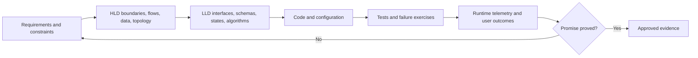
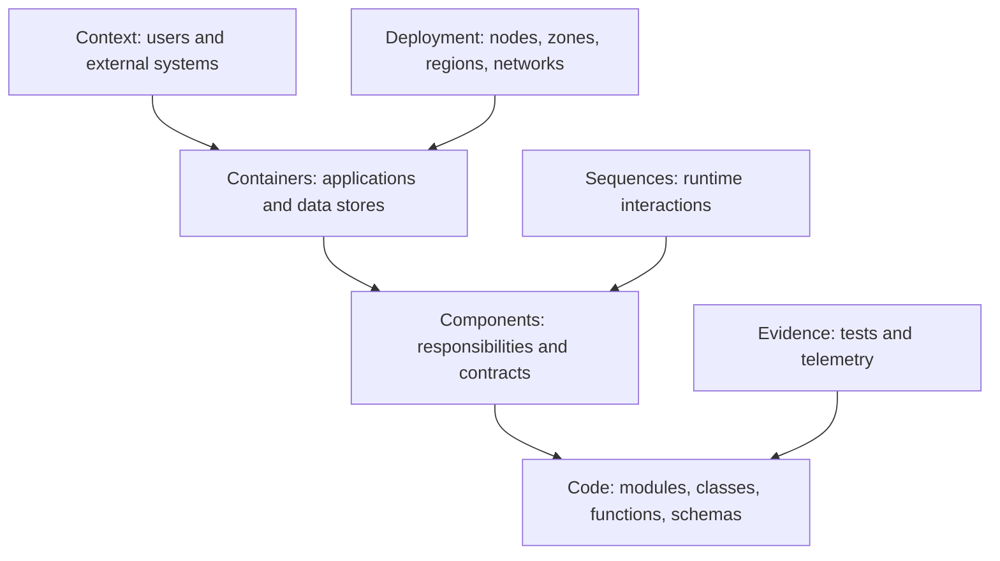
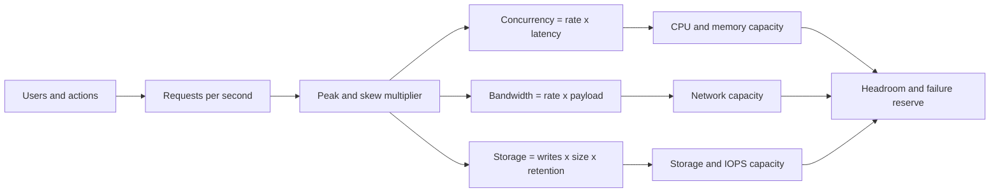
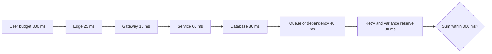
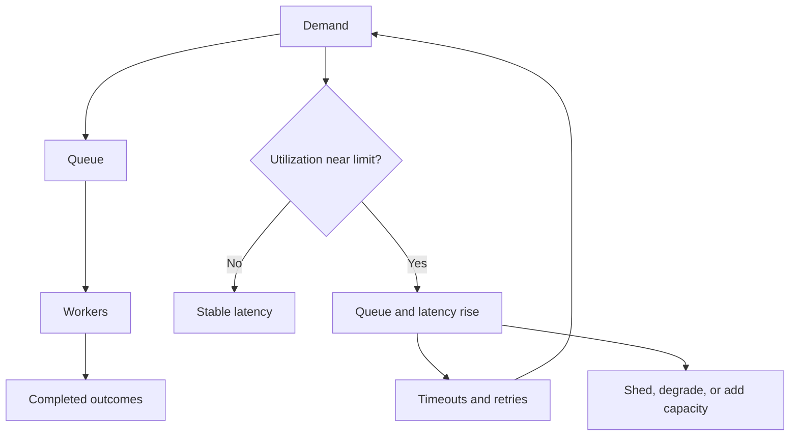
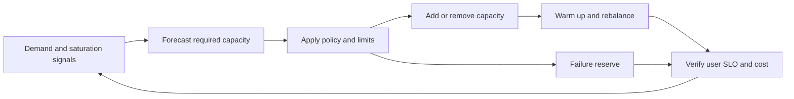

# Module 17 — System Design for DevOps/SRE

## Lesson 2: Estimation, Capacity and Performance

# 17.2.1 Back-of-envelope model

Assume:

```text
10 million monthly active users
2 million daily active users
20 requests/user/day
40 million requests/day
average ≈ 463 requests/s
peak factor 10 → 4,630 requests/s
```

State assumptions and use ranges. Precision without evidence is misleading.

# 17.2.2 Data and bandwidth

```text
daily new data = writes/day × average record bytes × indexes/replicas overhead
egress/day     = responses/day × average response bytes
retained data  = daily data × retention × growth/replication factor
```

Separate hot queryable data, warm analytical data, cold archive, and backup. Include logs, traces, indexes, tombstones, and temporary migration space.

# 17.2.3 Latency budget

For a 300 ms p95 objective:

```text
edge/network       40 ms
API processing     30 ms
database           80 ms
dependency         80 ms
queue/serialization 20 ms
safety margin      50 ms
```

Parallel work is bounded by the slowest branch plus coordination. Serial dependencies add latency. Tail amplification makes fan-out dangerous.

# 17.2.4 Queueing and concurrency

```text
concurrency ≈ throughput × response time
```

At 5,000 requests/s and 0.2 seconds average time, about 1,000 requests are in flight. Connection pools, thread/worker counts, memory, and downstream capacity must support it. High utilization increases queueing nonlinearly; leave headroom.

# 17.2.5 Load testing

Test realistic request mix, payloads, cache warmth, authentication, dependencies, failures, retry policy, rollout, and one-failure-domain loss. Distinguish load, stress, spike, soak, and scalability tests. Monitor user latency and every bottleneck.

# 17.2.6 Lab

Estimate an image service's RPS, storage, egress, concurrency, cache, and cost. Build a spreadsheet or Markdown model with base/expected/worst cases. Then change retention from 30 to 365 days and identify which design decisions change.

# 17.2.7 Never-forget rules

```text
average hides peak
p50 hides tail
CPU is not capacity by itself
retries are additional load
one-zone loss changes usable capacity
growth and rollout surge need headroom
```

# 17.2.8 Beginner mental model: estimate before choosing machinery

You would not choose the number of supermarket checkout counters without knowing customers per hour and service time. System estimates turn vague scale into orders of magnitude so architecture choices can be challenged.

Use simple arithmetic with explicit assumptions. Being approximately right and transparent is better than a precise unsupported number.

# 17.2.9 Traffic model

Example:

```text
monthly active users: 1,000,000
daily active fraction: 20% = 200,000/day
operations per active user: 20/day
daily operations: 4,000,000
average QPS: 4,000,000 / 86,400 ≈ 46
peak factor: 10
peak QPS: ≈ 460
```

Separate reads/writes, endpoint cost, regions, tenants, batch traffic, and background work. Average QPS alone hides burst and skew.

# 17.2.10 Storage model

If every todo record averages 1 KiB including indexes/metadata and 2 million are created daily:

```text
raw/day = 2,000,000 KiB ≈ 1.9 GiB
raw/year ≈ 696 GiB
```

Then add indexes, replication, backups/snapshots, WAL/logs, tombstones, compression, retention, and growth. Record which can be archived or deleted. Storage capacity is not the same as database working-set memory.

# 17.2.11 Bandwidth and connections

```text
bandwidth bytes/s = requests/s × average payload bytes
```

At 500 responses/s × 20 KiB:

```text
≈ 10,000 KiB/s ≈ 9.8 MiB/s before protocol overhead
```

Estimate ingress and egress separately. Include TLS/protocol overhead, replication, cache misses, cross-zone/region transfer, log/trace export, and large percentile payloads.

# 17.2.12 Latency budget

For a 300 ms P95 journey:

```text
edge/network          40 ms
API queue/compute     35 ms
database              90 ms
dependency            70 ms
serialization/network 25 ms
reserve               40 ms
```

Parallel operations contribute approximately their slowest required path plus coordination, while serial operations add. Set downstream timeouts within the remaining end-to-end deadline.

# 17.2.13 Tail latency matters

Averages hide slow users. If an operation calls 20 services in parallel and needs all responses, the request is exposed to the slow tail of any dependency. Track P50/P95/P99 and deadline success, not only mean.

Avoid simply adding every component P99; percentile composition is not that direct. Use end-to-end load measurements and traces.

# 17.2.14 Little's Law and concurrency

At 460 QPS and 250 ms average response time:

```text
average concurrent requests ≈ 460 × 0.25 = 115
```

At 2 seconds during brownout:

```text
≈ 920 concurrent requests
```

Size workers, memory, connections, and queues with peak/percentile behavior. Higher concurrency may further increase latency, creating a feedback loop.

# 17.2.15 Utilization and queueing knee

As a constrained resource approaches full utilization, waiting time often rises sharply. Target headroom depends on burstiness, scaling delay, failure model, and service-time distribution.

```text
usable capacity after one failure
must exceed critical peak demand plus recovery needs
```

Do not choose a universal 70% rule without measuring the workload.

# 17.2.16 Retry and fan-out amplification

```text
incoming QPS
× downstream calls/request
× average attempts/call
= downstream attempt rate
```

500 requests/s × 4 dependency calls × 1.2 attempts = 2,400 attempts/s. During failure, retries can push attempts much higher. Model caches, batch jobs, health checks, and telemetry too.

# 17.2.17 Autoscaling lag and warm-up

Capacity must bridge:

```text
detection interval
metric delay
autoscaler decision
node/VM provisioning
image pull and startup
readiness/warm cache/JIT
load balancer registration
```

Pre-scale known events, maintain minimum headroom, reduce startup time, and use load shedding. HPA desired replicas do not equal immediately usable capacity.

# 17.2.18 Load-test plan

Test stages:

```text
smoke: correctness at tiny load
baseline: expected normal traffic
load: expected peak mix
stress: locate saturation/knee
spike: sudden burst and scaling lag
soak: leaks, compaction, long queues
failure: peak with dependency/node/zone loss
recovery: normal traffic plus backlog drain
```

Use production-like data shape, request distribution, think time, cache state, and dependency behavior. Protect shared environments with explicit limits.

# 17.2.19 Real hands-on capacity workbook

Create a spreadsheet or versioned document with:

1. Users/events and average/peak QPS.
2. Read/write/endpoint distribution.
3. Payload, bandwidth, and cross-zone/region traffic.
4. Data growth, index/replica/backup/retention.
5. Latency budget and concurrency.
6. CPU/memory/connections per instance from test.
7. N+1/zone-loss and rollout reserve.
8. Retry/backlog recovery traffic.
9. Autoscaling/provisioning lead time and quotas.
10. Cost estimate and trigger for redesign.

Every cell should point to evidence or be marked assumption.

# 17.2.20 Break it: coordinated omission

A load generator that waits for each slow response before sending the next request can under-report latency during overload. Use an arrival model that represents independent user demand and examine the tool's coordinated-omission behavior.

Compare client-observed latency with server service time. Queueing before the server is still user latency.

# 17.2.21 Break it: autoscaler without infrastructure capacity

Drive a safe spike. Observe desired versus ready replicas, pending reasons, node provisioning, IP/quota limits, startup, dependency connections, and SLI. Add bounded load shedding or pre-scaling and repeat.

Success is not “eventually 100 pods.” It is meeting the critical objective without cascading failure.

# 17.2.22 Professional review checklist

- Orders of magnitude and peak factor are explicit.
- Request mix, data skew, and large percentiles are modeled.
- Storage includes indexes, replicas, backups, retention.
- Latency budget and deadlines cover the whole path.
- Concurrency/queues/connections account for brownouts.
- Retry/fan-out/background/telemetry load is included.
- Autoscaling lag, quotas, and warm-up are tested.
- One-failure and recovery capacity meet objectives.
- Load tests validate user latency and correctness.
- Forecast and cost trigger future redesign before exhaustion.

# 17.2.23 Certification and interview preparation

Estimation and performance reasoning support cloud architecture and system-design assessments. Current service limits and pricing must be checked at design time.

**Beginner: Why estimate QPS?**  It establishes workload magnitude for compute, storage, network, and database decisions.

**Intermediate: How do you convert daily requests to average QPS?**  Divide by 86,400, then apply measured/assumed peak and workload mix.

**Intermediate: What is Little's Law?**  Average items in a stable system equal arrival rate times average time in system, useful for concurrency sanity checks.

**Senior: Why test at one-zone loss?**  Normal capacity can look healthy while remaining capacity after the intended failure cannot serve peak demand.

**Senior: What is coordinated omission?**  A load generator suppresses new arrivals while waiting on slow responses, hiding the latency users would see.

**Expert: How do you model recovery from an outage?**  Normal new traffic plus backlog/retries/reconciliation must fit capacity; measure drain time and protect critical work.

**Architect: When do estimates justify redesign?**  When validated projections approach hard limits, objectives, cost, operability, or failure-capacity constraints inside the system's migration lead time.

**Never-forget answer:** estimate orders of magnitude, include failure and recovery, validate under realistic arrival patterns, and state every assumption.

<!-- GENERATED-MASTERY-WORKBOOK:START -->

# 17.2.24 Professional Mastery Workbook

This workbook expands **Estimation, Capacity and Performance** into deliberate practice without replacing the authored tutorial above.

Use it after reading the core explanation. The goal is not to memorize thousands of lines; the goal is to repeatedly explain, build, break, secure, observe, recover, and defend the lesson in different conditions.

## Workbook learning contract

- Concepts covered: 23 lesson-specific anchors.
- Progression: beginner, intermediate, expert, professional, industry-ready, certification review, and interview defense.
- Safety: use synthetic data, disposable resources, explicit placeholders, least privilege, and bounded failure experiments.
- Completion: retain commands or configuration, observations, screenshots or query output, decisions, rollback evidence, and a short reflection.
- Quality rule: a passing answer states assumptions, protects a user or business outcome, names ownership, and validates the final result end to end.
- Currency rule: verify current official documentation, versions, limits, pricing, and certification objectives before relying on changing product behavior.

## Seven-stage progression

| Stage | Learner must demonstrate |
|---|---|
| Beginner | Explain the concept in plain language and give one safe example. |
| Intermediate | Connect components, data, control flow, and normal operating behavior. |
| Expert | Analyze trade-offs, edge cases, scaling pressure, and correlated failures. |
| Professional | Make a reviewed decision with owner, evidence, rollout, and rollback. |
| Industry-ready | Operate the design under security, failure, recovery, cost, and compliance constraints. |
| Certification review | Map durable concepts to the latest official objectives without relying on stale wording. |
| Interview defense | Answer concisely, clarify assumptions, draw the model, and defend alternatives. |

## Concept mastery cards

### Concept card 1 - Back-of-envelope model

- Lesson anchor: Assume: 10 million monthly active users 2 million daily active users 20 requests/user/day 40 million requests/day average ≈ 463 requests/s peak factor 10 → 4,630 requests/s State assumptions and use ranges. Precision without evidence is misleading.
- Beginner explanation: Restate **Back-of-envelope model** using a household, workplace, or public-service analogy without hiding the technical truth.
- Terminology check: Define every important noun, state, actor, and boundary before using abbreviations.
- Concrete example: Apply **Back-of-envelope model** to a small todo, checkout, or platform service and name the expected outcome.
- Intermediate connection: Draw the request, data, identity, and control flow that reaches this concept.
- Trade-off question: Compare at least two valid alternatives and state when each becomes the better choice.
- Expert edge case: Describe concurrency, retry, partial failure, scale, or stale-state behavior that a happy-path explanation misses.
- Hands-on artifact: Produce a requirement, invariant, and architecture decision record focused on **Back-of-envelope model**.
- Failure exercise: In an isolated environment, introduce a timeout and retry amplification path while observing the boundaries around **Back-of-envelope model**.
- Security review: Identify identity, authorization, sensitive-data, supply-chain, and abuse assumptions.
- Reliability review: Define the user-visible failure, containment, degraded mode, recovery, and final validation.
- Performance and cost review: Name the load driver, capacity limit, useful unit, and waste or amplification risk.
- Observability review: Specify the metric, structured event, trace boundary, change marker, and missing-data behavior.
- Professional decision: Record context, options, decision, consequences, owner, evidence, and revisit trigger.
- Certification checkpoint: Map the design evidence to the current cloud architecture, DevOps, or Kubernetes objectives and defend the trade-off provider-neutrally.
- Interview prompt: Explain **Back-of-envelope model** first in 30 seconds, then defend it in a five-minute system scenario.
- Strong-answer rubric: lead with outcome, state assumptions, explain mechanism, discuss failure and security, then validate with evidence.
- Completion evidence: retain the artifact, commands or query, observed failure, safe recovery, and one improvement.

### Concept card 2 - Data and bandwidth

- Lesson anchor: daily new data = writes/day × average record bytes × indexes/replicas overhead egress/day     = responses/day × average response bytes retained data  = daily data × retention × growth/replication factor Separate hot queryable data, warm analytical data, col...
- Beginner explanation: Restate **Data and bandwidth** using a household, workplace, or public-service analogy without hiding the technical truth.
- Terminology check: Define every important noun, state, actor, and boundary before using abbreviations.
- Concrete example: Apply **Data and bandwidth** to a small todo, checkout, or platform service and name the expected outcome.
- Intermediate connection: Draw the request, data, identity, and control flow that reaches this concept.
- Trade-off question: Compare at least two valid alternatives and state when each becomes the better choice.
- Expert edge case: Describe concurrency, retry, partial failure, scale, or stale-state behavior that a happy-path explanation misses.
- Hands-on artifact: Produce a capacity, latency, storage, and bandwidth calculation focused on **Data and bandwidth**.
- Failure exercise: In an isolated environment, create a hot key, partition, cache, or queue condition while observing the boundaries around **Data and bandwidth**.
- Security review: Identify identity, authorization, sensitive-data, supply-chain, and abuse assumptions.
- Reliability review: Define the user-visible failure, containment, degraded mode, recovery, and final validation.
- Performance and cost review: Name the load driver, capacity limit, useful unit, and waste or amplification risk.
- Observability review: Specify the metric, structured event, trace boundary, change marker, and missing-data behavior.
- Professional decision: Record context, options, decision, consequences, owner, evidence, and revisit trigger.
- Certification checkpoint: Map the design evidence to the current cloud architecture, DevOps, or Kubernetes objectives and defend the trade-off provider-neutrally.
- Interview prompt: Explain **Data and bandwidth** first in 30 seconds, then defend it in a five-minute system scenario.
- Strong-answer rubric: lead with outcome, state assumptions, explain mechanism, discuss failure and security, then validate with evidence.
- Completion evidence: retain the artifact, commands or query, observed failure, safe recovery, and one improvement.

### Concept card 3 - Latency budget

- Lesson anchor: For a 300 ms p95 objective: edge/network       40 ms API processing     30 ms database           80 ms dependency         80 ms queue/serialization 20 ms safety margin      50 ms Parallel work is bounded by the slowest branch plus coordination. Serial depen...
- Beginner explanation: Restate **Latency budget** using a household, workplace, or public-service analogy without hiding the technical truth.
- Terminology check: Define every important noun, state, actor, and boundary before using abbreviations.
- Concrete example: Apply **Latency budget** to a small todo, checkout, or platform service and name the expected outcome.
- Intermediate connection: Draw the request, data, identity, and control flow that reaches this concept.
- Trade-off question: Compare at least two valid alternatives and state when each becomes the better choice.
- Expert edge case: Describe concurrency, retry, partial failure, scale, or stale-state behavior that a happy-path explanation misses.
- Hands-on artifact: Produce an API, data, or event contract with failure semantics focused on **Latency budget**.
- Failure exercise: In an isolated environment, remove a shared dependency or one failure domain while observing the boundaries around **Latency budget**.
- Security review: Identify identity, authorization, sensitive-data, supply-chain, and abuse assumptions.
- Reliability review: Define the user-visible failure, containment, degraded mode, recovery, and final validation.
- Performance and cost review: Name the load driver, capacity limit, useful unit, and waste or amplification risk.
- Observability review: Specify the metric, structured event, trace boundary, change marker, and missing-data behavior.
- Professional decision: Record context, options, decision, consequences, owner, evidence, and revisit trigger.
- Certification checkpoint: Map the design evidence to the current cloud architecture, DevOps, or Kubernetes objectives and defend the trade-off provider-neutrally.
- Interview prompt: Explain **Latency budget** first in 30 seconds, then defend it in a five-minute system scenario.
- Strong-answer rubric: lead with outcome, state assumptions, explain mechanism, discuss failure and security, then validate with evidence.
- Completion evidence: retain the artifact, commands or query, observed failure, safe recovery, and one improvement.

### Concept card 4 - Queueing and concurrency

- Lesson anchor: concurrency ≈ throughput × response time At 5,000 requests/s and 0.2 seconds average time, about 1,000 requests are in flight. Connection pools, thread/worker counts, memory, and downstream capacity must support it. High utilization increases queueing nonli...
- Beginner explanation: Restate **Queueing and concurrency** using a household, workplace, or public-service analogy without hiding the technical truth.
- Terminology check: Define every important noun, state, actor, and boundary before using abbreviations.
- Concrete example: Apply **Queueing and concurrency** to a small todo, checkout, or platform service and name the expected outcome.
- Intermediate connection: Draw the request, data, identity, and control flow that reaches this concept.
- Trade-off question: Compare at least two valid alternatives and state when each becomes the better choice.
- Expert edge case: Describe concurrency, retry, partial failure, scale, or stale-state behavior that a happy-path explanation misses.
- Hands-on artifact: Produce a context, data-flow, trust, and failure-domain diagram focused on **Queueing and concurrency**.
- Failure exercise: In an isolated environment, make data arrive duplicated, late, or out of order while observing the boundaries around **Queueing and concurrency**.
- Security review: Identify identity, authorization, sensitive-data, supply-chain, and abuse assumptions.
- Reliability review: Define the user-visible failure, containment, degraded mode, recovery, and final validation.
- Performance and cost review: Name the load driver, capacity limit, useful unit, and waste or amplification risk.
- Observability review: Specify the metric, structured event, trace boundary, change marker, and missing-data behavior.
- Professional decision: Record context, options, decision, consequences, owner, evidence, and revisit trigger.
- Certification checkpoint: Map the design evidence to the current cloud architecture, DevOps, or Kubernetes objectives and defend the trade-off provider-neutrally.
- Interview prompt: Explain **Queueing and concurrency** first in 30 seconds, then defend it in a five-minute system scenario.
- Strong-answer rubric: lead with outcome, state assumptions, explain mechanism, discuss failure and security, then validate with evidence.
- Completion evidence: retain the artifact, commands or query, observed failure, safe recovery, and one improvement.

### Concept card 5 - Load testing

- Lesson anchor: Test realistic request mix, payloads, cache warmth, authentication, dependencies, failures, retry policy, rollout, and one-failure-domain loss. Distinguish load, stress, spike, soak, and scalability tests. Monitor user latency and every bottleneck.
- Beginner explanation: Restate **Load testing** using a household, workplace, or public-service analogy without hiding the technical truth.
- Terminology check: Define every important noun, state, actor, and boundary before using abbreviations.
- Concrete example: Apply **Load testing** to a small todo, checkout, or platform service and name the expected outcome.
- Intermediate connection: Draw the request, data, identity, and control flow that reaches this concept.
- Trade-off question: Compare at least two valid alternatives and state when each becomes the better choice.
- Expert edge case: Describe concurrency, retry, partial failure, scale, or stale-state behavior that a happy-path explanation misses.
- Hands-on artifact: Produce a load-test and graceful-degradation report focused on **Load testing**.
- Failure exercise: In an isolated environment, overload the system beyond its modeled queueing knee while observing the boundaries around **Load testing**.
- Security review: Identify identity, authorization, sensitive-data, supply-chain, and abuse assumptions.
- Reliability review: Define the user-visible failure, containment, degraded mode, recovery, and final validation.
- Performance and cost review: Name the load driver, capacity limit, useful unit, and waste or amplification risk.
- Observability review: Specify the metric, structured event, trace boundary, change marker, and missing-data behavior.
- Professional decision: Record context, options, decision, consequences, owner, evidence, and revisit trigger.
- Certification checkpoint: Map the design evidence to the current cloud architecture, DevOps, or Kubernetes objectives and defend the trade-off provider-neutrally.
- Interview prompt: Explain **Load testing** first in 30 seconds, then defend it in a five-minute system scenario.
- Strong-answer rubric: lead with outcome, state assumptions, explain mechanism, discuss failure and security, then validate with evidence.
- Completion evidence: retain the artifact, commands or query, observed failure, safe recovery, and one improvement.

### Concept card 6 - Lab

- Lesson anchor: Estimate an image service's RPS, storage, egress, concurrency, cache, and cost. Build a spreadsheet or Markdown model with base/expected/worst cases. Then change retention from 30 to 365 days and identify which design decisions change.
- Beginner explanation: Restate **Lab** using a household, workplace, or public-service analogy without hiding the technical truth.
- Terminology check: Define every important noun, state, actor, and boundary before using abbreviations.
- Concrete example: Apply **Lab** to a small todo, checkout, or platform service and name the expected outcome.
- Intermediate connection: Draw the request, data, identity, and control flow that reaches this concept.
- Trade-off question: Compare at least two valid alternatives and state when each becomes the better choice.
- Expert edge case: Describe concurrency, retry, partial failure, scale, or stale-state behavior that a happy-path explanation misses.
- Hands-on artifact: Produce a multi-region failover and failback state machine focused on **Lab**.
- Failure exercise: In an isolated environment, make a regional writer or routing decision ambiguous while observing the boundaries around **Lab**.
- Security review: Identify identity, authorization, sensitive-data, supply-chain, and abuse assumptions.
- Reliability review: Define the user-visible failure, containment, degraded mode, recovery, and final validation.
- Performance and cost review: Name the load driver, capacity limit, useful unit, and waste or amplification risk.
- Observability review: Specify the metric, structured event, trace boundary, change marker, and missing-data behavior.
- Professional decision: Record context, options, decision, consequences, owner, evidence, and revisit trigger.
- Certification checkpoint: Map the design evidence to the current cloud architecture, DevOps, or Kubernetes objectives and defend the trade-off provider-neutrally.
- Interview prompt: Explain **Lab** first in 30 seconds, then defend it in a five-minute system scenario.
- Strong-answer rubric: lead with outcome, state assumptions, explain mechanism, discuss failure and security, then validate with evidence.
- Completion evidence: retain the artifact, commands or query, observed failure, safe recovery, and one improvement.

### Concept card 7 - Never-forget rules

- Lesson anchor: average hides peak p50 hides tail CPU is not capacity by itself retries are additional load one-zone loss changes usable capacity growth and rollout surge need headroom
- Beginner explanation: Restate **Never-forget rules** using a household, workplace, or public-service analogy without hiding the technical truth.
- Terminology check: Define every important noun, state, actor, and boundary before using abbreviations.
- Concrete example: Apply **Never-forget rules** to a small todo, checkout, or platform service and name the expected outcome.
- Intermediate connection: Draw the request, data, identity, and control flow that reaches this concept.
- Trade-off question: Compare at least two valid alternatives and state when each becomes the better choice.
- Expert edge case: Describe concurrency, retry, partial failure, scale, or stale-state behavior that a happy-path explanation misses.
- Hands-on artifact: Produce a requirement, invariant, and architecture decision record focused on **Never-forget rules**.
- Failure exercise: In an isolated environment, introduce a timeout and retry amplification path while observing the boundaries around **Never-forget rules**.
- Security review: Identify identity, authorization, sensitive-data, supply-chain, and abuse assumptions.
- Reliability review: Define the user-visible failure, containment, degraded mode, recovery, and final validation.
- Performance and cost review: Name the load driver, capacity limit, useful unit, and waste or amplification risk.
- Observability review: Specify the metric, structured event, trace boundary, change marker, and missing-data behavior.
- Professional decision: Record context, options, decision, consequences, owner, evidence, and revisit trigger.
- Certification checkpoint: Map the design evidence to the current cloud architecture, DevOps, or Kubernetes objectives and defend the trade-off provider-neutrally.
- Interview prompt: Explain **Never-forget rules** first in 30 seconds, then defend it in a five-minute system scenario.
- Strong-answer rubric: lead with outcome, state assumptions, explain mechanism, discuss failure and security, then validate with evidence.
- Completion evidence: retain the artifact, commands or query, observed failure, safe recovery, and one improvement.

### Concept card 8 - Beginner mental model: estimate before choosing machinery

- Lesson anchor: You would not choose the number of supermarket checkout counters without knowing customers per hour and service time. System estimates turn vague scale into orders of magnitude so architecture choices can be challenged. Use simple arithmetic with explicit a...
- Beginner explanation: Restate **Beginner mental model: estimate before choosing machinery** using a household, workplace, or public-service analogy without hiding the technical truth.
- Terminology check: Define every important noun, state, actor, and boundary before using abbreviations.
- Concrete example: Apply **Beginner mental model: estimate before choosing machinery** to a small todo, checkout, or platform service and name the expected outcome.
- Intermediate connection: Draw the request, data, identity, and control flow that reaches this concept.
- Trade-off question: Compare at least two valid alternatives and state when each becomes the better choice.
- Expert edge case: Describe concurrency, retry, partial failure, scale, or stale-state behavior that a happy-path explanation misses.
- Hands-on artifact: Produce a capacity, latency, storage, and bandwidth calculation focused on **Beginner mental model: estimate before choosing machinery**.
- Failure exercise: In an isolated environment, create a hot key, partition, cache, or queue condition while observing the boundaries around **Beginner mental model: estimate before choosing machinery**.
- Security review: Identify identity, authorization, sensitive-data, supply-chain, and abuse assumptions.
- Reliability review: Define the user-visible failure, containment, degraded mode, recovery, and final validation.
- Performance and cost review: Name the load driver, capacity limit, useful unit, and waste or amplification risk.
- Observability review: Specify the metric, structured event, trace boundary, change marker, and missing-data behavior.
- Professional decision: Record context, options, decision, consequences, owner, evidence, and revisit trigger.
- Certification checkpoint: Map the design evidence to the current cloud architecture, DevOps, or Kubernetes objectives and defend the trade-off provider-neutrally.
- Interview prompt: Explain **Beginner mental model: estimate before choosing machinery** first in 30 seconds, then defend it in a five-minute system scenario.
- Strong-answer rubric: lead with outcome, state assumptions, explain mechanism, discuss failure and security, then validate with evidence.
- Completion evidence: retain the artifact, commands or query, observed failure, safe recovery, and one improvement.

### Concept card 9 - Traffic model

- Lesson anchor: Example: monthly active users: 1,000,000 daily active fraction: 20% = 200,000/day operations per active user: 20/day daily operations: 4,000,000 average QPS: 4,000,000 / 86,400 ≈ 46 peak factor: 10 peak QPS: ≈ 460 Separate reads/writes, endpoint cost, regio...
- Beginner explanation: Restate **Traffic model** using a household, workplace, or public-service analogy without hiding the technical truth.
- Terminology check: Define every important noun, state, actor, and boundary before using abbreviations.
- Concrete example: Apply **Traffic model** to a small todo, checkout, or platform service and name the expected outcome.
- Intermediate connection: Draw the request, data, identity, and control flow that reaches this concept.
- Trade-off question: Compare at least two valid alternatives and state when each becomes the better choice.
- Expert edge case: Describe concurrency, retry, partial failure, scale, or stale-state behavior that a happy-path explanation misses.
- Hands-on artifact: Produce an API, data, or event contract with failure semantics focused on **Traffic model**.
- Failure exercise: In an isolated environment, remove a shared dependency or one failure domain while observing the boundaries around **Traffic model**.
- Security review: Identify identity, authorization, sensitive-data, supply-chain, and abuse assumptions.
- Reliability review: Define the user-visible failure, containment, degraded mode, recovery, and final validation.
- Performance and cost review: Name the load driver, capacity limit, useful unit, and waste or amplification risk.
- Observability review: Specify the metric, structured event, trace boundary, change marker, and missing-data behavior.
- Professional decision: Record context, options, decision, consequences, owner, evidence, and revisit trigger.
- Certification checkpoint: Map the design evidence to the current cloud architecture, DevOps, or Kubernetes objectives and defend the trade-off provider-neutrally.
- Interview prompt: Explain **Traffic model** first in 30 seconds, then defend it in a five-minute system scenario.
- Strong-answer rubric: lead with outcome, state assumptions, explain mechanism, discuss failure and security, then validate with evidence.
- Completion evidence: retain the artifact, commands or query, observed failure, safe recovery, and one improvement.

### Concept card 10 - Storage model

- Lesson anchor: If every todo record averages 1 KiB including indexes/metadata and 2 million are created daily: raw/day = 2,000,000 KiB ≈ 1.9 GiB raw/year ≈ 696 GiB Then add indexes, replication, backups/snapshots, WAL/logs, tombstones, compression, retention, and growth....
- Beginner explanation: Restate **Storage model** using a household, workplace, or public-service analogy without hiding the technical truth.
- Terminology check: Define every important noun, state, actor, and boundary before using abbreviations.
- Concrete example: Apply **Storage model** to a small todo, checkout, or platform service and name the expected outcome.
- Intermediate connection: Draw the request, data, identity, and control flow that reaches this concept.
- Trade-off question: Compare at least two valid alternatives and state when each becomes the better choice.
- Expert edge case: Describe concurrency, retry, partial failure, scale, or stale-state behavior that a happy-path explanation misses.
- Hands-on artifact: Produce a context, data-flow, trust, and failure-domain diagram focused on **Storage model**.
- Failure exercise: In an isolated environment, make data arrive duplicated, late, or out of order while observing the boundaries around **Storage model**.
- Security review: Identify identity, authorization, sensitive-data, supply-chain, and abuse assumptions.
- Reliability review: Define the user-visible failure, containment, degraded mode, recovery, and final validation.
- Performance and cost review: Name the load driver, capacity limit, useful unit, and waste or amplification risk.
- Observability review: Specify the metric, structured event, trace boundary, change marker, and missing-data behavior.
- Professional decision: Record context, options, decision, consequences, owner, evidence, and revisit trigger.
- Certification checkpoint: Map the design evidence to the current cloud architecture, DevOps, or Kubernetes objectives and defend the trade-off provider-neutrally.
- Interview prompt: Explain **Storage model** first in 30 seconds, then defend it in a five-minute system scenario.
- Strong-answer rubric: lead with outcome, state assumptions, explain mechanism, discuss failure and security, then validate with evidence.
- Completion evidence: retain the artifact, commands or query, observed failure, safe recovery, and one improvement.

### Concept card 11 - Bandwidth and connections

- Lesson anchor: bandwidth bytes/s = requests/s × average payload bytes At 500 responses/s × 20 KiB: ≈ 10,000 KiB/s ≈ 9.8 MiB/s before protocol overhead Estimate ingress and egress separately. Include TLS/protocol overhead, replication, cache misses, cross-zone/region trans...
- Beginner explanation: Restate **Bandwidth and connections** using a household, workplace, or public-service analogy without hiding the technical truth.
- Terminology check: Define every important noun, state, actor, and boundary before using abbreviations.
- Concrete example: Apply **Bandwidth and connections** to a small todo, checkout, or platform service and name the expected outcome.
- Intermediate connection: Draw the request, data, identity, and control flow that reaches this concept.
- Trade-off question: Compare at least two valid alternatives and state when each becomes the better choice.
- Expert edge case: Describe concurrency, retry, partial failure, scale, or stale-state behavior that a happy-path explanation misses.
- Hands-on artifact: Produce a load-test and graceful-degradation report focused on **Bandwidth and connections**.
- Failure exercise: In an isolated environment, overload the system beyond its modeled queueing knee while observing the boundaries around **Bandwidth and connections**.
- Security review: Identify identity, authorization, sensitive-data, supply-chain, and abuse assumptions.
- Reliability review: Define the user-visible failure, containment, degraded mode, recovery, and final validation.
- Performance and cost review: Name the load driver, capacity limit, useful unit, and waste or amplification risk.
- Observability review: Specify the metric, structured event, trace boundary, change marker, and missing-data behavior.
- Professional decision: Record context, options, decision, consequences, owner, evidence, and revisit trigger.
- Certification checkpoint: Map the design evidence to the current cloud architecture, DevOps, or Kubernetes objectives and defend the trade-off provider-neutrally.
- Interview prompt: Explain **Bandwidth and connections** first in 30 seconds, then defend it in a five-minute system scenario.
- Strong-answer rubric: lead with outcome, state assumptions, explain mechanism, discuss failure and security, then validate with evidence.
- Completion evidence: retain the artifact, commands or query, observed failure, safe recovery, and one improvement.

### Concept card 12 - Latency budget

- Lesson anchor: For a 300 ms P95 journey: edge/network          40 ms API queue/compute     35 ms database              90 ms dependency            70 ms serialization/network 25 ms reserve               40 ms Parallel operations contribute approximately their slowest requ...
- Beginner explanation: Restate **Latency budget** using a household, workplace, or public-service analogy without hiding the technical truth.
- Terminology check: Define every important noun, state, actor, and boundary before using abbreviations.
- Concrete example: Apply **Latency budget** to a small todo, checkout, or platform service and name the expected outcome.
- Intermediate connection: Draw the request, data, identity, and control flow that reaches this concept.
- Trade-off question: Compare at least two valid alternatives and state when each becomes the better choice.
- Expert edge case: Describe concurrency, retry, partial failure, scale, or stale-state behavior that a happy-path explanation misses.
- Hands-on artifact: Produce a multi-region failover and failback state machine focused on **Latency budget**.
- Failure exercise: In an isolated environment, make a regional writer or routing decision ambiguous while observing the boundaries around **Latency budget**.
- Security review: Identify identity, authorization, sensitive-data, supply-chain, and abuse assumptions.
- Reliability review: Define the user-visible failure, containment, degraded mode, recovery, and final validation.
- Performance and cost review: Name the load driver, capacity limit, useful unit, and waste or amplification risk.
- Observability review: Specify the metric, structured event, trace boundary, change marker, and missing-data behavior.
- Professional decision: Record context, options, decision, consequences, owner, evidence, and revisit trigger.
- Certification checkpoint: Map the design evidence to the current cloud architecture, DevOps, or Kubernetes objectives and defend the trade-off provider-neutrally.
- Interview prompt: Explain **Latency budget** first in 30 seconds, then defend it in a five-minute system scenario.
- Strong-answer rubric: lead with outcome, state assumptions, explain mechanism, discuss failure and security, then validate with evidence.
- Completion evidence: retain the artifact, commands or query, observed failure, safe recovery, and one improvement.

### Concept card 13 - Tail latency matters

- Lesson anchor: Averages hide slow users. If an operation calls 20 services in parallel and needs all responses, the request is exposed to the slow tail of any dependency. Track P50/P95/P99 and deadline success, not only mean. Avoid simply adding every component P99; perce...
- Beginner explanation: Restate **Tail latency matters** using a household, workplace, or public-service analogy without hiding the technical truth.
- Terminology check: Define every important noun, state, actor, and boundary before using abbreviations.
- Concrete example: Apply **Tail latency matters** to a small todo, checkout, or platform service and name the expected outcome.
- Intermediate connection: Draw the request, data, identity, and control flow that reaches this concept.
- Trade-off question: Compare at least two valid alternatives and state when each becomes the better choice.
- Expert edge case: Describe concurrency, retry, partial failure, scale, or stale-state behavior that a happy-path explanation misses.
- Hands-on artifact: Produce a requirement, invariant, and architecture decision record focused on **Tail latency matters**.
- Failure exercise: In an isolated environment, introduce a timeout and retry amplification path while observing the boundaries around **Tail latency matters**.
- Security review: Identify identity, authorization, sensitive-data, supply-chain, and abuse assumptions.
- Reliability review: Define the user-visible failure, containment, degraded mode, recovery, and final validation.
- Performance and cost review: Name the load driver, capacity limit, useful unit, and waste or amplification risk.
- Observability review: Specify the metric, structured event, trace boundary, change marker, and missing-data behavior.
- Professional decision: Record context, options, decision, consequences, owner, evidence, and revisit trigger.
- Certification checkpoint: Map the design evidence to the current cloud architecture, DevOps, or Kubernetes objectives and defend the trade-off provider-neutrally.
- Interview prompt: Explain **Tail latency matters** first in 30 seconds, then defend it in a five-minute system scenario.
- Strong-answer rubric: lead with outcome, state assumptions, explain mechanism, discuss failure and security, then validate with evidence.
- Completion evidence: retain the artifact, commands or query, observed failure, safe recovery, and one improvement.

### Concept card 14 - Little's Law and concurrency

- Lesson anchor: At 460 QPS and 250 ms average response time: average concurrent requests ≈ 460 × 0.25 = 115 At 2 seconds during brownout: ≈ 920 concurrent requests Size workers, memory, connections, and queues with peak/percentile behavior. Higher concurrency may further i...
- Beginner explanation: Restate **Little's Law and concurrency** using a household, workplace, or public-service analogy without hiding the technical truth.
- Terminology check: Define every important noun, state, actor, and boundary before using abbreviations.
- Concrete example: Apply **Little's Law and concurrency** to a small todo, checkout, or platform service and name the expected outcome.
- Intermediate connection: Draw the request, data, identity, and control flow that reaches this concept.
- Trade-off question: Compare at least two valid alternatives and state when each becomes the better choice.
- Expert edge case: Describe concurrency, retry, partial failure, scale, or stale-state behavior that a happy-path explanation misses.
- Hands-on artifact: Produce a capacity, latency, storage, and bandwidth calculation focused on **Little's Law and concurrency**.
- Failure exercise: In an isolated environment, create a hot key, partition, cache, or queue condition while observing the boundaries around **Little's Law and concurrency**.
- Security review: Identify identity, authorization, sensitive-data, supply-chain, and abuse assumptions.
- Reliability review: Define the user-visible failure, containment, degraded mode, recovery, and final validation.
- Performance and cost review: Name the load driver, capacity limit, useful unit, and waste or amplification risk.
- Observability review: Specify the metric, structured event, trace boundary, change marker, and missing-data behavior.
- Professional decision: Record context, options, decision, consequences, owner, evidence, and revisit trigger.
- Certification checkpoint: Map the design evidence to the current cloud architecture, DevOps, or Kubernetes objectives and defend the trade-off provider-neutrally.
- Interview prompt: Explain **Little's Law and concurrency** first in 30 seconds, then defend it in a five-minute system scenario.
- Strong-answer rubric: lead with outcome, state assumptions, explain mechanism, discuss failure and security, then validate with evidence.
- Completion evidence: retain the artifact, commands or query, observed failure, safe recovery, and one improvement.

### Concept card 15 - Utilization and queueing knee

- Lesson anchor: As a constrained resource approaches full utilization, waiting time often rises sharply. Target headroom depends on burstiness, scaling delay, failure model, and service-time distribution. usable capacity after one failure
- Beginner explanation: Restate **Utilization and queueing knee** using a household, workplace, or public-service analogy without hiding the technical truth.
- Terminology check: Define every important noun, state, actor, and boundary before using abbreviations.
- Concrete example: Apply **Utilization and queueing knee** to a small todo, checkout, or platform service and name the expected outcome.
- Intermediate connection: Draw the request, data, identity, and control flow that reaches this concept.
- Trade-off question: Compare at least two valid alternatives and state when each becomes the better choice.
- Expert edge case: Describe concurrency, retry, partial failure, scale, or stale-state behavior that a happy-path explanation misses.
- Hands-on artifact: Produce an API, data, or event contract with failure semantics focused on **Utilization and queueing knee**.
- Failure exercise: In an isolated environment, remove a shared dependency or one failure domain while observing the boundaries around **Utilization and queueing knee**.
- Security review: Identify identity, authorization, sensitive-data, supply-chain, and abuse assumptions.
- Reliability review: Define the user-visible failure, containment, degraded mode, recovery, and final validation.
- Performance and cost review: Name the load driver, capacity limit, useful unit, and waste or amplification risk.
- Observability review: Specify the metric, structured event, trace boundary, change marker, and missing-data behavior.
- Professional decision: Record context, options, decision, consequences, owner, evidence, and revisit trigger.
- Certification checkpoint: Map the design evidence to the current cloud architecture, DevOps, or Kubernetes objectives and defend the trade-off provider-neutrally.
- Interview prompt: Explain **Utilization and queueing knee** first in 30 seconds, then defend it in a five-minute system scenario.
- Strong-answer rubric: lead with outcome, state assumptions, explain mechanism, discuss failure and security, then validate with evidence.
- Completion evidence: retain the artifact, commands or query, observed failure, safe recovery, and one improvement.

### Concept card 16 - Retry and fan-out amplification

- Lesson anchor: incoming QPS × downstream calls/request × average attempts/call = downstream attempt rate 500 requests/s × 4 dependency calls × 1.2 attempts = 2,400 attempts/s. During failure, retries can push attempts much higher. Model caches, batch jobs, health checks,...
- Beginner explanation: Restate **Retry and fan-out amplification** using a household, workplace, or public-service analogy without hiding the technical truth.
- Terminology check: Define every important noun, state, actor, and boundary before using abbreviations.
- Concrete example: Apply **Retry and fan-out amplification** to a small todo, checkout, or platform service and name the expected outcome.
- Intermediate connection: Draw the request, data, identity, and control flow that reaches this concept.
- Trade-off question: Compare at least two valid alternatives and state when each becomes the better choice.
- Expert edge case: Describe concurrency, retry, partial failure, scale, or stale-state behavior that a happy-path explanation misses.
- Hands-on artifact: Produce a context, data-flow, trust, and failure-domain diagram focused on **Retry and fan-out amplification**.
- Failure exercise: In an isolated environment, make data arrive duplicated, late, or out of order while observing the boundaries around **Retry and fan-out amplification**.
- Security review: Identify identity, authorization, sensitive-data, supply-chain, and abuse assumptions.
- Reliability review: Define the user-visible failure, containment, degraded mode, recovery, and final validation.
- Performance and cost review: Name the load driver, capacity limit, useful unit, and waste or amplification risk.
- Observability review: Specify the metric, structured event, trace boundary, change marker, and missing-data behavior.
- Professional decision: Record context, options, decision, consequences, owner, evidence, and revisit trigger.
- Certification checkpoint: Map the design evidence to the current cloud architecture, DevOps, or Kubernetes objectives and defend the trade-off provider-neutrally.
- Interview prompt: Explain **Retry and fan-out amplification** first in 30 seconds, then defend it in a five-minute system scenario.
- Strong-answer rubric: lead with outcome, state assumptions, explain mechanism, discuss failure and security, then validate with evidence.
- Completion evidence: retain the artifact, commands or query, observed failure, safe recovery, and one improvement.

### Concept card 17 - Autoscaling lag and warm-up

- Lesson anchor: Capacity must bridge: detection interval metric delay autoscaler decision node/VM provisioning image pull and startup readiness/warm cache/JIT load balancer registration Pre-scale known events, maintain minimum headroom, reduce startup time, and use load sh...
- Beginner explanation: Restate **Autoscaling lag and warm-up** using a household, workplace, or public-service analogy without hiding the technical truth.
- Terminology check: Define every important noun, state, actor, and boundary before using abbreviations.
- Concrete example: Apply **Autoscaling lag and warm-up** to a small todo, checkout, or platform service and name the expected outcome.
- Intermediate connection: Draw the request, data, identity, and control flow that reaches this concept.
- Trade-off question: Compare at least two valid alternatives and state when each becomes the better choice.
- Expert edge case: Describe concurrency, retry, partial failure, scale, or stale-state behavior that a happy-path explanation misses.
- Hands-on artifact: Produce a load-test and graceful-degradation report focused on **Autoscaling lag and warm-up**.
- Failure exercise: In an isolated environment, overload the system beyond its modeled queueing knee while observing the boundaries around **Autoscaling lag and warm-up**.
- Security review: Identify identity, authorization, sensitive-data, supply-chain, and abuse assumptions.
- Reliability review: Define the user-visible failure, containment, degraded mode, recovery, and final validation.
- Performance and cost review: Name the load driver, capacity limit, useful unit, and waste or amplification risk.
- Observability review: Specify the metric, structured event, trace boundary, change marker, and missing-data behavior.
- Professional decision: Record context, options, decision, consequences, owner, evidence, and revisit trigger.
- Certification checkpoint: Map the design evidence to the current cloud architecture, DevOps, or Kubernetes objectives and defend the trade-off provider-neutrally.
- Interview prompt: Explain **Autoscaling lag and warm-up** first in 30 seconds, then defend it in a five-minute system scenario.
- Strong-answer rubric: lead with outcome, state assumptions, explain mechanism, discuss failure and security, then validate with evidence.
- Completion evidence: retain the artifact, commands or query, observed failure, safe recovery, and one improvement.

### Concept card 18 - Load-test plan

- Lesson anchor: Test stages: smoke: correctness at tiny load baseline: expected normal traffic load: expected peak mix stress: locate saturation/knee spike: sudden burst and scaling lag soak: leaks, compaction, long queues failure: peak with dependency/node/zone loss
- Beginner explanation: Restate **Load-test plan** using a household, workplace, or public-service analogy without hiding the technical truth.
- Terminology check: Define every important noun, state, actor, and boundary before using abbreviations.
- Concrete example: Apply **Load-test plan** to a small todo, checkout, or platform service and name the expected outcome.
- Intermediate connection: Draw the request, data, identity, and control flow that reaches this concept.
- Trade-off question: Compare at least two valid alternatives and state when each becomes the better choice.
- Expert edge case: Describe concurrency, retry, partial failure, scale, or stale-state behavior that a happy-path explanation misses.
- Hands-on artifact: Produce a multi-region failover and failback state machine focused on **Load-test plan**.
- Failure exercise: In an isolated environment, make a regional writer or routing decision ambiguous while observing the boundaries around **Load-test plan**.
- Security review: Identify identity, authorization, sensitive-data, supply-chain, and abuse assumptions.
- Reliability review: Define the user-visible failure, containment, degraded mode, recovery, and final validation.
- Performance and cost review: Name the load driver, capacity limit, useful unit, and waste or amplification risk.
- Observability review: Specify the metric, structured event, trace boundary, change marker, and missing-data behavior.
- Professional decision: Record context, options, decision, consequences, owner, evidence, and revisit trigger.
- Certification checkpoint: Map the design evidence to the current cloud architecture, DevOps, or Kubernetes objectives and defend the trade-off provider-neutrally.
- Interview prompt: Explain **Load-test plan** first in 30 seconds, then defend it in a five-minute system scenario.
- Strong-answer rubric: lead with outcome, state assumptions, explain mechanism, discuss failure and security, then validate with evidence.
- Completion evidence: retain the artifact, commands or query, observed failure, safe recovery, and one improvement.

### Concept card 19 - Real hands-on capacity workbook

- Lesson anchor: Create a spreadsheet or versioned document with: Every cell should point to evidence or be marked assumption.
- Beginner explanation: Restate **Real hands-on capacity workbook** using a household, workplace, or public-service analogy without hiding the technical truth.
- Terminology check: Define every important noun, state, actor, and boundary before using abbreviations.
- Concrete example: Apply **Real hands-on capacity workbook** to a small todo, checkout, or platform service and name the expected outcome.
- Intermediate connection: Draw the request, data, identity, and control flow that reaches this concept.
- Trade-off question: Compare at least two valid alternatives and state when each becomes the better choice.
- Expert edge case: Describe concurrency, retry, partial failure, scale, or stale-state behavior that a happy-path explanation misses.
- Hands-on artifact: Produce a requirement, invariant, and architecture decision record focused on **Real hands-on capacity workbook**.
- Failure exercise: In an isolated environment, introduce a timeout and retry amplification path while observing the boundaries around **Real hands-on capacity workbook**.
- Security review: Identify identity, authorization, sensitive-data, supply-chain, and abuse assumptions.
- Reliability review: Define the user-visible failure, containment, degraded mode, recovery, and final validation.
- Performance and cost review: Name the load driver, capacity limit, useful unit, and waste or amplification risk.
- Observability review: Specify the metric, structured event, trace boundary, change marker, and missing-data behavior.
- Professional decision: Record context, options, decision, consequences, owner, evidence, and revisit trigger.
- Certification checkpoint: Map the design evidence to the current cloud architecture, DevOps, or Kubernetes objectives and defend the trade-off provider-neutrally.
- Interview prompt: Explain **Real hands-on capacity workbook** first in 30 seconds, then defend it in a five-minute system scenario.
- Strong-answer rubric: lead with outcome, state assumptions, explain mechanism, discuss failure and security, then validate with evidence.
- Completion evidence: retain the artifact, commands or query, observed failure, safe recovery, and one improvement.

### Concept card 20 - Break it: coordinated omission

- Lesson anchor: A load generator that waits for each slow response before sending the next request can under-report latency during overload. Use an arrival model that represents independent user demand and examine the tool's coordinated-omission behavior.
- Beginner explanation: Restate **Break it: coordinated omission** using a household, workplace, or public-service analogy without hiding the technical truth.
- Terminology check: Define every important noun, state, actor, and boundary before using abbreviations.
- Concrete example: Apply **Break it: coordinated omission** to a small todo, checkout, or platform service and name the expected outcome.
- Intermediate connection: Draw the request, data, identity, and control flow that reaches this concept.
- Trade-off question: Compare at least two valid alternatives and state when each becomes the better choice.
- Expert edge case: Describe concurrency, retry, partial failure, scale, or stale-state behavior that a happy-path explanation misses.
- Hands-on artifact: Produce a capacity, latency, storage, and bandwidth calculation focused on **Break it: coordinated omission**.
- Failure exercise: In an isolated environment, create a hot key, partition, cache, or queue condition while observing the boundaries around **Break it: coordinated omission**.
- Security review: Identify identity, authorization, sensitive-data, supply-chain, and abuse assumptions.
- Reliability review: Define the user-visible failure, containment, degraded mode, recovery, and final validation.
- Performance and cost review: Name the load driver, capacity limit, useful unit, and waste or amplification risk.
- Observability review: Specify the metric, structured event, trace boundary, change marker, and missing-data behavior.
- Professional decision: Record context, options, decision, consequences, owner, evidence, and revisit trigger.
- Certification checkpoint: Map the design evidence to the current cloud architecture, DevOps, or Kubernetes objectives and defend the trade-off provider-neutrally.
- Interview prompt: Explain **Break it: coordinated omission** first in 30 seconds, then defend it in a five-minute system scenario.
- Strong-answer rubric: lead with outcome, state assumptions, explain mechanism, discuss failure and security, then validate with evidence.
- Completion evidence: retain the artifact, commands or query, observed failure, safe recovery, and one improvement.

### Concept card 21 - Break it: autoscaler without infrastructure capacity

- Lesson anchor: Drive a safe spike. Observe desired versus ready replicas, pending reasons, node provisioning, IP/quota limits, startup, dependency connections, and SLI. Add bounded load shedding or pre-scaling and repeat. Success is not “eventually 100 pods.” It is meetin...
- Beginner explanation: Restate **Break it: autoscaler without infrastructure capacity** using a household, workplace, or public-service analogy without hiding the technical truth.
- Terminology check: Define every important noun, state, actor, and boundary before using abbreviations.
- Concrete example: Apply **Break it: autoscaler without infrastructure capacity** to a small todo, checkout, or platform service and name the expected outcome.
- Intermediate connection: Draw the request, data, identity, and control flow that reaches this concept.
- Trade-off question: Compare at least two valid alternatives and state when each becomes the better choice.
- Expert edge case: Describe concurrency, retry, partial failure, scale, or stale-state behavior that a happy-path explanation misses.
- Hands-on artifact: Produce an API, data, or event contract with failure semantics focused on **Break it: autoscaler without infrastructure capacity**.
- Failure exercise: In an isolated environment, remove a shared dependency or one failure domain while observing the boundaries around **Break it: autoscaler without infrastructure capacity**.
- Security review: Identify identity, authorization, sensitive-data, supply-chain, and abuse assumptions.
- Reliability review: Define the user-visible failure, containment, degraded mode, recovery, and final validation.
- Performance and cost review: Name the load driver, capacity limit, useful unit, and waste or amplification risk.
- Observability review: Specify the metric, structured event, trace boundary, change marker, and missing-data behavior.
- Professional decision: Record context, options, decision, consequences, owner, evidence, and revisit trigger.
- Certification checkpoint: Map the design evidence to the current cloud architecture, DevOps, or Kubernetes objectives and defend the trade-off provider-neutrally.
- Interview prompt: Explain **Break it: autoscaler without infrastructure capacity** first in 30 seconds, then defend it in a five-minute system scenario.
- Strong-answer rubric: lead with outcome, state assumptions, explain mechanism, discuss failure and security, then validate with evidence.
- Completion evidence: retain the artifact, commands or query, observed failure, safe recovery, and one improvement.

### Concept card 22 - Professional review checklist

- Lesson anchor: The lesson establishes Professional review checklist as a concept that must be explained, implemented, tested, and defended.
- Beginner explanation: Restate **Professional review checklist** using a household, workplace, or public-service analogy without hiding the technical truth.
- Terminology check: Define every important noun, state, actor, and boundary before using abbreviations.
- Concrete example: Apply **Professional review checklist** to a small todo, checkout, or platform service and name the expected outcome.
- Intermediate connection: Draw the request, data, identity, and control flow that reaches this concept.
- Trade-off question: Compare at least two valid alternatives and state when each becomes the better choice.
- Expert edge case: Describe concurrency, retry, partial failure, scale, or stale-state behavior that a happy-path explanation misses.
- Hands-on artifact: Produce a context, data-flow, trust, and failure-domain diagram focused on **Professional review checklist**.
- Failure exercise: In an isolated environment, make data arrive duplicated, late, or out of order while observing the boundaries around **Professional review checklist**.
- Security review: Identify identity, authorization, sensitive-data, supply-chain, and abuse assumptions.
- Reliability review: Define the user-visible failure, containment, degraded mode, recovery, and final validation.
- Performance and cost review: Name the load driver, capacity limit, useful unit, and waste or amplification risk.
- Observability review: Specify the metric, structured event, trace boundary, change marker, and missing-data behavior.
- Professional decision: Record context, options, decision, consequences, owner, evidence, and revisit trigger.
- Certification checkpoint: Map the design evidence to the current cloud architecture, DevOps, or Kubernetes objectives and defend the trade-off provider-neutrally.
- Interview prompt: Explain **Professional review checklist** first in 30 seconds, then defend it in a five-minute system scenario.
- Strong-answer rubric: lead with outcome, state assumptions, explain mechanism, discuss failure and security, then validate with evidence.
- Completion evidence: retain the artifact, commands or query, observed failure, safe recovery, and one improvement.

### Concept card 23 - Certification and interview preparation

- Lesson anchor: Estimation and performance reasoning support cloud architecture and system-design assessments. Current service limits and pricing must be checked at design time. Beginner: Why estimate QPS?  It establishes workload magnitude for compute, storage, network, a...
- Beginner explanation: Restate **Certification and interview preparation** using a household, workplace, or public-service analogy without hiding the technical truth.
- Terminology check: Define every important noun, state, actor, and boundary before using abbreviations.
- Concrete example: Apply **Certification and interview preparation** to a small todo, checkout, or platform service and name the expected outcome.
- Intermediate connection: Draw the request, data, identity, and control flow that reaches this concept.
- Trade-off question: Compare at least two valid alternatives and state when each becomes the better choice.
- Expert edge case: Describe concurrency, retry, partial failure, scale, or stale-state behavior that a happy-path explanation misses.
- Hands-on artifact: Produce a load-test and graceful-degradation report focused on **Certification and interview preparation**.
- Failure exercise: In an isolated environment, overload the system beyond its modeled queueing knee while observing the boundaries around **Certification and interview preparation**.
- Security review: Identify identity, authorization, sensitive-data, supply-chain, and abuse assumptions.
- Reliability review: Define the user-visible failure, containment, degraded mode, recovery, and final validation.
- Performance and cost review: Name the load driver, capacity limit, useful unit, and waste or amplification risk.
- Observability review: Specify the metric, structured event, trace boundary, change marker, and missing-data behavior.
- Professional decision: Record context, options, decision, consequences, owner, evidence, and revisit trigger.
- Certification checkpoint: Map the design evidence to the current cloud architecture, DevOps, or Kubernetes objectives and defend the trade-off provider-neutrally.
- Interview prompt: Explain **Certification and interview preparation** first in 30 seconds, then defend it in a five-minute system scenario.
- Strong-answer rubric: lead with outcome, state assumptions, explain mechanism, discuss failure and security, then validate with evidence.
- Completion evidence: retain the artifact, commands or query, observed failure, safe recovery, and one improvement.

## HLD and LLD - the complete design chain

High-level design decides system boundaries, responsibilities, interactions, data authority, topology, quality attributes, and major trade-offs. Low-level design turns those decisions into interfaces, schemas, state machines, algorithms, concurrency rules, failure semantics, instrumentation, and tests.

HLD without LLD can look convincing while hiding impossible contracts. LLD without HLD can produce clean code that solves the wrong boundary or violates a system objective. Every decision below therefore requires a trace from user outcome to production evidence.

| Design level | Primary question | Required evidence |
|---|---|---|
| HLD | What system should exist, why, and under which constraints? | Context, containers, flows, data authority, topology, SLOs, threats, capacity, ADRs, and operations. |
| LLD | Exactly how will each unit behave and remain correct? | Interfaces, schemas, states, algorithms, errors, concurrency, tests, telemetry, and rollout compatibility. |
| Traceability | How does implementation prove the architecture promise? | Requirement IDs, contracts, test IDs, dashboards, runbooks, change evidence, and review decisions. |

### Mandatory diagram set

- HLD diagrams: system context, containers or services, end-to-end sequence, data flow, trust boundaries, deployment topology, failure domains, and multi-region or recovery state where relevant.
- LLD diagrams: component or package view, class or collaboration view where useful, detailed sequence, state machine, schema or entity relationship, concurrency ownership, and rollout or migration state.
- Diagram rule: every box needs a responsibility and owner; every arrow needs a protocol, direction, data, authentication, timeout, retry, and failure meaning where applicable.
- Evidence rule: diagrams are hypotheses until configuration, code, test output, runtime signals, and recovery behavior agree with them.

## Comprehensive HLD decision track

### HLD dimension 01 - Problem framing, outcomes, and non-goals

- Plain-language meaning: Define whose problem is being solved, the measurable outcome, and work deliberately excluded from the design.
- Lesson anchor: **Back-of-envelope model** - Assume: 10 million monthly active users 2 million daily active users 20 requests/user/day 40 million requests/day average ≈ 463 requests/s peak factor 10 → 4,630 requests/s State assumptions and use ranges. Precision without evidence is misleading.
- Connected concern: explain how **Latency budget** changes this HLD decision.
- Requirements input: list actors, critical journey, measurable outcome, scale, data sensitivity, constraints, non-goals, and unresolved questions.
- Decision: state the selected boundary or behavior, two realistic alternatives, rejection reasons, owner, and revisit trigger.
- Diagram: show components, responsibilities, protocols, data authority, identity, trust boundaries, deployment locations, and failure domains relevant to this dimension.
- Interface view: name each external contract, direction, version owner, latency expectation, timeout, retry, idempotency, and failure response.
- Data view: identify authoritative state, read and write paths, consistency, classification, retention, backup, restore, and reconciliation.
- Scale view: quantify workload, peak multiplier, skew, growth, bottleneck, headroom, queueing point, and scaling limit.
- Failure review: introduce a timeout and retry amplification path; predict user impact, containment, degraded mode, recovery sequence, and residual risk.
- Security review: identify principal, credential, authorization, sensitive data, attacker goal, abuse path, preventive control, detective control, and audit event.
- Operations review: define SLI, alert, dashboard, logs or traces, runbook, on-call owner, safe diagnostic access, and maintenance action.
- Cost review: connect paid resources and engineering effort to one useful unit, demand assumption, resilience reserve, and cost guardrail.
- Hands-on evidence: produce a requirement, invariant, and architecture decision record and attach the decision, rendered or calculated evidence, controlled test, and recovery result.
- Review gate: a peer can find every critical assumption, challenge the trade-off, and trace the chosen architecture to a measurable outcome.
- Interview defense: explain the decision in two minutes, draw it in five, then answer one scale, failure, security, and migration challenge.

### HLD dimension 02 - Functional requirements and user journeys

- Plain-language meaning: Describe what each actor must accomplish and the important success, alternate, and failure journeys.
- Lesson anchor: **Data and bandwidth** - daily new data = writes/day × average record bytes × indexes/replicas overhead egress/day     = responses/day × average response bytes retained data  = daily data × retention × growth/replication factor Separate hot queryable data, warm analytical data, col...
- Connected concern: explain how **Beginner mental model: estimate before choosing machinery** changes this HLD decision.
- Requirements input: list actors, critical journey, measurable outcome, scale, data sensitivity, constraints, non-goals, and unresolved questions.
- Decision: state the selected boundary or behavior, two realistic alternatives, rejection reasons, owner, and revisit trigger.
- Diagram: show components, responsibilities, protocols, data authority, identity, trust boundaries, deployment locations, and failure domains relevant to this dimension.
- Interface view: name each external contract, direction, version owner, latency expectation, timeout, retry, idempotency, and failure response.
- Data view: identify authoritative state, read and write paths, consistency, classification, retention, backup, restore, and reconciliation.
- Scale view: quantify workload, peak multiplier, skew, growth, bottleneck, headroom, queueing point, and scaling limit.
- Failure review: create a hot key, partition, cache, or queue condition; predict user impact, containment, degraded mode, recovery sequence, and residual risk.
- Security review: identify principal, credential, authorization, sensitive data, attacker goal, abuse path, preventive control, detective control, and audit event.
- Operations review: define SLI, alert, dashboard, logs or traces, runbook, on-call owner, safe diagnostic access, and maintenance action.
- Cost review: connect paid resources and engineering effort to one useful unit, demand assumption, resilience reserve, and cost guardrail.
- Hands-on evidence: produce a capacity, latency, storage, and bandwidth calculation and attach the decision, rendered or calculated evidence, controlled test, and recovery result.
- Review gate: a peer can find every critical assumption, challenge the trade-off, and trace the chosen architecture to a measurable outcome.
- Interview defense: explain the decision in two minutes, draw it in five, then answer one scale, failure, security, and migration challenge.

### HLD dimension 03 - Quality attributes and constraint priorities

- Plain-language meaning: Rank availability, latency, durability, security, cost, compliance, delivery speed, and simplicity instead of claiming every attribute is equally critical.
- Lesson anchor: **Latency budget** - For a 300 ms p95 objective: edge/network       40 ms API processing     30 ms database           80 ms dependency         80 ms queue/serialization 20 ms safety margin      50 ms Parallel work is bounded by the slowest branch plus coordination. Serial depen...
- Connected concern: explain how **Tail latency matters** changes this HLD decision.
- Requirements input: list actors, critical journey, measurable outcome, scale, data sensitivity, constraints, non-goals, and unresolved questions.
- Decision: state the selected boundary or behavior, two realistic alternatives, rejection reasons, owner, and revisit trigger.
- Diagram: show components, responsibilities, protocols, data authority, identity, trust boundaries, deployment locations, and failure domains relevant to this dimension.
- Interface view: name each external contract, direction, version owner, latency expectation, timeout, retry, idempotency, and failure response.
- Data view: identify authoritative state, read and write paths, consistency, classification, retention, backup, restore, and reconciliation.
- Scale view: quantify workload, peak multiplier, skew, growth, bottleneck, headroom, queueing point, and scaling limit.
- Failure review: remove a shared dependency or one failure domain; predict user impact, containment, degraded mode, recovery sequence, and residual risk.
- Security review: identify principal, credential, authorization, sensitive data, attacker goal, abuse path, preventive control, detective control, and audit event.
- Operations review: define SLI, alert, dashboard, logs or traces, runbook, on-call owner, safe diagnostic access, and maintenance action.
- Cost review: connect paid resources and engineering effort to one useful unit, demand assumption, resilience reserve, and cost guardrail.
- Hands-on evidence: produce an API, data, or event contract with failure semantics and attach the decision, rendered or calculated evidence, controlled test, and recovery result.
- Review gate: a peer can find every critical assumption, challenge the trade-off, and trace the chosen architecture to a measurable outcome.
- Interview defense: explain the decision in two minutes, draw it in five, then answer one scale, failure, security, and migration challenge.

### HLD dimension 04 - System context and external actors

- Plain-language meaning: Place the system inside its business and technical environment, showing people, upstream systems, downstream systems, and ownership.
- Lesson anchor: **Queueing and concurrency** - concurrency ≈ throughput × response time At 5,000 requests/s and 0.2 seconds average time, about 1,000 requests are in flight. Connection pools, thread/worker counts, memory, and downstream capacity must support it. High utilization increases queueing nonli...
- Connected concern: explain how **Load-test plan** changes this HLD decision.
- Requirements input: list actors, critical journey, measurable outcome, scale, data sensitivity, constraints, non-goals, and unresolved questions.
- Decision: state the selected boundary or behavior, two realistic alternatives, rejection reasons, owner, and revisit trigger.
- Diagram: show components, responsibilities, protocols, data authority, identity, trust boundaries, deployment locations, and failure domains relevant to this dimension.
- Interface view: name each external contract, direction, version owner, latency expectation, timeout, retry, idempotency, and failure response.
- Data view: identify authoritative state, read and write paths, consistency, classification, retention, backup, restore, and reconciliation.
- Scale view: quantify workload, peak multiplier, skew, growth, bottleneck, headroom, queueing point, and scaling limit.
- Failure review: make data arrive duplicated, late, or out of order; predict user impact, containment, degraded mode, recovery sequence, and residual risk.
- Security review: identify principal, credential, authorization, sensitive data, attacker goal, abuse path, preventive control, detective control, and audit event.
- Operations review: define SLI, alert, dashboard, logs or traces, runbook, on-call owner, safe diagnostic access, and maintenance action.
- Cost review: connect paid resources and engineering effort to one useful unit, demand assumption, resilience reserve, and cost guardrail.
- Hands-on evidence: produce a context, data-flow, trust, and failure-domain diagram and attach the decision, rendered or calculated evidence, controlled test, and recovery result.
- Review gate: a peer can find every critical assumption, challenge the trade-off, and trace the chosen architecture to a measurable outcome.
- Interview defense: explain the decision in two minutes, draw it in five, then answer one scale, failure, security, and migration challenge.

### HLD dimension 05 - Architecture boundaries and decomposition

- Plain-language meaning: Split responsibilities into cohesive components with explicit ownership, reasons to change, and dependency direction.
- Lesson anchor: **Load testing** - Test realistic request mix, payloads, cache warmth, authentication, dependencies, failures, retry policy, rollout, and one-failure-domain loss. Distinguish load, stress, spike, soak, and scalability tests. Monitor user latency and every bottleneck.
- Connected concern: explain how **Certification and interview preparation** changes this HLD decision.
- Requirements input: list actors, critical journey, measurable outcome, scale, data sensitivity, constraints, non-goals, and unresolved questions.
- Decision: state the selected boundary or behavior, two realistic alternatives, rejection reasons, owner, and revisit trigger.
- Diagram: show components, responsibilities, protocols, data authority, identity, trust boundaries, deployment locations, and failure domains relevant to this dimension.
- Interface view: name each external contract, direction, version owner, latency expectation, timeout, retry, idempotency, and failure response.
- Data view: identify authoritative state, read and write paths, consistency, classification, retention, backup, restore, and reconciliation.
- Scale view: quantify workload, peak multiplier, skew, growth, bottleneck, headroom, queueing point, and scaling limit.
- Failure review: overload the system beyond its modeled queueing knee; predict user impact, containment, degraded mode, recovery sequence, and residual risk.
- Security review: identify principal, credential, authorization, sensitive data, attacker goal, abuse path, preventive control, detective control, and audit event.
- Operations review: define SLI, alert, dashboard, logs or traces, runbook, on-call owner, safe diagnostic access, and maintenance action.
- Cost review: connect paid resources and engineering effort to one useful unit, demand assumption, resilience reserve, and cost guardrail.
- Hands-on evidence: produce a load-test and graceful-degradation report and attach the decision, rendered or calculated evidence, controlled test, and recovery result.
- Review gate: a peer can find every critical assumption, challenge the trade-off, and trace the chosen architecture to a measurable outcome.
- Interview defense: explain the decision in two minutes, draw it in five, then answer one scale, failure, security, and migration challenge.

### HLD dimension 06 - Architecture style and macro-pattern selection

- Plain-language meaning: Choose deliberately among modular monolith, services, microservices, event-driven, serverless, data-pipeline, and hybrid styles from constraints rather than fashion.
- Lesson anchor: **Lab** - Estimate an image service's RPS, storage, egress, concurrency, cache, and cost. Build a spreadsheet or Markdown model with base/expected/worst cases. Then change retention from 30 to 365 days and identify which design decisions change.
- Connected concern: explain how **Load testing** changes this HLD decision.
- Requirements input: list actors, critical journey, measurable outcome, scale, data sensitivity, constraints, non-goals, and unresolved questions.
- Decision: state the selected boundary or behavior, two realistic alternatives, rejection reasons, owner, and revisit trigger.
- Diagram: show components, responsibilities, protocols, data authority, identity, trust boundaries, deployment locations, and failure domains relevant to this dimension.
- Interface view: name each external contract, direction, version owner, latency expectation, timeout, retry, idempotency, and failure response.
- Data view: identify authoritative state, read and write paths, consistency, classification, retention, backup, restore, and reconciliation.
- Scale view: quantify workload, peak multiplier, skew, growth, bottleneck, headroom, queueing point, and scaling limit.
- Failure review: make a regional writer or routing decision ambiguous; predict user impact, containment, degraded mode, recovery sequence, and residual risk.
- Security review: identify principal, credential, authorization, sensitive data, attacker goal, abuse path, preventive control, detective control, and audit event.
- Operations review: define SLI, alert, dashboard, logs or traces, runbook, on-call owner, safe diagnostic access, and maintenance action.
- Cost review: connect paid resources and engineering effort to one useful unit, demand assumption, resilience reserve, and cost guardrail.
- Hands-on evidence: produce a multi-region failover and failback state machine and attach the decision, rendered or calculated evidence, controlled test, and recovery result.
- Review gate: a peer can find every critical assumption, challenge the trade-off, and trace the chosen architecture to a measurable outcome.
- Interview defense: explain the decision in two minutes, draw it in five, then answer one scale, failure, security, and migration challenge.

### HLD dimension 07 - End-to-end request and data flows

- Plain-language meaning: Trace normal and exceptional work across synchronous calls, asynchronous messages, storage, identity, and control-plane decisions.
- Lesson anchor: **Never-forget rules** - average hides peak p50 hides tail CPU is not capacity by itself retries are additional load one-zone loss changes usable capacity growth and rollout surge need headroom
- Connected concern: explain how **Storage model** changes this HLD decision.
- Requirements input: list actors, critical journey, measurable outcome, scale, data sensitivity, constraints, non-goals, and unresolved questions.
- Decision: state the selected boundary or behavior, two realistic alternatives, rejection reasons, owner, and revisit trigger.
- Diagram: show components, responsibilities, protocols, data authority, identity, trust boundaries, deployment locations, and failure domains relevant to this dimension.
- Interface view: name each external contract, direction, version owner, latency expectation, timeout, retry, idempotency, and failure response.
- Data view: identify authoritative state, read and write paths, consistency, classification, retention, backup, restore, and reconciliation.
- Scale view: quantify workload, peak multiplier, skew, growth, bottleneck, headroom, queueing point, and scaling limit.
- Failure review: introduce a timeout and retry amplification path; predict user impact, containment, degraded mode, recovery sequence, and residual risk.
- Security review: identify principal, credential, authorization, sensitive data, attacker goal, abuse path, preventive control, detective control, and audit event.
- Operations review: define SLI, alert, dashboard, logs or traces, runbook, on-call owner, safe diagnostic access, and maintenance action.
- Cost review: connect paid resources and engineering effort to one useful unit, demand assumption, resilience reserve, and cost guardrail.
- Hands-on evidence: produce a requirement, invariant, and architecture decision record and attach the decision, rendered or calculated evidence, controlled test, and recovery result.
- Review gate: a peer can find every critical assumption, challenge the trade-off, and trace the chosen architecture to a measurable outcome.
- Interview defense: explain the decision in two minutes, draw it in five, then answer one scale, failure, security, and migration challenge.

### HLD dimension 08 - Control plane, data plane, and management plane

- Plain-language meaning: Separate policy and desired state, runtime workload traffic, and administrative operations so failure and privilege boundaries are explicit.
- Lesson anchor: **Beginner mental model: estimate before choosing machinery** - You would not choose the number of supermarket checkout counters without knowing customers per hour and service time. System estimates turn vague scale into orders of magnitude so architecture choices can be challenged. Use simple arithmetic with explicit a...
- Connected concern: explain how **Utilization and queueing knee** changes this HLD decision.
- Requirements input: list actors, critical journey, measurable outcome, scale, data sensitivity, constraints, non-goals, and unresolved questions.
- Decision: state the selected boundary or behavior, two realistic alternatives, rejection reasons, owner, and revisit trigger.
- Diagram: show components, responsibilities, protocols, data authority, identity, trust boundaries, deployment locations, and failure domains relevant to this dimension.
- Interface view: name each external contract, direction, version owner, latency expectation, timeout, retry, idempotency, and failure response.
- Data view: identify authoritative state, read and write paths, consistency, classification, retention, backup, restore, and reconciliation.
- Scale view: quantify workload, peak multiplier, skew, growth, bottleneck, headroom, queueing point, and scaling limit.
- Failure review: create a hot key, partition, cache, or queue condition; predict user impact, containment, degraded mode, recovery sequence, and residual risk.
- Security review: identify principal, credential, authorization, sensitive data, attacker goal, abuse path, preventive control, detective control, and audit event.
- Operations review: define SLI, alert, dashboard, logs or traces, runbook, on-call owner, safe diagnostic access, and maintenance action.
- Cost review: connect paid resources and engineering effort to one useful unit, demand assumption, resilience reserve, and cost guardrail.
- Hands-on evidence: produce a capacity, latency, storage, and bandwidth calculation and attach the decision, rendered or calculated evidence, controlled test, and recovery result.
- Review gate: a peer can find every critical assumption, challenge the trade-off, and trace the chosen architecture to a measurable outcome.
- Interview defense: explain the decision in two minutes, draw it in five, then answer one scale, failure, security, and migration challenge.

### HLD dimension 09 - Build, buy, managed-service, and reuse decisions

- Plain-language meaning: Compare internal implementation, platform reuse, open source, and managed services using capability, risk, operations, lock-in, and total cost.
- Lesson anchor: **Traffic model** - Example: monthly active users: 1,000,000 daily active fraction: 20% = 200,000/day operations per active user: 20/day daily operations: 4,000,000 average QPS: 4,000,000 / 86,400 ≈ 46 peak factor: 10 peak QPS: ≈ 460 Separate reads/writes, endpoint cost, regio...
- Connected concern: explain how **Break it: coordinated omission** changes this HLD decision.
- Requirements input: list actors, critical journey, measurable outcome, scale, data sensitivity, constraints, non-goals, and unresolved questions.
- Decision: state the selected boundary or behavior, two realistic alternatives, rejection reasons, owner, and revisit trigger.
- Diagram: show components, responsibilities, protocols, data authority, identity, trust boundaries, deployment locations, and failure domains relevant to this dimension.
- Interface view: name each external contract, direction, version owner, latency expectation, timeout, retry, idempotency, and failure response.
- Data view: identify authoritative state, read and write paths, consistency, classification, retention, backup, restore, and reconciliation.
- Scale view: quantify workload, peak multiplier, skew, growth, bottleneck, headroom, queueing point, and scaling limit.
- Failure review: remove a shared dependency or one failure domain; predict user impact, containment, degraded mode, recovery sequence, and residual risk.
- Security review: identify principal, credential, authorization, sensitive data, attacker goal, abuse path, preventive control, detective control, and audit event.
- Operations review: define SLI, alert, dashboard, logs or traces, runbook, on-call owner, safe diagnostic access, and maintenance action.
- Cost review: connect paid resources and engineering effort to one useful unit, demand assumption, resilience reserve, and cost guardrail.
- Hands-on evidence: produce an API, data, or event contract with failure semantics and attach the decision, rendered or calculated evidence, controlled test, and recovery result.
- Review gate: a peer can find every critical assumption, challenge the trade-off, and trace the chosen architecture to a measurable outcome.
- Interview defense: explain the decision in two minutes, draw it in five, then answer one scale, failure, security, and migration challenge.

### HLD dimension 10 - API, protocol, and integration style

- Plain-language meaning: Choose request-response, streaming, events, batch, files, or shared data deliberately and define boundary semantics.
- Lesson anchor: **Storage model** - If every todo record averages 1 KiB including indexes/metadata and 2 million are created daily: raw/day = 2,000,000 KiB ≈ 1.9 GiB raw/year ≈ 696 GiB Then add indexes, replication, backups/snapshots, WAL/logs, tombstones, compression, retention, and growth....
- Connected concern: explain how **Data and bandwidth** changes this HLD decision.
- Requirements input: list actors, critical journey, measurable outcome, scale, data sensitivity, constraints, non-goals, and unresolved questions.
- Decision: state the selected boundary or behavior, two realistic alternatives, rejection reasons, owner, and revisit trigger.
- Diagram: show components, responsibilities, protocols, data authority, identity, trust boundaries, deployment locations, and failure domains relevant to this dimension.
- Interface view: name each external contract, direction, version owner, latency expectation, timeout, retry, idempotency, and failure response.
- Data view: identify authoritative state, read and write paths, consistency, classification, retention, backup, restore, and reconciliation.
- Scale view: quantify workload, peak multiplier, skew, growth, bottleneck, headroom, queueing point, and scaling limit.
- Failure review: make data arrive duplicated, late, or out of order; predict user impact, containment, degraded mode, recovery sequence, and residual risk.
- Security review: identify principal, credential, authorization, sensitive data, attacker goal, abuse path, preventive control, detective control, and audit event.
- Operations review: define SLI, alert, dashboard, logs or traces, runbook, on-call owner, safe diagnostic access, and maintenance action.
- Cost review: connect paid resources and engineering effort to one useful unit, demand assumption, resilience reserve, and cost guardrail.
- Hands-on evidence: produce a context, data-flow, trust, and failure-domain diagram and attach the decision, rendered or calculated evidence, controlled test, and recovery result.
- Review gate: a peer can find every critical assumption, challenge the trade-off, and trace the chosen architecture to a measurable outcome.
- Interview defense: explain the decision in two minutes, draw it in five, then answer one scale, failure, security, and migration challenge.

### HLD dimension 11 - Data ownership, classification, and lifecycle

- Plain-language meaning: Assign an authoritative owner and define sensitivity, residency, retention, deletion, archival, lineage, and legal obligations.
- Lesson anchor: **Bandwidth and connections** - bandwidth bytes/s = requests/s × average payload bytes At 500 responses/s × 20 KiB: ≈ 10,000 KiB/s ≈ 9.8 MiB/s before protocol overhead Estimate ingress and egress separately. Include TLS/protocol overhead, replication, cache misses, cross-zone/region trans...
- Connected concern: explain how **Never-forget rules** changes this HLD decision.
- Requirements input: list actors, critical journey, measurable outcome, scale, data sensitivity, constraints, non-goals, and unresolved questions.
- Decision: state the selected boundary or behavior, two realistic alternatives, rejection reasons, owner, and revisit trigger.
- Diagram: show components, responsibilities, protocols, data authority, identity, trust boundaries, deployment locations, and failure domains relevant to this dimension.
- Interface view: name each external contract, direction, version owner, latency expectation, timeout, retry, idempotency, and failure response.
- Data view: identify authoritative state, read and write paths, consistency, classification, retention, backup, restore, and reconciliation.
- Scale view: quantify workload, peak multiplier, skew, growth, bottleneck, headroom, queueing point, and scaling limit.
- Failure review: overload the system beyond its modeled queueing knee; predict user impact, containment, degraded mode, recovery sequence, and residual risk.
- Security review: identify principal, credential, authorization, sensitive data, attacker goal, abuse path, preventive control, detective control, and audit event.
- Operations review: define SLI, alert, dashboard, logs or traces, runbook, on-call owner, safe diagnostic access, and maintenance action.
- Cost review: connect paid resources and engineering effort to one useful unit, demand assumption, resilience reserve, and cost guardrail.
- Hands-on evidence: produce a load-test and graceful-degradation report and attach the decision, rendered or calculated evidence, controlled test, and recovery result.
- Review gate: a peer can find every critical assumption, challenge the trade-off, and trace the chosen architecture to a measurable outcome.
- Interview defense: explain the decision in two minutes, draw it in five, then answer one scale, failure, security, and migration challenge.

### HLD dimension 12 - Storage, indexing, and retrieval architecture

- Plain-language meaning: Select storage engines and access paths from workload shape, query patterns, correctness, recovery, scale, and operational skill.
- Lesson anchor: **Latency budget** - For a 300 ms P95 journey: edge/network          40 ms API queue/compute     35 ms database              90 ms dependency            70 ms serialization/network 25 ms reserve               40 ms Parallel operations contribute approximately their slowest requ...
- Connected concern: explain how **Latency budget** changes this HLD decision.
- Requirements input: list actors, critical journey, measurable outcome, scale, data sensitivity, constraints, non-goals, and unresolved questions.
- Decision: state the selected boundary or behavior, two realistic alternatives, rejection reasons, owner, and revisit trigger.
- Diagram: show components, responsibilities, protocols, data authority, identity, trust boundaries, deployment locations, and failure domains relevant to this dimension.
- Interface view: name each external contract, direction, version owner, latency expectation, timeout, retry, idempotency, and failure response.
- Data view: identify authoritative state, read and write paths, consistency, classification, retention, backup, restore, and reconciliation.
- Scale view: quantify workload, peak multiplier, skew, growth, bottleneck, headroom, queueing point, and scaling limit.
- Failure review: make a regional writer or routing decision ambiguous; predict user impact, containment, degraded mode, recovery sequence, and residual risk.
- Security review: identify principal, credential, authorization, sensitive data, attacker goal, abuse path, preventive control, detective control, and audit event.
- Operations review: define SLI, alert, dashboard, logs or traces, runbook, on-call owner, safe diagnostic access, and maintenance action.
- Cost review: connect paid resources and engineering effort to one useful unit, demand assumption, resilience reserve, and cost guardrail.
- Hands-on evidence: produce a multi-region failover and failback state machine and attach the decision, rendered or calculated evidence, controlled test, and recovery result.
- Review gate: a peer can find every critical assumption, challenge the trade-off, and trace the chosen architecture to a measurable outcome.
- Interview defense: explain the decision in two minutes, draw it in five, then answer one scale, failure, security, and migration challenge.

### HLD dimension 13 - Consistency, transactions, and correctness model

- Plain-language meaning: State invariants and decide where strong consistency, eventual convergence, sagas, compensation, or reconciliation is acceptable.
- Lesson anchor: **Tail latency matters** - Averages hide slow users. If an operation calls 20 services in parallel and needs all responses, the request is exposed to the slow tail of any dependency. Track P50/P95/P99 and deadline success, not only mean. Avoid simply adding every component P99; perce...
- Connected concern: explain how **Autoscaling lag and warm-up** changes this HLD decision.
- Requirements input: list actors, critical journey, measurable outcome, scale, data sensitivity, constraints, non-goals, and unresolved questions.
- Decision: state the selected boundary or behavior, two realistic alternatives, rejection reasons, owner, and revisit trigger.
- Diagram: show components, responsibilities, protocols, data authority, identity, trust boundaries, deployment locations, and failure domains relevant to this dimension.
- Interface view: name each external contract, direction, version owner, latency expectation, timeout, retry, idempotency, and failure response.
- Data view: identify authoritative state, read and write paths, consistency, classification, retention, backup, restore, and reconciliation.
- Scale view: quantify workload, peak multiplier, skew, growth, bottleneck, headroom, queueing point, and scaling limit.
- Failure review: introduce a timeout and retry amplification path; predict user impact, containment, degraded mode, recovery sequence, and residual risk.
- Security review: identify principal, credential, authorization, sensitive data, attacker goal, abuse path, preventive control, detective control, and audit event.
- Operations review: define SLI, alert, dashboard, logs or traces, runbook, on-call owner, safe diagnostic access, and maintenance action.
- Cost review: connect paid resources and engineering effort to one useful unit, demand assumption, resilience reserve, and cost guardrail.
- Hands-on evidence: produce a requirement, invariant, and architecture decision record and attach the decision, rendered or calculated evidence, controlled test, and recovery result.
- Review gate: a peer can find every critical assumption, challenge the trade-off, and trace the chosen architecture to a measurable outcome.
- Interview defense: explain the decision in two minutes, draw it in five, then answer one scale, failure, security, and migration challenge.

### HLD dimension 14 - Events, queues, streams, and background work

- Plain-language meaning: Define producers, consumers, ordering, duplication, replay, poison work, backpressure, and ownership of asynchronous outcomes.
- Lesson anchor: **Little's Law and concurrency** - At 460 QPS and 250 ms average response time: average concurrent requests ≈ 460 × 0.25 = 115 At 2 seconds during brownout: ≈ 920 concurrent requests Size workers, memory, connections, and queues with peak/percentile behavior. Higher concurrency may further i...
- Connected concern: explain how **Professional review checklist** changes this HLD decision.
- Requirements input: list actors, critical journey, measurable outcome, scale, data sensitivity, constraints, non-goals, and unresolved questions.
- Decision: state the selected boundary or behavior, two realistic alternatives, rejection reasons, owner, and revisit trigger.
- Diagram: show components, responsibilities, protocols, data authority, identity, trust boundaries, deployment locations, and failure domains relevant to this dimension.
- Interface view: name each external contract, direction, version owner, latency expectation, timeout, retry, idempotency, and failure response.
- Data view: identify authoritative state, read and write paths, consistency, classification, retention, backup, restore, and reconciliation.
- Scale view: quantify workload, peak multiplier, skew, growth, bottleneck, headroom, queueing point, and scaling limit.
- Failure review: create a hot key, partition, cache, or queue condition; predict user impact, containment, degraded mode, recovery sequence, and residual risk.
- Security review: identify principal, credential, authorization, sensitive data, attacker goal, abuse path, preventive control, detective control, and audit event.
- Operations review: define SLI, alert, dashboard, logs or traces, runbook, on-call owner, safe diagnostic access, and maintenance action.
- Cost review: connect paid resources and engineering effort to one useful unit, demand assumption, resilience reserve, and cost guardrail.
- Hands-on evidence: produce a capacity, latency, storage, and bandwidth calculation and attach the decision, rendered or calculated evidence, controlled test, and recovery result.
- Review gate: a peer can find every critical assumption, challenge the trade-off, and trace the chosen architecture to a measurable outcome.
- Interview defense: explain the decision in two minutes, draw it in five, then answer one scale, failure, security, and migration challenge.

### HLD dimension 15 - Caching and content-delivery architecture

- Plain-language meaning: Place caches by access pattern and define ownership, keys, freshness, invalidation, stampede protection, and bypass behavior.
- Lesson anchor: **Utilization and queueing knee** - As a constrained resource approaches full utilization, waiting time often rises sharply. Target headroom depends on burstiness, scaling delay, failure model, and service-time distribution. usable capacity after one failure
- Connected concern: explain how **Queueing and concurrency** changes this HLD decision.
- Requirements input: list actors, critical journey, measurable outcome, scale, data sensitivity, constraints, non-goals, and unresolved questions.
- Decision: state the selected boundary or behavior, two realistic alternatives, rejection reasons, owner, and revisit trigger.
- Diagram: show components, responsibilities, protocols, data authority, identity, trust boundaries, deployment locations, and failure domains relevant to this dimension.
- Interface view: name each external contract, direction, version owner, latency expectation, timeout, retry, idempotency, and failure response.
- Data view: identify authoritative state, read and write paths, consistency, classification, retention, backup, restore, and reconciliation.
- Scale view: quantify workload, peak multiplier, skew, growth, bottleneck, headroom, queueing point, and scaling limit.
- Failure review: remove a shared dependency or one failure domain; predict user impact, containment, degraded mode, recovery sequence, and residual risk.
- Security review: identify principal, credential, authorization, sensitive data, attacker goal, abuse path, preventive control, detective control, and audit event.
- Operations review: define SLI, alert, dashboard, logs or traces, runbook, on-call owner, safe diagnostic access, and maintenance action.
- Cost review: connect paid resources and engineering effort to one useful unit, demand assumption, resilience reserve, and cost guardrail.
- Hands-on evidence: produce an API, data, or event contract with failure semantics and attach the decision, rendered or calculated evidence, controlled test, and recovery result.
- Review gate: a peer can find every critical assumption, challenge the trade-off, and trace the chosen architecture to a measurable outcome.
- Interview defense: explain the decision in two minutes, draw it in five, then answer one scale, failure, security, and migration challenge.

### HLD dimension 16 - Traffic management and service discovery

- Plain-language meaning: Explain naming, routing, load balancing, health, locality, failover, connection management, and overload behavior.
- Lesson anchor: **Retry and fan-out amplification** - incoming QPS × downstream calls/request × average attempts/call = downstream attempt rate 500 requests/s × 4 dependency calls × 1.2 attempts = 2,400 attempts/s. During failure, retries can push attempts much higher. Model caches, batch jobs, health checks,...
- Connected concern: explain how **Traffic model** changes this HLD decision.
- Requirements input: list actors, critical journey, measurable outcome, scale, data sensitivity, constraints, non-goals, and unresolved questions.
- Decision: state the selected boundary or behavior, two realistic alternatives, rejection reasons, owner, and revisit trigger.
- Diagram: show components, responsibilities, protocols, data authority, identity, trust boundaries, deployment locations, and failure domains relevant to this dimension.
- Interface view: name each external contract, direction, version owner, latency expectation, timeout, retry, idempotency, and failure response.
- Data view: identify authoritative state, read and write paths, consistency, classification, retention, backup, restore, and reconciliation.
- Scale view: quantify workload, peak multiplier, skew, growth, bottleneck, headroom, queueing point, and scaling limit.
- Failure review: make data arrive duplicated, late, or out of order; predict user impact, containment, degraded mode, recovery sequence, and residual risk.
- Security review: identify principal, credential, authorization, sensitive data, attacker goal, abuse path, preventive control, detective control, and audit event.
- Operations review: define SLI, alert, dashboard, logs or traces, runbook, on-call owner, safe diagnostic access, and maintenance action.
- Cost review: connect paid resources and engineering effort to one useful unit, demand assumption, resilience reserve, and cost guardrail.
- Hands-on evidence: produce a context, data-flow, trust, and failure-domain diagram and attach the decision, rendered or calculated evidence, controlled test, and recovery result.
- Review gate: a peer can find every critical assumption, challenge the trade-off, and trace the chosen architecture to a measurable outcome.
- Interview defense: explain the decision in two minutes, draw it in five, then answer one scale, failure, security, and migration challenge.

### HLD dimension 17 - Edge, network, transport, and connectivity architecture

- Plain-language meaning: Design DNS, TLS, proxies, gateways, firewalls, private connectivity, egress, protocol negotiation, connection reuse, and network failure behavior.
- Lesson anchor: **Autoscaling lag and warm-up** - Capacity must bridge: detection interval metric delay autoscaler decision node/VM provisioning image pull and startup readiness/warm cache/JIT load balancer registration Pre-scale known events, maintain minimum headroom, reduce startup time, and use load sh...
- Connected concern: explain how **Little's Law and concurrency** changes this HLD decision.
- Requirements input: list actors, critical journey, measurable outcome, scale, data sensitivity, constraints, non-goals, and unresolved questions.
- Decision: state the selected boundary or behavior, two realistic alternatives, rejection reasons, owner, and revisit trigger.
- Diagram: show components, responsibilities, protocols, data authority, identity, trust boundaries, deployment locations, and failure domains relevant to this dimension.
- Interface view: name each external contract, direction, version owner, latency expectation, timeout, retry, idempotency, and failure response.
- Data view: identify authoritative state, read and write paths, consistency, classification, retention, backup, restore, and reconciliation.
- Scale view: quantify workload, peak multiplier, skew, growth, bottleneck, headroom, queueing point, and scaling limit.
- Failure review: overload the system beyond its modeled queueing knee; predict user impact, containment, degraded mode, recovery sequence, and residual risk.
- Security review: identify principal, credential, authorization, sensitive data, attacker goal, abuse path, preventive control, detective control, and audit event.
- Operations review: define SLI, alert, dashboard, logs or traces, runbook, on-call owner, safe diagnostic access, and maintenance action.
- Cost review: connect paid resources and engineering effort to one useful unit, demand assumption, resilience reserve, and cost guardrail.
- Hands-on evidence: produce a load-test and graceful-degradation report and attach the decision, rendered or calculated evidence, controlled test, and recovery result.
- Review gate: a peer can find every critical assumption, challenge the trade-off, and trace the chosen architecture to a measurable outcome.
- Interview defense: explain the decision in two minutes, draw it in five, then answer one scale, failure, security, and migration challenge.

### HLD dimension 18 - Capacity model and scaling strategy

- Plain-language meaning: Translate demand into CPU, memory, storage, bandwidth, connections, queue depth, replicas, headroom, and scaling triggers.
- Lesson anchor: **Load-test plan** - Test stages: smoke: correctness at tiny load baseline: expected normal traffic load: expected peak mix stress: locate saturation/knee spike: sudden burst and scaling lag soak: leaks, compaction, long queues failure: peak with dependency/node/zone loss
- Connected concern: explain how **Real hands-on capacity workbook** changes this HLD decision.
- Requirements input: list actors, critical journey, measurable outcome, scale, data sensitivity, constraints, non-goals, and unresolved questions.
- Decision: state the selected boundary or behavior, two realistic alternatives, rejection reasons, owner, and revisit trigger.
- Diagram: show components, responsibilities, protocols, data authority, identity, trust boundaries, deployment locations, and failure domains relevant to this dimension.
- Interface view: name each external contract, direction, version owner, latency expectation, timeout, retry, idempotency, and failure response.
- Data view: identify authoritative state, read and write paths, consistency, classification, retention, backup, restore, and reconciliation.
- Scale view: quantify workload, peak multiplier, skew, growth, bottleneck, headroom, queueing point, and scaling limit.
- Failure review: make a regional writer or routing decision ambiguous; predict user impact, containment, degraded mode, recovery sequence, and residual risk.
- Security review: identify principal, credential, authorization, sensitive data, attacker goal, abuse path, preventive control, detective control, and audit event.
- Operations review: define SLI, alert, dashboard, logs or traces, runbook, on-call owner, safe diagnostic access, and maintenance action.
- Cost review: connect paid resources and engineering effort to one useful unit, demand assumption, resilience reserve, and cost guardrail.
- Hands-on evidence: produce a multi-region failover and failback state machine and attach the decision, rendered or calculated evidence, controlled test, and recovery result.
- Review gate: a peer can find every critical assumption, challenge the trade-off, and trace the chosen architecture to a measurable outcome.
- Interview defense: explain the decision in two minutes, draw it in five, then answer one scale, failure, security, and migration challenge.

### HLD dimension 19 - Latency budgets and performance architecture

- Plain-language meaning: Allocate an end-to-end latency objective across network, compute, storage, queues, retries, and user-perceived rendering.
- Lesson anchor: **Real hands-on capacity workbook** - Create a spreadsheet or versioned document with: Every cell should point to evidence or be marked assumption.
- Connected concern: explain how **Back-of-envelope model** changes this HLD decision.
- Requirements input: list actors, critical journey, measurable outcome, scale, data sensitivity, constraints, non-goals, and unresolved questions.
- Decision: state the selected boundary or behavior, two realistic alternatives, rejection reasons, owner, and revisit trigger.
- Diagram: show components, responsibilities, protocols, data authority, identity, trust boundaries, deployment locations, and failure domains relevant to this dimension.
- Interface view: name each external contract, direction, version owner, latency expectation, timeout, retry, idempotency, and failure response.
- Data view: identify authoritative state, read and write paths, consistency, classification, retention, backup, restore, and reconciliation.
- Scale view: quantify workload, peak multiplier, skew, growth, bottleneck, headroom, queueing point, and scaling limit.
- Failure review: introduce a timeout and retry amplification path; predict user impact, containment, degraded mode, recovery sequence, and residual risk.
- Security review: identify principal, credential, authorization, sensitive data, attacker goal, abuse path, preventive control, detective control, and audit event.
- Operations review: define SLI, alert, dashboard, logs or traces, runbook, on-call owner, safe diagnostic access, and maintenance action.
- Cost review: connect paid resources and engineering effort to one useful unit, demand assumption, resilience reserve, and cost guardrail.
- Hands-on evidence: produce a requirement, invariant, and architecture decision record and attach the decision, rendered or calculated evidence, controlled test, and recovery result.
- Review gate: a peer can find every critical assumption, challenge the trade-off, and trace the chosen architecture to a measurable outcome.
- Interview defense: explain the decision in two minutes, draw it in five, then answer one scale, failure, security, and migration challenge.

### HLD dimension 20 - Availability model and failure domains

- Plain-language meaning: Map component and dependency failure modes across process, node, zone, region, provider, control plane, and human operation.
- Lesson anchor: **Break it: coordinated omission** - A load generator that waits for each slow response before sending the next request can under-report latency during overload. Use an arrival model that represents independent user demand and examine the tool's coordinated-omission behavior.
- Connected concern: explain how **Lab** changes this HLD decision.
- Requirements input: list actors, critical journey, measurable outcome, scale, data sensitivity, constraints, non-goals, and unresolved questions.
- Decision: state the selected boundary or behavior, two realistic alternatives, rejection reasons, owner, and revisit trigger.
- Diagram: show components, responsibilities, protocols, data authority, identity, trust boundaries, deployment locations, and failure domains relevant to this dimension.
- Interface view: name each external contract, direction, version owner, latency expectation, timeout, retry, idempotency, and failure response.
- Data view: identify authoritative state, read and write paths, consistency, classification, retention, backup, restore, and reconciliation.
- Scale view: quantify workload, peak multiplier, skew, growth, bottleneck, headroom, queueing point, and scaling limit.
- Failure review: create a hot key, partition, cache, or queue condition; predict user impact, containment, degraded mode, recovery sequence, and residual risk.
- Security review: identify principal, credential, authorization, sensitive data, attacker goal, abuse path, preventive control, detective control, and audit event.
- Operations review: define SLI, alert, dashboard, logs or traces, runbook, on-call owner, safe diagnostic access, and maintenance action.
- Cost review: connect paid resources and engineering effort to one useful unit, demand assumption, resilience reserve, and cost guardrail.
- Hands-on evidence: produce a capacity, latency, storage, and bandwidth calculation and attach the decision, rendered or calculated evidence, controlled test, and recovery result.
- Review gate: a peer can find every critical assumption, challenge the trade-off, and trace the chosen architecture to a measurable outcome.
- Interview defense: explain the decision in two minutes, draw it in five, then answer one scale, failure, security, and migration challenge.

### HLD dimension 21 - Resilience and graceful degradation

- Plain-language meaning: Prioritize critical journeys and define timeouts, load shedding, isolation, fallback, partial results, and safe recovery.
- Lesson anchor: **Break it: autoscaler without infrastructure capacity** - Drive a safe spike. Observe desired versus ready replicas, pending reasons, node provisioning, IP/quota limits, startup, dependency connections, and SLI. Add bounded load shedding or pre-scaling and repeat. Success is not “eventually 100 pods.” It is meetin...
- Connected concern: explain how **Bandwidth and connections** changes this HLD decision.
- Requirements input: list actors, critical journey, measurable outcome, scale, data sensitivity, constraints, non-goals, and unresolved questions.
- Decision: state the selected boundary or behavior, two realistic alternatives, rejection reasons, owner, and revisit trigger.
- Diagram: show components, responsibilities, protocols, data authority, identity, trust boundaries, deployment locations, and failure domains relevant to this dimension.
- Interface view: name each external contract, direction, version owner, latency expectation, timeout, retry, idempotency, and failure response.
- Data view: identify authoritative state, read and write paths, consistency, classification, retention, backup, restore, and reconciliation.
- Scale view: quantify workload, peak multiplier, skew, growth, bottleneck, headroom, queueing point, and scaling limit.
- Failure review: remove a shared dependency or one failure domain; predict user impact, containment, degraded mode, recovery sequence, and residual risk.
- Security review: identify principal, credential, authorization, sensitive data, attacker goal, abuse path, preventive control, detective control, and audit event.
- Operations review: define SLI, alert, dashboard, logs or traces, runbook, on-call owner, safe diagnostic access, and maintenance action.
- Cost review: connect paid resources and engineering effort to one useful unit, demand assumption, resilience reserve, and cost guardrail.
- Hands-on evidence: produce an API, data, or event contract with failure semantics and attach the decision, rendered or calculated evidence, controlled test, and recovery result.
- Review gate: a peer can find every critical assumption, challenge the trade-off, and trace the chosen architecture to a measurable outcome.
- Interview defense: explain the decision in two minutes, draw it in five, then answer one scale, failure, security, and migration challenge.

### HLD dimension 22 - Multi-region topology and data authority

- Plain-language meaning: Choose active-passive or active-active behavior and make routing, writer authority, replication lag, conflict, and failback explicit.
- Lesson anchor: **Professional review checklist** - The lesson establishes Professional review checklist as a concept that must be explained, implemented, tested, and defended.
- Connected concern: explain how **Retry and fan-out amplification** changes this HLD decision.
- Requirements input: list actors, critical journey, measurable outcome, scale, data sensitivity, constraints, non-goals, and unresolved questions.
- Decision: state the selected boundary or behavior, two realistic alternatives, rejection reasons, owner, and revisit trigger.
- Diagram: show components, responsibilities, protocols, data authority, identity, trust boundaries, deployment locations, and failure domains relevant to this dimension.
- Interface view: name each external contract, direction, version owner, latency expectation, timeout, retry, idempotency, and failure response.
- Data view: identify authoritative state, read and write paths, consistency, classification, retention, backup, restore, and reconciliation.
- Scale view: quantify workload, peak multiplier, skew, growth, bottleneck, headroom, queueing point, and scaling limit.
- Failure review: make data arrive duplicated, late, or out of order; predict user impact, containment, degraded mode, recovery sequence, and residual risk.
- Security review: identify principal, credential, authorization, sensitive data, attacker goal, abuse path, preventive control, detective control, and audit event.
- Operations review: define SLI, alert, dashboard, logs or traces, runbook, on-call owner, safe diagnostic access, and maintenance action.
- Cost review: connect paid resources and engineering effort to one useful unit, demand assumption, resilience reserve, and cost guardrail.
- Hands-on evidence: produce a context, data-flow, trust, and failure-domain diagram and attach the decision, rendered or calculated evidence, controlled test, and recovery result.
- Review gate: a peer can find every critical assumption, challenge the trade-off, and trace the chosen architecture to a measurable outcome.
- Interview defense: explain the decision in two minutes, draw it in five, then answer one scale, failure, security, and migration challenge.

### HLD dimension 23 - Backup, restore, disaster recovery, and continuity

- Plain-language meaning: Connect business impact to RTO, RPO, backup integrity, restore sequence, dependency recovery, communications, and exercises.
- Lesson anchor: **Certification and interview preparation** - Estimation and performance reasoning support cloud architecture and system-design assessments. Current service limits and pricing must be checked at design time. Beginner: Why estimate QPS?  It establishes workload magnitude for compute, storage, network, a...
- Connected concern: explain how **Break it: autoscaler without infrastructure capacity** changes this HLD decision.
- Requirements input: list actors, critical journey, measurable outcome, scale, data sensitivity, constraints, non-goals, and unresolved questions.
- Decision: state the selected boundary or behavior, two realistic alternatives, rejection reasons, owner, and revisit trigger.
- Diagram: show components, responsibilities, protocols, data authority, identity, trust boundaries, deployment locations, and failure domains relevant to this dimension.
- Interface view: name each external contract, direction, version owner, latency expectation, timeout, retry, idempotency, and failure response.
- Data view: identify authoritative state, read and write paths, consistency, classification, retention, backup, restore, and reconciliation.
- Scale view: quantify workload, peak multiplier, skew, growth, bottleneck, headroom, queueing point, and scaling limit.
- Failure review: overload the system beyond its modeled queueing knee; predict user impact, containment, degraded mode, recovery sequence, and residual risk.
- Security review: identify principal, credential, authorization, sensitive data, attacker goal, abuse path, preventive control, detective control, and audit event.
- Operations review: define SLI, alert, dashboard, logs or traces, runbook, on-call owner, safe diagnostic access, and maintenance action.
- Cost review: connect paid resources and engineering effort to one useful unit, demand assumption, resilience reserve, and cost guardrail.
- Hands-on evidence: produce a load-test and graceful-degradation report and attach the decision, rendered or calculated evidence, controlled test, and recovery result.
- Review gate: a peer can find every critical assumption, challenge the trade-off, and trace the chosen architecture to a measurable outcome.
- Interview defense: explain the decision in two minutes, draw it in five, then answer one scale, failure, security, and migration challenge.

### HLD dimension 24 - Identity, trust boundaries, and authorization

- Plain-language meaning: Identify principals and credentials, authenticate every boundary, authorize least privilege, and preserve auditable decisions.
- Lesson anchor: **Back-of-envelope model** - Assume: 10 million monthly active users 2 million daily active users 20 requests/user/day 40 million requests/day average ≈ 463 requests/s peak factor 10 → 4,630 requests/s State assumptions and use ranges. Precision without evidence is misleading.
- Connected concern: explain how **Latency budget** changes this HLD decision.
- Requirements input: list actors, critical journey, measurable outcome, scale, data sensitivity, constraints, non-goals, and unresolved questions.
- Decision: state the selected boundary or behavior, two realistic alternatives, rejection reasons, owner, and revisit trigger.
- Diagram: show components, responsibilities, protocols, data authority, identity, trust boundaries, deployment locations, and failure domains relevant to this dimension.
- Interface view: name each external contract, direction, version owner, latency expectation, timeout, retry, idempotency, and failure response.
- Data view: identify authoritative state, read and write paths, consistency, classification, retention, backup, restore, and reconciliation.
- Scale view: quantify workload, peak multiplier, skew, growth, bottleneck, headroom, queueing point, and scaling limit.
- Failure review: make a regional writer or routing decision ambiguous; predict user impact, containment, degraded mode, recovery sequence, and residual risk.
- Security review: identify principal, credential, authorization, sensitive data, attacker goal, abuse path, preventive control, detective control, and audit event.
- Operations review: define SLI, alert, dashboard, logs or traces, runbook, on-call owner, safe diagnostic access, and maintenance action.
- Cost review: connect paid resources and engineering effort to one useful unit, demand assumption, resilience reserve, and cost guardrail.
- Hands-on evidence: produce a multi-region failover and failback state machine and attach the decision, rendered or calculated evidence, controlled test, and recovery result.
- Review gate: a peer can find every critical assumption, challenge the trade-off, and trace the chosen architecture to a measurable outcome.
- Interview defense: explain the decision in two minutes, draw it in five, then answer one scale, failure, security, and migration challenge.

### HLD dimension 25 - Threat model, abuse cases, and privacy

- Plain-language meaning: Model assets, attackers, entry points, misuse, data exposure, denial of service, supply-chain risk, and privacy harm.
- Lesson anchor: **Data and bandwidth** - daily new data = writes/day × average record bytes × indexes/replicas overhead egress/day     = responses/day × average response bytes retained data  = daily data × retention × growth/replication factor Separate hot queryable data, warm analytical data, col...
- Connected concern: explain how **Beginner mental model: estimate before choosing machinery** changes this HLD decision.
- Requirements input: list actors, critical journey, measurable outcome, scale, data sensitivity, constraints, non-goals, and unresolved questions.
- Decision: state the selected boundary or behavior, two realistic alternatives, rejection reasons, owner, and revisit trigger.
- Diagram: show components, responsibilities, protocols, data authority, identity, trust boundaries, deployment locations, and failure domains relevant to this dimension.
- Interface view: name each external contract, direction, version owner, latency expectation, timeout, retry, idempotency, and failure response.
- Data view: identify authoritative state, read and write paths, consistency, classification, retention, backup, restore, and reconciliation.
- Scale view: quantify workload, peak multiplier, skew, growth, bottleneck, headroom, queueing point, and scaling limit.
- Failure review: introduce a timeout and retry amplification path; predict user impact, containment, degraded mode, recovery sequence, and residual risk.
- Security review: identify principal, credential, authorization, sensitive data, attacker goal, abuse path, preventive control, detective control, and audit event.
- Operations review: define SLI, alert, dashboard, logs or traces, runbook, on-call owner, safe diagnostic access, and maintenance action.
- Cost review: connect paid resources and engineering effort to one useful unit, demand assumption, resilience reserve, and cost guardrail.
- Hands-on evidence: produce a requirement, invariant, and architecture decision record and attach the decision, rendered or calculated evidence, controlled test, and recovery result.
- Review gate: a peer can find every critical assumption, challenge the trade-off, and trace the chosen architecture to a measurable outcome.
- Interview defense: explain the decision in two minutes, draw it in five, then answer one scale, failure, security, and migration challenge.

### HLD dimension 26 - Tenant isolation, quotas, and fairness

- Plain-language meaning: Define isolation for identity, data, compute, network, keys, logs, and noisy-neighbor control across tenant tiers.
- Lesson anchor: **Latency budget** - For a 300 ms p95 objective: edge/network       40 ms API processing     30 ms database           80 ms dependency         80 ms queue/serialization 20 ms safety margin      50 ms Parallel work is bounded by the slowest branch plus coordination. Serial depen...
- Connected concern: explain how **Tail latency matters** changes this HLD decision.
- Requirements input: list actors, critical journey, measurable outcome, scale, data sensitivity, constraints, non-goals, and unresolved questions.
- Decision: state the selected boundary or behavior, two realistic alternatives, rejection reasons, owner, and revisit trigger.
- Diagram: show components, responsibilities, protocols, data authority, identity, trust boundaries, deployment locations, and failure domains relevant to this dimension.
- Interface view: name each external contract, direction, version owner, latency expectation, timeout, retry, idempotency, and failure response.
- Data view: identify authoritative state, read and write paths, consistency, classification, retention, backup, restore, and reconciliation.
- Scale view: quantify workload, peak multiplier, skew, growth, bottleneck, headroom, queueing point, and scaling limit.
- Failure review: create a hot key, partition, cache, or queue condition; predict user impact, containment, degraded mode, recovery sequence, and residual risk.
- Security review: identify principal, credential, authorization, sensitive data, attacker goal, abuse path, preventive control, detective control, and audit event.
- Operations review: define SLI, alert, dashboard, logs or traces, runbook, on-call owner, safe diagnostic access, and maintenance action.
- Cost review: connect paid resources and engineering effort to one useful unit, demand assumption, resilience reserve, and cost guardrail.
- Hands-on evidence: produce a capacity, latency, storage, and bandwidth calculation and attach the decision, rendered or calculated evidence, controlled test, and recovery result.
- Review gate: a peer can find every critical assumption, challenge the trade-off, and trace the chosen architecture to a measurable outcome.
- Interview defense: explain the decision in two minutes, draw it in five, then answer one scale, failure, security, and migration challenge.

### HLD dimension 27 - Observability and diagnostic architecture

- Plain-language meaning: Design metrics, logs, traces, profiles, audit events, correlation, change markers, retention, and missing-telemetry behavior.
- Lesson anchor: **Queueing and concurrency** - concurrency ≈ throughput × response time At 5,000 requests/s and 0.2 seconds average time, about 1,000 requests are in flight. Connection pools, thread/worker counts, memory, and downstream capacity must support it. High utilization increases queueing nonli...
- Connected concern: explain how **Load-test plan** changes this HLD decision.
- Requirements input: list actors, critical journey, measurable outcome, scale, data sensitivity, constraints, non-goals, and unresolved questions.
- Decision: state the selected boundary or behavior, two realistic alternatives, rejection reasons, owner, and revisit trigger.
- Diagram: show components, responsibilities, protocols, data authority, identity, trust boundaries, deployment locations, and failure domains relevant to this dimension.
- Interface view: name each external contract, direction, version owner, latency expectation, timeout, retry, idempotency, and failure response.
- Data view: identify authoritative state, read and write paths, consistency, classification, retention, backup, restore, and reconciliation.
- Scale view: quantify workload, peak multiplier, skew, growth, bottleneck, headroom, queueing point, and scaling limit.
- Failure review: remove a shared dependency or one failure domain; predict user impact, containment, degraded mode, recovery sequence, and residual risk.
- Security review: identify principal, credential, authorization, sensitive data, attacker goal, abuse path, preventive control, detective control, and audit event.
- Operations review: define SLI, alert, dashboard, logs or traces, runbook, on-call owner, safe diagnostic access, and maintenance action.
- Cost review: connect paid resources and engineering effort to one useful unit, demand assumption, resilience reserve, and cost guardrail.
- Hands-on evidence: produce an API, data, or event contract with failure semantics and attach the decision, rendered or calculated evidence, controlled test, and recovery result.
- Review gate: a peer can find every critical assumption, challenge the trade-off, and trace the chosen architecture to a measurable outcome.
- Interview defense: explain the decision in two minutes, draw it in five, then answer one scale, failure, security, and migration challenge.

### HLD dimension 28 - Operability, ownership, and support model

- Plain-language meaning: Define owners, on-call boundaries, runbooks, access paths, maintenance, escalation, dependency contacts, and operational readiness.
- Lesson anchor: **Load testing** - Test realistic request mix, payloads, cache warmth, authentication, dependencies, failures, retry policy, rollout, and one-failure-domain loss. Distinguish load, stress, spike, soak, and scalability tests. Monitor user latency and every bottleneck.
- Connected concern: explain how **Certification and interview preparation** changes this HLD decision.
- Requirements input: list actors, critical journey, measurable outcome, scale, data sensitivity, constraints, non-goals, and unresolved questions.
- Decision: state the selected boundary or behavior, two realistic alternatives, rejection reasons, owner, and revisit trigger.
- Diagram: show components, responsibilities, protocols, data authority, identity, trust boundaries, deployment locations, and failure domains relevant to this dimension.
- Interface view: name each external contract, direction, version owner, latency expectation, timeout, retry, idempotency, and failure response.
- Data view: identify authoritative state, read and write paths, consistency, classification, retention, backup, restore, and reconciliation.
- Scale view: quantify workload, peak multiplier, skew, growth, bottleneck, headroom, queueing point, and scaling limit.
- Failure review: make data arrive duplicated, late, or out of order; predict user impact, containment, degraded mode, recovery sequence, and residual risk.
- Security review: identify principal, credential, authorization, sensitive data, attacker goal, abuse path, preventive control, detective control, and audit event.
- Operations review: define SLI, alert, dashboard, logs or traces, runbook, on-call owner, safe diagnostic access, and maintenance action.
- Cost review: connect paid resources and engineering effort to one useful unit, demand assumption, resilience reserve, and cost guardrail.
- Hands-on evidence: produce a context, data-flow, trust, and failure-domain diagram and attach the decision, rendered or calculated evidence, controlled test, and recovery result.
- Review gate: a peer can find every critical assumption, challenge the trade-off, and trace the chosen architecture to a measurable outcome.
- Interview defense: explain the decision in two minutes, draw it in five, then answer one scale, failure, security, and migration challenge.

### HLD dimension 29 - Deployment topology and release safety

- Plain-language meaning: Map artifacts to runtime units and define immutable delivery, compatibility, progressive exposure, rollback, and desired-state convergence.
- Lesson anchor: **Lab** - Estimate an image service's RPS, storage, egress, concurrency, cache, and cost. Build a spreadsheet or Markdown model with base/expected/worst cases. Then change retention from 30 to 365 days and identify which design decisions change.
- Connected concern: explain how **Load testing** changes this HLD decision.
- Requirements input: list actors, critical journey, measurable outcome, scale, data sensitivity, constraints, non-goals, and unresolved questions.
- Decision: state the selected boundary or behavior, two realistic alternatives, rejection reasons, owner, and revisit trigger.
- Diagram: show components, responsibilities, protocols, data authority, identity, trust boundaries, deployment locations, and failure domains relevant to this dimension.
- Interface view: name each external contract, direction, version owner, latency expectation, timeout, retry, idempotency, and failure response.
- Data view: identify authoritative state, read and write paths, consistency, classification, retention, backup, restore, and reconciliation.
- Scale view: quantify workload, peak multiplier, skew, growth, bottleneck, headroom, queueing point, and scaling limit.
- Failure review: overload the system beyond its modeled queueing knee; predict user impact, containment, degraded mode, recovery sequence, and residual risk.
- Security review: identify principal, credential, authorization, sensitive data, attacker goal, abuse path, preventive control, detective control, and audit event.
- Operations review: define SLI, alert, dashboard, logs or traces, runbook, on-call owner, safe diagnostic access, and maintenance action.
- Cost review: connect paid resources and engineering effort to one useful unit, demand assumption, resilience reserve, and cost guardrail.
- Hands-on evidence: produce a load-test and graceful-degradation report and attach the decision, rendered or calculated evidence, controlled test, and recovery result.
- Review gate: a peer can find every critical assumption, challenge the trade-off, and trace the chosen architecture to a measurable outcome.
- Interview defense: explain the decision in two minutes, draw it in five, then answer one scale, failure, security, and migration challenge.

### HLD dimension 30 - Runtime platform, infrastructure, and provisioning

- Plain-language meaning: Define compute, orchestration, network, storage, identity, infrastructure as code, policy, environment parity, and control-plane dependencies.
- Lesson anchor: **Never-forget rules** - average hides peak p50 hides tail CPU is not capacity by itself retries are additional load one-zone loss changes usable capacity growth and rollout surge need headroom
- Connected concern: explain how **Storage model** changes this HLD decision.
- Requirements input: list actors, critical journey, measurable outcome, scale, data sensitivity, constraints, non-goals, and unresolved questions.
- Decision: state the selected boundary or behavior, two realistic alternatives, rejection reasons, owner, and revisit trigger.
- Diagram: show components, responsibilities, protocols, data authority, identity, trust boundaries, deployment locations, and failure domains relevant to this dimension.
- Interface view: name each external contract, direction, version owner, latency expectation, timeout, retry, idempotency, and failure response.
- Data view: identify authoritative state, read and write paths, consistency, classification, retention, backup, restore, and reconciliation.
- Scale view: quantify workload, peak multiplier, skew, growth, bottleneck, headroom, queueing point, and scaling limit.
- Failure review: make a regional writer or routing decision ambiguous; predict user impact, containment, degraded mode, recovery sequence, and residual risk.
- Security review: identify principal, credential, authorization, sensitive data, attacker goal, abuse path, preventive control, detective control, and audit event.
- Operations review: define SLI, alert, dashboard, logs or traces, runbook, on-call owner, safe diagnostic access, and maintenance action.
- Cost review: connect paid resources and engineering effort to one useful unit, demand assumption, resilience reserve, and cost guardrail.
- Hands-on evidence: produce a multi-region failover and failback state machine and attach the decision, rendered or calculated evidence, controlled test, and recovery result.
- Review gate: a peer can find every critical assumption, challenge the trade-off, and trace the chosen architecture to a measurable outcome.
- Interview defense: explain the decision in two minutes, draw it in five, then answer one scale, failure, security, and migration challenge.

### HLD dimension 31 - Configuration, secrets, and key management

- Plain-language meaning: Separate code from environment configuration and define validation, distribution, rotation, revocation, encryption, and audit.
- Lesson anchor: **Beginner mental model: estimate before choosing machinery** - You would not choose the number of supermarket checkout counters without knowing customers per hour and service time. System estimates turn vague scale into orders of magnitude so architecture choices can be challenged. Use simple arithmetic with explicit a...
- Connected concern: explain how **Utilization and queueing knee** changes this HLD decision.
- Requirements input: list actors, critical journey, measurable outcome, scale, data sensitivity, constraints, non-goals, and unresolved questions.
- Decision: state the selected boundary or behavior, two realistic alternatives, rejection reasons, owner, and revisit trigger.
- Diagram: show components, responsibilities, protocols, data authority, identity, trust boundaries, deployment locations, and failure domains relevant to this dimension.
- Interface view: name each external contract, direction, version owner, latency expectation, timeout, retry, idempotency, and failure response.
- Data view: identify authoritative state, read and write paths, consistency, classification, retention, backup, restore, and reconciliation.
- Scale view: quantify workload, peak multiplier, skew, growth, bottleneck, headroom, queueing point, and scaling limit.
- Failure review: introduce a timeout and retry amplification path; predict user impact, containment, degraded mode, recovery sequence, and residual risk.
- Security review: identify principal, credential, authorization, sensitive data, attacker goal, abuse path, preventive control, detective control, and audit event.
- Operations review: define SLI, alert, dashboard, logs or traces, runbook, on-call owner, safe diagnostic access, and maintenance action.
- Cost review: connect paid resources and engineering effort to one useful unit, demand assumption, resilience reserve, and cost guardrail.
- Hands-on evidence: produce a requirement, invariant, and architecture decision record and attach the decision, rendered or calculated evidence, controlled test, and recovery result.
- Review gate: a peer can find every critical assumption, challenge the trade-off, and trace the chosen architecture to a measurable outcome.
- Interview defense: explain the decision in two minutes, draw it in five, then answer one scale, failure, security, and migration challenge.

### HLD dimension 32 - Cost architecture and unit economics

- Plain-language meaning: Connect resource drivers and shared costs to a useful business unit, budgets, scaling decisions, waste, and resilience reserve.
- Lesson anchor: **Traffic model** - Example: monthly active users: 1,000,000 daily active fraction: 20% = 200,000/day operations per active user: 20/day daily operations: 4,000,000 average QPS: 4,000,000 / 86,400 ≈ 46 peak factor: 10 peak QPS: ≈ 460 Separate reads/writes, endpoint cost, regio...
- Connected concern: explain how **Break it: coordinated omission** changes this HLD decision.
- Requirements input: list actors, critical journey, measurable outcome, scale, data sensitivity, constraints, non-goals, and unresolved questions.
- Decision: state the selected boundary or behavior, two realistic alternatives, rejection reasons, owner, and revisit trigger.
- Diagram: show components, responsibilities, protocols, data authority, identity, trust boundaries, deployment locations, and failure domains relevant to this dimension.
- Interface view: name each external contract, direction, version owner, latency expectation, timeout, retry, idempotency, and failure response.
- Data view: identify authoritative state, read and write paths, consistency, classification, retention, backup, restore, and reconciliation.
- Scale view: quantify workload, peak multiplier, skew, growth, bottleneck, headroom, queueing point, and scaling limit.
- Failure review: create a hot key, partition, cache, or queue condition; predict user impact, containment, degraded mode, recovery sequence, and residual risk.
- Security review: identify principal, credential, authorization, sensitive data, attacker goal, abuse path, preventive control, detective control, and audit event.
- Operations review: define SLI, alert, dashboard, logs or traces, runbook, on-call owner, safe diagnostic access, and maintenance action.
- Cost review: connect paid resources and engineering effort to one useful unit, demand assumption, resilience reserve, and cost guardrail.
- Hands-on evidence: produce a capacity, latency, storage, and bandwidth calculation and attach the decision, rendered or calculated evidence, controlled test, and recovery result.
- Review gate: a peer can find every critical assumption, challenge the trade-off, and trace the chosen architecture to a measurable outcome.
- Interview defense: explain the decision in two minutes, draw it in five, then answer one scale, failure, security, and migration challenge.

### HLD dimension 33 - Evolution, migration, and decommissioning

- Plain-language meaning: Plan version coexistence, data movement, strangler paths, rollback boundaries, ownership transfer, retention, and safe removal.
- Lesson anchor: **Storage model** - If every todo record averages 1 KiB including indexes/metadata and 2 million are created daily: raw/day = 2,000,000 KiB ≈ 1.9 GiB raw/year ≈ 696 GiB Then add indexes, replication, backups/snapshots, WAL/logs, tombstones, compression, retention, and growth....
- Connected concern: explain how **Data and bandwidth** changes this HLD decision.
- Requirements input: list actors, critical journey, measurable outcome, scale, data sensitivity, constraints, non-goals, and unresolved questions.
- Decision: state the selected boundary or behavior, two realistic alternatives, rejection reasons, owner, and revisit trigger.
- Diagram: show components, responsibilities, protocols, data authority, identity, trust boundaries, deployment locations, and failure domains relevant to this dimension.
- Interface view: name each external contract, direction, version owner, latency expectation, timeout, retry, idempotency, and failure response.
- Data view: identify authoritative state, read and write paths, consistency, classification, retention, backup, restore, and reconciliation.
- Scale view: quantify workload, peak multiplier, skew, growth, bottleneck, headroom, queueing point, and scaling limit.
- Failure review: remove a shared dependency or one failure domain; predict user impact, containment, degraded mode, recovery sequence, and residual risk.
- Security review: identify principal, credential, authorization, sensitive data, attacker goal, abuse path, preventive control, detective control, and audit event.
- Operations review: define SLI, alert, dashboard, logs or traces, runbook, on-call owner, safe diagnostic access, and maintenance action.
- Cost review: connect paid resources and engineering effort to one useful unit, demand assumption, resilience reserve, and cost guardrail.
- Hands-on evidence: produce an API, data, or event contract with failure semantics and attach the decision, rendered or calculated evidence, controlled test, and recovery result.
- Review gate: a peer can find every critical assumption, challenge the trade-off, and trace the chosen architecture to a measurable outcome.
- Interview defense: explain the decision in two minutes, draw it in five, then answer one scale, failure, security, and migration challenge.

### HLD dimension 34 - Organization, team topology, and cognitive load

- Plain-language meaning: Align system boundaries with ownership, communication paths, operational skill, platform capabilities, and the amount of complexity a team can safely carry.
- Lesson anchor: **Bandwidth and connections** - bandwidth bytes/s = requests/s × average payload bytes At 500 responses/s × 20 KiB: ≈ 10,000 KiB/s ≈ 9.8 MiB/s before protocol overhead Estimate ingress and egress separately. Include TLS/protocol overhead, replication, cache misses, cross-zone/region trans...
- Connected concern: explain how **Never-forget rules** changes this HLD decision.
- Requirements input: list actors, critical journey, measurable outcome, scale, data sensitivity, constraints, non-goals, and unresolved questions.
- Decision: state the selected boundary or behavior, two realistic alternatives, rejection reasons, owner, and revisit trigger.
- Diagram: show components, responsibilities, protocols, data authority, identity, trust boundaries, deployment locations, and failure domains relevant to this dimension.
- Interface view: name each external contract, direction, version owner, latency expectation, timeout, retry, idempotency, and failure response.
- Data view: identify authoritative state, read and write paths, consistency, classification, retention, backup, restore, and reconciliation.
- Scale view: quantify workload, peak multiplier, skew, growth, bottleneck, headroom, queueing point, and scaling limit.
- Failure review: make data arrive duplicated, late, or out of order; predict user impact, containment, degraded mode, recovery sequence, and residual risk.
- Security review: identify principal, credential, authorization, sensitive data, attacker goal, abuse path, preventive control, detective control, and audit event.
- Operations review: define SLI, alert, dashboard, logs or traces, runbook, on-call owner, safe diagnostic access, and maintenance action.
- Cost review: connect paid resources and engineering effort to one useful unit, demand assumption, resilience reserve, and cost guardrail.
- Hands-on evidence: produce a context, data-flow, trust, and failure-domain diagram and attach the decision, rendered or calculated evidence, controlled test, and recovery result.
- Review gate: a peer can find every critical assumption, challenge the trade-off, and trace the chosen architecture to a measurable outcome.
- Interview defense: explain the decision in two minutes, draw it in five, then answer one scale, failure, security, and migration challenge.

### HLD dimension 35 - Architecture governance and decision records

- Plain-language meaning: Record assumptions, options, decisions, consequences, evidence, owner, expiry, standards exceptions, and revisit triggers.
- Lesson anchor: **Latency budget** - For a 300 ms P95 journey: edge/network          40 ms API queue/compute     35 ms database              90 ms dependency            70 ms serialization/network 25 ms reserve               40 ms Parallel operations contribute approximately their slowest requ...
- Connected concern: explain how **Latency budget** changes this HLD decision.
- Requirements input: list actors, critical journey, measurable outcome, scale, data sensitivity, constraints, non-goals, and unresolved questions.
- Decision: state the selected boundary or behavior, two realistic alternatives, rejection reasons, owner, and revisit trigger.
- Diagram: show components, responsibilities, protocols, data authority, identity, trust boundaries, deployment locations, and failure domains relevant to this dimension.
- Interface view: name each external contract, direction, version owner, latency expectation, timeout, retry, idempotency, and failure response.
- Data view: identify authoritative state, read and write paths, consistency, classification, retention, backup, restore, and reconciliation.
- Scale view: quantify workload, peak multiplier, skew, growth, bottleneck, headroom, queueing point, and scaling limit.
- Failure review: overload the system beyond its modeled queueing knee; predict user impact, containment, degraded mode, recovery sequence, and residual risk.
- Security review: identify principal, credential, authorization, sensitive data, attacker goal, abuse path, preventive control, detective control, and audit event.
- Operations review: define SLI, alert, dashboard, logs or traces, runbook, on-call owner, safe diagnostic access, and maintenance action.
- Cost review: connect paid resources and engineering effort to one useful unit, demand assumption, resilience reserve, and cost guardrail.
- Hands-on evidence: produce a load-test and graceful-degradation report and attach the decision, rendered or calculated evidence, controlled test, and recovery result.
- Review gate: a peer can find every critical assumption, challenge the trade-off, and trace the chosen architecture to a measurable outcome.
- Interview defense: explain the decision in two minutes, draw it in five, then answer one scale, failure, security, and migration challenge.

## Comprehensive LLD implementation track

### LLD dimension 01 - Module, package, and namespace structure

- Plain-language meaning: Translate architecture boundaries into cohesive code units with visible APIs and controlled dependency direction.
- HLD source: identify which boundary, quality attribute, invariant, or risk from **Data and bandwidth** requires this detailed design.
- Connected concern: explain how **Load testing** constrains the implementation.
- Contract: write preconditions, inputs, outputs, postconditions, side effects, stable errors, retryability, compatibility, and ownership.
- Model: define types, identity, invariants, lifecycle, state transitions, illegal states, and where each rule is enforced.
- Algorithm: provide pseudocode for the success path, partial failure, cancellation, duplicate work, concurrency conflict, and recovery.
- Persistence: specify keys, constraints, indexes, transaction boundary, isolation, retention, migration, and reconciliation where state exists.
- Concurrency: name shared state, atomic boundary, ordering, lock or version strategy, timeout, fairness, and crash behavior.
- Dependency behavior: define client timeout, retry budget, backoff, circuit or isolation rule, response validation, fallback, and ownership.
- Security behavior: validate input, authenticate principal, authorize action and resource, protect sensitive values, encode output, and audit outcome.
- Instrumentation: define structured outcome event, metric units and labels, trace spans, profile point, correlation key, redaction, and cardinality limit.
- Test design: include examples, boundaries, property or invariant checks, contract cases, integration behavior, race or concurrency tests, load, and faults.
- Failure exercise: create a hot key, partition, cache, or queue condition; demonstrate containment, stable error semantics, cleanup, idempotent retry, and final authoritative state.
- Rollout: prove mixed-version compatibility, expand-migrate-contract ordering, feature control, observability, abort condition, and rollback limit.
- Hands-on evidence: produce a capacity, latency, storage, and bandwidth calculation plus interface or schema, pseudocode or implementation sketch, test table, and observed result.
- Code-review gate: behavior is understandable without hidden global state, unsafe defaults, ambiguous errors, unbounded work, or unowned cleanup.
- Interview defense: move from class, interface, schema, or algorithm detail back to the HLD outcome and defend one alternative implementation.

### LLD dimension 02 - Layered, hexagonal, clean, and vertical-slice structure

- Plain-language meaning: Choose an implementation structure that keeps business rules testable while transport, persistence, framework, and vendor details remain replaceable.
- HLD source: identify which boundary, quality attribute, invariant, or risk from **Load testing** requires this detailed design.
- Connected concern: explain how **Latency budget** constrains the implementation.
- Contract: write preconditions, inputs, outputs, postconditions, side effects, stable errors, retryability, compatibility, and ownership.
- Model: define types, identity, invariants, lifecycle, state transitions, illegal states, and where each rule is enforced.
- Algorithm: provide pseudocode for the success path, partial failure, cancellation, duplicate work, concurrency conflict, and recovery.
- Persistence: specify keys, constraints, indexes, transaction boundary, isolation, retention, migration, and reconciliation where state exists.
- Concurrency: name shared state, atomic boundary, ordering, lock or version strategy, timeout, fairness, and crash behavior.
- Dependency behavior: define client timeout, retry budget, backoff, circuit or isolation rule, response validation, fallback, and ownership.
- Security behavior: validate input, authenticate principal, authorize action and resource, protect sensitive values, encode output, and audit outcome.
- Instrumentation: define structured outcome event, metric units and labels, trace spans, profile point, correlation key, redaction, and cardinality limit.
- Test design: include examples, boundaries, property or invariant checks, contract cases, integration behavior, race or concurrency tests, load, and faults.
- Failure exercise: introduce a timeout and retry amplification path; demonstrate containment, stable error semantics, cleanup, idempotent retry, and final authoritative state.
- Rollout: prove mixed-version compatibility, expand-migrate-contract ordering, feature control, observability, abort condition, and rollback limit.
- Hands-on evidence: produce a context, data-flow, trust, and failure-domain diagram plus interface or schema, pseudocode or implementation sketch, test table, and observed result.
- Code-review gate: behavior is understandable without hidden global state, unsafe defaults, ambiguous errors, unbounded work, or unowned cleanup.
- Interview defense: move from class, interface, schema, or algorithm detail back to the HLD outcome and defend one alternative implementation.

### LLD dimension 03 - SOLID, cohesion, coupling, and dependency direction

- Plain-language meaning: Give units focused reasons to change, depend on stable abstractions, expose narrow contracts, and avoid hidden temporal or global coupling.
- HLD source: identify which boundary, quality attribute, invariant, or risk from **Beginner mental model: estimate before choosing machinery** requires this detailed design.
- Connected concern: explain how **Real hands-on capacity workbook** constrains the implementation.
- Contract: write preconditions, inputs, outputs, postconditions, side effects, stable errors, retryability, compatibility, and ownership.
- Model: define types, identity, invariants, lifecycle, state transitions, illegal states, and where each rule is enforced.
- Algorithm: provide pseudocode for the success path, partial failure, cancellation, duplicate work, concurrency conflict, and recovery.
- Persistence: specify keys, constraints, indexes, transaction boundary, isolation, retention, migration, and reconciliation where state exists.
- Concurrency: name shared state, atomic boundary, ordering, lock or version strategy, timeout, fairness, and crash behavior.
- Dependency behavior: define client timeout, retry budget, backoff, circuit or isolation rule, response validation, fallback, and ownership.
- Security behavior: validate input, authenticate principal, authorize action and resource, protect sensitive values, encode output, and audit outcome.
- Instrumentation: define structured outcome event, metric units and labels, trace spans, profile point, correlation key, redaction, and cardinality limit.
- Test design: include examples, boundaries, property or invariant checks, contract cases, integration behavior, race or concurrency tests, load, and faults.
- Failure exercise: make a regional writer or routing decision ambiguous; demonstrate containment, stable error semantics, cleanup, idempotent retry, and final authoritative state.
- Rollout: prove mixed-version compatibility, expand-migrate-contract ordering, feature control, observability, abort condition, and rollback limit.
- Hands-on evidence: produce a multi-region failover and failback state machine plus interface or schema, pseudocode or implementation sketch, test table, and observed result.
- Code-review gate: behavior is understandable without hidden global state, unsafe defaults, ambiguous errors, unbounded work, or unowned cleanup.
- Interview defense: move from class, interface, schema, or algorithm detail back to the HLD outcome and defend one alternative implementation.

### LLD dimension 04 - Interfaces, ports, adapters, and contracts

- Plain-language meaning: Define behavior at each boundary so implementations can change without leaking transport, vendor, or storage details.
- HLD source: identify which boundary, quality attribute, invariant, or risk from **Bandwidth and connections** requires this detailed design.
- Connected concern: explain how **Latency budget** constrains the implementation.
- Contract: write preconditions, inputs, outputs, postconditions, side effects, stable errors, retryability, compatibility, and ownership.
- Model: define types, identity, invariants, lifecycle, state transitions, illegal states, and where each rule is enforced.
- Algorithm: provide pseudocode for the success path, partial failure, cancellation, duplicate work, concurrency conflict, and recovery.
- Persistence: specify keys, constraints, indexes, transaction boundary, isolation, retention, migration, and reconciliation where state exists.
- Concurrency: name shared state, atomic boundary, ordering, lock or version strategy, timeout, fairness, and crash behavior.
- Dependency behavior: define client timeout, retry budget, backoff, circuit or isolation rule, response validation, fallback, and ownership.
- Security behavior: validate input, authenticate principal, authorize action and resource, protect sensitive values, encode output, and audit outcome.
- Instrumentation: define structured outcome event, metric units and labels, trace spans, profile point, correlation key, redaction, and cardinality limit.
- Test design: include examples, boundaries, property or invariant checks, contract cases, integration behavior, race or concurrency tests, load, and faults.
- Failure exercise: overload the system beyond its modeled queueing knee; demonstrate containment, stable error semantics, cleanup, idempotent retry, and final authoritative state.
- Rollout: prove mixed-version compatibility, expand-migrate-contract ordering, feature control, observability, abort condition, and rollback limit.
- Hands-on evidence: produce a capacity, latency, storage, and bandwidth calculation plus interface or schema, pseudocode or implementation sketch, test table, and observed result.
- Code-review gate: behavior is understandable without hidden global state, unsafe defaults, ambiguous errors, unbounded work, or unowned cleanup.
- Interview defense: move from class, interface, schema, or algorithm detail back to the HLD outcome and defend one alternative implementation.

### LLD dimension 05 - Domain model, entities, and value objects

- Plain-language meaning: Represent business identity, values, relationships, lifecycle, and language without turning persistence rows into the entire model.
- HLD source: identify which boundary, quality attribute, invariant, or risk from **Little's Law and concurrency** requires this detailed design.
- Connected concern: explain how **Storage model** constrains the implementation.
- Contract: write preconditions, inputs, outputs, postconditions, side effects, stable errors, retryability, compatibility, and ownership.
- Model: define types, identity, invariants, lifecycle, state transitions, illegal states, and where each rule is enforced.
- Algorithm: provide pseudocode for the success path, partial failure, cancellation, duplicate work, concurrency conflict, and recovery.
- Persistence: specify keys, constraints, indexes, transaction boundary, isolation, retention, migration, and reconciliation where state exists.
- Concurrency: name shared state, atomic boundary, ordering, lock or version strategy, timeout, fairness, and crash behavior.
- Dependency behavior: define client timeout, retry budget, backoff, circuit or isolation rule, response validation, fallback, and ownership.
- Security behavior: validate input, authenticate principal, authorize action and resource, protect sensitive values, encode output, and audit outcome.
- Instrumentation: define structured outcome event, metric units and labels, trace spans, profile point, correlation key, redaction, and cardinality limit.
- Test design: include examples, boundaries, property or invariant checks, contract cases, integration behavior, race or concurrency tests, load, and faults.
- Failure exercise: make data arrive duplicated, late, or out of order; demonstrate containment, stable error semantics, cleanup, idempotent retry, and final authoritative state.
- Rollout: prove mixed-version compatibility, expand-migrate-contract ordering, feature control, observability, abort condition, and rollback limit.
- Hands-on evidence: produce a context, data-flow, trust, and failure-domain diagram plus interface or schema, pseudocode or implementation sketch, test table, and observed result.
- Code-review gate: behavior is understandable without hidden global state, unsafe defaults, ambiguous errors, unbounded work, or unowned cleanup.
- Interview defense: move from class, interface, schema, or algorithm detail back to the HLD outcome and defend one alternative implementation.

### LLD dimension 06 - Aggregates, repositories, domain services, and domain events

- Plain-language meaning: Choose consistency boundaries and collaboration patterns that enforce invariants without creating oversized aggregates or infrastructure-dependent domain logic.
- HLD source: identify which boundary, quality attribute, invariant, or risk from **Autoscaling lag and warm-up** requires this detailed design.
- Connected concern: explain how **Autoscaling lag and warm-up** constrains the implementation.
- Contract: write preconditions, inputs, outputs, postconditions, side effects, stable errors, retryability, compatibility, and ownership.
- Model: define types, identity, invariants, lifecycle, state transitions, illegal states, and where each rule is enforced.
- Algorithm: provide pseudocode for the success path, partial failure, cancellation, duplicate work, concurrency conflict, and recovery.
- Persistence: specify keys, constraints, indexes, transaction boundary, isolation, retention, migration, and reconciliation where state exists.
- Concurrency: name shared state, atomic boundary, ordering, lock or version strategy, timeout, fairness, and crash behavior.
- Dependency behavior: define client timeout, retry budget, backoff, circuit or isolation rule, response validation, fallback, and ownership.
- Security behavior: validate input, authenticate principal, authorize action and resource, protect sensitive values, encode output, and audit outcome.
- Instrumentation: define structured outcome event, metric units and labels, trace spans, profile point, correlation key, redaction, and cardinality limit.
- Test design: include examples, boundaries, property or invariant checks, contract cases, integration behavior, race or concurrency tests, load, and faults.
- Failure exercise: remove a shared dependency or one failure domain; demonstrate containment, stable error semantics, cleanup, idempotent retry, and final authoritative state.
- Rollout: prove mixed-version compatibility, expand-migrate-contract ordering, feature control, observability, abort condition, and rollback limit.
- Hands-on evidence: produce a multi-region failover and failback state machine plus interface or schema, pseudocode or implementation sketch, test table, and observed result.
- Code-review gate: behavior is understandable without hidden global state, unsafe defaults, ambiguous errors, unbounded work, or unowned cleanup.
- Interview defense: move from class, interface, schema, or algorithm detail back to the HLD outcome and defend one alternative implementation.

### LLD dimension 07 - Invariants, validation, and policy rules

- Plain-language meaning: Place every rule where it can be enforced consistently and distinguish malformed input, forbidden action, and business conflict.
- HLD source: identify which boundary, quality attribute, invariant, or risk from **Break it: coordinated omission** requires this detailed design.
- Connected concern: explain how **Back-of-envelope model** constrains the implementation.
- Contract: write preconditions, inputs, outputs, postconditions, side effects, stable errors, retryability, compatibility, and ownership.
- Model: define types, identity, invariants, lifecycle, state transitions, illegal states, and where each rule is enforced.
- Algorithm: provide pseudocode for the success path, partial failure, cancellation, duplicate work, concurrency conflict, and recovery.
- Persistence: specify keys, constraints, indexes, transaction boundary, isolation, retention, migration, and reconciliation where state exists.
- Concurrency: name shared state, atomic boundary, ordering, lock or version strategy, timeout, fairness, and crash behavior.
- Dependency behavior: define client timeout, retry budget, backoff, circuit or isolation rule, response validation, fallback, and ownership.
- Security behavior: validate input, authenticate principal, authorize action and resource, protect sensitive values, encode output, and audit outcome.
- Instrumentation: define structured outcome event, metric units and labels, trace spans, profile point, correlation key, redaction, and cardinality limit.
- Test design: include examples, boundaries, property or invariant checks, contract cases, integration behavior, race or concurrency tests, load, and faults.
- Failure exercise: create a hot key, partition, cache, or queue condition; demonstrate containment, stable error semantics, cleanup, idempotent retry, and final authoritative state.
- Rollout: prove mixed-version compatibility, expand-migrate-contract ordering, feature control, observability, abort condition, and rollback limit.
- Hands-on evidence: produce a capacity, latency, storage, and bandwidth calculation plus interface or schema, pseudocode or implementation sketch, test table, and observed result.
- Code-review gate: behavior is understandable without hidden global state, unsafe defaults, ambiguous errors, unbounded work, or unowned cleanup.
- Interview defense: move from class, interface, schema, or algorithm detail back to the HLD outcome and defend one alternative implementation.

### LLD dimension 08 - Class and object responsibilities

- Plain-language meaning: Prefer focused responsibilities, composition, explicit collaborators, and testable behavior over deep inheritance and god objects.
- HLD source: identify which boundary, quality attribute, invariant, or risk from **Certification and interview preparation** requires this detailed design.
- Connected concern: explain how **Beginner mental model: estimate before choosing machinery** constrains the implementation.
- Contract: write preconditions, inputs, outputs, postconditions, side effects, stable errors, retryability, compatibility, and ownership.
- Model: define types, identity, invariants, lifecycle, state transitions, illegal states, and where each rule is enforced.
- Algorithm: provide pseudocode for the success path, partial failure, cancellation, duplicate work, concurrency conflict, and recovery.
- Persistence: specify keys, constraints, indexes, transaction boundary, isolation, retention, migration, and reconciliation where state exists.
- Concurrency: name shared state, atomic boundary, ordering, lock or version strategy, timeout, fairness, and crash behavior.
- Dependency behavior: define client timeout, retry budget, backoff, circuit or isolation rule, response validation, fallback, and ownership.
- Security behavior: validate input, authenticate principal, authorize action and resource, protect sensitive values, encode output, and audit outcome.
- Instrumentation: define structured outcome event, metric units and labels, trace spans, profile point, correlation key, redaction, and cardinality limit.
- Test design: include examples, boundaries, property or invariant checks, contract cases, integration behavior, race or concurrency tests, load, and faults.
- Failure exercise: introduce a timeout and retry amplification path; demonstrate containment, stable error semantics, cleanup, idempotent retry, and final authoritative state.
- Rollout: prove mixed-version compatibility, expand-migrate-contract ordering, feature control, observability, abort condition, and rollback limit.
- Hands-on evidence: produce a context, data-flow, trust, and failure-domain diagram plus interface or schema, pseudocode or implementation sketch, test table, and observed result.
- Code-review gate: behavior is understandable without hidden global state, unsafe defaults, ambiguous errors, unbounded work, or unowned cleanup.
- Interview defense: move from class, interface, schema, or algorithm detail back to the HLD outcome and defend one alternative implementation.

### LLD dimension 09 - Creational, structural, and behavioral pattern selection

- Plain-language meaning: Use factories, builders, adapters, decorators, strategies, observers, commands, or other patterns only when their specific collaboration problem and cost are explicit.
- HLD source: identify which boundary, quality attribute, invariant, or risk from **Latency budget** requires this detailed design.
- Connected concern: explain how **Utilization and queueing knee** constrains the implementation.
- Contract: write preconditions, inputs, outputs, postconditions, side effects, stable errors, retryability, compatibility, and ownership.
- Model: define types, identity, invariants, lifecycle, state transitions, illegal states, and where each rule is enforced.
- Algorithm: provide pseudocode for the success path, partial failure, cancellation, duplicate work, concurrency conflict, and recovery.
- Persistence: specify keys, constraints, indexes, transaction boundary, isolation, retention, migration, and reconciliation where state exists.
- Concurrency: name shared state, atomic boundary, ordering, lock or version strategy, timeout, fairness, and crash behavior.
- Dependency behavior: define client timeout, retry budget, backoff, circuit or isolation rule, response validation, fallback, and ownership.
- Security behavior: validate input, authenticate principal, authorize action and resource, protect sensitive values, encode output, and audit outcome.
- Instrumentation: define structured outcome event, metric units and labels, trace spans, profile point, correlation key, redaction, and cardinality limit.
- Test design: include examples, boundaries, property or invariant checks, contract cases, integration behavior, race or concurrency tests, load, and faults.
- Failure exercise: make a regional writer or routing decision ambiguous; demonstrate containment, stable error semantics, cleanup, idempotent retry, and final authoritative state.
- Rollout: prove mixed-version compatibility, expand-migrate-contract ordering, feature control, observability, abort condition, and rollback limit.
- Hands-on evidence: produce a multi-region failover and failback state machine plus interface or schema, pseudocode or implementation sketch, test table, and observed result.
- Code-review gate: behavior is understandable without hidden global state, unsafe defaults, ambiguous errors, unbounded work, or unowned cleanup.
- Interview defense: move from class, interface, schema, or algorithm detail back to the HLD outcome and defend one alternative implementation.

### LLD dimension 10 - Function signatures and dependency injection

- Plain-language meaning: Make inputs, outputs, side effects, clock, randomness, configuration, and external dependencies explicit and replaceable.
- HLD source: identify which boundary, quality attribute, invariant, or risk from **Lab** requires this detailed design.
- Connected concern: explain how **Professional review checklist** constrains the implementation.
- Contract: write preconditions, inputs, outputs, postconditions, side effects, stable errors, retryability, compatibility, and ownership.
- Model: define types, identity, invariants, lifecycle, state transitions, illegal states, and where each rule is enforced.
- Algorithm: provide pseudocode for the success path, partial failure, cancellation, duplicate work, concurrency conflict, and recovery.
- Persistence: specify keys, constraints, indexes, transaction boundary, isolation, retention, migration, and reconciliation where state exists.
- Concurrency: name shared state, atomic boundary, ordering, lock or version strategy, timeout, fairness, and crash behavior.
- Dependency behavior: define client timeout, retry budget, backoff, circuit or isolation rule, response validation, fallback, and ownership.
- Security behavior: validate input, authenticate principal, authorize action and resource, protect sensitive values, encode output, and audit outcome.
- Instrumentation: define structured outcome event, metric units and labels, trace spans, profile point, correlation key, redaction, and cardinality limit.
- Test design: include examples, boundaries, property or invariant checks, contract cases, integration behavior, race or concurrency tests, load, and faults.
- Failure exercise: overload the system beyond its modeled queueing knee; demonstrate containment, stable error semantics, cleanup, idempotent retry, and final authoritative state.
- Rollout: prove mixed-version compatibility, expand-migrate-contract ordering, feature control, observability, abort condition, and rollback limit.
- Hands-on evidence: produce a capacity, latency, storage, and bandwidth calculation plus interface or schema, pseudocode or implementation sketch, test table, and observed result.
- Code-review gate: behavior is understandable without hidden global state, unsafe defaults, ambiguous errors, unbounded work, or unowned cleanup.
- Interview defense: move from class, interface, schema, or algorithm detail back to the HLD outcome and defend one alternative implementation.

### LLD dimension 11 - API resource and operation design

- Plain-language meaning: Specify resources, commands, query semantics, pagination, filtering, status, errors, versioning, compatibility, and deprecation.
- HLD source: identify which boundary, quality attribute, invariant, or risk from **Traffic model** requires this detailed design.
- Connected concern: explain how **Lab** constrains the implementation.
- Contract: write preconditions, inputs, outputs, postconditions, side effects, stable errors, retryability, compatibility, and ownership.
- Model: define types, identity, invariants, lifecycle, state transitions, illegal states, and where each rule is enforced.
- Algorithm: provide pseudocode for the success path, partial failure, cancellation, duplicate work, concurrency conflict, and recovery.
- Persistence: specify keys, constraints, indexes, transaction boundary, isolation, retention, migration, and reconciliation where state exists.
- Concurrency: name shared state, atomic boundary, ordering, lock or version strategy, timeout, fairness, and crash behavior.
- Dependency behavior: define client timeout, retry budget, backoff, circuit or isolation rule, response validation, fallback, and ownership.
- Security behavior: validate input, authenticate principal, authorize action and resource, protect sensitive values, encode output, and audit outcome.
- Instrumentation: define structured outcome event, metric units and labels, trace spans, profile point, correlation key, redaction, and cardinality limit.
- Test design: include examples, boundaries, property or invariant checks, contract cases, integration behavior, race or concurrency tests, load, and faults.
- Failure exercise: make data arrive duplicated, late, or out of order; demonstrate containment, stable error semantics, cleanup, idempotent retry, and final authoritative state.
- Rollout: prove mixed-version compatibility, expand-migrate-contract ordering, feature control, observability, abort condition, and rollback limit.
- Hands-on evidence: produce a context, data-flow, trust, and failure-domain diagram plus interface or schema, pseudocode or implementation sketch, test table, and observed result.
- Code-review gate: behavior is understandable without hidden global state, unsafe defaults, ambiguous errors, unbounded work, or unowned cleanup.
- Interview defense: move from class, interface, schema, or algorithm detail back to the HLD outcome and defend one alternative implementation.

### LLD dimension 12 - Request, response, and schema validation

- Plain-language meaning: Define required and optional fields, bounds, formats, defaults, unknown-field behavior, normalization, and safe error disclosure.
- HLD source: identify which boundary, quality attribute, invariant, or risk from **Latency budget** requires this detailed design.
- Connected concern: explain how **Tail latency matters** constrains the implementation.
- Contract: write preconditions, inputs, outputs, postconditions, side effects, stable errors, retryability, compatibility, and ownership.
- Model: define types, identity, invariants, lifecycle, state transitions, illegal states, and where each rule is enforced.
- Algorithm: provide pseudocode for the success path, partial failure, cancellation, duplicate work, concurrency conflict, and recovery.
- Persistence: specify keys, constraints, indexes, transaction boundary, isolation, retention, migration, and reconciliation where state exists.
- Concurrency: name shared state, atomic boundary, ordering, lock or version strategy, timeout, fairness, and crash behavior.
- Dependency behavior: define client timeout, retry budget, backoff, circuit or isolation rule, response validation, fallback, and ownership.
- Security behavior: validate input, authenticate principal, authorize action and resource, protect sensitive values, encode output, and audit outcome.
- Instrumentation: define structured outcome event, metric units and labels, trace spans, profile point, correlation key, redaction, and cardinality limit.
- Test design: include examples, boundaries, property or invariant checks, contract cases, integration behavior, race or concurrency tests, load, and faults.
- Failure exercise: remove a shared dependency or one failure domain; demonstrate containment, stable error semantics, cleanup, idempotent retry, and final authoritative state.
- Rollout: prove mixed-version compatibility, expand-migrate-contract ordering, feature control, observability, abort condition, and rollback limit.
- Hands-on evidence: produce a multi-region failover and failback state machine plus interface or schema, pseudocode or implementation sketch, test table, and observed result.
- Code-review gate: behavior is understandable without hidden global state, unsafe defaults, ambiguous errors, unbounded work, or unowned cleanup.
- Interview defense: move from class, interface, schema, or algorithm detail back to the HLD outcome and defend one alternative implementation.

### LLD dimension 13 - Error model and failure semantics

- Plain-language meaning: Use stable error categories with retryability, ownership, client action, correlation, and safe diagnostic context.
- HLD source: identify which boundary, quality attribute, invariant, or risk from **Utilization and queueing knee** requires this detailed design.
- Connected concern: explain how **Break it: coordinated omission** constrains the implementation.
- Contract: write preconditions, inputs, outputs, postconditions, side effects, stable errors, retryability, compatibility, and ownership.
- Model: define types, identity, invariants, lifecycle, state transitions, illegal states, and where each rule is enforced.
- Algorithm: provide pseudocode for the success path, partial failure, cancellation, duplicate work, concurrency conflict, and recovery.
- Persistence: specify keys, constraints, indexes, transaction boundary, isolation, retention, migration, and reconciliation where state exists.
- Concurrency: name shared state, atomic boundary, ordering, lock or version strategy, timeout, fairness, and crash behavior.
- Dependency behavior: define client timeout, retry budget, backoff, circuit or isolation rule, response validation, fallback, and ownership.
- Security behavior: validate input, authenticate principal, authorize action and resource, protect sensitive values, encode output, and audit outcome.
- Instrumentation: define structured outcome event, metric units and labels, trace spans, profile point, correlation key, redaction, and cardinality limit.
- Test design: include examples, boundaries, property or invariant checks, contract cases, integration behavior, race or concurrency tests, load, and faults.
- Failure exercise: create a hot key, partition, cache, or queue condition; demonstrate containment, stable error semantics, cleanup, idempotent retry, and final authoritative state.
- Rollout: prove mixed-version compatibility, expand-migrate-contract ordering, feature control, observability, abort condition, and rollback limit.
- Hands-on evidence: produce a capacity, latency, storage, and bandwidth calculation plus interface or schema, pseudocode or implementation sketch, test table, and observed result.
- Code-review gate: behavior is understandable without hidden global state, unsafe defaults, ambiguous errors, unbounded work, or unowned cleanup.
- Interview defense: move from class, interface, schema, or algorithm detail back to the HLD outcome and defend one alternative implementation.

### LLD dimension 14 - Idempotency and duplicate suppression

- Plain-language meaning: Give retried work a stable identity and persist enough outcome state to prevent duplicate externally visible effects.
- HLD source: identify which boundary, quality attribute, invariant, or risk from **Load-test plan** requires this detailed design.
- Connected concern: explain how **Queueing and concurrency** constrains the implementation.
- Contract: write preconditions, inputs, outputs, postconditions, side effects, stable errors, retryability, compatibility, and ownership.
- Model: define types, identity, invariants, lifecycle, state transitions, illegal states, and where each rule is enforced.
- Algorithm: provide pseudocode for the success path, partial failure, cancellation, duplicate work, concurrency conflict, and recovery.
- Persistence: specify keys, constraints, indexes, transaction boundary, isolation, retention, migration, and reconciliation where state exists.
- Concurrency: name shared state, atomic boundary, ordering, lock or version strategy, timeout, fairness, and crash behavior.
- Dependency behavior: define client timeout, retry budget, backoff, circuit or isolation rule, response validation, fallback, and ownership.
- Security behavior: validate input, authenticate principal, authorize action and resource, protect sensitive values, encode output, and audit outcome.
- Instrumentation: define structured outcome event, metric units and labels, trace spans, profile point, correlation key, redaction, and cardinality limit.
- Test design: include examples, boundaries, property or invariant checks, contract cases, integration behavior, race or concurrency tests, load, and faults.
- Failure exercise: introduce a timeout and retry amplification path; demonstrate containment, stable error semantics, cleanup, idempotent retry, and final authoritative state.
- Rollout: prove mixed-version compatibility, expand-migrate-contract ordering, feature control, observability, abort condition, and rollback limit.
- Hands-on evidence: produce a context, data-flow, trust, and failure-domain diagram plus interface or schema, pseudocode or implementation sketch, test table, and observed result.
- Code-review gate: behavior is understandable without hidden global state, unsafe defaults, ambiguous errors, unbounded work, or unowned cleanup.
- Interview defense: move from class, interface, schema, or algorithm detail back to the HLD outcome and defend one alternative implementation.

### LLD dimension 15 - State machines and lifecycle transitions

- Plain-language meaning: Enumerate states, legal transitions, guards, commands, events, terminal conditions, timeouts, and recovery from partial transitions.
- HLD source: identify which boundary, quality attribute, invariant, or risk from **Break it: autoscaler without infrastructure capacity** requires this detailed design.
- Connected concern: explain how **Bandwidth and connections** constrains the implementation.
- Contract: write preconditions, inputs, outputs, postconditions, side effects, stable errors, retryability, compatibility, and ownership.
- Model: define types, identity, invariants, lifecycle, state transitions, illegal states, and where each rule is enforced.
- Algorithm: provide pseudocode for the success path, partial failure, cancellation, duplicate work, concurrency conflict, and recovery.
- Persistence: specify keys, constraints, indexes, transaction boundary, isolation, retention, migration, and reconciliation where state exists.
- Concurrency: name shared state, atomic boundary, ordering, lock or version strategy, timeout, fairness, and crash behavior.
- Dependency behavior: define client timeout, retry budget, backoff, circuit or isolation rule, response validation, fallback, and ownership.
- Security behavior: validate input, authenticate principal, authorize action and resource, protect sensitive values, encode output, and audit outcome.
- Instrumentation: define structured outcome event, metric units and labels, trace spans, profile point, correlation key, redaction, and cardinality limit.
- Test design: include examples, boundaries, property or invariant checks, contract cases, integration behavior, race or concurrency tests, load, and faults.
- Failure exercise: make a regional writer or routing decision ambiguous; demonstrate containment, stable error semantics, cleanup, idempotent retry, and final authoritative state.
- Rollout: prove mixed-version compatibility, expand-migrate-contract ordering, feature control, observability, abort condition, and rollback limit.
- Hands-on evidence: produce a multi-region failover and failback state machine plus interface or schema, pseudocode or implementation sketch, test table, and observed result.
- Code-review gate: behavior is understandable without hidden global state, unsafe defaults, ambiguous errors, unbounded work, or unowned cleanup.
- Interview defense: move from class, interface, schema, or algorithm detail back to the HLD outcome and defend one alternative implementation.

### LLD dimension 16 - Algorithms and complexity budgets

- Plain-language meaning: Choose an algorithm from correctness and workload bounds, then state time, space, I/O, contention, and degradation complexity.
- HLD source: identify which boundary, quality attribute, invariant, or risk from **Back-of-envelope model** requires this detailed design.
- Connected concern: explain how **Load-test plan** constrains the implementation.
- Contract: write preconditions, inputs, outputs, postconditions, side effects, stable errors, retryability, compatibility, and ownership.
- Model: define types, identity, invariants, lifecycle, state transitions, illegal states, and where each rule is enforced.
- Algorithm: provide pseudocode for the success path, partial failure, cancellation, duplicate work, concurrency conflict, and recovery.
- Persistence: specify keys, constraints, indexes, transaction boundary, isolation, retention, migration, and reconciliation where state exists.
- Concurrency: name shared state, atomic boundary, ordering, lock or version strategy, timeout, fairness, and crash behavior.
- Dependency behavior: define client timeout, retry budget, backoff, circuit or isolation rule, response validation, fallback, and ownership.
- Security behavior: validate input, authenticate principal, authorize action and resource, protect sensitive values, encode output, and audit outcome.
- Instrumentation: define structured outcome event, metric units and labels, trace spans, profile point, correlation key, redaction, and cardinality limit.
- Test design: include examples, boundaries, property or invariant checks, contract cases, integration behavior, race or concurrency tests, load, and faults.
- Failure exercise: overload the system beyond its modeled queueing knee; demonstrate containment, stable error semantics, cleanup, idempotent retry, and final authoritative state.
- Rollout: prove mixed-version compatibility, expand-migrate-contract ordering, feature control, observability, abort condition, and rollback limit.
- Hands-on evidence: produce a capacity, latency, storage, and bandwidth calculation plus interface or schema, pseudocode or implementation sketch, test table, and observed result.
- Code-review gate: behavior is understandable without hidden global state, unsafe defaults, ambiguous errors, unbounded work, or unowned cleanup.
- Interview defense: move from class, interface, schema, or algorithm detail back to the HLD outcome and defend one alternative implementation.

### LLD dimension 17 - Numeric precision, money, units, and overflow

- Plain-language meaning: Choose representations and rounding rules for currency, measurements, counters, timestamps, and large values while preventing unit confusion and overflow.
- HLD source: identify which boundary, quality attribute, invariant, or risk from **Queueing and concurrency** requires this detailed design.
- Connected concern: explain how **Data and bandwidth** constrains the implementation.
- Contract: write preconditions, inputs, outputs, postconditions, side effects, stable errors, retryability, compatibility, and ownership.
- Model: define types, identity, invariants, lifecycle, state transitions, illegal states, and where each rule is enforced.
- Algorithm: provide pseudocode for the success path, partial failure, cancellation, duplicate work, concurrency conflict, and recovery.
- Persistence: specify keys, constraints, indexes, transaction boundary, isolation, retention, migration, and reconciliation where state exists.
- Concurrency: name shared state, atomic boundary, ordering, lock or version strategy, timeout, fairness, and crash behavior.
- Dependency behavior: define client timeout, retry budget, backoff, circuit or isolation rule, response validation, fallback, and ownership.
- Security behavior: validate input, authenticate principal, authorize action and resource, protect sensitive values, encode output, and audit outcome.
- Instrumentation: define structured outcome event, metric units and labels, trace spans, profile point, correlation key, redaction, and cardinality limit.
- Test design: include examples, boundaries, property or invariant checks, contract cases, integration behavior, race or concurrency tests, load, and faults.
- Failure exercise: make data arrive duplicated, late, or out of order; demonstrate containment, stable error semantics, cleanup, idempotent retry, and final authoritative state.
- Rollout: prove mixed-version compatibility, expand-migrate-contract ordering, feature control, observability, abort condition, and rollback limit.
- Hands-on evidence: produce a context, data-flow, trust, and failure-domain diagram plus interface or schema, pseudocode or implementation sketch, test table, and observed result.
- Code-review gate: behavior is understandable without hidden global state, unsafe defaults, ambiguous errors, unbounded work, or unowned cleanup.
- Interview defense: move from class, interface, schema, or algorithm detail back to the HLD outcome and defend one alternative implementation.

### LLD dimension 18 - Data structures and memory behavior

- Plain-language meaning: Select structures from access, mutation, ordering, uniqueness, locality, allocation, concurrency, and bounded-memory needs.
- HLD source: identify which boundary, quality attribute, invariant, or risk from **Never-forget rules** requires this detailed design.
- Connected concern: explain how **Traffic model** constrains the implementation.
- Contract: write preconditions, inputs, outputs, postconditions, side effects, stable errors, retryability, compatibility, and ownership.
- Model: define types, identity, invariants, lifecycle, state transitions, illegal states, and where each rule is enforced.
- Algorithm: provide pseudocode for the success path, partial failure, cancellation, duplicate work, concurrency conflict, and recovery.
- Persistence: specify keys, constraints, indexes, transaction boundary, isolation, retention, migration, and reconciliation where state exists.
- Concurrency: name shared state, atomic boundary, ordering, lock or version strategy, timeout, fairness, and crash behavior.
- Dependency behavior: define client timeout, retry budget, backoff, circuit or isolation rule, response validation, fallback, and ownership.
- Security behavior: validate input, authenticate principal, authorize action and resource, protect sensitive values, encode output, and audit outcome.
- Instrumentation: define structured outcome event, metric units and labels, trace spans, profile point, correlation key, redaction, and cardinality limit.
- Test design: include examples, boundaries, property or invariant checks, contract cases, integration behavior, race or concurrency tests, load, and faults.
- Failure exercise: remove a shared dependency or one failure domain; demonstrate containment, stable error semantics, cleanup, idempotent retry, and final authoritative state.
- Rollout: prove mixed-version compatibility, expand-migrate-contract ordering, feature control, observability, abort condition, and rollback limit.
- Hands-on evidence: produce a multi-region failover and failback state machine plus interface or schema, pseudocode or implementation sketch, test table, and observed result.
- Code-review gate: behavior is understandable without hidden global state, unsafe defaults, ambiguous errors, unbounded work, or unowned cleanup.
- Interview defense: move from class, interface, schema, or algorithm detail back to the HLD outcome and defend one alternative implementation.

### LLD dimension 19 - Language runtime, memory, threads, and asynchronous execution

- Plain-language meaning: Account for allocation, garbage collection, stack and heap use, thread or event-loop behavior, cancellation, scheduling, and runtime failure.
- HLD source: identify which boundary, quality attribute, invariant, or risk from **Storage model** requires this detailed design.
- Connected concern: explain how **Retry and fan-out amplification** constrains the implementation.
- Contract: write preconditions, inputs, outputs, postconditions, side effects, stable errors, retryability, compatibility, and ownership.
- Model: define types, identity, invariants, lifecycle, state transitions, illegal states, and where each rule is enforced.
- Algorithm: provide pseudocode for the success path, partial failure, cancellation, duplicate work, concurrency conflict, and recovery.
- Persistence: specify keys, constraints, indexes, transaction boundary, isolation, retention, migration, and reconciliation where state exists.
- Concurrency: name shared state, atomic boundary, ordering, lock or version strategy, timeout, fairness, and crash behavior.
- Dependency behavior: define client timeout, retry budget, backoff, circuit or isolation rule, response validation, fallback, and ownership.
- Security behavior: validate input, authenticate principal, authorize action and resource, protect sensitive values, encode output, and audit outcome.
- Instrumentation: define structured outcome event, metric units and labels, trace spans, profile point, correlation key, redaction, and cardinality limit.
- Test design: include examples, boundaries, property or invariant checks, contract cases, integration behavior, race or concurrency tests, load, and faults.
- Failure exercise: create a hot key, partition, cache, or queue condition; demonstrate containment, stable error semantics, cleanup, idempotent retry, and final authoritative state.
- Rollout: prove mixed-version compatibility, expand-migrate-contract ordering, feature control, observability, abort condition, and rollback limit.
- Hands-on evidence: produce a capacity, latency, storage, and bandwidth calculation plus interface or schema, pseudocode or implementation sketch, test table, and observed result.
- Code-review gate: behavior is understandable without hidden global state, unsafe defaults, ambiguous errors, unbounded work, or unowned cleanup.
- Interview defense: move from class, interface, schema, or algorithm detail back to the HLD outcome and defend one alternative implementation.

### LLD dimension 20 - Relational schema, keys, and constraints

- Plain-language meaning: Encode identity, relationships, uniqueness, nullability, checks, referential integrity, lifecycle, and ownership in the schema.
- HLD source: identify which boundary, quality attribute, invariant, or risk from **Tail latency matters** requires this detailed design.
- Connected concern: explain how **Certification and interview preparation** constrains the implementation.
- Contract: write preconditions, inputs, outputs, postconditions, side effects, stable errors, retryability, compatibility, and ownership.
- Model: define types, identity, invariants, lifecycle, state transitions, illegal states, and where each rule is enforced.
- Algorithm: provide pseudocode for the success path, partial failure, cancellation, duplicate work, concurrency conflict, and recovery.
- Persistence: specify keys, constraints, indexes, transaction boundary, isolation, retention, migration, and reconciliation where state exists.
- Concurrency: name shared state, atomic boundary, ordering, lock or version strategy, timeout, fairness, and crash behavior.
- Dependency behavior: define client timeout, retry budget, backoff, circuit or isolation rule, response validation, fallback, and ownership.
- Security behavior: validate input, authenticate principal, authorize action and resource, protect sensitive values, encode output, and audit outcome.
- Instrumentation: define structured outcome event, metric units and labels, trace spans, profile point, correlation key, redaction, and cardinality limit.
- Test design: include examples, boundaries, property or invariant checks, contract cases, integration behavior, race or concurrency tests, load, and faults.
- Failure exercise: introduce a timeout and retry amplification path; demonstrate containment, stable error semantics, cleanup, idempotent retry, and final authoritative state.
- Rollout: prove mixed-version compatibility, expand-migrate-contract ordering, feature control, observability, abort condition, and rollback limit.
- Hands-on evidence: produce a context, data-flow, trust, and failure-domain diagram plus interface or schema, pseudocode or implementation sketch, test table, and observed result.
- Code-review gate: behavior is understandable without hidden global state, unsafe defaults, ambiguous errors, unbounded work, or unowned cleanup.
- Interview defense: move from class, interface, schema, or algorithm detail back to the HLD outcome and defend one alternative implementation.

### LLD dimension 21 - Indexes and query plans

- Plain-language meaning: Design indexes from measured query patterns and verify selectivity, ordering, write amplification, storage, and planner behavior.
- HLD source: identify which boundary, quality attribute, invariant, or risk from **Retry and fan-out amplification** requires this detailed design.
- Connected concern: explain how **Never-forget rules** constrains the implementation.
- Contract: write preconditions, inputs, outputs, postconditions, side effects, stable errors, retryability, compatibility, and ownership.
- Model: define types, identity, invariants, lifecycle, state transitions, illegal states, and where each rule is enforced.
- Algorithm: provide pseudocode for the success path, partial failure, cancellation, duplicate work, concurrency conflict, and recovery.
- Persistence: specify keys, constraints, indexes, transaction boundary, isolation, retention, migration, and reconciliation where state exists.
- Concurrency: name shared state, atomic boundary, ordering, lock or version strategy, timeout, fairness, and crash behavior.
- Dependency behavior: define client timeout, retry budget, backoff, circuit or isolation rule, response validation, fallback, and ownership.
- Security behavior: validate input, authenticate principal, authorize action and resource, protect sensitive values, encode output, and audit outcome.
- Instrumentation: define structured outcome event, metric units and labels, trace spans, profile point, correlation key, redaction, and cardinality limit.
- Test design: include examples, boundaries, property or invariant checks, contract cases, integration behavior, race or concurrency tests, load, and faults.
- Failure exercise: make a regional writer or routing decision ambiguous; demonstrate containment, stable error semantics, cleanup, idempotent retry, and final authoritative state.
- Rollout: prove mixed-version compatibility, expand-migrate-contract ordering, feature control, observability, abort condition, and rollback limit.
- Hands-on evidence: produce a multi-region failover and failback state machine plus interface or schema, pseudocode or implementation sketch, test table, and observed result.
- Code-review gate: behavior is understandable without hidden global state, unsafe defaults, ambiguous errors, unbounded work, or unowned cleanup.
- Interview defense: move from class, interface, schema, or algorithm detail back to the HLD outcome and defend one alternative implementation.

### LLD dimension 22 - Transactions and isolation

- Plain-language meaning: Choose transaction boundaries and isolation by invariant, anomaly risk, lock behavior, contention, retry, and user-visible outcome.
- HLD source: identify which boundary, quality attribute, invariant, or risk from **Real hands-on capacity workbook** requires this detailed design.
- Connected concern: explain how **Little's Law and concurrency** constrains the implementation.
- Contract: write preconditions, inputs, outputs, postconditions, side effects, stable errors, retryability, compatibility, and ownership.
- Model: define types, identity, invariants, lifecycle, state transitions, illegal states, and where each rule is enforced.
- Algorithm: provide pseudocode for the success path, partial failure, cancellation, duplicate work, concurrency conflict, and recovery.
- Persistence: specify keys, constraints, indexes, transaction boundary, isolation, retention, migration, and reconciliation where state exists.
- Concurrency: name shared state, atomic boundary, ordering, lock or version strategy, timeout, fairness, and crash behavior.
- Dependency behavior: define client timeout, retry budget, backoff, circuit or isolation rule, response validation, fallback, and ownership.
- Security behavior: validate input, authenticate principal, authorize action and resource, protect sensitive values, encode output, and audit outcome.
- Instrumentation: define structured outcome event, metric units and labels, trace spans, profile point, correlation key, redaction, and cardinality limit.
- Test design: include examples, boundaries, property or invariant checks, contract cases, integration behavior, race or concurrency tests, load, and faults.
- Failure exercise: overload the system beyond its modeled queueing knee; demonstrate containment, stable error semantics, cleanup, idempotent retry, and final authoritative state.
- Rollout: prove mixed-version compatibility, expand-migrate-contract ordering, feature control, observability, abort condition, and rollback limit.
- Hands-on evidence: produce a capacity, latency, storage, and bandwidth calculation plus interface or schema, pseudocode or implementation sketch, test table, and observed result.
- Code-review gate: behavior is understandable without hidden global state, unsafe defaults, ambiguous errors, unbounded work, or unowned cleanup.
- Interview defense: move from class, interface, schema, or algorithm detail back to the HLD outcome and defend one alternative implementation.

### LLD dimension 23 - Concurrency, synchronization, and race safety

- Plain-language meaning: Identify shared state and define atomic operations, ownership, locks, optimistic checks, queues, immutability, or actor boundaries.
- HLD source: identify which boundary, quality attribute, invariant, or risk from **Professional review checklist** requires this detailed design.
- Connected concern: explain how **Break it: autoscaler without infrastructure capacity** constrains the implementation.
- Contract: write preconditions, inputs, outputs, postconditions, side effects, stable errors, retryability, compatibility, and ownership.
- Model: define types, identity, invariants, lifecycle, state transitions, illegal states, and where each rule is enforced.
- Algorithm: provide pseudocode for the success path, partial failure, cancellation, duplicate work, concurrency conflict, and recovery.
- Persistence: specify keys, constraints, indexes, transaction boundary, isolation, retention, migration, and reconciliation where state exists.
- Concurrency: name shared state, atomic boundary, ordering, lock or version strategy, timeout, fairness, and crash behavior.
- Dependency behavior: define client timeout, retry budget, backoff, circuit or isolation rule, response validation, fallback, and ownership.
- Security behavior: validate input, authenticate principal, authorize action and resource, protect sensitive values, encode output, and audit outcome.
- Instrumentation: define structured outcome event, metric units and labels, trace spans, profile point, correlation key, redaction, and cardinality limit.
- Test design: include examples, boundaries, property or invariant checks, contract cases, integration behavior, race or concurrency tests, load, and faults.
- Failure exercise: make data arrive duplicated, late, or out of order; demonstrate containment, stable error semantics, cleanup, idempotent retry, and final authoritative state.
- Rollout: prove mixed-version compatibility, expand-migrate-contract ordering, feature control, observability, abort condition, and rollback limit.
- Hands-on evidence: produce a context, data-flow, trust, and failure-domain diagram plus interface or schema, pseudocode or implementation sketch, test table, and observed result.
- Code-review gate: behavior is understandable without hidden global state, unsafe defaults, ambiguous errors, unbounded work, or unowned cleanup.
- Interview defense: move from class, interface, schema, or algorithm detail back to the HLD outcome and defend one alternative implementation.

### LLD dimension 24 - Distributed leases, locks, and leader work

- Plain-language meaning: Define lease identity, fencing, expiry, clock assumptions, failover, split-brain protection, and idempotent ownership changes.
- HLD source: identify which boundary, quality attribute, invariant, or risk from **Data and bandwidth** requires this detailed design.
- Connected concern: explain how **Load testing** constrains the implementation.
- Contract: write preconditions, inputs, outputs, postconditions, side effects, stable errors, retryability, compatibility, and ownership.
- Model: define types, identity, invariants, lifecycle, state transitions, illegal states, and where each rule is enforced.
- Algorithm: provide pseudocode for the success path, partial failure, cancellation, duplicate work, concurrency conflict, and recovery.
- Persistence: specify keys, constraints, indexes, transaction boundary, isolation, retention, migration, and reconciliation where state exists.
- Concurrency: name shared state, atomic boundary, ordering, lock or version strategy, timeout, fairness, and crash behavior.
- Dependency behavior: define client timeout, retry budget, backoff, circuit or isolation rule, response validation, fallback, and ownership.
- Security behavior: validate input, authenticate principal, authorize action and resource, protect sensitive values, encode output, and audit outcome.
- Instrumentation: define structured outcome event, metric units and labels, trace spans, profile point, correlation key, redaction, and cardinality limit.
- Test design: include examples, boundaries, property or invariant checks, contract cases, integration behavior, race or concurrency tests, load, and faults.
- Failure exercise: remove a shared dependency or one failure domain; demonstrate containment, stable error semantics, cleanup, idempotent retry, and final authoritative state.
- Rollout: prove mixed-version compatibility, expand-migrate-contract ordering, feature control, observability, abort condition, and rollback limit.
- Hands-on evidence: produce a multi-region failover and failback state machine plus interface or schema, pseudocode or implementation sketch, test table, and observed result.
- Code-review gate: behavior is understandable without hidden global state, unsafe defaults, ambiguous errors, unbounded work, or unowned cleanup.
- Interview defense: move from class, interface, schema, or algorithm detail back to the HLD outcome and defend one alternative implementation.

### LLD dimension 25 - Time, ordering, and identifier semantics

- Plain-language meaning: Separate wall time from monotonic duration and define timezone, skew, ordering, uniqueness, and sortable identifier assumptions.
- HLD source: identify which boundary, quality attribute, invariant, or risk from **Load testing** requires this detailed design.
- Connected concern: explain how **Latency budget** constrains the implementation.
- Contract: write preconditions, inputs, outputs, postconditions, side effects, stable errors, retryability, compatibility, and ownership.
- Model: define types, identity, invariants, lifecycle, state transitions, illegal states, and where each rule is enforced.
- Algorithm: provide pseudocode for the success path, partial failure, cancellation, duplicate work, concurrency conflict, and recovery.
- Persistence: specify keys, constraints, indexes, transaction boundary, isolation, retention, migration, and reconciliation where state exists.
- Concurrency: name shared state, atomic boundary, ordering, lock or version strategy, timeout, fairness, and crash behavior.
- Dependency behavior: define client timeout, retry budget, backoff, circuit or isolation rule, response validation, fallback, and ownership.
- Security behavior: validate input, authenticate principal, authorize action and resource, protect sensitive values, encode output, and audit outcome.
- Instrumentation: define structured outcome event, metric units and labels, trace spans, profile point, correlation key, redaction, and cardinality limit.
- Test design: include examples, boundaries, property or invariant checks, contract cases, integration behavior, race or concurrency tests, load, and faults.
- Failure exercise: create a hot key, partition, cache, or queue condition; demonstrate containment, stable error semantics, cleanup, idempotent retry, and final authoritative state.
- Rollout: prove mixed-version compatibility, expand-migrate-contract ordering, feature control, observability, abort condition, and rollback limit.
- Hands-on evidence: produce a capacity, latency, storage, and bandwidth calculation plus interface or schema, pseudocode or implementation sketch, test table, and observed result.
- Code-review gate: behavior is understandable without hidden global state, unsafe defaults, ambiguous errors, unbounded work, or unowned cleanup.
- Interview defense: move from class, interface, schema, or algorithm detail back to the HLD outcome and defend one alternative implementation.

### LLD dimension 26 - Timeout, retry, backoff, and jitter policy

- Plain-language meaning: Budget attempts end to end, retry only safe failures, spread retries, cap work, and avoid multiplying downstream overload.
- HLD source: identify which boundary, quality attribute, invariant, or risk from **Beginner mental model: estimate before choosing machinery** requires this detailed design.
- Connected concern: explain how **Real hands-on capacity workbook** constrains the implementation.
- Contract: write preconditions, inputs, outputs, postconditions, side effects, stable errors, retryability, compatibility, and ownership.
- Model: define types, identity, invariants, lifecycle, state transitions, illegal states, and where each rule is enforced.
- Algorithm: provide pseudocode for the success path, partial failure, cancellation, duplicate work, concurrency conflict, and recovery.
- Persistence: specify keys, constraints, indexes, transaction boundary, isolation, retention, migration, and reconciliation where state exists.
- Concurrency: name shared state, atomic boundary, ordering, lock or version strategy, timeout, fairness, and crash behavior.
- Dependency behavior: define client timeout, retry budget, backoff, circuit or isolation rule, response validation, fallback, and ownership.
- Security behavior: validate input, authenticate principal, authorize action and resource, protect sensitive values, encode output, and audit outcome.
- Instrumentation: define structured outcome event, metric units and labels, trace spans, profile point, correlation key, redaction, and cardinality limit.
- Test design: include examples, boundaries, property or invariant checks, contract cases, integration behavior, race or concurrency tests, load, and faults.
- Failure exercise: introduce a timeout and retry amplification path; demonstrate containment, stable error semantics, cleanup, idempotent retry, and final authoritative state.
- Rollout: prove mixed-version compatibility, expand-migrate-contract ordering, feature control, observability, abort condition, and rollback limit.
- Hands-on evidence: produce a context, data-flow, trust, and failure-domain diagram plus interface or schema, pseudocode or implementation sketch, test table, and observed result.
- Code-review gate: behavior is understandable without hidden global state, unsafe defaults, ambiguous errors, unbounded work, or unowned cleanup.
- Interview defense: move from class, interface, schema, or algorithm detail back to the HLD outcome and defend one alternative implementation.

### LLD dimension 27 - Rate limits, quotas, and admission control

- Plain-language meaning: Choose scope, algorithm, fairness, burst, storage, response, bypass authority, and behavior when the limiter is unavailable.
- HLD source: identify which boundary, quality attribute, invariant, or risk from **Bandwidth and connections** requires this detailed design.
- Connected concern: explain how **Latency budget** constrains the implementation.
- Contract: write preconditions, inputs, outputs, postconditions, side effects, stable errors, retryability, compatibility, and ownership.
- Model: define types, identity, invariants, lifecycle, state transitions, illegal states, and where each rule is enforced.
- Algorithm: provide pseudocode for the success path, partial failure, cancellation, duplicate work, concurrency conflict, and recovery.
- Persistence: specify keys, constraints, indexes, transaction boundary, isolation, retention, migration, and reconciliation where state exists.
- Concurrency: name shared state, atomic boundary, ordering, lock or version strategy, timeout, fairness, and crash behavior.
- Dependency behavior: define client timeout, retry budget, backoff, circuit or isolation rule, response validation, fallback, and ownership.
- Security behavior: validate input, authenticate principal, authorize action and resource, protect sensitive values, encode output, and audit outcome.
- Instrumentation: define structured outcome event, metric units and labels, trace spans, profile point, correlation key, redaction, and cardinality limit.
- Test design: include examples, boundaries, property or invariant checks, contract cases, integration behavior, race or concurrency tests, load, and faults.
- Failure exercise: make a regional writer or routing decision ambiguous; demonstrate containment, stable error semantics, cleanup, idempotent retry, and final authoritative state.
- Rollout: prove mixed-version compatibility, expand-migrate-contract ordering, feature control, observability, abort condition, and rollback limit.
- Hands-on evidence: produce a multi-region failover and failback state machine plus interface or schema, pseudocode or implementation sketch, test table, and observed result.
- Code-review gate: behavior is understandable without hidden global state, unsafe defaults, ambiguous errors, unbounded work, or unowned cleanup.
- Interview defense: move from class, interface, schema, or algorithm detail back to the HLD outcome and defend one alternative implementation.

### LLD dimension 28 - Cache keys, TTLs, and invalidation

- Plain-language meaning: Specify key completeness, value ownership, freshness, negative caching, invalidation events, stampede control, and bypass.
- HLD source: identify which boundary, quality attribute, invariant, or risk from **Little's Law and concurrency** requires this detailed design.
- Connected concern: explain how **Storage model** constrains the implementation.
- Contract: write preconditions, inputs, outputs, postconditions, side effects, stable errors, retryability, compatibility, and ownership.
- Model: define types, identity, invariants, lifecycle, state transitions, illegal states, and where each rule is enforced.
- Algorithm: provide pseudocode for the success path, partial failure, cancellation, duplicate work, concurrency conflict, and recovery.
- Persistence: specify keys, constraints, indexes, transaction boundary, isolation, retention, migration, and reconciliation where state exists.
- Concurrency: name shared state, atomic boundary, ordering, lock or version strategy, timeout, fairness, and crash behavior.
- Dependency behavior: define client timeout, retry budget, backoff, circuit or isolation rule, response validation, fallback, and ownership.
- Security behavior: validate input, authenticate principal, authorize action and resource, protect sensitive values, encode output, and audit outcome.
- Instrumentation: define structured outcome event, metric units and labels, trace spans, profile point, correlation key, redaction, and cardinality limit.
- Test design: include examples, boundaries, property or invariant checks, contract cases, integration behavior, race or concurrency tests, load, and faults.
- Failure exercise: overload the system beyond its modeled queueing knee; demonstrate containment, stable error semantics, cleanup, idempotent retry, and final authoritative state.
- Rollout: prove mixed-version compatibility, expand-migrate-contract ordering, feature control, observability, abort condition, and rollback limit.
- Hands-on evidence: produce a capacity, latency, storage, and bandwidth calculation plus interface or schema, pseudocode or implementation sketch, test table, and observed result.
- Code-review gate: behavior is understandable without hidden global state, unsafe defaults, ambiguous errors, unbounded work, or unowned cleanup.
- Interview defense: move from class, interface, schema, or algorithm detail back to the HLD outcome and defend one alternative implementation.

### LLD dimension 29 - Event schema and consumer contract

- Plain-language meaning: Define event meaning, identity, producer, partition key, ordering, version evolution, sensitive fields, retention, and consumer obligations.
- HLD source: identify which boundary, quality attribute, invariant, or risk from **Autoscaling lag and warm-up** requires this detailed design.
- Connected concern: explain how **Autoscaling lag and warm-up** constrains the implementation.
- Contract: write preconditions, inputs, outputs, postconditions, side effects, stable errors, retryability, compatibility, and ownership.
- Model: define types, identity, invariants, lifecycle, state transitions, illegal states, and where each rule is enforced.
- Algorithm: provide pseudocode for the success path, partial failure, cancellation, duplicate work, concurrency conflict, and recovery.
- Persistence: specify keys, constraints, indexes, transaction boundary, isolation, retention, migration, and reconciliation where state exists.
- Concurrency: name shared state, atomic boundary, ordering, lock or version strategy, timeout, fairness, and crash behavior.
- Dependency behavior: define client timeout, retry budget, backoff, circuit or isolation rule, response validation, fallback, and ownership.
- Security behavior: validate input, authenticate principal, authorize action and resource, protect sensitive values, encode output, and audit outcome.
- Instrumentation: define structured outcome event, metric units and labels, trace spans, profile point, correlation key, redaction, and cardinality limit.
- Test design: include examples, boundaries, property or invariant checks, contract cases, integration behavior, race or concurrency tests, load, and faults.
- Failure exercise: make data arrive duplicated, late, or out of order; demonstrate containment, stable error semantics, cleanup, idempotent retry, and final authoritative state.
- Rollout: prove mixed-version compatibility, expand-migrate-contract ordering, feature control, observability, abort condition, and rollback limit.
- Hands-on evidence: produce a context, data-flow, trust, and failure-domain diagram plus interface or schema, pseudocode or implementation sketch, test table, and observed result.
- Code-review gate: behavior is understandable without hidden global state, unsafe defaults, ambiguous errors, unbounded work, or unowned cleanup.
- Interview defense: move from class, interface, schema, or algorithm detail back to the HLD outcome and defend one alternative implementation.

### LLD dimension 30 - Outbox, inbox, replay, and poison work

- Plain-language meaning: Bridge state and messaging safely with atomic publication, deduplication, bounded retries, quarantine, replay controls, and audit.
- HLD source: identify which boundary, quality attribute, invariant, or risk from **Break it: coordinated omission** requires this detailed design.
- Connected concern: explain how **Back-of-envelope model** constrains the implementation.
- Contract: write preconditions, inputs, outputs, postconditions, side effects, stable errors, retryability, compatibility, and ownership.
- Model: define types, identity, invariants, lifecycle, state transitions, illegal states, and where each rule is enforced.
- Algorithm: provide pseudocode for the success path, partial failure, cancellation, duplicate work, concurrency conflict, and recovery.
- Persistence: specify keys, constraints, indexes, transaction boundary, isolation, retention, migration, and reconciliation where state exists.
- Concurrency: name shared state, atomic boundary, ordering, lock or version strategy, timeout, fairness, and crash behavior.
- Dependency behavior: define client timeout, retry budget, backoff, circuit or isolation rule, response validation, fallback, and ownership.
- Security behavior: validate input, authenticate principal, authorize action and resource, protect sensitive values, encode output, and audit outcome.
- Instrumentation: define structured outcome event, metric units and labels, trace spans, profile point, correlation key, redaction, and cardinality limit.
- Test design: include examples, boundaries, property or invariant checks, contract cases, integration behavior, race or concurrency tests, load, and faults.
- Failure exercise: remove a shared dependency or one failure domain; demonstrate containment, stable error semantics, cleanup, idempotent retry, and final authoritative state.
- Rollout: prove mixed-version compatibility, expand-migrate-contract ordering, feature control, observability, abort condition, and rollback limit.
- Hands-on evidence: produce a multi-region failover and failback state machine plus interface or schema, pseudocode or implementation sketch, test table, and observed result.
- Code-review gate: behavior is understandable without hidden global state, unsafe defaults, ambiguous errors, unbounded work, or unowned cleanup.
- Interview defense: move from class, interface, schema, or algorithm detail back to the HLD outcome and defend one alternative implementation.

### LLD dimension 31 - Serialization and compatibility

- Plain-language meaning: Define wire types, precision, defaults, unknown fields, enum evolution, size limits, canonicalization, and backward compatibility.
- HLD source: identify which boundary, quality attribute, invariant, or risk from **Certification and interview preparation** requires this detailed design.
- Connected concern: explain how **Beginner mental model: estimate before choosing machinery** constrains the implementation.
- Contract: write preconditions, inputs, outputs, postconditions, side effects, stable errors, retryability, compatibility, and ownership.
- Model: define types, identity, invariants, lifecycle, state transitions, illegal states, and where each rule is enforced.
- Algorithm: provide pseudocode for the success path, partial failure, cancellation, duplicate work, concurrency conflict, and recovery.
- Persistence: specify keys, constraints, indexes, transaction boundary, isolation, retention, migration, and reconciliation where state exists.
- Concurrency: name shared state, atomic boundary, ordering, lock or version strategy, timeout, fairness, and crash behavior.
- Dependency behavior: define client timeout, retry budget, backoff, circuit or isolation rule, response validation, fallback, and ownership.
- Security behavior: validate input, authenticate principal, authorize action and resource, protect sensitive values, encode output, and audit outcome.
- Instrumentation: define structured outcome event, metric units and labels, trace spans, profile point, correlation key, redaction, and cardinality limit.
- Test design: include examples, boundaries, property or invariant checks, contract cases, integration behavior, race or concurrency tests, load, and faults.
- Failure exercise: create a hot key, partition, cache, or queue condition; demonstrate containment, stable error semantics, cleanup, idempotent retry, and final authoritative state.
- Rollout: prove mixed-version compatibility, expand-migrate-contract ordering, feature control, observability, abort condition, and rollback limit.
- Hands-on evidence: produce a capacity, latency, storage, and bandwidth calculation plus interface or schema, pseudocode or implementation sketch, test table, and observed result.
- Code-review gate: behavior is understandable without hidden global state, unsafe defaults, ambiguous errors, unbounded work, or unowned cleanup.
- Interview defense: move from class, interface, schema, or algorithm detail back to the HLD outcome and defend one alternative implementation.

### LLD dimension 32 - DTO, mapper, and boundary-model separation

- Plain-language meaning: Translate transport, persistence, domain, and presentation models explicitly so validation, versioning, and sensitive fields do not leak across boundaries.
- HLD source: identify which boundary, quality attribute, invariant, or risk from **Latency budget** requires this detailed design.
- Connected concern: explain how **Utilization and queueing knee** constrains the implementation.
- Contract: write preconditions, inputs, outputs, postconditions, side effects, stable errors, retryability, compatibility, and ownership.
- Model: define types, identity, invariants, lifecycle, state transitions, illegal states, and where each rule is enforced.
- Algorithm: provide pseudocode for the success path, partial failure, cancellation, duplicate work, concurrency conflict, and recovery.
- Persistence: specify keys, constraints, indexes, transaction boundary, isolation, retention, migration, and reconciliation where state exists.
- Concurrency: name shared state, atomic boundary, ordering, lock or version strategy, timeout, fairness, and crash behavior.
- Dependency behavior: define client timeout, retry budget, backoff, circuit or isolation rule, response validation, fallback, and ownership.
- Security behavior: validate input, authenticate principal, authorize action and resource, protect sensitive values, encode output, and audit outcome.
- Instrumentation: define structured outcome event, metric units and labels, trace spans, profile point, correlation key, redaction, and cardinality limit.
- Test design: include examples, boundaries, property or invariant checks, contract cases, integration behavior, race or concurrency tests, load, and faults.
- Failure exercise: introduce a timeout and retry amplification path; demonstrate containment, stable error semantics, cleanup, idempotent retry, and final authoritative state.
- Rollout: prove mixed-version compatibility, expand-migrate-contract ordering, feature control, observability, abort condition, and rollback limit.
- Hands-on evidence: produce a context, data-flow, trust, and failure-domain diagram plus interface or schema, pseudocode or implementation sketch, test table, and observed result.
- Code-review gate: behavior is understandable without hidden global state, unsafe defaults, ambiguous errors, unbounded work, or unowned cleanup.
- Interview defense: move from class, interface, schema, or algorithm detail back to the HLD outcome and defend one alternative implementation.

### LLD dimension 33 - Files, objects, uploads, downloads, and streaming I/O

- Plain-language meaning: Bound size and memory, validate type and name, stream safely, handle partial transfer, scan untrusted content, preserve integrity, and clean temporary state.
- HLD source: identify which boundary, quality attribute, invariant, or risk from **Lab** requires this detailed design.
- Connected concern: explain how **Professional review checklist** constrains the implementation.
- Contract: write preconditions, inputs, outputs, postconditions, side effects, stable errors, retryability, compatibility, and ownership.
- Model: define types, identity, invariants, lifecycle, state transitions, illegal states, and where each rule is enforced.
- Algorithm: provide pseudocode for the success path, partial failure, cancellation, duplicate work, concurrency conflict, and recovery.
- Persistence: specify keys, constraints, indexes, transaction boundary, isolation, retention, migration, and reconciliation where state exists.
- Concurrency: name shared state, atomic boundary, ordering, lock or version strategy, timeout, fairness, and crash behavior.
- Dependency behavior: define client timeout, retry budget, backoff, circuit or isolation rule, response validation, fallback, and ownership.
- Security behavior: validate input, authenticate principal, authorize action and resource, protect sensitive values, encode output, and audit outcome.
- Instrumentation: define structured outcome event, metric units and labels, trace spans, profile point, correlation key, redaction, and cardinality limit.
- Test design: include examples, boundaries, property or invariant checks, contract cases, integration behavior, race or concurrency tests, load, and faults.
- Failure exercise: make a regional writer or routing decision ambiguous; demonstrate containment, stable error semantics, cleanup, idempotent retry, and final authoritative state.
- Rollout: prove mixed-version compatibility, expand-migrate-contract ordering, feature control, observability, abort condition, and rollback limit.
- Hands-on evidence: produce a multi-region failover and failback state machine plus interface or schema, pseudocode or implementation sketch, test table, and observed result.
- Code-review gate: behavior is understandable without hidden global state, unsafe defaults, ambiguous errors, unbounded work, or unowned cleanup.
- Interview defense: move from class, interface, schema, or algorithm detail back to the HLD outcome and defend one alternative implementation.

### LLD dimension 34 - Configuration and feature-flag behavior

- Plain-language meaning: Type and validate settings, define precedence and dynamic reload, assign owners and expiry, and specify failure defaults.
- HLD source: identify which boundary, quality attribute, invariant, or risk from **Traffic model** requires this detailed design.
- Connected concern: explain how **Lab** constrains the implementation.
- Contract: write preconditions, inputs, outputs, postconditions, side effects, stable errors, retryability, compatibility, and ownership.
- Model: define types, identity, invariants, lifecycle, state transitions, illegal states, and where each rule is enforced.
- Algorithm: provide pseudocode for the success path, partial failure, cancellation, duplicate work, concurrency conflict, and recovery.
- Persistence: specify keys, constraints, indexes, transaction boundary, isolation, retention, migration, and reconciliation where state exists.
- Concurrency: name shared state, atomic boundary, ordering, lock or version strategy, timeout, fairness, and crash behavior.
- Dependency behavior: define client timeout, retry budget, backoff, circuit or isolation rule, response validation, fallback, and ownership.
- Security behavior: validate input, authenticate principal, authorize action and resource, protect sensitive values, encode output, and audit outcome.
- Instrumentation: define structured outcome event, metric units and labels, trace spans, profile point, correlation key, redaction, and cardinality limit.
- Test design: include examples, boundaries, property or invariant checks, contract cases, integration behavior, race or concurrency tests, load, and faults.
- Failure exercise: overload the system beyond its modeled queueing knee; demonstrate containment, stable error semantics, cleanup, idempotent retry, and final authoritative state.
- Rollout: prove mixed-version compatibility, expand-migrate-contract ordering, feature control, observability, abort condition, and rollback limit.
- Hands-on evidence: produce a capacity, latency, storage, and bandwidth calculation plus interface or schema, pseudocode or implementation sketch, test table, and observed result.
- Code-review gate: behavior is understandable without hidden global state, unsafe defaults, ambiguous errors, unbounded work, or unowned cleanup.
- Interview defense: move from class, interface, schema, or algorithm detail back to the HLD outcome and defend one alternative implementation.

### LLD dimension 35 - Authentication and authorization implementation

- Plain-language meaning: Validate credentials and claims, bind decisions to resource and action, deny safely, prevent confused deputy behavior, and audit.
- HLD source: identify which boundary, quality attribute, invariant, or risk from **Latency budget** requires this detailed design.
- Connected concern: explain how **Tail latency matters** constrains the implementation.
- Contract: write preconditions, inputs, outputs, postconditions, side effects, stable errors, retryability, compatibility, and ownership.
- Model: define types, identity, invariants, lifecycle, state transitions, illegal states, and where each rule is enforced.
- Algorithm: provide pseudocode for the success path, partial failure, cancellation, duplicate work, concurrency conflict, and recovery.
- Persistence: specify keys, constraints, indexes, transaction boundary, isolation, retention, migration, and reconciliation where state exists.
- Concurrency: name shared state, atomic boundary, ordering, lock or version strategy, timeout, fairness, and crash behavior.
- Dependency behavior: define client timeout, retry budget, backoff, circuit or isolation rule, response validation, fallback, and ownership.
- Security behavior: validate input, authenticate principal, authorize action and resource, protect sensitive values, encode output, and audit outcome.
- Instrumentation: define structured outcome event, metric units and labels, trace spans, profile point, correlation key, redaction, and cardinality limit.
- Test design: include examples, boundaries, property or invariant checks, contract cases, integration behavior, race or concurrency tests, load, and faults.
- Failure exercise: make data arrive duplicated, late, or out of order; demonstrate containment, stable error semantics, cleanup, idempotent retry, and final authoritative state.
- Rollout: prove mixed-version compatibility, expand-migrate-contract ordering, feature control, observability, abort condition, and rollback limit.
- Hands-on evidence: produce a context, data-flow, trust, and failure-domain diagram plus interface or schema, pseudocode or implementation sketch, test table, and observed result.
- Code-review gate: behavior is understandable without hidden global state, unsafe defaults, ambiguous errors, unbounded work, or unowned cleanup.
- Interview defense: move from class, interface, schema, or algorithm detail back to the HLD outcome and defend one alternative implementation.

### LLD dimension 36 - Sensitive data, secret, and cryptographic handling

- Plain-language meaning: Minimize sensitive material, prevent logging and copying, use approved primitives, rotate keys, and define deletion and incident response.
- HLD source: identify which boundary, quality attribute, invariant, or risk from **Utilization and queueing knee** requires this detailed design.
- Connected concern: explain how **Break it: coordinated omission** constrains the implementation.
- Contract: write preconditions, inputs, outputs, postconditions, side effects, stable errors, retryability, compatibility, and ownership.
- Model: define types, identity, invariants, lifecycle, state transitions, illegal states, and where each rule is enforced.
- Algorithm: provide pseudocode for the success path, partial failure, cancellation, duplicate work, concurrency conflict, and recovery.
- Persistence: specify keys, constraints, indexes, transaction boundary, isolation, retention, migration, and reconciliation where state exists.
- Concurrency: name shared state, atomic boundary, ordering, lock or version strategy, timeout, fairness, and crash behavior.
- Dependency behavior: define client timeout, retry budget, backoff, circuit or isolation rule, response validation, fallback, and ownership.
- Security behavior: validate input, authenticate principal, authorize action and resource, protect sensitive values, encode output, and audit outcome.
- Instrumentation: define structured outcome event, metric units and labels, trace spans, profile point, correlation key, redaction, and cardinality limit.
- Test design: include examples, boundaries, property or invariant checks, contract cases, integration behavior, race or concurrency tests, load, and faults.
- Failure exercise: remove a shared dependency or one failure domain; demonstrate containment, stable error semantics, cleanup, idempotent retry, and final authoritative state.
- Rollout: prove mixed-version compatibility, expand-migrate-contract ordering, feature control, observability, abort condition, and rollback limit.
- Hands-on evidence: produce a multi-region failover and failback state machine plus interface or schema, pseudocode or implementation sketch, test table, and observed result.
- Code-review gate: behavior is understandable without hidden global state, unsafe defaults, ambiguous errors, unbounded work, or unowned cleanup.
- Interview defense: move from class, interface, schema, or algorithm detail back to the HLD outcome and defend one alternative implementation.

### LLD dimension 37 - Input safety and output encoding

- Plain-language meaning: Constrain parsers, paths, queries, templates, uploads, redirects, and rendered output at the boundary where context is known.
- HLD source: identify which boundary, quality attribute, invariant, or risk from **Load-test plan** requires this detailed design.
- Connected concern: explain how **Queueing and concurrency** constrains the implementation.
- Contract: write preconditions, inputs, outputs, postconditions, side effects, stable errors, retryability, compatibility, and ownership.
- Model: define types, identity, invariants, lifecycle, state transitions, illegal states, and where each rule is enforced.
- Algorithm: provide pseudocode for the success path, partial failure, cancellation, duplicate work, concurrency conflict, and recovery.
- Persistence: specify keys, constraints, indexes, transaction boundary, isolation, retention, migration, and reconciliation where state exists.
- Concurrency: name shared state, atomic boundary, ordering, lock or version strategy, timeout, fairness, and crash behavior.
- Dependency behavior: define client timeout, retry budget, backoff, circuit or isolation rule, response validation, fallback, and ownership.
- Security behavior: validate input, authenticate principal, authorize action and resource, protect sensitive values, encode output, and audit outcome.
- Instrumentation: define structured outcome event, metric units and labels, trace spans, profile point, correlation key, redaction, and cardinality limit.
- Test design: include examples, boundaries, property or invariant checks, contract cases, integration behavior, race or concurrency tests, load, and faults.
- Failure exercise: create a hot key, partition, cache, or queue condition; demonstrate containment, stable error semantics, cleanup, idempotent retry, and final authoritative state.
- Rollout: prove mixed-version compatibility, expand-migrate-contract ordering, feature control, observability, abort condition, and rollback limit.
- Hands-on evidence: produce a capacity, latency, storage, and bandwidth calculation plus interface or schema, pseudocode or implementation sketch, test table, and observed result.
- Code-review gate: behavior is understandable without hidden global state, unsafe defaults, ambiguous errors, unbounded work, or unowned cleanup.
- Interview defense: move from class, interface, schema, or algorithm detail back to the HLD outcome and defend one alternative implementation.

### LLD dimension 38 - Logging, metrics, tracing, and audit instrumentation

- Plain-language meaning: Place structured signals at outcome and boundary transitions with stable names, correlation, cardinality controls, and redaction.
- HLD source: identify which boundary, quality attribute, invariant, or risk from **Break it: autoscaler without infrastructure capacity** requires this detailed design.
- Connected concern: explain how **Bandwidth and connections** constrains the implementation.
- Contract: write preconditions, inputs, outputs, postconditions, side effects, stable errors, retryability, compatibility, and ownership.
- Model: define types, identity, invariants, lifecycle, state transitions, illegal states, and where each rule is enforced.
- Algorithm: provide pseudocode for the success path, partial failure, cancellation, duplicate work, concurrency conflict, and recovery.
- Persistence: specify keys, constraints, indexes, transaction boundary, isolation, retention, migration, and reconciliation where state exists.
- Concurrency: name shared state, atomic boundary, ordering, lock or version strategy, timeout, fairness, and crash behavior.
- Dependency behavior: define client timeout, retry budget, backoff, circuit or isolation rule, response validation, fallback, and ownership.
- Security behavior: validate input, authenticate principal, authorize action and resource, protect sensitive values, encode output, and audit outcome.
- Instrumentation: define structured outcome event, metric units and labels, trace spans, profile point, correlation key, redaction, and cardinality limit.
- Test design: include examples, boundaries, property or invariant checks, contract cases, integration behavior, race or concurrency tests, load, and faults.
- Failure exercise: introduce a timeout and retry amplification path; demonstrate containment, stable error semantics, cleanup, idempotent retry, and final authoritative state.
- Rollout: prove mixed-version compatibility, expand-migrate-contract ordering, feature control, observability, abort condition, and rollback limit.
- Hands-on evidence: produce a context, data-flow, trust, and failure-domain diagram plus interface or schema, pseudocode or implementation sketch, test table, and observed result.
- Code-review gate: behavior is understandable without hidden global state, unsafe defaults, ambiguous errors, unbounded work, or unowned cleanup.
- Interview defense: move from class, interface, schema, or algorithm detail back to the HLD outcome and defend one alternative implementation.

### LLD dimension 39 - Health, readiness, liveness, and dependency checks

- Plain-language meaning: Make each check answer one operational question without causing restart loops, dependency storms, or false readiness.
- HLD source: identify which boundary, quality attribute, invariant, or risk from **Back-of-envelope model** requires this detailed design.
- Connected concern: explain how **Load-test plan** constrains the implementation.
- Contract: write preconditions, inputs, outputs, postconditions, side effects, stable errors, retryability, compatibility, and ownership.
- Model: define types, identity, invariants, lifecycle, state transitions, illegal states, and where each rule is enforced.
- Algorithm: provide pseudocode for the success path, partial failure, cancellation, duplicate work, concurrency conflict, and recovery.
- Persistence: specify keys, constraints, indexes, transaction boundary, isolation, retention, migration, and reconciliation where state exists.
- Concurrency: name shared state, atomic boundary, ordering, lock or version strategy, timeout, fairness, and crash behavior.
- Dependency behavior: define client timeout, retry budget, backoff, circuit or isolation rule, response validation, fallback, and ownership.
- Security behavior: validate input, authenticate principal, authorize action and resource, protect sensitive values, encode output, and audit outcome.
- Instrumentation: define structured outcome event, metric units and labels, trace spans, profile point, correlation key, redaction, and cardinality limit.
- Test design: include examples, boundaries, property or invariant checks, contract cases, integration behavior, race or concurrency tests, load, and faults.
- Failure exercise: make a regional writer or routing decision ambiguous; demonstrate containment, stable error semantics, cleanup, idempotent retry, and final authoritative state.
- Rollout: prove mixed-version compatibility, expand-migrate-contract ordering, feature control, observability, abort condition, and rollback limit.
- Hands-on evidence: produce a multi-region failover and failback state machine plus interface or schema, pseudocode or implementation sketch, test table, and observed result.
- Code-review gate: behavior is understandable without hidden global state, unsafe defaults, ambiguous errors, unbounded work, or unowned cleanup.
- Interview defense: move from class, interface, schema, or algorithm detail back to the HLD outcome and defend one alternative implementation.

### LLD dimension 40 - Resource lifecycle and cleanup

- Plain-language meaning: Own files, sockets, goroutines, threads, pools, subscriptions, temporary data, and cancellation through success and every failure path.
- HLD source: identify which boundary, quality attribute, invariant, or risk from **Queueing and concurrency** requires this detailed design.
- Connected concern: explain how **Data and bandwidth** constrains the implementation.
- Contract: write preconditions, inputs, outputs, postconditions, side effects, stable errors, retryability, compatibility, and ownership.
- Model: define types, identity, invariants, lifecycle, state transitions, illegal states, and where each rule is enforced.
- Algorithm: provide pseudocode for the success path, partial failure, cancellation, duplicate work, concurrency conflict, and recovery.
- Persistence: specify keys, constraints, indexes, transaction boundary, isolation, retention, migration, and reconciliation where state exists.
- Concurrency: name shared state, atomic boundary, ordering, lock or version strategy, timeout, fairness, and crash behavior.
- Dependency behavior: define client timeout, retry budget, backoff, circuit or isolation rule, response validation, fallback, and ownership.
- Security behavior: validate input, authenticate principal, authorize action and resource, protect sensitive values, encode output, and audit outcome.
- Instrumentation: define structured outcome event, metric units and labels, trace spans, profile point, correlation key, redaction, and cardinality limit.
- Test design: include examples, boundaries, property or invariant checks, contract cases, integration behavior, race or concurrency tests, load, and faults.
- Failure exercise: overload the system beyond its modeled queueing knee; demonstrate containment, stable error semantics, cleanup, idempotent retry, and final authoritative state.
- Rollout: prove mixed-version compatibility, expand-migrate-contract ordering, feature control, observability, abort condition, and rollback limit.
- Hands-on evidence: produce a capacity, latency, storage, and bandwidth calculation plus interface or schema, pseudocode or implementation sketch, test table, and observed result.
- Code-review gate: behavior is understandable without hidden global state, unsafe defaults, ambiguous errors, unbounded work, or unowned cleanup.
- Interview defense: move from class, interface, schema, or algorithm detail back to the HLD outcome and defend one alternative implementation.

### LLD dimension 41 - Unit, property, and mutation tests

- Plain-language meaning: Prove local behavior, invariants, boundary values, generated cases, and test-suite sensitivity without depending on remote systems.
- HLD source: identify which boundary, quality attribute, invariant, or risk from **Never-forget rules** requires this detailed design.
- Connected concern: explain how **Traffic model** constrains the implementation.
- Contract: write preconditions, inputs, outputs, postconditions, side effects, stable errors, retryability, compatibility, and ownership.
- Model: define types, identity, invariants, lifecycle, state transitions, illegal states, and where each rule is enforced.
- Algorithm: provide pseudocode for the success path, partial failure, cancellation, duplicate work, concurrency conflict, and recovery.
- Persistence: specify keys, constraints, indexes, transaction boundary, isolation, retention, migration, and reconciliation where state exists.
- Concurrency: name shared state, atomic boundary, ordering, lock or version strategy, timeout, fairness, and crash behavior.
- Dependency behavior: define client timeout, retry budget, backoff, circuit or isolation rule, response validation, fallback, and ownership.
- Security behavior: validate input, authenticate principal, authorize action and resource, protect sensitive values, encode output, and audit outcome.
- Instrumentation: define structured outcome event, metric units and labels, trace spans, profile point, correlation key, redaction, and cardinality limit.
- Test design: include examples, boundaries, property or invariant checks, contract cases, integration behavior, race or concurrency tests, load, and faults.
- Failure exercise: make data arrive duplicated, late, or out of order; demonstrate containment, stable error semantics, cleanup, idempotent retry, and final authoritative state.
- Rollout: prove mixed-version compatibility, expand-migrate-contract ordering, feature control, observability, abort condition, and rollback limit.
- Hands-on evidence: produce a context, data-flow, trust, and failure-domain diagram plus interface or schema, pseudocode or implementation sketch, test table, and observed result.
- Code-review gate: behavior is understandable without hidden global state, unsafe defaults, ambiguous errors, unbounded work, or unowned cleanup.
- Interview defense: move from class, interface, schema, or algorithm detail back to the HLD outcome and defend one alternative implementation.

### LLD dimension 42 - Contract, integration, and component tests

- Plain-language meaning: Verify real boundary semantics, compatibility, persistence, messaging, and failure behavior with controlled dependencies.
- HLD source: identify which boundary, quality attribute, invariant, or risk from **Storage model** requires this detailed design.
- Connected concern: explain how **Retry and fan-out amplification** constrains the implementation.
- Contract: write preconditions, inputs, outputs, postconditions, side effects, stable errors, retryability, compatibility, and ownership.
- Model: define types, identity, invariants, lifecycle, state transitions, illegal states, and where each rule is enforced.
- Algorithm: provide pseudocode for the success path, partial failure, cancellation, duplicate work, concurrency conflict, and recovery.
- Persistence: specify keys, constraints, indexes, transaction boundary, isolation, retention, migration, and reconciliation where state exists.
- Concurrency: name shared state, atomic boundary, ordering, lock or version strategy, timeout, fairness, and crash behavior.
- Dependency behavior: define client timeout, retry budget, backoff, circuit or isolation rule, response validation, fallback, and ownership.
- Security behavior: validate input, authenticate principal, authorize action and resource, protect sensitive values, encode output, and audit outcome.
- Instrumentation: define structured outcome event, metric units and labels, trace spans, profile point, correlation key, redaction, and cardinality limit.
- Test design: include examples, boundaries, property or invariant checks, contract cases, integration behavior, race or concurrency tests, load, and faults.
- Failure exercise: remove a shared dependency or one failure domain; demonstrate containment, stable error semantics, cleanup, idempotent retry, and final authoritative state.
- Rollout: prove mixed-version compatibility, expand-migrate-contract ordering, feature control, observability, abort condition, and rollback limit.
- Hands-on evidence: produce a multi-region failover and failback state machine plus interface or schema, pseudocode or implementation sketch, test table, and observed result.
- Code-review gate: behavior is understandable without hidden global state, unsafe defaults, ambiguous errors, unbounded work, or unowned cleanup.
- Interview defense: move from class, interface, schema, or algorithm detail back to the HLD outcome and defend one alternative implementation.

### LLD dimension 43 - End-to-end, load, and fault tests

- Plain-language meaning: Protect a small set of critical journeys and validate scale, overload, partial failure, recovery, and evidence in realistic topology.
- HLD source: identify which boundary, quality attribute, invariant, or risk from **Tail latency matters** requires this detailed design.
- Connected concern: explain how **Certification and interview preparation** constrains the implementation.
- Contract: write preconditions, inputs, outputs, postconditions, side effects, stable errors, retryability, compatibility, and ownership.
- Model: define types, identity, invariants, lifecycle, state transitions, illegal states, and where each rule is enforced.
- Algorithm: provide pseudocode for the success path, partial failure, cancellation, duplicate work, concurrency conflict, and recovery.
- Persistence: specify keys, constraints, indexes, transaction boundary, isolation, retention, migration, and reconciliation where state exists.
- Concurrency: name shared state, atomic boundary, ordering, lock or version strategy, timeout, fairness, and crash behavior.
- Dependency behavior: define client timeout, retry budget, backoff, circuit or isolation rule, response validation, fallback, and ownership.
- Security behavior: validate input, authenticate principal, authorize action and resource, protect sensitive values, encode output, and audit outcome.
- Instrumentation: define structured outcome event, metric units and labels, trace spans, profile point, correlation key, redaction, and cardinality limit.
- Test design: include examples, boundaries, property or invariant checks, contract cases, integration behavior, race or concurrency tests, load, and faults.
- Failure exercise: create a hot key, partition, cache, or queue condition; demonstrate containment, stable error semantics, cleanup, idempotent retry, and final authoritative state.
- Rollout: prove mixed-version compatibility, expand-migrate-contract ordering, feature control, observability, abort condition, and rollback limit.
- Hands-on evidence: produce a capacity, latency, storage, and bandwidth calculation plus interface or schema, pseudocode or implementation sketch, test table, and observed result.
- Code-review gate: behavior is understandable without hidden global state, unsafe defaults, ambiguous errors, unbounded work, or unowned cleanup.
- Interview defense: move from class, interface, schema, or algorithm detail back to the HLD outcome and defend one alternative implementation.

### LLD dimension 44 - Performance profiling and optimization

- Plain-language meaning: Measure latency distributions, allocation, CPU, I/O, locks, queries, and queues before changing the smallest proven bottleneck.
- HLD source: identify which boundary, quality attribute, invariant, or risk from **Retry and fan-out amplification** requires this detailed design.
- Connected concern: explain how **Never-forget rules** constrains the implementation.
- Contract: write preconditions, inputs, outputs, postconditions, side effects, stable errors, retryability, compatibility, and ownership.
- Model: define types, identity, invariants, lifecycle, state transitions, illegal states, and where each rule is enforced.
- Algorithm: provide pseudocode for the success path, partial failure, cancellation, duplicate work, concurrency conflict, and recovery.
- Persistence: specify keys, constraints, indexes, transaction boundary, isolation, retention, migration, and reconciliation where state exists.
- Concurrency: name shared state, atomic boundary, ordering, lock or version strategy, timeout, fairness, and crash behavior.
- Dependency behavior: define client timeout, retry budget, backoff, circuit or isolation rule, response validation, fallback, and ownership.
- Security behavior: validate input, authenticate principal, authorize action and resource, protect sensitive values, encode output, and audit outcome.
- Instrumentation: define structured outcome event, metric units and labels, trace spans, profile point, correlation key, redaction, and cardinality limit.
- Test design: include examples, boundaries, property or invariant checks, contract cases, integration behavior, race or concurrency tests, load, and faults.
- Failure exercise: introduce a timeout and retry amplification path; demonstrate containment, stable error semantics, cleanup, idempotent retry, and final authoritative state.
- Rollout: prove mixed-version compatibility, expand-migrate-contract ordering, feature control, observability, abort condition, and rollback limit.
- Hands-on evidence: produce a context, data-flow, trust, and failure-domain diagram plus interface or schema, pseudocode or implementation sketch, test table, and observed result.
- Code-review gate: behavior is understandable without hidden global state, unsafe defaults, ambiguous errors, unbounded work, or unowned cleanup.
- Interview defense: move from class, interface, schema, or algorithm detail back to the HLD outcome and defend one alternative implementation.

### LLD dimension 45 - Third-party dependency and software-supply-chain design

- Plain-language meaning: Control versions, provenance, licenses, vulnerabilities, transitive risk, initialization, failure isolation, upgrade testing, and emergency replacement.
- HLD source: identify which boundary, quality attribute, invariant, or risk from **Real hands-on capacity workbook** requires this detailed design.
- Connected concern: explain how **Little's Law and concurrency** constrains the implementation.
- Contract: write preconditions, inputs, outputs, postconditions, side effects, stable errors, retryability, compatibility, and ownership.
- Model: define types, identity, invariants, lifecycle, state transitions, illegal states, and where each rule is enforced.
- Algorithm: provide pseudocode for the success path, partial failure, cancellation, duplicate work, concurrency conflict, and recovery.
- Persistence: specify keys, constraints, indexes, transaction boundary, isolation, retention, migration, and reconciliation where state exists.
- Concurrency: name shared state, atomic boundary, ordering, lock or version strategy, timeout, fairness, and crash behavior.
- Dependency behavior: define client timeout, retry budget, backoff, circuit or isolation rule, response validation, fallback, and ownership.
- Security behavior: validate input, authenticate principal, authorize action and resource, protect sensitive values, encode output, and audit outcome.
- Instrumentation: define structured outcome event, metric units and labels, trace spans, profile point, correlation key, redaction, and cardinality limit.
- Test design: include examples, boundaries, property or invariant checks, contract cases, integration behavior, race or concurrency tests, load, and faults.
- Failure exercise: make a regional writer or routing decision ambiguous; demonstrate containment, stable error semantics, cleanup, idempotent retry, and final authoritative state.
- Rollout: prove mixed-version compatibility, expand-migrate-contract ordering, feature control, observability, abort condition, and rollback limit.
- Hands-on evidence: produce a multi-region failover and failback state machine plus interface or schema, pseudocode or implementation sketch, test table, and observed result.
- Code-review gate: behavior is understandable without hidden global state, unsafe defaults, ambiguous errors, unbounded work, or unowned cleanup.
- Interview defense: move from class, interface, schema, or algorithm detail back to the HLD outcome and defend one alternative implementation.

### LLD dimension 46 - Backward-compatible rollout and migration code

- Plain-language meaning: Implement expand-migrate-contract, mixed-version behavior, feature control, resumability, rollback, and cleanup verification.
- HLD source: identify which boundary, quality attribute, invariant, or risk from **Professional review checklist** requires this detailed design.
- Connected concern: explain how **Break it: autoscaler without infrastructure capacity** constrains the implementation.
- Contract: write preconditions, inputs, outputs, postconditions, side effects, stable errors, retryability, compatibility, and ownership.
- Model: define types, identity, invariants, lifecycle, state transitions, illegal states, and where each rule is enforced.
- Algorithm: provide pseudocode for the success path, partial failure, cancellation, duplicate work, concurrency conflict, and recovery.
- Persistence: specify keys, constraints, indexes, transaction boundary, isolation, retention, migration, and reconciliation where state exists.
- Concurrency: name shared state, atomic boundary, ordering, lock or version strategy, timeout, fairness, and crash behavior.
- Dependency behavior: define client timeout, retry budget, backoff, circuit or isolation rule, response validation, fallback, and ownership.
- Security behavior: validate input, authenticate principal, authorize action and resource, protect sensitive values, encode output, and audit outcome.
- Instrumentation: define structured outcome event, metric units and labels, trace spans, profile point, correlation key, redaction, and cardinality limit.
- Test design: include examples, boundaries, property or invariant checks, contract cases, integration behavior, race or concurrency tests, load, and faults.
- Failure exercise: overload the system beyond its modeled queueing knee; demonstrate containment, stable error semantics, cleanup, idempotent retry, and final authoritative state.
- Rollout: prove mixed-version compatibility, expand-migrate-contract ordering, feature control, observability, abort condition, and rollback limit.
- Hands-on evidence: produce a capacity, latency, storage, and bandwidth calculation plus interface or schema, pseudocode or implementation sketch, test table, and observed result.
- Code-review gate: behavior is understandable without hidden global state, unsafe defaults, ambiguous errors, unbounded work, or unowned cleanup.
- Interview defense: move from class, interface, schema, or algorithm detail back to the HLD outcome and defend one alternative implementation.

### LLD dimension 47 - Code ownership, documentation, and maintainability

- Plain-language meaning: Keep contracts, examples, rationale, operational notes, owners, review rules, and removal criteria beside the implementation.
- HLD source: identify which boundary, quality attribute, invariant, or risk from **Data and bandwidth** requires this detailed design.
- Connected concern: explain how **Load testing** constrains the implementation.
- Contract: write preconditions, inputs, outputs, postconditions, side effects, stable errors, retryability, compatibility, and ownership.
- Model: define types, identity, invariants, lifecycle, state transitions, illegal states, and where each rule is enforced.
- Algorithm: provide pseudocode for the success path, partial failure, cancellation, duplicate work, concurrency conflict, and recovery.
- Persistence: specify keys, constraints, indexes, transaction boundary, isolation, retention, migration, and reconciliation where state exists.
- Concurrency: name shared state, atomic boundary, ordering, lock or version strategy, timeout, fairness, and crash behavior.
- Dependency behavior: define client timeout, retry budget, backoff, circuit or isolation rule, response validation, fallback, and ownership.
- Security behavior: validate input, authenticate principal, authorize action and resource, protect sensitive values, encode output, and audit outcome.
- Instrumentation: define structured outcome event, metric units and labels, trace spans, profile point, correlation key, redaction, and cardinality limit.
- Test design: include examples, boundaries, property or invariant checks, contract cases, integration behavior, race or concurrency tests, load, and faults.
- Failure exercise: make data arrive duplicated, late, or out of order; demonstrate containment, stable error semantics, cleanup, idempotent retry, and final authoritative state.
- Rollout: prove mixed-version compatibility, expand-migrate-contract ordering, feature control, observability, abort condition, and rollback limit.
- Hands-on evidence: produce a context, data-flow, trust, and failure-domain diagram plus interface or schema, pseudocode or implementation sketch, test table, and observed result.
- Code-review gate: behavior is understandable without hidden global state, unsafe defaults, ambiguous errors, unbounded work, or unowned cleanup.
- Interview defense: move from class, interface, schema, or algorithm detail back to the HLD outcome and defend one alternative implementation.

## HLD-to-LLD traceability contracts

### Traceability contract 01 - business outcome to architecture capability

- Lesson focus: **Latency budget**.
- HLD statement: write the user, business, security, reliability, performance, compliance, or cost promise in measurable terms.
- LLD realization: name the exact interface, state, schema, algorithm, guard, timeout, telemetry, or test that enforces the promise.
- Identifier: assign stable requirement, ADR, contract, test, dashboard, runbook, and change IDs that reviewers can follow.
- Positive proof: record a reproducible success case with inputs, environment, version, expected outcome, actual outcome, and evidence.
- Negative proof: violate one assumption safely and show the implemented containment, error, alert, cleanup, and recovery behavior.
- Drift check: identify how code, configuration, schema, infrastructure, dashboard, or runbook can stop matching the approved design.
- Review question: could the HLD remain apparently correct while this LLD silently violates it, and what automated check prevents that?
- Completion rule: another engineer can travel from outcome to design to implementation to runtime evidence and back without guessing.

### Traceability contract 02 - user journey to component interaction

- Lesson focus: **Little's Law and concurrency**.
- HLD statement: write the user, business, security, reliability, performance, compliance, or cost promise in measurable terms.
- LLD realization: name the exact interface, state, schema, algorithm, guard, timeout, telemetry, or test that enforces the promise.
- Identifier: assign stable requirement, ADR, contract, test, dashboard, runbook, and change IDs that reviewers can follow.
- Positive proof: record a reproducible success case with inputs, environment, version, expected outcome, actual outcome, and evidence.
- Negative proof: violate one assumption safely and show the implemented containment, error, alert, cleanup, and recovery behavior.
- Drift check: identify how code, configuration, schema, infrastructure, dashboard, or runbook can stop matching the approved design.
- Review question: could the HLD remain apparently correct while this LLD silently violates it, and what automated check prevents that?
- Completion rule: another engineer can travel from outcome to design to implementation to runtime evidence and back without guessing.

### Traceability contract 03 - functional requirement to API operation

- Lesson focus: **Data and bandwidth**.
- HLD statement: write the user, business, security, reliability, performance, compliance, or cost promise in measurable terms.
- LLD realization: name the exact interface, state, schema, algorithm, guard, timeout, telemetry, or test that enforces the promise.
- Identifier: assign stable requirement, ADR, contract, test, dashboard, runbook, and change IDs that reviewers can follow.
- Positive proof: record a reproducible success case with inputs, environment, version, expected outcome, actual outcome, and evidence.
- Negative proof: violate one assumption safely and show the implemented containment, error, alert, cleanup, and recovery behavior.
- Drift check: identify how code, configuration, schema, infrastructure, dashboard, or runbook can stop matching the approved design.
- Review question: could the HLD remain apparently correct while this LLD silently violates it, and what automated check prevents that?
- Completion rule: another engineer can travel from outcome to design to implementation to runtime evidence and back without guessing.

### Traceability contract 04 - SLO to latency budget and timeout

- Lesson focus: **Tail latency matters**.
- HLD statement: write the user, business, security, reliability, performance, compliance, or cost promise in measurable terms.
- LLD realization: name the exact interface, state, schema, algorithm, guard, timeout, telemetry, or test that enforces the promise.
- Identifier: assign stable requirement, ADR, contract, test, dashboard, runbook, and change IDs that reviewers can follow.
- Positive proof: record a reproducible success case with inputs, environment, version, expected outcome, actual outcome, and evidence.
- Negative proof: violate one assumption safely and show the implemented containment, error, alert, cleanup, and recovery behavior.
- Drift check: identify how code, configuration, schema, infrastructure, dashboard, or runbook can stop matching the approved design.
- Review question: could the HLD remain apparently correct while this LLD silently violates it, and what automated check prevents that?
- Completion rule: another engineer can travel from outcome to design to implementation to runtime evidence and back without guessing.

### Traceability contract 05 - throughput estimate to capacity and data structure

- Lesson focus: **Back-of-envelope model**.
- HLD statement: write the user, business, security, reliability, performance, compliance, or cost promise in measurable terms.
- LLD realization: name the exact interface, state, schema, algorithm, guard, timeout, telemetry, or test that enforces the promise.
- Identifier: assign stable requirement, ADR, contract, test, dashboard, runbook, and change IDs that reviewers can follow.
- Positive proof: record a reproducible success case with inputs, environment, version, expected outcome, actual outcome, and evidence.
- Negative proof: violate one assumption safely and show the implemented containment, error, alert, cleanup, and recovery behavior.
- Drift check: identify how code, configuration, schema, infrastructure, dashboard, or runbook can stop matching the approved design.
- Review question: could the HLD remain apparently correct while this LLD silently violates it, and what automated check prevents that?
- Completion rule: another engineer can travel from outcome to design to implementation to runtime evidence and back without guessing.

### Traceability contract 06 - business invariant to schema constraint and transaction

- Lesson focus: **Latency budget**.
- HLD statement: write the user, business, security, reliability, performance, compliance, or cost promise in measurable terms.
- LLD realization: name the exact interface, state, schema, algorithm, guard, timeout, telemetry, or test that enforces the promise.
- Identifier: assign stable requirement, ADR, contract, test, dashboard, runbook, and change IDs that reviewers can follow.
- Positive proof: record a reproducible success case with inputs, environment, version, expected outcome, actual outcome, and evidence.
- Negative proof: violate one assumption safely and show the implemented containment, error, alert, cleanup, and recovery behavior.
- Drift check: identify how code, configuration, schema, infrastructure, dashboard, or runbook can stop matching the approved design.
- Review question: could the HLD remain apparently correct while this LLD silently violates it, and what automated check prevents that?
- Completion rule: another engineer can travel from outcome to design to implementation to runtime evidence and back without guessing.

### Traceability contract 07 - consistency choice to read and write behavior

- Lesson focus: **Certification and interview preparation**.
- HLD statement: write the user, business, security, reliability, performance, compliance, or cost promise in measurable terms.
- LLD realization: name the exact interface, state, schema, algorithm, guard, timeout, telemetry, or test that enforces the promise.
- Identifier: assign stable requirement, ADR, contract, test, dashboard, runbook, and change IDs that reviewers can follow.
- Positive proof: record a reproducible success case with inputs, environment, version, expected outcome, actual outcome, and evidence.
- Negative proof: violate one assumption safely and show the implemented containment, error, alert, cleanup, and recovery behavior.
- Drift check: identify how code, configuration, schema, infrastructure, dashboard, or runbook can stop matching the approved design.
- Review question: could the HLD remain apparently correct while this LLD silently violates it, and what automated check prevents that?
- Completion rule: another engineer can travel from outcome to design to implementation to runtime evidence and back without guessing.

### Traceability contract 08 - trust boundary to authentication and authorization check

- Lesson focus: **Bandwidth and connections**.
- HLD statement: write the user, business, security, reliability, performance, compliance, or cost promise in measurable terms.
- LLD realization: name the exact interface, state, schema, algorithm, guard, timeout, telemetry, or test that enforces the promise.
- Identifier: assign stable requirement, ADR, contract, test, dashboard, runbook, and change IDs that reviewers can follow.
- Positive proof: record a reproducible success case with inputs, environment, version, expected outcome, actual outcome, and evidence.
- Negative proof: violate one assumption safely and show the implemented containment, error, alert, cleanup, and recovery behavior.
- Drift check: identify how code, configuration, schema, infrastructure, dashboard, or runbook can stop matching the approved design.
- Review question: could the HLD remain apparently correct while this LLD silently violates it, and what automated check prevents that?
- Completion rule: another engineer can travel from outcome to design to implementation to runtime evidence and back without guessing.

### Traceability contract 09 - data classification to field handling and retention

- Lesson focus: **Professional review checklist**.
- HLD statement: write the user, business, security, reliability, performance, compliance, or cost promise in measurable terms.
- LLD realization: name the exact interface, state, schema, algorithm, guard, timeout, telemetry, or test that enforces the promise.
- Identifier: assign stable requirement, ADR, contract, test, dashboard, runbook, and change IDs that reviewers can follow.
- Positive proof: record a reproducible success case with inputs, environment, version, expected outcome, actual outcome, and evidence.
- Negative proof: violate one assumption safely and show the implemented containment, error, alert, cleanup, and recovery behavior.
- Drift check: identify how code, configuration, schema, infrastructure, dashboard, or runbook can stop matching the approved design.
- Review question: could the HLD remain apparently correct while this LLD silently violates it, and what automated check prevents that?
- Completion rule: another engineer can travel from outcome to design to implementation to runtime evidence and back without guessing.

### Traceability contract 10 - failure domain to redundancy and containment

- Lesson focus: **Storage model**.
- HLD statement: write the user, business, security, reliability, performance, compliance, or cost promise in measurable terms.
- LLD realization: name the exact interface, state, schema, algorithm, guard, timeout, telemetry, or test that enforces the promise.
- Identifier: assign stable requirement, ADR, contract, test, dashboard, runbook, and change IDs that reviewers can follow.
- Positive proof: record a reproducible success case with inputs, environment, version, expected outcome, actual outcome, and evidence.
- Negative proof: violate one assumption safely and show the implemented containment, error, alert, cleanup, and recovery behavior.
- Drift check: identify how code, configuration, schema, infrastructure, dashboard, or runbook can stop matching the approved design.
- Review question: could the HLD remain apparently correct while this LLD silently violates it, and what automated check prevents that?
- Completion rule: another engineer can travel from outcome to design to implementation to runtime evidence and back without guessing.

### Traceability contract 11 - retry policy to idempotency and duplicate suppression

- Lesson focus: **Break it: autoscaler without infrastructure capacity**.
- HLD statement: write the user, business, security, reliability, performance, compliance, or cost promise in measurable terms.
- LLD realization: name the exact interface, state, schema, algorithm, guard, timeout, telemetry, or test that enforces the promise.
- Identifier: assign stable requirement, ADR, contract, test, dashboard, runbook, and change IDs that reviewers can follow.
- Positive proof: record a reproducible success case with inputs, environment, version, expected outcome, actual outcome, and evidence.
- Negative proof: violate one assumption safely and show the implemented containment, error, alert, cleanup, and recovery behavior.
- Drift check: identify how code, configuration, schema, infrastructure, dashboard, or runbook can stop matching the approved design.
- Review question: could the HLD remain apparently correct while this LLD silently violates it, and what automated check prevents that?
- Completion rule: another engineer can travel from outcome to design to implementation to runtime evidence and back without guessing.

### Traceability contract 12 - event flow to schema, partitioning, and replay

- Lesson focus: **Traffic model**.
- HLD statement: write the user, business, security, reliability, performance, compliance, or cost promise in measurable terms.
- LLD realization: name the exact interface, state, schema, algorithm, guard, timeout, telemetry, or test that enforces the promise.
- Identifier: assign stable requirement, ADR, contract, test, dashboard, runbook, and change IDs that reviewers can follow.
- Positive proof: record a reproducible success case with inputs, environment, version, expected outcome, actual outcome, and evidence.
- Negative proof: violate one assumption safely and show the implemented containment, error, alert, cleanup, and recovery behavior.
- Drift check: identify how code, configuration, schema, infrastructure, dashboard, or runbook can stop matching the approved design.
- Review question: could the HLD remain apparently correct while this LLD silently violates it, and what automated check prevents that?
- Completion rule: another engineer can travel from outcome to design to implementation to runtime evidence and back without guessing.

### Traceability contract 13 - cache policy to key, freshness, and invalidation

- Lesson focus: **Break it: coordinated omission**.
- HLD statement: write the user, business, security, reliability, performance, compliance, or cost promise in measurable terms.
- LLD realization: name the exact interface, state, schema, algorithm, guard, timeout, telemetry, or test that enforces the promise.
- Identifier: assign stable requirement, ADR, contract, test, dashboard, runbook, and change IDs that reviewers can follow.
- Positive proof: record a reproducible success case with inputs, environment, version, expected outcome, actual outcome, and evidence.
- Negative proof: violate one assumption safely and show the implemented containment, error, alert, cleanup, and recovery behavior.
- Drift check: identify how code, configuration, schema, infrastructure, dashboard, or runbook can stop matching the approved design.
- Review question: could the HLD remain apparently correct while this LLD silently violates it, and what automated check prevents that?
- Completion rule: another engineer can travel from outcome to design to implementation to runtime evidence and back without guessing.

### Traceability contract 14 - release strategy to compatibility and feature control

- Lesson focus: **Beginner mental model: estimate before choosing machinery**.
- HLD statement: write the user, business, security, reliability, performance, compliance, or cost promise in measurable terms.
- LLD realization: name the exact interface, state, schema, algorithm, guard, timeout, telemetry, or test that enforces the promise.
- Identifier: assign stable requirement, ADR, contract, test, dashboard, runbook, and change IDs that reviewers can follow.
- Positive proof: record a reproducible success case with inputs, environment, version, expected outcome, actual outcome, and evidence.
- Negative proof: violate one assumption safely and show the implemented containment, error, alert, cleanup, and recovery behavior.
- Drift check: identify how code, configuration, schema, infrastructure, dashboard, or runbook can stop matching the approved design.
- Review question: could the HLD remain apparently correct while this LLD silently violates it, and what automated check prevents that?
- Completion rule: another engineer can travel from outcome to design to implementation to runtime evidence and back without guessing.

### Traceability contract 15 - observability objective to instrumentation and runbook

- Lesson focus: **Real hands-on capacity workbook**.
- HLD statement: write the user, business, security, reliability, performance, compliance, or cost promise in measurable terms.
- LLD realization: name the exact interface, state, schema, algorithm, guard, timeout, telemetry, or test that enforces the promise.
- Identifier: assign stable requirement, ADR, contract, test, dashboard, runbook, and change IDs that reviewers can follow.
- Positive proof: record a reproducible success case with inputs, environment, version, expected outcome, actual outcome, and evidence.
- Negative proof: violate one assumption safely and show the implemented containment, error, alert, cleanup, and recovery behavior.
- Drift check: identify how code, configuration, schema, infrastructure, dashboard, or runbook can stop matching the approved design.
- Review question: could the HLD remain apparently correct while this LLD silently violates it, and what automated check prevents that?
- Completion rule: another engineer can travel from outcome to design to implementation to runtime evidence and back without guessing.

### Traceability contract 16 - recovery objective to persistence, restore, and reconciliation

- Lesson focus: **Never-forget rules**.
- HLD statement: write the user, business, security, reliability, performance, compliance, or cost promise in measurable terms.
- LLD realization: name the exact interface, state, schema, algorithm, guard, timeout, telemetry, or test that enforces the promise.
- Identifier: assign stable requirement, ADR, contract, test, dashboard, runbook, and change IDs that reviewers can follow.
- Positive proof: record a reproducible success case with inputs, environment, version, expected outcome, actual outcome, and evidence.
- Negative proof: violate one assumption safely and show the implemented containment, error, alert, cleanup, and recovery behavior.
- Drift check: identify how code, configuration, schema, infrastructure, dashboard, or runbook can stop matching the approved design.
- Review question: could the HLD remain apparently correct while this LLD silently violates it, and what automated check prevents that?
- Completion rule: another engineer can travel from outcome to design to implementation to runtime evidence and back without guessing.

### Traceability contract 17 - tenant model to partitioning, quota, and access checks

- Lesson focus: **Load-test plan**.
- HLD statement: write the user, business, security, reliability, performance, compliance, or cost promise in measurable terms.
- LLD realization: name the exact interface, state, schema, algorithm, guard, timeout, telemetry, or test that enforces the promise.
- Identifier: assign stable requirement, ADR, contract, test, dashboard, runbook, and change IDs that reviewers can follow.
- Positive proof: record a reproducible success case with inputs, environment, version, expected outcome, actual outcome, and evidence.
- Negative proof: violate one assumption safely and show the implemented containment, error, alert, cleanup, and recovery behavior.
- Drift check: identify how code, configuration, schema, infrastructure, dashboard, or runbook can stop matching the approved design.
- Review question: could the HLD remain apparently correct while this LLD silently violates it, and what automated check prevents that?
- Completion rule: another engineer can travel from outcome to design to implementation to runtime evidence and back without guessing.

### Traceability contract 18 - cost driver to resource budget and useful unit

- Lesson focus: **Lab**.
- HLD statement: write the user, business, security, reliability, performance, compliance, or cost promise in measurable terms.
- LLD realization: name the exact interface, state, schema, algorithm, guard, timeout, telemetry, or test that enforces the promise.
- Identifier: assign stable requirement, ADR, contract, test, dashboard, runbook, and change IDs that reviewers can follow.
- Positive proof: record a reproducible success case with inputs, environment, version, expected outcome, actual outcome, and evidence.
- Negative proof: violate one assumption safely and show the implemented containment, error, alert, cleanup, and recovery behavior.
- Drift check: identify how code, configuration, schema, infrastructure, dashboard, or runbook can stop matching the approved design.
- Review question: could the HLD remain apparently correct while this LLD silently violates it, and what automated check prevents that?
- Completion rule: another engineer can travel from outcome to design to implementation to runtime evidence and back without guessing.

### Traceability contract 19 - architecture decision to code ownership and tests

- Lesson focus: **Autoscaling lag and warm-up**.
- HLD statement: write the user, business, security, reliability, performance, compliance, or cost promise in measurable terms.
- LLD realization: name the exact interface, state, schema, algorithm, guard, timeout, telemetry, or test that enforces the promise.
- Identifier: assign stable requirement, ADR, contract, test, dashboard, runbook, and change IDs that reviewers can follow.
- Positive proof: record a reproducible success case with inputs, environment, version, expected outcome, actual outcome, and evidence.
- Negative proof: violate one assumption safely and show the implemented containment, error, alert, cleanup, and recovery behavior.
- Drift check: identify how code, configuration, schema, infrastructure, dashboard, or runbook can stop matching the approved design.
- Review question: could the HLD remain apparently correct while this LLD silently violates it, and what automated check prevents that?
- Completion rule: another engineer can travel from outcome to design to implementation to runtime evidence and back without guessing.

### Traceability contract 20 - threat or abuse case to preventive and detective control

- Lesson focus: **Load testing**.
- HLD statement: write the user, business, security, reliability, performance, compliance, or cost promise in measurable terms.
- LLD realization: name the exact interface, state, schema, algorithm, guard, timeout, telemetry, or test that enforces the promise.
- Identifier: assign stable requirement, ADR, contract, test, dashboard, runbook, and change IDs that reviewers can follow.
- Positive proof: record a reproducible success case with inputs, environment, version, expected outcome, actual outcome, and evidence.
- Negative proof: violate one assumption safely and show the implemented containment, error, alert, cleanup, and recovery behavior.
- Drift check: identify how code, configuration, schema, infrastructure, dashboard, or runbook can stop matching the approved design.
- Review question: could the HLD remain apparently correct while this LLD silently violates it, and what automated check prevents that?
- Completion rule: another engineer can travel from outcome to design to implementation to runtime evidence and back without guessing.

### Traceability contract 21 - migration plan to resumable step and rollback boundary

- Lesson focus: **Retry and fan-out amplification**.
- HLD statement: write the user, business, security, reliability, performance, compliance, or cost promise in measurable terms.
- LLD realization: name the exact interface, state, schema, algorithm, guard, timeout, telemetry, or test that enforces the promise.
- Identifier: assign stable requirement, ADR, contract, test, dashboard, runbook, and change IDs that reviewers can follow.
- Positive proof: record a reproducible success case with inputs, environment, version, expected outcome, actual outcome, and evidence.
- Negative proof: violate one assumption safely and show the implemented containment, error, alert, cleanup, and recovery behavior.
- Drift check: identify how code, configuration, schema, infrastructure, dashboard, or runbook can stop matching the approved design.
- Review question: could the HLD remain apparently correct while this LLD silently violates it, and what automated check prevents that?
- Completion rule: another engineer can travel from outcome to design to implementation to runtime evidence and back without guessing.

### Traceability contract 22 - operational risk to health check and failure injection

- Lesson focus: **Queueing and concurrency**.
- HLD statement: write the user, business, security, reliability, performance, compliance, or cost promise in measurable terms.
- LLD realization: name the exact interface, state, schema, algorithm, guard, timeout, telemetry, or test that enforces the promise.
- Identifier: assign stable requirement, ADR, contract, test, dashboard, runbook, and change IDs that reviewers can follow.
- Positive proof: record a reproducible success case with inputs, environment, version, expected outcome, actual outcome, and evidence.
- Negative proof: violate one assumption safely and show the implemented containment, error, alert, cleanup, and recovery behavior.
- Drift check: identify how code, configuration, schema, infrastructure, dashboard, or runbook can stop matching the approved design.
- Review question: could the HLD remain apparently correct while this LLD silently violates it, and what automated check prevents that?
- Completion rule: another engineer can travel from outcome to design to implementation to runtime evidence and back without guessing.

### Traceability contract 23 - architecture boundary to package and dependency rule

- Lesson focus: **Utilization and queueing knee**.
- HLD statement: write the user, business, security, reliability, performance, compliance, or cost promise in measurable terms.
- LLD realization: name the exact interface, state, schema, algorithm, guard, timeout, telemetry, or test that enforces the promise.
- Identifier: assign stable requirement, ADR, contract, test, dashboard, runbook, and change IDs that reviewers can follow.
- Positive proof: record a reproducible success case with inputs, environment, version, expected outcome, actual outcome, and evidence.
- Negative proof: violate one assumption safely and show the implemented containment, error, alert, cleanup, and recovery behavior.
- Drift check: identify how code, configuration, schema, infrastructure, dashboard, or runbook can stop matching the approved design.
- Review question: could the HLD remain apparently correct while this LLD silently violates it, and what automated check prevents that?
- Completion rule: another engineer can travel from outcome to design to implementation to runtime evidence and back without guessing.

### Traceability contract 24 - business lifecycle to domain model and state machine

- Lesson focus: **Latency budget**.
- HLD statement: write the user, business, security, reliability, performance, compliance, or cost promise in measurable terms.
- LLD realization: name the exact interface, state, schema, algorithm, guard, timeout, telemetry, or test that enforces the promise.
- Identifier: assign stable requirement, ADR, contract, test, dashboard, runbook, and change IDs that reviewers can follow.
- Positive proof: record a reproducible success case with inputs, environment, version, expected outcome, actual outcome, and evidence.
- Negative proof: violate one assumption safely and show the implemented containment, error, alert, cleanup, and recovery behavior.
- Drift check: identify how code, configuration, schema, infrastructure, dashboard, or runbook can stop matching the approved design.
- Review question: could the HLD remain apparently correct while this LLD silently violates it, and what automated check prevents that?
- Completion rule: another engineer can travel from outcome to design to implementation to runtime evidence and back without guessing.

### Traceability contract 25 - performance budget to algorithm, index, and profile evidence

- Lesson focus: **Little's Law and concurrency**.
- HLD statement: write the user, business, security, reliability, performance, compliance, or cost promise in measurable terms.
- LLD realization: name the exact interface, state, schema, algorithm, guard, timeout, telemetry, or test that enforces the promise.
- Identifier: assign stable requirement, ADR, contract, test, dashboard, runbook, and change IDs that reviewers can follow.
- Positive proof: record a reproducible success case with inputs, environment, version, expected outcome, actual outcome, and evidence.
- Negative proof: violate one assumption safely and show the implemented containment, error, alert, cleanup, and recovery behavior.
- Drift check: identify how code, configuration, schema, infrastructure, dashboard, or runbook can stop matching the approved design.
- Review question: could the HLD remain apparently correct while this LLD silently violates it, and what automated check prevents that?
- Completion rule: another engineer can travel from outcome to design to implementation to runtime evidence and back without guessing.

### Traceability contract 26 - external dependency to adapter, resilience, and replacement plan

- Lesson focus: **Data and bandwidth**.
- HLD statement: write the user, business, security, reliability, performance, compliance, or cost promise in measurable terms.
- LLD realization: name the exact interface, state, schema, algorithm, guard, timeout, telemetry, or test that enforces the promise.
- Identifier: assign stable requirement, ADR, contract, test, dashboard, runbook, and change IDs that reviewers can follow.
- Positive proof: record a reproducible success case with inputs, environment, version, expected outcome, actual outcome, and evidence.
- Negative proof: violate one assumption safely and show the implemented containment, error, alert, cleanup, and recovery behavior.
- Drift check: identify how code, configuration, schema, infrastructure, dashboard, or runbook can stop matching the approved design.
- Review question: could the HLD remain apparently correct while this LLD silently violates it, and what automated check prevents that?
- Completion rule: another engineer can travel from outcome to design to implementation to runtime evidence and back without guessing.

## Professional design review packet

- One-page brief: problem, actors, outcomes, constraints, non-goals, scale, data classification, SLOs, budget, owner, and open questions.
- HLD packet: context, component, sequence, data-flow, trust-boundary, deployment, failure-domain, and recovery diagrams with ADRs.
- LLD packet: interfaces, schemas, state machines, core pseudocode, concurrency model, stable errors, dependency policies, and instrumentation.
- Verification packet: requirement-to-test matrix, contract tests, load model, threat tests, fault injection, restore evidence, and user-journey proof.
- Delivery packet: compatibility matrix, migrations, feature controls, canary measures, abort conditions, rollback limits, and cleanup plan.
- Operations packet: ownership, service catalog entry, SLOs, dashboards, alerts, logs or traces, runbooks, access, escalation, maintenance, and capacity review.
- Decision packet: options, trade-offs, dissent, risks, mitigations, accepted debt, expiry, follow-up owners, and approval evidence.
- Interview packet: 30-second summary, five-minute diagram, estimates, deep-dive component, failure scenario, security challenge, and evolution path.

## Visual memory atlas

These diagrams turn the lesson into visual recall cues. Render Mermaid in a compatible Markdown preview, then practice redrawing each diagram without looking.

Use the **memory hook** as the shortest possible reconstruction key. During an interview or incident, draw the main boxes first, add arrows second, and annotate constraints, failure, identity, and evidence last.

### Visual 01 - HLD-to-LLD evidence chain

Memory hook: **WHY - WHERE - HOW - PROOF**.



How to read it: Requirements explain why; HLD chooses boundaries and topology; LLD defines exact behavior; tests and telemetry prove the promise.

Recall drill: close the diagram, redraw it from the memory hook, label every arrow, then explain one failure and one security concern.

### Visual 02 - Architecture zoom levels

Memory hook: **Context - Containers - Components - Code**.



How to read it: Move from the outside world to deployable units, internal collaborators, and implementation detail without mixing abstraction levels.

Recall drill: close the diagram, redraw it from the memory hook, label every arrow, then explain one failure and one security concern.

### Visual 03 - Workload estimation chain

Memory hook: **Rate x Time = Volume**.



How to read it: Translate business traffic into storage, bandwidth, concurrency, and compute before choosing instance counts.

Recall drill: close the diagram, redraw it from the memory hook, label every arrow, then explain one failure and one security concern.

### Visual 04 - End-to-end latency budget

Memory hook: **Total latency is the sum of every wait**.



How to read it: Allocate the user objective across network, compute, storage, queues, and retry reserve.

Recall drill: close the diagram, redraw it from the memory hook, label every arrow, then explain one failure and one security concern.

### Visual 05 - Queueing knee and overload

Memory hook: **Near saturation, waiting grows faster than work**.



How to read it: The safe operating point stays below the queueing knee and sheds load before collapse.

Recall drill: close the diagram, redraw it from the memory hook, label every arrow, then explain one failure and one security concern.

### Visual 06 - Capacity feedback loop

Memory hook: **Measure - Predict - Provision - Verify**.



How to read it: Scaling is a controlled loop with lag, limits, cost, and post-scale verification.

Recall drill: close the diagram, redraw it from the memory hook, label every arrow, then explain one failure and one security concern.

### Practice case 001 - Back-of-envelope model x latency

- Learning level: Beginner.
- Environment: a regional recovery tabletop.
- Scenario: The team must apply **Back-of-envelope model** while a change involving **Queueing and concurrency** places **latency** at risk.
- Plain-language question: What problem does **Back-of-envelope model** solve here, and who notices first when it fails?
- Lesson evidence anchor: Assume: 10 million monthly active users 2 million daily active users 20 requests/user/day 40 million requests/day average ≈ 463 requests/s peak factor 10 → 4,630 requests/s State assumptions and use ranges. Precision without evidence is misleading.
- Objective: Preserve a measurable user or business outcome while making the latency decision explicit.
- Assumptions to write first: traffic or work volume, data sensitivity, ownership, environment, failure domain, and acceptable risk.
- Diagram task: Mark actors, source of truth, synchronous and asynchronous paths, identity, data, control plane, and recovery boundary.
- Hands-on build: Produce an API, data, or event contract with failure semantics and link it to this practice case ID.
- Safe execution rule: use synthetic data, explicit placeholders, a disposable target, least privilege, and a written abort condition.
- Read-only first check: capture current version, configuration, health, recent changes, workload scope, and the exact user signal.
- Failure injection: make a regional writer or routing decision ambiguous.
- Expected observation: predict one user signal, one component signal, and one control-plane or change signal before running the test.
- Troubleshooting branch: write two competing hypotheses and the cheapest safe check that distinguishes them.
- Security check: test unauthorized access, unsafe input, secret exposure, excessive privilege, and audit evidence where relevant.
- Reliability check: test timeout, retry, partial success, duplicate work, degraded mode, and recovery within the stated objective.
- Performance and cost check: record demand, latency or queueing, capacity, amplification, paid resources, and one useful unit.
- Rollback or containment: identify the smallest reversible action, its authority, expected result, risk, and stop condition.
- Recovery proof: validate the original user journey, authoritative state, backlog, telemetry, desired-state convergence, and side effects.
- Evidence package: save sanitized configuration or command, query output, UTC timeline, decision, result, and unresolved risk.
- Certification checkpoint: Map the design evidence to the current cloud architecture, DevOps, or Kubernetes objectives and defend the trade-off provider-neutrally.
- Interview prompt: Defend **Back-of-envelope model** against an alternative while protecting latency under this scenario.
- Strong-answer outline: clarify requirements; draw the mechanism; quantify scale; cover security and failure; choose; validate; state limitation.
- Common mistake to avoid: naming a tool, replica count, dashboard, or discount as proof without demonstrating the end-to-end outcome.
- Completion rule: another learner can reproduce the safe test, explain the evidence, and reach the same conclusion without private coaching.

### Practice case 002 - Data and bandwidth x privacy

- Learning level: Intermediate.
- Environment: peak traffic with bounded synthetic load.
- Scenario: The team must apply **Data and bandwidth** while a change involving **Bandwidth and connections** places **privacy** at risk.
- Plain-language question: What problem does **Data and bandwidth** solve here, and who notices first when it fails?
- Lesson evidence anchor: daily new data = writes/day × average record bytes × indexes/replicas overhead egress/day     = responses/day × average response bytes retained data  = daily data × retention × growth/replication factor Separate hot queryable data, warm analytical data, col...
- Objective: Preserve a measurable user or business outcome while making the privacy decision explicit.
- Assumptions to write first: traffic or work volume, data sensitivity, ownership, environment, failure domain, and acceptable risk.
- Diagram task: Mark actors, source of truth, synchronous and asynchronous paths, identity, data, control plane, and recovery boundary.
- Hands-on build: Produce a load-test and graceful-degradation report and link it to this practice case ID.
- Safe execution rule: use synthetic data, explicit placeholders, a disposable target, least privilege, and a written abort condition.
- Read-only first check: capture current version, configuration, health, recent changes, workload scope, and the exact user signal.
- Failure injection: overload the system beyond its modeled queueing knee.
- Expected observation: predict one user signal, one component signal, and one control-plane or change signal before running the test.
- Troubleshooting branch: write two competing hypotheses and the cheapest safe check that distinguishes them.
- Security check: test unauthorized access, unsafe input, secret exposure, excessive privilege, and audit evidence where relevant.
- Reliability check: test timeout, retry, partial success, duplicate work, degraded mode, and recovery within the stated objective.
- Performance and cost check: record demand, latency or queueing, capacity, amplification, paid resources, and one useful unit.
- Rollback or containment: identify the smallest reversible action, its authority, expected result, risk, and stop condition.
- Recovery proof: validate the original user journey, authoritative state, backlog, telemetry, desired-state convergence, and side effects.
- Evidence package: save sanitized configuration or command, query output, UTC timeline, decision, result, and unresolved risk.
- Certification checkpoint: Map the design evidence to the current cloud architecture, DevOps, or Kubernetes objectives and defend the trade-off provider-neutrally.
- Interview prompt: Defend **Data and bandwidth** against an alternative while protecting privacy under this scenario.
- Strong-answer outline: clarify requirements; draw the mechanism; quantify scale; cover security and failure; choose; validate; state limitation.
- Common mistake to avoid: naming a tool, replica count, dashboard, or discount as proof without demonstrating the end-to-end outcome.
- Completion rule: another learner can reproduce the safe test, explain the evidence, and reach the same conclusion without private coaching.

### Practice case 003 - Latency budget x operability

- Learning level: Expert.
- Environment: a regional recovery tabletop.
- Scenario: The team must apply **Latency budget** while a change involving **Load-test plan** places **operability** at risk.
- Plain-language question: What problem does **Latency budget** solve here, and who notices first when it fails?
- Lesson evidence anchor: For a 300 ms p95 objective: edge/network       40 ms API processing     30 ms database           80 ms dependency         80 ms queue/serialization 20 ms safety margin      50 ms Parallel work is bounded by the slowest branch plus coordination. Serial depen...
- Objective: Preserve a measurable user or business outcome while making the operability decision explicit.
- Assumptions to write first: traffic or work volume, data sensitivity, ownership, environment, failure domain, and acceptable risk.
- Diagram task: Mark actors, source of truth, synchronous and asynchronous paths, identity, data, control plane, and recovery boundary.
- Hands-on build: Produce a requirement, invariant, and architecture decision record and link it to this practice case ID.
- Safe execution rule: use synthetic data, explicit placeholders, a disposable target, least privilege, and a written abort condition.
- Read-only first check: capture current version, configuration, health, recent changes, workload scope, and the exact user signal.
- Failure injection: make data arrive duplicated, late, or out of order.
- Expected observation: predict one user signal, one component signal, and one control-plane or change signal before running the test.
- Troubleshooting branch: write two competing hypotheses and the cheapest safe check that distinguishes them.
- Security check: test unauthorized access, unsafe input, secret exposure, excessive privilege, and audit evidence where relevant.
- Reliability check: test timeout, retry, partial success, duplicate work, degraded mode, and recovery within the stated objective.
- Performance and cost check: record demand, latency or queueing, capacity, amplification, paid resources, and one useful unit.
- Rollback or containment: identify the smallest reversible action, its authority, expected result, risk, and stop condition.
- Recovery proof: validate the original user journey, authoritative state, backlog, telemetry, desired-state convergence, and side effects.
- Evidence package: save sanitized configuration or command, query output, UTC timeline, decision, result, and unresolved risk.
- Certification checkpoint: Map the design evidence to the current cloud architecture, DevOps, or Kubernetes objectives and defend the trade-off provider-neutrally.
- Interview prompt: Defend **Latency budget** against an alternative while protecting operability under this scenario.
- Strong-answer outline: clarify requirements; draw the mechanism; quantify scale; cover security and failure; choose; validate; state limitation.
- Common mistake to avoid: naming a tool, replica count, dashboard, or discount as proof without demonstrating the end-to-end outcome.
- Completion rule: another learner can reproduce the safe test, explain the evidence, and reach the same conclusion without private coaching.

### Practice case 004 - Queueing and concurrency x data integrity

- Learning level: Professional.
- Environment: peak traffic with bounded synthetic load.
- Scenario: The team must apply **Queueing and concurrency** while a change involving **Data and bandwidth** places **data integrity** at risk.
- Plain-language question: What problem does **Queueing and concurrency** solve here, and who notices first when it fails?
- Lesson evidence anchor: concurrency ≈ throughput × response time At 5,000 requests/s and 0.2 seconds average time, about 1,000 requests are in flight. Connection pools, thread/worker counts, memory, and downstream capacity must support it. High utilization increases queueing nonli...
- Objective: Preserve a measurable user or business outcome while making the data integrity decision explicit.
- Assumptions to write first: traffic or work volume, data sensitivity, ownership, environment, failure domain, and acceptable risk.
- Diagram task: Mark actors, source of truth, synchronous and asynchronous paths, identity, data, control plane, and recovery boundary.
- Hands-on build: Produce an API, data, or event contract with failure semantics and link it to this practice case ID.
- Safe execution rule: use synthetic data, explicit placeholders, a disposable target, least privilege, and a written abort condition.
- Read-only first check: capture current version, configuration, health, recent changes, workload scope, and the exact user signal.
- Failure injection: remove a shared dependency or one failure domain.
- Expected observation: predict one user signal, one component signal, and one control-plane or change signal before running the test.
- Troubleshooting branch: write two competing hypotheses and the cheapest safe check that distinguishes them.
- Security check: test unauthorized access, unsafe input, secret exposure, excessive privilege, and audit evidence where relevant.
- Reliability check: test timeout, retry, partial success, duplicate work, degraded mode, and recovery within the stated objective.
- Performance and cost check: record demand, latency or queueing, capacity, amplification, paid resources, and one useful unit.
- Rollback or containment: identify the smallest reversible action, its authority, expected result, risk, and stop condition.
- Recovery proof: validate the original user journey, authoritative state, backlog, telemetry, desired-state convergence, and side effects.
- Evidence package: save sanitized configuration or command, query output, UTC timeline, decision, result, and unresolved risk.
- Certification checkpoint: Map the design evidence to the current cloud architecture, DevOps, or Kubernetes objectives and defend the trade-off provider-neutrally.
- Interview prompt: Defend **Queueing and concurrency** against an alternative while protecting data integrity under this scenario.
- Strong-answer outline: clarify requirements; draw the mechanism; quantify scale; cover security and failure; choose; validate; state limitation.
- Common mistake to avoid: naming a tool, replica count, dashboard, or discount as proof without demonstrating the end-to-end outcome.
- Completion rule: another learner can reproduce the safe test, explain the evidence, and reach the same conclusion without private coaching.

### Practice case 005 - Load testing x automation safety

- Learning level: Industry-ready.
- Environment: a regional recovery tabletop.
- Scenario: The team must apply **Load testing** while a change involving **Traffic model** places **automation safety** at risk.
- Plain-language question: What problem does **Load testing** solve here, and who notices first when it fails?
- Lesson evidence anchor: Test realistic request mix, payloads, cache warmth, authentication, dependencies, failures, retry policy, rollout, and one-failure-domain loss. Distinguish load, stress, spike, soak, and scalability tests. Monitor user latency and every bottleneck.
- Objective: Preserve a measurable user or business outcome while making the automation safety decision explicit.
- Assumptions to write first: traffic or work volume, data sensitivity, ownership, environment, failure domain, and acceptable risk.
- Diagram task: Mark actors, source of truth, synchronous and asynchronous paths, identity, data, control plane, and recovery boundary.
- Hands-on build: Produce a load-test and graceful-degradation report and link it to this practice case ID.
- Safe execution rule: use synthetic data, explicit placeholders, a disposable target, least privilege, and a written abort condition.
- Read-only first check: capture current version, configuration, health, recent changes, workload scope, and the exact user signal.
- Failure injection: create a hot key, partition, cache, or queue condition.
- Expected observation: predict one user signal, one component signal, and one control-plane or change signal before running the test.
- Troubleshooting branch: write two competing hypotheses and the cheapest safe check that distinguishes them.
- Security check: test unauthorized access, unsafe input, secret exposure, excessive privilege, and audit evidence where relevant.
- Reliability check: test timeout, retry, partial success, duplicate work, degraded mode, and recovery within the stated objective.
- Performance and cost check: record demand, latency or queueing, capacity, amplification, paid resources, and one useful unit.
- Rollback or containment: identify the smallest reversible action, its authority, expected result, risk, and stop condition.
- Recovery proof: validate the original user journey, authoritative state, backlog, telemetry, desired-state convergence, and side effects.
- Evidence package: save sanitized configuration or command, query output, UTC timeline, decision, result, and unresolved risk.
- Certification checkpoint: Map the design evidence to the current cloud architecture, DevOps, or Kubernetes objectives and defend the trade-off provider-neutrally.
- Interview prompt: Defend **Load testing** against an alternative while protecting automation safety under this scenario.
- Strong-answer outline: clarify requirements; draw the mechanism; quantify scale; cover security and failure; choose; validate; state limitation.
- Common mistake to avoid: naming a tool, replica count, dashboard, or discount as proof without demonstrating the end-to-end outcome.
- Completion rule: another learner can reproduce the safe test, explain the evidence, and reach the same conclusion without private coaching.

### Practice case 006 - Lab x governance

- Learning level: Certification review.
- Environment: peak traffic with bounded synthetic load.
- Scenario: The team must apply **Lab** while a change involving **Retry and fan-out amplification** places **governance** at risk.
- Plain-language question: What problem does **Lab** solve here, and who notices first when it fails?
- Lesson evidence anchor: Estimate an image service's RPS, storage, egress, concurrency, cache, and cost. Build a spreadsheet or Markdown model with base/expected/worst cases. Then change retention from 30 to 365 days and identify which design decisions change.
- Objective: Preserve a measurable user or business outcome while making the governance decision explicit.
- Assumptions to write first: traffic or work volume, data sensitivity, ownership, environment, failure domain, and acceptable risk.
- Diagram task: Mark actors, source of truth, synchronous and asynchronous paths, identity, data, control plane, and recovery boundary.
- Hands-on build: Produce a requirement, invariant, and architecture decision record and link it to this practice case ID.
- Safe execution rule: use synthetic data, explicit placeholders, a disposable target, least privilege, and a written abort condition.
- Read-only first check: capture current version, configuration, health, recent changes, workload scope, and the exact user signal.
- Failure injection: introduce a timeout and retry amplification path.
- Expected observation: predict one user signal, one component signal, and one control-plane or change signal before running the test.
- Troubleshooting branch: write two competing hypotheses and the cheapest safe check that distinguishes them.
- Security check: test unauthorized access, unsafe input, secret exposure, excessive privilege, and audit evidence where relevant.
- Reliability check: test timeout, retry, partial success, duplicate work, degraded mode, and recovery within the stated objective.
- Performance and cost check: record demand, latency or queueing, capacity, amplification, paid resources, and one useful unit.
- Rollback or containment: identify the smallest reversible action, its authority, expected result, risk, and stop condition.
- Recovery proof: validate the original user journey, authoritative state, backlog, telemetry, desired-state convergence, and side effects.
- Evidence package: save sanitized configuration or command, query output, UTC timeline, decision, result, and unresolved risk.
- Certification checkpoint: Map the design evidence to the current cloud architecture, DevOps, or Kubernetes objectives and defend the trade-off provider-neutrally.
- Interview prompt: Defend **Lab** against an alternative while protecting governance under this scenario.
- Strong-answer outline: clarify requirements; draw the mechanism; quantify scale; cover security and failure; choose; validate; state limitation.
- Common mistake to avoid: naming a tool, replica count, dashboard, or discount as proof without demonstrating the end-to-end outcome.
- Completion rule: another learner can reproduce the safe test, explain the evidence, and reach the same conclusion without private coaching.

### Practice case 007 - Never-forget rules x correctness

- Learning level: Interview defense.
- Environment: a regional recovery tabletop.
- Scenario: The team must apply **Never-forget rules** while a change involving **Certification and interview preparation** places **correctness** at risk.
- Plain-language question: What problem does **Never-forget rules** solve here, and who notices first when it fails?
- Lesson evidence anchor: average hides peak p50 hides tail CPU is not capacity by itself retries are additional load one-zone loss changes usable capacity growth and rollout surge need headroom
- Objective: Preserve a measurable user or business outcome while making the correctness decision explicit.
- Assumptions to write first: traffic or work volume, data sensitivity, ownership, environment, failure domain, and acceptable risk.
- Diagram task: Mark actors, source of truth, synchronous and asynchronous paths, identity, data, control plane, and recovery boundary.
- Hands-on build: Produce an API, data, or event contract with failure semantics and link it to this practice case ID.
- Safe execution rule: use synthetic data, explicit placeholders, a disposable target, least privilege, and a written abort condition.
- Read-only first check: capture current version, configuration, health, recent changes, workload scope, and the exact user signal.
- Failure injection: make a regional writer or routing decision ambiguous.
- Expected observation: predict one user signal, one component signal, and one control-plane or change signal before running the test.
- Troubleshooting branch: write two competing hypotheses and the cheapest safe check that distinguishes them.
- Security check: test unauthorized access, unsafe input, secret exposure, excessive privilege, and audit evidence where relevant.
- Reliability check: test timeout, retry, partial success, duplicate work, degraded mode, and recovery within the stated objective.
- Performance and cost check: record demand, latency or queueing, capacity, amplification, paid resources, and one useful unit.
- Rollback or containment: identify the smallest reversible action, its authority, expected result, risk, and stop condition.
- Recovery proof: validate the original user journey, authoritative state, backlog, telemetry, desired-state convergence, and side effects.
- Evidence package: save sanitized configuration or command, query output, UTC timeline, decision, result, and unresolved risk.
- Certification checkpoint: Map the design evidence to the current cloud architecture, DevOps, or Kubernetes objectives and defend the trade-off provider-neutrally.
- Interview prompt: Defend **Never-forget rules** against an alternative while protecting correctness under this scenario.
- Strong-answer outline: clarify requirements; draw the mechanism; quantify scale; cover security and failure; choose; validate; state limitation.
- Common mistake to avoid: naming a tool, replica count, dashboard, or discount as proof without demonstrating the end-to-end outcome.
- Completion rule: another learner can reproduce the safe test, explain the evidence, and reach the same conclusion without private coaching.

### Practice case 008 - Beginner mental model: estimate before choosing machinery x capacity

- Learning level: Beginner.
- Environment: peak traffic with bounded synthetic load.
- Scenario: The team must apply **Beginner mental model: estimate before choosing machinery** while a change involving **Never-forget rules** places **capacity** at risk.
- Plain-language question: What problem does **Beginner mental model: estimate before choosing machinery** solve here, and who notices first when it fails?
- Lesson evidence anchor: You would not choose the number of supermarket checkout counters without knowing customers per hour and service time. System estimates turn vague scale into orders of magnitude so architecture choices can be challenged. Use simple arithmetic with explicit a...
- Objective: Preserve a measurable user or business outcome while making the capacity decision explicit.
- Assumptions to write first: traffic or work volume, data sensitivity, ownership, environment, failure domain, and acceptable risk.
- Diagram task: Mark actors, source of truth, synchronous and asynchronous paths, identity, data, control plane, and recovery boundary.
- Hands-on build: Produce a load-test and graceful-degradation report and link it to this practice case ID.
- Safe execution rule: use synthetic data, explicit placeholders, a disposable target, least privilege, and a written abort condition.
- Read-only first check: capture current version, configuration, health, recent changes, workload scope, and the exact user signal.
- Failure injection: overload the system beyond its modeled queueing knee.
- Expected observation: predict one user signal, one component signal, and one control-plane or change signal before running the test.
- Troubleshooting branch: write two competing hypotheses and the cheapest safe check that distinguishes them.
- Security check: test unauthorized access, unsafe input, secret exposure, excessive privilege, and audit evidence where relevant.
- Reliability check: test timeout, retry, partial success, duplicate work, degraded mode, and recovery within the stated objective.
- Performance and cost check: record demand, latency or queueing, capacity, amplification, paid resources, and one useful unit.
- Rollback or containment: identify the smallest reversible action, its authority, expected result, risk, and stop condition.
- Recovery proof: validate the original user journey, authoritative state, backlog, telemetry, desired-state convergence, and side effects.
- Evidence package: save sanitized configuration or command, query output, UTC timeline, decision, result, and unresolved risk.
- Certification checkpoint: Map the design evidence to the current cloud architecture, DevOps, or Kubernetes objectives and defend the trade-off provider-neutrally.
- Interview prompt: Defend **Beginner mental model: estimate before choosing machinery** against an alternative while protecting capacity under this scenario.
- Strong-answer outline: clarify requirements; draw the mechanism; quantify scale; cover security and failure; choose; validate; state limitation.
- Common mistake to avoid: naming a tool, replica count, dashboard, or discount as proof without demonstrating the end-to-end outcome.
- Completion rule: another learner can reproduce the safe test, explain the evidence, and reach the same conclusion without private coaching.

### Practice case 009 - Traffic model x cost efficiency

- Learning level: Intermediate.
- Environment: a regional recovery tabletop.
- Scenario: The team must apply **Traffic model** while a change involving **Little's Law and concurrency** places **cost efficiency** at risk.
- Plain-language question: What problem does **Traffic model** solve here, and who notices first when it fails?
- Lesson evidence anchor: Example: monthly active users: 1,000,000 daily active fraction: 20% = 200,000/day operations per active user: 20/day daily operations: 4,000,000 average QPS: 4,000,000 / 86,400 ≈ 46 peak factor: 10 peak QPS: ≈ 460 Separate reads/writes, endpoint cost, regio...
- Objective: Preserve a measurable user or business outcome while making the cost efficiency decision explicit.
- Assumptions to write first: traffic or work volume, data sensitivity, ownership, environment, failure domain, and acceptable risk.
- Diagram task: Mark actors, source of truth, synchronous and asynchronous paths, identity, data, control plane, and recovery boundary.
- Hands-on build: Produce a requirement, invariant, and architecture decision record and link it to this practice case ID.
- Safe execution rule: use synthetic data, explicit placeholders, a disposable target, least privilege, and a written abort condition.
- Read-only first check: capture current version, configuration, health, recent changes, workload scope, and the exact user signal.
- Failure injection: make data arrive duplicated, late, or out of order.
- Expected observation: predict one user signal, one component signal, and one control-plane or change signal before running the test.
- Troubleshooting branch: write two competing hypotheses and the cheapest safe check that distinguishes them.
- Security check: test unauthorized access, unsafe input, secret exposure, excessive privilege, and audit evidence where relevant.
- Reliability check: test timeout, retry, partial success, duplicate work, degraded mode, and recovery within the stated objective.
- Performance and cost check: record demand, latency or queueing, capacity, amplification, paid resources, and one useful unit.
- Rollback or containment: identify the smallest reversible action, its authority, expected result, risk, and stop condition.
- Recovery proof: validate the original user journey, authoritative state, backlog, telemetry, desired-state convergence, and side effects.
- Evidence package: save sanitized configuration or command, query output, UTC timeline, decision, result, and unresolved risk.
- Certification checkpoint: Map the design evidence to the current cloud architecture, DevOps, or Kubernetes objectives and defend the trade-off provider-neutrally.
- Interview prompt: Defend **Traffic model** against an alternative while protecting cost efficiency under this scenario.
- Strong-answer outline: clarify requirements; draw the mechanism; quantify scale; cover security and failure; choose; validate; state limitation.
- Common mistake to avoid: naming a tool, replica count, dashboard, or discount as proof without demonstrating the end-to-end outcome.
- Completion rule: another learner can reproduce the safe test, explain the evidence, and reach the same conclusion without private coaching.

### Practice case 010 - Storage model x recovery

- Learning level: Expert.
- Environment: peak traffic with bounded synthetic load.
- Scenario: The team must apply **Storage model** while a change involving **Break it: autoscaler without infrastructure capacity** places **recovery** at risk.
- Plain-language question: What problem does **Storage model** solve here, and who notices first when it fails?
- Lesson evidence anchor: If every todo record averages 1 KiB including indexes/metadata and 2 million are created daily: raw/day = 2,000,000 KiB ≈ 1.9 GiB raw/year ≈ 696 GiB Then add indexes, replication, backups/snapshots, WAL/logs, tombstones, compression, retention, and growth....
- Objective: Preserve a measurable user or business outcome while making the recovery decision explicit.
- Assumptions to write first: traffic or work volume, data sensitivity, ownership, environment, failure domain, and acceptable risk.
- Diagram task: Mark actors, source of truth, synchronous and asynchronous paths, identity, data, control plane, and recovery boundary.
- Hands-on build: Produce an API, data, or event contract with failure semantics and link it to this practice case ID.
- Safe execution rule: use synthetic data, explicit placeholders, a disposable target, least privilege, and a written abort condition.
- Read-only first check: capture current version, configuration, health, recent changes, workload scope, and the exact user signal.
- Failure injection: remove a shared dependency or one failure domain.
- Expected observation: predict one user signal, one component signal, and one control-plane or change signal before running the test.
- Troubleshooting branch: write two competing hypotheses and the cheapest safe check that distinguishes them.
- Security check: test unauthorized access, unsafe input, secret exposure, excessive privilege, and audit evidence where relevant.
- Reliability check: test timeout, retry, partial success, duplicate work, degraded mode, and recovery within the stated objective.
- Performance and cost check: record demand, latency or queueing, capacity, amplification, paid resources, and one useful unit.
- Rollback or containment: identify the smallest reversible action, its authority, expected result, risk, and stop condition.
- Recovery proof: validate the original user journey, authoritative state, backlog, telemetry, desired-state convergence, and side effects.
- Evidence package: save sanitized configuration or command, query output, UTC timeline, decision, result, and unresolved risk.
- Certification checkpoint: Map the design evidence to the current cloud architecture, DevOps, or Kubernetes objectives and defend the trade-off provider-neutrally.
- Interview prompt: Defend **Storage model** against an alternative while protecting recovery under this scenario.
- Strong-answer outline: clarify requirements; draw the mechanism; quantify scale; cover security and failure; choose; validate; state limitation.
- Common mistake to avoid: naming a tool, replica count, dashboard, or discount as proof without demonstrating the end-to-end outcome.
- Completion rule: another learner can reproduce the safe test, explain the evidence, and reach the same conclusion without private coaching.

### Practice case 011 - Bandwidth and connections x change management

- Learning level: Professional.
- Environment: a regional recovery tabletop.
- Scenario: The team must apply **Bandwidth and connections** while a change involving **Load testing** places **change management** at risk.
- Plain-language question: What problem does **Bandwidth and connections** solve here, and who notices first when it fails?
- Lesson evidence anchor: bandwidth bytes/s = requests/s × average payload bytes At 500 responses/s × 20 KiB: ≈ 10,000 KiB/s ≈ 9.8 MiB/s before protocol overhead Estimate ingress and egress separately. Include TLS/protocol overhead, replication, cache misses, cross-zone/region trans...
- Objective: Preserve a measurable user or business outcome while making the change management decision explicit.
- Assumptions to write first: traffic or work volume, data sensitivity, ownership, environment, failure domain, and acceptable risk.
- Diagram task: Mark actors, source of truth, synchronous and asynchronous paths, identity, data, control plane, and recovery boundary.
- Hands-on build: Produce a load-test and graceful-degradation report and link it to this practice case ID.
- Safe execution rule: use synthetic data, explicit placeholders, a disposable target, least privilege, and a written abort condition.
- Read-only first check: capture current version, configuration, health, recent changes, workload scope, and the exact user signal.
- Failure injection: create a hot key, partition, cache, or queue condition.
- Expected observation: predict one user signal, one component signal, and one control-plane or change signal before running the test.
- Troubleshooting branch: write two competing hypotheses and the cheapest safe check that distinguishes them.
- Security check: test unauthorized access, unsafe input, secret exposure, excessive privilege, and audit evidence where relevant.
- Reliability check: test timeout, retry, partial success, duplicate work, degraded mode, and recovery within the stated objective.
- Performance and cost check: record demand, latency or queueing, capacity, amplification, paid resources, and one useful unit.
- Rollback or containment: identify the smallest reversible action, its authority, expected result, risk, and stop condition.
- Recovery proof: validate the original user journey, authoritative state, backlog, telemetry, desired-state convergence, and side effects.
- Evidence package: save sanitized configuration or command, query output, UTC timeline, decision, result, and unresolved risk.
- Certification checkpoint: Map the design evidence to the current cloud architecture, DevOps, or Kubernetes objectives and defend the trade-off provider-neutrally.
- Interview prompt: Defend **Bandwidth and connections** against an alternative while protecting change management under this scenario.
- Strong-answer outline: clarify requirements; draw the mechanism; quantify scale; cover security and failure; choose; validate; state limitation.
- Common mistake to avoid: naming a tool, replica count, dashboard, or discount as proof without demonstrating the end-to-end outcome.
- Completion rule: another learner can reproduce the safe test, explain the evidence, and reach the same conclusion without private coaching.

### Practice case 012 - Latency budget x dependency failure

- Learning level: Industry-ready.
- Environment: peak traffic with bounded synthetic load.
- Scenario: The team must apply **Latency budget** while a change involving **Tail latency matters** places **dependency failure** at risk.
- Plain-language question: What problem does **Latency budget** solve here, and who notices first when it fails?
- Lesson evidence anchor: For a 300 ms P95 journey: edge/network          40 ms API queue/compute     35 ms database              90 ms dependency            70 ms serialization/network 25 ms reserve               40 ms Parallel operations contribute approximately their slowest requ...
- Objective: Preserve a measurable user or business outcome while making the dependency failure decision explicit.
- Assumptions to write first: traffic or work volume, data sensitivity, ownership, environment, failure domain, and acceptable risk.
- Diagram task: Mark actors, source of truth, synchronous and asynchronous paths, identity, data, control plane, and recovery boundary.
- Hands-on build: Produce a requirement, invariant, and architecture decision record and link it to this practice case ID.
- Safe execution rule: use synthetic data, explicit placeholders, a disposable target, least privilege, and a written abort condition.
- Read-only first check: capture current version, configuration, health, recent changes, workload scope, and the exact user signal.
- Failure injection: introduce a timeout and retry amplification path.
- Expected observation: predict one user signal, one component signal, and one control-plane or change signal before running the test.
- Troubleshooting branch: write two competing hypotheses and the cheapest safe check that distinguishes them.
- Security check: test unauthorized access, unsafe input, secret exposure, excessive privilege, and audit evidence where relevant.
- Reliability check: test timeout, retry, partial success, duplicate work, degraded mode, and recovery within the stated objective.
- Performance and cost check: record demand, latency or queueing, capacity, amplification, paid resources, and one useful unit.
- Rollback or containment: identify the smallest reversible action, its authority, expected result, risk, and stop condition.
- Recovery proof: validate the original user journey, authoritative state, backlog, telemetry, desired-state convergence, and side effects.
- Evidence package: save sanitized configuration or command, query output, UTC timeline, decision, result, and unresolved risk.
- Certification checkpoint: Map the design evidence to the current cloud architecture, DevOps, or Kubernetes objectives and defend the trade-off provider-neutrally.
- Interview prompt: Defend **Latency budget** against an alternative while protecting dependency failure under this scenario.
- Strong-answer outline: clarify requirements; draw the mechanism; quantify scale; cover security and failure; choose; validate; state limitation.
- Common mistake to avoid: naming a tool, replica count, dashboard, or discount as proof without demonstrating the end-to-end outcome.
- Completion rule: another learner can reproduce the safe test, explain the evidence, and reach the same conclusion without private coaching.

### Practice case 013 - Tail latency matters x developer experience

- Learning level: Certification review.
- Environment: a regional recovery tabletop.
- Scenario: The team must apply **Tail latency matters** while a change involving **Real hands-on capacity workbook** places **developer experience** at risk.
- Plain-language question: What problem does **Tail latency matters** solve here, and who notices first when it fails?
- Lesson evidence anchor: Averages hide slow users. If an operation calls 20 services in parallel and needs all responses, the request is exposed to the slow tail of any dependency. Track P50/P95/P99 and deadline success, not only mean. Avoid simply adding every component P99; perce...
- Objective: Preserve a measurable user or business outcome while making the developer experience decision explicit.
- Assumptions to write first: traffic or work volume, data sensitivity, ownership, environment, failure domain, and acceptable risk.
- Diagram task: Mark actors, source of truth, synchronous and asynchronous paths, identity, data, control plane, and recovery boundary.
- Hands-on build: Produce an API, data, or event contract with failure semantics and link it to this practice case ID.
- Safe execution rule: use synthetic data, explicit placeholders, a disposable target, least privilege, and a written abort condition.
- Read-only first check: capture current version, configuration, health, recent changes, workload scope, and the exact user signal.
- Failure injection: make a regional writer or routing decision ambiguous.
- Expected observation: predict one user signal, one component signal, and one control-plane or change signal before running the test.
- Troubleshooting branch: write two competing hypotheses and the cheapest safe check that distinguishes them.
- Security check: test unauthorized access, unsafe input, secret exposure, excessive privilege, and audit evidence where relevant.
- Reliability check: test timeout, retry, partial success, duplicate work, degraded mode, and recovery within the stated objective.
- Performance and cost check: record demand, latency or queueing, capacity, amplification, paid resources, and one useful unit.
- Rollback or containment: identify the smallest reversible action, its authority, expected result, risk, and stop condition.
- Recovery proof: validate the original user journey, authoritative state, backlog, telemetry, desired-state convergence, and side effects.
- Evidence package: save sanitized configuration or command, query output, UTC timeline, decision, result, and unresolved risk.
- Certification checkpoint: Map the design evidence to the current cloud architecture, DevOps, or Kubernetes objectives and defend the trade-off provider-neutrally.
- Interview prompt: Defend **Tail latency matters** against an alternative while protecting developer experience under this scenario.
- Strong-answer outline: clarify requirements; draw the mechanism; quantify scale; cover security and failure; choose; validate; state limitation.
- Common mistake to avoid: naming a tool, replica count, dashboard, or discount as proof without demonstrating the end-to-end outcome.
- Completion rule: another learner can reproduce the safe test, explain the evidence, and reach the same conclusion without private coaching.

### Practice case 014 - Little's Law and concurrency x availability

- Learning level: Interview defense.
- Environment: peak traffic with bounded synthetic load.
- Scenario: The team must apply **Little's Law and concurrency** while a change involving **Latency budget** places **availability** at risk.
- Plain-language question: What problem does **Little's Law and concurrency** solve here, and who notices first when it fails?
- Lesson evidence anchor: At 460 QPS and 250 ms average response time: average concurrent requests ≈ 460 × 0.25 = 115 At 2 seconds during brownout: ≈ 920 concurrent requests Size workers, memory, connections, and queues with peak/percentile behavior. Higher concurrency may further i...
- Objective: Preserve a measurable user or business outcome while making the availability decision explicit.
- Assumptions to write first: traffic or work volume, data sensitivity, ownership, environment, failure domain, and acceptable risk.
- Diagram task: Mark actors, source of truth, synchronous and asynchronous paths, identity, data, control plane, and recovery boundary.
- Hands-on build: Produce a load-test and graceful-degradation report and link it to this practice case ID.
- Safe execution rule: use synthetic data, explicit placeholders, a disposable target, least privilege, and a written abort condition.
- Read-only first check: capture current version, configuration, health, recent changes, workload scope, and the exact user signal.
- Failure injection: overload the system beyond its modeled queueing knee.
- Expected observation: predict one user signal, one component signal, and one control-plane or change signal before running the test.
- Troubleshooting branch: write two competing hypotheses and the cheapest safe check that distinguishes them.
- Security check: test unauthorized access, unsafe input, secret exposure, excessive privilege, and audit evidence where relevant.
- Reliability check: test timeout, retry, partial success, duplicate work, degraded mode, and recovery within the stated objective.
- Performance and cost check: record demand, latency or queueing, capacity, amplification, paid resources, and one useful unit.
- Rollback or containment: identify the smallest reversible action, its authority, expected result, risk, and stop condition.
- Recovery proof: validate the original user journey, authoritative state, backlog, telemetry, desired-state convergence, and side effects.
- Evidence package: save sanitized configuration or command, query output, UTC timeline, decision, result, and unresolved risk.
- Certification checkpoint: Map the design evidence to the current cloud architecture, DevOps, or Kubernetes objectives and defend the trade-off provider-neutrally.
- Interview prompt: Defend **Little's Law and concurrency** against an alternative while protecting availability under this scenario.
- Strong-answer outline: clarify requirements; draw the mechanism; quantify scale; cover security and failure; choose; validate; state limitation.
- Common mistake to avoid: naming a tool, replica count, dashboard, or discount as proof without demonstrating the end-to-end outcome.
- Completion rule: another learner can reproduce the safe test, explain the evidence, and reach the same conclusion without private coaching.

### Practice case 015 - Utilization and queueing knee x security

- Learning level: Beginner.
- Environment: a regional recovery tabletop.
- Scenario: The team must apply **Utilization and queueing knee** while a change involving **Storage model** places **security** at risk.
- Plain-language question: What problem does **Utilization and queueing knee** solve here, and who notices first when it fails?
- Lesson evidence anchor: As a constrained resource approaches full utilization, waiting time often rises sharply. Target headroom depends on burstiness, scaling delay, failure model, and service-time distribution. usable capacity after one failure
- Objective: Preserve a measurable user or business outcome while making the security decision explicit.
- Assumptions to write first: traffic or work volume, data sensitivity, ownership, environment, failure domain, and acceptable risk.
- Diagram task: Mark actors, source of truth, synchronous and asynchronous paths, identity, data, control plane, and recovery boundary.
- Hands-on build: Produce a requirement, invariant, and architecture decision record and link it to this practice case ID.
- Safe execution rule: use synthetic data, explicit placeholders, a disposable target, least privilege, and a written abort condition.
- Read-only first check: capture current version, configuration, health, recent changes, workload scope, and the exact user signal.
- Failure injection: make data arrive duplicated, late, or out of order.
- Expected observation: predict one user signal, one component signal, and one control-plane or change signal before running the test.
- Troubleshooting branch: write two competing hypotheses and the cheapest safe check that distinguishes them.
- Security check: test unauthorized access, unsafe input, secret exposure, excessive privilege, and audit evidence where relevant.
- Reliability check: test timeout, retry, partial success, duplicate work, degraded mode, and recovery within the stated objective.
- Performance and cost check: record demand, latency or queueing, capacity, amplification, paid resources, and one useful unit.
- Rollback or containment: identify the smallest reversible action, its authority, expected result, risk, and stop condition.
- Recovery proof: validate the original user journey, authoritative state, backlog, telemetry, desired-state convergence, and side effects.
- Evidence package: save sanitized configuration or command, query output, UTC timeline, decision, result, and unresolved risk.
- Certification checkpoint: Map the design evidence to the current cloud architecture, DevOps, or Kubernetes objectives and defend the trade-off provider-neutrally.
- Interview prompt: Defend **Utilization and queueing knee** against an alternative while protecting security under this scenario.
- Strong-answer outline: clarify requirements; draw the mechanism; quantify scale; cover security and failure; choose; validate; state limitation.
- Common mistake to avoid: naming a tool, replica count, dashboard, or discount as proof without demonstrating the end-to-end outcome.
- Completion rule: another learner can reproduce the safe test, explain the evidence, and reach the same conclusion without private coaching.

### Practice case 016 - Retry and fan-out amplification x delivery safety

- Learning level: Intermediate.
- Environment: peak traffic with bounded synthetic load.
- Scenario: The team must apply **Retry and fan-out amplification** while a change involving **Autoscaling lag and warm-up** places **delivery safety** at risk.
- Plain-language question: What problem does **Retry and fan-out amplification** solve here, and who notices first when it fails?
- Lesson evidence anchor: incoming QPS × downstream calls/request × average attempts/call = downstream attempt rate 500 requests/s × 4 dependency calls × 1.2 attempts = 2,400 attempts/s. During failure, retries can push attempts much higher. Model caches, batch jobs, health checks,...
- Objective: Preserve a measurable user or business outcome while making the delivery safety decision explicit.
- Assumptions to write first: traffic or work volume, data sensitivity, ownership, environment, failure domain, and acceptable risk.
- Diagram task: Mark actors, source of truth, synchronous and asynchronous paths, identity, data, control plane, and recovery boundary.
- Hands-on build: Produce an API, data, or event contract with failure semantics and link it to this practice case ID.
- Safe execution rule: use synthetic data, explicit placeholders, a disposable target, least privilege, and a written abort condition.
- Read-only first check: capture current version, configuration, health, recent changes, workload scope, and the exact user signal.
- Failure injection: remove a shared dependency or one failure domain.
- Expected observation: predict one user signal, one component signal, and one control-plane or change signal before running the test.
- Troubleshooting branch: write two competing hypotheses and the cheapest safe check that distinguishes them.
- Security check: test unauthorized access, unsafe input, secret exposure, excessive privilege, and audit evidence where relevant.
- Reliability check: test timeout, retry, partial success, duplicate work, degraded mode, and recovery within the stated objective.
- Performance and cost check: record demand, latency or queueing, capacity, amplification, paid resources, and one useful unit.
- Rollback or containment: identify the smallest reversible action, its authority, expected result, risk, and stop condition.
- Recovery proof: validate the original user journey, authoritative state, backlog, telemetry, desired-state convergence, and side effects.
- Evidence package: save sanitized configuration or command, query output, UTC timeline, decision, result, and unresolved risk.
- Certification checkpoint: Map the design evidence to the current cloud architecture, DevOps, or Kubernetes objectives and defend the trade-off provider-neutrally.
- Interview prompt: Defend **Retry and fan-out amplification** against an alternative while protecting delivery safety under this scenario.
- Strong-answer outline: clarify requirements; draw the mechanism; quantify scale; cover security and failure; choose; validate; state limitation.
- Common mistake to avoid: naming a tool, replica count, dashboard, or discount as proof without demonstrating the end-to-end outcome.
- Completion rule: another learner can reproduce the safe test, explain the evidence, and reach the same conclusion without private coaching.

### Practice case 017 - Autoscaling lag and warm-up x multi-tenancy

- Learning level: Expert.
- Environment: a regional recovery tabletop.
- Scenario: The team must apply **Autoscaling lag and warm-up** while a change involving **Back-of-envelope model** places **multi-tenancy** at risk.
- Plain-language question: What problem does **Autoscaling lag and warm-up** solve here, and who notices first when it fails?
- Lesson evidence anchor: Capacity must bridge: detection interval metric delay autoscaler decision node/VM provisioning image pull and startup readiness/warm cache/JIT load balancer registration Pre-scale known events, maintain minimum headroom, reduce startup time, and use load sh...
- Objective: Preserve a measurable user or business outcome while making the multi-tenancy decision explicit.
- Assumptions to write first: traffic or work volume, data sensitivity, ownership, environment, failure domain, and acceptable risk.
- Diagram task: Mark actors, source of truth, synchronous and asynchronous paths, identity, data, control plane, and recovery boundary.
- Hands-on build: Produce a load-test and graceful-degradation report and link it to this practice case ID.
- Safe execution rule: use synthetic data, explicit placeholders, a disposable target, least privilege, and a written abort condition.
- Read-only first check: capture current version, configuration, health, recent changes, workload scope, and the exact user signal.
- Failure injection: create a hot key, partition, cache, or queue condition.
- Expected observation: predict one user signal, one component signal, and one control-plane or change signal before running the test.
- Troubleshooting branch: write two competing hypotheses and the cheapest safe check that distinguishes them.
- Security check: test unauthorized access, unsafe input, secret exposure, excessive privilege, and audit evidence where relevant.
- Reliability check: test timeout, retry, partial success, duplicate work, degraded mode, and recovery within the stated objective.
- Performance and cost check: record demand, latency or queueing, capacity, amplification, paid resources, and one useful unit.
- Rollback or containment: identify the smallest reversible action, its authority, expected result, risk, and stop condition.
- Recovery proof: validate the original user journey, authoritative state, backlog, telemetry, desired-state convergence, and side effects.
- Evidence package: save sanitized configuration or command, query output, UTC timeline, decision, result, and unresolved risk.
- Certification checkpoint: Map the design evidence to the current cloud architecture, DevOps, or Kubernetes objectives and defend the trade-off provider-neutrally.
- Interview prompt: Defend **Autoscaling lag and warm-up** against an alternative while protecting multi-tenancy under this scenario.
- Strong-answer outline: clarify requirements; draw the mechanism; quantify scale; cover security and failure; choose; validate; state limitation.
- Common mistake to avoid: naming a tool, replica count, dashboard, or discount as proof without demonstrating the end-to-end outcome.
- Completion rule: another learner can reproduce the safe test, explain the evidence, and reach the same conclusion without private coaching.

### Practice case 018 - Load-test plan x observability

- Learning level: Professional.
- Environment: peak traffic with bounded synthetic load.
- Scenario: The team must apply **Load-test plan** while a change involving **Beginner mental model: estimate before choosing machinery** places **observability** at risk.
- Plain-language question: What problem does **Load-test plan** solve here, and who notices first when it fails?
- Lesson evidence anchor: Test stages: smoke: correctness at tiny load baseline: expected normal traffic load: expected peak mix stress: locate saturation/knee spike: sudden burst and scaling lag soak: leaks, compaction, long queues failure: peak with dependency/node/zone loss
- Objective: Preserve a measurable user or business outcome while making the observability decision explicit.
- Assumptions to write first: traffic or work volume, data sensitivity, ownership, environment, failure domain, and acceptable risk.
- Diagram task: Mark actors, source of truth, synchronous and asynchronous paths, identity, data, control plane, and recovery boundary.
- Hands-on build: Produce a requirement, invariant, and architecture decision record and link it to this practice case ID.
- Safe execution rule: use synthetic data, explicit placeholders, a disposable target, least privilege, and a written abort condition.
- Read-only first check: capture current version, configuration, health, recent changes, workload scope, and the exact user signal.
- Failure injection: introduce a timeout and retry amplification path.
- Expected observation: predict one user signal, one component signal, and one control-plane or change signal before running the test.
- Troubleshooting branch: write two competing hypotheses and the cheapest safe check that distinguishes them.
- Security check: test unauthorized access, unsafe input, secret exposure, excessive privilege, and audit evidence where relevant.
- Reliability check: test timeout, retry, partial success, duplicate work, degraded mode, and recovery within the stated objective.
- Performance and cost check: record demand, latency or queueing, capacity, amplification, paid resources, and one useful unit.
- Rollback or containment: identify the smallest reversible action, its authority, expected result, risk, and stop condition.
- Recovery proof: validate the original user journey, authoritative state, backlog, telemetry, desired-state convergence, and side effects.
- Evidence package: save sanitized configuration or command, query output, UTC timeline, decision, result, and unresolved risk.
- Certification checkpoint: Map the design evidence to the current cloud architecture, DevOps, or Kubernetes objectives and defend the trade-off provider-neutrally.
- Interview prompt: Defend **Load-test plan** against an alternative while protecting observability under this scenario.
- Strong-answer outline: clarify requirements; draw the mechanism; quantify scale; cover security and failure; choose; validate; state limitation.
- Common mistake to avoid: naming a tool, replica count, dashboard, or discount as proof without demonstrating the end-to-end outcome.
- Completion rule: another learner can reproduce the safe test, explain the evidence, and reach the same conclusion without private coaching.

### Practice case 019 - Real hands-on capacity workbook x regional resilience

- Learning level: Industry-ready.
- Environment: a regional recovery tabletop.
- Scenario: The team must apply **Real hands-on capacity workbook** while a change involving **Utilization and queueing knee** places **regional resilience** at risk.
- Plain-language question: What problem does **Real hands-on capacity workbook** solve here, and who notices first when it fails?
- Lesson evidence anchor: Create a spreadsheet or versioned document with: Every cell should point to evidence or be marked assumption.
- Objective: Preserve a measurable user or business outcome while making the regional resilience decision explicit.
- Assumptions to write first: traffic or work volume, data sensitivity, ownership, environment, failure domain, and acceptable risk.
- Diagram task: Mark actors, source of truth, synchronous and asynchronous paths, identity, data, control plane, and recovery boundary.
- Hands-on build: Produce an API, data, or event contract with failure semantics and link it to this practice case ID.
- Safe execution rule: use synthetic data, explicit placeholders, a disposable target, least privilege, and a written abort condition.
- Read-only first check: capture current version, configuration, health, recent changes, workload scope, and the exact user signal.
- Failure injection: make a regional writer or routing decision ambiguous.
- Expected observation: predict one user signal, one component signal, and one control-plane or change signal before running the test.
- Troubleshooting branch: write two competing hypotheses and the cheapest safe check that distinguishes them.
- Security check: test unauthorized access, unsafe input, secret exposure, excessive privilege, and audit evidence where relevant.
- Reliability check: test timeout, retry, partial success, duplicate work, degraded mode, and recovery within the stated objective.
- Performance and cost check: record demand, latency or queueing, capacity, amplification, paid resources, and one useful unit.
- Rollback or containment: identify the smallest reversible action, its authority, expected result, risk, and stop condition.
- Recovery proof: validate the original user journey, authoritative state, backlog, telemetry, desired-state convergence, and side effects.
- Evidence package: save sanitized configuration or command, query output, UTC timeline, decision, result, and unresolved risk.
- Certification checkpoint: Map the design evidence to the current cloud architecture, DevOps, or Kubernetes objectives and defend the trade-off provider-neutrally.
- Interview prompt: Defend **Real hands-on capacity workbook** against an alternative while protecting regional resilience under this scenario.
- Strong-answer outline: clarify requirements; draw the mechanism; quantify scale; cover security and failure; choose; validate; state limitation.
- Common mistake to avoid: naming a tool, replica count, dashboard, or discount as proof without demonstrating the end-to-end outcome.
- Completion rule: another learner can reproduce the safe test, explain the evidence, and reach the same conclusion without private coaching.

### Practice case 020 - Break it: coordinated omission x business value

- Learning level: Certification review.
- Environment: peak traffic with bounded synthetic load.
- Scenario: The team must apply **Break it: coordinated omission** while a change involving **Professional review checklist** places **business value** at risk.
- Plain-language question: What problem does **Break it: coordinated omission** solve here, and who notices first when it fails?
- Lesson evidence anchor: A load generator that waits for each slow response before sending the next request can under-report latency during overload. Use an arrival model that represents independent user demand and examine the tool's coordinated-omission behavior.
- Objective: Preserve a measurable user or business outcome while making the business value decision explicit.
- Assumptions to write first: traffic or work volume, data sensitivity, ownership, environment, failure domain, and acceptable risk.
- Diagram task: Mark actors, source of truth, synchronous and asynchronous paths, identity, data, control plane, and recovery boundary.
- Hands-on build: Produce a load-test and graceful-degradation report and link it to this practice case ID.
- Safe execution rule: use synthetic data, explicit placeholders, a disposable target, least privilege, and a written abort condition.
- Read-only first check: capture current version, configuration, health, recent changes, workload scope, and the exact user signal.
- Failure injection: overload the system beyond its modeled queueing knee.
- Expected observation: predict one user signal, one component signal, and one control-plane or change signal before running the test.
- Troubleshooting branch: write two competing hypotheses and the cheapest safe check that distinguishes them.
- Security check: test unauthorized access, unsafe input, secret exposure, excessive privilege, and audit evidence where relevant.
- Reliability check: test timeout, retry, partial success, duplicate work, degraded mode, and recovery within the stated objective.
- Performance and cost check: record demand, latency or queueing, capacity, amplification, paid resources, and one useful unit.
- Rollback or containment: identify the smallest reversible action, its authority, expected result, risk, and stop condition.
- Recovery proof: validate the original user journey, authoritative state, backlog, telemetry, desired-state convergence, and side effects.
- Evidence package: save sanitized configuration or command, query output, UTC timeline, decision, result, and unresolved risk.
- Certification checkpoint: Map the design evidence to the current cloud architecture, DevOps, or Kubernetes objectives and defend the trade-off provider-neutrally.
- Interview prompt: Defend **Break it: coordinated omission** against an alternative while protecting business value under this scenario.
- Strong-answer outline: clarify requirements; draw the mechanism; quantify scale; cover security and failure; choose; validate; state limitation.
- Common mistake to avoid: naming a tool, replica count, dashboard, or discount as proof without demonstrating the end-to-end outcome.
- Completion rule: another learner can reproduce the safe test, explain the evidence, and reach the same conclusion without private coaching.

### Practice case 021 - Break it: autoscaler without infrastructure capacity x latency

- Learning level: Interview defense.
- Environment: a regional recovery tabletop.
- Scenario: The team must apply **Break it: autoscaler without infrastructure capacity** while a change involving **Lab** places **latency** at risk.
- Plain-language question: What problem does **Break it: autoscaler without infrastructure capacity** solve here, and who notices first when it fails?
- Lesson evidence anchor: Drive a safe spike. Observe desired versus ready replicas, pending reasons, node provisioning, IP/quota limits, startup, dependency connections, and SLI. Add bounded load shedding or pre-scaling and repeat. Success is not “eventually 100 pods.” It is meetin...
- Objective: Preserve a measurable user or business outcome while making the latency decision explicit.
- Assumptions to write first: traffic or work volume, data sensitivity, ownership, environment, failure domain, and acceptable risk.
- Diagram task: Mark actors, source of truth, synchronous and asynchronous paths, identity, data, control plane, and recovery boundary.
- Hands-on build: Produce a requirement, invariant, and architecture decision record and link it to this practice case ID.
- Safe execution rule: use synthetic data, explicit placeholders, a disposable target, least privilege, and a written abort condition.
- Read-only first check: capture current version, configuration, health, recent changes, workload scope, and the exact user signal.
- Failure injection: make data arrive duplicated, late, or out of order.
- Expected observation: predict one user signal, one component signal, and one control-plane or change signal before running the test.
- Troubleshooting branch: write two competing hypotheses and the cheapest safe check that distinguishes them.
- Security check: test unauthorized access, unsafe input, secret exposure, excessive privilege, and audit evidence where relevant.
- Reliability check: test timeout, retry, partial success, duplicate work, degraded mode, and recovery within the stated objective.
- Performance and cost check: record demand, latency or queueing, capacity, amplification, paid resources, and one useful unit.
- Rollback or containment: identify the smallest reversible action, its authority, expected result, risk, and stop condition.
- Recovery proof: validate the original user journey, authoritative state, backlog, telemetry, desired-state convergence, and side effects.
- Evidence package: save sanitized configuration or command, query output, UTC timeline, decision, result, and unresolved risk.
- Certification checkpoint: Map the design evidence to the current cloud architecture, DevOps, or Kubernetes objectives and defend the trade-off provider-neutrally.
- Interview prompt: Defend **Break it: autoscaler without infrastructure capacity** against an alternative while protecting latency under this scenario.
- Strong-answer outline: clarify requirements; draw the mechanism; quantify scale; cover security and failure; choose; validate; state limitation.
- Common mistake to avoid: naming a tool, replica count, dashboard, or discount as proof without demonstrating the end-to-end outcome.
- Completion rule: another learner can reproduce the safe test, explain the evidence, and reach the same conclusion without private coaching.

### Practice case 022 - Professional review checklist x privacy

- Learning level: Beginner.
- Environment: peak traffic with bounded synthetic load.
- Scenario: The team must apply **Professional review checklist** while a change involving **Tail latency matters** places **privacy** at risk.
- Plain-language question: What problem does **Professional review checklist** solve here, and who notices first when it fails?
- Lesson evidence anchor: The lesson establishes Professional review checklist as a concept that must be explained, implemented, tested, and defended.
- Objective: Preserve a measurable user or business outcome while making the privacy decision explicit.
- Assumptions to write first: traffic or work volume, data sensitivity, ownership, environment, failure domain, and acceptable risk.
- Diagram task: Mark actors, source of truth, synchronous and asynchronous paths, identity, data, control plane, and recovery boundary.
- Hands-on build: Produce an API, data, or event contract with failure semantics and link it to this practice case ID.
- Safe execution rule: use synthetic data, explicit placeholders, a disposable target, least privilege, and a written abort condition.
- Read-only first check: capture current version, configuration, health, recent changes, workload scope, and the exact user signal.
- Failure injection: remove a shared dependency or one failure domain.
- Expected observation: predict one user signal, one component signal, and one control-plane or change signal before running the test.
- Troubleshooting branch: write two competing hypotheses and the cheapest safe check that distinguishes them.
- Security check: test unauthorized access, unsafe input, secret exposure, excessive privilege, and audit evidence where relevant.
- Reliability check: test timeout, retry, partial success, duplicate work, degraded mode, and recovery within the stated objective.
- Performance and cost check: record demand, latency or queueing, capacity, amplification, paid resources, and one useful unit.
- Rollback or containment: identify the smallest reversible action, its authority, expected result, risk, and stop condition.
- Recovery proof: validate the original user journey, authoritative state, backlog, telemetry, desired-state convergence, and side effects.
- Evidence package: save sanitized configuration or command, query output, UTC timeline, decision, result, and unresolved risk.
- Certification checkpoint: Map the design evidence to the current cloud architecture, DevOps, or Kubernetes objectives and defend the trade-off provider-neutrally.
- Interview prompt: Defend **Professional review checklist** against an alternative while protecting privacy under this scenario.
- Strong-answer outline: clarify requirements; draw the mechanism; quantify scale; cover security and failure; choose; validate; state limitation.
- Common mistake to avoid: naming a tool, replica count, dashboard, or discount as proof without demonstrating the end-to-end outcome.
- Completion rule: another learner can reproduce the safe test, explain the evidence, and reach the same conclusion without private coaching.

### Practice case 023 - Certification and interview preparation x operability

- Learning level: Intermediate.
- Environment: a regional recovery tabletop.
- Scenario: The team must apply **Certification and interview preparation** while a change involving **Break it: coordinated omission** places **operability** at risk.
- Plain-language question: What problem does **Certification and interview preparation** solve here, and who notices first when it fails?
- Lesson evidence anchor: Estimation and performance reasoning support cloud architecture and system-design assessments. Current service limits and pricing must be checked at design time. Beginner: Why estimate QPS?  It establishes workload magnitude for compute, storage, network, a...
- Objective: Preserve a measurable user or business outcome while making the operability decision explicit.
- Assumptions to write first: traffic or work volume, data sensitivity, ownership, environment, failure domain, and acceptable risk.
- Diagram task: Mark actors, source of truth, synchronous and asynchronous paths, identity, data, control plane, and recovery boundary.
- Hands-on build: Produce a load-test and graceful-degradation report and link it to this practice case ID.
- Safe execution rule: use synthetic data, explicit placeholders, a disposable target, least privilege, and a written abort condition.
- Read-only first check: capture current version, configuration, health, recent changes, workload scope, and the exact user signal.
- Failure injection: create a hot key, partition, cache, or queue condition.
- Expected observation: predict one user signal, one component signal, and one control-plane or change signal before running the test.
- Troubleshooting branch: write two competing hypotheses and the cheapest safe check that distinguishes them.
- Security check: test unauthorized access, unsafe input, secret exposure, excessive privilege, and audit evidence where relevant.
- Reliability check: test timeout, retry, partial success, duplicate work, degraded mode, and recovery within the stated objective.
- Performance and cost check: record demand, latency or queueing, capacity, amplification, paid resources, and one useful unit.
- Rollback or containment: identify the smallest reversible action, its authority, expected result, risk, and stop condition.
- Recovery proof: validate the original user journey, authoritative state, backlog, telemetry, desired-state convergence, and side effects.
- Evidence package: save sanitized configuration or command, query output, UTC timeline, decision, result, and unresolved risk.
- Certification checkpoint: Map the design evidence to the current cloud architecture, DevOps, or Kubernetes objectives and defend the trade-off provider-neutrally.
- Interview prompt: Defend **Certification and interview preparation** against an alternative while protecting operability under this scenario.
- Strong-answer outline: clarify requirements; draw the mechanism; quantify scale; cover security and failure; choose; validate; state limitation.
- Common mistake to avoid: naming a tool, replica count, dashboard, or discount as proof without demonstrating the end-to-end outcome.
- Completion rule: another learner can reproduce the safe test, explain the evidence, and reach the same conclusion without private coaching.

### Practice case 024 - Back-of-envelope model x data integrity

- Learning level: Expert.
- Environment: peak traffic with bounded synthetic load.
- Scenario: The team must apply **Back-of-envelope model** while a change involving **Queueing and concurrency** places **data integrity** at risk.
- Plain-language question: What problem does **Back-of-envelope model** solve here, and who notices first when it fails?
- Lesson evidence anchor: Assume: 10 million monthly active users 2 million daily active users 20 requests/user/day 40 million requests/day average ≈ 463 requests/s peak factor 10 → 4,630 requests/s State assumptions and use ranges. Precision without evidence is misleading.
- Objective: Preserve a measurable user or business outcome while making the data integrity decision explicit.
- Assumptions to write first: traffic or work volume, data sensitivity, ownership, environment, failure domain, and acceptable risk.
- Diagram task: Mark actors, source of truth, synchronous and asynchronous paths, identity, data, control plane, and recovery boundary.
- Hands-on build: Produce a requirement, invariant, and architecture decision record and link it to this practice case ID.
- Safe execution rule: use synthetic data, explicit placeholders, a disposable target, least privilege, and a written abort condition.
- Read-only first check: capture current version, configuration, health, recent changes, workload scope, and the exact user signal.
- Failure injection: introduce a timeout and retry amplification path.
- Expected observation: predict one user signal, one component signal, and one control-plane or change signal before running the test.
- Troubleshooting branch: write two competing hypotheses and the cheapest safe check that distinguishes them.
- Security check: test unauthorized access, unsafe input, secret exposure, excessive privilege, and audit evidence where relevant.
- Reliability check: test timeout, retry, partial success, duplicate work, degraded mode, and recovery within the stated objective.
- Performance and cost check: record demand, latency or queueing, capacity, amplification, paid resources, and one useful unit.
- Rollback or containment: identify the smallest reversible action, its authority, expected result, risk, and stop condition.
- Recovery proof: validate the original user journey, authoritative state, backlog, telemetry, desired-state convergence, and side effects.
- Evidence package: save sanitized configuration or command, query output, UTC timeline, decision, result, and unresolved risk.
- Certification checkpoint: Map the design evidence to the current cloud architecture, DevOps, or Kubernetes objectives and defend the trade-off provider-neutrally.
- Interview prompt: Defend **Back-of-envelope model** against an alternative while protecting data integrity under this scenario.
- Strong-answer outline: clarify requirements; draw the mechanism; quantify scale; cover security and failure; choose; validate; state limitation.
- Common mistake to avoid: naming a tool, replica count, dashboard, or discount as proof without demonstrating the end-to-end outcome.
- Completion rule: another learner can reproduce the safe test, explain the evidence, and reach the same conclusion without private coaching.

### Practice case 025 - Data and bandwidth x automation safety

- Learning level: Professional.
- Environment: a regional recovery tabletop.
- Scenario: The team must apply **Data and bandwidth** while a change involving **Bandwidth and connections** places **automation safety** at risk.
- Plain-language question: What problem does **Data and bandwidth** solve here, and who notices first when it fails?
- Lesson evidence anchor: daily new data = writes/day × average record bytes × indexes/replicas overhead egress/day     = responses/day × average response bytes retained data  = daily data × retention × growth/replication factor Separate hot queryable data, warm analytical data, col...
- Objective: Preserve a measurable user or business outcome while making the automation safety decision explicit.
- Assumptions to write first: traffic or work volume, data sensitivity, ownership, environment, failure domain, and acceptable risk.
- Diagram task: Mark actors, source of truth, synchronous and asynchronous paths, identity, data, control plane, and recovery boundary.
- Hands-on build: Produce an API, data, or event contract with failure semantics and link it to this practice case ID.
- Safe execution rule: use synthetic data, explicit placeholders, a disposable target, least privilege, and a written abort condition.
- Read-only first check: capture current version, configuration, health, recent changes, workload scope, and the exact user signal.
- Failure injection: make a regional writer or routing decision ambiguous.
- Expected observation: predict one user signal, one component signal, and one control-plane or change signal before running the test.
- Troubleshooting branch: write two competing hypotheses and the cheapest safe check that distinguishes them.
- Security check: test unauthorized access, unsafe input, secret exposure, excessive privilege, and audit evidence where relevant.
- Reliability check: test timeout, retry, partial success, duplicate work, degraded mode, and recovery within the stated objective.
- Performance and cost check: record demand, latency or queueing, capacity, amplification, paid resources, and one useful unit.
- Rollback or containment: identify the smallest reversible action, its authority, expected result, risk, and stop condition.
- Recovery proof: validate the original user journey, authoritative state, backlog, telemetry, desired-state convergence, and side effects.
- Evidence package: save sanitized configuration or command, query output, UTC timeline, decision, result, and unresolved risk.
- Certification checkpoint: Map the design evidence to the current cloud architecture, DevOps, or Kubernetes objectives and defend the trade-off provider-neutrally.
- Interview prompt: Defend **Data and bandwidth** against an alternative while protecting automation safety under this scenario.
- Strong-answer outline: clarify requirements; draw the mechanism; quantify scale; cover security and failure; choose; validate; state limitation.
- Common mistake to avoid: naming a tool, replica count, dashboard, or discount as proof without demonstrating the end-to-end outcome.
- Completion rule: another learner can reproduce the safe test, explain the evidence, and reach the same conclusion without private coaching.

### Practice case 026 - Latency budget x governance

- Learning level: Industry-ready.
- Environment: peak traffic with bounded synthetic load.
- Scenario: The team must apply **Latency budget** while a change involving **Load-test plan** places **governance** at risk.
- Plain-language question: What problem does **Latency budget** solve here, and who notices first when it fails?
- Lesson evidence anchor: For a 300 ms p95 objective: edge/network       40 ms API processing     30 ms database           80 ms dependency         80 ms queue/serialization 20 ms safety margin      50 ms Parallel work is bounded by the slowest branch plus coordination. Serial depen...
- Objective: Preserve a measurable user or business outcome while making the governance decision explicit.
- Assumptions to write first: traffic or work volume, data sensitivity, ownership, environment, failure domain, and acceptable risk.
- Diagram task: Mark actors, source of truth, synchronous and asynchronous paths, identity, data, control plane, and recovery boundary.
- Hands-on build: Produce a load-test and graceful-degradation report and link it to this practice case ID.
- Safe execution rule: use synthetic data, explicit placeholders, a disposable target, least privilege, and a written abort condition.
- Read-only first check: capture current version, configuration, health, recent changes, workload scope, and the exact user signal.
- Failure injection: overload the system beyond its modeled queueing knee.
- Expected observation: predict one user signal, one component signal, and one control-plane or change signal before running the test.
- Troubleshooting branch: write two competing hypotheses and the cheapest safe check that distinguishes them.
- Security check: test unauthorized access, unsafe input, secret exposure, excessive privilege, and audit evidence where relevant.
- Reliability check: test timeout, retry, partial success, duplicate work, degraded mode, and recovery within the stated objective.
- Performance and cost check: record demand, latency or queueing, capacity, amplification, paid resources, and one useful unit.
- Rollback or containment: identify the smallest reversible action, its authority, expected result, risk, and stop condition.
- Recovery proof: validate the original user journey, authoritative state, backlog, telemetry, desired-state convergence, and side effects.
- Evidence package: save sanitized configuration or command, query output, UTC timeline, decision, result, and unresolved risk.
- Certification checkpoint: Map the design evidence to the current cloud architecture, DevOps, or Kubernetes objectives and defend the trade-off provider-neutrally.
- Interview prompt: Defend **Latency budget** against an alternative while protecting governance under this scenario.
- Strong-answer outline: clarify requirements; draw the mechanism; quantify scale; cover security and failure; choose; validate; state limitation.
- Common mistake to avoid: naming a tool, replica count, dashboard, or discount as proof without demonstrating the end-to-end outcome.
- Completion rule: another learner can reproduce the safe test, explain the evidence, and reach the same conclusion without private coaching.

### Practice case 027 - Queueing and concurrency x correctness

- Learning level: Certification review.
- Environment: a regional recovery tabletop.
- Scenario: The team must apply **Queueing and concurrency** while a change involving **Data and bandwidth** places **correctness** at risk.
- Plain-language question: What problem does **Queueing and concurrency** solve here, and who notices first when it fails?
- Lesson evidence anchor: concurrency ≈ throughput × response time At 5,000 requests/s and 0.2 seconds average time, about 1,000 requests are in flight. Connection pools, thread/worker counts, memory, and downstream capacity must support it. High utilization increases queueing nonli...
- Objective: Preserve a measurable user or business outcome while making the correctness decision explicit.
- Assumptions to write first: traffic or work volume, data sensitivity, ownership, environment, failure domain, and acceptable risk.
- Diagram task: Mark actors, source of truth, synchronous and asynchronous paths, identity, data, control plane, and recovery boundary.
- Hands-on build: Produce a requirement, invariant, and architecture decision record and link it to this practice case ID.
- Safe execution rule: use synthetic data, explicit placeholders, a disposable target, least privilege, and a written abort condition.
- Read-only first check: capture current version, configuration, health, recent changes, workload scope, and the exact user signal.
- Failure injection: make data arrive duplicated, late, or out of order.
- Expected observation: predict one user signal, one component signal, and one control-plane or change signal before running the test.
- Troubleshooting branch: write two competing hypotheses and the cheapest safe check that distinguishes them.
- Security check: test unauthorized access, unsafe input, secret exposure, excessive privilege, and audit evidence where relevant.
- Reliability check: test timeout, retry, partial success, duplicate work, degraded mode, and recovery within the stated objective.
- Performance and cost check: record demand, latency or queueing, capacity, amplification, paid resources, and one useful unit.
- Rollback or containment: identify the smallest reversible action, its authority, expected result, risk, and stop condition.
- Recovery proof: validate the original user journey, authoritative state, backlog, telemetry, desired-state convergence, and side effects.
- Evidence package: save sanitized configuration or command, query output, UTC timeline, decision, result, and unresolved risk.
- Certification checkpoint: Map the design evidence to the current cloud architecture, DevOps, or Kubernetes objectives and defend the trade-off provider-neutrally.
- Interview prompt: Defend **Queueing and concurrency** against an alternative while protecting correctness under this scenario.
- Strong-answer outline: clarify requirements; draw the mechanism; quantify scale; cover security and failure; choose; validate; state limitation.
- Common mistake to avoid: naming a tool, replica count, dashboard, or discount as proof without demonstrating the end-to-end outcome.
- Completion rule: another learner can reproduce the safe test, explain the evidence, and reach the same conclusion without private coaching.

### Practice case 028 - Load testing x capacity

- Learning level: Interview defense.
- Environment: peak traffic with bounded synthetic load.
- Scenario: The team must apply **Load testing** while a change involving **Traffic model** places **capacity** at risk.
- Plain-language question: What problem does **Load testing** solve here, and who notices first when it fails?
- Lesson evidence anchor: Test realistic request mix, payloads, cache warmth, authentication, dependencies, failures, retry policy, rollout, and one-failure-domain loss. Distinguish load, stress, spike, soak, and scalability tests. Monitor user latency and every bottleneck.
- Objective: Preserve a measurable user or business outcome while making the capacity decision explicit.
- Assumptions to write first: traffic or work volume, data sensitivity, ownership, environment, failure domain, and acceptable risk.
- Diagram task: Mark actors, source of truth, synchronous and asynchronous paths, identity, data, control plane, and recovery boundary.
- Hands-on build: Produce an API, data, or event contract with failure semantics and link it to this practice case ID.
- Safe execution rule: use synthetic data, explicit placeholders, a disposable target, least privilege, and a written abort condition.
- Read-only first check: capture current version, configuration, health, recent changes, workload scope, and the exact user signal.
- Failure injection: remove a shared dependency or one failure domain.
- Expected observation: predict one user signal, one component signal, and one control-plane or change signal before running the test.
- Troubleshooting branch: write two competing hypotheses and the cheapest safe check that distinguishes them.
- Security check: test unauthorized access, unsafe input, secret exposure, excessive privilege, and audit evidence where relevant.
- Reliability check: test timeout, retry, partial success, duplicate work, degraded mode, and recovery within the stated objective.
- Performance and cost check: record demand, latency or queueing, capacity, amplification, paid resources, and one useful unit.
- Rollback or containment: identify the smallest reversible action, its authority, expected result, risk, and stop condition.
- Recovery proof: validate the original user journey, authoritative state, backlog, telemetry, desired-state convergence, and side effects.
- Evidence package: save sanitized configuration or command, query output, UTC timeline, decision, result, and unresolved risk.
- Certification checkpoint: Map the design evidence to the current cloud architecture, DevOps, or Kubernetes objectives and defend the trade-off provider-neutrally.
- Interview prompt: Defend **Load testing** against an alternative while protecting capacity under this scenario.
- Strong-answer outline: clarify requirements; draw the mechanism; quantify scale; cover security and failure; choose; validate; state limitation.
- Common mistake to avoid: naming a tool, replica count, dashboard, or discount as proof without demonstrating the end-to-end outcome.
- Completion rule: another learner can reproduce the safe test, explain the evidence, and reach the same conclusion without private coaching.

### Practice case 029 - Lab x cost efficiency

- Learning level: Beginner.
- Environment: a regional recovery tabletop.
- Scenario: The team must apply **Lab** while a change involving **Retry and fan-out amplification** places **cost efficiency** at risk.
- Plain-language question: What problem does **Lab** solve here, and who notices first when it fails?
- Lesson evidence anchor: Estimate an image service's RPS, storage, egress, concurrency, cache, and cost. Build a spreadsheet or Markdown model with base/expected/worst cases. Then change retention from 30 to 365 days and identify which design decisions change.
- Objective: Preserve a measurable user or business outcome while making the cost efficiency decision explicit.
- Assumptions to write first: traffic or work volume, data sensitivity, ownership, environment, failure domain, and acceptable risk.
- Diagram task: Mark actors, source of truth, synchronous and asynchronous paths, identity, data, control plane, and recovery boundary.
- Hands-on build: Produce a load-test and graceful-degradation report and link it to this practice case ID.
- Safe execution rule: use synthetic data, explicit placeholders, a disposable target, least privilege, and a written abort condition.
- Read-only first check: capture current version, configuration, health, recent changes, workload scope, and the exact user signal.
- Failure injection: create a hot key, partition, cache, or queue condition.
- Expected observation: predict one user signal, one component signal, and one control-plane or change signal before running the test.
- Troubleshooting branch: write two competing hypotheses and the cheapest safe check that distinguishes them.
- Security check: test unauthorized access, unsafe input, secret exposure, excessive privilege, and audit evidence where relevant.
- Reliability check: test timeout, retry, partial success, duplicate work, degraded mode, and recovery within the stated objective.
- Performance and cost check: record demand, latency or queueing, capacity, amplification, paid resources, and one useful unit.
- Rollback or containment: identify the smallest reversible action, its authority, expected result, risk, and stop condition.
- Recovery proof: validate the original user journey, authoritative state, backlog, telemetry, desired-state convergence, and side effects.
- Evidence package: save sanitized configuration or command, query output, UTC timeline, decision, result, and unresolved risk.
- Certification checkpoint: Map the design evidence to the current cloud architecture, DevOps, or Kubernetes objectives and defend the trade-off provider-neutrally.
- Interview prompt: Defend **Lab** against an alternative while protecting cost efficiency under this scenario.
- Strong-answer outline: clarify requirements; draw the mechanism; quantify scale; cover security and failure; choose; validate; state limitation.
- Common mistake to avoid: naming a tool, replica count, dashboard, or discount as proof without demonstrating the end-to-end outcome.
- Completion rule: another learner can reproduce the safe test, explain the evidence, and reach the same conclusion without private coaching.

### Practice case 030 - Never-forget rules x recovery

- Learning level: Intermediate.
- Environment: peak traffic with bounded synthetic load.
- Scenario: The team must apply **Never-forget rules** while a change involving **Certification and interview preparation** places **recovery** at risk.
- Plain-language question: What problem does **Never-forget rules** solve here, and who notices first when it fails?
- Lesson evidence anchor: average hides peak p50 hides tail CPU is not capacity by itself retries are additional load one-zone loss changes usable capacity growth and rollout surge need headroom
- Objective: Preserve a measurable user or business outcome while making the recovery decision explicit.
- Assumptions to write first: traffic or work volume, data sensitivity, ownership, environment, failure domain, and acceptable risk.
- Diagram task: Mark actors, source of truth, synchronous and asynchronous paths, identity, data, control plane, and recovery boundary.
- Hands-on build: Produce a requirement, invariant, and architecture decision record and link it to this practice case ID.
- Safe execution rule: use synthetic data, explicit placeholders, a disposable target, least privilege, and a written abort condition.
- Read-only first check: capture current version, configuration, health, recent changes, workload scope, and the exact user signal.
- Failure injection: introduce a timeout and retry amplification path.
- Expected observation: predict one user signal, one component signal, and one control-plane or change signal before running the test.
- Troubleshooting branch: write two competing hypotheses and the cheapest safe check that distinguishes them.
- Security check: test unauthorized access, unsafe input, secret exposure, excessive privilege, and audit evidence where relevant.
- Reliability check: test timeout, retry, partial success, duplicate work, degraded mode, and recovery within the stated objective.
- Performance and cost check: record demand, latency or queueing, capacity, amplification, paid resources, and one useful unit.
- Rollback or containment: identify the smallest reversible action, its authority, expected result, risk, and stop condition.
- Recovery proof: validate the original user journey, authoritative state, backlog, telemetry, desired-state convergence, and side effects.
- Evidence package: save sanitized configuration or command, query output, UTC timeline, decision, result, and unresolved risk.
- Certification checkpoint: Map the design evidence to the current cloud architecture, DevOps, or Kubernetes objectives and defend the trade-off provider-neutrally.
- Interview prompt: Defend **Never-forget rules** against an alternative while protecting recovery under this scenario.
- Strong-answer outline: clarify requirements; draw the mechanism; quantify scale; cover security and failure; choose; validate; state limitation.
- Common mistake to avoid: naming a tool, replica count, dashboard, or discount as proof without demonstrating the end-to-end outcome.
- Completion rule: another learner can reproduce the safe test, explain the evidence, and reach the same conclusion without private coaching.

### Practice case 031 - Beginner mental model: estimate before choosing machinery x change management

- Learning level: Expert.
- Environment: a regional recovery tabletop.
- Scenario: The team must apply **Beginner mental model: estimate before choosing machinery** while a change involving **Never-forget rules** places **change management** at risk.
- Plain-language question: What problem does **Beginner mental model: estimate before choosing machinery** solve here, and who notices first when it fails?
- Lesson evidence anchor: You would not choose the number of supermarket checkout counters without knowing customers per hour and service time. System estimates turn vague scale into orders of magnitude so architecture choices can be challenged. Use simple arithmetic with explicit a...
- Objective: Preserve a measurable user or business outcome while making the change management decision explicit.
- Assumptions to write first: traffic or work volume, data sensitivity, ownership, environment, failure domain, and acceptable risk.
- Diagram task: Mark actors, source of truth, synchronous and asynchronous paths, identity, data, control plane, and recovery boundary.
- Hands-on build: Produce an API, data, or event contract with failure semantics and link it to this practice case ID.
- Safe execution rule: use synthetic data, explicit placeholders, a disposable target, least privilege, and a written abort condition.
- Read-only first check: capture current version, configuration, health, recent changes, workload scope, and the exact user signal.
- Failure injection: make a regional writer or routing decision ambiguous.
- Expected observation: predict one user signal, one component signal, and one control-plane or change signal before running the test.
- Troubleshooting branch: write two competing hypotheses and the cheapest safe check that distinguishes them.
- Security check: test unauthorized access, unsafe input, secret exposure, excessive privilege, and audit evidence where relevant.
- Reliability check: test timeout, retry, partial success, duplicate work, degraded mode, and recovery within the stated objective.
- Performance and cost check: record demand, latency or queueing, capacity, amplification, paid resources, and one useful unit.
- Rollback or containment: identify the smallest reversible action, its authority, expected result, risk, and stop condition.
- Recovery proof: validate the original user journey, authoritative state, backlog, telemetry, desired-state convergence, and side effects.
- Evidence package: save sanitized configuration or command, query output, UTC timeline, decision, result, and unresolved risk.
- Certification checkpoint: Map the design evidence to the current cloud architecture, DevOps, or Kubernetes objectives and defend the trade-off provider-neutrally.
- Interview prompt: Defend **Beginner mental model: estimate before choosing machinery** against an alternative while protecting change management under this scenario.
- Strong-answer outline: clarify requirements; draw the mechanism; quantify scale; cover security and failure; choose; validate; state limitation.
- Common mistake to avoid: naming a tool, replica count, dashboard, or discount as proof without demonstrating the end-to-end outcome.
- Completion rule: another learner can reproduce the safe test, explain the evidence, and reach the same conclusion without private coaching.

### Practice case 032 - Traffic model x dependency failure

- Learning level: Professional.
- Environment: peak traffic with bounded synthetic load.
- Scenario: The team must apply **Traffic model** while a change involving **Little's Law and concurrency** places **dependency failure** at risk.
- Plain-language question: What problem does **Traffic model** solve here, and who notices first when it fails?
- Lesson evidence anchor: Example: monthly active users: 1,000,000 daily active fraction: 20% = 200,000/day operations per active user: 20/day daily operations: 4,000,000 average QPS: 4,000,000 / 86,400 ≈ 46 peak factor: 10 peak QPS: ≈ 460 Separate reads/writes, endpoint cost, regio...
- Objective: Preserve a measurable user or business outcome while making the dependency failure decision explicit.
- Assumptions to write first: traffic or work volume, data sensitivity, ownership, environment, failure domain, and acceptable risk.
- Diagram task: Mark actors, source of truth, synchronous and asynchronous paths, identity, data, control plane, and recovery boundary.
- Hands-on build: Produce a load-test and graceful-degradation report and link it to this practice case ID.
- Safe execution rule: use synthetic data, explicit placeholders, a disposable target, least privilege, and a written abort condition.
- Read-only first check: capture current version, configuration, health, recent changes, workload scope, and the exact user signal.
- Failure injection: overload the system beyond its modeled queueing knee.
- Expected observation: predict one user signal, one component signal, and one control-plane or change signal before running the test.
- Troubleshooting branch: write two competing hypotheses and the cheapest safe check that distinguishes them.
- Security check: test unauthorized access, unsafe input, secret exposure, excessive privilege, and audit evidence where relevant.
- Reliability check: test timeout, retry, partial success, duplicate work, degraded mode, and recovery within the stated objective.
- Performance and cost check: record demand, latency or queueing, capacity, amplification, paid resources, and one useful unit.
- Rollback or containment: identify the smallest reversible action, its authority, expected result, risk, and stop condition.
- Recovery proof: validate the original user journey, authoritative state, backlog, telemetry, desired-state convergence, and side effects.
- Evidence package: save sanitized configuration or command, query output, UTC timeline, decision, result, and unresolved risk.
- Certification checkpoint: Map the design evidence to the current cloud architecture, DevOps, or Kubernetes objectives and defend the trade-off provider-neutrally.
- Interview prompt: Defend **Traffic model** against an alternative while protecting dependency failure under this scenario.
- Strong-answer outline: clarify requirements; draw the mechanism; quantify scale; cover security and failure; choose; validate; state limitation.
- Common mistake to avoid: naming a tool, replica count, dashboard, or discount as proof without demonstrating the end-to-end outcome.
- Completion rule: another learner can reproduce the safe test, explain the evidence, and reach the same conclusion without private coaching.

### Practice case 033 - Storage model x developer experience

- Learning level: Industry-ready.
- Environment: a regional recovery tabletop.
- Scenario: The team must apply **Storage model** while a change involving **Break it: autoscaler without infrastructure capacity** places **developer experience** at risk.
- Plain-language question: What problem does **Storage model** solve here, and who notices first when it fails?
- Lesson evidence anchor: If every todo record averages 1 KiB including indexes/metadata and 2 million are created daily: raw/day = 2,000,000 KiB ≈ 1.9 GiB raw/year ≈ 696 GiB Then add indexes, replication, backups/snapshots, WAL/logs, tombstones, compression, retention, and growth....
- Objective: Preserve a measurable user or business outcome while making the developer experience decision explicit.
- Assumptions to write first: traffic or work volume, data sensitivity, ownership, environment, failure domain, and acceptable risk.
- Diagram task: Mark actors, source of truth, synchronous and asynchronous paths, identity, data, control plane, and recovery boundary.
- Hands-on build: Produce a requirement, invariant, and architecture decision record and link it to this practice case ID.
- Safe execution rule: use synthetic data, explicit placeholders, a disposable target, least privilege, and a written abort condition.
- Read-only first check: capture current version, configuration, health, recent changes, workload scope, and the exact user signal.
- Failure injection: make data arrive duplicated, late, or out of order.
- Expected observation: predict one user signal, one component signal, and one control-plane or change signal before running the test.
- Troubleshooting branch: write two competing hypotheses and the cheapest safe check that distinguishes them.
- Security check: test unauthorized access, unsafe input, secret exposure, excessive privilege, and audit evidence where relevant.
- Reliability check: test timeout, retry, partial success, duplicate work, degraded mode, and recovery within the stated objective.
- Performance and cost check: record demand, latency or queueing, capacity, amplification, paid resources, and one useful unit.
- Rollback or containment: identify the smallest reversible action, its authority, expected result, risk, and stop condition.
- Recovery proof: validate the original user journey, authoritative state, backlog, telemetry, desired-state convergence, and side effects.
- Evidence package: save sanitized configuration or command, query output, UTC timeline, decision, result, and unresolved risk.
- Certification checkpoint: Map the design evidence to the current cloud architecture, DevOps, or Kubernetes objectives and defend the trade-off provider-neutrally.
- Interview prompt: Defend **Storage model** against an alternative while protecting developer experience under this scenario.
- Strong-answer outline: clarify requirements; draw the mechanism; quantify scale; cover security and failure; choose; validate; state limitation.
- Common mistake to avoid: naming a tool, replica count, dashboard, or discount as proof without demonstrating the end-to-end outcome.
- Completion rule: another learner can reproduce the safe test, explain the evidence, and reach the same conclusion without private coaching.

### Practice case 034 - Bandwidth and connections x availability

- Learning level: Certification review.
- Environment: peak traffic with bounded synthetic load.
- Scenario: The team must apply **Bandwidth and connections** while a change involving **Load testing** places **availability** at risk.
- Plain-language question: What problem does **Bandwidth and connections** solve here, and who notices first when it fails?
- Lesson evidence anchor: bandwidth bytes/s = requests/s × average payload bytes At 500 responses/s × 20 KiB: ≈ 10,000 KiB/s ≈ 9.8 MiB/s before protocol overhead Estimate ingress and egress separately. Include TLS/protocol overhead, replication, cache misses, cross-zone/region trans...
- Objective: Preserve a measurable user or business outcome while making the availability decision explicit.
- Assumptions to write first: traffic or work volume, data sensitivity, ownership, environment, failure domain, and acceptable risk.
- Diagram task: Mark actors, source of truth, synchronous and asynchronous paths, identity, data, control plane, and recovery boundary.
- Hands-on build: Produce an API, data, or event contract with failure semantics and link it to this practice case ID.
- Safe execution rule: use synthetic data, explicit placeholders, a disposable target, least privilege, and a written abort condition.
- Read-only first check: capture current version, configuration, health, recent changes, workload scope, and the exact user signal.
- Failure injection: remove a shared dependency or one failure domain.
- Expected observation: predict one user signal, one component signal, and one control-plane or change signal before running the test.
- Troubleshooting branch: write two competing hypotheses and the cheapest safe check that distinguishes them.
- Security check: test unauthorized access, unsafe input, secret exposure, excessive privilege, and audit evidence where relevant.
- Reliability check: test timeout, retry, partial success, duplicate work, degraded mode, and recovery within the stated objective.
- Performance and cost check: record demand, latency or queueing, capacity, amplification, paid resources, and one useful unit.
- Rollback or containment: identify the smallest reversible action, its authority, expected result, risk, and stop condition.
- Recovery proof: validate the original user journey, authoritative state, backlog, telemetry, desired-state convergence, and side effects.
- Evidence package: save sanitized configuration or command, query output, UTC timeline, decision, result, and unresolved risk.
- Certification checkpoint: Map the design evidence to the current cloud architecture, DevOps, or Kubernetes objectives and defend the trade-off provider-neutrally.
- Interview prompt: Defend **Bandwidth and connections** against an alternative while protecting availability under this scenario.
- Strong-answer outline: clarify requirements; draw the mechanism; quantify scale; cover security and failure; choose; validate; state limitation.
- Common mistake to avoid: naming a tool, replica count, dashboard, or discount as proof without demonstrating the end-to-end outcome.
- Completion rule: another learner can reproduce the safe test, explain the evidence, and reach the same conclusion without private coaching.

### Practice case 035 - Latency budget x security

- Learning level: Interview defense.
- Environment: a regional recovery tabletop.
- Scenario: The team must apply **Latency budget** while a change involving **Tail latency matters** places **security** at risk.
- Plain-language question: What problem does **Latency budget** solve here, and who notices first when it fails?
- Lesson evidence anchor: For a 300 ms P95 journey: edge/network          40 ms API queue/compute     35 ms database              90 ms dependency            70 ms serialization/network 25 ms reserve               40 ms Parallel operations contribute approximately their slowest requ...
- Objective: Preserve a measurable user or business outcome while making the security decision explicit.
- Assumptions to write first: traffic or work volume, data sensitivity, ownership, environment, failure domain, and acceptable risk.
- Diagram task: Mark actors, source of truth, synchronous and asynchronous paths, identity, data, control plane, and recovery boundary.
- Hands-on build: Produce a load-test and graceful-degradation report and link it to this practice case ID.
- Safe execution rule: use synthetic data, explicit placeholders, a disposable target, least privilege, and a written abort condition.
- Read-only first check: capture current version, configuration, health, recent changes, workload scope, and the exact user signal.
- Failure injection: create a hot key, partition, cache, or queue condition.
- Expected observation: predict one user signal, one component signal, and one control-plane or change signal before running the test.
- Troubleshooting branch: write two competing hypotheses and the cheapest safe check that distinguishes them.
- Security check: test unauthorized access, unsafe input, secret exposure, excessive privilege, and audit evidence where relevant.
- Reliability check: test timeout, retry, partial success, duplicate work, degraded mode, and recovery within the stated objective.
- Performance and cost check: record demand, latency or queueing, capacity, amplification, paid resources, and one useful unit.
- Rollback or containment: identify the smallest reversible action, its authority, expected result, risk, and stop condition.
- Recovery proof: validate the original user journey, authoritative state, backlog, telemetry, desired-state convergence, and side effects.
- Evidence package: save sanitized configuration or command, query output, UTC timeline, decision, result, and unresolved risk.
- Certification checkpoint: Map the design evidence to the current cloud architecture, DevOps, or Kubernetes objectives and defend the trade-off provider-neutrally.
- Interview prompt: Defend **Latency budget** against an alternative while protecting security under this scenario.
- Strong-answer outline: clarify requirements; draw the mechanism; quantify scale; cover security and failure; choose; validate; state limitation.
- Common mistake to avoid: naming a tool, replica count, dashboard, or discount as proof without demonstrating the end-to-end outcome.
- Completion rule: another learner can reproduce the safe test, explain the evidence, and reach the same conclusion without private coaching.

### Practice case 036 - Tail latency matters x delivery safety

- Learning level: Beginner.
- Environment: peak traffic with bounded synthetic load.
- Scenario: The team must apply **Tail latency matters** while a change involving **Real hands-on capacity workbook** places **delivery safety** at risk.
- Plain-language question: What problem does **Tail latency matters** solve here, and who notices first when it fails?
- Lesson evidence anchor: Averages hide slow users. If an operation calls 20 services in parallel and needs all responses, the request is exposed to the slow tail of any dependency. Track P50/P95/P99 and deadline success, not only mean. Avoid simply adding every component P99; perce...
- Objective: Preserve a measurable user or business outcome while making the delivery safety decision explicit.
- Assumptions to write first: traffic or work volume, data sensitivity, ownership, environment, failure domain, and acceptable risk.
- Diagram task: Mark actors, source of truth, synchronous and asynchronous paths, identity, data, control plane, and recovery boundary.
- Hands-on build: Produce a requirement, invariant, and architecture decision record and link it to this practice case ID.
- Safe execution rule: use synthetic data, explicit placeholders, a disposable target, least privilege, and a written abort condition.
- Read-only first check: capture current version, configuration, health, recent changes, workload scope, and the exact user signal.
- Failure injection: introduce a timeout and retry amplification path.
- Expected observation: predict one user signal, one component signal, and one control-plane or change signal before running the test.
- Troubleshooting branch: write two competing hypotheses and the cheapest safe check that distinguishes them.
- Security check: test unauthorized access, unsafe input, secret exposure, excessive privilege, and audit evidence where relevant.
- Reliability check: test timeout, retry, partial success, duplicate work, degraded mode, and recovery within the stated objective.
- Performance and cost check: record demand, latency or queueing, capacity, amplification, paid resources, and one useful unit.
- Rollback or containment: identify the smallest reversible action, its authority, expected result, risk, and stop condition.
- Recovery proof: validate the original user journey, authoritative state, backlog, telemetry, desired-state convergence, and side effects.
- Evidence package: save sanitized configuration or command, query output, UTC timeline, decision, result, and unresolved risk.
- Certification checkpoint: Map the design evidence to the current cloud architecture, DevOps, or Kubernetes objectives and defend the trade-off provider-neutrally.
- Interview prompt: Defend **Tail latency matters** against an alternative while protecting delivery safety under this scenario.
- Strong-answer outline: clarify requirements; draw the mechanism; quantify scale; cover security and failure; choose; validate; state limitation.
- Common mistake to avoid: naming a tool, replica count, dashboard, or discount as proof without demonstrating the end-to-end outcome.
- Completion rule: another learner can reproduce the safe test, explain the evidence, and reach the same conclusion without private coaching.

### Practice case 037 - Little's Law and concurrency x multi-tenancy

- Learning level: Intermediate.
- Environment: a regional recovery tabletop.
- Scenario: The team must apply **Little's Law and concurrency** while a change involving **Latency budget** places **multi-tenancy** at risk.
- Plain-language question: What problem does **Little's Law and concurrency** solve here, and who notices first when it fails?
- Lesson evidence anchor: At 460 QPS and 250 ms average response time: average concurrent requests ≈ 460 × 0.25 = 115 At 2 seconds during brownout: ≈ 920 concurrent requests Size workers, memory, connections, and queues with peak/percentile behavior. Higher concurrency may further i...
- Objective: Preserve a measurable user or business outcome while making the multi-tenancy decision explicit.
- Assumptions to write first: traffic or work volume, data sensitivity, ownership, environment, failure domain, and acceptable risk.
- Diagram task: Mark actors, source of truth, synchronous and asynchronous paths, identity, data, control plane, and recovery boundary.
- Hands-on build: Produce an API, data, or event contract with failure semantics and link it to this practice case ID.
- Safe execution rule: use synthetic data, explicit placeholders, a disposable target, least privilege, and a written abort condition.
- Read-only first check: capture current version, configuration, health, recent changes, workload scope, and the exact user signal.
- Failure injection: make a regional writer or routing decision ambiguous.
- Expected observation: predict one user signal, one component signal, and one control-plane or change signal before running the test.
- Troubleshooting branch: write two competing hypotheses and the cheapest safe check that distinguishes them.
- Security check: test unauthorized access, unsafe input, secret exposure, excessive privilege, and audit evidence where relevant.
- Reliability check: test timeout, retry, partial success, duplicate work, degraded mode, and recovery within the stated objective.
- Performance and cost check: record demand, latency or queueing, capacity, amplification, paid resources, and one useful unit.
- Rollback or containment: identify the smallest reversible action, its authority, expected result, risk, and stop condition.
- Recovery proof: validate the original user journey, authoritative state, backlog, telemetry, desired-state convergence, and side effects.
- Evidence package: save sanitized configuration or command, query output, UTC timeline, decision, result, and unresolved risk.
- Certification checkpoint: Map the design evidence to the current cloud architecture, DevOps, or Kubernetes objectives and defend the trade-off provider-neutrally.
- Interview prompt: Defend **Little's Law and concurrency** against an alternative while protecting multi-tenancy under this scenario.
- Strong-answer outline: clarify requirements; draw the mechanism; quantify scale; cover security and failure; choose; validate; state limitation.
- Common mistake to avoid: naming a tool, replica count, dashboard, or discount as proof without demonstrating the end-to-end outcome.
- Completion rule: another learner can reproduce the safe test, explain the evidence, and reach the same conclusion without private coaching.

### Practice case 038 - Utilization and queueing knee x observability

- Learning level: Expert.
- Environment: peak traffic with bounded synthetic load.
- Scenario: The team must apply **Utilization and queueing knee** while a change involving **Storage model** places **observability** at risk.
- Plain-language question: What problem does **Utilization and queueing knee** solve here, and who notices first when it fails?
- Lesson evidence anchor: As a constrained resource approaches full utilization, waiting time often rises sharply. Target headroom depends on burstiness, scaling delay, failure model, and service-time distribution. usable capacity after one failure
- Objective: Preserve a measurable user or business outcome while making the observability decision explicit.
- Assumptions to write first: traffic or work volume, data sensitivity, ownership, environment, failure domain, and acceptable risk.
- Diagram task: Mark actors, source of truth, synchronous and asynchronous paths, identity, data, control plane, and recovery boundary.
- Hands-on build: Produce a load-test and graceful-degradation report and link it to this practice case ID.
- Safe execution rule: use synthetic data, explicit placeholders, a disposable target, least privilege, and a written abort condition.
- Read-only first check: capture current version, configuration, health, recent changes, workload scope, and the exact user signal.
- Failure injection: overload the system beyond its modeled queueing knee.
- Expected observation: predict one user signal, one component signal, and one control-plane or change signal before running the test.
- Troubleshooting branch: write two competing hypotheses and the cheapest safe check that distinguishes them.
- Security check: test unauthorized access, unsafe input, secret exposure, excessive privilege, and audit evidence where relevant.
- Reliability check: test timeout, retry, partial success, duplicate work, degraded mode, and recovery within the stated objective.
- Performance and cost check: record demand, latency or queueing, capacity, amplification, paid resources, and one useful unit.
- Rollback or containment: identify the smallest reversible action, its authority, expected result, risk, and stop condition.
- Recovery proof: validate the original user journey, authoritative state, backlog, telemetry, desired-state convergence, and side effects.
- Evidence package: save sanitized configuration or command, query output, UTC timeline, decision, result, and unresolved risk.
- Certification checkpoint: Map the design evidence to the current cloud architecture, DevOps, or Kubernetes objectives and defend the trade-off provider-neutrally.
- Interview prompt: Defend **Utilization and queueing knee** against an alternative while protecting observability under this scenario.
- Strong-answer outline: clarify requirements; draw the mechanism; quantify scale; cover security and failure; choose; validate; state limitation.
- Common mistake to avoid: naming a tool, replica count, dashboard, or discount as proof without demonstrating the end-to-end outcome.
- Completion rule: another learner can reproduce the safe test, explain the evidence, and reach the same conclusion without private coaching.

### Practice case 039 - Retry and fan-out amplification x regional resilience

- Learning level: Professional.
- Environment: a regional recovery tabletop.
- Scenario: The team must apply **Retry and fan-out amplification** while a change involving **Autoscaling lag and warm-up** places **regional resilience** at risk.
- Plain-language question: What problem does **Retry and fan-out amplification** solve here, and who notices first when it fails?
- Lesson evidence anchor: incoming QPS × downstream calls/request × average attempts/call = downstream attempt rate 500 requests/s × 4 dependency calls × 1.2 attempts = 2,400 attempts/s. During failure, retries can push attempts much higher. Model caches, batch jobs, health checks,...
- Objective: Preserve a measurable user or business outcome while making the regional resilience decision explicit.
- Assumptions to write first: traffic or work volume, data sensitivity, ownership, environment, failure domain, and acceptable risk.
- Diagram task: Mark actors, source of truth, synchronous and asynchronous paths, identity, data, control plane, and recovery boundary.
- Hands-on build: Produce a requirement, invariant, and architecture decision record and link it to this practice case ID.
- Safe execution rule: use synthetic data, explicit placeholders, a disposable target, least privilege, and a written abort condition.
- Read-only first check: capture current version, configuration, health, recent changes, workload scope, and the exact user signal.
- Failure injection: make data arrive duplicated, late, or out of order.
- Expected observation: predict one user signal, one component signal, and one control-plane or change signal before running the test.
- Troubleshooting branch: write two competing hypotheses and the cheapest safe check that distinguishes them.
- Security check: test unauthorized access, unsafe input, secret exposure, excessive privilege, and audit evidence where relevant.
- Reliability check: test timeout, retry, partial success, duplicate work, degraded mode, and recovery within the stated objective.
- Performance and cost check: record demand, latency or queueing, capacity, amplification, paid resources, and one useful unit.
- Rollback or containment: identify the smallest reversible action, its authority, expected result, risk, and stop condition.
- Recovery proof: validate the original user journey, authoritative state, backlog, telemetry, desired-state convergence, and side effects.
- Evidence package: save sanitized configuration or command, query output, UTC timeline, decision, result, and unresolved risk.
- Certification checkpoint: Map the design evidence to the current cloud architecture, DevOps, or Kubernetes objectives and defend the trade-off provider-neutrally.
- Interview prompt: Defend **Retry and fan-out amplification** against an alternative while protecting regional resilience under this scenario.
- Strong-answer outline: clarify requirements; draw the mechanism; quantify scale; cover security and failure; choose; validate; state limitation.
- Common mistake to avoid: naming a tool, replica count, dashboard, or discount as proof without demonstrating the end-to-end outcome.
- Completion rule: another learner can reproduce the safe test, explain the evidence, and reach the same conclusion without private coaching.

### Practice case 040 - Autoscaling lag and warm-up x business value

- Learning level: Industry-ready.
- Environment: peak traffic with bounded synthetic load.
- Scenario: The team must apply **Autoscaling lag and warm-up** while a change involving **Back-of-envelope model** places **business value** at risk.
- Plain-language question: What problem does **Autoscaling lag and warm-up** solve here, and who notices first when it fails?
- Lesson evidence anchor: Capacity must bridge: detection interval metric delay autoscaler decision node/VM provisioning image pull and startup readiness/warm cache/JIT load balancer registration Pre-scale known events, maintain minimum headroom, reduce startup time, and use load sh...
- Objective: Preserve a measurable user or business outcome while making the business value decision explicit.
- Assumptions to write first: traffic or work volume, data sensitivity, ownership, environment, failure domain, and acceptable risk.
- Diagram task: Mark actors, source of truth, synchronous and asynchronous paths, identity, data, control plane, and recovery boundary.
- Hands-on build: Produce an API, data, or event contract with failure semantics and link it to this practice case ID.
- Safe execution rule: use synthetic data, explicit placeholders, a disposable target, least privilege, and a written abort condition.
- Read-only first check: capture current version, configuration, health, recent changes, workload scope, and the exact user signal.
- Failure injection: remove a shared dependency or one failure domain.
- Expected observation: predict one user signal, one component signal, and one control-plane or change signal before running the test.
- Troubleshooting branch: write two competing hypotheses and the cheapest safe check that distinguishes them.
- Security check: test unauthorized access, unsafe input, secret exposure, excessive privilege, and audit evidence where relevant.
- Reliability check: test timeout, retry, partial success, duplicate work, degraded mode, and recovery within the stated objective.
- Performance and cost check: record demand, latency or queueing, capacity, amplification, paid resources, and one useful unit.
- Rollback or containment: identify the smallest reversible action, its authority, expected result, risk, and stop condition.
- Recovery proof: validate the original user journey, authoritative state, backlog, telemetry, desired-state convergence, and side effects.
- Evidence package: save sanitized configuration or command, query output, UTC timeline, decision, result, and unresolved risk.
- Certification checkpoint: Map the design evidence to the current cloud architecture, DevOps, or Kubernetes objectives and defend the trade-off provider-neutrally.
- Interview prompt: Defend **Autoscaling lag and warm-up** against an alternative while protecting business value under this scenario.
- Strong-answer outline: clarify requirements; draw the mechanism; quantify scale; cover security and failure; choose; validate; state limitation.
- Common mistake to avoid: naming a tool, replica count, dashboard, or discount as proof without demonstrating the end-to-end outcome.
- Completion rule: another learner can reproduce the safe test, explain the evidence, and reach the same conclusion without private coaching.

### Practice case 041 - Load-test plan x latency

- Learning level: Certification review.
- Environment: a regional recovery tabletop.
- Scenario: The team must apply **Load-test plan** while a change involving **Beginner mental model: estimate before choosing machinery** places **latency** at risk.
- Plain-language question: What problem does **Load-test plan** solve here, and who notices first when it fails?
- Lesson evidence anchor: Test stages: smoke: correctness at tiny load baseline: expected normal traffic load: expected peak mix stress: locate saturation/knee spike: sudden burst and scaling lag soak: leaks, compaction, long queues failure: peak with dependency/node/zone loss
- Objective: Preserve a measurable user or business outcome while making the latency decision explicit.
- Assumptions to write first: traffic or work volume, data sensitivity, ownership, environment, failure domain, and acceptable risk.
- Diagram task: Mark actors, source of truth, synchronous and asynchronous paths, identity, data, control plane, and recovery boundary.
- Hands-on build: Produce a load-test and graceful-degradation report and link it to this practice case ID.
- Safe execution rule: use synthetic data, explicit placeholders, a disposable target, least privilege, and a written abort condition.
- Read-only first check: capture current version, configuration, health, recent changes, workload scope, and the exact user signal.
- Failure injection: create a hot key, partition, cache, or queue condition.
- Expected observation: predict one user signal, one component signal, and one control-plane or change signal before running the test.
- Troubleshooting branch: write two competing hypotheses and the cheapest safe check that distinguishes them.
- Security check: test unauthorized access, unsafe input, secret exposure, excessive privilege, and audit evidence where relevant.
- Reliability check: test timeout, retry, partial success, duplicate work, degraded mode, and recovery within the stated objective.
- Performance and cost check: record demand, latency or queueing, capacity, amplification, paid resources, and one useful unit.
- Rollback or containment: identify the smallest reversible action, its authority, expected result, risk, and stop condition.
- Recovery proof: validate the original user journey, authoritative state, backlog, telemetry, desired-state convergence, and side effects.
- Evidence package: save sanitized configuration or command, query output, UTC timeline, decision, result, and unresolved risk.
- Certification checkpoint: Map the design evidence to the current cloud architecture, DevOps, or Kubernetes objectives and defend the trade-off provider-neutrally.
- Interview prompt: Defend **Load-test plan** against an alternative while protecting latency under this scenario.
- Strong-answer outline: clarify requirements; draw the mechanism; quantify scale; cover security and failure; choose; validate; state limitation.
- Common mistake to avoid: naming a tool, replica count, dashboard, or discount as proof without demonstrating the end-to-end outcome.
- Completion rule: another learner can reproduce the safe test, explain the evidence, and reach the same conclusion without private coaching.

### Practice case 042 - Real hands-on capacity workbook x privacy

- Learning level: Interview defense.
- Environment: peak traffic with bounded synthetic load.
- Scenario: The team must apply **Real hands-on capacity workbook** while a change involving **Utilization and queueing knee** places **privacy** at risk.
- Plain-language question: What problem does **Real hands-on capacity workbook** solve here, and who notices first when it fails?
- Lesson evidence anchor: Create a spreadsheet or versioned document with: Every cell should point to evidence or be marked assumption.
- Objective: Preserve a measurable user or business outcome while making the privacy decision explicit.
- Assumptions to write first: traffic or work volume, data sensitivity, ownership, environment, failure domain, and acceptable risk.
- Diagram task: Mark actors, source of truth, synchronous and asynchronous paths, identity, data, control plane, and recovery boundary.
- Hands-on build: Produce a requirement, invariant, and architecture decision record and link it to this practice case ID.
- Safe execution rule: use synthetic data, explicit placeholders, a disposable target, least privilege, and a written abort condition.
- Read-only first check: capture current version, configuration, health, recent changes, workload scope, and the exact user signal.
- Failure injection: introduce a timeout and retry amplification path.
- Expected observation: predict one user signal, one component signal, and one control-plane or change signal before running the test.
- Troubleshooting branch: write two competing hypotheses and the cheapest safe check that distinguishes them.
- Security check: test unauthorized access, unsafe input, secret exposure, excessive privilege, and audit evidence where relevant.
- Reliability check: test timeout, retry, partial success, duplicate work, degraded mode, and recovery within the stated objective.
- Performance and cost check: record demand, latency or queueing, capacity, amplification, paid resources, and one useful unit.
- Rollback or containment: identify the smallest reversible action, its authority, expected result, risk, and stop condition.
- Recovery proof: validate the original user journey, authoritative state, backlog, telemetry, desired-state convergence, and side effects.
- Evidence package: save sanitized configuration or command, query output, UTC timeline, decision, result, and unresolved risk.
- Certification checkpoint: Map the design evidence to the current cloud architecture, DevOps, or Kubernetes objectives and defend the trade-off provider-neutrally.
- Interview prompt: Defend **Real hands-on capacity workbook** against an alternative while protecting privacy under this scenario.
- Strong-answer outline: clarify requirements; draw the mechanism; quantify scale; cover security and failure; choose; validate; state limitation.
- Common mistake to avoid: naming a tool, replica count, dashboard, or discount as proof without demonstrating the end-to-end outcome.
- Completion rule: another learner can reproduce the safe test, explain the evidence, and reach the same conclusion without private coaching.

### Practice case 043 - Break it: coordinated omission x operability

- Learning level: Beginner.
- Environment: a regional recovery tabletop.
- Scenario: The team must apply **Break it: coordinated omission** while a change involving **Professional review checklist** places **operability** at risk.
- Plain-language question: What problem does **Break it: coordinated omission** solve here, and who notices first when it fails?
- Lesson evidence anchor: A load generator that waits for each slow response before sending the next request can under-report latency during overload. Use an arrival model that represents independent user demand and examine the tool's coordinated-omission behavior.
- Objective: Preserve a measurable user or business outcome while making the operability decision explicit.
- Assumptions to write first: traffic or work volume, data sensitivity, ownership, environment, failure domain, and acceptable risk.
- Diagram task: Mark actors, source of truth, synchronous and asynchronous paths, identity, data, control plane, and recovery boundary.
- Hands-on build: Produce an API, data, or event contract with failure semantics and link it to this practice case ID.
- Safe execution rule: use synthetic data, explicit placeholders, a disposable target, least privilege, and a written abort condition.
- Read-only first check: capture current version, configuration, health, recent changes, workload scope, and the exact user signal.
- Failure injection: make a regional writer or routing decision ambiguous.
- Expected observation: predict one user signal, one component signal, and one control-plane or change signal before running the test.
- Troubleshooting branch: write two competing hypotheses and the cheapest safe check that distinguishes them.
- Security check: test unauthorized access, unsafe input, secret exposure, excessive privilege, and audit evidence where relevant.
- Reliability check: test timeout, retry, partial success, duplicate work, degraded mode, and recovery within the stated objective.
- Performance and cost check: record demand, latency or queueing, capacity, amplification, paid resources, and one useful unit.
- Rollback or containment: identify the smallest reversible action, its authority, expected result, risk, and stop condition.
- Recovery proof: validate the original user journey, authoritative state, backlog, telemetry, desired-state convergence, and side effects.
- Evidence package: save sanitized configuration or command, query output, UTC timeline, decision, result, and unresolved risk.
- Certification checkpoint: Map the design evidence to the current cloud architecture, DevOps, or Kubernetes objectives and defend the trade-off provider-neutrally.
- Interview prompt: Defend **Break it: coordinated omission** against an alternative while protecting operability under this scenario.
- Strong-answer outline: clarify requirements; draw the mechanism; quantify scale; cover security and failure; choose; validate; state limitation.
- Common mistake to avoid: naming a tool, replica count, dashboard, or discount as proof without demonstrating the end-to-end outcome.
- Completion rule: another learner can reproduce the safe test, explain the evidence, and reach the same conclusion without private coaching.

### Practice case 044 - Break it: autoscaler without infrastructure capacity x data integrity

- Learning level: Intermediate.
- Environment: peak traffic with bounded synthetic load.
- Scenario: The team must apply **Break it: autoscaler without infrastructure capacity** while a change involving **Lab** places **data integrity** at risk.
- Plain-language question: What problem does **Break it: autoscaler without infrastructure capacity** solve here, and who notices first when it fails?
- Lesson evidence anchor: Drive a safe spike. Observe desired versus ready replicas, pending reasons, node provisioning, IP/quota limits, startup, dependency connections, and SLI. Add bounded load shedding or pre-scaling and repeat. Success is not “eventually 100 pods.” It is meetin...
- Objective: Preserve a measurable user or business outcome while making the data integrity decision explicit.
- Assumptions to write first: traffic or work volume, data sensitivity, ownership, environment, failure domain, and acceptable risk.
- Diagram task: Mark actors, source of truth, synchronous and asynchronous paths, identity, data, control plane, and recovery boundary.
- Hands-on build: Produce a load-test and graceful-degradation report and link it to this practice case ID.
- Safe execution rule: use synthetic data, explicit placeholders, a disposable target, least privilege, and a written abort condition.
- Read-only first check: capture current version, configuration, health, recent changes, workload scope, and the exact user signal.
- Failure injection: overload the system beyond its modeled queueing knee.
- Expected observation: predict one user signal, one component signal, and one control-plane or change signal before running the test.
- Troubleshooting branch: write two competing hypotheses and the cheapest safe check that distinguishes them.
- Security check: test unauthorized access, unsafe input, secret exposure, excessive privilege, and audit evidence where relevant.
- Reliability check: test timeout, retry, partial success, duplicate work, degraded mode, and recovery within the stated objective.
- Performance and cost check: record demand, latency or queueing, capacity, amplification, paid resources, and one useful unit.
- Rollback or containment: identify the smallest reversible action, its authority, expected result, risk, and stop condition.
- Recovery proof: validate the original user journey, authoritative state, backlog, telemetry, desired-state convergence, and side effects.
- Evidence package: save sanitized configuration or command, query output, UTC timeline, decision, result, and unresolved risk.
- Certification checkpoint: Map the design evidence to the current cloud architecture, DevOps, or Kubernetes objectives and defend the trade-off provider-neutrally.
- Interview prompt: Defend **Break it: autoscaler without infrastructure capacity** against an alternative while protecting data integrity under this scenario.
- Strong-answer outline: clarify requirements; draw the mechanism; quantify scale; cover security and failure; choose; validate; state limitation.
- Common mistake to avoid: naming a tool, replica count, dashboard, or discount as proof without demonstrating the end-to-end outcome.
- Completion rule: another learner can reproduce the safe test, explain the evidence, and reach the same conclusion without private coaching.

### Practice case 045 - Professional review checklist x automation safety

- Learning level: Expert.
- Environment: a regional recovery tabletop.
- Scenario: The team must apply **Professional review checklist** while a change involving **Tail latency matters** places **automation safety** at risk.
- Plain-language question: What problem does **Professional review checklist** solve here, and who notices first when it fails?
- Lesson evidence anchor: The lesson establishes Professional review checklist as a concept that must be explained, implemented, tested, and defended.
- Objective: Preserve a measurable user or business outcome while making the automation safety decision explicit.
- Assumptions to write first: traffic or work volume, data sensitivity, ownership, environment, failure domain, and acceptable risk.
- Diagram task: Mark actors, source of truth, synchronous and asynchronous paths, identity, data, control plane, and recovery boundary.
- Hands-on build: Produce a requirement, invariant, and architecture decision record and link it to this practice case ID.
- Safe execution rule: use synthetic data, explicit placeholders, a disposable target, least privilege, and a written abort condition.
- Read-only first check: capture current version, configuration, health, recent changes, workload scope, and the exact user signal.
- Failure injection: make data arrive duplicated, late, or out of order.
- Expected observation: predict one user signal, one component signal, and one control-plane or change signal before running the test.
- Troubleshooting branch: write two competing hypotheses and the cheapest safe check that distinguishes them.
- Security check: test unauthorized access, unsafe input, secret exposure, excessive privilege, and audit evidence where relevant.
- Reliability check: test timeout, retry, partial success, duplicate work, degraded mode, and recovery within the stated objective.
- Performance and cost check: record demand, latency or queueing, capacity, amplification, paid resources, and one useful unit.
- Rollback or containment: identify the smallest reversible action, its authority, expected result, risk, and stop condition.
- Recovery proof: validate the original user journey, authoritative state, backlog, telemetry, desired-state convergence, and side effects.
- Evidence package: save sanitized configuration or command, query output, UTC timeline, decision, result, and unresolved risk.
- Certification checkpoint: Map the design evidence to the current cloud architecture, DevOps, or Kubernetes objectives and defend the trade-off provider-neutrally.
- Interview prompt: Defend **Professional review checklist** against an alternative while protecting automation safety under this scenario.
- Strong-answer outline: clarify requirements; draw the mechanism; quantify scale; cover security and failure; choose; validate; state limitation.
- Common mistake to avoid: naming a tool, replica count, dashboard, or discount as proof without demonstrating the end-to-end outcome.
- Completion rule: another learner can reproduce the safe test, explain the evidence, and reach the same conclusion without private coaching.

### Practice case 046 - Certification and interview preparation x governance

- Learning level: Professional.
- Environment: peak traffic with bounded synthetic load.
- Scenario: The team must apply **Certification and interview preparation** while a change involving **Break it: coordinated omission** places **governance** at risk.
- Plain-language question: What problem does **Certification and interview preparation** solve here, and who notices first when it fails?
- Lesson evidence anchor: Estimation and performance reasoning support cloud architecture and system-design assessments. Current service limits and pricing must be checked at design time. Beginner: Why estimate QPS?  It establishes workload magnitude for compute, storage, network, a...
- Objective: Preserve a measurable user or business outcome while making the governance decision explicit.
- Assumptions to write first: traffic or work volume, data sensitivity, ownership, environment, failure domain, and acceptable risk.
- Diagram task: Mark actors, source of truth, synchronous and asynchronous paths, identity, data, control plane, and recovery boundary.
- Hands-on build: Produce an API, data, or event contract with failure semantics and link it to this practice case ID.
- Safe execution rule: use synthetic data, explicit placeholders, a disposable target, least privilege, and a written abort condition.
- Read-only first check: capture current version, configuration, health, recent changes, workload scope, and the exact user signal.
- Failure injection: remove a shared dependency or one failure domain.
- Expected observation: predict one user signal, one component signal, and one control-plane or change signal before running the test.
- Troubleshooting branch: write two competing hypotheses and the cheapest safe check that distinguishes them.
- Security check: test unauthorized access, unsafe input, secret exposure, excessive privilege, and audit evidence where relevant.
- Reliability check: test timeout, retry, partial success, duplicate work, degraded mode, and recovery within the stated objective.
- Performance and cost check: record demand, latency or queueing, capacity, amplification, paid resources, and one useful unit.
- Rollback or containment: identify the smallest reversible action, its authority, expected result, risk, and stop condition.
- Recovery proof: validate the original user journey, authoritative state, backlog, telemetry, desired-state convergence, and side effects.
- Evidence package: save sanitized configuration or command, query output, UTC timeline, decision, result, and unresolved risk.
- Certification checkpoint: Map the design evidence to the current cloud architecture, DevOps, or Kubernetes objectives and defend the trade-off provider-neutrally.
- Interview prompt: Defend **Certification and interview preparation** against an alternative while protecting governance under this scenario.
- Strong-answer outline: clarify requirements; draw the mechanism; quantify scale; cover security and failure; choose; validate; state limitation.
- Common mistake to avoid: naming a tool, replica count, dashboard, or discount as proof without demonstrating the end-to-end outcome.
- Completion rule: another learner can reproduce the safe test, explain the evidence, and reach the same conclusion without private coaching.

### Practice case 047 - Back-of-envelope model x correctness

- Learning level: Industry-ready.
- Environment: a regional recovery tabletop.
- Scenario: The team must apply **Back-of-envelope model** while a change involving **Queueing and concurrency** places **correctness** at risk.
- Plain-language question: What problem does **Back-of-envelope model** solve here, and who notices first when it fails?
- Lesson evidence anchor: Assume: 10 million monthly active users 2 million daily active users 20 requests/user/day 40 million requests/day average ≈ 463 requests/s peak factor 10 → 4,630 requests/s State assumptions and use ranges. Precision without evidence is misleading.
- Objective: Preserve a measurable user or business outcome while making the correctness decision explicit.
- Assumptions to write first: traffic or work volume, data sensitivity, ownership, environment, failure domain, and acceptable risk.
- Diagram task: Mark actors, source of truth, synchronous and asynchronous paths, identity, data, control plane, and recovery boundary.
- Hands-on build: Produce a load-test and graceful-degradation report and link it to this practice case ID.
- Safe execution rule: use synthetic data, explicit placeholders, a disposable target, least privilege, and a written abort condition.
- Read-only first check: capture current version, configuration, health, recent changes, workload scope, and the exact user signal.
- Failure injection: create a hot key, partition, cache, or queue condition.
- Expected observation: predict one user signal, one component signal, and one control-plane or change signal before running the test.
- Troubleshooting branch: write two competing hypotheses and the cheapest safe check that distinguishes them.
- Security check: test unauthorized access, unsafe input, secret exposure, excessive privilege, and audit evidence where relevant.
- Reliability check: test timeout, retry, partial success, duplicate work, degraded mode, and recovery within the stated objective.
- Performance and cost check: record demand, latency or queueing, capacity, amplification, paid resources, and one useful unit.
- Rollback or containment: identify the smallest reversible action, its authority, expected result, risk, and stop condition.
- Recovery proof: validate the original user journey, authoritative state, backlog, telemetry, desired-state convergence, and side effects.
- Evidence package: save sanitized configuration or command, query output, UTC timeline, decision, result, and unresolved risk.
- Certification checkpoint: Map the design evidence to the current cloud architecture, DevOps, or Kubernetes objectives and defend the trade-off provider-neutrally.
- Interview prompt: Defend **Back-of-envelope model** against an alternative while protecting correctness under this scenario.
- Strong-answer outline: clarify requirements; draw the mechanism; quantify scale; cover security and failure; choose; validate; state limitation.
- Common mistake to avoid: naming a tool, replica count, dashboard, or discount as proof without demonstrating the end-to-end outcome.
- Completion rule: another learner can reproduce the safe test, explain the evidence, and reach the same conclusion without private coaching.

### Practice case 048 - Data and bandwidth x capacity

- Learning level: Certification review.
- Environment: peak traffic with bounded synthetic load.
- Scenario: The team must apply **Data and bandwidth** while a change involving **Bandwidth and connections** places **capacity** at risk.
- Plain-language question: What problem does **Data and bandwidth** solve here, and who notices first when it fails?
- Lesson evidence anchor: daily new data = writes/day × average record bytes × indexes/replicas overhead egress/day     = responses/day × average response bytes retained data  = daily data × retention × growth/replication factor Separate hot queryable data, warm analytical data, col...
- Objective: Preserve a measurable user or business outcome while making the capacity decision explicit.
- Assumptions to write first: traffic or work volume, data sensitivity, ownership, environment, failure domain, and acceptable risk.
- Diagram task: Mark actors, source of truth, synchronous and asynchronous paths, identity, data, control plane, and recovery boundary.
- Hands-on build: Produce a requirement, invariant, and architecture decision record and link it to this practice case ID.
- Safe execution rule: use synthetic data, explicit placeholders, a disposable target, least privilege, and a written abort condition.
- Read-only first check: capture current version, configuration, health, recent changes, workload scope, and the exact user signal.
- Failure injection: introduce a timeout and retry amplification path.
- Expected observation: predict one user signal, one component signal, and one control-plane or change signal before running the test.
- Troubleshooting branch: write two competing hypotheses and the cheapest safe check that distinguishes them.
- Security check: test unauthorized access, unsafe input, secret exposure, excessive privilege, and audit evidence where relevant.
- Reliability check: test timeout, retry, partial success, duplicate work, degraded mode, and recovery within the stated objective.
- Performance and cost check: record demand, latency or queueing, capacity, amplification, paid resources, and one useful unit.
- Rollback or containment: identify the smallest reversible action, its authority, expected result, risk, and stop condition.
- Recovery proof: validate the original user journey, authoritative state, backlog, telemetry, desired-state convergence, and side effects.
- Evidence package: save sanitized configuration or command, query output, UTC timeline, decision, result, and unresolved risk.
- Certification checkpoint: Map the design evidence to the current cloud architecture, DevOps, or Kubernetes objectives and defend the trade-off provider-neutrally.
- Interview prompt: Defend **Data and bandwidth** against an alternative while protecting capacity under this scenario.
- Strong-answer outline: clarify requirements; draw the mechanism; quantify scale; cover security and failure; choose; validate; state limitation.
- Common mistake to avoid: naming a tool, replica count, dashboard, or discount as proof without demonstrating the end-to-end outcome.
- Completion rule: another learner can reproduce the safe test, explain the evidence, and reach the same conclusion without private coaching.

### Practice case 049 - Latency budget x cost efficiency

- Learning level: Interview defense.
- Environment: a regional recovery tabletop.
- Scenario: The team must apply **Latency budget** while a change involving **Load-test plan** places **cost efficiency** at risk.
- Plain-language question: What problem does **Latency budget** solve here, and who notices first when it fails?
- Lesson evidence anchor: For a 300 ms p95 objective: edge/network       40 ms API processing     30 ms database           80 ms dependency         80 ms queue/serialization 20 ms safety margin      50 ms Parallel work is bounded by the slowest branch plus coordination. Serial depen...
- Objective: Preserve a measurable user or business outcome while making the cost efficiency decision explicit.
- Assumptions to write first: traffic or work volume, data sensitivity, ownership, environment, failure domain, and acceptable risk.
- Diagram task: Mark actors, source of truth, synchronous and asynchronous paths, identity, data, control plane, and recovery boundary.
- Hands-on build: Produce an API, data, or event contract with failure semantics and link it to this practice case ID.
- Safe execution rule: use synthetic data, explicit placeholders, a disposable target, least privilege, and a written abort condition.
- Read-only first check: capture current version, configuration, health, recent changes, workload scope, and the exact user signal.
- Failure injection: make a regional writer or routing decision ambiguous.
- Expected observation: predict one user signal, one component signal, and one control-plane or change signal before running the test.
- Troubleshooting branch: write two competing hypotheses and the cheapest safe check that distinguishes them.
- Security check: test unauthorized access, unsafe input, secret exposure, excessive privilege, and audit evidence where relevant.
- Reliability check: test timeout, retry, partial success, duplicate work, degraded mode, and recovery within the stated objective.
- Performance and cost check: record demand, latency or queueing, capacity, amplification, paid resources, and one useful unit.
- Rollback or containment: identify the smallest reversible action, its authority, expected result, risk, and stop condition.
- Recovery proof: validate the original user journey, authoritative state, backlog, telemetry, desired-state convergence, and side effects.
- Evidence package: save sanitized configuration or command, query output, UTC timeline, decision, result, and unresolved risk.
- Certification checkpoint: Map the design evidence to the current cloud architecture, DevOps, or Kubernetes objectives and defend the trade-off provider-neutrally.
- Interview prompt: Defend **Latency budget** against an alternative while protecting cost efficiency under this scenario.
- Strong-answer outline: clarify requirements; draw the mechanism; quantify scale; cover security and failure; choose; validate; state limitation.
- Common mistake to avoid: naming a tool, replica count, dashboard, or discount as proof without demonstrating the end-to-end outcome.
- Completion rule: another learner can reproduce the safe test, explain the evidence, and reach the same conclusion without private coaching.

### Practice case 050 - Queueing and concurrency x recovery

- Learning level: Beginner.
- Environment: peak traffic with bounded synthetic load.
- Scenario: The team must apply **Queueing and concurrency** while a change involving **Data and bandwidth** places **recovery** at risk.
- Plain-language question: What problem does **Queueing and concurrency** solve here, and who notices first when it fails?
- Lesson evidence anchor: concurrency ≈ throughput × response time At 5,000 requests/s and 0.2 seconds average time, about 1,000 requests are in flight. Connection pools, thread/worker counts, memory, and downstream capacity must support it. High utilization increases queueing nonli...
- Objective: Preserve a measurable user or business outcome while making the recovery decision explicit.
- Assumptions to write first: traffic or work volume, data sensitivity, ownership, environment, failure domain, and acceptable risk.
- Diagram task: Mark actors, source of truth, synchronous and asynchronous paths, identity, data, control plane, and recovery boundary.
- Hands-on build: Produce a load-test and graceful-degradation report and link it to this practice case ID.
- Safe execution rule: use synthetic data, explicit placeholders, a disposable target, least privilege, and a written abort condition.
- Read-only first check: capture current version, configuration, health, recent changes, workload scope, and the exact user signal.
- Failure injection: overload the system beyond its modeled queueing knee.
- Expected observation: predict one user signal, one component signal, and one control-plane or change signal before running the test.
- Troubleshooting branch: write two competing hypotheses and the cheapest safe check that distinguishes them.
- Security check: test unauthorized access, unsafe input, secret exposure, excessive privilege, and audit evidence where relevant.
- Reliability check: test timeout, retry, partial success, duplicate work, degraded mode, and recovery within the stated objective.
- Performance and cost check: record demand, latency or queueing, capacity, amplification, paid resources, and one useful unit.
- Rollback or containment: identify the smallest reversible action, its authority, expected result, risk, and stop condition.
- Recovery proof: validate the original user journey, authoritative state, backlog, telemetry, desired-state convergence, and side effects.
- Evidence package: save sanitized configuration or command, query output, UTC timeline, decision, result, and unresolved risk.
- Certification checkpoint: Map the design evidence to the current cloud architecture, DevOps, or Kubernetes objectives and defend the trade-off provider-neutrally.
- Interview prompt: Defend **Queueing and concurrency** against an alternative while protecting recovery under this scenario.
- Strong-answer outline: clarify requirements; draw the mechanism; quantify scale; cover security and failure; choose; validate; state limitation.
- Common mistake to avoid: naming a tool, replica count, dashboard, or discount as proof without demonstrating the end-to-end outcome.
- Completion rule: another learner can reproduce the safe test, explain the evidence, and reach the same conclusion without private coaching.

### Practice case 051 - Load testing x change management

- Learning level: Intermediate.
- Environment: a regional recovery tabletop.
- Scenario: The team must apply **Load testing** while a change involving **Traffic model** places **change management** at risk.
- Plain-language question: What problem does **Load testing** solve here, and who notices first when it fails?
- Lesson evidence anchor: Test realistic request mix, payloads, cache warmth, authentication, dependencies, failures, retry policy, rollout, and one-failure-domain loss. Distinguish load, stress, spike, soak, and scalability tests. Monitor user latency and every bottleneck.
- Objective: Preserve a measurable user or business outcome while making the change management decision explicit.
- Assumptions to write first: traffic or work volume, data sensitivity, ownership, environment, failure domain, and acceptable risk.
- Diagram task: Mark actors, source of truth, synchronous and asynchronous paths, identity, data, control plane, and recovery boundary.
- Hands-on build: Produce a requirement, invariant, and architecture decision record and link it to this practice case ID.
- Safe execution rule: use synthetic data, explicit placeholders, a disposable target, least privilege, and a written abort condition.
- Read-only first check: capture current version, configuration, health, recent changes, workload scope, and the exact user signal.
- Failure injection: make data arrive duplicated, late, or out of order.
- Expected observation: predict one user signal, one component signal, and one control-plane or change signal before running the test.
- Troubleshooting branch: write two competing hypotheses and the cheapest safe check that distinguishes them.
- Security check: test unauthorized access, unsafe input, secret exposure, excessive privilege, and audit evidence where relevant.
- Reliability check: test timeout, retry, partial success, duplicate work, degraded mode, and recovery within the stated objective.
- Performance and cost check: record demand, latency or queueing, capacity, amplification, paid resources, and one useful unit.
- Rollback or containment: identify the smallest reversible action, its authority, expected result, risk, and stop condition.
- Recovery proof: validate the original user journey, authoritative state, backlog, telemetry, desired-state convergence, and side effects.
- Evidence package: save sanitized configuration or command, query output, UTC timeline, decision, result, and unresolved risk.
- Certification checkpoint: Map the design evidence to the current cloud architecture, DevOps, or Kubernetes objectives and defend the trade-off provider-neutrally.
- Interview prompt: Defend **Load testing** against an alternative while protecting change management under this scenario.
- Strong-answer outline: clarify requirements; draw the mechanism; quantify scale; cover security and failure; choose; validate; state limitation.
- Common mistake to avoid: naming a tool, replica count, dashboard, or discount as proof without demonstrating the end-to-end outcome.
- Completion rule: another learner can reproduce the safe test, explain the evidence, and reach the same conclusion without private coaching.

### Practice case 052 - Lab x dependency failure

- Learning level: Expert.
- Environment: peak traffic with bounded synthetic load.
- Scenario: The team must apply **Lab** while a change involving **Retry and fan-out amplification** places **dependency failure** at risk.
- Plain-language question: What problem does **Lab** solve here, and who notices first when it fails?
- Lesson evidence anchor: Estimate an image service's RPS, storage, egress, concurrency, cache, and cost. Build a spreadsheet or Markdown model with base/expected/worst cases. Then change retention from 30 to 365 days and identify which design decisions change.
- Objective: Preserve a measurable user or business outcome while making the dependency failure decision explicit.
- Assumptions to write first: traffic or work volume, data sensitivity, ownership, environment, failure domain, and acceptable risk.
- Diagram task: Mark actors, source of truth, synchronous and asynchronous paths, identity, data, control plane, and recovery boundary.
- Hands-on build: Produce an API, data, or event contract with failure semantics and link it to this practice case ID.
- Safe execution rule: use synthetic data, explicit placeholders, a disposable target, least privilege, and a written abort condition.
- Read-only first check: capture current version, configuration, health, recent changes, workload scope, and the exact user signal.
- Failure injection: remove a shared dependency or one failure domain.
- Expected observation: predict one user signal, one component signal, and one control-plane or change signal before running the test.
- Troubleshooting branch: write two competing hypotheses and the cheapest safe check that distinguishes them.
- Security check: test unauthorized access, unsafe input, secret exposure, excessive privilege, and audit evidence where relevant.
- Reliability check: test timeout, retry, partial success, duplicate work, degraded mode, and recovery within the stated objective.
- Performance and cost check: record demand, latency or queueing, capacity, amplification, paid resources, and one useful unit.
- Rollback or containment: identify the smallest reversible action, its authority, expected result, risk, and stop condition.
- Recovery proof: validate the original user journey, authoritative state, backlog, telemetry, desired-state convergence, and side effects.
- Evidence package: save sanitized configuration or command, query output, UTC timeline, decision, result, and unresolved risk.
- Certification checkpoint: Map the design evidence to the current cloud architecture, DevOps, or Kubernetes objectives and defend the trade-off provider-neutrally.
- Interview prompt: Defend **Lab** against an alternative while protecting dependency failure under this scenario.
- Strong-answer outline: clarify requirements; draw the mechanism; quantify scale; cover security and failure; choose; validate; state limitation.
- Common mistake to avoid: naming a tool, replica count, dashboard, or discount as proof without demonstrating the end-to-end outcome.
- Completion rule: another learner can reproduce the safe test, explain the evidence, and reach the same conclusion without private coaching.

### Practice case 053 - Never-forget rules x developer experience

- Learning level: Professional.
- Environment: a regional recovery tabletop.
- Scenario: The team must apply **Never-forget rules** while a change involving **Certification and interview preparation** places **developer experience** at risk.
- Plain-language question: What problem does **Never-forget rules** solve here, and who notices first when it fails?
- Lesson evidence anchor: average hides peak p50 hides tail CPU is not capacity by itself retries are additional load one-zone loss changes usable capacity growth and rollout surge need headroom
- Objective: Preserve a measurable user or business outcome while making the developer experience decision explicit.
- Assumptions to write first: traffic or work volume, data sensitivity, ownership, environment, failure domain, and acceptable risk.
- Diagram task: Mark actors, source of truth, synchronous and asynchronous paths, identity, data, control plane, and recovery boundary.
- Hands-on build: Produce a load-test and graceful-degradation report and link it to this practice case ID.
- Safe execution rule: use synthetic data, explicit placeholders, a disposable target, least privilege, and a written abort condition.
- Read-only first check: capture current version, configuration, health, recent changes, workload scope, and the exact user signal.
- Failure injection: create a hot key, partition, cache, or queue condition.
- Expected observation: predict one user signal, one component signal, and one control-plane or change signal before running the test.
- Troubleshooting branch: write two competing hypotheses and the cheapest safe check that distinguishes them.
- Security check: test unauthorized access, unsafe input, secret exposure, excessive privilege, and audit evidence where relevant.
- Reliability check: test timeout, retry, partial success, duplicate work, degraded mode, and recovery within the stated objective.
- Performance and cost check: record demand, latency or queueing, capacity, amplification, paid resources, and one useful unit.
- Rollback or containment: identify the smallest reversible action, its authority, expected result, risk, and stop condition.
- Recovery proof: validate the original user journey, authoritative state, backlog, telemetry, desired-state convergence, and side effects.
- Evidence package: save sanitized configuration or command, query output, UTC timeline, decision, result, and unresolved risk.
- Certification checkpoint: Map the design evidence to the current cloud architecture, DevOps, or Kubernetes objectives and defend the trade-off provider-neutrally.
- Interview prompt: Defend **Never-forget rules** against an alternative while protecting developer experience under this scenario.
- Strong-answer outline: clarify requirements; draw the mechanism; quantify scale; cover security and failure; choose; validate; state limitation.
- Common mistake to avoid: naming a tool, replica count, dashboard, or discount as proof without demonstrating the end-to-end outcome.
- Completion rule: another learner can reproduce the safe test, explain the evidence, and reach the same conclusion without private coaching.

### Practice case 054 - Beginner mental model: estimate before choosing machinery x availability

- Learning level: Industry-ready.
- Environment: peak traffic with bounded synthetic load.
- Scenario: The team must apply **Beginner mental model: estimate before choosing machinery** while a change involving **Never-forget rules** places **availability** at risk.
- Plain-language question: What problem does **Beginner mental model: estimate before choosing machinery** solve here, and who notices first when it fails?
- Lesson evidence anchor: You would not choose the number of supermarket checkout counters without knowing customers per hour and service time. System estimates turn vague scale into orders of magnitude so architecture choices can be challenged. Use simple arithmetic with explicit a...
- Objective: Preserve a measurable user or business outcome while making the availability decision explicit.
- Assumptions to write first: traffic or work volume, data sensitivity, ownership, environment, failure domain, and acceptable risk.
- Diagram task: Mark actors, source of truth, synchronous and asynchronous paths, identity, data, control plane, and recovery boundary.
- Hands-on build: Produce a requirement, invariant, and architecture decision record and link it to this practice case ID.
- Safe execution rule: use synthetic data, explicit placeholders, a disposable target, least privilege, and a written abort condition.
- Read-only first check: capture current version, configuration, health, recent changes, workload scope, and the exact user signal.
- Failure injection: introduce a timeout and retry amplification path.
- Expected observation: predict one user signal, one component signal, and one control-plane or change signal before running the test.
- Troubleshooting branch: write two competing hypotheses and the cheapest safe check that distinguishes them.
- Security check: test unauthorized access, unsafe input, secret exposure, excessive privilege, and audit evidence where relevant.
- Reliability check: test timeout, retry, partial success, duplicate work, degraded mode, and recovery within the stated objective.
- Performance and cost check: record demand, latency or queueing, capacity, amplification, paid resources, and one useful unit.
- Rollback or containment: identify the smallest reversible action, its authority, expected result, risk, and stop condition.
- Recovery proof: validate the original user journey, authoritative state, backlog, telemetry, desired-state convergence, and side effects.
- Evidence package: save sanitized configuration or command, query output, UTC timeline, decision, result, and unresolved risk.
- Certification checkpoint: Map the design evidence to the current cloud architecture, DevOps, or Kubernetes objectives and defend the trade-off provider-neutrally.
- Interview prompt: Defend **Beginner mental model: estimate before choosing machinery** against an alternative while protecting availability under this scenario.
- Strong-answer outline: clarify requirements; draw the mechanism; quantify scale; cover security and failure; choose; validate; state limitation.
- Common mistake to avoid: naming a tool, replica count, dashboard, or discount as proof without demonstrating the end-to-end outcome.
- Completion rule: another learner can reproduce the safe test, explain the evidence, and reach the same conclusion without private coaching.

### Practice case 055 - Traffic model x security

- Learning level: Certification review.
- Environment: a regional recovery tabletop.
- Scenario: The team must apply **Traffic model** while a change involving **Little's Law and concurrency** places **security** at risk.
- Plain-language question: What problem does **Traffic model** solve here, and who notices first when it fails?
- Lesson evidence anchor: Example: monthly active users: 1,000,000 daily active fraction: 20% = 200,000/day operations per active user: 20/day daily operations: 4,000,000 average QPS: 4,000,000 / 86,400 ≈ 46 peak factor: 10 peak QPS: ≈ 460 Separate reads/writes, endpoint cost, regio...
- Objective: Preserve a measurable user or business outcome while making the security decision explicit.
- Assumptions to write first: traffic or work volume, data sensitivity, ownership, environment, failure domain, and acceptable risk.
- Diagram task: Mark actors, source of truth, synchronous and asynchronous paths, identity, data, control plane, and recovery boundary.
- Hands-on build: Produce an API, data, or event contract with failure semantics and link it to this practice case ID.
- Safe execution rule: use synthetic data, explicit placeholders, a disposable target, least privilege, and a written abort condition.
- Read-only first check: capture current version, configuration, health, recent changes, workload scope, and the exact user signal.
- Failure injection: make a regional writer or routing decision ambiguous.
- Expected observation: predict one user signal, one component signal, and one control-plane or change signal before running the test.
- Troubleshooting branch: write two competing hypotheses and the cheapest safe check that distinguishes them.
- Security check: test unauthorized access, unsafe input, secret exposure, excessive privilege, and audit evidence where relevant.
- Reliability check: test timeout, retry, partial success, duplicate work, degraded mode, and recovery within the stated objective.
- Performance and cost check: record demand, latency or queueing, capacity, amplification, paid resources, and one useful unit.
- Rollback or containment: identify the smallest reversible action, its authority, expected result, risk, and stop condition.
- Recovery proof: validate the original user journey, authoritative state, backlog, telemetry, desired-state convergence, and side effects.
- Evidence package: save sanitized configuration or command, query output, UTC timeline, decision, result, and unresolved risk.
- Certification checkpoint: Map the design evidence to the current cloud architecture, DevOps, or Kubernetes objectives and defend the trade-off provider-neutrally.
- Interview prompt: Defend **Traffic model** against an alternative while protecting security under this scenario.
- Strong-answer outline: clarify requirements; draw the mechanism; quantify scale; cover security and failure; choose; validate; state limitation.
- Common mistake to avoid: naming a tool, replica count, dashboard, or discount as proof without demonstrating the end-to-end outcome.
- Completion rule: another learner can reproduce the safe test, explain the evidence, and reach the same conclusion without private coaching.

### Practice case 056 - Storage model x delivery safety

- Learning level: Interview defense.
- Environment: peak traffic with bounded synthetic load.
- Scenario: The team must apply **Storage model** while a change involving **Break it: autoscaler without infrastructure capacity** places **delivery safety** at risk.
- Plain-language question: What problem does **Storage model** solve here, and who notices first when it fails?
- Lesson evidence anchor: If every todo record averages 1 KiB including indexes/metadata and 2 million are created daily: raw/day = 2,000,000 KiB ≈ 1.9 GiB raw/year ≈ 696 GiB Then add indexes, replication, backups/snapshots, WAL/logs, tombstones, compression, retention, and growth....
- Objective: Preserve a measurable user or business outcome while making the delivery safety decision explicit.
- Assumptions to write first: traffic or work volume, data sensitivity, ownership, environment, failure domain, and acceptable risk.
- Diagram task: Mark actors, source of truth, synchronous and asynchronous paths, identity, data, control plane, and recovery boundary.
- Hands-on build: Produce a load-test and graceful-degradation report and link it to this practice case ID.
- Safe execution rule: use synthetic data, explicit placeholders, a disposable target, least privilege, and a written abort condition.
- Read-only first check: capture current version, configuration, health, recent changes, workload scope, and the exact user signal.
- Failure injection: overload the system beyond its modeled queueing knee.
- Expected observation: predict one user signal, one component signal, and one control-plane or change signal before running the test.
- Troubleshooting branch: write two competing hypotheses and the cheapest safe check that distinguishes them.
- Security check: test unauthorized access, unsafe input, secret exposure, excessive privilege, and audit evidence where relevant.
- Reliability check: test timeout, retry, partial success, duplicate work, degraded mode, and recovery within the stated objective.
- Performance and cost check: record demand, latency or queueing, capacity, amplification, paid resources, and one useful unit.
- Rollback or containment: identify the smallest reversible action, its authority, expected result, risk, and stop condition.
- Recovery proof: validate the original user journey, authoritative state, backlog, telemetry, desired-state convergence, and side effects.
- Evidence package: save sanitized configuration or command, query output, UTC timeline, decision, result, and unresolved risk.
- Certification checkpoint: Map the design evidence to the current cloud architecture, DevOps, or Kubernetes objectives and defend the trade-off provider-neutrally.
- Interview prompt: Defend **Storage model** against an alternative while protecting delivery safety under this scenario.
- Strong-answer outline: clarify requirements; draw the mechanism; quantify scale; cover security and failure; choose; validate; state limitation.
- Common mistake to avoid: naming a tool, replica count, dashboard, or discount as proof without demonstrating the end-to-end outcome.
- Completion rule: another learner can reproduce the safe test, explain the evidence, and reach the same conclusion without private coaching.

### Practice case 057 - Bandwidth and connections x multi-tenancy

- Learning level: Beginner.
- Environment: a regional recovery tabletop.
- Scenario: The team must apply **Bandwidth and connections** while a change involving **Load testing** places **multi-tenancy** at risk.
- Plain-language question: What problem does **Bandwidth and connections** solve here, and who notices first when it fails?
- Lesson evidence anchor: bandwidth bytes/s = requests/s × average payload bytes At 500 responses/s × 20 KiB: ≈ 10,000 KiB/s ≈ 9.8 MiB/s before protocol overhead Estimate ingress and egress separately. Include TLS/protocol overhead, replication, cache misses, cross-zone/region trans...
- Objective: Preserve a measurable user or business outcome while making the multi-tenancy decision explicit.
- Assumptions to write first: traffic or work volume, data sensitivity, ownership, environment, failure domain, and acceptable risk.
- Diagram task: Mark actors, source of truth, synchronous and asynchronous paths, identity, data, control plane, and recovery boundary.
- Hands-on build: Produce a requirement, invariant, and architecture decision record and link it to this practice case ID.
- Safe execution rule: use synthetic data, explicit placeholders, a disposable target, least privilege, and a written abort condition.
- Read-only first check: capture current version, configuration, health, recent changes, workload scope, and the exact user signal.
- Failure injection: make data arrive duplicated, late, or out of order.
- Expected observation: predict one user signal, one component signal, and one control-plane or change signal before running the test.
- Troubleshooting branch: write two competing hypotheses and the cheapest safe check that distinguishes them.
- Security check: test unauthorized access, unsafe input, secret exposure, excessive privilege, and audit evidence where relevant.
- Reliability check: test timeout, retry, partial success, duplicate work, degraded mode, and recovery within the stated objective.
- Performance and cost check: record demand, latency or queueing, capacity, amplification, paid resources, and one useful unit.
- Rollback or containment: identify the smallest reversible action, its authority, expected result, risk, and stop condition.
- Recovery proof: validate the original user journey, authoritative state, backlog, telemetry, desired-state convergence, and side effects.
- Evidence package: save sanitized configuration or command, query output, UTC timeline, decision, result, and unresolved risk.
- Certification checkpoint: Map the design evidence to the current cloud architecture, DevOps, or Kubernetes objectives and defend the trade-off provider-neutrally.
- Interview prompt: Defend **Bandwidth and connections** against an alternative while protecting multi-tenancy under this scenario.
- Strong-answer outline: clarify requirements; draw the mechanism; quantify scale; cover security and failure; choose; validate; state limitation.
- Common mistake to avoid: naming a tool, replica count, dashboard, or discount as proof without demonstrating the end-to-end outcome.
- Completion rule: another learner can reproduce the safe test, explain the evidence, and reach the same conclusion without private coaching.

### Practice case 058 - Latency budget x observability

- Learning level: Intermediate.
- Environment: peak traffic with bounded synthetic load.
- Scenario: The team must apply **Latency budget** while a change involving **Tail latency matters** places **observability** at risk.
- Plain-language question: What problem does **Latency budget** solve here, and who notices first when it fails?
- Lesson evidence anchor: For a 300 ms P95 journey: edge/network          40 ms API queue/compute     35 ms database              90 ms dependency            70 ms serialization/network 25 ms reserve               40 ms Parallel operations contribute approximately their slowest requ...
- Objective: Preserve a measurable user or business outcome while making the observability decision explicit.
- Assumptions to write first: traffic or work volume, data sensitivity, ownership, environment, failure domain, and acceptable risk.
- Diagram task: Mark actors, source of truth, synchronous and asynchronous paths, identity, data, control plane, and recovery boundary.
- Hands-on build: Produce an API, data, or event contract with failure semantics and link it to this practice case ID.
- Safe execution rule: use synthetic data, explicit placeholders, a disposable target, least privilege, and a written abort condition.
- Read-only first check: capture current version, configuration, health, recent changes, workload scope, and the exact user signal.
- Failure injection: remove a shared dependency or one failure domain.
- Expected observation: predict one user signal, one component signal, and one control-plane or change signal before running the test.
- Troubleshooting branch: write two competing hypotheses and the cheapest safe check that distinguishes them.
- Security check: test unauthorized access, unsafe input, secret exposure, excessive privilege, and audit evidence where relevant.
- Reliability check: test timeout, retry, partial success, duplicate work, degraded mode, and recovery within the stated objective.
- Performance and cost check: record demand, latency or queueing, capacity, amplification, paid resources, and one useful unit.
- Rollback or containment: identify the smallest reversible action, its authority, expected result, risk, and stop condition.
- Recovery proof: validate the original user journey, authoritative state, backlog, telemetry, desired-state convergence, and side effects.
- Evidence package: save sanitized configuration or command, query output, UTC timeline, decision, result, and unresolved risk.
- Certification checkpoint: Map the design evidence to the current cloud architecture, DevOps, or Kubernetes objectives and defend the trade-off provider-neutrally.
- Interview prompt: Defend **Latency budget** against an alternative while protecting observability under this scenario.
- Strong-answer outline: clarify requirements; draw the mechanism; quantify scale; cover security and failure; choose; validate; state limitation.
- Common mistake to avoid: naming a tool, replica count, dashboard, or discount as proof without demonstrating the end-to-end outcome.
- Completion rule: another learner can reproduce the safe test, explain the evidence, and reach the same conclusion without private coaching.

### Practice case 059 - Tail latency matters x regional resilience

- Learning level: Expert.
- Environment: a regional recovery tabletop.
- Scenario: The team must apply **Tail latency matters** while a change involving **Real hands-on capacity workbook** places **regional resilience** at risk.
- Plain-language question: What problem does **Tail latency matters** solve here, and who notices first when it fails?
- Lesson evidence anchor: Averages hide slow users. If an operation calls 20 services in parallel and needs all responses, the request is exposed to the slow tail of any dependency. Track P50/P95/P99 and deadline success, not only mean. Avoid simply adding every component P99; perce...
- Objective: Preserve a measurable user or business outcome while making the regional resilience decision explicit.
- Assumptions to write first: traffic or work volume, data sensitivity, ownership, environment, failure domain, and acceptable risk.
- Diagram task: Mark actors, source of truth, synchronous and asynchronous paths, identity, data, control plane, and recovery boundary.
- Hands-on build: Produce a load-test and graceful-degradation report and link it to this practice case ID.
- Safe execution rule: use synthetic data, explicit placeholders, a disposable target, least privilege, and a written abort condition.
- Read-only first check: capture current version, configuration, health, recent changes, workload scope, and the exact user signal.
- Failure injection: create a hot key, partition, cache, or queue condition.
- Expected observation: predict one user signal, one component signal, and one control-plane or change signal before running the test.
- Troubleshooting branch: write two competing hypotheses and the cheapest safe check that distinguishes them.
- Security check: test unauthorized access, unsafe input, secret exposure, excessive privilege, and audit evidence where relevant.
- Reliability check: test timeout, retry, partial success, duplicate work, degraded mode, and recovery within the stated objective.
- Performance and cost check: record demand, latency or queueing, capacity, amplification, paid resources, and one useful unit.
- Rollback or containment: identify the smallest reversible action, its authority, expected result, risk, and stop condition.
- Recovery proof: validate the original user journey, authoritative state, backlog, telemetry, desired-state convergence, and side effects.
- Evidence package: save sanitized configuration or command, query output, UTC timeline, decision, result, and unresolved risk.
- Certification checkpoint: Map the design evidence to the current cloud architecture, DevOps, or Kubernetes objectives and defend the trade-off provider-neutrally.
- Interview prompt: Defend **Tail latency matters** against an alternative while protecting regional resilience under this scenario.
- Strong-answer outline: clarify requirements; draw the mechanism; quantify scale; cover security and failure; choose; validate; state limitation.
- Common mistake to avoid: naming a tool, replica count, dashboard, or discount as proof without demonstrating the end-to-end outcome.
- Completion rule: another learner can reproduce the safe test, explain the evidence, and reach the same conclusion without private coaching.

### Practice case 060 - Little's Law and concurrency x business value

- Learning level: Professional.
- Environment: peak traffic with bounded synthetic load.
- Scenario: The team must apply **Little's Law and concurrency** while a change involving **Latency budget** places **business value** at risk.
- Plain-language question: What problem does **Little's Law and concurrency** solve here, and who notices first when it fails?
- Lesson evidence anchor: At 460 QPS and 250 ms average response time: average concurrent requests ≈ 460 × 0.25 = 115 At 2 seconds during brownout: ≈ 920 concurrent requests Size workers, memory, connections, and queues with peak/percentile behavior. Higher concurrency may further i...
- Objective: Preserve a measurable user or business outcome while making the business value decision explicit.
- Assumptions to write first: traffic or work volume, data sensitivity, ownership, environment, failure domain, and acceptable risk.
- Diagram task: Mark actors, source of truth, synchronous and asynchronous paths, identity, data, control plane, and recovery boundary.
- Hands-on build: Produce a requirement, invariant, and architecture decision record and link it to this practice case ID.
- Safe execution rule: use synthetic data, explicit placeholders, a disposable target, least privilege, and a written abort condition.
- Read-only first check: capture current version, configuration, health, recent changes, workload scope, and the exact user signal.
- Failure injection: introduce a timeout and retry amplification path.
- Expected observation: predict one user signal, one component signal, and one control-plane or change signal before running the test.
- Troubleshooting branch: write two competing hypotheses and the cheapest safe check that distinguishes them.
- Security check: test unauthorized access, unsafe input, secret exposure, excessive privilege, and audit evidence where relevant.
- Reliability check: test timeout, retry, partial success, duplicate work, degraded mode, and recovery within the stated objective.
- Performance and cost check: record demand, latency or queueing, capacity, amplification, paid resources, and one useful unit.
- Rollback or containment: identify the smallest reversible action, its authority, expected result, risk, and stop condition.
- Recovery proof: validate the original user journey, authoritative state, backlog, telemetry, desired-state convergence, and side effects.
- Evidence package: save sanitized configuration or command, query output, UTC timeline, decision, result, and unresolved risk.
- Certification checkpoint: Map the design evidence to the current cloud architecture, DevOps, or Kubernetes objectives and defend the trade-off provider-neutrally.
- Interview prompt: Defend **Little's Law and concurrency** against an alternative while protecting business value under this scenario.
- Strong-answer outline: clarify requirements; draw the mechanism; quantify scale; cover security and failure; choose; validate; state limitation.
- Common mistake to avoid: naming a tool, replica count, dashboard, or discount as proof without demonstrating the end-to-end outcome.
- Completion rule: another learner can reproduce the safe test, explain the evidence, and reach the same conclusion without private coaching.

### Practice case 061 - Utilization and queueing knee x latency

- Learning level: Industry-ready.
- Environment: a regional recovery tabletop.
- Scenario: The team must apply **Utilization and queueing knee** while a change involving **Storage model** places **latency** at risk.
- Plain-language question: What problem does **Utilization and queueing knee** solve here, and who notices first when it fails?
- Lesson evidence anchor: As a constrained resource approaches full utilization, waiting time often rises sharply. Target headroom depends on burstiness, scaling delay, failure model, and service-time distribution. usable capacity after one failure
- Objective: Preserve a measurable user or business outcome while making the latency decision explicit.
- Assumptions to write first: traffic or work volume, data sensitivity, ownership, environment, failure domain, and acceptable risk.
- Diagram task: Mark actors, source of truth, synchronous and asynchronous paths, identity, data, control plane, and recovery boundary.
- Hands-on build: Produce an API, data, or event contract with failure semantics and link it to this practice case ID.
- Safe execution rule: use synthetic data, explicit placeholders, a disposable target, least privilege, and a written abort condition.
- Read-only first check: capture current version, configuration, health, recent changes, workload scope, and the exact user signal.
- Failure injection: make a regional writer or routing decision ambiguous.
- Expected observation: predict one user signal, one component signal, and one control-plane or change signal before running the test.
- Troubleshooting branch: write two competing hypotheses and the cheapest safe check that distinguishes them.
- Security check: test unauthorized access, unsafe input, secret exposure, excessive privilege, and audit evidence where relevant.
- Reliability check: test timeout, retry, partial success, duplicate work, degraded mode, and recovery within the stated objective.
- Performance and cost check: record demand, latency or queueing, capacity, amplification, paid resources, and one useful unit.
- Rollback or containment: identify the smallest reversible action, its authority, expected result, risk, and stop condition.
- Recovery proof: validate the original user journey, authoritative state, backlog, telemetry, desired-state convergence, and side effects.
- Evidence package: save sanitized configuration or command, query output, UTC timeline, decision, result, and unresolved risk.
- Certification checkpoint: Map the design evidence to the current cloud architecture, DevOps, or Kubernetes objectives and defend the trade-off provider-neutrally.
- Interview prompt: Defend **Utilization and queueing knee** against an alternative while protecting latency under this scenario.
- Strong-answer outline: clarify requirements; draw the mechanism; quantify scale; cover security and failure; choose; validate; state limitation.
- Common mistake to avoid: naming a tool, replica count, dashboard, or discount as proof without demonstrating the end-to-end outcome.
- Completion rule: another learner can reproduce the safe test, explain the evidence, and reach the same conclusion without private coaching.

### Practice case 062 - Retry and fan-out amplification x privacy

- Learning level: Certification review.
- Environment: peak traffic with bounded synthetic load.
- Scenario: The team must apply **Retry and fan-out amplification** while a change involving **Autoscaling lag and warm-up** places **privacy** at risk.
- Plain-language question: What problem does **Retry and fan-out amplification** solve here, and who notices first when it fails?
- Lesson evidence anchor: incoming QPS × downstream calls/request × average attempts/call = downstream attempt rate 500 requests/s × 4 dependency calls × 1.2 attempts = 2,400 attempts/s. During failure, retries can push attempts much higher. Model caches, batch jobs, health checks,...
- Objective: Preserve a measurable user or business outcome while making the privacy decision explicit.
- Assumptions to write first: traffic or work volume, data sensitivity, ownership, environment, failure domain, and acceptable risk.
- Diagram task: Mark actors, source of truth, synchronous and asynchronous paths, identity, data, control plane, and recovery boundary.
- Hands-on build: Produce a load-test and graceful-degradation report and link it to this practice case ID.
- Safe execution rule: use synthetic data, explicit placeholders, a disposable target, least privilege, and a written abort condition.
- Read-only first check: capture current version, configuration, health, recent changes, workload scope, and the exact user signal.
- Failure injection: overload the system beyond its modeled queueing knee.
- Expected observation: predict one user signal, one component signal, and one control-plane or change signal before running the test.
- Troubleshooting branch: write two competing hypotheses and the cheapest safe check that distinguishes them.
- Security check: test unauthorized access, unsafe input, secret exposure, excessive privilege, and audit evidence where relevant.
- Reliability check: test timeout, retry, partial success, duplicate work, degraded mode, and recovery within the stated objective.
- Performance and cost check: record demand, latency or queueing, capacity, amplification, paid resources, and one useful unit.
- Rollback or containment: identify the smallest reversible action, its authority, expected result, risk, and stop condition.
- Recovery proof: validate the original user journey, authoritative state, backlog, telemetry, desired-state convergence, and side effects.
- Evidence package: save sanitized configuration or command, query output, UTC timeline, decision, result, and unresolved risk.
- Certification checkpoint: Map the design evidence to the current cloud architecture, DevOps, or Kubernetes objectives and defend the trade-off provider-neutrally.
- Interview prompt: Defend **Retry and fan-out amplification** against an alternative while protecting privacy under this scenario.
- Strong-answer outline: clarify requirements; draw the mechanism; quantify scale; cover security and failure; choose; validate; state limitation.
- Common mistake to avoid: naming a tool, replica count, dashboard, or discount as proof without demonstrating the end-to-end outcome.
- Completion rule: another learner can reproduce the safe test, explain the evidence, and reach the same conclusion without private coaching.

### Practice case 063 - Autoscaling lag and warm-up x operability

- Learning level: Interview defense.
- Environment: a regional recovery tabletop.
- Scenario: The team must apply **Autoscaling lag and warm-up** while a change involving **Back-of-envelope model** places **operability** at risk.
- Plain-language question: What problem does **Autoscaling lag and warm-up** solve here, and who notices first when it fails?
- Lesson evidence anchor: Capacity must bridge: detection interval metric delay autoscaler decision node/VM provisioning image pull and startup readiness/warm cache/JIT load balancer registration Pre-scale known events, maintain minimum headroom, reduce startup time, and use load sh...
- Objective: Preserve a measurable user or business outcome while making the operability decision explicit.
- Assumptions to write first: traffic or work volume, data sensitivity, ownership, environment, failure domain, and acceptable risk.
- Diagram task: Mark actors, source of truth, synchronous and asynchronous paths, identity, data, control plane, and recovery boundary.
- Hands-on build: Produce a requirement, invariant, and architecture decision record and link it to this practice case ID.
- Safe execution rule: use synthetic data, explicit placeholders, a disposable target, least privilege, and a written abort condition.
- Read-only first check: capture current version, configuration, health, recent changes, workload scope, and the exact user signal.
- Failure injection: make data arrive duplicated, late, or out of order.
- Expected observation: predict one user signal, one component signal, and one control-plane or change signal before running the test.
- Troubleshooting branch: write two competing hypotheses and the cheapest safe check that distinguishes them.
- Security check: test unauthorized access, unsafe input, secret exposure, excessive privilege, and audit evidence where relevant.
- Reliability check: test timeout, retry, partial success, duplicate work, degraded mode, and recovery within the stated objective.
- Performance and cost check: record demand, latency or queueing, capacity, amplification, paid resources, and one useful unit.
- Rollback or containment: identify the smallest reversible action, its authority, expected result, risk, and stop condition.
- Recovery proof: validate the original user journey, authoritative state, backlog, telemetry, desired-state convergence, and side effects.
- Evidence package: save sanitized configuration or command, query output, UTC timeline, decision, result, and unresolved risk.
- Certification checkpoint: Map the design evidence to the current cloud architecture, DevOps, or Kubernetes objectives and defend the trade-off provider-neutrally.
- Interview prompt: Defend **Autoscaling lag and warm-up** against an alternative while protecting operability under this scenario.
- Strong-answer outline: clarify requirements; draw the mechanism; quantify scale; cover security and failure; choose; validate; state limitation.
- Common mistake to avoid: naming a tool, replica count, dashboard, or discount as proof without demonstrating the end-to-end outcome.
- Completion rule: another learner can reproduce the safe test, explain the evidence, and reach the same conclusion without private coaching.

### Practice case 064 - Load-test plan x data integrity

- Learning level: Beginner.
- Environment: peak traffic with bounded synthetic load.
- Scenario: The team must apply **Load-test plan** while a change involving **Beginner mental model: estimate before choosing machinery** places **data integrity** at risk.
- Plain-language question: What problem does **Load-test plan** solve here, and who notices first when it fails?
- Lesson evidence anchor: Test stages: smoke: correctness at tiny load baseline: expected normal traffic load: expected peak mix stress: locate saturation/knee spike: sudden burst and scaling lag soak: leaks, compaction, long queues failure: peak with dependency/node/zone loss
- Objective: Preserve a measurable user or business outcome while making the data integrity decision explicit.
- Assumptions to write first: traffic or work volume, data sensitivity, ownership, environment, failure domain, and acceptable risk.
- Diagram task: Mark actors, source of truth, synchronous and asynchronous paths, identity, data, control plane, and recovery boundary.
- Hands-on build: Produce an API, data, or event contract with failure semantics and link it to this practice case ID.
- Safe execution rule: use synthetic data, explicit placeholders, a disposable target, least privilege, and a written abort condition.
- Read-only first check: capture current version, configuration, health, recent changes, workload scope, and the exact user signal.
- Failure injection: remove a shared dependency or one failure domain.
- Expected observation: predict one user signal, one component signal, and one control-plane or change signal before running the test.
- Troubleshooting branch: write two competing hypotheses and the cheapest safe check that distinguishes them.
- Security check: test unauthorized access, unsafe input, secret exposure, excessive privilege, and audit evidence where relevant.
- Reliability check: test timeout, retry, partial success, duplicate work, degraded mode, and recovery within the stated objective.
- Performance and cost check: record demand, latency or queueing, capacity, amplification, paid resources, and one useful unit.
- Rollback or containment: identify the smallest reversible action, its authority, expected result, risk, and stop condition.
- Recovery proof: validate the original user journey, authoritative state, backlog, telemetry, desired-state convergence, and side effects.
- Evidence package: save sanitized configuration or command, query output, UTC timeline, decision, result, and unresolved risk.
- Certification checkpoint: Map the design evidence to the current cloud architecture, DevOps, or Kubernetes objectives and defend the trade-off provider-neutrally.
- Interview prompt: Defend **Load-test plan** against an alternative while protecting data integrity under this scenario.
- Strong-answer outline: clarify requirements; draw the mechanism; quantify scale; cover security and failure; choose; validate; state limitation.
- Common mistake to avoid: naming a tool, replica count, dashboard, or discount as proof without demonstrating the end-to-end outcome.
- Completion rule: another learner can reproduce the safe test, explain the evidence, and reach the same conclusion without private coaching.

### Practice case 065 - Real hands-on capacity workbook x automation safety

- Learning level: Intermediate.
- Environment: a regional recovery tabletop.
- Scenario: The team must apply **Real hands-on capacity workbook** while a change involving **Utilization and queueing knee** places **automation safety** at risk.
- Plain-language question: What problem does **Real hands-on capacity workbook** solve here, and who notices first when it fails?
- Lesson evidence anchor: Create a spreadsheet or versioned document with: Every cell should point to evidence or be marked assumption.
- Objective: Preserve a measurable user or business outcome while making the automation safety decision explicit.
- Assumptions to write first: traffic or work volume, data sensitivity, ownership, environment, failure domain, and acceptable risk.
- Diagram task: Mark actors, source of truth, synchronous and asynchronous paths, identity, data, control plane, and recovery boundary.
- Hands-on build: Produce a load-test and graceful-degradation report and link it to this practice case ID.
- Safe execution rule: use synthetic data, explicit placeholders, a disposable target, least privilege, and a written abort condition.
- Read-only first check: capture current version, configuration, health, recent changes, workload scope, and the exact user signal.
- Failure injection: create a hot key, partition, cache, or queue condition.
- Expected observation: predict one user signal, one component signal, and one control-plane or change signal before running the test.
- Troubleshooting branch: write two competing hypotheses and the cheapest safe check that distinguishes them.
- Security check: test unauthorized access, unsafe input, secret exposure, excessive privilege, and audit evidence where relevant.
- Reliability check: test timeout, retry, partial success, duplicate work, degraded mode, and recovery within the stated objective.
- Performance and cost check: record demand, latency or queueing, capacity, amplification, paid resources, and one useful unit.
- Rollback or containment: identify the smallest reversible action, its authority, expected result, risk, and stop condition.
- Recovery proof: validate the original user journey, authoritative state, backlog, telemetry, desired-state convergence, and side effects.
- Evidence package: save sanitized configuration or command, query output, UTC timeline, decision, result, and unresolved risk.
- Certification checkpoint: Map the design evidence to the current cloud architecture, DevOps, or Kubernetes objectives and defend the trade-off provider-neutrally.
- Interview prompt: Defend **Real hands-on capacity workbook** against an alternative while protecting automation safety under this scenario.
- Strong-answer outline: clarify requirements; draw the mechanism; quantify scale; cover security and failure; choose; validate; state limitation.
- Common mistake to avoid: naming a tool, replica count, dashboard, or discount as proof without demonstrating the end-to-end outcome.
- Completion rule: another learner can reproduce the safe test, explain the evidence, and reach the same conclusion without private coaching.

### Practice case 066 - Break it: coordinated omission x governance

- Learning level: Expert.
- Environment: peak traffic with bounded synthetic load.
- Scenario: The team must apply **Break it: coordinated omission** while a change involving **Professional review checklist** places **governance** at risk.
- Plain-language question: What problem does **Break it: coordinated omission** solve here, and who notices first when it fails?
- Lesson evidence anchor: A load generator that waits for each slow response before sending the next request can under-report latency during overload. Use an arrival model that represents independent user demand and examine the tool's coordinated-omission behavior.
- Objective: Preserve a measurable user or business outcome while making the governance decision explicit.
- Assumptions to write first: traffic or work volume, data sensitivity, ownership, environment, failure domain, and acceptable risk.
- Diagram task: Mark actors, source of truth, synchronous and asynchronous paths, identity, data, control plane, and recovery boundary.
- Hands-on build: Produce a requirement, invariant, and architecture decision record and link it to this practice case ID.
- Safe execution rule: use synthetic data, explicit placeholders, a disposable target, least privilege, and a written abort condition.
- Read-only first check: capture current version, configuration, health, recent changes, workload scope, and the exact user signal.
- Failure injection: introduce a timeout and retry amplification path.
- Expected observation: predict one user signal, one component signal, and one control-plane or change signal before running the test.
- Troubleshooting branch: write two competing hypotheses and the cheapest safe check that distinguishes them.
- Security check: test unauthorized access, unsafe input, secret exposure, excessive privilege, and audit evidence where relevant.
- Reliability check: test timeout, retry, partial success, duplicate work, degraded mode, and recovery within the stated objective.
- Performance and cost check: record demand, latency or queueing, capacity, amplification, paid resources, and one useful unit.
- Rollback or containment: identify the smallest reversible action, its authority, expected result, risk, and stop condition.
- Recovery proof: validate the original user journey, authoritative state, backlog, telemetry, desired-state convergence, and side effects.
- Evidence package: save sanitized configuration or command, query output, UTC timeline, decision, result, and unresolved risk.
- Certification checkpoint: Map the design evidence to the current cloud architecture, DevOps, or Kubernetes objectives and defend the trade-off provider-neutrally.
- Interview prompt: Defend **Break it: coordinated omission** against an alternative while protecting governance under this scenario.
- Strong-answer outline: clarify requirements; draw the mechanism; quantify scale; cover security and failure; choose; validate; state limitation.
- Common mistake to avoid: naming a tool, replica count, dashboard, or discount as proof without demonstrating the end-to-end outcome.
- Completion rule: another learner can reproduce the safe test, explain the evidence, and reach the same conclusion without private coaching.

### Practice case 067 - Break it: autoscaler without infrastructure capacity x correctness

- Learning level: Professional.
- Environment: a regional recovery tabletop.
- Scenario: The team must apply **Break it: autoscaler without infrastructure capacity** while a change involving **Lab** places **correctness** at risk.
- Plain-language question: What problem does **Break it: autoscaler without infrastructure capacity** solve here, and who notices first when it fails?
- Lesson evidence anchor: Drive a safe spike. Observe desired versus ready replicas, pending reasons, node provisioning, IP/quota limits, startup, dependency connections, and SLI. Add bounded load shedding or pre-scaling and repeat. Success is not “eventually 100 pods.” It is meetin...
- Objective: Preserve a measurable user or business outcome while making the correctness decision explicit.
- Assumptions to write first: traffic or work volume, data sensitivity, ownership, environment, failure domain, and acceptable risk.
- Diagram task: Mark actors, source of truth, synchronous and asynchronous paths, identity, data, control plane, and recovery boundary.
- Hands-on build: Produce an API, data, or event contract with failure semantics and link it to this practice case ID.
- Safe execution rule: use synthetic data, explicit placeholders, a disposable target, least privilege, and a written abort condition.
- Read-only first check: capture current version, configuration, health, recent changes, workload scope, and the exact user signal.
- Failure injection: make a regional writer or routing decision ambiguous.
- Expected observation: predict one user signal, one component signal, and one control-plane or change signal before running the test.
- Troubleshooting branch: write two competing hypotheses and the cheapest safe check that distinguishes them.
- Security check: test unauthorized access, unsafe input, secret exposure, excessive privilege, and audit evidence where relevant.
- Reliability check: test timeout, retry, partial success, duplicate work, degraded mode, and recovery within the stated objective.
- Performance and cost check: record demand, latency or queueing, capacity, amplification, paid resources, and one useful unit.
- Rollback or containment: identify the smallest reversible action, its authority, expected result, risk, and stop condition.
- Recovery proof: validate the original user journey, authoritative state, backlog, telemetry, desired-state convergence, and side effects.
- Evidence package: save sanitized configuration or command, query output, UTC timeline, decision, result, and unresolved risk.
- Certification checkpoint: Map the design evidence to the current cloud architecture, DevOps, or Kubernetes objectives and defend the trade-off provider-neutrally.
- Interview prompt: Defend **Break it: autoscaler without infrastructure capacity** against an alternative while protecting correctness under this scenario.
- Strong-answer outline: clarify requirements; draw the mechanism; quantify scale; cover security and failure; choose; validate; state limitation.
- Common mistake to avoid: naming a tool, replica count, dashboard, or discount as proof without demonstrating the end-to-end outcome.
- Completion rule: another learner can reproduce the safe test, explain the evidence, and reach the same conclusion without private coaching.

### Practice case 068 - Professional review checklist x capacity

- Learning level: Industry-ready.
- Environment: peak traffic with bounded synthetic load.
- Scenario: The team must apply **Professional review checklist** while a change involving **Tail latency matters** places **capacity** at risk.
- Plain-language question: What problem does **Professional review checklist** solve here, and who notices first when it fails?
- Lesson evidence anchor: The lesson establishes Professional review checklist as a concept that must be explained, implemented, tested, and defended.
- Objective: Preserve a measurable user or business outcome while making the capacity decision explicit.
- Assumptions to write first: traffic or work volume, data sensitivity, ownership, environment, failure domain, and acceptable risk.
- Diagram task: Mark actors, source of truth, synchronous and asynchronous paths, identity, data, control plane, and recovery boundary.
- Hands-on build: Produce a load-test and graceful-degradation report and link it to this practice case ID.
- Safe execution rule: use synthetic data, explicit placeholders, a disposable target, least privilege, and a written abort condition.
- Read-only first check: capture current version, configuration, health, recent changes, workload scope, and the exact user signal.
- Failure injection: overload the system beyond its modeled queueing knee.
- Expected observation: predict one user signal, one component signal, and one control-plane or change signal before running the test.
- Troubleshooting branch: write two competing hypotheses and the cheapest safe check that distinguishes them.
- Security check: test unauthorized access, unsafe input, secret exposure, excessive privilege, and audit evidence where relevant.
- Reliability check: test timeout, retry, partial success, duplicate work, degraded mode, and recovery within the stated objective.
- Performance and cost check: record demand, latency or queueing, capacity, amplification, paid resources, and one useful unit.
- Rollback or containment: identify the smallest reversible action, its authority, expected result, risk, and stop condition.
- Recovery proof: validate the original user journey, authoritative state, backlog, telemetry, desired-state convergence, and side effects.
- Evidence package: save sanitized configuration or command, query output, UTC timeline, decision, result, and unresolved risk.
- Certification checkpoint: Map the design evidence to the current cloud architecture, DevOps, or Kubernetes objectives and defend the trade-off provider-neutrally.
- Interview prompt: Defend **Professional review checklist** against an alternative while protecting capacity under this scenario.
- Strong-answer outline: clarify requirements; draw the mechanism; quantify scale; cover security and failure; choose; validate; state limitation.
- Common mistake to avoid: naming a tool, replica count, dashboard, or discount as proof without demonstrating the end-to-end outcome.
- Completion rule: another learner can reproduce the safe test, explain the evidence, and reach the same conclusion without private coaching.

### Practice case 069 - Certification and interview preparation x cost efficiency

- Learning level: Certification review.
- Environment: a regional recovery tabletop.
- Scenario: The team must apply **Certification and interview preparation** while a change involving **Break it: coordinated omission** places **cost efficiency** at risk.
- Plain-language question: What problem does **Certification and interview preparation** solve here, and who notices first when it fails?
- Lesson evidence anchor: Estimation and performance reasoning support cloud architecture and system-design assessments. Current service limits and pricing must be checked at design time. Beginner: Why estimate QPS?  It establishes workload magnitude for compute, storage, network, a...
- Objective: Preserve a measurable user or business outcome while making the cost efficiency decision explicit.
- Assumptions to write first: traffic or work volume, data sensitivity, ownership, environment, failure domain, and acceptable risk.
- Diagram task: Mark actors, source of truth, synchronous and asynchronous paths, identity, data, control plane, and recovery boundary.
- Hands-on build: Produce a requirement, invariant, and architecture decision record and link it to this practice case ID.
- Safe execution rule: use synthetic data, explicit placeholders, a disposable target, least privilege, and a written abort condition.
- Read-only first check: capture current version, configuration, health, recent changes, workload scope, and the exact user signal.
- Failure injection: make data arrive duplicated, late, or out of order.
- Expected observation: predict one user signal, one component signal, and one control-plane or change signal before running the test.
- Troubleshooting branch: write two competing hypotheses and the cheapest safe check that distinguishes them.
- Security check: test unauthorized access, unsafe input, secret exposure, excessive privilege, and audit evidence where relevant.
- Reliability check: test timeout, retry, partial success, duplicate work, degraded mode, and recovery within the stated objective.
- Performance and cost check: record demand, latency or queueing, capacity, amplification, paid resources, and one useful unit.
- Rollback or containment: identify the smallest reversible action, its authority, expected result, risk, and stop condition.
- Recovery proof: validate the original user journey, authoritative state, backlog, telemetry, desired-state convergence, and side effects.
- Evidence package: save sanitized configuration or command, query output, UTC timeline, decision, result, and unresolved risk.
- Certification checkpoint: Map the design evidence to the current cloud architecture, DevOps, or Kubernetes objectives and defend the trade-off provider-neutrally.
- Interview prompt: Defend **Certification and interview preparation** against an alternative while protecting cost efficiency under this scenario.
- Strong-answer outline: clarify requirements; draw the mechanism; quantify scale; cover security and failure; choose; validate; state limitation.
- Common mistake to avoid: naming a tool, replica count, dashboard, or discount as proof without demonstrating the end-to-end outcome.
- Completion rule: another learner can reproduce the safe test, explain the evidence, and reach the same conclusion without private coaching.

### Practice case 070 - Back-of-envelope model x recovery

- Learning level: Interview defense.
- Environment: peak traffic with bounded synthetic load.
- Scenario: The team must apply **Back-of-envelope model** while a change involving **Queueing and concurrency** places **recovery** at risk.
- Plain-language question: What problem does **Back-of-envelope model** solve here, and who notices first when it fails?
- Lesson evidence anchor: Assume: 10 million monthly active users 2 million daily active users 20 requests/user/day 40 million requests/day average ≈ 463 requests/s peak factor 10 → 4,630 requests/s State assumptions and use ranges. Precision without evidence is misleading.
- Objective: Preserve a measurable user or business outcome while making the recovery decision explicit.
- Assumptions to write first: traffic or work volume, data sensitivity, ownership, environment, failure domain, and acceptable risk.
- Diagram task: Mark actors, source of truth, synchronous and asynchronous paths, identity, data, control plane, and recovery boundary.
- Hands-on build: Produce an API, data, or event contract with failure semantics and link it to this practice case ID.
- Safe execution rule: use synthetic data, explicit placeholders, a disposable target, least privilege, and a written abort condition.
- Read-only first check: capture current version, configuration, health, recent changes, workload scope, and the exact user signal.
- Failure injection: remove a shared dependency or one failure domain.
- Expected observation: predict one user signal, one component signal, and one control-plane or change signal before running the test.
- Troubleshooting branch: write two competing hypotheses and the cheapest safe check that distinguishes them.
- Security check: test unauthorized access, unsafe input, secret exposure, excessive privilege, and audit evidence where relevant.
- Reliability check: test timeout, retry, partial success, duplicate work, degraded mode, and recovery within the stated objective.
- Performance and cost check: record demand, latency or queueing, capacity, amplification, paid resources, and one useful unit.
- Rollback or containment: identify the smallest reversible action, its authority, expected result, risk, and stop condition.
- Recovery proof: validate the original user journey, authoritative state, backlog, telemetry, desired-state convergence, and side effects.
- Evidence package: save sanitized configuration or command, query output, UTC timeline, decision, result, and unresolved risk.
- Certification checkpoint: Map the design evidence to the current cloud architecture, DevOps, or Kubernetes objectives and defend the trade-off provider-neutrally.
- Interview prompt: Defend **Back-of-envelope model** against an alternative while protecting recovery under this scenario.
- Strong-answer outline: clarify requirements; draw the mechanism; quantify scale; cover security and failure; choose; validate; state limitation.
- Common mistake to avoid: naming a tool, replica count, dashboard, or discount as proof without demonstrating the end-to-end outcome.
- Completion rule: another learner can reproduce the safe test, explain the evidence, and reach the same conclusion without private coaching.

### Practice case 071 - Data and bandwidth x change management

- Learning level: Beginner.
- Environment: a regional recovery tabletop.
- Scenario: The team must apply **Data and bandwidth** while a change involving **Bandwidth and connections** places **change management** at risk.
- Plain-language question: What problem does **Data and bandwidth** solve here, and who notices first when it fails?
- Lesson evidence anchor: daily new data = writes/day × average record bytes × indexes/replicas overhead egress/day     = responses/day × average response bytes retained data  = daily data × retention × growth/replication factor Separate hot queryable data, warm analytical data, col...
- Objective: Preserve a measurable user or business outcome while making the change management decision explicit.
- Assumptions to write first: traffic or work volume, data sensitivity, ownership, environment, failure domain, and acceptable risk.
- Diagram task: Mark actors, source of truth, synchronous and asynchronous paths, identity, data, control plane, and recovery boundary.
- Hands-on build: Produce a load-test and graceful-degradation report and link it to this practice case ID.
- Safe execution rule: use synthetic data, explicit placeholders, a disposable target, least privilege, and a written abort condition.
- Read-only first check: capture current version, configuration, health, recent changes, workload scope, and the exact user signal.
- Failure injection: create a hot key, partition, cache, or queue condition.
- Expected observation: predict one user signal, one component signal, and one control-plane or change signal before running the test.
- Troubleshooting branch: write two competing hypotheses and the cheapest safe check that distinguishes them.
- Security check: test unauthorized access, unsafe input, secret exposure, excessive privilege, and audit evidence where relevant.
- Reliability check: test timeout, retry, partial success, duplicate work, degraded mode, and recovery within the stated objective.
- Performance and cost check: record demand, latency or queueing, capacity, amplification, paid resources, and one useful unit.
- Rollback or containment: identify the smallest reversible action, its authority, expected result, risk, and stop condition.
- Recovery proof: validate the original user journey, authoritative state, backlog, telemetry, desired-state convergence, and side effects.
- Evidence package: save sanitized configuration or command, query output, UTC timeline, decision, result, and unresolved risk.
- Certification checkpoint: Map the design evidence to the current cloud architecture, DevOps, or Kubernetes objectives and defend the trade-off provider-neutrally.
- Interview prompt: Defend **Data and bandwidth** against an alternative while protecting change management under this scenario.
- Strong-answer outline: clarify requirements; draw the mechanism; quantify scale; cover security and failure; choose; validate; state limitation.
- Common mistake to avoid: naming a tool, replica count, dashboard, or discount as proof without demonstrating the end-to-end outcome.
- Completion rule: another learner can reproduce the safe test, explain the evidence, and reach the same conclusion without private coaching.

### Practice case 072 - Latency budget x dependency failure

- Learning level: Intermediate.
- Environment: peak traffic with bounded synthetic load.
- Scenario: The team must apply **Latency budget** while a change involving **Load-test plan** places **dependency failure** at risk.
- Plain-language question: What problem does **Latency budget** solve here, and who notices first when it fails?
- Lesson evidence anchor: For a 300 ms p95 objective: edge/network       40 ms API processing     30 ms database           80 ms dependency         80 ms queue/serialization 20 ms safety margin      50 ms Parallel work is bounded by the slowest branch plus coordination. Serial depen...
- Objective: Preserve a measurable user or business outcome while making the dependency failure decision explicit.
- Assumptions to write first: traffic or work volume, data sensitivity, ownership, environment, failure domain, and acceptable risk.
- Diagram task: Mark actors, source of truth, synchronous and asynchronous paths, identity, data, control plane, and recovery boundary.
- Hands-on build: Produce a requirement, invariant, and architecture decision record and link it to this practice case ID.
- Safe execution rule: use synthetic data, explicit placeholders, a disposable target, least privilege, and a written abort condition.
- Read-only first check: capture current version, configuration, health, recent changes, workload scope, and the exact user signal.
- Failure injection: introduce a timeout and retry amplification path.
- Expected observation: predict one user signal, one component signal, and one control-plane or change signal before running the test.
- Troubleshooting branch: write two competing hypotheses and the cheapest safe check that distinguishes them.
- Security check: test unauthorized access, unsafe input, secret exposure, excessive privilege, and audit evidence where relevant.
- Reliability check: test timeout, retry, partial success, duplicate work, degraded mode, and recovery within the stated objective.
- Performance and cost check: record demand, latency or queueing, capacity, amplification, paid resources, and one useful unit.
- Rollback or containment: identify the smallest reversible action, its authority, expected result, risk, and stop condition.
- Recovery proof: validate the original user journey, authoritative state, backlog, telemetry, desired-state convergence, and side effects.
- Evidence package: save sanitized configuration or command, query output, UTC timeline, decision, result, and unresolved risk.
- Certification checkpoint: Map the design evidence to the current cloud architecture, DevOps, or Kubernetes objectives and defend the trade-off provider-neutrally.
- Interview prompt: Defend **Latency budget** against an alternative while protecting dependency failure under this scenario.
- Strong-answer outline: clarify requirements; draw the mechanism; quantify scale; cover security and failure; choose; validate; state limitation.
- Common mistake to avoid: naming a tool, replica count, dashboard, or discount as proof without demonstrating the end-to-end outcome.
- Completion rule: another learner can reproduce the safe test, explain the evidence, and reach the same conclusion without private coaching.

### Practice case 073 - Queueing and concurrency x developer experience

- Learning level: Expert.
- Environment: a regional recovery tabletop.
- Scenario: The team must apply **Queueing and concurrency** while a change involving **Data and bandwidth** places **developer experience** at risk.
- Plain-language question: What problem does **Queueing and concurrency** solve here, and who notices first when it fails?
- Lesson evidence anchor: concurrency ≈ throughput × response time At 5,000 requests/s and 0.2 seconds average time, about 1,000 requests are in flight. Connection pools, thread/worker counts, memory, and downstream capacity must support it. High utilization increases queueing nonli...
- Objective: Preserve a measurable user or business outcome while making the developer experience decision explicit.
- Assumptions to write first: traffic or work volume, data sensitivity, ownership, environment, failure domain, and acceptable risk.
- Diagram task: Mark actors, source of truth, synchronous and asynchronous paths, identity, data, control plane, and recovery boundary.
- Hands-on build: Produce an API, data, or event contract with failure semantics and link it to this practice case ID.
- Safe execution rule: use synthetic data, explicit placeholders, a disposable target, least privilege, and a written abort condition.
- Read-only first check: capture current version, configuration, health, recent changes, workload scope, and the exact user signal.
- Failure injection: make a regional writer or routing decision ambiguous.
- Expected observation: predict one user signal, one component signal, and one control-plane or change signal before running the test.
- Troubleshooting branch: write two competing hypotheses and the cheapest safe check that distinguishes them.
- Security check: test unauthorized access, unsafe input, secret exposure, excessive privilege, and audit evidence where relevant.
- Reliability check: test timeout, retry, partial success, duplicate work, degraded mode, and recovery within the stated objective.
- Performance and cost check: record demand, latency or queueing, capacity, amplification, paid resources, and one useful unit.
- Rollback or containment: identify the smallest reversible action, its authority, expected result, risk, and stop condition.
- Recovery proof: validate the original user journey, authoritative state, backlog, telemetry, desired-state convergence, and side effects.
- Evidence package: save sanitized configuration or command, query output, UTC timeline, decision, result, and unresolved risk.
- Certification checkpoint: Map the design evidence to the current cloud architecture, DevOps, or Kubernetes objectives and defend the trade-off provider-neutrally.
- Interview prompt: Defend **Queueing and concurrency** against an alternative while protecting developer experience under this scenario.
- Strong-answer outline: clarify requirements; draw the mechanism; quantify scale; cover security and failure; choose; validate; state limitation.
- Common mistake to avoid: naming a tool, replica count, dashboard, or discount as proof without demonstrating the end-to-end outcome.
- Completion rule: another learner can reproduce the safe test, explain the evidence, and reach the same conclusion without private coaching.

### Practice case 074 - Load testing x availability

- Learning level: Professional.
- Environment: peak traffic with bounded synthetic load.
- Scenario: The team must apply **Load testing** while a change involving **Traffic model** places **availability** at risk.
- Plain-language question: What problem does **Load testing** solve here, and who notices first when it fails?
- Lesson evidence anchor: Test realistic request mix, payloads, cache warmth, authentication, dependencies, failures, retry policy, rollout, and one-failure-domain loss. Distinguish load, stress, spike, soak, and scalability tests. Monitor user latency and every bottleneck.
- Objective: Preserve a measurable user or business outcome while making the availability decision explicit.
- Assumptions to write first: traffic or work volume, data sensitivity, ownership, environment, failure domain, and acceptable risk.
- Diagram task: Mark actors, source of truth, synchronous and asynchronous paths, identity, data, control plane, and recovery boundary.
- Hands-on build: Produce a load-test and graceful-degradation report and link it to this practice case ID.
- Safe execution rule: use synthetic data, explicit placeholders, a disposable target, least privilege, and a written abort condition.
- Read-only first check: capture current version, configuration, health, recent changes, workload scope, and the exact user signal.
- Failure injection: overload the system beyond its modeled queueing knee.
- Expected observation: predict one user signal, one component signal, and one control-plane or change signal before running the test.
- Troubleshooting branch: write two competing hypotheses and the cheapest safe check that distinguishes them.
- Security check: test unauthorized access, unsafe input, secret exposure, excessive privilege, and audit evidence where relevant.
- Reliability check: test timeout, retry, partial success, duplicate work, degraded mode, and recovery within the stated objective.
- Performance and cost check: record demand, latency or queueing, capacity, amplification, paid resources, and one useful unit.
- Rollback or containment: identify the smallest reversible action, its authority, expected result, risk, and stop condition.
- Recovery proof: validate the original user journey, authoritative state, backlog, telemetry, desired-state convergence, and side effects.
- Evidence package: save sanitized configuration or command, query output, UTC timeline, decision, result, and unresolved risk.
- Certification checkpoint: Map the design evidence to the current cloud architecture, DevOps, or Kubernetes objectives and defend the trade-off provider-neutrally.
- Interview prompt: Defend **Load testing** against an alternative while protecting availability under this scenario.
- Strong-answer outline: clarify requirements; draw the mechanism; quantify scale; cover security and failure; choose; validate; state limitation.
- Common mistake to avoid: naming a tool, replica count, dashboard, or discount as proof without demonstrating the end-to-end outcome.
- Completion rule: another learner can reproduce the safe test, explain the evidence, and reach the same conclusion without private coaching.

### Practice case 075 - Lab x security

- Learning level: Industry-ready.
- Environment: a regional recovery tabletop.
- Scenario: The team must apply **Lab** while a change involving **Retry and fan-out amplification** places **security** at risk.
- Plain-language question: What problem does **Lab** solve here, and who notices first when it fails?
- Lesson evidence anchor: Estimate an image service's RPS, storage, egress, concurrency, cache, and cost. Build a spreadsheet or Markdown model with base/expected/worst cases. Then change retention from 30 to 365 days and identify which design decisions change.
- Objective: Preserve a measurable user or business outcome while making the security decision explicit.
- Assumptions to write first: traffic or work volume, data sensitivity, ownership, environment, failure domain, and acceptable risk.
- Diagram task: Mark actors, source of truth, synchronous and asynchronous paths, identity, data, control plane, and recovery boundary.
- Hands-on build: Produce a requirement, invariant, and architecture decision record and link it to this practice case ID.
- Safe execution rule: use synthetic data, explicit placeholders, a disposable target, least privilege, and a written abort condition.
- Read-only first check: capture current version, configuration, health, recent changes, workload scope, and the exact user signal.
- Failure injection: make data arrive duplicated, late, or out of order.
- Expected observation: predict one user signal, one component signal, and one control-plane or change signal before running the test.
- Troubleshooting branch: write two competing hypotheses and the cheapest safe check that distinguishes them.
- Security check: test unauthorized access, unsafe input, secret exposure, excessive privilege, and audit evidence where relevant.
- Reliability check: test timeout, retry, partial success, duplicate work, degraded mode, and recovery within the stated objective.
- Performance and cost check: record demand, latency or queueing, capacity, amplification, paid resources, and one useful unit.
- Rollback or containment: identify the smallest reversible action, its authority, expected result, risk, and stop condition.
- Recovery proof: validate the original user journey, authoritative state, backlog, telemetry, desired-state convergence, and side effects.
- Evidence package: save sanitized configuration or command, query output, UTC timeline, decision, result, and unresolved risk.
- Certification checkpoint: Map the design evidence to the current cloud architecture, DevOps, or Kubernetes objectives and defend the trade-off provider-neutrally.
- Interview prompt: Defend **Lab** against an alternative while protecting security under this scenario.
- Strong-answer outline: clarify requirements; draw the mechanism; quantify scale; cover security and failure; choose; validate; state limitation.
- Common mistake to avoid: naming a tool, replica count, dashboard, or discount as proof without demonstrating the end-to-end outcome.
- Completion rule: another learner can reproduce the safe test, explain the evidence, and reach the same conclusion without private coaching.

### Practice case 076 - Never-forget rules x delivery safety

- Learning level: Certification review.
- Environment: peak traffic with bounded synthetic load.
- Scenario: The team must apply **Never-forget rules** while a change involving **Certification and interview preparation** places **delivery safety** at risk.
- Plain-language question: What problem does **Never-forget rules** solve here, and who notices first when it fails?
- Lesson evidence anchor: average hides peak p50 hides tail CPU is not capacity by itself retries are additional load one-zone loss changes usable capacity growth and rollout surge need headroom
- Objective: Preserve a measurable user or business outcome while making the delivery safety decision explicit.
- Assumptions to write first: traffic or work volume, data sensitivity, ownership, environment, failure domain, and acceptable risk.
- Diagram task: Mark actors, source of truth, synchronous and asynchronous paths, identity, data, control plane, and recovery boundary.
- Hands-on build: Produce an API, data, or event contract with failure semantics and link it to this practice case ID.
- Safe execution rule: use synthetic data, explicit placeholders, a disposable target, least privilege, and a written abort condition.
- Read-only first check: capture current version, configuration, health, recent changes, workload scope, and the exact user signal.
- Failure injection: remove a shared dependency or one failure domain.
- Expected observation: predict one user signal, one component signal, and one control-plane or change signal before running the test.
- Troubleshooting branch: write two competing hypotheses and the cheapest safe check that distinguishes them.
- Security check: test unauthorized access, unsafe input, secret exposure, excessive privilege, and audit evidence where relevant.
- Reliability check: test timeout, retry, partial success, duplicate work, degraded mode, and recovery within the stated objective.
- Performance and cost check: record demand, latency or queueing, capacity, amplification, paid resources, and one useful unit.
- Rollback or containment: identify the smallest reversible action, its authority, expected result, risk, and stop condition.
- Recovery proof: validate the original user journey, authoritative state, backlog, telemetry, desired-state convergence, and side effects.
- Evidence package: save sanitized configuration or command, query output, UTC timeline, decision, result, and unresolved risk.
- Certification checkpoint: Map the design evidence to the current cloud architecture, DevOps, or Kubernetes objectives and defend the trade-off provider-neutrally.
- Interview prompt: Defend **Never-forget rules** against an alternative while protecting delivery safety under this scenario.
- Strong-answer outline: clarify requirements; draw the mechanism; quantify scale; cover security and failure; choose; validate; state limitation.
- Common mistake to avoid: naming a tool, replica count, dashboard, or discount as proof without demonstrating the end-to-end outcome.
- Completion rule: another learner can reproduce the safe test, explain the evidence, and reach the same conclusion without private coaching.

### Practice case 077 - Beginner mental model: estimate before choosing machinery x multi-tenancy

- Learning level: Interview defense.
- Environment: a regional recovery tabletop.
- Scenario: The team must apply **Beginner mental model: estimate before choosing machinery** while a change involving **Never-forget rules** places **multi-tenancy** at risk.
- Plain-language question: What problem does **Beginner mental model: estimate before choosing machinery** solve here, and who notices first when it fails?
- Lesson evidence anchor: You would not choose the number of supermarket checkout counters without knowing customers per hour and service time. System estimates turn vague scale into orders of magnitude so architecture choices can be challenged. Use simple arithmetic with explicit a...
- Objective: Preserve a measurable user or business outcome while making the multi-tenancy decision explicit.
- Assumptions to write first: traffic or work volume, data sensitivity, ownership, environment, failure domain, and acceptable risk.
- Diagram task: Mark actors, source of truth, synchronous and asynchronous paths, identity, data, control plane, and recovery boundary.
- Hands-on build: Produce a load-test and graceful-degradation report and link it to this practice case ID.
- Safe execution rule: use synthetic data, explicit placeholders, a disposable target, least privilege, and a written abort condition.
- Read-only first check: capture current version, configuration, health, recent changes, workload scope, and the exact user signal.
- Failure injection: create a hot key, partition, cache, or queue condition.
- Expected observation: predict one user signal, one component signal, and one control-plane or change signal before running the test.
- Troubleshooting branch: write two competing hypotheses and the cheapest safe check that distinguishes them.
- Security check: test unauthorized access, unsafe input, secret exposure, excessive privilege, and audit evidence where relevant.
- Reliability check: test timeout, retry, partial success, duplicate work, degraded mode, and recovery within the stated objective.
- Performance and cost check: record demand, latency or queueing, capacity, amplification, paid resources, and one useful unit.
- Rollback or containment: identify the smallest reversible action, its authority, expected result, risk, and stop condition.
- Recovery proof: validate the original user journey, authoritative state, backlog, telemetry, desired-state convergence, and side effects.
- Evidence package: save sanitized configuration or command, query output, UTC timeline, decision, result, and unresolved risk.
- Certification checkpoint: Map the design evidence to the current cloud architecture, DevOps, or Kubernetes objectives and defend the trade-off provider-neutrally.
- Interview prompt: Defend **Beginner mental model: estimate before choosing machinery** against an alternative while protecting multi-tenancy under this scenario.
- Strong-answer outline: clarify requirements; draw the mechanism; quantify scale; cover security and failure; choose; validate; state limitation.
- Common mistake to avoid: naming a tool, replica count, dashboard, or discount as proof without demonstrating the end-to-end outcome.
- Completion rule: another learner can reproduce the safe test, explain the evidence, and reach the same conclusion without private coaching.

### Practice case 078 - Traffic model x observability

- Learning level: Beginner.
- Environment: peak traffic with bounded synthetic load.
- Scenario: The team must apply **Traffic model** while a change involving **Little's Law and concurrency** places **observability** at risk.
- Plain-language question: What problem does **Traffic model** solve here, and who notices first when it fails?
- Lesson evidence anchor: Example: monthly active users: 1,000,000 daily active fraction: 20% = 200,000/day operations per active user: 20/day daily operations: 4,000,000 average QPS: 4,000,000 / 86,400 ≈ 46 peak factor: 10 peak QPS: ≈ 460 Separate reads/writes, endpoint cost, regio...
- Objective: Preserve a measurable user or business outcome while making the observability decision explicit.
- Assumptions to write first: traffic or work volume, data sensitivity, ownership, environment, failure domain, and acceptable risk.
- Diagram task: Mark actors, source of truth, synchronous and asynchronous paths, identity, data, control plane, and recovery boundary.
- Hands-on build: Produce a requirement, invariant, and architecture decision record and link it to this practice case ID.
- Safe execution rule: use synthetic data, explicit placeholders, a disposable target, least privilege, and a written abort condition.
- Read-only first check: capture current version, configuration, health, recent changes, workload scope, and the exact user signal.
- Failure injection: introduce a timeout and retry amplification path.
- Expected observation: predict one user signal, one component signal, and one control-plane or change signal before running the test.
- Troubleshooting branch: write two competing hypotheses and the cheapest safe check that distinguishes them.
- Security check: test unauthorized access, unsafe input, secret exposure, excessive privilege, and audit evidence where relevant.
- Reliability check: test timeout, retry, partial success, duplicate work, degraded mode, and recovery within the stated objective.
- Performance and cost check: record demand, latency or queueing, capacity, amplification, paid resources, and one useful unit.
- Rollback or containment: identify the smallest reversible action, its authority, expected result, risk, and stop condition.
- Recovery proof: validate the original user journey, authoritative state, backlog, telemetry, desired-state convergence, and side effects.
- Evidence package: save sanitized configuration or command, query output, UTC timeline, decision, result, and unresolved risk.
- Certification checkpoint: Map the design evidence to the current cloud architecture, DevOps, or Kubernetes objectives and defend the trade-off provider-neutrally.
- Interview prompt: Defend **Traffic model** against an alternative while protecting observability under this scenario.
- Strong-answer outline: clarify requirements; draw the mechanism; quantify scale; cover security and failure; choose; validate; state limitation.
- Common mistake to avoid: naming a tool, replica count, dashboard, or discount as proof without demonstrating the end-to-end outcome.
- Completion rule: another learner can reproduce the safe test, explain the evidence, and reach the same conclusion without private coaching.

### Practice case 079 - Storage model x regional resilience

- Learning level: Intermediate.
- Environment: a regional recovery tabletop.
- Scenario: The team must apply **Storage model** while a change involving **Break it: autoscaler without infrastructure capacity** places **regional resilience** at risk.
- Plain-language question: What problem does **Storage model** solve here, and who notices first when it fails?
- Lesson evidence anchor: If every todo record averages 1 KiB including indexes/metadata and 2 million are created daily: raw/day = 2,000,000 KiB ≈ 1.9 GiB raw/year ≈ 696 GiB Then add indexes, replication, backups/snapshots, WAL/logs, tombstones, compression, retention, and growth....
- Objective: Preserve a measurable user or business outcome while making the regional resilience decision explicit.
- Assumptions to write first: traffic or work volume, data sensitivity, ownership, environment, failure domain, and acceptable risk.
- Diagram task: Mark actors, source of truth, synchronous and asynchronous paths, identity, data, control plane, and recovery boundary.
- Hands-on build: Produce an API, data, or event contract with failure semantics and link it to this practice case ID.
- Safe execution rule: use synthetic data, explicit placeholders, a disposable target, least privilege, and a written abort condition.
- Read-only first check: capture current version, configuration, health, recent changes, workload scope, and the exact user signal.
- Failure injection: make a regional writer or routing decision ambiguous.
- Expected observation: predict one user signal, one component signal, and one control-plane or change signal before running the test.
- Troubleshooting branch: write two competing hypotheses and the cheapest safe check that distinguishes them.
- Security check: test unauthorized access, unsafe input, secret exposure, excessive privilege, and audit evidence where relevant.
- Reliability check: test timeout, retry, partial success, duplicate work, degraded mode, and recovery within the stated objective.
- Performance and cost check: record demand, latency or queueing, capacity, amplification, paid resources, and one useful unit.
- Rollback or containment: identify the smallest reversible action, its authority, expected result, risk, and stop condition.
- Recovery proof: validate the original user journey, authoritative state, backlog, telemetry, desired-state convergence, and side effects.
- Evidence package: save sanitized configuration or command, query output, UTC timeline, decision, result, and unresolved risk.
- Certification checkpoint: Map the design evidence to the current cloud architecture, DevOps, or Kubernetes objectives and defend the trade-off provider-neutrally.
- Interview prompt: Defend **Storage model** against an alternative while protecting regional resilience under this scenario.
- Strong-answer outline: clarify requirements; draw the mechanism; quantify scale; cover security and failure; choose; validate; state limitation.
- Common mistake to avoid: naming a tool, replica count, dashboard, or discount as proof without demonstrating the end-to-end outcome.
- Completion rule: another learner can reproduce the safe test, explain the evidence, and reach the same conclusion without private coaching.

### Practice case 080 - Bandwidth and connections x business value

- Learning level: Expert.
- Environment: peak traffic with bounded synthetic load.
- Scenario: The team must apply **Bandwidth and connections** while a change involving **Load testing** places **business value** at risk.
- Plain-language question: What problem does **Bandwidth and connections** solve here, and who notices first when it fails?
- Lesson evidence anchor: bandwidth bytes/s = requests/s × average payload bytes At 500 responses/s × 20 KiB: ≈ 10,000 KiB/s ≈ 9.8 MiB/s before protocol overhead Estimate ingress and egress separately. Include TLS/protocol overhead, replication, cache misses, cross-zone/region trans...
- Objective: Preserve a measurable user or business outcome while making the business value decision explicit.
- Assumptions to write first: traffic or work volume, data sensitivity, ownership, environment, failure domain, and acceptable risk.
- Diagram task: Mark actors, source of truth, synchronous and asynchronous paths, identity, data, control plane, and recovery boundary.
- Hands-on build: Produce a load-test and graceful-degradation report and link it to this practice case ID.
- Safe execution rule: use synthetic data, explicit placeholders, a disposable target, least privilege, and a written abort condition.
- Read-only first check: capture current version, configuration, health, recent changes, workload scope, and the exact user signal.
- Failure injection: overload the system beyond its modeled queueing knee.
- Expected observation: predict one user signal, one component signal, and one control-plane or change signal before running the test.
- Troubleshooting branch: write two competing hypotheses and the cheapest safe check that distinguishes them.
- Security check: test unauthorized access, unsafe input, secret exposure, excessive privilege, and audit evidence where relevant.
- Reliability check: test timeout, retry, partial success, duplicate work, degraded mode, and recovery within the stated objective.
- Performance and cost check: record demand, latency or queueing, capacity, amplification, paid resources, and one useful unit.
- Rollback or containment: identify the smallest reversible action, its authority, expected result, risk, and stop condition.
- Recovery proof: validate the original user journey, authoritative state, backlog, telemetry, desired-state convergence, and side effects.
- Evidence package: save sanitized configuration or command, query output, UTC timeline, decision, result, and unresolved risk.
- Certification checkpoint: Map the design evidence to the current cloud architecture, DevOps, or Kubernetes objectives and defend the trade-off provider-neutrally.
- Interview prompt: Defend **Bandwidth and connections** against an alternative while protecting business value under this scenario.
- Strong-answer outline: clarify requirements; draw the mechanism; quantify scale; cover security and failure; choose; validate; state limitation.
- Common mistake to avoid: naming a tool, replica count, dashboard, or discount as proof without demonstrating the end-to-end outcome.
- Completion rule: another learner can reproduce the safe test, explain the evidence, and reach the same conclusion without private coaching.

### Practice case 081 - Latency budget x latency

- Learning level: Professional.
- Environment: a regional recovery tabletop.
- Scenario: The team must apply **Latency budget** while a change involving **Tail latency matters** places **latency** at risk.
- Plain-language question: What problem does **Latency budget** solve here, and who notices first when it fails?
- Lesson evidence anchor: For a 300 ms P95 journey: edge/network          40 ms API queue/compute     35 ms database              90 ms dependency            70 ms serialization/network 25 ms reserve               40 ms Parallel operations contribute approximately their slowest requ...
- Objective: Preserve a measurable user or business outcome while making the latency decision explicit.
- Assumptions to write first: traffic or work volume, data sensitivity, ownership, environment, failure domain, and acceptable risk.
- Diagram task: Mark actors, source of truth, synchronous and asynchronous paths, identity, data, control plane, and recovery boundary.
- Hands-on build: Produce a requirement, invariant, and architecture decision record and link it to this practice case ID.
- Safe execution rule: use synthetic data, explicit placeholders, a disposable target, least privilege, and a written abort condition.
- Read-only first check: capture current version, configuration, health, recent changes, workload scope, and the exact user signal.
- Failure injection: make data arrive duplicated, late, or out of order.
- Expected observation: predict one user signal, one component signal, and one control-plane or change signal before running the test.
- Troubleshooting branch: write two competing hypotheses and the cheapest safe check that distinguishes them.
- Security check: test unauthorized access, unsafe input, secret exposure, excessive privilege, and audit evidence where relevant.
- Reliability check: test timeout, retry, partial success, duplicate work, degraded mode, and recovery within the stated objective.
- Performance and cost check: record demand, latency or queueing, capacity, amplification, paid resources, and one useful unit.
- Rollback or containment: identify the smallest reversible action, its authority, expected result, risk, and stop condition.
- Recovery proof: validate the original user journey, authoritative state, backlog, telemetry, desired-state convergence, and side effects.
- Evidence package: save sanitized configuration or command, query output, UTC timeline, decision, result, and unresolved risk.
- Certification checkpoint: Map the design evidence to the current cloud architecture, DevOps, or Kubernetes objectives and defend the trade-off provider-neutrally.
- Interview prompt: Defend **Latency budget** against an alternative while protecting latency under this scenario.
- Strong-answer outline: clarify requirements; draw the mechanism; quantify scale; cover security and failure; choose; validate; state limitation.
- Common mistake to avoid: naming a tool, replica count, dashboard, or discount as proof without demonstrating the end-to-end outcome.
- Completion rule: another learner can reproduce the safe test, explain the evidence, and reach the same conclusion without private coaching.

### Practice case 082 - Tail latency matters x privacy

- Learning level: Industry-ready.
- Environment: peak traffic with bounded synthetic load.
- Scenario: The team must apply **Tail latency matters** while a change involving **Real hands-on capacity workbook** places **privacy** at risk.
- Plain-language question: What problem does **Tail latency matters** solve here, and who notices first when it fails?
- Lesson evidence anchor: Averages hide slow users. If an operation calls 20 services in parallel and needs all responses, the request is exposed to the slow tail of any dependency. Track P50/P95/P99 and deadline success, not only mean. Avoid simply adding every component P99; perce...
- Objective: Preserve a measurable user or business outcome while making the privacy decision explicit.
- Assumptions to write first: traffic or work volume, data sensitivity, ownership, environment, failure domain, and acceptable risk.
- Diagram task: Mark actors, source of truth, synchronous and asynchronous paths, identity, data, control plane, and recovery boundary.
- Hands-on build: Produce an API, data, or event contract with failure semantics and link it to this practice case ID.
- Safe execution rule: use synthetic data, explicit placeholders, a disposable target, least privilege, and a written abort condition.
- Read-only first check: capture current version, configuration, health, recent changes, workload scope, and the exact user signal.
- Failure injection: remove a shared dependency or one failure domain.
- Expected observation: predict one user signal, one component signal, and one control-plane or change signal before running the test.
- Troubleshooting branch: write two competing hypotheses and the cheapest safe check that distinguishes them.
- Security check: test unauthorized access, unsafe input, secret exposure, excessive privilege, and audit evidence where relevant.
- Reliability check: test timeout, retry, partial success, duplicate work, degraded mode, and recovery within the stated objective.
- Performance and cost check: record demand, latency or queueing, capacity, amplification, paid resources, and one useful unit.
- Rollback or containment: identify the smallest reversible action, its authority, expected result, risk, and stop condition.
- Recovery proof: validate the original user journey, authoritative state, backlog, telemetry, desired-state convergence, and side effects.
- Evidence package: save sanitized configuration or command, query output, UTC timeline, decision, result, and unresolved risk.
- Certification checkpoint: Map the design evidence to the current cloud architecture, DevOps, or Kubernetes objectives and defend the trade-off provider-neutrally.
- Interview prompt: Defend **Tail latency matters** against an alternative while protecting privacy under this scenario.
- Strong-answer outline: clarify requirements; draw the mechanism; quantify scale; cover security and failure; choose; validate; state limitation.
- Common mistake to avoid: naming a tool, replica count, dashboard, or discount as proof without demonstrating the end-to-end outcome.
- Completion rule: another learner can reproduce the safe test, explain the evidence, and reach the same conclusion without private coaching.

### Practice case 083 - Little's Law and concurrency x operability

- Learning level: Certification review.
- Environment: a regional recovery tabletop.
- Scenario: The team must apply **Little's Law and concurrency** while a change involving **Latency budget** places **operability** at risk.
- Plain-language question: What problem does **Little's Law and concurrency** solve here, and who notices first when it fails?
- Lesson evidence anchor: At 460 QPS and 250 ms average response time: average concurrent requests ≈ 460 × 0.25 = 115 At 2 seconds during brownout: ≈ 920 concurrent requests Size workers, memory, connections, and queues with peak/percentile behavior. Higher concurrency may further i...
- Objective: Preserve a measurable user or business outcome while making the operability decision explicit.
- Assumptions to write first: traffic or work volume, data sensitivity, ownership, environment, failure domain, and acceptable risk.
- Diagram task: Mark actors, source of truth, synchronous and asynchronous paths, identity, data, control plane, and recovery boundary.
- Hands-on build: Produce a load-test and graceful-degradation report and link it to this practice case ID.
- Safe execution rule: use synthetic data, explicit placeholders, a disposable target, least privilege, and a written abort condition.
- Read-only first check: capture current version, configuration, health, recent changes, workload scope, and the exact user signal.
- Failure injection: create a hot key, partition, cache, or queue condition.
- Expected observation: predict one user signal, one component signal, and one control-plane or change signal before running the test.
- Troubleshooting branch: write two competing hypotheses and the cheapest safe check that distinguishes them.
- Security check: test unauthorized access, unsafe input, secret exposure, excessive privilege, and audit evidence where relevant.
- Reliability check: test timeout, retry, partial success, duplicate work, degraded mode, and recovery within the stated objective.
- Performance and cost check: record demand, latency or queueing, capacity, amplification, paid resources, and one useful unit.
- Rollback or containment: identify the smallest reversible action, its authority, expected result, risk, and stop condition.
- Recovery proof: validate the original user journey, authoritative state, backlog, telemetry, desired-state convergence, and side effects.
- Evidence package: save sanitized configuration or command, query output, UTC timeline, decision, result, and unresolved risk.
- Certification checkpoint: Map the design evidence to the current cloud architecture, DevOps, or Kubernetes objectives and defend the trade-off provider-neutrally.
- Interview prompt: Defend **Little's Law and concurrency** against an alternative while protecting operability under this scenario.
- Strong-answer outline: clarify requirements; draw the mechanism; quantify scale; cover security and failure; choose; validate; state limitation.
- Common mistake to avoid: naming a tool, replica count, dashboard, or discount as proof without demonstrating the end-to-end outcome.
- Completion rule: another learner can reproduce the safe test, explain the evidence, and reach the same conclusion without private coaching.

### Practice case 084 - Utilization and queueing knee x data integrity

- Learning level: Interview defense.
- Environment: peak traffic with bounded synthetic load.
- Scenario: The team must apply **Utilization and queueing knee** while a change involving **Storage model** places **data integrity** at risk.
- Plain-language question: What problem does **Utilization and queueing knee** solve here, and who notices first when it fails?
- Lesson evidence anchor: As a constrained resource approaches full utilization, waiting time often rises sharply. Target headroom depends on burstiness, scaling delay, failure model, and service-time distribution. usable capacity after one failure
- Objective: Preserve a measurable user or business outcome while making the data integrity decision explicit.
- Assumptions to write first: traffic or work volume, data sensitivity, ownership, environment, failure domain, and acceptable risk.
- Diagram task: Mark actors, source of truth, synchronous and asynchronous paths, identity, data, control plane, and recovery boundary.
- Hands-on build: Produce a requirement, invariant, and architecture decision record and link it to this practice case ID.
- Safe execution rule: use synthetic data, explicit placeholders, a disposable target, least privilege, and a written abort condition.
- Read-only first check: capture current version, configuration, health, recent changes, workload scope, and the exact user signal.
- Failure injection: introduce a timeout and retry amplification path.
- Expected observation: predict one user signal, one component signal, and one control-plane or change signal before running the test.
- Troubleshooting branch: write two competing hypotheses and the cheapest safe check that distinguishes them.
- Security check: test unauthorized access, unsafe input, secret exposure, excessive privilege, and audit evidence where relevant.
- Reliability check: test timeout, retry, partial success, duplicate work, degraded mode, and recovery within the stated objective.
- Performance and cost check: record demand, latency or queueing, capacity, amplification, paid resources, and one useful unit.
- Rollback or containment: identify the smallest reversible action, its authority, expected result, risk, and stop condition.
- Recovery proof: validate the original user journey, authoritative state, backlog, telemetry, desired-state convergence, and side effects.
- Evidence package: save sanitized configuration or command, query output, UTC timeline, decision, result, and unresolved risk.
- Certification checkpoint: Map the design evidence to the current cloud architecture, DevOps, or Kubernetes objectives and defend the trade-off provider-neutrally.
- Interview prompt: Defend **Utilization and queueing knee** against an alternative while protecting data integrity under this scenario.
- Strong-answer outline: clarify requirements; draw the mechanism; quantify scale; cover security and failure; choose; validate; state limitation.
- Common mistake to avoid: naming a tool, replica count, dashboard, or discount as proof without demonstrating the end-to-end outcome.
- Completion rule: another learner can reproduce the safe test, explain the evidence, and reach the same conclusion without private coaching.

### Practice case 085 - Retry and fan-out amplification x automation safety

- Learning level: Beginner.
- Environment: a regional recovery tabletop.
- Scenario: The team must apply **Retry and fan-out amplification** while a change involving **Autoscaling lag and warm-up** places **automation safety** at risk.
- Plain-language question: What problem does **Retry and fan-out amplification** solve here, and who notices first when it fails?
- Lesson evidence anchor: incoming QPS × downstream calls/request × average attempts/call = downstream attempt rate 500 requests/s × 4 dependency calls × 1.2 attempts = 2,400 attempts/s. During failure, retries can push attempts much higher. Model caches, batch jobs, health checks,...
- Objective: Preserve a measurable user or business outcome while making the automation safety decision explicit.
- Assumptions to write first: traffic or work volume, data sensitivity, ownership, environment, failure domain, and acceptable risk.
- Diagram task: Mark actors, source of truth, synchronous and asynchronous paths, identity, data, control plane, and recovery boundary.
- Hands-on build: Produce an API, data, or event contract with failure semantics and link it to this practice case ID.
- Safe execution rule: use synthetic data, explicit placeholders, a disposable target, least privilege, and a written abort condition.
- Read-only first check: capture current version, configuration, health, recent changes, workload scope, and the exact user signal.
- Failure injection: make a regional writer or routing decision ambiguous.
- Expected observation: predict one user signal, one component signal, and one control-plane or change signal before running the test.
- Troubleshooting branch: write two competing hypotheses and the cheapest safe check that distinguishes them.
- Security check: test unauthorized access, unsafe input, secret exposure, excessive privilege, and audit evidence where relevant.
- Reliability check: test timeout, retry, partial success, duplicate work, degraded mode, and recovery within the stated objective.
- Performance and cost check: record demand, latency or queueing, capacity, amplification, paid resources, and one useful unit.
- Rollback or containment: identify the smallest reversible action, its authority, expected result, risk, and stop condition.
- Recovery proof: validate the original user journey, authoritative state, backlog, telemetry, desired-state convergence, and side effects.
- Evidence package: save sanitized configuration or command, query output, UTC timeline, decision, result, and unresolved risk.
- Certification checkpoint: Map the design evidence to the current cloud architecture, DevOps, or Kubernetes objectives and defend the trade-off provider-neutrally.
- Interview prompt: Defend **Retry and fan-out amplification** against an alternative while protecting automation safety under this scenario.
- Strong-answer outline: clarify requirements; draw the mechanism; quantify scale; cover security and failure; choose; validate; state limitation.
- Common mistake to avoid: naming a tool, replica count, dashboard, or discount as proof without demonstrating the end-to-end outcome.
- Completion rule: another learner can reproduce the safe test, explain the evidence, and reach the same conclusion without private coaching.

### Practice case 086 - Autoscaling lag and warm-up x governance

- Learning level: Intermediate.
- Environment: peak traffic with bounded synthetic load.
- Scenario: The team must apply **Autoscaling lag and warm-up** while a change involving **Back-of-envelope model** places **governance** at risk.
- Plain-language question: What problem does **Autoscaling lag and warm-up** solve here, and who notices first when it fails?
- Lesson evidence anchor: Capacity must bridge: detection interval metric delay autoscaler decision node/VM provisioning image pull and startup readiness/warm cache/JIT load balancer registration Pre-scale known events, maintain minimum headroom, reduce startup time, and use load sh...
- Objective: Preserve a measurable user or business outcome while making the governance decision explicit.
- Assumptions to write first: traffic or work volume, data sensitivity, ownership, environment, failure domain, and acceptable risk.
- Diagram task: Mark actors, source of truth, synchronous and asynchronous paths, identity, data, control plane, and recovery boundary.
- Hands-on build: Produce a load-test and graceful-degradation report and link it to this practice case ID.
- Safe execution rule: use synthetic data, explicit placeholders, a disposable target, least privilege, and a written abort condition.
- Read-only first check: capture current version, configuration, health, recent changes, workload scope, and the exact user signal.
- Failure injection: overload the system beyond its modeled queueing knee.
- Expected observation: predict one user signal, one component signal, and one control-plane or change signal before running the test.
- Troubleshooting branch: write two competing hypotheses and the cheapest safe check that distinguishes them.
- Security check: test unauthorized access, unsafe input, secret exposure, excessive privilege, and audit evidence where relevant.
- Reliability check: test timeout, retry, partial success, duplicate work, degraded mode, and recovery within the stated objective.
- Performance and cost check: record demand, latency or queueing, capacity, amplification, paid resources, and one useful unit.
- Rollback or containment: identify the smallest reversible action, its authority, expected result, risk, and stop condition.
- Recovery proof: validate the original user journey, authoritative state, backlog, telemetry, desired-state convergence, and side effects.
- Evidence package: save sanitized configuration or command, query output, UTC timeline, decision, result, and unresolved risk.
- Certification checkpoint: Map the design evidence to the current cloud architecture, DevOps, or Kubernetes objectives and defend the trade-off provider-neutrally.
- Interview prompt: Defend **Autoscaling lag and warm-up** against an alternative while protecting governance under this scenario.
- Strong-answer outline: clarify requirements; draw the mechanism; quantify scale; cover security and failure; choose; validate; state limitation.
- Common mistake to avoid: naming a tool, replica count, dashboard, or discount as proof without demonstrating the end-to-end outcome.
- Completion rule: another learner can reproduce the safe test, explain the evidence, and reach the same conclusion without private coaching.

### Practice case 087 - Load-test plan x correctness

- Learning level: Expert.
- Environment: a regional recovery tabletop.
- Scenario: The team must apply **Load-test plan** while a change involving **Beginner mental model: estimate before choosing machinery** places **correctness** at risk.
- Plain-language question: What problem does **Load-test plan** solve here, and who notices first when it fails?
- Lesson evidence anchor: Test stages: smoke: correctness at tiny load baseline: expected normal traffic load: expected peak mix stress: locate saturation/knee spike: sudden burst and scaling lag soak: leaks, compaction, long queues failure: peak with dependency/node/zone loss
- Objective: Preserve a measurable user or business outcome while making the correctness decision explicit.
- Assumptions to write first: traffic or work volume, data sensitivity, ownership, environment, failure domain, and acceptable risk.
- Diagram task: Mark actors, source of truth, synchronous and asynchronous paths, identity, data, control plane, and recovery boundary.
- Hands-on build: Produce a requirement, invariant, and architecture decision record and link it to this practice case ID.
- Safe execution rule: use synthetic data, explicit placeholders, a disposable target, least privilege, and a written abort condition.
- Read-only first check: capture current version, configuration, health, recent changes, workload scope, and the exact user signal.
- Failure injection: make data arrive duplicated, late, or out of order.
- Expected observation: predict one user signal, one component signal, and one control-plane or change signal before running the test.
- Troubleshooting branch: write two competing hypotheses and the cheapest safe check that distinguishes them.
- Security check: test unauthorized access, unsafe input, secret exposure, excessive privilege, and audit evidence where relevant.
- Reliability check: test timeout, retry, partial success, duplicate work, degraded mode, and recovery within the stated objective.
- Performance and cost check: record demand, latency or queueing, capacity, amplification, paid resources, and one useful unit.
- Rollback or containment: identify the smallest reversible action, its authority, expected result, risk, and stop condition.
- Recovery proof: validate the original user journey, authoritative state, backlog, telemetry, desired-state convergence, and side effects.
- Evidence package: save sanitized configuration or command, query output, UTC timeline, decision, result, and unresolved risk.
- Certification checkpoint: Map the design evidence to the current cloud architecture, DevOps, or Kubernetes objectives and defend the trade-off provider-neutrally.
- Interview prompt: Defend **Load-test plan** against an alternative while protecting correctness under this scenario.
- Strong-answer outline: clarify requirements; draw the mechanism; quantify scale; cover security and failure; choose; validate; state limitation.
- Common mistake to avoid: naming a tool, replica count, dashboard, or discount as proof without demonstrating the end-to-end outcome.
- Completion rule: another learner can reproduce the safe test, explain the evidence, and reach the same conclusion without private coaching.

### Practice case 088 - Real hands-on capacity workbook x capacity

- Learning level: Professional.
- Environment: peak traffic with bounded synthetic load.
- Scenario: The team must apply **Real hands-on capacity workbook** while a change involving **Utilization and queueing knee** places **capacity** at risk.
- Plain-language question: What problem does **Real hands-on capacity workbook** solve here, and who notices first when it fails?
- Lesson evidence anchor: Create a spreadsheet or versioned document with: Every cell should point to evidence or be marked assumption.
- Objective: Preserve a measurable user or business outcome while making the capacity decision explicit.
- Assumptions to write first: traffic or work volume, data sensitivity, ownership, environment, failure domain, and acceptable risk.
- Diagram task: Mark actors, source of truth, synchronous and asynchronous paths, identity, data, control plane, and recovery boundary.
- Hands-on build: Produce an API, data, or event contract with failure semantics and link it to this practice case ID.
- Safe execution rule: use synthetic data, explicit placeholders, a disposable target, least privilege, and a written abort condition.
- Read-only first check: capture current version, configuration, health, recent changes, workload scope, and the exact user signal.
- Failure injection: remove a shared dependency or one failure domain.
- Expected observation: predict one user signal, one component signal, and one control-plane or change signal before running the test.
- Troubleshooting branch: write two competing hypotheses and the cheapest safe check that distinguishes them.
- Security check: test unauthorized access, unsafe input, secret exposure, excessive privilege, and audit evidence where relevant.
- Reliability check: test timeout, retry, partial success, duplicate work, degraded mode, and recovery within the stated objective.
- Performance and cost check: record demand, latency or queueing, capacity, amplification, paid resources, and one useful unit.
- Rollback or containment: identify the smallest reversible action, its authority, expected result, risk, and stop condition.
- Recovery proof: validate the original user journey, authoritative state, backlog, telemetry, desired-state convergence, and side effects.
- Evidence package: save sanitized configuration or command, query output, UTC timeline, decision, result, and unresolved risk.
- Certification checkpoint: Map the design evidence to the current cloud architecture, DevOps, or Kubernetes objectives and defend the trade-off provider-neutrally.
- Interview prompt: Defend **Real hands-on capacity workbook** against an alternative while protecting capacity under this scenario.
- Strong-answer outline: clarify requirements; draw the mechanism; quantify scale; cover security and failure; choose; validate; state limitation.
- Common mistake to avoid: naming a tool, replica count, dashboard, or discount as proof without demonstrating the end-to-end outcome.
- Completion rule: another learner can reproduce the safe test, explain the evidence, and reach the same conclusion without private coaching.

### Practice case 089 - Break it: coordinated omission x cost efficiency

- Learning level: Industry-ready.
- Environment: a regional recovery tabletop.
- Scenario: The team must apply **Break it: coordinated omission** while a change involving **Professional review checklist** places **cost efficiency** at risk.
- Plain-language question: What problem does **Break it: coordinated omission** solve here, and who notices first when it fails?
- Lesson evidence anchor: A load generator that waits for each slow response before sending the next request can under-report latency during overload. Use an arrival model that represents independent user demand and examine the tool's coordinated-omission behavior.
- Objective: Preserve a measurable user or business outcome while making the cost efficiency decision explicit.
- Assumptions to write first: traffic or work volume, data sensitivity, ownership, environment, failure domain, and acceptable risk.
- Diagram task: Mark actors, source of truth, synchronous and asynchronous paths, identity, data, control plane, and recovery boundary.
- Hands-on build: Produce a load-test and graceful-degradation report and link it to this practice case ID.
- Safe execution rule: use synthetic data, explicit placeholders, a disposable target, least privilege, and a written abort condition.
- Read-only first check: capture current version, configuration, health, recent changes, workload scope, and the exact user signal.
- Failure injection: create a hot key, partition, cache, or queue condition.
- Expected observation: predict one user signal, one component signal, and one control-plane or change signal before running the test.
- Troubleshooting branch: write two competing hypotheses and the cheapest safe check that distinguishes them.
- Security check: test unauthorized access, unsafe input, secret exposure, excessive privilege, and audit evidence where relevant.
- Reliability check: test timeout, retry, partial success, duplicate work, degraded mode, and recovery within the stated objective.
- Performance and cost check: record demand, latency or queueing, capacity, amplification, paid resources, and one useful unit.
- Rollback or containment: identify the smallest reversible action, its authority, expected result, risk, and stop condition.
- Recovery proof: validate the original user journey, authoritative state, backlog, telemetry, desired-state convergence, and side effects.
- Evidence package: save sanitized configuration or command, query output, UTC timeline, decision, result, and unresolved risk.
- Certification checkpoint: Map the design evidence to the current cloud architecture, DevOps, or Kubernetes objectives and defend the trade-off provider-neutrally.
- Interview prompt: Defend **Break it: coordinated omission** against an alternative while protecting cost efficiency under this scenario.
- Strong-answer outline: clarify requirements; draw the mechanism; quantify scale; cover security and failure; choose; validate; state limitation.
- Common mistake to avoid: naming a tool, replica count, dashboard, or discount as proof without demonstrating the end-to-end outcome.
- Completion rule: another learner can reproduce the safe test, explain the evidence, and reach the same conclusion without private coaching.

### Practice case 090 - Break it: autoscaler without infrastructure capacity x recovery

- Learning level: Certification review.
- Environment: peak traffic with bounded synthetic load.
- Scenario: The team must apply **Break it: autoscaler without infrastructure capacity** while a change involving **Lab** places **recovery** at risk.
- Plain-language question: What problem does **Break it: autoscaler without infrastructure capacity** solve here, and who notices first when it fails?
- Lesson evidence anchor: Drive a safe spike. Observe desired versus ready replicas, pending reasons, node provisioning, IP/quota limits, startup, dependency connections, and SLI. Add bounded load shedding or pre-scaling and repeat. Success is not “eventually 100 pods.” It is meetin...
- Objective: Preserve a measurable user or business outcome while making the recovery decision explicit.
- Assumptions to write first: traffic or work volume, data sensitivity, ownership, environment, failure domain, and acceptable risk.
- Diagram task: Mark actors, source of truth, synchronous and asynchronous paths, identity, data, control plane, and recovery boundary.
- Hands-on build: Produce a requirement, invariant, and architecture decision record and link it to this practice case ID.
- Safe execution rule: use synthetic data, explicit placeholders, a disposable target, least privilege, and a written abort condition.
- Read-only first check: capture current version, configuration, health, recent changes, workload scope, and the exact user signal.
- Failure injection: introduce a timeout and retry amplification path.
- Expected observation: predict one user signal, one component signal, and one control-plane or change signal before running the test.
- Troubleshooting branch: write two competing hypotheses and the cheapest safe check that distinguishes them.
- Security check: test unauthorized access, unsafe input, secret exposure, excessive privilege, and audit evidence where relevant.
- Reliability check: test timeout, retry, partial success, duplicate work, degraded mode, and recovery within the stated objective.
- Performance and cost check: record demand, latency or queueing, capacity, amplification, paid resources, and one useful unit.
- Rollback or containment: identify the smallest reversible action, its authority, expected result, risk, and stop condition.
- Recovery proof: validate the original user journey, authoritative state, backlog, telemetry, desired-state convergence, and side effects.
- Evidence package: save sanitized configuration or command, query output, UTC timeline, decision, result, and unresolved risk.
- Certification checkpoint: Map the design evidence to the current cloud architecture, DevOps, or Kubernetes objectives and defend the trade-off provider-neutrally.
- Interview prompt: Defend **Break it: autoscaler without infrastructure capacity** against an alternative while protecting recovery under this scenario.
- Strong-answer outline: clarify requirements; draw the mechanism; quantify scale; cover security and failure; choose; validate; state limitation.
- Common mistake to avoid: naming a tool, replica count, dashboard, or discount as proof without demonstrating the end-to-end outcome.
- Completion rule: another learner can reproduce the safe test, explain the evidence, and reach the same conclusion without private coaching.

### Practice case 091 - Professional review checklist x change management

- Learning level: Interview defense.
- Environment: a regional recovery tabletop.
- Scenario: The team must apply **Professional review checklist** while a change involving **Tail latency matters** places **change management** at risk.
- Plain-language question: What problem does **Professional review checklist** solve here, and who notices first when it fails?
- Lesson evidence anchor: The lesson establishes Professional review checklist as a concept that must be explained, implemented, tested, and defended.
- Objective: Preserve a measurable user or business outcome while making the change management decision explicit.
- Assumptions to write first: traffic or work volume, data sensitivity, ownership, environment, failure domain, and acceptable risk.
- Diagram task: Mark actors, source of truth, synchronous and asynchronous paths, identity, data, control plane, and recovery boundary.
- Hands-on build: Produce an API, data, or event contract with failure semantics and link it to this practice case ID.
- Safe execution rule: use synthetic data, explicit placeholders, a disposable target, least privilege, and a written abort condition.
- Read-only first check: capture current version, configuration, health, recent changes, workload scope, and the exact user signal.
- Failure injection: make a regional writer or routing decision ambiguous.
- Expected observation: predict one user signal, one component signal, and one control-plane or change signal before running the test.
- Troubleshooting branch: write two competing hypotheses and the cheapest safe check that distinguishes them.
- Security check: test unauthorized access, unsafe input, secret exposure, excessive privilege, and audit evidence where relevant.
- Reliability check: test timeout, retry, partial success, duplicate work, degraded mode, and recovery within the stated objective.
- Performance and cost check: record demand, latency or queueing, capacity, amplification, paid resources, and one useful unit.
- Rollback or containment: identify the smallest reversible action, its authority, expected result, risk, and stop condition.
- Recovery proof: validate the original user journey, authoritative state, backlog, telemetry, desired-state convergence, and side effects.
- Evidence package: save sanitized configuration or command, query output, UTC timeline, decision, result, and unresolved risk.
- Certification checkpoint: Map the design evidence to the current cloud architecture, DevOps, or Kubernetes objectives and defend the trade-off provider-neutrally.
- Interview prompt: Defend **Professional review checklist** against an alternative while protecting change management under this scenario.
- Strong-answer outline: clarify requirements; draw the mechanism; quantify scale; cover security and failure; choose; validate; state limitation.
- Common mistake to avoid: naming a tool, replica count, dashboard, or discount as proof without demonstrating the end-to-end outcome.
- Completion rule: another learner can reproduce the safe test, explain the evidence, and reach the same conclusion without private coaching.

### Practice case 092 - Certification and interview preparation x dependency failure

- Learning level: Beginner.
- Environment: peak traffic with bounded synthetic load.
- Scenario: The team must apply **Certification and interview preparation** while a change involving **Break it: coordinated omission** places **dependency failure** at risk.
- Plain-language question: What problem does **Certification and interview preparation** solve here, and who notices first when it fails?
- Lesson evidence anchor: Estimation and performance reasoning support cloud architecture and system-design assessments. Current service limits and pricing must be checked at design time. Beginner: Why estimate QPS?  It establishes workload magnitude for compute, storage, network, a...
- Objective: Preserve a measurable user or business outcome while making the dependency failure decision explicit.
- Assumptions to write first: traffic or work volume, data sensitivity, ownership, environment, failure domain, and acceptable risk.
- Diagram task: Mark actors, source of truth, synchronous and asynchronous paths, identity, data, control plane, and recovery boundary.
- Hands-on build: Produce a load-test and graceful-degradation report and link it to this practice case ID.
- Safe execution rule: use synthetic data, explicit placeholders, a disposable target, least privilege, and a written abort condition.
- Read-only first check: capture current version, configuration, health, recent changes, workload scope, and the exact user signal.
- Failure injection: overload the system beyond its modeled queueing knee.
- Expected observation: predict one user signal, one component signal, and one control-plane or change signal before running the test.
- Troubleshooting branch: write two competing hypotheses and the cheapest safe check that distinguishes them.
- Security check: test unauthorized access, unsafe input, secret exposure, excessive privilege, and audit evidence where relevant.
- Reliability check: test timeout, retry, partial success, duplicate work, degraded mode, and recovery within the stated objective.
- Performance and cost check: record demand, latency or queueing, capacity, amplification, paid resources, and one useful unit.
- Rollback or containment: identify the smallest reversible action, its authority, expected result, risk, and stop condition.
- Recovery proof: validate the original user journey, authoritative state, backlog, telemetry, desired-state convergence, and side effects.
- Evidence package: save sanitized configuration or command, query output, UTC timeline, decision, result, and unresolved risk.
- Certification checkpoint: Map the design evidence to the current cloud architecture, DevOps, or Kubernetes objectives and defend the trade-off provider-neutrally.
- Interview prompt: Defend **Certification and interview preparation** against an alternative while protecting dependency failure under this scenario.
- Strong-answer outline: clarify requirements; draw the mechanism; quantify scale; cover security and failure; choose; validate; state limitation.
- Common mistake to avoid: naming a tool, replica count, dashboard, or discount as proof without demonstrating the end-to-end outcome.
- Completion rule: another learner can reproduce the safe test, explain the evidence, and reach the same conclusion without private coaching.

### Practice case 093 - Back-of-envelope model x developer experience

- Learning level: Intermediate.
- Environment: a regional recovery tabletop.
- Scenario: The team must apply **Back-of-envelope model** while a change involving **Queueing and concurrency** places **developer experience** at risk.
- Plain-language question: What problem does **Back-of-envelope model** solve here, and who notices first when it fails?
- Lesson evidence anchor: Assume: 10 million monthly active users 2 million daily active users 20 requests/user/day 40 million requests/day average ≈ 463 requests/s peak factor 10 → 4,630 requests/s State assumptions and use ranges. Precision without evidence is misleading.
- Objective: Preserve a measurable user or business outcome while making the developer experience decision explicit.
- Assumptions to write first: traffic or work volume, data sensitivity, ownership, environment, failure domain, and acceptable risk.
- Diagram task: Mark actors, source of truth, synchronous and asynchronous paths, identity, data, control plane, and recovery boundary.
- Hands-on build: Produce a requirement, invariant, and architecture decision record and link it to this practice case ID.
- Safe execution rule: use synthetic data, explicit placeholders, a disposable target, least privilege, and a written abort condition.
- Read-only first check: capture current version, configuration, health, recent changes, workload scope, and the exact user signal.
- Failure injection: make data arrive duplicated, late, or out of order.
- Expected observation: predict one user signal, one component signal, and one control-plane or change signal before running the test.
- Troubleshooting branch: write two competing hypotheses and the cheapest safe check that distinguishes them.
- Security check: test unauthorized access, unsafe input, secret exposure, excessive privilege, and audit evidence where relevant.
- Reliability check: test timeout, retry, partial success, duplicate work, degraded mode, and recovery within the stated objective.
- Performance and cost check: record demand, latency or queueing, capacity, amplification, paid resources, and one useful unit.
- Rollback or containment: identify the smallest reversible action, its authority, expected result, risk, and stop condition.
- Recovery proof: validate the original user journey, authoritative state, backlog, telemetry, desired-state convergence, and side effects.
- Evidence package: save sanitized configuration or command, query output, UTC timeline, decision, result, and unresolved risk.
- Certification checkpoint: Map the design evidence to the current cloud architecture, DevOps, or Kubernetes objectives and defend the trade-off provider-neutrally.
- Interview prompt: Defend **Back-of-envelope model** against an alternative while protecting developer experience under this scenario.
- Strong-answer outline: clarify requirements; draw the mechanism; quantify scale; cover security and failure; choose; validate; state limitation.
- Common mistake to avoid: naming a tool, replica count, dashboard, or discount as proof without demonstrating the end-to-end outcome.
- Completion rule: another learner can reproduce the safe test, explain the evidence, and reach the same conclusion without private coaching.

### Practice case 094 - Data and bandwidth x availability

- Learning level: Expert.
- Environment: peak traffic with bounded synthetic load.
- Scenario: The team must apply **Data and bandwidth** while a change involving **Bandwidth and connections** places **availability** at risk.
- Plain-language question: What problem does **Data and bandwidth** solve here, and who notices first when it fails?
- Lesson evidence anchor: daily new data = writes/day × average record bytes × indexes/replicas overhead egress/day     = responses/day × average response bytes retained data  = daily data × retention × growth/replication factor Separate hot queryable data, warm analytical data, col...
- Objective: Preserve a measurable user or business outcome while making the availability decision explicit.
- Assumptions to write first: traffic or work volume, data sensitivity, ownership, environment, failure domain, and acceptable risk.
- Diagram task: Mark actors, source of truth, synchronous and asynchronous paths, identity, data, control plane, and recovery boundary.
- Hands-on build: Produce an API, data, or event contract with failure semantics and link it to this practice case ID.
- Safe execution rule: use synthetic data, explicit placeholders, a disposable target, least privilege, and a written abort condition.
- Read-only first check: capture current version, configuration, health, recent changes, workload scope, and the exact user signal.
- Failure injection: remove a shared dependency or one failure domain.
- Expected observation: predict one user signal, one component signal, and one control-plane or change signal before running the test.
- Troubleshooting branch: write two competing hypotheses and the cheapest safe check that distinguishes them.
- Security check: test unauthorized access, unsafe input, secret exposure, excessive privilege, and audit evidence where relevant.
- Reliability check: test timeout, retry, partial success, duplicate work, degraded mode, and recovery within the stated objective.
- Performance and cost check: record demand, latency or queueing, capacity, amplification, paid resources, and one useful unit.
- Rollback or containment: identify the smallest reversible action, its authority, expected result, risk, and stop condition.
- Recovery proof: validate the original user journey, authoritative state, backlog, telemetry, desired-state convergence, and side effects.
- Evidence package: save sanitized configuration or command, query output, UTC timeline, decision, result, and unresolved risk.
- Certification checkpoint: Map the design evidence to the current cloud architecture, DevOps, or Kubernetes objectives and defend the trade-off provider-neutrally.
- Interview prompt: Defend **Data and bandwidth** against an alternative while protecting availability under this scenario.
- Strong-answer outline: clarify requirements; draw the mechanism; quantify scale; cover security and failure; choose; validate; state limitation.
- Common mistake to avoid: naming a tool, replica count, dashboard, or discount as proof without demonstrating the end-to-end outcome.
- Completion rule: another learner can reproduce the safe test, explain the evidence, and reach the same conclusion without private coaching.

### Practice case 095 - Latency budget x security

- Learning level: Professional.
- Environment: a regional recovery tabletop.
- Scenario: The team must apply **Latency budget** while a change involving **Load-test plan** places **security** at risk.
- Plain-language question: What problem does **Latency budget** solve here, and who notices first when it fails?
- Lesson evidence anchor: For a 300 ms p95 objective: edge/network       40 ms API processing     30 ms database           80 ms dependency         80 ms queue/serialization 20 ms safety margin      50 ms Parallel work is bounded by the slowest branch plus coordination. Serial depen...
- Objective: Preserve a measurable user or business outcome while making the security decision explicit.
- Assumptions to write first: traffic or work volume, data sensitivity, ownership, environment, failure domain, and acceptable risk.
- Diagram task: Mark actors, source of truth, synchronous and asynchronous paths, identity, data, control plane, and recovery boundary.
- Hands-on build: Produce a load-test and graceful-degradation report and link it to this practice case ID.
- Safe execution rule: use synthetic data, explicit placeholders, a disposable target, least privilege, and a written abort condition.
- Read-only first check: capture current version, configuration, health, recent changes, workload scope, and the exact user signal.
- Failure injection: create a hot key, partition, cache, or queue condition.
- Expected observation: predict one user signal, one component signal, and one control-plane or change signal before running the test.
- Troubleshooting branch: write two competing hypotheses and the cheapest safe check that distinguishes them.
- Security check: test unauthorized access, unsafe input, secret exposure, excessive privilege, and audit evidence where relevant.
- Reliability check: test timeout, retry, partial success, duplicate work, degraded mode, and recovery within the stated objective.
- Performance and cost check: record demand, latency or queueing, capacity, amplification, paid resources, and one useful unit.
- Rollback or containment: identify the smallest reversible action, its authority, expected result, risk, and stop condition.
- Recovery proof: validate the original user journey, authoritative state, backlog, telemetry, desired-state convergence, and side effects.
- Evidence package: save sanitized configuration or command, query output, UTC timeline, decision, result, and unresolved risk.
- Certification checkpoint: Map the design evidence to the current cloud architecture, DevOps, or Kubernetes objectives and defend the trade-off provider-neutrally.
- Interview prompt: Defend **Latency budget** against an alternative while protecting security under this scenario.
- Strong-answer outline: clarify requirements; draw the mechanism; quantify scale; cover security and failure; choose; validate; state limitation.
- Common mistake to avoid: naming a tool, replica count, dashboard, or discount as proof without demonstrating the end-to-end outcome.
- Completion rule: another learner can reproduce the safe test, explain the evidence, and reach the same conclusion without private coaching.

### Practice case 096 - Queueing and concurrency x delivery safety

- Learning level: Industry-ready.
- Environment: peak traffic with bounded synthetic load.
- Scenario: The team must apply **Queueing and concurrency** while a change involving **Data and bandwidth** places **delivery safety** at risk.
- Plain-language question: What problem does **Queueing and concurrency** solve here, and who notices first when it fails?
- Lesson evidence anchor: concurrency ≈ throughput × response time At 5,000 requests/s and 0.2 seconds average time, about 1,000 requests are in flight. Connection pools, thread/worker counts, memory, and downstream capacity must support it. High utilization increases queueing nonli...
- Objective: Preserve a measurable user or business outcome while making the delivery safety decision explicit.
- Assumptions to write first: traffic or work volume, data sensitivity, ownership, environment, failure domain, and acceptable risk.
- Diagram task: Mark actors, source of truth, synchronous and asynchronous paths, identity, data, control plane, and recovery boundary.
- Hands-on build: Produce a requirement, invariant, and architecture decision record and link it to this practice case ID.
- Safe execution rule: use synthetic data, explicit placeholders, a disposable target, least privilege, and a written abort condition.
- Read-only first check: capture current version, configuration, health, recent changes, workload scope, and the exact user signal.
- Failure injection: introduce a timeout and retry amplification path.
- Expected observation: predict one user signal, one component signal, and one control-plane or change signal before running the test.
- Troubleshooting branch: write two competing hypotheses and the cheapest safe check that distinguishes them.
- Security check: test unauthorized access, unsafe input, secret exposure, excessive privilege, and audit evidence where relevant.
- Reliability check: test timeout, retry, partial success, duplicate work, degraded mode, and recovery within the stated objective.
- Performance and cost check: record demand, latency or queueing, capacity, amplification, paid resources, and one useful unit.
- Rollback or containment: identify the smallest reversible action, its authority, expected result, risk, and stop condition.
- Recovery proof: validate the original user journey, authoritative state, backlog, telemetry, desired-state convergence, and side effects.
- Evidence package: save sanitized configuration or command, query output, UTC timeline, decision, result, and unresolved risk.
- Certification checkpoint: Map the design evidence to the current cloud architecture, DevOps, or Kubernetes objectives and defend the trade-off provider-neutrally.
- Interview prompt: Defend **Queueing and concurrency** against an alternative while protecting delivery safety under this scenario.
- Strong-answer outline: clarify requirements; draw the mechanism; quantify scale; cover security and failure; choose; validate; state limitation.
- Common mistake to avoid: naming a tool, replica count, dashboard, or discount as proof without demonstrating the end-to-end outcome.
- Completion rule: another learner can reproduce the safe test, explain the evidence, and reach the same conclusion without private coaching.

### Practice case 097 - Load testing x multi-tenancy

- Learning level: Certification review.
- Environment: a regional recovery tabletop.
- Scenario: The team must apply **Load testing** while a change involving **Traffic model** places **multi-tenancy** at risk.
- Plain-language question: What problem does **Load testing** solve here, and who notices first when it fails?
- Lesson evidence anchor: Test realistic request mix, payloads, cache warmth, authentication, dependencies, failures, retry policy, rollout, and one-failure-domain loss. Distinguish load, stress, spike, soak, and scalability tests. Monitor user latency and every bottleneck.
- Objective: Preserve a measurable user or business outcome while making the multi-tenancy decision explicit.
- Assumptions to write first: traffic or work volume, data sensitivity, ownership, environment, failure domain, and acceptable risk.
- Diagram task: Mark actors, source of truth, synchronous and asynchronous paths, identity, data, control plane, and recovery boundary.
- Hands-on build: Produce an API, data, or event contract with failure semantics and link it to this practice case ID.
- Safe execution rule: use synthetic data, explicit placeholders, a disposable target, least privilege, and a written abort condition.
- Read-only first check: capture current version, configuration, health, recent changes, workload scope, and the exact user signal.
- Failure injection: make a regional writer or routing decision ambiguous.
- Expected observation: predict one user signal, one component signal, and one control-plane or change signal before running the test.
- Troubleshooting branch: write two competing hypotheses and the cheapest safe check that distinguishes them.
- Security check: test unauthorized access, unsafe input, secret exposure, excessive privilege, and audit evidence where relevant.
- Reliability check: test timeout, retry, partial success, duplicate work, degraded mode, and recovery within the stated objective.
- Performance and cost check: record demand, latency or queueing, capacity, amplification, paid resources, and one useful unit.
- Rollback or containment: identify the smallest reversible action, its authority, expected result, risk, and stop condition.
- Recovery proof: validate the original user journey, authoritative state, backlog, telemetry, desired-state convergence, and side effects.
- Evidence package: save sanitized configuration or command, query output, UTC timeline, decision, result, and unresolved risk.
- Certification checkpoint: Map the design evidence to the current cloud architecture, DevOps, or Kubernetes objectives and defend the trade-off provider-neutrally.
- Interview prompt: Defend **Load testing** against an alternative while protecting multi-tenancy under this scenario.
- Strong-answer outline: clarify requirements; draw the mechanism; quantify scale; cover security and failure; choose; validate; state limitation.
- Common mistake to avoid: naming a tool, replica count, dashboard, or discount as proof without demonstrating the end-to-end outcome.
- Completion rule: another learner can reproduce the safe test, explain the evidence, and reach the same conclusion without private coaching.

### Practice case 098 - Lab x observability

- Learning level: Interview defense.
- Environment: peak traffic with bounded synthetic load.
- Scenario: The team must apply **Lab** while a change involving **Retry and fan-out amplification** places **observability** at risk.
- Plain-language question: What problem does **Lab** solve here, and who notices first when it fails?
- Lesson evidence anchor: Estimate an image service's RPS, storage, egress, concurrency, cache, and cost. Build a spreadsheet or Markdown model with base/expected/worst cases. Then change retention from 30 to 365 days and identify which design decisions change.
- Objective: Preserve a measurable user or business outcome while making the observability decision explicit.
- Assumptions to write first: traffic or work volume, data sensitivity, ownership, environment, failure domain, and acceptable risk.
- Diagram task: Mark actors, source of truth, synchronous and asynchronous paths, identity, data, control plane, and recovery boundary.
- Hands-on build: Produce a load-test and graceful-degradation report and link it to this practice case ID.
- Safe execution rule: use synthetic data, explicit placeholders, a disposable target, least privilege, and a written abort condition.
- Read-only first check: capture current version, configuration, health, recent changes, workload scope, and the exact user signal.
- Failure injection: overload the system beyond its modeled queueing knee.
- Expected observation: predict one user signal, one component signal, and one control-plane or change signal before running the test.
- Troubleshooting branch: write two competing hypotheses and the cheapest safe check that distinguishes them.
- Security check: test unauthorized access, unsafe input, secret exposure, excessive privilege, and audit evidence where relevant.
- Reliability check: test timeout, retry, partial success, duplicate work, degraded mode, and recovery within the stated objective.
- Performance and cost check: record demand, latency or queueing, capacity, amplification, paid resources, and one useful unit.
- Rollback or containment: identify the smallest reversible action, its authority, expected result, risk, and stop condition.
- Recovery proof: validate the original user journey, authoritative state, backlog, telemetry, desired-state convergence, and side effects.
- Evidence package: save sanitized configuration or command, query output, UTC timeline, decision, result, and unresolved risk.
- Certification checkpoint: Map the design evidence to the current cloud architecture, DevOps, or Kubernetes objectives and defend the trade-off provider-neutrally.
- Interview prompt: Defend **Lab** against an alternative while protecting observability under this scenario.
- Strong-answer outline: clarify requirements; draw the mechanism; quantify scale; cover security and failure; choose; validate; state limitation.
- Common mistake to avoid: naming a tool, replica count, dashboard, or discount as proof without demonstrating the end-to-end outcome.
- Completion rule: another learner can reproduce the safe test, explain the evidence, and reach the same conclusion without private coaching.

### Practice case 099 - Never-forget rules x regional resilience

- Learning level: Beginner.
- Environment: a regional recovery tabletop.
- Scenario: The team must apply **Never-forget rules** while a change involving **Certification and interview preparation** places **regional resilience** at risk.
- Plain-language question: What problem does **Never-forget rules** solve here, and who notices first when it fails?
- Lesson evidence anchor: average hides peak p50 hides tail CPU is not capacity by itself retries are additional load one-zone loss changes usable capacity growth and rollout surge need headroom
- Objective: Preserve a measurable user or business outcome while making the regional resilience decision explicit.
- Assumptions to write first: traffic or work volume, data sensitivity, ownership, environment, failure domain, and acceptable risk.
- Diagram task: Mark actors, source of truth, synchronous and asynchronous paths, identity, data, control plane, and recovery boundary.
- Hands-on build: Produce a requirement, invariant, and architecture decision record and link it to this practice case ID.
- Safe execution rule: use synthetic data, explicit placeholders, a disposable target, least privilege, and a written abort condition.
- Read-only first check: capture current version, configuration, health, recent changes, workload scope, and the exact user signal.
- Failure injection: make data arrive duplicated, late, or out of order.
- Expected observation: predict one user signal, one component signal, and one control-plane or change signal before running the test.
- Troubleshooting branch: write two competing hypotheses and the cheapest safe check that distinguishes them.
- Security check: test unauthorized access, unsafe input, secret exposure, excessive privilege, and audit evidence where relevant.
- Reliability check: test timeout, retry, partial success, duplicate work, degraded mode, and recovery within the stated objective.
- Performance and cost check: record demand, latency or queueing, capacity, amplification, paid resources, and one useful unit.
- Rollback or containment: identify the smallest reversible action, its authority, expected result, risk, and stop condition.
- Recovery proof: validate the original user journey, authoritative state, backlog, telemetry, desired-state convergence, and side effects.
- Evidence package: save sanitized configuration or command, query output, UTC timeline, decision, result, and unresolved risk.
- Certification checkpoint: Map the design evidence to the current cloud architecture, DevOps, or Kubernetes objectives and defend the trade-off provider-neutrally.
- Interview prompt: Defend **Never-forget rules** against an alternative while protecting regional resilience under this scenario.
- Strong-answer outline: clarify requirements; draw the mechanism; quantify scale; cover security and failure; choose; validate; state limitation.
- Common mistake to avoid: naming a tool, replica count, dashboard, or discount as proof without demonstrating the end-to-end outcome.
- Completion rule: another learner can reproduce the safe test, explain the evidence, and reach the same conclusion without private coaching.

### Practice case 100 - Beginner mental model: estimate before choosing machinery x business value

- Learning level: Intermediate.
- Environment: peak traffic with bounded synthetic load.
- Scenario: The team must apply **Beginner mental model: estimate before choosing machinery** while a change involving **Never-forget rules** places **business value** at risk.
- Plain-language question: What problem does **Beginner mental model: estimate before choosing machinery** solve here, and who notices first when it fails?
- Lesson evidence anchor: You would not choose the number of supermarket checkout counters without knowing customers per hour and service time. System estimates turn vague scale into orders of magnitude so architecture choices can be challenged. Use simple arithmetic with explicit a...
- Objective: Preserve a measurable user or business outcome while making the business value decision explicit.
- Assumptions to write first: traffic or work volume, data sensitivity, ownership, environment, failure domain, and acceptable risk.
- Diagram task: Mark actors, source of truth, synchronous and asynchronous paths, identity, data, control plane, and recovery boundary.
- Hands-on build: Produce an API, data, or event contract with failure semantics and link it to this practice case ID.
- Safe execution rule: use synthetic data, explicit placeholders, a disposable target, least privilege, and a written abort condition.
- Read-only first check: capture current version, configuration, health, recent changes, workload scope, and the exact user signal.
- Failure injection: remove a shared dependency or one failure domain.
- Expected observation: predict one user signal, one component signal, and one control-plane or change signal before running the test.
- Troubleshooting branch: write two competing hypotheses and the cheapest safe check that distinguishes them.
- Security check: test unauthorized access, unsafe input, secret exposure, excessive privilege, and audit evidence where relevant.
- Reliability check: test timeout, retry, partial success, duplicate work, degraded mode, and recovery within the stated objective.
- Performance and cost check: record demand, latency or queueing, capacity, amplification, paid resources, and one useful unit.
- Rollback or containment: identify the smallest reversible action, its authority, expected result, risk, and stop condition.
- Recovery proof: validate the original user journey, authoritative state, backlog, telemetry, desired-state convergence, and side effects.
- Evidence package: save sanitized configuration or command, query output, UTC timeline, decision, result, and unresolved risk.
- Certification checkpoint: Map the design evidence to the current cloud architecture, DevOps, or Kubernetes objectives and defend the trade-off provider-neutrally.
- Interview prompt: Defend **Beginner mental model: estimate before choosing machinery** against an alternative while protecting business value under this scenario.
- Strong-answer outline: clarify requirements; draw the mechanism; quantify scale; cover security and failure; choose; validate; state limitation.
- Common mistake to avoid: naming a tool, replica count, dashboard, or discount as proof without demonstrating the end-to-end outcome.
- Completion rule: another learner can reproduce the safe test, explain the evidence, and reach the same conclusion without private coaching.

### Practice case 101 - Traffic model x latency

- Learning level: Expert.
- Environment: a regional recovery tabletop.
- Scenario: The team must apply **Traffic model** while a change involving **Little's Law and concurrency** places **latency** at risk.
- Plain-language question: What problem does **Traffic model** solve here, and who notices first when it fails?
- Lesson evidence anchor: Example: monthly active users: 1,000,000 daily active fraction: 20% = 200,000/day operations per active user: 20/day daily operations: 4,000,000 average QPS: 4,000,000 / 86,400 ≈ 46 peak factor: 10 peak QPS: ≈ 460 Separate reads/writes, endpoint cost, regio...
- Objective: Preserve a measurable user or business outcome while making the latency decision explicit.
- Assumptions to write first: traffic or work volume, data sensitivity, ownership, environment, failure domain, and acceptable risk.
- Diagram task: Mark actors, source of truth, synchronous and asynchronous paths, identity, data, control plane, and recovery boundary.
- Hands-on build: Produce a load-test and graceful-degradation report and link it to this practice case ID.
- Safe execution rule: use synthetic data, explicit placeholders, a disposable target, least privilege, and a written abort condition.
- Read-only first check: capture current version, configuration, health, recent changes, workload scope, and the exact user signal.
- Failure injection: create a hot key, partition, cache, or queue condition.
- Expected observation: predict one user signal, one component signal, and one control-plane or change signal before running the test.
- Troubleshooting branch: write two competing hypotheses and the cheapest safe check that distinguishes them.
- Security check: test unauthorized access, unsafe input, secret exposure, excessive privilege, and audit evidence where relevant.
- Reliability check: test timeout, retry, partial success, duplicate work, degraded mode, and recovery within the stated objective.
- Performance and cost check: record demand, latency or queueing, capacity, amplification, paid resources, and one useful unit.
- Rollback or containment: identify the smallest reversible action, its authority, expected result, risk, and stop condition.
- Recovery proof: validate the original user journey, authoritative state, backlog, telemetry, desired-state convergence, and side effects.
- Evidence package: save sanitized configuration or command, query output, UTC timeline, decision, result, and unresolved risk.
- Certification checkpoint: Map the design evidence to the current cloud architecture, DevOps, or Kubernetes objectives and defend the trade-off provider-neutrally.
- Interview prompt: Defend **Traffic model** against an alternative while protecting latency under this scenario.
- Strong-answer outline: clarify requirements; draw the mechanism; quantify scale; cover security and failure; choose; validate; state limitation.
- Common mistake to avoid: naming a tool, replica count, dashboard, or discount as proof without demonstrating the end-to-end outcome.
- Completion rule: another learner can reproduce the safe test, explain the evidence, and reach the same conclusion without private coaching.

### Practice case 102 - Storage model x privacy

- Learning level: Professional.
- Environment: peak traffic with bounded synthetic load.
- Scenario: The team must apply **Storage model** while a change involving **Break it: autoscaler without infrastructure capacity** places **privacy** at risk.
- Plain-language question: What problem does **Storage model** solve here, and who notices first when it fails?
- Lesson evidence anchor: If every todo record averages 1 KiB including indexes/metadata and 2 million are created daily: raw/day = 2,000,000 KiB ≈ 1.9 GiB raw/year ≈ 696 GiB Then add indexes, replication, backups/snapshots, WAL/logs, tombstones, compression, retention, and growth....
- Objective: Preserve a measurable user or business outcome while making the privacy decision explicit.
- Assumptions to write first: traffic or work volume, data sensitivity, ownership, environment, failure domain, and acceptable risk.
- Diagram task: Mark actors, source of truth, synchronous and asynchronous paths, identity, data, control plane, and recovery boundary.
- Hands-on build: Produce a requirement, invariant, and architecture decision record and link it to this practice case ID.
- Safe execution rule: use synthetic data, explicit placeholders, a disposable target, least privilege, and a written abort condition.
- Read-only first check: capture current version, configuration, health, recent changes, workload scope, and the exact user signal.
- Failure injection: introduce a timeout and retry amplification path.
- Expected observation: predict one user signal, one component signal, and one control-plane or change signal before running the test.
- Troubleshooting branch: write two competing hypotheses and the cheapest safe check that distinguishes them.
- Security check: test unauthorized access, unsafe input, secret exposure, excessive privilege, and audit evidence where relevant.
- Reliability check: test timeout, retry, partial success, duplicate work, degraded mode, and recovery within the stated objective.
- Performance and cost check: record demand, latency or queueing, capacity, amplification, paid resources, and one useful unit.
- Rollback or containment: identify the smallest reversible action, its authority, expected result, risk, and stop condition.
- Recovery proof: validate the original user journey, authoritative state, backlog, telemetry, desired-state convergence, and side effects.
- Evidence package: save sanitized configuration or command, query output, UTC timeline, decision, result, and unresolved risk.
- Certification checkpoint: Map the design evidence to the current cloud architecture, DevOps, or Kubernetes objectives and defend the trade-off provider-neutrally.
- Interview prompt: Defend **Storage model** against an alternative while protecting privacy under this scenario.
- Strong-answer outline: clarify requirements; draw the mechanism; quantify scale; cover security and failure; choose; validate; state limitation.
- Common mistake to avoid: naming a tool, replica count, dashboard, or discount as proof without demonstrating the end-to-end outcome.
- Completion rule: another learner can reproduce the safe test, explain the evidence, and reach the same conclusion without private coaching.

### Practice case 103 - Bandwidth and connections x operability

- Learning level: Industry-ready.
- Environment: a regional recovery tabletop.
- Scenario: The team must apply **Bandwidth and connections** while a change involving **Load testing** places **operability** at risk.
- Plain-language question: What problem does **Bandwidth and connections** solve here, and who notices first when it fails?
- Lesson evidence anchor: bandwidth bytes/s = requests/s × average payload bytes At 500 responses/s × 20 KiB: ≈ 10,000 KiB/s ≈ 9.8 MiB/s before protocol overhead Estimate ingress and egress separately. Include TLS/protocol overhead, replication, cache misses, cross-zone/region trans...
- Objective: Preserve a measurable user or business outcome while making the operability decision explicit.
- Assumptions to write first: traffic or work volume, data sensitivity, ownership, environment, failure domain, and acceptable risk.
- Diagram task: Mark actors, source of truth, synchronous and asynchronous paths, identity, data, control plane, and recovery boundary.
- Hands-on build: Produce an API, data, or event contract with failure semantics and link it to this practice case ID.
- Safe execution rule: use synthetic data, explicit placeholders, a disposable target, least privilege, and a written abort condition.
- Read-only first check: capture current version, configuration, health, recent changes, workload scope, and the exact user signal.
- Failure injection: make a regional writer or routing decision ambiguous.
- Expected observation: predict one user signal, one component signal, and one control-plane or change signal before running the test.
- Troubleshooting branch: write two competing hypotheses and the cheapest safe check that distinguishes them.
- Security check: test unauthorized access, unsafe input, secret exposure, excessive privilege, and audit evidence where relevant.
- Reliability check: test timeout, retry, partial success, duplicate work, degraded mode, and recovery within the stated objective.
- Performance and cost check: record demand, latency or queueing, capacity, amplification, paid resources, and one useful unit.
- Rollback or containment: identify the smallest reversible action, its authority, expected result, risk, and stop condition.
- Recovery proof: validate the original user journey, authoritative state, backlog, telemetry, desired-state convergence, and side effects.
- Evidence package: save sanitized configuration or command, query output, UTC timeline, decision, result, and unresolved risk.
- Certification checkpoint: Map the design evidence to the current cloud architecture, DevOps, or Kubernetes objectives and defend the trade-off provider-neutrally.
- Interview prompt: Defend **Bandwidth and connections** against an alternative while protecting operability under this scenario.
- Strong-answer outline: clarify requirements; draw the mechanism; quantify scale; cover security and failure; choose; validate; state limitation.
- Common mistake to avoid: naming a tool, replica count, dashboard, or discount as proof without demonstrating the end-to-end outcome.
- Completion rule: another learner can reproduce the safe test, explain the evidence, and reach the same conclusion without private coaching.

### Practice case 104 - Latency budget x data integrity

- Learning level: Certification review.
- Environment: peak traffic with bounded synthetic load.
- Scenario: The team must apply **Latency budget** while a change involving **Tail latency matters** places **data integrity** at risk.
- Plain-language question: What problem does **Latency budget** solve here, and who notices first when it fails?
- Lesson evidence anchor: For a 300 ms P95 journey: edge/network          40 ms API queue/compute     35 ms database              90 ms dependency            70 ms serialization/network 25 ms reserve               40 ms Parallel operations contribute approximately their slowest requ...
- Objective: Preserve a measurable user or business outcome while making the data integrity decision explicit.
- Assumptions to write first: traffic or work volume, data sensitivity, ownership, environment, failure domain, and acceptable risk.
- Diagram task: Mark actors, source of truth, synchronous and asynchronous paths, identity, data, control plane, and recovery boundary.
- Hands-on build: Produce a load-test and graceful-degradation report and link it to this practice case ID.
- Safe execution rule: use synthetic data, explicit placeholders, a disposable target, least privilege, and a written abort condition.
- Read-only first check: capture current version, configuration, health, recent changes, workload scope, and the exact user signal.
- Failure injection: overload the system beyond its modeled queueing knee.
- Expected observation: predict one user signal, one component signal, and one control-plane or change signal before running the test.
- Troubleshooting branch: write two competing hypotheses and the cheapest safe check that distinguishes them.
- Security check: test unauthorized access, unsafe input, secret exposure, excessive privilege, and audit evidence where relevant.
- Reliability check: test timeout, retry, partial success, duplicate work, degraded mode, and recovery within the stated objective.
- Performance and cost check: record demand, latency or queueing, capacity, amplification, paid resources, and one useful unit.
- Rollback or containment: identify the smallest reversible action, its authority, expected result, risk, and stop condition.
- Recovery proof: validate the original user journey, authoritative state, backlog, telemetry, desired-state convergence, and side effects.
- Evidence package: save sanitized configuration or command, query output, UTC timeline, decision, result, and unresolved risk.
- Certification checkpoint: Map the design evidence to the current cloud architecture, DevOps, or Kubernetes objectives and defend the trade-off provider-neutrally.
- Interview prompt: Defend **Latency budget** against an alternative while protecting data integrity under this scenario.
- Strong-answer outline: clarify requirements; draw the mechanism; quantify scale; cover security and failure; choose; validate; state limitation.
- Common mistake to avoid: naming a tool, replica count, dashboard, or discount as proof without demonstrating the end-to-end outcome.
- Completion rule: another learner can reproduce the safe test, explain the evidence, and reach the same conclusion without private coaching.

### Practice case 105 - Tail latency matters x automation safety

- Learning level: Interview defense.
- Environment: a regional recovery tabletop.
- Scenario: The team must apply **Tail latency matters** while a change involving **Real hands-on capacity workbook** places **automation safety** at risk.
- Plain-language question: What problem does **Tail latency matters** solve here, and who notices first when it fails?
- Lesson evidence anchor: Averages hide slow users. If an operation calls 20 services in parallel and needs all responses, the request is exposed to the slow tail of any dependency. Track P50/P95/P99 and deadline success, not only mean. Avoid simply adding every component P99; perce...
- Objective: Preserve a measurable user or business outcome while making the automation safety decision explicit.
- Assumptions to write first: traffic or work volume, data sensitivity, ownership, environment, failure domain, and acceptable risk.
- Diagram task: Mark actors, source of truth, synchronous and asynchronous paths, identity, data, control plane, and recovery boundary.
- Hands-on build: Produce a requirement, invariant, and architecture decision record and link it to this practice case ID.
- Safe execution rule: use synthetic data, explicit placeholders, a disposable target, least privilege, and a written abort condition.
- Read-only first check: capture current version, configuration, health, recent changes, workload scope, and the exact user signal.
- Failure injection: make data arrive duplicated, late, or out of order.
- Expected observation: predict one user signal, one component signal, and one control-plane or change signal before running the test.
- Troubleshooting branch: write two competing hypotheses and the cheapest safe check that distinguishes them.
- Security check: test unauthorized access, unsafe input, secret exposure, excessive privilege, and audit evidence where relevant.
- Reliability check: test timeout, retry, partial success, duplicate work, degraded mode, and recovery within the stated objective.
- Performance and cost check: record demand, latency or queueing, capacity, amplification, paid resources, and one useful unit.
- Rollback or containment: identify the smallest reversible action, its authority, expected result, risk, and stop condition.
- Recovery proof: validate the original user journey, authoritative state, backlog, telemetry, desired-state convergence, and side effects.
- Evidence package: save sanitized configuration or command, query output, UTC timeline, decision, result, and unresolved risk.
- Certification checkpoint: Map the design evidence to the current cloud architecture, DevOps, or Kubernetes objectives and defend the trade-off provider-neutrally.
- Interview prompt: Defend **Tail latency matters** against an alternative while protecting automation safety under this scenario.
- Strong-answer outline: clarify requirements; draw the mechanism; quantify scale; cover security and failure; choose; validate; state limitation.
- Common mistake to avoid: naming a tool, replica count, dashboard, or discount as proof without demonstrating the end-to-end outcome.
- Completion rule: another learner can reproduce the safe test, explain the evidence, and reach the same conclusion without private coaching.

### Practice case 106 - Little's Law and concurrency x governance

- Learning level: Beginner.
- Environment: peak traffic with bounded synthetic load.
- Scenario: The team must apply **Little's Law and concurrency** while a change involving **Latency budget** places **governance** at risk.
- Plain-language question: What problem does **Little's Law and concurrency** solve here, and who notices first when it fails?
- Lesson evidence anchor: At 460 QPS and 250 ms average response time: average concurrent requests ≈ 460 × 0.25 = 115 At 2 seconds during brownout: ≈ 920 concurrent requests Size workers, memory, connections, and queues with peak/percentile behavior. Higher concurrency may further i...
- Objective: Preserve a measurable user or business outcome while making the governance decision explicit.
- Assumptions to write first: traffic or work volume, data sensitivity, ownership, environment, failure domain, and acceptable risk.
- Diagram task: Mark actors, source of truth, synchronous and asynchronous paths, identity, data, control plane, and recovery boundary.
- Hands-on build: Produce an API, data, or event contract with failure semantics and link it to this practice case ID.
- Safe execution rule: use synthetic data, explicit placeholders, a disposable target, least privilege, and a written abort condition.
- Read-only first check: capture current version, configuration, health, recent changes, workload scope, and the exact user signal.
- Failure injection: remove a shared dependency or one failure domain.
- Expected observation: predict one user signal, one component signal, and one control-plane or change signal before running the test.
- Troubleshooting branch: write two competing hypotheses and the cheapest safe check that distinguishes them.
- Security check: test unauthorized access, unsafe input, secret exposure, excessive privilege, and audit evidence where relevant.
- Reliability check: test timeout, retry, partial success, duplicate work, degraded mode, and recovery within the stated objective.
- Performance and cost check: record demand, latency or queueing, capacity, amplification, paid resources, and one useful unit.
- Rollback or containment: identify the smallest reversible action, its authority, expected result, risk, and stop condition.
- Recovery proof: validate the original user journey, authoritative state, backlog, telemetry, desired-state convergence, and side effects.
- Evidence package: save sanitized configuration or command, query output, UTC timeline, decision, result, and unresolved risk.
- Certification checkpoint: Map the design evidence to the current cloud architecture, DevOps, or Kubernetes objectives and defend the trade-off provider-neutrally.
- Interview prompt: Defend **Little's Law and concurrency** against an alternative while protecting governance under this scenario.
- Strong-answer outline: clarify requirements; draw the mechanism; quantify scale; cover security and failure; choose; validate; state limitation.
- Common mistake to avoid: naming a tool, replica count, dashboard, or discount as proof without demonstrating the end-to-end outcome.
- Completion rule: another learner can reproduce the safe test, explain the evidence, and reach the same conclusion without private coaching.

### Practice case 107 - Utilization and queueing knee x correctness

- Learning level: Intermediate.
- Environment: a regional recovery tabletop.
- Scenario: The team must apply **Utilization and queueing knee** while a change involving **Storage model** places **correctness** at risk.
- Plain-language question: What problem does **Utilization and queueing knee** solve here, and who notices first when it fails?
- Lesson evidence anchor: As a constrained resource approaches full utilization, waiting time often rises sharply. Target headroom depends on burstiness, scaling delay, failure model, and service-time distribution. usable capacity after one failure
- Objective: Preserve a measurable user or business outcome while making the correctness decision explicit.
- Assumptions to write first: traffic or work volume, data sensitivity, ownership, environment, failure domain, and acceptable risk.
- Diagram task: Mark actors, source of truth, synchronous and asynchronous paths, identity, data, control plane, and recovery boundary.
- Hands-on build: Produce a load-test and graceful-degradation report and link it to this practice case ID.
- Safe execution rule: use synthetic data, explicit placeholders, a disposable target, least privilege, and a written abort condition.
- Read-only first check: capture current version, configuration, health, recent changes, workload scope, and the exact user signal.
- Failure injection: create a hot key, partition, cache, or queue condition.
- Expected observation: predict one user signal, one component signal, and one control-plane or change signal before running the test.
- Troubleshooting branch: write two competing hypotheses and the cheapest safe check that distinguishes them.
- Security check: test unauthorized access, unsafe input, secret exposure, excessive privilege, and audit evidence where relevant.
- Reliability check: test timeout, retry, partial success, duplicate work, degraded mode, and recovery within the stated objective.
- Performance and cost check: record demand, latency or queueing, capacity, amplification, paid resources, and one useful unit.
- Rollback or containment: identify the smallest reversible action, its authority, expected result, risk, and stop condition.
- Recovery proof: validate the original user journey, authoritative state, backlog, telemetry, desired-state convergence, and side effects.
- Evidence package: save sanitized configuration or command, query output, UTC timeline, decision, result, and unresolved risk.
- Certification checkpoint: Map the design evidence to the current cloud architecture, DevOps, or Kubernetes objectives and defend the trade-off provider-neutrally.
- Interview prompt: Defend **Utilization and queueing knee** against an alternative while protecting correctness under this scenario.
- Strong-answer outline: clarify requirements; draw the mechanism; quantify scale; cover security and failure; choose; validate; state limitation.
- Common mistake to avoid: naming a tool, replica count, dashboard, or discount as proof without demonstrating the end-to-end outcome.
- Completion rule: another learner can reproduce the safe test, explain the evidence, and reach the same conclusion without private coaching.

### Practice case 108 - Retry and fan-out amplification x capacity

- Learning level: Expert.
- Environment: peak traffic with bounded synthetic load.
- Scenario: The team must apply **Retry and fan-out amplification** while a change involving **Autoscaling lag and warm-up** places **capacity** at risk.
- Plain-language question: What problem does **Retry and fan-out amplification** solve here, and who notices first when it fails?
- Lesson evidence anchor: incoming QPS × downstream calls/request × average attempts/call = downstream attempt rate 500 requests/s × 4 dependency calls × 1.2 attempts = 2,400 attempts/s. During failure, retries can push attempts much higher. Model caches, batch jobs, health checks,...
- Objective: Preserve a measurable user or business outcome while making the capacity decision explicit.
- Assumptions to write first: traffic or work volume, data sensitivity, ownership, environment, failure domain, and acceptable risk.
- Diagram task: Mark actors, source of truth, synchronous and asynchronous paths, identity, data, control plane, and recovery boundary.
- Hands-on build: Produce a requirement, invariant, and architecture decision record and link it to this practice case ID.
- Safe execution rule: use synthetic data, explicit placeholders, a disposable target, least privilege, and a written abort condition.
- Read-only first check: capture current version, configuration, health, recent changes, workload scope, and the exact user signal.
- Failure injection: introduce a timeout and retry amplification path.
- Expected observation: predict one user signal, one component signal, and one control-plane or change signal before running the test.
- Troubleshooting branch: write two competing hypotheses and the cheapest safe check that distinguishes them.
- Security check: test unauthorized access, unsafe input, secret exposure, excessive privilege, and audit evidence where relevant.
- Reliability check: test timeout, retry, partial success, duplicate work, degraded mode, and recovery within the stated objective.
- Performance and cost check: record demand, latency or queueing, capacity, amplification, paid resources, and one useful unit.
- Rollback or containment: identify the smallest reversible action, its authority, expected result, risk, and stop condition.
- Recovery proof: validate the original user journey, authoritative state, backlog, telemetry, desired-state convergence, and side effects.
- Evidence package: save sanitized configuration or command, query output, UTC timeline, decision, result, and unresolved risk.
- Certification checkpoint: Map the design evidence to the current cloud architecture, DevOps, or Kubernetes objectives and defend the trade-off provider-neutrally.
- Interview prompt: Defend **Retry and fan-out amplification** against an alternative while protecting capacity under this scenario.
- Strong-answer outline: clarify requirements; draw the mechanism; quantify scale; cover security and failure; choose; validate; state limitation.
- Common mistake to avoid: naming a tool, replica count, dashboard, or discount as proof without demonstrating the end-to-end outcome.
- Completion rule: another learner can reproduce the safe test, explain the evidence, and reach the same conclusion without private coaching.

### Practice case 109 - Autoscaling lag and warm-up x cost efficiency

- Learning level: Professional.
- Environment: a regional recovery tabletop.
- Scenario: The team must apply **Autoscaling lag and warm-up** while a change involving **Back-of-envelope model** places **cost efficiency** at risk.
- Plain-language question: What problem does **Autoscaling lag and warm-up** solve here, and who notices first when it fails?
- Lesson evidence anchor: Capacity must bridge: detection interval metric delay autoscaler decision node/VM provisioning image pull and startup readiness/warm cache/JIT load balancer registration Pre-scale known events, maintain minimum headroom, reduce startup time, and use load sh...
- Objective: Preserve a measurable user or business outcome while making the cost efficiency decision explicit.
- Assumptions to write first: traffic or work volume, data sensitivity, ownership, environment, failure domain, and acceptable risk.
- Diagram task: Mark actors, source of truth, synchronous and asynchronous paths, identity, data, control plane, and recovery boundary.
- Hands-on build: Produce an API, data, or event contract with failure semantics and link it to this practice case ID.
- Safe execution rule: use synthetic data, explicit placeholders, a disposable target, least privilege, and a written abort condition.
- Read-only first check: capture current version, configuration, health, recent changes, workload scope, and the exact user signal.
- Failure injection: make a regional writer or routing decision ambiguous.
- Expected observation: predict one user signal, one component signal, and one control-plane or change signal before running the test.
- Troubleshooting branch: write two competing hypotheses and the cheapest safe check that distinguishes them.
- Security check: test unauthorized access, unsafe input, secret exposure, excessive privilege, and audit evidence where relevant.
- Reliability check: test timeout, retry, partial success, duplicate work, degraded mode, and recovery within the stated objective.
- Performance and cost check: record demand, latency or queueing, capacity, amplification, paid resources, and one useful unit.
- Rollback or containment: identify the smallest reversible action, its authority, expected result, risk, and stop condition.
- Recovery proof: validate the original user journey, authoritative state, backlog, telemetry, desired-state convergence, and side effects.
- Evidence package: save sanitized configuration or command, query output, UTC timeline, decision, result, and unresolved risk.
- Certification checkpoint: Map the design evidence to the current cloud architecture, DevOps, or Kubernetes objectives and defend the trade-off provider-neutrally.
- Interview prompt: Defend **Autoscaling lag and warm-up** against an alternative while protecting cost efficiency under this scenario.
- Strong-answer outline: clarify requirements; draw the mechanism; quantify scale; cover security and failure; choose; validate; state limitation.
- Common mistake to avoid: naming a tool, replica count, dashboard, or discount as proof without demonstrating the end-to-end outcome.
- Completion rule: another learner can reproduce the safe test, explain the evidence, and reach the same conclusion without private coaching.

### Practice case 110 - Load-test plan x recovery

- Learning level: Industry-ready.
- Environment: peak traffic with bounded synthetic load.
- Scenario: The team must apply **Load-test plan** while a change involving **Beginner mental model: estimate before choosing machinery** places **recovery** at risk.
- Plain-language question: What problem does **Load-test plan** solve here, and who notices first when it fails?
- Lesson evidence anchor: Test stages: smoke: correctness at tiny load baseline: expected normal traffic load: expected peak mix stress: locate saturation/knee spike: sudden burst and scaling lag soak: leaks, compaction, long queues failure: peak with dependency/node/zone loss
- Objective: Preserve a measurable user or business outcome while making the recovery decision explicit.
- Assumptions to write first: traffic or work volume, data sensitivity, ownership, environment, failure domain, and acceptable risk.
- Diagram task: Mark actors, source of truth, synchronous and asynchronous paths, identity, data, control plane, and recovery boundary.
- Hands-on build: Produce a load-test and graceful-degradation report and link it to this practice case ID.
- Safe execution rule: use synthetic data, explicit placeholders, a disposable target, least privilege, and a written abort condition.
- Read-only first check: capture current version, configuration, health, recent changes, workload scope, and the exact user signal.
- Failure injection: overload the system beyond its modeled queueing knee.
- Expected observation: predict one user signal, one component signal, and one control-plane or change signal before running the test.
- Troubleshooting branch: write two competing hypotheses and the cheapest safe check that distinguishes them.
- Security check: test unauthorized access, unsafe input, secret exposure, excessive privilege, and audit evidence where relevant.
- Reliability check: test timeout, retry, partial success, duplicate work, degraded mode, and recovery within the stated objective.
- Performance and cost check: record demand, latency or queueing, capacity, amplification, paid resources, and one useful unit.
- Rollback or containment: identify the smallest reversible action, its authority, expected result, risk, and stop condition.
- Recovery proof: validate the original user journey, authoritative state, backlog, telemetry, desired-state convergence, and side effects.
- Evidence package: save sanitized configuration or command, query output, UTC timeline, decision, result, and unresolved risk.
- Certification checkpoint: Map the design evidence to the current cloud architecture, DevOps, or Kubernetes objectives and defend the trade-off provider-neutrally.
- Interview prompt: Defend **Load-test plan** against an alternative while protecting recovery under this scenario.
- Strong-answer outline: clarify requirements; draw the mechanism; quantify scale; cover security and failure; choose; validate; state limitation.
- Common mistake to avoid: naming a tool, replica count, dashboard, or discount as proof without demonstrating the end-to-end outcome.
- Completion rule: another learner can reproduce the safe test, explain the evidence, and reach the same conclusion without private coaching.

### Practice case 111 - Real hands-on capacity workbook x change management

- Learning level: Certification review.
- Environment: a regional recovery tabletop.
- Scenario: The team must apply **Real hands-on capacity workbook** while a change involving **Utilization and queueing knee** places **change management** at risk.
- Plain-language question: What problem does **Real hands-on capacity workbook** solve here, and who notices first when it fails?
- Lesson evidence anchor: Create a spreadsheet or versioned document with: Every cell should point to evidence or be marked assumption.
- Objective: Preserve a measurable user or business outcome while making the change management decision explicit.
- Assumptions to write first: traffic or work volume, data sensitivity, ownership, environment, failure domain, and acceptable risk.
- Diagram task: Mark actors, source of truth, synchronous and asynchronous paths, identity, data, control plane, and recovery boundary.
- Hands-on build: Produce a requirement, invariant, and architecture decision record and link it to this practice case ID.
- Safe execution rule: use synthetic data, explicit placeholders, a disposable target, least privilege, and a written abort condition.
- Read-only first check: capture current version, configuration, health, recent changes, workload scope, and the exact user signal.
- Failure injection: make data arrive duplicated, late, or out of order.
- Expected observation: predict one user signal, one component signal, and one control-plane or change signal before running the test.
- Troubleshooting branch: write two competing hypotheses and the cheapest safe check that distinguishes them.
- Security check: test unauthorized access, unsafe input, secret exposure, excessive privilege, and audit evidence where relevant.
- Reliability check: test timeout, retry, partial success, duplicate work, degraded mode, and recovery within the stated objective.
- Performance and cost check: record demand, latency or queueing, capacity, amplification, paid resources, and one useful unit.
- Rollback or containment: identify the smallest reversible action, its authority, expected result, risk, and stop condition.
- Recovery proof: validate the original user journey, authoritative state, backlog, telemetry, desired-state convergence, and side effects.
- Evidence package: save sanitized configuration or command, query output, UTC timeline, decision, result, and unresolved risk.
- Certification checkpoint: Map the design evidence to the current cloud architecture, DevOps, or Kubernetes objectives and defend the trade-off provider-neutrally.
- Interview prompt: Defend **Real hands-on capacity workbook** against an alternative while protecting change management under this scenario.
- Strong-answer outline: clarify requirements; draw the mechanism; quantify scale; cover security and failure; choose; validate; state limitation.
- Common mistake to avoid: naming a tool, replica count, dashboard, or discount as proof without demonstrating the end-to-end outcome.
- Completion rule: another learner can reproduce the safe test, explain the evidence, and reach the same conclusion without private coaching.

### Practice case 112 - Break it: coordinated omission x dependency failure

- Learning level: Interview defense.
- Environment: peak traffic with bounded synthetic load.
- Scenario: The team must apply **Break it: coordinated omission** while a change involving **Professional review checklist** places **dependency failure** at risk.
- Plain-language question: What problem does **Break it: coordinated omission** solve here, and who notices first when it fails?
- Lesson evidence anchor: A load generator that waits for each slow response before sending the next request can under-report latency during overload. Use an arrival model that represents independent user demand and examine the tool's coordinated-omission behavior.
- Objective: Preserve a measurable user or business outcome while making the dependency failure decision explicit.
- Assumptions to write first: traffic or work volume, data sensitivity, ownership, environment, failure domain, and acceptable risk.
- Diagram task: Mark actors, source of truth, synchronous and asynchronous paths, identity, data, control plane, and recovery boundary.
- Hands-on build: Produce an API, data, or event contract with failure semantics and link it to this practice case ID.
- Safe execution rule: use synthetic data, explicit placeholders, a disposable target, least privilege, and a written abort condition.
- Read-only first check: capture current version, configuration, health, recent changes, workload scope, and the exact user signal.
- Failure injection: remove a shared dependency or one failure domain.
- Expected observation: predict one user signal, one component signal, and one control-plane or change signal before running the test.
- Troubleshooting branch: write two competing hypotheses and the cheapest safe check that distinguishes them.
- Security check: test unauthorized access, unsafe input, secret exposure, excessive privilege, and audit evidence where relevant.
- Reliability check: test timeout, retry, partial success, duplicate work, degraded mode, and recovery within the stated objective.
- Performance and cost check: record demand, latency or queueing, capacity, amplification, paid resources, and one useful unit.
- Rollback or containment: identify the smallest reversible action, its authority, expected result, risk, and stop condition.
- Recovery proof: validate the original user journey, authoritative state, backlog, telemetry, desired-state convergence, and side effects.
- Evidence package: save sanitized configuration or command, query output, UTC timeline, decision, result, and unresolved risk.
- Certification checkpoint: Map the design evidence to the current cloud architecture, DevOps, or Kubernetes objectives and defend the trade-off provider-neutrally.
- Interview prompt: Defend **Break it: coordinated omission** against an alternative while protecting dependency failure under this scenario.
- Strong-answer outline: clarify requirements; draw the mechanism; quantify scale; cover security and failure; choose; validate; state limitation.
- Common mistake to avoid: naming a tool, replica count, dashboard, or discount as proof without demonstrating the end-to-end outcome.
- Completion rule: another learner can reproduce the safe test, explain the evidence, and reach the same conclusion without private coaching.

### Practice case 113 - Break it: autoscaler without infrastructure capacity x developer experience

- Learning level: Beginner.
- Environment: a regional recovery tabletop.
- Scenario: The team must apply **Break it: autoscaler without infrastructure capacity** while a change involving **Lab** places **developer experience** at risk.
- Plain-language question: What problem does **Break it: autoscaler without infrastructure capacity** solve here, and who notices first when it fails?
- Lesson evidence anchor: Drive a safe spike. Observe desired versus ready replicas, pending reasons, node provisioning, IP/quota limits, startup, dependency connections, and SLI. Add bounded load shedding or pre-scaling and repeat. Success is not “eventually 100 pods.” It is meetin...
- Objective: Preserve a measurable user or business outcome while making the developer experience decision explicit.
- Assumptions to write first: traffic or work volume, data sensitivity, ownership, environment, failure domain, and acceptable risk.
- Diagram task: Mark actors, source of truth, synchronous and asynchronous paths, identity, data, control plane, and recovery boundary.
- Hands-on build: Produce a load-test and graceful-degradation report and link it to this practice case ID.
- Safe execution rule: use synthetic data, explicit placeholders, a disposable target, least privilege, and a written abort condition.
- Read-only first check: capture current version, configuration, health, recent changes, workload scope, and the exact user signal.
- Failure injection: create a hot key, partition, cache, or queue condition.
- Expected observation: predict one user signal, one component signal, and one control-plane or change signal before running the test.
- Troubleshooting branch: write two competing hypotheses and the cheapest safe check that distinguishes them.
- Security check: test unauthorized access, unsafe input, secret exposure, excessive privilege, and audit evidence where relevant.
- Reliability check: test timeout, retry, partial success, duplicate work, degraded mode, and recovery within the stated objective.
- Performance and cost check: record demand, latency or queueing, capacity, amplification, paid resources, and one useful unit.
- Rollback or containment: identify the smallest reversible action, its authority, expected result, risk, and stop condition.
- Recovery proof: validate the original user journey, authoritative state, backlog, telemetry, desired-state convergence, and side effects.
- Evidence package: save sanitized configuration or command, query output, UTC timeline, decision, result, and unresolved risk.
- Certification checkpoint: Map the design evidence to the current cloud architecture, DevOps, or Kubernetes objectives and defend the trade-off provider-neutrally.
- Interview prompt: Defend **Break it: autoscaler without infrastructure capacity** against an alternative while protecting developer experience under this scenario.
- Strong-answer outline: clarify requirements; draw the mechanism; quantify scale; cover security and failure; choose; validate; state limitation.
- Common mistake to avoid: naming a tool, replica count, dashboard, or discount as proof without demonstrating the end-to-end outcome.
- Completion rule: another learner can reproduce the safe test, explain the evidence, and reach the same conclusion without private coaching.

### Practice case 114 - Professional review checklist x availability

- Learning level: Intermediate.
- Environment: peak traffic with bounded synthetic load.
- Scenario: The team must apply **Professional review checklist** while a change involving **Tail latency matters** places **availability** at risk.
- Plain-language question: What problem does **Professional review checklist** solve here, and who notices first when it fails?
- Lesson evidence anchor: The lesson establishes Professional review checklist as a concept that must be explained, implemented, tested, and defended.
- Objective: Preserve a measurable user or business outcome while making the availability decision explicit.
- Assumptions to write first: traffic or work volume, data sensitivity, ownership, environment, failure domain, and acceptable risk.
- Diagram task: Mark actors, source of truth, synchronous and asynchronous paths, identity, data, control plane, and recovery boundary.
- Hands-on build: Produce a requirement, invariant, and architecture decision record and link it to this practice case ID.
- Safe execution rule: use synthetic data, explicit placeholders, a disposable target, least privilege, and a written abort condition.
- Read-only first check: capture current version, configuration, health, recent changes, workload scope, and the exact user signal.
- Failure injection: introduce a timeout and retry amplification path.
- Expected observation: predict one user signal, one component signal, and one control-plane or change signal before running the test.
- Troubleshooting branch: write two competing hypotheses and the cheapest safe check that distinguishes them.
- Security check: test unauthorized access, unsafe input, secret exposure, excessive privilege, and audit evidence where relevant.
- Reliability check: test timeout, retry, partial success, duplicate work, degraded mode, and recovery within the stated objective.
- Performance and cost check: record demand, latency or queueing, capacity, amplification, paid resources, and one useful unit.
- Rollback or containment: identify the smallest reversible action, its authority, expected result, risk, and stop condition.
- Recovery proof: validate the original user journey, authoritative state, backlog, telemetry, desired-state convergence, and side effects.
- Evidence package: save sanitized configuration or command, query output, UTC timeline, decision, result, and unresolved risk.
- Certification checkpoint: Map the design evidence to the current cloud architecture, DevOps, or Kubernetes objectives and defend the trade-off provider-neutrally.
- Interview prompt: Defend **Professional review checklist** against an alternative while protecting availability under this scenario.
- Strong-answer outline: clarify requirements; draw the mechanism; quantify scale; cover security and failure; choose; validate; state limitation.
- Common mistake to avoid: naming a tool, replica count, dashboard, or discount as proof without demonstrating the end-to-end outcome.
- Completion rule: another learner can reproduce the safe test, explain the evidence, and reach the same conclusion without private coaching.

### Practice case 115 - Certification and interview preparation x security

- Learning level: Expert.
- Environment: a regional recovery tabletop.
- Scenario: The team must apply **Certification and interview preparation** while a change involving **Break it: coordinated omission** places **security** at risk.
- Plain-language question: What problem does **Certification and interview preparation** solve here, and who notices first when it fails?
- Lesson evidence anchor: Estimation and performance reasoning support cloud architecture and system-design assessments. Current service limits and pricing must be checked at design time. Beginner: Why estimate QPS?  It establishes workload magnitude for compute, storage, network, a...
- Objective: Preserve a measurable user or business outcome while making the security decision explicit.
- Assumptions to write first: traffic or work volume, data sensitivity, ownership, environment, failure domain, and acceptable risk.
- Diagram task: Mark actors, source of truth, synchronous and asynchronous paths, identity, data, control plane, and recovery boundary.
- Hands-on build: Produce an API, data, or event contract with failure semantics and link it to this practice case ID.
- Safe execution rule: use synthetic data, explicit placeholders, a disposable target, least privilege, and a written abort condition.
- Read-only first check: capture current version, configuration, health, recent changes, workload scope, and the exact user signal.
- Failure injection: make a regional writer or routing decision ambiguous.
- Expected observation: predict one user signal, one component signal, and one control-plane or change signal before running the test.
- Troubleshooting branch: write two competing hypotheses and the cheapest safe check that distinguishes them.
- Security check: test unauthorized access, unsafe input, secret exposure, excessive privilege, and audit evidence where relevant.
- Reliability check: test timeout, retry, partial success, duplicate work, degraded mode, and recovery within the stated objective.
- Performance and cost check: record demand, latency or queueing, capacity, amplification, paid resources, and one useful unit.
- Rollback or containment: identify the smallest reversible action, its authority, expected result, risk, and stop condition.
- Recovery proof: validate the original user journey, authoritative state, backlog, telemetry, desired-state convergence, and side effects.
- Evidence package: save sanitized configuration or command, query output, UTC timeline, decision, result, and unresolved risk.
- Certification checkpoint: Map the design evidence to the current cloud architecture, DevOps, or Kubernetes objectives and defend the trade-off provider-neutrally.
- Interview prompt: Defend **Certification and interview preparation** against an alternative while protecting security under this scenario.
- Strong-answer outline: clarify requirements; draw the mechanism; quantify scale; cover security and failure; choose; validate; state limitation.
- Common mistake to avoid: naming a tool, replica count, dashboard, or discount as proof without demonstrating the end-to-end outcome.
- Completion rule: another learner can reproduce the safe test, explain the evidence, and reach the same conclusion without private coaching.

## Workbook completion review

- Practice cases generated for this lesson: 115.
- Select at least one case at every learning level and one case for every concept card.
- Complete at least one controlled failure, one security review, one recovery proof, one cost or capacity analysis, and one oral defense.
- Revisit any case where the result depended on an unstated assumption, unverified documentation, unsafe access, or a dashboard without authoritative evidence.
- The workbook is complete only when explanations remain correct in plain language and decisions remain defensible under realistic production constraints.

<!-- GENERATED-MASTERY-WORKBOOK:END -->

[1]: https://aws.amazon.com/builders-library/using-load-shedding-to-avoid-overload/ "Using Load Shedding to Avoid Overload"
[2]: https://aws.amazon.com/builders-library/using-load-shedding-to-avoid-overload/ "AWS Builders' Library: Load Shedding"
