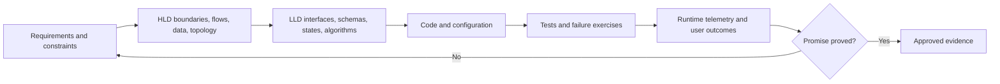
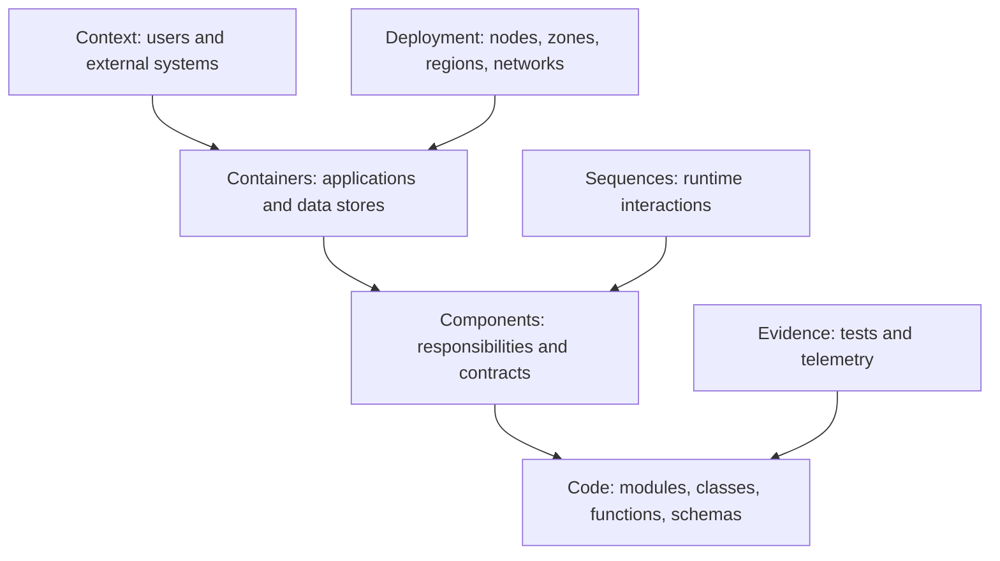
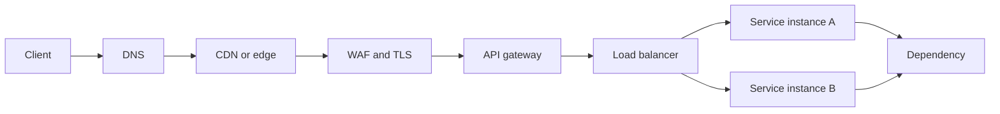
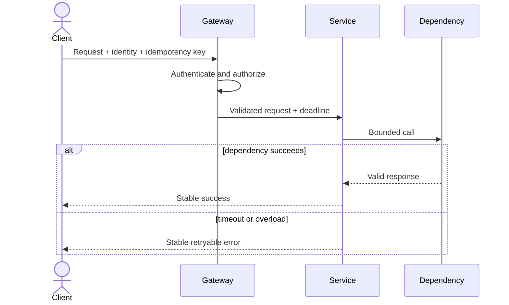
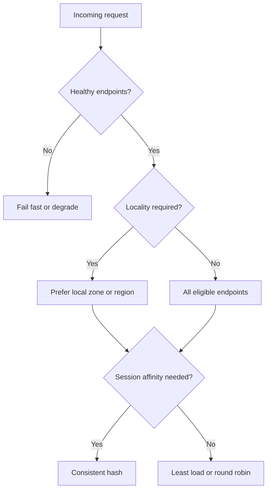
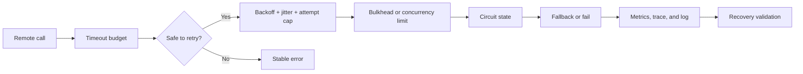

# Module 17 — System Design for DevOps/SRE

## Lesson 3: APIs, Networking and Load Balancing

# 17.3.1 Request path

```text
client → DNS → CDN/WAF → load balancer/API gateway
→ ingress/service mesh → service → dependency
```

At every hop define protocol, identity, timeout, retry ownership, connection reuse, health signal, capacity, observability, and failure behavior.

# 17.3.2 API contract

Use stable resource names, explicit errors, pagination, rate limits, versioning policy, and idempotency for retried mutations.

```http
POST /orders
Idempotency-Key: 8b6c...

201 Created
Location: /orders/ord-123
```

The service stores key, request fingerprint, and authoritative result for a bounded time. Reusing a key with different input must fail.

# 17.3.3 Timeout and retry budget

```text
client deadline 2s
  API internal deadline 1.7s
    database 300ms
    payment 700ms
```

Downstream timeouts must leave time to handle failure. Retry only transient, idempotent operations with capped attempts, exponential backoff, jitter, and a total deadline. Choose one layer to own retries.

# 17.3.4 Load balancing

Algorithms include round robin, least outstanding, weighted, hashing, and locality-aware routing. Health checks must reflect ability to serve traffic without coupling every replica to a shared dependency in a way that removes all endpoints simultaneously.

Connection-oriented protocols, WebSockets, caches, and sessions complicate balancing. Prefer stateless services or externalized session state; use affinity only when justified.

# 17.3.5 Resilience patterns

```text
rate limiting protects fairness/capacity
load shedding rejects work before collapse
circuit breaker limits calls to failing dependency
bulkhead isolates pools/failure domains
backpressure tells producers to slow
```

# 17.3.6 Lab

Draw the complete path for an API request. Assign timeouts and retries, then simulate a slow dependency. Prove load is bounded and the user receives a stable error. Validate logs/traces show the consumed deadline.

# 17.3.7 Beginner request-path mental model

An API call rarely travels directly from browser to code:

```text
client -> recursive/authoritative DNS -> CDN/WAF
-> public load balancer -> ingress/gateway -> service discovery
-> application -> cache/database/dependencies
```

Each hop adds latency, identity, certificate, timeout, routing, capacity, observability, and failure decisions.

# 17.3.8 API contract fundamentals

Define:

```text
resource and operation semantics
request/response schema and validation
authentication and per-resource authorization
status/error model
idempotency and retry behavior
pagination/filter/sort
rate and size limits
version/deprecation policy
timeout and asynchronous behavior
```

Return stable machine-readable error codes plus safe human messages. Do not leak stack traces or dependency credentials.

# 17.3.9 Idempotency for mutations

A client may time out after the server commits, then retry. Without an idempotency strategy it can create two orders/todos.

```text
client sends idempotency key
server validates key ownership/scope
server atomically stores key + operation/result
repeat returns same logical result
key expires under documented retention
```

Protect against key reuse with different payloads, cross-user guessing, unbounded storage, and concurrent duplicates.

# 17.3.10 Pagination and unbounded APIs

Never design “return every record.” Use stable cursor/keyset pagination when data can change during traversal. Specify maximum page size, ordering, consistency behavior, filters, and cursor expiry/tamper protection.

Offset pagination is simple but can become expensive and produce duplicates/misses during concurrent writes. Choose from access patterns.

# 17.3.11 End-to-end deadline budget

For a 500 ms client objective:

```text
edge/network       60 ms
gateway/API queue  50 ms
application        50 ms
database          120 ms
external call     120 ms
reserve/reply     100 ms
```

Propagate remaining deadlines downstream. A 2-second dependency timeout inside a 500 ms journey wastes work after the client has already given up.

# 17.3.12 Retry policy

Retry only when:

```text
failure is plausibly transient
operation is idempotent or protected by an idempotency key
remaining deadline permits it
retry budget/capacity allows it
response semantics explicitly allow it
```

Use exponential backoff and jitter. Limit attempts in one deliberate layer where possible. Never retry validation, authorization denial, or other permanent failures blindly.

# 17.3.13 Load-balancing algorithms

| Algorithm | Useful when | Risk |
|---|---|---|
| Round robin | Instances are similar | ignores unequal work/current load |
| Least outstanding/connections | request cost/latency varies | state accuracy and slow requests |
| Weighted | capacity differs/canary | weights need governance |
| Consistent hashing | affinity/cache locality | hotspots and rebalancing |
| Random/two choices | large fleets | requires suitable health/capacity model |

Health checks must represent readiness for new traffic without depending on every noncritical downstream service.

# 17.3.14 Connection management

Connection pooling improves efficiency but creates another capacity boundary. Size pools across all application replicas so the total stays within database/dependency limits.

Control DNS refresh, keepalive, idle timeout, TLS negotiation, HTTP/2 or gRPC multiplexing, connection draining, and ephemeral-port/NAT limits. Long-lived clients can keep stale endpoints during failover.

# 17.3.15 Circuit breaking and load shedding

A circuit breaker temporarily stops calls likely to fail and later probes recovery. Load shedding rejects lower-priority or excess work before the system collapses.

```text
deadline -> bounded queue -> concurrency limit -> retry budget
-> circuit state -> fallback or explicit overload response
```

Fallbacks must be safe and honest. Serving a stale price or authorization decision may be unacceptable.

# 17.3.16 Rate limiting and quotas

Decide scope:

```text
per identity/tenant/API key/IP/region/operation
burst capacity and sustained rate
distributed versus local enforcement
fairness for shared dependencies
response headers/error/retry-after semantics
internal bypass and abuse controls
```

Do not rely only on client IP behind proxies. Derive trusted identity at an authenticated boundary.

# 17.3.17 Real hands-on: design `POST /todos`

Produce an OpenAPI-style contract with:

```text
authorization and tenant ownership
body size/title rules
idempotency key header
201 success and safe validation/auth/conflict/overload errors
deadline behavior
audit event and telemetry contract
rate limit and abuse policy
```

Then test duplicate concurrent requests, client timeout after commit, malformed body, expired token, dependency timeout, overload, and server rollout/draining.

# 17.3.18 Failure lab: retry storm

Inject a dependency that fails 50% slowly. Enable retries at gateway, application, and client, then measure attempt amplification and latency. Redesign with one bounded retry layer, jitter, remaining deadline, idempotency, circuit breaker, and load shedding.

Count original requests, dependency attempts, retries, final outcomes, shed work, and queue time separately.

# 17.3.19 Failure lab: stale DNS and draining

Remove one application endpoint while using long-lived connections or cached DNS. Observe whether new and existing connections still reach it. Implement readiness removal, deregistration delay, connection draining, graceful termination, and client refresh behavior. Test requests during rolling deployment.

# 17.3.20 Security review

- TLS from required boundaries with certificate rotation.
- Authentication at the edge and authorization at each resource action.
- Proxy/header trust is explicit; spoofed forwarding headers are rejected.
- Request size, parsing, decompression, concurrency, and rate limits resist abuse.
- SSRF/redirect/egress behavior is controlled.
- Errors, logs, traces, and metrics omit tokens and sensitive payloads.
- API inventory/version/deprecation and audit events are governed.

# 17.3.21 Interview design walkthrough

When asked to design an API layer:

```text
clarify user and operation semantics
define resource/invariant and idempotency
estimate traffic/payload/concurrency
draw DNS/edge/LB/gateway/service/dependency path
allocate deadlines and retry responsibility
choose balancing, pooling, limiting, degradation
cover security, telemetry, rollout, failure, and evolution
```

# 17.3.22 Certification and interview questions

Network/API/load-balancing concepts span cloud and Kubernetes certifications; verify current product behavior and limits.

**Beginner: What does a load balancer do?**  Selects healthy backends and distributes traffic according to a policy while providing a stable entry point.

**Intermediate: Why do mutations need idempotency?**  A timeout leaves outcome uncertain; a safe retry must not duplicate the logical operation.

**Intermediate: Timeout versus retry?**  Timeout bounds waiting/work; retry makes another attempt under specific transient, idempotent, capacity, and deadline rules.

**Senior: Why is retry at every layer dangerous?**  Attempts multiply during failure and can overwhelm the dependency, extending the outage.

**Senior: Readiness versus liveness?**  Readiness controls whether a workload receives traffic; liveness detects a stuck process for restart. Poor liveness can create restart storms.

**Expert: How do you handle overload?**  Bound queues/concurrency/deadlines/retries, allocate fair quotas, shed lower-priority work early, preserve critical operations, and expose honest responses/telemetry.

**Architect: How do you design regional traffic failover?**  Include health semantics, DNS/anycast/global-LB behavior, client caching/connections, remaining capacity, data writer authority, staged routing, and failback validation.

**Never-forget answer:** every network hop consumes deadline and capacity. Make retries safe and bounded, identity trusted, load shed deliberately, and termination/draining testable.

<!-- GENERATED-MASTERY-WORKBOOK:START -->

# 17.3.23 Professional Mastery Workbook

This workbook expands **APIs, Networking and Load Balancing** into deliberate practice without replacing the authored tutorial above.

Use it after reading the core explanation. The goal is not to memorize thousands of lines; the goal is to repeatedly explain, build, break, secure, observe, recover, and defend the lesson in different conditions.

## Workbook learning contract

- Concepts covered: 22 lesson-specific anchors.
- Progression: beginner, intermediate, expert, professional, industry-ready, certification review, and interview defense.
- Safety: use synthetic data, disposable resources, explicit placeholders, least privilege, and bounded failure experiments.
- Completion: retain commands or configuration, observations, screenshots or query output, decisions, rollback evidence, and a short reflection.
- Quality rule: a passing answer states assumptions, protects a user or business outcome, names ownership, and validates the final result end to end.
- Currency rule: verify current official documentation, versions, limits, pricing, and certification objectives before relying on changing product behavior.

## Seven-stage progression

| Stage | Learner must demonstrate |
|---|---|
| Beginner | Explain the concept in plain language and give one safe example. |
| Intermediate | Connect components, data, control flow, and normal operating behavior. |
| Expert | Analyze trade-offs, edge cases, scaling pressure, and correlated failures. |
| Professional | Make a reviewed decision with owner, evidence, rollout, and rollback. |
| Industry-ready | Operate the design under security, failure, recovery, cost, and compliance constraints. |
| Certification review | Map durable concepts to the latest official objectives without relying on stale wording. |
| Interview defense | Answer concisely, clarify assumptions, draw the model, and defend alternatives. |

## Concept mastery cards

### Concept card 1 - Request path

- Lesson anchor: client → DNS → CDN/WAF → load balancer/API gateway → ingress/service mesh → service → dependency At every hop define protocol, identity, timeout, retry ownership, connection reuse, health signal, capacity, observability, and failure behavior.
- Beginner explanation: Restate **Request path** using a household, workplace, or public-service analogy without hiding the technical truth.
- Terminology check: Define every important noun, state, actor, and boundary before using abbreviations.
- Concrete example: Apply **Request path** to a small todo, checkout, or platform service and name the expected outcome.
- Intermediate connection: Draw the request, data, identity, and control flow that reaches this concept.
- Trade-off question: Compare at least two valid alternatives and state when each becomes the better choice.
- Expert edge case: Describe concurrency, retry, partial failure, scale, or stale-state behavior that a happy-path explanation misses.
- Hands-on artifact: Produce a requirement, invariant, and architecture decision record focused on **Request path**.
- Failure exercise: In an isolated environment, introduce a timeout and retry amplification path while observing the boundaries around **Request path**.
- Security review: Identify identity, authorization, sensitive-data, supply-chain, and abuse assumptions.
- Reliability review: Define the user-visible failure, containment, degraded mode, recovery, and final validation.
- Performance and cost review: Name the load driver, capacity limit, useful unit, and waste or amplification risk.
- Observability review: Specify the metric, structured event, trace boundary, change marker, and missing-data behavior.
- Professional decision: Record context, options, decision, consequences, owner, evidence, and revisit trigger.
- Certification checkpoint: Map the design evidence to the current cloud architecture, DevOps, or Kubernetes objectives and defend the trade-off provider-neutrally.
- Interview prompt: Explain **Request path** first in 30 seconds, then defend it in a five-minute system scenario.
- Strong-answer rubric: lead with outcome, state assumptions, explain mechanism, discuss failure and security, then validate with evidence.
- Completion evidence: retain the artifact, commands or query, observed failure, safe recovery, and one improvement.

### Concept card 2 - API contract

- Lesson anchor: Use stable resource names, explicit errors, pagination, rate limits, versioning policy, and idempotency for retried mutations. POST /orders Idempotency-Key: 8b6c... 201 Created Location: /orders/ord-123 The service stores key, request fingerprint, and autho...
- Beginner explanation: Restate **API contract** using a household, workplace, or public-service analogy without hiding the technical truth.
- Terminology check: Define every important noun, state, actor, and boundary before using abbreviations.
- Concrete example: Apply **API contract** to a small todo, checkout, or platform service and name the expected outcome.
- Intermediate connection: Draw the request, data, identity, and control flow that reaches this concept.
- Trade-off question: Compare at least two valid alternatives and state when each becomes the better choice.
- Expert edge case: Describe concurrency, retry, partial failure, scale, or stale-state behavior that a happy-path explanation misses.
- Hands-on artifact: Produce a capacity, latency, storage, and bandwidth calculation focused on **API contract**.
- Failure exercise: In an isolated environment, create a hot key, partition, cache, or queue condition while observing the boundaries around **API contract**.
- Security review: Identify identity, authorization, sensitive-data, supply-chain, and abuse assumptions.
- Reliability review: Define the user-visible failure, containment, degraded mode, recovery, and final validation.
- Performance and cost review: Name the load driver, capacity limit, useful unit, and waste or amplification risk.
- Observability review: Specify the metric, structured event, trace boundary, change marker, and missing-data behavior.
- Professional decision: Record context, options, decision, consequences, owner, evidence, and revisit trigger.
- Certification checkpoint: Map the design evidence to the current cloud architecture, DevOps, or Kubernetes objectives and defend the trade-off provider-neutrally.
- Interview prompt: Explain **API contract** first in 30 seconds, then defend it in a five-minute system scenario.
- Strong-answer rubric: lead with outcome, state assumptions, explain mechanism, discuss failure and security, then validate with evidence.
- Completion evidence: retain the artifact, commands or query, observed failure, safe recovery, and one improvement.

### Concept card 3 - Timeout and retry budget

- Lesson anchor: client deadline 2s API internal deadline 1.7s database 300ms payment 700ms Downstream timeouts must leave time to handle failure. Retry only transient, idempotent operations with capped attempts, exponential backoff, jitter, and a total deadline. Choose one...
- Beginner explanation: Restate **Timeout and retry budget** using a household, workplace, or public-service analogy without hiding the technical truth.
- Terminology check: Define every important noun, state, actor, and boundary before using abbreviations.
- Concrete example: Apply **Timeout and retry budget** to a small todo, checkout, or platform service and name the expected outcome.
- Intermediate connection: Draw the request, data, identity, and control flow that reaches this concept.
- Trade-off question: Compare at least two valid alternatives and state when each becomes the better choice.
- Expert edge case: Describe concurrency, retry, partial failure, scale, or stale-state behavior that a happy-path explanation misses.
- Hands-on artifact: Produce an API, data, or event contract with failure semantics focused on **Timeout and retry budget**.
- Failure exercise: In an isolated environment, remove a shared dependency or one failure domain while observing the boundaries around **Timeout and retry budget**.
- Security review: Identify identity, authorization, sensitive-data, supply-chain, and abuse assumptions.
- Reliability review: Define the user-visible failure, containment, degraded mode, recovery, and final validation.
- Performance and cost review: Name the load driver, capacity limit, useful unit, and waste or amplification risk.
- Observability review: Specify the metric, structured event, trace boundary, change marker, and missing-data behavior.
- Professional decision: Record context, options, decision, consequences, owner, evidence, and revisit trigger.
- Certification checkpoint: Map the design evidence to the current cloud architecture, DevOps, or Kubernetes objectives and defend the trade-off provider-neutrally.
- Interview prompt: Explain **Timeout and retry budget** first in 30 seconds, then defend it in a five-minute system scenario.
- Strong-answer rubric: lead with outcome, state assumptions, explain mechanism, discuss failure and security, then validate with evidence.
- Completion evidence: retain the artifact, commands or query, observed failure, safe recovery, and one improvement.

### Concept card 4 - Load balancing

- Lesson anchor: Algorithms include round robin, least outstanding, weighted, hashing, and locality-aware routing. Health checks must reflect ability to serve traffic without coupling every replica to a shared dependency in a way that removes all endpoints simultaneously.
- Beginner explanation: Restate **Load balancing** using a household, workplace, or public-service analogy without hiding the technical truth.
- Terminology check: Define every important noun, state, actor, and boundary before using abbreviations.
- Concrete example: Apply **Load balancing** to a small todo, checkout, or platform service and name the expected outcome.
- Intermediate connection: Draw the request, data, identity, and control flow that reaches this concept.
- Trade-off question: Compare at least two valid alternatives and state when each becomes the better choice.
- Expert edge case: Describe concurrency, retry, partial failure, scale, or stale-state behavior that a happy-path explanation misses.
- Hands-on artifact: Produce a context, data-flow, trust, and failure-domain diagram focused on **Load balancing**.
- Failure exercise: In an isolated environment, make data arrive duplicated, late, or out of order while observing the boundaries around **Load balancing**.
- Security review: Identify identity, authorization, sensitive-data, supply-chain, and abuse assumptions.
- Reliability review: Define the user-visible failure, containment, degraded mode, recovery, and final validation.
- Performance and cost review: Name the load driver, capacity limit, useful unit, and waste or amplification risk.
- Observability review: Specify the metric, structured event, trace boundary, change marker, and missing-data behavior.
- Professional decision: Record context, options, decision, consequences, owner, evidence, and revisit trigger.
- Certification checkpoint: Map the design evidence to the current cloud architecture, DevOps, or Kubernetes objectives and defend the trade-off provider-neutrally.
- Interview prompt: Explain **Load balancing** first in 30 seconds, then defend it in a five-minute system scenario.
- Strong-answer rubric: lead with outcome, state assumptions, explain mechanism, discuss failure and security, then validate with evidence.
- Completion evidence: retain the artifact, commands or query, observed failure, safe recovery, and one improvement.

### Concept card 5 - Resilience patterns

- Lesson anchor: rate limiting protects fairness/capacity load shedding rejects work before collapse circuit breaker limits calls to failing dependency bulkhead isolates pools/failure domains backpressure tells producers to slow
- Beginner explanation: Restate **Resilience patterns** using a household, workplace, or public-service analogy without hiding the technical truth.
- Terminology check: Define every important noun, state, actor, and boundary before using abbreviations.
- Concrete example: Apply **Resilience patterns** to a small todo, checkout, or platform service and name the expected outcome.
- Intermediate connection: Draw the request, data, identity, and control flow that reaches this concept.
- Trade-off question: Compare at least two valid alternatives and state when each becomes the better choice.
- Expert edge case: Describe concurrency, retry, partial failure, scale, or stale-state behavior that a happy-path explanation misses.
- Hands-on artifact: Produce a load-test and graceful-degradation report focused on **Resilience patterns**.
- Failure exercise: In an isolated environment, overload the system beyond its modeled queueing knee while observing the boundaries around **Resilience patterns**.
- Security review: Identify identity, authorization, sensitive-data, supply-chain, and abuse assumptions.
- Reliability review: Define the user-visible failure, containment, degraded mode, recovery, and final validation.
- Performance and cost review: Name the load driver, capacity limit, useful unit, and waste or amplification risk.
- Observability review: Specify the metric, structured event, trace boundary, change marker, and missing-data behavior.
- Professional decision: Record context, options, decision, consequences, owner, evidence, and revisit trigger.
- Certification checkpoint: Map the design evidence to the current cloud architecture, DevOps, or Kubernetes objectives and defend the trade-off provider-neutrally.
- Interview prompt: Explain **Resilience patterns** first in 30 seconds, then defend it in a five-minute system scenario.
- Strong-answer rubric: lead with outcome, state assumptions, explain mechanism, discuss failure and security, then validate with evidence.
- Completion evidence: retain the artifact, commands or query, observed failure, safe recovery, and one improvement.

### Concept card 6 - Lab

- Lesson anchor: Draw the complete path for an API request. Assign timeouts and retries, then simulate a slow dependency. Prove load is bounded and the user receives a stable error. Validate logs/traces show the consumed deadline.
- Beginner explanation: Restate **Lab** using a household, workplace, or public-service analogy without hiding the technical truth.
- Terminology check: Define every important noun, state, actor, and boundary before using abbreviations.
- Concrete example: Apply **Lab** to a small todo, checkout, or platform service and name the expected outcome.
- Intermediate connection: Draw the request, data, identity, and control flow that reaches this concept.
- Trade-off question: Compare at least two valid alternatives and state when each becomes the better choice.
- Expert edge case: Describe concurrency, retry, partial failure, scale, or stale-state behavior that a happy-path explanation misses.
- Hands-on artifact: Produce a multi-region failover and failback state machine focused on **Lab**.
- Failure exercise: In an isolated environment, make a regional writer or routing decision ambiguous while observing the boundaries around **Lab**.
- Security review: Identify identity, authorization, sensitive-data, supply-chain, and abuse assumptions.
- Reliability review: Define the user-visible failure, containment, degraded mode, recovery, and final validation.
- Performance and cost review: Name the load driver, capacity limit, useful unit, and waste or amplification risk.
- Observability review: Specify the metric, structured event, trace boundary, change marker, and missing-data behavior.
- Professional decision: Record context, options, decision, consequences, owner, evidence, and revisit trigger.
- Certification checkpoint: Map the design evidence to the current cloud architecture, DevOps, or Kubernetes objectives and defend the trade-off provider-neutrally.
- Interview prompt: Explain **Lab** first in 30 seconds, then defend it in a five-minute system scenario.
- Strong-answer rubric: lead with outcome, state assumptions, explain mechanism, discuss failure and security, then validate with evidence.
- Completion evidence: retain the artifact, commands or query, observed failure, safe recovery, and one improvement.

### Concept card 7 - Beginner request-path mental model

- Lesson anchor: An API call rarely travels directly from browser to code: client - recursive/authoritative DNS - CDN/WAF - public load balancer - ingress/gateway - service discovery - application - cache/database/dependencies Each hop adds latency, identity, certificate, t...
- Beginner explanation: Restate **Beginner request-path mental model** using a household, workplace, or public-service analogy without hiding the technical truth.
- Terminology check: Define every important noun, state, actor, and boundary before using abbreviations.
- Concrete example: Apply **Beginner request-path mental model** to a small todo, checkout, or platform service and name the expected outcome.
- Intermediate connection: Draw the request, data, identity, and control flow that reaches this concept.
- Trade-off question: Compare at least two valid alternatives and state when each becomes the better choice.
- Expert edge case: Describe concurrency, retry, partial failure, scale, or stale-state behavior that a happy-path explanation misses.
- Hands-on artifact: Produce a requirement, invariant, and architecture decision record focused on **Beginner request-path mental model**.
- Failure exercise: In an isolated environment, introduce a timeout and retry amplification path while observing the boundaries around **Beginner request-path mental model**.
- Security review: Identify identity, authorization, sensitive-data, supply-chain, and abuse assumptions.
- Reliability review: Define the user-visible failure, containment, degraded mode, recovery, and final validation.
- Performance and cost review: Name the load driver, capacity limit, useful unit, and waste or amplification risk.
- Observability review: Specify the metric, structured event, trace boundary, change marker, and missing-data behavior.
- Professional decision: Record context, options, decision, consequences, owner, evidence, and revisit trigger.
- Certification checkpoint: Map the design evidence to the current cloud architecture, DevOps, or Kubernetes objectives and defend the trade-off provider-neutrally.
- Interview prompt: Explain **Beginner request-path mental model** first in 30 seconds, then defend it in a five-minute system scenario.
- Strong-answer rubric: lead with outcome, state assumptions, explain mechanism, discuss failure and security, then validate with evidence.
- Completion evidence: retain the artifact, commands or query, observed failure, safe recovery, and one improvement.

### Concept card 8 - API contract fundamentals

- Lesson anchor: Define: resource and operation semantics request/response schema and validation authentication and per-resource authorization status/error model idempotency and retry behavior pagination/filter/sort rate and size limits version/deprecation policy
- Beginner explanation: Restate **API contract fundamentals** using a household, workplace, or public-service analogy without hiding the technical truth.
- Terminology check: Define every important noun, state, actor, and boundary before using abbreviations.
- Concrete example: Apply **API contract fundamentals** to a small todo, checkout, or platform service and name the expected outcome.
- Intermediate connection: Draw the request, data, identity, and control flow that reaches this concept.
- Trade-off question: Compare at least two valid alternatives and state when each becomes the better choice.
- Expert edge case: Describe concurrency, retry, partial failure, scale, or stale-state behavior that a happy-path explanation misses.
- Hands-on artifact: Produce a capacity, latency, storage, and bandwidth calculation focused on **API contract fundamentals**.
- Failure exercise: In an isolated environment, create a hot key, partition, cache, or queue condition while observing the boundaries around **API contract fundamentals**.
- Security review: Identify identity, authorization, sensitive-data, supply-chain, and abuse assumptions.
- Reliability review: Define the user-visible failure, containment, degraded mode, recovery, and final validation.
- Performance and cost review: Name the load driver, capacity limit, useful unit, and waste or amplification risk.
- Observability review: Specify the metric, structured event, trace boundary, change marker, and missing-data behavior.
- Professional decision: Record context, options, decision, consequences, owner, evidence, and revisit trigger.
- Certification checkpoint: Map the design evidence to the current cloud architecture, DevOps, or Kubernetes objectives and defend the trade-off provider-neutrally.
- Interview prompt: Explain **API contract fundamentals** first in 30 seconds, then defend it in a five-minute system scenario.
- Strong-answer rubric: lead with outcome, state assumptions, explain mechanism, discuss failure and security, then validate with evidence.
- Completion evidence: retain the artifact, commands or query, observed failure, safe recovery, and one improvement.

### Concept card 9 - Idempotency for mutations

- Lesson anchor: A client may time out after the server commits, then retry. Without an idempotency strategy it can create two orders/todos. client sends idempotency key server validates key ownership/scope server atomically stores key + operation/result
- Beginner explanation: Restate **Idempotency for mutations** using a household, workplace, or public-service analogy without hiding the technical truth.
- Terminology check: Define every important noun, state, actor, and boundary before using abbreviations.
- Concrete example: Apply **Idempotency for mutations** to a small todo, checkout, or platform service and name the expected outcome.
- Intermediate connection: Draw the request, data, identity, and control flow that reaches this concept.
- Trade-off question: Compare at least two valid alternatives and state when each becomes the better choice.
- Expert edge case: Describe concurrency, retry, partial failure, scale, or stale-state behavior that a happy-path explanation misses.
- Hands-on artifact: Produce an API, data, or event contract with failure semantics focused on **Idempotency for mutations**.
- Failure exercise: In an isolated environment, remove a shared dependency or one failure domain while observing the boundaries around **Idempotency for mutations**.
- Security review: Identify identity, authorization, sensitive-data, supply-chain, and abuse assumptions.
- Reliability review: Define the user-visible failure, containment, degraded mode, recovery, and final validation.
- Performance and cost review: Name the load driver, capacity limit, useful unit, and waste or amplification risk.
- Observability review: Specify the metric, structured event, trace boundary, change marker, and missing-data behavior.
- Professional decision: Record context, options, decision, consequences, owner, evidence, and revisit trigger.
- Certification checkpoint: Map the design evidence to the current cloud architecture, DevOps, or Kubernetes objectives and defend the trade-off provider-neutrally.
- Interview prompt: Explain **Idempotency for mutations** first in 30 seconds, then defend it in a five-minute system scenario.
- Strong-answer rubric: lead with outcome, state assumptions, explain mechanism, discuss failure and security, then validate with evidence.
- Completion evidence: retain the artifact, commands or query, observed failure, safe recovery, and one improvement.

### Concept card 10 - Pagination and unbounded APIs

- Lesson anchor: Never design “return every record.” Use stable cursor/keyset pagination when data can change during traversal. Specify maximum page size, ordering, consistency behavior, filters, and cursor expiry/tamper protection. Offset pagination is simple but can becom...
- Beginner explanation: Restate **Pagination and unbounded APIs** using a household, workplace, or public-service analogy without hiding the technical truth.
- Terminology check: Define every important noun, state, actor, and boundary before using abbreviations.
- Concrete example: Apply **Pagination and unbounded APIs** to a small todo, checkout, or platform service and name the expected outcome.
- Intermediate connection: Draw the request, data, identity, and control flow that reaches this concept.
- Trade-off question: Compare at least two valid alternatives and state when each becomes the better choice.
- Expert edge case: Describe concurrency, retry, partial failure, scale, or stale-state behavior that a happy-path explanation misses.
- Hands-on artifact: Produce a context, data-flow, trust, and failure-domain diagram focused on **Pagination and unbounded APIs**.
- Failure exercise: In an isolated environment, make data arrive duplicated, late, or out of order while observing the boundaries around **Pagination and unbounded APIs**.
- Security review: Identify identity, authorization, sensitive-data, supply-chain, and abuse assumptions.
- Reliability review: Define the user-visible failure, containment, degraded mode, recovery, and final validation.
- Performance and cost review: Name the load driver, capacity limit, useful unit, and waste or amplification risk.
- Observability review: Specify the metric, structured event, trace boundary, change marker, and missing-data behavior.
- Professional decision: Record context, options, decision, consequences, owner, evidence, and revisit trigger.
- Certification checkpoint: Map the design evidence to the current cloud architecture, DevOps, or Kubernetes objectives and defend the trade-off provider-neutrally.
- Interview prompt: Explain **Pagination and unbounded APIs** first in 30 seconds, then defend it in a five-minute system scenario.
- Strong-answer rubric: lead with outcome, state assumptions, explain mechanism, discuss failure and security, then validate with evidence.
- Completion evidence: retain the artifact, commands or query, observed failure, safe recovery, and one improvement.

### Concept card 11 - End-to-end deadline budget

- Lesson anchor: For a 500 ms client objective: edge/network       60 ms gateway/API queue  50 ms application        50 ms database          120 ms external call     120 ms reserve/reply     100 ms Propagate remaining deadlines downstream. A 2-second dependency timeout insi...
- Beginner explanation: Restate **End-to-end deadline budget** using a household, workplace, or public-service analogy without hiding the technical truth.
- Terminology check: Define every important noun, state, actor, and boundary before using abbreviations.
- Concrete example: Apply **End-to-end deadline budget** to a small todo, checkout, or platform service and name the expected outcome.
- Intermediate connection: Draw the request, data, identity, and control flow that reaches this concept.
- Trade-off question: Compare at least two valid alternatives and state when each becomes the better choice.
- Expert edge case: Describe concurrency, retry, partial failure, scale, or stale-state behavior that a happy-path explanation misses.
- Hands-on artifact: Produce a load-test and graceful-degradation report focused on **End-to-end deadline budget**.
- Failure exercise: In an isolated environment, overload the system beyond its modeled queueing knee while observing the boundaries around **End-to-end deadline budget**.
- Security review: Identify identity, authorization, sensitive-data, supply-chain, and abuse assumptions.
- Reliability review: Define the user-visible failure, containment, degraded mode, recovery, and final validation.
- Performance and cost review: Name the load driver, capacity limit, useful unit, and waste or amplification risk.
- Observability review: Specify the metric, structured event, trace boundary, change marker, and missing-data behavior.
- Professional decision: Record context, options, decision, consequences, owner, evidence, and revisit trigger.
- Certification checkpoint: Map the design evidence to the current cloud architecture, DevOps, or Kubernetes objectives and defend the trade-off provider-neutrally.
- Interview prompt: Explain **End-to-end deadline budget** first in 30 seconds, then defend it in a five-minute system scenario.
- Strong-answer rubric: lead with outcome, state assumptions, explain mechanism, discuss failure and security, then validate with evidence.
- Completion evidence: retain the artifact, commands or query, observed failure, safe recovery, and one improvement.

### Concept card 12 - Retry policy

- Lesson anchor: Retry only when: failure is plausibly transient operation is idempotent or protected by an idempotency key remaining deadline permits it retry budget/capacity allows it response semantics explicitly allow it Use exponential backoff and jitter. Limit attempt...
- Beginner explanation: Restate **Retry policy** using a household, workplace, or public-service analogy without hiding the technical truth.
- Terminology check: Define every important noun, state, actor, and boundary before using abbreviations.
- Concrete example: Apply **Retry policy** to a small todo, checkout, or platform service and name the expected outcome.
- Intermediate connection: Draw the request, data, identity, and control flow that reaches this concept.
- Trade-off question: Compare at least two valid alternatives and state when each becomes the better choice.
- Expert edge case: Describe concurrency, retry, partial failure, scale, or stale-state behavior that a happy-path explanation misses.
- Hands-on artifact: Produce a multi-region failover and failback state machine focused on **Retry policy**.
- Failure exercise: In an isolated environment, make a regional writer or routing decision ambiguous while observing the boundaries around **Retry policy**.
- Security review: Identify identity, authorization, sensitive-data, supply-chain, and abuse assumptions.
- Reliability review: Define the user-visible failure, containment, degraded mode, recovery, and final validation.
- Performance and cost review: Name the load driver, capacity limit, useful unit, and waste or amplification risk.
- Observability review: Specify the metric, structured event, trace boundary, change marker, and missing-data behavior.
- Professional decision: Record context, options, decision, consequences, owner, evidence, and revisit trigger.
- Certification checkpoint: Map the design evidence to the current cloud architecture, DevOps, or Kubernetes objectives and defend the trade-off provider-neutrally.
- Interview prompt: Explain **Retry policy** first in 30 seconds, then defend it in a five-minute system scenario.
- Strong-answer rubric: lead with outcome, state assumptions, explain mechanism, discuss failure and security, then validate with evidence.
- Completion evidence: retain the artifact, commands or query, observed failure, safe recovery, and one improvement.

### Concept card 13 - Load-balancing algorithms

- Lesson anchor: Health checks must represent readiness for new traffic without depending on every noncritical downstream service.
- Beginner explanation: Restate **Load-balancing algorithms** using a household, workplace, or public-service analogy without hiding the technical truth.
- Terminology check: Define every important noun, state, actor, and boundary before using abbreviations.
- Concrete example: Apply **Load-balancing algorithms** to a small todo, checkout, or platform service and name the expected outcome.
- Intermediate connection: Draw the request, data, identity, and control flow that reaches this concept.
- Trade-off question: Compare at least two valid alternatives and state when each becomes the better choice.
- Expert edge case: Describe concurrency, retry, partial failure, scale, or stale-state behavior that a happy-path explanation misses.
- Hands-on artifact: Produce a requirement, invariant, and architecture decision record focused on **Load-balancing algorithms**.
- Failure exercise: In an isolated environment, introduce a timeout and retry amplification path while observing the boundaries around **Load-balancing algorithms**.
- Security review: Identify identity, authorization, sensitive-data, supply-chain, and abuse assumptions.
- Reliability review: Define the user-visible failure, containment, degraded mode, recovery, and final validation.
- Performance and cost review: Name the load driver, capacity limit, useful unit, and waste or amplification risk.
- Observability review: Specify the metric, structured event, trace boundary, change marker, and missing-data behavior.
- Professional decision: Record context, options, decision, consequences, owner, evidence, and revisit trigger.
- Certification checkpoint: Map the design evidence to the current cloud architecture, DevOps, or Kubernetes objectives and defend the trade-off provider-neutrally.
- Interview prompt: Explain **Load-balancing algorithms** first in 30 seconds, then defend it in a five-minute system scenario.
- Strong-answer rubric: lead with outcome, state assumptions, explain mechanism, discuss failure and security, then validate with evidence.
- Completion evidence: retain the artifact, commands or query, observed failure, safe recovery, and one improvement.

### Concept card 14 - Connection management

- Lesson anchor: Connection pooling improves efficiency but creates another capacity boundary. Size pools across all application replicas so the total stays within database/dependency limits. Control DNS refresh, keepalive, idle timeout, TLS negotiation, HTTP/2 or gRPC mult...
- Beginner explanation: Restate **Connection management** using a household, workplace, or public-service analogy without hiding the technical truth.
- Terminology check: Define every important noun, state, actor, and boundary before using abbreviations.
- Concrete example: Apply **Connection management** to a small todo, checkout, or platform service and name the expected outcome.
- Intermediate connection: Draw the request, data, identity, and control flow that reaches this concept.
- Trade-off question: Compare at least two valid alternatives and state when each becomes the better choice.
- Expert edge case: Describe concurrency, retry, partial failure, scale, or stale-state behavior that a happy-path explanation misses.
- Hands-on artifact: Produce a capacity, latency, storage, and bandwidth calculation focused on **Connection management**.
- Failure exercise: In an isolated environment, create a hot key, partition, cache, or queue condition while observing the boundaries around **Connection management**.
- Security review: Identify identity, authorization, sensitive-data, supply-chain, and abuse assumptions.
- Reliability review: Define the user-visible failure, containment, degraded mode, recovery, and final validation.
- Performance and cost review: Name the load driver, capacity limit, useful unit, and waste or amplification risk.
- Observability review: Specify the metric, structured event, trace boundary, change marker, and missing-data behavior.
- Professional decision: Record context, options, decision, consequences, owner, evidence, and revisit trigger.
- Certification checkpoint: Map the design evidence to the current cloud architecture, DevOps, or Kubernetes objectives and defend the trade-off provider-neutrally.
- Interview prompt: Explain **Connection management** first in 30 seconds, then defend it in a five-minute system scenario.
- Strong-answer rubric: lead with outcome, state assumptions, explain mechanism, discuss failure and security, then validate with evidence.
- Completion evidence: retain the artifact, commands or query, observed failure, safe recovery, and one improvement.

### Concept card 15 - Circuit breaking and load shedding

- Lesson anchor: A circuit breaker temporarily stops calls likely to fail and later probes recovery. Load shedding rejects lower-priority or excess work before the system collapses. deadline - bounded queue - concurrency limit - retry budget
- Beginner explanation: Restate **Circuit breaking and load shedding** using a household, workplace, or public-service analogy without hiding the technical truth.
- Terminology check: Define every important noun, state, actor, and boundary before using abbreviations.
- Concrete example: Apply **Circuit breaking and load shedding** to a small todo, checkout, or platform service and name the expected outcome.
- Intermediate connection: Draw the request, data, identity, and control flow that reaches this concept.
- Trade-off question: Compare at least two valid alternatives and state when each becomes the better choice.
- Expert edge case: Describe concurrency, retry, partial failure, scale, or stale-state behavior that a happy-path explanation misses.
- Hands-on artifact: Produce an API, data, or event contract with failure semantics focused on **Circuit breaking and load shedding**.
- Failure exercise: In an isolated environment, remove a shared dependency or one failure domain while observing the boundaries around **Circuit breaking and load shedding**.
- Security review: Identify identity, authorization, sensitive-data, supply-chain, and abuse assumptions.
- Reliability review: Define the user-visible failure, containment, degraded mode, recovery, and final validation.
- Performance and cost review: Name the load driver, capacity limit, useful unit, and waste or amplification risk.
- Observability review: Specify the metric, structured event, trace boundary, change marker, and missing-data behavior.
- Professional decision: Record context, options, decision, consequences, owner, evidence, and revisit trigger.
- Certification checkpoint: Map the design evidence to the current cloud architecture, DevOps, or Kubernetes objectives and defend the trade-off provider-neutrally.
- Interview prompt: Explain **Circuit breaking and load shedding** first in 30 seconds, then defend it in a five-minute system scenario.
- Strong-answer rubric: lead with outcome, state assumptions, explain mechanism, discuss failure and security, then validate with evidence.
- Completion evidence: retain the artifact, commands or query, observed failure, safe recovery, and one improvement.

### Concept card 16 - Rate limiting and quotas

- Lesson anchor: Decide scope: per identity/tenant/API key/IP/region/operation burst capacity and sustained rate distributed versus local enforcement fairness for shared dependencies response headers/error/retry-after semantics internal bypass and abuse controls
- Beginner explanation: Restate **Rate limiting and quotas** using a household, workplace, or public-service analogy without hiding the technical truth.
- Terminology check: Define every important noun, state, actor, and boundary before using abbreviations.
- Concrete example: Apply **Rate limiting and quotas** to a small todo, checkout, or platform service and name the expected outcome.
- Intermediate connection: Draw the request, data, identity, and control flow that reaches this concept.
- Trade-off question: Compare at least two valid alternatives and state when each becomes the better choice.
- Expert edge case: Describe concurrency, retry, partial failure, scale, or stale-state behavior that a happy-path explanation misses.
- Hands-on artifact: Produce a context, data-flow, trust, and failure-domain diagram focused on **Rate limiting and quotas**.
- Failure exercise: In an isolated environment, make data arrive duplicated, late, or out of order while observing the boundaries around **Rate limiting and quotas**.
- Security review: Identify identity, authorization, sensitive-data, supply-chain, and abuse assumptions.
- Reliability review: Define the user-visible failure, containment, degraded mode, recovery, and final validation.
- Performance and cost review: Name the load driver, capacity limit, useful unit, and waste or amplification risk.
- Observability review: Specify the metric, structured event, trace boundary, change marker, and missing-data behavior.
- Professional decision: Record context, options, decision, consequences, owner, evidence, and revisit trigger.
- Certification checkpoint: Map the design evidence to the current cloud architecture, DevOps, or Kubernetes objectives and defend the trade-off provider-neutrally.
- Interview prompt: Explain **Rate limiting and quotas** first in 30 seconds, then defend it in a five-minute system scenario.
- Strong-answer rubric: lead with outcome, state assumptions, explain mechanism, discuss failure and security, then validate with evidence.
- Completion evidence: retain the artifact, commands or query, observed failure, safe recovery, and one improvement.

### Concept card 17 - Real hands-on: design `POST /todos`

- Lesson anchor: Produce an OpenAPI-style contract with: authorization and tenant ownership body size/title rules idempotency key header 201 success and safe validation/auth/conflict/overload errors deadline behavior audit event and telemetry contract
- Beginner explanation: Restate **Real hands-on: design `POST /todos`** using a household, workplace, or public-service analogy without hiding the technical truth.
- Terminology check: Define every important noun, state, actor, and boundary before using abbreviations.
- Concrete example: Apply **Real hands-on: design `POST /todos`** to a small todo, checkout, or platform service and name the expected outcome.
- Intermediate connection: Draw the request, data, identity, and control flow that reaches this concept.
- Trade-off question: Compare at least two valid alternatives and state when each becomes the better choice.
- Expert edge case: Describe concurrency, retry, partial failure, scale, or stale-state behavior that a happy-path explanation misses.
- Hands-on artifact: Produce a load-test and graceful-degradation report focused on **Real hands-on: design `POST /todos`**.
- Failure exercise: In an isolated environment, overload the system beyond its modeled queueing knee while observing the boundaries around **Real hands-on: design `POST /todos`**.
- Security review: Identify identity, authorization, sensitive-data, supply-chain, and abuse assumptions.
- Reliability review: Define the user-visible failure, containment, degraded mode, recovery, and final validation.
- Performance and cost review: Name the load driver, capacity limit, useful unit, and waste or amplification risk.
- Observability review: Specify the metric, structured event, trace boundary, change marker, and missing-data behavior.
- Professional decision: Record context, options, decision, consequences, owner, evidence, and revisit trigger.
- Certification checkpoint: Map the design evidence to the current cloud architecture, DevOps, or Kubernetes objectives and defend the trade-off provider-neutrally.
- Interview prompt: Explain **Real hands-on: design `POST /todos`** first in 30 seconds, then defend it in a five-minute system scenario.
- Strong-answer rubric: lead with outcome, state assumptions, explain mechanism, discuss failure and security, then validate with evidence.
- Completion evidence: retain the artifact, commands or query, observed failure, safe recovery, and one improvement.

### Concept card 18 - Failure lab: retry storm

- Lesson anchor: Inject a dependency that fails 50% slowly. Enable retries at gateway, application, and client, then measure attempt amplification and latency. Redesign with one bounded retry layer, jitter, remaining deadline, idempotency, circuit breaker, and load shedding.
- Beginner explanation: Restate **Failure lab: retry storm** using a household, workplace, or public-service analogy without hiding the technical truth.
- Terminology check: Define every important noun, state, actor, and boundary before using abbreviations.
- Concrete example: Apply **Failure lab: retry storm** to a small todo, checkout, or platform service and name the expected outcome.
- Intermediate connection: Draw the request, data, identity, and control flow that reaches this concept.
- Trade-off question: Compare at least two valid alternatives and state when each becomes the better choice.
- Expert edge case: Describe concurrency, retry, partial failure, scale, or stale-state behavior that a happy-path explanation misses.
- Hands-on artifact: Produce a multi-region failover and failback state machine focused on **Failure lab: retry storm**.
- Failure exercise: In an isolated environment, make a regional writer or routing decision ambiguous while observing the boundaries around **Failure lab: retry storm**.
- Security review: Identify identity, authorization, sensitive-data, supply-chain, and abuse assumptions.
- Reliability review: Define the user-visible failure, containment, degraded mode, recovery, and final validation.
- Performance and cost review: Name the load driver, capacity limit, useful unit, and waste or amplification risk.
- Observability review: Specify the metric, structured event, trace boundary, change marker, and missing-data behavior.
- Professional decision: Record context, options, decision, consequences, owner, evidence, and revisit trigger.
- Certification checkpoint: Map the design evidence to the current cloud architecture, DevOps, or Kubernetes objectives and defend the trade-off provider-neutrally.
- Interview prompt: Explain **Failure lab: retry storm** first in 30 seconds, then defend it in a five-minute system scenario.
- Strong-answer rubric: lead with outcome, state assumptions, explain mechanism, discuss failure and security, then validate with evidence.
- Completion evidence: retain the artifact, commands or query, observed failure, safe recovery, and one improvement.

### Concept card 19 - Failure lab: stale DNS and draining

- Lesson anchor: Remove one application endpoint while using long-lived connections or cached DNS. Observe whether new and existing connections still reach it. Implement readiness removal, deregistration delay, connection draining, graceful termination, and client refresh b...
- Beginner explanation: Restate **Failure lab: stale DNS and draining** using a household, workplace, or public-service analogy without hiding the technical truth.
- Terminology check: Define every important noun, state, actor, and boundary before using abbreviations.
- Concrete example: Apply **Failure lab: stale DNS and draining** to a small todo, checkout, or platform service and name the expected outcome.
- Intermediate connection: Draw the request, data, identity, and control flow that reaches this concept.
- Trade-off question: Compare at least two valid alternatives and state when each becomes the better choice.
- Expert edge case: Describe concurrency, retry, partial failure, scale, or stale-state behavior that a happy-path explanation misses.
- Hands-on artifact: Produce a requirement, invariant, and architecture decision record focused on **Failure lab: stale DNS and draining**.
- Failure exercise: In an isolated environment, introduce a timeout and retry amplification path while observing the boundaries around **Failure lab: stale DNS and draining**.
- Security review: Identify identity, authorization, sensitive-data, supply-chain, and abuse assumptions.
- Reliability review: Define the user-visible failure, containment, degraded mode, recovery, and final validation.
- Performance and cost review: Name the load driver, capacity limit, useful unit, and waste or amplification risk.
- Observability review: Specify the metric, structured event, trace boundary, change marker, and missing-data behavior.
- Professional decision: Record context, options, decision, consequences, owner, evidence, and revisit trigger.
- Certification checkpoint: Map the design evidence to the current cloud architecture, DevOps, or Kubernetes objectives and defend the trade-off provider-neutrally.
- Interview prompt: Explain **Failure lab: stale DNS and draining** first in 30 seconds, then defend it in a five-minute system scenario.
- Strong-answer rubric: lead with outcome, state assumptions, explain mechanism, discuss failure and security, then validate with evidence.
- Completion evidence: retain the artifact, commands or query, observed failure, safe recovery, and one improvement.

### Concept card 20 - Security review

- Lesson anchor: The lesson establishes Security review as a concept that must be explained, implemented, tested, and defended.
- Beginner explanation: Restate **Security review** using a household, workplace, or public-service analogy without hiding the technical truth.
- Terminology check: Define every important noun, state, actor, and boundary before using abbreviations.
- Concrete example: Apply **Security review** to a small todo, checkout, or platform service and name the expected outcome.
- Intermediate connection: Draw the request, data, identity, and control flow that reaches this concept.
- Trade-off question: Compare at least two valid alternatives and state when each becomes the better choice.
- Expert edge case: Describe concurrency, retry, partial failure, scale, or stale-state behavior that a happy-path explanation misses.
- Hands-on artifact: Produce a capacity, latency, storage, and bandwidth calculation focused on **Security review**.
- Failure exercise: In an isolated environment, create a hot key, partition, cache, or queue condition while observing the boundaries around **Security review**.
- Security review: Identify identity, authorization, sensitive-data, supply-chain, and abuse assumptions.
- Reliability review: Define the user-visible failure, containment, degraded mode, recovery, and final validation.
- Performance and cost review: Name the load driver, capacity limit, useful unit, and waste or amplification risk.
- Observability review: Specify the metric, structured event, trace boundary, change marker, and missing-data behavior.
- Professional decision: Record context, options, decision, consequences, owner, evidence, and revisit trigger.
- Certification checkpoint: Map the design evidence to the current cloud architecture, DevOps, or Kubernetes objectives and defend the trade-off provider-neutrally.
- Interview prompt: Explain **Security review** first in 30 seconds, then defend it in a five-minute system scenario.
- Strong-answer rubric: lead with outcome, state assumptions, explain mechanism, discuss failure and security, then validate with evidence.
- Completion evidence: retain the artifact, commands or query, observed failure, safe recovery, and one improvement.

### Concept card 21 - Interview design walkthrough

- Lesson anchor: When asked to design an API layer: clarify user and operation semantics define resource/invariant and idempotency estimate traffic/payload/concurrency draw DNS/edge/LB/gateway/service/dependency path allocate deadlines and retry responsibility
- Beginner explanation: Restate **Interview design walkthrough** using a household, workplace, or public-service analogy without hiding the technical truth.
- Terminology check: Define every important noun, state, actor, and boundary before using abbreviations.
- Concrete example: Apply **Interview design walkthrough** to a small todo, checkout, or platform service and name the expected outcome.
- Intermediate connection: Draw the request, data, identity, and control flow that reaches this concept.
- Trade-off question: Compare at least two valid alternatives and state when each becomes the better choice.
- Expert edge case: Describe concurrency, retry, partial failure, scale, or stale-state behavior that a happy-path explanation misses.
- Hands-on artifact: Produce an API, data, or event contract with failure semantics focused on **Interview design walkthrough**.
- Failure exercise: In an isolated environment, remove a shared dependency or one failure domain while observing the boundaries around **Interview design walkthrough**.
- Security review: Identify identity, authorization, sensitive-data, supply-chain, and abuse assumptions.
- Reliability review: Define the user-visible failure, containment, degraded mode, recovery, and final validation.
- Performance and cost review: Name the load driver, capacity limit, useful unit, and waste or amplification risk.
- Observability review: Specify the metric, structured event, trace boundary, change marker, and missing-data behavior.
- Professional decision: Record context, options, decision, consequences, owner, evidence, and revisit trigger.
- Certification checkpoint: Map the design evidence to the current cloud architecture, DevOps, or Kubernetes objectives and defend the trade-off provider-neutrally.
- Interview prompt: Explain **Interview design walkthrough** first in 30 seconds, then defend it in a five-minute system scenario.
- Strong-answer rubric: lead with outcome, state assumptions, explain mechanism, discuss failure and security, then validate with evidence.
- Completion evidence: retain the artifact, commands or query, observed failure, safe recovery, and one improvement.

### Concept card 22 - Certification and interview questions

- Lesson anchor: Network/API/load-balancing concepts span cloud and Kubernetes certifications; verify current product behavior and limits. Beginner: What does a load balancer do?  Selects healthy backends and distributes traffic according to a policy while providing a stabl...
- Beginner explanation: Restate **Certification and interview questions** using a household, workplace, or public-service analogy without hiding the technical truth.
- Terminology check: Define every important noun, state, actor, and boundary before using abbreviations.
- Concrete example: Apply **Certification and interview questions** to a small todo, checkout, or platform service and name the expected outcome.
- Intermediate connection: Draw the request, data, identity, and control flow that reaches this concept.
- Trade-off question: Compare at least two valid alternatives and state when each becomes the better choice.
- Expert edge case: Describe concurrency, retry, partial failure, scale, or stale-state behavior that a happy-path explanation misses.
- Hands-on artifact: Produce a context, data-flow, trust, and failure-domain diagram focused on **Certification and interview questions**.
- Failure exercise: In an isolated environment, make data arrive duplicated, late, or out of order while observing the boundaries around **Certification and interview questions**.
- Security review: Identify identity, authorization, sensitive-data, supply-chain, and abuse assumptions.
- Reliability review: Define the user-visible failure, containment, degraded mode, recovery, and final validation.
- Performance and cost review: Name the load driver, capacity limit, useful unit, and waste or amplification risk.
- Observability review: Specify the metric, structured event, trace boundary, change marker, and missing-data behavior.
- Professional decision: Record context, options, decision, consequences, owner, evidence, and revisit trigger.
- Certification checkpoint: Map the design evidence to the current cloud architecture, DevOps, or Kubernetes objectives and defend the trade-off provider-neutrally.
- Interview prompt: Explain **Certification and interview questions** first in 30 seconds, then defend it in a five-minute system scenario.
- Strong-answer rubric: lead with outcome, state assumptions, explain mechanism, discuss failure and security, then validate with evidence.
- Completion evidence: retain the artifact, commands or query, observed failure, safe recovery, and one improvement.

## HLD and LLD - the complete design chain

High-level design decides system boundaries, responsibilities, interactions, data authority, topology, quality attributes, and major trade-offs. Low-level design turns those decisions into interfaces, schemas, state machines, algorithms, concurrency rules, failure semantics, instrumentation, and tests.

HLD without LLD can look convincing while hiding impossible contracts. LLD without HLD can produce clean code that solves the wrong boundary or violates a system objective. Every decision below therefore requires a trace from user outcome to production evidence.

| Design level | Primary question | Required evidence |
|---|---|---|
| HLD | What system should exist, why, and under which constraints? | Context, containers, flows, data authority, topology, SLOs, threats, capacity, ADRs, and operations. |
| LLD | Exactly how will each unit behave and remain correct? | Interfaces, schemas, states, algorithms, errors, concurrency, tests, telemetry, and rollout compatibility. |
| Traceability | How does implementation prove the architecture promise? | Requirement IDs, contracts, test IDs, dashboards, runbooks, change evidence, and review decisions. |

### Mandatory diagram set

- HLD diagrams: system context, containers or services, end-to-end sequence, data flow, trust boundaries, deployment topology, failure domains, and multi-region or recovery state where relevant.
- LLD diagrams: component or package view, class or collaboration view where useful, detailed sequence, state machine, schema or entity relationship, concurrency ownership, and rollout or migration state.
- Diagram rule: every box needs a responsibility and owner; every arrow needs a protocol, direction, data, authentication, timeout, retry, and failure meaning where applicable.
- Evidence rule: diagrams are hypotheses until configuration, code, test output, runtime signals, and recovery behavior agree with them.

## Comprehensive HLD decision track

### HLD dimension 01 - Problem framing, outcomes, and non-goals

- Plain-language meaning: Define whose problem is being solved, the measurable outcome, and work deliberately excluded from the design.
- Lesson anchor: **Request path** - client → DNS → CDN/WAF → load balancer/API gateway → ingress/service mesh → service → dependency At every hop define protocol, identity, timeout, retry ownership, connection reuse, health signal, capacity, observability, and failure behavior.
- Connected concern: explain how **Timeout and retry budget** changes this HLD decision.
- Requirements input: list actors, critical journey, measurable outcome, scale, data sensitivity, constraints, non-goals, and unresolved questions.
- Decision: state the selected boundary or behavior, two realistic alternatives, rejection reasons, owner, and revisit trigger.
- Diagram: show components, responsibilities, protocols, data authority, identity, trust boundaries, deployment locations, and failure domains relevant to this dimension.
- Interface view: name each external contract, direction, version owner, latency expectation, timeout, retry, idempotency, and failure response.
- Data view: identify authoritative state, read and write paths, consistency, classification, retention, backup, restore, and reconciliation.
- Scale view: quantify workload, peak multiplier, skew, growth, bottleneck, headroom, queueing point, and scaling limit.
- Failure review: introduce a timeout and retry amplification path; predict user impact, containment, degraded mode, recovery sequence, and residual risk.
- Security review: identify principal, credential, authorization, sensitive data, attacker goal, abuse path, preventive control, detective control, and audit event.
- Operations review: define SLI, alert, dashboard, logs or traces, runbook, on-call owner, safe diagnostic access, and maintenance action.
- Cost review: connect paid resources and engineering effort to one useful unit, demand assumption, resilience reserve, and cost guardrail.
- Hands-on evidence: produce a requirement, invariant, and architecture decision record and attach the decision, rendered or calculated evidence, controlled test, and recovery result.
- Review gate: a peer can find every critical assumption, challenge the trade-off, and trace the chosen architecture to a measurable outcome.
- Interview defense: explain the decision in two minutes, draw it in five, then answer one scale, failure, security, and migration challenge.

### HLD dimension 02 - Functional requirements and user journeys

- Plain-language meaning: Describe what each actor must accomplish and the important success, alternate, and failure journeys.
- Lesson anchor: **API contract** - Use stable resource names, explicit errors, pagination, rate limits, versioning policy, and idempotency for retried mutations. POST /orders Idempotency-Key: 8b6c... 201 Created Location: /orders/ord-123 The service stores key, request fingerprint, and autho...
- Connected concern: explain how **API contract fundamentals** changes this HLD decision.
- Requirements input: list actors, critical journey, measurable outcome, scale, data sensitivity, constraints, non-goals, and unresolved questions.
- Decision: state the selected boundary or behavior, two realistic alternatives, rejection reasons, owner, and revisit trigger.
- Diagram: show components, responsibilities, protocols, data authority, identity, trust boundaries, deployment locations, and failure domains relevant to this dimension.
- Interface view: name each external contract, direction, version owner, latency expectation, timeout, retry, idempotency, and failure response.
- Data view: identify authoritative state, read and write paths, consistency, classification, retention, backup, restore, and reconciliation.
- Scale view: quantify workload, peak multiplier, skew, growth, bottleneck, headroom, queueing point, and scaling limit.
- Failure review: create a hot key, partition, cache, or queue condition; predict user impact, containment, degraded mode, recovery sequence, and residual risk.
- Security review: identify principal, credential, authorization, sensitive data, attacker goal, abuse path, preventive control, detective control, and audit event.
- Operations review: define SLI, alert, dashboard, logs or traces, runbook, on-call owner, safe diagnostic access, and maintenance action.
- Cost review: connect paid resources and engineering effort to one useful unit, demand assumption, resilience reserve, and cost guardrail.
- Hands-on evidence: produce a capacity, latency, storage, and bandwidth calculation and attach the decision, rendered or calculated evidence, controlled test, and recovery result.
- Review gate: a peer can find every critical assumption, challenge the trade-off, and trace the chosen architecture to a measurable outcome.
- Interview defense: explain the decision in two minutes, draw it in five, then answer one scale, failure, security, and migration challenge.

### HLD dimension 03 - Quality attributes and constraint priorities

- Plain-language meaning: Rank availability, latency, durability, security, cost, compliance, delivery speed, and simplicity instead of claiming every attribute is equally critical.
- Lesson anchor: **Timeout and retry budget** - client deadline 2s API internal deadline 1.7s database 300ms payment 700ms Downstream timeouts must leave time to handle failure. Retry only transient, idempotent operations with capped attempts, exponential backoff, jitter, and a total deadline. Choose one...
- Connected concern: explain how **Load-balancing algorithms** changes this HLD decision.
- Requirements input: list actors, critical journey, measurable outcome, scale, data sensitivity, constraints, non-goals, and unresolved questions.
- Decision: state the selected boundary or behavior, two realistic alternatives, rejection reasons, owner, and revisit trigger.
- Diagram: show components, responsibilities, protocols, data authority, identity, trust boundaries, deployment locations, and failure domains relevant to this dimension.
- Interface view: name each external contract, direction, version owner, latency expectation, timeout, retry, idempotency, and failure response.
- Data view: identify authoritative state, read and write paths, consistency, classification, retention, backup, restore, and reconciliation.
- Scale view: quantify workload, peak multiplier, skew, growth, bottleneck, headroom, queueing point, and scaling limit.
- Failure review: remove a shared dependency or one failure domain; predict user impact, containment, degraded mode, recovery sequence, and residual risk.
- Security review: identify principal, credential, authorization, sensitive data, attacker goal, abuse path, preventive control, detective control, and audit event.
- Operations review: define SLI, alert, dashboard, logs or traces, runbook, on-call owner, safe diagnostic access, and maintenance action.
- Cost review: connect paid resources and engineering effort to one useful unit, demand assumption, resilience reserve, and cost guardrail.
- Hands-on evidence: produce an API, data, or event contract with failure semantics and attach the decision, rendered or calculated evidence, controlled test, and recovery result.
- Review gate: a peer can find every critical assumption, challenge the trade-off, and trace the chosen architecture to a measurable outcome.
- Interview defense: explain the decision in two minutes, draw it in five, then answer one scale, failure, security, and migration challenge.

### HLD dimension 04 - System context and external actors

- Plain-language meaning: Place the system inside its business and technical environment, showing people, upstream systems, downstream systems, and ownership.
- Lesson anchor: **Load balancing** - Algorithms include round robin, least outstanding, weighted, hashing, and locality-aware routing. Health checks must reflect ability to serve traffic without coupling every replica to a shared dependency in a way that removes all endpoints simultaneously.
- Connected concern: explain how **Failure lab: retry storm** changes this HLD decision.
- Requirements input: list actors, critical journey, measurable outcome, scale, data sensitivity, constraints, non-goals, and unresolved questions.
- Decision: state the selected boundary or behavior, two realistic alternatives, rejection reasons, owner, and revisit trigger.
- Diagram: show components, responsibilities, protocols, data authority, identity, trust boundaries, deployment locations, and failure domains relevant to this dimension.
- Interface view: name each external contract, direction, version owner, latency expectation, timeout, retry, idempotency, and failure response.
- Data view: identify authoritative state, read and write paths, consistency, classification, retention, backup, restore, and reconciliation.
- Scale view: quantify workload, peak multiplier, skew, growth, bottleneck, headroom, queueing point, and scaling limit.
- Failure review: make data arrive duplicated, late, or out of order; predict user impact, containment, degraded mode, recovery sequence, and residual risk.
- Security review: identify principal, credential, authorization, sensitive data, attacker goal, abuse path, preventive control, detective control, and audit event.
- Operations review: define SLI, alert, dashboard, logs or traces, runbook, on-call owner, safe diagnostic access, and maintenance action.
- Cost review: connect paid resources and engineering effort to one useful unit, demand assumption, resilience reserve, and cost guardrail.
- Hands-on evidence: produce a context, data-flow, trust, and failure-domain diagram and attach the decision, rendered or calculated evidence, controlled test, and recovery result.
- Review gate: a peer can find every critical assumption, challenge the trade-off, and trace the chosen architecture to a measurable outcome.
- Interview defense: explain the decision in two minutes, draw it in five, then answer one scale, failure, security, and migration challenge.

### HLD dimension 05 - Architecture boundaries and decomposition

- Plain-language meaning: Split responsibilities into cohesive components with explicit ownership, reasons to change, and dependency direction.
- Lesson anchor: **Resilience patterns** - rate limiting protects fairness/capacity load shedding rejects work before collapse circuit breaker limits calls to failing dependency bulkhead isolates pools/failure domains backpressure tells producers to slow
- Connected concern: explain how **Request path** changes this HLD decision.
- Requirements input: list actors, critical journey, measurable outcome, scale, data sensitivity, constraints, non-goals, and unresolved questions.
- Decision: state the selected boundary or behavior, two realistic alternatives, rejection reasons, owner, and revisit trigger.
- Diagram: show components, responsibilities, protocols, data authority, identity, trust boundaries, deployment locations, and failure domains relevant to this dimension.
- Interface view: name each external contract, direction, version owner, latency expectation, timeout, retry, idempotency, and failure response.
- Data view: identify authoritative state, read and write paths, consistency, classification, retention, backup, restore, and reconciliation.
- Scale view: quantify workload, peak multiplier, skew, growth, bottleneck, headroom, queueing point, and scaling limit.
- Failure review: overload the system beyond its modeled queueing knee; predict user impact, containment, degraded mode, recovery sequence, and residual risk.
- Security review: identify principal, credential, authorization, sensitive data, attacker goal, abuse path, preventive control, detective control, and audit event.
- Operations review: define SLI, alert, dashboard, logs or traces, runbook, on-call owner, safe diagnostic access, and maintenance action.
- Cost review: connect paid resources and engineering effort to one useful unit, demand assumption, resilience reserve, and cost guardrail.
- Hands-on evidence: produce a load-test and graceful-degradation report and attach the decision, rendered or calculated evidence, controlled test, and recovery result.
- Review gate: a peer can find every critical assumption, challenge the trade-off, and trace the chosen architecture to a measurable outcome.
- Interview defense: explain the decision in two minutes, draw it in five, then answer one scale, failure, security, and migration challenge.

### HLD dimension 06 - Architecture style and macro-pattern selection

- Plain-language meaning: Choose deliberately among modular monolith, services, microservices, event-driven, serverless, data-pipeline, and hybrid styles from constraints rather than fashion.
- Lesson anchor: **Lab** - Draw the complete path for an API request. Assign timeouts and retries, then simulate a slow dependency. Prove load is bounded and the user receives a stable error. Validate logs/traces show the consumed deadline.
- Connected concern: explain how **Lab** changes this HLD decision.
- Requirements input: list actors, critical journey, measurable outcome, scale, data sensitivity, constraints, non-goals, and unresolved questions.
- Decision: state the selected boundary or behavior, two realistic alternatives, rejection reasons, owner, and revisit trigger.
- Diagram: show components, responsibilities, protocols, data authority, identity, trust boundaries, deployment locations, and failure domains relevant to this dimension.
- Interface view: name each external contract, direction, version owner, latency expectation, timeout, retry, idempotency, and failure response.
- Data view: identify authoritative state, read and write paths, consistency, classification, retention, backup, restore, and reconciliation.
- Scale view: quantify workload, peak multiplier, skew, growth, bottleneck, headroom, queueing point, and scaling limit.
- Failure review: make a regional writer or routing decision ambiguous; predict user impact, containment, degraded mode, recovery sequence, and residual risk.
- Security review: identify principal, credential, authorization, sensitive data, attacker goal, abuse path, preventive control, detective control, and audit event.
- Operations review: define SLI, alert, dashboard, logs or traces, runbook, on-call owner, safe diagnostic access, and maintenance action.
- Cost review: connect paid resources and engineering effort to one useful unit, demand assumption, resilience reserve, and cost guardrail.
- Hands-on evidence: produce a multi-region failover and failback state machine and attach the decision, rendered or calculated evidence, controlled test, and recovery result.
- Review gate: a peer can find every critical assumption, challenge the trade-off, and trace the chosen architecture to a measurable outcome.
- Interview defense: explain the decision in two minutes, draw it in five, then answer one scale, failure, security, and migration challenge.

### HLD dimension 07 - End-to-end request and data flows

- Plain-language meaning: Trace normal and exceptional work across synchronous calls, asynchronous messages, storage, identity, and control-plane decisions.
- Lesson anchor: **Beginner request-path mental model** - An API call rarely travels directly from browser to code: client - recursive/authoritative DNS - CDN/WAF - public load balancer - ingress/gateway - service discovery - application - cache/database/dependencies Each hop adds latency, identity, certificate, t...
- Connected concern: explain how **End-to-end deadline budget** changes this HLD decision.
- Requirements input: list actors, critical journey, measurable outcome, scale, data sensitivity, constraints, non-goals, and unresolved questions.
- Decision: state the selected boundary or behavior, two realistic alternatives, rejection reasons, owner, and revisit trigger.
- Diagram: show components, responsibilities, protocols, data authority, identity, trust boundaries, deployment locations, and failure domains relevant to this dimension.
- Interface view: name each external contract, direction, version owner, latency expectation, timeout, retry, idempotency, and failure response.
- Data view: identify authoritative state, read and write paths, consistency, classification, retention, backup, restore, and reconciliation.
- Scale view: quantify workload, peak multiplier, skew, growth, bottleneck, headroom, queueing point, and scaling limit.
- Failure review: introduce a timeout and retry amplification path; predict user impact, containment, degraded mode, recovery sequence, and residual risk.
- Security review: identify principal, credential, authorization, sensitive data, attacker goal, abuse path, preventive control, detective control, and audit event.
- Operations review: define SLI, alert, dashboard, logs or traces, runbook, on-call owner, safe diagnostic access, and maintenance action.
- Cost review: connect paid resources and engineering effort to one useful unit, demand assumption, resilience reserve, and cost guardrail.
- Hands-on evidence: produce a requirement, invariant, and architecture decision record and attach the decision, rendered or calculated evidence, controlled test, and recovery result.
- Review gate: a peer can find every critical assumption, challenge the trade-off, and trace the chosen architecture to a measurable outcome.
- Interview defense: explain the decision in two minutes, draw it in five, then answer one scale, failure, security, and migration challenge.

### HLD dimension 08 - Control plane, data plane, and management plane

- Plain-language meaning: Separate policy and desired state, runtime workload traffic, and administrative operations so failure and privilege boundaries are explicit.
- Lesson anchor: **API contract fundamentals** - Define: resource and operation semantics request/response schema and validation authentication and per-resource authorization status/error model idempotency and retry behavior pagination/filter/sort rate and size limits version/deprecation policy
- Connected concern: explain how **Rate limiting and quotas** changes this HLD decision.
- Requirements input: list actors, critical journey, measurable outcome, scale, data sensitivity, constraints, non-goals, and unresolved questions.
- Decision: state the selected boundary or behavior, two realistic alternatives, rejection reasons, owner, and revisit trigger.
- Diagram: show components, responsibilities, protocols, data authority, identity, trust boundaries, deployment locations, and failure domains relevant to this dimension.
- Interface view: name each external contract, direction, version owner, latency expectation, timeout, retry, idempotency, and failure response.
- Data view: identify authoritative state, read and write paths, consistency, classification, retention, backup, restore, and reconciliation.
- Scale view: quantify workload, peak multiplier, skew, growth, bottleneck, headroom, queueing point, and scaling limit.
- Failure review: create a hot key, partition, cache, or queue condition; predict user impact, containment, degraded mode, recovery sequence, and residual risk.
- Security review: identify principal, credential, authorization, sensitive data, attacker goal, abuse path, preventive control, detective control, and audit event.
- Operations review: define SLI, alert, dashboard, logs or traces, runbook, on-call owner, safe diagnostic access, and maintenance action.
- Cost review: connect paid resources and engineering effort to one useful unit, demand assumption, resilience reserve, and cost guardrail.
- Hands-on evidence: produce a capacity, latency, storage, and bandwidth calculation and attach the decision, rendered or calculated evidence, controlled test, and recovery result.
- Review gate: a peer can find every critical assumption, challenge the trade-off, and trace the chosen architecture to a measurable outcome.
- Interview defense: explain the decision in two minutes, draw it in five, then answer one scale, failure, security, and migration challenge.

### HLD dimension 09 - Build, buy, managed-service, and reuse decisions

- Plain-language meaning: Compare internal implementation, platform reuse, open source, and managed services using capability, risk, operations, lock-in, and total cost.
- Lesson anchor: **Idempotency for mutations** - A client may time out after the server commits, then retry. Without an idempotency strategy it can create two orders/todos. client sends idempotency key server validates key ownership/scope server atomically stores key + operation/result
- Connected concern: explain how **Interview design walkthrough** changes this HLD decision.
- Requirements input: list actors, critical journey, measurable outcome, scale, data sensitivity, constraints, non-goals, and unresolved questions.
- Decision: state the selected boundary or behavior, two realistic alternatives, rejection reasons, owner, and revisit trigger.
- Diagram: show components, responsibilities, protocols, data authority, identity, trust boundaries, deployment locations, and failure domains relevant to this dimension.
- Interface view: name each external contract, direction, version owner, latency expectation, timeout, retry, idempotency, and failure response.
- Data view: identify authoritative state, read and write paths, consistency, classification, retention, backup, restore, and reconciliation.
- Scale view: quantify workload, peak multiplier, skew, growth, bottleneck, headroom, queueing point, and scaling limit.
- Failure review: remove a shared dependency or one failure domain; predict user impact, containment, degraded mode, recovery sequence, and residual risk.
- Security review: identify principal, credential, authorization, sensitive data, attacker goal, abuse path, preventive control, detective control, and audit event.
- Operations review: define SLI, alert, dashboard, logs or traces, runbook, on-call owner, safe diagnostic access, and maintenance action.
- Cost review: connect paid resources and engineering effort to one useful unit, demand assumption, resilience reserve, and cost guardrail.
- Hands-on evidence: produce an API, data, or event contract with failure semantics and attach the decision, rendered or calculated evidence, controlled test, and recovery result.
- Review gate: a peer can find every critical assumption, challenge the trade-off, and trace the chosen architecture to a measurable outcome.
- Interview defense: explain the decision in two minutes, draw it in five, then answer one scale, failure, security, and migration challenge.

### HLD dimension 10 - API, protocol, and integration style

- Plain-language meaning: Choose request-response, streaming, events, batch, files, or shared data deliberately and define boundary semantics.
- Lesson anchor: **Pagination and unbounded APIs** - Never design “return every record.” Use stable cursor/keyset pagination when data can change during traversal. Specify maximum page size, ordering, consistency behavior, filters, and cursor expiry/tamper protection. Offset pagination is simple but can becom...
- Connected concern: explain how **Load balancing** changes this HLD decision.
- Requirements input: list actors, critical journey, measurable outcome, scale, data sensitivity, constraints, non-goals, and unresolved questions.
- Decision: state the selected boundary or behavior, two realistic alternatives, rejection reasons, owner, and revisit trigger.
- Diagram: show components, responsibilities, protocols, data authority, identity, trust boundaries, deployment locations, and failure domains relevant to this dimension.
- Interface view: name each external contract, direction, version owner, latency expectation, timeout, retry, idempotency, and failure response.
- Data view: identify authoritative state, read and write paths, consistency, classification, retention, backup, restore, and reconciliation.
- Scale view: quantify workload, peak multiplier, skew, growth, bottleneck, headroom, queueing point, and scaling limit.
- Failure review: make data arrive duplicated, late, or out of order; predict user impact, containment, degraded mode, recovery sequence, and residual risk.
- Security review: identify principal, credential, authorization, sensitive data, attacker goal, abuse path, preventive control, detective control, and audit event.
- Operations review: define SLI, alert, dashboard, logs or traces, runbook, on-call owner, safe diagnostic access, and maintenance action.
- Cost review: connect paid resources and engineering effort to one useful unit, demand assumption, resilience reserve, and cost guardrail.
- Hands-on evidence: produce a context, data-flow, trust, and failure-domain diagram and attach the decision, rendered or calculated evidence, controlled test, and recovery result.
- Review gate: a peer can find every critical assumption, challenge the trade-off, and trace the chosen architecture to a measurable outcome.
- Interview defense: explain the decision in two minutes, draw it in five, then answer one scale, failure, security, and migration challenge.

### HLD dimension 11 - Data ownership, classification, and lifecycle

- Plain-language meaning: Assign an authoritative owner and define sensitivity, residency, retention, deletion, archival, lineage, and legal obligations.
- Lesson anchor: **End-to-end deadline budget** - For a 500 ms client objective: edge/network       60 ms gateway/API queue  50 ms application        50 ms database          120 ms external call     120 ms reserve/reply     100 ms Propagate remaining deadlines downstream. A 2-second dependency timeout insi...
- Connected concern: explain how **Idempotency for mutations** changes this HLD decision.
- Requirements input: list actors, critical journey, measurable outcome, scale, data sensitivity, constraints, non-goals, and unresolved questions.
- Decision: state the selected boundary or behavior, two realistic alternatives, rejection reasons, owner, and revisit trigger.
- Diagram: show components, responsibilities, protocols, data authority, identity, trust boundaries, deployment locations, and failure domains relevant to this dimension.
- Interface view: name each external contract, direction, version owner, latency expectation, timeout, retry, idempotency, and failure response.
- Data view: identify authoritative state, read and write paths, consistency, classification, retention, backup, restore, and reconciliation.
- Scale view: quantify workload, peak multiplier, skew, growth, bottleneck, headroom, queueing point, and scaling limit.
- Failure review: overload the system beyond its modeled queueing knee; predict user impact, containment, degraded mode, recovery sequence, and residual risk.
- Security review: identify principal, credential, authorization, sensitive data, attacker goal, abuse path, preventive control, detective control, and audit event.
- Operations review: define SLI, alert, dashboard, logs or traces, runbook, on-call owner, safe diagnostic access, and maintenance action.
- Cost review: connect paid resources and engineering effort to one useful unit, demand assumption, resilience reserve, and cost guardrail.
- Hands-on evidence: produce a load-test and graceful-degradation report and attach the decision, rendered or calculated evidence, controlled test, and recovery result.
- Review gate: a peer can find every critical assumption, challenge the trade-off, and trace the chosen architecture to a measurable outcome.
- Interview defense: explain the decision in two minutes, draw it in five, then answer one scale, failure, security, and migration challenge.

### HLD dimension 12 - Storage, indexing, and retrieval architecture

- Plain-language meaning: Select storage engines and access paths from workload shape, query patterns, correctness, recovery, scale, and operational skill.
- Lesson anchor: **Retry policy** - Retry only when: failure is plausibly transient operation is idempotent or protected by an idempotency key remaining deadline permits it retry budget/capacity allows it response semantics explicitly allow it Use exponential backoff and jitter. Limit attempt...
- Connected concern: explain how **Connection management** changes this HLD decision.
- Requirements input: list actors, critical journey, measurable outcome, scale, data sensitivity, constraints, non-goals, and unresolved questions.
- Decision: state the selected boundary or behavior, two realistic alternatives, rejection reasons, owner, and revisit trigger.
- Diagram: show components, responsibilities, protocols, data authority, identity, trust boundaries, deployment locations, and failure domains relevant to this dimension.
- Interface view: name each external contract, direction, version owner, latency expectation, timeout, retry, idempotency, and failure response.
- Data view: identify authoritative state, read and write paths, consistency, classification, retention, backup, restore, and reconciliation.
- Scale view: quantify workload, peak multiplier, skew, growth, bottleneck, headroom, queueing point, and scaling limit.
- Failure review: make a regional writer or routing decision ambiguous; predict user impact, containment, degraded mode, recovery sequence, and residual risk.
- Security review: identify principal, credential, authorization, sensitive data, attacker goal, abuse path, preventive control, detective control, and audit event.
- Operations review: define SLI, alert, dashboard, logs or traces, runbook, on-call owner, safe diagnostic access, and maintenance action.
- Cost review: connect paid resources and engineering effort to one useful unit, demand assumption, resilience reserve, and cost guardrail.
- Hands-on evidence: produce a multi-region failover and failback state machine and attach the decision, rendered or calculated evidence, controlled test, and recovery result.
- Review gate: a peer can find every critical assumption, challenge the trade-off, and trace the chosen architecture to a measurable outcome.
- Interview defense: explain the decision in two minutes, draw it in five, then answer one scale, failure, security, and migration challenge.

### HLD dimension 13 - Consistency, transactions, and correctness model

- Plain-language meaning: State invariants and decide where strong consistency, eventual convergence, sagas, compensation, or reconciliation is acceptable.
- Lesson anchor: **Load-balancing algorithms** - Health checks must represent readiness for new traffic without depending on every noncritical downstream service.
- Connected concern: explain how **Failure lab: stale DNS and draining** changes this HLD decision.
- Requirements input: list actors, critical journey, measurable outcome, scale, data sensitivity, constraints, non-goals, and unresolved questions.
- Decision: state the selected boundary or behavior, two realistic alternatives, rejection reasons, owner, and revisit trigger.
- Diagram: show components, responsibilities, protocols, data authority, identity, trust boundaries, deployment locations, and failure domains relevant to this dimension.
- Interface view: name each external contract, direction, version owner, latency expectation, timeout, retry, idempotency, and failure response.
- Data view: identify authoritative state, read and write paths, consistency, classification, retention, backup, restore, and reconciliation.
- Scale view: quantify workload, peak multiplier, skew, growth, bottleneck, headroom, queueing point, and scaling limit.
- Failure review: introduce a timeout and retry amplification path; predict user impact, containment, degraded mode, recovery sequence, and residual risk.
- Security review: identify principal, credential, authorization, sensitive data, attacker goal, abuse path, preventive control, detective control, and audit event.
- Operations review: define SLI, alert, dashboard, logs or traces, runbook, on-call owner, safe diagnostic access, and maintenance action.
- Cost review: connect paid resources and engineering effort to one useful unit, demand assumption, resilience reserve, and cost guardrail.
- Hands-on evidence: produce a requirement, invariant, and architecture decision record and attach the decision, rendered or calculated evidence, controlled test, and recovery result.
- Review gate: a peer can find every critical assumption, challenge the trade-off, and trace the chosen architecture to a measurable outcome.
- Interview defense: explain the decision in two minutes, draw it in five, then answer one scale, failure, security, and migration challenge.

### HLD dimension 14 - Events, queues, streams, and background work

- Plain-language meaning: Define producers, consumers, ordering, duplication, replay, poison work, backpressure, and ownership of asynchronous outcomes.
- Lesson anchor: **Connection management** - Connection pooling improves efficiency but creates another capacity boundary. Size pools across all application replicas so the total stays within database/dependency limits. Control DNS refresh, keepalive, idle timeout, TLS negotiation, HTTP/2 or gRPC mult...
- Connected concern: explain how **API contract** changes this HLD decision.
- Requirements input: list actors, critical journey, measurable outcome, scale, data sensitivity, constraints, non-goals, and unresolved questions.
- Decision: state the selected boundary or behavior, two realistic alternatives, rejection reasons, owner, and revisit trigger.
- Diagram: show components, responsibilities, protocols, data authority, identity, trust boundaries, deployment locations, and failure domains relevant to this dimension.
- Interface view: name each external contract, direction, version owner, latency expectation, timeout, retry, idempotency, and failure response.
- Data view: identify authoritative state, read and write paths, consistency, classification, retention, backup, restore, and reconciliation.
- Scale view: quantify workload, peak multiplier, skew, growth, bottleneck, headroom, queueing point, and scaling limit.
- Failure review: create a hot key, partition, cache, or queue condition; predict user impact, containment, degraded mode, recovery sequence, and residual risk.
- Security review: identify principal, credential, authorization, sensitive data, attacker goal, abuse path, preventive control, detective control, and audit event.
- Operations review: define SLI, alert, dashboard, logs or traces, runbook, on-call owner, safe diagnostic access, and maintenance action.
- Cost review: connect paid resources and engineering effort to one useful unit, demand assumption, resilience reserve, and cost guardrail.
- Hands-on evidence: produce a capacity, latency, storage, and bandwidth calculation and attach the decision, rendered or calculated evidence, controlled test, and recovery result.
- Review gate: a peer can find every critical assumption, challenge the trade-off, and trace the chosen architecture to a measurable outcome.
- Interview defense: explain the decision in two minutes, draw it in five, then answer one scale, failure, security, and migration challenge.

### HLD dimension 15 - Caching and content-delivery architecture

- Plain-language meaning: Place caches by access pattern and define ownership, keys, freshness, invalidation, stampede protection, and bypass behavior.
- Lesson anchor: **Circuit breaking and load shedding** - A circuit breaker temporarily stops calls likely to fail and later probes recovery. Load shedding rejects lower-priority or excess work before the system collapses. deadline - bounded queue - concurrency limit - retry budget
- Connected concern: explain how **Beginner request-path mental model** changes this HLD decision.
- Requirements input: list actors, critical journey, measurable outcome, scale, data sensitivity, constraints, non-goals, and unresolved questions.
- Decision: state the selected boundary or behavior, two realistic alternatives, rejection reasons, owner, and revisit trigger.
- Diagram: show components, responsibilities, protocols, data authority, identity, trust boundaries, deployment locations, and failure domains relevant to this dimension.
- Interface view: name each external contract, direction, version owner, latency expectation, timeout, retry, idempotency, and failure response.
- Data view: identify authoritative state, read and write paths, consistency, classification, retention, backup, restore, and reconciliation.
- Scale view: quantify workload, peak multiplier, skew, growth, bottleneck, headroom, queueing point, and scaling limit.
- Failure review: remove a shared dependency or one failure domain; predict user impact, containment, degraded mode, recovery sequence, and residual risk.
- Security review: identify principal, credential, authorization, sensitive data, attacker goal, abuse path, preventive control, detective control, and audit event.
- Operations review: define SLI, alert, dashboard, logs or traces, runbook, on-call owner, safe diagnostic access, and maintenance action.
- Cost review: connect paid resources and engineering effort to one useful unit, demand assumption, resilience reserve, and cost guardrail.
- Hands-on evidence: produce an API, data, or event contract with failure semantics and attach the decision, rendered or calculated evidence, controlled test, and recovery result.
- Review gate: a peer can find every critical assumption, challenge the trade-off, and trace the chosen architecture to a measurable outcome.
- Interview defense: explain the decision in two minutes, draw it in five, then answer one scale, failure, security, and migration challenge.

### HLD dimension 16 - Traffic management and service discovery

- Plain-language meaning: Explain naming, routing, load balancing, health, locality, failover, connection management, and overload behavior.
- Lesson anchor: **Rate limiting and quotas** - Decide scope: per identity/tenant/API key/IP/region/operation burst capacity and sustained rate distributed versus local enforcement fairness for shared dependencies response headers/error/retry-after semantics internal bypass and abuse controls
- Connected concern: explain how **Retry policy** changes this HLD decision.
- Requirements input: list actors, critical journey, measurable outcome, scale, data sensitivity, constraints, non-goals, and unresolved questions.
- Decision: state the selected boundary or behavior, two realistic alternatives, rejection reasons, owner, and revisit trigger.
- Diagram: show components, responsibilities, protocols, data authority, identity, trust boundaries, deployment locations, and failure domains relevant to this dimension.
- Interface view: name each external contract, direction, version owner, latency expectation, timeout, retry, idempotency, and failure response.
- Data view: identify authoritative state, read and write paths, consistency, classification, retention, backup, restore, and reconciliation.
- Scale view: quantify workload, peak multiplier, skew, growth, bottleneck, headroom, queueing point, and scaling limit.
- Failure review: make data arrive duplicated, late, or out of order; predict user impact, containment, degraded mode, recovery sequence, and residual risk.
- Security review: identify principal, credential, authorization, sensitive data, attacker goal, abuse path, preventive control, detective control, and audit event.
- Operations review: define SLI, alert, dashboard, logs or traces, runbook, on-call owner, safe diagnostic access, and maintenance action.
- Cost review: connect paid resources and engineering effort to one useful unit, demand assumption, resilience reserve, and cost guardrail.
- Hands-on evidence: produce a context, data-flow, trust, and failure-domain diagram and attach the decision, rendered or calculated evidence, controlled test, and recovery result.
- Review gate: a peer can find every critical assumption, challenge the trade-off, and trace the chosen architecture to a measurable outcome.
- Interview defense: explain the decision in two minutes, draw it in five, then answer one scale, failure, security, and migration challenge.

### HLD dimension 17 - Edge, network, transport, and connectivity architecture

- Plain-language meaning: Design DNS, TLS, proxies, gateways, firewalls, private connectivity, egress, protocol negotiation, connection reuse, and network failure behavior.
- Lesson anchor: **Real hands-on: design `POST /todos`** - Produce an OpenAPI-style contract with: authorization and tenant ownership body size/title rules idempotency key header 201 success and safe validation/auth/conflict/overload errors deadline behavior audit event and telemetry contract
- Connected concern: explain how **Real hands-on: design `POST /todos`** changes this HLD decision.
- Requirements input: list actors, critical journey, measurable outcome, scale, data sensitivity, constraints, non-goals, and unresolved questions.
- Decision: state the selected boundary or behavior, two realistic alternatives, rejection reasons, owner, and revisit trigger.
- Diagram: show components, responsibilities, protocols, data authority, identity, trust boundaries, deployment locations, and failure domains relevant to this dimension.
- Interface view: name each external contract, direction, version owner, latency expectation, timeout, retry, idempotency, and failure response.
- Data view: identify authoritative state, read and write paths, consistency, classification, retention, backup, restore, and reconciliation.
- Scale view: quantify workload, peak multiplier, skew, growth, bottleneck, headroom, queueing point, and scaling limit.
- Failure review: overload the system beyond its modeled queueing knee; predict user impact, containment, degraded mode, recovery sequence, and residual risk.
- Security review: identify principal, credential, authorization, sensitive data, attacker goal, abuse path, preventive control, detective control, and audit event.
- Operations review: define SLI, alert, dashboard, logs or traces, runbook, on-call owner, safe diagnostic access, and maintenance action.
- Cost review: connect paid resources and engineering effort to one useful unit, demand assumption, resilience reserve, and cost guardrail.
- Hands-on evidence: produce a load-test and graceful-degradation report and attach the decision, rendered or calculated evidence, controlled test, and recovery result.
- Review gate: a peer can find every critical assumption, challenge the trade-off, and trace the chosen architecture to a measurable outcome.
- Interview defense: explain the decision in two minutes, draw it in five, then answer one scale, failure, security, and migration challenge.

### HLD dimension 18 - Capacity model and scaling strategy

- Plain-language meaning: Translate demand into CPU, memory, storage, bandwidth, connections, queue depth, replicas, headroom, and scaling triggers.
- Lesson anchor: **Failure lab: retry storm** - Inject a dependency that fails 50% slowly. Enable retries at gateway, application, and client, then measure attempt amplification and latency. Redesign with one bounded retry layer, jitter, remaining deadline, idempotency, circuit breaker, and load shedding.
- Connected concern: explain how **Certification and interview questions** changes this HLD decision.
- Requirements input: list actors, critical journey, measurable outcome, scale, data sensitivity, constraints, non-goals, and unresolved questions.
- Decision: state the selected boundary or behavior, two realistic alternatives, rejection reasons, owner, and revisit trigger.
- Diagram: show components, responsibilities, protocols, data authority, identity, trust boundaries, deployment locations, and failure domains relevant to this dimension.
- Interface view: name each external contract, direction, version owner, latency expectation, timeout, retry, idempotency, and failure response.
- Data view: identify authoritative state, read and write paths, consistency, classification, retention, backup, restore, and reconciliation.
- Scale view: quantify workload, peak multiplier, skew, growth, bottleneck, headroom, queueing point, and scaling limit.
- Failure review: make a regional writer or routing decision ambiguous; predict user impact, containment, degraded mode, recovery sequence, and residual risk.
- Security review: identify principal, credential, authorization, sensitive data, attacker goal, abuse path, preventive control, detective control, and audit event.
- Operations review: define SLI, alert, dashboard, logs or traces, runbook, on-call owner, safe diagnostic access, and maintenance action.
- Cost review: connect paid resources and engineering effort to one useful unit, demand assumption, resilience reserve, and cost guardrail.
- Hands-on evidence: produce a multi-region failover and failback state machine and attach the decision, rendered or calculated evidence, controlled test, and recovery result.
- Review gate: a peer can find every critical assumption, challenge the trade-off, and trace the chosen architecture to a measurable outcome.
- Interview defense: explain the decision in two minutes, draw it in five, then answer one scale, failure, security, and migration challenge.

### HLD dimension 19 - Latency budgets and performance architecture

- Plain-language meaning: Allocate an end-to-end latency objective across network, compute, storage, queues, retries, and user-perceived rendering.
- Lesson anchor: **Failure lab: stale DNS and draining** - Remove one application endpoint while using long-lived connections or cached DNS. Observe whether new and existing connections still reach it. Implement readiness removal, deregistration delay, connection draining, graceful termination, and client refresh b...
- Connected concern: explain how **Resilience patterns** changes this HLD decision.
- Requirements input: list actors, critical journey, measurable outcome, scale, data sensitivity, constraints, non-goals, and unresolved questions.
- Decision: state the selected boundary or behavior, two realistic alternatives, rejection reasons, owner, and revisit trigger.
- Diagram: show components, responsibilities, protocols, data authority, identity, trust boundaries, deployment locations, and failure domains relevant to this dimension.
- Interface view: name each external contract, direction, version owner, latency expectation, timeout, retry, idempotency, and failure response.
- Data view: identify authoritative state, read and write paths, consistency, classification, retention, backup, restore, and reconciliation.
- Scale view: quantify workload, peak multiplier, skew, growth, bottleneck, headroom, queueing point, and scaling limit.
- Failure review: introduce a timeout and retry amplification path; predict user impact, containment, degraded mode, recovery sequence, and residual risk.
- Security review: identify principal, credential, authorization, sensitive data, attacker goal, abuse path, preventive control, detective control, and audit event.
- Operations review: define SLI, alert, dashboard, logs or traces, runbook, on-call owner, safe diagnostic access, and maintenance action.
- Cost review: connect paid resources and engineering effort to one useful unit, demand assumption, resilience reserve, and cost guardrail.
- Hands-on evidence: produce a requirement, invariant, and architecture decision record and attach the decision, rendered or calculated evidence, controlled test, and recovery result.
- Review gate: a peer can find every critical assumption, challenge the trade-off, and trace the chosen architecture to a measurable outcome.
- Interview defense: explain the decision in two minutes, draw it in five, then answer one scale, failure, security, and migration challenge.

### HLD dimension 20 - Availability model and failure domains

- Plain-language meaning: Map component and dependency failure modes across process, node, zone, region, provider, control plane, and human operation.
- Lesson anchor: **Security review** - The lesson establishes Security review as a concept that must be explained, implemented, tested, and defended.
- Connected concern: explain how **Pagination and unbounded APIs** changes this HLD decision.
- Requirements input: list actors, critical journey, measurable outcome, scale, data sensitivity, constraints, non-goals, and unresolved questions.
- Decision: state the selected boundary or behavior, two realistic alternatives, rejection reasons, owner, and revisit trigger.
- Diagram: show components, responsibilities, protocols, data authority, identity, trust boundaries, deployment locations, and failure domains relevant to this dimension.
- Interface view: name each external contract, direction, version owner, latency expectation, timeout, retry, idempotency, and failure response.
- Data view: identify authoritative state, read and write paths, consistency, classification, retention, backup, restore, and reconciliation.
- Scale view: quantify workload, peak multiplier, skew, growth, bottleneck, headroom, queueing point, and scaling limit.
- Failure review: create a hot key, partition, cache, or queue condition; predict user impact, containment, degraded mode, recovery sequence, and residual risk.
- Security review: identify principal, credential, authorization, sensitive data, attacker goal, abuse path, preventive control, detective control, and audit event.
- Operations review: define SLI, alert, dashboard, logs or traces, runbook, on-call owner, safe diagnostic access, and maintenance action.
- Cost review: connect paid resources and engineering effort to one useful unit, demand assumption, resilience reserve, and cost guardrail.
- Hands-on evidence: produce a capacity, latency, storage, and bandwidth calculation and attach the decision, rendered or calculated evidence, controlled test, and recovery result.
- Review gate: a peer can find every critical assumption, challenge the trade-off, and trace the chosen architecture to a measurable outcome.
- Interview defense: explain the decision in two minutes, draw it in five, then answer one scale, failure, security, and migration challenge.

### HLD dimension 21 - Resilience and graceful degradation

- Plain-language meaning: Prioritize critical journeys and define timeouts, load shedding, isolation, fallback, partial results, and safe recovery.
- Lesson anchor: **Interview design walkthrough** - When asked to design an API layer: clarify user and operation semantics define resource/invariant and idempotency estimate traffic/payload/concurrency draw DNS/edge/LB/gateway/service/dependency path allocate deadlines and retry responsibility
- Connected concern: explain how **Circuit breaking and load shedding** changes this HLD decision.
- Requirements input: list actors, critical journey, measurable outcome, scale, data sensitivity, constraints, non-goals, and unresolved questions.
- Decision: state the selected boundary or behavior, two realistic alternatives, rejection reasons, owner, and revisit trigger.
- Diagram: show components, responsibilities, protocols, data authority, identity, trust boundaries, deployment locations, and failure domains relevant to this dimension.
- Interface view: name each external contract, direction, version owner, latency expectation, timeout, retry, idempotency, and failure response.
- Data view: identify authoritative state, read and write paths, consistency, classification, retention, backup, restore, and reconciliation.
- Scale view: quantify workload, peak multiplier, skew, growth, bottleneck, headroom, queueing point, and scaling limit.
- Failure review: remove a shared dependency or one failure domain; predict user impact, containment, degraded mode, recovery sequence, and residual risk.
- Security review: identify principal, credential, authorization, sensitive data, attacker goal, abuse path, preventive control, detective control, and audit event.
- Operations review: define SLI, alert, dashboard, logs or traces, runbook, on-call owner, safe diagnostic access, and maintenance action.
- Cost review: connect paid resources and engineering effort to one useful unit, demand assumption, resilience reserve, and cost guardrail.
- Hands-on evidence: produce an API, data, or event contract with failure semantics and attach the decision, rendered or calculated evidence, controlled test, and recovery result.
- Review gate: a peer can find every critical assumption, challenge the trade-off, and trace the chosen architecture to a measurable outcome.
- Interview defense: explain the decision in two minutes, draw it in five, then answer one scale, failure, security, and migration challenge.

### HLD dimension 22 - Multi-region topology and data authority

- Plain-language meaning: Choose active-passive or active-active behavior and make routing, writer authority, replication lag, conflict, and failback explicit.
- Lesson anchor: **Certification and interview questions** - Network/API/load-balancing concepts span cloud and Kubernetes certifications; verify current product behavior and limits. Beginner: What does a load balancer do?  Selects healthy backends and distributes traffic according to a policy while providing a stabl...
- Connected concern: explain how **Security review** changes this HLD decision.
- Requirements input: list actors, critical journey, measurable outcome, scale, data sensitivity, constraints, non-goals, and unresolved questions.
- Decision: state the selected boundary or behavior, two realistic alternatives, rejection reasons, owner, and revisit trigger.
- Diagram: show components, responsibilities, protocols, data authority, identity, trust boundaries, deployment locations, and failure domains relevant to this dimension.
- Interface view: name each external contract, direction, version owner, latency expectation, timeout, retry, idempotency, and failure response.
- Data view: identify authoritative state, read and write paths, consistency, classification, retention, backup, restore, and reconciliation.
- Scale view: quantify workload, peak multiplier, skew, growth, bottleneck, headroom, queueing point, and scaling limit.
- Failure review: make data arrive duplicated, late, or out of order; predict user impact, containment, degraded mode, recovery sequence, and residual risk.
- Security review: identify principal, credential, authorization, sensitive data, attacker goal, abuse path, preventive control, detective control, and audit event.
- Operations review: define SLI, alert, dashboard, logs or traces, runbook, on-call owner, safe diagnostic access, and maintenance action.
- Cost review: connect paid resources and engineering effort to one useful unit, demand assumption, resilience reserve, and cost guardrail.
- Hands-on evidence: produce a context, data-flow, trust, and failure-domain diagram and attach the decision, rendered or calculated evidence, controlled test, and recovery result.
- Review gate: a peer can find every critical assumption, challenge the trade-off, and trace the chosen architecture to a measurable outcome.
- Interview defense: explain the decision in two minutes, draw it in five, then answer one scale, failure, security, and migration challenge.

### HLD dimension 23 - Backup, restore, disaster recovery, and continuity

- Plain-language meaning: Connect business impact to RTO, RPO, backup integrity, restore sequence, dependency recovery, communications, and exercises.
- Lesson anchor: **Request path** - client → DNS → CDN/WAF → load balancer/API gateway → ingress/service mesh → service → dependency At every hop define protocol, identity, timeout, retry ownership, connection reuse, health signal, capacity, observability, and failure behavior.
- Connected concern: explain how **Timeout and retry budget** changes this HLD decision.
- Requirements input: list actors, critical journey, measurable outcome, scale, data sensitivity, constraints, non-goals, and unresolved questions.
- Decision: state the selected boundary or behavior, two realistic alternatives, rejection reasons, owner, and revisit trigger.
- Diagram: show components, responsibilities, protocols, data authority, identity, trust boundaries, deployment locations, and failure domains relevant to this dimension.
- Interface view: name each external contract, direction, version owner, latency expectation, timeout, retry, idempotency, and failure response.
- Data view: identify authoritative state, read and write paths, consistency, classification, retention, backup, restore, and reconciliation.
- Scale view: quantify workload, peak multiplier, skew, growth, bottleneck, headroom, queueing point, and scaling limit.
- Failure review: overload the system beyond its modeled queueing knee; predict user impact, containment, degraded mode, recovery sequence, and residual risk.
- Security review: identify principal, credential, authorization, sensitive data, attacker goal, abuse path, preventive control, detective control, and audit event.
- Operations review: define SLI, alert, dashboard, logs or traces, runbook, on-call owner, safe diagnostic access, and maintenance action.
- Cost review: connect paid resources and engineering effort to one useful unit, demand assumption, resilience reserve, and cost guardrail.
- Hands-on evidence: produce a load-test and graceful-degradation report and attach the decision, rendered or calculated evidence, controlled test, and recovery result.
- Review gate: a peer can find every critical assumption, challenge the trade-off, and trace the chosen architecture to a measurable outcome.
- Interview defense: explain the decision in two minutes, draw it in five, then answer one scale, failure, security, and migration challenge.

### HLD dimension 24 - Identity, trust boundaries, and authorization

- Plain-language meaning: Identify principals and credentials, authenticate every boundary, authorize least privilege, and preserve auditable decisions.
- Lesson anchor: **API contract** - Use stable resource names, explicit errors, pagination, rate limits, versioning policy, and idempotency for retried mutations. POST /orders Idempotency-Key: 8b6c... 201 Created Location: /orders/ord-123 The service stores key, request fingerprint, and autho...
- Connected concern: explain how **API contract fundamentals** changes this HLD decision.
- Requirements input: list actors, critical journey, measurable outcome, scale, data sensitivity, constraints, non-goals, and unresolved questions.
- Decision: state the selected boundary or behavior, two realistic alternatives, rejection reasons, owner, and revisit trigger.
- Diagram: show components, responsibilities, protocols, data authority, identity, trust boundaries, deployment locations, and failure domains relevant to this dimension.
- Interface view: name each external contract, direction, version owner, latency expectation, timeout, retry, idempotency, and failure response.
- Data view: identify authoritative state, read and write paths, consistency, classification, retention, backup, restore, and reconciliation.
- Scale view: quantify workload, peak multiplier, skew, growth, bottleneck, headroom, queueing point, and scaling limit.
- Failure review: make a regional writer or routing decision ambiguous; predict user impact, containment, degraded mode, recovery sequence, and residual risk.
- Security review: identify principal, credential, authorization, sensitive data, attacker goal, abuse path, preventive control, detective control, and audit event.
- Operations review: define SLI, alert, dashboard, logs or traces, runbook, on-call owner, safe diagnostic access, and maintenance action.
- Cost review: connect paid resources and engineering effort to one useful unit, demand assumption, resilience reserve, and cost guardrail.
- Hands-on evidence: produce a multi-region failover and failback state machine and attach the decision, rendered or calculated evidence, controlled test, and recovery result.
- Review gate: a peer can find every critical assumption, challenge the trade-off, and trace the chosen architecture to a measurable outcome.
- Interview defense: explain the decision in two minutes, draw it in five, then answer one scale, failure, security, and migration challenge.

### HLD dimension 25 - Threat model, abuse cases, and privacy

- Plain-language meaning: Model assets, attackers, entry points, misuse, data exposure, denial of service, supply-chain risk, and privacy harm.
- Lesson anchor: **Timeout and retry budget** - client deadline 2s API internal deadline 1.7s database 300ms payment 700ms Downstream timeouts must leave time to handle failure. Retry only transient, idempotent operations with capped attempts, exponential backoff, jitter, and a total deadline. Choose one...
- Connected concern: explain how **Load-balancing algorithms** changes this HLD decision.
- Requirements input: list actors, critical journey, measurable outcome, scale, data sensitivity, constraints, non-goals, and unresolved questions.
- Decision: state the selected boundary or behavior, two realistic alternatives, rejection reasons, owner, and revisit trigger.
- Diagram: show components, responsibilities, protocols, data authority, identity, trust boundaries, deployment locations, and failure domains relevant to this dimension.
- Interface view: name each external contract, direction, version owner, latency expectation, timeout, retry, idempotency, and failure response.
- Data view: identify authoritative state, read and write paths, consistency, classification, retention, backup, restore, and reconciliation.
- Scale view: quantify workload, peak multiplier, skew, growth, bottleneck, headroom, queueing point, and scaling limit.
- Failure review: introduce a timeout and retry amplification path; predict user impact, containment, degraded mode, recovery sequence, and residual risk.
- Security review: identify principal, credential, authorization, sensitive data, attacker goal, abuse path, preventive control, detective control, and audit event.
- Operations review: define SLI, alert, dashboard, logs or traces, runbook, on-call owner, safe diagnostic access, and maintenance action.
- Cost review: connect paid resources and engineering effort to one useful unit, demand assumption, resilience reserve, and cost guardrail.
- Hands-on evidence: produce a requirement, invariant, and architecture decision record and attach the decision, rendered or calculated evidence, controlled test, and recovery result.
- Review gate: a peer can find every critical assumption, challenge the trade-off, and trace the chosen architecture to a measurable outcome.
- Interview defense: explain the decision in two minutes, draw it in five, then answer one scale, failure, security, and migration challenge.

### HLD dimension 26 - Tenant isolation, quotas, and fairness

- Plain-language meaning: Define isolation for identity, data, compute, network, keys, logs, and noisy-neighbor control across tenant tiers.
- Lesson anchor: **Load balancing** - Algorithms include round robin, least outstanding, weighted, hashing, and locality-aware routing. Health checks must reflect ability to serve traffic without coupling every replica to a shared dependency in a way that removes all endpoints simultaneously.
- Connected concern: explain how **Failure lab: retry storm** changes this HLD decision.
- Requirements input: list actors, critical journey, measurable outcome, scale, data sensitivity, constraints, non-goals, and unresolved questions.
- Decision: state the selected boundary or behavior, two realistic alternatives, rejection reasons, owner, and revisit trigger.
- Diagram: show components, responsibilities, protocols, data authority, identity, trust boundaries, deployment locations, and failure domains relevant to this dimension.
- Interface view: name each external contract, direction, version owner, latency expectation, timeout, retry, idempotency, and failure response.
- Data view: identify authoritative state, read and write paths, consistency, classification, retention, backup, restore, and reconciliation.
- Scale view: quantify workload, peak multiplier, skew, growth, bottleneck, headroom, queueing point, and scaling limit.
- Failure review: create a hot key, partition, cache, or queue condition; predict user impact, containment, degraded mode, recovery sequence, and residual risk.
- Security review: identify principal, credential, authorization, sensitive data, attacker goal, abuse path, preventive control, detective control, and audit event.
- Operations review: define SLI, alert, dashboard, logs or traces, runbook, on-call owner, safe diagnostic access, and maintenance action.
- Cost review: connect paid resources and engineering effort to one useful unit, demand assumption, resilience reserve, and cost guardrail.
- Hands-on evidence: produce a capacity, latency, storage, and bandwidth calculation and attach the decision, rendered or calculated evidence, controlled test, and recovery result.
- Review gate: a peer can find every critical assumption, challenge the trade-off, and trace the chosen architecture to a measurable outcome.
- Interview defense: explain the decision in two minutes, draw it in five, then answer one scale, failure, security, and migration challenge.

### HLD dimension 27 - Observability and diagnostic architecture

- Plain-language meaning: Design metrics, logs, traces, profiles, audit events, correlation, change markers, retention, and missing-telemetry behavior.
- Lesson anchor: **Resilience patterns** - rate limiting protects fairness/capacity load shedding rejects work before collapse circuit breaker limits calls to failing dependency bulkhead isolates pools/failure domains backpressure tells producers to slow
- Connected concern: explain how **Request path** changes this HLD decision.
- Requirements input: list actors, critical journey, measurable outcome, scale, data sensitivity, constraints, non-goals, and unresolved questions.
- Decision: state the selected boundary or behavior, two realistic alternatives, rejection reasons, owner, and revisit trigger.
- Diagram: show components, responsibilities, protocols, data authority, identity, trust boundaries, deployment locations, and failure domains relevant to this dimension.
- Interface view: name each external contract, direction, version owner, latency expectation, timeout, retry, idempotency, and failure response.
- Data view: identify authoritative state, read and write paths, consistency, classification, retention, backup, restore, and reconciliation.
- Scale view: quantify workload, peak multiplier, skew, growth, bottleneck, headroom, queueing point, and scaling limit.
- Failure review: remove a shared dependency or one failure domain; predict user impact, containment, degraded mode, recovery sequence, and residual risk.
- Security review: identify principal, credential, authorization, sensitive data, attacker goal, abuse path, preventive control, detective control, and audit event.
- Operations review: define SLI, alert, dashboard, logs or traces, runbook, on-call owner, safe diagnostic access, and maintenance action.
- Cost review: connect paid resources and engineering effort to one useful unit, demand assumption, resilience reserve, and cost guardrail.
- Hands-on evidence: produce an API, data, or event contract with failure semantics and attach the decision, rendered or calculated evidence, controlled test, and recovery result.
- Review gate: a peer can find every critical assumption, challenge the trade-off, and trace the chosen architecture to a measurable outcome.
- Interview defense: explain the decision in two minutes, draw it in five, then answer one scale, failure, security, and migration challenge.

### HLD dimension 28 - Operability, ownership, and support model

- Plain-language meaning: Define owners, on-call boundaries, runbooks, access paths, maintenance, escalation, dependency contacts, and operational readiness.
- Lesson anchor: **Lab** - Draw the complete path for an API request. Assign timeouts and retries, then simulate a slow dependency. Prove load is bounded and the user receives a stable error. Validate logs/traces show the consumed deadline.
- Connected concern: explain how **Lab** changes this HLD decision.
- Requirements input: list actors, critical journey, measurable outcome, scale, data sensitivity, constraints, non-goals, and unresolved questions.
- Decision: state the selected boundary or behavior, two realistic alternatives, rejection reasons, owner, and revisit trigger.
- Diagram: show components, responsibilities, protocols, data authority, identity, trust boundaries, deployment locations, and failure domains relevant to this dimension.
- Interface view: name each external contract, direction, version owner, latency expectation, timeout, retry, idempotency, and failure response.
- Data view: identify authoritative state, read and write paths, consistency, classification, retention, backup, restore, and reconciliation.
- Scale view: quantify workload, peak multiplier, skew, growth, bottleneck, headroom, queueing point, and scaling limit.
- Failure review: make data arrive duplicated, late, or out of order; predict user impact, containment, degraded mode, recovery sequence, and residual risk.
- Security review: identify principal, credential, authorization, sensitive data, attacker goal, abuse path, preventive control, detective control, and audit event.
- Operations review: define SLI, alert, dashboard, logs or traces, runbook, on-call owner, safe diagnostic access, and maintenance action.
- Cost review: connect paid resources and engineering effort to one useful unit, demand assumption, resilience reserve, and cost guardrail.
- Hands-on evidence: produce a context, data-flow, trust, and failure-domain diagram and attach the decision, rendered or calculated evidence, controlled test, and recovery result.
- Review gate: a peer can find every critical assumption, challenge the trade-off, and trace the chosen architecture to a measurable outcome.
- Interview defense: explain the decision in two minutes, draw it in five, then answer one scale, failure, security, and migration challenge.

### HLD dimension 29 - Deployment topology and release safety

- Plain-language meaning: Map artifacts to runtime units and define immutable delivery, compatibility, progressive exposure, rollback, and desired-state convergence.
- Lesson anchor: **Beginner request-path mental model** - An API call rarely travels directly from browser to code: client - recursive/authoritative DNS - CDN/WAF - public load balancer - ingress/gateway - service discovery - application - cache/database/dependencies Each hop adds latency, identity, certificate, t...
- Connected concern: explain how **End-to-end deadline budget** changes this HLD decision.
- Requirements input: list actors, critical journey, measurable outcome, scale, data sensitivity, constraints, non-goals, and unresolved questions.
- Decision: state the selected boundary or behavior, two realistic alternatives, rejection reasons, owner, and revisit trigger.
- Diagram: show components, responsibilities, protocols, data authority, identity, trust boundaries, deployment locations, and failure domains relevant to this dimension.
- Interface view: name each external contract, direction, version owner, latency expectation, timeout, retry, idempotency, and failure response.
- Data view: identify authoritative state, read and write paths, consistency, classification, retention, backup, restore, and reconciliation.
- Scale view: quantify workload, peak multiplier, skew, growth, bottleneck, headroom, queueing point, and scaling limit.
- Failure review: overload the system beyond its modeled queueing knee; predict user impact, containment, degraded mode, recovery sequence, and residual risk.
- Security review: identify principal, credential, authorization, sensitive data, attacker goal, abuse path, preventive control, detective control, and audit event.
- Operations review: define SLI, alert, dashboard, logs or traces, runbook, on-call owner, safe diagnostic access, and maintenance action.
- Cost review: connect paid resources and engineering effort to one useful unit, demand assumption, resilience reserve, and cost guardrail.
- Hands-on evidence: produce a load-test and graceful-degradation report and attach the decision, rendered or calculated evidence, controlled test, and recovery result.
- Review gate: a peer can find every critical assumption, challenge the trade-off, and trace the chosen architecture to a measurable outcome.
- Interview defense: explain the decision in two minutes, draw it in five, then answer one scale, failure, security, and migration challenge.

### HLD dimension 30 - Runtime platform, infrastructure, and provisioning

- Plain-language meaning: Define compute, orchestration, network, storage, identity, infrastructure as code, policy, environment parity, and control-plane dependencies.
- Lesson anchor: **API contract fundamentals** - Define: resource and operation semantics request/response schema and validation authentication and per-resource authorization status/error model idempotency and retry behavior pagination/filter/sort rate and size limits version/deprecation policy
- Connected concern: explain how **Rate limiting and quotas** changes this HLD decision.
- Requirements input: list actors, critical journey, measurable outcome, scale, data sensitivity, constraints, non-goals, and unresolved questions.
- Decision: state the selected boundary or behavior, two realistic alternatives, rejection reasons, owner, and revisit trigger.
- Diagram: show components, responsibilities, protocols, data authority, identity, trust boundaries, deployment locations, and failure domains relevant to this dimension.
- Interface view: name each external contract, direction, version owner, latency expectation, timeout, retry, idempotency, and failure response.
- Data view: identify authoritative state, read and write paths, consistency, classification, retention, backup, restore, and reconciliation.
- Scale view: quantify workload, peak multiplier, skew, growth, bottleneck, headroom, queueing point, and scaling limit.
- Failure review: make a regional writer or routing decision ambiguous; predict user impact, containment, degraded mode, recovery sequence, and residual risk.
- Security review: identify principal, credential, authorization, sensitive data, attacker goal, abuse path, preventive control, detective control, and audit event.
- Operations review: define SLI, alert, dashboard, logs or traces, runbook, on-call owner, safe diagnostic access, and maintenance action.
- Cost review: connect paid resources and engineering effort to one useful unit, demand assumption, resilience reserve, and cost guardrail.
- Hands-on evidence: produce a multi-region failover and failback state machine and attach the decision, rendered or calculated evidence, controlled test, and recovery result.
- Review gate: a peer can find every critical assumption, challenge the trade-off, and trace the chosen architecture to a measurable outcome.
- Interview defense: explain the decision in two minutes, draw it in five, then answer one scale, failure, security, and migration challenge.

### HLD dimension 31 - Configuration, secrets, and key management

- Plain-language meaning: Separate code from environment configuration and define validation, distribution, rotation, revocation, encryption, and audit.
- Lesson anchor: **Idempotency for mutations** - A client may time out after the server commits, then retry. Without an idempotency strategy it can create two orders/todos. client sends idempotency key server validates key ownership/scope server atomically stores key + operation/result
- Connected concern: explain how **Interview design walkthrough** changes this HLD decision.
- Requirements input: list actors, critical journey, measurable outcome, scale, data sensitivity, constraints, non-goals, and unresolved questions.
- Decision: state the selected boundary or behavior, two realistic alternatives, rejection reasons, owner, and revisit trigger.
- Diagram: show components, responsibilities, protocols, data authority, identity, trust boundaries, deployment locations, and failure domains relevant to this dimension.
- Interface view: name each external contract, direction, version owner, latency expectation, timeout, retry, idempotency, and failure response.
- Data view: identify authoritative state, read and write paths, consistency, classification, retention, backup, restore, and reconciliation.
- Scale view: quantify workload, peak multiplier, skew, growth, bottleneck, headroom, queueing point, and scaling limit.
- Failure review: introduce a timeout and retry amplification path; predict user impact, containment, degraded mode, recovery sequence, and residual risk.
- Security review: identify principal, credential, authorization, sensitive data, attacker goal, abuse path, preventive control, detective control, and audit event.
- Operations review: define SLI, alert, dashboard, logs or traces, runbook, on-call owner, safe diagnostic access, and maintenance action.
- Cost review: connect paid resources and engineering effort to one useful unit, demand assumption, resilience reserve, and cost guardrail.
- Hands-on evidence: produce a requirement, invariant, and architecture decision record and attach the decision, rendered or calculated evidence, controlled test, and recovery result.
- Review gate: a peer can find every critical assumption, challenge the trade-off, and trace the chosen architecture to a measurable outcome.
- Interview defense: explain the decision in two minutes, draw it in five, then answer one scale, failure, security, and migration challenge.

### HLD dimension 32 - Cost architecture and unit economics

- Plain-language meaning: Connect resource drivers and shared costs to a useful business unit, budgets, scaling decisions, waste, and resilience reserve.
- Lesson anchor: **Pagination and unbounded APIs** - Never design “return every record.” Use stable cursor/keyset pagination when data can change during traversal. Specify maximum page size, ordering, consistency behavior, filters, and cursor expiry/tamper protection. Offset pagination is simple but can becom...
- Connected concern: explain how **Load balancing** changes this HLD decision.
- Requirements input: list actors, critical journey, measurable outcome, scale, data sensitivity, constraints, non-goals, and unresolved questions.
- Decision: state the selected boundary or behavior, two realistic alternatives, rejection reasons, owner, and revisit trigger.
- Diagram: show components, responsibilities, protocols, data authority, identity, trust boundaries, deployment locations, and failure domains relevant to this dimension.
- Interface view: name each external contract, direction, version owner, latency expectation, timeout, retry, idempotency, and failure response.
- Data view: identify authoritative state, read and write paths, consistency, classification, retention, backup, restore, and reconciliation.
- Scale view: quantify workload, peak multiplier, skew, growth, bottleneck, headroom, queueing point, and scaling limit.
- Failure review: create a hot key, partition, cache, or queue condition; predict user impact, containment, degraded mode, recovery sequence, and residual risk.
- Security review: identify principal, credential, authorization, sensitive data, attacker goal, abuse path, preventive control, detective control, and audit event.
- Operations review: define SLI, alert, dashboard, logs or traces, runbook, on-call owner, safe diagnostic access, and maintenance action.
- Cost review: connect paid resources and engineering effort to one useful unit, demand assumption, resilience reserve, and cost guardrail.
- Hands-on evidence: produce a capacity, latency, storage, and bandwidth calculation and attach the decision, rendered or calculated evidence, controlled test, and recovery result.
- Review gate: a peer can find every critical assumption, challenge the trade-off, and trace the chosen architecture to a measurable outcome.
- Interview defense: explain the decision in two minutes, draw it in five, then answer one scale, failure, security, and migration challenge.

### HLD dimension 33 - Evolution, migration, and decommissioning

- Plain-language meaning: Plan version coexistence, data movement, strangler paths, rollback boundaries, ownership transfer, retention, and safe removal.
- Lesson anchor: **End-to-end deadline budget** - For a 500 ms client objective: edge/network       60 ms gateway/API queue  50 ms application        50 ms database          120 ms external call     120 ms reserve/reply     100 ms Propagate remaining deadlines downstream. A 2-second dependency timeout insi...
- Connected concern: explain how **Idempotency for mutations** changes this HLD decision.
- Requirements input: list actors, critical journey, measurable outcome, scale, data sensitivity, constraints, non-goals, and unresolved questions.
- Decision: state the selected boundary or behavior, two realistic alternatives, rejection reasons, owner, and revisit trigger.
- Diagram: show components, responsibilities, protocols, data authority, identity, trust boundaries, deployment locations, and failure domains relevant to this dimension.
- Interface view: name each external contract, direction, version owner, latency expectation, timeout, retry, idempotency, and failure response.
- Data view: identify authoritative state, read and write paths, consistency, classification, retention, backup, restore, and reconciliation.
- Scale view: quantify workload, peak multiplier, skew, growth, bottleneck, headroom, queueing point, and scaling limit.
- Failure review: remove a shared dependency or one failure domain; predict user impact, containment, degraded mode, recovery sequence, and residual risk.
- Security review: identify principal, credential, authorization, sensitive data, attacker goal, abuse path, preventive control, detective control, and audit event.
- Operations review: define SLI, alert, dashboard, logs or traces, runbook, on-call owner, safe diagnostic access, and maintenance action.
- Cost review: connect paid resources and engineering effort to one useful unit, demand assumption, resilience reserve, and cost guardrail.
- Hands-on evidence: produce an API, data, or event contract with failure semantics and attach the decision, rendered or calculated evidence, controlled test, and recovery result.
- Review gate: a peer can find every critical assumption, challenge the trade-off, and trace the chosen architecture to a measurable outcome.
- Interview defense: explain the decision in two minutes, draw it in five, then answer one scale, failure, security, and migration challenge.

### HLD dimension 34 - Organization, team topology, and cognitive load

- Plain-language meaning: Align system boundaries with ownership, communication paths, operational skill, platform capabilities, and the amount of complexity a team can safely carry.
- Lesson anchor: **Retry policy** - Retry only when: failure is plausibly transient operation is idempotent or protected by an idempotency key remaining deadline permits it retry budget/capacity allows it response semantics explicitly allow it Use exponential backoff and jitter. Limit attempt...
- Connected concern: explain how **Connection management** changes this HLD decision.
- Requirements input: list actors, critical journey, measurable outcome, scale, data sensitivity, constraints, non-goals, and unresolved questions.
- Decision: state the selected boundary or behavior, two realistic alternatives, rejection reasons, owner, and revisit trigger.
- Diagram: show components, responsibilities, protocols, data authority, identity, trust boundaries, deployment locations, and failure domains relevant to this dimension.
- Interface view: name each external contract, direction, version owner, latency expectation, timeout, retry, idempotency, and failure response.
- Data view: identify authoritative state, read and write paths, consistency, classification, retention, backup, restore, and reconciliation.
- Scale view: quantify workload, peak multiplier, skew, growth, bottleneck, headroom, queueing point, and scaling limit.
- Failure review: make data arrive duplicated, late, or out of order; predict user impact, containment, degraded mode, recovery sequence, and residual risk.
- Security review: identify principal, credential, authorization, sensitive data, attacker goal, abuse path, preventive control, detective control, and audit event.
- Operations review: define SLI, alert, dashboard, logs or traces, runbook, on-call owner, safe diagnostic access, and maintenance action.
- Cost review: connect paid resources and engineering effort to one useful unit, demand assumption, resilience reserve, and cost guardrail.
- Hands-on evidence: produce a context, data-flow, trust, and failure-domain diagram and attach the decision, rendered or calculated evidence, controlled test, and recovery result.
- Review gate: a peer can find every critical assumption, challenge the trade-off, and trace the chosen architecture to a measurable outcome.
- Interview defense: explain the decision in two minutes, draw it in five, then answer one scale, failure, security, and migration challenge.

### HLD dimension 35 - Architecture governance and decision records

- Plain-language meaning: Record assumptions, options, decisions, consequences, evidence, owner, expiry, standards exceptions, and revisit triggers.
- Lesson anchor: **Load-balancing algorithms** - Health checks must represent readiness for new traffic without depending on every noncritical downstream service.
- Connected concern: explain how **Failure lab: stale DNS and draining** changes this HLD decision.
- Requirements input: list actors, critical journey, measurable outcome, scale, data sensitivity, constraints, non-goals, and unresolved questions.
- Decision: state the selected boundary or behavior, two realistic alternatives, rejection reasons, owner, and revisit trigger.
- Diagram: show components, responsibilities, protocols, data authority, identity, trust boundaries, deployment locations, and failure domains relevant to this dimension.
- Interface view: name each external contract, direction, version owner, latency expectation, timeout, retry, idempotency, and failure response.
- Data view: identify authoritative state, read and write paths, consistency, classification, retention, backup, restore, and reconciliation.
- Scale view: quantify workload, peak multiplier, skew, growth, bottleneck, headroom, queueing point, and scaling limit.
- Failure review: overload the system beyond its modeled queueing knee; predict user impact, containment, degraded mode, recovery sequence, and residual risk.
- Security review: identify principal, credential, authorization, sensitive data, attacker goal, abuse path, preventive control, detective control, and audit event.
- Operations review: define SLI, alert, dashboard, logs or traces, runbook, on-call owner, safe diagnostic access, and maintenance action.
- Cost review: connect paid resources and engineering effort to one useful unit, demand assumption, resilience reserve, and cost guardrail.
- Hands-on evidence: produce a load-test and graceful-degradation report and attach the decision, rendered or calculated evidence, controlled test, and recovery result.
- Review gate: a peer can find every critical assumption, challenge the trade-off, and trace the chosen architecture to a measurable outcome.
- Interview defense: explain the decision in two minutes, draw it in five, then answer one scale, failure, security, and migration challenge.

## Comprehensive LLD implementation track

### LLD dimension 01 - Module, package, and namespace structure

- Plain-language meaning: Translate architecture boundaries into cohesive code units with visible APIs and controlled dependency direction.
- HLD source: identify which boundary, quality attribute, invariant, or risk from **API contract** requires this detailed design.
- Connected concern: explain how **Resilience patterns** constrains the implementation.
- Contract: write preconditions, inputs, outputs, postconditions, side effects, stable errors, retryability, compatibility, and ownership.
- Model: define types, identity, invariants, lifecycle, state transitions, illegal states, and where each rule is enforced.
- Algorithm: provide pseudocode for the success path, partial failure, cancellation, duplicate work, concurrency conflict, and recovery.
- Persistence: specify keys, constraints, indexes, transaction boundary, isolation, retention, migration, and reconciliation where state exists.
- Concurrency: name shared state, atomic boundary, ordering, lock or version strategy, timeout, fairness, and crash behavior.
- Dependency behavior: define client timeout, retry budget, backoff, circuit or isolation rule, response validation, fallback, and ownership.
- Security behavior: validate input, authenticate principal, authorize action and resource, protect sensitive values, encode output, and audit outcome.
- Instrumentation: define structured outcome event, metric units and labels, trace spans, profile point, correlation key, redaction, and cardinality limit.
- Test design: include examples, boundaries, property or invariant checks, contract cases, integration behavior, race or concurrency tests, load, and faults.
- Failure exercise: create a hot key, partition, cache, or queue condition; demonstrate containment, stable error semantics, cleanup, idempotent retry, and final authoritative state.
- Rollout: prove mixed-version compatibility, expand-migrate-contract ordering, feature control, observability, abort condition, and rollback limit.
- Hands-on evidence: produce a capacity, latency, storage, and bandwidth calculation plus interface or schema, pseudocode or implementation sketch, test table, and observed result.
- Code-review gate: behavior is understandable without hidden global state, unsafe defaults, ambiguous errors, unbounded work, or unowned cleanup.
- Interview defense: move from class, interface, schema, or algorithm detail back to the HLD outcome and defend one alternative implementation.

### LLD dimension 02 - Layered, hexagonal, clean, and vertical-slice structure

- Plain-language meaning: Choose an implementation structure that keeps business rules testable while transport, persistence, framework, and vendor details remain replaceable.
- HLD source: identify which boundary, quality attribute, invariant, or risk from **Resilience patterns** requires this detailed design.
- Connected concern: explain how **Retry policy** constrains the implementation.
- Contract: write preconditions, inputs, outputs, postconditions, side effects, stable errors, retryability, compatibility, and ownership.
- Model: define types, identity, invariants, lifecycle, state transitions, illegal states, and where each rule is enforced.
- Algorithm: provide pseudocode for the success path, partial failure, cancellation, duplicate work, concurrency conflict, and recovery.
- Persistence: specify keys, constraints, indexes, transaction boundary, isolation, retention, migration, and reconciliation where state exists.
- Concurrency: name shared state, atomic boundary, ordering, lock or version strategy, timeout, fairness, and crash behavior.
- Dependency behavior: define client timeout, retry budget, backoff, circuit or isolation rule, response validation, fallback, and ownership.
- Security behavior: validate input, authenticate principal, authorize action and resource, protect sensitive values, encode output, and audit outcome.
- Instrumentation: define structured outcome event, metric units and labels, trace spans, profile point, correlation key, redaction, and cardinality limit.
- Test design: include examples, boundaries, property or invariant checks, contract cases, integration behavior, race or concurrency tests, load, and faults.
- Failure exercise: introduce a timeout and retry amplification path; demonstrate containment, stable error semantics, cleanup, idempotent retry, and final authoritative state.
- Rollout: prove mixed-version compatibility, expand-migrate-contract ordering, feature control, observability, abort condition, and rollback limit.
- Hands-on evidence: produce a context, data-flow, trust, and failure-domain diagram plus interface or schema, pseudocode or implementation sketch, test table, and observed result.
- Code-review gate: behavior is understandable without hidden global state, unsafe defaults, ambiguous errors, unbounded work, or unowned cleanup.
- Interview defense: move from class, interface, schema, or algorithm detail back to the HLD outcome and defend one alternative implementation.

### LLD dimension 03 - SOLID, cohesion, coupling, and dependency direction

- Plain-language meaning: Give units focused reasons to change, depend on stable abstractions, expose narrow contracts, and avoid hidden temporal or global coupling.
- HLD source: identify which boundary, quality attribute, invariant, or risk from **API contract fundamentals** requires this detailed design.
- Connected concern: explain how **Failure lab: stale DNS and draining** constrains the implementation.
- Contract: write preconditions, inputs, outputs, postconditions, side effects, stable errors, retryability, compatibility, and ownership.
- Model: define types, identity, invariants, lifecycle, state transitions, illegal states, and where each rule is enforced.
- Algorithm: provide pseudocode for the success path, partial failure, cancellation, duplicate work, concurrency conflict, and recovery.
- Persistence: specify keys, constraints, indexes, transaction boundary, isolation, retention, migration, and reconciliation where state exists.
- Concurrency: name shared state, atomic boundary, ordering, lock or version strategy, timeout, fairness, and crash behavior.
- Dependency behavior: define client timeout, retry budget, backoff, circuit or isolation rule, response validation, fallback, and ownership.
- Security behavior: validate input, authenticate principal, authorize action and resource, protect sensitive values, encode output, and audit outcome.
- Instrumentation: define structured outcome event, metric units and labels, trace spans, profile point, correlation key, redaction, and cardinality limit.
- Test design: include examples, boundaries, property or invariant checks, contract cases, integration behavior, race or concurrency tests, load, and faults.
- Failure exercise: make a regional writer or routing decision ambiguous; demonstrate containment, stable error semantics, cleanup, idempotent retry, and final authoritative state.
- Rollout: prove mixed-version compatibility, expand-migrate-contract ordering, feature control, observability, abort condition, and rollback limit.
- Hands-on evidence: produce a multi-region failover and failback state machine plus interface or schema, pseudocode or implementation sketch, test table, and observed result.
- Code-review gate: behavior is understandable without hidden global state, unsafe defaults, ambiguous errors, unbounded work, or unowned cleanup.
- Interview defense: move from class, interface, schema, or algorithm detail back to the HLD outcome and defend one alternative implementation.

### LLD dimension 04 - Interfaces, ports, adapters, and contracts

- Plain-language meaning: Define behavior at each boundary so implementations can change without leaking transport, vendor, or storage details.
- HLD source: identify which boundary, quality attribute, invariant, or risk from **End-to-end deadline budget** requires this detailed design.
- Connected concern: explain how **Load balancing** constrains the implementation.
- Contract: write preconditions, inputs, outputs, postconditions, side effects, stable errors, retryability, compatibility, and ownership.
- Model: define types, identity, invariants, lifecycle, state transitions, illegal states, and where each rule is enforced.
- Algorithm: provide pseudocode for the success path, partial failure, cancellation, duplicate work, concurrency conflict, and recovery.
- Persistence: specify keys, constraints, indexes, transaction boundary, isolation, retention, migration, and reconciliation where state exists.
- Concurrency: name shared state, atomic boundary, ordering, lock or version strategy, timeout, fairness, and crash behavior.
- Dependency behavior: define client timeout, retry budget, backoff, circuit or isolation rule, response validation, fallback, and ownership.
- Security behavior: validate input, authenticate principal, authorize action and resource, protect sensitive values, encode output, and audit outcome.
- Instrumentation: define structured outcome event, metric units and labels, trace spans, profile point, correlation key, redaction, and cardinality limit.
- Test design: include examples, boundaries, property or invariant checks, contract cases, integration behavior, race or concurrency tests, load, and faults.
- Failure exercise: overload the system beyond its modeled queueing knee; demonstrate containment, stable error semantics, cleanup, idempotent retry, and final authoritative state.
- Rollout: prove mixed-version compatibility, expand-migrate-contract ordering, feature control, observability, abort condition, and rollback limit.
- Hands-on evidence: produce a capacity, latency, storage, and bandwidth calculation plus interface or schema, pseudocode or implementation sketch, test table, and observed result.
- Code-review gate: behavior is understandable without hidden global state, unsafe defaults, ambiguous errors, unbounded work, or unowned cleanup.
- Interview defense: move from class, interface, schema, or algorithm detail back to the HLD outcome and defend one alternative implementation.

### LLD dimension 05 - Domain model, entities, and value objects

- Plain-language meaning: Represent business identity, values, relationships, lifecycle, and language without turning persistence rows into the entire model.
- HLD source: identify which boundary, quality attribute, invariant, or risk from **Connection management** requires this detailed design.
- Connected concern: explain how **End-to-end deadline budget** constrains the implementation.
- Contract: write preconditions, inputs, outputs, postconditions, side effects, stable errors, retryability, compatibility, and ownership.
- Model: define types, identity, invariants, lifecycle, state transitions, illegal states, and where each rule is enforced.
- Algorithm: provide pseudocode for the success path, partial failure, cancellation, duplicate work, concurrency conflict, and recovery.
- Persistence: specify keys, constraints, indexes, transaction boundary, isolation, retention, migration, and reconciliation where state exists.
- Concurrency: name shared state, atomic boundary, ordering, lock or version strategy, timeout, fairness, and crash behavior.
- Dependency behavior: define client timeout, retry budget, backoff, circuit or isolation rule, response validation, fallback, and ownership.
- Security behavior: validate input, authenticate principal, authorize action and resource, protect sensitive values, encode output, and audit outcome.
- Instrumentation: define structured outcome event, metric units and labels, trace spans, profile point, correlation key, redaction, and cardinality limit.
- Test design: include examples, boundaries, property or invariant checks, contract cases, integration behavior, race or concurrency tests, load, and faults.
- Failure exercise: make data arrive duplicated, late, or out of order; demonstrate containment, stable error semantics, cleanup, idempotent retry, and final authoritative state.
- Rollout: prove mixed-version compatibility, expand-migrate-contract ordering, feature control, observability, abort condition, and rollback limit.
- Hands-on evidence: produce a context, data-flow, trust, and failure-domain diagram plus interface or schema, pseudocode or implementation sketch, test table, and observed result.
- Code-review gate: behavior is understandable without hidden global state, unsafe defaults, ambiguous errors, unbounded work, or unowned cleanup.
- Interview defense: move from class, interface, schema, or algorithm detail back to the HLD outcome and defend one alternative implementation.

### LLD dimension 06 - Aggregates, repositories, domain services, and domain events

- Plain-language meaning: Choose consistency boundaries and collaboration patterns that enforce invariants without creating oversized aggregates or infrastructure-dependent domain logic.
- HLD source: identify which boundary, quality attribute, invariant, or risk from **Real hands-on: design `POST /todos`** requires this detailed design.
- Connected concern: explain how **Failure lab: retry storm** constrains the implementation.
- Contract: write preconditions, inputs, outputs, postconditions, side effects, stable errors, retryability, compatibility, and ownership.
- Model: define types, identity, invariants, lifecycle, state transitions, illegal states, and where each rule is enforced.
- Algorithm: provide pseudocode for the success path, partial failure, cancellation, duplicate work, concurrency conflict, and recovery.
- Persistence: specify keys, constraints, indexes, transaction boundary, isolation, retention, migration, and reconciliation where state exists.
- Concurrency: name shared state, atomic boundary, ordering, lock or version strategy, timeout, fairness, and crash behavior.
- Dependency behavior: define client timeout, retry budget, backoff, circuit or isolation rule, response validation, fallback, and ownership.
- Security behavior: validate input, authenticate principal, authorize action and resource, protect sensitive values, encode output, and audit outcome.
- Instrumentation: define structured outcome event, metric units and labels, trace spans, profile point, correlation key, redaction, and cardinality limit.
- Test design: include examples, boundaries, property or invariant checks, contract cases, integration behavior, race or concurrency tests, load, and faults.
- Failure exercise: remove a shared dependency or one failure domain; demonstrate containment, stable error semantics, cleanup, idempotent retry, and final authoritative state.
- Rollout: prove mixed-version compatibility, expand-migrate-contract ordering, feature control, observability, abort condition, and rollback limit.
- Hands-on evidence: produce a multi-region failover and failback state machine plus interface or schema, pseudocode or implementation sketch, test table, and observed result.
- Code-review gate: behavior is understandable without hidden global state, unsafe defaults, ambiguous errors, unbounded work, or unowned cleanup.
- Interview defense: move from class, interface, schema, or algorithm detail back to the HLD outcome and defend one alternative implementation.

### LLD dimension 07 - Invariants, validation, and policy rules

- Plain-language meaning: Place every rule where it can be enforced consistently and distinguish malformed input, forbidden action, and business conflict.
- HLD source: identify which boundary, quality attribute, invariant, or risk from **Security review** requires this detailed design.
- Connected concern: explain how **Timeout and retry budget** constrains the implementation.
- Contract: write preconditions, inputs, outputs, postconditions, side effects, stable errors, retryability, compatibility, and ownership.
- Model: define types, identity, invariants, lifecycle, state transitions, illegal states, and where each rule is enforced.
- Algorithm: provide pseudocode for the success path, partial failure, cancellation, duplicate work, concurrency conflict, and recovery.
- Persistence: specify keys, constraints, indexes, transaction boundary, isolation, retention, migration, and reconciliation where state exists.
- Concurrency: name shared state, atomic boundary, ordering, lock or version strategy, timeout, fairness, and crash behavior.
- Dependency behavior: define client timeout, retry budget, backoff, circuit or isolation rule, response validation, fallback, and ownership.
- Security behavior: validate input, authenticate principal, authorize action and resource, protect sensitive values, encode output, and audit outcome.
- Instrumentation: define structured outcome event, metric units and labels, trace spans, profile point, correlation key, redaction, and cardinality limit.
- Test design: include examples, boundaries, property or invariant checks, contract cases, integration behavior, race or concurrency tests, load, and faults.
- Failure exercise: create a hot key, partition, cache, or queue condition; demonstrate containment, stable error semantics, cleanup, idempotent retry, and final authoritative state.
- Rollout: prove mixed-version compatibility, expand-migrate-contract ordering, feature control, observability, abort condition, and rollback limit.
- Hands-on evidence: produce a capacity, latency, storage, and bandwidth calculation plus interface or schema, pseudocode or implementation sketch, test table, and observed result.
- Code-review gate: behavior is understandable without hidden global state, unsafe defaults, ambiguous errors, unbounded work, or unowned cleanup.
- Interview defense: move from class, interface, schema, or algorithm detail back to the HLD outcome and defend one alternative implementation.

### LLD dimension 08 - Class and object responsibilities

- Plain-language meaning: Prefer focused responsibilities, composition, explicit collaborators, and testable behavior over deep inheritance and god objects.
- HLD source: identify which boundary, quality attribute, invariant, or risk from **Request path** requires this detailed design.
- Connected concern: explain how **Pagination and unbounded APIs** constrains the implementation.
- Contract: write preconditions, inputs, outputs, postconditions, side effects, stable errors, retryability, compatibility, and ownership.
- Model: define types, identity, invariants, lifecycle, state transitions, illegal states, and where each rule is enforced.
- Algorithm: provide pseudocode for the success path, partial failure, cancellation, duplicate work, concurrency conflict, and recovery.
- Persistence: specify keys, constraints, indexes, transaction boundary, isolation, retention, migration, and reconciliation where state exists.
- Concurrency: name shared state, atomic boundary, ordering, lock or version strategy, timeout, fairness, and crash behavior.
- Dependency behavior: define client timeout, retry budget, backoff, circuit or isolation rule, response validation, fallback, and ownership.
- Security behavior: validate input, authenticate principal, authorize action and resource, protect sensitive values, encode output, and audit outcome.
- Instrumentation: define structured outcome event, metric units and labels, trace spans, profile point, correlation key, redaction, and cardinality limit.
- Test design: include examples, boundaries, property or invariant checks, contract cases, integration behavior, race or concurrency tests, load, and faults.
- Failure exercise: introduce a timeout and retry amplification path; demonstrate containment, stable error semantics, cleanup, idempotent retry, and final authoritative state.
- Rollout: prove mixed-version compatibility, expand-migrate-contract ordering, feature control, observability, abort condition, and rollback limit.
- Hands-on evidence: produce a context, data-flow, trust, and failure-domain diagram plus interface or schema, pseudocode or implementation sketch, test table, and observed result.
- Code-review gate: behavior is understandable without hidden global state, unsafe defaults, ambiguous errors, unbounded work, or unowned cleanup.
- Interview defense: move from class, interface, schema, or algorithm detail back to the HLD outcome and defend one alternative implementation.

### LLD dimension 09 - Creational, structural, and behavioral pattern selection

- Plain-language meaning: Use factories, builders, adapters, decorators, strategies, observers, commands, or other patterns only when their specific collaboration problem and cost are explicit.
- HLD source: identify which boundary, quality attribute, invariant, or risk from **Load balancing** requires this detailed design.
- Connected concern: explain how **Real hands-on: design `POST /todos`** constrains the implementation.
- Contract: write preconditions, inputs, outputs, postconditions, side effects, stable errors, retryability, compatibility, and ownership.
- Model: define types, identity, invariants, lifecycle, state transitions, illegal states, and where each rule is enforced.
- Algorithm: provide pseudocode for the success path, partial failure, cancellation, duplicate work, concurrency conflict, and recovery.
- Persistence: specify keys, constraints, indexes, transaction boundary, isolation, retention, migration, and reconciliation where state exists.
- Concurrency: name shared state, atomic boundary, ordering, lock or version strategy, timeout, fairness, and crash behavior.
- Dependency behavior: define client timeout, retry budget, backoff, circuit or isolation rule, response validation, fallback, and ownership.
- Security behavior: validate input, authenticate principal, authorize action and resource, protect sensitive values, encode output, and audit outcome.
- Instrumentation: define structured outcome event, metric units and labels, trace spans, profile point, correlation key, redaction, and cardinality limit.
- Test design: include examples, boundaries, property or invariant checks, contract cases, integration behavior, race or concurrency tests, load, and faults.
- Failure exercise: make a regional writer or routing decision ambiguous; demonstrate containment, stable error semantics, cleanup, idempotent retry, and final authoritative state.
- Rollout: prove mixed-version compatibility, expand-migrate-contract ordering, feature control, observability, abort condition, and rollback limit.
- Hands-on evidence: produce a multi-region failover and failback state machine plus interface or schema, pseudocode or implementation sketch, test table, and observed result.
- Code-review gate: behavior is understandable without hidden global state, unsafe defaults, ambiguous errors, unbounded work, or unowned cleanup.
- Interview defense: move from class, interface, schema, or algorithm detail back to the HLD outcome and defend one alternative implementation.

### LLD dimension 10 - Function signatures and dependency injection

- Plain-language meaning: Make inputs, outputs, side effects, clock, randomness, configuration, and external dependencies explicit and replaceable.
- HLD source: identify which boundary, quality attribute, invariant, or risk from **Beginner request-path mental model** requires this detailed design.
- Connected concern: explain how **API contract** constrains the implementation.
- Contract: write preconditions, inputs, outputs, postconditions, side effects, stable errors, retryability, compatibility, and ownership.
- Model: define types, identity, invariants, lifecycle, state transitions, illegal states, and where each rule is enforced.
- Algorithm: provide pseudocode for the success path, partial failure, cancellation, duplicate work, concurrency conflict, and recovery.
- Persistence: specify keys, constraints, indexes, transaction boundary, isolation, retention, migration, and reconciliation where state exists.
- Concurrency: name shared state, atomic boundary, ordering, lock or version strategy, timeout, fairness, and crash behavior.
- Dependency behavior: define client timeout, retry budget, backoff, circuit or isolation rule, response validation, fallback, and ownership.
- Security behavior: validate input, authenticate principal, authorize action and resource, protect sensitive values, encode output, and audit outcome.
- Instrumentation: define structured outcome event, metric units and labels, trace spans, profile point, correlation key, redaction, and cardinality limit.
- Test design: include examples, boundaries, property or invariant checks, contract cases, integration behavior, race or concurrency tests, load, and faults.
- Failure exercise: overload the system beyond its modeled queueing knee; demonstrate containment, stable error semantics, cleanup, idempotent retry, and final authoritative state.
- Rollout: prove mixed-version compatibility, expand-migrate-contract ordering, feature control, observability, abort condition, and rollback limit.
- Hands-on evidence: produce a capacity, latency, storage, and bandwidth calculation plus interface or schema, pseudocode or implementation sketch, test table, and observed result.
- Code-review gate: behavior is understandable without hidden global state, unsafe defaults, ambiguous errors, unbounded work, or unowned cleanup.
- Interview defense: move from class, interface, schema, or algorithm detail back to the HLD outcome and defend one alternative implementation.

### LLD dimension 11 - API resource and operation design

- Plain-language meaning: Specify resources, commands, query semantics, pagination, filtering, status, errors, versioning, compatibility, and deprecation.
- HLD source: identify which boundary, quality attribute, invariant, or risk from **Pagination and unbounded APIs** requires this detailed design.
- Connected concern: explain how **Idempotency for mutations** constrains the implementation.
- Contract: write preconditions, inputs, outputs, postconditions, side effects, stable errors, retryability, compatibility, and ownership.
- Model: define types, identity, invariants, lifecycle, state transitions, illegal states, and where each rule is enforced.
- Algorithm: provide pseudocode for the success path, partial failure, cancellation, duplicate work, concurrency conflict, and recovery.
- Persistence: specify keys, constraints, indexes, transaction boundary, isolation, retention, migration, and reconciliation where state exists.
- Concurrency: name shared state, atomic boundary, ordering, lock or version strategy, timeout, fairness, and crash behavior.
- Dependency behavior: define client timeout, retry budget, backoff, circuit or isolation rule, response validation, fallback, and ownership.
- Security behavior: validate input, authenticate principal, authorize action and resource, protect sensitive values, encode output, and audit outcome.
- Instrumentation: define structured outcome event, metric units and labels, trace spans, profile point, correlation key, redaction, and cardinality limit.
- Test design: include examples, boundaries, property or invariant checks, contract cases, integration behavior, race or concurrency tests, load, and faults.
- Failure exercise: make data arrive duplicated, late, or out of order; demonstrate containment, stable error semantics, cleanup, idempotent retry, and final authoritative state.
- Rollout: prove mixed-version compatibility, expand-migrate-contract ordering, feature control, observability, abort condition, and rollback limit.
- Hands-on evidence: produce a context, data-flow, trust, and failure-domain diagram plus interface or schema, pseudocode or implementation sketch, test table, and observed result.
- Code-review gate: behavior is understandable without hidden global state, unsafe defaults, ambiguous errors, unbounded work, or unowned cleanup.
- Interview defense: move from class, interface, schema, or algorithm detail back to the HLD outcome and defend one alternative implementation.

### LLD dimension 12 - Request, response, and schema validation

- Plain-language meaning: Define required and optional fields, bounds, formats, defaults, unknown-field behavior, normalization, and safe error disclosure.
- HLD source: identify which boundary, quality attribute, invariant, or risk from **Load-balancing algorithms** requires this detailed design.
- Connected concern: explain how **Rate limiting and quotas** constrains the implementation.
- Contract: write preconditions, inputs, outputs, postconditions, side effects, stable errors, retryability, compatibility, and ownership.
- Model: define types, identity, invariants, lifecycle, state transitions, illegal states, and where each rule is enforced.
- Algorithm: provide pseudocode for the success path, partial failure, cancellation, duplicate work, concurrency conflict, and recovery.
- Persistence: specify keys, constraints, indexes, transaction boundary, isolation, retention, migration, and reconciliation where state exists.
- Concurrency: name shared state, atomic boundary, ordering, lock or version strategy, timeout, fairness, and crash behavior.
- Dependency behavior: define client timeout, retry budget, backoff, circuit or isolation rule, response validation, fallback, and ownership.
- Security behavior: validate input, authenticate principal, authorize action and resource, protect sensitive values, encode output, and audit outcome.
- Instrumentation: define structured outcome event, metric units and labels, trace spans, profile point, correlation key, redaction, and cardinality limit.
- Test design: include examples, boundaries, property or invariant checks, contract cases, integration behavior, race or concurrency tests, load, and faults.
- Failure exercise: remove a shared dependency or one failure domain; demonstrate containment, stable error semantics, cleanup, idempotent retry, and final authoritative state.
- Rollout: prove mixed-version compatibility, expand-migrate-contract ordering, feature control, observability, abort condition, and rollback limit.
- Hands-on evidence: produce a multi-region failover and failback state machine plus interface or schema, pseudocode or implementation sketch, test table, and observed result.
- Code-review gate: behavior is understandable without hidden global state, unsafe defaults, ambiguous errors, unbounded work, or unowned cleanup.
- Interview defense: move from class, interface, schema, or algorithm detail back to the HLD outcome and defend one alternative implementation.

### LLD dimension 13 - Error model and failure semantics

- Plain-language meaning: Use stable error categories with retryability, ownership, client action, correlation, and safe diagnostic context.
- HLD source: identify which boundary, quality attribute, invariant, or risk from **Rate limiting and quotas** requires this detailed design.
- Connected concern: explain how **Request path** constrains the implementation.
- Contract: write preconditions, inputs, outputs, postconditions, side effects, stable errors, retryability, compatibility, and ownership.
- Model: define types, identity, invariants, lifecycle, state transitions, illegal states, and where each rule is enforced.
- Algorithm: provide pseudocode for the success path, partial failure, cancellation, duplicate work, concurrency conflict, and recovery.
- Persistence: specify keys, constraints, indexes, transaction boundary, isolation, retention, migration, and reconciliation where state exists.
- Concurrency: name shared state, atomic boundary, ordering, lock or version strategy, timeout, fairness, and crash behavior.
- Dependency behavior: define client timeout, retry budget, backoff, circuit or isolation rule, response validation, fallback, and ownership.
- Security behavior: validate input, authenticate principal, authorize action and resource, protect sensitive values, encode output, and audit outcome.
- Instrumentation: define structured outcome event, metric units and labels, trace spans, profile point, correlation key, redaction, and cardinality limit.
- Test design: include examples, boundaries, property or invariant checks, contract cases, integration behavior, race or concurrency tests, load, and faults.
- Failure exercise: create a hot key, partition, cache, or queue condition; demonstrate containment, stable error semantics, cleanup, idempotent retry, and final authoritative state.
- Rollout: prove mixed-version compatibility, expand-migrate-contract ordering, feature control, observability, abort condition, and rollback limit.
- Hands-on evidence: produce a capacity, latency, storage, and bandwidth calculation plus interface or schema, pseudocode or implementation sketch, test table, and observed result.
- Code-review gate: behavior is understandable without hidden global state, unsafe defaults, ambiguous errors, unbounded work, or unowned cleanup.
- Interview defense: move from class, interface, schema, or algorithm detail back to the HLD outcome and defend one alternative implementation.

### LLD dimension 14 - Idempotency and duplicate suppression

- Plain-language meaning: Give retried work a stable identity and persist enough outcome state to prevent duplicate externally visible effects.
- HLD source: identify which boundary, quality attribute, invariant, or risk from **Failure lab: stale DNS and draining** requires this detailed design.
- Connected concern: explain how **API contract fundamentals** constrains the implementation.
- Contract: write preconditions, inputs, outputs, postconditions, side effects, stable errors, retryability, compatibility, and ownership.
- Model: define types, identity, invariants, lifecycle, state transitions, illegal states, and where each rule is enforced.
- Algorithm: provide pseudocode for the success path, partial failure, cancellation, duplicate work, concurrency conflict, and recovery.
- Persistence: specify keys, constraints, indexes, transaction boundary, isolation, retention, migration, and reconciliation where state exists.
- Concurrency: name shared state, atomic boundary, ordering, lock or version strategy, timeout, fairness, and crash behavior.
- Dependency behavior: define client timeout, retry budget, backoff, circuit or isolation rule, response validation, fallback, and ownership.
- Security behavior: validate input, authenticate principal, authorize action and resource, protect sensitive values, encode output, and audit outcome.
- Instrumentation: define structured outcome event, metric units and labels, trace spans, profile point, correlation key, redaction, and cardinality limit.
- Test design: include examples, boundaries, property or invariant checks, contract cases, integration behavior, race or concurrency tests, load, and faults.
- Failure exercise: introduce a timeout and retry amplification path; demonstrate containment, stable error semantics, cleanup, idempotent retry, and final authoritative state.
- Rollout: prove mixed-version compatibility, expand-migrate-contract ordering, feature control, observability, abort condition, and rollback limit.
- Hands-on evidence: produce a context, data-flow, trust, and failure-domain diagram plus interface or schema, pseudocode or implementation sketch, test table, and observed result.
- Code-review gate: behavior is understandable without hidden global state, unsafe defaults, ambiguous errors, unbounded work, or unowned cleanup.
- Interview defense: move from class, interface, schema, or algorithm detail back to the HLD outcome and defend one alternative implementation.

### LLD dimension 15 - State machines and lifecycle transitions

- Plain-language meaning: Enumerate states, legal transitions, guards, commands, events, terminal conditions, timeouts, and recovery from partial transitions.
- HLD source: identify which boundary, quality attribute, invariant, or risk from **Certification and interview questions** requires this detailed design.
- Connected concern: explain how **Circuit breaking and load shedding** constrains the implementation.
- Contract: write preconditions, inputs, outputs, postconditions, side effects, stable errors, retryability, compatibility, and ownership.
- Model: define types, identity, invariants, lifecycle, state transitions, illegal states, and where each rule is enforced.
- Algorithm: provide pseudocode for the success path, partial failure, cancellation, duplicate work, concurrency conflict, and recovery.
- Persistence: specify keys, constraints, indexes, transaction boundary, isolation, retention, migration, and reconciliation where state exists.
- Concurrency: name shared state, atomic boundary, ordering, lock or version strategy, timeout, fairness, and crash behavior.
- Dependency behavior: define client timeout, retry budget, backoff, circuit or isolation rule, response validation, fallback, and ownership.
- Security behavior: validate input, authenticate principal, authorize action and resource, protect sensitive values, encode output, and audit outcome.
- Instrumentation: define structured outcome event, metric units and labels, trace spans, profile point, correlation key, redaction, and cardinality limit.
- Test design: include examples, boundaries, property or invariant checks, contract cases, integration behavior, race or concurrency tests, load, and faults.
- Failure exercise: make a regional writer or routing decision ambiguous; demonstrate containment, stable error semantics, cleanup, idempotent retry, and final authoritative state.
- Rollout: prove mixed-version compatibility, expand-migrate-contract ordering, feature control, observability, abort condition, and rollback limit.
- Hands-on evidence: produce a multi-region failover and failback state machine plus interface or schema, pseudocode or implementation sketch, test table, and observed result.
- Code-review gate: behavior is understandable without hidden global state, unsafe defaults, ambiguous errors, unbounded work, or unowned cleanup.
- Interview defense: move from class, interface, schema, or algorithm detail back to the HLD outcome and defend one alternative implementation.

### LLD dimension 16 - Algorithms and complexity budgets

- Plain-language meaning: Choose an algorithm from correctness and workload bounds, then state time, space, I/O, contention, and degradation complexity.
- HLD source: identify which boundary, quality attribute, invariant, or risk from **Timeout and retry budget** requires this detailed design.
- Connected concern: explain how **Certification and interview questions** constrains the implementation.
- Contract: write preconditions, inputs, outputs, postconditions, side effects, stable errors, retryability, compatibility, and ownership.
- Model: define types, identity, invariants, lifecycle, state transitions, illegal states, and where each rule is enforced.
- Algorithm: provide pseudocode for the success path, partial failure, cancellation, duplicate work, concurrency conflict, and recovery.
- Persistence: specify keys, constraints, indexes, transaction boundary, isolation, retention, migration, and reconciliation where state exists.
- Concurrency: name shared state, atomic boundary, ordering, lock or version strategy, timeout, fairness, and crash behavior.
- Dependency behavior: define client timeout, retry budget, backoff, circuit or isolation rule, response validation, fallback, and ownership.
- Security behavior: validate input, authenticate principal, authorize action and resource, protect sensitive values, encode output, and audit outcome.
- Instrumentation: define structured outcome event, metric units and labels, trace spans, profile point, correlation key, redaction, and cardinality limit.
- Test design: include examples, boundaries, property or invariant checks, contract cases, integration behavior, race or concurrency tests, load, and faults.
- Failure exercise: overload the system beyond its modeled queueing knee; demonstrate containment, stable error semantics, cleanup, idempotent retry, and final authoritative state.
- Rollout: prove mixed-version compatibility, expand-migrate-contract ordering, feature control, observability, abort condition, and rollback limit.
- Hands-on evidence: produce a capacity, latency, storage, and bandwidth calculation plus interface or schema, pseudocode or implementation sketch, test table, and observed result.
- Code-review gate: behavior is understandable without hidden global state, unsafe defaults, ambiguous errors, unbounded work, or unowned cleanup.
- Interview defense: move from class, interface, schema, or algorithm detail back to the HLD outcome and defend one alternative implementation.

### LLD dimension 17 - Numeric precision, money, units, and overflow

- Plain-language meaning: Choose representations and rounding rules for currency, measurements, counters, timestamps, and large values while preventing unit confusion and overflow.
- HLD source: identify which boundary, quality attribute, invariant, or risk from **Lab** requires this detailed design.
- Connected concern: explain how **Beginner request-path mental model** constrains the implementation.
- Contract: write preconditions, inputs, outputs, postconditions, side effects, stable errors, retryability, compatibility, and ownership.
- Model: define types, identity, invariants, lifecycle, state transitions, illegal states, and where each rule is enforced.
- Algorithm: provide pseudocode for the success path, partial failure, cancellation, duplicate work, concurrency conflict, and recovery.
- Persistence: specify keys, constraints, indexes, transaction boundary, isolation, retention, migration, and reconciliation where state exists.
- Concurrency: name shared state, atomic boundary, ordering, lock or version strategy, timeout, fairness, and crash behavior.
- Dependency behavior: define client timeout, retry budget, backoff, circuit or isolation rule, response validation, fallback, and ownership.
- Security behavior: validate input, authenticate principal, authorize action and resource, protect sensitive values, encode output, and audit outcome.
- Instrumentation: define structured outcome event, metric units and labels, trace spans, profile point, correlation key, redaction, and cardinality limit.
- Test design: include examples, boundaries, property or invariant checks, contract cases, integration behavior, race or concurrency tests, load, and faults.
- Failure exercise: make data arrive duplicated, late, or out of order; demonstrate containment, stable error semantics, cleanup, idempotent retry, and final authoritative state.
- Rollout: prove mixed-version compatibility, expand-migrate-contract ordering, feature control, observability, abort condition, and rollback limit.
- Hands-on evidence: produce a context, data-flow, trust, and failure-domain diagram plus interface or schema, pseudocode or implementation sketch, test table, and observed result.
- Code-review gate: behavior is understandable without hidden global state, unsafe defaults, ambiguous errors, unbounded work, or unowned cleanup.
- Interview defense: move from class, interface, schema, or algorithm detail back to the HLD outcome and defend one alternative implementation.

### LLD dimension 18 - Data structures and memory behavior

- Plain-language meaning: Select structures from access, mutation, ordering, uniqueness, locality, allocation, concurrency, and bounded-memory needs.
- HLD source: identify which boundary, quality attribute, invariant, or risk from **Idempotency for mutations** requires this detailed design.
- Connected concern: explain how **Connection management** constrains the implementation.
- Contract: write preconditions, inputs, outputs, postconditions, side effects, stable errors, retryability, compatibility, and ownership.
- Model: define types, identity, invariants, lifecycle, state transitions, illegal states, and where each rule is enforced.
- Algorithm: provide pseudocode for the success path, partial failure, cancellation, duplicate work, concurrency conflict, and recovery.
- Persistence: specify keys, constraints, indexes, transaction boundary, isolation, retention, migration, and reconciliation where state exists.
- Concurrency: name shared state, atomic boundary, ordering, lock or version strategy, timeout, fairness, and crash behavior.
- Dependency behavior: define client timeout, retry budget, backoff, circuit or isolation rule, response validation, fallback, and ownership.
- Security behavior: validate input, authenticate principal, authorize action and resource, protect sensitive values, encode output, and audit outcome.
- Instrumentation: define structured outcome event, metric units and labels, trace spans, profile point, correlation key, redaction, and cardinality limit.
- Test design: include examples, boundaries, property or invariant checks, contract cases, integration behavior, race or concurrency tests, load, and faults.
- Failure exercise: remove a shared dependency or one failure domain; demonstrate containment, stable error semantics, cleanup, idempotent retry, and final authoritative state.
- Rollout: prove mixed-version compatibility, expand-migrate-contract ordering, feature control, observability, abort condition, and rollback limit.
- Hands-on evidence: produce a multi-region failover and failback state machine plus interface or schema, pseudocode or implementation sketch, test table, and observed result.
- Code-review gate: behavior is understandable without hidden global state, unsafe defaults, ambiguous errors, unbounded work, or unowned cleanup.
- Interview defense: move from class, interface, schema, or algorithm detail back to the HLD outcome and defend one alternative implementation.

### LLD dimension 19 - Language runtime, memory, threads, and asynchronous execution

- Plain-language meaning: Account for allocation, garbage collection, stack and heap use, thread or event-loop behavior, cancellation, scheduling, and runtime failure.
- HLD source: identify which boundary, quality attribute, invariant, or risk from **Retry policy** requires this detailed design.
- Connected concern: explain how **Interview design walkthrough** constrains the implementation.
- Contract: write preconditions, inputs, outputs, postconditions, side effects, stable errors, retryability, compatibility, and ownership.
- Model: define types, identity, invariants, lifecycle, state transitions, illegal states, and where each rule is enforced.
- Algorithm: provide pseudocode for the success path, partial failure, cancellation, duplicate work, concurrency conflict, and recovery.
- Persistence: specify keys, constraints, indexes, transaction boundary, isolation, retention, migration, and reconciliation where state exists.
- Concurrency: name shared state, atomic boundary, ordering, lock or version strategy, timeout, fairness, and crash behavior.
- Dependency behavior: define client timeout, retry budget, backoff, circuit or isolation rule, response validation, fallback, and ownership.
- Security behavior: validate input, authenticate principal, authorize action and resource, protect sensitive values, encode output, and audit outcome.
- Instrumentation: define structured outcome event, metric units and labels, trace spans, profile point, correlation key, redaction, and cardinality limit.
- Test design: include examples, boundaries, property or invariant checks, contract cases, integration behavior, race or concurrency tests, load, and faults.
- Failure exercise: create a hot key, partition, cache, or queue condition; demonstrate containment, stable error semantics, cleanup, idempotent retry, and final authoritative state.
- Rollout: prove mixed-version compatibility, expand-migrate-contract ordering, feature control, observability, abort condition, and rollback limit.
- Hands-on evidence: produce a capacity, latency, storage, and bandwidth calculation plus interface or schema, pseudocode or implementation sketch, test table, and observed result.
- Code-review gate: behavior is understandable without hidden global state, unsafe defaults, ambiguous errors, unbounded work, or unowned cleanup.
- Interview defense: move from class, interface, schema, or algorithm detail back to the HLD outcome and defend one alternative implementation.

### LLD dimension 20 - Relational schema, keys, and constraints

- Plain-language meaning: Encode identity, relationships, uniqueness, nullability, checks, referential integrity, lifecycle, and ownership in the schema.
- HLD source: identify which boundary, quality attribute, invariant, or risk from **Circuit breaking and load shedding** requires this detailed design.
- Connected concern: explain how **Lab** constrains the implementation.
- Contract: write preconditions, inputs, outputs, postconditions, side effects, stable errors, retryability, compatibility, and ownership.
- Model: define types, identity, invariants, lifecycle, state transitions, illegal states, and where each rule is enforced.
- Algorithm: provide pseudocode for the success path, partial failure, cancellation, duplicate work, concurrency conflict, and recovery.
- Persistence: specify keys, constraints, indexes, transaction boundary, isolation, retention, migration, and reconciliation where state exists.
- Concurrency: name shared state, atomic boundary, ordering, lock or version strategy, timeout, fairness, and crash behavior.
- Dependency behavior: define client timeout, retry budget, backoff, circuit or isolation rule, response validation, fallback, and ownership.
- Security behavior: validate input, authenticate principal, authorize action and resource, protect sensitive values, encode output, and audit outcome.
- Instrumentation: define structured outcome event, metric units and labels, trace spans, profile point, correlation key, redaction, and cardinality limit.
- Test design: include examples, boundaries, property or invariant checks, contract cases, integration behavior, race or concurrency tests, load, and faults.
- Failure exercise: introduce a timeout and retry amplification path; demonstrate containment, stable error semantics, cleanup, idempotent retry, and final authoritative state.
- Rollout: prove mixed-version compatibility, expand-migrate-contract ordering, feature control, observability, abort condition, and rollback limit.
- Hands-on evidence: produce a context, data-flow, trust, and failure-domain diagram plus interface or schema, pseudocode or implementation sketch, test table, and observed result.
- Code-review gate: behavior is understandable without hidden global state, unsafe defaults, ambiguous errors, unbounded work, or unowned cleanup.
- Interview defense: move from class, interface, schema, or algorithm detail back to the HLD outcome and defend one alternative implementation.

### LLD dimension 21 - Indexes and query plans

- Plain-language meaning: Design indexes from measured query patterns and verify selectivity, ordering, write amplification, storage, and planner behavior.
- HLD source: identify which boundary, quality attribute, invariant, or risk from **Failure lab: retry storm** requires this detailed design.
- Connected concern: explain how **Load-balancing algorithms** constrains the implementation.
- Contract: write preconditions, inputs, outputs, postconditions, side effects, stable errors, retryability, compatibility, and ownership.
- Model: define types, identity, invariants, lifecycle, state transitions, illegal states, and where each rule is enforced.
- Algorithm: provide pseudocode for the success path, partial failure, cancellation, duplicate work, concurrency conflict, and recovery.
- Persistence: specify keys, constraints, indexes, transaction boundary, isolation, retention, migration, and reconciliation where state exists.
- Concurrency: name shared state, atomic boundary, ordering, lock or version strategy, timeout, fairness, and crash behavior.
- Dependency behavior: define client timeout, retry budget, backoff, circuit or isolation rule, response validation, fallback, and ownership.
- Security behavior: validate input, authenticate principal, authorize action and resource, protect sensitive values, encode output, and audit outcome.
- Instrumentation: define structured outcome event, metric units and labels, trace spans, profile point, correlation key, redaction, and cardinality limit.
- Test design: include examples, boundaries, property or invariant checks, contract cases, integration behavior, race or concurrency tests, load, and faults.
- Failure exercise: make a regional writer or routing decision ambiguous; demonstrate containment, stable error semantics, cleanup, idempotent retry, and final authoritative state.
- Rollout: prove mixed-version compatibility, expand-migrate-contract ordering, feature control, observability, abort condition, and rollback limit.
- Hands-on evidence: produce a multi-region failover and failback state machine plus interface or schema, pseudocode or implementation sketch, test table, and observed result.
- Code-review gate: behavior is understandable without hidden global state, unsafe defaults, ambiguous errors, unbounded work, or unowned cleanup.
- Interview defense: move from class, interface, schema, or algorithm detail back to the HLD outcome and defend one alternative implementation.

### LLD dimension 22 - Transactions and isolation

- Plain-language meaning: Choose transaction boundaries and isolation by invariant, anomaly risk, lock behavior, contention, retry, and user-visible outcome.
- HLD source: identify which boundary, quality attribute, invariant, or risk from **Interview design walkthrough** requires this detailed design.
- Connected concern: explain how **Security review** constrains the implementation.
- Contract: write preconditions, inputs, outputs, postconditions, side effects, stable errors, retryability, compatibility, and ownership.
- Model: define types, identity, invariants, lifecycle, state transitions, illegal states, and where each rule is enforced.
- Algorithm: provide pseudocode for the success path, partial failure, cancellation, duplicate work, concurrency conflict, and recovery.
- Persistence: specify keys, constraints, indexes, transaction boundary, isolation, retention, migration, and reconciliation where state exists.
- Concurrency: name shared state, atomic boundary, ordering, lock or version strategy, timeout, fairness, and crash behavior.
- Dependency behavior: define client timeout, retry budget, backoff, circuit or isolation rule, response validation, fallback, and ownership.
- Security behavior: validate input, authenticate principal, authorize action and resource, protect sensitive values, encode output, and audit outcome.
- Instrumentation: define structured outcome event, metric units and labels, trace spans, profile point, correlation key, redaction, and cardinality limit.
- Test design: include examples, boundaries, property or invariant checks, contract cases, integration behavior, race or concurrency tests, load, and faults.
- Failure exercise: overload the system beyond its modeled queueing knee; demonstrate containment, stable error semantics, cleanup, idempotent retry, and final authoritative state.
- Rollout: prove mixed-version compatibility, expand-migrate-contract ordering, feature control, observability, abort condition, and rollback limit.
- Hands-on evidence: produce a capacity, latency, storage, and bandwidth calculation plus interface or schema, pseudocode or implementation sketch, test table, and observed result.
- Code-review gate: behavior is understandable without hidden global state, unsafe defaults, ambiguous errors, unbounded work, or unowned cleanup.
- Interview defense: move from class, interface, schema, or algorithm detail back to the HLD outcome and defend one alternative implementation.

### LLD dimension 23 - Concurrency, synchronization, and race safety

- Plain-language meaning: Identify shared state and define atomic operations, ownership, locks, optimistic checks, queues, immutability, or actor boundaries.
- HLD source: identify which boundary, quality attribute, invariant, or risk from **API contract** requires this detailed design.
- Connected concern: explain how **Resilience patterns** constrains the implementation.
- Contract: write preconditions, inputs, outputs, postconditions, side effects, stable errors, retryability, compatibility, and ownership.
- Model: define types, identity, invariants, lifecycle, state transitions, illegal states, and where each rule is enforced.
- Algorithm: provide pseudocode for the success path, partial failure, cancellation, duplicate work, concurrency conflict, and recovery.
- Persistence: specify keys, constraints, indexes, transaction boundary, isolation, retention, migration, and reconciliation where state exists.
- Concurrency: name shared state, atomic boundary, ordering, lock or version strategy, timeout, fairness, and crash behavior.
- Dependency behavior: define client timeout, retry budget, backoff, circuit or isolation rule, response validation, fallback, and ownership.
- Security behavior: validate input, authenticate principal, authorize action and resource, protect sensitive values, encode output, and audit outcome.
- Instrumentation: define structured outcome event, metric units and labels, trace spans, profile point, correlation key, redaction, and cardinality limit.
- Test design: include examples, boundaries, property or invariant checks, contract cases, integration behavior, race or concurrency tests, load, and faults.
- Failure exercise: make data arrive duplicated, late, or out of order; demonstrate containment, stable error semantics, cleanup, idempotent retry, and final authoritative state.
- Rollout: prove mixed-version compatibility, expand-migrate-contract ordering, feature control, observability, abort condition, and rollback limit.
- Hands-on evidence: produce a context, data-flow, trust, and failure-domain diagram plus interface or schema, pseudocode or implementation sketch, test table, and observed result.
- Code-review gate: behavior is understandable without hidden global state, unsafe defaults, ambiguous errors, unbounded work, or unowned cleanup.
- Interview defense: move from class, interface, schema, or algorithm detail back to the HLD outcome and defend one alternative implementation.

### LLD dimension 24 - Distributed leases, locks, and leader work

- Plain-language meaning: Define lease identity, fencing, expiry, clock assumptions, failover, split-brain protection, and idempotent ownership changes.
- HLD source: identify which boundary, quality attribute, invariant, or risk from **Resilience patterns** requires this detailed design.
- Connected concern: explain how **Retry policy** constrains the implementation.
- Contract: write preconditions, inputs, outputs, postconditions, side effects, stable errors, retryability, compatibility, and ownership.
- Model: define types, identity, invariants, lifecycle, state transitions, illegal states, and where each rule is enforced.
- Algorithm: provide pseudocode for the success path, partial failure, cancellation, duplicate work, concurrency conflict, and recovery.
- Persistence: specify keys, constraints, indexes, transaction boundary, isolation, retention, migration, and reconciliation where state exists.
- Concurrency: name shared state, atomic boundary, ordering, lock or version strategy, timeout, fairness, and crash behavior.
- Dependency behavior: define client timeout, retry budget, backoff, circuit or isolation rule, response validation, fallback, and ownership.
- Security behavior: validate input, authenticate principal, authorize action and resource, protect sensitive values, encode output, and audit outcome.
- Instrumentation: define structured outcome event, metric units and labels, trace spans, profile point, correlation key, redaction, and cardinality limit.
- Test design: include examples, boundaries, property or invariant checks, contract cases, integration behavior, race or concurrency tests, load, and faults.
- Failure exercise: remove a shared dependency or one failure domain; demonstrate containment, stable error semantics, cleanup, idempotent retry, and final authoritative state.
- Rollout: prove mixed-version compatibility, expand-migrate-contract ordering, feature control, observability, abort condition, and rollback limit.
- Hands-on evidence: produce a multi-region failover and failback state machine plus interface or schema, pseudocode or implementation sketch, test table, and observed result.
- Code-review gate: behavior is understandable without hidden global state, unsafe defaults, ambiguous errors, unbounded work, or unowned cleanup.
- Interview defense: move from class, interface, schema, or algorithm detail back to the HLD outcome and defend one alternative implementation.

### LLD dimension 25 - Time, ordering, and identifier semantics

- Plain-language meaning: Separate wall time from monotonic duration and define timezone, skew, ordering, uniqueness, and sortable identifier assumptions.
- HLD source: identify which boundary, quality attribute, invariant, or risk from **API contract fundamentals** requires this detailed design.
- Connected concern: explain how **Failure lab: stale DNS and draining** constrains the implementation.
- Contract: write preconditions, inputs, outputs, postconditions, side effects, stable errors, retryability, compatibility, and ownership.
- Model: define types, identity, invariants, lifecycle, state transitions, illegal states, and where each rule is enforced.
- Algorithm: provide pseudocode for the success path, partial failure, cancellation, duplicate work, concurrency conflict, and recovery.
- Persistence: specify keys, constraints, indexes, transaction boundary, isolation, retention, migration, and reconciliation where state exists.
- Concurrency: name shared state, atomic boundary, ordering, lock or version strategy, timeout, fairness, and crash behavior.
- Dependency behavior: define client timeout, retry budget, backoff, circuit or isolation rule, response validation, fallback, and ownership.
- Security behavior: validate input, authenticate principal, authorize action and resource, protect sensitive values, encode output, and audit outcome.
- Instrumentation: define structured outcome event, metric units and labels, trace spans, profile point, correlation key, redaction, and cardinality limit.
- Test design: include examples, boundaries, property or invariant checks, contract cases, integration behavior, race or concurrency tests, load, and faults.
- Failure exercise: create a hot key, partition, cache, or queue condition; demonstrate containment, stable error semantics, cleanup, idempotent retry, and final authoritative state.
- Rollout: prove mixed-version compatibility, expand-migrate-contract ordering, feature control, observability, abort condition, and rollback limit.
- Hands-on evidence: produce a capacity, latency, storage, and bandwidth calculation plus interface or schema, pseudocode or implementation sketch, test table, and observed result.
- Code-review gate: behavior is understandable without hidden global state, unsafe defaults, ambiguous errors, unbounded work, or unowned cleanup.
- Interview defense: move from class, interface, schema, or algorithm detail back to the HLD outcome and defend one alternative implementation.

### LLD dimension 26 - Timeout, retry, backoff, and jitter policy

- Plain-language meaning: Budget attempts end to end, retry only safe failures, spread retries, cap work, and avoid multiplying downstream overload.
- HLD source: identify which boundary, quality attribute, invariant, or risk from **End-to-end deadline budget** requires this detailed design.
- Connected concern: explain how **Load balancing** constrains the implementation.
- Contract: write preconditions, inputs, outputs, postconditions, side effects, stable errors, retryability, compatibility, and ownership.
- Model: define types, identity, invariants, lifecycle, state transitions, illegal states, and where each rule is enforced.
- Algorithm: provide pseudocode for the success path, partial failure, cancellation, duplicate work, concurrency conflict, and recovery.
- Persistence: specify keys, constraints, indexes, transaction boundary, isolation, retention, migration, and reconciliation where state exists.
- Concurrency: name shared state, atomic boundary, ordering, lock or version strategy, timeout, fairness, and crash behavior.
- Dependency behavior: define client timeout, retry budget, backoff, circuit or isolation rule, response validation, fallback, and ownership.
- Security behavior: validate input, authenticate principal, authorize action and resource, protect sensitive values, encode output, and audit outcome.
- Instrumentation: define structured outcome event, metric units and labels, trace spans, profile point, correlation key, redaction, and cardinality limit.
- Test design: include examples, boundaries, property or invariant checks, contract cases, integration behavior, race or concurrency tests, load, and faults.
- Failure exercise: introduce a timeout and retry amplification path; demonstrate containment, stable error semantics, cleanup, idempotent retry, and final authoritative state.
- Rollout: prove mixed-version compatibility, expand-migrate-contract ordering, feature control, observability, abort condition, and rollback limit.
- Hands-on evidence: produce a context, data-flow, trust, and failure-domain diagram plus interface or schema, pseudocode or implementation sketch, test table, and observed result.
- Code-review gate: behavior is understandable without hidden global state, unsafe defaults, ambiguous errors, unbounded work, or unowned cleanup.
- Interview defense: move from class, interface, schema, or algorithm detail back to the HLD outcome and defend one alternative implementation.

### LLD dimension 27 - Rate limits, quotas, and admission control

- Plain-language meaning: Choose scope, algorithm, fairness, burst, storage, response, bypass authority, and behavior when the limiter is unavailable.
- HLD source: identify which boundary, quality attribute, invariant, or risk from **Connection management** requires this detailed design.
- Connected concern: explain how **End-to-end deadline budget** constrains the implementation.
- Contract: write preconditions, inputs, outputs, postconditions, side effects, stable errors, retryability, compatibility, and ownership.
- Model: define types, identity, invariants, lifecycle, state transitions, illegal states, and where each rule is enforced.
- Algorithm: provide pseudocode for the success path, partial failure, cancellation, duplicate work, concurrency conflict, and recovery.
- Persistence: specify keys, constraints, indexes, transaction boundary, isolation, retention, migration, and reconciliation where state exists.
- Concurrency: name shared state, atomic boundary, ordering, lock or version strategy, timeout, fairness, and crash behavior.
- Dependency behavior: define client timeout, retry budget, backoff, circuit or isolation rule, response validation, fallback, and ownership.
- Security behavior: validate input, authenticate principal, authorize action and resource, protect sensitive values, encode output, and audit outcome.
- Instrumentation: define structured outcome event, metric units and labels, trace spans, profile point, correlation key, redaction, and cardinality limit.
- Test design: include examples, boundaries, property or invariant checks, contract cases, integration behavior, race or concurrency tests, load, and faults.
- Failure exercise: make a regional writer or routing decision ambiguous; demonstrate containment, stable error semantics, cleanup, idempotent retry, and final authoritative state.
- Rollout: prove mixed-version compatibility, expand-migrate-contract ordering, feature control, observability, abort condition, and rollback limit.
- Hands-on evidence: produce a multi-region failover and failback state machine plus interface or schema, pseudocode or implementation sketch, test table, and observed result.
- Code-review gate: behavior is understandable without hidden global state, unsafe defaults, ambiguous errors, unbounded work, or unowned cleanup.
- Interview defense: move from class, interface, schema, or algorithm detail back to the HLD outcome and defend one alternative implementation.

### LLD dimension 28 - Cache keys, TTLs, and invalidation

- Plain-language meaning: Specify key completeness, value ownership, freshness, negative caching, invalidation events, stampede control, and bypass.
- HLD source: identify which boundary, quality attribute, invariant, or risk from **Real hands-on: design `POST /todos`** requires this detailed design.
- Connected concern: explain how **Failure lab: retry storm** constrains the implementation.
- Contract: write preconditions, inputs, outputs, postconditions, side effects, stable errors, retryability, compatibility, and ownership.
- Model: define types, identity, invariants, lifecycle, state transitions, illegal states, and where each rule is enforced.
- Algorithm: provide pseudocode for the success path, partial failure, cancellation, duplicate work, concurrency conflict, and recovery.
- Persistence: specify keys, constraints, indexes, transaction boundary, isolation, retention, migration, and reconciliation where state exists.
- Concurrency: name shared state, atomic boundary, ordering, lock or version strategy, timeout, fairness, and crash behavior.
- Dependency behavior: define client timeout, retry budget, backoff, circuit or isolation rule, response validation, fallback, and ownership.
- Security behavior: validate input, authenticate principal, authorize action and resource, protect sensitive values, encode output, and audit outcome.
- Instrumentation: define structured outcome event, metric units and labels, trace spans, profile point, correlation key, redaction, and cardinality limit.
- Test design: include examples, boundaries, property or invariant checks, contract cases, integration behavior, race or concurrency tests, load, and faults.
- Failure exercise: overload the system beyond its modeled queueing knee; demonstrate containment, stable error semantics, cleanup, idempotent retry, and final authoritative state.
- Rollout: prove mixed-version compatibility, expand-migrate-contract ordering, feature control, observability, abort condition, and rollback limit.
- Hands-on evidence: produce a capacity, latency, storage, and bandwidth calculation plus interface or schema, pseudocode or implementation sketch, test table, and observed result.
- Code-review gate: behavior is understandable without hidden global state, unsafe defaults, ambiguous errors, unbounded work, or unowned cleanup.
- Interview defense: move from class, interface, schema, or algorithm detail back to the HLD outcome and defend one alternative implementation.

### LLD dimension 29 - Event schema and consumer contract

- Plain-language meaning: Define event meaning, identity, producer, partition key, ordering, version evolution, sensitive fields, retention, and consumer obligations.
- HLD source: identify which boundary, quality attribute, invariant, or risk from **Security review** requires this detailed design.
- Connected concern: explain how **Timeout and retry budget** constrains the implementation.
- Contract: write preconditions, inputs, outputs, postconditions, side effects, stable errors, retryability, compatibility, and ownership.
- Model: define types, identity, invariants, lifecycle, state transitions, illegal states, and where each rule is enforced.
- Algorithm: provide pseudocode for the success path, partial failure, cancellation, duplicate work, concurrency conflict, and recovery.
- Persistence: specify keys, constraints, indexes, transaction boundary, isolation, retention, migration, and reconciliation where state exists.
- Concurrency: name shared state, atomic boundary, ordering, lock or version strategy, timeout, fairness, and crash behavior.
- Dependency behavior: define client timeout, retry budget, backoff, circuit or isolation rule, response validation, fallback, and ownership.
- Security behavior: validate input, authenticate principal, authorize action and resource, protect sensitive values, encode output, and audit outcome.
- Instrumentation: define structured outcome event, metric units and labels, trace spans, profile point, correlation key, redaction, and cardinality limit.
- Test design: include examples, boundaries, property or invariant checks, contract cases, integration behavior, race or concurrency tests, load, and faults.
- Failure exercise: make data arrive duplicated, late, or out of order; demonstrate containment, stable error semantics, cleanup, idempotent retry, and final authoritative state.
- Rollout: prove mixed-version compatibility, expand-migrate-contract ordering, feature control, observability, abort condition, and rollback limit.
- Hands-on evidence: produce a context, data-flow, trust, and failure-domain diagram plus interface or schema, pseudocode or implementation sketch, test table, and observed result.
- Code-review gate: behavior is understandable without hidden global state, unsafe defaults, ambiguous errors, unbounded work, or unowned cleanup.
- Interview defense: move from class, interface, schema, or algorithm detail back to the HLD outcome and defend one alternative implementation.

### LLD dimension 30 - Outbox, inbox, replay, and poison work

- Plain-language meaning: Bridge state and messaging safely with atomic publication, deduplication, bounded retries, quarantine, replay controls, and audit.
- HLD source: identify which boundary, quality attribute, invariant, or risk from **Request path** requires this detailed design.
- Connected concern: explain how **Pagination and unbounded APIs** constrains the implementation.
- Contract: write preconditions, inputs, outputs, postconditions, side effects, stable errors, retryability, compatibility, and ownership.
- Model: define types, identity, invariants, lifecycle, state transitions, illegal states, and where each rule is enforced.
- Algorithm: provide pseudocode for the success path, partial failure, cancellation, duplicate work, concurrency conflict, and recovery.
- Persistence: specify keys, constraints, indexes, transaction boundary, isolation, retention, migration, and reconciliation where state exists.
- Concurrency: name shared state, atomic boundary, ordering, lock or version strategy, timeout, fairness, and crash behavior.
- Dependency behavior: define client timeout, retry budget, backoff, circuit or isolation rule, response validation, fallback, and ownership.
- Security behavior: validate input, authenticate principal, authorize action and resource, protect sensitive values, encode output, and audit outcome.
- Instrumentation: define structured outcome event, metric units and labels, trace spans, profile point, correlation key, redaction, and cardinality limit.
- Test design: include examples, boundaries, property or invariant checks, contract cases, integration behavior, race or concurrency tests, load, and faults.
- Failure exercise: remove a shared dependency or one failure domain; demonstrate containment, stable error semantics, cleanup, idempotent retry, and final authoritative state.
- Rollout: prove mixed-version compatibility, expand-migrate-contract ordering, feature control, observability, abort condition, and rollback limit.
- Hands-on evidence: produce a multi-region failover and failback state machine plus interface or schema, pseudocode or implementation sketch, test table, and observed result.
- Code-review gate: behavior is understandable without hidden global state, unsafe defaults, ambiguous errors, unbounded work, or unowned cleanup.
- Interview defense: move from class, interface, schema, or algorithm detail back to the HLD outcome and defend one alternative implementation.

### LLD dimension 31 - Serialization and compatibility

- Plain-language meaning: Define wire types, precision, defaults, unknown fields, enum evolution, size limits, canonicalization, and backward compatibility.
- HLD source: identify which boundary, quality attribute, invariant, or risk from **Load balancing** requires this detailed design.
- Connected concern: explain how **Real hands-on: design `POST /todos`** constrains the implementation.
- Contract: write preconditions, inputs, outputs, postconditions, side effects, stable errors, retryability, compatibility, and ownership.
- Model: define types, identity, invariants, lifecycle, state transitions, illegal states, and where each rule is enforced.
- Algorithm: provide pseudocode for the success path, partial failure, cancellation, duplicate work, concurrency conflict, and recovery.
- Persistence: specify keys, constraints, indexes, transaction boundary, isolation, retention, migration, and reconciliation where state exists.
- Concurrency: name shared state, atomic boundary, ordering, lock or version strategy, timeout, fairness, and crash behavior.
- Dependency behavior: define client timeout, retry budget, backoff, circuit or isolation rule, response validation, fallback, and ownership.
- Security behavior: validate input, authenticate principal, authorize action and resource, protect sensitive values, encode output, and audit outcome.
- Instrumentation: define structured outcome event, metric units and labels, trace spans, profile point, correlation key, redaction, and cardinality limit.
- Test design: include examples, boundaries, property or invariant checks, contract cases, integration behavior, race or concurrency tests, load, and faults.
- Failure exercise: create a hot key, partition, cache, or queue condition; demonstrate containment, stable error semantics, cleanup, idempotent retry, and final authoritative state.
- Rollout: prove mixed-version compatibility, expand-migrate-contract ordering, feature control, observability, abort condition, and rollback limit.
- Hands-on evidence: produce a capacity, latency, storage, and bandwidth calculation plus interface or schema, pseudocode or implementation sketch, test table, and observed result.
- Code-review gate: behavior is understandable without hidden global state, unsafe defaults, ambiguous errors, unbounded work, or unowned cleanup.
- Interview defense: move from class, interface, schema, or algorithm detail back to the HLD outcome and defend one alternative implementation.

### LLD dimension 32 - DTO, mapper, and boundary-model separation

- Plain-language meaning: Translate transport, persistence, domain, and presentation models explicitly so validation, versioning, and sensitive fields do not leak across boundaries.
- HLD source: identify which boundary, quality attribute, invariant, or risk from **Beginner request-path mental model** requires this detailed design.
- Connected concern: explain how **API contract** constrains the implementation.
- Contract: write preconditions, inputs, outputs, postconditions, side effects, stable errors, retryability, compatibility, and ownership.
- Model: define types, identity, invariants, lifecycle, state transitions, illegal states, and where each rule is enforced.
- Algorithm: provide pseudocode for the success path, partial failure, cancellation, duplicate work, concurrency conflict, and recovery.
- Persistence: specify keys, constraints, indexes, transaction boundary, isolation, retention, migration, and reconciliation where state exists.
- Concurrency: name shared state, atomic boundary, ordering, lock or version strategy, timeout, fairness, and crash behavior.
- Dependency behavior: define client timeout, retry budget, backoff, circuit or isolation rule, response validation, fallback, and ownership.
- Security behavior: validate input, authenticate principal, authorize action and resource, protect sensitive values, encode output, and audit outcome.
- Instrumentation: define structured outcome event, metric units and labels, trace spans, profile point, correlation key, redaction, and cardinality limit.
- Test design: include examples, boundaries, property or invariant checks, contract cases, integration behavior, race or concurrency tests, load, and faults.
- Failure exercise: introduce a timeout and retry amplification path; demonstrate containment, stable error semantics, cleanup, idempotent retry, and final authoritative state.
- Rollout: prove mixed-version compatibility, expand-migrate-contract ordering, feature control, observability, abort condition, and rollback limit.
- Hands-on evidence: produce a context, data-flow, trust, and failure-domain diagram plus interface or schema, pseudocode or implementation sketch, test table, and observed result.
- Code-review gate: behavior is understandable without hidden global state, unsafe defaults, ambiguous errors, unbounded work, or unowned cleanup.
- Interview defense: move from class, interface, schema, or algorithm detail back to the HLD outcome and defend one alternative implementation.

### LLD dimension 33 - Files, objects, uploads, downloads, and streaming I/O

- Plain-language meaning: Bound size and memory, validate type and name, stream safely, handle partial transfer, scan untrusted content, preserve integrity, and clean temporary state.
- HLD source: identify which boundary, quality attribute, invariant, or risk from **Pagination and unbounded APIs** requires this detailed design.
- Connected concern: explain how **Idempotency for mutations** constrains the implementation.
- Contract: write preconditions, inputs, outputs, postconditions, side effects, stable errors, retryability, compatibility, and ownership.
- Model: define types, identity, invariants, lifecycle, state transitions, illegal states, and where each rule is enforced.
- Algorithm: provide pseudocode for the success path, partial failure, cancellation, duplicate work, concurrency conflict, and recovery.
- Persistence: specify keys, constraints, indexes, transaction boundary, isolation, retention, migration, and reconciliation where state exists.
- Concurrency: name shared state, atomic boundary, ordering, lock or version strategy, timeout, fairness, and crash behavior.
- Dependency behavior: define client timeout, retry budget, backoff, circuit or isolation rule, response validation, fallback, and ownership.
- Security behavior: validate input, authenticate principal, authorize action and resource, protect sensitive values, encode output, and audit outcome.
- Instrumentation: define structured outcome event, metric units and labels, trace spans, profile point, correlation key, redaction, and cardinality limit.
- Test design: include examples, boundaries, property or invariant checks, contract cases, integration behavior, race or concurrency tests, load, and faults.
- Failure exercise: make a regional writer or routing decision ambiguous; demonstrate containment, stable error semantics, cleanup, idempotent retry, and final authoritative state.
- Rollout: prove mixed-version compatibility, expand-migrate-contract ordering, feature control, observability, abort condition, and rollback limit.
- Hands-on evidence: produce a multi-region failover and failback state machine plus interface or schema, pseudocode or implementation sketch, test table, and observed result.
- Code-review gate: behavior is understandable without hidden global state, unsafe defaults, ambiguous errors, unbounded work, or unowned cleanup.
- Interview defense: move from class, interface, schema, or algorithm detail back to the HLD outcome and defend one alternative implementation.

### LLD dimension 34 - Configuration and feature-flag behavior

- Plain-language meaning: Type and validate settings, define precedence and dynamic reload, assign owners and expiry, and specify failure defaults.
- HLD source: identify which boundary, quality attribute, invariant, or risk from **Load-balancing algorithms** requires this detailed design.
- Connected concern: explain how **Rate limiting and quotas** constrains the implementation.
- Contract: write preconditions, inputs, outputs, postconditions, side effects, stable errors, retryability, compatibility, and ownership.
- Model: define types, identity, invariants, lifecycle, state transitions, illegal states, and where each rule is enforced.
- Algorithm: provide pseudocode for the success path, partial failure, cancellation, duplicate work, concurrency conflict, and recovery.
- Persistence: specify keys, constraints, indexes, transaction boundary, isolation, retention, migration, and reconciliation where state exists.
- Concurrency: name shared state, atomic boundary, ordering, lock or version strategy, timeout, fairness, and crash behavior.
- Dependency behavior: define client timeout, retry budget, backoff, circuit or isolation rule, response validation, fallback, and ownership.
- Security behavior: validate input, authenticate principal, authorize action and resource, protect sensitive values, encode output, and audit outcome.
- Instrumentation: define structured outcome event, metric units and labels, trace spans, profile point, correlation key, redaction, and cardinality limit.
- Test design: include examples, boundaries, property or invariant checks, contract cases, integration behavior, race or concurrency tests, load, and faults.
- Failure exercise: overload the system beyond its modeled queueing knee; demonstrate containment, stable error semantics, cleanup, idempotent retry, and final authoritative state.
- Rollout: prove mixed-version compatibility, expand-migrate-contract ordering, feature control, observability, abort condition, and rollback limit.
- Hands-on evidence: produce a capacity, latency, storage, and bandwidth calculation plus interface or schema, pseudocode or implementation sketch, test table, and observed result.
- Code-review gate: behavior is understandable without hidden global state, unsafe defaults, ambiguous errors, unbounded work, or unowned cleanup.
- Interview defense: move from class, interface, schema, or algorithm detail back to the HLD outcome and defend one alternative implementation.

### LLD dimension 35 - Authentication and authorization implementation

- Plain-language meaning: Validate credentials and claims, bind decisions to resource and action, deny safely, prevent confused deputy behavior, and audit.
- HLD source: identify which boundary, quality attribute, invariant, or risk from **Rate limiting and quotas** requires this detailed design.
- Connected concern: explain how **Request path** constrains the implementation.
- Contract: write preconditions, inputs, outputs, postconditions, side effects, stable errors, retryability, compatibility, and ownership.
- Model: define types, identity, invariants, lifecycle, state transitions, illegal states, and where each rule is enforced.
- Algorithm: provide pseudocode for the success path, partial failure, cancellation, duplicate work, concurrency conflict, and recovery.
- Persistence: specify keys, constraints, indexes, transaction boundary, isolation, retention, migration, and reconciliation where state exists.
- Concurrency: name shared state, atomic boundary, ordering, lock or version strategy, timeout, fairness, and crash behavior.
- Dependency behavior: define client timeout, retry budget, backoff, circuit or isolation rule, response validation, fallback, and ownership.
- Security behavior: validate input, authenticate principal, authorize action and resource, protect sensitive values, encode output, and audit outcome.
- Instrumentation: define structured outcome event, metric units and labels, trace spans, profile point, correlation key, redaction, and cardinality limit.
- Test design: include examples, boundaries, property or invariant checks, contract cases, integration behavior, race or concurrency tests, load, and faults.
- Failure exercise: make data arrive duplicated, late, or out of order; demonstrate containment, stable error semantics, cleanup, idempotent retry, and final authoritative state.
- Rollout: prove mixed-version compatibility, expand-migrate-contract ordering, feature control, observability, abort condition, and rollback limit.
- Hands-on evidence: produce a context, data-flow, trust, and failure-domain diagram plus interface or schema, pseudocode or implementation sketch, test table, and observed result.
- Code-review gate: behavior is understandable without hidden global state, unsafe defaults, ambiguous errors, unbounded work, or unowned cleanup.
- Interview defense: move from class, interface, schema, or algorithm detail back to the HLD outcome and defend one alternative implementation.

### LLD dimension 36 - Sensitive data, secret, and cryptographic handling

- Plain-language meaning: Minimize sensitive material, prevent logging and copying, use approved primitives, rotate keys, and define deletion and incident response.
- HLD source: identify which boundary, quality attribute, invariant, or risk from **Failure lab: stale DNS and draining** requires this detailed design.
- Connected concern: explain how **API contract fundamentals** constrains the implementation.
- Contract: write preconditions, inputs, outputs, postconditions, side effects, stable errors, retryability, compatibility, and ownership.
- Model: define types, identity, invariants, lifecycle, state transitions, illegal states, and where each rule is enforced.
- Algorithm: provide pseudocode for the success path, partial failure, cancellation, duplicate work, concurrency conflict, and recovery.
- Persistence: specify keys, constraints, indexes, transaction boundary, isolation, retention, migration, and reconciliation where state exists.
- Concurrency: name shared state, atomic boundary, ordering, lock or version strategy, timeout, fairness, and crash behavior.
- Dependency behavior: define client timeout, retry budget, backoff, circuit or isolation rule, response validation, fallback, and ownership.
- Security behavior: validate input, authenticate principal, authorize action and resource, protect sensitive values, encode output, and audit outcome.
- Instrumentation: define structured outcome event, metric units and labels, trace spans, profile point, correlation key, redaction, and cardinality limit.
- Test design: include examples, boundaries, property or invariant checks, contract cases, integration behavior, race or concurrency tests, load, and faults.
- Failure exercise: remove a shared dependency or one failure domain; demonstrate containment, stable error semantics, cleanup, idempotent retry, and final authoritative state.
- Rollout: prove mixed-version compatibility, expand-migrate-contract ordering, feature control, observability, abort condition, and rollback limit.
- Hands-on evidence: produce a multi-region failover and failback state machine plus interface or schema, pseudocode or implementation sketch, test table, and observed result.
- Code-review gate: behavior is understandable without hidden global state, unsafe defaults, ambiguous errors, unbounded work, or unowned cleanup.
- Interview defense: move from class, interface, schema, or algorithm detail back to the HLD outcome and defend one alternative implementation.

### LLD dimension 37 - Input safety and output encoding

- Plain-language meaning: Constrain parsers, paths, queries, templates, uploads, redirects, and rendered output at the boundary where context is known.
- HLD source: identify which boundary, quality attribute, invariant, or risk from **Certification and interview questions** requires this detailed design.
- Connected concern: explain how **Circuit breaking and load shedding** constrains the implementation.
- Contract: write preconditions, inputs, outputs, postconditions, side effects, stable errors, retryability, compatibility, and ownership.
- Model: define types, identity, invariants, lifecycle, state transitions, illegal states, and where each rule is enforced.
- Algorithm: provide pseudocode for the success path, partial failure, cancellation, duplicate work, concurrency conflict, and recovery.
- Persistence: specify keys, constraints, indexes, transaction boundary, isolation, retention, migration, and reconciliation where state exists.
- Concurrency: name shared state, atomic boundary, ordering, lock or version strategy, timeout, fairness, and crash behavior.
- Dependency behavior: define client timeout, retry budget, backoff, circuit or isolation rule, response validation, fallback, and ownership.
- Security behavior: validate input, authenticate principal, authorize action and resource, protect sensitive values, encode output, and audit outcome.
- Instrumentation: define structured outcome event, metric units and labels, trace spans, profile point, correlation key, redaction, and cardinality limit.
- Test design: include examples, boundaries, property or invariant checks, contract cases, integration behavior, race or concurrency tests, load, and faults.
- Failure exercise: create a hot key, partition, cache, or queue condition; demonstrate containment, stable error semantics, cleanup, idempotent retry, and final authoritative state.
- Rollout: prove mixed-version compatibility, expand-migrate-contract ordering, feature control, observability, abort condition, and rollback limit.
- Hands-on evidence: produce a capacity, latency, storage, and bandwidth calculation plus interface or schema, pseudocode or implementation sketch, test table, and observed result.
- Code-review gate: behavior is understandable without hidden global state, unsafe defaults, ambiguous errors, unbounded work, or unowned cleanup.
- Interview defense: move from class, interface, schema, or algorithm detail back to the HLD outcome and defend one alternative implementation.

### LLD dimension 38 - Logging, metrics, tracing, and audit instrumentation

- Plain-language meaning: Place structured signals at outcome and boundary transitions with stable names, correlation, cardinality controls, and redaction.
- HLD source: identify which boundary, quality attribute, invariant, or risk from **Timeout and retry budget** requires this detailed design.
- Connected concern: explain how **Certification and interview questions** constrains the implementation.
- Contract: write preconditions, inputs, outputs, postconditions, side effects, stable errors, retryability, compatibility, and ownership.
- Model: define types, identity, invariants, lifecycle, state transitions, illegal states, and where each rule is enforced.
- Algorithm: provide pseudocode for the success path, partial failure, cancellation, duplicate work, concurrency conflict, and recovery.
- Persistence: specify keys, constraints, indexes, transaction boundary, isolation, retention, migration, and reconciliation where state exists.
- Concurrency: name shared state, atomic boundary, ordering, lock or version strategy, timeout, fairness, and crash behavior.
- Dependency behavior: define client timeout, retry budget, backoff, circuit or isolation rule, response validation, fallback, and ownership.
- Security behavior: validate input, authenticate principal, authorize action and resource, protect sensitive values, encode output, and audit outcome.
- Instrumentation: define structured outcome event, metric units and labels, trace spans, profile point, correlation key, redaction, and cardinality limit.
- Test design: include examples, boundaries, property or invariant checks, contract cases, integration behavior, race or concurrency tests, load, and faults.
- Failure exercise: introduce a timeout and retry amplification path; demonstrate containment, stable error semantics, cleanup, idempotent retry, and final authoritative state.
- Rollout: prove mixed-version compatibility, expand-migrate-contract ordering, feature control, observability, abort condition, and rollback limit.
- Hands-on evidence: produce a context, data-flow, trust, and failure-domain diagram plus interface or schema, pseudocode or implementation sketch, test table, and observed result.
- Code-review gate: behavior is understandable without hidden global state, unsafe defaults, ambiguous errors, unbounded work, or unowned cleanup.
- Interview defense: move from class, interface, schema, or algorithm detail back to the HLD outcome and defend one alternative implementation.

### LLD dimension 39 - Health, readiness, liveness, and dependency checks

- Plain-language meaning: Make each check answer one operational question without causing restart loops, dependency storms, or false readiness.
- HLD source: identify which boundary, quality attribute, invariant, or risk from **Lab** requires this detailed design.
- Connected concern: explain how **Beginner request-path mental model** constrains the implementation.
- Contract: write preconditions, inputs, outputs, postconditions, side effects, stable errors, retryability, compatibility, and ownership.
- Model: define types, identity, invariants, lifecycle, state transitions, illegal states, and where each rule is enforced.
- Algorithm: provide pseudocode for the success path, partial failure, cancellation, duplicate work, concurrency conflict, and recovery.
- Persistence: specify keys, constraints, indexes, transaction boundary, isolation, retention, migration, and reconciliation where state exists.
- Concurrency: name shared state, atomic boundary, ordering, lock or version strategy, timeout, fairness, and crash behavior.
- Dependency behavior: define client timeout, retry budget, backoff, circuit or isolation rule, response validation, fallback, and ownership.
- Security behavior: validate input, authenticate principal, authorize action and resource, protect sensitive values, encode output, and audit outcome.
- Instrumentation: define structured outcome event, metric units and labels, trace spans, profile point, correlation key, redaction, and cardinality limit.
- Test design: include examples, boundaries, property or invariant checks, contract cases, integration behavior, race or concurrency tests, load, and faults.
- Failure exercise: make a regional writer or routing decision ambiguous; demonstrate containment, stable error semantics, cleanup, idempotent retry, and final authoritative state.
- Rollout: prove mixed-version compatibility, expand-migrate-contract ordering, feature control, observability, abort condition, and rollback limit.
- Hands-on evidence: produce a multi-region failover and failback state machine plus interface or schema, pseudocode or implementation sketch, test table, and observed result.
- Code-review gate: behavior is understandable without hidden global state, unsafe defaults, ambiguous errors, unbounded work, or unowned cleanup.
- Interview defense: move from class, interface, schema, or algorithm detail back to the HLD outcome and defend one alternative implementation.

### LLD dimension 40 - Resource lifecycle and cleanup

- Plain-language meaning: Own files, sockets, goroutines, threads, pools, subscriptions, temporary data, and cancellation through success and every failure path.
- HLD source: identify which boundary, quality attribute, invariant, or risk from **Idempotency for mutations** requires this detailed design.
- Connected concern: explain how **Connection management** constrains the implementation.
- Contract: write preconditions, inputs, outputs, postconditions, side effects, stable errors, retryability, compatibility, and ownership.
- Model: define types, identity, invariants, lifecycle, state transitions, illegal states, and where each rule is enforced.
- Algorithm: provide pseudocode for the success path, partial failure, cancellation, duplicate work, concurrency conflict, and recovery.
- Persistence: specify keys, constraints, indexes, transaction boundary, isolation, retention, migration, and reconciliation where state exists.
- Concurrency: name shared state, atomic boundary, ordering, lock or version strategy, timeout, fairness, and crash behavior.
- Dependency behavior: define client timeout, retry budget, backoff, circuit or isolation rule, response validation, fallback, and ownership.
- Security behavior: validate input, authenticate principal, authorize action and resource, protect sensitive values, encode output, and audit outcome.
- Instrumentation: define structured outcome event, metric units and labels, trace spans, profile point, correlation key, redaction, and cardinality limit.
- Test design: include examples, boundaries, property or invariant checks, contract cases, integration behavior, race or concurrency tests, load, and faults.
- Failure exercise: overload the system beyond its modeled queueing knee; demonstrate containment, stable error semantics, cleanup, idempotent retry, and final authoritative state.
- Rollout: prove mixed-version compatibility, expand-migrate-contract ordering, feature control, observability, abort condition, and rollback limit.
- Hands-on evidence: produce a capacity, latency, storage, and bandwidth calculation plus interface or schema, pseudocode or implementation sketch, test table, and observed result.
- Code-review gate: behavior is understandable without hidden global state, unsafe defaults, ambiguous errors, unbounded work, or unowned cleanup.
- Interview defense: move from class, interface, schema, or algorithm detail back to the HLD outcome and defend one alternative implementation.

### LLD dimension 41 - Unit, property, and mutation tests

- Plain-language meaning: Prove local behavior, invariants, boundary values, generated cases, and test-suite sensitivity without depending on remote systems.
- HLD source: identify which boundary, quality attribute, invariant, or risk from **Retry policy** requires this detailed design.
- Connected concern: explain how **Interview design walkthrough** constrains the implementation.
- Contract: write preconditions, inputs, outputs, postconditions, side effects, stable errors, retryability, compatibility, and ownership.
- Model: define types, identity, invariants, lifecycle, state transitions, illegal states, and where each rule is enforced.
- Algorithm: provide pseudocode for the success path, partial failure, cancellation, duplicate work, concurrency conflict, and recovery.
- Persistence: specify keys, constraints, indexes, transaction boundary, isolation, retention, migration, and reconciliation where state exists.
- Concurrency: name shared state, atomic boundary, ordering, lock or version strategy, timeout, fairness, and crash behavior.
- Dependency behavior: define client timeout, retry budget, backoff, circuit or isolation rule, response validation, fallback, and ownership.
- Security behavior: validate input, authenticate principal, authorize action and resource, protect sensitive values, encode output, and audit outcome.
- Instrumentation: define structured outcome event, metric units and labels, trace spans, profile point, correlation key, redaction, and cardinality limit.
- Test design: include examples, boundaries, property or invariant checks, contract cases, integration behavior, race or concurrency tests, load, and faults.
- Failure exercise: make data arrive duplicated, late, or out of order; demonstrate containment, stable error semantics, cleanup, idempotent retry, and final authoritative state.
- Rollout: prove mixed-version compatibility, expand-migrate-contract ordering, feature control, observability, abort condition, and rollback limit.
- Hands-on evidence: produce a context, data-flow, trust, and failure-domain diagram plus interface or schema, pseudocode or implementation sketch, test table, and observed result.
- Code-review gate: behavior is understandable without hidden global state, unsafe defaults, ambiguous errors, unbounded work, or unowned cleanup.
- Interview defense: move from class, interface, schema, or algorithm detail back to the HLD outcome and defend one alternative implementation.

### LLD dimension 42 - Contract, integration, and component tests

- Plain-language meaning: Verify real boundary semantics, compatibility, persistence, messaging, and failure behavior with controlled dependencies.
- HLD source: identify which boundary, quality attribute, invariant, or risk from **Circuit breaking and load shedding** requires this detailed design.
- Connected concern: explain how **Lab** constrains the implementation.
- Contract: write preconditions, inputs, outputs, postconditions, side effects, stable errors, retryability, compatibility, and ownership.
- Model: define types, identity, invariants, lifecycle, state transitions, illegal states, and where each rule is enforced.
- Algorithm: provide pseudocode for the success path, partial failure, cancellation, duplicate work, concurrency conflict, and recovery.
- Persistence: specify keys, constraints, indexes, transaction boundary, isolation, retention, migration, and reconciliation where state exists.
- Concurrency: name shared state, atomic boundary, ordering, lock or version strategy, timeout, fairness, and crash behavior.
- Dependency behavior: define client timeout, retry budget, backoff, circuit or isolation rule, response validation, fallback, and ownership.
- Security behavior: validate input, authenticate principal, authorize action and resource, protect sensitive values, encode output, and audit outcome.
- Instrumentation: define structured outcome event, metric units and labels, trace spans, profile point, correlation key, redaction, and cardinality limit.
- Test design: include examples, boundaries, property or invariant checks, contract cases, integration behavior, race or concurrency tests, load, and faults.
- Failure exercise: remove a shared dependency or one failure domain; demonstrate containment, stable error semantics, cleanup, idempotent retry, and final authoritative state.
- Rollout: prove mixed-version compatibility, expand-migrate-contract ordering, feature control, observability, abort condition, and rollback limit.
- Hands-on evidence: produce a multi-region failover and failback state machine plus interface or schema, pseudocode or implementation sketch, test table, and observed result.
- Code-review gate: behavior is understandable without hidden global state, unsafe defaults, ambiguous errors, unbounded work, or unowned cleanup.
- Interview defense: move from class, interface, schema, or algorithm detail back to the HLD outcome and defend one alternative implementation.

### LLD dimension 43 - End-to-end, load, and fault tests

- Plain-language meaning: Protect a small set of critical journeys and validate scale, overload, partial failure, recovery, and evidence in realistic topology.
- HLD source: identify which boundary, quality attribute, invariant, or risk from **Failure lab: retry storm** requires this detailed design.
- Connected concern: explain how **Load-balancing algorithms** constrains the implementation.
- Contract: write preconditions, inputs, outputs, postconditions, side effects, stable errors, retryability, compatibility, and ownership.
- Model: define types, identity, invariants, lifecycle, state transitions, illegal states, and where each rule is enforced.
- Algorithm: provide pseudocode for the success path, partial failure, cancellation, duplicate work, concurrency conflict, and recovery.
- Persistence: specify keys, constraints, indexes, transaction boundary, isolation, retention, migration, and reconciliation where state exists.
- Concurrency: name shared state, atomic boundary, ordering, lock or version strategy, timeout, fairness, and crash behavior.
- Dependency behavior: define client timeout, retry budget, backoff, circuit or isolation rule, response validation, fallback, and ownership.
- Security behavior: validate input, authenticate principal, authorize action and resource, protect sensitive values, encode output, and audit outcome.
- Instrumentation: define structured outcome event, metric units and labels, trace spans, profile point, correlation key, redaction, and cardinality limit.
- Test design: include examples, boundaries, property or invariant checks, contract cases, integration behavior, race or concurrency tests, load, and faults.
- Failure exercise: create a hot key, partition, cache, or queue condition; demonstrate containment, stable error semantics, cleanup, idempotent retry, and final authoritative state.
- Rollout: prove mixed-version compatibility, expand-migrate-contract ordering, feature control, observability, abort condition, and rollback limit.
- Hands-on evidence: produce a capacity, latency, storage, and bandwidth calculation plus interface or schema, pseudocode or implementation sketch, test table, and observed result.
- Code-review gate: behavior is understandable without hidden global state, unsafe defaults, ambiguous errors, unbounded work, or unowned cleanup.
- Interview defense: move from class, interface, schema, or algorithm detail back to the HLD outcome and defend one alternative implementation.

### LLD dimension 44 - Performance profiling and optimization

- Plain-language meaning: Measure latency distributions, allocation, CPU, I/O, locks, queries, and queues before changing the smallest proven bottleneck.
- HLD source: identify which boundary, quality attribute, invariant, or risk from **Interview design walkthrough** requires this detailed design.
- Connected concern: explain how **Security review** constrains the implementation.
- Contract: write preconditions, inputs, outputs, postconditions, side effects, stable errors, retryability, compatibility, and ownership.
- Model: define types, identity, invariants, lifecycle, state transitions, illegal states, and where each rule is enforced.
- Algorithm: provide pseudocode for the success path, partial failure, cancellation, duplicate work, concurrency conflict, and recovery.
- Persistence: specify keys, constraints, indexes, transaction boundary, isolation, retention, migration, and reconciliation where state exists.
- Concurrency: name shared state, atomic boundary, ordering, lock or version strategy, timeout, fairness, and crash behavior.
- Dependency behavior: define client timeout, retry budget, backoff, circuit or isolation rule, response validation, fallback, and ownership.
- Security behavior: validate input, authenticate principal, authorize action and resource, protect sensitive values, encode output, and audit outcome.
- Instrumentation: define structured outcome event, metric units and labels, trace spans, profile point, correlation key, redaction, and cardinality limit.
- Test design: include examples, boundaries, property or invariant checks, contract cases, integration behavior, race or concurrency tests, load, and faults.
- Failure exercise: introduce a timeout and retry amplification path; demonstrate containment, stable error semantics, cleanup, idempotent retry, and final authoritative state.
- Rollout: prove mixed-version compatibility, expand-migrate-contract ordering, feature control, observability, abort condition, and rollback limit.
- Hands-on evidence: produce a context, data-flow, trust, and failure-domain diagram plus interface or schema, pseudocode or implementation sketch, test table, and observed result.
- Code-review gate: behavior is understandable without hidden global state, unsafe defaults, ambiguous errors, unbounded work, or unowned cleanup.
- Interview defense: move from class, interface, schema, or algorithm detail back to the HLD outcome and defend one alternative implementation.

### LLD dimension 45 - Third-party dependency and software-supply-chain design

- Plain-language meaning: Control versions, provenance, licenses, vulnerabilities, transitive risk, initialization, failure isolation, upgrade testing, and emergency replacement.
- HLD source: identify which boundary, quality attribute, invariant, or risk from **API contract** requires this detailed design.
- Connected concern: explain how **Resilience patterns** constrains the implementation.
- Contract: write preconditions, inputs, outputs, postconditions, side effects, stable errors, retryability, compatibility, and ownership.
- Model: define types, identity, invariants, lifecycle, state transitions, illegal states, and where each rule is enforced.
- Algorithm: provide pseudocode for the success path, partial failure, cancellation, duplicate work, concurrency conflict, and recovery.
- Persistence: specify keys, constraints, indexes, transaction boundary, isolation, retention, migration, and reconciliation where state exists.
- Concurrency: name shared state, atomic boundary, ordering, lock or version strategy, timeout, fairness, and crash behavior.
- Dependency behavior: define client timeout, retry budget, backoff, circuit or isolation rule, response validation, fallback, and ownership.
- Security behavior: validate input, authenticate principal, authorize action and resource, protect sensitive values, encode output, and audit outcome.
- Instrumentation: define structured outcome event, metric units and labels, trace spans, profile point, correlation key, redaction, and cardinality limit.
- Test design: include examples, boundaries, property or invariant checks, contract cases, integration behavior, race or concurrency tests, load, and faults.
- Failure exercise: make a regional writer or routing decision ambiguous; demonstrate containment, stable error semantics, cleanup, idempotent retry, and final authoritative state.
- Rollout: prove mixed-version compatibility, expand-migrate-contract ordering, feature control, observability, abort condition, and rollback limit.
- Hands-on evidence: produce a multi-region failover and failback state machine plus interface or schema, pseudocode or implementation sketch, test table, and observed result.
- Code-review gate: behavior is understandable without hidden global state, unsafe defaults, ambiguous errors, unbounded work, or unowned cleanup.
- Interview defense: move from class, interface, schema, or algorithm detail back to the HLD outcome and defend one alternative implementation.

### LLD dimension 46 - Backward-compatible rollout and migration code

- Plain-language meaning: Implement expand-migrate-contract, mixed-version behavior, feature control, resumability, rollback, and cleanup verification.
- HLD source: identify which boundary, quality attribute, invariant, or risk from **Resilience patterns** requires this detailed design.
- Connected concern: explain how **Retry policy** constrains the implementation.
- Contract: write preconditions, inputs, outputs, postconditions, side effects, stable errors, retryability, compatibility, and ownership.
- Model: define types, identity, invariants, lifecycle, state transitions, illegal states, and where each rule is enforced.
- Algorithm: provide pseudocode for the success path, partial failure, cancellation, duplicate work, concurrency conflict, and recovery.
- Persistence: specify keys, constraints, indexes, transaction boundary, isolation, retention, migration, and reconciliation where state exists.
- Concurrency: name shared state, atomic boundary, ordering, lock or version strategy, timeout, fairness, and crash behavior.
- Dependency behavior: define client timeout, retry budget, backoff, circuit or isolation rule, response validation, fallback, and ownership.
- Security behavior: validate input, authenticate principal, authorize action and resource, protect sensitive values, encode output, and audit outcome.
- Instrumentation: define structured outcome event, metric units and labels, trace spans, profile point, correlation key, redaction, and cardinality limit.
- Test design: include examples, boundaries, property or invariant checks, contract cases, integration behavior, race or concurrency tests, load, and faults.
- Failure exercise: overload the system beyond its modeled queueing knee; demonstrate containment, stable error semantics, cleanup, idempotent retry, and final authoritative state.
- Rollout: prove mixed-version compatibility, expand-migrate-contract ordering, feature control, observability, abort condition, and rollback limit.
- Hands-on evidence: produce a capacity, latency, storage, and bandwidth calculation plus interface or schema, pseudocode or implementation sketch, test table, and observed result.
- Code-review gate: behavior is understandable without hidden global state, unsafe defaults, ambiguous errors, unbounded work, or unowned cleanup.
- Interview defense: move from class, interface, schema, or algorithm detail back to the HLD outcome and defend one alternative implementation.

### LLD dimension 47 - Code ownership, documentation, and maintainability

- Plain-language meaning: Keep contracts, examples, rationale, operational notes, owners, review rules, and removal criteria beside the implementation.
- HLD source: identify which boundary, quality attribute, invariant, or risk from **API contract fundamentals** requires this detailed design.
- Connected concern: explain how **Failure lab: stale DNS and draining** constrains the implementation.
- Contract: write preconditions, inputs, outputs, postconditions, side effects, stable errors, retryability, compatibility, and ownership.
- Model: define types, identity, invariants, lifecycle, state transitions, illegal states, and where each rule is enforced.
- Algorithm: provide pseudocode for the success path, partial failure, cancellation, duplicate work, concurrency conflict, and recovery.
- Persistence: specify keys, constraints, indexes, transaction boundary, isolation, retention, migration, and reconciliation where state exists.
- Concurrency: name shared state, atomic boundary, ordering, lock or version strategy, timeout, fairness, and crash behavior.
- Dependency behavior: define client timeout, retry budget, backoff, circuit or isolation rule, response validation, fallback, and ownership.
- Security behavior: validate input, authenticate principal, authorize action and resource, protect sensitive values, encode output, and audit outcome.
- Instrumentation: define structured outcome event, metric units and labels, trace spans, profile point, correlation key, redaction, and cardinality limit.
- Test design: include examples, boundaries, property or invariant checks, contract cases, integration behavior, race or concurrency tests, load, and faults.
- Failure exercise: make data arrive duplicated, late, or out of order; demonstrate containment, stable error semantics, cleanup, idempotent retry, and final authoritative state.
- Rollout: prove mixed-version compatibility, expand-migrate-contract ordering, feature control, observability, abort condition, and rollback limit.
- Hands-on evidence: produce a context, data-flow, trust, and failure-domain diagram plus interface or schema, pseudocode or implementation sketch, test table, and observed result.
- Code-review gate: behavior is understandable without hidden global state, unsafe defaults, ambiguous errors, unbounded work, or unowned cleanup.
- Interview defense: move from class, interface, schema, or algorithm detail back to the HLD outcome and defend one alternative implementation.

## HLD-to-LLD traceability contracts

### Traceability contract 01 - business outcome to architecture capability

- Lesson focus: **Timeout and retry budget**.
- HLD statement: write the user, business, security, reliability, performance, compliance, or cost promise in measurable terms.
- LLD realization: name the exact interface, state, schema, algorithm, guard, timeout, telemetry, or test that enforces the promise.
- Identifier: assign stable requirement, ADR, contract, test, dashboard, runbook, and change IDs that reviewers can follow.
- Positive proof: record a reproducible success case with inputs, environment, version, expected outcome, actual outcome, and evidence.
- Negative proof: violate one assumption safely and show the implemented containment, error, alert, cleanup, and recovery behavior.
- Drift check: identify how code, configuration, schema, infrastructure, dashboard, or runbook can stop matching the approved design.
- Review question: could the HLD remain apparently correct while this LLD silently violates it, and what automated check prevents that?
- Completion rule: another engineer can travel from outcome to design to implementation to runtime evidence and back without guessing.

### Traceability contract 02 - user journey to component interaction

- Lesson focus: **Connection management**.
- HLD statement: write the user, business, security, reliability, performance, compliance, or cost promise in measurable terms.
- LLD realization: name the exact interface, state, schema, algorithm, guard, timeout, telemetry, or test that enforces the promise.
- Identifier: assign stable requirement, ADR, contract, test, dashboard, runbook, and change IDs that reviewers can follow.
- Positive proof: record a reproducible success case with inputs, environment, version, expected outcome, actual outcome, and evidence.
- Negative proof: violate one assumption safely and show the implemented containment, error, alert, cleanup, and recovery behavior.
- Drift check: identify how code, configuration, schema, infrastructure, dashboard, or runbook can stop matching the approved design.
- Review question: could the HLD remain apparently correct while this LLD silently violates it, and what automated check prevents that?
- Completion rule: another engineer can travel from outcome to design to implementation to runtime evidence and back without guessing.

### Traceability contract 03 - functional requirement to API operation

- Lesson focus: **Timeout and retry budget**.
- HLD statement: write the user, business, security, reliability, performance, compliance, or cost promise in measurable terms.
- LLD realization: name the exact interface, state, schema, algorithm, guard, timeout, telemetry, or test that enforces the promise.
- Identifier: assign stable requirement, ADR, contract, test, dashboard, runbook, and change IDs that reviewers can follow.
- Positive proof: record a reproducible success case with inputs, environment, version, expected outcome, actual outcome, and evidence.
- Negative proof: violate one assumption safely and show the implemented containment, error, alert, cleanup, and recovery behavior.
- Drift check: identify how code, configuration, schema, infrastructure, dashboard, or runbook can stop matching the approved design.
- Review question: could the HLD remain apparently correct while this LLD silently violates it, and what automated check prevents that?
- Completion rule: another engineer can travel from outcome to design to implementation to runtime evidence and back without guessing.

### Traceability contract 04 - SLO to latency budget and timeout

- Lesson focus: **Connection management**.
- HLD statement: write the user, business, security, reliability, performance, compliance, or cost promise in measurable terms.
- LLD realization: name the exact interface, state, schema, algorithm, guard, timeout, telemetry, or test that enforces the promise.
- Identifier: assign stable requirement, ADR, contract, test, dashboard, runbook, and change IDs that reviewers can follow.
- Positive proof: record a reproducible success case with inputs, environment, version, expected outcome, actual outcome, and evidence.
- Negative proof: violate one assumption safely and show the implemented containment, error, alert, cleanup, and recovery behavior.
- Drift check: identify how code, configuration, schema, infrastructure, dashboard, or runbook can stop matching the approved design.
- Review question: could the HLD remain apparently correct while this LLD silently violates it, and what automated check prevents that?
- Completion rule: another engineer can travel from outcome to design to implementation to runtime evidence and back without guessing.

### Traceability contract 05 - throughput estimate to capacity and data structure

- Lesson focus: **Timeout and retry budget**.
- HLD statement: write the user, business, security, reliability, performance, compliance, or cost promise in measurable terms.
- LLD realization: name the exact interface, state, schema, algorithm, guard, timeout, telemetry, or test that enforces the promise.
- Identifier: assign stable requirement, ADR, contract, test, dashboard, runbook, and change IDs that reviewers can follow.
- Positive proof: record a reproducible success case with inputs, environment, version, expected outcome, actual outcome, and evidence.
- Negative proof: violate one assumption safely and show the implemented containment, error, alert, cleanup, and recovery behavior.
- Drift check: identify how code, configuration, schema, infrastructure, dashboard, or runbook can stop matching the approved design.
- Review question: could the HLD remain apparently correct while this LLD silently violates it, and what automated check prevents that?
- Completion rule: another engineer can travel from outcome to design to implementation to runtime evidence and back without guessing.

### Traceability contract 06 - business invariant to schema constraint and transaction

- Lesson focus: **Connection management**.
- HLD statement: write the user, business, security, reliability, performance, compliance, or cost promise in measurable terms.
- LLD realization: name the exact interface, state, schema, algorithm, guard, timeout, telemetry, or test that enforces the promise.
- Identifier: assign stable requirement, ADR, contract, test, dashboard, runbook, and change IDs that reviewers can follow.
- Positive proof: record a reproducible success case with inputs, environment, version, expected outcome, actual outcome, and evidence.
- Negative proof: violate one assumption safely and show the implemented containment, error, alert, cleanup, and recovery behavior.
- Drift check: identify how code, configuration, schema, infrastructure, dashboard, or runbook can stop matching the approved design.
- Review question: could the HLD remain apparently correct while this LLD silently violates it, and what automated check prevents that?
- Completion rule: another engineer can travel from outcome to design to implementation to runtime evidence and back without guessing.

### Traceability contract 07 - consistency choice to read and write behavior

- Lesson focus: **Timeout and retry budget**.
- HLD statement: write the user, business, security, reliability, performance, compliance, or cost promise in measurable terms.
- LLD realization: name the exact interface, state, schema, algorithm, guard, timeout, telemetry, or test that enforces the promise.
- Identifier: assign stable requirement, ADR, contract, test, dashboard, runbook, and change IDs that reviewers can follow.
- Positive proof: record a reproducible success case with inputs, environment, version, expected outcome, actual outcome, and evidence.
- Negative proof: violate one assumption safely and show the implemented containment, error, alert, cleanup, and recovery behavior.
- Drift check: identify how code, configuration, schema, infrastructure, dashboard, or runbook can stop matching the approved design.
- Review question: could the HLD remain apparently correct while this LLD silently violates it, and what automated check prevents that?
- Completion rule: another engineer can travel from outcome to design to implementation to runtime evidence and back without guessing.

### Traceability contract 08 - trust boundary to authentication and authorization check

- Lesson focus: **Connection management**.
- HLD statement: write the user, business, security, reliability, performance, compliance, or cost promise in measurable terms.
- LLD realization: name the exact interface, state, schema, algorithm, guard, timeout, telemetry, or test that enforces the promise.
- Identifier: assign stable requirement, ADR, contract, test, dashboard, runbook, and change IDs that reviewers can follow.
- Positive proof: record a reproducible success case with inputs, environment, version, expected outcome, actual outcome, and evidence.
- Negative proof: violate one assumption safely and show the implemented containment, error, alert, cleanup, and recovery behavior.
- Drift check: identify how code, configuration, schema, infrastructure, dashboard, or runbook can stop matching the approved design.
- Review question: could the HLD remain apparently correct while this LLD silently violates it, and what automated check prevents that?
- Completion rule: another engineer can travel from outcome to design to implementation to runtime evidence and back without guessing.

### Traceability contract 09 - data classification to field handling and retention

- Lesson focus: **Timeout and retry budget**.
- HLD statement: write the user, business, security, reliability, performance, compliance, or cost promise in measurable terms.
- LLD realization: name the exact interface, state, schema, algorithm, guard, timeout, telemetry, or test that enforces the promise.
- Identifier: assign stable requirement, ADR, contract, test, dashboard, runbook, and change IDs that reviewers can follow.
- Positive proof: record a reproducible success case with inputs, environment, version, expected outcome, actual outcome, and evidence.
- Negative proof: violate one assumption safely and show the implemented containment, error, alert, cleanup, and recovery behavior.
- Drift check: identify how code, configuration, schema, infrastructure, dashboard, or runbook can stop matching the approved design.
- Review question: could the HLD remain apparently correct while this LLD silently violates it, and what automated check prevents that?
- Completion rule: another engineer can travel from outcome to design to implementation to runtime evidence and back without guessing.

### Traceability contract 10 - failure domain to redundancy and containment

- Lesson focus: **Connection management**.
- HLD statement: write the user, business, security, reliability, performance, compliance, or cost promise in measurable terms.
- LLD realization: name the exact interface, state, schema, algorithm, guard, timeout, telemetry, or test that enforces the promise.
- Identifier: assign stable requirement, ADR, contract, test, dashboard, runbook, and change IDs that reviewers can follow.
- Positive proof: record a reproducible success case with inputs, environment, version, expected outcome, actual outcome, and evidence.
- Negative proof: violate one assumption safely and show the implemented containment, error, alert, cleanup, and recovery behavior.
- Drift check: identify how code, configuration, schema, infrastructure, dashboard, or runbook can stop matching the approved design.
- Review question: could the HLD remain apparently correct while this LLD silently violates it, and what automated check prevents that?
- Completion rule: another engineer can travel from outcome to design to implementation to runtime evidence and back without guessing.

### Traceability contract 11 - retry policy to idempotency and duplicate suppression

- Lesson focus: **Timeout and retry budget**.
- HLD statement: write the user, business, security, reliability, performance, compliance, or cost promise in measurable terms.
- LLD realization: name the exact interface, state, schema, algorithm, guard, timeout, telemetry, or test that enforces the promise.
- Identifier: assign stable requirement, ADR, contract, test, dashboard, runbook, and change IDs that reviewers can follow.
- Positive proof: record a reproducible success case with inputs, environment, version, expected outcome, actual outcome, and evidence.
- Negative proof: violate one assumption safely and show the implemented containment, error, alert, cleanup, and recovery behavior.
- Drift check: identify how code, configuration, schema, infrastructure, dashboard, or runbook can stop matching the approved design.
- Review question: could the HLD remain apparently correct while this LLD silently violates it, and what automated check prevents that?
- Completion rule: another engineer can travel from outcome to design to implementation to runtime evidence and back without guessing.

### Traceability contract 12 - event flow to schema, partitioning, and replay

- Lesson focus: **Connection management**.
- HLD statement: write the user, business, security, reliability, performance, compliance, or cost promise in measurable terms.
- LLD realization: name the exact interface, state, schema, algorithm, guard, timeout, telemetry, or test that enforces the promise.
- Identifier: assign stable requirement, ADR, contract, test, dashboard, runbook, and change IDs that reviewers can follow.
- Positive proof: record a reproducible success case with inputs, environment, version, expected outcome, actual outcome, and evidence.
- Negative proof: violate one assumption safely and show the implemented containment, error, alert, cleanup, and recovery behavior.
- Drift check: identify how code, configuration, schema, infrastructure, dashboard, or runbook can stop matching the approved design.
- Review question: could the HLD remain apparently correct while this LLD silently violates it, and what automated check prevents that?
- Completion rule: another engineer can travel from outcome to design to implementation to runtime evidence and back without guessing.

### Traceability contract 13 - cache policy to key, freshness, and invalidation

- Lesson focus: **Timeout and retry budget**.
- HLD statement: write the user, business, security, reliability, performance, compliance, or cost promise in measurable terms.
- LLD realization: name the exact interface, state, schema, algorithm, guard, timeout, telemetry, or test that enforces the promise.
- Identifier: assign stable requirement, ADR, contract, test, dashboard, runbook, and change IDs that reviewers can follow.
- Positive proof: record a reproducible success case with inputs, environment, version, expected outcome, actual outcome, and evidence.
- Negative proof: violate one assumption safely and show the implemented containment, error, alert, cleanup, and recovery behavior.
- Drift check: identify how code, configuration, schema, infrastructure, dashboard, or runbook can stop matching the approved design.
- Review question: could the HLD remain apparently correct while this LLD silently violates it, and what automated check prevents that?
- Completion rule: another engineer can travel from outcome to design to implementation to runtime evidence and back without guessing.

### Traceability contract 14 - release strategy to compatibility and feature control

- Lesson focus: **Connection management**.
- HLD statement: write the user, business, security, reliability, performance, compliance, or cost promise in measurable terms.
- LLD realization: name the exact interface, state, schema, algorithm, guard, timeout, telemetry, or test that enforces the promise.
- Identifier: assign stable requirement, ADR, contract, test, dashboard, runbook, and change IDs that reviewers can follow.
- Positive proof: record a reproducible success case with inputs, environment, version, expected outcome, actual outcome, and evidence.
- Negative proof: violate one assumption safely and show the implemented containment, error, alert, cleanup, and recovery behavior.
- Drift check: identify how code, configuration, schema, infrastructure, dashboard, or runbook can stop matching the approved design.
- Review question: could the HLD remain apparently correct while this LLD silently violates it, and what automated check prevents that?
- Completion rule: another engineer can travel from outcome to design to implementation to runtime evidence and back without guessing.

### Traceability contract 15 - observability objective to instrumentation and runbook

- Lesson focus: **Timeout and retry budget**.
- HLD statement: write the user, business, security, reliability, performance, compliance, or cost promise in measurable terms.
- LLD realization: name the exact interface, state, schema, algorithm, guard, timeout, telemetry, or test that enforces the promise.
- Identifier: assign stable requirement, ADR, contract, test, dashboard, runbook, and change IDs that reviewers can follow.
- Positive proof: record a reproducible success case with inputs, environment, version, expected outcome, actual outcome, and evidence.
- Negative proof: violate one assumption safely and show the implemented containment, error, alert, cleanup, and recovery behavior.
- Drift check: identify how code, configuration, schema, infrastructure, dashboard, or runbook can stop matching the approved design.
- Review question: could the HLD remain apparently correct while this LLD silently violates it, and what automated check prevents that?
- Completion rule: another engineer can travel from outcome to design to implementation to runtime evidence and back without guessing.

### Traceability contract 16 - recovery objective to persistence, restore, and reconciliation

- Lesson focus: **Connection management**.
- HLD statement: write the user, business, security, reliability, performance, compliance, or cost promise in measurable terms.
- LLD realization: name the exact interface, state, schema, algorithm, guard, timeout, telemetry, or test that enforces the promise.
- Identifier: assign stable requirement, ADR, contract, test, dashboard, runbook, and change IDs that reviewers can follow.
- Positive proof: record a reproducible success case with inputs, environment, version, expected outcome, actual outcome, and evidence.
- Negative proof: violate one assumption safely and show the implemented containment, error, alert, cleanup, and recovery behavior.
- Drift check: identify how code, configuration, schema, infrastructure, dashboard, or runbook can stop matching the approved design.
- Review question: could the HLD remain apparently correct while this LLD silently violates it, and what automated check prevents that?
- Completion rule: another engineer can travel from outcome to design to implementation to runtime evidence and back without guessing.

### Traceability contract 17 - tenant model to partitioning, quota, and access checks

- Lesson focus: **Timeout and retry budget**.
- HLD statement: write the user, business, security, reliability, performance, compliance, or cost promise in measurable terms.
- LLD realization: name the exact interface, state, schema, algorithm, guard, timeout, telemetry, or test that enforces the promise.
- Identifier: assign stable requirement, ADR, contract, test, dashboard, runbook, and change IDs that reviewers can follow.
- Positive proof: record a reproducible success case with inputs, environment, version, expected outcome, actual outcome, and evidence.
- Negative proof: violate one assumption safely and show the implemented containment, error, alert, cleanup, and recovery behavior.
- Drift check: identify how code, configuration, schema, infrastructure, dashboard, or runbook can stop matching the approved design.
- Review question: could the HLD remain apparently correct while this LLD silently violates it, and what automated check prevents that?
- Completion rule: another engineer can travel from outcome to design to implementation to runtime evidence and back without guessing.

### Traceability contract 18 - cost driver to resource budget and useful unit

- Lesson focus: **Connection management**.
- HLD statement: write the user, business, security, reliability, performance, compliance, or cost promise in measurable terms.
- LLD realization: name the exact interface, state, schema, algorithm, guard, timeout, telemetry, or test that enforces the promise.
- Identifier: assign stable requirement, ADR, contract, test, dashboard, runbook, and change IDs that reviewers can follow.
- Positive proof: record a reproducible success case with inputs, environment, version, expected outcome, actual outcome, and evidence.
- Negative proof: violate one assumption safely and show the implemented containment, error, alert, cleanup, and recovery behavior.
- Drift check: identify how code, configuration, schema, infrastructure, dashboard, or runbook can stop matching the approved design.
- Review question: could the HLD remain apparently correct while this LLD silently violates it, and what automated check prevents that?
- Completion rule: another engineer can travel from outcome to design to implementation to runtime evidence and back without guessing.

### Traceability contract 19 - architecture decision to code ownership and tests

- Lesson focus: **Timeout and retry budget**.
- HLD statement: write the user, business, security, reliability, performance, compliance, or cost promise in measurable terms.
- LLD realization: name the exact interface, state, schema, algorithm, guard, timeout, telemetry, or test that enforces the promise.
- Identifier: assign stable requirement, ADR, contract, test, dashboard, runbook, and change IDs that reviewers can follow.
- Positive proof: record a reproducible success case with inputs, environment, version, expected outcome, actual outcome, and evidence.
- Negative proof: violate one assumption safely and show the implemented containment, error, alert, cleanup, and recovery behavior.
- Drift check: identify how code, configuration, schema, infrastructure, dashboard, or runbook can stop matching the approved design.
- Review question: could the HLD remain apparently correct while this LLD silently violates it, and what automated check prevents that?
- Completion rule: another engineer can travel from outcome to design to implementation to runtime evidence and back without guessing.

### Traceability contract 20 - threat or abuse case to preventive and detective control

- Lesson focus: **Connection management**.
- HLD statement: write the user, business, security, reliability, performance, compliance, or cost promise in measurable terms.
- LLD realization: name the exact interface, state, schema, algorithm, guard, timeout, telemetry, or test that enforces the promise.
- Identifier: assign stable requirement, ADR, contract, test, dashboard, runbook, and change IDs that reviewers can follow.
- Positive proof: record a reproducible success case with inputs, environment, version, expected outcome, actual outcome, and evidence.
- Negative proof: violate one assumption safely and show the implemented containment, error, alert, cleanup, and recovery behavior.
- Drift check: identify how code, configuration, schema, infrastructure, dashboard, or runbook can stop matching the approved design.
- Review question: could the HLD remain apparently correct while this LLD silently violates it, and what automated check prevents that?
- Completion rule: another engineer can travel from outcome to design to implementation to runtime evidence and back without guessing.

### Traceability contract 21 - migration plan to resumable step and rollback boundary

- Lesson focus: **Timeout and retry budget**.
- HLD statement: write the user, business, security, reliability, performance, compliance, or cost promise in measurable terms.
- LLD realization: name the exact interface, state, schema, algorithm, guard, timeout, telemetry, or test that enforces the promise.
- Identifier: assign stable requirement, ADR, contract, test, dashboard, runbook, and change IDs that reviewers can follow.
- Positive proof: record a reproducible success case with inputs, environment, version, expected outcome, actual outcome, and evidence.
- Negative proof: violate one assumption safely and show the implemented containment, error, alert, cleanup, and recovery behavior.
- Drift check: identify how code, configuration, schema, infrastructure, dashboard, or runbook can stop matching the approved design.
- Review question: could the HLD remain apparently correct while this LLD silently violates it, and what automated check prevents that?
- Completion rule: another engineer can travel from outcome to design to implementation to runtime evidence and back without guessing.

### Traceability contract 22 - operational risk to health check and failure injection

- Lesson focus: **Connection management**.
- HLD statement: write the user, business, security, reliability, performance, compliance, or cost promise in measurable terms.
- LLD realization: name the exact interface, state, schema, algorithm, guard, timeout, telemetry, or test that enforces the promise.
- Identifier: assign stable requirement, ADR, contract, test, dashboard, runbook, and change IDs that reviewers can follow.
- Positive proof: record a reproducible success case with inputs, environment, version, expected outcome, actual outcome, and evidence.
- Negative proof: violate one assumption safely and show the implemented containment, error, alert, cleanup, and recovery behavior.
- Drift check: identify how code, configuration, schema, infrastructure, dashboard, or runbook can stop matching the approved design.
- Review question: could the HLD remain apparently correct while this LLD silently violates it, and what automated check prevents that?
- Completion rule: another engineer can travel from outcome to design to implementation to runtime evidence and back without guessing.

### Traceability contract 23 - architecture boundary to package and dependency rule

- Lesson focus: **Timeout and retry budget**.
- HLD statement: write the user, business, security, reliability, performance, compliance, or cost promise in measurable terms.
- LLD realization: name the exact interface, state, schema, algorithm, guard, timeout, telemetry, or test that enforces the promise.
- Identifier: assign stable requirement, ADR, contract, test, dashboard, runbook, and change IDs that reviewers can follow.
- Positive proof: record a reproducible success case with inputs, environment, version, expected outcome, actual outcome, and evidence.
- Negative proof: violate one assumption safely and show the implemented containment, error, alert, cleanup, and recovery behavior.
- Drift check: identify how code, configuration, schema, infrastructure, dashboard, or runbook can stop matching the approved design.
- Review question: could the HLD remain apparently correct while this LLD silently violates it, and what automated check prevents that?
- Completion rule: another engineer can travel from outcome to design to implementation to runtime evidence and back without guessing.

### Traceability contract 24 - business lifecycle to domain model and state machine

- Lesson focus: **Connection management**.
- HLD statement: write the user, business, security, reliability, performance, compliance, or cost promise in measurable terms.
- LLD realization: name the exact interface, state, schema, algorithm, guard, timeout, telemetry, or test that enforces the promise.
- Identifier: assign stable requirement, ADR, contract, test, dashboard, runbook, and change IDs that reviewers can follow.
- Positive proof: record a reproducible success case with inputs, environment, version, expected outcome, actual outcome, and evidence.
- Negative proof: violate one assumption safely and show the implemented containment, error, alert, cleanup, and recovery behavior.
- Drift check: identify how code, configuration, schema, infrastructure, dashboard, or runbook can stop matching the approved design.
- Review question: could the HLD remain apparently correct while this LLD silently violates it, and what automated check prevents that?
- Completion rule: another engineer can travel from outcome to design to implementation to runtime evidence and back without guessing.

### Traceability contract 25 - performance budget to algorithm, index, and profile evidence

- Lesson focus: **Timeout and retry budget**.
- HLD statement: write the user, business, security, reliability, performance, compliance, or cost promise in measurable terms.
- LLD realization: name the exact interface, state, schema, algorithm, guard, timeout, telemetry, or test that enforces the promise.
- Identifier: assign stable requirement, ADR, contract, test, dashboard, runbook, and change IDs that reviewers can follow.
- Positive proof: record a reproducible success case with inputs, environment, version, expected outcome, actual outcome, and evidence.
- Negative proof: violate one assumption safely and show the implemented containment, error, alert, cleanup, and recovery behavior.
- Drift check: identify how code, configuration, schema, infrastructure, dashboard, or runbook can stop matching the approved design.
- Review question: could the HLD remain apparently correct while this LLD silently violates it, and what automated check prevents that?
- Completion rule: another engineer can travel from outcome to design to implementation to runtime evidence and back without guessing.

### Traceability contract 26 - external dependency to adapter, resilience, and replacement plan

- Lesson focus: **Connection management**.
- HLD statement: write the user, business, security, reliability, performance, compliance, or cost promise in measurable terms.
- LLD realization: name the exact interface, state, schema, algorithm, guard, timeout, telemetry, or test that enforces the promise.
- Identifier: assign stable requirement, ADR, contract, test, dashboard, runbook, and change IDs that reviewers can follow.
- Positive proof: record a reproducible success case with inputs, environment, version, expected outcome, actual outcome, and evidence.
- Negative proof: violate one assumption safely and show the implemented containment, error, alert, cleanup, and recovery behavior.
- Drift check: identify how code, configuration, schema, infrastructure, dashboard, or runbook can stop matching the approved design.
- Review question: could the HLD remain apparently correct while this LLD silently violates it, and what automated check prevents that?
- Completion rule: another engineer can travel from outcome to design to implementation to runtime evidence and back without guessing.

## Professional design review packet

- One-page brief: problem, actors, outcomes, constraints, non-goals, scale, data classification, SLOs, budget, owner, and open questions.
- HLD packet: context, component, sequence, data-flow, trust-boundary, deployment, failure-domain, and recovery diagrams with ADRs.
- LLD packet: interfaces, schemas, state machines, core pseudocode, concurrency model, stable errors, dependency policies, and instrumentation.
- Verification packet: requirement-to-test matrix, contract tests, load model, threat tests, fault injection, restore evidence, and user-journey proof.
- Delivery packet: compatibility matrix, migrations, feature controls, canary measures, abort conditions, rollback limits, and cleanup plan.
- Operations packet: ownership, service catalog entry, SLOs, dashboards, alerts, logs or traces, runbooks, access, escalation, maintenance, and capacity review.
- Decision packet: options, trade-offs, dissent, risks, mitigations, accepted debt, expiry, follow-up owners, and approval evidence.
- Interview packet: 30-second summary, five-minute diagram, estimates, deep-dive component, failure scenario, security challenge, and evolution path.

## Visual memory atlas

These diagrams turn the lesson into visual recall cues. Render Mermaid in a compatible Markdown preview, then practice redrawing each diagram without looking.

Use the **memory hook** as the shortest possible reconstruction key. During an interview or incident, draw the main boxes first, add arrows second, and annotate constraints, failure, identity, and evidence last.

### Visual 01 - HLD-to-LLD evidence chain

Memory hook: **WHY - WHERE - HOW - PROOF**.



How to read it: Requirements explain why; HLD chooses boundaries and topology; LLD defines exact behavior; tests and telemetry prove the promise.

Recall drill: close the diagram, redraw it from the memory hook, label every arrow, then explain one failure and one security concern.

### Visual 02 - Architecture zoom levels

Memory hook: **Context - Containers - Components - Code**.



How to read it: Move from the outside world to deployable units, internal collaborators, and implementation detail without mixing abstraction levels.

Recall drill: close the diagram, redraw it from the memory hook, label every arrow, then explain one failure and one security concern.

### Visual 03 - Request path from name to service

Memory hook: **Name - Secure - Route - Balance - Serve**.



How to read it: Follow the client request through DNS, edge controls, gateway policy, load balancing, and service discovery.

Recall drill: close the diagram, redraw it from the memory hook, label every arrow, then explain one failure and one security concern.

### Visual 04 - API call with timeout ownership

Memory hook: **Contract first, timeout always, retry only if safe**.



How to read it: The sequence shows authentication, validation, deadlines, stable errors, and idempotent retry ownership.

Recall drill: close the diagram, redraw it from the memory hook, label every arrow, then explain one failure and one security concern.

### Visual 05 - Load-balancing decision tree

Memory hook: **Health, locality, load, stickiness**.



How to read it: Selection begins with healthy eligible endpoints, then applies locality, load, and session constraints.

Recall drill: close the diagram, redraw it from the memory hook, label every arrow, then explain one failure and one security concern.

### Visual 06 - Network failure containment

Memory hook: **Bound - Isolate - Observe - Recover**.



How to read it: Every remote call receives a deadline, bounded retry, isolation, telemetry, and an explicit fallback or error.

Recall drill: close the diagram, redraw it from the memory hook, label every arrow, then explain one failure and one security concern.

### Practice case 001 - Request path x capacity

- Learning level: Beginner.
- Environment: a disposable local lab.
- Scenario: The team must apply **Request path** while a change involving **Load balancing** places **capacity** at risk.
- Plain-language question: What problem does **Request path** solve here, and who notices first when it fails?
- Lesson evidence anchor: client → DNS → CDN/WAF → load balancer/API gateway → ingress/service mesh → service → dependency At every hop define protocol, identity, timeout, retry ownership, connection reuse, health signal, capacity, observability, and failure behavior.
- Objective: Preserve a measurable user or business outcome while making the capacity decision explicit.
- Assumptions to write first: traffic or work volume, data sensitivity, ownership, environment, failure domain, and acceptable risk.
- Diagram task: Mark actors, source of truth, synchronous and asynchronous paths, identity, data, control plane, and recovery boundary.
- Hands-on build: Produce a context, data-flow, trust, and failure-domain diagram and link it to this practice case ID.
- Safe execution rule: use synthetic data, explicit placeholders, a disposable target, least privilege, and a written abort condition.
- Read-only first check: capture current version, configuration, health, recent changes, workload scope, and the exact user signal.
- Failure injection: make a regional writer or routing decision ambiguous.
- Expected observation: predict one user signal, one component signal, and one control-plane or change signal before running the test.
- Troubleshooting branch: write two competing hypotheses and the cheapest safe check that distinguishes them.
- Security check: test unauthorized access, unsafe input, secret exposure, excessive privilege, and audit evidence where relevant.
- Reliability check: test timeout, retry, partial success, duplicate work, degraded mode, and recovery within the stated objective.
- Performance and cost check: record demand, latency or queueing, capacity, amplification, paid resources, and one useful unit.
- Rollback or containment: identify the smallest reversible action, its authority, expected result, risk, and stop condition.
- Recovery proof: validate the original user journey, authoritative state, backlog, telemetry, desired-state convergence, and side effects.
- Evidence package: save sanitized configuration or command, query output, UTC timeline, decision, result, and unresolved risk.
- Certification checkpoint: Map the design evidence to the current cloud architecture, DevOps, or Kubernetes objectives and defend the trade-off provider-neutrally.
- Interview prompt: Defend **Request path** against an alternative while protecting capacity under this scenario.
- Strong-answer outline: clarify requirements; draw the mechanism; quantify scale; cover security and failure; choose; validate; state limitation.
- Common mistake to avoid: naming a tool, replica count, dashboard, or discount as proof without demonstrating the end-to-end outcome.
- Completion rule: another learner can reproduce the safe test, explain the evidence, and reach the same conclusion without private coaching.

### Practice case 002 - API contract x cost efficiency

- Learning level: Intermediate.
- Environment: a one-zone-loss exercise.
- Scenario: The team must apply **API contract** while a change involving **End-to-end deadline budget** places **cost efficiency** at risk.
- Plain-language question: What problem does **API contract** solve here, and who notices first when it fails?
- Lesson evidence anchor: Use stable resource names, explicit errors, pagination, rate limits, versioning policy, and idempotency for retried mutations. POST /orders Idempotency-Key: 8b6c... 201 Created Location: /orders/ord-123 The service stores key, request fingerprint, and autho...
- Objective: Preserve a measurable user or business outcome while making the cost efficiency decision explicit.
- Assumptions to write first: traffic or work volume, data sensitivity, ownership, environment, failure domain, and acceptable risk.
- Diagram task: Mark actors, source of truth, synchronous and asynchronous paths, identity, data, control plane, and recovery boundary.
- Hands-on build: Produce a multi-region failover and failback state machine and link it to this practice case ID.
- Safe execution rule: use synthetic data, explicit placeholders, a disposable target, least privilege, and a written abort condition.
- Read-only first check: capture current version, configuration, health, recent changes, workload scope, and the exact user signal.
- Failure injection: overload the system beyond its modeled queueing knee.
- Expected observation: predict one user signal, one component signal, and one control-plane or change signal before running the test.
- Troubleshooting branch: write two competing hypotheses and the cheapest safe check that distinguishes them.
- Security check: test unauthorized access, unsafe input, secret exposure, excessive privilege, and audit evidence where relevant.
- Reliability check: test timeout, retry, partial success, duplicate work, degraded mode, and recovery within the stated objective.
- Performance and cost check: record demand, latency or queueing, capacity, amplification, paid resources, and one useful unit.
- Rollback or containment: identify the smallest reversible action, its authority, expected result, risk, and stop condition.
- Recovery proof: validate the original user journey, authoritative state, backlog, telemetry, desired-state convergence, and side effects.
- Evidence package: save sanitized configuration or command, query output, UTC timeline, decision, result, and unresolved risk.
- Certification checkpoint: Map the design evidence to the current cloud architecture, DevOps, or Kubernetes objectives and defend the trade-off provider-neutrally.
- Interview prompt: Defend **API contract** against an alternative while protecting cost efficiency under this scenario.
- Strong-answer outline: clarify requirements; draw the mechanism; quantify scale; cover security and failure; choose; validate; state limitation.
- Common mistake to avoid: naming a tool, replica count, dashboard, or discount as proof without demonstrating the end-to-end outcome.
- Completion rule: another learner can reproduce the safe test, explain the evidence, and reach the same conclusion without private coaching.

### Practice case 003 - Timeout and retry budget x recovery

- Learning level: Expert.
- Environment: a disposable local lab.
- Scenario: The team must apply **Timeout and retry budget** while a change involving **Failure lab: retry storm** places **recovery** at risk.
- Plain-language question: What problem does **Timeout and retry budget** solve here, and who notices first when it fails?
- Lesson evidence anchor: client deadline 2s API internal deadline 1.7s database 300ms payment 700ms Downstream timeouts must leave time to handle failure. Retry only transient, idempotent operations with capped attempts, exponential backoff, jitter, and a total deadline. Choose one...
- Objective: Preserve a measurable user or business outcome while making the recovery decision explicit.
- Assumptions to write first: traffic or work volume, data sensitivity, ownership, environment, failure domain, and acceptable risk.
- Diagram task: Mark actors, source of truth, synchronous and asynchronous paths, identity, data, control plane, and recovery boundary.
- Hands-on build: Produce a capacity, latency, storage, and bandwidth calculation and link it to this practice case ID.
- Safe execution rule: use synthetic data, explicit placeholders, a disposable target, least privilege, and a written abort condition.
- Read-only first check: capture current version, configuration, health, recent changes, workload scope, and the exact user signal.
- Failure injection: make data arrive duplicated, late, or out of order.
- Expected observation: predict one user signal, one component signal, and one control-plane or change signal before running the test.
- Troubleshooting branch: write two competing hypotheses and the cheapest safe check that distinguishes them.
- Security check: test unauthorized access, unsafe input, secret exposure, excessive privilege, and audit evidence where relevant.
- Reliability check: test timeout, retry, partial success, duplicate work, degraded mode, and recovery within the stated objective.
- Performance and cost check: record demand, latency or queueing, capacity, amplification, paid resources, and one useful unit.
- Rollback or containment: identify the smallest reversible action, its authority, expected result, risk, and stop condition.
- Recovery proof: validate the original user journey, authoritative state, backlog, telemetry, desired-state convergence, and side effects.
- Evidence package: save sanitized configuration or command, query output, UTC timeline, decision, result, and unresolved risk.
- Certification checkpoint: Map the design evidence to the current cloud architecture, DevOps, or Kubernetes objectives and defend the trade-off provider-neutrally.
- Interview prompt: Defend **Timeout and retry budget** against an alternative while protecting recovery under this scenario.
- Strong-answer outline: clarify requirements; draw the mechanism; quantify scale; cover security and failure; choose; validate; state limitation.
- Common mistake to avoid: naming a tool, replica count, dashboard, or discount as proof without demonstrating the end-to-end outcome.
- Completion rule: another learner can reproduce the safe test, explain the evidence, and reach the same conclusion without private coaching.

### Practice case 004 - Load balancing x change management

- Learning level: Professional.
- Environment: a one-zone-loss exercise.
- Scenario: The team must apply **Load balancing** while a change involving **Timeout and retry budget** places **change management** at risk.
- Plain-language question: What problem does **Load balancing** solve here, and who notices first when it fails?
- Lesson evidence anchor: Algorithms include round robin, least outstanding, weighted, hashing, and locality-aware routing. Health checks must reflect ability to serve traffic without coupling every replica to a shared dependency in a way that removes all endpoints simultaneously.
- Objective: Preserve a measurable user or business outcome while making the change management decision explicit.
- Assumptions to write first: traffic or work volume, data sensitivity, ownership, environment, failure domain, and acceptable risk.
- Diagram task: Mark actors, source of truth, synchronous and asynchronous paths, identity, data, control plane, and recovery boundary.
- Hands-on build: Produce a context, data-flow, trust, and failure-domain diagram and link it to this practice case ID.
- Safe execution rule: use synthetic data, explicit placeholders, a disposable target, least privilege, and a written abort condition.
- Read-only first check: capture current version, configuration, health, recent changes, workload scope, and the exact user signal.
- Failure injection: remove a shared dependency or one failure domain.
- Expected observation: predict one user signal, one component signal, and one control-plane or change signal before running the test.
- Troubleshooting branch: write two competing hypotheses and the cheapest safe check that distinguishes them.
- Security check: test unauthorized access, unsafe input, secret exposure, excessive privilege, and audit evidence where relevant.
- Reliability check: test timeout, retry, partial success, duplicate work, degraded mode, and recovery within the stated objective.
- Performance and cost check: record demand, latency or queueing, capacity, amplification, paid resources, and one useful unit.
- Rollback or containment: identify the smallest reversible action, its authority, expected result, risk, and stop condition.
- Recovery proof: validate the original user journey, authoritative state, backlog, telemetry, desired-state convergence, and side effects.
- Evidence package: save sanitized configuration or command, query output, UTC timeline, decision, result, and unresolved risk.
- Certification checkpoint: Map the design evidence to the current cloud architecture, DevOps, or Kubernetes objectives and defend the trade-off provider-neutrally.
- Interview prompt: Defend **Load balancing** against an alternative while protecting change management under this scenario.
- Strong-answer outline: clarify requirements; draw the mechanism; quantify scale; cover security and failure; choose; validate; state limitation.
- Common mistake to avoid: naming a tool, replica count, dashboard, or discount as proof without demonstrating the end-to-end outcome.
- Completion rule: another learner can reproduce the safe test, explain the evidence, and reach the same conclusion without private coaching.

### Practice case 005 - Resilience patterns x dependency failure

- Learning level: Industry-ready.
- Environment: a disposable local lab.
- Scenario: The team must apply **Resilience patterns** while a change involving **Pagination and unbounded APIs** places **dependency failure** at risk.
- Plain-language question: What problem does **Resilience patterns** solve here, and who notices first when it fails?
- Lesson evidence anchor: rate limiting protects fairness/capacity load shedding rejects work before collapse circuit breaker limits calls to failing dependency bulkhead isolates pools/failure domains backpressure tells producers to slow
- Objective: Preserve a measurable user or business outcome while making the dependency failure decision explicit.
- Assumptions to write first: traffic or work volume, data sensitivity, ownership, environment, failure domain, and acceptable risk.
- Diagram task: Mark actors, source of truth, synchronous and asynchronous paths, identity, data, control plane, and recovery boundary.
- Hands-on build: Produce a multi-region failover and failback state machine and link it to this practice case ID.
- Safe execution rule: use synthetic data, explicit placeholders, a disposable target, least privilege, and a written abort condition.
- Read-only first check: capture current version, configuration, health, recent changes, workload scope, and the exact user signal.
- Failure injection: create a hot key, partition, cache, or queue condition.
- Expected observation: predict one user signal, one component signal, and one control-plane or change signal before running the test.
- Troubleshooting branch: write two competing hypotheses and the cheapest safe check that distinguishes them.
- Security check: test unauthorized access, unsafe input, secret exposure, excessive privilege, and audit evidence where relevant.
- Reliability check: test timeout, retry, partial success, duplicate work, degraded mode, and recovery within the stated objective.
- Performance and cost check: record demand, latency or queueing, capacity, amplification, paid resources, and one useful unit.
- Rollback or containment: identify the smallest reversible action, its authority, expected result, risk, and stop condition.
- Recovery proof: validate the original user journey, authoritative state, backlog, telemetry, desired-state convergence, and side effects.
- Evidence package: save sanitized configuration or command, query output, UTC timeline, decision, result, and unresolved risk.
- Certification checkpoint: Map the design evidence to the current cloud architecture, DevOps, or Kubernetes objectives and defend the trade-off provider-neutrally.
- Interview prompt: Defend **Resilience patterns** against an alternative while protecting dependency failure under this scenario.
- Strong-answer outline: clarify requirements; draw the mechanism; quantify scale; cover security and failure; choose; validate; state limitation.
- Common mistake to avoid: naming a tool, replica count, dashboard, or discount as proof without demonstrating the end-to-end outcome.
- Completion rule: another learner can reproduce the safe test, explain the evidence, and reach the same conclusion without private coaching.

### Practice case 006 - Lab x developer experience

- Learning level: Certification review.
- Environment: a one-zone-loss exercise.
- Scenario: The team must apply **Lab** while a change involving **Real hands-on: design `POST /todos`** places **developer experience** at risk.
- Plain-language question: What problem does **Lab** solve here, and who notices first when it fails?
- Lesson evidence anchor: Draw the complete path for an API request. Assign timeouts and retries, then simulate a slow dependency. Prove load is bounded and the user receives a stable error. Validate logs/traces show the consumed deadline.
- Objective: Preserve a measurable user or business outcome while making the developer experience decision explicit.
- Assumptions to write first: traffic or work volume, data sensitivity, ownership, environment, failure domain, and acceptable risk.
- Diagram task: Mark actors, source of truth, synchronous and asynchronous paths, identity, data, control plane, and recovery boundary.
- Hands-on build: Produce a capacity, latency, storage, and bandwidth calculation and link it to this practice case ID.
- Safe execution rule: use synthetic data, explicit placeholders, a disposable target, least privilege, and a written abort condition.
- Read-only first check: capture current version, configuration, health, recent changes, workload scope, and the exact user signal.
- Failure injection: introduce a timeout and retry amplification path.
- Expected observation: predict one user signal, one component signal, and one control-plane or change signal before running the test.
- Troubleshooting branch: write two competing hypotheses and the cheapest safe check that distinguishes them.
- Security check: test unauthorized access, unsafe input, secret exposure, excessive privilege, and audit evidence where relevant.
- Reliability check: test timeout, retry, partial success, duplicate work, degraded mode, and recovery within the stated objective.
- Performance and cost check: record demand, latency or queueing, capacity, amplification, paid resources, and one useful unit.
- Rollback or containment: identify the smallest reversible action, its authority, expected result, risk, and stop condition.
- Recovery proof: validate the original user journey, authoritative state, backlog, telemetry, desired-state convergence, and side effects.
- Evidence package: save sanitized configuration or command, query output, UTC timeline, decision, result, and unresolved risk.
- Certification checkpoint: Map the design evidence to the current cloud architecture, DevOps, or Kubernetes objectives and defend the trade-off provider-neutrally.
- Interview prompt: Defend **Lab** against an alternative while protecting developer experience under this scenario.
- Strong-answer outline: clarify requirements; draw the mechanism; quantify scale; cover security and failure; choose; validate; state limitation.
- Common mistake to avoid: naming a tool, replica count, dashboard, or discount as proof without demonstrating the end-to-end outcome.
- Completion rule: another learner can reproduce the safe test, explain the evidence, and reach the same conclusion without private coaching.

### Practice case 007 - Beginner request-path mental model x availability

- Learning level: Interview defense.
- Environment: a disposable local lab.
- Scenario: The team must apply **Beginner request-path mental model** while a change involving **API contract** places **availability** at risk.
- Plain-language question: What problem does **Beginner request-path mental model** solve here, and who notices first when it fails?
- Lesson evidence anchor: An API call rarely travels directly from browser to code: client - recursive/authoritative DNS - CDN/WAF - public load balancer - ingress/gateway - service discovery - application - cache/database/dependencies Each hop adds latency, identity, certificate, t...
- Objective: Preserve a measurable user or business outcome while making the availability decision explicit.
- Assumptions to write first: traffic or work volume, data sensitivity, ownership, environment, failure domain, and acceptable risk.
- Diagram task: Mark actors, source of truth, synchronous and asynchronous paths, identity, data, control plane, and recovery boundary.
- Hands-on build: Produce a context, data-flow, trust, and failure-domain diagram and link it to this practice case ID.
- Safe execution rule: use synthetic data, explicit placeholders, a disposable target, least privilege, and a written abort condition.
- Read-only first check: capture current version, configuration, health, recent changes, workload scope, and the exact user signal.
- Failure injection: make a regional writer or routing decision ambiguous.
- Expected observation: predict one user signal, one component signal, and one control-plane or change signal before running the test.
- Troubleshooting branch: write two competing hypotheses and the cheapest safe check that distinguishes them.
- Security check: test unauthorized access, unsafe input, secret exposure, excessive privilege, and audit evidence where relevant.
- Reliability check: test timeout, retry, partial success, duplicate work, degraded mode, and recovery within the stated objective.
- Performance and cost check: record demand, latency or queueing, capacity, amplification, paid resources, and one useful unit.
- Rollback or containment: identify the smallest reversible action, its authority, expected result, risk, and stop condition.
- Recovery proof: validate the original user journey, authoritative state, backlog, telemetry, desired-state convergence, and side effects.
- Evidence package: save sanitized configuration or command, query output, UTC timeline, decision, result, and unresolved risk.
- Certification checkpoint: Map the design evidence to the current cloud architecture, DevOps, or Kubernetes objectives and defend the trade-off provider-neutrally.
- Interview prompt: Defend **Beginner request-path mental model** against an alternative while protecting availability under this scenario.
- Strong-answer outline: clarify requirements; draw the mechanism; quantify scale; cover security and failure; choose; validate; state limitation.
- Common mistake to avoid: naming a tool, replica count, dashboard, or discount as proof without demonstrating the end-to-end outcome.
- Completion rule: another learner can reproduce the safe test, explain the evidence, and reach the same conclusion without private coaching.

### Practice case 008 - API contract fundamentals x security

- Learning level: Beginner.
- Environment: a one-zone-loss exercise.
- Scenario: The team must apply **API contract fundamentals** while a change involving **Idempotency for mutations** places **security** at risk.
- Plain-language question: What problem does **API contract fundamentals** solve here, and who notices first when it fails?
- Lesson evidence anchor: Define: resource and operation semantics request/response schema and validation authentication and per-resource authorization status/error model idempotency and retry behavior pagination/filter/sort rate and size limits version/deprecation policy
- Objective: Preserve a measurable user or business outcome while making the security decision explicit.
- Assumptions to write first: traffic or work volume, data sensitivity, ownership, environment, failure domain, and acceptable risk.
- Diagram task: Mark actors, source of truth, synchronous and asynchronous paths, identity, data, control plane, and recovery boundary.
- Hands-on build: Produce a multi-region failover and failback state machine and link it to this practice case ID.
- Safe execution rule: use synthetic data, explicit placeholders, a disposable target, least privilege, and a written abort condition.
- Read-only first check: capture current version, configuration, health, recent changes, workload scope, and the exact user signal.
- Failure injection: overload the system beyond its modeled queueing knee.
- Expected observation: predict one user signal, one component signal, and one control-plane or change signal before running the test.
- Troubleshooting branch: write two competing hypotheses and the cheapest safe check that distinguishes them.
- Security check: test unauthorized access, unsafe input, secret exposure, excessive privilege, and audit evidence where relevant.
- Reliability check: test timeout, retry, partial success, duplicate work, degraded mode, and recovery within the stated objective.
- Performance and cost check: record demand, latency or queueing, capacity, amplification, paid resources, and one useful unit.
- Rollback or containment: identify the smallest reversible action, its authority, expected result, risk, and stop condition.
- Recovery proof: validate the original user journey, authoritative state, backlog, telemetry, desired-state convergence, and side effects.
- Evidence package: save sanitized configuration or command, query output, UTC timeline, decision, result, and unresolved risk.
- Certification checkpoint: Map the design evidence to the current cloud architecture, DevOps, or Kubernetes objectives and defend the trade-off provider-neutrally.
- Interview prompt: Defend **API contract fundamentals** against an alternative while protecting security under this scenario.
- Strong-answer outline: clarify requirements; draw the mechanism; quantify scale; cover security and failure; choose; validate; state limitation.
- Common mistake to avoid: naming a tool, replica count, dashboard, or discount as proof without demonstrating the end-to-end outcome.
- Completion rule: another learner can reproduce the safe test, explain the evidence, and reach the same conclusion without private coaching.

### Practice case 009 - Idempotency for mutations x delivery safety

- Learning level: Intermediate.
- Environment: a disposable local lab.
- Scenario: The team must apply **Idempotency for mutations** while a change involving **Rate limiting and quotas** places **delivery safety** at risk.
- Plain-language question: What problem does **Idempotency for mutations** solve here, and who notices first when it fails?
- Lesson evidence anchor: A client may time out after the server commits, then retry. Without an idempotency strategy it can create two orders/todos. client sends idempotency key server validates key ownership/scope server atomically stores key + operation/result
- Objective: Preserve a measurable user or business outcome while making the delivery safety decision explicit.
- Assumptions to write first: traffic or work volume, data sensitivity, ownership, environment, failure domain, and acceptable risk.
- Diagram task: Mark actors, source of truth, synchronous and asynchronous paths, identity, data, control plane, and recovery boundary.
- Hands-on build: Produce a capacity, latency, storage, and bandwidth calculation and link it to this practice case ID.
- Safe execution rule: use synthetic data, explicit placeholders, a disposable target, least privilege, and a written abort condition.
- Read-only first check: capture current version, configuration, health, recent changes, workload scope, and the exact user signal.
- Failure injection: make data arrive duplicated, late, or out of order.
- Expected observation: predict one user signal, one component signal, and one control-plane or change signal before running the test.
- Troubleshooting branch: write two competing hypotheses and the cheapest safe check that distinguishes them.
- Security check: test unauthorized access, unsafe input, secret exposure, excessive privilege, and audit evidence where relevant.
- Reliability check: test timeout, retry, partial success, duplicate work, degraded mode, and recovery within the stated objective.
- Performance and cost check: record demand, latency or queueing, capacity, amplification, paid resources, and one useful unit.
- Rollback or containment: identify the smallest reversible action, its authority, expected result, risk, and stop condition.
- Recovery proof: validate the original user journey, authoritative state, backlog, telemetry, desired-state convergence, and side effects.
- Evidence package: save sanitized configuration or command, query output, UTC timeline, decision, result, and unresolved risk.
- Certification checkpoint: Map the design evidence to the current cloud architecture, DevOps, or Kubernetes objectives and defend the trade-off provider-neutrally.
- Interview prompt: Defend **Idempotency for mutations** against an alternative while protecting delivery safety under this scenario.
- Strong-answer outline: clarify requirements; draw the mechanism; quantify scale; cover security and failure; choose; validate; state limitation.
- Common mistake to avoid: naming a tool, replica count, dashboard, or discount as proof without demonstrating the end-to-end outcome.
- Completion rule: another learner can reproduce the safe test, explain the evidence, and reach the same conclusion without private coaching.

### Practice case 010 - Pagination and unbounded APIs x multi-tenancy

- Learning level: Expert.
- Environment: a one-zone-loss exercise.
- Scenario: The team must apply **Pagination and unbounded APIs** while a change involving **Request path** places **multi-tenancy** at risk.
- Plain-language question: What problem does **Pagination and unbounded APIs** solve here, and who notices first when it fails?
- Lesson evidence anchor: Never design “return every record.” Use stable cursor/keyset pagination when data can change during traversal. Specify maximum page size, ordering, consistency behavior, filters, and cursor expiry/tamper protection. Offset pagination is simple but can becom...
- Objective: Preserve a measurable user or business outcome while making the multi-tenancy decision explicit.
- Assumptions to write first: traffic or work volume, data sensitivity, ownership, environment, failure domain, and acceptable risk.
- Diagram task: Mark actors, source of truth, synchronous and asynchronous paths, identity, data, control plane, and recovery boundary.
- Hands-on build: Produce a context, data-flow, trust, and failure-domain diagram and link it to this practice case ID.
- Safe execution rule: use synthetic data, explicit placeholders, a disposable target, least privilege, and a written abort condition.
- Read-only first check: capture current version, configuration, health, recent changes, workload scope, and the exact user signal.
- Failure injection: remove a shared dependency or one failure domain.
- Expected observation: predict one user signal, one component signal, and one control-plane or change signal before running the test.
- Troubleshooting branch: write two competing hypotheses and the cheapest safe check that distinguishes them.
- Security check: test unauthorized access, unsafe input, secret exposure, excessive privilege, and audit evidence where relevant.
- Reliability check: test timeout, retry, partial success, duplicate work, degraded mode, and recovery within the stated objective.
- Performance and cost check: record demand, latency or queueing, capacity, amplification, paid resources, and one useful unit.
- Rollback or containment: identify the smallest reversible action, its authority, expected result, risk, and stop condition.
- Recovery proof: validate the original user journey, authoritative state, backlog, telemetry, desired-state convergence, and side effects.
- Evidence package: save sanitized configuration or command, query output, UTC timeline, decision, result, and unresolved risk.
- Certification checkpoint: Map the design evidence to the current cloud architecture, DevOps, or Kubernetes objectives and defend the trade-off provider-neutrally.
- Interview prompt: Defend **Pagination and unbounded APIs** against an alternative while protecting multi-tenancy under this scenario.
- Strong-answer outline: clarify requirements; draw the mechanism; quantify scale; cover security and failure; choose; validate; state limitation.
- Common mistake to avoid: naming a tool, replica count, dashboard, or discount as proof without demonstrating the end-to-end outcome.
- Completion rule: another learner can reproduce the safe test, explain the evidence, and reach the same conclusion without private coaching.

### Practice case 011 - End-to-end deadline budget x observability

- Learning level: Professional.
- Environment: a disposable local lab.
- Scenario: The team must apply **End-to-end deadline budget** while a change involving **API contract fundamentals** places **observability** at risk.
- Plain-language question: What problem does **End-to-end deadline budget** solve here, and who notices first when it fails?
- Lesson evidence anchor: For a 500 ms client objective: edge/network       60 ms gateway/API queue  50 ms application        50 ms database          120 ms external call     120 ms reserve/reply     100 ms Propagate remaining deadlines downstream. A 2-second dependency timeout insi...
- Objective: Preserve a measurable user or business outcome while making the observability decision explicit.
- Assumptions to write first: traffic or work volume, data sensitivity, ownership, environment, failure domain, and acceptable risk.
- Diagram task: Mark actors, source of truth, synchronous and asynchronous paths, identity, data, control plane, and recovery boundary.
- Hands-on build: Produce a multi-region failover and failback state machine and link it to this practice case ID.
- Safe execution rule: use synthetic data, explicit placeholders, a disposable target, least privilege, and a written abort condition.
- Read-only first check: capture current version, configuration, health, recent changes, workload scope, and the exact user signal.
- Failure injection: create a hot key, partition, cache, or queue condition.
- Expected observation: predict one user signal, one component signal, and one control-plane or change signal before running the test.
- Troubleshooting branch: write two competing hypotheses and the cheapest safe check that distinguishes them.
- Security check: test unauthorized access, unsafe input, secret exposure, excessive privilege, and audit evidence where relevant.
- Reliability check: test timeout, retry, partial success, duplicate work, degraded mode, and recovery within the stated objective.
- Performance and cost check: record demand, latency or queueing, capacity, amplification, paid resources, and one useful unit.
- Rollback or containment: identify the smallest reversible action, its authority, expected result, risk, and stop condition.
- Recovery proof: validate the original user journey, authoritative state, backlog, telemetry, desired-state convergence, and side effects.
- Evidence package: save sanitized configuration or command, query output, UTC timeline, decision, result, and unresolved risk.
- Certification checkpoint: Map the design evidence to the current cloud architecture, DevOps, or Kubernetes objectives and defend the trade-off provider-neutrally.
- Interview prompt: Defend **End-to-end deadline budget** against an alternative while protecting observability under this scenario.
- Strong-answer outline: clarify requirements; draw the mechanism; quantify scale; cover security and failure; choose; validate; state limitation.
- Common mistake to avoid: naming a tool, replica count, dashboard, or discount as proof without demonstrating the end-to-end outcome.
- Completion rule: another learner can reproduce the safe test, explain the evidence, and reach the same conclusion without private coaching.

### Practice case 012 - Retry policy x regional resilience

- Learning level: Industry-ready.
- Environment: a one-zone-loss exercise.
- Scenario: The team must apply **Retry policy** while a change involving **Circuit breaking and load shedding** places **regional resilience** at risk.
- Plain-language question: What problem does **Retry policy** solve here, and who notices first when it fails?
- Lesson evidence anchor: Retry only when: failure is plausibly transient operation is idempotent or protected by an idempotency key remaining deadline permits it retry budget/capacity allows it response semantics explicitly allow it Use exponential backoff and jitter. Limit attempt...
- Objective: Preserve a measurable user or business outcome while making the regional resilience decision explicit.
- Assumptions to write first: traffic or work volume, data sensitivity, ownership, environment, failure domain, and acceptable risk.
- Diagram task: Mark actors, source of truth, synchronous and asynchronous paths, identity, data, control plane, and recovery boundary.
- Hands-on build: Produce a capacity, latency, storage, and bandwidth calculation and link it to this practice case ID.
- Safe execution rule: use synthetic data, explicit placeholders, a disposable target, least privilege, and a written abort condition.
- Read-only first check: capture current version, configuration, health, recent changes, workload scope, and the exact user signal.
- Failure injection: introduce a timeout and retry amplification path.
- Expected observation: predict one user signal, one component signal, and one control-plane or change signal before running the test.
- Troubleshooting branch: write two competing hypotheses and the cheapest safe check that distinguishes them.
- Security check: test unauthorized access, unsafe input, secret exposure, excessive privilege, and audit evidence where relevant.
- Reliability check: test timeout, retry, partial success, duplicate work, degraded mode, and recovery within the stated objective.
- Performance and cost check: record demand, latency or queueing, capacity, amplification, paid resources, and one useful unit.
- Rollback or containment: identify the smallest reversible action, its authority, expected result, risk, and stop condition.
- Recovery proof: validate the original user journey, authoritative state, backlog, telemetry, desired-state convergence, and side effects.
- Evidence package: save sanitized configuration or command, query output, UTC timeline, decision, result, and unresolved risk.
- Certification checkpoint: Map the design evidence to the current cloud architecture, DevOps, or Kubernetes objectives and defend the trade-off provider-neutrally.
- Interview prompt: Defend **Retry policy** against an alternative while protecting regional resilience under this scenario.
- Strong-answer outline: clarify requirements; draw the mechanism; quantify scale; cover security and failure; choose; validate; state limitation.
- Common mistake to avoid: naming a tool, replica count, dashboard, or discount as proof without demonstrating the end-to-end outcome.
- Completion rule: another learner can reproduce the safe test, explain the evidence, and reach the same conclusion without private coaching.

### Practice case 013 - Load-balancing algorithms x business value

- Learning level: Certification review.
- Environment: a disposable local lab.
- Scenario: The team must apply **Load-balancing algorithms** while a change involving **Certification and interview questions** places **business value** at risk.
- Plain-language question: What problem does **Load-balancing algorithms** solve here, and who notices first when it fails?
- Lesson evidence anchor: Health checks must represent readiness for new traffic without depending on every noncritical downstream service.
- Objective: Preserve a measurable user or business outcome while making the business value decision explicit.
- Assumptions to write first: traffic or work volume, data sensitivity, ownership, environment, failure domain, and acceptable risk.
- Diagram task: Mark actors, source of truth, synchronous and asynchronous paths, identity, data, control plane, and recovery boundary.
- Hands-on build: Produce a context, data-flow, trust, and failure-domain diagram and link it to this practice case ID.
- Safe execution rule: use synthetic data, explicit placeholders, a disposable target, least privilege, and a written abort condition.
- Read-only first check: capture current version, configuration, health, recent changes, workload scope, and the exact user signal.
- Failure injection: make a regional writer or routing decision ambiguous.
- Expected observation: predict one user signal, one component signal, and one control-plane or change signal before running the test.
- Troubleshooting branch: write two competing hypotheses and the cheapest safe check that distinguishes them.
- Security check: test unauthorized access, unsafe input, secret exposure, excessive privilege, and audit evidence where relevant.
- Reliability check: test timeout, retry, partial success, duplicate work, degraded mode, and recovery within the stated objective.
- Performance and cost check: record demand, latency or queueing, capacity, amplification, paid resources, and one useful unit.
- Rollback or containment: identify the smallest reversible action, its authority, expected result, risk, and stop condition.
- Recovery proof: validate the original user journey, authoritative state, backlog, telemetry, desired-state convergence, and side effects.
- Evidence package: save sanitized configuration or command, query output, UTC timeline, decision, result, and unresolved risk.
- Certification checkpoint: Map the design evidence to the current cloud architecture, DevOps, or Kubernetes objectives and defend the trade-off provider-neutrally.
- Interview prompt: Defend **Load-balancing algorithms** against an alternative while protecting business value under this scenario.
- Strong-answer outline: clarify requirements; draw the mechanism; quantify scale; cover security and failure; choose; validate; state limitation.
- Common mistake to avoid: naming a tool, replica count, dashboard, or discount as proof without demonstrating the end-to-end outcome.
- Completion rule: another learner can reproduce the safe test, explain the evidence, and reach the same conclusion without private coaching.

### Practice case 014 - Connection management x latency

- Learning level: Interview defense.
- Environment: a one-zone-loss exercise.
- Scenario: The team must apply **Connection management** while a change involving **Beginner request-path mental model** places **latency** at risk.
- Plain-language question: What problem does **Connection management** solve here, and who notices first when it fails?
- Lesson evidence anchor: Connection pooling improves efficiency but creates another capacity boundary. Size pools across all application replicas so the total stays within database/dependency limits. Control DNS refresh, keepalive, idle timeout, TLS negotiation, HTTP/2 or gRPC mult...
- Objective: Preserve a measurable user or business outcome while making the latency decision explicit.
- Assumptions to write first: traffic or work volume, data sensitivity, ownership, environment, failure domain, and acceptable risk.
- Diagram task: Mark actors, source of truth, synchronous and asynchronous paths, identity, data, control plane, and recovery boundary.
- Hands-on build: Produce a multi-region failover and failback state machine and link it to this practice case ID.
- Safe execution rule: use synthetic data, explicit placeholders, a disposable target, least privilege, and a written abort condition.
- Read-only first check: capture current version, configuration, health, recent changes, workload scope, and the exact user signal.
- Failure injection: overload the system beyond its modeled queueing knee.
- Expected observation: predict one user signal, one component signal, and one control-plane or change signal before running the test.
- Troubleshooting branch: write two competing hypotheses and the cheapest safe check that distinguishes them.
- Security check: test unauthorized access, unsafe input, secret exposure, excessive privilege, and audit evidence where relevant.
- Reliability check: test timeout, retry, partial success, duplicate work, degraded mode, and recovery within the stated objective.
- Performance and cost check: record demand, latency or queueing, capacity, amplification, paid resources, and one useful unit.
- Rollback or containment: identify the smallest reversible action, its authority, expected result, risk, and stop condition.
- Recovery proof: validate the original user journey, authoritative state, backlog, telemetry, desired-state convergence, and side effects.
- Evidence package: save sanitized configuration or command, query output, UTC timeline, decision, result, and unresolved risk.
- Certification checkpoint: Map the design evidence to the current cloud architecture, DevOps, or Kubernetes objectives and defend the trade-off provider-neutrally.
- Interview prompt: Defend **Connection management** against an alternative while protecting latency under this scenario.
- Strong-answer outline: clarify requirements; draw the mechanism; quantify scale; cover security and failure; choose; validate; state limitation.
- Common mistake to avoid: naming a tool, replica count, dashboard, or discount as proof without demonstrating the end-to-end outcome.
- Completion rule: another learner can reproduce the safe test, explain the evidence, and reach the same conclusion without private coaching.

### Practice case 015 - Circuit breaking and load shedding x privacy

- Learning level: Beginner.
- Environment: a disposable local lab.
- Scenario: The team must apply **Circuit breaking and load shedding** while a change involving **Connection management** places **privacy** at risk.
- Plain-language question: What problem does **Circuit breaking and load shedding** solve here, and who notices first when it fails?
- Lesson evidence anchor: A circuit breaker temporarily stops calls likely to fail and later probes recovery. Load shedding rejects lower-priority or excess work before the system collapses. deadline - bounded queue - concurrency limit - retry budget
- Objective: Preserve a measurable user or business outcome while making the privacy decision explicit.
- Assumptions to write first: traffic or work volume, data sensitivity, ownership, environment, failure domain, and acceptable risk.
- Diagram task: Mark actors, source of truth, synchronous and asynchronous paths, identity, data, control plane, and recovery boundary.
- Hands-on build: Produce a capacity, latency, storage, and bandwidth calculation and link it to this practice case ID.
- Safe execution rule: use synthetic data, explicit placeholders, a disposable target, least privilege, and a written abort condition.
- Read-only first check: capture current version, configuration, health, recent changes, workload scope, and the exact user signal.
- Failure injection: make data arrive duplicated, late, or out of order.
- Expected observation: predict one user signal, one component signal, and one control-plane or change signal before running the test.
- Troubleshooting branch: write two competing hypotheses and the cheapest safe check that distinguishes them.
- Security check: test unauthorized access, unsafe input, secret exposure, excessive privilege, and audit evidence where relevant.
- Reliability check: test timeout, retry, partial success, duplicate work, degraded mode, and recovery within the stated objective.
- Performance and cost check: record demand, latency or queueing, capacity, amplification, paid resources, and one useful unit.
- Rollback or containment: identify the smallest reversible action, its authority, expected result, risk, and stop condition.
- Recovery proof: validate the original user journey, authoritative state, backlog, telemetry, desired-state convergence, and side effects.
- Evidence package: save sanitized configuration or command, query output, UTC timeline, decision, result, and unresolved risk.
- Certification checkpoint: Map the design evidence to the current cloud architecture, DevOps, or Kubernetes objectives and defend the trade-off provider-neutrally.
- Interview prompt: Defend **Circuit breaking and load shedding** against an alternative while protecting privacy under this scenario.
- Strong-answer outline: clarify requirements; draw the mechanism; quantify scale; cover security and failure; choose; validate; state limitation.
- Common mistake to avoid: naming a tool, replica count, dashboard, or discount as proof without demonstrating the end-to-end outcome.
- Completion rule: another learner can reproduce the safe test, explain the evidence, and reach the same conclusion without private coaching.

### Practice case 016 - Rate limiting and quotas x operability

- Learning level: Intermediate.
- Environment: a one-zone-loss exercise.
- Scenario: The team must apply **Rate limiting and quotas** while a change involving **Interview design walkthrough** places **operability** at risk.
- Plain-language question: What problem does **Rate limiting and quotas** solve here, and who notices first when it fails?
- Lesson evidence anchor: Decide scope: per identity/tenant/API key/IP/region/operation burst capacity and sustained rate distributed versus local enforcement fairness for shared dependencies response headers/error/retry-after semantics internal bypass and abuse controls
- Objective: Preserve a measurable user or business outcome while making the operability decision explicit.
- Assumptions to write first: traffic or work volume, data sensitivity, ownership, environment, failure domain, and acceptable risk.
- Diagram task: Mark actors, source of truth, synchronous and asynchronous paths, identity, data, control plane, and recovery boundary.
- Hands-on build: Produce a context, data-flow, trust, and failure-domain diagram and link it to this practice case ID.
- Safe execution rule: use synthetic data, explicit placeholders, a disposable target, least privilege, and a written abort condition.
- Read-only first check: capture current version, configuration, health, recent changes, workload scope, and the exact user signal.
- Failure injection: remove a shared dependency or one failure domain.
- Expected observation: predict one user signal, one component signal, and one control-plane or change signal before running the test.
- Troubleshooting branch: write two competing hypotheses and the cheapest safe check that distinguishes them.
- Security check: test unauthorized access, unsafe input, secret exposure, excessive privilege, and audit evidence where relevant.
- Reliability check: test timeout, retry, partial success, duplicate work, degraded mode, and recovery within the stated objective.
- Performance and cost check: record demand, latency or queueing, capacity, amplification, paid resources, and one useful unit.
- Rollback or containment: identify the smallest reversible action, its authority, expected result, risk, and stop condition.
- Recovery proof: validate the original user journey, authoritative state, backlog, telemetry, desired-state convergence, and side effects.
- Evidence package: save sanitized configuration or command, query output, UTC timeline, decision, result, and unresolved risk.
- Certification checkpoint: Map the design evidence to the current cloud architecture, DevOps, or Kubernetes objectives and defend the trade-off provider-neutrally.
- Interview prompt: Defend **Rate limiting and quotas** against an alternative while protecting operability under this scenario.
- Strong-answer outline: clarify requirements; draw the mechanism; quantify scale; cover security and failure; choose; validate; state limitation.
- Common mistake to avoid: naming a tool, replica count, dashboard, or discount as proof without demonstrating the end-to-end outcome.
- Completion rule: another learner can reproduce the safe test, explain the evidence, and reach the same conclusion without private coaching.

### Practice case 017 - Real hands-on: design `POST /todos` x data integrity

- Learning level: Expert.
- Environment: a disposable local lab.
- Scenario: The team must apply **Real hands-on: design `POST /todos`** while a change involving **Lab** places **data integrity** at risk.
- Plain-language question: What problem does **Real hands-on: design `POST /todos`** solve here, and who notices first when it fails?
- Lesson evidence anchor: Produce an OpenAPI-style contract with: authorization and tenant ownership body size/title rules idempotency key header 201 success and safe validation/auth/conflict/overload errors deadline behavior audit event and telemetry contract
- Objective: Preserve a measurable user or business outcome while making the data integrity decision explicit.
- Assumptions to write first: traffic or work volume, data sensitivity, ownership, environment, failure domain, and acceptable risk.
- Diagram task: Mark actors, source of truth, synchronous and asynchronous paths, identity, data, control plane, and recovery boundary.
- Hands-on build: Produce a multi-region failover and failback state machine and link it to this practice case ID.
- Safe execution rule: use synthetic data, explicit placeholders, a disposable target, least privilege, and a written abort condition.
- Read-only first check: capture current version, configuration, health, recent changes, workload scope, and the exact user signal.
- Failure injection: create a hot key, partition, cache, or queue condition.
- Expected observation: predict one user signal, one component signal, and one control-plane or change signal before running the test.
- Troubleshooting branch: write two competing hypotheses and the cheapest safe check that distinguishes them.
- Security check: test unauthorized access, unsafe input, secret exposure, excessive privilege, and audit evidence where relevant.
- Reliability check: test timeout, retry, partial success, duplicate work, degraded mode, and recovery within the stated objective.
- Performance and cost check: record demand, latency or queueing, capacity, amplification, paid resources, and one useful unit.
- Rollback or containment: identify the smallest reversible action, its authority, expected result, risk, and stop condition.
- Recovery proof: validate the original user journey, authoritative state, backlog, telemetry, desired-state convergence, and side effects.
- Evidence package: save sanitized configuration or command, query output, UTC timeline, decision, result, and unresolved risk.
- Certification checkpoint: Map the design evidence to the current cloud architecture, DevOps, or Kubernetes objectives and defend the trade-off provider-neutrally.
- Interview prompt: Defend **Real hands-on: design `POST /todos`** against an alternative while protecting data integrity under this scenario.
- Strong-answer outline: clarify requirements; draw the mechanism; quantify scale; cover security and failure; choose; validate; state limitation.
- Common mistake to avoid: naming a tool, replica count, dashboard, or discount as proof without demonstrating the end-to-end outcome.
- Completion rule: another learner can reproduce the safe test, explain the evidence, and reach the same conclusion without private coaching.

### Practice case 018 - Failure lab: retry storm x automation safety

- Learning level: Professional.
- Environment: a one-zone-loss exercise.
- Scenario: The team must apply **Failure lab: retry storm** while a change involving **Load-balancing algorithms** places **automation safety** at risk.
- Plain-language question: What problem does **Failure lab: retry storm** solve here, and who notices first when it fails?
- Lesson evidence anchor: Inject a dependency that fails 50% slowly. Enable retries at gateway, application, and client, then measure attempt amplification and latency. Redesign with one bounded retry layer, jitter, remaining deadline, idempotency, circuit breaker, and load shedding.
- Objective: Preserve a measurable user or business outcome while making the automation safety decision explicit.
- Assumptions to write first: traffic or work volume, data sensitivity, ownership, environment, failure domain, and acceptable risk.
- Diagram task: Mark actors, source of truth, synchronous and asynchronous paths, identity, data, control plane, and recovery boundary.
- Hands-on build: Produce a capacity, latency, storage, and bandwidth calculation and link it to this practice case ID.
- Safe execution rule: use synthetic data, explicit placeholders, a disposable target, least privilege, and a written abort condition.
- Read-only first check: capture current version, configuration, health, recent changes, workload scope, and the exact user signal.
- Failure injection: introduce a timeout and retry amplification path.
- Expected observation: predict one user signal, one component signal, and one control-plane or change signal before running the test.
- Troubleshooting branch: write two competing hypotheses and the cheapest safe check that distinguishes them.
- Security check: test unauthorized access, unsafe input, secret exposure, excessive privilege, and audit evidence where relevant.
- Reliability check: test timeout, retry, partial success, duplicate work, degraded mode, and recovery within the stated objective.
- Performance and cost check: record demand, latency or queueing, capacity, amplification, paid resources, and one useful unit.
- Rollback or containment: identify the smallest reversible action, its authority, expected result, risk, and stop condition.
- Recovery proof: validate the original user journey, authoritative state, backlog, telemetry, desired-state convergence, and side effects.
- Evidence package: save sanitized configuration or command, query output, UTC timeline, decision, result, and unresolved risk.
- Certification checkpoint: Map the design evidence to the current cloud architecture, DevOps, or Kubernetes objectives and defend the trade-off provider-neutrally.
- Interview prompt: Defend **Failure lab: retry storm** against an alternative while protecting automation safety under this scenario.
- Strong-answer outline: clarify requirements; draw the mechanism; quantify scale; cover security and failure; choose; validate; state limitation.
- Common mistake to avoid: naming a tool, replica count, dashboard, or discount as proof without demonstrating the end-to-end outcome.
- Completion rule: another learner can reproduce the safe test, explain the evidence, and reach the same conclusion without private coaching.

### Practice case 019 - Failure lab: stale DNS and draining x governance

- Learning level: Industry-ready.
- Environment: a disposable local lab.
- Scenario: The team must apply **Failure lab: stale DNS and draining** while a change involving **Security review** places **governance** at risk.
- Plain-language question: What problem does **Failure lab: stale DNS and draining** solve here, and who notices first when it fails?
- Lesson evidence anchor: Remove one application endpoint while using long-lived connections or cached DNS. Observe whether new and existing connections still reach it. Implement readiness removal, deregistration delay, connection draining, graceful termination, and client refresh b...
- Objective: Preserve a measurable user or business outcome while making the governance decision explicit.
- Assumptions to write first: traffic or work volume, data sensitivity, ownership, environment, failure domain, and acceptable risk.
- Diagram task: Mark actors, source of truth, synchronous and asynchronous paths, identity, data, control plane, and recovery boundary.
- Hands-on build: Produce a context, data-flow, trust, and failure-domain diagram and link it to this practice case ID.
- Safe execution rule: use synthetic data, explicit placeholders, a disposable target, least privilege, and a written abort condition.
- Read-only first check: capture current version, configuration, health, recent changes, workload scope, and the exact user signal.
- Failure injection: make a regional writer or routing decision ambiguous.
- Expected observation: predict one user signal, one component signal, and one control-plane or change signal before running the test.
- Troubleshooting branch: write two competing hypotheses and the cheapest safe check that distinguishes them.
- Security check: test unauthorized access, unsafe input, secret exposure, excessive privilege, and audit evidence where relevant.
- Reliability check: test timeout, retry, partial success, duplicate work, degraded mode, and recovery within the stated objective.
- Performance and cost check: record demand, latency or queueing, capacity, amplification, paid resources, and one useful unit.
- Rollback or containment: identify the smallest reversible action, its authority, expected result, risk, and stop condition.
- Recovery proof: validate the original user journey, authoritative state, backlog, telemetry, desired-state convergence, and side effects.
- Evidence package: save sanitized configuration or command, query output, UTC timeline, decision, result, and unresolved risk.
- Certification checkpoint: Map the design evidence to the current cloud architecture, DevOps, or Kubernetes objectives and defend the trade-off provider-neutrally.
- Interview prompt: Defend **Failure lab: stale DNS and draining** against an alternative while protecting governance under this scenario.
- Strong-answer outline: clarify requirements; draw the mechanism; quantify scale; cover security and failure; choose; validate; state limitation.
- Common mistake to avoid: naming a tool, replica count, dashboard, or discount as proof without demonstrating the end-to-end outcome.
- Completion rule: another learner can reproduce the safe test, explain the evidence, and reach the same conclusion without private coaching.

### Practice case 020 - Security review x correctness

- Learning level: Certification review.
- Environment: a one-zone-loss exercise.
- Scenario: The team must apply **Security review** while a change involving **Resilience patterns** places **correctness** at risk.
- Plain-language question: What problem does **Security review** solve here, and who notices first when it fails?
- Lesson evidence anchor: The lesson establishes Security review as a concept that must be explained, implemented, tested, and defended.
- Objective: Preserve a measurable user or business outcome while making the correctness decision explicit.
- Assumptions to write first: traffic or work volume, data sensitivity, ownership, environment, failure domain, and acceptable risk.
- Diagram task: Mark actors, source of truth, synchronous and asynchronous paths, identity, data, control plane, and recovery boundary.
- Hands-on build: Produce a multi-region failover and failback state machine and link it to this practice case ID.
- Safe execution rule: use synthetic data, explicit placeholders, a disposable target, least privilege, and a written abort condition.
- Read-only first check: capture current version, configuration, health, recent changes, workload scope, and the exact user signal.
- Failure injection: overload the system beyond its modeled queueing knee.
- Expected observation: predict one user signal, one component signal, and one control-plane or change signal before running the test.
- Troubleshooting branch: write two competing hypotheses and the cheapest safe check that distinguishes them.
- Security check: test unauthorized access, unsafe input, secret exposure, excessive privilege, and audit evidence where relevant.
- Reliability check: test timeout, retry, partial success, duplicate work, degraded mode, and recovery within the stated objective.
- Performance and cost check: record demand, latency or queueing, capacity, amplification, paid resources, and one useful unit.
- Rollback or containment: identify the smallest reversible action, its authority, expected result, risk, and stop condition.
- Recovery proof: validate the original user journey, authoritative state, backlog, telemetry, desired-state convergence, and side effects.
- Evidence package: save sanitized configuration or command, query output, UTC timeline, decision, result, and unresolved risk.
- Certification checkpoint: Map the design evidence to the current cloud architecture, DevOps, or Kubernetes objectives and defend the trade-off provider-neutrally.
- Interview prompt: Defend **Security review** against an alternative while protecting correctness under this scenario.
- Strong-answer outline: clarify requirements; draw the mechanism; quantify scale; cover security and failure; choose; validate; state limitation.
- Common mistake to avoid: naming a tool, replica count, dashboard, or discount as proof without demonstrating the end-to-end outcome.
- Completion rule: another learner can reproduce the safe test, explain the evidence, and reach the same conclusion without private coaching.

### Practice case 021 - Interview design walkthrough x capacity

- Learning level: Interview defense.
- Environment: a disposable local lab.
- Scenario: The team must apply **Interview design walkthrough** while a change involving **Retry policy** places **capacity** at risk.
- Plain-language question: What problem does **Interview design walkthrough** solve here, and who notices first when it fails?
- Lesson evidence anchor: When asked to design an API layer: clarify user and operation semantics define resource/invariant and idempotency estimate traffic/payload/concurrency draw DNS/edge/LB/gateway/service/dependency path allocate deadlines and retry responsibility
- Objective: Preserve a measurable user or business outcome while making the capacity decision explicit.
- Assumptions to write first: traffic or work volume, data sensitivity, ownership, environment, failure domain, and acceptable risk.
- Diagram task: Mark actors, source of truth, synchronous and asynchronous paths, identity, data, control plane, and recovery boundary.
- Hands-on build: Produce a capacity, latency, storage, and bandwidth calculation and link it to this practice case ID.
- Safe execution rule: use synthetic data, explicit placeholders, a disposable target, least privilege, and a written abort condition.
- Read-only first check: capture current version, configuration, health, recent changes, workload scope, and the exact user signal.
- Failure injection: make data arrive duplicated, late, or out of order.
- Expected observation: predict one user signal, one component signal, and one control-plane or change signal before running the test.
- Troubleshooting branch: write two competing hypotheses and the cheapest safe check that distinguishes them.
- Security check: test unauthorized access, unsafe input, secret exposure, excessive privilege, and audit evidence where relevant.
- Reliability check: test timeout, retry, partial success, duplicate work, degraded mode, and recovery within the stated objective.
- Performance and cost check: record demand, latency or queueing, capacity, amplification, paid resources, and one useful unit.
- Rollback or containment: identify the smallest reversible action, its authority, expected result, risk, and stop condition.
- Recovery proof: validate the original user journey, authoritative state, backlog, telemetry, desired-state convergence, and side effects.
- Evidence package: save sanitized configuration or command, query output, UTC timeline, decision, result, and unresolved risk.
- Certification checkpoint: Map the design evidence to the current cloud architecture, DevOps, or Kubernetes objectives and defend the trade-off provider-neutrally.
- Interview prompt: Defend **Interview design walkthrough** against an alternative while protecting capacity under this scenario.
- Strong-answer outline: clarify requirements; draw the mechanism; quantify scale; cover security and failure; choose; validate; state limitation.
- Common mistake to avoid: naming a tool, replica count, dashboard, or discount as proof without demonstrating the end-to-end outcome.
- Completion rule: another learner can reproduce the safe test, explain the evidence, and reach the same conclusion without private coaching.

### Practice case 022 - Certification and interview questions x cost efficiency

- Learning level: Beginner.
- Environment: a one-zone-loss exercise.
- Scenario: The team must apply **Certification and interview questions** while a change involving **Failure lab: stale DNS and draining** places **cost efficiency** at risk.
- Plain-language question: What problem does **Certification and interview questions** solve here, and who notices first when it fails?
- Lesson evidence anchor: Network/API/load-balancing concepts span cloud and Kubernetes certifications; verify current product behavior and limits. Beginner: What does a load balancer do?  Selects healthy backends and distributes traffic according to a policy while providing a stabl...
- Objective: Preserve a measurable user or business outcome while making the cost efficiency decision explicit.
- Assumptions to write first: traffic or work volume, data sensitivity, ownership, environment, failure domain, and acceptable risk.
- Diagram task: Mark actors, source of truth, synchronous and asynchronous paths, identity, data, control plane, and recovery boundary.
- Hands-on build: Produce a context, data-flow, trust, and failure-domain diagram and link it to this practice case ID.
- Safe execution rule: use synthetic data, explicit placeholders, a disposable target, least privilege, and a written abort condition.
- Read-only first check: capture current version, configuration, health, recent changes, workload scope, and the exact user signal.
- Failure injection: remove a shared dependency or one failure domain.
- Expected observation: predict one user signal, one component signal, and one control-plane or change signal before running the test.
- Troubleshooting branch: write two competing hypotheses and the cheapest safe check that distinguishes them.
- Security check: test unauthorized access, unsafe input, secret exposure, excessive privilege, and audit evidence where relevant.
- Reliability check: test timeout, retry, partial success, duplicate work, degraded mode, and recovery within the stated objective.
- Performance and cost check: record demand, latency or queueing, capacity, amplification, paid resources, and one useful unit.
- Rollback or containment: identify the smallest reversible action, its authority, expected result, risk, and stop condition.
- Recovery proof: validate the original user journey, authoritative state, backlog, telemetry, desired-state convergence, and side effects.
- Evidence package: save sanitized configuration or command, query output, UTC timeline, decision, result, and unresolved risk.
- Certification checkpoint: Map the design evidence to the current cloud architecture, DevOps, or Kubernetes objectives and defend the trade-off provider-neutrally.
- Interview prompt: Defend **Certification and interview questions** against an alternative while protecting cost efficiency under this scenario.
- Strong-answer outline: clarify requirements; draw the mechanism; quantify scale; cover security and failure; choose; validate; state limitation.
- Common mistake to avoid: naming a tool, replica count, dashboard, or discount as proof without demonstrating the end-to-end outcome.
- Completion rule: another learner can reproduce the safe test, explain the evidence, and reach the same conclusion without private coaching.

### Practice case 023 - Request path x recovery

- Learning level: Intermediate.
- Environment: a disposable local lab.
- Scenario: The team must apply **Request path** while a change involving **Load balancing** places **recovery** at risk.
- Plain-language question: What problem does **Request path** solve here, and who notices first when it fails?
- Lesson evidence anchor: client → DNS → CDN/WAF → load balancer/API gateway → ingress/service mesh → service → dependency At every hop define protocol, identity, timeout, retry ownership, connection reuse, health signal, capacity, observability, and failure behavior.
- Objective: Preserve a measurable user or business outcome while making the recovery decision explicit.
- Assumptions to write first: traffic or work volume, data sensitivity, ownership, environment, failure domain, and acceptable risk.
- Diagram task: Mark actors, source of truth, synchronous and asynchronous paths, identity, data, control plane, and recovery boundary.
- Hands-on build: Produce a multi-region failover and failback state machine and link it to this practice case ID.
- Safe execution rule: use synthetic data, explicit placeholders, a disposable target, least privilege, and a written abort condition.
- Read-only first check: capture current version, configuration, health, recent changes, workload scope, and the exact user signal.
- Failure injection: create a hot key, partition, cache, or queue condition.
- Expected observation: predict one user signal, one component signal, and one control-plane or change signal before running the test.
- Troubleshooting branch: write two competing hypotheses and the cheapest safe check that distinguishes them.
- Security check: test unauthorized access, unsafe input, secret exposure, excessive privilege, and audit evidence where relevant.
- Reliability check: test timeout, retry, partial success, duplicate work, degraded mode, and recovery within the stated objective.
- Performance and cost check: record demand, latency or queueing, capacity, amplification, paid resources, and one useful unit.
- Rollback or containment: identify the smallest reversible action, its authority, expected result, risk, and stop condition.
- Recovery proof: validate the original user journey, authoritative state, backlog, telemetry, desired-state convergence, and side effects.
- Evidence package: save sanitized configuration or command, query output, UTC timeline, decision, result, and unresolved risk.
- Certification checkpoint: Map the design evidence to the current cloud architecture, DevOps, or Kubernetes objectives and defend the trade-off provider-neutrally.
- Interview prompt: Defend **Request path** against an alternative while protecting recovery under this scenario.
- Strong-answer outline: clarify requirements; draw the mechanism; quantify scale; cover security and failure; choose; validate; state limitation.
- Common mistake to avoid: naming a tool, replica count, dashboard, or discount as proof without demonstrating the end-to-end outcome.
- Completion rule: another learner can reproduce the safe test, explain the evidence, and reach the same conclusion without private coaching.

### Practice case 024 - API contract x change management

- Learning level: Expert.
- Environment: a one-zone-loss exercise.
- Scenario: The team must apply **API contract** while a change involving **End-to-end deadline budget** places **change management** at risk.
- Plain-language question: What problem does **API contract** solve here, and who notices first when it fails?
- Lesson evidence anchor: Use stable resource names, explicit errors, pagination, rate limits, versioning policy, and idempotency for retried mutations. POST /orders Idempotency-Key: 8b6c... 201 Created Location: /orders/ord-123 The service stores key, request fingerprint, and autho...
- Objective: Preserve a measurable user or business outcome while making the change management decision explicit.
- Assumptions to write first: traffic or work volume, data sensitivity, ownership, environment, failure domain, and acceptable risk.
- Diagram task: Mark actors, source of truth, synchronous and asynchronous paths, identity, data, control plane, and recovery boundary.
- Hands-on build: Produce a capacity, latency, storage, and bandwidth calculation and link it to this practice case ID.
- Safe execution rule: use synthetic data, explicit placeholders, a disposable target, least privilege, and a written abort condition.
- Read-only first check: capture current version, configuration, health, recent changes, workload scope, and the exact user signal.
- Failure injection: introduce a timeout and retry amplification path.
- Expected observation: predict one user signal, one component signal, and one control-plane or change signal before running the test.
- Troubleshooting branch: write two competing hypotheses and the cheapest safe check that distinguishes them.
- Security check: test unauthorized access, unsafe input, secret exposure, excessive privilege, and audit evidence where relevant.
- Reliability check: test timeout, retry, partial success, duplicate work, degraded mode, and recovery within the stated objective.
- Performance and cost check: record demand, latency or queueing, capacity, amplification, paid resources, and one useful unit.
- Rollback or containment: identify the smallest reversible action, its authority, expected result, risk, and stop condition.
- Recovery proof: validate the original user journey, authoritative state, backlog, telemetry, desired-state convergence, and side effects.
- Evidence package: save sanitized configuration or command, query output, UTC timeline, decision, result, and unresolved risk.
- Certification checkpoint: Map the design evidence to the current cloud architecture, DevOps, or Kubernetes objectives and defend the trade-off provider-neutrally.
- Interview prompt: Defend **API contract** against an alternative while protecting change management under this scenario.
- Strong-answer outline: clarify requirements; draw the mechanism; quantify scale; cover security and failure; choose; validate; state limitation.
- Common mistake to avoid: naming a tool, replica count, dashboard, or discount as proof without demonstrating the end-to-end outcome.
- Completion rule: another learner can reproduce the safe test, explain the evidence, and reach the same conclusion without private coaching.

### Practice case 025 - Timeout and retry budget x dependency failure

- Learning level: Professional.
- Environment: a disposable local lab.
- Scenario: The team must apply **Timeout and retry budget** while a change involving **Failure lab: retry storm** places **dependency failure** at risk.
- Plain-language question: What problem does **Timeout and retry budget** solve here, and who notices first when it fails?
- Lesson evidence anchor: client deadline 2s API internal deadline 1.7s database 300ms payment 700ms Downstream timeouts must leave time to handle failure. Retry only transient, idempotent operations with capped attempts, exponential backoff, jitter, and a total deadline. Choose one...
- Objective: Preserve a measurable user or business outcome while making the dependency failure decision explicit.
- Assumptions to write first: traffic or work volume, data sensitivity, ownership, environment, failure domain, and acceptable risk.
- Diagram task: Mark actors, source of truth, synchronous and asynchronous paths, identity, data, control plane, and recovery boundary.
- Hands-on build: Produce a context, data-flow, trust, and failure-domain diagram and link it to this practice case ID.
- Safe execution rule: use synthetic data, explicit placeholders, a disposable target, least privilege, and a written abort condition.
- Read-only first check: capture current version, configuration, health, recent changes, workload scope, and the exact user signal.
- Failure injection: make a regional writer or routing decision ambiguous.
- Expected observation: predict one user signal, one component signal, and one control-plane or change signal before running the test.
- Troubleshooting branch: write two competing hypotheses and the cheapest safe check that distinguishes them.
- Security check: test unauthorized access, unsafe input, secret exposure, excessive privilege, and audit evidence where relevant.
- Reliability check: test timeout, retry, partial success, duplicate work, degraded mode, and recovery within the stated objective.
- Performance and cost check: record demand, latency or queueing, capacity, amplification, paid resources, and one useful unit.
- Rollback or containment: identify the smallest reversible action, its authority, expected result, risk, and stop condition.
- Recovery proof: validate the original user journey, authoritative state, backlog, telemetry, desired-state convergence, and side effects.
- Evidence package: save sanitized configuration or command, query output, UTC timeline, decision, result, and unresolved risk.
- Certification checkpoint: Map the design evidence to the current cloud architecture, DevOps, or Kubernetes objectives and defend the trade-off provider-neutrally.
- Interview prompt: Defend **Timeout and retry budget** against an alternative while protecting dependency failure under this scenario.
- Strong-answer outline: clarify requirements; draw the mechanism; quantify scale; cover security and failure; choose; validate; state limitation.
- Common mistake to avoid: naming a tool, replica count, dashboard, or discount as proof without demonstrating the end-to-end outcome.
- Completion rule: another learner can reproduce the safe test, explain the evidence, and reach the same conclusion without private coaching.

### Practice case 026 - Load balancing x developer experience

- Learning level: Industry-ready.
- Environment: a one-zone-loss exercise.
- Scenario: The team must apply **Load balancing** while a change involving **Timeout and retry budget** places **developer experience** at risk.
- Plain-language question: What problem does **Load balancing** solve here, and who notices first when it fails?
- Lesson evidence anchor: Algorithms include round robin, least outstanding, weighted, hashing, and locality-aware routing. Health checks must reflect ability to serve traffic without coupling every replica to a shared dependency in a way that removes all endpoints simultaneously.
- Objective: Preserve a measurable user or business outcome while making the developer experience decision explicit.
- Assumptions to write first: traffic or work volume, data sensitivity, ownership, environment, failure domain, and acceptable risk.
- Diagram task: Mark actors, source of truth, synchronous and asynchronous paths, identity, data, control plane, and recovery boundary.
- Hands-on build: Produce a multi-region failover and failback state machine and link it to this practice case ID.
- Safe execution rule: use synthetic data, explicit placeholders, a disposable target, least privilege, and a written abort condition.
- Read-only first check: capture current version, configuration, health, recent changes, workload scope, and the exact user signal.
- Failure injection: overload the system beyond its modeled queueing knee.
- Expected observation: predict one user signal, one component signal, and one control-plane or change signal before running the test.
- Troubleshooting branch: write two competing hypotheses and the cheapest safe check that distinguishes them.
- Security check: test unauthorized access, unsafe input, secret exposure, excessive privilege, and audit evidence where relevant.
- Reliability check: test timeout, retry, partial success, duplicate work, degraded mode, and recovery within the stated objective.
- Performance and cost check: record demand, latency or queueing, capacity, amplification, paid resources, and one useful unit.
- Rollback or containment: identify the smallest reversible action, its authority, expected result, risk, and stop condition.
- Recovery proof: validate the original user journey, authoritative state, backlog, telemetry, desired-state convergence, and side effects.
- Evidence package: save sanitized configuration or command, query output, UTC timeline, decision, result, and unresolved risk.
- Certification checkpoint: Map the design evidence to the current cloud architecture, DevOps, or Kubernetes objectives and defend the trade-off provider-neutrally.
- Interview prompt: Defend **Load balancing** against an alternative while protecting developer experience under this scenario.
- Strong-answer outline: clarify requirements; draw the mechanism; quantify scale; cover security and failure; choose; validate; state limitation.
- Common mistake to avoid: naming a tool, replica count, dashboard, or discount as proof without demonstrating the end-to-end outcome.
- Completion rule: another learner can reproduce the safe test, explain the evidence, and reach the same conclusion without private coaching.

### Practice case 027 - Resilience patterns x availability

- Learning level: Certification review.
- Environment: a disposable local lab.
- Scenario: The team must apply **Resilience patterns** while a change involving **Pagination and unbounded APIs** places **availability** at risk.
- Plain-language question: What problem does **Resilience patterns** solve here, and who notices first when it fails?
- Lesson evidence anchor: rate limiting protects fairness/capacity load shedding rejects work before collapse circuit breaker limits calls to failing dependency bulkhead isolates pools/failure domains backpressure tells producers to slow
- Objective: Preserve a measurable user or business outcome while making the availability decision explicit.
- Assumptions to write first: traffic or work volume, data sensitivity, ownership, environment, failure domain, and acceptable risk.
- Diagram task: Mark actors, source of truth, synchronous and asynchronous paths, identity, data, control plane, and recovery boundary.
- Hands-on build: Produce a capacity, latency, storage, and bandwidth calculation and link it to this practice case ID.
- Safe execution rule: use synthetic data, explicit placeholders, a disposable target, least privilege, and a written abort condition.
- Read-only first check: capture current version, configuration, health, recent changes, workload scope, and the exact user signal.
- Failure injection: make data arrive duplicated, late, or out of order.
- Expected observation: predict one user signal, one component signal, and one control-plane or change signal before running the test.
- Troubleshooting branch: write two competing hypotheses and the cheapest safe check that distinguishes them.
- Security check: test unauthorized access, unsafe input, secret exposure, excessive privilege, and audit evidence where relevant.
- Reliability check: test timeout, retry, partial success, duplicate work, degraded mode, and recovery within the stated objective.
- Performance and cost check: record demand, latency or queueing, capacity, amplification, paid resources, and one useful unit.
- Rollback or containment: identify the smallest reversible action, its authority, expected result, risk, and stop condition.
- Recovery proof: validate the original user journey, authoritative state, backlog, telemetry, desired-state convergence, and side effects.
- Evidence package: save sanitized configuration or command, query output, UTC timeline, decision, result, and unresolved risk.
- Certification checkpoint: Map the design evidence to the current cloud architecture, DevOps, or Kubernetes objectives and defend the trade-off provider-neutrally.
- Interview prompt: Defend **Resilience patterns** against an alternative while protecting availability under this scenario.
- Strong-answer outline: clarify requirements; draw the mechanism; quantify scale; cover security and failure; choose; validate; state limitation.
- Common mistake to avoid: naming a tool, replica count, dashboard, or discount as proof without demonstrating the end-to-end outcome.
- Completion rule: another learner can reproduce the safe test, explain the evidence, and reach the same conclusion without private coaching.

### Practice case 028 - Lab x security

- Learning level: Interview defense.
- Environment: a one-zone-loss exercise.
- Scenario: The team must apply **Lab** while a change involving **Real hands-on: design `POST /todos`** places **security** at risk.
- Plain-language question: What problem does **Lab** solve here, and who notices first when it fails?
- Lesson evidence anchor: Draw the complete path for an API request. Assign timeouts and retries, then simulate a slow dependency. Prove load is bounded and the user receives a stable error. Validate logs/traces show the consumed deadline.
- Objective: Preserve a measurable user or business outcome while making the security decision explicit.
- Assumptions to write first: traffic or work volume, data sensitivity, ownership, environment, failure domain, and acceptable risk.
- Diagram task: Mark actors, source of truth, synchronous and asynchronous paths, identity, data, control plane, and recovery boundary.
- Hands-on build: Produce a context, data-flow, trust, and failure-domain diagram and link it to this practice case ID.
- Safe execution rule: use synthetic data, explicit placeholders, a disposable target, least privilege, and a written abort condition.
- Read-only first check: capture current version, configuration, health, recent changes, workload scope, and the exact user signal.
- Failure injection: remove a shared dependency or one failure domain.
- Expected observation: predict one user signal, one component signal, and one control-plane or change signal before running the test.
- Troubleshooting branch: write two competing hypotheses and the cheapest safe check that distinguishes them.
- Security check: test unauthorized access, unsafe input, secret exposure, excessive privilege, and audit evidence where relevant.
- Reliability check: test timeout, retry, partial success, duplicate work, degraded mode, and recovery within the stated objective.
- Performance and cost check: record demand, latency or queueing, capacity, amplification, paid resources, and one useful unit.
- Rollback or containment: identify the smallest reversible action, its authority, expected result, risk, and stop condition.
- Recovery proof: validate the original user journey, authoritative state, backlog, telemetry, desired-state convergence, and side effects.
- Evidence package: save sanitized configuration or command, query output, UTC timeline, decision, result, and unresolved risk.
- Certification checkpoint: Map the design evidence to the current cloud architecture, DevOps, or Kubernetes objectives and defend the trade-off provider-neutrally.
- Interview prompt: Defend **Lab** against an alternative while protecting security under this scenario.
- Strong-answer outline: clarify requirements; draw the mechanism; quantify scale; cover security and failure; choose; validate; state limitation.
- Common mistake to avoid: naming a tool, replica count, dashboard, or discount as proof without demonstrating the end-to-end outcome.
- Completion rule: another learner can reproduce the safe test, explain the evidence, and reach the same conclusion without private coaching.

### Practice case 029 - Beginner request-path mental model x delivery safety

- Learning level: Beginner.
- Environment: a disposable local lab.
- Scenario: The team must apply **Beginner request-path mental model** while a change involving **API contract** places **delivery safety** at risk.
- Plain-language question: What problem does **Beginner request-path mental model** solve here, and who notices first when it fails?
- Lesson evidence anchor: An API call rarely travels directly from browser to code: client - recursive/authoritative DNS - CDN/WAF - public load balancer - ingress/gateway - service discovery - application - cache/database/dependencies Each hop adds latency, identity, certificate, t...
- Objective: Preserve a measurable user or business outcome while making the delivery safety decision explicit.
- Assumptions to write first: traffic or work volume, data sensitivity, ownership, environment, failure domain, and acceptable risk.
- Diagram task: Mark actors, source of truth, synchronous and asynchronous paths, identity, data, control plane, and recovery boundary.
- Hands-on build: Produce a multi-region failover and failback state machine and link it to this practice case ID.
- Safe execution rule: use synthetic data, explicit placeholders, a disposable target, least privilege, and a written abort condition.
- Read-only first check: capture current version, configuration, health, recent changes, workload scope, and the exact user signal.
- Failure injection: create a hot key, partition, cache, or queue condition.
- Expected observation: predict one user signal, one component signal, and one control-plane or change signal before running the test.
- Troubleshooting branch: write two competing hypotheses and the cheapest safe check that distinguishes them.
- Security check: test unauthorized access, unsafe input, secret exposure, excessive privilege, and audit evidence where relevant.
- Reliability check: test timeout, retry, partial success, duplicate work, degraded mode, and recovery within the stated objective.
- Performance and cost check: record demand, latency or queueing, capacity, amplification, paid resources, and one useful unit.
- Rollback or containment: identify the smallest reversible action, its authority, expected result, risk, and stop condition.
- Recovery proof: validate the original user journey, authoritative state, backlog, telemetry, desired-state convergence, and side effects.
- Evidence package: save sanitized configuration or command, query output, UTC timeline, decision, result, and unresolved risk.
- Certification checkpoint: Map the design evidence to the current cloud architecture, DevOps, or Kubernetes objectives and defend the trade-off provider-neutrally.
- Interview prompt: Defend **Beginner request-path mental model** against an alternative while protecting delivery safety under this scenario.
- Strong-answer outline: clarify requirements; draw the mechanism; quantify scale; cover security and failure; choose; validate; state limitation.
- Common mistake to avoid: naming a tool, replica count, dashboard, or discount as proof without demonstrating the end-to-end outcome.
- Completion rule: another learner can reproduce the safe test, explain the evidence, and reach the same conclusion without private coaching.

### Practice case 030 - API contract fundamentals x multi-tenancy

- Learning level: Intermediate.
- Environment: a one-zone-loss exercise.
- Scenario: The team must apply **API contract fundamentals** while a change involving **Idempotency for mutations** places **multi-tenancy** at risk.
- Plain-language question: What problem does **API contract fundamentals** solve here, and who notices first when it fails?
- Lesson evidence anchor: Define: resource and operation semantics request/response schema and validation authentication and per-resource authorization status/error model idempotency and retry behavior pagination/filter/sort rate and size limits version/deprecation policy
- Objective: Preserve a measurable user or business outcome while making the multi-tenancy decision explicit.
- Assumptions to write first: traffic or work volume, data sensitivity, ownership, environment, failure domain, and acceptable risk.
- Diagram task: Mark actors, source of truth, synchronous and asynchronous paths, identity, data, control plane, and recovery boundary.
- Hands-on build: Produce a capacity, latency, storage, and bandwidth calculation and link it to this practice case ID.
- Safe execution rule: use synthetic data, explicit placeholders, a disposable target, least privilege, and a written abort condition.
- Read-only first check: capture current version, configuration, health, recent changes, workload scope, and the exact user signal.
- Failure injection: introduce a timeout and retry amplification path.
- Expected observation: predict one user signal, one component signal, and one control-plane or change signal before running the test.
- Troubleshooting branch: write two competing hypotheses and the cheapest safe check that distinguishes them.
- Security check: test unauthorized access, unsafe input, secret exposure, excessive privilege, and audit evidence where relevant.
- Reliability check: test timeout, retry, partial success, duplicate work, degraded mode, and recovery within the stated objective.
- Performance and cost check: record demand, latency or queueing, capacity, amplification, paid resources, and one useful unit.
- Rollback or containment: identify the smallest reversible action, its authority, expected result, risk, and stop condition.
- Recovery proof: validate the original user journey, authoritative state, backlog, telemetry, desired-state convergence, and side effects.
- Evidence package: save sanitized configuration or command, query output, UTC timeline, decision, result, and unresolved risk.
- Certification checkpoint: Map the design evidence to the current cloud architecture, DevOps, or Kubernetes objectives and defend the trade-off provider-neutrally.
- Interview prompt: Defend **API contract fundamentals** against an alternative while protecting multi-tenancy under this scenario.
- Strong-answer outline: clarify requirements; draw the mechanism; quantify scale; cover security and failure; choose; validate; state limitation.
- Common mistake to avoid: naming a tool, replica count, dashboard, or discount as proof without demonstrating the end-to-end outcome.
- Completion rule: another learner can reproduce the safe test, explain the evidence, and reach the same conclusion without private coaching.

### Practice case 031 - Idempotency for mutations x observability

- Learning level: Expert.
- Environment: a disposable local lab.
- Scenario: The team must apply **Idempotency for mutations** while a change involving **Rate limiting and quotas** places **observability** at risk.
- Plain-language question: What problem does **Idempotency for mutations** solve here, and who notices first when it fails?
- Lesson evidence anchor: A client may time out after the server commits, then retry. Without an idempotency strategy it can create two orders/todos. client sends idempotency key server validates key ownership/scope server atomically stores key + operation/result
- Objective: Preserve a measurable user or business outcome while making the observability decision explicit.
- Assumptions to write first: traffic or work volume, data sensitivity, ownership, environment, failure domain, and acceptable risk.
- Diagram task: Mark actors, source of truth, synchronous and asynchronous paths, identity, data, control plane, and recovery boundary.
- Hands-on build: Produce a context, data-flow, trust, and failure-domain diagram and link it to this practice case ID.
- Safe execution rule: use synthetic data, explicit placeholders, a disposable target, least privilege, and a written abort condition.
- Read-only first check: capture current version, configuration, health, recent changes, workload scope, and the exact user signal.
- Failure injection: make a regional writer or routing decision ambiguous.
- Expected observation: predict one user signal, one component signal, and one control-plane or change signal before running the test.
- Troubleshooting branch: write two competing hypotheses and the cheapest safe check that distinguishes them.
- Security check: test unauthorized access, unsafe input, secret exposure, excessive privilege, and audit evidence where relevant.
- Reliability check: test timeout, retry, partial success, duplicate work, degraded mode, and recovery within the stated objective.
- Performance and cost check: record demand, latency or queueing, capacity, amplification, paid resources, and one useful unit.
- Rollback or containment: identify the smallest reversible action, its authority, expected result, risk, and stop condition.
- Recovery proof: validate the original user journey, authoritative state, backlog, telemetry, desired-state convergence, and side effects.
- Evidence package: save sanitized configuration or command, query output, UTC timeline, decision, result, and unresolved risk.
- Certification checkpoint: Map the design evidence to the current cloud architecture, DevOps, or Kubernetes objectives and defend the trade-off provider-neutrally.
- Interview prompt: Defend **Idempotency for mutations** against an alternative while protecting observability under this scenario.
- Strong-answer outline: clarify requirements; draw the mechanism; quantify scale; cover security and failure; choose; validate; state limitation.
- Common mistake to avoid: naming a tool, replica count, dashboard, or discount as proof without demonstrating the end-to-end outcome.
- Completion rule: another learner can reproduce the safe test, explain the evidence, and reach the same conclusion without private coaching.

### Practice case 032 - Pagination and unbounded APIs x regional resilience

- Learning level: Professional.
- Environment: a one-zone-loss exercise.
- Scenario: The team must apply **Pagination and unbounded APIs** while a change involving **Request path** places **regional resilience** at risk.
- Plain-language question: What problem does **Pagination and unbounded APIs** solve here, and who notices first when it fails?
- Lesson evidence anchor: Never design “return every record.” Use stable cursor/keyset pagination when data can change during traversal. Specify maximum page size, ordering, consistency behavior, filters, and cursor expiry/tamper protection. Offset pagination is simple but can becom...
- Objective: Preserve a measurable user or business outcome while making the regional resilience decision explicit.
- Assumptions to write first: traffic or work volume, data sensitivity, ownership, environment, failure domain, and acceptable risk.
- Diagram task: Mark actors, source of truth, synchronous and asynchronous paths, identity, data, control plane, and recovery boundary.
- Hands-on build: Produce a multi-region failover and failback state machine and link it to this practice case ID.
- Safe execution rule: use synthetic data, explicit placeholders, a disposable target, least privilege, and a written abort condition.
- Read-only first check: capture current version, configuration, health, recent changes, workload scope, and the exact user signal.
- Failure injection: overload the system beyond its modeled queueing knee.
- Expected observation: predict one user signal, one component signal, and one control-plane or change signal before running the test.
- Troubleshooting branch: write two competing hypotheses and the cheapest safe check that distinguishes them.
- Security check: test unauthorized access, unsafe input, secret exposure, excessive privilege, and audit evidence where relevant.
- Reliability check: test timeout, retry, partial success, duplicate work, degraded mode, and recovery within the stated objective.
- Performance and cost check: record demand, latency or queueing, capacity, amplification, paid resources, and one useful unit.
- Rollback or containment: identify the smallest reversible action, its authority, expected result, risk, and stop condition.
- Recovery proof: validate the original user journey, authoritative state, backlog, telemetry, desired-state convergence, and side effects.
- Evidence package: save sanitized configuration or command, query output, UTC timeline, decision, result, and unresolved risk.
- Certification checkpoint: Map the design evidence to the current cloud architecture, DevOps, or Kubernetes objectives and defend the trade-off provider-neutrally.
- Interview prompt: Defend **Pagination and unbounded APIs** against an alternative while protecting regional resilience under this scenario.
- Strong-answer outline: clarify requirements; draw the mechanism; quantify scale; cover security and failure; choose; validate; state limitation.
- Common mistake to avoid: naming a tool, replica count, dashboard, or discount as proof without demonstrating the end-to-end outcome.
- Completion rule: another learner can reproduce the safe test, explain the evidence, and reach the same conclusion without private coaching.

### Practice case 033 - End-to-end deadline budget x business value

- Learning level: Industry-ready.
- Environment: a disposable local lab.
- Scenario: The team must apply **End-to-end deadline budget** while a change involving **API contract fundamentals** places **business value** at risk.
- Plain-language question: What problem does **End-to-end deadline budget** solve here, and who notices first when it fails?
- Lesson evidence anchor: For a 500 ms client objective: edge/network       60 ms gateway/API queue  50 ms application        50 ms database          120 ms external call     120 ms reserve/reply     100 ms Propagate remaining deadlines downstream. A 2-second dependency timeout insi...
- Objective: Preserve a measurable user or business outcome while making the business value decision explicit.
- Assumptions to write first: traffic or work volume, data sensitivity, ownership, environment, failure domain, and acceptable risk.
- Diagram task: Mark actors, source of truth, synchronous and asynchronous paths, identity, data, control plane, and recovery boundary.
- Hands-on build: Produce a capacity, latency, storage, and bandwidth calculation and link it to this practice case ID.
- Safe execution rule: use synthetic data, explicit placeholders, a disposable target, least privilege, and a written abort condition.
- Read-only first check: capture current version, configuration, health, recent changes, workload scope, and the exact user signal.
- Failure injection: make data arrive duplicated, late, or out of order.
- Expected observation: predict one user signal, one component signal, and one control-plane or change signal before running the test.
- Troubleshooting branch: write two competing hypotheses and the cheapest safe check that distinguishes them.
- Security check: test unauthorized access, unsafe input, secret exposure, excessive privilege, and audit evidence where relevant.
- Reliability check: test timeout, retry, partial success, duplicate work, degraded mode, and recovery within the stated objective.
- Performance and cost check: record demand, latency or queueing, capacity, amplification, paid resources, and one useful unit.
- Rollback or containment: identify the smallest reversible action, its authority, expected result, risk, and stop condition.
- Recovery proof: validate the original user journey, authoritative state, backlog, telemetry, desired-state convergence, and side effects.
- Evidence package: save sanitized configuration or command, query output, UTC timeline, decision, result, and unresolved risk.
- Certification checkpoint: Map the design evidence to the current cloud architecture, DevOps, or Kubernetes objectives and defend the trade-off provider-neutrally.
- Interview prompt: Defend **End-to-end deadline budget** against an alternative while protecting business value under this scenario.
- Strong-answer outline: clarify requirements; draw the mechanism; quantify scale; cover security and failure; choose; validate; state limitation.
- Common mistake to avoid: naming a tool, replica count, dashboard, or discount as proof without demonstrating the end-to-end outcome.
- Completion rule: another learner can reproduce the safe test, explain the evidence, and reach the same conclusion without private coaching.

### Practice case 034 - Retry policy x latency

- Learning level: Certification review.
- Environment: a one-zone-loss exercise.
- Scenario: The team must apply **Retry policy** while a change involving **Circuit breaking and load shedding** places **latency** at risk.
- Plain-language question: What problem does **Retry policy** solve here, and who notices first when it fails?
- Lesson evidence anchor: Retry only when: failure is plausibly transient operation is idempotent or protected by an idempotency key remaining deadline permits it retry budget/capacity allows it response semantics explicitly allow it Use exponential backoff and jitter. Limit attempt...
- Objective: Preserve a measurable user or business outcome while making the latency decision explicit.
- Assumptions to write first: traffic or work volume, data sensitivity, ownership, environment, failure domain, and acceptable risk.
- Diagram task: Mark actors, source of truth, synchronous and asynchronous paths, identity, data, control plane, and recovery boundary.
- Hands-on build: Produce a context, data-flow, trust, and failure-domain diagram and link it to this practice case ID.
- Safe execution rule: use synthetic data, explicit placeholders, a disposable target, least privilege, and a written abort condition.
- Read-only first check: capture current version, configuration, health, recent changes, workload scope, and the exact user signal.
- Failure injection: remove a shared dependency or one failure domain.
- Expected observation: predict one user signal, one component signal, and one control-plane or change signal before running the test.
- Troubleshooting branch: write two competing hypotheses and the cheapest safe check that distinguishes them.
- Security check: test unauthorized access, unsafe input, secret exposure, excessive privilege, and audit evidence where relevant.
- Reliability check: test timeout, retry, partial success, duplicate work, degraded mode, and recovery within the stated objective.
- Performance and cost check: record demand, latency or queueing, capacity, amplification, paid resources, and one useful unit.
- Rollback or containment: identify the smallest reversible action, its authority, expected result, risk, and stop condition.
- Recovery proof: validate the original user journey, authoritative state, backlog, telemetry, desired-state convergence, and side effects.
- Evidence package: save sanitized configuration or command, query output, UTC timeline, decision, result, and unresolved risk.
- Certification checkpoint: Map the design evidence to the current cloud architecture, DevOps, or Kubernetes objectives and defend the trade-off provider-neutrally.
- Interview prompt: Defend **Retry policy** against an alternative while protecting latency under this scenario.
- Strong-answer outline: clarify requirements; draw the mechanism; quantify scale; cover security and failure; choose; validate; state limitation.
- Common mistake to avoid: naming a tool, replica count, dashboard, or discount as proof without demonstrating the end-to-end outcome.
- Completion rule: another learner can reproduce the safe test, explain the evidence, and reach the same conclusion without private coaching.

### Practice case 035 - Load-balancing algorithms x privacy

- Learning level: Interview defense.
- Environment: a disposable local lab.
- Scenario: The team must apply **Load-balancing algorithms** while a change involving **Certification and interview questions** places **privacy** at risk.
- Plain-language question: What problem does **Load-balancing algorithms** solve here, and who notices first when it fails?
- Lesson evidence anchor: Health checks must represent readiness for new traffic without depending on every noncritical downstream service.
- Objective: Preserve a measurable user or business outcome while making the privacy decision explicit.
- Assumptions to write first: traffic or work volume, data sensitivity, ownership, environment, failure domain, and acceptable risk.
- Diagram task: Mark actors, source of truth, synchronous and asynchronous paths, identity, data, control plane, and recovery boundary.
- Hands-on build: Produce a multi-region failover and failback state machine and link it to this practice case ID.
- Safe execution rule: use synthetic data, explicit placeholders, a disposable target, least privilege, and a written abort condition.
- Read-only first check: capture current version, configuration, health, recent changes, workload scope, and the exact user signal.
- Failure injection: create a hot key, partition, cache, or queue condition.
- Expected observation: predict one user signal, one component signal, and one control-plane or change signal before running the test.
- Troubleshooting branch: write two competing hypotheses and the cheapest safe check that distinguishes them.
- Security check: test unauthorized access, unsafe input, secret exposure, excessive privilege, and audit evidence where relevant.
- Reliability check: test timeout, retry, partial success, duplicate work, degraded mode, and recovery within the stated objective.
- Performance and cost check: record demand, latency or queueing, capacity, amplification, paid resources, and one useful unit.
- Rollback or containment: identify the smallest reversible action, its authority, expected result, risk, and stop condition.
- Recovery proof: validate the original user journey, authoritative state, backlog, telemetry, desired-state convergence, and side effects.
- Evidence package: save sanitized configuration or command, query output, UTC timeline, decision, result, and unresolved risk.
- Certification checkpoint: Map the design evidence to the current cloud architecture, DevOps, or Kubernetes objectives and defend the trade-off provider-neutrally.
- Interview prompt: Defend **Load-balancing algorithms** against an alternative while protecting privacy under this scenario.
- Strong-answer outline: clarify requirements; draw the mechanism; quantify scale; cover security and failure; choose; validate; state limitation.
- Common mistake to avoid: naming a tool, replica count, dashboard, or discount as proof without demonstrating the end-to-end outcome.
- Completion rule: another learner can reproduce the safe test, explain the evidence, and reach the same conclusion without private coaching.

### Practice case 036 - Connection management x operability

- Learning level: Beginner.
- Environment: a one-zone-loss exercise.
- Scenario: The team must apply **Connection management** while a change involving **Beginner request-path mental model** places **operability** at risk.
- Plain-language question: What problem does **Connection management** solve here, and who notices first when it fails?
- Lesson evidence anchor: Connection pooling improves efficiency but creates another capacity boundary. Size pools across all application replicas so the total stays within database/dependency limits. Control DNS refresh, keepalive, idle timeout, TLS negotiation, HTTP/2 or gRPC mult...
- Objective: Preserve a measurable user or business outcome while making the operability decision explicit.
- Assumptions to write first: traffic or work volume, data sensitivity, ownership, environment, failure domain, and acceptable risk.
- Diagram task: Mark actors, source of truth, synchronous and asynchronous paths, identity, data, control plane, and recovery boundary.
- Hands-on build: Produce a capacity, latency, storage, and bandwidth calculation and link it to this practice case ID.
- Safe execution rule: use synthetic data, explicit placeholders, a disposable target, least privilege, and a written abort condition.
- Read-only first check: capture current version, configuration, health, recent changes, workload scope, and the exact user signal.
- Failure injection: introduce a timeout and retry amplification path.
- Expected observation: predict one user signal, one component signal, and one control-plane or change signal before running the test.
- Troubleshooting branch: write two competing hypotheses and the cheapest safe check that distinguishes them.
- Security check: test unauthorized access, unsafe input, secret exposure, excessive privilege, and audit evidence where relevant.
- Reliability check: test timeout, retry, partial success, duplicate work, degraded mode, and recovery within the stated objective.
- Performance and cost check: record demand, latency or queueing, capacity, amplification, paid resources, and one useful unit.
- Rollback or containment: identify the smallest reversible action, its authority, expected result, risk, and stop condition.
- Recovery proof: validate the original user journey, authoritative state, backlog, telemetry, desired-state convergence, and side effects.
- Evidence package: save sanitized configuration or command, query output, UTC timeline, decision, result, and unresolved risk.
- Certification checkpoint: Map the design evidence to the current cloud architecture, DevOps, or Kubernetes objectives and defend the trade-off provider-neutrally.
- Interview prompt: Defend **Connection management** against an alternative while protecting operability under this scenario.
- Strong-answer outline: clarify requirements; draw the mechanism; quantify scale; cover security and failure; choose; validate; state limitation.
- Common mistake to avoid: naming a tool, replica count, dashboard, or discount as proof without demonstrating the end-to-end outcome.
- Completion rule: another learner can reproduce the safe test, explain the evidence, and reach the same conclusion without private coaching.

### Practice case 037 - Circuit breaking and load shedding x data integrity

- Learning level: Intermediate.
- Environment: a disposable local lab.
- Scenario: The team must apply **Circuit breaking and load shedding** while a change involving **Connection management** places **data integrity** at risk.
- Plain-language question: What problem does **Circuit breaking and load shedding** solve here, and who notices first when it fails?
- Lesson evidence anchor: A circuit breaker temporarily stops calls likely to fail and later probes recovery. Load shedding rejects lower-priority or excess work before the system collapses. deadline - bounded queue - concurrency limit - retry budget
- Objective: Preserve a measurable user or business outcome while making the data integrity decision explicit.
- Assumptions to write first: traffic or work volume, data sensitivity, ownership, environment, failure domain, and acceptable risk.
- Diagram task: Mark actors, source of truth, synchronous and asynchronous paths, identity, data, control plane, and recovery boundary.
- Hands-on build: Produce a context, data-flow, trust, and failure-domain diagram and link it to this practice case ID.
- Safe execution rule: use synthetic data, explicit placeholders, a disposable target, least privilege, and a written abort condition.
- Read-only first check: capture current version, configuration, health, recent changes, workload scope, and the exact user signal.
- Failure injection: make a regional writer or routing decision ambiguous.
- Expected observation: predict one user signal, one component signal, and one control-plane or change signal before running the test.
- Troubleshooting branch: write two competing hypotheses and the cheapest safe check that distinguishes them.
- Security check: test unauthorized access, unsafe input, secret exposure, excessive privilege, and audit evidence where relevant.
- Reliability check: test timeout, retry, partial success, duplicate work, degraded mode, and recovery within the stated objective.
- Performance and cost check: record demand, latency or queueing, capacity, amplification, paid resources, and one useful unit.
- Rollback or containment: identify the smallest reversible action, its authority, expected result, risk, and stop condition.
- Recovery proof: validate the original user journey, authoritative state, backlog, telemetry, desired-state convergence, and side effects.
- Evidence package: save sanitized configuration or command, query output, UTC timeline, decision, result, and unresolved risk.
- Certification checkpoint: Map the design evidence to the current cloud architecture, DevOps, or Kubernetes objectives and defend the trade-off provider-neutrally.
- Interview prompt: Defend **Circuit breaking and load shedding** against an alternative while protecting data integrity under this scenario.
- Strong-answer outline: clarify requirements; draw the mechanism; quantify scale; cover security and failure; choose; validate; state limitation.
- Common mistake to avoid: naming a tool, replica count, dashboard, or discount as proof without demonstrating the end-to-end outcome.
- Completion rule: another learner can reproduce the safe test, explain the evidence, and reach the same conclusion without private coaching.

### Practice case 038 - Rate limiting and quotas x automation safety

- Learning level: Expert.
- Environment: a one-zone-loss exercise.
- Scenario: The team must apply **Rate limiting and quotas** while a change involving **Interview design walkthrough** places **automation safety** at risk.
- Plain-language question: What problem does **Rate limiting and quotas** solve here, and who notices first when it fails?
- Lesson evidence anchor: Decide scope: per identity/tenant/API key/IP/region/operation burst capacity and sustained rate distributed versus local enforcement fairness for shared dependencies response headers/error/retry-after semantics internal bypass and abuse controls
- Objective: Preserve a measurable user or business outcome while making the automation safety decision explicit.
- Assumptions to write first: traffic or work volume, data sensitivity, ownership, environment, failure domain, and acceptable risk.
- Diagram task: Mark actors, source of truth, synchronous and asynchronous paths, identity, data, control plane, and recovery boundary.
- Hands-on build: Produce a multi-region failover and failback state machine and link it to this practice case ID.
- Safe execution rule: use synthetic data, explicit placeholders, a disposable target, least privilege, and a written abort condition.
- Read-only first check: capture current version, configuration, health, recent changes, workload scope, and the exact user signal.
- Failure injection: overload the system beyond its modeled queueing knee.
- Expected observation: predict one user signal, one component signal, and one control-plane or change signal before running the test.
- Troubleshooting branch: write two competing hypotheses and the cheapest safe check that distinguishes them.
- Security check: test unauthorized access, unsafe input, secret exposure, excessive privilege, and audit evidence where relevant.
- Reliability check: test timeout, retry, partial success, duplicate work, degraded mode, and recovery within the stated objective.
- Performance and cost check: record demand, latency or queueing, capacity, amplification, paid resources, and one useful unit.
- Rollback or containment: identify the smallest reversible action, its authority, expected result, risk, and stop condition.
- Recovery proof: validate the original user journey, authoritative state, backlog, telemetry, desired-state convergence, and side effects.
- Evidence package: save sanitized configuration or command, query output, UTC timeline, decision, result, and unresolved risk.
- Certification checkpoint: Map the design evidence to the current cloud architecture, DevOps, or Kubernetes objectives and defend the trade-off provider-neutrally.
- Interview prompt: Defend **Rate limiting and quotas** against an alternative while protecting automation safety under this scenario.
- Strong-answer outline: clarify requirements; draw the mechanism; quantify scale; cover security and failure; choose; validate; state limitation.
- Common mistake to avoid: naming a tool, replica count, dashboard, or discount as proof without demonstrating the end-to-end outcome.
- Completion rule: another learner can reproduce the safe test, explain the evidence, and reach the same conclusion without private coaching.

### Practice case 039 - Real hands-on: design `POST /todos` x governance

- Learning level: Professional.
- Environment: a disposable local lab.
- Scenario: The team must apply **Real hands-on: design `POST /todos`** while a change involving **Lab** places **governance** at risk.
- Plain-language question: What problem does **Real hands-on: design `POST /todos`** solve here, and who notices first when it fails?
- Lesson evidence anchor: Produce an OpenAPI-style contract with: authorization and tenant ownership body size/title rules idempotency key header 201 success and safe validation/auth/conflict/overload errors deadline behavior audit event and telemetry contract
- Objective: Preserve a measurable user or business outcome while making the governance decision explicit.
- Assumptions to write first: traffic or work volume, data sensitivity, ownership, environment, failure domain, and acceptable risk.
- Diagram task: Mark actors, source of truth, synchronous and asynchronous paths, identity, data, control plane, and recovery boundary.
- Hands-on build: Produce a capacity, latency, storage, and bandwidth calculation and link it to this practice case ID.
- Safe execution rule: use synthetic data, explicit placeholders, a disposable target, least privilege, and a written abort condition.
- Read-only first check: capture current version, configuration, health, recent changes, workload scope, and the exact user signal.
- Failure injection: make data arrive duplicated, late, or out of order.
- Expected observation: predict one user signal, one component signal, and one control-plane or change signal before running the test.
- Troubleshooting branch: write two competing hypotheses and the cheapest safe check that distinguishes them.
- Security check: test unauthorized access, unsafe input, secret exposure, excessive privilege, and audit evidence where relevant.
- Reliability check: test timeout, retry, partial success, duplicate work, degraded mode, and recovery within the stated objective.
- Performance and cost check: record demand, latency or queueing, capacity, amplification, paid resources, and one useful unit.
- Rollback or containment: identify the smallest reversible action, its authority, expected result, risk, and stop condition.
- Recovery proof: validate the original user journey, authoritative state, backlog, telemetry, desired-state convergence, and side effects.
- Evidence package: save sanitized configuration or command, query output, UTC timeline, decision, result, and unresolved risk.
- Certification checkpoint: Map the design evidence to the current cloud architecture, DevOps, or Kubernetes objectives and defend the trade-off provider-neutrally.
- Interview prompt: Defend **Real hands-on: design `POST /todos`** against an alternative while protecting governance under this scenario.
- Strong-answer outline: clarify requirements; draw the mechanism; quantify scale; cover security and failure; choose; validate; state limitation.
- Common mistake to avoid: naming a tool, replica count, dashboard, or discount as proof without demonstrating the end-to-end outcome.
- Completion rule: another learner can reproduce the safe test, explain the evidence, and reach the same conclusion without private coaching.

### Practice case 040 - Failure lab: retry storm x correctness

- Learning level: Industry-ready.
- Environment: a one-zone-loss exercise.
- Scenario: The team must apply **Failure lab: retry storm** while a change involving **Load-balancing algorithms** places **correctness** at risk.
- Plain-language question: What problem does **Failure lab: retry storm** solve here, and who notices first when it fails?
- Lesson evidence anchor: Inject a dependency that fails 50% slowly. Enable retries at gateway, application, and client, then measure attempt amplification and latency. Redesign with one bounded retry layer, jitter, remaining deadline, idempotency, circuit breaker, and load shedding.
- Objective: Preserve a measurable user or business outcome while making the correctness decision explicit.
- Assumptions to write first: traffic or work volume, data sensitivity, ownership, environment, failure domain, and acceptable risk.
- Diagram task: Mark actors, source of truth, synchronous and asynchronous paths, identity, data, control plane, and recovery boundary.
- Hands-on build: Produce a context, data-flow, trust, and failure-domain diagram and link it to this practice case ID.
- Safe execution rule: use synthetic data, explicit placeholders, a disposable target, least privilege, and a written abort condition.
- Read-only first check: capture current version, configuration, health, recent changes, workload scope, and the exact user signal.
- Failure injection: remove a shared dependency or one failure domain.
- Expected observation: predict one user signal, one component signal, and one control-plane or change signal before running the test.
- Troubleshooting branch: write two competing hypotheses and the cheapest safe check that distinguishes them.
- Security check: test unauthorized access, unsafe input, secret exposure, excessive privilege, and audit evidence where relevant.
- Reliability check: test timeout, retry, partial success, duplicate work, degraded mode, and recovery within the stated objective.
- Performance and cost check: record demand, latency or queueing, capacity, amplification, paid resources, and one useful unit.
- Rollback or containment: identify the smallest reversible action, its authority, expected result, risk, and stop condition.
- Recovery proof: validate the original user journey, authoritative state, backlog, telemetry, desired-state convergence, and side effects.
- Evidence package: save sanitized configuration or command, query output, UTC timeline, decision, result, and unresolved risk.
- Certification checkpoint: Map the design evidence to the current cloud architecture, DevOps, or Kubernetes objectives and defend the trade-off provider-neutrally.
- Interview prompt: Defend **Failure lab: retry storm** against an alternative while protecting correctness under this scenario.
- Strong-answer outline: clarify requirements; draw the mechanism; quantify scale; cover security and failure; choose; validate; state limitation.
- Common mistake to avoid: naming a tool, replica count, dashboard, or discount as proof without demonstrating the end-to-end outcome.
- Completion rule: another learner can reproduce the safe test, explain the evidence, and reach the same conclusion without private coaching.

### Practice case 041 - Failure lab: stale DNS and draining x capacity

- Learning level: Certification review.
- Environment: a disposable local lab.
- Scenario: The team must apply **Failure lab: stale DNS and draining** while a change involving **Security review** places **capacity** at risk.
- Plain-language question: What problem does **Failure lab: stale DNS and draining** solve here, and who notices first when it fails?
- Lesson evidence anchor: Remove one application endpoint while using long-lived connections or cached DNS. Observe whether new and existing connections still reach it. Implement readiness removal, deregistration delay, connection draining, graceful termination, and client refresh b...
- Objective: Preserve a measurable user or business outcome while making the capacity decision explicit.
- Assumptions to write first: traffic or work volume, data sensitivity, ownership, environment, failure domain, and acceptable risk.
- Diagram task: Mark actors, source of truth, synchronous and asynchronous paths, identity, data, control plane, and recovery boundary.
- Hands-on build: Produce a multi-region failover and failback state machine and link it to this practice case ID.
- Safe execution rule: use synthetic data, explicit placeholders, a disposable target, least privilege, and a written abort condition.
- Read-only first check: capture current version, configuration, health, recent changes, workload scope, and the exact user signal.
- Failure injection: create a hot key, partition, cache, or queue condition.
- Expected observation: predict one user signal, one component signal, and one control-plane or change signal before running the test.
- Troubleshooting branch: write two competing hypotheses and the cheapest safe check that distinguishes them.
- Security check: test unauthorized access, unsafe input, secret exposure, excessive privilege, and audit evidence where relevant.
- Reliability check: test timeout, retry, partial success, duplicate work, degraded mode, and recovery within the stated objective.
- Performance and cost check: record demand, latency or queueing, capacity, amplification, paid resources, and one useful unit.
- Rollback or containment: identify the smallest reversible action, its authority, expected result, risk, and stop condition.
- Recovery proof: validate the original user journey, authoritative state, backlog, telemetry, desired-state convergence, and side effects.
- Evidence package: save sanitized configuration or command, query output, UTC timeline, decision, result, and unresolved risk.
- Certification checkpoint: Map the design evidence to the current cloud architecture, DevOps, or Kubernetes objectives and defend the trade-off provider-neutrally.
- Interview prompt: Defend **Failure lab: stale DNS and draining** against an alternative while protecting capacity under this scenario.
- Strong-answer outline: clarify requirements; draw the mechanism; quantify scale; cover security and failure; choose; validate; state limitation.
- Common mistake to avoid: naming a tool, replica count, dashboard, or discount as proof without demonstrating the end-to-end outcome.
- Completion rule: another learner can reproduce the safe test, explain the evidence, and reach the same conclusion without private coaching.

### Practice case 042 - Security review x cost efficiency

- Learning level: Interview defense.
- Environment: a one-zone-loss exercise.
- Scenario: The team must apply **Security review** while a change involving **Resilience patterns** places **cost efficiency** at risk.
- Plain-language question: What problem does **Security review** solve here, and who notices first when it fails?
- Lesson evidence anchor: The lesson establishes Security review as a concept that must be explained, implemented, tested, and defended.
- Objective: Preserve a measurable user or business outcome while making the cost efficiency decision explicit.
- Assumptions to write first: traffic or work volume, data sensitivity, ownership, environment, failure domain, and acceptable risk.
- Diagram task: Mark actors, source of truth, synchronous and asynchronous paths, identity, data, control plane, and recovery boundary.
- Hands-on build: Produce a capacity, latency, storage, and bandwidth calculation and link it to this practice case ID.
- Safe execution rule: use synthetic data, explicit placeholders, a disposable target, least privilege, and a written abort condition.
- Read-only first check: capture current version, configuration, health, recent changes, workload scope, and the exact user signal.
- Failure injection: introduce a timeout and retry amplification path.
- Expected observation: predict one user signal, one component signal, and one control-plane or change signal before running the test.
- Troubleshooting branch: write two competing hypotheses and the cheapest safe check that distinguishes them.
- Security check: test unauthorized access, unsafe input, secret exposure, excessive privilege, and audit evidence where relevant.
- Reliability check: test timeout, retry, partial success, duplicate work, degraded mode, and recovery within the stated objective.
- Performance and cost check: record demand, latency or queueing, capacity, amplification, paid resources, and one useful unit.
- Rollback or containment: identify the smallest reversible action, its authority, expected result, risk, and stop condition.
- Recovery proof: validate the original user journey, authoritative state, backlog, telemetry, desired-state convergence, and side effects.
- Evidence package: save sanitized configuration or command, query output, UTC timeline, decision, result, and unresolved risk.
- Certification checkpoint: Map the design evidence to the current cloud architecture, DevOps, or Kubernetes objectives and defend the trade-off provider-neutrally.
- Interview prompt: Defend **Security review** against an alternative while protecting cost efficiency under this scenario.
- Strong-answer outline: clarify requirements; draw the mechanism; quantify scale; cover security and failure; choose; validate; state limitation.
- Common mistake to avoid: naming a tool, replica count, dashboard, or discount as proof without demonstrating the end-to-end outcome.
- Completion rule: another learner can reproduce the safe test, explain the evidence, and reach the same conclusion without private coaching.

### Practice case 043 - Interview design walkthrough x recovery

- Learning level: Beginner.
- Environment: a disposable local lab.
- Scenario: The team must apply **Interview design walkthrough** while a change involving **Retry policy** places **recovery** at risk.
- Plain-language question: What problem does **Interview design walkthrough** solve here, and who notices first when it fails?
- Lesson evidence anchor: When asked to design an API layer: clarify user and operation semantics define resource/invariant and idempotency estimate traffic/payload/concurrency draw DNS/edge/LB/gateway/service/dependency path allocate deadlines and retry responsibility
- Objective: Preserve a measurable user or business outcome while making the recovery decision explicit.
- Assumptions to write first: traffic or work volume, data sensitivity, ownership, environment, failure domain, and acceptable risk.
- Diagram task: Mark actors, source of truth, synchronous and asynchronous paths, identity, data, control plane, and recovery boundary.
- Hands-on build: Produce a context, data-flow, trust, and failure-domain diagram and link it to this practice case ID.
- Safe execution rule: use synthetic data, explicit placeholders, a disposable target, least privilege, and a written abort condition.
- Read-only first check: capture current version, configuration, health, recent changes, workload scope, and the exact user signal.
- Failure injection: make a regional writer or routing decision ambiguous.
- Expected observation: predict one user signal, one component signal, and one control-plane or change signal before running the test.
- Troubleshooting branch: write two competing hypotheses and the cheapest safe check that distinguishes them.
- Security check: test unauthorized access, unsafe input, secret exposure, excessive privilege, and audit evidence where relevant.
- Reliability check: test timeout, retry, partial success, duplicate work, degraded mode, and recovery within the stated objective.
- Performance and cost check: record demand, latency or queueing, capacity, amplification, paid resources, and one useful unit.
- Rollback or containment: identify the smallest reversible action, its authority, expected result, risk, and stop condition.
- Recovery proof: validate the original user journey, authoritative state, backlog, telemetry, desired-state convergence, and side effects.
- Evidence package: save sanitized configuration or command, query output, UTC timeline, decision, result, and unresolved risk.
- Certification checkpoint: Map the design evidence to the current cloud architecture, DevOps, or Kubernetes objectives and defend the trade-off provider-neutrally.
- Interview prompt: Defend **Interview design walkthrough** against an alternative while protecting recovery under this scenario.
- Strong-answer outline: clarify requirements; draw the mechanism; quantify scale; cover security and failure; choose; validate; state limitation.
- Common mistake to avoid: naming a tool, replica count, dashboard, or discount as proof without demonstrating the end-to-end outcome.
- Completion rule: another learner can reproduce the safe test, explain the evidence, and reach the same conclusion without private coaching.

### Practice case 044 - Certification and interview questions x change management

- Learning level: Intermediate.
- Environment: a one-zone-loss exercise.
- Scenario: The team must apply **Certification and interview questions** while a change involving **Failure lab: stale DNS and draining** places **change management** at risk.
- Plain-language question: What problem does **Certification and interview questions** solve here, and who notices first when it fails?
- Lesson evidence anchor: Network/API/load-balancing concepts span cloud and Kubernetes certifications; verify current product behavior and limits. Beginner: What does a load balancer do?  Selects healthy backends and distributes traffic according to a policy while providing a stabl...
- Objective: Preserve a measurable user or business outcome while making the change management decision explicit.
- Assumptions to write first: traffic or work volume, data sensitivity, ownership, environment, failure domain, and acceptable risk.
- Diagram task: Mark actors, source of truth, synchronous and asynchronous paths, identity, data, control plane, and recovery boundary.
- Hands-on build: Produce a multi-region failover and failback state machine and link it to this practice case ID.
- Safe execution rule: use synthetic data, explicit placeholders, a disposable target, least privilege, and a written abort condition.
- Read-only first check: capture current version, configuration, health, recent changes, workload scope, and the exact user signal.
- Failure injection: overload the system beyond its modeled queueing knee.
- Expected observation: predict one user signal, one component signal, and one control-plane or change signal before running the test.
- Troubleshooting branch: write two competing hypotheses and the cheapest safe check that distinguishes them.
- Security check: test unauthorized access, unsafe input, secret exposure, excessive privilege, and audit evidence where relevant.
- Reliability check: test timeout, retry, partial success, duplicate work, degraded mode, and recovery within the stated objective.
- Performance and cost check: record demand, latency or queueing, capacity, amplification, paid resources, and one useful unit.
- Rollback or containment: identify the smallest reversible action, its authority, expected result, risk, and stop condition.
- Recovery proof: validate the original user journey, authoritative state, backlog, telemetry, desired-state convergence, and side effects.
- Evidence package: save sanitized configuration or command, query output, UTC timeline, decision, result, and unresolved risk.
- Certification checkpoint: Map the design evidence to the current cloud architecture, DevOps, or Kubernetes objectives and defend the trade-off provider-neutrally.
- Interview prompt: Defend **Certification and interview questions** against an alternative while protecting change management under this scenario.
- Strong-answer outline: clarify requirements; draw the mechanism; quantify scale; cover security and failure; choose; validate; state limitation.
- Common mistake to avoid: naming a tool, replica count, dashboard, or discount as proof without demonstrating the end-to-end outcome.
- Completion rule: another learner can reproduce the safe test, explain the evidence, and reach the same conclusion without private coaching.

### Practice case 045 - Request path x dependency failure

- Learning level: Expert.
- Environment: a disposable local lab.
- Scenario: The team must apply **Request path** while a change involving **Load balancing** places **dependency failure** at risk.
- Plain-language question: What problem does **Request path** solve here, and who notices first when it fails?
- Lesson evidence anchor: client → DNS → CDN/WAF → load balancer/API gateway → ingress/service mesh → service → dependency At every hop define protocol, identity, timeout, retry ownership, connection reuse, health signal, capacity, observability, and failure behavior.
- Objective: Preserve a measurable user or business outcome while making the dependency failure decision explicit.
- Assumptions to write first: traffic or work volume, data sensitivity, ownership, environment, failure domain, and acceptable risk.
- Diagram task: Mark actors, source of truth, synchronous and asynchronous paths, identity, data, control plane, and recovery boundary.
- Hands-on build: Produce a capacity, latency, storage, and bandwidth calculation and link it to this practice case ID.
- Safe execution rule: use synthetic data, explicit placeholders, a disposable target, least privilege, and a written abort condition.
- Read-only first check: capture current version, configuration, health, recent changes, workload scope, and the exact user signal.
- Failure injection: make data arrive duplicated, late, or out of order.
- Expected observation: predict one user signal, one component signal, and one control-plane or change signal before running the test.
- Troubleshooting branch: write two competing hypotheses and the cheapest safe check that distinguishes them.
- Security check: test unauthorized access, unsafe input, secret exposure, excessive privilege, and audit evidence where relevant.
- Reliability check: test timeout, retry, partial success, duplicate work, degraded mode, and recovery within the stated objective.
- Performance and cost check: record demand, latency or queueing, capacity, amplification, paid resources, and one useful unit.
- Rollback or containment: identify the smallest reversible action, its authority, expected result, risk, and stop condition.
- Recovery proof: validate the original user journey, authoritative state, backlog, telemetry, desired-state convergence, and side effects.
- Evidence package: save sanitized configuration or command, query output, UTC timeline, decision, result, and unresolved risk.
- Certification checkpoint: Map the design evidence to the current cloud architecture, DevOps, or Kubernetes objectives and defend the trade-off provider-neutrally.
- Interview prompt: Defend **Request path** against an alternative while protecting dependency failure under this scenario.
- Strong-answer outline: clarify requirements; draw the mechanism; quantify scale; cover security and failure; choose; validate; state limitation.
- Common mistake to avoid: naming a tool, replica count, dashboard, or discount as proof without demonstrating the end-to-end outcome.
- Completion rule: another learner can reproduce the safe test, explain the evidence, and reach the same conclusion without private coaching.

### Practice case 046 - API contract x developer experience

- Learning level: Professional.
- Environment: a one-zone-loss exercise.
- Scenario: The team must apply **API contract** while a change involving **End-to-end deadline budget** places **developer experience** at risk.
- Plain-language question: What problem does **API contract** solve here, and who notices first when it fails?
- Lesson evidence anchor: Use stable resource names, explicit errors, pagination, rate limits, versioning policy, and idempotency for retried mutations. POST /orders Idempotency-Key: 8b6c... 201 Created Location: /orders/ord-123 The service stores key, request fingerprint, and autho...
- Objective: Preserve a measurable user or business outcome while making the developer experience decision explicit.
- Assumptions to write first: traffic or work volume, data sensitivity, ownership, environment, failure domain, and acceptable risk.
- Diagram task: Mark actors, source of truth, synchronous and asynchronous paths, identity, data, control plane, and recovery boundary.
- Hands-on build: Produce a context, data-flow, trust, and failure-domain diagram and link it to this practice case ID.
- Safe execution rule: use synthetic data, explicit placeholders, a disposable target, least privilege, and a written abort condition.
- Read-only first check: capture current version, configuration, health, recent changes, workload scope, and the exact user signal.
- Failure injection: remove a shared dependency or one failure domain.
- Expected observation: predict one user signal, one component signal, and one control-plane or change signal before running the test.
- Troubleshooting branch: write two competing hypotheses and the cheapest safe check that distinguishes them.
- Security check: test unauthorized access, unsafe input, secret exposure, excessive privilege, and audit evidence where relevant.
- Reliability check: test timeout, retry, partial success, duplicate work, degraded mode, and recovery within the stated objective.
- Performance and cost check: record demand, latency or queueing, capacity, amplification, paid resources, and one useful unit.
- Rollback or containment: identify the smallest reversible action, its authority, expected result, risk, and stop condition.
- Recovery proof: validate the original user journey, authoritative state, backlog, telemetry, desired-state convergence, and side effects.
- Evidence package: save sanitized configuration or command, query output, UTC timeline, decision, result, and unresolved risk.
- Certification checkpoint: Map the design evidence to the current cloud architecture, DevOps, or Kubernetes objectives and defend the trade-off provider-neutrally.
- Interview prompt: Defend **API contract** against an alternative while protecting developer experience under this scenario.
- Strong-answer outline: clarify requirements; draw the mechanism; quantify scale; cover security and failure; choose; validate; state limitation.
- Common mistake to avoid: naming a tool, replica count, dashboard, or discount as proof without demonstrating the end-to-end outcome.
- Completion rule: another learner can reproduce the safe test, explain the evidence, and reach the same conclusion without private coaching.

### Practice case 047 - Timeout and retry budget x availability

- Learning level: Industry-ready.
- Environment: a disposable local lab.
- Scenario: The team must apply **Timeout and retry budget** while a change involving **Failure lab: retry storm** places **availability** at risk.
- Plain-language question: What problem does **Timeout and retry budget** solve here, and who notices first when it fails?
- Lesson evidence anchor: client deadline 2s API internal deadline 1.7s database 300ms payment 700ms Downstream timeouts must leave time to handle failure. Retry only transient, idempotent operations with capped attempts, exponential backoff, jitter, and a total deadline. Choose one...
- Objective: Preserve a measurable user or business outcome while making the availability decision explicit.
- Assumptions to write first: traffic or work volume, data sensitivity, ownership, environment, failure domain, and acceptable risk.
- Diagram task: Mark actors, source of truth, synchronous and asynchronous paths, identity, data, control plane, and recovery boundary.
- Hands-on build: Produce a multi-region failover and failback state machine and link it to this practice case ID.
- Safe execution rule: use synthetic data, explicit placeholders, a disposable target, least privilege, and a written abort condition.
- Read-only first check: capture current version, configuration, health, recent changes, workload scope, and the exact user signal.
- Failure injection: create a hot key, partition, cache, or queue condition.
- Expected observation: predict one user signal, one component signal, and one control-plane or change signal before running the test.
- Troubleshooting branch: write two competing hypotheses and the cheapest safe check that distinguishes them.
- Security check: test unauthorized access, unsafe input, secret exposure, excessive privilege, and audit evidence where relevant.
- Reliability check: test timeout, retry, partial success, duplicate work, degraded mode, and recovery within the stated objective.
- Performance and cost check: record demand, latency or queueing, capacity, amplification, paid resources, and one useful unit.
- Rollback or containment: identify the smallest reversible action, its authority, expected result, risk, and stop condition.
- Recovery proof: validate the original user journey, authoritative state, backlog, telemetry, desired-state convergence, and side effects.
- Evidence package: save sanitized configuration or command, query output, UTC timeline, decision, result, and unresolved risk.
- Certification checkpoint: Map the design evidence to the current cloud architecture, DevOps, or Kubernetes objectives and defend the trade-off provider-neutrally.
- Interview prompt: Defend **Timeout and retry budget** against an alternative while protecting availability under this scenario.
- Strong-answer outline: clarify requirements; draw the mechanism; quantify scale; cover security and failure; choose; validate; state limitation.
- Common mistake to avoid: naming a tool, replica count, dashboard, or discount as proof without demonstrating the end-to-end outcome.
- Completion rule: another learner can reproduce the safe test, explain the evidence, and reach the same conclusion without private coaching.

### Practice case 048 - Load balancing x security

- Learning level: Certification review.
- Environment: a one-zone-loss exercise.
- Scenario: The team must apply **Load balancing** while a change involving **Timeout and retry budget** places **security** at risk.
- Plain-language question: What problem does **Load balancing** solve here, and who notices first when it fails?
- Lesson evidence anchor: Algorithms include round robin, least outstanding, weighted, hashing, and locality-aware routing. Health checks must reflect ability to serve traffic without coupling every replica to a shared dependency in a way that removes all endpoints simultaneously.
- Objective: Preserve a measurable user or business outcome while making the security decision explicit.
- Assumptions to write first: traffic or work volume, data sensitivity, ownership, environment, failure domain, and acceptable risk.
- Diagram task: Mark actors, source of truth, synchronous and asynchronous paths, identity, data, control plane, and recovery boundary.
- Hands-on build: Produce a capacity, latency, storage, and bandwidth calculation and link it to this practice case ID.
- Safe execution rule: use synthetic data, explicit placeholders, a disposable target, least privilege, and a written abort condition.
- Read-only first check: capture current version, configuration, health, recent changes, workload scope, and the exact user signal.
- Failure injection: introduce a timeout and retry amplification path.
- Expected observation: predict one user signal, one component signal, and one control-plane or change signal before running the test.
- Troubleshooting branch: write two competing hypotheses and the cheapest safe check that distinguishes them.
- Security check: test unauthorized access, unsafe input, secret exposure, excessive privilege, and audit evidence where relevant.
- Reliability check: test timeout, retry, partial success, duplicate work, degraded mode, and recovery within the stated objective.
- Performance and cost check: record demand, latency or queueing, capacity, amplification, paid resources, and one useful unit.
- Rollback or containment: identify the smallest reversible action, its authority, expected result, risk, and stop condition.
- Recovery proof: validate the original user journey, authoritative state, backlog, telemetry, desired-state convergence, and side effects.
- Evidence package: save sanitized configuration or command, query output, UTC timeline, decision, result, and unresolved risk.
- Certification checkpoint: Map the design evidence to the current cloud architecture, DevOps, or Kubernetes objectives and defend the trade-off provider-neutrally.
- Interview prompt: Defend **Load balancing** against an alternative while protecting security under this scenario.
- Strong-answer outline: clarify requirements; draw the mechanism; quantify scale; cover security and failure; choose; validate; state limitation.
- Common mistake to avoid: naming a tool, replica count, dashboard, or discount as proof without demonstrating the end-to-end outcome.
- Completion rule: another learner can reproduce the safe test, explain the evidence, and reach the same conclusion without private coaching.

### Practice case 049 - Resilience patterns x delivery safety

- Learning level: Interview defense.
- Environment: a disposable local lab.
- Scenario: The team must apply **Resilience patterns** while a change involving **Pagination and unbounded APIs** places **delivery safety** at risk.
- Plain-language question: What problem does **Resilience patterns** solve here, and who notices first when it fails?
- Lesson evidence anchor: rate limiting protects fairness/capacity load shedding rejects work before collapse circuit breaker limits calls to failing dependency bulkhead isolates pools/failure domains backpressure tells producers to slow
- Objective: Preserve a measurable user or business outcome while making the delivery safety decision explicit.
- Assumptions to write first: traffic or work volume, data sensitivity, ownership, environment, failure domain, and acceptable risk.
- Diagram task: Mark actors, source of truth, synchronous and asynchronous paths, identity, data, control plane, and recovery boundary.
- Hands-on build: Produce a context, data-flow, trust, and failure-domain diagram and link it to this practice case ID.
- Safe execution rule: use synthetic data, explicit placeholders, a disposable target, least privilege, and a written abort condition.
- Read-only first check: capture current version, configuration, health, recent changes, workload scope, and the exact user signal.
- Failure injection: make a regional writer or routing decision ambiguous.
- Expected observation: predict one user signal, one component signal, and one control-plane or change signal before running the test.
- Troubleshooting branch: write two competing hypotheses and the cheapest safe check that distinguishes them.
- Security check: test unauthorized access, unsafe input, secret exposure, excessive privilege, and audit evidence where relevant.
- Reliability check: test timeout, retry, partial success, duplicate work, degraded mode, and recovery within the stated objective.
- Performance and cost check: record demand, latency or queueing, capacity, amplification, paid resources, and one useful unit.
- Rollback or containment: identify the smallest reversible action, its authority, expected result, risk, and stop condition.
- Recovery proof: validate the original user journey, authoritative state, backlog, telemetry, desired-state convergence, and side effects.
- Evidence package: save sanitized configuration or command, query output, UTC timeline, decision, result, and unresolved risk.
- Certification checkpoint: Map the design evidence to the current cloud architecture, DevOps, or Kubernetes objectives and defend the trade-off provider-neutrally.
- Interview prompt: Defend **Resilience patterns** against an alternative while protecting delivery safety under this scenario.
- Strong-answer outline: clarify requirements; draw the mechanism; quantify scale; cover security and failure; choose; validate; state limitation.
- Common mistake to avoid: naming a tool, replica count, dashboard, or discount as proof without demonstrating the end-to-end outcome.
- Completion rule: another learner can reproduce the safe test, explain the evidence, and reach the same conclusion without private coaching.

### Practice case 050 - Lab x multi-tenancy

- Learning level: Beginner.
- Environment: a one-zone-loss exercise.
- Scenario: The team must apply **Lab** while a change involving **Real hands-on: design `POST /todos`** places **multi-tenancy** at risk.
- Plain-language question: What problem does **Lab** solve here, and who notices first when it fails?
- Lesson evidence anchor: Draw the complete path for an API request. Assign timeouts and retries, then simulate a slow dependency. Prove load is bounded and the user receives a stable error. Validate logs/traces show the consumed deadline.
- Objective: Preserve a measurable user or business outcome while making the multi-tenancy decision explicit.
- Assumptions to write first: traffic or work volume, data sensitivity, ownership, environment, failure domain, and acceptable risk.
- Diagram task: Mark actors, source of truth, synchronous and asynchronous paths, identity, data, control plane, and recovery boundary.
- Hands-on build: Produce a multi-region failover and failback state machine and link it to this practice case ID.
- Safe execution rule: use synthetic data, explicit placeholders, a disposable target, least privilege, and a written abort condition.
- Read-only first check: capture current version, configuration, health, recent changes, workload scope, and the exact user signal.
- Failure injection: overload the system beyond its modeled queueing knee.
- Expected observation: predict one user signal, one component signal, and one control-plane or change signal before running the test.
- Troubleshooting branch: write two competing hypotheses and the cheapest safe check that distinguishes them.
- Security check: test unauthorized access, unsafe input, secret exposure, excessive privilege, and audit evidence where relevant.
- Reliability check: test timeout, retry, partial success, duplicate work, degraded mode, and recovery within the stated objective.
- Performance and cost check: record demand, latency or queueing, capacity, amplification, paid resources, and one useful unit.
- Rollback or containment: identify the smallest reversible action, its authority, expected result, risk, and stop condition.
- Recovery proof: validate the original user journey, authoritative state, backlog, telemetry, desired-state convergence, and side effects.
- Evidence package: save sanitized configuration or command, query output, UTC timeline, decision, result, and unresolved risk.
- Certification checkpoint: Map the design evidence to the current cloud architecture, DevOps, or Kubernetes objectives and defend the trade-off provider-neutrally.
- Interview prompt: Defend **Lab** against an alternative while protecting multi-tenancy under this scenario.
- Strong-answer outline: clarify requirements; draw the mechanism; quantify scale; cover security and failure; choose; validate; state limitation.
- Common mistake to avoid: naming a tool, replica count, dashboard, or discount as proof without demonstrating the end-to-end outcome.
- Completion rule: another learner can reproduce the safe test, explain the evidence, and reach the same conclusion without private coaching.

### Practice case 051 - Beginner request-path mental model x observability

- Learning level: Intermediate.
- Environment: a disposable local lab.
- Scenario: The team must apply **Beginner request-path mental model** while a change involving **API contract** places **observability** at risk.
- Plain-language question: What problem does **Beginner request-path mental model** solve here, and who notices first when it fails?
- Lesson evidence anchor: An API call rarely travels directly from browser to code: client - recursive/authoritative DNS - CDN/WAF - public load balancer - ingress/gateway - service discovery - application - cache/database/dependencies Each hop adds latency, identity, certificate, t...
- Objective: Preserve a measurable user or business outcome while making the observability decision explicit.
- Assumptions to write first: traffic or work volume, data sensitivity, ownership, environment, failure domain, and acceptable risk.
- Diagram task: Mark actors, source of truth, synchronous and asynchronous paths, identity, data, control plane, and recovery boundary.
- Hands-on build: Produce a capacity, latency, storage, and bandwidth calculation and link it to this practice case ID.
- Safe execution rule: use synthetic data, explicit placeholders, a disposable target, least privilege, and a written abort condition.
- Read-only first check: capture current version, configuration, health, recent changes, workload scope, and the exact user signal.
- Failure injection: make data arrive duplicated, late, or out of order.
- Expected observation: predict one user signal, one component signal, and one control-plane or change signal before running the test.
- Troubleshooting branch: write two competing hypotheses and the cheapest safe check that distinguishes them.
- Security check: test unauthorized access, unsafe input, secret exposure, excessive privilege, and audit evidence where relevant.
- Reliability check: test timeout, retry, partial success, duplicate work, degraded mode, and recovery within the stated objective.
- Performance and cost check: record demand, latency or queueing, capacity, amplification, paid resources, and one useful unit.
- Rollback or containment: identify the smallest reversible action, its authority, expected result, risk, and stop condition.
- Recovery proof: validate the original user journey, authoritative state, backlog, telemetry, desired-state convergence, and side effects.
- Evidence package: save sanitized configuration or command, query output, UTC timeline, decision, result, and unresolved risk.
- Certification checkpoint: Map the design evidence to the current cloud architecture, DevOps, or Kubernetes objectives and defend the trade-off provider-neutrally.
- Interview prompt: Defend **Beginner request-path mental model** against an alternative while protecting observability under this scenario.
- Strong-answer outline: clarify requirements; draw the mechanism; quantify scale; cover security and failure; choose; validate; state limitation.
- Common mistake to avoid: naming a tool, replica count, dashboard, or discount as proof without demonstrating the end-to-end outcome.
- Completion rule: another learner can reproduce the safe test, explain the evidence, and reach the same conclusion without private coaching.

### Practice case 052 - API contract fundamentals x regional resilience

- Learning level: Expert.
- Environment: a one-zone-loss exercise.
- Scenario: The team must apply **API contract fundamentals** while a change involving **Idempotency for mutations** places **regional resilience** at risk.
- Plain-language question: What problem does **API contract fundamentals** solve here, and who notices first when it fails?
- Lesson evidence anchor: Define: resource and operation semantics request/response schema and validation authentication and per-resource authorization status/error model idempotency and retry behavior pagination/filter/sort rate and size limits version/deprecation policy
- Objective: Preserve a measurable user or business outcome while making the regional resilience decision explicit.
- Assumptions to write first: traffic or work volume, data sensitivity, ownership, environment, failure domain, and acceptable risk.
- Diagram task: Mark actors, source of truth, synchronous and asynchronous paths, identity, data, control plane, and recovery boundary.
- Hands-on build: Produce a context, data-flow, trust, and failure-domain diagram and link it to this practice case ID.
- Safe execution rule: use synthetic data, explicit placeholders, a disposable target, least privilege, and a written abort condition.
- Read-only first check: capture current version, configuration, health, recent changes, workload scope, and the exact user signal.
- Failure injection: remove a shared dependency or one failure domain.
- Expected observation: predict one user signal, one component signal, and one control-plane or change signal before running the test.
- Troubleshooting branch: write two competing hypotheses and the cheapest safe check that distinguishes them.
- Security check: test unauthorized access, unsafe input, secret exposure, excessive privilege, and audit evidence where relevant.
- Reliability check: test timeout, retry, partial success, duplicate work, degraded mode, and recovery within the stated objective.
- Performance and cost check: record demand, latency or queueing, capacity, amplification, paid resources, and one useful unit.
- Rollback or containment: identify the smallest reversible action, its authority, expected result, risk, and stop condition.
- Recovery proof: validate the original user journey, authoritative state, backlog, telemetry, desired-state convergence, and side effects.
- Evidence package: save sanitized configuration or command, query output, UTC timeline, decision, result, and unresolved risk.
- Certification checkpoint: Map the design evidence to the current cloud architecture, DevOps, or Kubernetes objectives and defend the trade-off provider-neutrally.
- Interview prompt: Defend **API contract fundamentals** against an alternative while protecting regional resilience under this scenario.
- Strong-answer outline: clarify requirements; draw the mechanism; quantify scale; cover security and failure; choose; validate; state limitation.
- Common mistake to avoid: naming a tool, replica count, dashboard, or discount as proof without demonstrating the end-to-end outcome.
- Completion rule: another learner can reproduce the safe test, explain the evidence, and reach the same conclusion without private coaching.

### Practice case 053 - Idempotency for mutations x business value

- Learning level: Professional.
- Environment: a disposable local lab.
- Scenario: The team must apply **Idempotency for mutations** while a change involving **Rate limiting and quotas** places **business value** at risk.
- Plain-language question: What problem does **Idempotency for mutations** solve here, and who notices first when it fails?
- Lesson evidence anchor: A client may time out after the server commits, then retry. Without an idempotency strategy it can create two orders/todos. client sends idempotency key server validates key ownership/scope server atomically stores key + operation/result
- Objective: Preserve a measurable user or business outcome while making the business value decision explicit.
- Assumptions to write first: traffic or work volume, data sensitivity, ownership, environment, failure domain, and acceptable risk.
- Diagram task: Mark actors, source of truth, synchronous and asynchronous paths, identity, data, control plane, and recovery boundary.
- Hands-on build: Produce a multi-region failover and failback state machine and link it to this practice case ID.
- Safe execution rule: use synthetic data, explicit placeholders, a disposable target, least privilege, and a written abort condition.
- Read-only first check: capture current version, configuration, health, recent changes, workload scope, and the exact user signal.
- Failure injection: create a hot key, partition, cache, or queue condition.
- Expected observation: predict one user signal, one component signal, and one control-plane or change signal before running the test.
- Troubleshooting branch: write two competing hypotheses and the cheapest safe check that distinguishes them.
- Security check: test unauthorized access, unsafe input, secret exposure, excessive privilege, and audit evidence where relevant.
- Reliability check: test timeout, retry, partial success, duplicate work, degraded mode, and recovery within the stated objective.
- Performance and cost check: record demand, latency or queueing, capacity, amplification, paid resources, and one useful unit.
- Rollback or containment: identify the smallest reversible action, its authority, expected result, risk, and stop condition.
- Recovery proof: validate the original user journey, authoritative state, backlog, telemetry, desired-state convergence, and side effects.
- Evidence package: save sanitized configuration or command, query output, UTC timeline, decision, result, and unresolved risk.
- Certification checkpoint: Map the design evidence to the current cloud architecture, DevOps, or Kubernetes objectives and defend the trade-off provider-neutrally.
- Interview prompt: Defend **Idempotency for mutations** against an alternative while protecting business value under this scenario.
- Strong-answer outline: clarify requirements; draw the mechanism; quantify scale; cover security and failure; choose; validate; state limitation.
- Common mistake to avoid: naming a tool, replica count, dashboard, or discount as proof without demonstrating the end-to-end outcome.
- Completion rule: another learner can reproduce the safe test, explain the evidence, and reach the same conclusion without private coaching.

### Practice case 054 - Pagination and unbounded APIs x latency

- Learning level: Industry-ready.
- Environment: a one-zone-loss exercise.
- Scenario: The team must apply **Pagination and unbounded APIs** while a change involving **Request path** places **latency** at risk.
- Plain-language question: What problem does **Pagination and unbounded APIs** solve here, and who notices first when it fails?
- Lesson evidence anchor: Never design “return every record.” Use stable cursor/keyset pagination when data can change during traversal. Specify maximum page size, ordering, consistency behavior, filters, and cursor expiry/tamper protection. Offset pagination is simple but can becom...
- Objective: Preserve a measurable user or business outcome while making the latency decision explicit.
- Assumptions to write first: traffic or work volume, data sensitivity, ownership, environment, failure domain, and acceptable risk.
- Diagram task: Mark actors, source of truth, synchronous and asynchronous paths, identity, data, control plane, and recovery boundary.
- Hands-on build: Produce a capacity, latency, storage, and bandwidth calculation and link it to this practice case ID.
- Safe execution rule: use synthetic data, explicit placeholders, a disposable target, least privilege, and a written abort condition.
- Read-only first check: capture current version, configuration, health, recent changes, workload scope, and the exact user signal.
- Failure injection: introduce a timeout and retry amplification path.
- Expected observation: predict one user signal, one component signal, and one control-plane or change signal before running the test.
- Troubleshooting branch: write two competing hypotheses and the cheapest safe check that distinguishes them.
- Security check: test unauthorized access, unsafe input, secret exposure, excessive privilege, and audit evidence where relevant.
- Reliability check: test timeout, retry, partial success, duplicate work, degraded mode, and recovery within the stated objective.
- Performance and cost check: record demand, latency or queueing, capacity, amplification, paid resources, and one useful unit.
- Rollback or containment: identify the smallest reversible action, its authority, expected result, risk, and stop condition.
- Recovery proof: validate the original user journey, authoritative state, backlog, telemetry, desired-state convergence, and side effects.
- Evidence package: save sanitized configuration or command, query output, UTC timeline, decision, result, and unresolved risk.
- Certification checkpoint: Map the design evidence to the current cloud architecture, DevOps, or Kubernetes objectives and defend the trade-off provider-neutrally.
- Interview prompt: Defend **Pagination and unbounded APIs** against an alternative while protecting latency under this scenario.
- Strong-answer outline: clarify requirements; draw the mechanism; quantify scale; cover security and failure; choose; validate; state limitation.
- Common mistake to avoid: naming a tool, replica count, dashboard, or discount as proof without demonstrating the end-to-end outcome.
- Completion rule: another learner can reproduce the safe test, explain the evidence, and reach the same conclusion without private coaching.

### Practice case 055 - End-to-end deadline budget x privacy

- Learning level: Certification review.
- Environment: a disposable local lab.
- Scenario: The team must apply **End-to-end deadline budget** while a change involving **API contract fundamentals** places **privacy** at risk.
- Plain-language question: What problem does **End-to-end deadline budget** solve here, and who notices first when it fails?
- Lesson evidence anchor: For a 500 ms client objective: edge/network       60 ms gateway/API queue  50 ms application        50 ms database          120 ms external call     120 ms reserve/reply     100 ms Propagate remaining deadlines downstream. A 2-second dependency timeout insi...
- Objective: Preserve a measurable user or business outcome while making the privacy decision explicit.
- Assumptions to write first: traffic or work volume, data sensitivity, ownership, environment, failure domain, and acceptable risk.
- Diagram task: Mark actors, source of truth, synchronous and asynchronous paths, identity, data, control plane, and recovery boundary.
- Hands-on build: Produce a context, data-flow, trust, and failure-domain diagram and link it to this practice case ID.
- Safe execution rule: use synthetic data, explicit placeholders, a disposable target, least privilege, and a written abort condition.
- Read-only first check: capture current version, configuration, health, recent changes, workload scope, and the exact user signal.
- Failure injection: make a regional writer or routing decision ambiguous.
- Expected observation: predict one user signal, one component signal, and one control-plane or change signal before running the test.
- Troubleshooting branch: write two competing hypotheses and the cheapest safe check that distinguishes them.
- Security check: test unauthorized access, unsafe input, secret exposure, excessive privilege, and audit evidence where relevant.
- Reliability check: test timeout, retry, partial success, duplicate work, degraded mode, and recovery within the stated objective.
- Performance and cost check: record demand, latency or queueing, capacity, amplification, paid resources, and one useful unit.
- Rollback or containment: identify the smallest reversible action, its authority, expected result, risk, and stop condition.
- Recovery proof: validate the original user journey, authoritative state, backlog, telemetry, desired-state convergence, and side effects.
- Evidence package: save sanitized configuration or command, query output, UTC timeline, decision, result, and unresolved risk.
- Certification checkpoint: Map the design evidence to the current cloud architecture, DevOps, or Kubernetes objectives and defend the trade-off provider-neutrally.
- Interview prompt: Defend **End-to-end deadline budget** against an alternative while protecting privacy under this scenario.
- Strong-answer outline: clarify requirements; draw the mechanism; quantify scale; cover security and failure; choose; validate; state limitation.
- Common mistake to avoid: naming a tool, replica count, dashboard, or discount as proof without demonstrating the end-to-end outcome.
- Completion rule: another learner can reproduce the safe test, explain the evidence, and reach the same conclusion without private coaching.

### Practice case 056 - Retry policy x operability

- Learning level: Interview defense.
- Environment: a one-zone-loss exercise.
- Scenario: The team must apply **Retry policy** while a change involving **Circuit breaking and load shedding** places **operability** at risk.
- Plain-language question: What problem does **Retry policy** solve here, and who notices first when it fails?
- Lesson evidence anchor: Retry only when: failure is plausibly transient operation is idempotent or protected by an idempotency key remaining deadline permits it retry budget/capacity allows it response semantics explicitly allow it Use exponential backoff and jitter. Limit attempt...
- Objective: Preserve a measurable user or business outcome while making the operability decision explicit.
- Assumptions to write first: traffic or work volume, data sensitivity, ownership, environment, failure domain, and acceptable risk.
- Diagram task: Mark actors, source of truth, synchronous and asynchronous paths, identity, data, control plane, and recovery boundary.
- Hands-on build: Produce a multi-region failover and failback state machine and link it to this practice case ID.
- Safe execution rule: use synthetic data, explicit placeholders, a disposable target, least privilege, and a written abort condition.
- Read-only first check: capture current version, configuration, health, recent changes, workload scope, and the exact user signal.
- Failure injection: overload the system beyond its modeled queueing knee.
- Expected observation: predict one user signal, one component signal, and one control-plane or change signal before running the test.
- Troubleshooting branch: write two competing hypotheses and the cheapest safe check that distinguishes them.
- Security check: test unauthorized access, unsafe input, secret exposure, excessive privilege, and audit evidence where relevant.
- Reliability check: test timeout, retry, partial success, duplicate work, degraded mode, and recovery within the stated objective.
- Performance and cost check: record demand, latency or queueing, capacity, amplification, paid resources, and one useful unit.
- Rollback or containment: identify the smallest reversible action, its authority, expected result, risk, and stop condition.
- Recovery proof: validate the original user journey, authoritative state, backlog, telemetry, desired-state convergence, and side effects.
- Evidence package: save sanitized configuration or command, query output, UTC timeline, decision, result, and unresolved risk.
- Certification checkpoint: Map the design evidence to the current cloud architecture, DevOps, or Kubernetes objectives and defend the trade-off provider-neutrally.
- Interview prompt: Defend **Retry policy** against an alternative while protecting operability under this scenario.
- Strong-answer outline: clarify requirements; draw the mechanism; quantify scale; cover security and failure; choose; validate; state limitation.
- Common mistake to avoid: naming a tool, replica count, dashboard, or discount as proof without demonstrating the end-to-end outcome.
- Completion rule: another learner can reproduce the safe test, explain the evidence, and reach the same conclusion without private coaching.

### Practice case 057 - Load-balancing algorithms x data integrity

- Learning level: Beginner.
- Environment: a disposable local lab.
- Scenario: The team must apply **Load-balancing algorithms** while a change involving **Certification and interview questions** places **data integrity** at risk.
- Plain-language question: What problem does **Load-balancing algorithms** solve here, and who notices first when it fails?
- Lesson evidence anchor: Health checks must represent readiness for new traffic without depending on every noncritical downstream service.
- Objective: Preserve a measurable user or business outcome while making the data integrity decision explicit.
- Assumptions to write first: traffic or work volume, data sensitivity, ownership, environment, failure domain, and acceptable risk.
- Diagram task: Mark actors, source of truth, synchronous and asynchronous paths, identity, data, control plane, and recovery boundary.
- Hands-on build: Produce a capacity, latency, storage, and bandwidth calculation and link it to this practice case ID.
- Safe execution rule: use synthetic data, explicit placeholders, a disposable target, least privilege, and a written abort condition.
- Read-only first check: capture current version, configuration, health, recent changes, workload scope, and the exact user signal.
- Failure injection: make data arrive duplicated, late, or out of order.
- Expected observation: predict one user signal, one component signal, and one control-plane or change signal before running the test.
- Troubleshooting branch: write two competing hypotheses and the cheapest safe check that distinguishes them.
- Security check: test unauthorized access, unsafe input, secret exposure, excessive privilege, and audit evidence where relevant.
- Reliability check: test timeout, retry, partial success, duplicate work, degraded mode, and recovery within the stated objective.
- Performance and cost check: record demand, latency or queueing, capacity, amplification, paid resources, and one useful unit.
- Rollback or containment: identify the smallest reversible action, its authority, expected result, risk, and stop condition.
- Recovery proof: validate the original user journey, authoritative state, backlog, telemetry, desired-state convergence, and side effects.
- Evidence package: save sanitized configuration or command, query output, UTC timeline, decision, result, and unresolved risk.
- Certification checkpoint: Map the design evidence to the current cloud architecture, DevOps, or Kubernetes objectives and defend the trade-off provider-neutrally.
- Interview prompt: Defend **Load-balancing algorithms** against an alternative while protecting data integrity under this scenario.
- Strong-answer outline: clarify requirements; draw the mechanism; quantify scale; cover security and failure; choose; validate; state limitation.
- Common mistake to avoid: naming a tool, replica count, dashboard, or discount as proof without demonstrating the end-to-end outcome.
- Completion rule: another learner can reproduce the safe test, explain the evidence, and reach the same conclusion without private coaching.

### Practice case 058 - Connection management x automation safety

- Learning level: Intermediate.
- Environment: a one-zone-loss exercise.
- Scenario: The team must apply **Connection management** while a change involving **Beginner request-path mental model** places **automation safety** at risk.
- Plain-language question: What problem does **Connection management** solve here, and who notices first when it fails?
- Lesson evidence anchor: Connection pooling improves efficiency but creates another capacity boundary. Size pools across all application replicas so the total stays within database/dependency limits. Control DNS refresh, keepalive, idle timeout, TLS negotiation, HTTP/2 or gRPC mult...
- Objective: Preserve a measurable user or business outcome while making the automation safety decision explicit.
- Assumptions to write first: traffic or work volume, data sensitivity, ownership, environment, failure domain, and acceptable risk.
- Diagram task: Mark actors, source of truth, synchronous and asynchronous paths, identity, data, control plane, and recovery boundary.
- Hands-on build: Produce a context, data-flow, trust, and failure-domain diagram and link it to this practice case ID.
- Safe execution rule: use synthetic data, explicit placeholders, a disposable target, least privilege, and a written abort condition.
- Read-only first check: capture current version, configuration, health, recent changes, workload scope, and the exact user signal.
- Failure injection: remove a shared dependency or one failure domain.
- Expected observation: predict one user signal, one component signal, and one control-plane or change signal before running the test.
- Troubleshooting branch: write two competing hypotheses and the cheapest safe check that distinguishes them.
- Security check: test unauthorized access, unsafe input, secret exposure, excessive privilege, and audit evidence where relevant.
- Reliability check: test timeout, retry, partial success, duplicate work, degraded mode, and recovery within the stated objective.
- Performance and cost check: record demand, latency or queueing, capacity, amplification, paid resources, and one useful unit.
- Rollback or containment: identify the smallest reversible action, its authority, expected result, risk, and stop condition.
- Recovery proof: validate the original user journey, authoritative state, backlog, telemetry, desired-state convergence, and side effects.
- Evidence package: save sanitized configuration or command, query output, UTC timeline, decision, result, and unresolved risk.
- Certification checkpoint: Map the design evidence to the current cloud architecture, DevOps, or Kubernetes objectives and defend the trade-off provider-neutrally.
- Interview prompt: Defend **Connection management** against an alternative while protecting automation safety under this scenario.
- Strong-answer outline: clarify requirements; draw the mechanism; quantify scale; cover security and failure; choose; validate; state limitation.
- Common mistake to avoid: naming a tool, replica count, dashboard, or discount as proof without demonstrating the end-to-end outcome.
- Completion rule: another learner can reproduce the safe test, explain the evidence, and reach the same conclusion without private coaching.

### Practice case 059 - Circuit breaking and load shedding x governance

- Learning level: Expert.
- Environment: a disposable local lab.
- Scenario: The team must apply **Circuit breaking and load shedding** while a change involving **Connection management** places **governance** at risk.
- Plain-language question: What problem does **Circuit breaking and load shedding** solve here, and who notices first when it fails?
- Lesson evidence anchor: A circuit breaker temporarily stops calls likely to fail and later probes recovery. Load shedding rejects lower-priority or excess work before the system collapses. deadline - bounded queue - concurrency limit - retry budget
- Objective: Preserve a measurable user or business outcome while making the governance decision explicit.
- Assumptions to write first: traffic or work volume, data sensitivity, ownership, environment, failure domain, and acceptable risk.
- Diagram task: Mark actors, source of truth, synchronous and asynchronous paths, identity, data, control plane, and recovery boundary.
- Hands-on build: Produce a multi-region failover and failback state machine and link it to this practice case ID.
- Safe execution rule: use synthetic data, explicit placeholders, a disposable target, least privilege, and a written abort condition.
- Read-only first check: capture current version, configuration, health, recent changes, workload scope, and the exact user signal.
- Failure injection: create a hot key, partition, cache, or queue condition.
- Expected observation: predict one user signal, one component signal, and one control-plane or change signal before running the test.
- Troubleshooting branch: write two competing hypotheses and the cheapest safe check that distinguishes them.
- Security check: test unauthorized access, unsafe input, secret exposure, excessive privilege, and audit evidence where relevant.
- Reliability check: test timeout, retry, partial success, duplicate work, degraded mode, and recovery within the stated objective.
- Performance and cost check: record demand, latency or queueing, capacity, amplification, paid resources, and one useful unit.
- Rollback or containment: identify the smallest reversible action, its authority, expected result, risk, and stop condition.
- Recovery proof: validate the original user journey, authoritative state, backlog, telemetry, desired-state convergence, and side effects.
- Evidence package: save sanitized configuration or command, query output, UTC timeline, decision, result, and unresolved risk.
- Certification checkpoint: Map the design evidence to the current cloud architecture, DevOps, or Kubernetes objectives and defend the trade-off provider-neutrally.
- Interview prompt: Defend **Circuit breaking and load shedding** against an alternative while protecting governance under this scenario.
- Strong-answer outline: clarify requirements; draw the mechanism; quantify scale; cover security and failure; choose; validate; state limitation.
- Common mistake to avoid: naming a tool, replica count, dashboard, or discount as proof without demonstrating the end-to-end outcome.
- Completion rule: another learner can reproduce the safe test, explain the evidence, and reach the same conclusion without private coaching.

### Practice case 060 - Rate limiting and quotas x correctness

- Learning level: Professional.
- Environment: a one-zone-loss exercise.
- Scenario: The team must apply **Rate limiting and quotas** while a change involving **Interview design walkthrough** places **correctness** at risk.
- Plain-language question: What problem does **Rate limiting and quotas** solve here, and who notices first when it fails?
- Lesson evidence anchor: Decide scope: per identity/tenant/API key/IP/region/operation burst capacity and sustained rate distributed versus local enforcement fairness for shared dependencies response headers/error/retry-after semantics internal bypass and abuse controls
- Objective: Preserve a measurable user or business outcome while making the correctness decision explicit.
- Assumptions to write first: traffic or work volume, data sensitivity, ownership, environment, failure domain, and acceptable risk.
- Diagram task: Mark actors, source of truth, synchronous and asynchronous paths, identity, data, control plane, and recovery boundary.
- Hands-on build: Produce a capacity, latency, storage, and bandwidth calculation and link it to this practice case ID.
- Safe execution rule: use synthetic data, explicit placeholders, a disposable target, least privilege, and a written abort condition.
- Read-only first check: capture current version, configuration, health, recent changes, workload scope, and the exact user signal.
- Failure injection: introduce a timeout and retry amplification path.
- Expected observation: predict one user signal, one component signal, and one control-plane or change signal before running the test.
- Troubleshooting branch: write two competing hypotheses and the cheapest safe check that distinguishes them.
- Security check: test unauthorized access, unsafe input, secret exposure, excessive privilege, and audit evidence where relevant.
- Reliability check: test timeout, retry, partial success, duplicate work, degraded mode, and recovery within the stated objective.
- Performance and cost check: record demand, latency or queueing, capacity, amplification, paid resources, and one useful unit.
- Rollback or containment: identify the smallest reversible action, its authority, expected result, risk, and stop condition.
- Recovery proof: validate the original user journey, authoritative state, backlog, telemetry, desired-state convergence, and side effects.
- Evidence package: save sanitized configuration or command, query output, UTC timeline, decision, result, and unresolved risk.
- Certification checkpoint: Map the design evidence to the current cloud architecture, DevOps, or Kubernetes objectives and defend the trade-off provider-neutrally.
- Interview prompt: Defend **Rate limiting and quotas** against an alternative while protecting correctness under this scenario.
- Strong-answer outline: clarify requirements; draw the mechanism; quantify scale; cover security and failure; choose; validate; state limitation.
- Common mistake to avoid: naming a tool, replica count, dashboard, or discount as proof without demonstrating the end-to-end outcome.
- Completion rule: another learner can reproduce the safe test, explain the evidence, and reach the same conclusion without private coaching.

### Practice case 061 - Real hands-on: design `POST /todos` x capacity

- Learning level: Industry-ready.
- Environment: a disposable local lab.
- Scenario: The team must apply **Real hands-on: design `POST /todos`** while a change involving **Lab** places **capacity** at risk.
- Plain-language question: What problem does **Real hands-on: design `POST /todos`** solve here, and who notices first when it fails?
- Lesson evidence anchor: Produce an OpenAPI-style contract with: authorization and tenant ownership body size/title rules idempotency key header 201 success and safe validation/auth/conflict/overload errors deadline behavior audit event and telemetry contract
- Objective: Preserve a measurable user or business outcome while making the capacity decision explicit.
- Assumptions to write first: traffic or work volume, data sensitivity, ownership, environment, failure domain, and acceptable risk.
- Diagram task: Mark actors, source of truth, synchronous and asynchronous paths, identity, data, control plane, and recovery boundary.
- Hands-on build: Produce a context, data-flow, trust, and failure-domain diagram and link it to this practice case ID.
- Safe execution rule: use synthetic data, explicit placeholders, a disposable target, least privilege, and a written abort condition.
- Read-only first check: capture current version, configuration, health, recent changes, workload scope, and the exact user signal.
- Failure injection: make a regional writer or routing decision ambiguous.
- Expected observation: predict one user signal, one component signal, and one control-plane or change signal before running the test.
- Troubleshooting branch: write two competing hypotheses and the cheapest safe check that distinguishes them.
- Security check: test unauthorized access, unsafe input, secret exposure, excessive privilege, and audit evidence where relevant.
- Reliability check: test timeout, retry, partial success, duplicate work, degraded mode, and recovery within the stated objective.
- Performance and cost check: record demand, latency or queueing, capacity, amplification, paid resources, and one useful unit.
- Rollback or containment: identify the smallest reversible action, its authority, expected result, risk, and stop condition.
- Recovery proof: validate the original user journey, authoritative state, backlog, telemetry, desired-state convergence, and side effects.
- Evidence package: save sanitized configuration or command, query output, UTC timeline, decision, result, and unresolved risk.
- Certification checkpoint: Map the design evidence to the current cloud architecture, DevOps, or Kubernetes objectives and defend the trade-off provider-neutrally.
- Interview prompt: Defend **Real hands-on: design `POST /todos`** against an alternative while protecting capacity under this scenario.
- Strong-answer outline: clarify requirements; draw the mechanism; quantify scale; cover security and failure; choose; validate; state limitation.
- Common mistake to avoid: naming a tool, replica count, dashboard, or discount as proof without demonstrating the end-to-end outcome.
- Completion rule: another learner can reproduce the safe test, explain the evidence, and reach the same conclusion without private coaching.

### Practice case 062 - Failure lab: retry storm x cost efficiency

- Learning level: Certification review.
- Environment: a one-zone-loss exercise.
- Scenario: The team must apply **Failure lab: retry storm** while a change involving **Load-balancing algorithms** places **cost efficiency** at risk.
- Plain-language question: What problem does **Failure lab: retry storm** solve here, and who notices first when it fails?
- Lesson evidence anchor: Inject a dependency that fails 50% slowly. Enable retries at gateway, application, and client, then measure attempt amplification and latency. Redesign with one bounded retry layer, jitter, remaining deadline, idempotency, circuit breaker, and load shedding.
- Objective: Preserve a measurable user or business outcome while making the cost efficiency decision explicit.
- Assumptions to write first: traffic or work volume, data sensitivity, ownership, environment, failure domain, and acceptable risk.
- Diagram task: Mark actors, source of truth, synchronous and asynchronous paths, identity, data, control plane, and recovery boundary.
- Hands-on build: Produce a multi-region failover and failback state machine and link it to this practice case ID.
- Safe execution rule: use synthetic data, explicit placeholders, a disposable target, least privilege, and a written abort condition.
- Read-only first check: capture current version, configuration, health, recent changes, workload scope, and the exact user signal.
- Failure injection: overload the system beyond its modeled queueing knee.
- Expected observation: predict one user signal, one component signal, and one control-plane or change signal before running the test.
- Troubleshooting branch: write two competing hypotheses and the cheapest safe check that distinguishes them.
- Security check: test unauthorized access, unsafe input, secret exposure, excessive privilege, and audit evidence where relevant.
- Reliability check: test timeout, retry, partial success, duplicate work, degraded mode, and recovery within the stated objective.
- Performance and cost check: record demand, latency or queueing, capacity, amplification, paid resources, and one useful unit.
- Rollback or containment: identify the smallest reversible action, its authority, expected result, risk, and stop condition.
- Recovery proof: validate the original user journey, authoritative state, backlog, telemetry, desired-state convergence, and side effects.
- Evidence package: save sanitized configuration or command, query output, UTC timeline, decision, result, and unresolved risk.
- Certification checkpoint: Map the design evidence to the current cloud architecture, DevOps, or Kubernetes objectives and defend the trade-off provider-neutrally.
- Interview prompt: Defend **Failure lab: retry storm** against an alternative while protecting cost efficiency under this scenario.
- Strong-answer outline: clarify requirements; draw the mechanism; quantify scale; cover security and failure; choose; validate; state limitation.
- Common mistake to avoid: naming a tool, replica count, dashboard, or discount as proof without demonstrating the end-to-end outcome.
- Completion rule: another learner can reproduce the safe test, explain the evidence, and reach the same conclusion without private coaching.

### Practice case 063 - Failure lab: stale DNS and draining x recovery

- Learning level: Interview defense.
- Environment: a disposable local lab.
- Scenario: The team must apply **Failure lab: stale DNS and draining** while a change involving **Security review** places **recovery** at risk.
- Plain-language question: What problem does **Failure lab: stale DNS and draining** solve here, and who notices first when it fails?
- Lesson evidence anchor: Remove one application endpoint while using long-lived connections or cached DNS. Observe whether new and existing connections still reach it. Implement readiness removal, deregistration delay, connection draining, graceful termination, and client refresh b...
- Objective: Preserve a measurable user or business outcome while making the recovery decision explicit.
- Assumptions to write first: traffic or work volume, data sensitivity, ownership, environment, failure domain, and acceptable risk.
- Diagram task: Mark actors, source of truth, synchronous and asynchronous paths, identity, data, control plane, and recovery boundary.
- Hands-on build: Produce a capacity, latency, storage, and bandwidth calculation and link it to this practice case ID.
- Safe execution rule: use synthetic data, explicit placeholders, a disposable target, least privilege, and a written abort condition.
- Read-only first check: capture current version, configuration, health, recent changes, workload scope, and the exact user signal.
- Failure injection: make data arrive duplicated, late, or out of order.
- Expected observation: predict one user signal, one component signal, and one control-plane or change signal before running the test.
- Troubleshooting branch: write two competing hypotheses and the cheapest safe check that distinguishes them.
- Security check: test unauthorized access, unsafe input, secret exposure, excessive privilege, and audit evidence where relevant.
- Reliability check: test timeout, retry, partial success, duplicate work, degraded mode, and recovery within the stated objective.
- Performance and cost check: record demand, latency or queueing, capacity, amplification, paid resources, and one useful unit.
- Rollback or containment: identify the smallest reversible action, its authority, expected result, risk, and stop condition.
- Recovery proof: validate the original user journey, authoritative state, backlog, telemetry, desired-state convergence, and side effects.
- Evidence package: save sanitized configuration or command, query output, UTC timeline, decision, result, and unresolved risk.
- Certification checkpoint: Map the design evidence to the current cloud architecture, DevOps, or Kubernetes objectives and defend the trade-off provider-neutrally.
- Interview prompt: Defend **Failure lab: stale DNS and draining** against an alternative while protecting recovery under this scenario.
- Strong-answer outline: clarify requirements; draw the mechanism; quantify scale; cover security and failure; choose; validate; state limitation.
- Common mistake to avoid: naming a tool, replica count, dashboard, or discount as proof without demonstrating the end-to-end outcome.
- Completion rule: another learner can reproduce the safe test, explain the evidence, and reach the same conclusion without private coaching.

### Practice case 064 - Security review x change management

- Learning level: Beginner.
- Environment: a one-zone-loss exercise.
- Scenario: The team must apply **Security review** while a change involving **Resilience patterns** places **change management** at risk.
- Plain-language question: What problem does **Security review** solve here, and who notices first when it fails?
- Lesson evidence anchor: The lesson establishes Security review as a concept that must be explained, implemented, tested, and defended.
- Objective: Preserve a measurable user or business outcome while making the change management decision explicit.
- Assumptions to write first: traffic or work volume, data sensitivity, ownership, environment, failure domain, and acceptable risk.
- Diagram task: Mark actors, source of truth, synchronous and asynchronous paths, identity, data, control plane, and recovery boundary.
- Hands-on build: Produce a context, data-flow, trust, and failure-domain diagram and link it to this practice case ID.
- Safe execution rule: use synthetic data, explicit placeholders, a disposable target, least privilege, and a written abort condition.
- Read-only first check: capture current version, configuration, health, recent changes, workload scope, and the exact user signal.
- Failure injection: remove a shared dependency or one failure domain.
- Expected observation: predict one user signal, one component signal, and one control-plane or change signal before running the test.
- Troubleshooting branch: write two competing hypotheses and the cheapest safe check that distinguishes them.
- Security check: test unauthorized access, unsafe input, secret exposure, excessive privilege, and audit evidence where relevant.
- Reliability check: test timeout, retry, partial success, duplicate work, degraded mode, and recovery within the stated objective.
- Performance and cost check: record demand, latency or queueing, capacity, amplification, paid resources, and one useful unit.
- Rollback or containment: identify the smallest reversible action, its authority, expected result, risk, and stop condition.
- Recovery proof: validate the original user journey, authoritative state, backlog, telemetry, desired-state convergence, and side effects.
- Evidence package: save sanitized configuration or command, query output, UTC timeline, decision, result, and unresolved risk.
- Certification checkpoint: Map the design evidence to the current cloud architecture, DevOps, or Kubernetes objectives and defend the trade-off provider-neutrally.
- Interview prompt: Defend **Security review** against an alternative while protecting change management under this scenario.
- Strong-answer outline: clarify requirements; draw the mechanism; quantify scale; cover security and failure; choose; validate; state limitation.
- Common mistake to avoid: naming a tool, replica count, dashboard, or discount as proof without demonstrating the end-to-end outcome.
- Completion rule: another learner can reproduce the safe test, explain the evidence, and reach the same conclusion without private coaching.

### Practice case 065 - Interview design walkthrough x dependency failure

- Learning level: Intermediate.
- Environment: a disposable local lab.
- Scenario: The team must apply **Interview design walkthrough** while a change involving **Retry policy** places **dependency failure** at risk.
- Plain-language question: What problem does **Interview design walkthrough** solve here, and who notices first when it fails?
- Lesson evidence anchor: When asked to design an API layer: clarify user and operation semantics define resource/invariant and idempotency estimate traffic/payload/concurrency draw DNS/edge/LB/gateway/service/dependency path allocate deadlines and retry responsibility
- Objective: Preserve a measurable user or business outcome while making the dependency failure decision explicit.
- Assumptions to write first: traffic or work volume, data sensitivity, ownership, environment, failure domain, and acceptable risk.
- Diagram task: Mark actors, source of truth, synchronous and asynchronous paths, identity, data, control plane, and recovery boundary.
- Hands-on build: Produce a multi-region failover and failback state machine and link it to this practice case ID.
- Safe execution rule: use synthetic data, explicit placeholders, a disposable target, least privilege, and a written abort condition.
- Read-only first check: capture current version, configuration, health, recent changes, workload scope, and the exact user signal.
- Failure injection: create a hot key, partition, cache, or queue condition.
- Expected observation: predict one user signal, one component signal, and one control-plane or change signal before running the test.
- Troubleshooting branch: write two competing hypotheses and the cheapest safe check that distinguishes them.
- Security check: test unauthorized access, unsafe input, secret exposure, excessive privilege, and audit evidence where relevant.
- Reliability check: test timeout, retry, partial success, duplicate work, degraded mode, and recovery within the stated objective.
- Performance and cost check: record demand, latency or queueing, capacity, amplification, paid resources, and one useful unit.
- Rollback or containment: identify the smallest reversible action, its authority, expected result, risk, and stop condition.
- Recovery proof: validate the original user journey, authoritative state, backlog, telemetry, desired-state convergence, and side effects.
- Evidence package: save sanitized configuration or command, query output, UTC timeline, decision, result, and unresolved risk.
- Certification checkpoint: Map the design evidence to the current cloud architecture, DevOps, or Kubernetes objectives and defend the trade-off provider-neutrally.
- Interview prompt: Defend **Interview design walkthrough** against an alternative while protecting dependency failure under this scenario.
- Strong-answer outline: clarify requirements; draw the mechanism; quantify scale; cover security and failure; choose; validate; state limitation.
- Common mistake to avoid: naming a tool, replica count, dashboard, or discount as proof without demonstrating the end-to-end outcome.
- Completion rule: another learner can reproduce the safe test, explain the evidence, and reach the same conclusion without private coaching.

### Practice case 066 - Certification and interview questions x developer experience

- Learning level: Expert.
- Environment: a one-zone-loss exercise.
- Scenario: The team must apply **Certification and interview questions** while a change involving **Failure lab: stale DNS and draining** places **developer experience** at risk.
- Plain-language question: What problem does **Certification and interview questions** solve here, and who notices first when it fails?
- Lesson evidence anchor: Network/API/load-balancing concepts span cloud and Kubernetes certifications; verify current product behavior and limits. Beginner: What does a load balancer do?  Selects healthy backends and distributes traffic according to a policy while providing a stabl...
- Objective: Preserve a measurable user or business outcome while making the developer experience decision explicit.
- Assumptions to write first: traffic or work volume, data sensitivity, ownership, environment, failure domain, and acceptable risk.
- Diagram task: Mark actors, source of truth, synchronous and asynchronous paths, identity, data, control plane, and recovery boundary.
- Hands-on build: Produce a capacity, latency, storage, and bandwidth calculation and link it to this practice case ID.
- Safe execution rule: use synthetic data, explicit placeholders, a disposable target, least privilege, and a written abort condition.
- Read-only first check: capture current version, configuration, health, recent changes, workload scope, and the exact user signal.
- Failure injection: introduce a timeout and retry amplification path.
- Expected observation: predict one user signal, one component signal, and one control-plane or change signal before running the test.
- Troubleshooting branch: write two competing hypotheses and the cheapest safe check that distinguishes them.
- Security check: test unauthorized access, unsafe input, secret exposure, excessive privilege, and audit evidence where relevant.
- Reliability check: test timeout, retry, partial success, duplicate work, degraded mode, and recovery within the stated objective.
- Performance and cost check: record demand, latency or queueing, capacity, amplification, paid resources, and one useful unit.
- Rollback or containment: identify the smallest reversible action, its authority, expected result, risk, and stop condition.
- Recovery proof: validate the original user journey, authoritative state, backlog, telemetry, desired-state convergence, and side effects.
- Evidence package: save sanitized configuration or command, query output, UTC timeline, decision, result, and unresolved risk.
- Certification checkpoint: Map the design evidence to the current cloud architecture, DevOps, or Kubernetes objectives and defend the trade-off provider-neutrally.
- Interview prompt: Defend **Certification and interview questions** against an alternative while protecting developer experience under this scenario.
- Strong-answer outline: clarify requirements; draw the mechanism; quantify scale; cover security and failure; choose; validate; state limitation.
- Common mistake to avoid: naming a tool, replica count, dashboard, or discount as proof without demonstrating the end-to-end outcome.
- Completion rule: another learner can reproduce the safe test, explain the evidence, and reach the same conclusion without private coaching.

### Practice case 067 - Request path x availability

- Learning level: Professional.
- Environment: a disposable local lab.
- Scenario: The team must apply **Request path** while a change involving **Load balancing** places **availability** at risk.
- Plain-language question: What problem does **Request path** solve here, and who notices first when it fails?
- Lesson evidence anchor: client → DNS → CDN/WAF → load balancer/API gateway → ingress/service mesh → service → dependency At every hop define protocol, identity, timeout, retry ownership, connection reuse, health signal, capacity, observability, and failure behavior.
- Objective: Preserve a measurable user or business outcome while making the availability decision explicit.
- Assumptions to write first: traffic or work volume, data sensitivity, ownership, environment, failure domain, and acceptable risk.
- Diagram task: Mark actors, source of truth, synchronous and asynchronous paths, identity, data, control plane, and recovery boundary.
- Hands-on build: Produce a context, data-flow, trust, and failure-domain diagram and link it to this practice case ID.
- Safe execution rule: use synthetic data, explicit placeholders, a disposable target, least privilege, and a written abort condition.
- Read-only first check: capture current version, configuration, health, recent changes, workload scope, and the exact user signal.
- Failure injection: make a regional writer or routing decision ambiguous.
- Expected observation: predict one user signal, one component signal, and one control-plane or change signal before running the test.
- Troubleshooting branch: write two competing hypotheses and the cheapest safe check that distinguishes them.
- Security check: test unauthorized access, unsafe input, secret exposure, excessive privilege, and audit evidence where relevant.
- Reliability check: test timeout, retry, partial success, duplicate work, degraded mode, and recovery within the stated objective.
- Performance and cost check: record demand, latency or queueing, capacity, amplification, paid resources, and one useful unit.
- Rollback or containment: identify the smallest reversible action, its authority, expected result, risk, and stop condition.
- Recovery proof: validate the original user journey, authoritative state, backlog, telemetry, desired-state convergence, and side effects.
- Evidence package: save sanitized configuration or command, query output, UTC timeline, decision, result, and unresolved risk.
- Certification checkpoint: Map the design evidence to the current cloud architecture, DevOps, or Kubernetes objectives and defend the trade-off provider-neutrally.
- Interview prompt: Defend **Request path** against an alternative while protecting availability under this scenario.
- Strong-answer outline: clarify requirements; draw the mechanism; quantify scale; cover security and failure; choose; validate; state limitation.
- Common mistake to avoid: naming a tool, replica count, dashboard, or discount as proof without demonstrating the end-to-end outcome.
- Completion rule: another learner can reproduce the safe test, explain the evidence, and reach the same conclusion without private coaching.

### Practice case 068 - API contract x security

- Learning level: Industry-ready.
- Environment: a one-zone-loss exercise.
- Scenario: The team must apply **API contract** while a change involving **End-to-end deadline budget** places **security** at risk.
- Plain-language question: What problem does **API contract** solve here, and who notices first when it fails?
- Lesson evidence anchor: Use stable resource names, explicit errors, pagination, rate limits, versioning policy, and idempotency for retried mutations. POST /orders Idempotency-Key: 8b6c... 201 Created Location: /orders/ord-123 The service stores key, request fingerprint, and autho...
- Objective: Preserve a measurable user or business outcome while making the security decision explicit.
- Assumptions to write first: traffic or work volume, data sensitivity, ownership, environment, failure domain, and acceptable risk.
- Diagram task: Mark actors, source of truth, synchronous and asynchronous paths, identity, data, control plane, and recovery boundary.
- Hands-on build: Produce a multi-region failover and failback state machine and link it to this practice case ID.
- Safe execution rule: use synthetic data, explicit placeholders, a disposable target, least privilege, and a written abort condition.
- Read-only first check: capture current version, configuration, health, recent changes, workload scope, and the exact user signal.
- Failure injection: overload the system beyond its modeled queueing knee.
- Expected observation: predict one user signal, one component signal, and one control-plane or change signal before running the test.
- Troubleshooting branch: write two competing hypotheses and the cheapest safe check that distinguishes them.
- Security check: test unauthorized access, unsafe input, secret exposure, excessive privilege, and audit evidence where relevant.
- Reliability check: test timeout, retry, partial success, duplicate work, degraded mode, and recovery within the stated objective.
- Performance and cost check: record demand, latency or queueing, capacity, amplification, paid resources, and one useful unit.
- Rollback or containment: identify the smallest reversible action, its authority, expected result, risk, and stop condition.
- Recovery proof: validate the original user journey, authoritative state, backlog, telemetry, desired-state convergence, and side effects.
- Evidence package: save sanitized configuration or command, query output, UTC timeline, decision, result, and unresolved risk.
- Certification checkpoint: Map the design evidence to the current cloud architecture, DevOps, or Kubernetes objectives and defend the trade-off provider-neutrally.
- Interview prompt: Defend **API contract** against an alternative while protecting security under this scenario.
- Strong-answer outline: clarify requirements; draw the mechanism; quantify scale; cover security and failure; choose; validate; state limitation.
- Common mistake to avoid: naming a tool, replica count, dashboard, or discount as proof without demonstrating the end-to-end outcome.
- Completion rule: another learner can reproduce the safe test, explain the evidence, and reach the same conclusion without private coaching.

### Practice case 069 - Timeout and retry budget x delivery safety

- Learning level: Certification review.
- Environment: a disposable local lab.
- Scenario: The team must apply **Timeout and retry budget** while a change involving **Failure lab: retry storm** places **delivery safety** at risk.
- Plain-language question: What problem does **Timeout and retry budget** solve here, and who notices first when it fails?
- Lesson evidence anchor: client deadline 2s API internal deadline 1.7s database 300ms payment 700ms Downstream timeouts must leave time to handle failure. Retry only transient, idempotent operations with capped attempts, exponential backoff, jitter, and a total deadline. Choose one...
- Objective: Preserve a measurable user or business outcome while making the delivery safety decision explicit.
- Assumptions to write first: traffic or work volume, data sensitivity, ownership, environment, failure domain, and acceptable risk.
- Diagram task: Mark actors, source of truth, synchronous and asynchronous paths, identity, data, control plane, and recovery boundary.
- Hands-on build: Produce a capacity, latency, storage, and bandwidth calculation and link it to this practice case ID.
- Safe execution rule: use synthetic data, explicit placeholders, a disposable target, least privilege, and a written abort condition.
- Read-only first check: capture current version, configuration, health, recent changes, workload scope, and the exact user signal.
- Failure injection: make data arrive duplicated, late, or out of order.
- Expected observation: predict one user signal, one component signal, and one control-plane or change signal before running the test.
- Troubleshooting branch: write two competing hypotheses and the cheapest safe check that distinguishes them.
- Security check: test unauthorized access, unsafe input, secret exposure, excessive privilege, and audit evidence where relevant.
- Reliability check: test timeout, retry, partial success, duplicate work, degraded mode, and recovery within the stated objective.
- Performance and cost check: record demand, latency or queueing, capacity, amplification, paid resources, and one useful unit.
- Rollback or containment: identify the smallest reversible action, its authority, expected result, risk, and stop condition.
- Recovery proof: validate the original user journey, authoritative state, backlog, telemetry, desired-state convergence, and side effects.
- Evidence package: save sanitized configuration or command, query output, UTC timeline, decision, result, and unresolved risk.
- Certification checkpoint: Map the design evidence to the current cloud architecture, DevOps, or Kubernetes objectives and defend the trade-off provider-neutrally.
- Interview prompt: Defend **Timeout and retry budget** against an alternative while protecting delivery safety under this scenario.
- Strong-answer outline: clarify requirements; draw the mechanism; quantify scale; cover security and failure; choose; validate; state limitation.
- Common mistake to avoid: naming a tool, replica count, dashboard, or discount as proof without demonstrating the end-to-end outcome.
- Completion rule: another learner can reproduce the safe test, explain the evidence, and reach the same conclusion without private coaching.

### Practice case 070 - Load balancing x multi-tenancy

- Learning level: Interview defense.
- Environment: a one-zone-loss exercise.
- Scenario: The team must apply **Load balancing** while a change involving **Timeout and retry budget** places **multi-tenancy** at risk.
- Plain-language question: What problem does **Load balancing** solve here, and who notices first when it fails?
- Lesson evidence anchor: Algorithms include round robin, least outstanding, weighted, hashing, and locality-aware routing. Health checks must reflect ability to serve traffic without coupling every replica to a shared dependency in a way that removes all endpoints simultaneously.
- Objective: Preserve a measurable user or business outcome while making the multi-tenancy decision explicit.
- Assumptions to write first: traffic or work volume, data sensitivity, ownership, environment, failure domain, and acceptable risk.
- Diagram task: Mark actors, source of truth, synchronous and asynchronous paths, identity, data, control plane, and recovery boundary.
- Hands-on build: Produce a context, data-flow, trust, and failure-domain diagram and link it to this practice case ID.
- Safe execution rule: use synthetic data, explicit placeholders, a disposable target, least privilege, and a written abort condition.
- Read-only first check: capture current version, configuration, health, recent changes, workload scope, and the exact user signal.
- Failure injection: remove a shared dependency or one failure domain.
- Expected observation: predict one user signal, one component signal, and one control-plane or change signal before running the test.
- Troubleshooting branch: write two competing hypotheses and the cheapest safe check that distinguishes them.
- Security check: test unauthorized access, unsafe input, secret exposure, excessive privilege, and audit evidence where relevant.
- Reliability check: test timeout, retry, partial success, duplicate work, degraded mode, and recovery within the stated objective.
- Performance and cost check: record demand, latency or queueing, capacity, amplification, paid resources, and one useful unit.
- Rollback or containment: identify the smallest reversible action, its authority, expected result, risk, and stop condition.
- Recovery proof: validate the original user journey, authoritative state, backlog, telemetry, desired-state convergence, and side effects.
- Evidence package: save sanitized configuration or command, query output, UTC timeline, decision, result, and unresolved risk.
- Certification checkpoint: Map the design evidence to the current cloud architecture, DevOps, or Kubernetes objectives and defend the trade-off provider-neutrally.
- Interview prompt: Defend **Load balancing** against an alternative while protecting multi-tenancy under this scenario.
- Strong-answer outline: clarify requirements; draw the mechanism; quantify scale; cover security and failure; choose; validate; state limitation.
- Common mistake to avoid: naming a tool, replica count, dashboard, or discount as proof without demonstrating the end-to-end outcome.
- Completion rule: another learner can reproduce the safe test, explain the evidence, and reach the same conclusion without private coaching.

### Practice case 071 - Resilience patterns x observability

- Learning level: Beginner.
- Environment: a disposable local lab.
- Scenario: The team must apply **Resilience patterns** while a change involving **Pagination and unbounded APIs** places **observability** at risk.
- Plain-language question: What problem does **Resilience patterns** solve here, and who notices first when it fails?
- Lesson evidence anchor: rate limiting protects fairness/capacity load shedding rejects work before collapse circuit breaker limits calls to failing dependency bulkhead isolates pools/failure domains backpressure tells producers to slow
- Objective: Preserve a measurable user or business outcome while making the observability decision explicit.
- Assumptions to write first: traffic or work volume, data sensitivity, ownership, environment, failure domain, and acceptable risk.
- Diagram task: Mark actors, source of truth, synchronous and asynchronous paths, identity, data, control plane, and recovery boundary.
- Hands-on build: Produce a multi-region failover and failback state machine and link it to this practice case ID.
- Safe execution rule: use synthetic data, explicit placeholders, a disposable target, least privilege, and a written abort condition.
- Read-only first check: capture current version, configuration, health, recent changes, workload scope, and the exact user signal.
- Failure injection: create a hot key, partition, cache, or queue condition.
- Expected observation: predict one user signal, one component signal, and one control-plane or change signal before running the test.
- Troubleshooting branch: write two competing hypotheses and the cheapest safe check that distinguishes them.
- Security check: test unauthorized access, unsafe input, secret exposure, excessive privilege, and audit evidence where relevant.
- Reliability check: test timeout, retry, partial success, duplicate work, degraded mode, and recovery within the stated objective.
- Performance and cost check: record demand, latency or queueing, capacity, amplification, paid resources, and one useful unit.
- Rollback or containment: identify the smallest reversible action, its authority, expected result, risk, and stop condition.
- Recovery proof: validate the original user journey, authoritative state, backlog, telemetry, desired-state convergence, and side effects.
- Evidence package: save sanitized configuration or command, query output, UTC timeline, decision, result, and unresolved risk.
- Certification checkpoint: Map the design evidence to the current cloud architecture, DevOps, or Kubernetes objectives and defend the trade-off provider-neutrally.
- Interview prompt: Defend **Resilience patterns** against an alternative while protecting observability under this scenario.
- Strong-answer outline: clarify requirements; draw the mechanism; quantify scale; cover security and failure; choose; validate; state limitation.
- Common mistake to avoid: naming a tool, replica count, dashboard, or discount as proof without demonstrating the end-to-end outcome.
- Completion rule: another learner can reproduce the safe test, explain the evidence, and reach the same conclusion without private coaching.

### Practice case 072 - Lab x regional resilience

- Learning level: Intermediate.
- Environment: a one-zone-loss exercise.
- Scenario: The team must apply **Lab** while a change involving **Real hands-on: design `POST /todos`** places **regional resilience** at risk.
- Plain-language question: What problem does **Lab** solve here, and who notices first when it fails?
- Lesson evidence anchor: Draw the complete path for an API request. Assign timeouts and retries, then simulate a slow dependency. Prove load is bounded and the user receives a stable error. Validate logs/traces show the consumed deadline.
- Objective: Preserve a measurable user or business outcome while making the regional resilience decision explicit.
- Assumptions to write first: traffic or work volume, data sensitivity, ownership, environment, failure domain, and acceptable risk.
- Diagram task: Mark actors, source of truth, synchronous and asynchronous paths, identity, data, control plane, and recovery boundary.
- Hands-on build: Produce a capacity, latency, storage, and bandwidth calculation and link it to this practice case ID.
- Safe execution rule: use synthetic data, explicit placeholders, a disposable target, least privilege, and a written abort condition.
- Read-only first check: capture current version, configuration, health, recent changes, workload scope, and the exact user signal.
- Failure injection: introduce a timeout and retry amplification path.
- Expected observation: predict one user signal, one component signal, and one control-plane or change signal before running the test.
- Troubleshooting branch: write two competing hypotheses and the cheapest safe check that distinguishes them.
- Security check: test unauthorized access, unsafe input, secret exposure, excessive privilege, and audit evidence where relevant.
- Reliability check: test timeout, retry, partial success, duplicate work, degraded mode, and recovery within the stated objective.
- Performance and cost check: record demand, latency or queueing, capacity, amplification, paid resources, and one useful unit.
- Rollback or containment: identify the smallest reversible action, its authority, expected result, risk, and stop condition.
- Recovery proof: validate the original user journey, authoritative state, backlog, telemetry, desired-state convergence, and side effects.
- Evidence package: save sanitized configuration or command, query output, UTC timeline, decision, result, and unresolved risk.
- Certification checkpoint: Map the design evidence to the current cloud architecture, DevOps, or Kubernetes objectives and defend the trade-off provider-neutrally.
- Interview prompt: Defend **Lab** against an alternative while protecting regional resilience under this scenario.
- Strong-answer outline: clarify requirements; draw the mechanism; quantify scale; cover security and failure; choose; validate; state limitation.
- Common mistake to avoid: naming a tool, replica count, dashboard, or discount as proof without demonstrating the end-to-end outcome.
- Completion rule: another learner can reproduce the safe test, explain the evidence, and reach the same conclusion without private coaching.

### Practice case 073 - Beginner request-path mental model x business value

- Learning level: Expert.
- Environment: a disposable local lab.
- Scenario: The team must apply **Beginner request-path mental model** while a change involving **API contract** places **business value** at risk.
- Plain-language question: What problem does **Beginner request-path mental model** solve here, and who notices first when it fails?
- Lesson evidence anchor: An API call rarely travels directly from browser to code: client - recursive/authoritative DNS - CDN/WAF - public load balancer - ingress/gateway - service discovery - application - cache/database/dependencies Each hop adds latency, identity, certificate, t...
- Objective: Preserve a measurable user or business outcome while making the business value decision explicit.
- Assumptions to write first: traffic or work volume, data sensitivity, ownership, environment, failure domain, and acceptable risk.
- Diagram task: Mark actors, source of truth, synchronous and asynchronous paths, identity, data, control plane, and recovery boundary.
- Hands-on build: Produce a context, data-flow, trust, and failure-domain diagram and link it to this practice case ID.
- Safe execution rule: use synthetic data, explicit placeholders, a disposable target, least privilege, and a written abort condition.
- Read-only first check: capture current version, configuration, health, recent changes, workload scope, and the exact user signal.
- Failure injection: make a regional writer or routing decision ambiguous.
- Expected observation: predict one user signal, one component signal, and one control-plane or change signal before running the test.
- Troubleshooting branch: write two competing hypotheses and the cheapest safe check that distinguishes them.
- Security check: test unauthorized access, unsafe input, secret exposure, excessive privilege, and audit evidence where relevant.
- Reliability check: test timeout, retry, partial success, duplicate work, degraded mode, and recovery within the stated objective.
- Performance and cost check: record demand, latency or queueing, capacity, amplification, paid resources, and one useful unit.
- Rollback or containment: identify the smallest reversible action, its authority, expected result, risk, and stop condition.
- Recovery proof: validate the original user journey, authoritative state, backlog, telemetry, desired-state convergence, and side effects.
- Evidence package: save sanitized configuration or command, query output, UTC timeline, decision, result, and unresolved risk.
- Certification checkpoint: Map the design evidence to the current cloud architecture, DevOps, or Kubernetes objectives and defend the trade-off provider-neutrally.
- Interview prompt: Defend **Beginner request-path mental model** against an alternative while protecting business value under this scenario.
- Strong-answer outline: clarify requirements; draw the mechanism; quantify scale; cover security and failure; choose; validate; state limitation.
- Common mistake to avoid: naming a tool, replica count, dashboard, or discount as proof without demonstrating the end-to-end outcome.
- Completion rule: another learner can reproduce the safe test, explain the evidence, and reach the same conclusion without private coaching.

### Practice case 074 - API contract fundamentals x latency

- Learning level: Professional.
- Environment: a one-zone-loss exercise.
- Scenario: The team must apply **API contract fundamentals** while a change involving **Idempotency for mutations** places **latency** at risk.
- Plain-language question: What problem does **API contract fundamentals** solve here, and who notices first when it fails?
- Lesson evidence anchor: Define: resource and operation semantics request/response schema and validation authentication and per-resource authorization status/error model idempotency and retry behavior pagination/filter/sort rate and size limits version/deprecation policy
- Objective: Preserve a measurable user or business outcome while making the latency decision explicit.
- Assumptions to write first: traffic or work volume, data sensitivity, ownership, environment, failure domain, and acceptable risk.
- Diagram task: Mark actors, source of truth, synchronous and asynchronous paths, identity, data, control plane, and recovery boundary.
- Hands-on build: Produce a multi-region failover and failback state machine and link it to this practice case ID.
- Safe execution rule: use synthetic data, explicit placeholders, a disposable target, least privilege, and a written abort condition.
- Read-only first check: capture current version, configuration, health, recent changes, workload scope, and the exact user signal.
- Failure injection: overload the system beyond its modeled queueing knee.
- Expected observation: predict one user signal, one component signal, and one control-plane or change signal before running the test.
- Troubleshooting branch: write two competing hypotheses and the cheapest safe check that distinguishes them.
- Security check: test unauthorized access, unsafe input, secret exposure, excessive privilege, and audit evidence where relevant.
- Reliability check: test timeout, retry, partial success, duplicate work, degraded mode, and recovery within the stated objective.
- Performance and cost check: record demand, latency or queueing, capacity, amplification, paid resources, and one useful unit.
- Rollback or containment: identify the smallest reversible action, its authority, expected result, risk, and stop condition.
- Recovery proof: validate the original user journey, authoritative state, backlog, telemetry, desired-state convergence, and side effects.
- Evidence package: save sanitized configuration or command, query output, UTC timeline, decision, result, and unresolved risk.
- Certification checkpoint: Map the design evidence to the current cloud architecture, DevOps, or Kubernetes objectives and defend the trade-off provider-neutrally.
- Interview prompt: Defend **API contract fundamentals** against an alternative while protecting latency under this scenario.
- Strong-answer outline: clarify requirements; draw the mechanism; quantify scale; cover security and failure; choose; validate; state limitation.
- Common mistake to avoid: naming a tool, replica count, dashboard, or discount as proof without demonstrating the end-to-end outcome.
- Completion rule: another learner can reproduce the safe test, explain the evidence, and reach the same conclusion without private coaching.

### Practice case 075 - Idempotency for mutations x privacy

- Learning level: Industry-ready.
- Environment: a disposable local lab.
- Scenario: The team must apply **Idempotency for mutations** while a change involving **Rate limiting and quotas** places **privacy** at risk.
- Plain-language question: What problem does **Idempotency for mutations** solve here, and who notices first when it fails?
- Lesson evidence anchor: A client may time out after the server commits, then retry. Without an idempotency strategy it can create two orders/todos. client sends idempotency key server validates key ownership/scope server atomically stores key + operation/result
- Objective: Preserve a measurable user or business outcome while making the privacy decision explicit.
- Assumptions to write first: traffic or work volume, data sensitivity, ownership, environment, failure domain, and acceptable risk.
- Diagram task: Mark actors, source of truth, synchronous and asynchronous paths, identity, data, control plane, and recovery boundary.
- Hands-on build: Produce a capacity, latency, storage, and bandwidth calculation and link it to this practice case ID.
- Safe execution rule: use synthetic data, explicit placeholders, a disposable target, least privilege, and a written abort condition.
- Read-only first check: capture current version, configuration, health, recent changes, workload scope, and the exact user signal.
- Failure injection: make data arrive duplicated, late, or out of order.
- Expected observation: predict one user signal, one component signal, and one control-plane or change signal before running the test.
- Troubleshooting branch: write two competing hypotheses and the cheapest safe check that distinguishes them.
- Security check: test unauthorized access, unsafe input, secret exposure, excessive privilege, and audit evidence where relevant.
- Reliability check: test timeout, retry, partial success, duplicate work, degraded mode, and recovery within the stated objective.
- Performance and cost check: record demand, latency or queueing, capacity, amplification, paid resources, and one useful unit.
- Rollback or containment: identify the smallest reversible action, its authority, expected result, risk, and stop condition.
- Recovery proof: validate the original user journey, authoritative state, backlog, telemetry, desired-state convergence, and side effects.
- Evidence package: save sanitized configuration or command, query output, UTC timeline, decision, result, and unresolved risk.
- Certification checkpoint: Map the design evidence to the current cloud architecture, DevOps, or Kubernetes objectives and defend the trade-off provider-neutrally.
- Interview prompt: Defend **Idempotency for mutations** against an alternative while protecting privacy under this scenario.
- Strong-answer outline: clarify requirements; draw the mechanism; quantify scale; cover security and failure; choose; validate; state limitation.
- Common mistake to avoid: naming a tool, replica count, dashboard, or discount as proof without demonstrating the end-to-end outcome.
- Completion rule: another learner can reproduce the safe test, explain the evidence, and reach the same conclusion without private coaching.

### Practice case 076 - Pagination and unbounded APIs x operability

- Learning level: Certification review.
- Environment: a one-zone-loss exercise.
- Scenario: The team must apply **Pagination and unbounded APIs** while a change involving **Request path** places **operability** at risk.
- Plain-language question: What problem does **Pagination and unbounded APIs** solve here, and who notices first when it fails?
- Lesson evidence anchor: Never design “return every record.” Use stable cursor/keyset pagination when data can change during traversal. Specify maximum page size, ordering, consistency behavior, filters, and cursor expiry/tamper protection. Offset pagination is simple but can becom...
- Objective: Preserve a measurable user or business outcome while making the operability decision explicit.
- Assumptions to write first: traffic or work volume, data sensitivity, ownership, environment, failure domain, and acceptable risk.
- Diagram task: Mark actors, source of truth, synchronous and asynchronous paths, identity, data, control plane, and recovery boundary.
- Hands-on build: Produce a context, data-flow, trust, and failure-domain diagram and link it to this practice case ID.
- Safe execution rule: use synthetic data, explicit placeholders, a disposable target, least privilege, and a written abort condition.
- Read-only first check: capture current version, configuration, health, recent changes, workload scope, and the exact user signal.
- Failure injection: remove a shared dependency or one failure domain.
- Expected observation: predict one user signal, one component signal, and one control-plane or change signal before running the test.
- Troubleshooting branch: write two competing hypotheses and the cheapest safe check that distinguishes them.
- Security check: test unauthorized access, unsafe input, secret exposure, excessive privilege, and audit evidence where relevant.
- Reliability check: test timeout, retry, partial success, duplicate work, degraded mode, and recovery within the stated objective.
- Performance and cost check: record demand, latency or queueing, capacity, amplification, paid resources, and one useful unit.
- Rollback or containment: identify the smallest reversible action, its authority, expected result, risk, and stop condition.
- Recovery proof: validate the original user journey, authoritative state, backlog, telemetry, desired-state convergence, and side effects.
- Evidence package: save sanitized configuration or command, query output, UTC timeline, decision, result, and unresolved risk.
- Certification checkpoint: Map the design evidence to the current cloud architecture, DevOps, or Kubernetes objectives and defend the trade-off provider-neutrally.
- Interview prompt: Defend **Pagination and unbounded APIs** against an alternative while protecting operability under this scenario.
- Strong-answer outline: clarify requirements; draw the mechanism; quantify scale; cover security and failure; choose; validate; state limitation.
- Common mistake to avoid: naming a tool, replica count, dashboard, or discount as proof without demonstrating the end-to-end outcome.
- Completion rule: another learner can reproduce the safe test, explain the evidence, and reach the same conclusion without private coaching.

### Practice case 077 - End-to-end deadline budget x data integrity

- Learning level: Interview defense.
- Environment: a disposable local lab.
- Scenario: The team must apply **End-to-end deadline budget** while a change involving **API contract fundamentals** places **data integrity** at risk.
- Plain-language question: What problem does **End-to-end deadline budget** solve here, and who notices first when it fails?
- Lesson evidence anchor: For a 500 ms client objective: edge/network       60 ms gateway/API queue  50 ms application        50 ms database          120 ms external call     120 ms reserve/reply     100 ms Propagate remaining deadlines downstream. A 2-second dependency timeout insi...
- Objective: Preserve a measurable user or business outcome while making the data integrity decision explicit.
- Assumptions to write first: traffic or work volume, data sensitivity, ownership, environment, failure domain, and acceptable risk.
- Diagram task: Mark actors, source of truth, synchronous and asynchronous paths, identity, data, control plane, and recovery boundary.
- Hands-on build: Produce a multi-region failover and failback state machine and link it to this practice case ID.
- Safe execution rule: use synthetic data, explicit placeholders, a disposable target, least privilege, and a written abort condition.
- Read-only first check: capture current version, configuration, health, recent changes, workload scope, and the exact user signal.
- Failure injection: create a hot key, partition, cache, or queue condition.
- Expected observation: predict one user signal, one component signal, and one control-plane or change signal before running the test.
- Troubleshooting branch: write two competing hypotheses and the cheapest safe check that distinguishes them.
- Security check: test unauthorized access, unsafe input, secret exposure, excessive privilege, and audit evidence where relevant.
- Reliability check: test timeout, retry, partial success, duplicate work, degraded mode, and recovery within the stated objective.
- Performance and cost check: record demand, latency or queueing, capacity, amplification, paid resources, and one useful unit.
- Rollback or containment: identify the smallest reversible action, its authority, expected result, risk, and stop condition.
- Recovery proof: validate the original user journey, authoritative state, backlog, telemetry, desired-state convergence, and side effects.
- Evidence package: save sanitized configuration or command, query output, UTC timeline, decision, result, and unresolved risk.
- Certification checkpoint: Map the design evidence to the current cloud architecture, DevOps, or Kubernetes objectives and defend the trade-off provider-neutrally.
- Interview prompt: Defend **End-to-end deadline budget** against an alternative while protecting data integrity under this scenario.
- Strong-answer outline: clarify requirements; draw the mechanism; quantify scale; cover security and failure; choose; validate; state limitation.
- Common mistake to avoid: naming a tool, replica count, dashboard, or discount as proof without demonstrating the end-to-end outcome.
- Completion rule: another learner can reproduce the safe test, explain the evidence, and reach the same conclusion without private coaching.

### Practice case 078 - Retry policy x automation safety

- Learning level: Beginner.
- Environment: a one-zone-loss exercise.
- Scenario: The team must apply **Retry policy** while a change involving **Circuit breaking and load shedding** places **automation safety** at risk.
- Plain-language question: What problem does **Retry policy** solve here, and who notices first when it fails?
- Lesson evidence anchor: Retry only when: failure is plausibly transient operation is idempotent or protected by an idempotency key remaining deadline permits it retry budget/capacity allows it response semantics explicitly allow it Use exponential backoff and jitter. Limit attempt...
- Objective: Preserve a measurable user or business outcome while making the automation safety decision explicit.
- Assumptions to write first: traffic or work volume, data sensitivity, ownership, environment, failure domain, and acceptable risk.
- Diagram task: Mark actors, source of truth, synchronous and asynchronous paths, identity, data, control plane, and recovery boundary.
- Hands-on build: Produce a capacity, latency, storage, and bandwidth calculation and link it to this practice case ID.
- Safe execution rule: use synthetic data, explicit placeholders, a disposable target, least privilege, and a written abort condition.
- Read-only first check: capture current version, configuration, health, recent changes, workload scope, and the exact user signal.
- Failure injection: introduce a timeout and retry amplification path.
- Expected observation: predict one user signal, one component signal, and one control-plane or change signal before running the test.
- Troubleshooting branch: write two competing hypotheses and the cheapest safe check that distinguishes them.
- Security check: test unauthorized access, unsafe input, secret exposure, excessive privilege, and audit evidence where relevant.
- Reliability check: test timeout, retry, partial success, duplicate work, degraded mode, and recovery within the stated objective.
- Performance and cost check: record demand, latency or queueing, capacity, amplification, paid resources, and one useful unit.
- Rollback or containment: identify the smallest reversible action, its authority, expected result, risk, and stop condition.
- Recovery proof: validate the original user journey, authoritative state, backlog, telemetry, desired-state convergence, and side effects.
- Evidence package: save sanitized configuration or command, query output, UTC timeline, decision, result, and unresolved risk.
- Certification checkpoint: Map the design evidence to the current cloud architecture, DevOps, or Kubernetes objectives and defend the trade-off provider-neutrally.
- Interview prompt: Defend **Retry policy** against an alternative while protecting automation safety under this scenario.
- Strong-answer outline: clarify requirements; draw the mechanism; quantify scale; cover security and failure; choose; validate; state limitation.
- Common mistake to avoid: naming a tool, replica count, dashboard, or discount as proof without demonstrating the end-to-end outcome.
- Completion rule: another learner can reproduce the safe test, explain the evidence, and reach the same conclusion without private coaching.

### Practice case 079 - Load-balancing algorithms x governance

- Learning level: Intermediate.
- Environment: a disposable local lab.
- Scenario: The team must apply **Load-balancing algorithms** while a change involving **Certification and interview questions** places **governance** at risk.
- Plain-language question: What problem does **Load-balancing algorithms** solve here, and who notices first when it fails?
- Lesson evidence anchor: Health checks must represent readiness for new traffic without depending on every noncritical downstream service.
- Objective: Preserve a measurable user or business outcome while making the governance decision explicit.
- Assumptions to write first: traffic or work volume, data sensitivity, ownership, environment, failure domain, and acceptable risk.
- Diagram task: Mark actors, source of truth, synchronous and asynchronous paths, identity, data, control plane, and recovery boundary.
- Hands-on build: Produce a context, data-flow, trust, and failure-domain diagram and link it to this practice case ID.
- Safe execution rule: use synthetic data, explicit placeholders, a disposable target, least privilege, and a written abort condition.
- Read-only first check: capture current version, configuration, health, recent changes, workload scope, and the exact user signal.
- Failure injection: make a regional writer or routing decision ambiguous.
- Expected observation: predict one user signal, one component signal, and one control-plane or change signal before running the test.
- Troubleshooting branch: write two competing hypotheses and the cheapest safe check that distinguishes them.
- Security check: test unauthorized access, unsafe input, secret exposure, excessive privilege, and audit evidence where relevant.
- Reliability check: test timeout, retry, partial success, duplicate work, degraded mode, and recovery within the stated objective.
- Performance and cost check: record demand, latency or queueing, capacity, amplification, paid resources, and one useful unit.
- Rollback or containment: identify the smallest reversible action, its authority, expected result, risk, and stop condition.
- Recovery proof: validate the original user journey, authoritative state, backlog, telemetry, desired-state convergence, and side effects.
- Evidence package: save sanitized configuration or command, query output, UTC timeline, decision, result, and unresolved risk.
- Certification checkpoint: Map the design evidence to the current cloud architecture, DevOps, or Kubernetes objectives and defend the trade-off provider-neutrally.
- Interview prompt: Defend **Load-balancing algorithms** against an alternative while protecting governance under this scenario.
- Strong-answer outline: clarify requirements; draw the mechanism; quantify scale; cover security and failure; choose; validate; state limitation.
- Common mistake to avoid: naming a tool, replica count, dashboard, or discount as proof without demonstrating the end-to-end outcome.
- Completion rule: another learner can reproduce the safe test, explain the evidence, and reach the same conclusion without private coaching.

### Practice case 080 - Connection management x correctness

- Learning level: Expert.
- Environment: a one-zone-loss exercise.
- Scenario: The team must apply **Connection management** while a change involving **Beginner request-path mental model** places **correctness** at risk.
- Plain-language question: What problem does **Connection management** solve here, and who notices first when it fails?
- Lesson evidence anchor: Connection pooling improves efficiency but creates another capacity boundary. Size pools across all application replicas so the total stays within database/dependency limits. Control DNS refresh, keepalive, idle timeout, TLS negotiation, HTTP/2 or gRPC mult...
- Objective: Preserve a measurable user or business outcome while making the correctness decision explicit.
- Assumptions to write first: traffic or work volume, data sensitivity, ownership, environment, failure domain, and acceptable risk.
- Diagram task: Mark actors, source of truth, synchronous and asynchronous paths, identity, data, control plane, and recovery boundary.
- Hands-on build: Produce a multi-region failover and failback state machine and link it to this practice case ID.
- Safe execution rule: use synthetic data, explicit placeholders, a disposable target, least privilege, and a written abort condition.
- Read-only first check: capture current version, configuration, health, recent changes, workload scope, and the exact user signal.
- Failure injection: overload the system beyond its modeled queueing knee.
- Expected observation: predict one user signal, one component signal, and one control-plane or change signal before running the test.
- Troubleshooting branch: write two competing hypotheses and the cheapest safe check that distinguishes them.
- Security check: test unauthorized access, unsafe input, secret exposure, excessive privilege, and audit evidence where relevant.
- Reliability check: test timeout, retry, partial success, duplicate work, degraded mode, and recovery within the stated objective.
- Performance and cost check: record demand, latency or queueing, capacity, amplification, paid resources, and one useful unit.
- Rollback or containment: identify the smallest reversible action, its authority, expected result, risk, and stop condition.
- Recovery proof: validate the original user journey, authoritative state, backlog, telemetry, desired-state convergence, and side effects.
- Evidence package: save sanitized configuration or command, query output, UTC timeline, decision, result, and unresolved risk.
- Certification checkpoint: Map the design evidence to the current cloud architecture, DevOps, or Kubernetes objectives and defend the trade-off provider-neutrally.
- Interview prompt: Defend **Connection management** against an alternative while protecting correctness under this scenario.
- Strong-answer outline: clarify requirements; draw the mechanism; quantify scale; cover security and failure; choose; validate; state limitation.
- Common mistake to avoid: naming a tool, replica count, dashboard, or discount as proof without demonstrating the end-to-end outcome.
- Completion rule: another learner can reproduce the safe test, explain the evidence, and reach the same conclusion without private coaching.

### Practice case 081 - Circuit breaking and load shedding x capacity

- Learning level: Professional.
- Environment: a disposable local lab.
- Scenario: The team must apply **Circuit breaking and load shedding** while a change involving **Connection management** places **capacity** at risk.
- Plain-language question: What problem does **Circuit breaking and load shedding** solve here, and who notices first when it fails?
- Lesson evidence anchor: A circuit breaker temporarily stops calls likely to fail and later probes recovery. Load shedding rejects lower-priority or excess work before the system collapses. deadline - bounded queue - concurrency limit - retry budget
- Objective: Preserve a measurable user or business outcome while making the capacity decision explicit.
- Assumptions to write first: traffic or work volume, data sensitivity, ownership, environment, failure domain, and acceptable risk.
- Diagram task: Mark actors, source of truth, synchronous and asynchronous paths, identity, data, control plane, and recovery boundary.
- Hands-on build: Produce a capacity, latency, storage, and bandwidth calculation and link it to this practice case ID.
- Safe execution rule: use synthetic data, explicit placeholders, a disposable target, least privilege, and a written abort condition.
- Read-only first check: capture current version, configuration, health, recent changes, workload scope, and the exact user signal.
- Failure injection: make data arrive duplicated, late, or out of order.
- Expected observation: predict one user signal, one component signal, and one control-plane or change signal before running the test.
- Troubleshooting branch: write two competing hypotheses and the cheapest safe check that distinguishes them.
- Security check: test unauthorized access, unsafe input, secret exposure, excessive privilege, and audit evidence where relevant.
- Reliability check: test timeout, retry, partial success, duplicate work, degraded mode, and recovery within the stated objective.
- Performance and cost check: record demand, latency or queueing, capacity, amplification, paid resources, and one useful unit.
- Rollback or containment: identify the smallest reversible action, its authority, expected result, risk, and stop condition.
- Recovery proof: validate the original user journey, authoritative state, backlog, telemetry, desired-state convergence, and side effects.
- Evidence package: save sanitized configuration or command, query output, UTC timeline, decision, result, and unresolved risk.
- Certification checkpoint: Map the design evidence to the current cloud architecture, DevOps, or Kubernetes objectives and defend the trade-off provider-neutrally.
- Interview prompt: Defend **Circuit breaking and load shedding** against an alternative while protecting capacity under this scenario.
- Strong-answer outline: clarify requirements; draw the mechanism; quantify scale; cover security and failure; choose; validate; state limitation.
- Common mistake to avoid: naming a tool, replica count, dashboard, or discount as proof without demonstrating the end-to-end outcome.
- Completion rule: another learner can reproduce the safe test, explain the evidence, and reach the same conclusion without private coaching.

### Practice case 082 - Rate limiting and quotas x cost efficiency

- Learning level: Industry-ready.
- Environment: a one-zone-loss exercise.
- Scenario: The team must apply **Rate limiting and quotas** while a change involving **Interview design walkthrough** places **cost efficiency** at risk.
- Plain-language question: What problem does **Rate limiting and quotas** solve here, and who notices first when it fails?
- Lesson evidence anchor: Decide scope: per identity/tenant/API key/IP/region/operation burst capacity and sustained rate distributed versus local enforcement fairness for shared dependencies response headers/error/retry-after semantics internal bypass and abuse controls
- Objective: Preserve a measurable user or business outcome while making the cost efficiency decision explicit.
- Assumptions to write first: traffic or work volume, data sensitivity, ownership, environment, failure domain, and acceptable risk.
- Diagram task: Mark actors, source of truth, synchronous and asynchronous paths, identity, data, control plane, and recovery boundary.
- Hands-on build: Produce a context, data-flow, trust, and failure-domain diagram and link it to this practice case ID.
- Safe execution rule: use synthetic data, explicit placeholders, a disposable target, least privilege, and a written abort condition.
- Read-only first check: capture current version, configuration, health, recent changes, workload scope, and the exact user signal.
- Failure injection: remove a shared dependency or one failure domain.
- Expected observation: predict one user signal, one component signal, and one control-plane or change signal before running the test.
- Troubleshooting branch: write two competing hypotheses and the cheapest safe check that distinguishes them.
- Security check: test unauthorized access, unsafe input, secret exposure, excessive privilege, and audit evidence where relevant.
- Reliability check: test timeout, retry, partial success, duplicate work, degraded mode, and recovery within the stated objective.
- Performance and cost check: record demand, latency or queueing, capacity, amplification, paid resources, and one useful unit.
- Rollback or containment: identify the smallest reversible action, its authority, expected result, risk, and stop condition.
- Recovery proof: validate the original user journey, authoritative state, backlog, telemetry, desired-state convergence, and side effects.
- Evidence package: save sanitized configuration or command, query output, UTC timeline, decision, result, and unresolved risk.
- Certification checkpoint: Map the design evidence to the current cloud architecture, DevOps, or Kubernetes objectives and defend the trade-off provider-neutrally.
- Interview prompt: Defend **Rate limiting and quotas** against an alternative while protecting cost efficiency under this scenario.
- Strong-answer outline: clarify requirements; draw the mechanism; quantify scale; cover security and failure; choose; validate; state limitation.
- Common mistake to avoid: naming a tool, replica count, dashboard, or discount as proof without demonstrating the end-to-end outcome.
- Completion rule: another learner can reproduce the safe test, explain the evidence, and reach the same conclusion without private coaching.

### Practice case 083 - Real hands-on: design `POST /todos` x recovery

- Learning level: Certification review.
- Environment: a disposable local lab.
- Scenario: The team must apply **Real hands-on: design `POST /todos`** while a change involving **Lab** places **recovery** at risk.
- Plain-language question: What problem does **Real hands-on: design `POST /todos`** solve here, and who notices first when it fails?
- Lesson evidence anchor: Produce an OpenAPI-style contract with: authorization and tenant ownership body size/title rules idempotency key header 201 success and safe validation/auth/conflict/overload errors deadline behavior audit event and telemetry contract
- Objective: Preserve a measurable user or business outcome while making the recovery decision explicit.
- Assumptions to write first: traffic or work volume, data sensitivity, ownership, environment, failure domain, and acceptable risk.
- Diagram task: Mark actors, source of truth, synchronous and asynchronous paths, identity, data, control plane, and recovery boundary.
- Hands-on build: Produce a multi-region failover and failback state machine and link it to this practice case ID.
- Safe execution rule: use synthetic data, explicit placeholders, a disposable target, least privilege, and a written abort condition.
- Read-only first check: capture current version, configuration, health, recent changes, workload scope, and the exact user signal.
- Failure injection: create a hot key, partition, cache, or queue condition.
- Expected observation: predict one user signal, one component signal, and one control-plane or change signal before running the test.
- Troubleshooting branch: write two competing hypotheses and the cheapest safe check that distinguishes them.
- Security check: test unauthorized access, unsafe input, secret exposure, excessive privilege, and audit evidence where relevant.
- Reliability check: test timeout, retry, partial success, duplicate work, degraded mode, and recovery within the stated objective.
- Performance and cost check: record demand, latency or queueing, capacity, amplification, paid resources, and one useful unit.
- Rollback or containment: identify the smallest reversible action, its authority, expected result, risk, and stop condition.
- Recovery proof: validate the original user journey, authoritative state, backlog, telemetry, desired-state convergence, and side effects.
- Evidence package: save sanitized configuration or command, query output, UTC timeline, decision, result, and unresolved risk.
- Certification checkpoint: Map the design evidence to the current cloud architecture, DevOps, or Kubernetes objectives and defend the trade-off provider-neutrally.
- Interview prompt: Defend **Real hands-on: design `POST /todos`** against an alternative while protecting recovery under this scenario.
- Strong-answer outline: clarify requirements; draw the mechanism; quantify scale; cover security and failure; choose; validate; state limitation.
- Common mistake to avoid: naming a tool, replica count, dashboard, or discount as proof without demonstrating the end-to-end outcome.
- Completion rule: another learner can reproduce the safe test, explain the evidence, and reach the same conclusion without private coaching.

### Practice case 084 - Failure lab: retry storm x change management

- Learning level: Interview defense.
- Environment: a one-zone-loss exercise.
- Scenario: The team must apply **Failure lab: retry storm** while a change involving **Load-balancing algorithms** places **change management** at risk.
- Plain-language question: What problem does **Failure lab: retry storm** solve here, and who notices first when it fails?
- Lesson evidence anchor: Inject a dependency that fails 50% slowly. Enable retries at gateway, application, and client, then measure attempt amplification and latency. Redesign with one bounded retry layer, jitter, remaining deadline, idempotency, circuit breaker, and load shedding.
- Objective: Preserve a measurable user or business outcome while making the change management decision explicit.
- Assumptions to write first: traffic or work volume, data sensitivity, ownership, environment, failure domain, and acceptable risk.
- Diagram task: Mark actors, source of truth, synchronous and asynchronous paths, identity, data, control plane, and recovery boundary.
- Hands-on build: Produce a capacity, latency, storage, and bandwidth calculation and link it to this practice case ID.
- Safe execution rule: use synthetic data, explicit placeholders, a disposable target, least privilege, and a written abort condition.
- Read-only first check: capture current version, configuration, health, recent changes, workload scope, and the exact user signal.
- Failure injection: introduce a timeout and retry amplification path.
- Expected observation: predict one user signal, one component signal, and one control-plane or change signal before running the test.
- Troubleshooting branch: write two competing hypotheses and the cheapest safe check that distinguishes them.
- Security check: test unauthorized access, unsafe input, secret exposure, excessive privilege, and audit evidence where relevant.
- Reliability check: test timeout, retry, partial success, duplicate work, degraded mode, and recovery within the stated objective.
- Performance and cost check: record demand, latency or queueing, capacity, amplification, paid resources, and one useful unit.
- Rollback or containment: identify the smallest reversible action, its authority, expected result, risk, and stop condition.
- Recovery proof: validate the original user journey, authoritative state, backlog, telemetry, desired-state convergence, and side effects.
- Evidence package: save sanitized configuration or command, query output, UTC timeline, decision, result, and unresolved risk.
- Certification checkpoint: Map the design evidence to the current cloud architecture, DevOps, or Kubernetes objectives and defend the trade-off provider-neutrally.
- Interview prompt: Defend **Failure lab: retry storm** against an alternative while protecting change management under this scenario.
- Strong-answer outline: clarify requirements; draw the mechanism; quantify scale; cover security and failure; choose; validate; state limitation.
- Common mistake to avoid: naming a tool, replica count, dashboard, or discount as proof without demonstrating the end-to-end outcome.
- Completion rule: another learner can reproduce the safe test, explain the evidence, and reach the same conclusion without private coaching.

### Practice case 085 - Failure lab: stale DNS and draining x dependency failure

- Learning level: Beginner.
- Environment: a disposable local lab.
- Scenario: The team must apply **Failure lab: stale DNS and draining** while a change involving **Security review** places **dependency failure** at risk.
- Plain-language question: What problem does **Failure lab: stale DNS and draining** solve here, and who notices first when it fails?
- Lesson evidence anchor: Remove one application endpoint while using long-lived connections or cached DNS. Observe whether new and existing connections still reach it. Implement readiness removal, deregistration delay, connection draining, graceful termination, and client refresh b...
- Objective: Preserve a measurable user or business outcome while making the dependency failure decision explicit.
- Assumptions to write first: traffic or work volume, data sensitivity, ownership, environment, failure domain, and acceptable risk.
- Diagram task: Mark actors, source of truth, synchronous and asynchronous paths, identity, data, control plane, and recovery boundary.
- Hands-on build: Produce a context, data-flow, trust, and failure-domain diagram and link it to this practice case ID.
- Safe execution rule: use synthetic data, explicit placeholders, a disposable target, least privilege, and a written abort condition.
- Read-only first check: capture current version, configuration, health, recent changes, workload scope, and the exact user signal.
- Failure injection: make a regional writer or routing decision ambiguous.
- Expected observation: predict one user signal, one component signal, and one control-plane or change signal before running the test.
- Troubleshooting branch: write two competing hypotheses and the cheapest safe check that distinguishes them.
- Security check: test unauthorized access, unsafe input, secret exposure, excessive privilege, and audit evidence where relevant.
- Reliability check: test timeout, retry, partial success, duplicate work, degraded mode, and recovery within the stated objective.
- Performance and cost check: record demand, latency or queueing, capacity, amplification, paid resources, and one useful unit.
- Rollback or containment: identify the smallest reversible action, its authority, expected result, risk, and stop condition.
- Recovery proof: validate the original user journey, authoritative state, backlog, telemetry, desired-state convergence, and side effects.
- Evidence package: save sanitized configuration or command, query output, UTC timeline, decision, result, and unresolved risk.
- Certification checkpoint: Map the design evidence to the current cloud architecture, DevOps, or Kubernetes objectives and defend the trade-off provider-neutrally.
- Interview prompt: Defend **Failure lab: stale DNS and draining** against an alternative while protecting dependency failure under this scenario.
- Strong-answer outline: clarify requirements; draw the mechanism; quantify scale; cover security and failure; choose; validate; state limitation.
- Common mistake to avoid: naming a tool, replica count, dashboard, or discount as proof without demonstrating the end-to-end outcome.
- Completion rule: another learner can reproduce the safe test, explain the evidence, and reach the same conclusion without private coaching.

### Practice case 086 - Security review x developer experience

- Learning level: Intermediate.
- Environment: a one-zone-loss exercise.
- Scenario: The team must apply **Security review** while a change involving **Resilience patterns** places **developer experience** at risk.
- Plain-language question: What problem does **Security review** solve here, and who notices first when it fails?
- Lesson evidence anchor: The lesson establishes Security review as a concept that must be explained, implemented, tested, and defended.
- Objective: Preserve a measurable user or business outcome while making the developer experience decision explicit.
- Assumptions to write first: traffic or work volume, data sensitivity, ownership, environment, failure domain, and acceptable risk.
- Diagram task: Mark actors, source of truth, synchronous and asynchronous paths, identity, data, control plane, and recovery boundary.
- Hands-on build: Produce a multi-region failover and failback state machine and link it to this practice case ID.
- Safe execution rule: use synthetic data, explicit placeholders, a disposable target, least privilege, and a written abort condition.
- Read-only first check: capture current version, configuration, health, recent changes, workload scope, and the exact user signal.
- Failure injection: overload the system beyond its modeled queueing knee.
- Expected observation: predict one user signal, one component signal, and one control-plane or change signal before running the test.
- Troubleshooting branch: write two competing hypotheses and the cheapest safe check that distinguishes them.
- Security check: test unauthorized access, unsafe input, secret exposure, excessive privilege, and audit evidence where relevant.
- Reliability check: test timeout, retry, partial success, duplicate work, degraded mode, and recovery within the stated objective.
- Performance and cost check: record demand, latency or queueing, capacity, amplification, paid resources, and one useful unit.
- Rollback or containment: identify the smallest reversible action, its authority, expected result, risk, and stop condition.
- Recovery proof: validate the original user journey, authoritative state, backlog, telemetry, desired-state convergence, and side effects.
- Evidence package: save sanitized configuration or command, query output, UTC timeline, decision, result, and unresolved risk.
- Certification checkpoint: Map the design evidence to the current cloud architecture, DevOps, or Kubernetes objectives and defend the trade-off provider-neutrally.
- Interview prompt: Defend **Security review** against an alternative while protecting developer experience under this scenario.
- Strong-answer outline: clarify requirements; draw the mechanism; quantify scale; cover security and failure; choose; validate; state limitation.
- Common mistake to avoid: naming a tool, replica count, dashboard, or discount as proof without demonstrating the end-to-end outcome.
- Completion rule: another learner can reproduce the safe test, explain the evidence, and reach the same conclusion without private coaching.

### Practice case 087 - Interview design walkthrough x availability

- Learning level: Expert.
- Environment: a disposable local lab.
- Scenario: The team must apply **Interview design walkthrough** while a change involving **Retry policy** places **availability** at risk.
- Plain-language question: What problem does **Interview design walkthrough** solve here, and who notices first when it fails?
- Lesson evidence anchor: When asked to design an API layer: clarify user and operation semantics define resource/invariant and idempotency estimate traffic/payload/concurrency draw DNS/edge/LB/gateway/service/dependency path allocate deadlines and retry responsibility
- Objective: Preserve a measurable user or business outcome while making the availability decision explicit.
- Assumptions to write first: traffic or work volume, data sensitivity, ownership, environment, failure domain, and acceptable risk.
- Diagram task: Mark actors, source of truth, synchronous and asynchronous paths, identity, data, control plane, and recovery boundary.
- Hands-on build: Produce a capacity, latency, storage, and bandwidth calculation and link it to this practice case ID.
- Safe execution rule: use synthetic data, explicit placeholders, a disposable target, least privilege, and a written abort condition.
- Read-only first check: capture current version, configuration, health, recent changes, workload scope, and the exact user signal.
- Failure injection: make data arrive duplicated, late, or out of order.
- Expected observation: predict one user signal, one component signal, and one control-plane or change signal before running the test.
- Troubleshooting branch: write two competing hypotheses and the cheapest safe check that distinguishes them.
- Security check: test unauthorized access, unsafe input, secret exposure, excessive privilege, and audit evidence where relevant.
- Reliability check: test timeout, retry, partial success, duplicate work, degraded mode, and recovery within the stated objective.
- Performance and cost check: record demand, latency or queueing, capacity, amplification, paid resources, and one useful unit.
- Rollback or containment: identify the smallest reversible action, its authority, expected result, risk, and stop condition.
- Recovery proof: validate the original user journey, authoritative state, backlog, telemetry, desired-state convergence, and side effects.
- Evidence package: save sanitized configuration or command, query output, UTC timeline, decision, result, and unresolved risk.
- Certification checkpoint: Map the design evidence to the current cloud architecture, DevOps, or Kubernetes objectives and defend the trade-off provider-neutrally.
- Interview prompt: Defend **Interview design walkthrough** against an alternative while protecting availability under this scenario.
- Strong-answer outline: clarify requirements; draw the mechanism; quantify scale; cover security and failure; choose; validate; state limitation.
- Common mistake to avoid: naming a tool, replica count, dashboard, or discount as proof without demonstrating the end-to-end outcome.
- Completion rule: another learner can reproduce the safe test, explain the evidence, and reach the same conclusion without private coaching.

### Practice case 088 - Certification and interview questions x security

- Learning level: Professional.
- Environment: a one-zone-loss exercise.
- Scenario: The team must apply **Certification and interview questions** while a change involving **Failure lab: stale DNS and draining** places **security** at risk.
- Plain-language question: What problem does **Certification and interview questions** solve here, and who notices first when it fails?
- Lesson evidence anchor: Network/API/load-balancing concepts span cloud and Kubernetes certifications; verify current product behavior and limits. Beginner: What does a load balancer do?  Selects healthy backends and distributes traffic according to a policy while providing a stabl...
- Objective: Preserve a measurable user or business outcome while making the security decision explicit.
- Assumptions to write first: traffic or work volume, data sensitivity, ownership, environment, failure domain, and acceptable risk.
- Diagram task: Mark actors, source of truth, synchronous and asynchronous paths, identity, data, control plane, and recovery boundary.
- Hands-on build: Produce a context, data-flow, trust, and failure-domain diagram and link it to this practice case ID.
- Safe execution rule: use synthetic data, explicit placeholders, a disposable target, least privilege, and a written abort condition.
- Read-only first check: capture current version, configuration, health, recent changes, workload scope, and the exact user signal.
- Failure injection: remove a shared dependency or one failure domain.
- Expected observation: predict one user signal, one component signal, and one control-plane or change signal before running the test.
- Troubleshooting branch: write two competing hypotheses and the cheapest safe check that distinguishes them.
- Security check: test unauthorized access, unsafe input, secret exposure, excessive privilege, and audit evidence where relevant.
- Reliability check: test timeout, retry, partial success, duplicate work, degraded mode, and recovery within the stated objective.
- Performance and cost check: record demand, latency or queueing, capacity, amplification, paid resources, and one useful unit.
- Rollback or containment: identify the smallest reversible action, its authority, expected result, risk, and stop condition.
- Recovery proof: validate the original user journey, authoritative state, backlog, telemetry, desired-state convergence, and side effects.
- Evidence package: save sanitized configuration or command, query output, UTC timeline, decision, result, and unresolved risk.
- Certification checkpoint: Map the design evidence to the current cloud architecture, DevOps, or Kubernetes objectives and defend the trade-off provider-neutrally.
- Interview prompt: Defend **Certification and interview questions** against an alternative while protecting security under this scenario.
- Strong-answer outline: clarify requirements; draw the mechanism; quantify scale; cover security and failure; choose; validate; state limitation.
- Common mistake to avoid: naming a tool, replica count, dashboard, or discount as proof without demonstrating the end-to-end outcome.
- Completion rule: another learner can reproduce the safe test, explain the evidence, and reach the same conclusion without private coaching.

### Practice case 089 - Request path x delivery safety

- Learning level: Industry-ready.
- Environment: a disposable local lab.
- Scenario: The team must apply **Request path** while a change involving **Load balancing** places **delivery safety** at risk.
- Plain-language question: What problem does **Request path** solve here, and who notices first when it fails?
- Lesson evidence anchor: client → DNS → CDN/WAF → load balancer/API gateway → ingress/service mesh → service → dependency At every hop define protocol, identity, timeout, retry ownership, connection reuse, health signal, capacity, observability, and failure behavior.
- Objective: Preserve a measurable user or business outcome while making the delivery safety decision explicit.
- Assumptions to write first: traffic or work volume, data sensitivity, ownership, environment, failure domain, and acceptable risk.
- Diagram task: Mark actors, source of truth, synchronous and asynchronous paths, identity, data, control plane, and recovery boundary.
- Hands-on build: Produce a multi-region failover and failback state machine and link it to this practice case ID.
- Safe execution rule: use synthetic data, explicit placeholders, a disposable target, least privilege, and a written abort condition.
- Read-only first check: capture current version, configuration, health, recent changes, workload scope, and the exact user signal.
- Failure injection: create a hot key, partition, cache, or queue condition.
- Expected observation: predict one user signal, one component signal, and one control-plane or change signal before running the test.
- Troubleshooting branch: write two competing hypotheses and the cheapest safe check that distinguishes them.
- Security check: test unauthorized access, unsafe input, secret exposure, excessive privilege, and audit evidence where relevant.
- Reliability check: test timeout, retry, partial success, duplicate work, degraded mode, and recovery within the stated objective.
- Performance and cost check: record demand, latency or queueing, capacity, amplification, paid resources, and one useful unit.
- Rollback or containment: identify the smallest reversible action, its authority, expected result, risk, and stop condition.
- Recovery proof: validate the original user journey, authoritative state, backlog, telemetry, desired-state convergence, and side effects.
- Evidence package: save sanitized configuration or command, query output, UTC timeline, decision, result, and unresolved risk.
- Certification checkpoint: Map the design evidence to the current cloud architecture, DevOps, or Kubernetes objectives and defend the trade-off provider-neutrally.
- Interview prompt: Defend **Request path** against an alternative while protecting delivery safety under this scenario.
- Strong-answer outline: clarify requirements; draw the mechanism; quantify scale; cover security and failure; choose; validate; state limitation.
- Common mistake to avoid: naming a tool, replica count, dashboard, or discount as proof without demonstrating the end-to-end outcome.
- Completion rule: another learner can reproduce the safe test, explain the evidence, and reach the same conclusion without private coaching.

### Practice case 090 - API contract x multi-tenancy

- Learning level: Certification review.
- Environment: a one-zone-loss exercise.
- Scenario: The team must apply **API contract** while a change involving **End-to-end deadline budget** places **multi-tenancy** at risk.
- Plain-language question: What problem does **API contract** solve here, and who notices first when it fails?
- Lesson evidence anchor: Use stable resource names, explicit errors, pagination, rate limits, versioning policy, and idempotency for retried mutations. POST /orders Idempotency-Key: 8b6c... 201 Created Location: /orders/ord-123 The service stores key, request fingerprint, and autho...
- Objective: Preserve a measurable user or business outcome while making the multi-tenancy decision explicit.
- Assumptions to write first: traffic or work volume, data sensitivity, ownership, environment, failure domain, and acceptable risk.
- Diagram task: Mark actors, source of truth, synchronous and asynchronous paths, identity, data, control plane, and recovery boundary.
- Hands-on build: Produce a capacity, latency, storage, and bandwidth calculation and link it to this practice case ID.
- Safe execution rule: use synthetic data, explicit placeholders, a disposable target, least privilege, and a written abort condition.
- Read-only first check: capture current version, configuration, health, recent changes, workload scope, and the exact user signal.
- Failure injection: introduce a timeout and retry amplification path.
- Expected observation: predict one user signal, one component signal, and one control-plane or change signal before running the test.
- Troubleshooting branch: write two competing hypotheses and the cheapest safe check that distinguishes them.
- Security check: test unauthorized access, unsafe input, secret exposure, excessive privilege, and audit evidence where relevant.
- Reliability check: test timeout, retry, partial success, duplicate work, degraded mode, and recovery within the stated objective.
- Performance and cost check: record demand, latency or queueing, capacity, amplification, paid resources, and one useful unit.
- Rollback or containment: identify the smallest reversible action, its authority, expected result, risk, and stop condition.
- Recovery proof: validate the original user journey, authoritative state, backlog, telemetry, desired-state convergence, and side effects.
- Evidence package: save sanitized configuration or command, query output, UTC timeline, decision, result, and unresolved risk.
- Certification checkpoint: Map the design evidence to the current cloud architecture, DevOps, or Kubernetes objectives and defend the trade-off provider-neutrally.
- Interview prompt: Defend **API contract** against an alternative while protecting multi-tenancy under this scenario.
- Strong-answer outline: clarify requirements; draw the mechanism; quantify scale; cover security and failure; choose; validate; state limitation.
- Common mistake to avoid: naming a tool, replica count, dashboard, or discount as proof without demonstrating the end-to-end outcome.
- Completion rule: another learner can reproduce the safe test, explain the evidence, and reach the same conclusion without private coaching.

### Practice case 091 - Timeout and retry budget x observability

- Learning level: Interview defense.
- Environment: a disposable local lab.
- Scenario: The team must apply **Timeout and retry budget** while a change involving **Failure lab: retry storm** places **observability** at risk.
- Plain-language question: What problem does **Timeout and retry budget** solve here, and who notices first when it fails?
- Lesson evidence anchor: client deadline 2s API internal deadline 1.7s database 300ms payment 700ms Downstream timeouts must leave time to handle failure. Retry only transient, idempotent operations with capped attempts, exponential backoff, jitter, and a total deadline. Choose one...
- Objective: Preserve a measurable user or business outcome while making the observability decision explicit.
- Assumptions to write first: traffic or work volume, data sensitivity, ownership, environment, failure domain, and acceptable risk.
- Diagram task: Mark actors, source of truth, synchronous and asynchronous paths, identity, data, control plane, and recovery boundary.
- Hands-on build: Produce a context, data-flow, trust, and failure-domain diagram and link it to this practice case ID.
- Safe execution rule: use synthetic data, explicit placeholders, a disposable target, least privilege, and a written abort condition.
- Read-only first check: capture current version, configuration, health, recent changes, workload scope, and the exact user signal.
- Failure injection: make a regional writer or routing decision ambiguous.
- Expected observation: predict one user signal, one component signal, and one control-plane or change signal before running the test.
- Troubleshooting branch: write two competing hypotheses and the cheapest safe check that distinguishes them.
- Security check: test unauthorized access, unsafe input, secret exposure, excessive privilege, and audit evidence where relevant.
- Reliability check: test timeout, retry, partial success, duplicate work, degraded mode, and recovery within the stated objective.
- Performance and cost check: record demand, latency or queueing, capacity, amplification, paid resources, and one useful unit.
- Rollback or containment: identify the smallest reversible action, its authority, expected result, risk, and stop condition.
- Recovery proof: validate the original user journey, authoritative state, backlog, telemetry, desired-state convergence, and side effects.
- Evidence package: save sanitized configuration or command, query output, UTC timeline, decision, result, and unresolved risk.
- Certification checkpoint: Map the design evidence to the current cloud architecture, DevOps, or Kubernetes objectives and defend the trade-off provider-neutrally.
- Interview prompt: Defend **Timeout and retry budget** against an alternative while protecting observability under this scenario.
- Strong-answer outline: clarify requirements; draw the mechanism; quantify scale; cover security and failure; choose; validate; state limitation.
- Common mistake to avoid: naming a tool, replica count, dashboard, or discount as proof without demonstrating the end-to-end outcome.
- Completion rule: another learner can reproduce the safe test, explain the evidence, and reach the same conclusion without private coaching.

### Practice case 092 - Load balancing x regional resilience

- Learning level: Beginner.
- Environment: a one-zone-loss exercise.
- Scenario: The team must apply **Load balancing** while a change involving **Timeout and retry budget** places **regional resilience** at risk.
- Plain-language question: What problem does **Load balancing** solve here, and who notices first when it fails?
- Lesson evidence anchor: Algorithms include round robin, least outstanding, weighted, hashing, and locality-aware routing. Health checks must reflect ability to serve traffic without coupling every replica to a shared dependency in a way that removes all endpoints simultaneously.
- Objective: Preserve a measurable user or business outcome while making the regional resilience decision explicit.
- Assumptions to write first: traffic or work volume, data sensitivity, ownership, environment, failure domain, and acceptable risk.
- Diagram task: Mark actors, source of truth, synchronous and asynchronous paths, identity, data, control plane, and recovery boundary.
- Hands-on build: Produce a multi-region failover and failback state machine and link it to this practice case ID.
- Safe execution rule: use synthetic data, explicit placeholders, a disposable target, least privilege, and a written abort condition.
- Read-only first check: capture current version, configuration, health, recent changes, workload scope, and the exact user signal.
- Failure injection: overload the system beyond its modeled queueing knee.
- Expected observation: predict one user signal, one component signal, and one control-plane or change signal before running the test.
- Troubleshooting branch: write two competing hypotheses and the cheapest safe check that distinguishes them.
- Security check: test unauthorized access, unsafe input, secret exposure, excessive privilege, and audit evidence where relevant.
- Reliability check: test timeout, retry, partial success, duplicate work, degraded mode, and recovery within the stated objective.
- Performance and cost check: record demand, latency or queueing, capacity, amplification, paid resources, and one useful unit.
- Rollback or containment: identify the smallest reversible action, its authority, expected result, risk, and stop condition.
- Recovery proof: validate the original user journey, authoritative state, backlog, telemetry, desired-state convergence, and side effects.
- Evidence package: save sanitized configuration or command, query output, UTC timeline, decision, result, and unresolved risk.
- Certification checkpoint: Map the design evidence to the current cloud architecture, DevOps, or Kubernetes objectives and defend the trade-off provider-neutrally.
- Interview prompt: Defend **Load balancing** against an alternative while protecting regional resilience under this scenario.
- Strong-answer outline: clarify requirements; draw the mechanism; quantify scale; cover security and failure; choose; validate; state limitation.
- Common mistake to avoid: naming a tool, replica count, dashboard, or discount as proof without demonstrating the end-to-end outcome.
- Completion rule: another learner can reproduce the safe test, explain the evidence, and reach the same conclusion without private coaching.

### Practice case 093 - Resilience patterns x business value

- Learning level: Intermediate.
- Environment: a disposable local lab.
- Scenario: The team must apply **Resilience patterns** while a change involving **Pagination and unbounded APIs** places **business value** at risk.
- Plain-language question: What problem does **Resilience patterns** solve here, and who notices first when it fails?
- Lesson evidence anchor: rate limiting protects fairness/capacity load shedding rejects work before collapse circuit breaker limits calls to failing dependency bulkhead isolates pools/failure domains backpressure tells producers to slow
- Objective: Preserve a measurable user or business outcome while making the business value decision explicit.
- Assumptions to write first: traffic or work volume, data sensitivity, ownership, environment, failure domain, and acceptable risk.
- Diagram task: Mark actors, source of truth, synchronous and asynchronous paths, identity, data, control plane, and recovery boundary.
- Hands-on build: Produce a capacity, latency, storage, and bandwidth calculation and link it to this practice case ID.
- Safe execution rule: use synthetic data, explicit placeholders, a disposable target, least privilege, and a written abort condition.
- Read-only first check: capture current version, configuration, health, recent changes, workload scope, and the exact user signal.
- Failure injection: make data arrive duplicated, late, or out of order.
- Expected observation: predict one user signal, one component signal, and one control-plane or change signal before running the test.
- Troubleshooting branch: write two competing hypotheses and the cheapest safe check that distinguishes them.
- Security check: test unauthorized access, unsafe input, secret exposure, excessive privilege, and audit evidence where relevant.
- Reliability check: test timeout, retry, partial success, duplicate work, degraded mode, and recovery within the stated objective.
- Performance and cost check: record demand, latency or queueing, capacity, amplification, paid resources, and one useful unit.
- Rollback or containment: identify the smallest reversible action, its authority, expected result, risk, and stop condition.
- Recovery proof: validate the original user journey, authoritative state, backlog, telemetry, desired-state convergence, and side effects.
- Evidence package: save sanitized configuration or command, query output, UTC timeline, decision, result, and unresolved risk.
- Certification checkpoint: Map the design evidence to the current cloud architecture, DevOps, or Kubernetes objectives and defend the trade-off provider-neutrally.
- Interview prompt: Defend **Resilience patterns** against an alternative while protecting business value under this scenario.
- Strong-answer outline: clarify requirements; draw the mechanism; quantify scale; cover security and failure; choose; validate; state limitation.
- Common mistake to avoid: naming a tool, replica count, dashboard, or discount as proof without demonstrating the end-to-end outcome.
- Completion rule: another learner can reproduce the safe test, explain the evidence, and reach the same conclusion without private coaching.

### Practice case 094 - Lab x latency

- Learning level: Expert.
- Environment: a one-zone-loss exercise.
- Scenario: The team must apply **Lab** while a change involving **Real hands-on: design `POST /todos`** places **latency** at risk.
- Plain-language question: What problem does **Lab** solve here, and who notices first when it fails?
- Lesson evidence anchor: Draw the complete path for an API request. Assign timeouts and retries, then simulate a slow dependency. Prove load is bounded and the user receives a stable error. Validate logs/traces show the consumed deadline.
- Objective: Preserve a measurable user or business outcome while making the latency decision explicit.
- Assumptions to write first: traffic or work volume, data sensitivity, ownership, environment, failure domain, and acceptable risk.
- Diagram task: Mark actors, source of truth, synchronous and asynchronous paths, identity, data, control plane, and recovery boundary.
- Hands-on build: Produce a context, data-flow, trust, and failure-domain diagram and link it to this practice case ID.
- Safe execution rule: use synthetic data, explicit placeholders, a disposable target, least privilege, and a written abort condition.
- Read-only first check: capture current version, configuration, health, recent changes, workload scope, and the exact user signal.
- Failure injection: remove a shared dependency or one failure domain.
- Expected observation: predict one user signal, one component signal, and one control-plane or change signal before running the test.
- Troubleshooting branch: write two competing hypotheses and the cheapest safe check that distinguishes them.
- Security check: test unauthorized access, unsafe input, secret exposure, excessive privilege, and audit evidence where relevant.
- Reliability check: test timeout, retry, partial success, duplicate work, degraded mode, and recovery within the stated objective.
- Performance and cost check: record demand, latency or queueing, capacity, amplification, paid resources, and one useful unit.
- Rollback or containment: identify the smallest reversible action, its authority, expected result, risk, and stop condition.
- Recovery proof: validate the original user journey, authoritative state, backlog, telemetry, desired-state convergence, and side effects.
- Evidence package: save sanitized configuration or command, query output, UTC timeline, decision, result, and unresolved risk.
- Certification checkpoint: Map the design evidence to the current cloud architecture, DevOps, or Kubernetes objectives and defend the trade-off provider-neutrally.
- Interview prompt: Defend **Lab** against an alternative while protecting latency under this scenario.
- Strong-answer outline: clarify requirements; draw the mechanism; quantify scale; cover security and failure; choose; validate; state limitation.
- Common mistake to avoid: naming a tool, replica count, dashboard, or discount as proof without demonstrating the end-to-end outcome.
- Completion rule: another learner can reproduce the safe test, explain the evidence, and reach the same conclusion without private coaching.

### Practice case 095 - Beginner request-path mental model x privacy

- Learning level: Professional.
- Environment: a disposable local lab.
- Scenario: The team must apply **Beginner request-path mental model** while a change involving **API contract** places **privacy** at risk.
- Plain-language question: What problem does **Beginner request-path mental model** solve here, and who notices first when it fails?
- Lesson evidence anchor: An API call rarely travels directly from browser to code: client - recursive/authoritative DNS - CDN/WAF - public load balancer - ingress/gateway - service discovery - application - cache/database/dependencies Each hop adds latency, identity, certificate, t...
- Objective: Preserve a measurable user or business outcome while making the privacy decision explicit.
- Assumptions to write first: traffic or work volume, data sensitivity, ownership, environment, failure domain, and acceptable risk.
- Diagram task: Mark actors, source of truth, synchronous and asynchronous paths, identity, data, control plane, and recovery boundary.
- Hands-on build: Produce a multi-region failover and failback state machine and link it to this practice case ID.
- Safe execution rule: use synthetic data, explicit placeholders, a disposable target, least privilege, and a written abort condition.
- Read-only first check: capture current version, configuration, health, recent changes, workload scope, and the exact user signal.
- Failure injection: create a hot key, partition, cache, or queue condition.
- Expected observation: predict one user signal, one component signal, and one control-plane or change signal before running the test.
- Troubleshooting branch: write two competing hypotheses and the cheapest safe check that distinguishes them.
- Security check: test unauthorized access, unsafe input, secret exposure, excessive privilege, and audit evidence where relevant.
- Reliability check: test timeout, retry, partial success, duplicate work, degraded mode, and recovery within the stated objective.
- Performance and cost check: record demand, latency or queueing, capacity, amplification, paid resources, and one useful unit.
- Rollback or containment: identify the smallest reversible action, its authority, expected result, risk, and stop condition.
- Recovery proof: validate the original user journey, authoritative state, backlog, telemetry, desired-state convergence, and side effects.
- Evidence package: save sanitized configuration or command, query output, UTC timeline, decision, result, and unresolved risk.
- Certification checkpoint: Map the design evidence to the current cloud architecture, DevOps, or Kubernetes objectives and defend the trade-off provider-neutrally.
- Interview prompt: Defend **Beginner request-path mental model** against an alternative while protecting privacy under this scenario.
- Strong-answer outline: clarify requirements; draw the mechanism; quantify scale; cover security and failure; choose; validate; state limitation.
- Common mistake to avoid: naming a tool, replica count, dashboard, or discount as proof without demonstrating the end-to-end outcome.
- Completion rule: another learner can reproduce the safe test, explain the evidence, and reach the same conclusion without private coaching.

### Practice case 096 - API contract fundamentals x operability

- Learning level: Industry-ready.
- Environment: a one-zone-loss exercise.
- Scenario: The team must apply **API contract fundamentals** while a change involving **Idempotency for mutations** places **operability** at risk.
- Plain-language question: What problem does **API contract fundamentals** solve here, and who notices first when it fails?
- Lesson evidence anchor: Define: resource and operation semantics request/response schema and validation authentication and per-resource authorization status/error model idempotency and retry behavior pagination/filter/sort rate and size limits version/deprecation policy
- Objective: Preserve a measurable user or business outcome while making the operability decision explicit.
- Assumptions to write first: traffic or work volume, data sensitivity, ownership, environment, failure domain, and acceptable risk.
- Diagram task: Mark actors, source of truth, synchronous and asynchronous paths, identity, data, control plane, and recovery boundary.
- Hands-on build: Produce a capacity, latency, storage, and bandwidth calculation and link it to this practice case ID.
- Safe execution rule: use synthetic data, explicit placeholders, a disposable target, least privilege, and a written abort condition.
- Read-only first check: capture current version, configuration, health, recent changes, workload scope, and the exact user signal.
- Failure injection: introduce a timeout and retry amplification path.
- Expected observation: predict one user signal, one component signal, and one control-plane or change signal before running the test.
- Troubleshooting branch: write two competing hypotheses and the cheapest safe check that distinguishes them.
- Security check: test unauthorized access, unsafe input, secret exposure, excessive privilege, and audit evidence where relevant.
- Reliability check: test timeout, retry, partial success, duplicate work, degraded mode, and recovery within the stated objective.
- Performance and cost check: record demand, latency or queueing, capacity, amplification, paid resources, and one useful unit.
- Rollback or containment: identify the smallest reversible action, its authority, expected result, risk, and stop condition.
- Recovery proof: validate the original user journey, authoritative state, backlog, telemetry, desired-state convergence, and side effects.
- Evidence package: save sanitized configuration or command, query output, UTC timeline, decision, result, and unresolved risk.
- Certification checkpoint: Map the design evidence to the current cloud architecture, DevOps, or Kubernetes objectives and defend the trade-off provider-neutrally.
- Interview prompt: Defend **API contract fundamentals** against an alternative while protecting operability under this scenario.
- Strong-answer outline: clarify requirements; draw the mechanism; quantify scale; cover security and failure; choose; validate; state limitation.
- Common mistake to avoid: naming a tool, replica count, dashboard, or discount as proof without demonstrating the end-to-end outcome.
- Completion rule: another learner can reproduce the safe test, explain the evidence, and reach the same conclusion without private coaching.

### Practice case 097 - Idempotency for mutations x data integrity

- Learning level: Certification review.
- Environment: a disposable local lab.
- Scenario: The team must apply **Idempotency for mutations** while a change involving **Rate limiting and quotas** places **data integrity** at risk.
- Plain-language question: What problem does **Idempotency for mutations** solve here, and who notices first when it fails?
- Lesson evidence anchor: A client may time out after the server commits, then retry. Without an idempotency strategy it can create two orders/todos. client sends idempotency key server validates key ownership/scope server atomically stores key + operation/result
- Objective: Preserve a measurable user or business outcome while making the data integrity decision explicit.
- Assumptions to write first: traffic or work volume, data sensitivity, ownership, environment, failure domain, and acceptable risk.
- Diagram task: Mark actors, source of truth, synchronous and asynchronous paths, identity, data, control plane, and recovery boundary.
- Hands-on build: Produce a context, data-flow, trust, and failure-domain diagram and link it to this practice case ID.
- Safe execution rule: use synthetic data, explicit placeholders, a disposable target, least privilege, and a written abort condition.
- Read-only first check: capture current version, configuration, health, recent changes, workload scope, and the exact user signal.
- Failure injection: make a regional writer or routing decision ambiguous.
- Expected observation: predict one user signal, one component signal, and one control-plane or change signal before running the test.
- Troubleshooting branch: write two competing hypotheses and the cheapest safe check that distinguishes them.
- Security check: test unauthorized access, unsafe input, secret exposure, excessive privilege, and audit evidence where relevant.
- Reliability check: test timeout, retry, partial success, duplicate work, degraded mode, and recovery within the stated objective.
- Performance and cost check: record demand, latency or queueing, capacity, amplification, paid resources, and one useful unit.
- Rollback or containment: identify the smallest reversible action, its authority, expected result, risk, and stop condition.
- Recovery proof: validate the original user journey, authoritative state, backlog, telemetry, desired-state convergence, and side effects.
- Evidence package: save sanitized configuration or command, query output, UTC timeline, decision, result, and unresolved risk.
- Certification checkpoint: Map the design evidence to the current cloud architecture, DevOps, or Kubernetes objectives and defend the trade-off provider-neutrally.
- Interview prompt: Defend **Idempotency for mutations** against an alternative while protecting data integrity under this scenario.
- Strong-answer outline: clarify requirements; draw the mechanism; quantify scale; cover security and failure; choose; validate; state limitation.
- Common mistake to avoid: naming a tool, replica count, dashboard, or discount as proof without demonstrating the end-to-end outcome.
- Completion rule: another learner can reproduce the safe test, explain the evidence, and reach the same conclusion without private coaching.

### Practice case 098 - Pagination and unbounded APIs x automation safety

- Learning level: Interview defense.
- Environment: a one-zone-loss exercise.
- Scenario: The team must apply **Pagination and unbounded APIs** while a change involving **Request path** places **automation safety** at risk.
- Plain-language question: What problem does **Pagination and unbounded APIs** solve here, and who notices first when it fails?
- Lesson evidence anchor: Never design “return every record.” Use stable cursor/keyset pagination when data can change during traversal. Specify maximum page size, ordering, consistency behavior, filters, and cursor expiry/tamper protection. Offset pagination is simple but can becom...
- Objective: Preserve a measurable user or business outcome while making the automation safety decision explicit.
- Assumptions to write first: traffic or work volume, data sensitivity, ownership, environment, failure domain, and acceptable risk.
- Diagram task: Mark actors, source of truth, synchronous and asynchronous paths, identity, data, control plane, and recovery boundary.
- Hands-on build: Produce a multi-region failover and failback state machine and link it to this practice case ID.
- Safe execution rule: use synthetic data, explicit placeholders, a disposable target, least privilege, and a written abort condition.
- Read-only first check: capture current version, configuration, health, recent changes, workload scope, and the exact user signal.
- Failure injection: overload the system beyond its modeled queueing knee.
- Expected observation: predict one user signal, one component signal, and one control-plane or change signal before running the test.
- Troubleshooting branch: write two competing hypotheses and the cheapest safe check that distinguishes them.
- Security check: test unauthorized access, unsafe input, secret exposure, excessive privilege, and audit evidence where relevant.
- Reliability check: test timeout, retry, partial success, duplicate work, degraded mode, and recovery within the stated objective.
- Performance and cost check: record demand, latency or queueing, capacity, amplification, paid resources, and one useful unit.
- Rollback or containment: identify the smallest reversible action, its authority, expected result, risk, and stop condition.
- Recovery proof: validate the original user journey, authoritative state, backlog, telemetry, desired-state convergence, and side effects.
- Evidence package: save sanitized configuration or command, query output, UTC timeline, decision, result, and unresolved risk.
- Certification checkpoint: Map the design evidence to the current cloud architecture, DevOps, or Kubernetes objectives and defend the trade-off provider-neutrally.
- Interview prompt: Defend **Pagination and unbounded APIs** against an alternative while protecting automation safety under this scenario.
- Strong-answer outline: clarify requirements; draw the mechanism; quantify scale; cover security and failure; choose; validate; state limitation.
- Common mistake to avoid: naming a tool, replica count, dashboard, or discount as proof without demonstrating the end-to-end outcome.
- Completion rule: another learner can reproduce the safe test, explain the evidence, and reach the same conclusion without private coaching.

### Practice case 099 - End-to-end deadline budget x governance

- Learning level: Beginner.
- Environment: a disposable local lab.
- Scenario: The team must apply **End-to-end deadline budget** while a change involving **API contract fundamentals** places **governance** at risk.
- Plain-language question: What problem does **End-to-end deadline budget** solve here, and who notices first when it fails?
- Lesson evidence anchor: For a 500 ms client objective: edge/network       60 ms gateway/API queue  50 ms application        50 ms database          120 ms external call     120 ms reserve/reply     100 ms Propagate remaining deadlines downstream. A 2-second dependency timeout insi...
- Objective: Preserve a measurable user or business outcome while making the governance decision explicit.
- Assumptions to write first: traffic or work volume, data sensitivity, ownership, environment, failure domain, and acceptable risk.
- Diagram task: Mark actors, source of truth, synchronous and asynchronous paths, identity, data, control plane, and recovery boundary.
- Hands-on build: Produce a capacity, latency, storage, and bandwidth calculation and link it to this practice case ID.
- Safe execution rule: use synthetic data, explicit placeholders, a disposable target, least privilege, and a written abort condition.
- Read-only first check: capture current version, configuration, health, recent changes, workload scope, and the exact user signal.
- Failure injection: make data arrive duplicated, late, or out of order.
- Expected observation: predict one user signal, one component signal, and one control-plane or change signal before running the test.
- Troubleshooting branch: write two competing hypotheses and the cheapest safe check that distinguishes them.
- Security check: test unauthorized access, unsafe input, secret exposure, excessive privilege, and audit evidence where relevant.
- Reliability check: test timeout, retry, partial success, duplicate work, degraded mode, and recovery within the stated objective.
- Performance and cost check: record demand, latency or queueing, capacity, amplification, paid resources, and one useful unit.
- Rollback or containment: identify the smallest reversible action, its authority, expected result, risk, and stop condition.
- Recovery proof: validate the original user journey, authoritative state, backlog, telemetry, desired-state convergence, and side effects.
- Evidence package: save sanitized configuration or command, query output, UTC timeline, decision, result, and unresolved risk.
- Certification checkpoint: Map the design evidence to the current cloud architecture, DevOps, or Kubernetes objectives and defend the trade-off provider-neutrally.
- Interview prompt: Defend **End-to-end deadline budget** against an alternative while protecting governance under this scenario.
- Strong-answer outline: clarify requirements; draw the mechanism; quantify scale; cover security and failure; choose; validate; state limitation.
- Common mistake to avoid: naming a tool, replica count, dashboard, or discount as proof without demonstrating the end-to-end outcome.
- Completion rule: another learner can reproduce the safe test, explain the evidence, and reach the same conclusion without private coaching.

### Practice case 100 - Retry policy x correctness

- Learning level: Intermediate.
- Environment: a one-zone-loss exercise.
- Scenario: The team must apply **Retry policy** while a change involving **Circuit breaking and load shedding** places **correctness** at risk.
- Plain-language question: What problem does **Retry policy** solve here, and who notices first when it fails?
- Lesson evidence anchor: Retry only when: failure is plausibly transient operation is idempotent or protected by an idempotency key remaining deadline permits it retry budget/capacity allows it response semantics explicitly allow it Use exponential backoff and jitter. Limit attempt...
- Objective: Preserve a measurable user or business outcome while making the correctness decision explicit.
- Assumptions to write first: traffic or work volume, data sensitivity, ownership, environment, failure domain, and acceptable risk.
- Diagram task: Mark actors, source of truth, synchronous and asynchronous paths, identity, data, control plane, and recovery boundary.
- Hands-on build: Produce a context, data-flow, trust, and failure-domain diagram and link it to this practice case ID.
- Safe execution rule: use synthetic data, explicit placeholders, a disposable target, least privilege, and a written abort condition.
- Read-only first check: capture current version, configuration, health, recent changes, workload scope, and the exact user signal.
- Failure injection: remove a shared dependency or one failure domain.
- Expected observation: predict one user signal, one component signal, and one control-plane or change signal before running the test.
- Troubleshooting branch: write two competing hypotheses and the cheapest safe check that distinguishes them.
- Security check: test unauthorized access, unsafe input, secret exposure, excessive privilege, and audit evidence where relevant.
- Reliability check: test timeout, retry, partial success, duplicate work, degraded mode, and recovery within the stated objective.
- Performance and cost check: record demand, latency or queueing, capacity, amplification, paid resources, and one useful unit.
- Rollback or containment: identify the smallest reversible action, its authority, expected result, risk, and stop condition.
- Recovery proof: validate the original user journey, authoritative state, backlog, telemetry, desired-state convergence, and side effects.
- Evidence package: save sanitized configuration or command, query output, UTC timeline, decision, result, and unresolved risk.
- Certification checkpoint: Map the design evidence to the current cloud architecture, DevOps, or Kubernetes objectives and defend the trade-off provider-neutrally.
- Interview prompt: Defend **Retry policy** against an alternative while protecting correctness under this scenario.
- Strong-answer outline: clarify requirements; draw the mechanism; quantify scale; cover security and failure; choose; validate; state limitation.
- Common mistake to avoid: naming a tool, replica count, dashboard, or discount as proof without demonstrating the end-to-end outcome.
- Completion rule: another learner can reproduce the safe test, explain the evidence, and reach the same conclusion without private coaching.

### Practice case 101 - Load-balancing algorithms x capacity

- Learning level: Expert.
- Environment: a disposable local lab.
- Scenario: The team must apply **Load-balancing algorithms** while a change involving **Certification and interview questions** places **capacity** at risk.
- Plain-language question: What problem does **Load-balancing algorithms** solve here, and who notices first when it fails?
- Lesson evidence anchor: Health checks must represent readiness for new traffic without depending on every noncritical downstream service.
- Objective: Preserve a measurable user or business outcome while making the capacity decision explicit.
- Assumptions to write first: traffic or work volume, data sensitivity, ownership, environment, failure domain, and acceptable risk.
- Diagram task: Mark actors, source of truth, synchronous and asynchronous paths, identity, data, control plane, and recovery boundary.
- Hands-on build: Produce a multi-region failover and failback state machine and link it to this practice case ID.
- Safe execution rule: use synthetic data, explicit placeholders, a disposable target, least privilege, and a written abort condition.
- Read-only first check: capture current version, configuration, health, recent changes, workload scope, and the exact user signal.
- Failure injection: create a hot key, partition, cache, or queue condition.
- Expected observation: predict one user signal, one component signal, and one control-plane or change signal before running the test.
- Troubleshooting branch: write two competing hypotheses and the cheapest safe check that distinguishes them.
- Security check: test unauthorized access, unsafe input, secret exposure, excessive privilege, and audit evidence where relevant.
- Reliability check: test timeout, retry, partial success, duplicate work, degraded mode, and recovery within the stated objective.
- Performance and cost check: record demand, latency or queueing, capacity, amplification, paid resources, and one useful unit.
- Rollback or containment: identify the smallest reversible action, its authority, expected result, risk, and stop condition.
- Recovery proof: validate the original user journey, authoritative state, backlog, telemetry, desired-state convergence, and side effects.
- Evidence package: save sanitized configuration or command, query output, UTC timeline, decision, result, and unresolved risk.
- Certification checkpoint: Map the design evidence to the current cloud architecture, DevOps, or Kubernetes objectives and defend the trade-off provider-neutrally.
- Interview prompt: Defend **Load-balancing algorithms** against an alternative while protecting capacity under this scenario.
- Strong-answer outline: clarify requirements; draw the mechanism; quantify scale; cover security and failure; choose; validate; state limitation.
- Common mistake to avoid: naming a tool, replica count, dashboard, or discount as proof without demonstrating the end-to-end outcome.
- Completion rule: another learner can reproduce the safe test, explain the evidence, and reach the same conclusion without private coaching.

### Practice case 102 - Connection management x cost efficiency

- Learning level: Professional.
- Environment: a one-zone-loss exercise.
- Scenario: The team must apply **Connection management** while a change involving **Beginner request-path mental model** places **cost efficiency** at risk.
- Plain-language question: What problem does **Connection management** solve here, and who notices first when it fails?
- Lesson evidence anchor: Connection pooling improves efficiency but creates another capacity boundary. Size pools across all application replicas so the total stays within database/dependency limits. Control DNS refresh, keepalive, idle timeout, TLS negotiation, HTTP/2 or gRPC mult...
- Objective: Preserve a measurable user or business outcome while making the cost efficiency decision explicit.
- Assumptions to write first: traffic or work volume, data sensitivity, ownership, environment, failure domain, and acceptable risk.
- Diagram task: Mark actors, source of truth, synchronous and asynchronous paths, identity, data, control plane, and recovery boundary.
- Hands-on build: Produce a capacity, latency, storage, and bandwidth calculation and link it to this practice case ID.
- Safe execution rule: use synthetic data, explicit placeholders, a disposable target, least privilege, and a written abort condition.
- Read-only first check: capture current version, configuration, health, recent changes, workload scope, and the exact user signal.
- Failure injection: introduce a timeout and retry amplification path.
- Expected observation: predict one user signal, one component signal, and one control-plane or change signal before running the test.
- Troubleshooting branch: write two competing hypotheses and the cheapest safe check that distinguishes them.
- Security check: test unauthorized access, unsafe input, secret exposure, excessive privilege, and audit evidence where relevant.
- Reliability check: test timeout, retry, partial success, duplicate work, degraded mode, and recovery within the stated objective.
- Performance and cost check: record demand, latency or queueing, capacity, amplification, paid resources, and one useful unit.
- Rollback or containment: identify the smallest reversible action, its authority, expected result, risk, and stop condition.
- Recovery proof: validate the original user journey, authoritative state, backlog, telemetry, desired-state convergence, and side effects.
- Evidence package: save sanitized configuration or command, query output, UTC timeline, decision, result, and unresolved risk.
- Certification checkpoint: Map the design evidence to the current cloud architecture, DevOps, or Kubernetes objectives and defend the trade-off provider-neutrally.
- Interview prompt: Defend **Connection management** against an alternative while protecting cost efficiency under this scenario.
- Strong-answer outline: clarify requirements; draw the mechanism; quantify scale; cover security and failure; choose; validate; state limitation.
- Common mistake to avoid: naming a tool, replica count, dashboard, or discount as proof without demonstrating the end-to-end outcome.
- Completion rule: another learner can reproduce the safe test, explain the evidence, and reach the same conclusion without private coaching.

### Practice case 103 - Circuit breaking and load shedding x recovery

- Learning level: Industry-ready.
- Environment: a disposable local lab.
- Scenario: The team must apply **Circuit breaking and load shedding** while a change involving **Connection management** places **recovery** at risk.
- Plain-language question: What problem does **Circuit breaking and load shedding** solve here, and who notices first when it fails?
- Lesson evidence anchor: A circuit breaker temporarily stops calls likely to fail and later probes recovery. Load shedding rejects lower-priority or excess work before the system collapses. deadline - bounded queue - concurrency limit - retry budget
- Objective: Preserve a measurable user or business outcome while making the recovery decision explicit.
- Assumptions to write first: traffic or work volume, data sensitivity, ownership, environment, failure domain, and acceptable risk.
- Diagram task: Mark actors, source of truth, synchronous and asynchronous paths, identity, data, control plane, and recovery boundary.
- Hands-on build: Produce a context, data-flow, trust, and failure-domain diagram and link it to this practice case ID.
- Safe execution rule: use synthetic data, explicit placeholders, a disposable target, least privilege, and a written abort condition.
- Read-only first check: capture current version, configuration, health, recent changes, workload scope, and the exact user signal.
- Failure injection: make a regional writer or routing decision ambiguous.
- Expected observation: predict one user signal, one component signal, and one control-plane or change signal before running the test.
- Troubleshooting branch: write two competing hypotheses and the cheapest safe check that distinguishes them.
- Security check: test unauthorized access, unsafe input, secret exposure, excessive privilege, and audit evidence where relevant.
- Reliability check: test timeout, retry, partial success, duplicate work, degraded mode, and recovery within the stated objective.
- Performance and cost check: record demand, latency or queueing, capacity, amplification, paid resources, and one useful unit.
- Rollback or containment: identify the smallest reversible action, its authority, expected result, risk, and stop condition.
- Recovery proof: validate the original user journey, authoritative state, backlog, telemetry, desired-state convergence, and side effects.
- Evidence package: save sanitized configuration or command, query output, UTC timeline, decision, result, and unresolved risk.
- Certification checkpoint: Map the design evidence to the current cloud architecture, DevOps, or Kubernetes objectives and defend the trade-off provider-neutrally.
- Interview prompt: Defend **Circuit breaking and load shedding** against an alternative while protecting recovery under this scenario.
- Strong-answer outline: clarify requirements; draw the mechanism; quantify scale; cover security and failure; choose; validate; state limitation.
- Common mistake to avoid: naming a tool, replica count, dashboard, or discount as proof without demonstrating the end-to-end outcome.
- Completion rule: another learner can reproduce the safe test, explain the evidence, and reach the same conclusion without private coaching.

### Practice case 104 - Rate limiting and quotas x change management

- Learning level: Certification review.
- Environment: a one-zone-loss exercise.
- Scenario: The team must apply **Rate limiting and quotas** while a change involving **Interview design walkthrough** places **change management** at risk.
- Plain-language question: What problem does **Rate limiting and quotas** solve here, and who notices first when it fails?
- Lesson evidence anchor: Decide scope: per identity/tenant/API key/IP/region/operation burst capacity and sustained rate distributed versus local enforcement fairness for shared dependencies response headers/error/retry-after semantics internal bypass and abuse controls
- Objective: Preserve a measurable user or business outcome while making the change management decision explicit.
- Assumptions to write first: traffic or work volume, data sensitivity, ownership, environment, failure domain, and acceptable risk.
- Diagram task: Mark actors, source of truth, synchronous and asynchronous paths, identity, data, control plane, and recovery boundary.
- Hands-on build: Produce a multi-region failover and failback state machine and link it to this practice case ID.
- Safe execution rule: use synthetic data, explicit placeholders, a disposable target, least privilege, and a written abort condition.
- Read-only first check: capture current version, configuration, health, recent changes, workload scope, and the exact user signal.
- Failure injection: overload the system beyond its modeled queueing knee.
- Expected observation: predict one user signal, one component signal, and one control-plane or change signal before running the test.
- Troubleshooting branch: write two competing hypotheses and the cheapest safe check that distinguishes them.
- Security check: test unauthorized access, unsafe input, secret exposure, excessive privilege, and audit evidence where relevant.
- Reliability check: test timeout, retry, partial success, duplicate work, degraded mode, and recovery within the stated objective.
- Performance and cost check: record demand, latency or queueing, capacity, amplification, paid resources, and one useful unit.
- Rollback or containment: identify the smallest reversible action, its authority, expected result, risk, and stop condition.
- Recovery proof: validate the original user journey, authoritative state, backlog, telemetry, desired-state convergence, and side effects.
- Evidence package: save sanitized configuration or command, query output, UTC timeline, decision, result, and unresolved risk.
- Certification checkpoint: Map the design evidence to the current cloud architecture, DevOps, or Kubernetes objectives and defend the trade-off provider-neutrally.
- Interview prompt: Defend **Rate limiting and quotas** against an alternative while protecting change management under this scenario.
- Strong-answer outline: clarify requirements; draw the mechanism; quantify scale; cover security and failure; choose; validate; state limitation.
- Common mistake to avoid: naming a tool, replica count, dashboard, or discount as proof without demonstrating the end-to-end outcome.
- Completion rule: another learner can reproduce the safe test, explain the evidence, and reach the same conclusion without private coaching.

### Practice case 105 - Real hands-on: design `POST /todos` x dependency failure

- Learning level: Interview defense.
- Environment: a disposable local lab.
- Scenario: The team must apply **Real hands-on: design `POST /todos`** while a change involving **Lab** places **dependency failure** at risk.
- Plain-language question: What problem does **Real hands-on: design `POST /todos`** solve here, and who notices first when it fails?
- Lesson evidence anchor: Produce an OpenAPI-style contract with: authorization and tenant ownership body size/title rules idempotency key header 201 success and safe validation/auth/conflict/overload errors deadline behavior audit event and telemetry contract
- Objective: Preserve a measurable user or business outcome while making the dependency failure decision explicit.
- Assumptions to write first: traffic or work volume, data sensitivity, ownership, environment, failure domain, and acceptable risk.
- Diagram task: Mark actors, source of truth, synchronous and asynchronous paths, identity, data, control plane, and recovery boundary.
- Hands-on build: Produce a capacity, latency, storage, and bandwidth calculation and link it to this practice case ID.
- Safe execution rule: use synthetic data, explicit placeholders, a disposable target, least privilege, and a written abort condition.
- Read-only first check: capture current version, configuration, health, recent changes, workload scope, and the exact user signal.
- Failure injection: make data arrive duplicated, late, or out of order.
- Expected observation: predict one user signal, one component signal, and one control-plane or change signal before running the test.
- Troubleshooting branch: write two competing hypotheses and the cheapest safe check that distinguishes them.
- Security check: test unauthorized access, unsafe input, secret exposure, excessive privilege, and audit evidence where relevant.
- Reliability check: test timeout, retry, partial success, duplicate work, degraded mode, and recovery within the stated objective.
- Performance and cost check: record demand, latency or queueing, capacity, amplification, paid resources, and one useful unit.
- Rollback or containment: identify the smallest reversible action, its authority, expected result, risk, and stop condition.
- Recovery proof: validate the original user journey, authoritative state, backlog, telemetry, desired-state convergence, and side effects.
- Evidence package: save sanitized configuration or command, query output, UTC timeline, decision, result, and unresolved risk.
- Certification checkpoint: Map the design evidence to the current cloud architecture, DevOps, or Kubernetes objectives and defend the trade-off provider-neutrally.
- Interview prompt: Defend **Real hands-on: design `POST /todos`** against an alternative while protecting dependency failure under this scenario.
- Strong-answer outline: clarify requirements; draw the mechanism; quantify scale; cover security and failure; choose; validate; state limitation.
- Common mistake to avoid: naming a tool, replica count, dashboard, or discount as proof without demonstrating the end-to-end outcome.
- Completion rule: another learner can reproduce the safe test, explain the evidence, and reach the same conclusion without private coaching.

### Practice case 106 - Failure lab: retry storm x developer experience

- Learning level: Beginner.
- Environment: a one-zone-loss exercise.
- Scenario: The team must apply **Failure lab: retry storm** while a change involving **Load-balancing algorithms** places **developer experience** at risk.
- Plain-language question: What problem does **Failure lab: retry storm** solve here, and who notices first when it fails?
- Lesson evidence anchor: Inject a dependency that fails 50% slowly. Enable retries at gateway, application, and client, then measure attempt amplification and latency. Redesign with one bounded retry layer, jitter, remaining deadline, idempotency, circuit breaker, and load shedding.
- Objective: Preserve a measurable user or business outcome while making the developer experience decision explicit.
- Assumptions to write first: traffic or work volume, data sensitivity, ownership, environment, failure domain, and acceptable risk.
- Diagram task: Mark actors, source of truth, synchronous and asynchronous paths, identity, data, control plane, and recovery boundary.
- Hands-on build: Produce a context, data-flow, trust, and failure-domain diagram and link it to this practice case ID.
- Safe execution rule: use synthetic data, explicit placeholders, a disposable target, least privilege, and a written abort condition.
- Read-only first check: capture current version, configuration, health, recent changes, workload scope, and the exact user signal.
- Failure injection: remove a shared dependency or one failure domain.
- Expected observation: predict one user signal, one component signal, and one control-plane or change signal before running the test.
- Troubleshooting branch: write two competing hypotheses and the cheapest safe check that distinguishes them.
- Security check: test unauthorized access, unsafe input, secret exposure, excessive privilege, and audit evidence where relevant.
- Reliability check: test timeout, retry, partial success, duplicate work, degraded mode, and recovery within the stated objective.
- Performance and cost check: record demand, latency or queueing, capacity, amplification, paid resources, and one useful unit.
- Rollback or containment: identify the smallest reversible action, its authority, expected result, risk, and stop condition.
- Recovery proof: validate the original user journey, authoritative state, backlog, telemetry, desired-state convergence, and side effects.
- Evidence package: save sanitized configuration or command, query output, UTC timeline, decision, result, and unresolved risk.
- Certification checkpoint: Map the design evidence to the current cloud architecture, DevOps, or Kubernetes objectives and defend the trade-off provider-neutrally.
- Interview prompt: Defend **Failure lab: retry storm** against an alternative while protecting developer experience under this scenario.
- Strong-answer outline: clarify requirements; draw the mechanism; quantify scale; cover security and failure; choose; validate; state limitation.
- Common mistake to avoid: naming a tool, replica count, dashboard, or discount as proof without demonstrating the end-to-end outcome.
- Completion rule: another learner can reproduce the safe test, explain the evidence, and reach the same conclusion without private coaching.

### Practice case 107 - Failure lab: stale DNS and draining x availability

- Learning level: Intermediate.
- Environment: a disposable local lab.
- Scenario: The team must apply **Failure lab: stale DNS and draining** while a change involving **Security review** places **availability** at risk.
- Plain-language question: What problem does **Failure lab: stale DNS and draining** solve here, and who notices first when it fails?
- Lesson evidence anchor: Remove one application endpoint while using long-lived connections or cached DNS. Observe whether new and existing connections still reach it. Implement readiness removal, deregistration delay, connection draining, graceful termination, and client refresh b...
- Objective: Preserve a measurable user or business outcome while making the availability decision explicit.
- Assumptions to write first: traffic or work volume, data sensitivity, ownership, environment, failure domain, and acceptable risk.
- Diagram task: Mark actors, source of truth, synchronous and asynchronous paths, identity, data, control plane, and recovery boundary.
- Hands-on build: Produce a multi-region failover and failback state machine and link it to this practice case ID.
- Safe execution rule: use synthetic data, explicit placeholders, a disposable target, least privilege, and a written abort condition.
- Read-only first check: capture current version, configuration, health, recent changes, workload scope, and the exact user signal.
- Failure injection: create a hot key, partition, cache, or queue condition.
- Expected observation: predict one user signal, one component signal, and one control-plane or change signal before running the test.
- Troubleshooting branch: write two competing hypotheses and the cheapest safe check that distinguishes them.
- Security check: test unauthorized access, unsafe input, secret exposure, excessive privilege, and audit evidence where relevant.
- Reliability check: test timeout, retry, partial success, duplicate work, degraded mode, and recovery within the stated objective.
- Performance and cost check: record demand, latency or queueing, capacity, amplification, paid resources, and one useful unit.
- Rollback or containment: identify the smallest reversible action, its authority, expected result, risk, and stop condition.
- Recovery proof: validate the original user journey, authoritative state, backlog, telemetry, desired-state convergence, and side effects.
- Evidence package: save sanitized configuration or command, query output, UTC timeline, decision, result, and unresolved risk.
- Certification checkpoint: Map the design evidence to the current cloud architecture, DevOps, or Kubernetes objectives and defend the trade-off provider-neutrally.
- Interview prompt: Defend **Failure lab: stale DNS and draining** against an alternative while protecting availability under this scenario.
- Strong-answer outline: clarify requirements; draw the mechanism; quantify scale; cover security and failure; choose; validate; state limitation.
- Common mistake to avoid: naming a tool, replica count, dashboard, or discount as proof without demonstrating the end-to-end outcome.
- Completion rule: another learner can reproduce the safe test, explain the evidence, and reach the same conclusion without private coaching.

### Practice case 108 - Security review x security

- Learning level: Expert.
- Environment: a one-zone-loss exercise.
- Scenario: The team must apply **Security review** while a change involving **Resilience patterns** places **security** at risk.
- Plain-language question: What problem does **Security review** solve here, and who notices first when it fails?
- Lesson evidence anchor: The lesson establishes Security review as a concept that must be explained, implemented, tested, and defended.
- Objective: Preserve a measurable user or business outcome while making the security decision explicit.
- Assumptions to write first: traffic or work volume, data sensitivity, ownership, environment, failure domain, and acceptable risk.
- Diagram task: Mark actors, source of truth, synchronous and asynchronous paths, identity, data, control plane, and recovery boundary.
- Hands-on build: Produce a capacity, latency, storage, and bandwidth calculation and link it to this practice case ID.
- Safe execution rule: use synthetic data, explicit placeholders, a disposable target, least privilege, and a written abort condition.
- Read-only first check: capture current version, configuration, health, recent changes, workload scope, and the exact user signal.
- Failure injection: introduce a timeout and retry amplification path.
- Expected observation: predict one user signal, one component signal, and one control-plane or change signal before running the test.
- Troubleshooting branch: write two competing hypotheses and the cheapest safe check that distinguishes them.
- Security check: test unauthorized access, unsafe input, secret exposure, excessive privilege, and audit evidence where relevant.
- Reliability check: test timeout, retry, partial success, duplicate work, degraded mode, and recovery within the stated objective.
- Performance and cost check: record demand, latency or queueing, capacity, amplification, paid resources, and one useful unit.
- Rollback or containment: identify the smallest reversible action, its authority, expected result, risk, and stop condition.
- Recovery proof: validate the original user journey, authoritative state, backlog, telemetry, desired-state convergence, and side effects.
- Evidence package: save sanitized configuration or command, query output, UTC timeline, decision, result, and unresolved risk.
- Certification checkpoint: Map the design evidence to the current cloud architecture, DevOps, or Kubernetes objectives and defend the trade-off provider-neutrally.
- Interview prompt: Defend **Security review** against an alternative while protecting security under this scenario.
- Strong-answer outline: clarify requirements; draw the mechanism; quantify scale; cover security and failure; choose; validate; state limitation.
- Common mistake to avoid: naming a tool, replica count, dashboard, or discount as proof without demonstrating the end-to-end outcome.
- Completion rule: another learner can reproduce the safe test, explain the evidence, and reach the same conclusion without private coaching.

### Practice case 109 - Interview design walkthrough x delivery safety

- Learning level: Professional.
- Environment: a disposable local lab.
- Scenario: The team must apply **Interview design walkthrough** while a change involving **Retry policy** places **delivery safety** at risk.
- Plain-language question: What problem does **Interview design walkthrough** solve here, and who notices first when it fails?
- Lesson evidence anchor: When asked to design an API layer: clarify user and operation semantics define resource/invariant and idempotency estimate traffic/payload/concurrency draw DNS/edge/LB/gateway/service/dependency path allocate deadlines and retry responsibility
- Objective: Preserve a measurable user or business outcome while making the delivery safety decision explicit.
- Assumptions to write first: traffic or work volume, data sensitivity, ownership, environment, failure domain, and acceptable risk.
- Diagram task: Mark actors, source of truth, synchronous and asynchronous paths, identity, data, control plane, and recovery boundary.
- Hands-on build: Produce a context, data-flow, trust, and failure-domain diagram and link it to this practice case ID.
- Safe execution rule: use synthetic data, explicit placeholders, a disposable target, least privilege, and a written abort condition.
- Read-only first check: capture current version, configuration, health, recent changes, workload scope, and the exact user signal.
- Failure injection: make a regional writer or routing decision ambiguous.
- Expected observation: predict one user signal, one component signal, and one control-plane or change signal before running the test.
- Troubleshooting branch: write two competing hypotheses and the cheapest safe check that distinguishes them.
- Security check: test unauthorized access, unsafe input, secret exposure, excessive privilege, and audit evidence where relevant.
- Reliability check: test timeout, retry, partial success, duplicate work, degraded mode, and recovery within the stated objective.
- Performance and cost check: record demand, latency or queueing, capacity, amplification, paid resources, and one useful unit.
- Rollback or containment: identify the smallest reversible action, its authority, expected result, risk, and stop condition.
- Recovery proof: validate the original user journey, authoritative state, backlog, telemetry, desired-state convergence, and side effects.
- Evidence package: save sanitized configuration or command, query output, UTC timeline, decision, result, and unresolved risk.
- Certification checkpoint: Map the design evidence to the current cloud architecture, DevOps, or Kubernetes objectives and defend the trade-off provider-neutrally.
- Interview prompt: Defend **Interview design walkthrough** against an alternative while protecting delivery safety under this scenario.
- Strong-answer outline: clarify requirements; draw the mechanism; quantify scale; cover security and failure; choose; validate; state limitation.
- Common mistake to avoid: naming a tool, replica count, dashboard, or discount as proof without demonstrating the end-to-end outcome.
- Completion rule: another learner can reproduce the safe test, explain the evidence, and reach the same conclusion without private coaching.

### Practice case 110 - Certification and interview questions x multi-tenancy

- Learning level: Industry-ready.
- Environment: a one-zone-loss exercise.
- Scenario: The team must apply **Certification and interview questions** while a change involving **Failure lab: stale DNS and draining** places **multi-tenancy** at risk.
- Plain-language question: What problem does **Certification and interview questions** solve here, and who notices first when it fails?
- Lesson evidence anchor: Network/API/load-balancing concepts span cloud and Kubernetes certifications; verify current product behavior and limits. Beginner: What does a load balancer do?  Selects healthy backends and distributes traffic according to a policy while providing a stabl...
- Objective: Preserve a measurable user or business outcome while making the multi-tenancy decision explicit.
- Assumptions to write first: traffic or work volume, data sensitivity, ownership, environment, failure domain, and acceptable risk.
- Diagram task: Mark actors, source of truth, synchronous and asynchronous paths, identity, data, control plane, and recovery boundary.
- Hands-on build: Produce a multi-region failover and failback state machine and link it to this practice case ID.
- Safe execution rule: use synthetic data, explicit placeholders, a disposable target, least privilege, and a written abort condition.
- Read-only first check: capture current version, configuration, health, recent changes, workload scope, and the exact user signal.
- Failure injection: overload the system beyond its modeled queueing knee.
- Expected observation: predict one user signal, one component signal, and one control-plane or change signal before running the test.
- Troubleshooting branch: write two competing hypotheses and the cheapest safe check that distinguishes them.
- Security check: test unauthorized access, unsafe input, secret exposure, excessive privilege, and audit evidence where relevant.
- Reliability check: test timeout, retry, partial success, duplicate work, degraded mode, and recovery within the stated objective.
- Performance and cost check: record demand, latency or queueing, capacity, amplification, paid resources, and one useful unit.
- Rollback or containment: identify the smallest reversible action, its authority, expected result, risk, and stop condition.
- Recovery proof: validate the original user journey, authoritative state, backlog, telemetry, desired-state convergence, and side effects.
- Evidence package: save sanitized configuration or command, query output, UTC timeline, decision, result, and unresolved risk.
- Certification checkpoint: Map the design evidence to the current cloud architecture, DevOps, or Kubernetes objectives and defend the trade-off provider-neutrally.
- Interview prompt: Defend **Certification and interview questions** against an alternative while protecting multi-tenancy under this scenario.
- Strong-answer outline: clarify requirements; draw the mechanism; quantify scale; cover security and failure; choose; validate; state limitation.
- Common mistake to avoid: naming a tool, replica count, dashboard, or discount as proof without demonstrating the end-to-end outcome.
- Completion rule: another learner can reproduce the safe test, explain the evidence, and reach the same conclusion without private coaching.

### Practice case 111 - Request path x observability

- Learning level: Certification review.
- Environment: a disposable local lab.
- Scenario: The team must apply **Request path** while a change involving **Load balancing** places **observability** at risk.
- Plain-language question: What problem does **Request path** solve here, and who notices first when it fails?
- Lesson evidence anchor: client → DNS → CDN/WAF → load balancer/API gateway → ingress/service mesh → service → dependency At every hop define protocol, identity, timeout, retry ownership, connection reuse, health signal, capacity, observability, and failure behavior.
- Objective: Preserve a measurable user or business outcome while making the observability decision explicit.
- Assumptions to write first: traffic or work volume, data sensitivity, ownership, environment, failure domain, and acceptable risk.
- Diagram task: Mark actors, source of truth, synchronous and asynchronous paths, identity, data, control plane, and recovery boundary.
- Hands-on build: Produce a capacity, latency, storage, and bandwidth calculation and link it to this practice case ID.
- Safe execution rule: use synthetic data, explicit placeholders, a disposable target, least privilege, and a written abort condition.
- Read-only first check: capture current version, configuration, health, recent changes, workload scope, and the exact user signal.
- Failure injection: make data arrive duplicated, late, or out of order.
- Expected observation: predict one user signal, one component signal, and one control-plane or change signal before running the test.
- Troubleshooting branch: write two competing hypotheses and the cheapest safe check that distinguishes them.
- Security check: test unauthorized access, unsafe input, secret exposure, excessive privilege, and audit evidence where relevant.
- Reliability check: test timeout, retry, partial success, duplicate work, degraded mode, and recovery within the stated objective.
- Performance and cost check: record demand, latency or queueing, capacity, amplification, paid resources, and one useful unit.
- Rollback or containment: identify the smallest reversible action, its authority, expected result, risk, and stop condition.
- Recovery proof: validate the original user journey, authoritative state, backlog, telemetry, desired-state convergence, and side effects.
- Evidence package: save sanitized configuration or command, query output, UTC timeline, decision, result, and unresolved risk.
- Certification checkpoint: Map the design evidence to the current cloud architecture, DevOps, or Kubernetes objectives and defend the trade-off provider-neutrally.
- Interview prompt: Defend **Request path** against an alternative while protecting observability under this scenario.
- Strong-answer outline: clarify requirements; draw the mechanism; quantify scale; cover security and failure; choose; validate; state limitation.
- Common mistake to avoid: naming a tool, replica count, dashboard, or discount as proof without demonstrating the end-to-end outcome.
- Completion rule: another learner can reproduce the safe test, explain the evidence, and reach the same conclusion without private coaching.

### Practice case 112 - API contract x regional resilience

- Learning level: Interview defense.
- Environment: a one-zone-loss exercise.
- Scenario: The team must apply **API contract** while a change involving **End-to-end deadline budget** places **regional resilience** at risk.
- Plain-language question: What problem does **API contract** solve here, and who notices first when it fails?
- Lesson evidence anchor: Use stable resource names, explicit errors, pagination, rate limits, versioning policy, and idempotency for retried mutations. POST /orders Idempotency-Key: 8b6c... 201 Created Location: /orders/ord-123 The service stores key, request fingerprint, and autho...
- Objective: Preserve a measurable user or business outcome while making the regional resilience decision explicit.
- Assumptions to write first: traffic or work volume, data sensitivity, ownership, environment, failure domain, and acceptable risk.
- Diagram task: Mark actors, source of truth, synchronous and asynchronous paths, identity, data, control plane, and recovery boundary.
- Hands-on build: Produce a context, data-flow, trust, and failure-domain diagram and link it to this practice case ID.
- Safe execution rule: use synthetic data, explicit placeholders, a disposable target, least privilege, and a written abort condition.
- Read-only first check: capture current version, configuration, health, recent changes, workload scope, and the exact user signal.
- Failure injection: remove a shared dependency or one failure domain.
- Expected observation: predict one user signal, one component signal, and one control-plane or change signal before running the test.
- Troubleshooting branch: write two competing hypotheses and the cheapest safe check that distinguishes them.
- Security check: test unauthorized access, unsafe input, secret exposure, excessive privilege, and audit evidence where relevant.
- Reliability check: test timeout, retry, partial success, duplicate work, degraded mode, and recovery within the stated objective.
- Performance and cost check: record demand, latency or queueing, capacity, amplification, paid resources, and one useful unit.
- Rollback or containment: identify the smallest reversible action, its authority, expected result, risk, and stop condition.
- Recovery proof: validate the original user journey, authoritative state, backlog, telemetry, desired-state convergence, and side effects.
- Evidence package: save sanitized configuration or command, query output, UTC timeline, decision, result, and unresolved risk.
- Certification checkpoint: Map the design evidence to the current cloud architecture, DevOps, or Kubernetes objectives and defend the trade-off provider-neutrally.
- Interview prompt: Defend **API contract** against an alternative while protecting regional resilience under this scenario.
- Strong-answer outline: clarify requirements; draw the mechanism; quantify scale; cover security and failure; choose; validate; state limitation.
- Common mistake to avoid: naming a tool, replica count, dashboard, or discount as proof without demonstrating the end-to-end outcome.
- Completion rule: another learner can reproduce the safe test, explain the evidence, and reach the same conclusion without private coaching.

### Practice case 113 - Timeout and retry budget x business value

- Learning level: Beginner.
- Environment: a disposable local lab.
- Scenario: The team must apply **Timeout and retry budget** while a change involving **Failure lab: retry storm** places **business value** at risk.
- Plain-language question: What problem does **Timeout and retry budget** solve here, and who notices first when it fails?
- Lesson evidence anchor: client deadline 2s API internal deadline 1.7s database 300ms payment 700ms Downstream timeouts must leave time to handle failure. Retry only transient, idempotent operations with capped attempts, exponential backoff, jitter, and a total deadline. Choose one...
- Objective: Preserve a measurable user or business outcome while making the business value decision explicit.
- Assumptions to write first: traffic or work volume, data sensitivity, ownership, environment, failure domain, and acceptable risk.
- Diagram task: Mark actors, source of truth, synchronous and asynchronous paths, identity, data, control plane, and recovery boundary.
- Hands-on build: Produce a multi-region failover and failback state machine and link it to this practice case ID.
- Safe execution rule: use synthetic data, explicit placeholders, a disposable target, least privilege, and a written abort condition.
- Read-only first check: capture current version, configuration, health, recent changes, workload scope, and the exact user signal.
- Failure injection: create a hot key, partition, cache, or queue condition.
- Expected observation: predict one user signal, one component signal, and one control-plane or change signal before running the test.
- Troubleshooting branch: write two competing hypotheses and the cheapest safe check that distinguishes them.
- Security check: test unauthorized access, unsafe input, secret exposure, excessive privilege, and audit evidence where relevant.
- Reliability check: test timeout, retry, partial success, duplicate work, degraded mode, and recovery within the stated objective.
- Performance and cost check: record demand, latency or queueing, capacity, amplification, paid resources, and one useful unit.
- Rollback or containment: identify the smallest reversible action, its authority, expected result, risk, and stop condition.
- Recovery proof: validate the original user journey, authoritative state, backlog, telemetry, desired-state convergence, and side effects.
- Evidence package: save sanitized configuration or command, query output, UTC timeline, decision, result, and unresolved risk.
- Certification checkpoint: Map the design evidence to the current cloud architecture, DevOps, or Kubernetes objectives and defend the trade-off provider-neutrally.
- Interview prompt: Defend **Timeout and retry budget** against an alternative while protecting business value under this scenario.
- Strong-answer outline: clarify requirements; draw the mechanism; quantify scale; cover security and failure; choose; validate; state limitation.
- Common mistake to avoid: naming a tool, replica count, dashboard, or discount as proof without demonstrating the end-to-end outcome.
- Completion rule: another learner can reproduce the safe test, explain the evidence, and reach the same conclusion without private coaching.

### Practice case 114 - Load balancing x latency

- Learning level: Intermediate.
- Environment: a one-zone-loss exercise.
- Scenario: The team must apply **Load balancing** while a change involving **Timeout and retry budget** places **latency** at risk.
- Plain-language question: What problem does **Load balancing** solve here, and who notices first when it fails?
- Lesson evidence anchor: Algorithms include round robin, least outstanding, weighted, hashing, and locality-aware routing. Health checks must reflect ability to serve traffic without coupling every replica to a shared dependency in a way that removes all endpoints simultaneously.
- Objective: Preserve a measurable user or business outcome while making the latency decision explicit.
- Assumptions to write first: traffic or work volume, data sensitivity, ownership, environment, failure domain, and acceptable risk.
- Diagram task: Mark actors, source of truth, synchronous and asynchronous paths, identity, data, control plane, and recovery boundary.
- Hands-on build: Produce a capacity, latency, storage, and bandwidth calculation and link it to this practice case ID.
- Safe execution rule: use synthetic data, explicit placeholders, a disposable target, least privilege, and a written abort condition.
- Read-only first check: capture current version, configuration, health, recent changes, workload scope, and the exact user signal.
- Failure injection: introduce a timeout and retry amplification path.
- Expected observation: predict one user signal, one component signal, and one control-plane or change signal before running the test.
- Troubleshooting branch: write two competing hypotheses and the cheapest safe check that distinguishes them.
- Security check: test unauthorized access, unsafe input, secret exposure, excessive privilege, and audit evidence where relevant.
- Reliability check: test timeout, retry, partial success, duplicate work, degraded mode, and recovery within the stated objective.
- Performance and cost check: record demand, latency or queueing, capacity, amplification, paid resources, and one useful unit.
- Rollback or containment: identify the smallest reversible action, its authority, expected result, risk, and stop condition.
- Recovery proof: validate the original user journey, authoritative state, backlog, telemetry, desired-state convergence, and side effects.
- Evidence package: save sanitized configuration or command, query output, UTC timeline, decision, result, and unresolved risk.
- Certification checkpoint: Map the design evidence to the current cloud architecture, DevOps, or Kubernetes objectives and defend the trade-off provider-neutrally.
- Interview prompt: Defend **Load balancing** against an alternative while protecting latency under this scenario.
- Strong-answer outline: clarify requirements; draw the mechanism; quantify scale; cover security and failure; choose; validate; state limitation.
- Common mistake to avoid: naming a tool, replica count, dashboard, or discount as proof without demonstrating the end-to-end outcome.
- Completion rule: another learner can reproduce the safe test, explain the evidence, and reach the same conclusion without private coaching.

### Practice case 115 - Resilience patterns x privacy

- Learning level: Expert.
- Environment: a disposable local lab.
- Scenario: The team must apply **Resilience patterns** while a change involving **Pagination and unbounded APIs** places **privacy** at risk.
- Plain-language question: What problem does **Resilience patterns** solve here, and who notices first when it fails?
- Lesson evidence anchor: rate limiting protects fairness/capacity load shedding rejects work before collapse circuit breaker limits calls to failing dependency bulkhead isolates pools/failure domains backpressure tells producers to slow
- Objective: Preserve a measurable user or business outcome while making the privacy decision explicit.
- Assumptions to write first: traffic or work volume, data sensitivity, ownership, environment, failure domain, and acceptable risk.
- Diagram task: Mark actors, source of truth, synchronous and asynchronous paths, identity, data, control plane, and recovery boundary.
- Hands-on build: Produce a context, data-flow, trust, and failure-domain diagram and link it to this practice case ID.
- Safe execution rule: use synthetic data, explicit placeholders, a disposable target, least privilege, and a written abort condition.
- Read-only first check: capture current version, configuration, health, recent changes, workload scope, and the exact user signal.
- Failure injection: make a regional writer or routing decision ambiguous.
- Expected observation: predict one user signal, one component signal, and one control-plane or change signal before running the test.
- Troubleshooting branch: write two competing hypotheses and the cheapest safe check that distinguishes them.
- Security check: test unauthorized access, unsafe input, secret exposure, excessive privilege, and audit evidence where relevant.
- Reliability check: test timeout, retry, partial success, duplicate work, degraded mode, and recovery within the stated objective.
- Performance and cost check: record demand, latency or queueing, capacity, amplification, paid resources, and one useful unit.
- Rollback or containment: identify the smallest reversible action, its authority, expected result, risk, and stop condition.
- Recovery proof: validate the original user journey, authoritative state, backlog, telemetry, desired-state convergence, and side effects.
- Evidence package: save sanitized configuration or command, query output, UTC timeline, decision, result, and unresolved risk.
- Certification checkpoint: Map the design evidence to the current cloud architecture, DevOps, or Kubernetes objectives and defend the trade-off provider-neutrally.
- Interview prompt: Defend **Resilience patterns** against an alternative while protecting privacy under this scenario.
- Strong-answer outline: clarify requirements; draw the mechanism; quantify scale; cover security and failure; choose; validate; state limitation.
- Common mistake to avoid: naming a tool, replica count, dashboard, or discount as proof without demonstrating the end-to-end outcome.
- Completion rule: another learner can reproduce the safe test, explain the evidence, and reach the same conclusion without private coaching.

### Practice case 116 - Lab x operability

- Learning level: Professional.
- Environment: a one-zone-loss exercise.
- Scenario: The team must apply **Lab** while a change involving **Real hands-on: design `POST /todos`** places **operability** at risk.
- Plain-language question: What problem does **Lab** solve here, and who notices first when it fails?
- Lesson evidence anchor: Draw the complete path for an API request. Assign timeouts and retries, then simulate a slow dependency. Prove load is bounded and the user receives a stable error. Validate logs/traces show the consumed deadline.
- Objective: Preserve a measurable user or business outcome while making the operability decision explicit.
- Assumptions to write first: traffic or work volume, data sensitivity, ownership, environment, failure domain, and acceptable risk.
- Diagram task: Mark actors, source of truth, synchronous and asynchronous paths, identity, data, control plane, and recovery boundary.
- Hands-on build: Produce a multi-region failover and failback state machine and link it to this practice case ID.
- Safe execution rule: use synthetic data, explicit placeholders, a disposable target, least privilege, and a written abort condition.
- Read-only first check: capture current version, configuration, health, recent changes, workload scope, and the exact user signal.
- Failure injection: overload the system beyond its modeled queueing knee.
- Expected observation: predict one user signal, one component signal, and one control-plane or change signal before running the test.
- Troubleshooting branch: write two competing hypotheses and the cheapest safe check that distinguishes them.
- Security check: test unauthorized access, unsafe input, secret exposure, excessive privilege, and audit evidence where relevant.
- Reliability check: test timeout, retry, partial success, duplicate work, degraded mode, and recovery within the stated objective.
- Performance and cost check: record demand, latency or queueing, capacity, amplification, paid resources, and one useful unit.
- Rollback or containment: identify the smallest reversible action, its authority, expected result, risk, and stop condition.
- Recovery proof: validate the original user journey, authoritative state, backlog, telemetry, desired-state convergence, and side effects.
- Evidence package: save sanitized configuration or command, query output, UTC timeline, decision, result, and unresolved risk.
- Certification checkpoint: Map the design evidence to the current cloud architecture, DevOps, or Kubernetes objectives and defend the trade-off provider-neutrally.
- Interview prompt: Defend **Lab** against an alternative while protecting operability under this scenario.
- Strong-answer outline: clarify requirements; draw the mechanism; quantify scale; cover security and failure; choose; validate; state limitation.
- Common mistake to avoid: naming a tool, replica count, dashboard, or discount as proof without demonstrating the end-to-end outcome.
- Completion rule: another learner can reproduce the safe test, explain the evidence, and reach the same conclusion without private coaching.

### Practice case 117 - Beginner request-path mental model x data integrity

- Learning level: Industry-ready.
- Environment: a disposable local lab.
- Scenario: The team must apply **Beginner request-path mental model** while a change involving **API contract** places **data integrity** at risk.
- Plain-language question: What problem does **Beginner request-path mental model** solve here, and who notices first when it fails?
- Lesson evidence anchor: An API call rarely travels directly from browser to code: client - recursive/authoritative DNS - CDN/WAF - public load balancer - ingress/gateway - service discovery - application - cache/database/dependencies Each hop adds latency, identity, certificate, t...
- Objective: Preserve a measurable user or business outcome while making the data integrity decision explicit.
- Assumptions to write first: traffic or work volume, data sensitivity, ownership, environment, failure domain, and acceptable risk.
- Diagram task: Mark actors, source of truth, synchronous and asynchronous paths, identity, data, control plane, and recovery boundary.
- Hands-on build: Produce a capacity, latency, storage, and bandwidth calculation and link it to this practice case ID.
- Safe execution rule: use synthetic data, explicit placeholders, a disposable target, least privilege, and a written abort condition.
- Read-only first check: capture current version, configuration, health, recent changes, workload scope, and the exact user signal.
- Failure injection: make data arrive duplicated, late, or out of order.
- Expected observation: predict one user signal, one component signal, and one control-plane or change signal before running the test.
- Troubleshooting branch: write two competing hypotheses and the cheapest safe check that distinguishes them.
- Security check: test unauthorized access, unsafe input, secret exposure, excessive privilege, and audit evidence where relevant.
- Reliability check: test timeout, retry, partial success, duplicate work, degraded mode, and recovery within the stated objective.
- Performance and cost check: record demand, latency or queueing, capacity, amplification, paid resources, and one useful unit.
- Rollback or containment: identify the smallest reversible action, its authority, expected result, risk, and stop condition.
- Recovery proof: validate the original user journey, authoritative state, backlog, telemetry, desired-state convergence, and side effects.
- Evidence package: save sanitized configuration or command, query output, UTC timeline, decision, result, and unresolved risk.
- Certification checkpoint: Map the design evidence to the current cloud architecture, DevOps, or Kubernetes objectives and defend the trade-off provider-neutrally.
- Interview prompt: Defend **Beginner request-path mental model** against an alternative while protecting data integrity under this scenario.
- Strong-answer outline: clarify requirements; draw the mechanism; quantify scale; cover security and failure; choose; validate; state limitation.
- Common mistake to avoid: naming a tool, replica count, dashboard, or discount as proof without demonstrating the end-to-end outcome.
- Completion rule: another learner can reproduce the safe test, explain the evidence, and reach the same conclusion without private coaching.

## Workbook completion review

- Practice cases generated for this lesson: 117.
- Select at least one case at every learning level and one case for every concept card.
- Complete at least one controlled failure, one security review, one recovery proof, one cost or capacity analysis, and one oral defense.
- Revisit any case where the result depended on an unstated assumption, unverified documentation, unsafe access, or a dashboard without authoritative evidence.
- The workbook is complete only when explanations remain correct in plain language and decisions remain defensible under realistic production constraints.

<!-- GENERATED-MASTERY-WORKBOOK:END -->

[1]: https://aws.amazon.com/builders-library/timeouts-retries-and-backoff-with-jitter/ "Timeouts, Retries, and Backoff with Jitter"
[2]: https://kubernetes.io/docs/concepts/services-networking/service/ "Kubernetes Services"
[3]: https://kubernetes.io/docs/concepts/configuration/liveness-readiness-startup-probes/ "Kubernetes Probes"
