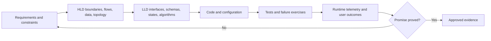
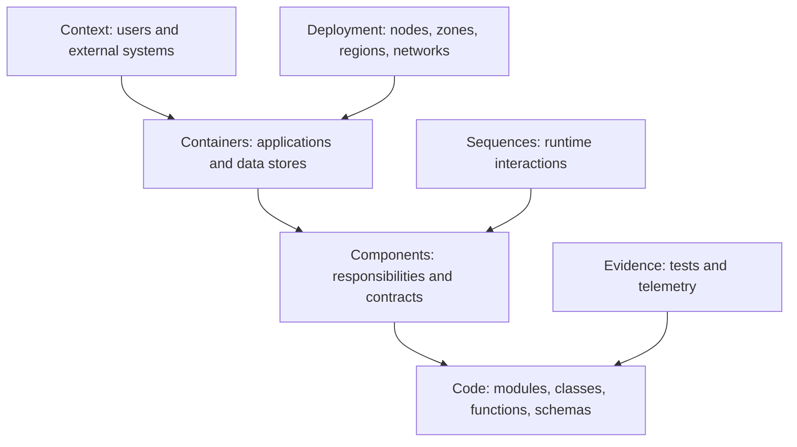
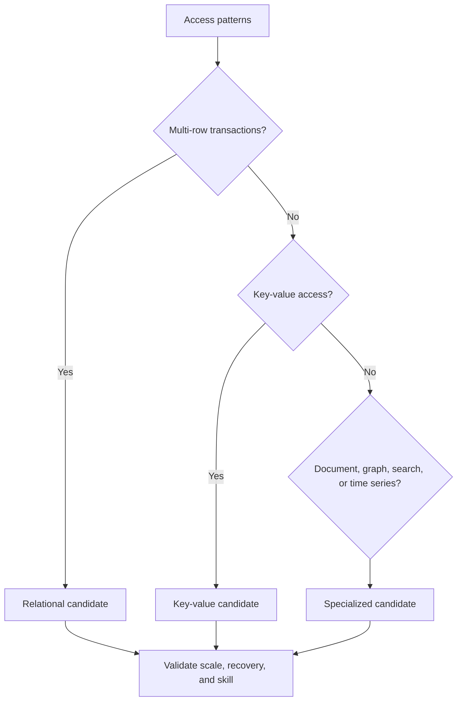
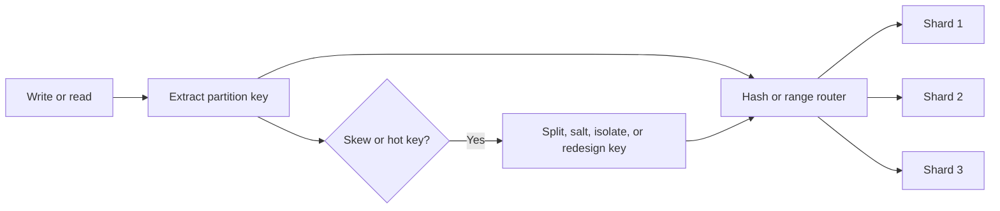
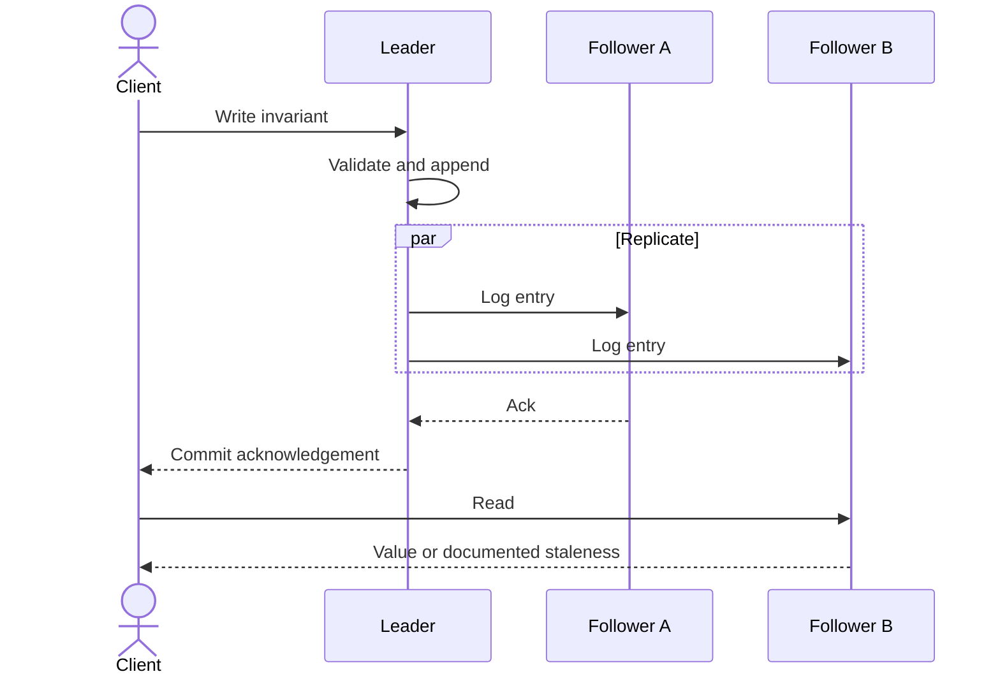
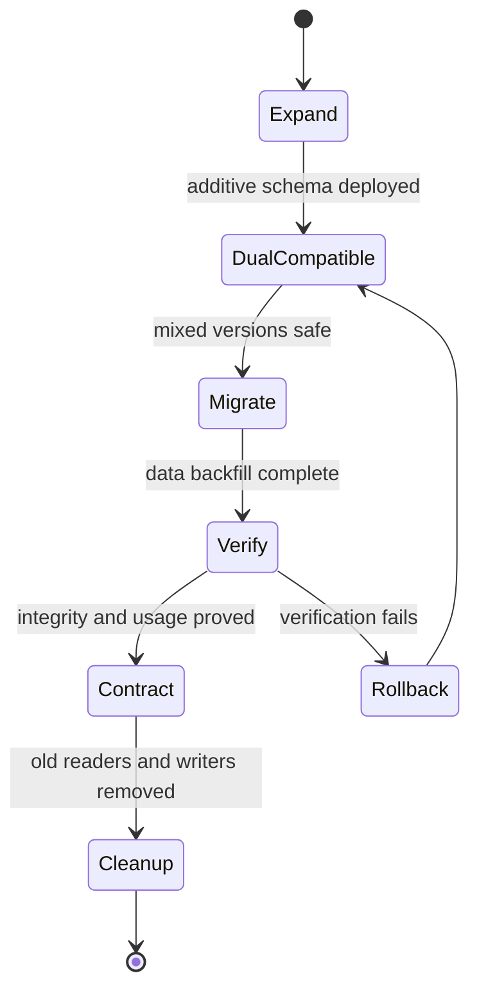

# Module 17 — System Design for DevOps/SRE

## Lesson 4: Data Storage, Partitioning and Consistency

# 17.4.1 Choose from access patterns

Ask:

```text
entities and relationships
read/write patterns and rates
query keys and ordering
transaction boundaries
consistency and conflict rules
retention and deletion
growth and partitioning
backup, restore, and regional behavior
```

Relational stores suit transactions and flexible relationships. Key-value/document stores can offer predictable key access and horizontal partitioning. Search systems are derived query indexes, not automatically authoritative databases. Object storage suits durable blobs and analytical files.

# 17.4.2 Consistency choices

```text
strong read-after-write
eventual convergence
session/read-your-writes
bounded staleness
```

Define consistency per operation. A product catalog may tolerate stale reads; payment authorization and inventory decrement may not.

# 17.4.3 Partitioning

Choose keys that distribute load and support queries. Hot keys defeat horizontal scale. Repartitioning is an operational feature, not an afterthought.

```text
hash partition → even distribution, poor range locality
range partition → efficient ranges, hotspot risk
tenant partition → isolation, unequal tenant sizes
time partition → retention-friendly, current-period hotspot
```

# 17.4.4 Transactions and events

Writing database state and publishing an event in separate uncoordinated steps creates dual-write failure. The transactional outbox writes domain change and event record in one transaction; a relay publishes and records progress. Consumers remain idempotent because duplicates can occur.

# 17.4.5 Schema evolution

Use expand-and-contract:

```text
add compatible schema
deploy code that handles old/new
backfill and verify
switch reads/writes
remove old field in later release
```

Backups do not replace migrations, and replication does not replace backups.

# 17.4.6 Lab

Design order storage with queries by order ID, customer/time, and fulfillment status. Choose indexes, partitioning, transaction boundary, event publication, retention, restore, and regional strategy. Explain the hardest consistency tradeoff.

# 17.4.7 Beginner mental model: choose shelves from how books are used

A library chooses shelves, catalog, archives, and checkout rules from how people find and borrow books. A database choice should begin with access patterns and invariants—not “SQL versus NoSQL” fashion.

Ask:

```text
What must be written/read together?
Which queries are frequent and latency-sensitive?
What must never become inconsistent?
How much data and growth?
What retention, privacy, and recovery rules?
Where are users/writers located?
What can be eventually consistent?
```

# 17.4.8 Data model and invariants

For todos:

```text
entities: User, List, Todo, Membership, Reminder
invariants:
  list owner remains authorized
  todo belongs to exactly one list
  idempotent create does not duplicate
  acknowledged write is durable
  deleted personal data follows retention policy
```

Choose transaction boundaries around invariants. Normalize for correctness and flexible relationships; denormalize deliberately for read performance with a repair/rebuild plan.

# 17.4.9 Relational, key-value, document, and wide-column

| Model | Good fit | Tradeoff |
|---|---|---|
| Relational | joins, transactions, constraints, evolving queries | horizontal partitioning/scale needs design |
| Key-value | known key lookup, session/cache | limited query relationships |
| Document | aggregate-shaped records, flexible nested schema | cross-document invariants/query patterns |
| Wide-column | massive partitioned write/read patterns | data modeling is query-specific |
| Search index | full-text/ranking/filter exploration | not usually authoritative transactional store |

Many systems use several stores, but each adds consistency, backup, skills, and operations burden.

# 17.4.10 Strong and eventual consistency

Strong consistency is useful where users must observe an authoritative latest order or uniqueness constraint. Eventual consistency can improve availability/latency for read replicas, caches, indexes, and asynchronous views when stale behavior is acceptable.

Specify a bounded user expectation:

```text
new todo visible to creator immediately
shared collaborator view converges within 5 seconds
search index converges within 60 seconds
```

“Eventually” without a target cannot be operated.

# 17.4.11 Read-your-writes and session guarantees

Even in an eventual system, a user expects to see what they just created. Options include routing the creator to the authoritative writer/read path, carrying a version token, or updating client/local view while replication catches up.

Do not claim global strong consistency if only a session guarantee is implemented. Document conflict and stale-read behavior.

# 17.4.12 Partition-key design

A good partition key distributes load and supports access patterns. Bad choices create hotspots:

```text
timestamp as leading key -> all current writes converge
country only             -> very uneven partitions
single enterprise tenant -> hot tenant
random key               -> good spread but poor range query
```

Estimate cardinality, per-key throughput/size, skew, growth, and rebalancing. Design a hot-key mitigation before launch.

# 17.4.13 Index economics

Every index improves selected reads but adds storage, write amplification, cache pressure, compaction, backup, and migration cost. Record query, selectivity, order, included fields, and removal owner.

Use query plans and production-like distributions. An index that helps on 100 rows may fail on 1 billion skewed rows.

# 17.4.14 Transactions across services

A distributed transaction is expensive and not always available. Common pattern:

```text
local DB transaction:
  write authoritative todo
  write outbox event

publisher:
  reads outbox -> publishes message -> marks progress

consumer:
  handles duplicate idempotently
```

The transactional outbox avoids “DB committed but event never published,” but still needs duplicate publishing/consumption, ordering, backlog, retention, and recovery handling.

# 17.4.15 Saga and compensation

For a multi-step business process, a saga coordinates local transactions and compensating actions. Compensation is a business operation, not a magical rollback. A shipped parcel or sent email cannot always be undone.

Choose orchestration or choreography deliberately, expose state, timeouts, manual repair, and audit. Avoid uncontrolled event chains that no team can reason about.

# 17.4.16 Schema evolution

Use expand-and-contract:

```text
1. add backward-compatible new schema
2. deploy code that understands old and new
3. backfill with checkpoints/throttling/validation
4. switch reads/writes
5. observe through rollback window
6. remove old schema in later change
```

Test mixed versions during rolling deployment. A rollback is unsafe if the old application cannot read the migrated schema.

# 17.4.17 Real hands-on data design

For the todo platform:

1. List top ten queries and write operations.
2. Define entities, ownership, invariants, and transaction boundaries.
3. Choose primary store and justify it.
4. Propose keys/partitions/indexes with scale estimates.
5. Design idempotent create and transactional outbox.
6. Define consistency per read path.
7. Write backup/RTO/RPO/data deletion policy.
8. Produce one expand-contract migration and rollback compatibility test.

# 17.4.18 Failure lab: hot partition

Generate a workload dominated by one large tenant or current-time key. Measure per-partition throttling, latency, queueing, and retries. Test mitigation such as composite/sharded keys, tenant isolation, adaptive capacity where supported, rate limiting, or workload redesign.

Ensure queries can reconstruct ordered results without unbounded fan-out.

# 17.4.19 Failure lab: duplicate and out-of-order event

Deliver the same `TodoCreated` event twice and deliver version 3 before version 2. The consumer should use event/entity identity and version or business rules to reach a correct state, expose duplicates/stale events, and avoid counting final success twice.

Test dead-letter and replay. Replay is a production write path and needs authorization, rate limits, idempotency, audit, and stop conditions.

# 17.4.20 Backup, privacy, and deletion

Data architecture includes:

```text
encryption and key ownership
least-privilege database identities
row/tenant authorization beyond network access
audit of sensitive reads/writes
retention and legal hold
deletion from primary, replicas, indexes, caches, backups by policy
restore testing and business-integrity validation
```

Do not log full records or query parameters during diagnosis without classification/review.

# 17.4.21 Design review checklist

- Access patterns and invariants drive the model.
- Authoritative source and ownership are explicit.
- Consistency/staleness is defined per journey.
- Keys/partitions handle scale and skew.
- Index cost and lifecycle are known.
- Mutations are idempotent under timeout/retry.
- DB/event atomicity and duplicate handling are designed.
- Migration supports mixed versions and safe rollback/forward fix.
- Backup/restore, RTO/RPO, retention/deletion are tested.
- Telemetry exposes latency, errors, saturation, replication, backlog, and correctness.

# 17.4.22 Certification and interview preparation

Data choices and consistency are core architecture topics. Verify current cloud database guarantees, limits, and certification objectives.

**Beginner: How do you choose a database?**  From access patterns, invariants, scale, consistency, latency, recovery, security, and team operations—not popularity.

**Intermediate: Strong versus eventual consistency?**  Strong reads reflect an agreed authoritative order/state; eventual replicas/views may be stale but converge under stated conditions.

**Intermediate: What makes a bad partition key?**  It concentrates traffic/data or fails access patterns, creating hotspots or expensive fan-out.

**Senior: What problem does an outbox solve?**  It atomically records business state and an event-to-publish in one local DB transaction, closing the commit-versus-publish gap.

**Senior: How do you deploy a breaking schema change?**  Expand compatibly, deploy mixed-version-capable code, backfill/validate, switch, observe, then contract later.

**Expert: How do you handle cross-service transactions?**  Minimize them; use local invariants plus saga/outbox/idempotency/compensation and explicit incomplete/manual-repair states as required.

**Architect: How do multi-region writes change design?**  Define authority, consistency/conflict resolution, partition placement, latency, failover/fencing, data residency, RPO/RTO, and operational recovery before choosing technology.

**Never-forget answer:** data architecture protects invariants. Model real access and failure patterns, make consistency explicit, and design migration and recovery before scale arrives.

<!-- GENERATED-MASTERY-WORKBOOK:START -->

# 17.4.23 Professional Mastery Workbook

This workbook expands **Data Storage, Partitioning and Consistency** into deliberate practice without replacing the authored tutorial above.

Use it after reading the core explanation. The goal is not to memorize thousands of lines; the goal is to repeatedly explain, build, break, secure, observe, recover, and defend the lesson in different conditions.

## Workbook learning contract

- Concepts covered: 22 lesson-specific anchors.
- Progression: beginner, intermediate, expert, professional, industry-ready, certification review, and interview defense.
- Safety: use synthetic data, disposable resources, explicit placeholders, least privilege, and bounded failure experiments.
- Completion: retain commands or configuration, observations, screenshots or query output, decisions, rollback evidence, and a short reflection.
- Quality rule: a passing answer states assumptions, protects a user or business outcome, names ownership, and validates the final result end to end.
- Currency rule: verify current official documentation, versions, limits, pricing, and certification objectives before relying on changing product behavior.

## Seven-stage progression

| Stage | Learner must demonstrate |
|---|---|
| Beginner | Explain the concept in plain language and give one safe example. |
| Intermediate | Connect components, data, control flow, and normal operating behavior. |
| Expert | Analyze trade-offs, edge cases, scaling pressure, and correlated failures. |
| Professional | Make a reviewed decision with owner, evidence, rollout, and rollback. |
| Industry-ready | Operate the design under security, failure, recovery, cost, and compliance constraints. |
| Certification review | Map durable concepts to the latest official objectives without relying on stale wording. |
| Interview defense | Answer concisely, clarify assumptions, draw the model, and defend alternatives. |

## Concept mastery cards

### Concept card 1 - Choose from access patterns

- Lesson anchor: Ask: entities and relationships read/write patterns and rates query keys and ordering transaction boundaries consistency and conflict rules retention and deletion growth and partitioning backup, restore, and regional behavior
- Beginner explanation: Restate **Choose from access patterns** using a household, workplace, or public-service analogy without hiding the technical truth.
- Terminology check: Define every important noun, state, actor, and boundary before using abbreviations.
- Concrete example: Apply **Choose from access patterns** to a small todo, checkout, or platform service and name the expected outcome.
- Intermediate connection: Draw the request, data, identity, and control flow that reaches this concept.
- Trade-off question: Compare at least two valid alternatives and state when each becomes the better choice.
- Expert edge case: Describe concurrency, retry, partial failure, scale, or stale-state behavior that a happy-path explanation misses.
- Hands-on artifact: Produce a requirement, invariant, and architecture decision record focused on **Choose from access patterns**.
- Failure exercise: In an isolated environment, introduce a timeout and retry amplification path while observing the boundaries around **Choose from access patterns**.
- Security review: Identify identity, authorization, sensitive-data, supply-chain, and abuse assumptions.
- Reliability review: Define the user-visible failure, containment, degraded mode, recovery, and final validation.
- Performance and cost review: Name the load driver, capacity limit, useful unit, and waste or amplification risk.
- Observability review: Specify the metric, structured event, trace boundary, change marker, and missing-data behavior.
- Professional decision: Record context, options, decision, consequences, owner, evidence, and revisit trigger.
- Certification checkpoint: Map the design evidence to the current cloud architecture, DevOps, or Kubernetes objectives and defend the trade-off provider-neutrally.
- Interview prompt: Explain **Choose from access patterns** first in 30 seconds, then defend it in a five-minute system scenario.
- Strong-answer rubric: lead with outcome, state assumptions, explain mechanism, discuss failure and security, then validate with evidence.
- Completion evidence: retain the artifact, commands or query, observed failure, safe recovery, and one improvement.

### Concept card 2 - Consistency choices

- Lesson anchor: strong read-after-write eventual convergence session/read-your-writes bounded staleness Define consistency per operation. A product catalog may tolerate stale reads; payment authorization and inventory decrement may not.
- Beginner explanation: Restate **Consistency choices** using a household, workplace, or public-service analogy without hiding the technical truth.
- Terminology check: Define every important noun, state, actor, and boundary before using abbreviations.
- Concrete example: Apply **Consistency choices** to a small todo, checkout, or platform service and name the expected outcome.
- Intermediate connection: Draw the request, data, identity, and control flow that reaches this concept.
- Trade-off question: Compare at least two valid alternatives and state when each becomes the better choice.
- Expert edge case: Describe concurrency, retry, partial failure, scale, or stale-state behavior that a happy-path explanation misses.
- Hands-on artifact: Produce a capacity, latency, storage, and bandwidth calculation focused on **Consistency choices**.
- Failure exercise: In an isolated environment, create a hot key, partition, cache, or queue condition while observing the boundaries around **Consistency choices**.
- Security review: Identify identity, authorization, sensitive-data, supply-chain, and abuse assumptions.
- Reliability review: Define the user-visible failure, containment, degraded mode, recovery, and final validation.
- Performance and cost review: Name the load driver, capacity limit, useful unit, and waste or amplification risk.
- Observability review: Specify the metric, structured event, trace boundary, change marker, and missing-data behavior.
- Professional decision: Record context, options, decision, consequences, owner, evidence, and revisit trigger.
- Certification checkpoint: Map the design evidence to the current cloud architecture, DevOps, or Kubernetes objectives and defend the trade-off provider-neutrally.
- Interview prompt: Explain **Consistency choices** first in 30 seconds, then defend it in a five-minute system scenario.
- Strong-answer rubric: lead with outcome, state assumptions, explain mechanism, discuss failure and security, then validate with evidence.
- Completion evidence: retain the artifact, commands or query, observed failure, safe recovery, and one improvement.

### Concept card 3 - Partitioning

- Lesson anchor: Choose keys that distribute load and support queries. Hot keys defeat horizontal scale. Repartitioning is an operational feature, not an afterthought. hash partition → even distribution, poor range locality range partition → efficient ranges, hotspot risk
- Beginner explanation: Restate **Partitioning** using a household, workplace, or public-service analogy without hiding the technical truth.
- Terminology check: Define every important noun, state, actor, and boundary before using abbreviations.
- Concrete example: Apply **Partitioning** to a small todo, checkout, or platform service and name the expected outcome.
- Intermediate connection: Draw the request, data, identity, and control flow that reaches this concept.
- Trade-off question: Compare at least two valid alternatives and state when each becomes the better choice.
- Expert edge case: Describe concurrency, retry, partial failure, scale, or stale-state behavior that a happy-path explanation misses.
- Hands-on artifact: Produce an API, data, or event contract with failure semantics focused on **Partitioning**.
- Failure exercise: In an isolated environment, remove a shared dependency or one failure domain while observing the boundaries around **Partitioning**.
- Security review: Identify identity, authorization, sensitive-data, supply-chain, and abuse assumptions.
- Reliability review: Define the user-visible failure, containment, degraded mode, recovery, and final validation.
- Performance and cost review: Name the load driver, capacity limit, useful unit, and waste or amplification risk.
- Observability review: Specify the metric, structured event, trace boundary, change marker, and missing-data behavior.
- Professional decision: Record context, options, decision, consequences, owner, evidence, and revisit trigger.
- Certification checkpoint: Map the design evidence to the current cloud architecture, DevOps, or Kubernetes objectives and defend the trade-off provider-neutrally.
- Interview prompt: Explain **Partitioning** first in 30 seconds, then defend it in a five-minute system scenario.
- Strong-answer rubric: lead with outcome, state assumptions, explain mechanism, discuss failure and security, then validate with evidence.
- Completion evidence: retain the artifact, commands or query, observed failure, safe recovery, and one improvement.

### Concept card 4 - Transactions and events

- Lesson anchor: Writing database state and publishing an event in separate uncoordinated steps creates dual-write failure. The transactional outbox writes domain change and event record in one transaction; a relay publishes and records progress. Consumers remain idempotent...
- Beginner explanation: Restate **Transactions and events** using a household, workplace, or public-service analogy without hiding the technical truth.
- Terminology check: Define every important noun, state, actor, and boundary before using abbreviations.
- Concrete example: Apply **Transactions and events** to a small todo, checkout, or platform service and name the expected outcome.
- Intermediate connection: Draw the request, data, identity, and control flow that reaches this concept.
- Trade-off question: Compare at least two valid alternatives and state when each becomes the better choice.
- Expert edge case: Describe concurrency, retry, partial failure, scale, or stale-state behavior that a happy-path explanation misses.
- Hands-on artifact: Produce a context, data-flow, trust, and failure-domain diagram focused on **Transactions and events**.
- Failure exercise: In an isolated environment, make data arrive duplicated, late, or out of order while observing the boundaries around **Transactions and events**.
- Security review: Identify identity, authorization, sensitive-data, supply-chain, and abuse assumptions.
- Reliability review: Define the user-visible failure, containment, degraded mode, recovery, and final validation.
- Performance and cost review: Name the load driver, capacity limit, useful unit, and waste or amplification risk.
- Observability review: Specify the metric, structured event, trace boundary, change marker, and missing-data behavior.
- Professional decision: Record context, options, decision, consequences, owner, evidence, and revisit trigger.
- Certification checkpoint: Map the design evidence to the current cloud architecture, DevOps, or Kubernetes objectives and defend the trade-off provider-neutrally.
- Interview prompt: Explain **Transactions and events** first in 30 seconds, then defend it in a five-minute system scenario.
- Strong-answer rubric: lead with outcome, state assumptions, explain mechanism, discuss failure and security, then validate with evidence.
- Completion evidence: retain the artifact, commands or query, observed failure, safe recovery, and one improvement.

### Concept card 5 - Schema evolution

- Lesson anchor: Use expand-and-contract: add compatible schema deploy code that handles old/new backfill and verify switch reads/writes remove old field in later release Backups do not replace migrations, and replication does not replace backups.
- Beginner explanation: Restate **Schema evolution** using a household, workplace, or public-service analogy without hiding the technical truth.
- Terminology check: Define every important noun, state, actor, and boundary before using abbreviations.
- Concrete example: Apply **Schema evolution** to a small todo, checkout, or platform service and name the expected outcome.
- Intermediate connection: Draw the request, data, identity, and control flow that reaches this concept.
- Trade-off question: Compare at least two valid alternatives and state when each becomes the better choice.
- Expert edge case: Describe concurrency, retry, partial failure, scale, or stale-state behavior that a happy-path explanation misses.
- Hands-on artifact: Produce a load-test and graceful-degradation report focused on **Schema evolution**.
- Failure exercise: In an isolated environment, overload the system beyond its modeled queueing knee while observing the boundaries around **Schema evolution**.
- Security review: Identify identity, authorization, sensitive-data, supply-chain, and abuse assumptions.
- Reliability review: Define the user-visible failure, containment, degraded mode, recovery, and final validation.
- Performance and cost review: Name the load driver, capacity limit, useful unit, and waste or amplification risk.
- Observability review: Specify the metric, structured event, trace boundary, change marker, and missing-data behavior.
- Professional decision: Record context, options, decision, consequences, owner, evidence, and revisit trigger.
- Certification checkpoint: Map the design evidence to the current cloud architecture, DevOps, or Kubernetes objectives and defend the trade-off provider-neutrally.
- Interview prompt: Explain **Schema evolution** first in 30 seconds, then defend it in a five-minute system scenario.
- Strong-answer rubric: lead with outcome, state assumptions, explain mechanism, discuss failure and security, then validate with evidence.
- Completion evidence: retain the artifact, commands or query, observed failure, safe recovery, and one improvement.

### Concept card 6 - Lab

- Lesson anchor: Design order storage with queries by order ID, customer/time, and fulfillment status. Choose indexes, partitioning, transaction boundary, event publication, retention, restore, and regional strategy. Explain the hardest consistency tradeoff.
- Beginner explanation: Restate **Lab** using a household, workplace, or public-service analogy without hiding the technical truth.
- Terminology check: Define every important noun, state, actor, and boundary before using abbreviations.
- Concrete example: Apply **Lab** to a small todo, checkout, or platform service and name the expected outcome.
- Intermediate connection: Draw the request, data, identity, and control flow that reaches this concept.
- Trade-off question: Compare at least two valid alternatives and state when each becomes the better choice.
- Expert edge case: Describe concurrency, retry, partial failure, scale, or stale-state behavior that a happy-path explanation misses.
- Hands-on artifact: Produce a multi-region failover and failback state machine focused on **Lab**.
- Failure exercise: In an isolated environment, make a regional writer or routing decision ambiguous while observing the boundaries around **Lab**.
- Security review: Identify identity, authorization, sensitive-data, supply-chain, and abuse assumptions.
- Reliability review: Define the user-visible failure, containment, degraded mode, recovery, and final validation.
- Performance and cost review: Name the load driver, capacity limit, useful unit, and waste or amplification risk.
- Observability review: Specify the metric, structured event, trace boundary, change marker, and missing-data behavior.
- Professional decision: Record context, options, decision, consequences, owner, evidence, and revisit trigger.
- Certification checkpoint: Map the design evidence to the current cloud architecture, DevOps, or Kubernetes objectives and defend the trade-off provider-neutrally.
- Interview prompt: Explain **Lab** first in 30 seconds, then defend it in a five-minute system scenario.
- Strong-answer rubric: lead with outcome, state assumptions, explain mechanism, discuss failure and security, then validate with evidence.
- Completion evidence: retain the artifact, commands or query, observed failure, safe recovery, and one improvement.

### Concept card 7 - Beginner mental model: choose shelves from how books are used

- Lesson anchor: A library chooses shelves, catalog, archives, and checkout rules from how people find and borrow books. A database choice should begin with access patterns and invariants—not “SQL versus NoSQL” fashion. Ask: What must be written/read together?
- Beginner explanation: Restate **Beginner mental model: choose shelves from how books are used** using a household, workplace, or public-service analogy without hiding the technical truth.
- Terminology check: Define every important noun, state, actor, and boundary before using abbreviations.
- Concrete example: Apply **Beginner mental model: choose shelves from how books are used** to a small todo, checkout, or platform service and name the expected outcome.
- Intermediate connection: Draw the request, data, identity, and control flow that reaches this concept.
- Trade-off question: Compare at least two valid alternatives and state when each becomes the better choice.
- Expert edge case: Describe concurrency, retry, partial failure, scale, or stale-state behavior that a happy-path explanation misses.
- Hands-on artifact: Produce a requirement, invariant, and architecture decision record focused on **Beginner mental model: choose shelves from how books are used**.
- Failure exercise: In an isolated environment, introduce a timeout and retry amplification path while observing the boundaries around **Beginner mental model: choose shelves from how books are used**.
- Security review: Identify identity, authorization, sensitive-data, supply-chain, and abuse assumptions.
- Reliability review: Define the user-visible failure, containment, degraded mode, recovery, and final validation.
- Performance and cost review: Name the load driver, capacity limit, useful unit, and waste or amplification risk.
- Observability review: Specify the metric, structured event, trace boundary, change marker, and missing-data behavior.
- Professional decision: Record context, options, decision, consequences, owner, evidence, and revisit trigger.
- Certification checkpoint: Map the design evidence to the current cloud architecture, DevOps, or Kubernetes objectives and defend the trade-off provider-neutrally.
- Interview prompt: Explain **Beginner mental model: choose shelves from how books are used** first in 30 seconds, then defend it in a five-minute system scenario.
- Strong-answer rubric: lead with outcome, state assumptions, explain mechanism, discuss failure and security, then validate with evidence.
- Completion evidence: retain the artifact, commands or query, observed failure, safe recovery, and one improvement.

### Concept card 8 - Data model and invariants

- Lesson anchor: For todos: entities: User, List, Todo, Membership, Reminder invariants: list owner remains authorized todo belongs to exactly one list idempotent create does not duplicate acknowledged write is durable deleted personal data follows retention policy
- Beginner explanation: Restate **Data model and invariants** using a household, workplace, or public-service analogy without hiding the technical truth.
- Terminology check: Define every important noun, state, actor, and boundary before using abbreviations.
- Concrete example: Apply **Data model and invariants** to a small todo, checkout, or platform service and name the expected outcome.
- Intermediate connection: Draw the request, data, identity, and control flow that reaches this concept.
- Trade-off question: Compare at least two valid alternatives and state when each becomes the better choice.
- Expert edge case: Describe concurrency, retry, partial failure, scale, or stale-state behavior that a happy-path explanation misses.
- Hands-on artifact: Produce a capacity, latency, storage, and bandwidth calculation focused on **Data model and invariants**.
- Failure exercise: In an isolated environment, create a hot key, partition, cache, or queue condition while observing the boundaries around **Data model and invariants**.
- Security review: Identify identity, authorization, sensitive-data, supply-chain, and abuse assumptions.
- Reliability review: Define the user-visible failure, containment, degraded mode, recovery, and final validation.
- Performance and cost review: Name the load driver, capacity limit, useful unit, and waste or amplification risk.
- Observability review: Specify the metric, structured event, trace boundary, change marker, and missing-data behavior.
- Professional decision: Record context, options, decision, consequences, owner, evidence, and revisit trigger.
- Certification checkpoint: Map the design evidence to the current cloud architecture, DevOps, or Kubernetes objectives and defend the trade-off provider-neutrally.
- Interview prompt: Explain **Data model and invariants** first in 30 seconds, then defend it in a five-minute system scenario.
- Strong-answer rubric: lead with outcome, state assumptions, explain mechanism, discuss failure and security, then validate with evidence.
- Completion evidence: retain the artifact, commands or query, observed failure, safe recovery, and one improvement.

### Concept card 9 - Relational, key-value, document, and wide-column

- Lesson anchor: Many systems use several stores, but each adds consistency, backup, skills, and operations burden.
- Beginner explanation: Restate **Relational, key-value, document, and wide-column** using a household, workplace, or public-service analogy without hiding the technical truth.
- Terminology check: Define every important noun, state, actor, and boundary before using abbreviations.
- Concrete example: Apply **Relational, key-value, document, and wide-column** to a small todo, checkout, or platform service and name the expected outcome.
- Intermediate connection: Draw the request, data, identity, and control flow that reaches this concept.
- Trade-off question: Compare at least two valid alternatives and state when each becomes the better choice.
- Expert edge case: Describe concurrency, retry, partial failure, scale, or stale-state behavior that a happy-path explanation misses.
- Hands-on artifact: Produce an API, data, or event contract with failure semantics focused on **Relational, key-value, document, and wide-column**.
- Failure exercise: In an isolated environment, remove a shared dependency or one failure domain while observing the boundaries around **Relational, key-value, document, and wide-column**.
- Security review: Identify identity, authorization, sensitive-data, supply-chain, and abuse assumptions.
- Reliability review: Define the user-visible failure, containment, degraded mode, recovery, and final validation.
- Performance and cost review: Name the load driver, capacity limit, useful unit, and waste or amplification risk.
- Observability review: Specify the metric, structured event, trace boundary, change marker, and missing-data behavior.
- Professional decision: Record context, options, decision, consequences, owner, evidence, and revisit trigger.
- Certification checkpoint: Map the design evidence to the current cloud architecture, DevOps, or Kubernetes objectives and defend the trade-off provider-neutrally.
- Interview prompt: Explain **Relational, key-value, document, and wide-column** first in 30 seconds, then defend it in a five-minute system scenario.
- Strong-answer rubric: lead with outcome, state assumptions, explain mechanism, discuss failure and security, then validate with evidence.
- Completion evidence: retain the artifact, commands or query, observed failure, safe recovery, and one improvement.

### Concept card 10 - Strong and eventual consistency

- Lesson anchor: Strong consistency is useful where users must observe an authoritative latest order or uniqueness constraint. Eventual consistency can improve availability/latency for read replicas, caches, indexes, and asynchronous views when stale behavior is acceptable.
- Beginner explanation: Restate **Strong and eventual consistency** using a household, workplace, or public-service analogy without hiding the technical truth.
- Terminology check: Define every important noun, state, actor, and boundary before using abbreviations.
- Concrete example: Apply **Strong and eventual consistency** to a small todo, checkout, or platform service and name the expected outcome.
- Intermediate connection: Draw the request, data, identity, and control flow that reaches this concept.
- Trade-off question: Compare at least two valid alternatives and state when each becomes the better choice.
- Expert edge case: Describe concurrency, retry, partial failure, scale, or stale-state behavior that a happy-path explanation misses.
- Hands-on artifact: Produce a context, data-flow, trust, and failure-domain diagram focused on **Strong and eventual consistency**.
- Failure exercise: In an isolated environment, make data arrive duplicated, late, or out of order while observing the boundaries around **Strong and eventual consistency**.
- Security review: Identify identity, authorization, sensitive-data, supply-chain, and abuse assumptions.
- Reliability review: Define the user-visible failure, containment, degraded mode, recovery, and final validation.
- Performance and cost review: Name the load driver, capacity limit, useful unit, and waste or amplification risk.
- Observability review: Specify the metric, structured event, trace boundary, change marker, and missing-data behavior.
- Professional decision: Record context, options, decision, consequences, owner, evidence, and revisit trigger.
- Certification checkpoint: Map the design evidence to the current cloud architecture, DevOps, or Kubernetes objectives and defend the trade-off provider-neutrally.
- Interview prompt: Explain **Strong and eventual consistency** first in 30 seconds, then defend it in a five-minute system scenario.
- Strong-answer rubric: lead with outcome, state assumptions, explain mechanism, discuss failure and security, then validate with evidence.
- Completion evidence: retain the artifact, commands or query, observed failure, safe recovery, and one improvement.

### Concept card 11 - Read-your-writes and session guarantees

- Lesson anchor: Even in an eventual system, a user expects to see what they just created. Options include routing the creator to the authoritative writer/read path, carrying a version token, or updating client/local view while replication catches up.
- Beginner explanation: Restate **Read-your-writes and session guarantees** using a household, workplace, or public-service analogy without hiding the technical truth.
- Terminology check: Define every important noun, state, actor, and boundary before using abbreviations.
- Concrete example: Apply **Read-your-writes and session guarantees** to a small todo, checkout, or platform service and name the expected outcome.
- Intermediate connection: Draw the request, data, identity, and control flow that reaches this concept.
- Trade-off question: Compare at least two valid alternatives and state when each becomes the better choice.
- Expert edge case: Describe concurrency, retry, partial failure, scale, or stale-state behavior that a happy-path explanation misses.
- Hands-on artifact: Produce a load-test and graceful-degradation report focused on **Read-your-writes and session guarantees**.
- Failure exercise: In an isolated environment, overload the system beyond its modeled queueing knee while observing the boundaries around **Read-your-writes and session guarantees**.
- Security review: Identify identity, authorization, sensitive-data, supply-chain, and abuse assumptions.
- Reliability review: Define the user-visible failure, containment, degraded mode, recovery, and final validation.
- Performance and cost review: Name the load driver, capacity limit, useful unit, and waste or amplification risk.
- Observability review: Specify the metric, structured event, trace boundary, change marker, and missing-data behavior.
- Professional decision: Record context, options, decision, consequences, owner, evidence, and revisit trigger.
- Certification checkpoint: Map the design evidence to the current cloud architecture, DevOps, or Kubernetes objectives and defend the trade-off provider-neutrally.
- Interview prompt: Explain **Read-your-writes and session guarantees** first in 30 seconds, then defend it in a five-minute system scenario.
- Strong-answer rubric: lead with outcome, state assumptions, explain mechanism, discuss failure and security, then validate with evidence.
- Completion evidence: retain the artifact, commands or query, observed failure, safe recovery, and one improvement.

### Concept card 12 - Partition-key design

- Lesson anchor: A good partition key distributes load and supports access patterns. Bad choices create hotspots: timestamp as leading key - all current writes converge country only             - very uneven partitions single enterprise tenant - hot tenant
- Beginner explanation: Restate **Partition-key design** using a household, workplace, or public-service analogy without hiding the technical truth.
- Terminology check: Define every important noun, state, actor, and boundary before using abbreviations.
- Concrete example: Apply **Partition-key design** to a small todo, checkout, or platform service and name the expected outcome.
- Intermediate connection: Draw the request, data, identity, and control flow that reaches this concept.
- Trade-off question: Compare at least two valid alternatives and state when each becomes the better choice.
- Expert edge case: Describe concurrency, retry, partial failure, scale, or stale-state behavior that a happy-path explanation misses.
- Hands-on artifact: Produce a multi-region failover and failback state machine focused on **Partition-key design**.
- Failure exercise: In an isolated environment, make a regional writer or routing decision ambiguous while observing the boundaries around **Partition-key design**.
- Security review: Identify identity, authorization, sensitive-data, supply-chain, and abuse assumptions.
- Reliability review: Define the user-visible failure, containment, degraded mode, recovery, and final validation.
- Performance and cost review: Name the load driver, capacity limit, useful unit, and waste or amplification risk.
- Observability review: Specify the metric, structured event, trace boundary, change marker, and missing-data behavior.
- Professional decision: Record context, options, decision, consequences, owner, evidence, and revisit trigger.
- Certification checkpoint: Map the design evidence to the current cloud architecture, DevOps, or Kubernetes objectives and defend the trade-off provider-neutrally.
- Interview prompt: Explain **Partition-key design** first in 30 seconds, then defend it in a five-minute system scenario.
- Strong-answer rubric: lead with outcome, state assumptions, explain mechanism, discuss failure and security, then validate with evidence.
- Completion evidence: retain the artifact, commands or query, observed failure, safe recovery, and one improvement.

### Concept card 13 - Index economics

- Lesson anchor: Every index improves selected reads but adds storage, write amplification, cache pressure, compaction, backup, and migration cost. Record query, selectivity, order, included fields, and removal owner. Use query plans and production-like distributions. An in...
- Beginner explanation: Restate **Index economics** using a household, workplace, or public-service analogy without hiding the technical truth.
- Terminology check: Define every important noun, state, actor, and boundary before using abbreviations.
- Concrete example: Apply **Index economics** to a small todo, checkout, or platform service and name the expected outcome.
- Intermediate connection: Draw the request, data, identity, and control flow that reaches this concept.
- Trade-off question: Compare at least two valid alternatives and state when each becomes the better choice.
- Expert edge case: Describe concurrency, retry, partial failure, scale, or stale-state behavior that a happy-path explanation misses.
- Hands-on artifact: Produce a requirement, invariant, and architecture decision record focused on **Index economics**.
- Failure exercise: In an isolated environment, introduce a timeout and retry amplification path while observing the boundaries around **Index economics**.
- Security review: Identify identity, authorization, sensitive-data, supply-chain, and abuse assumptions.
- Reliability review: Define the user-visible failure, containment, degraded mode, recovery, and final validation.
- Performance and cost review: Name the load driver, capacity limit, useful unit, and waste or amplification risk.
- Observability review: Specify the metric, structured event, trace boundary, change marker, and missing-data behavior.
- Professional decision: Record context, options, decision, consequences, owner, evidence, and revisit trigger.
- Certification checkpoint: Map the design evidence to the current cloud architecture, DevOps, or Kubernetes objectives and defend the trade-off provider-neutrally.
- Interview prompt: Explain **Index economics** first in 30 seconds, then defend it in a five-minute system scenario.
- Strong-answer rubric: lead with outcome, state assumptions, explain mechanism, discuss failure and security, then validate with evidence.
- Completion evidence: retain the artifact, commands or query, observed failure, safe recovery, and one improvement.

### Concept card 14 - Transactions across services

- Lesson anchor: A distributed transaction is expensive and not always available. Common pattern: local DB transaction: write authoritative todo write outbox event publisher: reads outbox - publishes message - marks progress consumer: handles duplicate idempotently
- Beginner explanation: Restate **Transactions across services** using a household, workplace, or public-service analogy without hiding the technical truth.
- Terminology check: Define every important noun, state, actor, and boundary before using abbreviations.
- Concrete example: Apply **Transactions across services** to a small todo, checkout, or platform service and name the expected outcome.
- Intermediate connection: Draw the request, data, identity, and control flow that reaches this concept.
- Trade-off question: Compare at least two valid alternatives and state when each becomes the better choice.
- Expert edge case: Describe concurrency, retry, partial failure, scale, or stale-state behavior that a happy-path explanation misses.
- Hands-on artifact: Produce a capacity, latency, storage, and bandwidth calculation focused on **Transactions across services**.
- Failure exercise: In an isolated environment, create a hot key, partition, cache, or queue condition while observing the boundaries around **Transactions across services**.
- Security review: Identify identity, authorization, sensitive-data, supply-chain, and abuse assumptions.
- Reliability review: Define the user-visible failure, containment, degraded mode, recovery, and final validation.
- Performance and cost review: Name the load driver, capacity limit, useful unit, and waste or amplification risk.
- Observability review: Specify the metric, structured event, trace boundary, change marker, and missing-data behavior.
- Professional decision: Record context, options, decision, consequences, owner, evidence, and revisit trigger.
- Certification checkpoint: Map the design evidence to the current cloud architecture, DevOps, or Kubernetes objectives and defend the trade-off provider-neutrally.
- Interview prompt: Explain **Transactions across services** first in 30 seconds, then defend it in a five-minute system scenario.
- Strong-answer rubric: lead with outcome, state assumptions, explain mechanism, discuss failure and security, then validate with evidence.
- Completion evidence: retain the artifact, commands or query, observed failure, safe recovery, and one improvement.

### Concept card 15 - Saga and compensation

- Lesson anchor: For a multi-step business process, a saga coordinates local transactions and compensating actions. Compensation is a business operation, not a magical rollback. A shipped parcel or sent email cannot always be undone. Choose orchestration or choreography del...
- Beginner explanation: Restate **Saga and compensation** using a household, workplace, or public-service analogy without hiding the technical truth.
- Terminology check: Define every important noun, state, actor, and boundary before using abbreviations.
- Concrete example: Apply **Saga and compensation** to a small todo, checkout, or platform service and name the expected outcome.
- Intermediate connection: Draw the request, data, identity, and control flow that reaches this concept.
- Trade-off question: Compare at least two valid alternatives and state when each becomes the better choice.
- Expert edge case: Describe concurrency, retry, partial failure, scale, or stale-state behavior that a happy-path explanation misses.
- Hands-on artifact: Produce an API, data, or event contract with failure semantics focused on **Saga and compensation**.
- Failure exercise: In an isolated environment, remove a shared dependency or one failure domain while observing the boundaries around **Saga and compensation**.
- Security review: Identify identity, authorization, sensitive-data, supply-chain, and abuse assumptions.
- Reliability review: Define the user-visible failure, containment, degraded mode, recovery, and final validation.
- Performance and cost review: Name the load driver, capacity limit, useful unit, and waste or amplification risk.
- Observability review: Specify the metric, structured event, trace boundary, change marker, and missing-data behavior.
- Professional decision: Record context, options, decision, consequences, owner, evidence, and revisit trigger.
- Certification checkpoint: Map the design evidence to the current cloud architecture, DevOps, or Kubernetes objectives and defend the trade-off provider-neutrally.
- Interview prompt: Explain **Saga and compensation** first in 30 seconds, then defend it in a five-minute system scenario.
- Strong-answer rubric: lead with outcome, state assumptions, explain mechanism, discuss failure and security, then validate with evidence.
- Completion evidence: retain the artifact, commands or query, observed failure, safe recovery, and one improvement.

### Concept card 16 - Schema evolution

- Lesson anchor: Use expand-and-contract: Test mixed versions during rolling deployment. A rollback is unsafe if the old application cannot read the migrated schema.
- Beginner explanation: Restate **Schema evolution** using a household, workplace, or public-service analogy without hiding the technical truth.
- Terminology check: Define every important noun, state, actor, and boundary before using abbreviations.
- Concrete example: Apply **Schema evolution** to a small todo, checkout, or platform service and name the expected outcome.
- Intermediate connection: Draw the request, data, identity, and control flow that reaches this concept.
- Trade-off question: Compare at least two valid alternatives and state when each becomes the better choice.
- Expert edge case: Describe concurrency, retry, partial failure, scale, or stale-state behavior that a happy-path explanation misses.
- Hands-on artifact: Produce a context, data-flow, trust, and failure-domain diagram focused on **Schema evolution**.
- Failure exercise: In an isolated environment, make data arrive duplicated, late, or out of order while observing the boundaries around **Schema evolution**.
- Security review: Identify identity, authorization, sensitive-data, supply-chain, and abuse assumptions.
- Reliability review: Define the user-visible failure, containment, degraded mode, recovery, and final validation.
- Performance and cost review: Name the load driver, capacity limit, useful unit, and waste or amplification risk.
- Observability review: Specify the metric, structured event, trace boundary, change marker, and missing-data behavior.
- Professional decision: Record context, options, decision, consequences, owner, evidence, and revisit trigger.
- Certification checkpoint: Map the design evidence to the current cloud architecture, DevOps, or Kubernetes objectives and defend the trade-off provider-neutrally.
- Interview prompt: Explain **Schema evolution** first in 30 seconds, then defend it in a five-minute system scenario.
- Strong-answer rubric: lead with outcome, state assumptions, explain mechanism, discuss failure and security, then validate with evidence.
- Completion evidence: retain the artifact, commands or query, observed failure, safe recovery, and one improvement.

### Concept card 17 - Real hands-on data design

- Lesson anchor: For the todo platform:
- Beginner explanation: Restate **Real hands-on data design** using a household, workplace, or public-service analogy without hiding the technical truth.
- Terminology check: Define every important noun, state, actor, and boundary before using abbreviations.
- Concrete example: Apply **Real hands-on data design** to a small todo, checkout, or platform service and name the expected outcome.
- Intermediate connection: Draw the request, data, identity, and control flow that reaches this concept.
- Trade-off question: Compare at least two valid alternatives and state when each becomes the better choice.
- Expert edge case: Describe concurrency, retry, partial failure, scale, or stale-state behavior that a happy-path explanation misses.
- Hands-on artifact: Produce a load-test and graceful-degradation report focused on **Real hands-on data design**.
- Failure exercise: In an isolated environment, overload the system beyond its modeled queueing knee while observing the boundaries around **Real hands-on data design**.
- Security review: Identify identity, authorization, sensitive-data, supply-chain, and abuse assumptions.
- Reliability review: Define the user-visible failure, containment, degraded mode, recovery, and final validation.
- Performance and cost review: Name the load driver, capacity limit, useful unit, and waste or amplification risk.
- Observability review: Specify the metric, structured event, trace boundary, change marker, and missing-data behavior.
- Professional decision: Record context, options, decision, consequences, owner, evidence, and revisit trigger.
- Certification checkpoint: Map the design evidence to the current cloud architecture, DevOps, or Kubernetes objectives and defend the trade-off provider-neutrally.
- Interview prompt: Explain **Real hands-on data design** first in 30 seconds, then defend it in a five-minute system scenario.
- Strong-answer rubric: lead with outcome, state assumptions, explain mechanism, discuss failure and security, then validate with evidence.
- Completion evidence: retain the artifact, commands or query, observed failure, safe recovery, and one improvement.

### Concept card 18 - Failure lab: hot partition

- Lesson anchor: Generate a workload dominated by one large tenant or current-time key. Measure per-partition throttling, latency, queueing, and retries. Test mitigation such as composite/sharded keys, tenant isolation, adaptive capacity where supported, rate limiting, or w...
- Beginner explanation: Restate **Failure lab: hot partition** using a household, workplace, or public-service analogy without hiding the technical truth.
- Terminology check: Define every important noun, state, actor, and boundary before using abbreviations.
- Concrete example: Apply **Failure lab: hot partition** to a small todo, checkout, or platform service and name the expected outcome.
- Intermediate connection: Draw the request, data, identity, and control flow that reaches this concept.
- Trade-off question: Compare at least two valid alternatives and state when each becomes the better choice.
- Expert edge case: Describe concurrency, retry, partial failure, scale, or stale-state behavior that a happy-path explanation misses.
- Hands-on artifact: Produce a multi-region failover and failback state machine focused on **Failure lab: hot partition**.
- Failure exercise: In an isolated environment, make a regional writer or routing decision ambiguous while observing the boundaries around **Failure lab: hot partition**.
- Security review: Identify identity, authorization, sensitive-data, supply-chain, and abuse assumptions.
- Reliability review: Define the user-visible failure, containment, degraded mode, recovery, and final validation.
- Performance and cost review: Name the load driver, capacity limit, useful unit, and waste or amplification risk.
- Observability review: Specify the metric, structured event, trace boundary, change marker, and missing-data behavior.
- Professional decision: Record context, options, decision, consequences, owner, evidence, and revisit trigger.
- Certification checkpoint: Map the design evidence to the current cloud architecture, DevOps, or Kubernetes objectives and defend the trade-off provider-neutrally.
- Interview prompt: Explain **Failure lab: hot partition** first in 30 seconds, then defend it in a five-minute system scenario.
- Strong-answer rubric: lead with outcome, state assumptions, explain mechanism, discuss failure and security, then validate with evidence.
- Completion evidence: retain the artifact, commands or query, observed failure, safe recovery, and one improvement.

### Concept card 19 - Failure lab: duplicate and out-of-order event

- Lesson anchor: Deliver the same TodoCreated event twice and deliver version 3 before version 2. The consumer should use event/entity identity and version or business rules to reach a correct state, expose duplicates/stale events, and avoid counting final success twice.
- Beginner explanation: Restate **Failure lab: duplicate and out-of-order event** using a household, workplace, or public-service analogy without hiding the technical truth.
- Terminology check: Define every important noun, state, actor, and boundary before using abbreviations.
- Concrete example: Apply **Failure lab: duplicate and out-of-order event** to a small todo, checkout, or platform service and name the expected outcome.
- Intermediate connection: Draw the request, data, identity, and control flow that reaches this concept.
- Trade-off question: Compare at least two valid alternatives and state when each becomes the better choice.
- Expert edge case: Describe concurrency, retry, partial failure, scale, or stale-state behavior that a happy-path explanation misses.
- Hands-on artifact: Produce a requirement, invariant, and architecture decision record focused on **Failure lab: duplicate and out-of-order event**.
- Failure exercise: In an isolated environment, introduce a timeout and retry amplification path while observing the boundaries around **Failure lab: duplicate and out-of-order event**.
- Security review: Identify identity, authorization, sensitive-data, supply-chain, and abuse assumptions.
- Reliability review: Define the user-visible failure, containment, degraded mode, recovery, and final validation.
- Performance and cost review: Name the load driver, capacity limit, useful unit, and waste or amplification risk.
- Observability review: Specify the metric, structured event, trace boundary, change marker, and missing-data behavior.
- Professional decision: Record context, options, decision, consequences, owner, evidence, and revisit trigger.
- Certification checkpoint: Map the design evidence to the current cloud architecture, DevOps, or Kubernetes objectives and defend the trade-off provider-neutrally.
- Interview prompt: Explain **Failure lab: duplicate and out-of-order event** first in 30 seconds, then defend it in a five-minute system scenario.
- Strong-answer rubric: lead with outcome, state assumptions, explain mechanism, discuss failure and security, then validate with evidence.
- Completion evidence: retain the artifact, commands or query, observed failure, safe recovery, and one improvement.

### Concept card 20 - Backup, privacy, and deletion

- Lesson anchor: Data architecture includes: encryption and key ownership least-privilege database identities row/tenant authorization beyond network access audit of sensitive reads/writes retention and legal hold deletion from primary, replicas, indexes, caches, backups by...
- Beginner explanation: Restate **Backup, privacy, and deletion** using a household, workplace, or public-service analogy without hiding the technical truth.
- Terminology check: Define every important noun, state, actor, and boundary before using abbreviations.
- Concrete example: Apply **Backup, privacy, and deletion** to a small todo, checkout, or platform service and name the expected outcome.
- Intermediate connection: Draw the request, data, identity, and control flow that reaches this concept.
- Trade-off question: Compare at least two valid alternatives and state when each becomes the better choice.
- Expert edge case: Describe concurrency, retry, partial failure, scale, or stale-state behavior that a happy-path explanation misses.
- Hands-on artifact: Produce a capacity, latency, storage, and bandwidth calculation focused on **Backup, privacy, and deletion**.
- Failure exercise: In an isolated environment, create a hot key, partition, cache, or queue condition while observing the boundaries around **Backup, privacy, and deletion**.
- Security review: Identify identity, authorization, sensitive-data, supply-chain, and abuse assumptions.
- Reliability review: Define the user-visible failure, containment, degraded mode, recovery, and final validation.
- Performance and cost review: Name the load driver, capacity limit, useful unit, and waste or amplification risk.
- Observability review: Specify the metric, structured event, trace boundary, change marker, and missing-data behavior.
- Professional decision: Record context, options, decision, consequences, owner, evidence, and revisit trigger.
- Certification checkpoint: Map the design evidence to the current cloud architecture, DevOps, or Kubernetes objectives and defend the trade-off provider-neutrally.
- Interview prompt: Explain **Backup, privacy, and deletion** first in 30 seconds, then defend it in a five-minute system scenario.
- Strong-answer rubric: lead with outcome, state assumptions, explain mechanism, discuss failure and security, then validate with evidence.
- Completion evidence: retain the artifact, commands or query, observed failure, safe recovery, and one improvement.

### Concept card 21 - Design review checklist

- Lesson anchor: The lesson establishes Design review checklist as a concept that must be explained, implemented, tested, and defended.
- Beginner explanation: Restate **Design review checklist** using a household, workplace, or public-service analogy without hiding the technical truth.
- Terminology check: Define every important noun, state, actor, and boundary before using abbreviations.
- Concrete example: Apply **Design review checklist** to a small todo, checkout, or platform service and name the expected outcome.
- Intermediate connection: Draw the request, data, identity, and control flow that reaches this concept.
- Trade-off question: Compare at least two valid alternatives and state when each becomes the better choice.
- Expert edge case: Describe concurrency, retry, partial failure, scale, or stale-state behavior that a happy-path explanation misses.
- Hands-on artifact: Produce an API, data, or event contract with failure semantics focused on **Design review checklist**.
- Failure exercise: In an isolated environment, remove a shared dependency or one failure domain while observing the boundaries around **Design review checklist**.
- Security review: Identify identity, authorization, sensitive-data, supply-chain, and abuse assumptions.
- Reliability review: Define the user-visible failure, containment, degraded mode, recovery, and final validation.
- Performance and cost review: Name the load driver, capacity limit, useful unit, and waste or amplification risk.
- Observability review: Specify the metric, structured event, trace boundary, change marker, and missing-data behavior.
- Professional decision: Record context, options, decision, consequences, owner, evidence, and revisit trigger.
- Certification checkpoint: Map the design evidence to the current cloud architecture, DevOps, or Kubernetes objectives and defend the trade-off provider-neutrally.
- Interview prompt: Explain **Design review checklist** first in 30 seconds, then defend it in a five-minute system scenario.
- Strong-answer rubric: lead with outcome, state assumptions, explain mechanism, discuss failure and security, then validate with evidence.
- Completion evidence: retain the artifact, commands or query, observed failure, safe recovery, and one improvement.

### Concept card 22 - Certification and interview preparation

- Lesson anchor: Data choices and consistency are core architecture topics. Verify current cloud database guarantees, limits, and certification objectives. Beginner: How do you choose a database?  From access patterns, invariants, scale, consistency, latency, recovery, secu...
- Beginner explanation: Restate **Certification and interview preparation** using a household, workplace, or public-service analogy without hiding the technical truth.
- Terminology check: Define every important noun, state, actor, and boundary before using abbreviations.
- Concrete example: Apply **Certification and interview preparation** to a small todo, checkout, or platform service and name the expected outcome.
- Intermediate connection: Draw the request, data, identity, and control flow that reaches this concept.
- Trade-off question: Compare at least two valid alternatives and state when each becomes the better choice.
- Expert edge case: Describe concurrency, retry, partial failure, scale, or stale-state behavior that a happy-path explanation misses.
- Hands-on artifact: Produce a context, data-flow, trust, and failure-domain diagram focused on **Certification and interview preparation**.
- Failure exercise: In an isolated environment, make data arrive duplicated, late, or out of order while observing the boundaries around **Certification and interview preparation**.
- Security review: Identify identity, authorization, sensitive-data, supply-chain, and abuse assumptions.
- Reliability review: Define the user-visible failure, containment, degraded mode, recovery, and final validation.
- Performance and cost review: Name the load driver, capacity limit, useful unit, and waste or amplification risk.
- Observability review: Specify the metric, structured event, trace boundary, change marker, and missing-data behavior.
- Professional decision: Record context, options, decision, consequences, owner, evidence, and revisit trigger.
- Certification checkpoint: Map the design evidence to the current cloud architecture, DevOps, or Kubernetes objectives and defend the trade-off provider-neutrally.
- Interview prompt: Explain **Certification and interview preparation** first in 30 seconds, then defend it in a five-minute system scenario.
- Strong-answer rubric: lead with outcome, state assumptions, explain mechanism, discuss failure and security, then validate with evidence.
- Completion evidence: retain the artifact, commands or query, observed failure, safe recovery, and one improvement.

## HLD and LLD - the complete design chain

High-level design decides system boundaries, responsibilities, interactions, data authority, topology, quality attributes, and major trade-offs. Low-level design turns those decisions into interfaces, schemas, state machines, algorithms, concurrency rules, failure semantics, instrumentation, and tests.

HLD without LLD can look convincing while hiding impossible contracts. LLD without HLD can produce clean code that solves the wrong boundary or violates a system objective. Every decision below therefore requires a trace from user outcome to production evidence.

| Design level | Primary question | Required evidence |
|---|---|---|
| HLD | What system should exist, why, and under which constraints? | Context, containers, flows, data authority, topology, SLOs, threats, capacity, ADRs, and operations. |
| LLD | Exactly how will each unit behave and remain correct? | Interfaces, schemas, states, algorithms, errors, concurrency, tests, telemetry, and rollout compatibility. |
| Traceability | How does implementation prove the architecture promise? | Requirement IDs, contracts, test IDs, dashboards, runbooks, change evidence, and review decisions. |

### Mandatory diagram set

- HLD diagrams: system context, containers or services, end-to-end sequence, data flow, trust boundaries, deployment topology, failure domains, and multi-region or recovery state where relevant.
- LLD diagrams: component or package view, class or collaboration view where useful, detailed sequence, state machine, schema or entity relationship, concurrency ownership, and rollout or migration state.
- Diagram rule: every box needs a responsibility and owner; every arrow needs a protocol, direction, data, authentication, timeout, retry, and failure meaning where applicable.
- Evidence rule: diagrams are hypotheses until configuration, code, test output, runtime signals, and recovery behavior agree with them.

## Comprehensive HLD decision track

### HLD dimension 01 - Problem framing, outcomes, and non-goals

- Plain-language meaning: Define whose problem is being solved, the measurable outcome, and work deliberately excluded from the design.
- Lesson anchor: **Choose from access patterns** - Ask: entities and relationships read/write patterns and rates query keys and ordering transaction boundaries consistency and conflict rules retention and deletion growth and partitioning backup, restore, and regional behavior
- Connected concern: explain how **Partitioning** changes this HLD decision.
- Requirements input: list actors, critical journey, measurable outcome, scale, data sensitivity, constraints, non-goals, and unresolved questions.
- Decision: state the selected boundary or behavior, two realistic alternatives, rejection reasons, owner, and revisit trigger.
- Diagram: show components, responsibilities, protocols, data authority, identity, trust boundaries, deployment locations, and failure domains relevant to this dimension.
- Interface view: name each external contract, direction, version owner, latency expectation, timeout, retry, idempotency, and failure response.
- Data view: identify authoritative state, read and write paths, consistency, classification, retention, backup, restore, and reconciliation.
- Scale view: quantify workload, peak multiplier, skew, growth, bottleneck, headroom, queueing point, and scaling limit.
- Failure review: introduce a timeout and retry amplification path; predict user impact, containment, degraded mode, recovery sequence, and residual risk.
- Security review: identify principal, credential, authorization, sensitive data, attacker goal, abuse path, preventive control, detective control, and audit event.
- Operations review: define SLI, alert, dashboard, logs or traces, runbook, on-call owner, safe diagnostic access, and maintenance action.
- Cost review: connect paid resources and engineering effort to one useful unit, demand assumption, resilience reserve, and cost guardrail.
- Hands-on evidence: produce a requirement, invariant, and architecture decision record and attach the decision, rendered or calculated evidence, controlled test, and recovery result.
- Review gate: a peer can find every critical assumption, challenge the trade-off, and trace the chosen architecture to a measurable outcome.
- Interview defense: explain the decision in two minutes, draw it in five, then answer one scale, failure, security, and migration challenge.

### HLD dimension 02 - Functional requirements and user journeys

- Plain-language meaning: Describe what each actor must accomplish and the important success, alternate, and failure journeys.
- Lesson anchor: **Consistency choices** - strong read-after-write eventual convergence session/read-your-writes bounded staleness Define consistency per operation. A product catalog may tolerate stale reads; payment authorization and inventory decrement may not.
- Connected concern: explain how **Data model and invariants** changes this HLD decision.
- Requirements input: list actors, critical journey, measurable outcome, scale, data sensitivity, constraints, non-goals, and unresolved questions.
- Decision: state the selected boundary or behavior, two realistic alternatives, rejection reasons, owner, and revisit trigger.
- Diagram: show components, responsibilities, protocols, data authority, identity, trust boundaries, deployment locations, and failure domains relevant to this dimension.
- Interface view: name each external contract, direction, version owner, latency expectation, timeout, retry, idempotency, and failure response.
- Data view: identify authoritative state, read and write paths, consistency, classification, retention, backup, restore, and reconciliation.
- Scale view: quantify workload, peak multiplier, skew, growth, bottleneck, headroom, queueing point, and scaling limit.
- Failure review: create a hot key, partition, cache, or queue condition; predict user impact, containment, degraded mode, recovery sequence, and residual risk.
- Security review: identify principal, credential, authorization, sensitive data, attacker goal, abuse path, preventive control, detective control, and audit event.
- Operations review: define SLI, alert, dashboard, logs or traces, runbook, on-call owner, safe diagnostic access, and maintenance action.
- Cost review: connect paid resources and engineering effort to one useful unit, demand assumption, resilience reserve, and cost guardrail.
- Hands-on evidence: produce a capacity, latency, storage, and bandwidth calculation and attach the decision, rendered or calculated evidence, controlled test, and recovery result.
- Review gate: a peer can find every critical assumption, challenge the trade-off, and trace the chosen architecture to a measurable outcome.
- Interview defense: explain the decision in two minutes, draw it in five, then answer one scale, failure, security, and migration challenge.

### HLD dimension 03 - Quality attributes and constraint priorities

- Plain-language meaning: Rank availability, latency, durability, security, cost, compliance, delivery speed, and simplicity instead of claiming every attribute is equally critical.
- Lesson anchor: **Partitioning** - Choose keys that distribute load and support queries. Hot keys defeat horizontal scale. Repartitioning is an operational feature, not an afterthought. hash partition → even distribution, poor range locality range partition → efficient ranges, hotspot risk
- Connected concern: explain how **Index economics** changes this HLD decision.
- Requirements input: list actors, critical journey, measurable outcome, scale, data sensitivity, constraints, non-goals, and unresolved questions.
- Decision: state the selected boundary or behavior, two realistic alternatives, rejection reasons, owner, and revisit trigger.
- Diagram: show components, responsibilities, protocols, data authority, identity, trust boundaries, deployment locations, and failure domains relevant to this dimension.
- Interface view: name each external contract, direction, version owner, latency expectation, timeout, retry, idempotency, and failure response.
- Data view: identify authoritative state, read and write paths, consistency, classification, retention, backup, restore, and reconciliation.
- Scale view: quantify workload, peak multiplier, skew, growth, bottleneck, headroom, queueing point, and scaling limit.
- Failure review: remove a shared dependency or one failure domain; predict user impact, containment, degraded mode, recovery sequence, and residual risk.
- Security review: identify principal, credential, authorization, sensitive data, attacker goal, abuse path, preventive control, detective control, and audit event.
- Operations review: define SLI, alert, dashboard, logs or traces, runbook, on-call owner, safe diagnostic access, and maintenance action.
- Cost review: connect paid resources and engineering effort to one useful unit, demand assumption, resilience reserve, and cost guardrail.
- Hands-on evidence: produce an API, data, or event contract with failure semantics and attach the decision, rendered or calculated evidence, controlled test, and recovery result.
- Review gate: a peer can find every critical assumption, challenge the trade-off, and trace the chosen architecture to a measurable outcome.
- Interview defense: explain the decision in two minutes, draw it in five, then answer one scale, failure, security, and migration challenge.

### HLD dimension 04 - System context and external actors

- Plain-language meaning: Place the system inside its business and technical environment, showing people, upstream systems, downstream systems, and ownership.
- Lesson anchor: **Transactions and events** - Writing database state and publishing an event in separate uncoordinated steps creates dual-write failure. The transactional outbox writes domain change and event record in one transaction; a relay publishes and records progress. Consumers remain idempotent...
- Connected concern: explain how **Failure lab: hot partition** changes this HLD decision.
- Requirements input: list actors, critical journey, measurable outcome, scale, data sensitivity, constraints, non-goals, and unresolved questions.
- Decision: state the selected boundary or behavior, two realistic alternatives, rejection reasons, owner, and revisit trigger.
- Diagram: show components, responsibilities, protocols, data authority, identity, trust boundaries, deployment locations, and failure domains relevant to this dimension.
- Interface view: name each external contract, direction, version owner, latency expectation, timeout, retry, idempotency, and failure response.
- Data view: identify authoritative state, read and write paths, consistency, classification, retention, backup, restore, and reconciliation.
- Scale view: quantify workload, peak multiplier, skew, growth, bottleneck, headroom, queueing point, and scaling limit.
- Failure review: make data arrive duplicated, late, or out of order; predict user impact, containment, degraded mode, recovery sequence, and residual risk.
- Security review: identify principal, credential, authorization, sensitive data, attacker goal, abuse path, preventive control, detective control, and audit event.
- Operations review: define SLI, alert, dashboard, logs or traces, runbook, on-call owner, safe diagnostic access, and maintenance action.
- Cost review: connect paid resources and engineering effort to one useful unit, demand assumption, resilience reserve, and cost guardrail.
- Hands-on evidence: produce a context, data-flow, trust, and failure-domain diagram and attach the decision, rendered or calculated evidence, controlled test, and recovery result.
- Review gate: a peer can find every critical assumption, challenge the trade-off, and trace the chosen architecture to a measurable outcome.
- Interview defense: explain the decision in two minutes, draw it in five, then answer one scale, failure, security, and migration challenge.

### HLD dimension 05 - Architecture boundaries and decomposition

- Plain-language meaning: Split responsibilities into cohesive components with explicit ownership, reasons to change, and dependency direction.
- Lesson anchor: **Schema evolution** - Use expand-and-contract: add compatible schema deploy code that handles old/new backfill and verify switch reads/writes remove old field in later release Backups do not replace migrations, and replication does not replace backups.
- Connected concern: explain how **Choose from access patterns** changes this HLD decision.
- Requirements input: list actors, critical journey, measurable outcome, scale, data sensitivity, constraints, non-goals, and unresolved questions.
- Decision: state the selected boundary or behavior, two realistic alternatives, rejection reasons, owner, and revisit trigger.
- Diagram: show components, responsibilities, protocols, data authority, identity, trust boundaries, deployment locations, and failure domains relevant to this dimension.
- Interface view: name each external contract, direction, version owner, latency expectation, timeout, retry, idempotency, and failure response.
- Data view: identify authoritative state, read and write paths, consistency, classification, retention, backup, restore, and reconciliation.
- Scale view: quantify workload, peak multiplier, skew, growth, bottleneck, headroom, queueing point, and scaling limit.
- Failure review: overload the system beyond its modeled queueing knee; predict user impact, containment, degraded mode, recovery sequence, and residual risk.
- Security review: identify principal, credential, authorization, sensitive data, attacker goal, abuse path, preventive control, detective control, and audit event.
- Operations review: define SLI, alert, dashboard, logs or traces, runbook, on-call owner, safe diagnostic access, and maintenance action.
- Cost review: connect paid resources and engineering effort to one useful unit, demand assumption, resilience reserve, and cost guardrail.
- Hands-on evidence: produce a load-test and graceful-degradation report and attach the decision, rendered or calculated evidence, controlled test, and recovery result.
- Review gate: a peer can find every critical assumption, challenge the trade-off, and trace the chosen architecture to a measurable outcome.
- Interview defense: explain the decision in two minutes, draw it in five, then answer one scale, failure, security, and migration challenge.

### HLD dimension 06 - Architecture style and macro-pattern selection

- Plain-language meaning: Choose deliberately among modular monolith, services, microservices, event-driven, serverless, data-pipeline, and hybrid styles from constraints rather than fashion.
- Lesson anchor: **Lab** - Design order storage with queries by order ID, customer/time, and fulfillment status. Choose indexes, partitioning, transaction boundary, event publication, retention, restore, and regional strategy. Explain the hardest consistency tradeoff.
- Connected concern: explain how **Lab** changes this HLD decision.
- Requirements input: list actors, critical journey, measurable outcome, scale, data sensitivity, constraints, non-goals, and unresolved questions.
- Decision: state the selected boundary or behavior, two realistic alternatives, rejection reasons, owner, and revisit trigger.
- Diagram: show components, responsibilities, protocols, data authority, identity, trust boundaries, deployment locations, and failure domains relevant to this dimension.
- Interface view: name each external contract, direction, version owner, latency expectation, timeout, retry, idempotency, and failure response.
- Data view: identify authoritative state, read and write paths, consistency, classification, retention, backup, restore, and reconciliation.
- Scale view: quantify workload, peak multiplier, skew, growth, bottleneck, headroom, queueing point, and scaling limit.
- Failure review: make a regional writer or routing decision ambiguous; predict user impact, containment, degraded mode, recovery sequence, and residual risk.
- Security review: identify principal, credential, authorization, sensitive data, attacker goal, abuse path, preventive control, detective control, and audit event.
- Operations review: define SLI, alert, dashboard, logs or traces, runbook, on-call owner, safe diagnostic access, and maintenance action.
- Cost review: connect paid resources and engineering effort to one useful unit, demand assumption, resilience reserve, and cost guardrail.
- Hands-on evidence: produce a multi-region failover and failback state machine and attach the decision, rendered or calculated evidence, controlled test, and recovery result.
- Review gate: a peer can find every critical assumption, challenge the trade-off, and trace the chosen architecture to a measurable outcome.
- Interview defense: explain the decision in two minutes, draw it in five, then answer one scale, failure, security, and migration challenge.

### HLD dimension 07 - End-to-end request and data flows

- Plain-language meaning: Trace normal and exceptional work across synchronous calls, asynchronous messages, storage, identity, and control-plane decisions.
- Lesson anchor: **Beginner mental model: choose shelves from how books are used** - A library chooses shelves, catalog, archives, and checkout rules from how people find and borrow books. A database choice should begin with access patterns and invariants—not “SQL versus NoSQL” fashion. Ask: What must be written/read together?
- Connected concern: explain how **Read-your-writes and session guarantees** changes this HLD decision.
- Requirements input: list actors, critical journey, measurable outcome, scale, data sensitivity, constraints, non-goals, and unresolved questions.
- Decision: state the selected boundary or behavior, two realistic alternatives, rejection reasons, owner, and revisit trigger.
- Diagram: show components, responsibilities, protocols, data authority, identity, trust boundaries, deployment locations, and failure domains relevant to this dimension.
- Interface view: name each external contract, direction, version owner, latency expectation, timeout, retry, idempotency, and failure response.
- Data view: identify authoritative state, read and write paths, consistency, classification, retention, backup, restore, and reconciliation.
- Scale view: quantify workload, peak multiplier, skew, growth, bottleneck, headroom, queueing point, and scaling limit.
- Failure review: introduce a timeout and retry amplification path; predict user impact, containment, degraded mode, recovery sequence, and residual risk.
- Security review: identify principal, credential, authorization, sensitive data, attacker goal, abuse path, preventive control, detective control, and audit event.
- Operations review: define SLI, alert, dashboard, logs or traces, runbook, on-call owner, safe diagnostic access, and maintenance action.
- Cost review: connect paid resources and engineering effort to one useful unit, demand assumption, resilience reserve, and cost guardrail.
- Hands-on evidence: produce a requirement, invariant, and architecture decision record and attach the decision, rendered or calculated evidence, controlled test, and recovery result.
- Review gate: a peer can find every critical assumption, challenge the trade-off, and trace the chosen architecture to a measurable outcome.
- Interview defense: explain the decision in two minutes, draw it in five, then answer one scale, failure, security, and migration challenge.

### HLD dimension 08 - Control plane, data plane, and management plane

- Plain-language meaning: Separate policy and desired state, runtime workload traffic, and administrative operations so failure and privilege boundaries are explicit.
- Lesson anchor: **Data model and invariants** - For todos: entities: User, List, Todo, Membership, Reminder invariants: list owner remains authorized todo belongs to exactly one list idempotent create does not duplicate acknowledged write is durable deleted personal data follows retention policy
- Connected concern: explain how **Schema evolution** changes this HLD decision.
- Requirements input: list actors, critical journey, measurable outcome, scale, data sensitivity, constraints, non-goals, and unresolved questions.
- Decision: state the selected boundary or behavior, two realistic alternatives, rejection reasons, owner, and revisit trigger.
- Diagram: show components, responsibilities, protocols, data authority, identity, trust boundaries, deployment locations, and failure domains relevant to this dimension.
- Interface view: name each external contract, direction, version owner, latency expectation, timeout, retry, idempotency, and failure response.
- Data view: identify authoritative state, read and write paths, consistency, classification, retention, backup, restore, and reconciliation.
- Scale view: quantify workload, peak multiplier, skew, growth, bottleneck, headroom, queueing point, and scaling limit.
- Failure review: create a hot key, partition, cache, or queue condition; predict user impact, containment, degraded mode, recovery sequence, and residual risk.
- Security review: identify principal, credential, authorization, sensitive data, attacker goal, abuse path, preventive control, detective control, and audit event.
- Operations review: define SLI, alert, dashboard, logs or traces, runbook, on-call owner, safe diagnostic access, and maintenance action.
- Cost review: connect paid resources and engineering effort to one useful unit, demand assumption, resilience reserve, and cost guardrail.
- Hands-on evidence: produce a capacity, latency, storage, and bandwidth calculation and attach the decision, rendered or calculated evidence, controlled test, and recovery result.
- Review gate: a peer can find every critical assumption, challenge the trade-off, and trace the chosen architecture to a measurable outcome.
- Interview defense: explain the decision in two minutes, draw it in five, then answer one scale, failure, security, and migration challenge.

### HLD dimension 09 - Build, buy, managed-service, and reuse decisions

- Plain-language meaning: Compare internal implementation, platform reuse, open source, and managed services using capability, risk, operations, lock-in, and total cost.
- Lesson anchor: **Relational, key-value, document, and wide-column** - Many systems use several stores, but each adds consistency, backup, skills, and operations burden.
- Connected concern: explain how **Design review checklist** changes this HLD decision.
- Requirements input: list actors, critical journey, measurable outcome, scale, data sensitivity, constraints, non-goals, and unresolved questions.
- Decision: state the selected boundary or behavior, two realistic alternatives, rejection reasons, owner, and revisit trigger.
- Diagram: show components, responsibilities, protocols, data authority, identity, trust boundaries, deployment locations, and failure domains relevant to this dimension.
- Interface view: name each external contract, direction, version owner, latency expectation, timeout, retry, idempotency, and failure response.
- Data view: identify authoritative state, read and write paths, consistency, classification, retention, backup, restore, and reconciliation.
- Scale view: quantify workload, peak multiplier, skew, growth, bottleneck, headroom, queueing point, and scaling limit.
- Failure review: remove a shared dependency or one failure domain; predict user impact, containment, degraded mode, recovery sequence, and residual risk.
- Security review: identify principal, credential, authorization, sensitive data, attacker goal, abuse path, preventive control, detective control, and audit event.
- Operations review: define SLI, alert, dashboard, logs or traces, runbook, on-call owner, safe diagnostic access, and maintenance action.
- Cost review: connect paid resources and engineering effort to one useful unit, demand assumption, resilience reserve, and cost guardrail.
- Hands-on evidence: produce an API, data, or event contract with failure semantics and attach the decision, rendered or calculated evidence, controlled test, and recovery result.
- Review gate: a peer can find every critical assumption, challenge the trade-off, and trace the chosen architecture to a measurable outcome.
- Interview defense: explain the decision in two minutes, draw it in five, then answer one scale, failure, security, and migration challenge.

### HLD dimension 10 - API, protocol, and integration style

- Plain-language meaning: Choose request-response, streaming, events, batch, files, or shared data deliberately and define boundary semantics.
- Lesson anchor: **Strong and eventual consistency** - Strong consistency is useful where users must observe an authoritative latest order or uniqueness constraint. Eventual consistency can improve availability/latency for read replicas, caches, indexes, and asynchronous views when stale behavior is acceptable.
- Connected concern: explain how **Transactions and events** changes this HLD decision.
- Requirements input: list actors, critical journey, measurable outcome, scale, data sensitivity, constraints, non-goals, and unresolved questions.
- Decision: state the selected boundary or behavior, two realistic alternatives, rejection reasons, owner, and revisit trigger.
- Diagram: show components, responsibilities, protocols, data authority, identity, trust boundaries, deployment locations, and failure domains relevant to this dimension.
- Interface view: name each external contract, direction, version owner, latency expectation, timeout, retry, idempotency, and failure response.
- Data view: identify authoritative state, read and write paths, consistency, classification, retention, backup, restore, and reconciliation.
- Scale view: quantify workload, peak multiplier, skew, growth, bottleneck, headroom, queueing point, and scaling limit.
- Failure review: make data arrive duplicated, late, or out of order; predict user impact, containment, degraded mode, recovery sequence, and residual risk.
- Security review: identify principal, credential, authorization, sensitive data, attacker goal, abuse path, preventive control, detective control, and audit event.
- Operations review: define SLI, alert, dashboard, logs or traces, runbook, on-call owner, safe diagnostic access, and maintenance action.
- Cost review: connect paid resources and engineering effort to one useful unit, demand assumption, resilience reserve, and cost guardrail.
- Hands-on evidence: produce a context, data-flow, trust, and failure-domain diagram and attach the decision, rendered or calculated evidence, controlled test, and recovery result.
- Review gate: a peer can find every critical assumption, challenge the trade-off, and trace the chosen architecture to a measurable outcome.
- Interview defense: explain the decision in two minutes, draw it in five, then answer one scale, failure, security, and migration challenge.

### HLD dimension 11 - Data ownership, classification, and lifecycle

- Plain-language meaning: Assign an authoritative owner and define sensitivity, residency, retention, deletion, archival, lineage, and legal obligations.
- Lesson anchor: **Read-your-writes and session guarantees** - Even in an eventual system, a user expects to see what they just created. Options include routing the creator to the authoritative writer/read path, carrying a version token, or updating client/local view while replication catches up.
- Connected concern: explain how **Relational, key-value, document, and wide-column** changes this HLD decision.
- Requirements input: list actors, critical journey, measurable outcome, scale, data sensitivity, constraints, non-goals, and unresolved questions.
- Decision: state the selected boundary or behavior, two realistic alternatives, rejection reasons, owner, and revisit trigger.
- Diagram: show components, responsibilities, protocols, data authority, identity, trust boundaries, deployment locations, and failure domains relevant to this dimension.
- Interface view: name each external contract, direction, version owner, latency expectation, timeout, retry, idempotency, and failure response.
- Data view: identify authoritative state, read and write paths, consistency, classification, retention, backup, restore, and reconciliation.
- Scale view: quantify workload, peak multiplier, skew, growth, bottleneck, headroom, queueing point, and scaling limit.
- Failure review: overload the system beyond its modeled queueing knee; predict user impact, containment, degraded mode, recovery sequence, and residual risk.
- Security review: identify principal, credential, authorization, sensitive data, attacker goal, abuse path, preventive control, detective control, and audit event.
- Operations review: define SLI, alert, dashboard, logs or traces, runbook, on-call owner, safe diagnostic access, and maintenance action.
- Cost review: connect paid resources and engineering effort to one useful unit, demand assumption, resilience reserve, and cost guardrail.
- Hands-on evidence: produce a load-test and graceful-degradation report and attach the decision, rendered or calculated evidence, controlled test, and recovery result.
- Review gate: a peer can find every critical assumption, challenge the trade-off, and trace the chosen architecture to a measurable outcome.
- Interview defense: explain the decision in two minutes, draw it in five, then answer one scale, failure, security, and migration challenge.

### HLD dimension 12 - Storage, indexing, and retrieval architecture

- Plain-language meaning: Select storage engines and access paths from workload shape, query patterns, correctness, recovery, scale, and operational skill.
- Lesson anchor: **Partition-key design** - A good partition key distributes load and supports access patterns. Bad choices create hotspots: timestamp as leading key - all current writes converge country only             - very uneven partitions single enterprise tenant - hot tenant
- Connected concern: explain how **Transactions across services** changes this HLD decision.
- Requirements input: list actors, critical journey, measurable outcome, scale, data sensitivity, constraints, non-goals, and unresolved questions.
- Decision: state the selected boundary or behavior, two realistic alternatives, rejection reasons, owner, and revisit trigger.
- Diagram: show components, responsibilities, protocols, data authority, identity, trust boundaries, deployment locations, and failure domains relevant to this dimension.
- Interface view: name each external contract, direction, version owner, latency expectation, timeout, retry, idempotency, and failure response.
- Data view: identify authoritative state, read and write paths, consistency, classification, retention, backup, restore, and reconciliation.
- Scale view: quantify workload, peak multiplier, skew, growth, bottleneck, headroom, queueing point, and scaling limit.
- Failure review: make a regional writer or routing decision ambiguous; predict user impact, containment, degraded mode, recovery sequence, and residual risk.
- Security review: identify principal, credential, authorization, sensitive data, attacker goal, abuse path, preventive control, detective control, and audit event.
- Operations review: define SLI, alert, dashboard, logs or traces, runbook, on-call owner, safe diagnostic access, and maintenance action.
- Cost review: connect paid resources and engineering effort to one useful unit, demand assumption, resilience reserve, and cost guardrail.
- Hands-on evidence: produce a multi-region failover and failback state machine and attach the decision, rendered or calculated evidence, controlled test, and recovery result.
- Review gate: a peer can find every critical assumption, challenge the trade-off, and trace the chosen architecture to a measurable outcome.
- Interview defense: explain the decision in two minutes, draw it in five, then answer one scale, failure, security, and migration challenge.

### HLD dimension 13 - Consistency, transactions, and correctness model

- Plain-language meaning: State invariants and decide where strong consistency, eventual convergence, sagas, compensation, or reconciliation is acceptable.
- Lesson anchor: **Index economics** - Every index improves selected reads but adds storage, write amplification, cache pressure, compaction, backup, and migration cost. Record query, selectivity, order, included fields, and removal owner. Use query plans and production-like distributions. An in...
- Connected concern: explain how **Failure lab: duplicate and out-of-order event** changes this HLD decision.
- Requirements input: list actors, critical journey, measurable outcome, scale, data sensitivity, constraints, non-goals, and unresolved questions.
- Decision: state the selected boundary or behavior, two realistic alternatives, rejection reasons, owner, and revisit trigger.
- Diagram: show components, responsibilities, protocols, data authority, identity, trust boundaries, deployment locations, and failure domains relevant to this dimension.
- Interface view: name each external contract, direction, version owner, latency expectation, timeout, retry, idempotency, and failure response.
- Data view: identify authoritative state, read and write paths, consistency, classification, retention, backup, restore, and reconciliation.
- Scale view: quantify workload, peak multiplier, skew, growth, bottleneck, headroom, queueing point, and scaling limit.
- Failure review: introduce a timeout and retry amplification path; predict user impact, containment, degraded mode, recovery sequence, and residual risk.
- Security review: identify principal, credential, authorization, sensitive data, attacker goal, abuse path, preventive control, detective control, and audit event.
- Operations review: define SLI, alert, dashboard, logs or traces, runbook, on-call owner, safe diagnostic access, and maintenance action.
- Cost review: connect paid resources and engineering effort to one useful unit, demand assumption, resilience reserve, and cost guardrail.
- Hands-on evidence: produce a requirement, invariant, and architecture decision record and attach the decision, rendered or calculated evidence, controlled test, and recovery result.
- Review gate: a peer can find every critical assumption, challenge the trade-off, and trace the chosen architecture to a measurable outcome.
- Interview defense: explain the decision in two minutes, draw it in five, then answer one scale, failure, security, and migration challenge.

### HLD dimension 14 - Events, queues, streams, and background work

- Plain-language meaning: Define producers, consumers, ordering, duplication, replay, poison work, backpressure, and ownership of asynchronous outcomes.
- Lesson anchor: **Transactions across services** - A distributed transaction is expensive and not always available. Common pattern: local DB transaction: write authoritative todo write outbox event publisher: reads outbox - publishes message - marks progress consumer: handles duplicate idempotently
- Connected concern: explain how **Consistency choices** changes this HLD decision.
- Requirements input: list actors, critical journey, measurable outcome, scale, data sensitivity, constraints, non-goals, and unresolved questions.
- Decision: state the selected boundary or behavior, two realistic alternatives, rejection reasons, owner, and revisit trigger.
- Diagram: show components, responsibilities, protocols, data authority, identity, trust boundaries, deployment locations, and failure domains relevant to this dimension.
- Interface view: name each external contract, direction, version owner, latency expectation, timeout, retry, idempotency, and failure response.
- Data view: identify authoritative state, read and write paths, consistency, classification, retention, backup, restore, and reconciliation.
- Scale view: quantify workload, peak multiplier, skew, growth, bottleneck, headroom, queueing point, and scaling limit.
- Failure review: create a hot key, partition, cache, or queue condition; predict user impact, containment, degraded mode, recovery sequence, and residual risk.
- Security review: identify principal, credential, authorization, sensitive data, attacker goal, abuse path, preventive control, detective control, and audit event.
- Operations review: define SLI, alert, dashboard, logs or traces, runbook, on-call owner, safe diagnostic access, and maintenance action.
- Cost review: connect paid resources and engineering effort to one useful unit, demand assumption, resilience reserve, and cost guardrail.
- Hands-on evidence: produce a capacity, latency, storage, and bandwidth calculation and attach the decision, rendered or calculated evidence, controlled test, and recovery result.
- Review gate: a peer can find every critical assumption, challenge the trade-off, and trace the chosen architecture to a measurable outcome.
- Interview defense: explain the decision in two minutes, draw it in five, then answer one scale, failure, security, and migration challenge.

### HLD dimension 15 - Caching and content-delivery architecture

- Plain-language meaning: Place caches by access pattern and define ownership, keys, freshness, invalidation, stampede protection, and bypass behavior.
- Lesson anchor: **Saga and compensation** - For a multi-step business process, a saga coordinates local transactions and compensating actions. Compensation is a business operation, not a magical rollback. A shipped parcel or sent email cannot always be undone. Choose orchestration or choreography del...
- Connected concern: explain how **Beginner mental model: choose shelves from how books are used** changes this HLD decision.
- Requirements input: list actors, critical journey, measurable outcome, scale, data sensitivity, constraints, non-goals, and unresolved questions.
- Decision: state the selected boundary or behavior, two realistic alternatives, rejection reasons, owner, and revisit trigger.
- Diagram: show components, responsibilities, protocols, data authority, identity, trust boundaries, deployment locations, and failure domains relevant to this dimension.
- Interface view: name each external contract, direction, version owner, latency expectation, timeout, retry, idempotency, and failure response.
- Data view: identify authoritative state, read and write paths, consistency, classification, retention, backup, restore, and reconciliation.
- Scale view: quantify workload, peak multiplier, skew, growth, bottleneck, headroom, queueing point, and scaling limit.
- Failure review: remove a shared dependency or one failure domain; predict user impact, containment, degraded mode, recovery sequence, and residual risk.
- Security review: identify principal, credential, authorization, sensitive data, attacker goal, abuse path, preventive control, detective control, and audit event.
- Operations review: define SLI, alert, dashboard, logs or traces, runbook, on-call owner, safe diagnostic access, and maintenance action.
- Cost review: connect paid resources and engineering effort to one useful unit, demand assumption, resilience reserve, and cost guardrail.
- Hands-on evidence: produce an API, data, or event contract with failure semantics and attach the decision, rendered or calculated evidence, controlled test, and recovery result.
- Review gate: a peer can find every critical assumption, challenge the trade-off, and trace the chosen architecture to a measurable outcome.
- Interview defense: explain the decision in two minutes, draw it in five, then answer one scale, failure, security, and migration challenge.

### HLD dimension 16 - Traffic management and service discovery

- Plain-language meaning: Explain naming, routing, load balancing, health, locality, failover, connection management, and overload behavior.
- Lesson anchor: **Schema evolution** - Use expand-and-contract: Test mixed versions during rolling deployment. A rollback is unsafe if the old application cannot read the migrated schema.
- Connected concern: explain how **Partition-key design** changes this HLD decision.
- Requirements input: list actors, critical journey, measurable outcome, scale, data sensitivity, constraints, non-goals, and unresolved questions.
- Decision: state the selected boundary or behavior, two realistic alternatives, rejection reasons, owner, and revisit trigger.
- Diagram: show components, responsibilities, protocols, data authority, identity, trust boundaries, deployment locations, and failure domains relevant to this dimension.
- Interface view: name each external contract, direction, version owner, latency expectation, timeout, retry, idempotency, and failure response.
- Data view: identify authoritative state, read and write paths, consistency, classification, retention, backup, restore, and reconciliation.
- Scale view: quantify workload, peak multiplier, skew, growth, bottleneck, headroom, queueing point, and scaling limit.
- Failure review: make data arrive duplicated, late, or out of order; predict user impact, containment, degraded mode, recovery sequence, and residual risk.
- Security review: identify principal, credential, authorization, sensitive data, attacker goal, abuse path, preventive control, detective control, and audit event.
- Operations review: define SLI, alert, dashboard, logs or traces, runbook, on-call owner, safe diagnostic access, and maintenance action.
- Cost review: connect paid resources and engineering effort to one useful unit, demand assumption, resilience reserve, and cost guardrail.
- Hands-on evidence: produce a context, data-flow, trust, and failure-domain diagram and attach the decision, rendered or calculated evidence, controlled test, and recovery result.
- Review gate: a peer can find every critical assumption, challenge the trade-off, and trace the chosen architecture to a measurable outcome.
- Interview defense: explain the decision in two minutes, draw it in five, then answer one scale, failure, security, and migration challenge.

### HLD dimension 17 - Edge, network, transport, and connectivity architecture

- Plain-language meaning: Design DNS, TLS, proxies, gateways, firewalls, private connectivity, egress, protocol negotiation, connection reuse, and network failure behavior.
- Lesson anchor: **Real hands-on data design** - For the todo platform:
- Connected concern: explain how **Real hands-on data design** changes this HLD decision.
- Requirements input: list actors, critical journey, measurable outcome, scale, data sensitivity, constraints, non-goals, and unresolved questions.
- Decision: state the selected boundary or behavior, two realistic alternatives, rejection reasons, owner, and revisit trigger.
- Diagram: show components, responsibilities, protocols, data authority, identity, trust boundaries, deployment locations, and failure domains relevant to this dimension.
- Interface view: name each external contract, direction, version owner, latency expectation, timeout, retry, idempotency, and failure response.
- Data view: identify authoritative state, read and write paths, consistency, classification, retention, backup, restore, and reconciliation.
- Scale view: quantify workload, peak multiplier, skew, growth, bottleneck, headroom, queueing point, and scaling limit.
- Failure review: overload the system beyond its modeled queueing knee; predict user impact, containment, degraded mode, recovery sequence, and residual risk.
- Security review: identify principal, credential, authorization, sensitive data, attacker goal, abuse path, preventive control, detective control, and audit event.
- Operations review: define SLI, alert, dashboard, logs or traces, runbook, on-call owner, safe diagnostic access, and maintenance action.
- Cost review: connect paid resources and engineering effort to one useful unit, demand assumption, resilience reserve, and cost guardrail.
- Hands-on evidence: produce a load-test and graceful-degradation report and attach the decision, rendered or calculated evidence, controlled test, and recovery result.
- Review gate: a peer can find every critical assumption, challenge the trade-off, and trace the chosen architecture to a measurable outcome.
- Interview defense: explain the decision in two minutes, draw it in five, then answer one scale, failure, security, and migration challenge.

### HLD dimension 18 - Capacity model and scaling strategy

- Plain-language meaning: Translate demand into CPU, memory, storage, bandwidth, connections, queue depth, replicas, headroom, and scaling triggers.
- Lesson anchor: **Failure lab: hot partition** - Generate a workload dominated by one large tenant or current-time key. Measure per-partition throttling, latency, queueing, and retries. Test mitigation such as composite/sharded keys, tenant isolation, adaptive capacity where supported, rate limiting, or w...
- Connected concern: explain how **Certification and interview preparation** changes this HLD decision.
- Requirements input: list actors, critical journey, measurable outcome, scale, data sensitivity, constraints, non-goals, and unresolved questions.
- Decision: state the selected boundary or behavior, two realistic alternatives, rejection reasons, owner, and revisit trigger.
- Diagram: show components, responsibilities, protocols, data authority, identity, trust boundaries, deployment locations, and failure domains relevant to this dimension.
- Interface view: name each external contract, direction, version owner, latency expectation, timeout, retry, idempotency, and failure response.
- Data view: identify authoritative state, read and write paths, consistency, classification, retention, backup, restore, and reconciliation.
- Scale view: quantify workload, peak multiplier, skew, growth, bottleneck, headroom, queueing point, and scaling limit.
- Failure review: make a regional writer or routing decision ambiguous; predict user impact, containment, degraded mode, recovery sequence, and residual risk.
- Security review: identify principal, credential, authorization, sensitive data, attacker goal, abuse path, preventive control, detective control, and audit event.
- Operations review: define SLI, alert, dashboard, logs or traces, runbook, on-call owner, safe diagnostic access, and maintenance action.
- Cost review: connect paid resources and engineering effort to one useful unit, demand assumption, resilience reserve, and cost guardrail.
- Hands-on evidence: produce a multi-region failover and failback state machine and attach the decision, rendered or calculated evidence, controlled test, and recovery result.
- Review gate: a peer can find every critical assumption, challenge the trade-off, and trace the chosen architecture to a measurable outcome.
- Interview defense: explain the decision in two minutes, draw it in five, then answer one scale, failure, security, and migration challenge.

### HLD dimension 19 - Latency budgets and performance architecture

- Plain-language meaning: Allocate an end-to-end latency objective across network, compute, storage, queues, retries, and user-perceived rendering.
- Lesson anchor: **Failure lab: duplicate and out-of-order event** - Deliver the same TodoCreated event twice and deliver version 3 before version 2. The consumer should use event/entity identity and version or business rules to reach a correct state, expose duplicates/stale events, and avoid counting final success twice.
- Connected concern: explain how **Schema evolution** changes this HLD decision.
- Requirements input: list actors, critical journey, measurable outcome, scale, data sensitivity, constraints, non-goals, and unresolved questions.
- Decision: state the selected boundary or behavior, two realistic alternatives, rejection reasons, owner, and revisit trigger.
- Diagram: show components, responsibilities, protocols, data authority, identity, trust boundaries, deployment locations, and failure domains relevant to this dimension.
- Interface view: name each external contract, direction, version owner, latency expectation, timeout, retry, idempotency, and failure response.
- Data view: identify authoritative state, read and write paths, consistency, classification, retention, backup, restore, and reconciliation.
- Scale view: quantify workload, peak multiplier, skew, growth, bottleneck, headroom, queueing point, and scaling limit.
- Failure review: introduce a timeout and retry amplification path; predict user impact, containment, degraded mode, recovery sequence, and residual risk.
- Security review: identify principal, credential, authorization, sensitive data, attacker goal, abuse path, preventive control, detective control, and audit event.
- Operations review: define SLI, alert, dashboard, logs or traces, runbook, on-call owner, safe diagnostic access, and maintenance action.
- Cost review: connect paid resources and engineering effort to one useful unit, demand assumption, resilience reserve, and cost guardrail.
- Hands-on evidence: produce a requirement, invariant, and architecture decision record and attach the decision, rendered or calculated evidence, controlled test, and recovery result.
- Review gate: a peer can find every critical assumption, challenge the trade-off, and trace the chosen architecture to a measurable outcome.
- Interview defense: explain the decision in two minutes, draw it in five, then answer one scale, failure, security, and migration challenge.

### HLD dimension 20 - Availability model and failure domains

- Plain-language meaning: Map component and dependency failure modes across process, node, zone, region, provider, control plane, and human operation.
- Lesson anchor: **Backup, privacy, and deletion** - Data architecture includes: encryption and key ownership least-privilege database identities row/tenant authorization beyond network access audit of sensitive reads/writes retention and legal hold deletion from primary, replicas, indexes, caches, backups by...
- Connected concern: explain how **Strong and eventual consistency** changes this HLD decision.
- Requirements input: list actors, critical journey, measurable outcome, scale, data sensitivity, constraints, non-goals, and unresolved questions.
- Decision: state the selected boundary or behavior, two realistic alternatives, rejection reasons, owner, and revisit trigger.
- Diagram: show components, responsibilities, protocols, data authority, identity, trust boundaries, deployment locations, and failure domains relevant to this dimension.
- Interface view: name each external contract, direction, version owner, latency expectation, timeout, retry, idempotency, and failure response.
- Data view: identify authoritative state, read and write paths, consistency, classification, retention, backup, restore, and reconciliation.
- Scale view: quantify workload, peak multiplier, skew, growth, bottleneck, headroom, queueing point, and scaling limit.
- Failure review: create a hot key, partition, cache, or queue condition; predict user impact, containment, degraded mode, recovery sequence, and residual risk.
- Security review: identify principal, credential, authorization, sensitive data, attacker goal, abuse path, preventive control, detective control, and audit event.
- Operations review: define SLI, alert, dashboard, logs or traces, runbook, on-call owner, safe diagnostic access, and maintenance action.
- Cost review: connect paid resources and engineering effort to one useful unit, demand assumption, resilience reserve, and cost guardrail.
- Hands-on evidence: produce a capacity, latency, storage, and bandwidth calculation and attach the decision, rendered or calculated evidence, controlled test, and recovery result.
- Review gate: a peer can find every critical assumption, challenge the trade-off, and trace the chosen architecture to a measurable outcome.
- Interview defense: explain the decision in two minutes, draw it in five, then answer one scale, failure, security, and migration challenge.

### HLD dimension 21 - Resilience and graceful degradation

- Plain-language meaning: Prioritize critical journeys and define timeouts, load shedding, isolation, fallback, partial results, and safe recovery.
- Lesson anchor: **Design review checklist** - The lesson establishes Design review checklist as a concept that must be explained, implemented, tested, and defended.
- Connected concern: explain how **Saga and compensation** changes this HLD decision.
- Requirements input: list actors, critical journey, measurable outcome, scale, data sensitivity, constraints, non-goals, and unresolved questions.
- Decision: state the selected boundary or behavior, two realistic alternatives, rejection reasons, owner, and revisit trigger.
- Diagram: show components, responsibilities, protocols, data authority, identity, trust boundaries, deployment locations, and failure domains relevant to this dimension.
- Interface view: name each external contract, direction, version owner, latency expectation, timeout, retry, idempotency, and failure response.
- Data view: identify authoritative state, read and write paths, consistency, classification, retention, backup, restore, and reconciliation.
- Scale view: quantify workload, peak multiplier, skew, growth, bottleneck, headroom, queueing point, and scaling limit.
- Failure review: remove a shared dependency or one failure domain; predict user impact, containment, degraded mode, recovery sequence, and residual risk.
- Security review: identify principal, credential, authorization, sensitive data, attacker goal, abuse path, preventive control, detective control, and audit event.
- Operations review: define SLI, alert, dashboard, logs or traces, runbook, on-call owner, safe diagnostic access, and maintenance action.
- Cost review: connect paid resources and engineering effort to one useful unit, demand assumption, resilience reserve, and cost guardrail.
- Hands-on evidence: produce an API, data, or event contract with failure semantics and attach the decision, rendered or calculated evidence, controlled test, and recovery result.
- Review gate: a peer can find every critical assumption, challenge the trade-off, and trace the chosen architecture to a measurable outcome.
- Interview defense: explain the decision in two minutes, draw it in five, then answer one scale, failure, security, and migration challenge.

### HLD dimension 22 - Multi-region topology and data authority

- Plain-language meaning: Choose active-passive or active-active behavior and make routing, writer authority, replication lag, conflict, and failback explicit.
- Lesson anchor: **Certification and interview preparation** - Data choices and consistency are core architecture topics. Verify current cloud database guarantees, limits, and certification objectives. Beginner: How do you choose a database?  From access patterns, invariants, scale, consistency, latency, recovery, secu...
- Connected concern: explain how **Backup, privacy, and deletion** changes this HLD decision.
- Requirements input: list actors, critical journey, measurable outcome, scale, data sensitivity, constraints, non-goals, and unresolved questions.
- Decision: state the selected boundary or behavior, two realistic alternatives, rejection reasons, owner, and revisit trigger.
- Diagram: show components, responsibilities, protocols, data authority, identity, trust boundaries, deployment locations, and failure domains relevant to this dimension.
- Interface view: name each external contract, direction, version owner, latency expectation, timeout, retry, idempotency, and failure response.
- Data view: identify authoritative state, read and write paths, consistency, classification, retention, backup, restore, and reconciliation.
- Scale view: quantify workload, peak multiplier, skew, growth, bottleneck, headroom, queueing point, and scaling limit.
- Failure review: make data arrive duplicated, late, or out of order; predict user impact, containment, degraded mode, recovery sequence, and residual risk.
- Security review: identify principal, credential, authorization, sensitive data, attacker goal, abuse path, preventive control, detective control, and audit event.
- Operations review: define SLI, alert, dashboard, logs or traces, runbook, on-call owner, safe diagnostic access, and maintenance action.
- Cost review: connect paid resources and engineering effort to one useful unit, demand assumption, resilience reserve, and cost guardrail.
- Hands-on evidence: produce a context, data-flow, trust, and failure-domain diagram and attach the decision, rendered or calculated evidence, controlled test, and recovery result.
- Review gate: a peer can find every critical assumption, challenge the trade-off, and trace the chosen architecture to a measurable outcome.
- Interview defense: explain the decision in two minutes, draw it in five, then answer one scale, failure, security, and migration challenge.

### HLD dimension 23 - Backup, restore, disaster recovery, and continuity

- Plain-language meaning: Connect business impact to RTO, RPO, backup integrity, restore sequence, dependency recovery, communications, and exercises.
- Lesson anchor: **Choose from access patterns** - Ask: entities and relationships read/write patterns and rates query keys and ordering transaction boundaries consistency and conflict rules retention and deletion growth and partitioning backup, restore, and regional behavior
- Connected concern: explain how **Partitioning** changes this HLD decision.
- Requirements input: list actors, critical journey, measurable outcome, scale, data sensitivity, constraints, non-goals, and unresolved questions.
- Decision: state the selected boundary or behavior, two realistic alternatives, rejection reasons, owner, and revisit trigger.
- Diagram: show components, responsibilities, protocols, data authority, identity, trust boundaries, deployment locations, and failure domains relevant to this dimension.
- Interface view: name each external contract, direction, version owner, latency expectation, timeout, retry, idempotency, and failure response.
- Data view: identify authoritative state, read and write paths, consistency, classification, retention, backup, restore, and reconciliation.
- Scale view: quantify workload, peak multiplier, skew, growth, bottleneck, headroom, queueing point, and scaling limit.
- Failure review: overload the system beyond its modeled queueing knee; predict user impact, containment, degraded mode, recovery sequence, and residual risk.
- Security review: identify principal, credential, authorization, sensitive data, attacker goal, abuse path, preventive control, detective control, and audit event.
- Operations review: define SLI, alert, dashboard, logs or traces, runbook, on-call owner, safe diagnostic access, and maintenance action.
- Cost review: connect paid resources and engineering effort to one useful unit, demand assumption, resilience reserve, and cost guardrail.
- Hands-on evidence: produce a load-test and graceful-degradation report and attach the decision, rendered or calculated evidence, controlled test, and recovery result.
- Review gate: a peer can find every critical assumption, challenge the trade-off, and trace the chosen architecture to a measurable outcome.
- Interview defense: explain the decision in two minutes, draw it in five, then answer one scale, failure, security, and migration challenge.

### HLD dimension 24 - Identity, trust boundaries, and authorization

- Plain-language meaning: Identify principals and credentials, authenticate every boundary, authorize least privilege, and preserve auditable decisions.
- Lesson anchor: **Consistency choices** - strong read-after-write eventual convergence session/read-your-writes bounded staleness Define consistency per operation. A product catalog may tolerate stale reads; payment authorization and inventory decrement may not.
- Connected concern: explain how **Data model and invariants** changes this HLD decision.
- Requirements input: list actors, critical journey, measurable outcome, scale, data sensitivity, constraints, non-goals, and unresolved questions.
- Decision: state the selected boundary or behavior, two realistic alternatives, rejection reasons, owner, and revisit trigger.
- Diagram: show components, responsibilities, protocols, data authority, identity, trust boundaries, deployment locations, and failure domains relevant to this dimension.
- Interface view: name each external contract, direction, version owner, latency expectation, timeout, retry, idempotency, and failure response.
- Data view: identify authoritative state, read and write paths, consistency, classification, retention, backup, restore, and reconciliation.
- Scale view: quantify workload, peak multiplier, skew, growth, bottleneck, headroom, queueing point, and scaling limit.
- Failure review: make a regional writer or routing decision ambiguous; predict user impact, containment, degraded mode, recovery sequence, and residual risk.
- Security review: identify principal, credential, authorization, sensitive data, attacker goal, abuse path, preventive control, detective control, and audit event.
- Operations review: define SLI, alert, dashboard, logs or traces, runbook, on-call owner, safe diagnostic access, and maintenance action.
- Cost review: connect paid resources and engineering effort to one useful unit, demand assumption, resilience reserve, and cost guardrail.
- Hands-on evidence: produce a multi-region failover and failback state machine and attach the decision, rendered or calculated evidence, controlled test, and recovery result.
- Review gate: a peer can find every critical assumption, challenge the trade-off, and trace the chosen architecture to a measurable outcome.
- Interview defense: explain the decision in two minutes, draw it in five, then answer one scale, failure, security, and migration challenge.

### HLD dimension 25 - Threat model, abuse cases, and privacy

- Plain-language meaning: Model assets, attackers, entry points, misuse, data exposure, denial of service, supply-chain risk, and privacy harm.
- Lesson anchor: **Partitioning** - Choose keys that distribute load and support queries. Hot keys defeat horizontal scale. Repartitioning is an operational feature, not an afterthought. hash partition → even distribution, poor range locality range partition → efficient ranges, hotspot risk
- Connected concern: explain how **Index economics** changes this HLD decision.
- Requirements input: list actors, critical journey, measurable outcome, scale, data sensitivity, constraints, non-goals, and unresolved questions.
- Decision: state the selected boundary or behavior, two realistic alternatives, rejection reasons, owner, and revisit trigger.
- Diagram: show components, responsibilities, protocols, data authority, identity, trust boundaries, deployment locations, and failure domains relevant to this dimension.
- Interface view: name each external contract, direction, version owner, latency expectation, timeout, retry, idempotency, and failure response.
- Data view: identify authoritative state, read and write paths, consistency, classification, retention, backup, restore, and reconciliation.
- Scale view: quantify workload, peak multiplier, skew, growth, bottleneck, headroom, queueing point, and scaling limit.
- Failure review: introduce a timeout and retry amplification path; predict user impact, containment, degraded mode, recovery sequence, and residual risk.
- Security review: identify principal, credential, authorization, sensitive data, attacker goal, abuse path, preventive control, detective control, and audit event.
- Operations review: define SLI, alert, dashboard, logs or traces, runbook, on-call owner, safe diagnostic access, and maintenance action.
- Cost review: connect paid resources and engineering effort to one useful unit, demand assumption, resilience reserve, and cost guardrail.
- Hands-on evidence: produce a requirement, invariant, and architecture decision record and attach the decision, rendered or calculated evidence, controlled test, and recovery result.
- Review gate: a peer can find every critical assumption, challenge the trade-off, and trace the chosen architecture to a measurable outcome.
- Interview defense: explain the decision in two minutes, draw it in five, then answer one scale, failure, security, and migration challenge.

### HLD dimension 26 - Tenant isolation, quotas, and fairness

- Plain-language meaning: Define isolation for identity, data, compute, network, keys, logs, and noisy-neighbor control across tenant tiers.
- Lesson anchor: **Transactions and events** - Writing database state and publishing an event in separate uncoordinated steps creates dual-write failure. The transactional outbox writes domain change and event record in one transaction; a relay publishes and records progress. Consumers remain idempotent...
- Connected concern: explain how **Failure lab: hot partition** changes this HLD decision.
- Requirements input: list actors, critical journey, measurable outcome, scale, data sensitivity, constraints, non-goals, and unresolved questions.
- Decision: state the selected boundary or behavior, two realistic alternatives, rejection reasons, owner, and revisit trigger.
- Diagram: show components, responsibilities, protocols, data authority, identity, trust boundaries, deployment locations, and failure domains relevant to this dimension.
- Interface view: name each external contract, direction, version owner, latency expectation, timeout, retry, idempotency, and failure response.
- Data view: identify authoritative state, read and write paths, consistency, classification, retention, backup, restore, and reconciliation.
- Scale view: quantify workload, peak multiplier, skew, growth, bottleneck, headroom, queueing point, and scaling limit.
- Failure review: create a hot key, partition, cache, or queue condition; predict user impact, containment, degraded mode, recovery sequence, and residual risk.
- Security review: identify principal, credential, authorization, sensitive data, attacker goal, abuse path, preventive control, detective control, and audit event.
- Operations review: define SLI, alert, dashboard, logs or traces, runbook, on-call owner, safe diagnostic access, and maintenance action.
- Cost review: connect paid resources and engineering effort to one useful unit, demand assumption, resilience reserve, and cost guardrail.
- Hands-on evidence: produce a capacity, latency, storage, and bandwidth calculation and attach the decision, rendered or calculated evidence, controlled test, and recovery result.
- Review gate: a peer can find every critical assumption, challenge the trade-off, and trace the chosen architecture to a measurable outcome.
- Interview defense: explain the decision in two minutes, draw it in five, then answer one scale, failure, security, and migration challenge.

### HLD dimension 27 - Observability and diagnostic architecture

- Plain-language meaning: Design metrics, logs, traces, profiles, audit events, correlation, change markers, retention, and missing-telemetry behavior.
- Lesson anchor: **Schema evolution** - Use expand-and-contract: add compatible schema deploy code that handles old/new backfill and verify switch reads/writes remove old field in later release Backups do not replace migrations, and replication does not replace backups.
- Connected concern: explain how **Choose from access patterns** changes this HLD decision.
- Requirements input: list actors, critical journey, measurable outcome, scale, data sensitivity, constraints, non-goals, and unresolved questions.
- Decision: state the selected boundary or behavior, two realistic alternatives, rejection reasons, owner, and revisit trigger.
- Diagram: show components, responsibilities, protocols, data authority, identity, trust boundaries, deployment locations, and failure domains relevant to this dimension.
- Interface view: name each external contract, direction, version owner, latency expectation, timeout, retry, idempotency, and failure response.
- Data view: identify authoritative state, read and write paths, consistency, classification, retention, backup, restore, and reconciliation.
- Scale view: quantify workload, peak multiplier, skew, growth, bottleneck, headroom, queueing point, and scaling limit.
- Failure review: remove a shared dependency or one failure domain; predict user impact, containment, degraded mode, recovery sequence, and residual risk.
- Security review: identify principal, credential, authorization, sensitive data, attacker goal, abuse path, preventive control, detective control, and audit event.
- Operations review: define SLI, alert, dashboard, logs or traces, runbook, on-call owner, safe diagnostic access, and maintenance action.
- Cost review: connect paid resources and engineering effort to one useful unit, demand assumption, resilience reserve, and cost guardrail.
- Hands-on evidence: produce an API, data, or event contract with failure semantics and attach the decision, rendered or calculated evidence, controlled test, and recovery result.
- Review gate: a peer can find every critical assumption, challenge the trade-off, and trace the chosen architecture to a measurable outcome.
- Interview defense: explain the decision in two minutes, draw it in five, then answer one scale, failure, security, and migration challenge.

### HLD dimension 28 - Operability, ownership, and support model

- Plain-language meaning: Define owners, on-call boundaries, runbooks, access paths, maintenance, escalation, dependency contacts, and operational readiness.
- Lesson anchor: **Lab** - Design order storage with queries by order ID, customer/time, and fulfillment status. Choose indexes, partitioning, transaction boundary, event publication, retention, restore, and regional strategy. Explain the hardest consistency tradeoff.
- Connected concern: explain how **Lab** changes this HLD decision.
- Requirements input: list actors, critical journey, measurable outcome, scale, data sensitivity, constraints, non-goals, and unresolved questions.
- Decision: state the selected boundary or behavior, two realistic alternatives, rejection reasons, owner, and revisit trigger.
- Diagram: show components, responsibilities, protocols, data authority, identity, trust boundaries, deployment locations, and failure domains relevant to this dimension.
- Interface view: name each external contract, direction, version owner, latency expectation, timeout, retry, idempotency, and failure response.
- Data view: identify authoritative state, read and write paths, consistency, classification, retention, backup, restore, and reconciliation.
- Scale view: quantify workload, peak multiplier, skew, growth, bottleneck, headroom, queueing point, and scaling limit.
- Failure review: make data arrive duplicated, late, or out of order; predict user impact, containment, degraded mode, recovery sequence, and residual risk.
- Security review: identify principal, credential, authorization, sensitive data, attacker goal, abuse path, preventive control, detective control, and audit event.
- Operations review: define SLI, alert, dashboard, logs or traces, runbook, on-call owner, safe diagnostic access, and maintenance action.
- Cost review: connect paid resources and engineering effort to one useful unit, demand assumption, resilience reserve, and cost guardrail.
- Hands-on evidence: produce a context, data-flow, trust, and failure-domain diagram and attach the decision, rendered or calculated evidence, controlled test, and recovery result.
- Review gate: a peer can find every critical assumption, challenge the trade-off, and trace the chosen architecture to a measurable outcome.
- Interview defense: explain the decision in two minutes, draw it in five, then answer one scale, failure, security, and migration challenge.

### HLD dimension 29 - Deployment topology and release safety

- Plain-language meaning: Map artifacts to runtime units and define immutable delivery, compatibility, progressive exposure, rollback, and desired-state convergence.
- Lesson anchor: **Beginner mental model: choose shelves from how books are used** - A library chooses shelves, catalog, archives, and checkout rules from how people find and borrow books. A database choice should begin with access patterns and invariants—not “SQL versus NoSQL” fashion. Ask: What must be written/read together?
- Connected concern: explain how **Read-your-writes and session guarantees** changes this HLD decision.
- Requirements input: list actors, critical journey, measurable outcome, scale, data sensitivity, constraints, non-goals, and unresolved questions.
- Decision: state the selected boundary or behavior, two realistic alternatives, rejection reasons, owner, and revisit trigger.
- Diagram: show components, responsibilities, protocols, data authority, identity, trust boundaries, deployment locations, and failure domains relevant to this dimension.
- Interface view: name each external contract, direction, version owner, latency expectation, timeout, retry, idempotency, and failure response.
- Data view: identify authoritative state, read and write paths, consistency, classification, retention, backup, restore, and reconciliation.
- Scale view: quantify workload, peak multiplier, skew, growth, bottleneck, headroom, queueing point, and scaling limit.
- Failure review: overload the system beyond its modeled queueing knee; predict user impact, containment, degraded mode, recovery sequence, and residual risk.
- Security review: identify principal, credential, authorization, sensitive data, attacker goal, abuse path, preventive control, detective control, and audit event.
- Operations review: define SLI, alert, dashboard, logs or traces, runbook, on-call owner, safe diagnostic access, and maintenance action.
- Cost review: connect paid resources and engineering effort to one useful unit, demand assumption, resilience reserve, and cost guardrail.
- Hands-on evidence: produce a load-test and graceful-degradation report and attach the decision, rendered or calculated evidence, controlled test, and recovery result.
- Review gate: a peer can find every critical assumption, challenge the trade-off, and trace the chosen architecture to a measurable outcome.
- Interview defense: explain the decision in two minutes, draw it in five, then answer one scale, failure, security, and migration challenge.

### HLD dimension 30 - Runtime platform, infrastructure, and provisioning

- Plain-language meaning: Define compute, orchestration, network, storage, identity, infrastructure as code, policy, environment parity, and control-plane dependencies.
- Lesson anchor: **Data model and invariants** - For todos: entities: User, List, Todo, Membership, Reminder invariants: list owner remains authorized todo belongs to exactly one list idempotent create does not duplicate acknowledged write is durable deleted personal data follows retention policy
- Connected concern: explain how **Schema evolution** changes this HLD decision.
- Requirements input: list actors, critical journey, measurable outcome, scale, data sensitivity, constraints, non-goals, and unresolved questions.
- Decision: state the selected boundary or behavior, two realistic alternatives, rejection reasons, owner, and revisit trigger.
- Diagram: show components, responsibilities, protocols, data authority, identity, trust boundaries, deployment locations, and failure domains relevant to this dimension.
- Interface view: name each external contract, direction, version owner, latency expectation, timeout, retry, idempotency, and failure response.
- Data view: identify authoritative state, read and write paths, consistency, classification, retention, backup, restore, and reconciliation.
- Scale view: quantify workload, peak multiplier, skew, growth, bottleneck, headroom, queueing point, and scaling limit.
- Failure review: make a regional writer or routing decision ambiguous; predict user impact, containment, degraded mode, recovery sequence, and residual risk.
- Security review: identify principal, credential, authorization, sensitive data, attacker goal, abuse path, preventive control, detective control, and audit event.
- Operations review: define SLI, alert, dashboard, logs or traces, runbook, on-call owner, safe diagnostic access, and maintenance action.
- Cost review: connect paid resources and engineering effort to one useful unit, demand assumption, resilience reserve, and cost guardrail.
- Hands-on evidence: produce a multi-region failover and failback state machine and attach the decision, rendered or calculated evidence, controlled test, and recovery result.
- Review gate: a peer can find every critical assumption, challenge the trade-off, and trace the chosen architecture to a measurable outcome.
- Interview defense: explain the decision in two minutes, draw it in five, then answer one scale, failure, security, and migration challenge.

### HLD dimension 31 - Configuration, secrets, and key management

- Plain-language meaning: Separate code from environment configuration and define validation, distribution, rotation, revocation, encryption, and audit.
- Lesson anchor: **Relational, key-value, document, and wide-column** - Many systems use several stores, but each adds consistency, backup, skills, and operations burden.
- Connected concern: explain how **Design review checklist** changes this HLD decision.
- Requirements input: list actors, critical journey, measurable outcome, scale, data sensitivity, constraints, non-goals, and unresolved questions.
- Decision: state the selected boundary or behavior, two realistic alternatives, rejection reasons, owner, and revisit trigger.
- Diagram: show components, responsibilities, protocols, data authority, identity, trust boundaries, deployment locations, and failure domains relevant to this dimension.
- Interface view: name each external contract, direction, version owner, latency expectation, timeout, retry, idempotency, and failure response.
- Data view: identify authoritative state, read and write paths, consistency, classification, retention, backup, restore, and reconciliation.
- Scale view: quantify workload, peak multiplier, skew, growth, bottleneck, headroom, queueing point, and scaling limit.
- Failure review: introduce a timeout and retry amplification path; predict user impact, containment, degraded mode, recovery sequence, and residual risk.
- Security review: identify principal, credential, authorization, sensitive data, attacker goal, abuse path, preventive control, detective control, and audit event.
- Operations review: define SLI, alert, dashboard, logs or traces, runbook, on-call owner, safe diagnostic access, and maintenance action.
- Cost review: connect paid resources and engineering effort to one useful unit, demand assumption, resilience reserve, and cost guardrail.
- Hands-on evidence: produce a requirement, invariant, and architecture decision record and attach the decision, rendered or calculated evidence, controlled test, and recovery result.
- Review gate: a peer can find every critical assumption, challenge the trade-off, and trace the chosen architecture to a measurable outcome.
- Interview defense: explain the decision in two minutes, draw it in five, then answer one scale, failure, security, and migration challenge.

### HLD dimension 32 - Cost architecture and unit economics

- Plain-language meaning: Connect resource drivers and shared costs to a useful business unit, budgets, scaling decisions, waste, and resilience reserve.
- Lesson anchor: **Strong and eventual consistency** - Strong consistency is useful where users must observe an authoritative latest order or uniqueness constraint. Eventual consistency can improve availability/latency for read replicas, caches, indexes, and asynchronous views when stale behavior is acceptable.
- Connected concern: explain how **Transactions and events** changes this HLD decision.
- Requirements input: list actors, critical journey, measurable outcome, scale, data sensitivity, constraints, non-goals, and unresolved questions.
- Decision: state the selected boundary or behavior, two realistic alternatives, rejection reasons, owner, and revisit trigger.
- Diagram: show components, responsibilities, protocols, data authority, identity, trust boundaries, deployment locations, and failure domains relevant to this dimension.
- Interface view: name each external contract, direction, version owner, latency expectation, timeout, retry, idempotency, and failure response.
- Data view: identify authoritative state, read and write paths, consistency, classification, retention, backup, restore, and reconciliation.
- Scale view: quantify workload, peak multiplier, skew, growth, bottleneck, headroom, queueing point, and scaling limit.
- Failure review: create a hot key, partition, cache, or queue condition; predict user impact, containment, degraded mode, recovery sequence, and residual risk.
- Security review: identify principal, credential, authorization, sensitive data, attacker goal, abuse path, preventive control, detective control, and audit event.
- Operations review: define SLI, alert, dashboard, logs or traces, runbook, on-call owner, safe diagnostic access, and maintenance action.
- Cost review: connect paid resources and engineering effort to one useful unit, demand assumption, resilience reserve, and cost guardrail.
- Hands-on evidence: produce a capacity, latency, storage, and bandwidth calculation and attach the decision, rendered or calculated evidence, controlled test, and recovery result.
- Review gate: a peer can find every critical assumption, challenge the trade-off, and trace the chosen architecture to a measurable outcome.
- Interview defense: explain the decision in two minutes, draw it in five, then answer one scale, failure, security, and migration challenge.

### HLD dimension 33 - Evolution, migration, and decommissioning

- Plain-language meaning: Plan version coexistence, data movement, strangler paths, rollback boundaries, ownership transfer, retention, and safe removal.
- Lesson anchor: **Read-your-writes and session guarantees** - Even in an eventual system, a user expects to see what they just created. Options include routing the creator to the authoritative writer/read path, carrying a version token, or updating client/local view while replication catches up.
- Connected concern: explain how **Relational, key-value, document, and wide-column** changes this HLD decision.
- Requirements input: list actors, critical journey, measurable outcome, scale, data sensitivity, constraints, non-goals, and unresolved questions.
- Decision: state the selected boundary or behavior, two realistic alternatives, rejection reasons, owner, and revisit trigger.
- Diagram: show components, responsibilities, protocols, data authority, identity, trust boundaries, deployment locations, and failure domains relevant to this dimension.
- Interface view: name each external contract, direction, version owner, latency expectation, timeout, retry, idempotency, and failure response.
- Data view: identify authoritative state, read and write paths, consistency, classification, retention, backup, restore, and reconciliation.
- Scale view: quantify workload, peak multiplier, skew, growth, bottleneck, headroom, queueing point, and scaling limit.
- Failure review: remove a shared dependency or one failure domain; predict user impact, containment, degraded mode, recovery sequence, and residual risk.
- Security review: identify principal, credential, authorization, sensitive data, attacker goal, abuse path, preventive control, detective control, and audit event.
- Operations review: define SLI, alert, dashboard, logs or traces, runbook, on-call owner, safe diagnostic access, and maintenance action.
- Cost review: connect paid resources and engineering effort to one useful unit, demand assumption, resilience reserve, and cost guardrail.
- Hands-on evidence: produce an API, data, or event contract with failure semantics and attach the decision, rendered or calculated evidence, controlled test, and recovery result.
- Review gate: a peer can find every critical assumption, challenge the trade-off, and trace the chosen architecture to a measurable outcome.
- Interview defense: explain the decision in two minutes, draw it in five, then answer one scale, failure, security, and migration challenge.

### HLD dimension 34 - Organization, team topology, and cognitive load

- Plain-language meaning: Align system boundaries with ownership, communication paths, operational skill, platform capabilities, and the amount of complexity a team can safely carry.
- Lesson anchor: **Partition-key design** - A good partition key distributes load and supports access patterns. Bad choices create hotspots: timestamp as leading key - all current writes converge country only             - very uneven partitions single enterprise tenant - hot tenant
- Connected concern: explain how **Transactions across services** changes this HLD decision.
- Requirements input: list actors, critical journey, measurable outcome, scale, data sensitivity, constraints, non-goals, and unresolved questions.
- Decision: state the selected boundary or behavior, two realistic alternatives, rejection reasons, owner, and revisit trigger.
- Diagram: show components, responsibilities, protocols, data authority, identity, trust boundaries, deployment locations, and failure domains relevant to this dimension.
- Interface view: name each external contract, direction, version owner, latency expectation, timeout, retry, idempotency, and failure response.
- Data view: identify authoritative state, read and write paths, consistency, classification, retention, backup, restore, and reconciliation.
- Scale view: quantify workload, peak multiplier, skew, growth, bottleneck, headroom, queueing point, and scaling limit.
- Failure review: make data arrive duplicated, late, or out of order; predict user impact, containment, degraded mode, recovery sequence, and residual risk.
- Security review: identify principal, credential, authorization, sensitive data, attacker goal, abuse path, preventive control, detective control, and audit event.
- Operations review: define SLI, alert, dashboard, logs or traces, runbook, on-call owner, safe diagnostic access, and maintenance action.
- Cost review: connect paid resources and engineering effort to one useful unit, demand assumption, resilience reserve, and cost guardrail.
- Hands-on evidence: produce a context, data-flow, trust, and failure-domain diagram and attach the decision, rendered or calculated evidence, controlled test, and recovery result.
- Review gate: a peer can find every critical assumption, challenge the trade-off, and trace the chosen architecture to a measurable outcome.
- Interview defense: explain the decision in two minutes, draw it in five, then answer one scale, failure, security, and migration challenge.

### HLD dimension 35 - Architecture governance and decision records

- Plain-language meaning: Record assumptions, options, decisions, consequences, evidence, owner, expiry, standards exceptions, and revisit triggers.
- Lesson anchor: **Index economics** - Every index improves selected reads but adds storage, write amplification, cache pressure, compaction, backup, and migration cost. Record query, selectivity, order, included fields, and removal owner. Use query plans and production-like distributions. An in...
- Connected concern: explain how **Failure lab: duplicate and out-of-order event** changes this HLD decision.
- Requirements input: list actors, critical journey, measurable outcome, scale, data sensitivity, constraints, non-goals, and unresolved questions.
- Decision: state the selected boundary or behavior, two realistic alternatives, rejection reasons, owner, and revisit trigger.
- Diagram: show components, responsibilities, protocols, data authority, identity, trust boundaries, deployment locations, and failure domains relevant to this dimension.
- Interface view: name each external contract, direction, version owner, latency expectation, timeout, retry, idempotency, and failure response.
- Data view: identify authoritative state, read and write paths, consistency, classification, retention, backup, restore, and reconciliation.
- Scale view: quantify workload, peak multiplier, skew, growth, bottleneck, headroom, queueing point, and scaling limit.
- Failure review: overload the system beyond its modeled queueing knee; predict user impact, containment, degraded mode, recovery sequence, and residual risk.
- Security review: identify principal, credential, authorization, sensitive data, attacker goal, abuse path, preventive control, detective control, and audit event.
- Operations review: define SLI, alert, dashboard, logs or traces, runbook, on-call owner, safe diagnostic access, and maintenance action.
- Cost review: connect paid resources and engineering effort to one useful unit, demand assumption, resilience reserve, and cost guardrail.
- Hands-on evidence: produce a load-test and graceful-degradation report and attach the decision, rendered or calculated evidence, controlled test, and recovery result.
- Review gate: a peer can find every critical assumption, challenge the trade-off, and trace the chosen architecture to a measurable outcome.
- Interview defense: explain the decision in two minutes, draw it in five, then answer one scale, failure, security, and migration challenge.

## Comprehensive LLD implementation track

### LLD dimension 01 - Module, package, and namespace structure

- Plain-language meaning: Translate architecture boundaries into cohesive code units with visible APIs and controlled dependency direction.
- HLD source: identify which boundary, quality attribute, invariant, or risk from **Consistency choices** requires this detailed design.
- Connected concern: explain how **Schema evolution** constrains the implementation.
- Contract: write preconditions, inputs, outputs, postconditions, side effects, stable errors, retryability, compatibility, and ownership.
- Model: define types, identity, invariants, lifecycle, state transitions, illegal states, and where each rule is enforced.
- Algorithm: provide pseudocode for the success path, partial failure, cancellation, duplicate work, concurrency conflict, and recovery.
- Persistence: specify keys, constraints, indexes, transaction boundary, isolation, retention, migration, and reconciliation where state exists.
- Concurrency: name shared state, atomic boundary, ordering, lock or version strategy, timeout, fairness, and crash behavior.
- Dependency behavior: define client timeout, retry budget, backoff, circuit or isolation rule, response validation, fallback, and ownership.
- Security behavior: validate input, authenticate principal, authorize action and resource, protect sensitive values, encode output, and audit outcome.
- Instrumentation: define structured outcome event, metric units and labels, trace spans, profile point, correlation key, redaction, and cardinality limit.
- Test design: include examples, boundaries, property or invariant checks, contract cases, integration behavior, race or concurrency tests, load, and faults.
- Failure exercise: create a hot key, partition, cache, or queue condition; demonstrate containment, stable error semantics, cleanup, idempotent retry, and final authoritative state.
- Rollout: prove mixed-version compatibility, expand-migrate-contract ordering, feature control, observability, abort condition, and rollback limit.
- Hands-on evidence: produce a capacity, latency, storage, and bandwidth calculation plus interface or schema, pseudocode or implementation sketch, test table, and observed result.
- Code-review gate: behavior is understandable without hidden global state, unsafe defaults, ambiguous errors, unbounded work, or unowned cleanup.
- Interview defense: move from class, interface, schema, or algorithm detail back to the HLD outcome and defend one alternative implementation.

### LLD dimension 02 - Layered, hexagonal, clean, and vertical-slice structure

- Plain-language meaning: Choose an implementation structure that keeps business rules testable while transport, persistence, framework, and vendor details remain replaceable.
- HLD source: identify which boundary, quality attribute, invariant, or risk from **Schema evolution** requires this detailed design.
- Connected concern: explain how **Partition-key design** constrains the implementation.
- Contract: write preconditions, inputs, outputs, postconditions, side effects, stable errors, retryability, compatibility, and ownership.
- Model: define types, identity, invariants, lifecycle, state transitions, illegal states, and where each rule is enforced.
- Algorithm: provide pseudocode for the success path, partial failure, cancellation, duplicate work, concurrency conflict, and recovery.
- Persistence: specify keys, constraints, indexes, transaction boundary, isolation, retention, migration, and reconciliation where state exists.
- Concurrency: name shared state, atomic boundary, ordering, lock or version strategy, timeout, fairness, and crash behavior.
- Dependency behavior: define client timeout, retry budget, backoff, circuit or isolation rule, response validation, fallback, and ownership.
- Security behavior: validate input, authenticate principal, authorize action and resource, protect sensitive values, encode output, and audit outcome.
- Instrumentation: define structured outcome event, metric units and labels, trace spans, profile point, correlation key, redaction, and cardinality limit.
- Test design: include examples, boundaries, property or invariant checks, contract cases, integration behavior, race or concurrency tests, load, and faults.
- Failure exercise: introduce a timeout and retry amplification path; demonstrate containment, stable error semantics, cleanup, idempotent retry, and final authoritative state.
- Rollout: prove mixed-version compatibility, expand-migrate-contract ordering, feature control, observability, abort condition, and rollback limit.
- Hands-on evidence: produce a context, data-flow, trust, and failure-domain diagram plus interface or schema, pseudocode or implementation sketch, test table, and observed result.
- Code-review gate: behavior is understandable without hidden global state, unsafe defaults, ambiguous errors, unbounded work, or unowned cleanup.
- Interview defense: move from class, interface, schema, or algorithm detail back to the HLD outcome and defend one alternative implementation.

### LLD dimension 03 - SOLID, cohesion, coupling, and dependency direction

- Plain-language meaning: Give units focused reasons to change, depend on stable abstractions, expose narrow contracts, and avoid hidden temporal or global coupling.
- HLD source: identify which boundary, quality attribute, invariant, or risk from **Data model and invariants** requires this detailed design.
- Connected concern: explain how **Failure lab: duplicate and out-of-order event** constrains the implementation.
- Contract: write preconditions, inputs, outputs, postconditions, side effects, stable errors, retryability, compatibility, and ownership.
- Model: define types, identity, invariants, lifecycle, state transitions, illegal states, and where each rule is enforced.
- Algorithm: provide pseudocode for the success path, partial failure, cancellation, duplicate work, concurrency conflict, and recovery.
- Persistence: specify keys, constraints, indexes, transaction boundary, isolation, retention, migration, and reconciliation where state exists.
- Concurrency: name shared state, atomic boundary, ordering, lock or version strategy, timeout, fairness, and crash behavior.
- Dependency behavior: define client timeout, retry budget, backoff, circuit or isolation rule, response validation, fallback, and ownership.
- Security behavior: validate input, authenticate principal, authorize action and resource, protect sensitive values, encode output, and audit outcome.
- Instrumentation: define structured outcome event, metric units and labels, trace spans, profile point, correlation key, redaction, and cardinality limit.
- Test design: include examples, boundaries, property or invariant checks, contract cases, integration behavior, race or concurrency tests, load, and faults.
- Failure exercise: make a regional writer or routing decision ambiguous; demonstrate containment, stable error semantics, cleanup, idempotent retry, and final authoritative state.
- Rollout: prove mixed-version compatibility, expand-migrate-contract ordering, feature control, observability, abort condition, and rollback limit.
- Hands-on evidence: produce a multi-region failover and failback state machine plus interface or schema, pseudocode or implementation sketch, test table, and observed result.
- Code-review gate: behavior is understandable without hidden global state, unsafe defaults, ambiguous errors, unbounded work, or unowned cleanup.
- Interview defense: move from class, interface, schema, or algorithm detail back to the HLD outcome and defend one alternative implementation.

### LLD dimension 04 - Interfaces, ports, adapters, and contracts

- Plain-language meaning: Define behavior at each boundary so implementations can change without leaking transport, vendor, or storage details.
- HLD source: identify which boundary, quality attribute, invariant, or risk from **Read-your-writes and session guarantees** requires this detailed design.
- Connected concern: explain how **Transactions and events** constrains the implementation.
- Contract: write preconditions, inputs, outputs, postconditions, side effects, stable errors, retryability, compatibility, and ownership.
- Model: define types, identity, invariants, lifecycle, state transitions, illegal states, and where each rule is enforced.
- Algorithm: provide pseudocode for the success path, partial failure, cancellation, duplicate work, concurrency conflict, and recovery.
- Persistence: specify keys, constraints, indexes, transaction boundary, isolation, retention, migration, and reconciliation where state exists.
- Concurrency: name shared state, atomic boundary, ordering, lock or version strategy, timeout, fairness, and crash behavior.
- Dependency behavior: define client timeout, retry budget, backoff, circuit or isolation rule, response validation, fallback, and ownership.
- Security behavior: validate input, authenticate principal, authorize action and resource, protect sensitive values, encode output, and audit outcome.
- Instrumentation: define structured outcome event, metric units and labels, trace spans, profile point, correlation key, redaction, and cardinality limit.
- Test design: include examples, boundaries, property or invariant checks, contract cases, integration behavior, race or concurrency tests, load, and faults.
- Failure exercise: overload the system beyond its modeled queueing knee; demonstrate containment, stable error semantics, cleanup, idempotent retry, and final authoritative state.
- Rollout: prove mixed-version compatibility, expand-migrate-contract ordering, feature control, observability, abort condition, and rollback limit.
- Hands-on evidence: produce a capacity, latency, storage, and bandwidth calculation plus interface or schema, pseudocode or implementation sketch, test table, and observed result.
- Code-review gate: behavior is understandable without hidden global state, unsafe defaults, ambiguous errors, unbounded work, or unowned cleanup.
- Interview defense: move from class, interface, schema, or algorithm detail back to the HLD outcome and defend one alternative implementation.

### LLD dimension 05 - Domain model, entities, and value objects

- Plain-language meaning: Represent business identity, values, relationships, lifecycle, and language without turning persistence rows into the entire model.
- HLD source: identify which boundary, quality attribute, invariant, or risk from **Transactions across services** requires this detailed design.
- Connected concern: explain how **Read-your-writes and session guarantees** constrains the implementation.
- Contract: write preconditions, inputs, outputs, postconditions, side effects, stable errors, retryability, compatibility, and ownership.
- Model: define types, identity, invariants, lifecycle, state transitions, illegal states, and where each rule is enforced.
- Algorithm: provide pseudocode for the success path, partial failure, cancellation, duplicate work, concurrency conflict, and recovery.
- Persistence: specify keys, constraints, indexes, transaction boundary, isolation, retention, migration, and reconciliation where state exists.
- Concurrency: name shared state, atomic boundary, ordering, lock or version strategy, timeout, fairness, and crash behavior.
- Dependency behavior: define client timeout, retry budget, backoff, circuit or isolation rule, response validation, fallback, and ownership.
- Security behavior: validate input, authenticate principal, authorize action and resource, protect sensitive values, encode output, and audit outcome.
- Instrumentation: define structured outcome event, metric units and labels, trace spans, profile point, correlation key, redaction, and cardinality limit.
- Test design: include examples, boundaries, property or invariant checks, contract cases, integration behavior, race or concurrency tests, load, and faults.
- Failure exercise: make data arrive duplicated, late, or out of order; demonstrate containment, stable error semantics, cleanup, idempotent retry, and final authoritative state.
- Rollout: prove mixed-version compatibility, expand-migrate-contract ordering, feature control, observability, abort condition, and rollback limit.
- Hands-on evidence: produce a context, data-flow, trust, and failure-domain diagram plus interface or schema, pseudocode or implementation sketch, test table, and observed result.
- Code-review gate: behavior is understandable without hidden global state, unsafe defaults, ambiguous errors, unbounded work, or unowned cleanup.
- Interview defense: move from class, interface, schema, or algorithm detail back to the HLD outcome and defend one alternative implementation.

### LLD dimension 06 - Aggregates, repositories, domain services, and domain events

- Plain-language meaning: Choose consistency boundaries and collaboration patterns that enforce invariants without creating oversized aggregates or infrastructure-dependent domain logic.
- HLD source: identify which boundary, quality attribute, invariant, or risk from **Real hands-on data design** requires this detailed design.
- Connected concern: explain how **Failure lab: hot partition** constrains the implementation.
- Contract: write preconditions, inputs, outputs, postconditions, side effects, stable errors, retryability, compatibility, and ownership.
- Model: define types, identity, invariants, lifecycle, state transitions, illegal states, and where each rule is enforced.
- Algorithm: provide pseudocode for the success path, partial failure, cancellation, duplicate work, concurrency conflict, and recovery.
- Persistence: specify keys, constraints, indexes, transaction boundary, isolation, retention, migration, and reconciliation where state exists.
- Concurrency: name shared state, atomic boundary, ordering, lock or version strategy, timeout, fairness, and crash behavior.
- Dependency behavior: define client timeout, retry budget, backoff, circuit or isolation rule, response validation, fallback, and ownership.
- Security behavior: validate input, authenticate principal, authorize action and resource, protect sensitive values, encode output, and audit outcome.
- Instrumentation: define structured outcome event, metric units and labels, trace spans, profile point, correlation key, redaction, and cardinality limit.
- Test design: include examples, boundaries, property or invariant checks, contract cases, integration behavior, race or concurrency tests, load, and faults.
- Failure exercise: remove a shared dependency or one failure domain; demonstrate containment, stable error semantics, cleanup, idempotent retry, and final authoritative state.
- Rollout: prove mixed-version compatibility, expand-migrate-contract ordering, feature control, observability, abort condition, and rollback limit.
- Hands-on evidence: produce a multi-region failover and failback state machine plus interface or schema, pseudocode or implementation sketch, test table, and observed result.
- Code-review gate: behavior is understandable without hidden global state, unsafe defaults, ambiguous errors, unbounded work, or unowned cleanup.
- Interview defense: move from class, interface, schema, or algorithm detail back to the HLD outcome and defend one alternative implementation.

### LLD dimension 07 - Invariants, validation, and policy rules

- Plain-language meaning: Place every rule where it can be enforced consistently and distinguish malformed input, forbidden action, and business conflict.
- HLD source: identify which boundary, quality attribute, invariant, or risk from **Backup, privacy, and deletion** requires this detailed design.
- Connected concern: explain how **Partitioning** constrains the implementation.
- Contract: write preconditions, inputs, outputs, postconditions, side effects, stable errors, retryability, compatibility, and ownership.
- Model: define types, identity, invariants, lifecycle, state transitions, illegal states, and where each rule is enforced.
- Algorithm: provide pseudocode for the success path, partial failure, cancellation, duplicate work, concurrency conflict, and recovery.
- Persistence: specify keys, constraints, indexes, transaction boundary, isolation, retention, migration, and reconciliation where state exists.
- Concurrency: name shared state, atomic boundary, ordering, lock or version strategy, timeout, fairness, and crash behavior.
- Dependency behavior: define client timeout, retry budget, backoff, circuit or isolation rule, response validation, fallback, and ownership.
- Security behavior: validate input, authenticate principal, authorize action and resource, protect sensitive values, encode output, and audit outcome.
- Instrumentation: define structured outcome event, metric units and labels, trace spans, profile point, correlation key, redaction, and cardinality limit.
- Test design: include examples, boundaries, property or invariant checks, contract cases, integration behavior, race or concurrency tests, load, and faults.
- Failure exercise: create a hot key, partition, cache, or queue condition; demonstrate containment, stable error semantics, cleanup, idempotent retry, and final authoritative state.
- Rollout: prove mixed-version compatibility, expand-migrate-contract ordering, feature control, observability, abort condition, and rollback limit.
- Hands-on evidence: produce a capacity, latency, storage, and bandwidth calculation plus interface or schema, pseudocode or implementation sketch, test table, and observed result.
- Code-review gate: behavior is understandable without hidden global state, unsafe defaults, ambiguous errors, unbounded work, or unowned cleanup.
- Interview defense: move from class, interface, schema, or algorithm detail back to the HLD outcome and defend one alternative implementation.

### LLD dimension 08 - Class and object responsibilities

- Plain-language meaning: Prefer focused responsibilities, composition, explicit collaborators, and testable behavior over deep inheritance and god objects.
- HLD source: identify which boundary, quality attribute, invariant, or risk from **Choose from access patterns** requires this detailed design.
- Connected concern: explain how **Strong and eventual consistency** constrains the implementation.
- Contract: write preconditions, inputs, outputs, postconditions, side effects, stable errors, retryability, compatibility, and ownership.
- Model: define types, identity, invariants, lifecycle, state transitions, illegal states, and where each rule is enforced.
- Algorithm: provide pseudocode for the success path, partial failure, cancellation, duplicate work, concurrency conflict, and recovery.
- Persistence: specify keys, constraints, indexes, transaction boundary, isolation, retention, migration, and reconciliation where state exists.
- Concurrency: name shared state, atomic boundary, ordering, lock or version strategy, timeout, fairness, and crash behavior.
- Dependency behavior: define client timeout, retry budget, backoff, circuit or isolation rule, response validation, fallback, and ownership.
- Security behavior: validate input, authenticate principal, authorize action and resource, protect sensitive values, encode output, and audit outcome.
- Instrumentation: define structured outcome event, metric units and labels, trace spans, profile point, correlation key, redaction, and cardinality limit.
- Test design: include examples, boundaries, property or invariant checks, contract cases, integration behavior, race or concurrency tests, load, and faults.
- Failure exercise: introduce a timeout and retry amplification path; demonstrate containment, stable error semantics, cleanup, idempotent retry, and final authoritative state.
- Rollout: prove mixed-version compatibility, expand-migrate-contract ordering, feature control, observability, abort condition, and rollback limit.
- Hands-on evidence: produce a context, data-flow, trust, and failure-domain diagram plus interface or schema, pseudocode or implementation sketch, test table, and observed result.
- Code-review gate: behavior is understandable without hidden global state, unsafe defaults, ambiguous errors, unbounded work, or unowned cleanup.
- Interview defense: move from class, interface, schema, or algorithm detail back to the HLD outcome and defend one alternative implementation.

### LLD dimension 09 - Creational, structural, and behavioral pattern selection

- Plain-language meaning: Use factories, builders, adapters, decorators, strategies, observers, commands, or other patterns only when their specific collaboration problem and cost are explicit.
- HLD source: identify which boundary, quality attribute, invariant, or risk from **Transactions and events** requires this detailed design.
- Connected concern: explain how **Real hands-on data design** constrains the implementation.
- Contract: write preconditions, inputs, outputs, postconditions, side effects, stable errors, retryability, compatibility, and ownership.
- Model: define types, identity, invariants, lifecycle, state transitions, illegal states, and where each rule is enforced.
- Algorithm: provide pseudocode for the success path, partial failure, cancellation, duplicate work, concurrency conflict, and recovery.
- Persistence: specify keys, constraints, indexes, transaction boundary, isolation, retention, migration, and reconciliation where state exists.
- Concurrency: name shared state, atomic boundary, ordering, lock or version strategy, timeout, fairness, and crash behavior.
- Dependency behavior: define client timeout, retry budget, backoff, circuit or isolation rule, response validation, fallback, and ownership.
- Security behavior: validate input, authenticate principal, authorize action and resource, protect sensitive values, encode output, and audit outcome.
- Instrumentation: define structured outcome event, metric units and labels, trace spans, profile point, correlation key, redaction, and cardinality limit.
- Test design: include examples, boundaries, property or invariant checks, contract cases, integration behavior, race or concurrency tests, load, and faults.
- Failure exercise: make a regional writer or routing decision ambiguous; demonstrate containment, stable error semantics, cleanup, idempotent retry, and final authoritative state.
- Rollout: prove mixed-version compatibility, expand-migrate-contract ordering, feature control, observability, abort condition, and rollback limit.
- Hands-on evidence: produce a multi-region failover and failback state machine plus interface or schema, pseudocode or implementation sketch, test table, and observed result.
- Code-review gate: behavior is understandable without hidden global state, unsafe defaults, ambiguous errors, unbounded work, or unowned cleanup.
- Interview defense: move from class, interface, schema, or algorithm detail back to the HLD outcome and defend one alternative implementation.

### LLD dimension 10 - Function signatures and dependency injection

- Plain-language meaning: Make inputs, outputs, side effects, clock, randomness, configuration, and external dependencies explicit and replaceable.
- HLD source: identify which boundary, quality attribute, invariant, or risk from **Beginner mental model: choose shelves from how books are used** requires this detailed design.
- Connected concern: explain how **Consistency choices** constrains the implementation.
- Contract: write preconditions, inputs, outputs, postconditions, side effects, stable errors, retryability, compatibility, and ownership.
- Model: define types, identity, invariants, lifecycle, state transitions, illegal states, and where each rule is enforced.
- Algorithm: provide pseudocode for the success path, partial failure, cancellation, duplicate work, concurrency conflict, and recovery.
- Persistence: specify keys, constraints, indexes, transaction boundary, isolation, retention, migration, and reconciliation where state exists.
- Concurrency: name shared state, atomic boundary, ordering, lock or version strategy, timeout, fairness, and crash behavior.
- Dependency behavior: define client timeout, retry budget, backoff, circuit or isolation rule, response validation, fallback, and ownership.
- Security behavior: validate input, authenticate principal, authorize action and resource, protect sensitive values, encode output, and audit outcome.
- Instrumentation: define structured outcome event, metric units and labels, trace spans, profile point, correlation key, redaction, and cardinality limit.
- Test design: include examples, boundaries, property or invariant checks, contract cases, integration behavior, race or concurrency tests, load, and faults.
- Failure exercise: overload the system beyond its modeled queueing knee; demonstrate containment, stable error semantics, cleanup, idempotent retry, and final authoritative state.
- Rollout: prove mixed-version compatibility, expand-migrate-contract ordering, feature control, observability, abort condition, and rollback limit.
- Hands-on evidence: produce a capacity, latency, storage, and bandwidth calculation plus interface or schema, pseudocode or implementation sketch, test table, and observed result.
- Code-review gate: behavior is understandable without hidden global state, unsafe defaults, ambiguous errors, unbounded work, or unowned cleanup.
- Interview defense: move from class, interface, schema, or algorithm detail back to the HLD outcome and defend one alternative implementation.

### LLD dimension 11 - API resource and operation design

- Plain-language meaning: Specify resources, commands, query semantics, pagination, filtering, status, errors, versioning, compatibility, and deprecation.
- HLD source: identify which boundary, quality attribute, invariant, or risk from **Strong and eventual consistency** requires this detailed design.
- Connected concern: explain how **Relational, key-value, document, and wide-column** constrains the implementation.
- Contract: write preconditions, inputs, outputs, postconditions, side effects, stable errors, retryability, compatibility, and ownership.
- Model: define types, identity, invariants, lifecycle, state transitions, illegal states, and where each rule is enforced.
- Algorithm: provide pseudocode for the success path, partial failure, cancellation, duplicate work, concurrency conflict, and recovery.
- Persistence: specify keys, constraints, indexes, transaction boundary, isolation, retention, migration, and reconciliation where state exists.
- Concurrency: name shared state, atomic boundary, ordering, lock or version strategy, timeout, fairness, and crash behavior.
- Dependency behavior: define client timeout, retry budget, backoff, circuit or isolation rule, response validation, fallback, and ownership.
- Security behavior: validate input, authenticate principal, authorize action and resource, protect sensitive values, encode output, and audit outcome.
- Instrumentation: define structured outcome event, metric units and labels, trace spans, profile point, correlation key, redaction, and cardinality limit.
- Test design: include examples, boundaries, property or invariant checks, contract cases, integration behavior, race or concurrency tests, load, and faults.
- Failure exercise: make data arrive duplicated, late, or out of order; demonstrate containment, stable error semantics, cleanup, idempotent retry, and final authoritative state.
- Rollout: prove mixed-version compatibility, expand-migrate-contract ordering, feature control, observability, abort condition, and rollback limit.
- Hands-on evidence: produce a context, data-flow, trust, and failure-domain diagram plus interface or schema, pseudocode or implementation sketch, test table, and observed result.
- Code-review gate: behavior is understandable without hidden global state, unsafe defaults, ambiguous errors, unbounded work, or unowned cleanup.
- Interview defense: move from class, interface, schema, or algorithm detail back to the HLD outcome and defend one alternative implementation.

### LLD dimension 12 - Request, response, and schema validation

- Plain-language meaning: Define required and optional fields, bounds, formats, defaults, unknown-field behavior, normalization, and safe error disclosure.
- HLD source: identify which boundary, quality attribute, invariant, or risk from **Index economics** requires this detailed design.
- Connected concern: explain how **Schema evolution** constrains the implementation.
- Contract: write preconditions, inputs, outputs, postconditions, side effects, stable errors, retryability, compatibility, and ownership.
- Model: define types, identity, invariants, lifecycle, state transitions, illegal states, and where each rule is enforced.
- Algorithm: provide pseudocode for the success path, partial failure, cancellation, duplicate work, concurrency conflict, and recovery.
- Persistence: specify keys, constraints, indexes, transaction boundary, isolation, retention, migration, and reconciliation where state exists.
- Concurrency: name shared state, atomic boundary, ordering, lock or version strategy, timeout, fairness, and crash behavior.
- Dependency behavior: define client timeout, retry budget, backoff, circuit or isolation rule, response validation, fallback, and ownership.
- Security behavior: validate input, authenticate principal, authorize action and resource, protect sensitive values, encode output, and audit outcome.
- Instrumentation: define structured outcome event, metric units and labels, trace spans, profile point, correlation key, redaction, and cardinality limit.
- Test design: include examples, boundaries, property or invariant checks, contract cases, integration behavior, race or concurrency tests, load, and faults.
- Failure exercise: remove a shared dependency or one failure domain; demonstrate containment, stable error semantics, cleanup, idempotent retry, and final authoritative state.
- Rollout: prove mixed-version compatibility, expand-migrate-contract ordering, feature control, observability, abort condition, and rollback limit.
- Hands-on evidence: produce a multi-region failover and failback state machine plus interface or schema, pseudocode or implementation sketch, test table, and observed result.
- Code-review gate: behavior is understandable without hidden global state, unsafe defaults, ambiguous errors, unbounded work, or unowned cleanup.
- Interview defense: move from class, interface, schema, or algorithm detail back to the HLD outcome and defend one alternative implementation.

### LLD dimension 13 - Error model and failure semantics

- Plain-language meaning: Use stable error categories with retryability, ownership, client action, correlation, and safe diagnostic context.
- HLD source: identify which boundary, quality attribute, invariant, or risk from **Schema evolution** requires this detailed design.
- Connected concern: explain how **Choose from access patterns** constrains the implementation.
- Contract: write preconditions, inputs, outputs, postconditions, side effects, stable errors, retryability, compatibility, and ownership.
- Model: define types, identity, invariants, lifecycle, state transitions, illegal states, and where each rule is enforced.
- Algorithm: provide pseudocode for the success path, partial failure, cancellation, duplicate work, concurrency conflict, and recovery.
- Persistence: specify keys, constraints, indexes, transaction boundary, isolation, retention, migration, and reconciliation where state exists.
- Concurrency: name shared state, atomic boundary, ordering, lock or version strategy, timeout, fairness, and crash behavior.
- Dependency behavior: define client timeout, retry budget, backoff, circuit or isolation rule, response validation, fallback, and ownership.
- Security behavior: validate input, authenticate principal, authorize action and resource, protect sensitive values, encode output, and audit outcome.
- Instrumentation: define structured outcome event, metric units and labels, trace spans, profile point, correlation key, redaction, and cardinality limit.
- Test design: include examples, boundaries, property or invariant checks, contract cases, integration behavior, race or concurrency tests, load, and faults.
- Failure exercise: create a hot key, partition, cache, or queue condition; demonstrate containment, stable error semantics, cleanup, idempotent retry, and final authoritative state.
- Rollout: prove mixed-version compatibility, expand-migrate-contract ordering, feature control, observability, abort condition, and rollback limit.
- Hands-on evidence: produce a capacity, latency, storage, and bandwidth calculation plus interface or schema, pseudocode or implementation sketch, test table, and observed result.
- Code-review gate: behavior is understandable without hidden global state, unsafe defaults, ambiguous errors, unbounded work, or unowned cleanup.
- Interview defense: move from class, interface, schema, or algorithm detail back to the HLD outcome and defend one alternative implementation.

### LLD dimension 14 - Idempotency and duplicate suppression

- Plain-language meaning: Give retried work a stable identity and persist enough outcome state to prevent duplicate externally visible effects.
- HLD source: identify which boundary, quality attribute, invariant, or risk from **Failure lab: duplicate and out-of-order event** requires this detailed design.
- Connected concern: explain how **Data model and invariants** constrains the implementation.
- Contract: write preconditions, inputs, outputs, postconditions, side effects, stable errors, retryability, compatibility, and ownership.
- Model: define types, identity, invariants, lifecycle, state transitions, illegal states, and where each rule is enforced.
- Algorithm: provide pseudocode for the success path, partial failure, cancellation, duplicate work, concurrency conflict, and recovery.
- Persistence: specify keys, constraints, indexes, transaction boundary, isolation, retention, migration, and reconciliation where state exists.
- Concurrency: name shared state, atomic boundary, ordering, lock or version strategy, timeout, fairness, and crash behavior.
- Dependency behavior: define client timeout, retry budget, backoff, circuit or isolation rule, response validation, fallback, and ownership.
- Security behavior: validate input, authenticate principal, authorize action and resource, protect sensitive values, encode output, and audit outcome.
- Instrumentation: define structured outcome event, metric units and labels, trace spans, profile point, correlation key, redaction, and cardinality limit.
- Test design: include examples, boundaries, property or invariant checks, contract cases, integration behavior, race or concurrency tests, load, and faults.
- Failure exercise: introduce a timeout and retry amplification path; demonstrate containment, stable error semantics, cleanup, idempotent retry, and final authoritative state.
- Rollout: prove mixed-version compatibility, expand-migrate-contract ordering, feature control, observability, abort condition, and rollback limit.
- Hands-on evidence: produce a context, data-flow, trust, and failure-domain diagram plus interface or schema, pseudocode or implementation sketch, test table, and observed result.
- Code-review gate: behavior is understandable without hidden global state, unsafe defaults, ambiguous errors, unbounded work, or unowned cleanup.
- Interview defense: move from class, interface, schema, or algorithm detail back to the HLD outcome and defend one alternative implementation.

### LLD dimension 15 - State machines and lifecycle transitions

- Plain-language meaning: Enumerate states, legal transitions, guards, commands, events, terminal conditions, timeouts, and recovery from partial transitions.
- HLD source: identify which boundary, quality attribute, invariant, or risk from **Certification and interview preparation** requires this detailed design.
- Connected concern: explain how **Saga and compensation** constrains the implementation.
- Contract: write preconditions, inputs, outputs, postconditions, side effects, stable errors, retryability, compatibility, and ownership.
- Model: define types, identity, invariants, lifecycle, state transitions, illegal states, and where each rule is enforced.
- Algorithm: provide pseudocode for the success path, partial failure, cancellation, duplicate work, concurrency conflict, and recovery.
- Persistence: specify keys, constraints, indexes, transaction boundary, isolation, retention, migration, and reconciliation where state exists.
- Concurrency: name shared state, atomic boundary, ordering, lock or version strategy, timeout, fairness, and crash behavior.
- Dependency behavior: define client timeout, retry budget, backoff, circuit or isolation rule, response validation, fallback, and ownership.
- Security behavior: validate input, authenticate principal, authorize action and resource, protect sensitive values, encode output, and audit outcome.
- Instrumentation: define structured outcome event, metric units and labels, trace spans, profile point, correlation key, redaction, and cardinality limit.
- Test design: include examples, boundaries, property or invariant checks, contract cases, integration behavior, race or concurrency tests, load, and faults.
- Failure exercise: make a regional writer or routing decision ambiguous; demonstrate containment, stable error semantics, cleanup, idempotent retry, and final authoritative state.
- Rollout: prove mixed-version compatibility, expand-migrate-contract ordering, feature control, observability, abort condition, and rollback limit.
- Hands-on evidence: produce a multi-region failover and failback state machine plus interface or schema, pseudocode or implementation sketch, test table, and observed result.
- Code-review gate: behavior is understandable without hidden global state, unsafe defaults, ambiguous errors, unbounded work, or unowned cleanup.
- Interview defense: move from class, interface, schema, or algorithm detail back to the HLD outcome and defend one alternative implementation.

### LLD dimension 16 - Algorithms and complexity budgets

- Plain-language meaning: Choose an algorithm from correctness and workload bounds, then state time, space, I/O, contention, and degradation complexity.
- HLD source: identify which boundary, quality attribute, invariant, or risk from **Partitioning** requires this detailed design.
- Connected concern: explain how **Certification and interview preparation** constrains the implementation.
- Contract: write preconditions, inputs, outputs, postconditions, side effects, stable errors, retryability, compatibility, and ownership.
- Model: define types, identity, invariants, lifecycle, state transitions, illegal states, and where each rule is enforced.
- Algorithm: provide pseudocode for the success path, partial failure, cancellation, duplicate work, concurrency conflict, and recovery.
- Persistence: specify keys, constraints, indexes, transaction boundary, isolation, retention, migration, and reconciliation where state exists.
- Concurrency: name shared state, atomic boundary, ordering, lock or version strategy, timeout, fairness, and crash behavior.
- Dependency behavior: define client timeout, retry budget, backoff, circuit or isolation rule, response validation, fallback, and ownership.
- Security behavior: validate input, authenticate principal, authorize action and resource, protect sensitive values, encode output, and audit outcome.
- Instrumentation: define structured outcome event, metric units and labels, trace spans, profile point, correlation key, redaction, and cardinality limit.
- Test design: include examples, boundaries, property or invariant checks, contract cases, integration behavior, race or concurrency tests, load, and faults.
- Failure exercise: overload the system beyond its modeled queueing knee; demonstrate containment, stable error semantics, cleanup, idempotent retry, and final authoritative state.
- Rollout: prove mixed-version compatibility, expand-migrate-contract ordering, feature control, observability, abort condition, and rollback limit.
- Hands-on evidence: produce a capacity, latency, storage, and bandwidth calculation plus interface or schema, pseudocode or implementation sketch, test table, and observed result.
- Code-review gate: behavior is understandable without hidden global state, unsafe defaults, ambiguous errors, unbounded work, or unowned cleanup.
- Interview defense: move from class, interface, schema, or algorithm detail back to the HLD outcome and defend one alternative implementation.

### LLD dimension 17 - Numeric precision, money, units, and overflow

- Plain-language meaning: Choose representations and rounding rules for currency, measurements, counters, timestamps, and large values while preventing unit confusion and overflow.
- HLD source: identify which boundary, quality attribute, invariant, or risk from **Lab** requires this detailed design.
- Connected concern: explain how **Beginner mental model: choose shelves from how books are used** constrains the implementation.
- Contract: write preconditions, inputs, outputs, postconditions, side effects, stable errors, retryability, compatibility, and ownership.
- Model: define types, identity, invariants, lifecycle, state transitions, illegal states, and where each rule is enforced.
- Algorithm: provide pseudocode for the success path, partial failure, cancellation, duplicate work, concurrency conflict, and recovery.
- Persistence: specify keys, constraints, indexes, transaction boundary, isolation, retention, migration, and reconciliation where state exists.
- Concurrency: name shared state, atomic boundary, ordering, lock or version strategy, timeout, fairness, and crash behavior.
- Dependency behavior: define client timeout, retry budget, backoff, circuit or isolation rule, response validation, fallback, and ownership.
- Security behavior: validate input, authenticate principal, authorize action and resource, protect sensitive values, encode output, and audit outcome.
- Instrumentation: define structured outcome event, metric units and labels, trace spans, profile point, correlation key, redaction, and cardinality limit.
- Test design: include examples, boundaries, property or invariant checks, contract cases, integration behavior, race or concurrency tests, load, and faults.
- Failure exercise: make data arrive duplicated, late, or out of order; demonstrate containment, stable error semantics, cleanup, idempotent retry, and final authoritative state.
- Rollout: prove mixed-version compatibility, expand-migrate-contract ordering, feature control, observability, abort condition, and rollback limit.
- Hands-on evidence: produce a context, data-flow, trust, and failure-domain diagram plus interface or schema, pseudocode or implementation sketch, test table, and observed result.
- Code-review gate: behavior is understandable without hidden global state, unsafe defaults, ambiguous errors, unbounded work, or unowned cleanup.
- Interview defense: move from class, interface, schema, or algorithm detail back to the HLD outcome and defend one alternative implementation.

### LLD dimension 18 - Data structures and memory behavior

- Plain-language meaning: Select structures from access, mutation, ordering, uniqueness, locality, allocation, concurrency, and bounded-memory needs.
- HLD source: identify which boundary, quality attribute, invariant, or risk from **Relational, key-value, document, and wide-column** requires this detailed design.
- Connected concern: explain how **Transactions across services** constrains the implementation.
- Contract: write preconditions, inputs, outputs, postconditions, side effects, stable errors, retryability, compatibility, and ownership.
- Model: define types, identity, invariants, lifecycle, state transitions, illegal states, and where each rule is enforced.
- Algorithm: provide pseudocode for the success path, partial failure, cancellation, duplicate work, concurrency conflict, and recovery.
- Persistence: specify keys, constraints, indexes, transaction boundary, isolation, retention, migration, and reconciliation where state exists.
- Concurrency: name shared state, atomic boundary, ordering, lock or version strategy, timeout, fairness, and crash behavior.
- Dependency behavior: define client timeout, retry budget, backoff, circuit or isolation rule, response validation, fallback, and ownership.
- Security behavior: validate input, authenticate principal, authorize action and resource, protect sensitive values, encode output, and audit outcome.
- Instrumentation: define structured outcome event, metric units and labels, trace spans, profile point, correlation key, redaction, and cardinality limit.
- Test design: include examples, boundaries, property or invariant checks, contract cases, integration behavior, race or concurrency tests, load, and faults.
- Failure exercise: remove a shared dependency or one failure domain; demonstrate containment, stable error semantics, cleanup, idempotent retry, and final authoritative state.
- Rollout: prove mixed-version compatibility, expand-migrate-contract ordering, feature control, observability, abort condition, and rollback limit.
- Hands-on evidence: produce a multi-region failover and failback state machine plus interface or schema, pseudocode or implementation sketch, test table, and observed result.
- Code-review gate: behavior is understandable without hidden global state, unsafe defaults, ambiguous errors, unbounded work, or unowned cleanup.
- Interview defense: move from class, interface, schema, or algorithm detail back to the HLD outcome and defend one alternative implementation.

### LLD dimension 19 - Language runtime, memory, threads, and asynchronous execution

- Plain-language meaning: Account for allocation, garbage collection, stack and heap use, thread or event-loop behavior, cancellation, scheduling, and runtime failure.
- HLD source: identify which boundary, quality attribute, invariant, or risk from **Partition-key design** requires this detailed design.
- Connected concern: explain how **Design review checklist** constrains the implementation.
- Contract: write preconditions, inputs, outputs, postconditions, side effects, stable errors, retryability, compatibility, and ownership.
- Model: define types, identity, invariants, lifecycle, state transitions, illegal states, and where each rule is enforced.
- Algorithm: provide pseudocode for the success path, partial failure, cancellation, duplicate work, concurrency conflict, and recovery.
- Persistence: specify keys, constraints, indexes, transaction boundary, isolation, retention, migration, and reconciliation where state exists.
- Concurrency: name shared state, atomic boundary, ordering, lock or version strategy, timeout, fairness, and crash behavior.
- Dependency behavior: define client timeout, retry budget, backoff, circuit or isolation rule, response validation, fallback, and ownership.
- Security behavior: validate input, authenticate principal, authorize action and resource, protect sensitive values, encode output, and audit outcome.
- Instrumentation: define structured outcome event, metric units and labels, trace spans, profile point, correlation key, redaction, and cardinality limit.
- Test design: include examples, boundaries, property or invariant checks, contract cases, integration behavior, race or concurrency tests, load, and faults.
- Failure exercise: create a hot key, partition, cache, or queue condition; demonstrate containment, stable error semantics, cleanup, idempotent retry, and final authoritative state.
- Rollout: prove mixed-version compatibility, expand-migrate-contract ordering, feature control, observability, abort condition, and rollback limit.
- Hands-on evidence: produce a capacity, latency, storage, and bandwidth calculation plus interface or schema, pseudocode or implementation sketch, test table, and observed result.
- Code-review gate: behavior is understandable without hidden global state, unsafe defaults, ambiguous errors, unbounded work, or unowned cleanup.
- Interview defense: move from class, interface, schema, or algorithm detail back to the HLD outcome and defend one alternative implementation.

### LLD dimension 20 - Relational schema, keys, and constraints

- Plain-language meaning: Encode identity, relationships, uniqueness, nullability, checks, referential integrity, lifecycle, and ownership in the schema.
- HLD source: identify which boundary, quality attribute, invariant, or risk from **Saga and compensation** requires this detailed design.
- Connected concern: explain how **Lab** constrains the implementation.
- Contract: write preconditions, inputs, outputs, postconditions, side effects, stable errors, retryability, compatibility, and ownership.
- Model: define types, identity, invariants, lifecycle, state transitions, illegal states, and where each rule is enforced.
- Algorithm: provide pseudocode for the success path, partial failure, cancellation, duplicate work, concurrency conflict, and recovery.
- Persistence: specify keys, constraints, indexes, transaction boundary, isolation, retention, migration, and reconciliation where state exists.
- Concurrency: name shared state, atomic boundary, ordering, lock or version strategy, timeout, fairness, and crash behavior.
- Dependency behavior: define client timeout, retry budget, backoff, circuit or isolation rule, response validation, fallback, and ownership.
- Security behavior: validate input, authenticate principal, authorize action and resource, protect sensitive values, encode output, and audit outcome.
- Instrumentation: define structured outcome event, metric units and labels, trace spans, profile point, correlation key, redaction, and cardinality limit.
- Test design: include examples, boundaries, property or invariant checks, contract cases, integration behavior, race or concurrency tests, load, and faults.
- Failure exercise: introduce a timeout and retry amplification path; demonstrate containment, stable error semantics, cleanup, idempotent retry, and final authoritative state.
- Rollout: prove mixed-version compatibility, expand-migrate-contract ordering, feature control, observability, abort condition, and rollback limit.
- Hands-on evidence: produce a context, data-flow, trust, and failure-domain diagram plus interface or schema, pseudocode or implementation sketch, test table, and observed result.
- Code-review gate: behavior is understandable without hidden global state, unsafe defaults, ambiguous errors, unbounded work, or unowned cleanup.
- Interview defense: move from class, interface, schema, or algorithm detail back to the HLD outcome and defend one alternative implementation.

### LLD dimension 21 - Indexes and query plans

- Plain-language meaning: Design indexes from measured query patterns and verify selectivity, ordering, write amplification, storage, and planner behavior.
- HLD source: identify which boundary, quality attribute, invariant, or risk from **Failure lab: hot partition** requires this detailed design.
- Connected concern: explain how **Index economics** constrains the implementation.
- Contract: write preconditions, inputs, outputs, postconditions, side effects, stable errors, retryability, compatibility, and ownership.
- Model: define types, identity, invariants, lifecycle, state transitions, illegal states, and where each rule is enforced.
- Algorithm: provide pseudocode for the success path, partial failure, cancellation, duplicate work, concurrency conflict, and recovery.
- Persistence: specify keys, constraints, indexes, transaction boundary, isolation, retention, migration, and reconciliation where state exists.
- Concurrency: name shared state, atomic boundary, ordering, lock or version strategy, timeout, fairness, and crash behavior.
- Dependency behavior: define client timeout, retry budget, backoff, circuit or isolation rule, response validation, fallback, and ownership.
- Security behavior: validate input, authenticate principal, authorize action and resource, protect sensitive values, encode output, and audit outcome.
- Instrumentation: define structured outcome event, metric units and labels, trace spans, profile point, correlation key, redaction, and cardinality limit.
- Test design: include examples, boundaries, property or invariant checks, contract cases, integration behavior, race or concurrency tests, load, and faults.
- Failure exercise: make a regional writer or routing decision ambiguous; demonstrate containment, stable error semantics, cleanup, idempotent retry, and final authoritative state.
- Rollout: prove mixed-version compatibility, expand-migrate-contract ordering, feature control, observability, abort condition, and rollback limit.
- Hands-on evidence: produce a multi-region failover and failback state machine plus interface or schema, pseudocode or implementation sketch, test table, and observed result.
- Code-review gate: behavior is understandable without hidden global state, unsafe defaults, ambiguous errors, unbounded work, or unowned cleanup.
- Interview defense: move from class, interface, schema, or algorithm detail back to the HLD outcome and defend one alternative implementation.

### LLD dimension 22 - Transactions and isolation

- Plain-language meaning: Choose transaction boundaries and isolation by invariant, anomaly risk, lock behavior, contention, retry, and user-visible outcome.
- HLD source: identify which boundary, quality attribute, invariant, or risk from **Design review checklist** requires this detailed design.
- Connected concern: explain how **Backup, privacy, and deletion** constrains the implementation.
- Contract: write preconditions, inputs, outputs, postconditions, side effects, stable errors, retryability, compatibility, and ownership.
- Model: define types, identity, invariants, lifecycle, state transitions, illegal states, and where each rule is enforced.
- Algorithm: provide pseudocode for the success path, partial failure, cancellation, duplicate work, concurrency conflict, and recovery.
- Persistence: specify keys, constraints, indexes, transaction boundary, isolation, retention, migration, and reconciliation where state exists.
- Concurrency: name shared state, atomic boundary, ordering, lock or version strategy, timeout, fairness, and crash behavior.
- Dependency behavior: define client timeout, retry budget, backoff, circuit or isolation rule, response validation, fallback, and ownership.
- Security behavior: validate input, authenticate principal, authorize action and resource, protect sensitive values, encode output, and audit outcome.
- Instrumentation: define structured outcome event, metric units and labels, trace spans, profile point, correlation key, redaction, and cardinality limit.
- Test design: include examples, boundaries, property or invariant checks, contract cases, integration behavior, race or concurrency tests, load, and faults.
- Failure exercise: overload the system beyond its modeled queueing knee; demonstrate containment, stable error semantics, cleanup, idempotent retry, and final authoritative state.
- Rollout: prove mixed-version compatibility, expand-migrate-contract ordering, feature control, observability, abort condition, and rollback limit.
- Hands-on evidence: produce a capacity, latency, storage, and bandwidth calculation plus interface or schema, pseudocode or implementation sketch, test table, and observed result.
- Code-review gate: behavior is understandable without hidden global state, unsafe defaults, ambiguous errors, unbounded work, or unowned cleanup.
- Interview defense: move from class, interface, schema, or algorithm detail back to the HLD outcome and defend one alternative implementation.

### LLD dimension 23 - Concurrency, synchronization, and race safety

- Plain-language meaning: Identify shared state and define atomic operations, ownership, locks, optimistic checks, queues, immutability, or actor boundaries.
- HLD source: identify which boundary, quality attribute, invariant, or risk from **Consistency choices** requires this detailed design.
- Connected concern: explain how **Schema evolution** constrains the implementation.
- Contract: write preconditions, inputs, outputs, postconditions, side effects, stable errors, retryability, compatibility, and ownership.
- Model: define types, identity, invariants, lifecycle, state transitions, illegal states, and where each rule is enforced.
- Algorithm: provide pseudocode for the success path, partial failure, cancellation, duplicate work, concurrency conflict, and recovery.
- Persistence: specify keys, constraints, indexes, transaction boundary, isolation, retention, migration, and reconciliation where state exists.
- Concurrency: name shared state, atomic boundary, ordering, lock or version strategy, timeout, fairness, and crash behavior.
- Dependency behavior: define client timeout, retry budget, backoff, circuit or isolation rule, response validation, fallback, and ownership.
- Security behavior: validate input, authenticate principal, authorize action and resource, protect sensitive values, encode output, and audit outcome.
- Instrumentation: define structured outcome event, metric units and labels, trace spans, profile point, correlation key, redaction, and cardinality limit.
- Test design: include examples, boundaries, property or invariant checks, contract cases, integration behavior, race or concurrency tests, load, and faults.
- Failure exercise: make data arrive duplicated, late, or out of order; demonstrate containment, stable error semantics, cleanup, idempotent retry, and final authoritative state.
- Rollout: prove mixed-version compatibility, expand-migrate-contract ordering, feature control, observability, abort condition, and rollback limit.
- Hands-on evidence: produce a context, data-flow, trust, and failure-domain diagram plus interface or schema, pseudocode or implementation sketch, test table, and observed result.
- Code-review gate: behavior is understandable without hidden global state, unsafe defaults, ambiguous errors, unbounded work, or unowned cleanup.
- Interview defense: move from class, interface, schema, or algorithm detail back to the HLD outcome and defend one alternative implementation.

### LLD dimension 24 - Distributed leases, locks, and leader work

- Plain-language meaning: Define lease identity, fencing, expiry, clock assumptions, failover, split-brain protection, and idempotent ownership changes.
- HLD source: identify which boundary, quality attribute, invariant, or risk from **Schema evolution** requires this detailed design.
- Connected concern: explain how **Partition-key design** constrains the implementation.
- Contract: write preconditions, inputs, outputs, postconditions, side effects, stable errors, retryability, compatibility, and ownership.
- Model: define types, identity, invariants, lifecycle, state transitions, illegal states, and where each rule is enforced.
- Algorithm: provide pseudocode for the success path, partial failure, cancellation, duplicate work, concurrency conflict, and recovery.
- Persistence: specify keys, constraints, indexes, transaction boundary, isolation, retention, migration, and reconciliation where state exists.
- Concurrency: name shared state, atomic boundary, ordering, lock or version strategy, timeout, fairness, and crash behavior.
- Dependency behavior: define client timeout, retry budget, backoff, circuit or isolation rule, response validation, fallback, and ownership.
- Security behavior: validate input, authenticate principal, authorize action and resource, protect sensitive values, encode output, and audit outcome.
- Instrumentation: define structured outcome event, metric units and labels, trace spans, profile point, correlation key, redaction, and cardinality limit.
- Test design: include examples, boundaries, property or invariant checks, contract cases, integration behavior, race or concurrency tests, load, and faults.
- Failure exercise: remove a shared dependency or one failure domain; demonstrate containment, stable error semantics, cleanup, idempotent retry, and final authoritative state.
- Rollout: prove mixed-version compatibility, expand-migrate-contract ordering, feature control, observability, abort condition, and rollback limit.
- Hands-on evidence: produce a multi-region failover and failback state machine plus interface or schema, pseudocode or implementation sketch, test table, and observed result.
- Code-review gate: behavior is understandable without hidden global state, unsafe defaults, ambiguous errors, unbounded work, or unowned cleanup.
- Interview defense: move from class, interface, schema, or algorithm detail back to the HLD outcome and defend one alternative implementation.

### LLD dimension 25 - Time, ordering, and identifier semantics

- Plain-language meaning: Separate wall time from monotonic duration and define timezone, skew, ordering, uniqueness, and sortable identifier assumptions.
- HLD source: identify which boundary, quality attribute, invariant, or risk from **Data model and invariants** requires this detailed design.
- Connected concern: explain how **Failure lab: duplicate and out-of-order event** constrains the implementation.
- Contract: write preconditions, inputs, outputs, postconditions, side effects, stable errors, retryability, compatibility, and ownership.
- Model: define types, identity, invariants, lifecycle, state transitions, illegal states, and where each rule is enforced.
- Algorithm: provide pseudocode for the success path, partial failure, cancellation, duplicate work, concurrency conflict, and recovery.
- Persistence: specify keys, constraints, indexes, transaction boundary, isolation, retention, migration, and reconciliation where state exists.
- Concurrency: name shared state, atomic boundary, ordering, lock or version strategy, timeout, fairness, and crash behavior.
- Dependency behavior: define client timeout, retry budget, backoff, circuit or isolation rule, response validation, fallback, and ownership.
- Security behavior: validate input, authenticate principal, authorize action and resource, protect sensitive values, encode output, and audit outcome.
- Instrumentation: define structured outcome event, metric units and labels, trace spans, profile point, correlation key, redaction, and cardinality limit.
- Test design: include examples, boundaries, property or invariant checks, contract cases, integration behavior, race or concurrency tests, load, and faults.
- Failure exercise: create a hot key, partition, cache, or queue condition; demonstrate containment, stable error semantics, cleanup, idempotent retry, and final authoritative state.
- Rollout: prove mixed-version compatibility, expand-migrate-contract ordering, feature control, observability, abort condition, and rollback limit.
- Hands-on evidence: produce a capacity, latency, storage, and bandwidth calculation plus interface or schema, pseudocode or implementation sketch, test table, and observed result.
- Code-review gate: behavior is understandable without hidden global state, unsafe defaults, ambiguous errors, unbounded work, or unowned cleanup.
- Interview defense: move from class, interface, schema, or algorithm detail back to the HLD outcome and defend one alternative implementation.

### LLD dimension 26 - Timeout, retry, backoff, and jitter policy

- Plain-language meaning: Budget attempts end to end, retry only safe failures, spread retries, cap work, and avoid multiplying downstream overload.
- HLD source: identify which boundary, quality attribute, invariant, or risk from **Read-your-writes and session guarantees** requires this detailed design.
- Connected concern: explain how **Transactions and events** constrains the implementation.
- Contract: write preconditions, inputs, outputs, postconditions, side effects, stable errors, retryability, compatibility, and ownership.
- Model: define types, identity, invariants, lifecycle, state transitions, illegal states, and where each rule is enforced.
- Algorithm: provide pseudocode for the success path, partial failure, cancellation, duplicate work, concurrency conflict, and recovery.
- Persistence: specify keys, constraints, indexes, transaction boundary, isolation, retention, migration, and reconciliation where state exists.
- Concurrency: name shared state, atomic boundary, ordering, lock or version strategy, timeout, fairness, and crash behavior.
- Dependency behavior: define client timeout, retry budget, backoff, circuit or isolation rule, response validation, fallback, and ownership.
- Security behavior: validate input, authenticate principal, authorize action and resource, protect sensitive values, encode output, and audit outcome.
- Instrumentation: define structured outcome event, metric units and labels, trace spans, profile point, correlation key, redaction, and cardinality limit.
- Test design: include examples, boundaries, property or invariant checks, contract cases, integration behavior, race or concurrency tests, load, and faults.
- Failure exercise: introduce a timeout and retry amplification path; demonstrate containment, stable error semantics, cleanup, idempotent retry, and final authoritative state.
- Rollout: prove mixed-version compatibility, expand-migrate-contract ordering, feature control, observability, abort condition, and rollback limit.
- Hands-on evidence: produce a context, data-flow, trust, and failure-domain diagram plus interface or schema, pseudocode or implementation sketch, test table, and observed result.
- Code-review gate: behavior is understandable without hidden global state, unsafe defaults, ambiguous errors, unbounded work, or unowned cleanup.
- Interview defense: move from class, interface, schema, or algorithm detail back to the HLD outcome and defend one alternative implementation.

### LLD dimension 27 - Rate limits, quotas, and admission control

- Plain-language meaning: Choose scope, algorithm, fairness, burst, storage, response, bypass authority, and behavior when the limiter is unavailable.
- HLD source: identify which boundary, quality attribute, invariant, or risk from **Transactions across services** requires this detailed design.
- Connected concern: explain how **Read-your-writes and session guarantees** constrains the implementation.
- Contract: write preconditions, inputs, outputs, postconditions, side effects, stable errors, retryability, compatibility, and ownership.
- Model: define types, identity, invariants, lifecycle, state transitions, illegal states, and where each rule is enforced.
- Algorithm: provide pseudocode for the success path, partial failure, cancellation, duplicate work, concurrency conflict, and recovery.
- Persistence: specify keys, constraints, indexes, transaction boundary, isolation, retention, migration, and reconciliation where state exists.
- Concurrency: name shared state, atomic boundary, ordering, lock or version strategy, timeout, fairness, and crash behavior.
- Dependency behavior: define client timeout, retry budget, backoff, circuit or isolation rule, response validation, fallback, and ownership.
- Security behavior: validate input, authenticate principal, authorize action and resource, protect sensitive values, encode output, and audit outcome.
- Instrumentation: define structured outcome event, metric units and labels, trace spans, profile point, correlation key, redaction, and cardinality limit.
- Test design: include examples, boundaries, property or invariant checks, contract cases, integration behavior, race or concurrency tests, load, and faults.
- Failure exercise: make a regional writer or routing decision ambiguous; demonstrate containment, stable error semantics, cleanup, idempotent retry, and final authoritative state.
- Rollout: prove mixed-version compatibility, expand-migrate-contract ordering, feature control, observability, abort condition, and rollback limit.
- Hands-on evidence: produce a multi-region failover and failback state machine plus interface or schema, pseudocode or implementation sketch, test table, and observed result.
- Code-review gate: behavior is understandable without hidden global state, unsafe defaults, ambiguous errors, unbounded work, or unowned cleanup.
- Interview defense: move from class, interface, schema, or algorithm detail back to the HLD outcome and defend one alternative implementation.

### LLD dimension 28 - Cache keys, TTLs, and invalidation

- Plain-language meaning: Specify key completeness, value ownership, freshness, negative caching, invalidation events, stampede control, and bypass.
- HLD source: identify which boundary, quality attribute, invariant, or risk from **Real hands-on data design** requires this detailed design.
- Connected concern: explain how **Failure lab: hot partition** constrains the implementation.
- Contract: write preconditions, inputs, outputs, postconditions, side effects, stable errors, retryability, compatibility, and ownership.
- Model: define types, identity, invariants, lifecycle, state transitions, illegal states, and where each rule is enforced.
- Algorithm: provide pseudocode for the success path, partial failure, cancellation, duplicate work, concurrency conflict, and recovery.
- Persistence: specify keys, constraints, indexes, transaction boundary, isolation, retention, migration, and reconciliation where state exists.
- Concurrency: name shared state, atomic boundary, ordering, lock or version strategy, timeout, fairness, and crash behavior.
- Dependency behavior: define client timeout, retry budget, backoff, circuit or isolation rule, response validation, fallback, and ownership.
- Security behavior: validate input, authenticate principal, authorize action and resource, protect sensitive values, encode output, and audit outcome.
- Instrumentation: define structured outcome event, metric units and labels, trace spans, profile point, correlation key, redaction, and cardinality limit.
- Test design: include examples, boundaries, property or invariant checks, contract cases, integration behavior, race or concurrency tests, load, and faults.
- Failure exercise: overload the system beyond its modeled queueing knee; demonstrate containment, stable error semantics, cleanup, idempotent retry, and final authoritative state.
- Rollout: prove mixed-version compatibility, expand-migrate-contract ordering, feature control, observability, abort condition, and rollback limit.
- Hands-on evidence: produce a capacity, latency, storage, and bandwidth calculation plus interface or schema, pseudocode or implementation sketch, test table, and observed result.
- Code-review gate: behavior is understandable without hidden global state, unsafe defaults, ambiguous errors, unbounded work, or unowned cleanup.
- Interview defense: move from class, interface, schema, or algorithm detail back to the HLD outcome and defend one alternative implementation.

### LLD dimension 29 - Event schema and consumer contract

- Plain-language meaning: Define event meaning, identity, producer, partition key, ordering, version evolution, sensitive fields, retention, and consumer obligations.
- HLD source: identify which boundary, quality attribute, invariant, or risk from **Backup, privacy, and deletion** requires this detailed design.
- Connected concern: explain how **Partitioning** constrains the implementation.
- Contract: write preconditions, inputs, outputs, postconditions, side effects, stable errors, retryability, compatibility, and ownership.
- Model: define types, identity, invariants, lifecycle, state transitions, illegal states, and where each rule is enforced.
- Algorithm: provide pseudocode for the success path, partial failure, cancellation, duplicate work, concurrency conflict, and recovery.
- Persistence: specify keys, constraints, indexes, transaction boundary, isolation, retention, migration, and reconciliation where state exists.
- Concurrency: name shared state, atomic boundary, ordering, lock or version strategy, timeout, fairness, and crash behavior.
- Dependency behavior: define client timeout, retry budget, backoff, circuit or isolation rule, response validation, fallback, and ownership.
- Security behavior: validate input, authenticate principal, authorize action and resource, protect sensitive values, encode output, and audit outcome.
- Instrumentation: define structured outcome event, metric units and labels, trace spans, profile point, correlation key, redaction, and cardinality limit.
- Test design: include examples, boundaries, property or invariant checks, contract cases, integration behavior, race or concurrency tests, load, and faults.
- Failure exercise: make data arrive duplicated, late, or out of order; demonstrate containment, stable error semantics, cleanup, idempotent retry, and final authoritative state.
- Rollout: prove mixed-version compatibility, expand-migrate-contract ordering, feature control, observability, abort condition, and rollback limit.
- Hands-on evidence: produce a context, data-flow, trust, and failure-domain diagram plus interface or schema, pseudocode or implementation sketch, test table, and observed result.
- Code-review gate: behavior is understandable without hidden global state, unsafe defaults, ambiguous errors, unbounded work, or unowned cleanup.
- Interview defense: move from class, interface, schema, or algorithm detail back to the HLD outcome and defend one alternative implementation.

### LLD dimension 30 - Outbox, inbox, replay, and poison work

- Plain-language meaning: Bridge state and messaging safely with atomic publication, deduplication, bounded retries, quarantine, replay controls, and audit.
- HLD source: identify which boundary, quality attribute, invariant, or risk from **Choose from access patterns** requires this detailed design.
- Connected concern: explain how **Strong and eventual consistency** constrains the implementation.
- Contract: write preconditions, inputs, outputs, postconditions, side effects, stable errors, retryability, compatibility, and ownership.
- Model: define types, identity, invariants, lifecycle, state transitions, illegal states, and where each rule is enforced.
- Algorithm: provide pseudocode for the success path, partial failure, cancellation, duplicate work, concurrency conflict, and recovery.
- Persistence: specify keys, constraints, indexes, transaction boundary, isolation, retention, migration, and reconciliation where state exists.
- Concurrency: name shared state, atomic boundary, ordering, lock or version strategy, timeout, fairness, and crash behavior.
- Dependency behavior: define client timeout, retry budget, backoff, circuit or isolation rule, response validation, fallback, and ownership.
- Security behavior: validate input, authenticate principal, authorize action and resource, protect sensitive values, encode output, and audit outcome.
- Instrumentation: define structured outcome event, metric units and labels, trace spans, profile point, correlation key, redaction, and cardinality limit.
- Test design: include examples, boundaries, property or invariant checks, contract cases, integration behavior, race or concurrency tests, load, and faults.
- Failure exercise: remove a shared dependency or one failure domain; demonstrate containment, stable error semantics, cleanup, idempotent retry, and final authoritative state.
- Rollout: prove mixed-version compatibility, expand-migrate-contract ordering, feature control, observability, abort condition, and rollback limit.
- Hands-on evidence: produce a multi-region failover and failback state machine plus interface or schema, pseudocode or implementation sketch, test table, and observed result.
- Code-review gate: behavior is understandable without hidden global state, unsafe defaults, ambiguous errors, unbounded work, or unowned cleanup.
- Interview defense: move from class, interface, schema, or algorithm detail back to the HLD outcome and defend one alternative implementation.

### LLD dimension 31 - Serialization and compatibility

- Plain-language meaning: Define wire types, precision, defaults, unknown fields, enum evolution, size limits, canonicalization, and backward compatibility.
- HLD source: identify which boundary, quality attribute, invariant, or risk from **Transactions and events** requires this detailed design.
- Connected concern: explain how **Real hands-on data design** constrains the implementation.
- Contract: write preconditions, inputs, outputs, postconditions, side effects, stable errors, retryability, compatibility, and ownership.
- Model: define types, identity, invariants, lifecycle, state transitions, illegal states, and where each rule is enforced.
- Algorithm: provide pseudocode for the success path, partial failure, cancellation, duplicate work, concurrency conflict, and recovery.
- Persistence: specify keys, constraints, indexes, transaction boundary, isolation, retention, migration, and reconciliation where state exists.
- Concurrency: name shared state, atomic boundary, ordering, lock or version strategy, timeout, fairness, and crash behavior.
- Dependency behavior: define client timeout, retry budget, backoff, circuit or isolation rule, response validation, fallback, and ownership.
- Security behavior: validate input, authenticate principal, authorize action and resource, protect sensitive values, encode output, and audit outcome.
- Instrumentation: define structured outcome event, metric units and labels, trace spans, profile point, correlation key, redaction, and cardinality limit.
- Test design: include examples, boundaries, property or invariant checks, contract cases, integration behavior, race or concurrency tests, load, and faults.
- Failure exercise: create a hot key, partition, cache, or queue condition; demonstrate containment, stable error semantics, cleanup, idempotent retry, and final authoritative state.
- Rollout: prove mixed-version compatibility, expand-migrate-contract ordering, feature control, observability, abort condition, and rollback limit.
- Hands-on evidence: produce a capacity, latency, storage, and bandwidth calculation plus interface or schema, pseudocode or implementation sketch, test table, and observed result.
- Code-review gate: behavior is understandable without hidden global state, unsafe defaults, ambiguous errors, unbounded work, or unowned cleanup.
- Interview defense: move from class, interface, schema, or algorithm detail back to the HLD outcome and defend one alternative implementation.

### LLD dimension 32 - DTO, mapper, and boundary-model separation

- Plain-language meaning: Translate transport, persistence, domain, and presentation models explicitly so validation, versioning, and sensitive fields do not leak across boundaries.
- HLD source: identify which boundary, quality attribute, invariant, or risk from **Beginner mental model: choose shelves from how books are used** requires this detailed design.
- Connected concern: explain how **Consistency choices** constrains the implementation.
- Contract: write preconditions, inputs, outputs, postconditions, side effects, stable errors, retryability, compatibility, and ownership.
- Model: define types, identity, invariants, lifecycle, state transitions, illegal states, and where each rule is enforced.
- Algorithm: provide pseudocode for the success path, partial failure, cancellation, duplicate work, concurrency conflict, and recovery.
- Persistence: specify keys, constraints, indexes, transaction boundary, isolation, retention, migration, and reconciliation where state exists.
- Concurrency: name shared state, atomic boundary, ordering, lock or version strategy, timeout, fairness, and crash behavior.
- Dependency behavior: define client timeout, retry budget, backoff, circuit or isolation rule, response validation, fallback, and ownership.
- Security behavior: validate input, authenticate principal, authorize action and resource, protect sensitive values, encode output, and audit outcome.
- Instrumentation: define structured outcome event, metric units and labels, trace spans, profile point, correlation key, redaction, and cardinality limit.
- Test design: include examples, boundaries, property or invariant checks, contract cases, integration behavior, race or concurrency tests, load, and faults.
- Failure exercise: introduce a timeout and retry amplification path; demonstrate containment, stable error semantics, cleanup, idempotent retry, and final authoritative state.
- Rollout: prove mixed-version compatibility, expand-migrate-contract ordering, feature control, observability, abort condition, and rollback limit.
- Hands-on evidence: produce a context, data-flow, trust, and failure-domain diagram plus interface or schema, pseudocode or implementation sketch, test table, and observed result.
- Code-review gate: behavior is understandable without hidden global state, unsafe defaults, ambiguous errors, unbounded work, or unowned cleanup.
- Interview defense: move from class, interface, schema, or algorithm detail back to the HLD outcome and defend one alternative implementation.

### LLD dimension 33 - Files, objects, uploads, downloads, and streaming I/O

- Plain-language meaning: Bound size and memory, validate type and name, stream safely, handle partial transfer, scan untrusted content, preserve integrity, and clean temporary state.
- HLD source: identify which boundary, quality attribute, invariant, or risk from **Strong and eventual consistency** requires this detailed design.
- Connected concern: explain how **Relational, key-value, document, and wide-column** constrains the implementation.
- Contract: write preconditions, inputs, outputs, postconditions, side effects, stable errors, retryability, compatibility, and ownership.
- Model: define types, identity, invariants, lifecycle, state transitions, illegal states, and where each rule is enforced.
- Algorithm: provide pseudocode for the success path, partial failure, cancellation, duplicate work, concurrency conflict, and recovery.
- Persistence: specify keys, constraints, indexes, transaction boundary, isolation, retention, migration, and reconciliation where state exists.
- Concurrency: name shared state, atomic boundary, ordering, lock or version strategy, timeout, fairness, and crash behavior.
- Dependency behavior: define client timeout, retry budget, backoff, circuit or isolation rule, response validation, fallback, and ownership.
- Security behavior: validate input, authenticate principal, authorize action and resource, protect sensitive values, encode output, and audit outcome.
- Instrumentation: define structured outcome event, metric units and labels, trace spans, profile point, correlation key, redaction, and cardinality limit.
- Test design: include examples, boundaries, property or invariant checks, contract cases, integration behavior, race or concurrency tests, load, and faults.
- Failure exercise: make a regional writer or routing decision ambiguous; demonstrate containment, stable error semantics, cleanup, idempotent retry, and final authoritative state.
- Rollout: prove mixed-version compatibility, expand-migrate-contract ordering, feature control, observability, abort condition, and rollback limit.
- Hands-on evidence: produce a multi-region failover and failback state machine plus interface or schema, pseudocode or implementation sketch, test table, and observed result.
- Code-review gate: behavior is understandable without hidden global state, unsafe defaults, ambiguous errors, unbounded work, or unowned cleanup.
- Interview defense: move from class, interface, schema, or algorithm detail back to the HLD outcome and defend one alternative implementation.

### LLD dimension 34 - Configuration and feature-flag behavior

- Plain-language meaning: Type and validate settings, define precedence and dynamic reload, assign owners and expiry, and specify failure defaults.
- HLD source: identify which boundary, quality attribute, invariant, or risk from **Index economics** requires this detailed design.
- Connected concern: explain how **Schema evolution** constrains the implementation.
- Contract: write preconditions, inputs, outputs, postconditions, side effects, stable errors, retryability, compatibility, and ownership.
- Model: define types, identity, invariants, lifecycle, state transitions, illegal states, and where each rule is enforced.
- Algorithm: provide pseudocode for the success path, partial failure, cancellation, duplicate work, concurrency conflict, and recovery.
- Persistence: specify keys, constraints, indexes, transaction boundary, isolation, retention, migration, and reconciliation where state exists.
- Concurrency: name shared state, atomic boundary, ordering, lock or version strategy, timeout, fairness, and crash behavior.
- Dependency behavior: define client timeout, retry budget, backoff, circuit or isolation rule, response validation, fallback, and ownership.
- Security behavior: validate input, authenticate principal, authorize action and resource, protect sensitive values, encode output, and audit outcome.
- Instrumentation: define structured outcome event, metric units and labels, trace spans, profile point, correlation key, redaction, and cardinality limit.
- Test design: include examples, boundaries, property or invariant checks, contract cases, integration behavior, race or concurrency tests, load, and faults.
- Failure exercise: overload the system beyond its modeled queueing knee; demonstrate containment, stable error semantics, cleanup, idempotent retry, and final authoritative state.
- Rollout: prove mixed-version compatibility, expand-migrate-contract ordering, feature control, observability, abort condition, and rollback limit.
- Hands-on evidence: produce a capacity, latency, storage, and bandwidth calculation plus interface or schema, pseudocode or implementation sketch, test table, and observed result.
- Code-review gate: behavior is understandable without hidden global state, unsafe defaults, ambiguous errors, unbounded work, or unowned cleanup.
- Interview defense: move from class, interface, schema, or algorithm detail back to the HLD outcome and defend one alternative implementation.

### LLD dimension 35 - Authentication and authorization implementation

- Plain-language meaning: Validate credentials and claims, bind decisions to resource and action, deny safely, prevent confused deputy behavior, and audit.
- HLD source: identify which boundary, quality attribute, invariant, or risk from **Schema evolution** requires this detailed design.
- Connected concern: explain how **Choose from access patterns** constrains the implementation.
- Contract: write preconditions, inputs, outputs, postconditions, side effects, stable errors, retryability, compatibility, and ownership.
- Model: define types, identity, invariants, lifecycle, state transitions, illegal states, and where each rule is enforced.
- Algorithm: provide pseudocode for the success path, partial failure, cancellation, duplicate work, concurrency conflict, and recovery.
- Persistence: specify keys, constraints, indexes, transaction boundary, isolation, retention, migration, and reconciliation where state exists.
- Concurrency: name shared state, atomic boundary, ordering, lock or version strategy, timeout, fairness, and crash behavior.
- Dependency behavior: define client timeout, retry budget, backoff, circuit or isolation rule, response validation, fallback, and ownership.
- Security behavior: validate input, authenticate principal, authorize action and resource, protect sensitive values, encode output, and audit outcome.
- Instrumentation: define structured outcome event, metric units and labels, trace spans, profile point, correlation key, redaction, and cardinality limit.
- Test design: include examples, boundaries, property or invariant checks, contract cases, integration behavior, race or concurrency tests, load, and faults.
- Failure exercise: make data arrive duplicated, late, or out of order; demonstrate containment, stable error semantics, cleanup, idempotent retry, and final authoritative state.
- Rollout: prove mixed-version compatibility, expand-migrate-contract ordering, feature control, observability, abort condition, and rollback limit.
- Hands-on evidence: produce a context, data-flow, trust, and failure-domain diagram plus interface or schema, pseudocode or implementation sketch, test table, and observed result.
- Code-review gate: behavior is understandable without hidden global state, unsafe defaults, ambiguous errors, unbounded work, or unowned cleanup.
- Interview defense: move from class, interface, schema, or algorithm detail back to the HLD outcome and defend one alternative implementation.

### LLD dimension 36 - Sensitive data, secret, and cryptographic handling

- Plain-language meaning: Minimize sensitive material, prevent logging and copying, use approved primitives, rotate keys, and define deletion and incident response.
- HLD source: identify which boundary, quality attribute, invariant, or risk from **Failure lab: duplicate and out-of-order event** requires this detailed design.
- Connected concern: explain how **Data model and invariants** constrains the implementation.
- Contract: write preconditions, inputs, outputs, postconditions, side effects, stable errors, retryability, compatibility, and ownership.
- Model: define types, identity, invariants, lifecycle, state transitions, illegal states, and where each rule is enforced.
- Algorithm: provide pseudocode for the success path, partial failure, cancellation, duplicate work, concurrency conflict, and recovery.
- Persistence: specify keys, constraints, indexes, transaction boundary, isolation, retention, migration, and reconciliation where state exists.
- Concurrency: name shared state, atomic boundary, ordering, lock or version strategy, timeout, fairness, and crash behavior.
- Dependency behavior: define client timeout, retry budget, backoff, circuit or isolation rule, response validation, fallback, and ownership.
- Security behavior: validate input, authenticate principal, authorize action and resource, protect sensitive values, encode output, and audit outcome.
- Instrumentation: define structured outcome event, metric units and labels, trace spans, profile point, correlation key, redaction, and cardinality limit.
- Test design: include examples, boundaries, property or invariant checks, contract cases, integration behavior, race or concurrency tests, load, and faults.
- Failure exercise: remove a shared dependency or one failure domain; demonstrate containment, stable error semantics, cleanup, idempotent retry, and final authoritative state.
- Rollout: prove mixed-version compatibility, expand-migrate-contract ordering, feature control, observability, abort condition, and rollback limit.
- Hands-on evidence: produce a multi-region failover and failback state machine plus interface or schema, pseudocode or implementation sketch, test table, and observed result.
- Code-review gate: behavior is understandable without hidden global state, unsafe defaults, ambiguous errors, unbounded work, or unowned cleanup.
- Interview defense: move from class, interface, schema, or algorithm detail back to the HLD outcome and defend one alternative implementation.

### LLD dimension 37 - Input safety and output encoding

- Plain-language meaning: Constrain parsers, paths, queries, templates, uploads, redirects, and rendered output at the boundary where context is known.
- HLD source: identify which boundary, quality attribute, invariant, or risk from **Certification and interview preparation** requires this detailed design.
- Connected concern: explain how **Saga and compensation** constrains the implementation.
- Contract: write preconditions, inputs, outputs, postconditions, side effects, stable errors, retryability, compatibility, and ownership.
- Model: define types, identity, invariants, lifecycle, state transitions, illegal states, and where each rule is enforced.
- Algorithm: provide pseudocode for the success path, partial failure, cancellation, duplicate work, concurrency conflict, and recovery.
- Persistence: specify keys, constraints, indexes, transaction boundary, isolation, retention, migration, and reconciliation where state exists.
- Concurrency: name shared state, atomic boundary, ordering, lock or version strategy, timeout, fairness, and crash behavior.
- Dependency behavior: define client timeout, retry budget, backoff, circuit or isolation rule, response validation, fallback, and ownership.
- Security behavior: validate input, authenticate principal, authorize action and resource, protect sensitive values, encode output, and audit outcome.
- Instrumentation: define structured outcome event, metric units and labels, trace spans, profile point, correlation key, redaction, and cardinality limit.
- Test design: include examples, boundaries, property or invariant checks, contract cases, integration behavior, race or concurrency tests, load, and faults.
- Failure exercise: create a hot key, partition, cache, or queue condition; demonstrate containment, stable error semantics, cleanup, idempotent retry, and final authoritative state.
- Rollout: prove mixed-version compatibility, expand-migrate-contract ordering, feature control, observability, abort condition, and rollback limit.
- Hands-on evidence: produce a capacity, latency, storage, and bandwidth calculation plus interface or schema, pseudocode or implementation sketch, test table, and observed result.
- Code-review gate: behavior is understandable without hidden global state, unsafe defaults, ambiguous errors, unbounded work, or unowned cleanup.
- Interview defense: move from class, interface, schema, or algorithm detail back to the HLD outcome and defend one alternative implementation.

### LLD dimension 38 - Logging, metrics, tracing, and audit instrumentation

- Plain-language meaning: Place structured signals at outcome and boundary transitions with stable names, correlation, cardinality controls, and redaction.
- HLD source: identify which boundary, quality attribute, invariant, or risk from **Partitioning** requires this detailed design.
- Connected concern: explain how **Certification and interview preparation** constrains the implementation.
- Contract: write preconditions, inputs, outputs, postconditions, side effects, stable errors, retryability, compatibility, and ownership.
- Model: define types, identity, invariants, lifecycle, state transitions, illegal states, and where each rule is enforced.
- Algorithm: provide pseudocode for the success path, partial failure, cancellation, duplicate work, concurrency conflict, and recovery.
- Persistence: specify keys, constraints, indexes, transaction boundary, isolation, retention, migration, and reconciliation where state exists.
- Concurrency: name shared state, atomic boundary, ordering, lock or version strategy, timeout, fairness, and crash behavior.
- Dependency behavior: define client timeout, retry budget, backoff, circuit or isolation rule, response validation, fallback, and ownership.
- Security behavior: validate input, authenticate principal, authorize action and resource, protect sensitive values, encode output, and audit outcome.
- Instrumentation: define structured outcome event, metric units and labels, trace spans, profile point, correlation key, redaction, and cardinality limit.
- Test design: include examples, boundaries, property or invariant checks, contract cases, integration behavior, race or concurrency tests, load, and faults.
- Failure exercise: introduce a timeout and retry amplification path; demonstrate containment, stable error semantics, cleanup, idempotent retry, and final authoritative state.
- Rollout: prove mixed-version compatibility, expand-migrate-contract ordering, feature control, observability, abort condition, and rollback limit.
- Hands-on evidence: produce a context, data-flow, trust, and failure-domain diagram plus interface or schema, pseudocode or implementation sketch, test table, and observed result.
- Code-review gate: behavior is understandable without hidden global state, unsafe defaults, ambiguous errors, unbounded work, or unowned cleanup.
- Interview defense: move from class, interface, schema, or algorithm detail back to the HLD outcome and defend one alternative implementation.

### LLD dimension 39 - Health, readiness, liveness, and dependency checks

- Plain-language meaning: Make each check answer one operational question without causing restart loops, dependency storms, or false readiness.
- HLD source: identify which boundary, quality attribute, invariant, or risk from **Lab** requires this detailed design.
- Connected concern: explain how **Beginner mental model: choose shelves from how books are used** constrains the implementation.
- Contract: write preconditions, inputs, outputs, postconditions, side effects, stable errors, retryability, compatibility, and ownership.
- Model: define types, identity, invariants, lifecycle, state transitions, illegal states, and where each rule is enforced.
- Algorithm: provide pseudocode for the success path, partial failure, cancellation, duplicate work, concurrency conflict, and recovery.
- Persistence: specify keys, constraints, indexes, transaction boundary, isolation, retention, migration, and reconciliation where state exists.
- Concurrency: name shared state, atomic boundary, ordering, lock or version strategy, timeout, fairness, and crash behavior.
- Dependency behavior: define client timeout, retry budget, backoff, circuit or isolation rule, response validation, fallback, and ownership.
- Security behavior: validate input, authenticate principal, authorize action and resource, protect sensitive values, encode output, and audit outcome.
- Instrumentation: define structured outcome event, metric units and labels, trace spans, profile point, correlation key, redaction, and cardinality limit.
- Test design: include examples, boundaries, property or invariant checks, contract cases, integration behavior, race or concurrency tests, load, and faults.
- Failure exercise: make a regional writer or routing decision ambiguous; demonstrate containment, stable error semantics, cleanup, idempotent retry, and final authoritative state.
- Rollout: prove mixed-version compatibility, expand-migrate-contract ordering, feature control, observability, abort condition, and rollback limit.
- Hands-on evidence: produce a multi-region failover and failback state machine plus interface or schema, pseudocode or implementation sketch, test table, and observed result.
- Code-review gate: behavior is understandable without hidden global state, unsafe defaults, ambiguous errors, unbounded work, or unowned cleanup.
- Interview defense: move from class, interface, schema, or algorithm detail back to the HLD outcome and defend one alternative implementation.

### LLD dimension 40 - Resource lifecycle and cleanup

- Plain-language meaning: Own files, sockets, goroutines, threads, pools, subscriptions, temporary data, and cancellation through success and every failure path.
- HLD source: identify which boundary, quality attribute, invariant, or risk from **Relational, key-value, document, and wide-column** requires this detailed design.
- Connected concern: explain how **Transactions across services** constrains the implementation.
- Contract: write preconditions, inputs, outputs, postconditions, side effects, stable errors, retryability, compatibility, and ownership.
- Model: define types, identity, invariants, lifecycle, state transitions, illegal states, and where each rule is enforced.
- Algorithm: provide pseudocode for the success path, partial failure, cancellation, duplicate work, concurrency conflict, and recovery.
- Persistence: specify keys, constraints, indexes, transaction boundary, isolation, retention, migration, and reconciliation where state exists.
- Concurrency: name shared state, atomic boundary, ordering, lock or version strategy, timeout, fairness, and crash behavior.
- Dependency behavior: define client timeout, retry budget, backoff, circuit or isolation rule, response validation, fallback, and ownership.
- Security behavior: validate input, authenticate principal, authorize action and resource, protect sensitive values, encode output, and audit outcome.
- Instrumentation: define structured outcome event, metric units and labels, trace spans, profile point, correlation key, redaction, and cardinality limit.
- Test design: include examples, boundaries, property or invariant checks, contract cases, integration behavior, race or concurrency tests, load, and faults.
- Failure exercise: overload the system beyond its modeled queueing knee; demonstrate containment, stable error semantics, cleanup, idempotent retry, and final authoritative state.
- Rollout: prove mixed-version compatibility, expand-migrate-contract ordering, feature control, observability, abort condition, and rollback limit.
- Hands-on evidence: produce a capacity, latency, storage, and bandwidth calculation plus interface or schema, pseudocode or implementation sketch, test table, and observed result.
- Code-review gate: behavior is understandable without hidden global state, unsafe defaults, ambiguous errors, unbounded work, or unowned cleanup.
- Interview defense: move from class, interface, schema, or algorithm detail back to the HLD outcome and defend one alternative implementation.

### LLD dimension 41 - Unit, property, and mutation tests

- Plain-language meaning: Prove local behavior, invariants, boundary values, generated cases, and test-suite sensitivity without depending on remote systems.
- HLD source: identify which boundary, quality attribute, invariant, or risk from **Partition-key design** requires this detailed design.
- Connected concern: explain how **Design review checklist** constrains the implementation.
- Contract: write preconditions, inputs, outputs, postconditions, side effects, stable errors, retryability, compatibility, and ownership.
- Model: define types, identity, invariants, lifecycle, state transitions, illegal states, and where each rule is enforced.
- Algorithm: provide pseudocode for the success path, partial failure, cancellation, duplicate work, concurrency conflict, and recovery.
- Persistence: specify keys, constraints, indexes, transaction boundary, isolation, retention, migration, and reconciliation where state exists.
- Concurrency: name shared state, atomic boundary, ordering, lock or version strategy, timeout, fairness, and crash behavior.
- Dependency behavior: define client timeout, retry budget, backoff, circuit or isolation rule, response validation, fallback, and ownership.
- Security behavior: validate input, authenticate principal, authorize action and resource, protect sensitive values, encode output, and audit outcome.
- Instrumentation: define structured outcome event, metric units and labels, trace spans, profile point, correlation key, redaction, and cardinality limit.
- Test design: include examples, boundaries, property or invariant checks, contract cases, integration behavior, race or concurrency tests, load, and faults.
- Failure exercise: make data arrive duplicated, late, or out of order; demonstrate containment, stable error semantics, cleanup, idempotent retry, and final authoritative state.
- Rollout: prove mixed-version compatibility, expand-migrate-contract ordering, feature control, observability, abort condition, and rollback limit.
- Hands-on evidence: produce a context, data-flow, trust, and failure-domain diagram plus interface or schema, pseudocode or implementation sketch, test table, and observed result.
- Code-review gate: behavior is understandable without hidden global state, unsafe defaults, ambiguous errors, unbounded work, or unowned cleanup.
- Interview defense: move from class, interface, schema, or algorithm detail back to the HLD outcome and defend one alternative implementation.

### LLD dimension 42 - Contract, integration, and component tests

- Plain-language meaning: Verify real boundary semantics, compatibility, persistence, messaging, and failure behavior with controlled dependencies.
- HLD source: identify which boundary, quality attribute, invariant, or risk from **Saga and compensation** requires this detailed design.
- Connected concern: explain how **Lab** constrains the implementation.
- Contract: write preconditions, inputs, outputs, postconditions, side effects, stable errors, retryability, compatibility, and ownership.
- Model: define types, identity, invariants, lifecycle, state transitions, illegal states, and where each rule is enforced.
- Algorithm: provide pseudocode for the success path, partial failure, cancellation, duplicate work, concurrency conflict, and recovery.
- Persistence: specify keys, constraints, indexes, transaction boundary, isolation, retention, migration, and reconciliation where state exists.
- Concurrency: name shared state, atomic boundary, ordering, lock or version strategy, timeout, fairness, and crash behavior.
- Dependency behavior: define client timeout, retry budget, backoff, circuit or isolation rule, response validation, fallback, and ownership.
- Security behavior: validate input, authenticate principal, authorize action and resource, protect sensitive values, encode output, and audit outcome.
- Instrumentation: define structured outcome event, metric units and labels, trace spans, profile point, correlation key, redaction, and cardinality limit.
- Test design: include examples, boundaries, property or invariant checks, contract cases, integration behavior, race or concurrency tests, load, and faults.
- Failure exercise: remove a shared dependency or one failure domain; demonstrate containment, stable error semantics, cleanup, idempotent retry, and final authoritative state.
- Rollout: prove mixed-version compatibility, expand-migrate-contract ordering, feature control, observability, abort condition, and rollback limit.
- Hands-on evidence: produce a multi-region failover and failback state machine plus interface or schema, pseudocode or implementation sketch, test table, and observed result.
- Code-review gate: behavior is understandable without hidden global state, unsafe defaults, ambiguous errors, unbounded work, or unowned cleanup.
- Interview defense: move from class, interface, schema, or algorithm detail back to the HLD outcome and defend one alternative implementation.

### LLD dimension 43 - End-to-end, load, and fault tests

- Plain-language meaning: Protect a small set of critical journeys and validate scale, overload, partial failure, recovery, and evidence in realistic topology.
- HLD source: identify which boundary, quality attribute, invariant, or risk from **Failure lab: hot partition** requires this detailed design.
- Connected concern: explain how **Index economics** constrains the implementation.
- Contract: write preconditions, inputs, outputs, postconditions, side effects, stable errors, retryability, compatibility, and ownership.
- Model: define types, identity, invariants, lifecycle, state transitions, illegal states, and where each rule is enforced.
- Algorithm: provide pseudocode for the success path, partial failure, cancellation, duplicate work, concurrency conflict, and recovery.
- Persistence: specify keys, constraints, indexes, transaction boundary, isolation, retention, migration, and reconciliation where state exists.
- Concurrency: name shared state, atomic boundary, ordering, lock or version strategy, timeout, fairness, and crash behavior.
- Dependency behavior: define client timeout, retry budget, backoff, circuit or isolation rule, response validation, fallback, and ownership.
- Security behavior: validate input, authenticate principal, authorize action and resource, protect sensitive values, encode output, and audit outcome.
- Instrumentation: define structured outcome event, metric units and labels, trace spans, profile point, correlation key, redaction, and cardinality limit.
- Test design: include examples, boundaries, property or invariant checks, contract cases, integration behavior, race or concurrency tests, load, and faults.
- Failure exercise: create a hot key, partition, cache, or queue condition; demonstrate containment, stable error semantics, cleanup, idempotent retry, and final authoritative state.
- Rollout: prove mixed-version compatibility, expand-migrate-contract ordering, feature control, observability, abort condition, and rollback limit.
- Hands-on evidence: produce a capacity, latency, storage, and bandwidth calculation plus interface or schema, pseudocode or implementation sketch, test table, and observed result.
- Code-review gate: behavior is understandable without hidden global state, unsafe defaults, ambiguous errors, unbounded work, or unowned cleanup.
- Interview defense: move from class, interface, schema, or algorithm detail back to the HLD outcome and defend one alternative implementation.

### LLD dimension 44 - Performance profiling and optimization

- Plain-language meaning: Measure latency distributions, allocation, CPU, I/O, locks, queries, and queues before changing the smallest proven bottleneck.
- HLD source: identify which boundary, quality attribute, invariant, or risk from **Design review checklist** requires this detailed design.
- Connected concern: explain how **Backup, privacy, and deletion** constrains the implementation.
- Contract: write preconditions, inputs, outputs, postconditions, side effects, stable errors, retryability, compatibility, and ownership.
- Model: define types, identity, invariants, lifecycle, state transitions, illegal states, and where each rule is enforced.
- Algorithm: provide pseudocode for the success path, partial failure, cancellation, duplicate work, concurrency conflict, and recovery.
- Persistence: specify keys, constraints, indexes, transaction boundary, isolation, retention, migration, and reconciliation where state exists.
- Concurrency: name shared state, atomic boundary, ordering, lock or version strategy, timeout, fairness, and crash behavior.
- Dependency behavior: define client timeout, retry budget, backoff, circuit or isolation rule, response validation, fallback, and ownership.
- Security behavior: validate input, authenticate principal, authorize action and resource, protect sensitive values, encode output, and audit outcome.
- Instrumentation: define structured outcome event, metric units and labels, trace spans, profile point, correlation key, redaction, and cardinality limit.
- Test design: include examples, boundaries, property or invariant checks, contract cases, integration behavior, race or concurrency tests, load, and faults.
- Failure exercise: introduce a timeout and retry amplification path; demonstrate containment, stable error semantics, cleanup, idempotent retry, and final authoritative state.
- Rollout: prove mixed-version compatibility, expand-migrate-contract ordering, feature control, observability, abort condition, and rollback limit.
- Hands-on evidence: produce a context, data-flow, trust, and failure-domain diagram plus interface or schema, pseudocode or implementation sketch, test table, and observed result.
- Code-review gate: behavior is understandable without hidden global state, unsafe defaults, ambiguous errors, unbounded work, or unowned cleanup.
- Interview defense: move from class, interface, schema, or algorithm detail back to the HLD outcome and defend one alternative implementation.

### LLD dimension 45 - Third-party dependency and software-supply-chain design

- Plain-language meaning: Control versions, provenance, licenses, vulnerabilities, transitive risk, initialization, failure isolation, upgrade testing, and emergency replacement.
- HLD source: identify which boundary, quality attribute, invariant, or risk from **Consistency choices** requires this detailed design.
- Connected concern: explain how **Schema evolution** constrains the implementation.
- Contract: write preconditions, inputs, outputs, postconditions, side effects, stable errors, retryability, compatibility, and ownership.
- Model: define types, identity, invariants, lifecycle, state transitions, illegal states, and where each rule is enforced.
- Algorithm: provide pseudocode for the success path, partial failure, cancellation, duplicate work, concurrency conflict, and recovery.
- Persistence: specify keys, constraints, indexes, transaction boundary, isolation, retention, migration, and reconciliation where state exists.
- Concurrency: name shared state, atomic boundary, ordering, lock or version strategy, timeout, fairness, and crash behavior.
- Dependency behavior: define client timeout, retry budget, backoff, circuit or isolation rule, response validation, fallback, and ownership.
- Security behavior: validate input, authenticate principal, authorize action and resource, protect sensitive values, encode output, and audit outcome.
- Instrumentation: define structured outcome event, metric units and labels, trace spans, profile point, correlation key, redaction, and cardinality limit.
- Test design: include examples, boundaries, property or invariant checks, contract cases, integration behavior, race or concurrency tests, load, and faults.
- Failure exercise: make a regional writer or routing decision ambiguous; demonstrate containment, stable error semantics, cleanup, idempotent retry, and final authoritative state.
- Rollout: prove mixed-version compatibility, expand-migrate-contract ordering, feature control, observability, abort condition, and rollback limit.
- Hands-on evidence: produce a multi-region failover and failback state machine plus interface or schema, pseudocode or implementation sketch, test table, and observed result.
- Code-review gate: behavior is understandable without hidden global state, unsafe defaults, ambiguous errors, unbounded work, or unowned cleanup.
- Interview defense: move from class, interface, schema, or algorithm detail back to the HLD outcome and defend one alternative implementation.

### LLD dimension 46 - Backward-compatible rollout and migration code

- Plain-language meaning: Implement expand-migrate-contract, mixed-version behavior, feature control, resumability, rollback, and cleanup verification.
- HLD source: identify which boundary, quality attribute, invariant, or risk from **Schema evolution** requires this detailed design.
- Connected concern: explain how **Partition-key design** constrains the implementation.
- Contract: write preconditions, inputs, outputs, postconditions, side effects, stable errors, retryability, compatibility, and ownership.
- Model: define types, identity, invariants, lifecycle, state transitions, illegal states, and where each rule is enforced.
- Algorithm: provide pseudocode for the success path, partial failure, cancellation, duplicate work, concurrency conflict, and recovery.
- Persistence: specify keys, constraints, indexes, transaction boundary, isolation, retention, migration, and reconciliation where state exists.
- Concurrency: name shared state, atomic boundary, ordering, lock or version strategy, timeout, fairness, and crash behavior.
- Dependency behavior: define client timeout, retry budget, backoff, circuit or isolation rule, response validation, fallback, and ownership.
- Security behavior: validate input, authenticate principal, authorize action and resource, protect sensitive values, encode output, and audit outcome.
- Instrumentation: define structured outcome event, metric units and labels, trace spans, profile point, correlation key, redaction, and cardinality limit.
- Test design: include examples, boundaries, property or invariant checks, contract cases, integration behavior, race or concurrency tests, load, and faults.
- Failure exercise: overload the system beyond its modeled queueing knee; demonstrate containment, stable error semantics, cleanup, idempotent retry, and final authoritative state.
- Rollout: prove mixed-version compatibility, expand-migrate-contract ordering, feature control, observability, abort condition, and rollback limit.
- Hands-on evidence: produce a capacity, latency, storage, and bandwidth calculation plus interface or schema, pseudocode or implementation sketch, test table, and observed result.
- Code-review gate: behavior is understandable without hidden global state, unsafe defaults, ambiguous errors, unbounded work, or unowned cleanup.
- Interview defense: move from class, interface, schema, or algorithm detail back to the HLD outcome and defend one alternative implementation.

### LLD dimension 47 - Code ownership, documentation, and maintainability

- Plain-language meaning: Keep contracts, examples, rationale, operational notes, owners, review rules, and removal criteria beside the implementation.
- HLD source: identify which boundary, quality attribute, invariant, or risk from **Data model and invariants** requires this detailed design.
- Connected concern: explain how **Failure lab: duplicate and out-of-order event** constrains the implementation.
- Contract: write preconditions, inputs, outputs, postconditions, side effects, stable errors, retryability, compatibility, and ownership.
- Model: define types, identity, invariants, lifecycle, state transitions, illegal states, and where each rule is enforced.
- Algorithm: provide pseudocode for the success path, partial failure, cancellation, duplicate work, concurrency conflict, and recovery.
- Persistence: specify keys, constraints, indexes, transaction boundary, isolation, retention, migration, and reconciliation where state exists.
- Concurrency: name shared state, atomic boundary, ordering, lock or version strategy, timeout, fairness, and crash behavior.
- Dependency behavior: define client timeout, retry budget, backoff, circuit or isolation rule, response validation, fallback, and ownership.
- Security behavior: validate input, authenticate principal, authorize action and resource, protect sensitive values, encode output, and audit outcome.
- Instrumentation: define structured outcome event, metric units and labels, trace spans, profile point, correlation key, redaction, and cardinality limit.
- Test design: include examples, boundaries, property or invariant checks, contract cases, integration behavior, race or concurrency tests, load, and faults.
- Failure exercise: make data arrive duplicated, late, or out of order; demonstrate containment, stable error semantics, cleanup, idempotent retry, and final authoritative state.
- Rollout: prove mixed-version compatibility, expand-migrate-contract ordering, feature control, observability, abort condition, and rollback limit.
- Hands-on evidence: produce a context, data-flow, trust, and failure-domain diagram plus interface or schema, pseudocode or implementation sketch, test table, and observed result.
- Code-review gate: behavior is understandable without hidden global state, unsafe defaults, ambiguous errors, unbounded work, or unowned cleanup.
- Interview defense: move from class, interface, schema, or algorithm detail back to the HLD outcome and defend one alternative implementation.

## HLD-to-LLD traceability contracts

### Traceability contract 01 - business outcome to architecture capability

- Lesson focus: **Partitioning**.
- HLD statement: write the user, business, security, reliability, performance, compliance, or cost promise in measurable terms.
- LLD realization: name the exact interface, state, schema, algorithm, guard, timeout, telemetry, or test that enforces the promise.
- Identifier: assign stable requirement, ADR, contract, test, dashboard, runbook, and change IDs that reviewers can follow.
- Positive proof: record a reproducible success case with inputs, environment, version, expected outcome, actual outcome, and evidence.
- Negative proof: violate one assumption safely and show the implemented containment, error, alert, cleanup, and recovery behavior.
- Drift check: identify how code, configuration, schema, infrastructure, dashboard, or runbook can stop matching the approved design.
- Review question: could the HLD remain apparently correct while this LLD silently violates it, and what automated check prevents that?
- Completion rule: another engineer can travel from outcome to design to implementation to runtime evidence and back without guessing.

### Traceability contract 02 - user journey to component interaction

- Lesson focus: **Transactions across services**.
- HLD statement: write the user, business, security, reliability, performance, compliance, or cost promise in measurable terms.
- LLD realization: name the exact interface, state, schema, algorithm, guard, timeout, telemetry, or test that enforces the promise.
- Identifier: assign stable requirement, ADR, contract, test, dashboard, runbook, and change IDs that reviewers can follow.
- Positive proof: record a reproducible success case with inputs, environment, version, expected outcome, actual outcome, and evidence.
- Negative proof: violate one assumption safely and show the implemented containment, error, alert, cleanup, and recovery behavior.
- Drift check: identify how code, configuration, schema, infrastructure, dashboard, or runbook can stop matching the approved design.
- Review question: could the HLD remain apparently correct while this LLD silently violates it, and what automated check prevents that?
- Completion rule: another engineer can travel from outcome to design to implementation to runtime evidence and back without guessing.

### Traceability contract 03 - functional requirement to API operation

- Lesson focus: **Partitioning**.
- HLD statement: write the user, business, security, reliability, performance, compliance, or cost promise in measurable terms.
- LLD realization: name the exact interface, state, schema, algorithm, guard, timeout, telemetry, or test that enforces the promise.
- Identifier: assign stable requirement, ADR, contract, test, dashboard, runbook, and change IDs that reviewers can follow.
- Positive proof: record a reproducible success case with inputs, environment, version, expected outcome, actual outcome, and evidence.
- Negative proof: violate one assumption safely and show the implemented containment, error, alert, cleanup, and recovery behavior.
- Drift check: identify how code, configuration, schema, infrastructure, dashboard, or runbook can stop matching the approved design.
- Review question: could the HLD remain apparently correct while this LLD silently violates it, and what automated check prevents that?
- Completion rule: another engineer can travel from outcome to design to implementation to runtime evidence and back without guessing.

### Traceability contract 04 - SLO to latency budget and timeout

- Lesson focus: **Transactions across services**.
- HLD statement: write the user, business, security, reliability, performance, compliance, or cost promise in measurable terms.
- LLD realization: name the exact interface, state, schema, algorithm, guard, timeout, telemetry, or test that enforces the promise.
- Identifier: assign stable requirement, ADR, contract, test, dashboard, runbook, and change IDs that reviewers can follow.
- Positive proof: record a reproducible success case with inputs, environment, version, expected outcome, actual outcome, and evidence.
- Negative proof: violate one assumption safely and show the implemented containment, error, alert, cleanup, and recovery behavior.
- Drift check: identify how code, configuration, schema, infrastructure, dashboard, or runbook can stop matching the approved design.
- Review question: could the HLD remain apparently correct while this LLD silently violates it, and what automated check prevents that?
- Completion rule: another engineer can travel from outcome to design to implementation to runtime evidence and back without guessing.

### Traceability contract 05 - throughput estimate to capacity and data structure

- Lesson focus: **Partitioning**.
- HLD statement: write the user, business, security, reliability, performance, compliance, or cost promise in measurable terms.
- LLD realization: name the exact interface, state, schema, algorithm, guard, timeout, telemetry, or test that enforces the promise.
- Identifier: assign stable requirement, ADR, contract, test, dashboard, runbook, and change IDs that reviewers can follow.
- Positive proof: record a reproducible success case with inputs, environment, version, expected outcome, actual outcome, and evidence.
- Negative proof: violate one assumption safely and show the implemented containment, error, alert, cleanup, and recovery behavior.
- Drift check: identify how code, configuration, schema, infrastructure, dashboard, or runbook can stop matching the approved design.
- Review question: could the HLD remain apparently correct while this LLD silently violates it, and what automated check prevents that?
- Completion rule: another engineer can travel from outcome to design to implementation to runtime evidence and back without guessing.

### Traceability contract 06 - business invariant to schema constraint and transaction

- Lesson focus: **Transactions across services**.
- HLD statement: write the user, business, security, reliability, performance, compliance, or cost promise in measurable terms.
- LLD realization: name the exact interface, state, schema, algorithm, guard, timeout, telemetry, or test that enforces the promise.
- Identifier: assign stable requirement, ADR, contract, test, dashboard, runbook, and change IDs that reviewers can follow.
- Positive proof: record a reproducible success case with inputs, environment, version, expected outcome, actual outcome, and evidence.
- Negative proof: violate one assumption safely and show the implemented containment, error, alert, cleanup, and recovery behavior.
- Drift check: identify how code, configuration, schema, infrastructure, dashboard, or runbook can stop matching the approved design.
- Review question: could the HLD remain apparently correct while this LLD silently violates it, and what automated check prevents that?
- Completion rule: another engineer can travel from outcome to design to implementation to runtime evidence and back without guessing.

### Traceability contract 07 - consistency choice to read and write behavior

- Lesson focus: **Partitioning**.
- HLD statement: write the user, business, security, reliability, performance, compliance, or cost promise in measurable terms.
- LLD realization: name the exact interface, state, schema, algorithm, guard, timeout, telemetry, or test that enforces the promise.
- Identifier: assign stable requirement, ADR, contract, test, dashboard, runbook, and change IDs that reviewers can follow.
- Positive proof: record a reproducible success case with inputs, environment, version, expected outcome, actual outcome, and evidence.
- Negative proof: violate one assumption safely and show the implemented containment, error, alert, cleanup, and recovery behavior.
- Drift check: identify how code, configuration, schema, infrastructure, dashboard, or runbook can stop matching the approved design.
- Review question: could the HLD remain apparently correct while this LLD silently violates it, and what automated check prevents that?
- Completion rule: another engineer can travel from outcome to design to implementation to runtime evidence and back without guessing.

### Traceability contract 08 - trust boundary to authentication and authorization check

- Lesson focus: **Transactions across services**.
- HLD statement: write the user, business, security, reliability, performance, compliance, or cost promise in measurable terms.
- LLD realization: name the exact interface, state, schema, algorithm, guard, timeout, telemetry, or test that enforces the promise.
- Identifier: assign stable requirement, ADR, contract, test, dashboard, runbook, and change IDs that reviewers can follow.
- Positive proof: record a reproducible success case with inputs, environment, version, expected outcome, actual outcome, and evidence.
- Negative proof: violate one assumption safely and show the implemented containment, error, alert, cleanup, and recovery behavior.
- Drift check: identify how code, configuration, schema, infrastructure, dashboard, or runbook can stop matching the approved design.
- Review question: could the HLD remain apparently correct while this LLD silently violates it, and what automated check prevents that?
- Completion rule: another engineer can travel from outcome to design to implementation to runtime evidence and back without guessing.

### Traceability contract 09 - data classification to field handling and retention

- Lesson focus: **Partitioning**.
- HLD statement: write the user, business, security, reliability, performance, compliance, or cost promise in measurable terms.
- LLD realization: name the exact interface, state, schema, algorithm, guard, timeout, telemetry, or test that enforces the promise.
- Identifier: assign stable requirement, ADR, contract, test, dashboard, runbook, and change IDs that reviewers can follow.
- Positive proof: record a reproducible success case with inputs, environment, version, expected outcome, actual outcome, and evidence.
- Negative proof: violate one assumption safely and show the implemented containment, error, alert, cleanup, and recovery behavior.
- Drift check: identify how code, configuration, schema, infrastructure, dashboard, or runbook can stop matching the approved design.
- Review question: could the HLD remain apparently correct while this LLD silently violates it, and what automated check prevents that?
- Completion rule: another engineer can travel from outcome to design to implementation to runtime evidence and back without guessing.

### Traceability contract 10 - failure domain to redundancy and containment

- Lesson focus: **Transactions across services**.
- HLD statement: write the user, business, security, reliability, performance, compliance, or cost promise in measurable terms.
- LLD realization: name the exact interface, state, schema, algorithm, guard, timeout, telemetry, or test that enforces the promise.
- Identifier: assign stable requirement, ADR, contract, test, dashboard, runbook, and change IDs that reviewers can follow.
- Positive proof: record a reproducible success case with inputs, environment, version, expected outcome, actual outcome, and evidence.
- Negative proof: violate one assumption safely and show the implemented containment, error, alert, cleanup, and recovery behavior.
- Drift check: identify how code, configuration, schema, infrastructure, dashboard, or runbook can stop matching the approved design.
- Review question: could the HLD remain apparently correct while this LLD silently violates it, and what automated check prevents that?
- Completion rule: another engineer can travel from outcome to design to implementation to runtime evidence and back without guessing.

### Traceability contract 11 - retry policy to idempotency and duplicate suppression

- Lesson focus: **Partitioning**.
- HLD statement: write the user, business, security, reliability, performance, compliance, or cost promise in measurable terms.
- LLD realization: name the exact interface, state, schema, algorithm, guard, timeout, telemetry, or test that enforces the promise.
- Identifier: assign stable requirement, ADR, contract, test, dashboard, runbook, and change IDs that reviewers can follow.
- Positive proof: record a reproducible success case with inputs, environment, version, expected outcome, actual outcome, and evidence.
- Negative proof: violate one assumption safely and show the implemented containment, error, alert, cleanup, and recovery behavior.
- Drift check: identify how code, configuration, schema, infrastructure, dashboard, or runbook can stop matching the approved design.
- Review question: could the HLD remain apparently correct while this LLD silently violates it, and what automated check prevents that?
- Completion rule: another engineer can travel from outcome to design to implementation to runtime evidence and back without guessing.

### Traceability contract 12 - event flow to schema, partitioning, and replay

- Lesson focus: **Transactions across services**.
- HLD statement: write the user, business, security, reliability, performance, compliance, or cost promise in measurable terms.
- LLD realization: name the exact interface, state, schema, algorithm, guard, timeout, telemetry, or test that enforces the promise.
- Identifier: assign stable requirement, ADR, contract, test, dashboard, runbook, and change IDs that reviewers can follow.
- Positive proof: record a reproducible success case with inputs, environment, version, expected outcome, actual outcome, and evidence.
- Negative proof: violate one assumption safely and show the implemented containment, error, alert, cleanup, and recovery behavior.
- Drift check: identify how code, configuration, schema, infrastructure, dashboard, or runbook can stop matching the approved design.
- Review question: could the HLD remain apparently correct while this LLD silently violates it, and what automated check prevents that?
- Completion rule: another engineer can travel from outcome to design to implementation to runtime evidence and back without guessing.

### Traceability contract 13 - cache policy to key, freshness, and invalidation

- Lesson focus: **Partitioning**.
- HLD statement: write the user, business, security, reliability, performance, compliance, or cost promise in measurable terms.
- LLD realization: name the exact interface, state, schema, algorithm, guard, timeout, telemetry, or test that enforces the promise.
- Identifier: assign stable requirement, ADR, contract, test, dashboard, runbook, and change IDs that reviewers can follow.
- Positive proof: record a reproducible success case with inputs, environment, version, expected outcome, actual outcome, and evidence.
- Negative proof: violate one assumption safely and show the implemented containment, error, alert, cleanup, and recovery behavior.
- Drift check: identify how code, configuration, schema, infrastructure, dashboard, or runbook can stop matching the approved design.
- Review question: could the HLD remain apparently correct while this LLD silently violates it, and what automated check prevents that?
- Completion rule: another engineer can travel from outcome to design to implementation to runtime evidence and back without guessing.

### Traceability contract 14 - release strategy to compatibility and feature control

- Lesson focus: **Transactions across services**.
- HLD statement: write the user, business, security, reliability, performance, compliance, or cost promise in measurable terms.
- LLD realization: name the exact interface, state, schema, algorithm, guard, timeout, telemetry, or test that enforces the promise.
- Identifier: assign stable requirement, ADR, contract, test, dashboard, runbook, and change IDs that reviewers can follow.
- Positive proof: record a reproducible success case with inputs, environment, version, expected outcome, actual outcome, and evidence.
- Negative proof: violate one assumption safely and show the implemented containment, error, alert, cleanup, and recovery behavior.
- Drift check: identify how code, configuration, schema, infrastructure, dashboard, or runbook can stop matching the approved design.
- Review question: could the HLD remain apparently correct while this LLD silently violates it, and what automated check prevents that?
- Completion rule: another engineer can travel from outcome to design to implementation to runtime evidence and back without guessing.

### Traceability contract 15 - observability objective to instrumentation and runbook

- Lesson focus: **Partitioning**.
- HLD statement: write the user, business, security, reliability, performance, compliance, or cost promise in measurable terms.
- LLD realization: name the exact interface, state, schema, algorithm, guard, timeout, telemetry, or test that enforces the promise.
- Identifier: assign stable requirement, ADR, contract, test, dashboard, runbook, and change IDs that reviewers can follow.
- Positive proof: record a reproducible success case with inputs, environment, version, expected outcome, actual outcome, and evidence.
- Negative proof: violate one assumption safely and show the implemented containment, error, alert, cleanup, and recovery behavior.
- Drift check: identify how code, configuration, schema, infrastructure, dashboard, or runbook can stop matching the approved design.
- Review question: could the HLD remain apparently correct while this LLD silently violates it, and what automated check prevents that?
- Completion rule: another engineer can travel from outcome to design to implementation to runtime evidence and back without guessing.

### Traceability contract 16 - recovery objective to persistence, restore, and reconciliation

- Lesson focus: **Transactions across services**.
- HLD statement: write the user, business, security, reliability, performance, compliance, or cost promise in measurable terms.
- LLD realization: name the exact interface, state, schema, algorithm, guard, timeout, telemetry, or test that enforces the promise.
- Identifier: assign stable requirement, ADR, contract, test, dashboard, runbook, and change IDs that reviewers can follow.
- Positive proof: record a reproducible success case with inputs, environment, version, expected outcome, actual outcome, and evidence.
- Negative proof: violate one assumption safely and show the implemented containment, error, alert, cleanup, and recovery behavior.
- Drift check: identify how code, configuration, schema, infrastructure, dashboard, or runbook can stop matching the approved design.
- Review question: could the HLD remain apparently correct while this LLD silently violates it, and what automated check prevents that?
- Completion rule: another engineer can travel from outcome to design to implementation to runtime evidence and back without guessing.

### Traceability contract 17 - tenant model to partitioning, quota, and access checks

- Lesson focus: **Partitioning**.
- HLD statement: write the user, business, security, reliability, performance, compliance, or cost promise in measurable terms.
- LLD realization: name the exact interface, state, schema, algorithm, guard, timeout, telemetry, or test that enforces the promise.
- Identifier: assign stable requirement, ADR, contract, test, dashboard, runbook, and change IDs that reviewers can follow.
- Positive proof: record a reproducible success case with inputs, environment, version, expected outcome, actual outcome, and evidence.
- Negative proof: violate one assumption safely and show the implemented containment, error, alert, cleanup, and recovery behavior.
- Drift check: identify how code, configuration, schema, infrastructure, dashboard, or runbook can stop matching the approved design.
- Review question: could the HLD remain apparently correct while this LLD silently violates it, and what automated check prevents that?
- Completion rule: another engineer can travel from outcome to design to implementation to runtime evidence and back without guessing.

### Traceability contract 18 - cost driver to resource budget and useful unit

- Lesson focus: **Transactions across services**.
- HLD statement: write the user, business, security, reliability, performance, compliance, or cost promise in measurable terms.
- LLD realization: name the exact interface, state, schema, algorithm, guard, timeout, telemetry, or test that enforces the promise.
- Identifier: assign stable requirement, ADR, contract, test, dashboard, runbook, and change IDs that reviewers can follow.
- Positive proof: record a reproducible success case with inputs, environment, version, expected outcome, actual outcome, and evidence.
- Negative proof: violate one assumption safely and show the implemented containment, error, alert, cleanup, and recovery behavior.
- Drift check: identify how code, configuration, schema, infrastructure, dashboard, or runbook can stop matching the approved design.
- Review question: could the HLD remain apparently correct while this LLD silently violates it, and what automated check prevents that?
- Completion rule: another engineer can travel from outcome to design to implementation to runtime evidence and back without guessing.

### Traceability contract 19 - architecture decision to code ownership and tests

- Lesson focus: **Partitioning**.
- HLD statement: write the user, business, security, reliability, performance, compliance, or cost promise in measurable terms.
- LLD realization: name the exact interface, state, schema, algorithm, guard, timeout, telemetry, or test that enforces the promise.
- Identifier: assign stable requirement, ADR, contract, test, dashboard, runbook, and change IDs that reviewers can follow.
- Positive proof: record a reproducible success case with inputs, environment, version, expected outcome, actual outcome, and evidence.
- Negative proof: violate one assumption safely and show the implemented containment, error, alert, cleanup, and recovery behavior.
- Drift check: identify how code, configuration, schema, infrastructure, dashboard, or runbook can stop matching the approved design.
- Review question: could the HLD remain apparently correct while this LLD silently violates it, and what automated check prevents that?
- Completion rule: another engineer can travel from outcome to design to implementation to runtime evidence and back without guessing.

### Traceability contract 20 - threat or abuse case to preventive and detective control

- Lesson focus: **Transactions across services**.
- HLD statement: write the user, business, security, reliability, performance, compliance, or cost promise in measurable terms.
- LLD realization: name the exact interface, state, schema, algorithm, guard, timeout, telemetry, or test that enforces the promise.
- Identifier: assign stable requirement, ADR, contract, test, dashboard, runbook, and change IDs that reviewers can follow.
- Positive proof: record a reproducible success case with inputs, environment, version, expected outcome, actual outcome, and evidence.
- Negative proof: violate one assumption safely and show the implemented containment, error, alert, cleanup, and recovery behavior.
- Drift check: identify how code, configuration, schema, infrastructure, dashboard, or runbook can stop matching the approved design.
- Review question: could the HLD remain apparently correct while this LLD silently violates it, and what automated check prevents that?
- Completion rule: another engineer can travel from outcome to design to implementation to runtime evidence and back without guessing.

### Traceability contract 21 - migration plan to resumable step and rollback boundary

- Lesson focus: **Partitioning**.
- HLD statement: write the user, business, security, reliability, performance, compliance, or cost promise in measurable terms.
- LLD realization: name the exact interface, state, schema, algorithm, guard, timeout, telemetry, or test that enforces the promise.
- Identifier: assign stable requirement, ADR, contract, test, dashboard, runbook, and change IDs that reviewers can follow.
- Positive proof: record a reproducible success case with inputs, environment, version, expected outcome, actual outcome, and evidence.
- Negative proof: violate one assumption safely and show the implemented containment, error, alert, cleanup, and recovery behavior.
- Drift check: identify how code, configuration, schema, infrastructure, dashboard, or runbook can stop matching the approved design.
- Review question: could the HLD remain apparently correct while this LLD silently violates it, and what automated check prevents that?
- Completion rule: another engineer can travel from outcome to design to implementation to runtime evidence and back without guessing.

### Traceability contract 22 - operational risk to health check and failure injection

- Lesson focus: **Transactions across services**.
- HLD statement: write the user, business, security, reliability, performance, compliance, or cost promise in measurable terms.
- LLD realization: name the exact interface, state, schema, algorithm, guard, timeout, telemetry, or test that enforces the promise.
- Identifier: assign stable requirement, ADR, contract, test, dashboard, runbook, and change IDs that reviewers can follow.
- Positive proof: record a reproducible success case with inputs, environment, version, expected outcome, actual outcome, and evidence.
- Negative proof: violate one assumption safely and show the implemented containment, error, alert, cleanup, and recovery behavior.
- Drift check: identify how code, configuration, schema, infrastructure, dashboard, or runbook can stop matching the approved design.
- Review question: could the HLD remain apparently correct while this LLD silently violates it, and what automated check prevents that?
- Completion rule: another engineer can travel from outcome to design to implementation to runtime evidence and back without guessing.

### Traceability contract 23 - architecture boundary to package and dependency rule

- Lesson focus: **Partitioning**.
- HLD statement: write the user, business, security, reliability, performance, compliance, or cost promise in measurable terms.
- LLD realization: name the exact interface, state, schema, algorithm, guard, timeout, telemetry, or test that enforces the promise.
- Identifier: assign stable requirement, ADR, contract, test, dashboard, runbook, and change IDs that reviewers can follow.
- Positive proof: record a reproducible success case with inputs, environment, version, expected outcome, actual outcome, and evidence.
- Negative proof: violate one assumption safely and show the implemented containment, error, alert, cleanup, and recovery behavior.
- Drift check: identify how code, configuration, schema, infrastructure, dashboard, or runbook can stop matching the approved design.
- Review question: could the HLD remain apparently correct while this LLD silently violates it, and what automated check prevents that?
- Completion rule: another engineer can travel from outcome to design to implementation to runtime evidence and back without guessing.

### Traceability contract 24 - business lifecycle to domain model and state machine

- Lesson focus: **Transactions across services**.
- HLD statement: write the user, business, security, reliability, performance, compliance, or cost promise in measurable terms.
- LLD realization: name the exact interface, state, schema, algorithm, guard, timeout, telemetry, or test that enforces the promise.
- Identifier: assign stable requirement, ADR, contract, test, dashboard, runbook, and change IDs that reviewers can follow.
- Positive proof: record a reproducible success case with inputs, environment, version, expected outcome, actual outcome, and evidence.
- Negative proof: violate one assumption safely and show the implemented containment, error, alert, cleanup, and recovery behavior.
- Drift check: identify how code, configuration, schema, infrastructure, dashboard, or runbook can stop matching the approved design.
- Review question: could the HLD remain apparently correct while this LLD silently violates it, and what automated check prevents that?
- Completion rule: another engineer can travel from outcome to design to implementation to runtime evidence and back without guessing.

### Traceability contract 25 - performance budget to algorithm, index, and profile evidence

- Lesson focus: **Partitioning**.
- HLD statement: write the user, business, security, reliability, performance, compliance, or cost promise in measurable terms.
- LLD realization: name the exact interface, state, schema, algorithm, guard, timeout, telemetry, or test that enforces the promise.
- Identifier: assign stable requirement, ADR, contract, test, dashboard, runbook, and change IDs that reviewers can follow.
- Positive proof: record a reproducible success case with inputs, environment, version, expected outcome, actual outcome, and evidence.
- Negative proof: violate one assumption safely and show the implemented containment, error, alert, cleanup, and recovery behavior.
- Drift check: identify how code, configuration, schema, infrastructure, dashboard, or runbook can stop matching the approved design.
- Review question: could the HLD remain apparently correct while this LLD silently violates it, and what automated check prevents that?
- Completion rule: another engineer can travel from outcome to design to implementation to runtime evidence and back without guessing.

### Traceability contract 26 - external dependency to adapter, resilience, and replacement plan

- Lesson focus: **Transactions across services**.
- HLD statement: write the user, business, security, reliability, performance, compliance, or cost promise in measurable terms.
- LLD realization: name the exact interface, state, schema, algorithm, guard, timeout, telemetry, or test that enforces the promise.
- Identifier: assign stable requirement, ADR, contract, test, dashboard, runbook, and change IDs that reviewers can follow.
- Positive proof: record a reproducible success case with inputs, environment, version, expected outcome, actual outcome, and evidence.
- Negative proof: violate one assumption safely and show the implemented containment, error, alert, cleanup, and recovery behavior.
- Drift check: identify how code, configuration, schema, infrastructure, dashboard, or runbook can stop matching the approved design.
- Review question: could the HLD remain apparently correct while this LLD silently violates it, and what automated check prevents that?
- Completion rule: another engineer can travel from outcome to design to implementation to runtime evidence and back without guessing.

## Professional design review packet

- One-page brief: problem, actors, outcomes, constraints, non-goals, scale, data classification, SLOs, budget, owner, and open questions.
- HLD packet: context, component, sequence, data-flow, trust-boundary, deployment, failure-domain, and recovery diagrams with ADRs.
- LLD packet: interfaces, schemas, state machines, core pseudocode, concurrency model, stable errors, dependency policies, and instrumentation.
- Verification packet: requirement-to-test matrix, contract tests, load model, threat tests, fault injection, restore evidence, and user-journey proof.
- Delivery packet: compatibility matrix, migrations, feature controls, canary measures, abort conditions, rollback limits, and cleanup plan.
- Operations packet: ownership, service catalog entry, SLOs, dashboards, alerts, logs or traces, runbooks, access, escalation, maintenance, and capacity review.
- Decision packet: options, trade-offs, dissent, risks, mitigations, accepted debt, expiry, follow-up owners, and approval evidence.
- Interview packet: 30-second summary, five-minute diagram, estimates, deep-dive component, failure scenario, security challenge, and evolution path.

## Visual memory atlas

These diagrams turn the lesson into visual recall cues. Render Mermaid in a compatible Markdown preview, then practice redrawing each diagram without looking.

Use the **memory hook** as the shortest possible reconstruction key. During an interview or incident, draw the main boxes first, add arrows second, and annotate constraints, failure, identity, and evidence last.

### Visual 01 - HLD-to-LLD evidence chain

Memory hook: **WHY - WHERE - HOW - PROOF**.



How to read it: Requirements explain why; HLD chooses boundaries and topology; LLD defines exact behavior; tests and telemetry prove the promise.

Recall drill: close the diagram, redraw it from the memory hook, label every arrow, then explain one failure and one security concern.

### Visual 02 - Architecture zoom levels

Memory hook: **Context - Containers - Components - Code**.



How to read it: Move from the outside world to deployable units, internal collaborators, and implementation detail without mixing abstraction levels.

Recall drill: close the diagram, redraw it from the memory hook, label every arrow, then explain one failure and one security concern.

### Visual 03 - Storage choice from access pattern

Memory hook: **Pattern before product**.



How to read it: Work backward from keys, queries, transactions, scale, and recovery instead of naming a fashionable database.

Recall drill: close the diagram, redraw it from the memory hook, label every arrow, then explain one failure and one security concern.

### Visual 04 - Partition routing and hot-key risk

Memory hook: **The key decides placement and pain**.



How to read it: A routing layer maps a partition key to shards; skew and resharding must be visible before production.

Recall drill: close the diagram, redraw it from the memory hook, label every arrow, then explain one failure and one security concern.

### Visual 05 - Consistency and replication path

Memory hook: **Acknowledge only what the promise requires**.



How to read it: The acknowledgement point determines durability, latency, failover loss, and what readers may observe.

Recall drill: close the diagram, redraw it from the memory hook, label every arrow, then explain one failure and one security concern.

### Visual 06 - Expand-migrate-contract schema change

Memory hook: **Add - Move - Verify - Remove**.



How to read it: Compatibility is maintained while old and new application versions overlap.

Recall drill: close the diagram, redraw it from the memory hook, label every arrow, then explain one failure and one security concern.

### Practice case 001 - Choose from access patterns x security

- Learning level: Beginner.
- Environment: an isolated CI environment.
- Scenario: The team must apply **Choose from access patterns** while a change involving **Transactions and events** places **security** at risk.
- Plain-language question: What problem does **Choose from access patterns** solve here, and who notices first when it fails?
- Lesson evidence anchor: Ask: entities and relationships read/write patterns and rates query keys and ordering transaction boundaries consistency and conflict rules retention and deletion growth and partitioning backup, restore, and regional behavior
- Objective: Preserve a measurable user or business outcome while making the security decision explicit.
- Assumptions to write first: traffic or work volume, data sensitivity, ownership, environment, failure domain, and acceptable risk.
- Diagram task: Mark actors, source of truth, synchronous and asynchronous paths, identity, data, control plane, and recovery boundary.
- Hands-on build: Produce a load-test and graceful-degradation report and link it to this practice case ID.
- Safe execution rule: use synthetic data, explicit placeholders, a disposable target, least privilege, and a written abort condition.
- Read-only first check: capture current version, configuration, health, recent changes, workload scope, and the exact user signal.
- Failure injection: make a regional writer or routing decision ambiguous.
- Expected observation: predict one user signal, one component signal, and one control-plane or change signal before running the test.
- Troubleshooting branch: write two competing hypotheses and the cheapest safe check that distinguishes them.
- Security check: test unauthorized access, unsafe input, secret exposure, excessive privilege, and audit evidence where relevant.
- Reliability check: test timeout, retry, partial success, duplicate work, degraded mode, and recovery within the stated objective.
- Performance and cost check: record demand, latency or queueing, capacity, amplification, paid resources, and one useful unit.
- Rollback or containment: identify the smallest reversible action, its authority, expected result, risk, and stop condition.
- Recovery proof: validate the original user journey, authoritative state, backlog, telemetry, desired-state convergence, and side effects.
- Evidence package: save sanitized configuration or command, query output, UTC timeline, decision, result, and unresolved risk.
- Certification checkpoint: Map the design evidence to the current cloud architecture, DevOps, or Kubernetes objectives and defend the trade-off provider-neutrally.
- Interview prompt: Defend **Choose from access patterns** against an alternative while protecting security under this scenario.
- Strong-answer outline: clarify requirements; draw the mechanism; quantify scale; cover security and failure; choose; validate; state limitation.
- Common mistake to avoid: naming a tool, replica count, dashboard, or discount as proof without demonstrating the end-to-end outcome.
- Completion rule: another learner can reproduce the safe test, explain the evidence, and reach the same conclusion without private coaching.

### Practice case 002 - Consistency choices x delivery safety

- Learning level: Intermediate.
- Environment: a dependency brownout exercise.
- Scenario: The team must apply **Consistency choices** while a change involving **Read-your-writes and session guarantees** places **delivery safety** at risk.
- Plain-language question: What problem does **Consistency choices** solve here, and who notices first when it fails?
- Lesson evidence anchor: strong read-after-write eventual convergence session/read-your-writes bounded staleness Define consistency per operation. A product catalog may tolerate stale reads; payment authorization and inventory decrement may not.
- Objective: Preserve a measurable user or business outcome while making the delivery safety decision explicit.
- Assumptions to write first: traffic or work volume, data sensitivity, ownership, environment, failure domain, and acceptable risk.
- Diagram task: Mark actors, source of truth, synchronous and asynchronous paths, identity, data, control plane, and recovery boundary.
- Hands-on build: Produce a requirement, invariant, and architecture decision record and link it to this practice case ID.
- Safe execution rule: use synthetic data, explicit placeholders, a disposable target, least privilege, and a written abort condition.
- Read-only first check: capture current version, configuration, health, recent changes, workload scope, and the exact user signal.
- Failure injection: overload the system beyond its modeled queueing knee.
- Expected observation: predict one user signal, one component signal, and one control-plane or change signal before running the test.
- Troubleshooting branch: write two competing hypotheses and the cheapest safe check that distinguishes them.
- Security check: test unauthorized access, unsafe input, secret exposure, excessive privilege, and audit evidence where relevant.
- Reliability check: test timeout, retry, partial success, duplicate work, degraded mode, and recovery within the stated objective.
- Performance and cost check: record demand, latency or queueing, capacity, amplification, paid resources, and one useful unit.
- Rollback or containment: identify the smallest reversible action, its authority, expected result, risk, and stop condition.
- Recovery proof: validate the original user journey, authoritative state, backlog, telemetry, desired-state convergence, and side effects.
- Evidence package: save sanitized configuration or command, query output, UTC timeline, decision, result, and unresolved risk.
- Certification checkpoint: Map the design evidence to the current cloud architecture, DevOps, or Kubernetes objectives and defend the trade-off provider-neutrally.
- Interview prompt: Defend **Consistency choices** against an alternative while protecting delivery safety under this scenario.
- Strong-answer outline: clarify requirements; draw the mechanism; quantify scale; cover security and failure; choose; validate; state limitation.
- Common mistake to avoid: naming a tool, replica count, dashboard, or discount as proof without demonstrating the end-to-end outcome.
- Completion rule: another learner can reproduce the safe test, explain the evidence, and reach the same conclusion without private coaching.

### Practice case 003 - Partitioning x multi-tenancy

- Learning level: Expert.
- Environment: an isolated CI environment.
- Scenario: The team must apply **Partitioning** while a change involving **Failure lab: hot partition** places **multi-tenancy** at risk.
- Plain-language question: What problem does **Partitioning** solve here, and who notices first when it fails?
- Lesson evidence anchor: Choose keys that distribute load and support queries. Hot keys defeat horizontal scale. Repartitioning is an operational feature, not an afterthought. hash partition → even distribution, poor range locality range partition → efficient ranges, hotspot risk
- Objective: Preserve a measurable user or business outcome while making the multi-tenancy decision explicit.
- Assumptions to write first: traffic or work volume, data sensitivity, ownership, environment, failure domain, and acceptable risk.
- Diagram task: Mark actors, source of truth, synchronous and asynchronous paths, identity, data, control plane, and recovery boundary.
- Hands-on build: Produce an API, data, or event contract with failure semantics and link it to this practice case ID.
- Safe execution rule: use synthetic data, explicit placeholders, a disposable target, least privilege, and a written abort condition.
- Read-only first check: capture current version, configuration, health, recent changes, workload scope, and the exact user signal.
- Failure injection: make data arrive duplicated, late, or out of order.
- Expected observation: predict one user signal, one component signal, and one control-plane or change signal before running the test.
- Troubleshooting branch: write two competing hypotheses and the cheapest safe check that distinguishes them.
- Security check: test unauthorized access, unsafe input, secret exposure, excessive privilege, and audit evidence where relevant.
- Reliability check: test timeout, retry, partial success, duplicate work, degraded mode, and recovery within the stated objective.
- Performance and cost check: record demand, latency or queueing, capacity, amplification, paid resources, and one useful unit.
- Rollback or containment: identify the smallest reversible action, its authority, expected result, risk, and stop condition.
- Recovery proof: validate the original user journey, authoritative state, backlog, telemetry, desired-state convergence, and side effects.
- Evidence package: save sanitized configuration or command, query output, UTC timeline, decision, result, and unresolved risk.
- Certification checkpoint: Map the design evidence to the current cloud architecture, DevOps, or Kubernetes objectives and defend the trade-off provider-neutrally.
- Interview prompt: Defend **Partitioning** against an alternative while protecting multi-tenancy under this scenario.
- Strong-answer outline: clarify requirements; draw the mechanism; quantify scale; cover security and failure; choose; validate; state limitation.
- Common mistake to avoid: naming a tool, replica count, dashboard, or discount as proof without demonstrating the end-to-end outcome.
- Completion rule: another learner can reproduce the safe test, explain the evidence, and reach the same conclusion without private coaching.

### Practice case 004 - Transactions and events x observability

- Learning level: Professional.
- Environment: a dependency brownout exercise.
- Scenario: The team must apply **Transactions and events** while a change involving **Partitioning** places **observability** at risk.
- Plain-language question: What problem does **Transactions and events** solve here, and who notices first when it fails?
- Lesson evidence anchor: Writing database state and publishing an event in separate uncoordinated steps creates dual-write failure. The transactional outbox writes domain change and event record in one transaction; a relay publishes and records progress. Consumers remain idempotent...
- Objective: Preserve a measurable user or business outcome while making the observability decision explicit.
- Assumptions to write first: traffic or work volume, data sensitivity, ownership, environment, failure domain, and acceptable risk.
- Diagram task: Mark actors, source of truth, synchronous and asynchronous paths, identity, data, control plane, and recovery boundary.
- Hands-on build: Produce a load-test and graceful-degradation report and link it to this practice case ID.
- Safe execution rule: use synthetic data, explicit placeholders, a disposable target, least privilege, and a written abort condition.
- Read-only first check: capture current version, configuration, health, recent changes, workload scope, and the exact user signal.
- Failure injection: remove a shared dependency or one failure domain.
- Expected observation: predict one user signal, one component signal, and one control-plane or change signal before running the test.
- Troubleshooting branch: write two competing hypotheses and the cheapest safe check that distinguishes them.
- Security check: test unauthorized access, unsafe input, secret exposure, excessive privilege, and audit evidence where relevant.
- Reliability check: test timeout, retry, partial success, duplicate work, degraded mode, and recovery within the stated objective.
- Performance and cost check: record demand, latency or queueing, capacity, amplification, paid resources, and one useful unit.
- Rollback or containment: identify the smallest reversible action, its authority, expected result, risk, and stop condition.
- Recovery proof: validate the original user journey, authoritative state, backlog, telemetry, desired-state convergence, and side effects.
- Evidence package: save sanitized configuration or command, query output, UTC timeline, decision, result, and unresolved risk.
- Certification checkpoint: Map the design evidence to the current cloud architecture, DevOps, or Kubernetes objectives and defend the trade-off provider-neutrally.
- Interview prompt: Defend **Transactions and events** against an alternative while protecting observability under this scenario.
- Strong-answer outline: clarify requirements; draw the mechanism; quantify scale; cover security and failure; choose; validate; state limitation.
- Common mistake to avoid: naming a tool, replica count, dashboard, or discount as proof without demonstrating the end-to-end outcome.
- Completion rule: another learner can reproduce the safe test, explain the evidence, and reach the same conclusion without private coaching.

### Practice case 005 - Schema evolution x regional resilience

- Learning level: Industry-ready.
- Environment: an isolated CI environment.
- Scenario: The team must apply **Schema evolution** while a change involving **Strong and eventual consistency** places **regional resilience** at risk.
- Plain-language question: What problem does **Schema evolution** solve here, and who notices first when it fails?
- Lesson evidence anchor: Use expand-and-contract: add compatible schema deploy code that handles old/new backfill and verify switch reads/writes remove old field in later release Backups do not replace migrations, and replication does not replace backups.
- Objective: Preserve a measurable user or business outcome while making the regional resilience decision explicit.
- Assumptions to write first: traffic or work volume, data sensitivity, ownership, environment, failure domain, and acceptable risk.
- Diagram task: Mark actors, source of truth, synchronous and asynchronous paths, identity, data, control plane, and recovery boundary.
- Hands-on build: Produce a requirement, invariant, and architecture decision record and link it to this practice case ID.
- Safe execution rule: use synthetic data, explicit placeholders, a disposable target, least privilege, and a written abort condition.
- Read-only first check: capture current version, configuration, health, recent changes, workload scope, and the exact user signal.
- Failure injection: create a hot key, partition, cache, or queue condition.
- Expected observation: predict one user signal, one component signal, and one control-plane or change signal before running the test.
- Troubleshooting branch: write two competing hypotheses and the cheapest safe check that distinguishes them.
- Security check: test unauthorized access, unsafe input, secret exposure, excessive privilege, and audit evidence where relevant.
- Reliability check: test timeout, retry, partial success, duplicate work, degraded mode, and recovery within the stated objective.
- Performance and cost check: record demand, latency or queueing, capacity, amplification, paid resources, and one useful unit.
- Rollback or containment: identify the smallest reversible action, its authority, expected result, risk, and stop condition.
- Recovery proof: validate the original user journey, authoritative state, backlog, telemetry, desired-state convergence, and side effects.
- Evidence package: save sanitized configuration or command, query output, UTC timeline, decision, result, and unresolved risk.
- Certification checkpoint: Map the design evidence to the current cloud architecture, DevOps, or Kubernetes objectives and defend the trade-off provider-neutrally.
- Interview prompt: Defend **Schema evolution** against an alternative while protecting regional resilience under this scenario.
- Strong-answer outline: clarify requirements; draw the mechanism; quantify scale; cover security and failure; choose; validate; state limitation.
- Common mistake to avoid: naming a tool, replica count, dashboard, or discount as proof without demonstrating the end-to-end outcome.
- Completion rule: another learner can reproduce the safe test, explain the evidence, and reach the same conclusion without private coaching.

### Practice case 006 - Lab x business value

- Learning level: Certification review.
- Environment: a dependency brownout exercise.
- Scenario: The team must apply **Lab** while a change involving **Real hands-on data design** places **business value** at risk.
- Plain-language question: What problem does **Lab** solve here, and who notices first when it fails?
- Lesson evidence anchor: Design order storage with queries by order ID, customer/time, and fulfillment status. Choose indexes, partitioning, transaction boundary, event publication, retention, restore, and regional strategy. Explain the hardest consistency tradeoff.
- Objective: Preserve a measurable user or business outcome while making the business value decision explicit.
- Assumptions to write first: traffic or work volume, data sensitivity, ownership, environment, failure domain, and acceptable risk.
- Diagram task: Mark actors, source of truth, synchronous and asynchronous paths, identity, data, control plane, and recovery boundary.
- Hands-on build: Produce an API, data, or event contract with failure semantics and link it to this practice case ID.
- Safe execution rule: use synthetic data, explicit placeholders, a disposable target, least privilege, and a written abort condition.
- Read-only first check: capture current version, configuration, health, recent changes, workload scope, and the exact user signal.
- Failure injection: introduce a timeout and retry amplification path.
- Expected observation: predict one user signal, one component signal, and one control-plane or change signal before running the test.
- Troubleshooting branch: write two competing hypotheses and the cheapest safe check that distinguishes them.
- Security check: test unauthorized access, unsafe input, secret exposure, excessive privilege, and audit evidence where relevant.
- Reliability check: test timeout, retry, partial success, duplicate work, degraded mode, and recovery within the stated objective.
- Performance and cost check: record demand, latency or queueing, capacity, amplification, paid resources, and one useful unit.
- Rollback or containment: identify the smallest reversible action, its authority, expected result, risk, and stop condition.
- Recovery proof: validate the original user journey, authoritative state, backlog, telemetry, desired-state convergence, and side effects.
- Evidence package: save sanitized configuration or command, query output, UTC timeline, decision, result, and unresolved risk.
- Certification checkpoint: Map the design evidence to the current cloud architecture, DevOps, or Kubernetes objectives and defend the trade-off provider-neutrally.
- Interview prompt: Defend **Lab** against an alternative while protecting business value under this scenario.
- Strong-answer outline: clarify requirements; draw the mechanism; quantify scale; cover security and failure; choose; validate; state limitation.
- Common mistake to avoid: naming a tool, replica count, dashboard, or discount as proof without demonstrating the end-to-end outcome.
- Completion rule: another learner can reproduce the safe test, explain the evidence, and reach the same conclusion without private coaching.

### Practice case 007 - Beginner mental model: choose shelves from how books are used x latency

- Learning level: Interview defense.
- Environment: an isolated CI environment.
- Scenario: The team must apply **Beginner mental model: choose shelves from how books are used** while a change involving **Consistency choices** places **latency** at risk.
- Plain-language question: What problem does **Beginner mental model: choose shelves from how books are used** solve here, and who notices first when it fails?
- Lesson evidence anchor: A library chooses shelves, catalog, archives, and checkout rules from how people find and borrow books. A database choice should begin with access patterns and invariants—not “SQL versus NoSQL” fashion. Ask: What must be written/read together?
- Objective: Preserve a measurable user or business outcome while making the latency decision explicit.
- Assumptions to write first: traffic or work volume, data sensitivity, ownership, environment, failure domain, and acceptable risk.
- Diagram task: Mark actors, source of truth, synchronous and asynchronous paths, identity, data, control plane, and recovery boundary.
- Hands-on build: Produce a load-test and graceful-degradation report and link it to this practice case ID.
- Safe execution rule: use synthetic data, explicit placeholders, a disposable target, least privilege, and a written abort condition.
- Read-only first check: capture current version, configuration, health, recent changes, workload scope, and the exact user signal.
- Failure injection: make a regional writer or routing decision ambiguous.
- Expected observation: predict one user signal, one component signal, and one control-plane or change signal before running the test.
- Troubleshooting branch: write two competing hypotheses and the cheapest safe check that distinguishes them.
- Security check: test unauthorized access, unsafe input, secret exposure, excessive privilege, and audit evidence where relevant.
- Reliability check: test timeout, retry, partial success, duplicate work, degraded mode, and recovery within the stated objective.
- Performance and cost check: record demand, latency or queueing, capacity, amplification, paid resources, and one useful unit.
- Rollback or containment: identify the smallest reversible action, its authority, expected result, risk, and stop condition.
- Recovery proof: validate the original user journey, authoritative state, backlog, telemetry, desired-state convergence, and side effects.
- Evidence package: save sanitized configuration or command, query output, UTC timeline, decision, result, and unresolved risk.
- Certification checkpoint: Map the design evidence to the current cloud architecture, DevOps, or Kubernetes objectives and defend the trade-off provider-neutrally.
- Interview prompt: Defend **Beginner mental model: choose shelves from how books are used** against an alternative while protecting latency under this scenario.
- Strong-answer outline: clarify requirements; draw the mechanism; quantify scale; cover security and failure; choose; validate; state limitation.
- Common mistake to avoid: naming a tool, replica count, dashboard, or discount as proof without demonstrating the end-to-end outcome.
- Completion rule: another learner can reproduce the safe test, explain the evidence, and reach the same conclusion without private coaching.

### Practice case 008 - Data model and invariants x privacy

- Learning level: Beginner.
- Environment: a dependency brownout exercise.
- Scenario: The team must apply **Data model and invariants** while a change involving **Relational, key-value, document, and wide-column** places **privacy** at risk.
- Plain-language question: What problem does **Data model and invariants** solve here, and who notices first when it fails?
- Lesson evidence anchor: For todos: entities: User, List, Todo, Membership, Reminder invariants: list owner remains authorized todo belongs to exactly one list idempotent create does not duplicate acknowledged write is durable deleted personal data follows retention policy
- Objective: Preserve a measurable user or business outcome while making the privacy decision explicit.
- Assumptions to write first: traffic or work volume, data sensitivity, ownership, environment, failure domain, and acceptable risk.
- Diagram task: Mark actors, source of truth, synchronous and asynchronous paths, identity, data, control plane, and recovery boundary.
- Hands-on build: Produce a requirement, invariant, and architecture decision record and link it to this practice case ID.
- Safe execution rule: use synthetic data, explicit placeholders, a disposable target, least privilege, and a written abort condition.
- Read-only first check: capture current version, configuration, health, recent changes, workload scope, and the exact user signal.
- Failure injection: overload the system beyond its modeled queueing knee.
- Expected observation: predict one user signal, one component signal, and one control-plane or change signal before running the test.
- Troubleshooting branch: write two competing hypotheses and the cheapest safe check that distinguishes them.
- Security check: test unauthorized access, unsafe input, secret exposure, excessive privilege, and audit evidence where relevant.
- Reliability check: test timeout, retry, partial success, duplicate work, degraded mode, and recovery within the stated objective.
- Performance and cost check: record demand, latency or queueing, capacity, amplification, paid resources, and one useful unit.
- Rollback or containment: identify the smallest reversible action, its authority, expected result, risk, and stop condition.
- Recovery proof: validate the original user journey, authoritative state, backlog, telemetry, desired-state convergence, and side effects.
- Evidence package: save sanitized configuration or command, query output, UTC timeline, decision, result, and unresolved risk.
- Certification checkpoint: Map the design evidence to the current cloud architecture, DevOps, or Kubernetes objectives and defend the trade-off provider-neutrally.
- Interview prompt: Defend **Data model and invariants** against an alternative while protecting privacy under this scenario.
- Strong-answer outline: clarify requirements; draw the mechanism; quantify scale; cover security and failure; choose; validate; state limitation.
- Common mistake to avoid: naming a tool, replica count, dashboard, or discount as proof without demonstrating the end-to-end outcome.
- Completion rule: another learner can reproduce the safe test, explain the evidence, and reach the same conclusion without private coaching.

### Practice case 009 - Relational, key-value, document, and wide-column x operability

- Learning level: Intermediate.
- Environment: an isolated CI environment.
- Scenario: The team must apply **Relational, key-value, document, and wide-column** while a change involving **Schema evolution** places **operability** at risk.
- Plain-language question: What problem does **Relational, key-value, document, and wide-column** solve here, and who notices first when it fails?
- Lesson evidence anchor: Many systems use several stores, but each adds consistency, backup, skills, and operations burden.
- Objective: Preserve a measurable user or business outcome while making the operability decision explicit.
- Assumptions to write first: traffic or work volume, data sensitivity, ownership, environment, failure domain, and acceptable risk.
- Diagram task: Mark actors, source of truth, synchronous and asynchronous paths, identity, data, control plane, and recovery boundary.
- Hands-on build: Produce an API, data, or event contract with failure semantics and link it to this practice case ID.
- Safe execution rule: use synthetic data, explicit placeholders, a disposable target, least privilege, and a written abort condition.
- Read-only first check: capture current version, configuration, health, recent changes, workload scope, and the exact user signal.
- Failure injection: make data arrive duplicated, late, or out of order.
- Expected observation: predict one user signal, one component signal, and one control-plane or change signal before running the test.
- Troubleshooting branch: write two competing hypotheses and the cheapest safe check that distinguishes them.
- Security check: test unauthorized access, unsafe input, secret exposure, excessive privilege, and audit evidence where relevant.
- Reliability check: test timeout, retry, partial success, duplicate work, degraded mode, and recovery within the stated objective.
- Performance and cost check: record demand, latency or queueing, capacity, amplification, paid resources, and one useful unit.
- Rollback or containment: identify the smallest reversible action, its authority, expected result, risk, and stop condition.
- Recovery proof: validate the original user journey, authoritative state, backlog, telemetry, desired-state convergence, and side effects.
- Evidence package: save sanitized configuration or command, query output, UTC timeline, decision, result, and unresolved risk.
- Certification checkpoint: Map the design evidence to the current cloud architecture, DevOps, or Kubernetes objectives and defend the trade-off provider-neutrally.
- Interview prompt: Defend **Relational, key-value, document, and wide-column** against an alternative while protecting operability under this scenario.
- Strong-answer outline: clarify requirements; draw the mechanism; quantify scale; cover security and failure; choose; validate; state limitation.
- Common mistake to avoid: naming a tool, replica count, dashboard, or discount as proof without demonstrating the end-to-end outcome.
- Completion rule: another learner can reproduce the safe test, explain the evidence, and reach the same conclusion without private coaching.

### Practice case 010 - Strong and eventual consistency x data integrity

- Learning level: Expert.
- Environment: a dependency brownout exercise.
- Scenario: The team must apply **Strong and eventual consistency** while a change involving **Choose from access patterns** places **data integrity** at risk.
- Plain-language question: What problem does **Strong and eventual consistency** solve here, and who notices first when it fails?
- Lesson evidence anchor: Strong consistency is useful where users must observe an authoritative latest order or uniqueness constraint. Eventual consistency can improve availability/latency for read replicas, caches, indexes, and asynchronous views when stale behavior is acceptable.
- Objective: Preserve a measurable user or business outcome while making the data integrity decision explicit.
- Assumptions to write first: traffic or work volume, data sensitivity, ownership, environment, failure domain, and acceptable risk.
- Diagram task: Mark actors, source of truth, synchronous and asynchronous paths, identity, data, control plane, and recovery boundary.
- Hands-on build: Produce a load-test and graceful-degradation report and link it to this practice case ID.
- Safe execution rule: use synthetic data, explicit placeholders, a disposable target, least privilege, and a written abort condition.
- Read-only first check: capture current version, configuration, health, recent changes, workload scope, and the exact user signal.
- Failure injection: remove a shared dependency or one failure domain.
- Expected observation: predict one user signal, one component signal, and one control-plane or change signal before running the test.
- Troubleshooting branch: write two competing hypotheses and the cheapest safe check that distinguishes them.
- Security check: test unauthorized access, unsafe input, secret exposure, excessive privilege, and audit evidence where relevant.
- Reliability check: test timeout, retry, partial success, duplicate work, degraded mode, and recovery within the stated objective.
- Performance and cost check: record demand, latency or queueing, capacity, amplification, paid resources, and one useful unit.
- Rollback or containment: identify the smallest reversible action, its authority, expected result, risk, and stop condition.
- Recovery proof: validate the original user journey, authoritative state, backlog, telemetry, desired-state convergence, and side effects.
- Evidence package: save sanitized configuration or command, query output, UTC timeline, decision, result, and unresolved risk.
- Certification checkpoint: Map the design evidence to the current cloud architecture, DevOps, or Kubernetes objectives and defend the trade-off provider-neutrally.
- Interview prompt: Defend **Strong and eventual consistency** against an alternative while protecting data integrity under this scenario.
- Strong-answer outline: clarify requirements; draw the mechanism; quantify scale; cover security and failure; choose; validate; state limitation.
- Common mistake to avoid: naming a tool, replica count, dashboard, or discount as proof without demonstrating the end-to-end outcome.
- Completion rule: another learner can reproduce the safe test, explain the evidence, and reach the same conclusion without private coaching.

### Practice case 011 - Read-your-writes and session guarantees x automation safety

- Learning level: Professional.
- Environment: an isolated CI environment.
- Scenario: The team must apply **Read-your-writes and session guarantees** while a change involving **Data model and invariants** places **automation safety** at risk.
- Plain-language question: What problem does **Read-your-writes and session guarantees** solve here, and who notices first when it fails?
- Lesson evidence anchor: Even in an eventual system, a user expects to see what they just created. Options include routing the creator to the authoritative writer/read path, carrying a version token, or updating client/local view while replication catches up.
- Objective: Preserve a measurable user or business outcome while making the automation safety decision explicit.
- Assumptions to write first: traffic or work volume, data sensitivity, ownership, environment, failure domain, and acceptable risk.
- Diagram task: Mark actors, source of truth, synchronous and asynchronous paths, identity, data, control plane, and recovery boundary.
- Hands-on build: Produce a requirement, invariant, and architecture decision record and link it to this practice case ID.
- Safe execution rule: use synthetic data, explicit placeholders, a disposable target, least privilege, and a written abort condition.
- Read-only first check: capture current version, configuration, health, recent changes, workload scope, and the exact user signal.
- Failure injection: create a hot key, partition, cache, or queue condition.
- Expected observation: predict one user signal, one component signal, and one control-plane or change signal before running the test.
- Troubleshooting branch: write two competing hypotheses and the cheapest safe check that distinguishes them.
- Security check: test unauthorized access, unsafe input, secret exposure, excessive privilege, and audit evidence where relevant.
- Reliability check: test timeout, retry, partial success, duplicate work, degraded mode, and recovery within the stated objective.
- Performance and cost check: record demand, latency or queueing, capacity, amplification, paid resources, and one useful unit.
- Rollback or containment: identify the smallest reversible action, its authority, expected result, risk, and stop condition.
- Recovery proof: validate the original user journey, authoritative state, backlog, telemetry, desired-state convergence, and side effects.
- Evidence package: save sanitized configuration or command, query output, UTC timeline, decision, result, and unresolved risk.
- Certification checkpoint: Map the design evidence to the current cloud architecture, DevOps, or Kubernetes objectives and defend the trade-off provider-neutrally.
- Interview prompt: Defend **Read-your-writes and session guarantees** against an alternative while protecting automation safety under this scenario.
- Strong-answer outline: clarify requirements; draw the mechanism; quantify scale; cover security and failure; choose; validate; state limitation.
- Common mistake to avoid: naming a tool, replica count, dashboard, or discount as proof without demonstrating the end-to-end outcome.
- Completion rule: another learner can reproduce the safe test, explain the evidence, and reach the same conclusion without private coaching.

### Practice case 012 - Partition-key design x governance

- Learning level: Industry-ready.
- Environment: a dependency brownout exercise.
- Scenario: The team must apply **Partition-key design** while a change involving **Saga and compensation** places **governance** at risk.
- Plain-language question: What problem does **Partition-key design** solve here, and who notices first when it fails?
- Lesson evidence anchor: A good partition key distributes load and supports access patterns. Bad choices create hotspots: timestamp as leading key - all current writes converge country only             - very uneven partitions single enterprise tenant - hot tenant
- Objective: Preserve a measurable user or business outcome while making the governance decision explicit.
- Assumptions to write first: traffic or work volume, data sensitivity, ownership, environment, failure domain, and acceptable risk.
- Diagram task: Mark actors, source of truth, synchronous and asynchronous paths, identity, data, control plane, and recovery boundary.
- Hands-on build: Produce an API, data, or event contract with failure semantics and link it to this practice case ID.
- Safe execution rule: use synthetic data, explicit placeholders, a disposable target, least privilege, and a written abort condition.
- Read-only first check: capture current version, configuration, health, recent changes, workload scope, and the exact user signal.
- Failure injection: introduce a timeout and retry amplification path.
- Expected observation: predict one user signal, one component signal, and one control-plane or change signal before running the test.
- Troubleshooting branch: write two competing hypotheses and the cheapest safe check that distinguishes them.
- Security check: test unauthorized access, unsafe input, secret exposure, excessive privilege, and audit evidence where relevant.
- Reliability check: test timeout, retry, partial success, duplicate work, degraded mode, and recovery within the stated objective.
- Performance and cost check: record demand, latency or queueing, capacity, amplification, paid resources, and one useful unit.
- Rollback or containment: identify the smallest reversible action, its authority, expected result, risk, and stop condition.
- Recovery proof: validate the original user journey, authoritative state, backlog, telemetry, desired-state convergence, and side effects.
- Evidence package: save sanitized configuration or command, query output, UTC timeline, decision, result, and unresolved risk.
- Certification checkpoint: Map the design evidence to the current cloud architecture, DevOps, or Kubernetes objectives and defend the trade-off provider-neutrally.
- Interview prompt: Defend **Partition-key design** against an alternative while protecting governance under this scenario.
- Strong-answer outline: clarify requirements; draw the mechanism; quantify scale; cover security and failure; choose; validate; state limitation.
- Common mistake to avoid: naming a tool, replica count, dashboard, or discount as proof without demonstrating the end-to-end outcome.
- Completion rule: another learner can reproduce the safe test, explain the evidence, and reach the same conclusion without private coaching.

### Practice case 013 - Index economics x correctness

- Learning level: Certification review.
- Environment: an isolated CI environment.
- Scenario: The team must apply **Index economics** while a change involving **Certification and interview preparation** places **correctness** at risk.
- Plain-language question: What problem does **Index economics** solve here, and who notices first when it fails?
- Lesson evidence anchor: Every index improves selected reads but adds storage, write amplification, cache pressure, compaction, backup, and migration cost. Record query, selectivity, order, included fields, and removal owner. Use query plans and production-like distributions. An in...
- Objective: Preserve a measurable user or business outcome while making the correctness decision explicit.
- Assumptions to write first: traffic or work volume, data sensitivity, ownership, environment, failure domain, and acceptable risk.
- Diagram task: Mark actors, source of truth, synchronous and asynchronous paths, identity, data, control plane, and recovery boundary.
- Hands-on build: Produce a load-test and graceful-degradation report and link it to this practice case ID.
- Safe execution rule: use synthetic data, explicit placeholders, a disposable target, least privilege, and a written abort condition.
- Read-only first check: capture current version, configuration, health, recent changes, workload scope, and the exact user signal.
- Failure injection: make a regional writer or routing decision ambiguous.
- Expected observation: predict one user signal, one component signal, and one control-plane or change signal before running the test.
- Troubleshooting branch: write two competing hypotheses and the cheapest safe check that distinguishes them.
- Security check: test unauthorized access, unsafe input, secret exposure, excessive privilege, and audit evidence where relevant.
- Reliability check: test timeout, retry, partial success, duplicate work, degraded mode, and recovery within the stated objective.
- Performance and cost check: record demand, latency or queueing, capacity, amplification, paid resources, and one useful unit.
- Rollback or containment: identify the smallest reversible action, its authority, expected result, risk, and stop condition.
- Recovery proof: validate the original user journey, authoritative state, backlog, telemetry, desired-state convergence, and side effects.
- Evidence package: save sanitized configuration or command, query output, UTC timeline, decision, result, and unresolved risk.
- Certification checkpoint: Map the design evidence to the current cloud architecture, DevOps, or Kubernetes objectives and defend the trade-off provider-neutrally.
- Interview prompt: Defend **Index economics** against an alternative while protecting correctness under this scenario.
- Strong-answer outline: clarify requirements; draw the mechanism; quantify scale; cover security and failure; choose; validate; state limitation.
- Common mistake to avoid: naming a tool, replica count, dashboard, or discount as proof without demonstrating the end-to-end outcome.
- Completion rule: another learner can reproduce the safe test, explain the evidence, and reach the same conclusion without private coaching.

### Practice case 014 - Transactions across services x capacity

- Learning level: Interview defense.
- Environment: a dependency brownout exercise.
- Scenario: The team must apply **Transactions across services** while a change involving **Beginner mental model: choose shelves from how books are used** places **capacity** at risk.
- Plain-language question: What problem does **Transactions across services** solve here, and who notices first when it fails?
- Lesson evidence anchor: A distributed transaction is expensive and not always available. Common pattern: local DB transaction: write authoritative todo write outbox event publisher: reads outbox - publishes message - marks progress consumer: handles duplicate idempotently
- Objective: Preserve a measurable user or business outcome while making the capacity decision explicit.
- Assumptions to write first: traffic or work volume, data sensitivity, ownership, environment, failure domain, and acceptable risk.
- Diagram task: Mark actors, source of truth, synchronous and asynchronous paths, identity, data, control plane, and recovery boundary.
- Hands-on build: Produce a requirement, invariant, and architecture decision record and link it to this practice case ID.
- Safe execution rule: use synthetic data, explicit placeholders, a disposable target, least privilege, and a written abort condition.
- Read-only first check: capture current version, configuration, health, recent changes, workload scope, and the exact user signal.
- Failure injection: overload the system beyond its modeled queueing knee.
- Expected observation: predict one user signal, one component signal, and one control-plane or change signal before running the test.
- Troubleshooting branch: write two competing hypotheses and the cheapest safe check that distinguishes them.
- Security check: test unauthorized access, unsafe input, secret exposure, excessive privilege, and audit evidence where relevant.
- Reliability check: test timeout, retry, partial success, duplicate work, degraded mode, and recovery within the stated objective.
- Performance and cost check: record demand, latency or queueing, capacity, amplification, paid resources, and one useful unit.
- Rollback or containment: identify the smallest reversible action, its authority, expected result, risk, and stop condition.
- Recovery proof: validate the original user journey, authoritative state, backlog, telemetry, desired-state convergence, and side effects.
- Evidence package: save sanitized configuration or command, query output, UTC timeline, decision, result, and unresolved risk.
- Certification checkpoint: Map the design evidence to the current cloud architecture, DevOps, or Kubernetes objectives and defend the trade-off provider-neutrally.
- Interview prompt: Defend **Transactions across services** against an alternative while protecting capacity under this scenario.
- Strong-answer outline: clarify requirements; draw the mechanism; quantify scale; cover security and failure; choose; validate; state limitation.
- Common mistake to avoid: naming a tool, replica count, dashboard, or discount as proof without demonstrating the end-to-end outcome.
- Completion rule: another learner can reproduce the safe test, explain the evidence, and reach the same conclusion without private coaching.

### Practice case 015 - Saga and compensation x cost efficiency

- Learning level: Beginner.
- Environment: an isolated CI environment.
- Scenario: The team must apply **Saga and compensation** while a change involving **Transactions across services** places **cost efficiency** at risk.
- Plain-language question: What problem does **Saga and compensation** solve here, and who notices first when it fails?
- Lesson evidence anchor: For a multi-step business process, a saga coordinates local transactions and compensating actions. Compensation is a business operation, not a magical rollback. A shipped parcel or sent email cannot always be undone. Choose orchestration or choreography del...
- Objective: Preserve a measurable user or business outcome while making the cost efficiency decision explicit.
- Assumptions to write first: traffic or work volume, data sensitivity, ownership, environment, failure domain, and acceptable risk.
- Diagram task: Mark actors, source of truth, synchronous and asynchronous paths, identity, data, control plane, and recovery boundary.
- Hands-on build: Produce an API, data, or event contract with failure semantics and link it to this practice case ID.
- Safe execution rule: use synthetic data, explicit placeholders, a disposable target, least privilege, and a written abort condition.
- Read-only first check: capture current version, configuration, health, recent changes, workload scope, and the exact user signal.
- Failure injection: make data arrive duplicated, late, or out of order.
- Expected observation: predict one user signal, one component signal, and one control-plane or change signal before running the test.
- Troubleshooting branch: write two competing hypotheses and the cheapest safe check that distinguishes them.
- Security check: test unauthorized access, unsafe input, secret exposure, excessive privilege, and audit evidence where relevant.
- Reliability check: test timeout, retry, partial success, duplicate work, degraded mode, and recovery within the stated objective.
- Performance and cost check: record demand, latency or queueing, capacity, amplification, paid resources, and one useful unit.
- Rollback or containment: identify the smallest reversible action, its authority, expected result, risk, and stop condition.
- Recovery proof: validate the original user journey, authoritative state, backlog, telemetry, desired-state convergence, and side effects.
- Evidence package: save sanitized configuration or command, query output, UTC timeline, decision, result, and unresolved risk.
- Certification checkpoint: Map the design evidence to the current cloud architecture, DevOps, or Kubernetes objectives and defend the trade-off provider-neutrally.
- Interview prompt: Defend **Saga and compensation** against an alternative while protecting cost efficiency under this scenario.
- Strong-answer outline: clarify requirements; draw the mechanism; quantify scale; cover security and failure; choose; validate; state limitation.
- Common mistake to avoid: naming a tool, replica count, dashboard, or discount as proof without demonstrating the end-to-end outcome.
- Completion rule: another learner can reproduce the safe test, explain the evidence, and reach the same conclusion without private coaching.

### Practice case 016 - Schema evolution x recovery

- Learning level: Intermediate.
- Environment: a dependency brownout exercise.
- Scenario: The team must apply **Schema evolution** while a change involving **Design review checklist** places **recovery** at risk.
- Plain-language question: What problem does **Schema evolution** solve here, and who notices first when it fails?
- Lesson evidence anchor: Use expand-and-contract: Test mixed versions during rolling deployment. A rollback is unsafe if the old application cannot read the migrated schema.
- Objective: Preserve a measurable user or business outcome while making the recovery decision explicit.
- Assumptions to write first: traffic or work volume, data sensitivity, ownership, environment, failure domain, and acceptable risk.
- Diagram task: Mark actors, source of truth, synchronous and asynchronous paths, identity, data, control plane, and recovery boundary.
- Hands-on build: Produce a load-test and graceful-degradation report and link it to this practice case ID.
- Safe execution rule: use synthetic data, explicit placeholders, a disposable target, least privilege, and a written abort condition.
- Read-only first check: capture current version, configuration, health, recent changes, workload scope, and the exact user signal.
- Failure injection: remove a shared dependency or one failure domain.
- Expected observation: predict one user signal, one component signal, and one control-plane or change signal before running the test.
- Troubleshooting branch: write two competing hypotheses and the cheapest safe check that distinguishes them.
- Security check: test unauthorized access, unsafe input, secret exposure, excessive privilege, and audit evidence where relevant.
- Reliability check: test timeout, retry, partial success, duplicate work, degraded mode, and recovery within the stated objective.
- Performance and cost check: record demand, latency or queueing, capacity, amplification, paid resources, and one useful unit.
- Rollback or containment: identify the smallest reversible action, its authority, expected result, risk, and stop condition.
- Recovery proof: validate the original user journey, authoritative state, backlog, telemetry, desired-state convergence, and side effects.
- Evidence package: save sanitized configuration or command, query output, UTC timeline, decision, result, and unresolved risk.
- Certification checkpoint: Map the design evidence to the current cloud architecture, DevOps, or Kubernetes objectives and defend the trade-off provider-neutrally.
- Interview prompt: Defend **Schema evolution** against an alternative while protecting recovery under this scenario.
- Strong-answer outline: clarify requirements; draw the mechanism; quantify scale; cover security and failure; choose; validate; state limitation.
- Common mistake to avoid: naming a tool, replica count, dashboard, or discount as proof without demonstrating the end-to-end outcome.
- Completion rule: another learner can reproduce the safe test, explain the evidence, and reach the same conclusion without private coaching.

### Practice case 017 - Real hands-on data design x change management

- Learning level: Expert.
- Environment: an isolated CI environment.
- Scenario: The team must apply **Real hands-on data design** while a change involving **Lab** places **change management** at risk.
- Plain-language question: What problem does **Real hands-on data design** solve here, and who notices first when it fails?
- Lesson evidence anchor: For the todo platform:
- Objective: Preserve a measurable user or business outcome while making the change management decision explicit.
- Assumptions to write first: traffic or work volume, data sensitivity, ownership, environment, failure domain, and acceptable risk.
- Diagram task: Mark actors, source of truth, synchronous and asynchronous paths, identity, data, control plane, and recovery boundary.
- Hands-on build: Produce a requirement, invariant, and architecture decision record and link it to this practice case ID.
- Safe execution rule: use synthetic data, explicit placeholders, a disposable target, least privilege, and a written abort condition.
- Read-only first check: capture current version, configuration, health, recent changes, workload scope, and the exact user signal.
- Failure injection: create a hot key, partition, cache, or queue condition.
- Expected observation: predict one user signal, one component signal, and one control-plane or change signal before running the test.
- Troubleshooting branch: write two competing hypotheses and the cheapest safe check that distinguishes them.
- Security check: test unauthorized access, unsafe input, secret exposure, excessive privilege, and audit evidence where relevant.
- Reliability check: test timeout, retry, partial success, duplicate work, degraded mode, and recovery within the stated objective.
- Performance and cost check: record demand, latency or queueing, capacity, amplification, paid resources, and one useful unit.
- Rollback or containment: identify the smallest reversible action, its authority, expected result, risk, and stop condition.
- Recovery proof: validate the original user journey, authoritative state, backlog, telemetry, desired-state convergence, and side effects.
- Evidence package: save sanitized configuration or command, query output, UTC timeline, decision, result, and unresolved risk.
- Certification checkpoint: Map the design evidence to the current cloud architecture, DevOps, or Kubernetes objectives and defend the trade-off provider-neutrally.
- Interview prompt: Defend **Real hands-on data design** against an alternative while protecting change management under this scenario.
- Strong-answer outline: clarify requirements; draw the mechanism; quantify scale; cover security and failure; choose; validate; state limitation.
- Common mistake to avoid: naming a tool, replica count, dashboard, or discount as proof without demonstrating the end-to-end outcome.
- Completion rule: another learner can reproduce the safe test, explain the evidence, and reach the same conclusion without private coaching.

### Practice case 018 - Failure lab: hot partition x dependency failure

- Learning level: Professional.
- Environment: a dependency brownout exercise.
- Scenario: The team must apply **Failure lab: hot partition** while a change involving **Index economics** places **dependency failure** at risk.
- Plain-language question: What problem does **Failure lab: hot partition** solve here, and who notices first when it fails?
- Lesson evidence anchor: Generate a workload dominated by one large tenant or current-time key. Measure per-partition throttling, latency, queueing, and retries. Test mitigation such as composite/sharded keys, tenant isolation, adaptive capacity where supported, rate limiting, or w...
- Objective: Preserve a measurable user or business outcome while making the dependency failure decision explicit.
- Assumptions to write first: traffic or work volume, data sensitivity, ownership, environment, failure domain, and acceptable risk.
- Diagram task: Mark actors, source of truth, synchronous and asynchronous paths, identity, data, control plane, and recovery boundary.
- Hands-on build: Produce an API, data, or event contract with failure semantics and link it to this practice case ID.
- Safe execution rule: use synthetic data, explicit placeholders, a disposable target, least privilege, and a written abort condition.
- Read-only first check: capture current version, configuration, health, recent changes, workload scope, and the exact user signal.
- Failure injection: introduce a timeout and retry amplification path.
- Expected observation: predict one user signal, one component signal, and one control-plane or change signal before running the test.
- Troubleshooting branch: write two competing hypotheses and the cheapest safe check that distinguishes them.
- Security check: test unauthorized access, unsafe input, secret exposure, excessive privilege, and audit evidence where relevant.
- Reliability check: test timeout, retry, partial success, duplicate work, degraded mode, and recovery within the stated objective.
- Performance and cost check: record demand, latency or queueing, capacity, amplification, paid resources, and one useful unit.
- Rollback or containment: identify the smallest reversible action, its authority, expected result, risk, and stop condition.
- Recovery proof: validate the original user journey, authoritative state, backlog, telemetry, desired-state convergence, and side effects.
- Evidence package: save sanitized configuration or command, query output, UTC timeline, decision, result, and unresolved risk.
- Certification checkpoint: Map the design evidence to the current cloud architecture, DevOps, or Kubernetes objectives and defend the trade-off provider-neutrally.
- Interview prompt: Defend **Failure lab: hot partition** against an alternative while protecting dependency failure under this scenario.
- Strong-answer outline: clarify requirements; draw the mechanism; quantify scale; cover security and failure; choose; validate; state limitation.
- Common mistake to avoid: naming a tool, replica count, dashboard, or discount as proof without demonstrating the end-to-end outcome.
- Completion rule: another learner can reproduce the safe test, explain the evidence, and reach the same conclusion without private coaching.

### Practice case 019 - Failure lab: duplicate and out-of-order event x developer experience

- Learning level: Industry-ready.
- Environment: an isolated CI environment.
- Scenario: The team must apply **Failure lab: duplicate and out-of-order event** while a change involving **Backup, privacy, and deletion** places **developer experience** at risk.
- Plain-language question: What problem does **Failure lab: duplicate and out-of-order event** solve here, and who notices first when it fails?
- Lesson evidence anchor: Deliver the same TodoCreated event twice and deliver version 3 before version 2. The consumer should use event/entity identity and version or business rules to reach a correct state, expose duplicates/stale events, and avoid counting final success twice.
- Objective: Preserve a measurable user or business outcome while making the developer experience decision explicit.
- Assumptions to write first: traffic or work volume, data sensitivity, ownership, environment, failure domain, and acceptable risk.
- Diagram task: Mark actors, source of truth, synchronous and asynchronous paths, identity, data, control plane, and recovery boundary.
- Hands-on build: Produce a load-test and graceful-degradation report and link it to this practice case ID.
- Safe execution rule: use synthetic data, explicit placeholders, a disposable target, least privilege, and a written abort condition.
- Read-only first check: capture current version, configuration, health, recent changes, workload scope, and the exact user signal.
- Failure injection: make a regional writer or routing decision ambiguous.
- Expected observation: predict one user signal, one component signal, and one control-plane or change signal before running the test.
- Troubleshooting branch: write two competing hypotheses and the cheapest safe check that distinguishes them.
- Security check: test unauthorized access, unsafe input, secret exposure, excessive privilege, and audit evidence where relevant.
- Reliability check: test timeout, retry, partial success, duplicate work, degraded mode, and recovery within the stated objective.
- Performance and cost check: record demand, latency or queueing, capacity, amplification, paid resources, and one useful unit.
- Rollback or containment: identify the smallest reversible action, its authority, expected result, risk, and stop condition.
- Recovery proof: validate the original user journey, authoritative state, backlog, telemetry, desired-state convergence, and side effects.
- Evidence package: save sanitized configuration or command, query output, UTC timeline, decision, result, and unresolved risk.
- Certification checkpoint: Map the design evidence to the current cloud architecture, DevOps, or Kubernetes objectives and defend the trade-off provider-neutrally.
- Interview prompt: Defend **Failure lab: duplicate and out-of-order event** against an alternative while protecting developer experience under this scenario.
- Strong-answer outline: clarify requirements; draw the mechanism; quantify scale; cover security and failure; choose; validate; state limitation.
- Common mistake to avoid: naming a tool, replica count, dashboard, or discount as proof without demonstrating the end-to-end outcome.
- Completion rule: another learner can reproduce the safe test, explain the evidence, and reach the same conclusion without private coaching.

### Practice case 020 - Backup, privacy, and deletion x availability

- Learning level: Certification review.
- Environment: a dependency brownout exercise.
- Scenario: The team must apply **Backup, privacy, and deletion** while a change involving **Schema evolution** places **availability** at risk.
- Plain-language question: What problem does **Backup, privacy, and deletion** solve here, and who notices first when it fails?
- Lesson evidence anchor: Data architecture includes: encryption and key ownership least-privilege database identities row/tenant authorization beyond network access audit of sensitive reads/writes retention and legal hold deletion from primary, replicas, indexes, caches, backups by...
- Objective: Preserve a measurable user or business outcome while making the availability decision explicit.
- Assumptions to write first: traffic or work volume, data sensitivity, ownership, environment, failure domain, and acceptable risk.
- Diagram task: Mark actors, source of truth, synchronous and asynchronous paths, identity, data, control plane, and recovery boundary.
- Hands-on build: Produce a requirement, invariant, and architecture decision record and link it to this practice case ID.
- Safe execution rule: use synthetic data, explicit placeholders, a disposable target, least privilege, and a written abort condition.
- Read-only first check: capture current version, configuration, health, recent changes, workload scope, and the exact user signal.
- Failure injection: overload the system beyond its modeled queueing knee.
- Expected observation: predict one user signal, one component signal, and one control-plane or change signal before running the test.
- Troubleshooting branch: write two competing hypotheses and the cheapest safe check that distinguishes them.
- Security check: test unauthorized access, unsafe input, secret exposure, excessive privilege, and audit evidence where relevant.
- Reliability check: test timeout, retry, partial success, duplicate work, degraded mode, and recovery within the stated objective.
- Performance and cost check: record demand, latency or queueing, capacity, amplification, paid resources, and one useful unit.
- Rollback or containment: identify the smallest reversible action, its authority, expected result, risk, and stop condition.
- Recovery proof: validate the original user journey, authoritative state, backlog, telemetry, desired-state convergence, and side effects.
- Evidence package: save sanitized configuration or command, query output, UTC timeline, decision, result, and unresolved risk.
- Certification checkpoint: Map the design evidence to the current cloud architecture, DevOps, or Kubernetes objectives and defend the trade-off provider-neutrally.
- Interview prompt: Defend **Backup, privacy, and deletion** against an alternative while protecting availability under this scenario.
- Strong-answer outline: clarify requirements; draw the mechanism; quantify scale; cover security and failure; choose; validate; state limitation.
- Common mistake to avoid: naming a tool, replica count, dashboard, or discount as proof without demonstrating the end-to-end outcome.
- Completion rule: another learner can reproduce the safe test, explain the evidence, and reach the same conclusion without private coaching.

### Practice case 021 - Design review checklist x security

- Learning level: Interview defense.
- Environment: an isolated CI environment.
- Scenario: The team must apply **Design review checklist** while a change involving **Partition-key design** places **security** at risk.
- Plain-language question: What problem does **Design review checklist** solve here, and who notices first when it fails?
- Lesson evidence anchor: The lesson establishes Design review checklist as a concept that must be explained, implemented, tested, and defended.
- Objective: Preserve a measurable user or business outcome while making the security decision explicit.
- Assumptions to write first: traffic or work volume, data sensitivity, ownership, environment, failure domain, and acceptable risk.
- Diagram task: Mark actors, source of truth, synchronous and asynchronous paths, identity, data, control plane, and recovery boundary.
- Hands-on build: Produce an API, data, or event contract with failure semantics and link it to this practice case ID.
- Safe execution rule: use synthetic data, explicit placeholders, a disposable target, least privilege, and a written abort condition.
- Read-only first check: capture current version, configuration, health, recent changes, workload scope, and the exact user signal.
- Failure injection: make data arrive duplicated, late, or out of order.
- Expected observation: predict one user signal, one component signal, and one control-plane or change signal before running the test.
- Troubleshooting branch: write two competing hypotheses and the cheapest safe check that distinguishes them.
- Security check: test unauthorized access, unsafe input, secret exposure, excessive privilege, and audit evidence where relevant.
- Reliability check: test timeout, retry, partial success, duplicate work, degraded mode, and recovery within the stated objective.
- Performance and cost check: record demand, latency or queueing, capacity, amplification, paid resources, and one useful unit.
- Rollback or containment: identify the smallest reversible action, its authority, expected result, risk, and stop condition.
- Recovery proof: validate the original user journey, authoritative state, backlog, telemetry, desired-state convergence, and side effects.
- Evidence package: save sanitized configuration or command, query output, UTC timeline, decision, result, and unresolved risk.
- Certification checkpoint: Map the design evidence to the current cloud architecture, DevOps, or Kubernetes objectives and defend the trade-off provider-neutrally.
- Interview prompt: Defend **Design review checklist** against an alternative while protecting security under this scenario.
- Strong-answer outline: clarify requirements; draw the mechanism; quantify scale; cover security and failure; choose; validate; state limitation.
- Common mistake to avoid: naming a tool, replica count, dashboard, or discount as proof without demonstrating the end-to-end outcome.
- Completion rule: another learner can reproduce the safe test, explain the evidence, and reach the same conclusion without private coaching.

### Practice case 022 - Certification and interview preparation x delivery safety

- Learning level: Beginner.
- Environment: a dependency brownout exercise.
- Scenario: The team must apply **Certification and interview preparation** while a change involving **Failure lab: duplicate and out-of-order event** places **delivery safety** at risk.
- Plain-language question: What problem does **Certification and interview preparation** solve here, and who notices first when it fails?
- Lesson evidence anchor: Data choices and consistency are core architecture topics. Verify current cloud database guarantees, limits, and certification objectives. Beginner: How do you choose a database?  From access patterns, invariants, scale, consistency, latency, recovery, secu...
- Objective: Preserve a measurable user or business outcome while making the delivery safety decision explicit.
- Assumptions to write first: traffic or work volume, data sensitivity, ownership, environment, failure domain, and acceptable risk.
- Diagram task: Mark actors, source of truth, synchronous and asynchronous paths, identity, data, control plane, and recovery boundary.
- Hands-on build: Produce a load-test and graceful-degradation report and link it to this practice case ID.
- Safe execution rule: use synthetic data, explicit placeholders, a disposable target, least privilege, and a written abort condition.
- Read-only first check: capture current version, configuration, health, recent changes, workload scope, and the exact user signal.
- Failure injection: remove a shared dependency or one failure domain.
- Expected observation: predict one user signal, one component signal, and one control-plane or change signal before running the test.
- Troubleshooting branch: write two competing hypotheses and the cheapest safe check that distinguishes them.
- Security check: test unauthorized access, unsafe input, secret exposure, excessive privilege, and audit evidence where relevant.
- Reliability check: test timeout, retry, partial success, duplicate work, degraded mode, and recovery within the stated objective.
- Performance and cost check: record demand, latency or queueing, capacity, amplification, paid resources, and one useful unit.
- Rollback or containment: identify the smallest reversible action, its authority, expected result, risk, and stop condition.
- Recovery proof: validate the original user journey, authoritative state, backlog, telemetry, desired-state convergence, and side effects.
- Evidence package: save sanitized configuration or command, query output, UTC timeline, decision, result, and unresolved risk.
- Certification checkpoint: Map the design evidence to the current cloud architecture, DevOps, or Kubernetes objectives and defend the trade-off provider-neutrally.
- Interview prompt: Defend **Certification and interview preparation** against an alternative while protecting delivery safety under this scenario.
- Strong-answer outline: clarify requirements; draw the mechanism; quantify scale; cover security and failure; choose; validate; state limitation.
- Common mistake to avoid: naming a tool, replica count, dashboard, or discount as proof without demonstrating the end-to-end outcome.
- Completion rule: another learner can reproduce the safe test, explain the evidence, and reach the same conclusion without private coaching.

### Practice case 023 - Choose from access patterns x multi-tenancy

- Learning level: Intermediate.
- Environment: an isolated CI environment.
- Scenario: The team must apply **Choose from access patterns** while a change involving **Transactions and events** places **multi-tenancy** at risk.
- Plain-language question: What problem does **Choose from access patterns** solve here, and who notices first when it fails?
- Lesson evidence anchor: Ask: entities and relationships read/write patterns and rates query keys and ordering transaction boundaries consistency and conflict rules retention and deletion growth and partitioning backup, restore, and regional behavior
- Objective: Preserve a measurable user or business outcome while making the multi-tenancy decision explicit.
- Assumptions to write first: traffic or work volume, data sensitivity, ownership, environment, failure domain, and acceptable risk.
- Diagram task: Mark actors, source of truth, synchronous and asynchronous paths, identity, data, control plane, and recovery boundary.
- Hands-on build: Produce a requirement, invariant, and architecture decision record and link it to this practice case ID.
- Safe execution rule: use synthetic data, explicit placeholders, a disposable target, least privilege, and a written abort condition.
- Read-only first check: capture current version, configuration, health, recent changes, workload scope, and the exact user signal.
- Failure injection: create a hot key, partition, cache, or queue condition.
- Expected observation: predict one user signal, one component signal, and one control-plane or change signal before running the test.
- Troubleshooting branch: write two competing hypotheses and the cheapest safe check that distinguishes them.
- Security check: test unauthorized access, unsafe input, secret exposure, excessive privilege, and audit evidence where relevant.
- Reliability check: test timeout, retry, partial success, duplicate work, degraded mode, and recovery within the stated objective.
- Performance and cost check: record demand, latency or queueing, capacity, amplification, paid resources, and one useful unit.
- Rollback or containment: identify the smallest reversible action, its authority, expected result, risk, and stop condition.
- Recovery proof: validate the original user journey, authoritative state, backlog, telemetry, desired-state convergence, and side effects.
- Evidence package: save sanitized configuration or command, query output, UTC timeline, decision, result, and unresolved risk.
- Certification checkpoint: Map the design evidence to the current cloud architecture, DevOps, or Kubernetes objectives and defend the trade-off provider-neutrally.
- Interview prompt: Defend **Choose from access patterns** against an alternative while protecting multi-tenancy under this scenario.
- Strong-answer outline: clarify requirements; draw the mechanism; quantify scale; cover security and failure; choose; validate; state limitation.
- Common mistake to avoid: naming a tool, replica count, dashboard, or discount as proof without demonstrating the end-to-end outcome.
- Completion rule: another learner can reproduce the safe test, explain the evidence, and reach the same conclusion without private coaching.

### Practice case 024 - Consistency choices x observability

- Learning level: Expert.
- Environment: a dependency brownout exercise.
- Scenario: The team must apply **Consistency choices** while a change involving **Read-your-writes and session guarantees** places **observability** at risk.
- Plain-language question: What problem does **Consistency choices** solve here, and who notices first when it fails?
- Lesson evidence anchor: strong read-after-write eventual convergence session/read-your-writes bounded staleness Define consistency per operation. A product catalog may tolerate stale reads; payment authorization and inventory decrement may not.
- Objective: Preserve a measurable user or business outcome while making the observability decision explicit.
- Assumptions to write first: traffic or work volume, data sensitivity, ownership, environment, failure domain, and acceptable risk.
- Diagram task: Mark actors, source of truth, synchronous and asynchronous paths, identity, data, control plane, and recovery boundary.
- Hands-on build: Produce an API, data, or event contract with failure semantics and link it to this practice case ID.
- Safe execution rule: use synthetic data, explicit placeholders, a disposable target, least privilege, and a written abort condition.
- Read-only first check: capture current version, configuration, health, recent changes, workload scope, and the exact user signal.
- Failure injection: introduce a timeout and retry amplification path.
- Expected observation: predict one user signal, one component signal, and one control-plane or change signal before running the test.
- Troubleshooting branch: write two competing hypotheses and the cheapest safe check that distinguishes them.
- Security check: test unauthorized access, unsafe input, secret exposure, excessive privilege, and audit evidence where relevant.
- Reliability check: test timeout, retry, partial success, duplicate work, degraded mode, and recovery within the stated objective.
- Performance and cost check: record demand, latency or queueing, capacity, amplification, paid resources, and one useful unit.
- Rollback or containment: identify the smallest reversible action, its authority, expected result, risk, and stop condition.
- Recovery proof: validate the original user journey, authoritative state, backlog, telemetry, desired-state convergence, and side effects.
- Evidence package: save sanitized configuration or command, query output, UTC timeline, decision, result, and unresolved risk.
- Certification checkpoint: Map the design evidence to the current cloud architecture, DevOps, or Kubernetes objectives and defend the trade-off provider-neutrally.
- Interview prompt: Defend **Consistency choices** against an alternative while protecting observability under this scenario.
- Strong-answer outline: clarify requirements; draw the mechanism; quantify scale; cover security and failure; choose; validate; state limitation.
- Common mistake to avoid: naming a tool, replica count, dashboard, or discount as proof without demonstrating the end-to-end outcome.
- Completion rule: another learner can reproduce the safe test, explain the evidence, and reach the same conclusion without private coaching.

### Practice case 025 - Partitioning x regional resilience

- Learning level: Professional.
- Environment: an isolated CI environment.
- Scenario: The team must apply **Partitioning** while a change involving **Failure lab: hot partition** places **regional resilience** at risk.
- Plain-language question: What problem does **Partitioning** solve here, and who notices first when it fails?
- Lesson evidence anchor: Choose keys that distribute load and support queries. Hot keys defeat horizontal scale. Repartitioning is an operational feature, not an afterthought. hash partition → even distribution, poor range locality range partition → efficient ranges, hotspot risk
- Objective: Preserve a measurable user or business outcome while making the regional resilience decision explicit.
- Assumptions to write first: traffic or work volume, data sensitivity, ownership, environment, failure domain, and acceptable risk.
- Diagram task: Mark actors, source of truth, synchronous and asynchronous paths, identity, data, control plane, and recovery boundary.
- Hands-on build: Produce a load-test and graceful-degradation report and link it to this practice case ID.
- Safe execution rule: use synthetic data, explicit placeholders, a disposable target, least privilege, and a written abort condition.
- Read-only first check: capture current version, configuration, health, recent changes, workload scope, and the exact user signal.
- Failure injection: make a regional writer or routing decision ambiguous.
- Expected observation: predict one user signal, one component signal, and one control-plane or change signal before running the test.
- Troubleshooting branch: write two competing hypotheses and the cheapest safe check that distinguishes them.
- Security check: test unauthorized access, unsafe input, secret exposure, excessive privilege, and audit evidence where relevant.
- Reliability check: test timeout, retry, partial success, duplicate work, degraded mode, and recovery within the stated objective.
- Performance and cost check: record demand, latency or queueing, capacity, amplification, paid resources, and one useful unit.
- Rollback or containment: identify the smallest reversible action, its authority, expected result, risk, and stop condition.
- Recovery proof: validate the original user journey, authoritative state, backlog, telemetry, desired-state convergence, and side effects.
- Evidence package: save sanitized configuration or command, query output, UTC timeline, decision, result, and unresolved risk.
- Certification checkpoint: Map the design evidence to the current cloud architecture, DevOps, or Kubernetes objectives and defend the trade-off provider-neutrally.
- Interview prompt: Defend **Partitioning** against an alternative while protecting regional resilience under this scenario.
- Strong-answer outline: clarify requirements; draw the mechanism; quantify scale; cover security and failure; choose; validate; state limitation.
- Common mistake to avoid: naming a tool, replica count, dashboard, or discount as proof without demonstrating the end-to-end outcome.
- Completion rule: another learner can reproduce the safe test, explain the evidence, and reach the same conclusion without private coaching.

### Practice case 026 - Transactions and events x business value

- Learning level: Industry-ready.
- Environment: a dependency brownout exercise.
- Scenario: The team must apply **Transactions and events** while a change involving **Partitioning** places **business value** at risk.
- Plain-language question: What problem does **Transactions and events** solve here, and who notices first when it fails?
- Lesson evidence anchor: Writing database state and publishing an event in separate uncoordinated steps creates dual-write failure. The transactional outbox writes domain change and event record in one transaction; a relay publishes and records progress. Consumers remain idempotent...
- Objective: Preserve a measurable user or business outcome while making the business value decision explicit.
- Assumptions to write first: traffic or work volume, data sensitivity, ownership, environment, failure domain, and acceptable risk.
- Diagram task: Mark actors, source of truth, synchronous and asynchronous paths, identity, data, control plane, and recovery boundary.
- Hands-on build: Produce a requirement, invariant, and architecture decision record and link it to this practice case ID.
- Safe execution rule: use synthetic data, explicit placeholders, a disposable target, least privilege, and a written abort condition.
- Read-only first check: capture current version, configuration, health, recent changes, workload scope, and the exact user signal.
- Failure injection: overload the system beyond its modeled queueing knee.
- Expected observation: predict one user signal, one component signal, and one control-plane or change signal before running the test.
- Troubleshooting branch: write two competing hypotheses and the cheapest safe check that distinguishes them.
- Security check: test unauthorized access, unsafe input, secret exposure, excessive privilege, and audit evidence where relevant.
- Reliability check: test timeout, retry, partial success, duplicate work, degraded mode, and recovery within the stated objective.
- Performance and cost check: record demand, latency or queueing, capacity, amplification, paid resources, and one useful unit.
- Rollback or containment: identify the smallest reversible action, its authority, expected result, risk, and stop condition.
- Recovery proof: validate the original user journey, authoritative state, backlog, telemetry, desired-state convergence, and side effects.
- Evidence package: save sanitized configuration or command, query output, UTC timeline, decision, result, and unresolved risk.
- Certification checkpoint: Map the design evidence to the current cloud architecture, DevOps, or Kubernetes objectives and defend the trade-off provider-neutrally.
- Interview prompt: Defend **Transactions and events** against an alternative while protecting business value under this scenario.
- Strong-answer outline: clarify requirements; draw the mechanism; quantify scale; cover security and failure; choose; validate; state limitation.
- Common mistake to avoid: naming a tool, replica count, dashboard, or discount as proof without demonstrating the end-to-end outcome.
- Completion rule: another learner can reproduce the safe test, explain the evidence, and reach the same conclusion without private coaching.

### Practice case 027 - Schema evolution x latency

- Learning level: Certification review.
- Environment: an isolated CI environment.
- Scenario: The team must apply **Schema evolution** while a change involving **Strong and eventual consistency** places **latency** at risk.
- Plain-language question: What problem does **Schema evolution** solve here, and who notices first when it fails?
- Lesson evidence anchor: Use expand-and-contract: add compatible schema deploy code that handles old/new backfill and verify switch reads/writes remove old field in later release Backups do not replace migrations, and replication does not replace backups.
- Objective: Preserve a measurable user or business outcome while making the latency decision explicit.
- Assumptions to write first: traffic or work volume, data sensitivity, ownership, environment, failure domain, and acceptable risk.
- Diagram task: Mark actors, source of truth, synchronous and asynchronous paths, identity, data, control plane, and recovery boundary.
- Hands-on build: Produce an API, data, or event contract with failure semantics and link it to this practice case ID.
- Safe execution rule: use synthetic data, explicit placeholders, a disposable target, least privilege, and a written abort condition.
- Read-only first check: capture current version, configuration, health, recent changes, workload scope, and the exact user signal.
- Failure injection: make data arrive duplicated, late, or out of order.
- Expected observation: predict one user signal, one component signal, and one control-plane or change signal before running the test.
- Troubleshooting branch: write two competing hypotheses and the cheapest safe check that distinguishes them.
- Security check: test unauthorized access, unsafe input, secret exposure, excessive privilege, and audit evidence where relevant.
- Reliability check: test timeout, retry, partial success, duplicate work, degraded mode, and recovery within the stated objective.
- Performance and cost check: record demand, latency or queueing, capacity, amplification, paid resources, and one useful unit.
- Rollback or containment: identify the smallest reversible action, its authority, expected result, risk, and stop condition.
- Recovery proof: validate the original user journey, authoritative state, backlog, telemetry, desired-state convergence, and side effects.
- Evidence package: save sanitized configuration or command, query output, UTC timeline, decision, result, and unresolved risk.
- Certification checkpoint: Map the design evidence to the current cloud architecture, DevOps, or Kubernetes objectives and defend the trade-off provider-neutrally.
- Interview prompt: Defend **Schema evolution** against an alternative while protecting latency under this scenario.
- Strong-answer outline: clarify requirements; draw the mechanism; quantify scale; cover security and failure; choose; validate; state limitation.
- Common mistake to avoid: naming a tool, replica count, dashboard, or discount as proof without demonstrating the end-to-end outcome.
- Completion rule: another learner can reproduce the safe test, explain the evidence, and reach the same conclusion without private coaching.

### Practice case 028 - Lab x privacy

- Learning level: Interview defense.
- Environment: a dependency brownout exercise.
- Scenario: The team must apply **Lab** while a change involving **Real hands-on data design** places **privacy** at risk.
- Plain-language question: What problem does **Lab** solve here, and who notices first when it fails?
- Lesson evidence anchor: Design order storage with queries by order ID, customer/time, and fulfillment status. Choose indexes, partitioning, transaction boundary, event publication, retention, restore, and regional strategy. Explain the hardest consistency tradeoff.
- Objective: Preserve a measurable user or business outcome while making the privacy decision explicit.
- Assumptions to write first: traffic or work volume, data sensitivity, ownership, environment, failure domain, and acceptable risk.
- Diagram task: Mark actors, source of truth, synchronous and asynchronous paths, identity, data, control plane, and recovery boundary.
- Hands-on build: Produce a load-test and graceful-degradation report and link it to this practice case ID.
- Safe execution rule: use synthetic data, explicit placeholders, a disposable target, least privilege, and a written abort condition.
- Read-only first check: capture current version, configuration, health, recent changes, workload scope, and the exact user signal.
- Failure injection: remove a shared dependency or one failure domain.
- Expected observation: predict one user signal, one component signal, and one control-plane or change signal before running the test.
- Troubleshooting branch: write two competing hypotheses and the cheapest safe check that distinguishes them.
- Security check: test unauthorized access, unsafe input, secret exposure, excessive privilege, and audit evidence where relevant.
- Reliability check: test timeout, retry, partial success, duplicate work, degraded mode, and recovery within the stated objective.
- Performance and cost check: record demand, latency or queueing, capacity, amplification, paid resources, and one useful unit.
- Rollback or containment: identify the smallest reversible action, its authority, expected result, risk, and stop condition.
- Recovery proof: validate the original user journey, authoritative state, backlog, telemetry, desired-state convergence, and side effects.
- Evidence package: save sanitized configuration or command, query output, UTC timeline, decision, result, and unresolved risk.
- Certification checkpoint: Map the design evidence to the current cloud architecture, DevOps, or Kubernetes objectives and defend the trade-off provider-neutrally.
- Interview prompt: Defend **Lab** against an alternative while protecting privacy under this scenario.
- Strong-answer outline: clarify requirements; draw the mechanism; quantify scale; cover security and failure; choose; validate; state limitation.
- Common mistake to avoid: naming a tool, replica count, dashboard, or discount as proof without demonstrating the end-to-end outcome.
- Completion rule: another learner can reproduce the safe test, explain the evidence, and reach the same conclusion without private coaching.

### Practice case 029 - Beginner mental model: choose shelves from how books are used x operability

- Learning level: Beginner.
- Environment: an isolated CI environment.
- Scenario: The team must apply **Beginner mental model: choose shelves from how books are used** while a change involving **Consistency choices** places **operability** at risk.
- Plain-language question: What problem does **Beginner mental model: choose shelves from how books are used** solve here, and who notices first when it fails?
- Lesson evidence anchor: A library chooses shelves, catalog, archives, and checkout rules from how people find and borrow books. A database choice should begin with access patterns and invariants—not “SQL versus NoSQL” fashion. Ask: What must be written/read together?
- Objective: Preserve a measurable user or business outcome while making the operability decision explicit.
- Assumptions to write first: traffic or work volume, data sensitivity, ownership, environment, failure domain, and acceptable risk.
- Diagram task: Mark actors, source of truth, synchronous and asynchronous paths, identity, data, control plane, and recovery boundary.
- Hands-on build: Produce a requirement, invariant, and architecture decision record and link it to this practice case ID.
- Safe execution rule: use synthetic data, explicit placeholders, a disposable target, least privilege, and a written abort condition.
- Read-only first check: capture current version, configuration, health, recent changes, workload scope, and the exact user signal.
- Failure injection: create a hot key, partition, cache, or queue condition.
- Expected observation: predict one user signal, one component signal, and one control-plane or change signal before running the test.
- Troubleshooting branch: write two competing hypotheses and the cheapest safe check that distinguishes them.
- Security check: test unauthorized access, unsafe input, secret exposure, excessive privilege, and audit evidence where relevant.
- Reliability check: test timeout, retry, partial success, duplicate work, degraded mode, and recovery within the stated objective.
- Performance and cost check: record demand, latency or queueing, capacity, amplification, paid resources, and one useful unit.
- Rollback or containment: identify the smallest reversible action, its authority, expected result, risk, and stop condition.
- Recovery proof: validate the original user journey, authoritative state, backlog, telemetry, desired-state convergence, and side effects.
- Evidence package: save sanitized configuration or command, query output, UTC timeline, decision, result, and unresolved risk.
- Certification checkpoint: Map the design evidence to the current cloud architecture, DevOps, or Kubernetes objectives and defend the trade-off provider-neutrally.
- Interview prompt: Defend **Beginner mental model: choose shelves from how books are used** against an alternative while protecting operability under this scenario.
- Strong-answer outline: clarify requirements; draw the mechanism; quantify scale; cover security and failure; choose; validate; state limitation.
- Common mistake to avoid: naming a tool, replica count, dashboard, or discount as proof without demonstrating the end-to-end outcome.
- Completion rule: another learner can reproduce the safe test, explain the evidence, and reach the same conclusion without private coaching.

### Practice case 030 - Data model and invariants x data integrity

- Learning level: Intermediate.
- Environment: a dependency brownout exercise.
- Scenario: The team must apply **Data model and invariants** while a change involving **Relational, key-value, document, and wide-column** places **data integrity** at risk.
- Plain-language question: What problem does **Data model and invariants** solve here, and who notices first when it fails?
- Lesson evidence anchor: For todos: entities: User, List, Todo, Membership, Reminder invariants: list owner remains authorized todo belongs to exactly one list idempotent create does not duplicate acknowledged write is durable deleted personal data follows retention policy
- Objective: Preserve a measurable user or business outcome while making the data integrity decision explicit.
- Assumptions to write first: traffic or work volume, data sensitivity, ownership, environment, failure domain, and acceptable risk.
- Diagram task: Mark actors, source of truth, synchronous and asynchronous paths, identity, data, control plane, and recovery boundary.
- Hands-on build: Produce an API, data, or event contract with failure semantics and link it to this practice case ID.
- Safe execution rule: use synthetic data, explicit placeholders, a disposable target, least privilege, and a written abort condition.
- Read-only first check: capture current version, configuration, health, recent changes, workload scope, and the exact user signal.
- Failure injection: introduce a timeout and retry amplification path.
- Expected observation: predict one user signal, one component signal, and one control-plane or change signal before running the test.
- Troubleshooting branch: write two competing hypotheses and the cheapest safe check that distinguishes them.
- Security check: test unauthorized access, unsafe input, secret exposure, excessive privilege, and audit evidence where relevant.
- Reliability check: test timeout, retry, partial success, duplicate work, degraded mode, and recovery within the stated objective.
- Performance and cost check: record demand, latency or queueing, capacity, amplification, paid resources, and one useful unit.
- Rollback or containment: identify the smallest reversible action, its authority, expected result, risk, and stop condition.
- Recovery proof: validate the original user journey, authoritative state, backlog, telemetry, desired-state convergence, and side effects.
- Evidence package: save sanitized configuration or command, query output, UTC timeline, decision, result, and unresolved risk.
- Certification checkpoint: Map the design evidence to the current cloud architecture, DevOps, or Kubernetes objectives and defend the trade-off provider-neutrally.
- Interview prompt: Defend **Data model and invariants** against an alternative while protecting data integrity under this scenario.
- Strong-answer outline: clarify requirements; draw the mechanism; quantify scale; cover security and failure; choose; validate; state limitation.
- Common mistake to avoid: naming a tool, replica count, dashboard, or discount as proof without demonstrating the end-to-end outcome.
- Completion rule: another learner can reproduce the safe test, explain the evidence, and reach the same conclusion without private coaching.

### Practice case 031 - Relational, key-value, document, and wide-column x automation safety

- Learning level: Expert.
- Environment: an isolated CI environment.
- Scenario: The team must apply **Relational, key-value, document, and wide-column** while a change involving **Schema evolution** places **automation safety** at risk.
- Plain-language question: What problem does **Relational, key-value, document, and wide-column** solve here, and who notices first when it fails?
- Lesson evidence anchor: Many systems use several stores, but each adds consistency, backup, skills, and operations burden.
- Objective: Preserve a measurable user or business outcome while making the automation safety decision explicit.
- Assumptions to write first: traffic or work volume, data sensitivity, ownership, environment, failure domain, and acceptable risk.
- Diagram task: Mark actors, source of truth, synchronous and asynchronous paths, identity, data, control plane, and recovery boundary.
- Hands-on build: Produce a load-test and graceful-degradation report and link it to this practice case ID.
- Safe execution rule: use synthetic data, explicit placeholders, a disposable target, least privilege, and a written abort condition.
- Read-only first check: capture current version, configuration, health, recent changes, workload scope, and the exact user signal.
- Failure injection: make a regional writer or routing decision ambiguous.
- Expected observation: predict one user signal, one component signal, and one control-plane or change signal before running the test.
- Troubleshooting branch: write two competing hypotheses and the cheapest safe check that distinguishes them.
- Security check: test unauthorized access, unsafe input, secret exposure, excessive privilege, and audit evidence where relevant.
- Reliability check: test timeout, retry, partial success, duplicate work, degraded mode, and recovery within the stated objective.
- Performance and cost check: record demand, latency or queueing, capacity, amplification, paid resources, and one useful unit.
- Rollback or containment: identify the smallest reversible action, its authority, expected result, risk, and stop condition.
- Recovery proof: validate the original user journey, authoritative state, backlog, telemetry, desired-state convergence, and side effects.
- Evidence package: save sanitized configuration or command, query output, UTC timeline, decision, result, and unresolved risk.
- Certification checkpoint: Map the design evidence to the current cloud architecture, DevOps, or Kubernetes objectives and defend the trade-off provider-neutrally.
- Interview prompt: Defend **Relational, key-value, document, and wide-column** against an alternative while protecting automation safety under this scenario.
- Strong-answer outline: clarify requirements; draw the mechanism; quantify scale; cover security and failure; choose; validate; state limitation.
- Common mistake to avoid: naming a tool, replica count, dashboard, or discount as proof without demonstrating the end-to-end outcome.
- Completion rule: another learner can reproduce the safe test, explain the evidence, and reach the same conclusion without private coaching.

### Practice case 032 - Strong and eventual consistency x governance

- Learning level: Professional.
- Environment: a dependency brownout exercise.
- Scenario: The team must apply **Strong and eventual consistency** while a change involving **Choose from access patterns** places **governance** at risk.
- Plain-language question: What problem does **Strong and eventual consistency** solve here, and who notices first when it fails?
- Lesson evidence anchor: Strong consistency is useful where users must observe an authoritative latest order or uniqueness constraint. Eventual consistency can improve availability/latency for read replicas, caches, indexes, and asynchronous views when stale behavior is acceptable.
- Objective: Preserve a measurable user or business outcome while making the governance decision explicit.
- Assumptions to write first: traffic or work volume, data sensitivity, ownership, environment, failure domain, and acceptable risk.
- Diagram task: Mark actors, source of truth, synchronous and asynchronous paths, identity, data, control plane, and recovery boundary.
- Hands-on build: Produce a requirement, invariant, and architecture decision record and link it to this practice case ID.
- Safe execution rule: use synthetic data, explicit placeholders, a disposable target, least privilege, and a written abort condition.
- Read-only first check: capture current version, configuration, health, recent changes, workload scope, and the exact user signal.
- Failure injection: overload the system beyond its modeled queueing knee.
- Expected observation: predict one user signal, one component signal, and one control-plane or change signal before running the test.
- Troubleshooting branch: write two competing hypotheses and the cheapest safe check that distinguishes them.
- Security check: test unauthorized access, unsafe input, secret exposure, excessive privilege, and audit evidence where relevant.
- Reliability check: test timeout, retry, partial success, duplicate work, degraded mode, and recovery within the stated objective.
- Performance and cost check: record demand, latency or queueing, capacity, amplification, paid resources, and one useful unit.
- Rollback or containment: identify the smallest reversible action, its authority, expected result, risk, and stop condition.
- Recovery proof: validate the original user journey, authoritative state, backlog, telemetry, desired-state convergence, and side effects.
- Evidence package: save sanitized configuration or command, query output, UTC timeline, decision, result, and unresolved risk.
- Certification checkpoint: Map the design evidence to the current cloud architecture, DevOps, or Kubernetes objectives and defend the trade-off provider-neutrally.
- Interview prompt: Defend **Strong and eventual consistency** against an alternative while protecting governance under this scenario.
- Strong-answer outline: clarify requirements; draw the mechanism; quantify scale; cover security and failure; choose; validate; state limitation.
- Common mistake to avoid: naming a tool, replica count, dashboard, or discount as proof without demonstrating the end-to-end outcome.
- Completion rule: another learner can reproduce the safe test, explain the evidence, and reach the same conclusion without private coaching.

### Practice case 033 - Read-your-writes and session guarantees x correctness

- Learning level: Industry-ready.
- Environment: an isolated CI environment.
- Scenario: The team must apply **Read-your-writes and session guarantees** while a change involving **Data model and invariants** places **correctness** at risk.
- Plain-language question: What problem does **Read-your-writes and session guarantees** solve here, and who notices first when it fails?
- Lesson evidence anchor: Even in an eventual system, a user expects to see what they just created. Options include routing the creator to the authoritative writer/read path, carrying a version token, or updating client/local view while replication catches up.
- Objective: Preserve a measurable user or business outcome while making the correctness decision explicit.
- Assumptions to write first: traffic or work volume, data sensitivity, ownership, environment, failure domain, and acceptable risk.
- Diagram task: Mark actors, source of truth, synchronous and asynchronous paths, identity, data, control plane, and recovery boundary.
- Hands-on build: Produce an API, data, or event contract with failure semantics and link it to this practice case ID.
- Safe execution rule: use synthetic data, explicit placeholders, a disposable target, least privilege, and a written abort condition.
- Read-only first check: capture current version, configuration, health, recent changes, workload scope, and the exact user signal.
- Failure injection: make data arrive duplicated, late, or out of order.
- Expected observation: predict one user signal, one component signal, and one control-plane or change signal before running the test.
- Troubleshooting branch: write two competing hypotheses and the cheapest safe check that distinguishes them.
- Security check: test unauthorized access, unsafe input, secret exposure, excessive privilege, and audit evidence where relevant.
- Reliability check: test timeout, retry, partial success, duplicate work, degraded mode, and recovery within the stated objective.
- Performance and cost check: record demand, latency or queueing, capacity, amplification, paid resources, and one useful unit.
- Rollback or containment: identify the smallest reversible action, its authority, expected result, risk, and stop condition.
- Recovery proof: validate the original user journey, authoritative state, backlog, telemetry, desired-state convergence, and side effects.
- Evidence package: save sanitized configuration or command, query output, UTC timeline, decision, result, and unresolved risk.
- Certification checkpoint: Map the design evidence to the current cloud architecture, DevOps, or Kubernetes objectives and defend the trade-off provider-neutrally.
- Interview prompt: Defend **Read-your-writes and session guarantees** against an alternative while protecting correctness under this scenario.
- Strong-answer outline: clarify requirements; draw the mechanism; quantify scale; cover security and failure; choose; validate; state limitation.
- Common mistake to avoid: naming a tool, replica count, dashboard, or discount as proof without demonstrating the end-to-end outcome.
- Completion rule: another learner can reproduce the safe test, explain the evidence, and reach the same conclusion without private coaching.

### Practice case 034 - Partition-key design x capacity

- Learning level: Certification review.
- Environment: a dependency brownout exercise.
- Scenario: The team must apply **Partition-key design** while a change involving **Saga and compensation** places **capacity** at risk.
- Plain-language question: What problem does **Partition-key design** solve here, and who notices first when it fails?
- Lesson evidence anchor: A good partition key distributes load and supports access patterns. Bad choices create hotspots: timestamp as leading key - all current writes converge country only             - very uneven partitions single enterprise tenant - hot tenant
- Objective: Preserve a measurable user or business outcome while making the capacity decision explicit.
- Assumptions to write first: traffic or work volume, data sensitivity, ownership, environment, failure domain, and acceptable risk.
- Diagram task: Mark actors, source of truth, synchronous and asynchronous paths, identity, data, control plane, and recovery boundary.
- Hands-on build: Produce a load-test and graceful-degradation report and link it to this practice case ID.
- Safe execution rule: use synthetic data, explicit placeholders, a disposable target, least privilege, and a written abort condition.
- Read-only first check: capture current version, configuration, health, recent changes, workload scope, and the exact user signal.
- Failure injection: remove a shared dependency or one failure domain.
- Expected observation: predict one user signal, one component signal, and one control-plane or change signal before running the test.
- Troubleshooting branch: write two competing hypotheses and the cheapest safe check that distinguishes them.
- Security check: test unauthorized access, unsafe input, secret exposure, excessive privilege, and audit evidence where relevant.
- Reliability check: test timeout, retry, partial success, duplicate work, degraded mode, and recovery within the stated objective.
- Performance and cost check: record demand, latency or queueing, capacity, amplification, paid resources, and one useful unit.
- Rollback or containment: identify the smallest reversible action, its authority, expected result, risk, and stop condition.
- Recovery proof: validate the original user journey, authoritative state, backlog, telemetry, desired-state convergence, and side effects.
- Evidence package: save sanitized configuration or command, query output, UTC timeline, decision, result, and unresolved risk.
- Certification checkpoint: Map the design evidence to the current cloud architecture, DevOps, or Kubernetes objectives and defend the trade-off provider-neutrally.
- Interview prompt: Defend **Partition-key design** against an alternative while protecting capacity under this scenario.
- Strong-answer outline: clarify requirements; draw the mechanism; quantify scale; cover security and failure; choose; validate; state limitation.
- Common mistake to avoid: naming a tool, replica count, dashboard, or discount as proof without demonstrating the end-to-end outcome.
- Completion rule: another learner can reproduce the safe test, explain the evidence, and reach the same conclusion without private coaching.

### Practice case 035 - Index economics x cost efficiency

- Learning level: Interview defense.
- Environment: an isolated CI environment.
- Scenario: The team must apply **Index economics** while a change involving **Certification and interview preparation** places **cost efficiency** at risk.
- Plain-language question: What problem does **Index economics** solve here, and who notices first when it fails?
- Lesson evidence anchor: Every index improves selected reads but adds storage, write amplification, cache pressure, compaction, backup, and migration cost. Record query, selectivity, order, included fields, and removal owner. Use query plans and production-like distributions. An in...
- Objective: Preserve a measurable user or business outcome while making the cost efficiency decision explicit.
- Assumptions to write first: traffic or work volume, data sensitivity, ownership, environment, failure domain, and acceptable risk.
- Diagram task: Mark actors, source of truth, synchronous and asynchronous paths, identity, data, control plane, and recovery boundary.
- Hands-on build: Produce a requirement, invariant, and architecture decision record and link it to this practice case ID.
- Safe execution rule: use synthetic data, explicit placeholders, a disposable target, least privilege, and a written abort condition.
- Read-only first check: capture current version, configuration, health, recent changes, workload scope, and the exact user signal.
- Failure injection: create a hot key, partition, cache, or queue condition.
- Expected observation: predict one user signal, one component signal, and one control-plane or change signal before running the test.
- Troubleshooting branch: write two competing hypotheses and the cheapest safe check that distinguishes them.
- Security check: test unauthorized access, unsafe input, secret exposure, excessive privilege, and audit evidence where relevant.
- Reliability check: test timeout, retry, partial success, duplicate work, degraded mode, and recovery within the stated objective.
- Performance and cost check: record demand, latency or queueing, capacity, amplification, paid resources, and one useful unit.
- Rollback or containment: identify the smallest reversible action, its authority, expected result, risk, and stop condition.
- Recovery proof: validate the original user journey, authoritative state, backlog, telemetry, desired-state convergence, and side effects.
- Evidence package: save sanitized configuration or command, query output, UTC timeline, decision, result, and unresolved risk.
- Certification checkpoint: Map the design evidence to the current cloud architecture, DevOps, or Kubernetes objectives and defend the trade-off provider-neutrally.
- Interview prompt: Defend **Index economics** against an alternative while protecting cost efficiency under this scenario.
- Strong-answer outline: clarify requirements; draw the mechanism; quantify scale; cover security and failure; choose; validate; state limitation.
- Common mistake to avoid: naming a tool, replica count, dashboard, or discount as proof without demonstrating the end-to-end outcome.
- Completion rule: another learner can reproduce the safe test, explain the evidence, and reach the same conclusion without private coaching.

### Practice case 036 - Transactions across services x recovery

- Learning level: Beginner.
- Environment: a dependency brownout exercise.
- Scenario: The team must apply **Transactions across services** while a change involving **Beginner mental model: choose shelves from how books are used** places **recovery** at risk.
- Plain-language question: What problem does **Transactions across services** solve here, and who notices first when it fails?
- Lesson evidence anchor: A distributed transaction is expensive and not always available. Common pattern: local DB transaction: write authoritative todo write outbox event publisher: reads outbox - publishes message - marks progress consumer: handles duplicate idempotently
- Objective: Preserve a measurable user or business outcome while making the recovery decision explicit.
- Assumptions to write first: traffic or work volume, data sensitivity, ownership, environment, failure domain, and acceptable risk.
- Diagram task: Mark actors, source of truth, synchronous and asynchronous paths, identity, data, control plane, and recovery boundary.
- Hands-on build: Produce an API, data, or event contract with failure semantics and link it to this practice case ID.
- Safe execution rule: use synthetic data, explicit placeholders, a disposable target, least privilege, and a written abort condition.
- Read-only first check: capture current version, configuration, health, recent changes, workload scope, and the exact user signal.
- Failure injection: introduce a timeout and retry amplification path.
- Expected observation: predict one user signal, one component signal, and one control-plane or change signal before running the test.
- Troubleshooting branch: write two competing hypotheses and the cheapest safe check that distinguishes them.
- Security check: test unauthorized access, unsafe input, secret exposure, excessive privilege, and audit evidence where relevant.
- Reliability check: test timeout, retry, partial success, duplicate work, degraded mode, and recovery within the stated objective.
- Performance and cost check: record demand, latency or queueing, capacity, amplification, paid resources, and one useful unit.
- Rollback or containment: identify the smallest reversible action, its authority, expected result, risk, and stop condition.
- Recovery proof: validate the original user journey, authoritative state, backlog, telemetry, desired-state convergence, and side effects.
- Evidence package: save sanitized configuration or command, query output, UTC timeline, decision, result, and unresolved risk.
- Certification checkpoint: Map the design evidence to the current cloud architecture, DevOps, or Kubernetes objectives and defend the trade-off provider-neutrally.
- Interview prompt: Defend **Transactions across services** against an alternative while protecting recovery under this scenario.
- Strong-answer outline: clarify requirements; draw the mechanism; quantify scale; cover security and failure; choose; validate; state limitation.
- Common mistake to avoid: naming a tool, replica count, dashboard, or discount as proof without demonstrating the end-to-end outcome.
- Completion rule: another learner can reproduce the safe test, explain the evidence, and reach the same conclusion without private coaching.

### Practice case 037 - Saga and compensation x change management

- Learning level: Intermediate.
- Environment: an isolated CI environment.
- Scenario: The team must apply **Saga and compensation** while a change involving **Transactions across services** places **change management** at risk.
- Plain-language question: What problem does **Saga and compensation** solve here, and who notices first when it fails?
- Lesson evidence anchor: For a multi-step business process, a saga coordinates local transactions and compensating actions. Compensation is a business operation, not a magical rollback. A shipped parcel or sent email cannot always be undone. Choose orchestration or choreography del...
- Objective: Preserve a measurable user or business outcome while making the change management decision explicit.
- Assumptions to write first: traffic or work volume, data sensitivity, ownership, environment, failure domain, and acceptable risk.
- Diagram task: Mark actors, source of truth, synchronous and asynchronous paths, identity, data, control plane, and recovery boundary.
- Hands-on build: Produce a load-test and graceful-degradation report and link it to this practice case ID.
- Safe execution rule: use synthetic data, explicit placeholders, a disposable target, least privilege, and a written abort condition.
- Read-only first check: capture current version, configuration, health, recent changes, workload scope, and the exact user signal.
- Failure injection: make a regional writer or routing decision ambiguous.
- Expected observation: predict one user signal, one component signal, and one control-plane or change signal before running the test.
- Troubleshooting branch: write two competing hypotheses and the cheapest safe check that distinguishes them.
- Security check: test unauthorized access, unsafe input, secret exposure, excessive privilege, and audit evidence where relevant.
- Reliability check: test timeout, retry, partial success, duplicate work, degraded mode, and recovery within the stated objective.
- Performance and cost check: record demand, latency or queueing, capacity, amplification, paid resources, and one useful unit.
- Rollback or containment: identify the smallest reversible action, its authority, expected result, risk, and stop condition.
- Recovery proof: validate the original user journey, authoritative state, backlog, telemetry, desired-state convergence, and side effects.
- Evidence package: save sanitized configuration or command, query output, UTC timeline, decision, result, and unresolved risk.
- Certification checkpoint: Map the design evidence to the current cloud architecture, DevOps, or Kubernetes objectives and defend the trade-off provider-neutrally.
- Interview prompt: Defend **Saga and compensation** against an alternative while protecting change management under this scenario.
- Strong-answer outline: clarify requirements; draw the mechanism; quantify scale; cover security and failure; choose; validate; state limitation.
- Common mistake to avoid: naming a tool, replica count, dashboard, or discount as proof without demonstrating the end-to-end outcome.
- Completion rule: another learner can reproduce the safe test, explain the evidence, and reach the same conclusion without private coaching.

### Practice case 038 - Schema evolution x dependency failure

- Learning level: Expert.
- Environment: a dependency brownout exercise.
- Scenario: The team must apply **Schema evolution** while a change involving **Design review checklist** places **dependency failure** at risk.
- Plain-language question: What problem does **Schema evolution** solve here, and who notices first when it fails?
- Lesson evidence anchor: Use expand-and-contract: Test mixed versions during rolling deployment. A rollback is unsafe if the old application cannot read the migrated schema.
- Objective: Preserve a measurable user or business outcome while making the dependency failure decision explicit.
- Assumptions to write first: traffic or work volume, data sensitivity, ownership, environment, failure domain, and acceptable risk.
- Diagram task: Mark actors, source of truth, synchronous and asynchronous paths, identity, data, control plane, and recovery boundary.
- Hands-on build: Produce a requirement, invariant, and architecture decision record and link it to this practice case ID.
- Safe execution rule: use synthetic data, explicit placeholders, a disposable target, least privilege, and a written abort condition.
- Read-only first check: capture current version, configuration, health, recent changes, workload scope, and the exact user signal.
- Failure injection: overload the system beyond its modeled queueing knee.
- Expected observation: predict one user signal, one component signal, and one control-plane or change signal before running the test.
- Troubleshooting branch: write two competing hypotheses and the cheapest safe check that distinguishes them.
- Security check: test unauthorized access, unsafe input, secret exposure, excessive privilege, and audit evidence where relevant.
- Reliability check: test timeout, retry, partial success, duplicate work, degraded mode, and recovery within the stated objective.
- Performance and cost check: record demand, latency or queueing, capacity, amplification, paid resources, and one useful unit.
- Rollback or containment: identify the smallest reversible action, its authority, expected result, risk, and stop condition.
- Recovery proof: validate the original user journey, authoritative state, backlog, telemetry, desired-state convergence, and side effects.
- Evidence package: save sanitized configuration or command, query output, UTC timeline, decision, result, and unresolved risk.
- Certification checkpoint: Map the design evidence to the current cloud architecture, DevOps, or Kubernetes objectives and defend the trade-off provider-neutrally.
- Interview prompt: Defend **Schema evolution** against an alternative while protecting dependency failure under this scenario.
- Strong-answer outline: clarify requirements; draw the mechanism; quantify scale; cover security and failure; choose; validate; state limitation.
- Common mistake to avoid: naming a tool, replica count, dashboard, or discount as proof without demonstrating the end-to-end outcome.
- Completion rule: another learner can reproduce the safe test, explain the evidence, and reach the same conclusion without private coaching.

### Practice case 039 - Real hands-on data design x developer experience

- Learning level: Professional.
- Environment: an isolated CI environment.
- Scenario: The team must apply **Real hands-on data design** while a change involving **Lab** places **developer experience** at risk.
- Plain-language question: What problem does **Real hands-on data design** solve here, and who notices first when it fails?
- Lesson evidence anchor: For the todo platform:
- Objective: Preserve a measurable user or business outcome while making the developer experience decision explicit.
- Assumptions to write first: traffic or work volume, data sensitivity, ownership, environment, failure domain, and acceptable risk.
- Diagram task: Mark actors, source of truth, synchronous and asynchronous paths, identity, data, control plane, and recovery boundary.
- Hands-on build: Produce an API, data, or event contract with failure semantics and link it to this practice case ID.
- Safe execution rule: use synthetic data, explicit placeholders, a disposable target, least privilege, and a written abort condition.
- Read-only first check: capture current version, configuration, health, recent changes, workload scope, and the exact user signal.
- Failure injection: make data arrive duplicated, late, or out of order.
- Expected observation: predict one user signal, one component signal, and one control-plane or change signal before running the test.
- Troubleshooting branch: write two competing hypotheses and the cheapest safe check that distinguishes them.
- Security check: test unauthorized access, unsafe input, secret exposure, excessive privilege, and audit evidence where relevant.
- Reliability check: test timeout, retry, partial success, duplicate work, degraded mode, and recovery within the stated objective.
- Performance and cost check: record demand, latency or queueing, capacity, amplification, paid resources, and one useful unit.
- Rollback or containment: identify the smallest reversible action, its authority, expected result, risk, and stop condition.
- Recovery proof: validate the original user journey, authoritative state, backlog, telemetry, desired-state convergence, and side effects.
- Evidence package: save sanitized configuration or command, query output, UTC timeline, decision, result, and unresolved risk.
- Certification checkpoint: Map the design evidence to the current cloud architecture, DevOps, or Kubernetes objectives and defend the trade-off provider-neutrally.
- Interview prompt: Defend **Real hands-on data design** against an alternative while protecting developer experience under this scenario.
- Strong-answer outline: clarify requirements; draw the mechanism; quantify scale; cover security and failure; choose; validate; state limitation.
- Common mistake to avoid: naming a tool, replica count, dashboard, or discount as proof without demonstrating the end-to-end outcome.
- Completion rule: another learner can reproduce the safe test, explain the evidence, and reach the same conclusion without private coaching.

### Practice case 040 - Failure lab: hot partition x availability

- Learning level: Industry-ready.
- Environment: a dependency brownout exercise.
- Scenario: The team must apply **Failure lab: hot partition** while a change involving **Index economics** places **availability** at risk.
- Plain-language question: What problem does **Failure lab: hot partition** solve here, and who notices first when it fails?
- Lesson evidence anchor: Generate a workload dominated by one large tenant or current-time key. Measure per-partition throttling, latency, queueing, and retries. Test mitigation such as composite/sharded keys, tenant isolation, adaptive capacity where supported, rate limiting, or w...
- Objective: Preserve a measurable user or business outcome while making the availability decision explicit.
- Assumptions to write first: traffic or work volume, data sensitivity, ownership, environment, failure domain, and acceptable risk.
- Diagram task: Mark actors, source of truth, synchronous and asynchronous paths, identity, data, control plane, and recovery boundary.
- Hands-on build: Produce a load-test and graceful-degradation report and link it to this practice case ID.
- Safe execution rule: use synthetic data, explicit placeholders, a disposable target, least privilege, and a written abort condition.
- Read-only first check: capture current version, configuration, health, recent changes, workload scope, and the exact user signal.
- Failure injection: remove a shared dependency or one failure domain.
- Expected observation: predict one user signal, one component signal, and one control-plane or change signal before running the test.
- Troubleshooting branch: write two competing hypotheses and the cheapest safe check that distinguishes them.
- Security check: test unauthorized access, unsafe input, secret exposure, excessive privilege, and audit evidence where relevant.
- Reliability check: test timeout, retry, partial success, duplicate work, degraded mode, and recovery within the stated objective.
- Performance and cost check: record demand, latency or queueing, capacity, amplification, paid resources, and one useful unit.
- Rollback or containment: identify the smallest reversible action, its authority, expected result, risk, and stop condition.
- Recovery proof: validate the original user journey, authoritative state, backlog, telemetry, desired-state convergence, and side effects.
- Evidence package: save sanitized configuration or command, query output, UTC timeline, decision, result, and unresolved risk.
- Certification checkpoint: Map the design evidence to the current cloud architecture, DevOps, or Kubernetes objectives and defend the trade-off provider-neutrally.
- Interview prompt: Defend **Failure lab: hot partition** against an alternative while protecting availability under this scenario.
- Strong-answer outline: clarify requirements; draw the mechanism; quantify scale; cover security and failure; choose; validate; state limitation.
- Common mistake to avoid: naming a tool, replica count, dashboard, or discount as proof without demonstrating the end-to-end outcome.
- Completion rule: another learner can reproduce the safe test, explain the evidence, and reach the same conclusion without private coaching.

### Practice case 041 - Failure lab: duplicate and out-of-order event x security

- Learning level: Certification review.
- Environment: an isolated CI environment.
- Scenario: The team must apply **Failure lab: duplicate and out-of-order event** while a change involving **Backup, privacy, and deletion** places **security** at risk.
- Plain-language question: What problem does **Failure lab: duplicate and out-of-order event** solve here, and who notices first when it fails?
- Lesson evidence anchor: Deliver the same TodoCreated event twice and deliver version 3 before version 2. The consumer should use event/entity identity and version or business rules to reach a correct state, expose duplicates/stale events, and avoid counting final success twice.
- Objective: Preserve a measurable user or business outcome while making the security decision explicit.
- Assumptions to write first: traffic or work volume, data sensitivity, ownership, environment, failure domain, and acceptable risk.
- Diagram task: Mark actors, source of truth, synchronous and asynchronous paths, identity, data, control plane, and recovery boundary.
- Hands-on build: Produce a requirement, invariant, and architecture decision record and link it to this practice case ID.
- Safe execution rule: use synthetic data, explicit placeholders, a disposable target, least privilege, and a written abort condition.
- Read-only first check: capture current version, configuration, health, recent changes, workload scope, and the exact user signal.
- Failure injection: create a hot key, partition, cache, or queue condition.
- Expected observation: predict one user signal, one component signal, and one control-plane or change signal before running the test.
- Troubleshooting branch: write two competing hypotheses and the cheapest safe check that distinguishes them.
- Security check: test unauthorized access, unsafe input, secret exposure, excessive privilege, and audit evidence where relevant.
- Reliability check: test timeout, retry, partial success, duplicate work, degraded mode, and recovery within the stated objective.
- Performance and cost check: record demand, latency or queueing, capacity, amplification, paid resources, and one useful unit.
- Rollback or containment: identify the smallest reversible action, its authority, expected result, risk, and stop condition.
- Recovery proof: validate the original user journey, authoritative state, backlog, telemetry, desired-state convergence, and side effects.
- Evidence package: save sanitized configuration or command, query output, UTC timeline, decision, result, and unresolved risk.
- Certification checkpoint: Map the design evidence to the current cloud architecture, DevOps, or Kubernetes objectives and defend the trade-off provider-neutrally.
- Interview prompt: Defend **Failure lab: duplicate and out-of-order event** against an alternative while protecting security under this scenario.
- Strong-answer outline: clarify requirements; draw the mechanism; quantify scale; cover security and failure; choose; validate; state limitation.
- Common mistake to avoid: naming a tool, replica count, dashboard, or discount as proof without demonstrating the end-to-end outcome.
- Completion rule: another learner can reproduce the safe test, explain the evidence, and reach the same conclusion without private coaching.

### Practice case 042 - Backup, privacy, and deletion x delivery safety

- Learning level: Interview defense.
- Environment: a dependency brownout exercise.
- Scenario: The team must apply **Backup, privacy, and deletion** while a change involving **Schema evolution** places **delivery safety** at risk.
- Plain-language question: What problem does **Backup, privacy, and deletion** solve here, and who notices first when it fails?
- Lesson evidence anchor: Data architecture includes: encryption and key ownership least-privilege database identities row/tenant authorization beyond network access audit of sensitive reads/writes retention and legal hold deletion from primary, replicas, indexes, caches, backups by...
- Objective: Preserve a measurable user or business outcome while making the delivery safety decision explicit.
- Assumptions to write first: traffic or work volume, data sensitivity, ownership, environment, failure domain, and acceptable risk.
- Diagram task: Mark actors, source of truth, synchronous and asynchronous paths, identity, data, control plane, and recovery boundary.
- Hands-on build: Produce an API, data, or event contract with failure semantics and link it to this practice case ID.
- Safe execution rule: use synthetic data, explicit placeholders, a disposable target, least privilege, and a written abort condition.
- Read-only first check: capture current version, configuration, health, recent changes, workload scope, and the exact user signal.
- Failure injection: introduce a timeout and retry amplification path.
- Expected observation: predict one user signal, one component signal, and one control-plane or change signal before running the test.
- Troubleshooting branch: write two competing hypotheses and the cheapest safe check that distinguishes them.
- Security check: test unauthorized access, unsafe input, secret exposure, excessive privilege, and audit evidence where relevant.
- Reliability check: test timeout, retry, partial success, duplicate work, degraded mode, and recovery within the stated objective.
- Performance and cost check: record demand, latency or queueing, capacity, amplification, paid resources, and one useful unit.
- Rollback or containment: identify the smallest reversible action, its authority, expected result, risk, and stop condition.
- Recovery proof: validate the original user journey, authoritative state, backlog, telemetry, desired-state convergence, and side effects.
- Evidence package: save sanitized configuration or command, query output, UTC timeline, decision, result, and unresolved risk.
- Certification checkpoint: Map the design evidence to the current cloud architecture, DevOps, or Kubernetes objectives and defend the trade-off provider-neutrally.
- Interview prompt: Defend **Backup, privacy, and deletion** against an alternative while protecting delivery safety under this scenario.
- Strong-answer outline: clarify requirements; draw the mechanism; quantify scale; cover security and failure; choose; validate; state limitation.
- Common mistake to avoid: naming a tool, replica count, dashboard, or discount as proof without demonstrating the end-to-end outcome.
- Completion rule: another learner can reproduce the safe test, explain the evidence, and reach the same conclusion without private coaching.

### Practice case 043 - Design review checklist x multi-tenancy

- Learning level: Beginner.
- Environment: an isolated CI environment.
- Scenario: The team must apply **Design review checklist** while a change involving **Partition-key design** places **multi-tenancy** at risk.
- Plain-language question: What problem does **Design review checklist** solve here, and who notices first when it fails?
- Lesson evidence anchor: The lesson establishes Design review checklist as a concept that must be explained, implemented, tested, and defended.
- Objective: Preserve a measurable user or business outcome while making the multi-tenancy decision explicit.
- Assumptions to write first: traffic or work volume, data sensitivity, ownership, environment, failure domain, and acceptable risk.
- Diagram task: Mark actors, source of truth, synchronous and asynchronous paths, identity, data, control plane, and recovery boundary.
- Hands-on build: Produce a load-test and graceful-degradation report and link it to this practice case ID.
- Safe execution rule: use synthetic data, explicit placeholders, a disposable target, least privilege, and a written abort condition.
- Read-only first check: capture current version, configuration, health, recent changes, workload scope, and the exact user signal.
- Failure injection: make a regional writer or routing decision ambiguous.
- Expected observation: predict one user signal, one component signal, and one control-plane or change signal before running the test.
- Troubleshooting branch: write two competing hypotheses and the cheapest safe check that distinguishes them.
- Security check: test unauthorized access, unsafe input, secret exposure, excessive privilege, and audit evidence where relevant.
- Reliability check: test timeout, retry, partial success, duplicate work, degraded mode, and recovery within the stated objective.
- Performance and cost check: record demand, latency or queueing, capacity, amplification, paid resources, and one useful unit.
- Rollback or containment: identify the smallest reversible action, its authority, expected result, risk, and stop condition.
- Recovery proof: validate the original user journey, authoritative state, backlog, telemetry, desired-state convergence, and side effects.
- Evidence package: save sanitized configuration or command, query output, UTC timeline, decision, result, and unresolved risk.
- Certification checkpoint: Map the design evidence to the current cloud architecture, DevOps, or Kubernetes objectives and defend the trade-off provider-neutrally.
- Interview prompt: Defend **Design review checklist** against an alternative while protecting multi-tenancy under this scenario.
- Strong-answer outline: clarify requirements; draw the mechanism; quantify scale; cover security and failure; choose; validate; state limitation.
- Common mistake to avoid: naming a tool, replica count, dashboard, or discount as proof without demonstrating the end-to-end outcome.
- Completion rule: another learner can reproduce the safe test, explain the evidence, and reach the same conclusion without private coaching.

### Practice case 044 - Certification and interview preparation x observability

- Learning level: Intermediate.
- Environment: a dependency brownout exercise.
- Scenario: The team must apply **Certification and interview preparation** while a change involving **Failure lab: duplicate and out-of-order event** places **observability** at risk.
- Plain-language question: What problem does **Certification and interview preparation** solve here, and who notices first when it fails?
- Lesson evidence anchor: Data choices and consistency are core architecture topics. Verify current cloud database guarantees, limits, and certification objectives. Beginner: How do you choose a database?  From access patterns, invariants, scale, consistency, latency, recovery, secu...
- Objective: Preserve a measurable user or business outcome while making the observability decision explicit.
- Assumptions to write first: traffic or work volume, data sensitivity, ownership, environment, failure domain, and acceptable risk.
- Diagram task: Mark actors, source of truth, synchronous and asynchronous paths, identity, data, control plane, and recovery boundary.
- Hands-on build: Produce a requirement, invariant, and architecture decision record and link it to this practice case ID.
- Safe execution rule: use synthetic data, explicit placeholders, a disposable target, least privilege, and a written abort condition.
- Read-only first check: capture current version, configuration, health, recent changes, workload scope, and the exact user signal.
- Failure injection: overload the system beyond its modeled queueing knee.
- Expected observation: predict one user signal, one component signal, and one control-plane or change signal before running the test.
- Troubleshooting branch: write two competing hypotheses and the cheapest safe check that distinguishes them.
- Security check: test unauthorized access, unsafe input, secret exposure, excessive privilege, and audit evidence where relevant.
- Reliability check: test timeout, retry, partial success, duplicate work, degraded mode, and recovery within the stated objective.
- Performance and cost check: record demand, latency or queueing, capacity, amplification, paid resources, and one useful unit.
- Rollback or containment: identify the smallest reversible action, its authority, expected result, risk, and stop condition.
- Recovery proof: validate the original user journey, authoritative state, backlog, telemetry, desired-state convergence, and side effects.
- Evidence package: save sanitized configuration or command, query output, UTC timeline, decision, result, and unresolved risk.
- Certification checkpoint: Map the design evidence to the current cloud architecture, DevOps, or Kubernetes objectives and defend the trade-off provider-neutrally.
- Interview prompt: Defend **Certification and interview preparation** against an alternative while protecting observability under this scenario.
- Strong-answer outline: clarify requirements; draw the mechanism; quantify scale; cover security and failure; choose; validate; state limitation.
- Common mistake to avoid: naming a tool, replica count, dashboard, or discount as proof without demonstrating the end-to-end outcome.
- Completion rule: another learner can reproduce the safe test, explain the evidence, and reach the same conclusion without private coaching.

### Practice case 045 - Choose from access patterns x regional resilience

- Learning level: Expert.
- Environment: an isolated CI environment.
- Scenario: The team must apply **Choose from access patterns** while a change involving **Transactions and events** places **regional resilience** at risk.
- Plain-language question: What problem does **Choose from access patterns** solve here, and who notices first when it fails?
- Lesson evidence anchor: Ask: entities and relationships read/write patterns and rates query keys and ordering transaction boundaries consistency and conflict rules retention and deletion growth and partitioning backup, restore, and regional behavior
- Objective: Preserve a measurable user or business outcome while making the regional resilience decision explicit.
- Assumptions to write first: traffic or work volume, data sensitivity, ownership, environment, failure domain, and acceptable risk.
- Diagram task: Mark actors, source of truth, synchronous and asynchronous paths, identity, data, control plane, and recovery boundary.
- Hands-on build: Produce an API, data, or event contract with failure semantics and link it to this practice case ID.
- Safe execution rule: use synthetic data, explicit placeholders, a disposable target, least privilege, and a written abort condition.
- Read-only first check: capture current version, configuration, health, recent changes, workload scope, and the exact user signal.
- Failure injection: make data arrive duplicated, late, or out of order.
- Expected observation: predict one user signal, one component signal, and one control-plane or change signal before running the test.
- Troubleshooting branch: write two competing hypotheses and the cheapest safe check that distinguishes them.
- Security check: test unauthorized access, unsafe input, secret exposure, excessive privilege, and audit evidence where relevant.
- Reliability check: test timeout, retry, partial success, duplicate work, degraded mode, and recovery within the stated objective.
- Performance and cost check: record demand, latency or queueing, capacity, amplification, paid resources, and one useful unit.
- Rollback or containment: identify the smallest reversible action, its authority, expected result, risk, and stop condition.
- Recovery proof: validate the original user journey, authoritative state, backlog, telemetry, desired-state convergence, and side effects.
- Evidence package: save sanitized configuration or command, query output, UTC timeline, decision, result, and unresolved risk.
- Certification checkpoint: Map the design evidence to the current cloud architecture, DevOps, or Kubernetes objectives and defend the trade-off provider-neutrally.
- Interview prompt: Defend **Choose from access patterns** against an alternative while protecting regional resilience under this scenario.
- Strong-answer outline: clarify requirements; draw the mechanism; quantify scale; cover security and failure; choose; validate; state limitation.
- Common mistake to avoid: naming a tool, replica count, dashboard, or discount as proof without demonstrating the end-to-end outcome.
- Completion rule: another learner can reproduce the safe test, explain the evidence, and reach the same conclusion without private coaching.

### Practice case 046 - Consistency choices x business value

- Learning level: Professional.
- Environment: a dependency brownout exercise.
- Scenario: The team must apply **Consistency choices** while a change involving **Read-your-writes and session guarantees** places **business value** at risk.
- Plain-language question: What problem does **Consistency choices** solve here, and who notices first when it fails?
- Lesson evidence anchor: strong read-after-write eventual convergence session/read-your-writes bounded staleness Define consistency per operation. A product catalog may tolerate stale reads; payment authorization and inventory decrement may not.
- Objective: Preserve a measurable user or business outcome while making the business value decision explicit.
- Assumptions to write first: traffic or work volume, data sensitivity, ownership, environment, failure domain, and acceptable risk.
- Diagram task: Mark actors, source of truth, synchronous and asynchronous paths, identity, data, control plane, and recovery boundary.
- Hands-on build: Produce a load-test and graceful-degradation report and link it to this practice case ID.
- Safe execution rule: use synthetic data, explicit placeholders, a disposable target, least privilege, and a written abort condition.
- Read-only first check: capture current version, configuration, health, recent changes, workload scope, and the exact user signal.
- Failure injection: remove a shared dependency or one failure domain.
- Expected observation: predict one user signal, one component signal, and one control-plane or change signal before running the test.
- Troubleshooting branch: write two competing hypotheses and the cheapest safe check that distinguishes them.
- Security check: test unauthorized access, unsafe input, secret exposure, excessive privilege, and audit evidence where relevant.
- Reliability check: test timeout, retry, partial success, duplicate work, degraded mode, and recovery within the stated objective.
- Performance and cost check: record demand, latency or queueing, capacity, amplification, paid resources, and one useful unit.
- Rollback or containment: identify the smallest reversible action, its authority, expected result, risk, and stop condition.
- Recovery proof: validate the original user journey, authoritative state, backlog, telemetry, desired-state convergence, and side effects.
- Evidence package: save sanitized configuration or command, query output, UTC timeline, decision, result, and unresolved risk.
- Certification checkpoint: Map the design evidence to the current cloud architecture, DevOps, or Kubernetes objectives and defend the trade-off provider-neutrally.
- Interview prompt: Defend **Consistency choices** against an alternative while protecting business value under this scenario.
- Strong-answer outline: clarify requirements; draw the mechanism; quantify scale; cover security and failure; choose; validate; state limitation.
- Common mistake to avoid: naming a tool, replica count, dashboard, or discount as proof without demonstrating the end-to-end outcome.
- Completion rule: another learner can reproduce the safe test, explain the evidence, and reach the same conclusion without private coaching.

### Practice case 047 - Partitioning x latency

- Learning level: Industry-ready.
- Environment: an isolated CI environment.
- Scenario: The team must apply **Partitioning** while a change involving **Failure lab: hot partition** places **latency** at risk.
- Plain-language question: What problem does **Partitioning** solve here, and who notices first when it fails?
- Lesson evidence anchor: Choose keys that distribute load and support queries. Hot keys defeat horizontal scale. Repartitioning is an operational feature, not an afterthought. hash partition → even distribution, poor range locality range partition → efficient ranges, hotspot risk
- Objective: Preserve a measurable user or business outcome while making the latency decision explicit.
- Assumptions to write first: traffic or work volume, data sensitivity, ownership, environment, failure domain, and acceptable risk.
- Diagram task: Mark actors, source of truth, synchronous and asynchronous paths, identity, data, control plane, and recovery boundary.
- Hands-on build: Produce a requirement, invariant, and architecture decision record and link it to this practice case ID.
- Safe execution rule: use synthetic data, explicit placeholders, a disposable target, least privilege, and a written abort condition.
- Read-only first check: capture current version, configuration, health, recent changes, workload scope, and the exact user signal.
- Failure injection: create a hot key, partition, cache, or queue condition.
- Expected observation: predict one user signal, one component signal, and one control-plane or change signal before running the test.
- Troubleshooting branch: write two competing hypotheses and the cheapest safe check that distinguishes them.
- Security check: test unauthorized access, unsafe input, secret exposure, excessive privilege, and audit evidence where relevant.
- Reliability check: test timeout, retry, partial success, duplicate work, degraded mode, and recovery within the stated objective.
- Performance and cost check: record demand, latency or queueing, capacity, amplification, paid resources, and one useful unit.
- Rollback or containment: identify the smallest reversible action, its authority, expected result, risk, and stop condition.
- Recovery proof: validate the original user journey, authoritative state, backlog, telemetry, desired-state convergence, and side effects.
- Evidence package: save sanitized configuration or command, query output, UTC timeline, decision, result, and unresolved risk.
- Certification checkpoint: Map the design evidence to the current cloud architecture, DevOps, or Kubernetes objectives and defend the trade-off provider-neutrally.
- Interview prompt: Defend **Partitioning** against an alternative while protecting latency under this scenario.
- Strong-answer outline: clarify requirements; draw the mechanism; quantify scale; cover security and failure; choose; validate; state limitation.
- Common mistake to avoid: naming a tool, replica count, dashboard, or discount as proof without demonstrating the end-to-end outcome.
- Completion rule: another learner can reproduce the safe test, explain the evidence, and reach the same conclusion without private coaching.

### Practice case 048 - Transactions and events x privacy

- Learning level: Certification review.
- Environment: a dependency brownout exercise.
- Scenario: The team must apply **Transactions and events** while a change involving **Partitioning** places **privacy** at risk.
- Plain-language question: What problem does **Transactions and events** solve here, and who notices first when it fails?
- Lesson evidence anchor: Writing database state and publishing an event in separate uncoordinated steps creates dual-write failure. The transactional outbox writes domain change and event record in one transaction; a relay publishes and records progress. Consumers remain idempotent...
- Objective: Preserve a measurable user or business outcome while making the privacy decision explicit.
- Assumptions to write first: traffic or work volume, data sensitivity, ownership, environment, failure domain, and acceptable risk.
- Diagram task: Mark actors, source of truth, synchronous and asynchronous paths, identity, data, control plane, and recovery boundary.
- Hands-on build: Produce an API, data, or event contract with failure semantics and link it to this practice case ID.
- Safe execution rule: use synthetic data, explicit placeholders, a disposable target, least privilege, and a written abort condition.
- Read-only first check: capture current version, configuration, health, recent changes, workload scope, and the exact user signal.
- Failure injection: introduce a timeout and retry amplification path.
- Expected observation: predict one user signal, one component signal, and one control-plane or change signal before running the test.
- Troubleshooting branch: write two competing hypotheses and the cheapest safe check that distinguishes them.
- Security check: test unauthorized access, unsafe input, secret exposure, excessive privilege, and audit evidence where relevant.
- Reliability check: test timeout, retry, partial success, duplicate work, degraded mode, and recovery within the stated objective.
- Performance and cost check: record demand, latency or queueing, capacity, amplification, paid resources, and one useful unit.
- Rollback or containment: identify the smallest reversible action, its authority, expected result, risk, and stop condition.
- Recovery proof: validate the original user journey, authoritative state, backlog, telemetry, desired-state convergence, and side effects.
- Evidence package: save sanitized configuration or command, query output, UTC timeline, decision, result, and unresolved risk.
- Certification checkpoint: Map the design evidence to the current cloud architecture, DevOps, or Kubernetes objectives and defend the trade-off provider-neutrally.
- Interview prompt: Defend **Transactions and events** against an alternative while protecting privacy under this scenario.
- Strong-answer outline: clarify requirements; draw the mechanism; quantify scale; cover security and failure; choose; validate; state limitation.
- Common mistake to avoid: naming a tool, replica count, dashboard, or discount as proof without demonstrating the end-to-end outcome.
- Completion rule: another learner can reproduce the safe test, explain the evidence, and reach the same conclusion without private coaching.

### Practice case 049 - Schema evolution x operability

- Learning level: Interview defense.
- Environment: an isolated CI environment.
- Scenario: The team must apply **Schema evolution** while a change involving **Strong and eventual consistency** places **operability** at risk.
- Plain-language question: What problem does **Schema evolution** solve here, and who notices first when it fails?
- Lesson evidence anchor: Use expand-and-contract: add compatible schema deploy code that handles old/new backfill and verify switch reads/writes remove old field in later release Backups do not replace migrations, and replication does not replace backups.
- Objective: Preserve a measurable user or business outcome while making the operability decision explicit.
- Assumptions to write first: traffic or work volume, data sensitivity, ownership, environment, failure domain, and acceptable risk.
- Diagram task: Mark actors, source of truth, synchronous and asynchronous paths, identity, data, control plane, and recovery boundary.
- Hands-on build: Produce a load-test and graceful-degradation report and link it to this practice case ID.
- Safe execution rule: use synthetic data, explicit placeholders, a disposable target, least privilege, and a written abort condition.
- Read-only first check: capture current version, configuration, health, recent changes, workload scope, and the exact user signal.
- Failure injection: make a regional writer or routing decision ambiguous.
- Expected observation: predict one user signal, one component signal, and one control-plane or change signal before running the test.
- Troubleshooting branch: write two competing hypotheses and the cheapest safe check that distinguishes them.
- Security check: test unauthorized access, unsafe input, secret exposure, excessive privilege, and audit evidence where relevant.
- Reliability check: test timeout, retry, partial success, duplicate work, degraded mode, and recovery within the stated objective.
- Performance and cost check: record demand, latency or queueing, capacity, amplification, paid resources, and one useful unit.
- Rollback or containment: identify the smallest reversible action, its authority, expected result, risk, and stop condition.
- Recovery proof: validate the original user journey, authoritative state, backlog, telemetry, desired-state convergence, and side effects.
- Evidence package: save sanitized configuration or command, query output, UTC timeline, decision, result, and unresolved risk.
- Certification checkpoint: Map the design evidence to the current cloud architecture, DevOps, or Kubernetes objectives and defend the trade-off provider-neutrally.
- Interview prompt: Defend **Schema evolution** against an alternative while protecting operability under this scenario.
- Strong-answer outline: clarify requirements; draw the mechanism; quantify scale; cover security and failure; choose; validate; state limitation.
- Common mistake to avoid: naming a tool, replica count, dashboard, or discount as proof without demonstrating the end-to-end outcome.
- Completion rule: another learner can reproduce the safe test, explain the evidence, and reach the same conclusion without private coaching.

### Practice case 050 - Lab x data integrity

- Learning level: Beginner.
- Environment: a dependency brownout exercise.
- Scenario: The team must apply **Lab** while a change involving **Real hands-on data design** places **data integrity** at risk.
- Plain-language question: What problem does **Lab** solve here, and who notices first when it fails?
- Lesson evidence anchor: Design order storage with queries by order ID, customer/time, and fulfillment status. Choose indexes, partitioning, transaction boundary, event publication, retention, restore, and regional strategy. Explain the hardest consistency tradeoff.
- Objective: Preserve a measurable user or business outcome while making the data integrity decision explicit.
- Assumptions to write first: traffic or work volume, data sensitivity, ownership, environment, failure domain, and acceptable risk.
- Diagram task: Mark actors, source of truth, synchronous and asynchronous paths, identity, data, control plane, and recovery boundary.
- Hands-on build: Produce a requirement, invariant, and architecture decision record and link it to this practice case ID.
- Safe execution rule: use synthetic data, explicit placeholders, a disposable target, least privilege, and a written abort condition.
- Read-only first check: capture current version, configuration, health, recent changes, workload scope, and the exact user signal.
- Failure injection: overload the system beyond its modeled queueing knee.
- Expected observation: predict one user signal, one component signal, and one control-plane or change signal before running the test.
- Troubleshooting branch: write two competing hypotheses and the cheapest safe check that distinguishes them.
- Security check: test unauthorized access, unsafe input, secret exposure, excessive privilege, and audit evidence where relevant.
- Reliability check: test timeout, retry, partial success, duplicate work, degraded mode, and recovery within the stated objective.
- Performance and cost check: record demand, latency or queueing, capacity, amplification, paid resources, and one useful unit.
- Rollback or containment: identify the smallest reversible action, its authority, expected result, risk, and stop condition.
- Recovery proof: validate the original user journey, authoritative state, backlog, telemetry, desired-state convergence, and side effects.
- Evidence package: save sanitized configuration or command, query output, UTC timeline, decision, result, and unresolved risk.
- Certification checkpoint: Map the design evidence to the current cloud architecture, DevOps, or Kubernetes objectives and defend the trade-off provider-neutrally.
- Interview prompt: Defend **Lab** against an alternative while protecting data integrity under this scenario.
- Strong-answer outline: clarify requirements; draw the mechanism; quantify scale; cover security and failure; choose; validate; state limitation.
- Common mistake to avoid: naming a tool, replica count, dashboard, or discount as proof without demonstrating the end-to-end outcome.
- Completion rule: another learner can reproduce the safe test, explain the evidence, and reach the same conclusion without private coaching.

### Practice case 051 - Beginner mental model: choose shelves from how books are used x automation safety

- Learning level: Intermediate.
- Environment: an isolated CI environment.
- Scenario: The team must apply **Beginner mental model: choose shelves from how books are used** while a change involving **Consistency choices** places **automation safety** at risk.
- Plain-language question: What problem does **Beginner mental model: choose shelves from how books are used** solve here, and who notices first when it fails?
- Lesson evidence anchor: A library chooses shelves, catalog, archives, and checkout rules from how people find and borrow books. A database choice should begin with access patterns and invariants—not “SQL versus NoSQL” fashion. Ask: What must be written/read together?
- Objective: Preserve a measurable user or business outcome while making the automation safety decision explicit.
- Assumptions to write first: traffic or work volume, data sensitivity, ownership, environment, failure domain, and acceptable risk.
- Diagram task: Mark actors, source of truth, synchronous and asynchronous paths, identity, data, control plane, and recovery boundary.
- Hands-on build: Produce an API, data, or event contract with failure semantics and link it to this practice case ID.
- Safe execution rule: use synthetic data, explicit placeholders, a disposable target, least privilege, and a written abort condition.
- Read-only first check: capture current version, configuration, health, recent changes, workload scope, and the exact user signal.
- Failure injection: make data arrive duplicated, late, or out of order.
- Expected observation: predict one user signal, one component signal, and one control-plane or change signal before running the test.
- Troubleshooting branch: write two competing hypotheses and the cheapest safe check that distinguishes them.
- Security check: test unauthorized access, unsafe input, secret exposure, excessive privilege, and audit evidence where relevant.
- Reliability check: test timeout, retry, partial success, duplicate work, degraded mode, and recovery within the stated objective.
- Performance and cost check: record demand, latency or queueing, capacity, amplification, paid resources, and one useful unit.
- Rollback or containment: identify the smallest reversible action, its authority, expected result, risk, and stop condition.
- Recovery proof: validate the original user journey, authoritative state, backlog, telemetry, desired-state convergence, and side effects.
- Evidence package: save sanitized configuration or command, query output, UTC timeline, decision, result, and unresolved risk.
- Certification checkpoint: Map the design evidence to the current cloud architecture, DevOps, or Kubernetes objectives and defend the trade-off provider-neutrally.
- Interview prompt: Defend **Beginner mental model: choose shelves from how books are used** against an alternative while protecting automation safety under this scenario.
- Strong-answer outline: clarify requirements; draw the mechanism; quantify scale; cover security and failure; choose; validate; state limitation.
- Common mistake to avoid: naming a tool, replica count, dashboard, or discount as proof without demonstrating the end-to-end outcome.
- Completion rule: another learner can reproduce the safe test, explain the evidence, and reach the same conclusion without private coaching.

### Practice case 052 - Data model and invariants x governance

- Learning level: Expert.
- Environment: a dependency brownout exercise.
- Scenario: The team must apply **Data model and invariants** while a change involving **Relational, key-value, document, and wide-column** places **governance** at risk.
- Plain-language question: What problem does **Data model and invariants** solve here, and who notices first when it fails?
- Lesson evidence anchor: For todos: entities: User, List, Todo, Membership, Reminder invariants: list owner remains authorized todo belongs to exactly one list idempotent create does not duplicate acknowledged write is durable deleted personal data follows retention policy
- Objective: Preserve a measurable user or business outcome while making the governance decision explicit.
- Assumptions to write first: traffic or work volume, data sensitivity, ownership, environment, failure domain, and acceptable risk.
- Diagram task: Mark actors, source of truth, synchronous and asynchronous paths, identity, data, control plane, and recovery boundary.
- Hands-on build: Produce a load-test and graceful-degradation report and link it to this practice case ID.
- Safe execution rule: use synthetic data, explicit placeholders, a disposable target, least privilege, and a written abort condition.
- Read-only first check: capture current version, configuration, health, recent changes, workload scope, and the exact user signal.
- Failure injection: remove a shared dependency or one failure domain.
- Expected observation: predict one user signal, one component signal, and one control-plane or change signal before running the test.
- Troubleshooting branch: write two competing hypotheses and the cheapest safe check that distinguishes them.
- Security check: test unauthorized access, unsafe input, secret exposure, excessive privilege, and audit evidence where relevant.
- Reliability check: test timeout, retry, partial success, duplicate work, degraded mode, and recovery within the stated objective.
- Performance and cost check: record demand, latency or queueing, capacity, amplification, paid resources, and one useful unit.
- Rollback or containment: identify the smallest reversible action, its authority, expected result, risk, and stop condition.
- Recovery proof: validate the original user journey, authoritative state, backlog, telemetry, desired-state convergence, and side effects.
- Evidence package: save sanitized configuration or command, query output, UTC timeline, decision, result, and unresolved risk.
- Certification checkpoint: Map the design evidence to the current cloud architecture, DevOps, or Kubernetes objectives and defend the trade-off provider-neutrally.
- Interview prompt: Defend **Data model and invariants** against an alternative while protecting governance under this scenario.
- Strong-answer outline: clarify requirements; draw the mechanism; quantify scale; cover security and failure; choose; validate; state limitation.
- Common mistake to avoid: naming a tool, replica count, dashboard, or discount as proof without demonstrating the end-to-end outcome.
- Completion rule: another learner can reproduce the safe test, explain the evidence, and reach the same conclusion without private coaching.

### Practice case 053 - Relational, key-value, document, and wide-column x correctness

- Learning level: Professional.
- Environment: an isolated CI environment.
- Scenario: The team must apply **Relational, key-value, document, and wide-column** while a change involving **Schema evolution** places **correctness** at risk.
- Plain-language question: What problem does **Relational, key-value, document, and wide-column** solve here, and who notices first when it fails?
- Lesson evidence anchor: Many systems use several stores, but each adds consistency, backup, skills, and operations burden.
- Objective: Preserve a measurable user or business outcome while making the correctness decision explicit.
- Assumptions to write first: traffic or work volume, data sensitivity, ownership, environment, failure domain, and acceptable risk.
- Diagram task: Mark actors, source of truth, synchronous and asynchronous paths, identity, data, control plane, and recovery boundary.
- Hands-on build: Produce a requirement, invariant, and architecture decision record and link it to this practice case ID.
- Safe execution rule: use synthetic data, explicit placeholders, a disposable target, least privilege, and a written abort condition.
- Read-only first check: capture current version, configuration, health, recent changes, workload scope, and the exact user signal.
- Failure injection: create a hot key, partition, cache, or queue condition.
- Expected observation: predict one user signal, one component signal, and one control-plane or change signal before running the test.
- Troubleshooting branch: write two competing hypotheses and the cheapest safe check that distinguishes them.
- Security check: test unauthorized access, unsafe input, secret exposure, excessive privilege, and audit evidence where relevant.
- Reliability check: test timeout, retry, partial success, duplicate work, degraded mode, and recovery within the stated objective.
- Performance and cost check: record demand, latency or queueing, capacity, amplification, paid resources, and one useful unit.
- Rollback or containment: identify the smallest reversible action, its authority, expected result, risk, and stop condition.
- Recovery proof: validate the original user journey, authoritative state, backlog, telemetry, desired-state convergence, and side effects.
- Evidence package: save sanitized configuration or command, query output, UTC timeline, decision, result, and unresolved risk.
- Certification checkpoint: Map the design evidence to the current cloud architecture, DevOps, or Kubernetes objectives and defend the trade-off provider-neutrally.
- Interview prompt: Defend **Relational, key-value, document, and wide-column** against an alternative while protecting correctness under this scenario.
- Strong-answer outline: clarify requirements; draw the mechanism; quantify scale; cover security and failure; choose; validate; state limitation.
- Common mistake to avoid: naming a tool, replica count, dashboard, or discount as proof without demonstrating the end-to-end outcome.
- Completion rule: another learner can reproduce the safe test, explain the evidence, and reach the same conclusion without private coaching.

### Practice case 054 - Strong and eventual consistency x capacity

- Learning level: Industry-ready.
- Environment: a dependency brownout exercise.
- Scenario: The team must apply **Strong and eventual consistency** while a change involving **Choose from access patterns** places **capacity** at risk.
- Plain-language question: What problem does **Strong and eventual consistency** solve here, and who notices first when it fails?
- Lesson evidence anchor: Strong consistency is useful where users must observe an authoritative latest order or uniqueness constraint. Eventual consistency can improve availability/latency for read replicas, caches, indexes, and asynchronous views when stale behavior is acceptable.
- Objective: Preserve a measurable user or business outcome while making the capacity decision explicit.
- Assumptions to write first: traffic or work volume, data sensitivity, ownership, environment, failure domain, and acceptable risk.
- Diagram task: Mark actors, source of truth, synchronous and asynchronous paths, identity, data, control plane, and recovery boundary.
- Hands-on build: Produce an API, data, or event contract with failure semantics and link it to this practice case ID.
- Safe execution rule: use synthetic data, explicit placeholders, a disposable target, least privilege, and a written abort condition.
- Read-only first check: capture current version, configuration, health, recent changes, workload scope, and the exact user signal.
- Failure injection: introduce a timeout and retry amplification path.
- Expected observation: predict one user signal, one component signal, and one control-plane or change signal before running the test.
- Troubleshooting branch: write two competing hypotheses and the cheapest safe check that distinguishes them.
- Security check: test unauthorized access, unsafe input, secret exposure, excessive privilege, and audit evidence where relevant.
- Reliability check: test timeout, retry, partial success, duplicate work, degraded mode, and recovery within the stated objective.
- Performance and cost check: record demand, latency or queueing, capacity, amplification, paid resources, and one useful unit.
- Rollback or containment: identify the smallest reversible action, its authority, expected result, risk, and stop condition.
- Recovery proof: validate the original user journey, authoritative state, backlog, telemetry, desired-state convergence, and side effects.
- Evidence package: save sanitized configuration or command, query output, UTC timeline, decision, result, and unresolved risk.
- Certification checkpoint: Map the design evidence to the current cloud architecture, DevOps, or Kubernetes objectives and defend the trade-off provider-neutrally.
- Interview prompt: Defend **Strong and eventual consistency** against an alternative while protecting capacity under this scenario.
- Strong-answer outline: clarify requirements; draw the mechanism; quantify scale; cover security and failure; choose; validate; state limitation.
- Common mistake to avoid: naming a tool, replica count, dashboard, or discount as proof without demonstrating the end-to-end outcome.
- Completion rule: another learner can reproduce the safe test, explain the evidence, and reach the same conclusion without private coaching.

### Practice case 055 - Read-your-writes and session guarantees x cost efficiency

- Learning level: Certification review.
- Environment: an isolated CI environment.
- Scenario: The team must apply **Read-your-writes and session guarantees** while a change involving **Data model and invariants** places **cost efficiency** at risk.
- Plain-language question: What problem does **Read-your-writes and session guarantees** solve here, and who notices first when it fails?
- Lesson evidence anchor: Even in an eventual system, a user expects to see what they just created. Options include routing the creator to the authoritative writer/read path, carrying a version token, or updating client/local view while replication catches up.
- Objective: Preserve a measurable user or business outcome while making the cost efficiency decision explicit.
- Assumptions to write first: traffic or work volume, data sensitivity, ownership, environment, failure domain, and acceptable risk.
- Diagram task: Mark actors, source of truth, synchronous and asynchronous paths, identity, data, control plane, and recovery boundary.
- Hands-on build: Produce a load-test and graceful-degradation report and link it to this practice case ID.
- Safe execution rule: use synthetic data, explicit placeholders, a disposable target, least privilege, and a written abort condition.
- Read-only first check: capture current version, configuration, health, recent changes, workload scope, and the exact user signal.
- Failure injection: make a regional writer or routing decision ambiguous.
- Expected observation: predict one user signal, one component signal, and one control-plane or change signal before running the test.
- Troubleshooting branch: write two competing hypotheses and the cheapest safe check that distinguishes them.
- Security check: test unauthorized access, unsafe input, secret exposure, excessive privilege, and audit evidence where relevant.
- Reliability check: test timeout, retry, partial success, duplicate work, degraded mode, and recovery within the stated objective.
- Performance and cost check: record demand, latency or queueing, capacity, amplification, paid resources, and one useful unit.
- Rollback or containment: identify the smallest reversible action, its authority, expected result, risk, and stop condition.
- Recovery proof: validate the original user journey, authoritative state, backlog, telemetry, desired-state convergence, and side effects.
- Evidence package: save sanitized configuration or command, query output, UTC timeline, decision, result, and unresolved risk.
- Certification checkpoint: Map the design evidence to the current cloud architecture, DevOps, or Kubernetes objectives and defend the trade-off provider-neutrally.
- Interview prompt: Defend **Read-your-writes and session guarantees** against an alternative while protecting cost efficiency under this scenario.
- Strong-answer outline: clarify requirements; draw the mechanism; quantify scale; cover security and failure; choose; validate; state limitation.
- Common mistake to avoid: naming a tool, replica count, dashboard, or discount as proof without demonstrating the end-to-end outcome.
- Completion rule: another learner can reproduce the safe test, explain the evidence, and reach the same conclusion without private coaching.

### Practice case 056 - Partition-key design x recovery

- Learning level: Interview defense.
- Environment: a dependency brownout exercise.
- Scenario: The team must apply **Partition-key design** while a change involving **Saga and compensation** places **recovery** at risk.
- Plain-language question: What problem does **Partition-key design** solve here, and who notices first when it fails?
- Lesson evidence anchor: A good partition key distributes load and supports access patterns. Bad choices create hotspots: timestamp as leading key - all current writes converge country only             - very uneven partitions single enterprise tenant - hot tenant
- Objective: Preserve a measurable user or business outcome while making the recovery decision explicit.
- Assumptions to write first: traffic or work volume, data sensitivity, ownership, environment, failure domain, and acceptable risk.
- Diagram task: Mark actors, source of truth, synchronous and asynchronous paths, identity, data, control plane, and recovery boundary.
- Hands-on build: Produce a requirement, invariant, and architecture decision record and link it to this practice case ID.
- Safe execution rule: use synthetic data, explicit placeholders, a disposable target, least privilege, and a written abort condition.
- Read-only first check: capture current version, configuration, health, recent changes, workload scope, and the exact user signal.
- Failure injection: overload the system beyond its modeled queueing knee.
- Expected observation: predict one user signal, one component signal, and one control-plane or change signal before running the test.
- Troubleshooting branch: write two competing hypotheses and the cheapest safe check that distinguishes them.
- Security check: test unauthorized access, unsafe input, secret exposure, excessive privilege, and audit evidence where relevant.
- Reliability check: test timeout, retry, partial success, duplicate work, degraded mode, and recovery within the stated objective.
- Performance and cost check: record demand, latency or queueing, capacity, amplification, paid resources, and one useful unit.
- Rollback or containment: identify the smallest reversible action, its authority, expected result, risk, and stop condition.
- Recovery proof: validate the original user journey, authoritative state, backlog, telemetry, desired-state convergence, and side effects.
- Evidence package: save sanitized configuration or command, query output, UTC timeline, decision, result, and unresolved risk.
- Certification checkpoint: Map the design evidence to the current cloud architecture, DevOps, or Kubernetes objectives and defend the trade-off provider-neutrally.
- Interview prompt: Defend **Partition-key design** against an alternative while protecting recovery under this scenario.
- Strong-answer outline: clarify requirements; draw the mechanism; quantify scale; cover security and failure; choose; validate; state limitation.
- Common mistake to avoid: naming a tool, replica count, dashboard, or discount as proof without demonstrating the end-to-end outcome.
- Completion rule: another learner can reproduce the safe test, explain the evidence, and reach the same conclusion without private coaching.

### Practice case 057 - Index economics x change management

- Learning level: Beginner.
- Environment: an isolated CI environment.
- Scenario: The team must apply **Index economics** while a change involving **Certification and interview preparation** places **change management** at risk.
- Plain-language question: What problem does **Index economics** solve here, and who notices first when it fails?
- Lesson evidence anchor: Every index improves selected reads but adds storage, write amplification, cache pressure, compaction, backup, and migration cost. Record query, selectivity, order, included fields, and removal owner. Use query plans and production-like distributions. An in...
- Objective: Preserve a measurable user or business outcome while making the change management decision explicit.
- Assumptions to write first: traffic or work volume, data sensitivity, ownership, environment, failure domain, and acceptable risk.
- Diagram task: Mark actors, source of truth, synchronous and asynchronous paths, identity, data, control plane, and recovery boundary.
- Hands-on build: Produce an API, data, or event contract with failure semantics and link it to this practice case ID.
- Safe execution rule: use synthetic data, explicit placeholders, a disposable target, least privilege, and a written abort condition.
- Read-only first check: capture current version, configuration, health, recent changes, workload scope, and the exact user signal.
- Failure injection: make data arrive duplicated, late, or out of order.
- Expected observation: predict one user signal, one component signal, and one control-plane or change signal before running the test.
- Troubleshooting branch: write two competing hypotheses and the cheapest safe check that distinguishes them.
- Security check: test unauthorized access, unsafe input, secret exposure, excessive privilege, and audit evidence where relevant.
- Reliability check: test timeout, retry, partial success, duplicate work, degraded mode, and recovery within the stated objective.
- Performance and cost check: record demand, latency or queueing, capacity, amplification, paid resources, and one useful unit.
- Rollback or containment: identify the smallest reversible action, its authority, expected result, risk, and stop condition.
- Recovery proof: validate the original user journey, authoritative state, backlog, telemetry, desired-state convergence, and side effects.
- Evidence package: save sanitized configuration or command, query output, UTC timeline, decision, result, and unresolved risk.
- Certification checkpoint: Map the design evidence to the current cloud architecture, DevOps, or Kubernetes objectives and defend the trade-off provider-neutrally.
- Interview prompt: Defend **Index economics** against an alternative while protecting change management under this scenario.
- Strong-answer outline: clarify requirements; draw the mechanism; quantify scale; cover security and failure; choose; validate; state limitation.
- Common mistake to avoid: naming a tool, replica count, dashboard, or discount as proof without demonstrating the end-to-end outcome.
- Completion rule: another learner can reproduce the safe test, explain the evidence, and reach the same conclusion without private coaching.

### Practice case 058 - Transactions across services x dependency failure

- Learning level: Intermediate.
- Environment: a dependency brownout exercise.
- Scenario: The team must apply **Transactions across services** while a change involving **Beginner mental model: choose shelves from how books are used** places **dependency failure** at risk.
- Plain-language question: What problem does **Transactions across services** solve here, and who notices first when it fails?
- Lesson evidence anchor: A distributed transaction is expensive and not always available. Common pattern: local DB transaction: write authoritative todo write outbox event publisher: reads outbox - publishes message - marks progress consumer: handles duplicate idempotently
- Objective: Preserve a measurable user or business outcome while making the dependency failure decision explicit.
- Assumptions to write first: traffic or work volume, data sensitivity, ownership, environment, failure domain, and acceptable risk.
- Diagram task: Mark actors, source of truth, synchronous and asynchronous paths, identity, data, control plane, and recovery boundary.
- Hands-on build: Produce a load-test and graceful-degradation report and link it to this practice case ID.
- Safe execution rule: use synthetic data, explicit placeholders, a disposable target, least privilege, and a written abort condition.
- Read-only first check: capture current version, configuration, health, recent changes, workload scope, and the exact user signal.
- Failure injection: remove a shared dependency or one failure domain.
- Expected observation: predict one user signal, one component signal, and one control-plane or change signal before running the test.
- Troubleshooting branch: write two competing hypotheses and the cheapest safe check that distinguishes them.
- Security check: test unauthorized access, unsafe input, secret exposure, excessive privilege, and audit evidence where relevant.
- Reliability check: test timeout, retry, partial success, duplicate work, degraded mode, and recovery within the stated objective.
- Performance and cost check: record demand, latency or queueing, capacity, amplification, paid resources, and one useful unit.
- Rollback or containment: identify the smallest reversible action, its authority, expected result, risk, and stop condition.
- Recovery proof: validate the original user journey, authoritative state, backlog, telemetry, desired-state convergence, and side effects.
- Evidence package: save sanitized configuration or command, query output, UTC timeline, decision, result, and unresolved risk.
- Certification checkpoint: Map the design evidence to the current cloud architecture, DevOps, or Kubernetes objectives and defend the trade-off provider-neutrally.
- Interview prompt: Defend **Transactions across services** against an alternative while protecting dependency failure under this scenario.
- Strong-answer outline: clarify requirements; draw the mechanism; quantify scale; cover security and failure; choose; validate; state limitation.
- Common mistake to avoid: naming a tool, replica count, dashboard, or discount as proof without demonstrating the end-to-end outcome.
- Completion rule: another learner can reproduce the safe test, explain the evidence, and reach the same conclusion without private coaching.

### Practice case 059 - Saga and compensation x developer experience

- Learning level: Expert.
- Environment: an isolated CI environment.
- Scenario: The team must apply **Saga and compensation** while a change involving **Transactions across services** places **developer experience** at risk.
- Plain-language question: What problem does **Saga and compensation** solve here, and who notices first when it fails?
- Lesson evidence anchor: For a multi-step business process, a saga coordinates local transactions and compensating actions. Compensation is a business operation, not a magical rollback. A shipped parcel or sent email cannot always be undone. Choose orchestration or choreography del...
- Objective: Preserve a measurable user or business outcome while making the developer experience decision explicit.
- Assumptions to write first: traffic or work volume, data sensitivity, ownership, environment, failure domain, and acceptable risk.
- Diagram task: Mark actors, source of truth, synchronous and asynchronous paths, identity, data, control plane, and recovery boundary.
- Hands-on build: Produce a requirement, invariant, and architecture decision record and link it to this practice case ID.
- Safe execution rule: use synthetic data, explicit placeholders, a disposable target, least privilege, and a written abort condition.
- Read-only first check: capture current version, configuration, health, recent changes, workload scope, and the exact user signal.
- Failure injection: create a hot key, partition, cache, or queue condition.
- Expected observation: predict one user signal, one component signal, and one control-plane or change signal before running the test.
- Troubleshooting branch: write two competing hypotheses and the cheapest safe check that distinguishes them.
- Security check: test unauthorized access, unsafe input, secret exposure, excessive privilege, and audit evidence where relevant.
- Reliability check: test timeout, retry, partial success, duplicate work, degraded mode, and recovery within the stated objective.
- Performance and cost check: record demand, latency or queueing, capacity, amplification, paid resources, and one useful unit.
- Rollback or containment: identify the smallest reversible action, its authority, expected result, risk, and stop condition.
- Recovery proof: validate the original user journey, authoritative state, backlog, telemetry, desired-state convergence, and side effects.
- Evidence package: save sanitized configuration or command, query output, UTC timeline, decision, result, and unresolved risk.
- Certification checkpoint: Map the design evidence to the current cloud architecture, DevOps, or Kubernetes objectives and defend the trade-off provider-neutrally.
- Interview prompt: Defend **Saga and compensation** against an alternative while protecting developer experience under this scenario.
- Strong-answer outline: clarify requirements; draw the mechanism; quantify scale; cover security and failure; choose; validate; state limitation.
- Common mistake to avoid: naming a tool, replica count, dashboard, or discount as proof without demonstrating the end-to-end outcome.
- Completion rule: another learner can reproduce the safe test, explain the evidence, and reach the same conclusion without private coaching.

### Practice case 060 - Schema evolution x availability

- Learning level: Professional.
- Environment: a dependency brownout exercise.
- Scenario: The team must apply **Schema evolution** while a change involving **Design review checklist** places **availability** at risk.
- Plain-language question: What problem does **Schema evolution** solve here, and who notices first when it fails?
- Lesson evidence anchor: Use expand-and-contract: Test mixed versions during rolling deployment. A rollback is unsafe if the old application cannot read the migrated schema.
- Objective: Preserve a measurable user or business outcome while making the availability decision explicit.
- Assumptions to write first: traffic or work volume, data sensitivity, ownership, environment, failure domain, and acceptable risk.
- Diagram task: Mark actors, source of truth, synchronous and asynchronous paths, identity, data, control plane, and recovery boundary.
- Hands-on build: Produce an API, data, or event contract with failure semantics and link it to this practice case ID.
- Safe execution rule: use synthetic data, explicit placeholders, a disposable target, least privilege, and a written abort condition.
- Read-only first check: capture current version, configuration, health, recent changes, workload scope, and the exact user signal.
- Failure injection: introduce a timeout and retry amplification path.
- Expected observation: predict one user signal, one component signal, and one control-plane or change signal before running the test.
- Troubleshooting branch: write two competing hypotheses and the cheapest safe check that distinguishes them.
- Security check: test unauthorized access, unsafe input, secret exposure, excessive privilege, and audit evidence where relevant.
- Reliability check: test timeout, retry, partial success, duplicate work, degraded mode, and recovery within the stated objective.
- Performance and cost check: record demand, latency or queueing, capacity, amplification, paid resources, and one useful unit.
- Rollback or containment: identify the smallest reversible action, its authority, expected result, risk, and stop condition.
- Recovery proof: validate the original user journey, authoritative state, backlog, telemetry, desired-state convergence, and side effects.
- Evidence package: save sanitized configuration or command, query output, UTC timeline, decision, result, and unresolved risk.
- Certification checkpoint: Map the design evidence to the current cloud architecture, DevOps, or Kubernetes objectives and defend the trade-off provider-neutrally.
- Interview prompt: Defend **Schema evolution** against an alternative while protecting availability under this scenario.
- Strong-answer outline: clarify requirements; draw the mechanism; quantify scale; cover security and failure; choose; validate; state limitation.
- Common mistake to avoid: naming a tool, replica count, dashboard, or discount as proof without demonstrating the end-to-end outcome.
- Completion rule: another learner can reproduce the safe test, explain the evidence, and reach the same conclusion without private coaching.

### Practice case 061 - Real hands-on data design x security

- Learning level: Industry-ready.
- Environment: an isolated CI environment.
- Scenario: The team must apply **Real hands-on data design** while a change involving **Lab** places **security** at risk.
- Plain-language question: What problem does **Real hands-on data design** solve here, and who notices first when it fails?
- Lesson evidence anchor: For the todo platform:
- Objective: Preserve a measurable user or business outcome while making the security decision explicit.
- Assumptions to write first: traffic or work volume, data sensitivity, ownership, environment, failure domain, and acceptable risk.
- Diagram task: Mark actors, source of truth, synchronous and asynchronous paths, identity, data, control plane, and recovery boundary.
- Hands-on build: Produce a load-test and graceful-degradation report and link it to this practice case ID.
- Safe execution rule: use synthetic data, explicit placeholders, a disposable target, least privilege, and a written abort condition.
- Read-only first check: capture current version, configuration, health, recent changes, workload scope, and the exact user signal.
- Failure injection: make a regional writer or routing decision ambiguous.
- Expected observation: predict one user signal, one component signal, and one control-plane or change signal before running the test.
- Troubleshooting branch: write two competing hypotheses and the cheapest safe check that distinguishes them.
- Security check: test unauthorized access, unsafe input, secret exposure, excessive privilege, and audit evidence where relevant.
- Reliability check: test timeout, retry, partial success, duplicate work, degraded mode, and recovery within the stated objective.
- Performance and cost check: record demand, latency or queueing, capacity, amplification, paid resources, and one useful unit.
- Rollback or containment: identify the smallest reversible action, its authority, expected result, risk, and stop condition.
- Recovery proof: validate the original user journey, authoritative state, backlog, telemetry, desired-state convergence, and side effects.
- Evidence package: save sanitized configuration or command, query output, UTC timeline, decision, result, and unresolved risk.
- Certification checkpoint: Map the design evidence to the current cloud architecture, DevOps, or Kubernetes objectives and defend the trade-off provider-neutrally.
- Interview prompt: Defend **Real hands-on data design** against an alternative while protecting security under this scenario.
- Strong-answer outline: clarify requirements; draw the mechanism; quantify scale; cover security and failure; choose; validate; state limitation.
- Common mistake to avoid: naming a tool, replica count, dashboard, or discount as proof without demonstrating the end-to-end outcome.
- Completion rule: another learner can reproduce the safe test, explain the evidence, and reach the same conclusion without private coaching.

### Practice case 062 - Failure lab: hot partition x delivery safety

- Learning level: Certification review.
- Environment: a dependency brownout exercise.
- Scenario: The team must apply **Failure lab: hot partition** while a change involving **Index economics** places **delivery safety** at risk.
- Plain-language question: What problem does **Failure lab: hot partition** solve here, and who notices first when it fails?
- Lesson evidence anchor: Generate a workload dominated by one large tenant or current-time key. Measure per-partition throttling, latency, queueing, and retries. Test mitigation such as composite/sharded keys, tenant isolation, adaptive capacity where supported, rate limiting, or w...
- Objective: Preserve a measurable user or business outcome while making the delivery safety decision explicit.
- Assumptions to write first: traffic or work volume, data sensitivity, ownership, environment, failure domain, and acceptable risk.
- Diagram task: Mark actors, source of truth, synchronous and asynchronous paths, identity, data, control plane, and recovery boundary.
- Hands-on build: Produce a requirement, invariant, and architecture decision record and link it to this practice case ID.
- Safe execution rule: use synthetic data, explicit placeholders, a disposable target, least privilege, and a written abort condition.
- Read-only first check: capture current version, configuration, health, recent changes, workload scope, and the exact user signal.
- Failure injection: overload the system beyond its modeled queueing knee.
- Expected observation: predict one user signal, one component signal, and one control-plane or change signal before running the test.
- Troubleshooting branch: write two competing hypotheses and the cheapest safe check that distinguishes them.
- Security check: test unauthorized access, unsafe input, secret exposure, excessive privilege, and audit evidence where relevant.
- Reliability check: test timeout, retry, partial success, duplicate work, degraded mode, and recovery within the stated objective.
- Performance and cost check: record demand, latency or queueing, capacity, amplification, paid resources, and one useful unit.
- Rollback or containment: identify the smallest reversible action, its authority, expected result, risk, and stop condition.
- Recovery proof: validate the original user journey, authoritative state, backlog, telemetry, desired-state convergence, and side effects.
- Evidence package: save sanitized configuration or command, query output, UTC timeline, decision, result, and unresolved risk.
- Certification checkpoint: Map the design evidence to the current cloud architecture, DevOps, or Kubernetes objectives and defend the trade-off provider-neutrally.
- Interview prompt: Defend **Failure lab: hot partition** against an alternative while protecting delivery safety under this scenario.
- Strong-answer outline: clarify requirements; draw the mechanism; quantify scale; cover security and failure; choose; validate; state limitation.
- Common mistake to avoid: naming a tool, replica count, dashboard, or discount as proof without demonstrating the end-to-end outcome.
- Completion rule: another learner can reproduce the safe test, explain the evidence, and reach the same conclusion without private coaching.

### Practice case 063 - Failure lab: duplicate and out-of-order event x multi-tenancy

- Learning level: Interview defense.
- Environment: an isolated CI environment.
- Scenario: The team must apply **Failure lab: duplicate and out-of-order event** while a change involving **Backup, privacy, and deletion** places **multi-tenancy** at risk.
- Plain-language question: What problem does **Failure lab: duplicate and out-of-order event** solve here, and who notices first when it fails?
- Lesson evidence anchor: Deliver the same TodoCreated event twice and deliver version 3 before version 2. The consumer should use event/entity identity and version or business rules to reach a correct state, expose duplicates/stale events, and avoid counting final success twice.
- Objective: Preserve a measurable user or business outcome while making the multi-tenancy decision explicit.
- Assumptions to write first: traffic or work volume, data sensitivity, ownership, environment, failure domain, and acceptable risk.
- Diagram task: Mark actors, source of truth, synchronous and asynchronous paths, identity, data, control plane, and recovery boundary.
- Hands-on build: Produce an API, data, or event contract with failure semantics and link it to this practice case ID.
- Safe execution rule: use synthetic data, explicit placeholders, a disposable target, least privilege, and a written abort condition.
- Read-only first check: capture current version, configuration, health, recent changes, workload scope, and the exact user signal.
- Failure injection: make data arrive duplicated, late, or out of order.
- Expected observation: predict one user signal, one component signal, and one control-plane or change signal before running the test.
- Troubleshooting branch: write two competing hypotheses and the cheapest safe check that distinguishes them.
- Security check: test unauthorized access, unsafe input, secret exposure, excessive privilege, and audit evidence where relevant.
- Reliability check: test timeout, retry, partial success, duplicate work, degraded mode, and recovery within the stated objective.
- Performance and cost check: record demand, latency or queueing, capacity, amplification, paid resources, and one useful unit.
- Rollback or containment: identify the smallest reversible action, its authority, expected result, risk, and stop condition.
- Recovery proof: validate the original user journey, authoritative state, backlog, telemetry, desired-state convergence, and side effects.
- Evidence package: save sanitized configuration or command, query output, UTC timeline, decision, result, and unresolved risk.
- Certification checkpoint: Map the design evidence to the current cloud architecture, DevOps, or Kubernetes objectives and defend the trade-off provider-neutrally.
- Interview prompt: Defend **Failure lab: duplicate and out-of-order event** against an alternative while protecting multi-tenancy under this scenario.
- Strong-answer outline: clarify requirements; draw the mechanism; quantify scale; cover security and failure; choose; validate; state limitation.
- Common mistake to avoid: naming a tool, replica count, dashboard, or discount as proof without demonstrating the end-to-end outcome.
- Completion rule: another learner can reproduce the safe test, explain the evidence, and reach the same conclusion without private coaching.

### Practice case 064 - Backup, privacy, and deletion x observability

- Learning level: Beginner.
- Environment: a dependency brownout exercise.
- Scenario: The team must apply **Backup, privacy, and deletion** while a change involving **Schema evolution** places **observability** at risk.
- Plain-language question: What problem does **Backup, privacy, and deletion** solve here, and who notices first when it fails?
- Lesson evidence anchor: Data architecture includes: encryption and key ownership least-privilege database identities row/tenant authorization beyond network access audit of sensitive reads/writes retention and legal hold deletion from primary, replicas, indexes, caches, backups by...
- Objective: Preserve a measurable user or business outcome while making the observability decision explicit.
- Assumptions to write first: traffic or work volume, data sensitivity, ownership, environment, failure domain, and acceptable risk.
- Diagram task: Mark actors, source of truth, synchronous and asynchronous paths, identity, data, control plane, and recovery boundary.
- Hands-on build: Produce a load-test and graceful-degradation report and link it to this practice case ID.
- Safe execution rule: use synthetic data, explicit placeholders, a disposable target, least privilege, and a written abort condition.
- Read-only first check: capture current version, configuration, health, recent changes, workload scope, and the exact user signal.
- Failure injection: remove a shared dependency or one failure domain.
- Expected observation: predict one user signal, one component signal, and one control-plane or change signal before running the test.
- Troubleshooting branch: write two competing hypotheses and the cheapest safe check that distinguishes them.
- Security check: test unauthorized access, unsafe input, secret exposure, excessive privilege, and audit evidence where relevant.
- Reliability check: test timeout, retry, partial success, duplicate work, degraded mode, and recovery within the stated objective.
- Performance and cost check: record demand, latency or queueing, capacity, amplification, paid resources, and one useful unit.
- Rollback or containment: identify the smallest reversible action, its authority, expected result, risk, and stop condition.
- Recovery proof: validate the original user journey, authoritative state, backlog, telemetry, desired-state convergence, and side effects.
- Evidence package: save sanitized configuration or command, query output, UTC timeline, decision, result, and unresolved risk.
- Certification checkpoint: Map the design evidence to the current cloud architecture, DevOps, or Kubernetes objectives and defend the trade-off provider-neutrally.
- Interview prompt: Defend **Backup, privacy, and deletion** against an alternative while protecting observability under this scenario.
- Strong-answer outline: clarify requirements; draw the mechanism; quantify scale; cover security and failure; choose; validate; state limitation.
- Common mistake to avoid: naming a tool, replica count, dashboard, or discount as proof without demonstrating the end-to-end outcome.
- Completion rule: another learner can reproduce the safe test, explain the evidence, and reach the same conclusion without private coaching.

### Practice case 065 - Design review checklist x regional resilience

- Learning level: Intermediate.
- Environment: an isolated CI environment.
- Scenario: The team must apply **Design review checklist** while a change involving **Partition-key design** places **regional resilience** at risk.
- Plain-language question: What problem does **Design review checklist** solve here, and who notices first when it fails?
- Lesson evidence anchor: The lesson establishes Design review checklist as a concept that must be explained, implemented, tested, and defended.
- Objective: Preserve a measurable user or business outcome while making the regional resilience decision explicit.
- Assumptions to write first: traffic or work volume, data sensitivity, ownership, environment, failure domain, and acceptable risk.
- Diagram task: Mark actors, source of truth, synchronous and asynchronous paths, identity, data, control plane, and recovery boundary.
- Hands-on build: Produce a requirement, invariant, and architecture decision record and link it to this practice case ID.
- Safe execution rule: use synthetic data, explicit placeholders, a disposable target, least privilege, and a written abort condition.
- Read-only first check: capture current version, configuration, health, recent changes, workload scope, and the exact user signal.
- Failure injection: create a hot key, partition, cache, or queue condition.
- Expected observation: predict one user signal, one component signal, and one control-plane or change signal before running the test.
- Troubleshooting branch: write two competing hypotheses and the cheapest safe check that distinguishes them.
- Security check: test unauthorized access, unsafe input, secret exposure, excessive privilege, and audit evidence where relevant.
- Reliability check: test timeout, retry, partial success, duplicate work, degraded mode, and recovery within the stated objective.
- Performance and cost check: record demand, latency or queueing, capacity, amplification, paid resources, and one useful unit.
- Rollback or containment: identify the smallest reversible action, its authority, expected result, risk, and stop condition.
- Recovery proof: validate the original user journey, authoritative state, backlog, telemetry, desired-state convergence, and side effects.
- Evidence package: save sanitized configuration or command, query output, UTC timeline, decision, result, and unresolved risk.
- Certification checkpoint: Map the design evidence to the current cloud architecture, DevOps, or Kubernetes objectives and defend the trade-off provider-neutrally.
- Interview prompt: Defend **Design review checklist** against an alternative while protecting regional resilience under this scenario.
- Strong-answer outline: clarify requirements; draw the mechanism; quantify scale; cover security and failure; choose; validate; state limitation.
- Common mistake to avoid: naming a tool, replica count, dashboard, or discount as proof without demonstrating the end-to-end outcome.
- Completion rule: another learner can reproduce the safe test, explain the evidence, and reach the same conclusion without private coaching.

### Practice case 066 - Certification and interview preparation x business value

- Learning level: Expert.
- Environment: a dependency brownout exercise.
- Scenario: The team must apply **Certification and interview preparation** while a change involving **Failure lab: duplicate and out-of-order event** places **business value** at risk.
- Plain-language question: What problem does **Certification and interview preparation** solve here, and who notices first when it fails?
- Lesson evidence anchor: Data choices and consistency are core architecture topics. Verify current cloud database guarantees, limits, and certification objectives. Beginner: How do you choose a database?  From access patterns, invariants, scale, consistency, latency, recovery, secu...
- Objective: Preserve a measurable user or business outcome while making the business value decision explicit.
- Assumptions to write first: traffic or work volume, data sensitivity, ownership, environment, failure domain, and acceptable risk.
- Diagram task: Mark actors, source of truth, synchronous and asynchronous paths, identity, data, control plane, and recovery boundary.
- Hands-on build: Produce an API, data, or event contract with failure semantics and link it to this practice case ID.
- Safe execution rule: use synthetic data, explicit placeholders, a disposable target, least privilege, and a written abort condition.
- Read-only first check: capture current version, configuration, health, recent changes, workload scope, and the exact user signal.
- Failure injection: introduce a timeout and retry amplification path.
- Expected observation: predict one user signal, one component signal, and one control-plane or change signal before running the test.
- Troubleshooting branch: write two competing hypotheses and the cheapest safe check that distinguishes them.
- Security check: test unauthorized access, unsafe input, secret exposure, excessive privilege, and audit evidence where relevant.
- Reliability check: test timeout, retry, partial success, duplicate work, degraded mode, and recovery within the stated objective.
- Performance and cost check: record demand, latency or queueing, capacity, amplification, paid resources, and one useful unit.
- Rollback or containment: identify the smallest reversible action, its authority, expected result, risk, and stop condition.
- Recovery proof: validate the original user journey, authoritative state, backlog, telemetry, desired-state convergence, and side effects.
- Evidence package: save sanitized configuration or command, query output, UTC timeline, decision, result, and unresolved risk.
- Certification checkpoint: Map the design evidence to the current cloud architecture, DevOps, or Kubernetes objectives and defend the trade-off provider-neutrally.
- Interview prompt: Defend **Certification and interview preparation** against an alternative while protecting business value under this scenario.
- Strong-answer outline: clarify requirements; draw the mechanism; quantify scale; cover security and failure; choose; validate; state limitation.
- Common mistake to avoid: naming a tool, replica count, dashboard, or discount as proof without demonstrating the end-to-end outcome.
- Completion rule: another learner can reproduce the safe test, explain the evidence, and reach the same conclusion without private coaching.

### Practice case 067 - Choose from access patterns x latency

- Learning level: Professional.
- Environment: an isolated CI environment.
- Scenario: The team must apply **Choose from access patterns** while a change involving **Transactions and events** places **latency** at risk.
- Plain-language question: What problem does **Choose from access patterns** solve here, and who notices first when it fails?
- Lesson evidence anchor: Ask: entities and relationships read/write patterns and rates query keys and ordering transaction boundaries consistency and conflict rules retention and deletion growth and partitioning backup, restore, and regional behavior
- Objective: Preserve a measurable user or business outcome while making the latency decision explicit.
- Assumptions to write first: traffic or work volume, data sensitivity, ownership, environment, failure domain, and acceptable risk.
- Diagram task: Mark actors, source of truth, synchronous and asynchronous paths, identity, data, control plane, and recovery boundary.
- Hands-on build: Produce a load-test and graceful-degradation report and link it to this practice case ID.
- Safe execution rule: use synthetic data, explicit placeholders, a disposable target, least privilege, and a written abort condition.
- Read-only first check: capture current version, configuration, health, recent changes, workload scope, and the exact user signal.
- Failure injection: make a regional writer or routing decision ambiguous.
- Expected observation: predict one user signal, one component signal, and one control-plane or change signal before running the test.
- Troubleshooting branch: write two competing hypotheses and the cheapest safe check that distinguishes them.
- Security check: test unauthorized access, unsafe input, secret exposure, excessive privilege, and audit evidence where relevant.
- Reliability check: test timeout, retry, partial success, duplicate work, degraded mode, and recovery within the stated objective.
- Performance and cost check: record demand, latency or queueing, capacity, amplification, paid resources, and one useful unit.
- Rollback or containment: identify the smallest reversible action, its authority, expected result, risk, and stop condition.
- Recovery proof: validate the original user journey, authoritative state, backlog, telemetry, desired-state convergence, and side effects.
- Evidence package: save sanitized configuration or command, query output, UTC timeline, decision, result, and unresolved risk.
- Certification checkpoint: Map the design evidence to the current cloud architecture, DevOps, or Kubernetes objectives and defend the trade-off provider-neutrally.
- Interview prompt: Defend **Choose from access patterns** against an alternative while protecting latency under this scenario.
- Strong-answer outline: clarify requirements; draw the mechanism; quantify scale; cover security and failure; choose; validate; state limitation.
- Common mistake to avoid: naming a tool, replica count, dashboard, or discount as proof without demonstrating the end-to-end outcome.
- Completion rule: another learner can reproduce the safe test, explain the evidence, and reach the same conclusion without private coaching.

### Practice case 068 - Consistency choices x privacy

- Learning level: Industry-ready.
- Environment: a dependency brownout exercise.
- Scenario: The team must apply **Consistency choices** while a change involving **Read-your-writes and session guarantees** places **privacy** at risk.
- Plain-language question: What problem does **Consistency choices** solve here, and who notices first when it fails?
- Lesson evidence anchor: strong read-after-write eventual convergence session/read-your-writes bounded staleness Define consistency per operation. A product catalog may tolerate stale reads; payment authorization and inventory decrement may not.
- Objective: Preserve a measurable user or business outcome while making the privacy decision explicit.
- Assumptions to write first: traffic or work volume, data sensitivity, ownership, environment, failure domain, and acceptable risk.
- Diagram task: Mark actors, source of truth, synchronous and asynchronous paths, identity, data, control plane, and recovery boundary.
- Hands-on build: Produce a requirement, invariant, and architecture decision record and link it to this practice case ID.
- Safe execution rule: use synthetic data, explicit placeholders, a disposable target, least privilege, and a written abort condition.
- Read-only first check: capture current version, configuration, health, recent changes, workload scope, and the exact user signal.
- Failure injection: overload the system beyond its modeled queueing knee.
- Expected observation: predict one user signal, one component signal, and one control-plane or change signal before running the test.
- Troubleshooting branch: write two competing hypotheses and the cheapest safe check that distinguishes them.
- Security check: test unauthorized access, unsafe input, secret exposure, excessive privilege, and audit evidence where relevant.
- Reliability check: test timeout, retry, partial success, duplicate work, degraded mode, and recovery within the stated objective.
- Performance and cost check: record demand, latency or queueing, capacity, amplification, paid resources, and one useful unit.
- Rollback or containment: identify the smallest reversible action, its authority, expected result, risk, and stop condition.
- Recovery proof: validate the original user journey, authoritative state, backlog, telemetry, desired-state convergence, and side effects.
- Evidence package: save sanitized configuration or command, query output, UTC timeline, decision, result, and unresolved risk.
- Certification checkpoint: Map the design evidence to the current cloud architecture, DevOps, or Kubernetes objectives and defend the trade-off provider-neutrally.
- Interview prompt: Defend **Consistency choices** against an alternative while protecting privacy under this scenario.
- Strong-answer outline: clarify requirements; draw the mechanism; quantify scale; cover security and failure; choose; validate; state limitation.
- Common mistake to avoid: naming a tool, replica count, dashboard, or discount as proof without demonstrating the end-to-end outcome.
- Completion rule: another learner can reproduce the safe test, explain the evidence, and reach the same conclusion without private coaching.

### Practice case 069 - Partitioning x operability

- Learning level: Certification review.
- Environment: an isolated CI environment.
- Scenario: The team must apply **Partitioning** while a change involving **Failure lab: hot partition** places **operability** at risk.
- Plain-language question: What problem does **Partitioning** solve here, and who notices first when it fails?
- Lesson evidence anchor: Choose keys that distribute load and support queries. Hot keys defeat horizontal scale. Repartitioning is an operational feature, not an afterthought. hash partition → even distribution, poor range locality range partition → efficient ranges, hotspot risk
- Objective: Preserve a measurable user or business outcome while making the operability decision explicit.
- Assumptions to write first: traffic or work volume, data sensitivity, ownership, environment, failure domain, and acceptable risk.
- Diagram task: Mark actors, source of truth, synchronous and asynchronous paths, identity, data, control plane, and recovery boundary.
- Hands-on build: Produce an API, data, or event contract with failure semantics and link it to this practice case ID.
- Safe execution rule: use synthetic data, explicit placeholders, a disposable target, least privilege, and a written abort condition.
- Read-only first check: capture current version, configuration, health, recent changes, workload scope, and the exact user signal.
- Failure injection: make data arrive duplicated, late, or out of order.
- Expected observation: predict one user signal, one component signal, and one control-plane or change signal before running the test.
- Troubleshooting branch: write two competing hypotheses and the cheapest safe check that distinguishes them.
- Security check: test unauthorized access, unsafe input, secret exposure, excessive privilege, and audit evidence where relevant.
- Reliability check: test timeout, retry, partial success, duplicate work, degraded mode, and recovery within the stated objective.
- Performance and cost check: record demand, latency or queueing, capacity, amplification, paid resources, and one useful unit.
- Rollback or containment: identify the smallest reversible action, its authority, expected result, risk, and stop condition.
- Recovery proof: validate the original user journey, authoritative state, backlog, telemetry, desired-state convergence, and side effects.
- Evidence package: save sanitized configuration or command, query output, UTC timeline, decision, result, and unresolved risk.
- Certification checkpoint: Map the design evidence to the current cloud architecture, DevOps, or Kubernetes objectives and defend the trade-off provider-neutrally.
- Interview prompt: Defend **Partitioning** against an alternative while protecting operability under this scenario.
- Strong-answer outline: clarify requirements; draw the mechanism; quantify scale; cover security and failure; choose; validate; state limitation.
- Common mistake to avoid: naming a tool, replica count, dashboard, or discount as proof without demonstrating the end-to-end outcome.
- Completion rule: another learner can reproduce the safe test, explain the evidence, and reach the same conclusion without private coaching.

### Practice case 070 - Transactions and events x data integrity

- Learning level: Interview defense.
- Environment: a dependency brownout exercise.
- Scenario: The team must apply **Transactions and events** while a change involving **Partitioning** places **data integrity** at risk.
- Plain-language question: What problem does **Transactions and events** solve here, and who notices first when it fails?
- Lesson evidence anchor: Writing database state and publishing an event in separate uncoordinated steps creates dual-write failure. The transactional outbox writes domain change and event record in one transaction; a relay publishes and records progress. Consumers remain idempotent...
- Objective: Preserve a measurable user or business outcome while making the data integrity decision explicit.
- Assumptions to write first: traffic or work volume, data sensitivity, ownership, environment, failure domain, and acceptable risk.
- Diagram task: Mark actors, source of truth, synchronous and asynchronous paths, identity, data, control plane, and recovery boundary.
- Hands-on build: Produce a load-test and graceful-degradation report and link it to this practice case ID.
- Safe execution rule: use synthetic data, explicit placeholders, a disposable target, least privilege, and a written abort condition.
- Read-only first check: capture current version, configuration, health, recent changes, workload scope, and the exact user signal.
- Failure injection: remove a shared dependency or one failure domain.
- Expected observation: predict one user signal, one component signal, and one control-plane or change signal before running the test.
- Troubleshooting branch: write two competing hypotheses and the cheapest safe check that distinguishes them.
- Security check: test unauthorized access, unsafe input, secret exposure, excessive privilege, and audit evidence where relevant.
- Reliability check: test timeout, retry, partial success, duplicate work, degraded mode, and recovery within the stated objective.
- Performance and cost check: record demand, latency or queueing, capacity, amplification, paid resources, and one useful unit.
- Rollback or containment: identify the smallest reversible action, its authority, expected result, risk, and stop condition.
- Recovery proof: validate the original user journey, authoritative state, backlog, telemetry, desired-state convergence, and side effects.
- Evidence package: save sanitized configuration or command, query output, UTC timeline, decision, result, and unresolved risk.
- Certification checkpoint: Map the design evidence to the current cloud architecture, DevOps, or Kubernetes objectives and defend the trade-off provider-neutrally.
- Interview prompt: Defend **Transactions and events** against an alternative while protecting data integrity under this scenario.
- Strong-answer outline: clarify requirements; draw the mechanism; quantify scale; cover security and failure; choose; validate; state limitation.
- Common mistake to avoid: naming a tool, replica count, dashboard, or discount as proof without demonstrating the end-to-end outcome.
- Completion rule: another learner can reproduce the safe test, explain the evidence, and reach the same conclusion without private coaching.

### Practice case 071 - Schema evolution x automation safety

- Learning level: Beginner.
- Environment: an isolated CI environment.
- Scenario: The team must apply **Schema evolution** while a change involving **Strong and eventual consistency** places **automation safety** at risk.
- Plain-language question: What problem does **Schema evolution** solve here, and who notices first when it fails?
- Lesson evidence anchor: Use expand-and-contract: add compatible schema deploy code that handles old/new backfill and verify switch reads/writes remove old field in later release Backups do not replace migrations, and replication does not replace backups.
- Objective: Preserve a measurable user or business outcome while making the automation safety decision explicit.
- Assumptions to write first: traffic or work volume, data sensitivity, ownership, environment, failure domain, and acceptable risk.
- Diagram task: Mark actors, source of truth, synchronous and asynchronous paths, identity, data, control plane, and recovery boundary.
- Hands-on build: Produce a requirement, invariant, and architecture decision record and link it to this practice case ID.
- Safe execution rule: use synthetic data, explicit placeholders, a disposable target, least privilege, and a written abort condition.
- Read-only first check: capture current version, configuration, health, recent changes, workload scope, and the exact user signal.
- Failure injection: create a hot key, partition, cache, or queue condition.
- Expected observation: predict one user signal, one component signal, and one control-plane or change signal before running the test.
- Troubleshooting branch: write two competing hypotheses and the cheapest safe check that distinguishes them.
- Security check: test unauthorized access, unsafe input, secret exposure, excessive privilege, and audit evidence where relevant.
- Reliability check: test timeout, retry, partial success, duplicate work, degraded mode, and recovery within the stated objective.
- Performance and cost check: record demand, latency or queueing, capacity, amplification, paid resources, and one useful unit.
- Rollback or containment: identify the smallest reversible action, its authority, expected result, risk, and stop condition.
- Recovery proof: validate the original user journey, authoritative state, backlog, telemetry, desired-state convergence, and side effects.
- Evidence package: save sanitized configuration or command, query output, UTC timeline, decision, result, and unresolved risk.
- Certification checkpoint: Map the design evidence to the current cloud architecture, DevOps, or Kubernetes objectives and defend the trade-off provider-neutrally.
- Interview prompt: Defend **Schema evolution** against an alternative while protecting automation safety under this scenario.
- Strong-answer outline: clarify requirements; draw the mechanism; quantify scale; cover security and failure; choose; validate; state limitation.
- Common mistake to avoid: naming a tool, replica count, dashboard, or discount as proof without demonstrating the end-to-end outcome.
- Completion rule: another learner can reproduce the safe test, explain the evidence, and reach the same conclusion without private coaching.

### Practice case 072 - Lab x governance

- Learning level: Intermediate.
- Environment: a dependency brownout exercise.
- Scenario: The team must apply **Lab** while a change involving **Real hands-on data design** places **governance** at risk.
- Plain-language question: What problem does **Lab** solve here, and who notices first when it fails?
- Lesson evidence anchor: Design order storage with queries by order ID, customer/time, and fulfillment status. Choose indexes, partitioning, transaction boundary, event publication, retention, restore, and regional strategy. Explain the hardest consistency tradeoff.
- Objective: Preserve a measurable user or business outcome while making the governance decision explicit.
- Assumptions to write first: traffic or work volume, data sensitivity, ownership, environment, failure domain, and acceptable risk.
- Diagram task: Mark actors, source of truth, synchronous and asynchronous paths, identity, data, control plane, and recovery boundary.
- Hands-on build: Produce an API, data, or event contract with failure semantics and link it to this practice case ID.
- Safe execution rule: use synthetic data, explicit placeholders, a disposable target, least privilege, and a written abort condition.
- Read-only first check: capture current version, configuration, health, recent changes, workload scope, and the exact user signal.
- Failure injection: introduce a timeout and retry amplification path.
- Expected observation: predict one user signal, one component signal, and one control-plane or change signal before running the test.
- Troubleshooting branch: write two competing hypotheses and the cheapest safe check that distinguishes them.
- Security check: test unauthorized access, unsafe input, secret exposure, excessive privilege, and audit evidence where relevant.
- Reliability check: test timeout, retry, partial success, duplicate work, degraded mode, and recovery within the stated objective.
- Performance and cost check: record demand, latency or queueing, capacity, amplification, paid resources, and one useful unit.
- Rollback or containment: identify the smallest reversible action, its authority, expected result, risk, and stop condition.
- Recovery proof: validate the original user journey, authoritative state, backlog, telemetry, desired-state convergence, and side effects.
- Evidence package: save sanitized configuration or command, query output, UTC timeline, decision, result, and unresolved risk.
- Certification checkpoint: Map the design evidence to the current cloud architecture, DevOps, or Kubernetes objectives and defend the trade-off provider-neutrally.
- Interview prompt: Defend **Lab** against an alternative while protecting governance under this scenario.
- Strong-answer outline: clarify requirements; draw the mechanism; quantify scale; cover security and failure; choose; validate; state limitation.
- Common mistake to avoid: naming a tool, replica count, dashboard, or discount as proof without demonstrating the end-to-end outcome.
- Completion rule: another learner can reproduce the safe test, explain the evidence, and reach the same conclusion without private coaching.

### Practice case 073 - Beginner mental model: choose shelves from how books are used x correctness

- Learning level: Expert.
- Environment: an isolated CI environment.
- Scenario: The team must apply **Beginner mental model: choose shelves from how books are used** while a change involving **Consistency choices** places **correctness** at risk.
- Plain-language question: What problem does **Beginner mental model: choose shelves from how books are used** solve here, and who notices first when it fails?
- Lesson evidence anchor: A library chooses shelves, catalog, archives, and checkout rules from how people find and borrow books. A database choice should begin with access patterns and invariants—not “SQL versus NoSQL” fashion. Ask: What must be written/read together?
- Objective: Preserve a measurable user or business outcome while making the correctness decision explicit.
- Assumptions to write first: traffic or work volume, data sensitivity, ownership, environment, failure domain, and acceptable risk.
- Diagram task: Mark actors, source of truth, synchronous and asynchronous paths, identity, data, control plane, and recovery boundary.
- Hands-on build: Produce a load-test and graceful-degradation report and link it to this practice case ID.
- Safe execution rule: use synthetic data, explicit placeholders, a disposable target, least privilege, and a written abort condition.
- Read-only first check: capture current version, configuration, health, recent changes, workload scope, and the exact user signal.
- Failure injection: make a regional writer or routing decision ambiguous.
- Expected observation: predict one user signal, one component signal, and one control-plane or change signal before running the test.
- Troubleshooting branch: write two competing hypotheses and the cheapest safe check that distinguishes them.
- Security check: test unauthorized access, unsafe input, secret exposure, excessive privilege, and audit evidence where relevant.
- Reliability check: test timeout, retry, partial success, duplicate work, degraded mode, and recovery within the stated objective.
- Performance and cost check: record demand, latency or queueing, capacity, amplification, paid resources, and one useful unit.
- Rollback or containment: identify the smallest reversible action, its authority, expected result, risk, and stop condition.
- Recovery proof: validate the original user journey, authoritative state, backlog, telemetry, desired-state convergence, and side effects.
- Evidence package: save sanitized configuration or command, query output, UTC timeline, decision, result, and unresolved risk.
- Certification checkpoint: Map the design evidence to the current cloud architecture, DevOps, or Kubernetes objectives and defend the trade-off provider-neutrally.
- Interview prompt: Defend **Beginner mental model: choose shelves from how books are used** against an alternative while protecting correctness under this scenario.
- Strong-answer outline: clarify requirements; draw the mechanism; quantify scale; cover security and failure; choose; validate; state limitation.
- Common mistake to avoid: naming a tool, replica count, dashboard, or discount as proof without demonstrating the end-to-end outcome.
- Completion rule: another learner can reproduce the safe test, explain the evidence, and reach the same conclusion without private coaching.

### Practice case 074 - Data model and invariants x capacity

- Learning level: Professional.
- Environment: a dependency brownout exercise.
- Scenario: The team must apply **Data model and invariants** while a change involving **Relational, key-value, document, and wide-column** places **capacity** at risk.
- Plain-language question: What problem does **Data model and invariants** solve here, and who notices first when it fails?
- Lesson evidence anchor: For todos: entities: User, List, Todo, Membership, Reminder invariants: list owner remains authorized todo belongs to exactly one list idempotent create does not duplicate acknowledged write is durable deleted personal data follows retention policy
- Objective: Preserve a measurable user or business outcome while making the capacity decision explicit.
- Assumptions to write first: traffic or work volume, data sensitivity, ownership, environment, failure domain, and acceptable risk.
- Diagram task: Mark actors, source of truth, synchronous and asynchronous paths, identity, data, control plane, and recovery boundary.
- Hands-on build: Produce a requirement, invariant, and architecture decision record and link it to this practice case ID.
- Safe execution rule: use synthetic data, explicit placeholders, a disposable target, least privilege, and a written abort condition.
- Read-only first check: capture current version, configuration, health, recent changes, workload scope, and the exact user signal.
- Failure injection: overload the system beyond its modeled queueing knee.
- Expected observation: predict one user signal, one component signal, and one control-plane or change signal before running the test.
- Troubleshooting branch: write two competing hypotheses and the cheapest safe check that distinguishes them.
- Security check: test unauthorized access, unsafe input, secret exposure, excessive privilege, and audit evidence where relevant.
- Reliability check: test timeout, retry, partial success, duplicate work, degraded mode, and recovery within the stated objective.
- Performance and cost check: record demand, latency or queueing, capacity, amplification, paid resources, and one useful unit.
- Rollback or containment: identify the smallest reversible action, its authority, expected result, risk, and stop condition.
- Recovery proof: validate the original user journey, authoritative state, backlog, telemetry, desired-state convergence, and side effects.
- Evidence package: save sanitized configuration or command, query output, UTC timeline, decision, result, and unresolved risk.
- Certification checkpoint: Map the design evidence to the current cloud architecture, DevOps, or Kubernetes objectives and defend the trade-off provider-neutrally.
- Interview prompt: Defend **Data model and invariants** against an alternative while protecting capacity under this scenario.
- Strong-answer outline: clarify requirements; draw the mechanism; quantify scale; cover security and failure; choose; validate; state limitation.
- Common mistake to avoid: naming a tool, replica count, dashboard, or discount as proof without demonstrating the end-to-end outcome.
- Completion rule: another learner can reproduce the safe test, explain the evidence, and reach the same conclusion without private coaching.

### Practice case 075 - Relational, key-value, document, and wide-column x cost efficiency

- Learning level: Industry-ready.
- Environment: an isolated CI environment.
- Scenario: The team must apply **Relational, key-value, document, and wide-column** while a change involving **Schema evolution** places **cost efficiency** at risk.
- Plain-language question: What problem does **Relational, key-value, document, and wide-column** solve here, and who notices first when it fails?
- Lesson evidence anchor: Many systems use several stores, but each adds consistency, backup, skills, and operations burden.
- Objective: Preserve a measurable user or business outcome while making the cost efficiency decision explicit.
- Assumptions to write first: traffic or work volume, data sensitivity, ownership, environment, failure domain, and acceptable risk.
- Diagram task: Mark actors, source of truth, synchronous and asynchronous paths, identity, data, control plane, and recovery boundary.
- Hands-on build: Produce an API, data, or event contract with failure semantics and link it to this practice case ID.
- Safe execution rule: use synthetic data, explicit placeholders, a disposable target, least privilege, and a written abort condition.
- Read-only first check: capture current version, configuration, health, recent changes, workload scope, and the exact user signal.
- Failure injection: make data arrive duplicated, late, or out of order.
- Expected observation: predict one user signal, one component signal, and one control-plane or change signal before running the test.
- Troubleshooting branch: write two competing hypotheses and the cheapest safe check that distinguishes them.
- Security check: test unauthorized access, unsafe input, secret exposure, excessive privilege, and audit evidence where relevant.
- Reliability check: test timeout, retry, partial success, duplicate work, degraded mode, and recovery within the stated objective.
- Performance and cost check: record demand, latency or queueing, capacity, amplification, paid resources, and one useful unit.
- Rollback or containment: identify the smallest reversible action, its authority, expected result, risk, and stop condition.
- Recovery proof: validate the original user journey, authoritative state, backlog, telemetry, desired-state convergence, and side effects.
- Evidence package: save sanitized configuration or command, query output, UTC timeline, decision, result, and unresolved risk.
- Certification checkpoint: Map the design evidence to the current cloud architecture, DevOps, or Kubernetes objectives and defend the trade-off provider-neutrally.
- Interview prompt: Defend **Relational, key-value, document, and wide-column** against an alternative while protecting cost efficiency under this scenario.
- Strong-answer outline: clarify requirements; draw the mechanism; quantify scale; cover security and failure; choose; validate; state limitation.
- Common mistake to avoid: naming a tool, replica count, dashboard, or discount as proof without demonstrating the end-to-end outcome.
- Completion rule: another learner can reproduce the safe test, explain the evidence, and reach the same conclusion without private coaching.

### Practice case 076 - Strong and eventual consistency x recovery

- Learning level: Certification review.
- Environment: a dependency brownout exercise.
- Scenario: The team must apply **Strong and eventual consistency** while a change involving **Choose from access patterns** places **recovery** at risk.
- Plain-language question: What problem does **Strong and eventual consistency** solve here, and who notices first when it fails?
- Lesson evidence anchor: Strong consistency is useful where users must observe an authoritative latest order or uniqueness constraint. Eventual consistency can improve availability/latency for read replicas, caches, indexes, and asynchronous views when stale behavior is acceptable.
- Objective: Preserve a measurable user or business outcome while making the recovery decision explicit.
- Assumptions to write first: traffic or work volume, data sensitivity, ownership, environment, failure domain, and acceptable risk.
- Diagram task: Mark actors, source of truth, synchronous and asynchronous paths, identity, data, control plane, and recovery boundary.
- Hands-on build: Produce a load-test and graceful-degradation report and link it to this practice case ID.
- Safe execution rule: use synthetic data, explicit placeholders, a disposable target, least privilege, and a written abort condition.
- Read-only first check: capture current version, configuration, health, recent changes, workload scope, and the exact user signal.
- Failure injection: remove a shared dependency or one failure domain.
- Expected observation: predict one user signal, one component signal, and one control-plane or change signal before running the test.
- Troubleshooting branch: write two competing hypotheses and the cheapest safe check that distinguishes them.
- Security check: test unauthorized access, unsafe input, secret exposure, excessive privilege, and audit evidence where relevant.
- Reliability check: test timeout, retry, partial success, duplicate work, degraded mode, and recovery within the stated objective.
- Performance and cost check: record demand, latency or queueing, capacity, amplification, paid resources, and one useful unit.
- Rollback or containment: identify the smallest reversible action, its authority, expected result, risk, and stop condition.
- Recovery proof: validate the original user journey, authoritative state, backlog, telemetry, desired-state convergence, and side effects.
- Evidence package: save sanitized configuration or command, query output, UTC timeline, decision, result, and unresolved risk.
- Certification checkpoint: Map the design evidence to the current cloud architecture, DevOps, or Kubernetes objectives and defend the trade-off provider-neutrally.
- Interview prompt: Defend **Strong and eventual consistency** against an alternative while protecting recovery under this scenario.
- Strong-answer outline: clarify requirements; draw the mechanism; quantify scale; cover security and failure; choose; validate; state limitation.
- Common mistake to avoid: naming a tool, replica count, dashboard, or discount as proof without demonstrating the end-to-end outcome.
- Completion rule: another learner can reproduce the safe test, explain the evidence, and reach the same conclusion without private coaching.

### Practice case 077 - Read-your-writes and session guarantees x change management

- Learning level: Interview defense.
- Environment: an isolated CI environment.
- Scenario: The team must apply **Read-your-writes and session guarantees** while a change involving **Data model and invariants** places **change management** at risk.
- Plain-language question: What problem does **Read-your-writes and session guarantees** solve here, and who notices first when it fails?
- Lesson evidence anchor: Even in an eventual system, a user expects to see what they just created. Options include routing the creator to the authoritative writer/read path, carrying a version token, or updating client/local view while replication catches up.
- Objective: Preserve a measurable user or business outcome while making the change management decision explicit.
- Assumptions to write first: traffic or work volume, data sensitivity, ownership, environment, failure domain, and acceptable risk.
- Diagram task: Mark actors, source of truth, synchronous and asynchronous paths, identity, data, control plane, and recovery boundary.
- Hands-on build: Produce a requirement, invariant, and architecture decision record and link it to this practice case ID.
- Safe execution rule: use synthetic data, explicit placeholders, a disposable target, least privilege, and a written abort condition.
- Read-only first check: capture current version, configuration, health, recent changes, workload scope, and the exact user signal.
- Failure injection: create a hot key, partition, cache, or queue condition.
- Expected observation: predict one user signal, one component signal, and one control-plane or change signal before running the test.
- Troubleshooting branch: write two competing hypotheses and the cheapest safe check that distinguishes them.
- Security check: test unauthorized access, unsafe input, secret exposure, excessive privilege, and audit evidence where relevant.
- Reliability check: test timeout, retry, partial success, duplicate work, degraded mode, and recovery within the stated objective.
- Performance and cost check: record demand, latency or queueing, capacity, amplification, paid resources, and one useful unit.
- Rollback or containment: identify the smallest reversible action, its authority, expected result, risk, and stop condition.
- Recovery proof: validate the original user journey, authoritative state, backlog, telemetry, desired-state convergence, and side effects.
- Evidence package: save sanitized configuration or command, query output, UTC timeline, decision, result, and unresolved risk.
- Certification checkpoint: Map the design evidence to the current cloud architecture, DevOps, or Kubernetes objectives and defend the trade-off provider-neutrally.
- Interview prompt: Defend **Read-your-writes and session guarantees** against an alternative while protecting change management under this scenario.
- Strong-answer outline: clarify requirements; draw the mechanism; quantify scale; cover security and failure; choose; validate; state limitation.
- Common mistake to avoid: naming a tool, replica count, dashboard, or discount as proof without demonstrating the end-to-end outcome.
- Completion rule: another learner can reproduce the safe test, explain the evidence, and reach the same conclusion without private coaching.

### Practice case 078 - Partition-key design x dependency failure

- Learning level: Beginner.
- Environment: a dependency brownout exercise.
- Scenario: The team must apply **Partition-key design** while a change involving **Saga and compensation** places **dependency failure** at risk.
- Plain-language question: What problem does **Partition-key design** solve here, and who notices first when it fails?
- Lesson evidence anchor: A good partition key distributes load and supports access patterns. Bad choices create hotspots: timestamp as leading key - all current writes converge country only             - very uneven partitions single enterprise tenant - hot tenant
- Objective: Preserve a measurable user or business outcome while making the dependency failure decision explicit.
- Assumptions to write first: traffic or work volume, data sensitivity, ownership, environment, failure domain, and acceptable risk.
- Diagram task: Mark actors, source of truth, synchronous and asynchronous paths, identity, data, control plane, and recovery boundary.
- Hands-on build: Produce an API, data, or event contract with failure semantics and link it to this practice case ID.
- Safe execution rule: use synthetic data, explicit placeholders, a disposable target, least privilege, and a written abort condition.
- Read-only first check: capture current version, configuration, health, recent changes, workload scope, and the exact user signal.
- Failure injection: introduce a timeout and retry amplification path.
- Expected observation: predict one user signal, one component signal, and one control-plane or change signal before running the test.
- Troubleshooting branch: write two competing hypotheses and the cheapest safe check that distinguishes them.
- Security check: test unauthorized access, unsafe input, secret exposure, excessive privilege, and audit evidence where relevant.
- Reliability check: test timeout, retry, partial success, duplicate work, degraded mode, and recovery within the stated objective.
- Performance and cost check: record demand, latency or queueing, capacity, amplification, paid resources, and one useful unit.
- Rollback or containment: identify the smallest reversible action, its authority, expected result, risk, and stop condition.
- Recovery proof: validate the original user journey, authoritative state, backlog, telemetry, desired-state convergence, and side effects.
- Evidence package: save sanitized configuration or command, query output, UTC timeline, decision, result, and unresolved risk.
- Certification checkpoint: Map the design evidence to the current cloud architecture, DevOps, or Kubernetes objectives and defend the trade-off provider-neutrally.
- Interview prompt: Defend **Partition-key design** against an alternative while protecting dependency failure under this scenario.
- Strong-answer outline: clarify requirements; draw the mechanism; quantify scale; cover security and failure; choose; validate; state limitation.
- Common mistake to avoid: naming a tool, replica count, dashboard, or discount as proof without demonstrating the end-to-end outcome.
- Completion rule: another learner can reproduce the safe test, explain the evidence, and reach the same conclusion without private coaching.

### Practice case 079 - Index economics x developer experience

- Learning level: Intermediate.
- Environment: an isolated CI environment.
- Scenario: The team must apply **Index economics** while a change involving **Certification and interview preparation** places **developer experience** at risk.
- Plain-language question: What problem does **Index economics** solve here, and who notices first when it fails?
- Lesson evidence anchor: Every index improves selected reads but adds storage, write amplification, cache pressure, compaction, backup, and migration cost. Record query, selectivity, order, included fields, and removal owner. Use query plans and production-like distributions. An in...
- Objective: Preserve a measurable user or business outcome while making the developer experience decision explicit.
- Assumptions to write first: traffic or work volume, data sensitivity, ownership, environment, failure domain, and acceptable risk.
- Diagram task: Mark actors, source of truth, synchronous and asynchronous paths, identity, data, control plane, and recovery boundary.
- Hands-on build: Produce a load-test and graceful-degradation report and link it to this practice case ID.
- Safe execution rule: use synthetic data, explicit placeholders, a disposable target, least privilege, and a written abort condition.
- Read-only first check: capture current version, configuration, health, recent changes, workload scope, and the exact user signal.
- Failure injection: make a regional writer or routing decision ambiguous.
- Expected observation: predict one user signal, one component signal, and one control-plane or change signal before running the test.
- Troubleshooting branch: write two competing hypotheses and the cheapest safe check that distinguishes them.
- Security check: test unauthorized access, unsafe input, secret exposure, excessive privilege, and audit evidence where relevant.
- Reliability check: test timeout, retry, partial success, duplicate work, degraded mode, and recovery within the stated objective.
- Performance and cost check: record demand, latency or queueing, capacity, amplification, paid resources, and one useful unit.
- Rollback or containment: identify the smallest reversible action, its authority, expected result, risk, and stop condition.
- Recovery proof: validate the original user journey, authoritative state, backlog, telemetry, desired-state convergence, and side effects.
- Evidence package: save sanitized configuration or command, query output, UTC timeline, decision, result, and unresolved risk.
- Certification checkpoint: Map the design evidence to the current cloud architecture, DevOps, or Kubernetes objectives and defend the trade-off provider-neutrally.
- Interview prompt: Defend **Index economics** against an alternative while protecting developer experience under this scenario.
- Strong-answer outline: clarify requirements; draw the mechanism; quantify scale; cover security and failure; choose; validate; state limitation.
- Common mistake to avoid: naming a tool, replica count, dashboard, or discount as proof without demonstrating the end-to-end outcome.
- Completion rule: another learner can reproduce the safe test, explain the evidence, and reach the same conclusion without private coaching.

### Practice case 080 - Transactions across services x availability

- Learning level: Expert.
- Environment: a dependency brownout exercise.
- Scenario: The team must apply **Transactions across services** while a change involving **Beginner mental model: choose shelves from how books are used** places **availability** at risk.
- Plain-language question: What problem does **Transactions across services** solve here, and who notices first when it fails?
- Lesson evidence anchor: A distributed transaction is expensive and not always available. Common pattern: local DB transaction: write authoritative todo write outbox event publisher: reads outbox - publishes message - marks progress consumer: handles duplicate idempotently
- Objective: Preserve a measurable user or business outcome while making the availability decision explicit.
- Assumptions to write first: traffic or work volume, data sensitivity, ownership, environment, failure domain, and acceptable risk.
- Diagram task: Mark actors, source of truth, synchronous and asynchronous paths, identity, data, control plane, and recovery boundary.
- Hands-on build: Produce a requirement, invariant, and architecture decision record and link it to this practice case ID.
- Safe execution rule: use synthetic data, explicit placeholders, a disposable target, least privilege, and a written abort condition.
- Read-only first check: capture current version, configuration, health, recent changes, workload scope, and the exact user signal.
- Failure injection: overload the system beyond its modeled queueing knee.
- Expected observation: predict one user signal, one component signal, and one control-plane or change signal before running the test.
- Troubleshooting branch: write two competing hypotheses and the cheapest safe check that distinguishes them.
- Security check: test unauthorized access, unsafe input, secret exposure, excessive privilege, and audit evidence where relevant.
- Reliability check: test timeout, retry, partial success, duplicate work, degraded mode, and recovery within the stated objective.
- Performance and cost check: record demand, latency or queueing, capacity, amplification, paid resources, and one useful unit.
- Rollback or containment: identify the smallest reversible action, its authority, expected result, risk, and stop condition.
- Recovery proof: validate the original user journey, authoritative state, backlog, telemetry, desired-state convergence, and side effects.
- Evidence package: save sanitized configuration or command, query output, UTC timeline, decision, result, and unresolved risk.
- Certification checkpoint: Map the design evidence to the current cloud architecture, DevOps, or Kubernetes objectives and defend the trade-off provider-neutrally.
- Interview prompt: Defend **Transactions across services** against an alternative while protecting availability under this scenario.
- Strong-answer outline: clarify requirements; draw the mechanism; quantify scale; cover security and failure; choose; validate; state limitation.
- Common mistake to avoid: naming a tool, replica count, dashboard, or discount as proof without demonstrating the end-to-end outcome.
- Completion rule: another learner can reproduce the safe test, explain the evidence, and reach the same conclusion without private coaching.

### Practice case 081 - Saga and compensation x security

- Learning level: Professional.
- Environment: an isolated CI environment.
- Scenario: The team must apply **Saga and compensation** while a change involving **Transactions across services** places **security** at risk.
- Plain-language question: What problem does **Saga and compensation** solve here, and who notices first when it fails?
- Lesson evidence anchor: For a multi-step business process, a saga coordinates local transactions and compensating actions. Compensation is a business operation, not a magical rollback. A shipped parcel or sent email cannot always be undone. Choose orchestration or choreography del...
- Objective: Preserve a measurable user or business outcome while making the security decision explicit.
- Assumptions to write first: traffic or work volume, data sensitivity, ownership, environment, failure domain, and acceptable risk.
- Diagram task: Mark actors, source of truth, synchronous and asynchronous paths, identity, data, control plane, and recovery boundary.
- Hands-on build: Produce an API, data, or event contract with failure semantics and link it to this practice case ID.
- Safe execution rule: use synthetic data, explicit placeholders, a disposable target, least privilege, and a written abort condition.
- Read-only first check: capture current version, configuration, health, recent changes, workload scope, and the exact user signal.
- Failure injection: make data arrive duplicated, late, or out of order.
- Expected observation: predict one user signal, one component signal, and one control-plane or change signal before running the test.
- Troubleshooting branch: write two competing hypotheses and the cheapest safe check that distinguishes them.
- Security check: test unauthorized access, unsafe input, secret exposure, excessive privilege, and audit evidence where relevant.
- Reliability check: test timeout, retry, partial success, duplicate work, degraded mode, and recovery within the stated objective.
- Performance and cost check: record demand, latency or queueing, capacity, amplification, paid resources, and one useful unit.
- Rollback or containment: identify the smallest reversible action, its authority, expected result, risk, and stop condition.
- Recovery proof: validate the original user journey, authoritative state, backlog, telemetry, desired-state convergence, and side effects.
- Evidence package: save sanitized configuration or command, query output, UTC timeline, decision, result, and unresolved risk.
- Certification checkpoint: Map the design evidence to the current cloud architecture, DevOps, or Kubernetes objectives and defend the trade-off provider-neutrally.
- Interview prompt: Defend **Saga and compensation** against an alternative while protecting security under this scenario.
- Strong-answer outline: clarify requirements; draw the mechanism; quantify scale; cover security and failure; choose; validate; state limitation.
- Common mistake to avoid: naming a tool, replica count, dashboard, or discount as proof without demonstrating the end-to-end outcome.
- Completion rule: another learner can reproduce the safe test, explain the evidence, and reach the same conclusion without private coaching.

### Practice case 082 - Schema evolution x delivery safety

- Learning level: Industry-ready.
- Environment: a dependency brownout exercise.
- Scenario: The team must apply **Schema evolution** while a change involving **Design review checklist** places **delivery safety** at risk.
- Plain-language question: What problem does **Schema evolution** solve here, and who notices first when it fails?
- Lesson evidence anchor: Use expand-and-contract: Test mixed versions during rolling deployment. A rollback is unsafe if the old application cannot read the migrated schema.
- Objective: Preserve a measurable user or business outcome while making the delivery safety decision explicit.
- Assumptions to write first: traffic or work volume, data sensitivity, ownership, environment, failure domain, and acceptable risk.
- Diagram task: Mark actors, source of truth, synchronous and asynchronous paths, identity, data, control plane, and recovery boundary.
- Hands-on build: Produce a load-test and graceful-degradation report and link it to this practice case ID.
- Safe execution rule: use synthetic data, explicit placeholders, a disposable target, least privilege, and a written abort condition.
- Read-only first check: capture current version, configuration, health, recent changes, workload scope, and the exact user signal.
- Failure injection: remove a shared dependency or one failure domain.
- Expected observation: predict one user signal, one component signal, and one control-plane or change signal before running the test.
- Troubleshooting branch: write two competing hypotheses and the cheapest safe check that distinguishes them.
- Security check: test unauthorized access, unsafe input, secret exposure, excessive privilege, and audit evidence where relevant.
- Reliability check: test timeout, retry, partial success, duplicate work, degraded mode, and recovery within the stated objective.
- Performance and cost check: record demand, latency or queueing, capacity, amplification, paid resources, and one useful unit.
- Rollback or containment: identify the smallest reversible action, its authority, expected result, risk, and stop condition.
- Recovery proof: validate the original user journey, authoritative state, backlog, telemetry, desired-state convergence, and side effects.
- Evidence package: save sanitized configuration or command, query output, UTC timeline, decision, result, and unresolved risk.
- Certification checkpoint: Map the design evidence to the current cloud architecture, DevOps, or Kubernetes objectives and defend the trade-off provider-neutrally.
- Interview prompt: Defend **Schema evolution** against an alternative while protecting delivery safety under this scenario.
- Strong-answer outline: clarify requirements; draw the mechanism; quantify scale; cover security and failure; choose; validate; state limitation.
- Common mistake to avoid: naming a tool, replica count, dashboard, or discount as proof without demonstrating the end-to-end outcome.
- Completion rule: another learner can reproduce the safe test, explain the evidence, and reach the same conclusion without private coaching.

### Practice case 083 - Real hands-on data design x multi-tenancy

- Learning level: Certification review.
- Environment: an isolated CI environment.
- Scenario: The team must apply **Real hands-on data design** while a change involving **Lab** places **multi-tenancy** at risk.
- Plain-language question: What problem does **Real hands-on data design** solve here, and who notices first when it fails?
- Lesson evidence anchor: For the todo platform:
- Objective: Preserve a measurable user or business outcome while making the multi-tenancy decision explicit.
- Assumptions to write first: traffic or work volume, data sensitivity, ownership, environment, failure domain, and acceptable risk.
- Diagram task: Mark actors, source of truth, synchronous and asynchronous paths, identity, data, control plane, and recovery boundary.
- Hands-on build: Produce a requirement, invariant, and architecture decision record and link it to this practice case ID.
- Safe execution rule: use synthetic data, explicit placeholders, a disposable target, least privilege, and a written abort condition.
- Read-only first check: capture current version, configuration, health, recent changes, workload scope, and the exact user signal.
- Failure injection: create a hot key, partition, cache, or queue condition.
- Expected observation: predict one user signal, one component signal, and one control-plane or change signal before running the test.
- Troubleshooting branch: write two competing hypotheses and the cheapest safe check that distinguishes them.
- Security check: test unauthorized access, unsafe input, secret exposure, excessive privilege, and audit evidence where relevant.
- Reliability check: test timeout, retry, partial success, duplicate work, degraded mode, and recovery within the stated objective.
- Performance and cost check: record demand, latency or queueing, capacity, amplification, paid resources, and one useful unit.
- Rollback or containment: identify the smallest reversible action, its authority, expected result, risk, and stop condition.
- Recovery proof: validate the original user journey, authoritative state, backlog, telemetry, desired-state convergence, and side effects.
- Evidence package: save sanitized configuration or command, query output, UTC timeline, decision, result, and unresolved risk.
- Certification checkpoint: Map the design evidence to the current cloud architecture, DevOps, or Kubernetes objectives and defend the trade-off provider-neutrally.
- Interview prompt: Defend **Real hands-on data design** against an alternative while protecting multi-tenancy under this scenario.
- Strong-answer outline: clarify requirements; draw the mechanism; quantify scale; cover security and failure; choose; validate; state limitation.
- Common mistake to avoid: naming a tool, replica count, dashboard, or discount as proof without demonstrating the end-to-end outcome.
- Completion rule: another learner can reproduce the safe test, explain the evidence, and reach the same conclusion without private coaching.

### Practice case 084 - Failure lab: hot partition x observability

- Learning level: Interview defense.
- Environment: a dependency brownout exercise.
- Scenario: The team must apply **Failure lab: hot partition** while a change involving **Index economics** places **observability** at risk.
- Plain-language question: What problem does **Failure lab: hot partition** solve here, and who notices first when it fails?
- Lesson evidence anchor: Generate a workload dominated by one large tenant or current-time key. Measure per-partition throttling, latency, queueing, and retries. Test mitigation such as composite/sharded keys, tenant isolation, adaptive capacity where supported, rate limiting, or w...
- Objective: Preserve a measurable user or business outcome while making the observability decision explicit.
- Assumptions to write first: traffic or work volume, data sensitivity, ownership, environment, failure domain, and acceptable risk.
- Diagram task: Mark actors, source of truth, synchronous and asynchronous paths, identity, data, control plane, and recovery boundary.
- Hands-on build: Produce an API, data, or event contract with failure semantics and link it to this practice case ID.
- Safe execution rule: use synthetic data, explicit placeholders, a disposable target, least privilege, and a written abort condition.
- Read-only first check: capture current version, configuration, health, recent changes, workload scope, and the exact user signal.
- Failure injection: introduce a timeout and retry amplification path.
- Expected observation: predict one user signal, one component signal, and one control-plane or change signal before running the test.
- Troubleshooting branch: write two competing hypotheses and the cheapest safe check that distinguishes them.
- Security check: test unauthorized access, unsafe input, secret exposure, excessive privilege, and audit evidence where relevant.
- Reliability check: test timeout, retry, partial success, duplicate work, degraded mode, and recovery within the stated objective.
- Performance and cost check: record demand, latency or queueing, capacity, amplification, paid resources, and one useful unit.
- Rollback or containment: identify the smallest reversible action, its authority, expected result, risk, and stop condition.
- Recovery proof: validate the original user journey, authoritative state, backlog, telemetry, desired-state convergence, and side effects.
- Evidence package: save sanitized configuration or command, query output, UTC timeline, decision, result, and unresolved risk.
- Certification checkpoint: Map the design evidence to the current cloud architecture, DevOps, or Kubernetes objectives and defend the trade-off provider-neutrally.
- Interview prompt: Defend **Failure lab: hot partition** against an alternative while protecting observability under this scenario.
- Strong-answer outline: clarify requirements; draw the mechanism; quantify scale; cover security and failure; choose; validate; state limitation.
- Common mistake to avoid: naming a tool, replica count, dashboard, or discount as proof without demonstrating the end-to-end outcome.
- Completion rule: another learner can reproduce the safe test, explain the evidence, and reach the same conclusion without private coaching.

### Practice case 085 - Failure lab: duplicate and out-of-order event x regional resilience

- Learning level: Beginner.
- Environment: an isolated CI environment.
- Scenario: The team must apply **Failure lab: duplicate and out-of-order event** while a change involving **Backup, privacy, and deletion** places **regional resilience** at risk.
- Plain-language question: What problem does **Failure lab: duplicate and out-of-order event** solve here, and who notices first when it fails?
- Lesson evidence anchor: Deliver the same TodoCreated event twice and deliver version 3 before version 2. The consumer should use event/entity identity and version or business rules to reach a correct state, expose duplicates/stale events, and avoid counting final success twice.
- Objective: Preserve a measurable user or business outcome while making the regional resilience decision explicit.
- Assumptions to write first: traffic or work volume, data sensitivity, ownership, environment, failure domain, and acceptable risk.
- Diagram task: Mark actors, source of truth, synchronous and asynchronous paths, identity, data, control plane, and recovery boundary.
- Hands-on build: Produce a load-test and graceful-degradation report and link it to this practice case ID.
- Safe execution rule: use synthetic data, explicit placeholders, a disposable target, least privilege, and a written abort condition.
- Read-only first check: capture current version, configuration, health, recent changes, workload scope, and the exact user signal.
- Failure injection: make a regional writer or routing decision ambiguous.
- Expected observation: predict one user signal, one component signal, and one control-plane or change signal before running the test.
- Troubleshooting branch: write two competing hypotheses and the cheapest safe check that distinguishes them.
- Security check: test unauthorized access, unsafe input, secret exposure, excessive privilege, and audit evidence where relevant.
- Reliability check: test timeout, retry, partial success, duplicate work, degraded mode, and recovery within the stated objective.
- Performance and cost check: record demand, latency or queueing, capacity, amplification, paid resources, and one useful unit.
- Rollback or containment: identify the smallest reversible action, its authority, expected result, risk, and stop condition.
- Recovery proof: validate the original user journey, authoritative state, backlog, telemetry, desired-state convergence, and side effects.
- Evidence package: save sanitized configuration or command, query output, UTC timeline, decision, result, and unresolved risk.
- Certification checkpoint: Map the design evidence to the current cloud architecture, DevOps, or Kubernetes objectives and defend the trade-off provider-neutrally.
- Interview prompt: Defend **Failure lab: duplicate and out-of-order event** against an alternative while protecting regional resilience under this scenario.
- Strong-answer outline: clarify requirements; draw the mechanism; quantify scale; cover security and failure; choose; validate; state limitation.
- Common mistake to avoid: naming a tool, replica count, dashboard, or discount as proof without demonstrating the end-to-end outcome.
- Completion rule: another learner can reproduce the safe test, explain the evidence, and reach the same conclusion without private coaching.

### Practice case 086 - Backup, privacy, and deletion x business value

- Learning level: Intermediate.
- Environment: a dependency brownout exercise.
- Scenario: The team must apply **Backup, privacy, and deletion** while a change involving **Schema evolution** places **business value** at risk.
- Plain-language question: What problem does **Backup, privacy, and deletion** solve here, and who notices first when it fails?
- Lesson evidence anchor: Data architecture includes: encryption and key ownership least-privilege database identities row/tenant authorization beyond network access audit of sensitive reads/writes retention and legal hold deletion from primary, replicas, indexes, caches, backups by...
- Objective: Preserve a measurable user or business outcome while making the business value decision explicit.
- Assumptions to write first: traffic or work volume, data sensitivity, ownership, environment, failure domain, and acceptable risk.
- Diagram task: Mark actors, source of truth, synchronous and asynchronous paths, identity, data, control plane, and recovery boundary.
- Hands-on build: Produce a requirement, invariant, and architecture decision record and link it to this practice case ID.
- Safe execution rule: use synthetic data, explicit placeholders, a disposable target, least privilege, and a written abort condition.
- Read-only first check: capture current version, configuration, health, recent changes, workload scope, and the exact user signal.
- Failure injection: overload the system beyond its modeled queueing knee.
- Expected observation: predict one user signal, one component signal, and one control-plane or change signal before running the test.
- Troubleshooting branch: write two competing hypotheses and the cheapest safe check that distinguishes them.
- Security check: test unauthorized access, unsafe input, secret exposure, excessive privilege, and audit evidence where relevant.
- Reliability check: test timeout, retry, partial success, duplicate work, degraded mode, and recovery within the stated objective.
- Performance and cost check: record demand, latency or queueing, capacity, amplification, paid resources, and one useful unit.
- Rollback or containment: identify the smallest reversible action, its authority, expected result, risk, and stop condition.
- Recovery proof: validate the original user journey, authoritative state, backlog, telemetry, desired-state convergence, and side effects.
- Evidence package: save sanitized configuration or command, query output, UTC timeline, decision, result, and unresolved risk.
- Certification checkpoint: Map the design evidence to the current cloud architecture, DevOps, or Kubernetes objectives and defend the trade-off provider-neutrally.
- Interview prompt: Defend **Backup, privacy, and deletion** against an alternative while protecting business value under this scenario.
- Strong-answer outline: clarify requirements; draw the mechanism; quantify scale; cover security and failure; choose; validate; state limitation.
- Common mistake to avoid: naming a tool, replica count, dashboard, or discount as proof without demonstrating the end-to-end outcome.
- Completion rule: another learner can reproduce the safe test, explain the evidence, and reach the same conclusion without private coaching.

### Practice case 087 - Design review checklist x latency

- Learning level: Expert.
- Environment: an isolated CI environment.
- Scenario: The team must apply **Design review checklist** while a change involving **Partition-key design** places **latency** at risk.
- Plain-language question: What problem does **Design review checklist** solve here, and who notices first when it fails?
- Lesson evidence anchor: The lesson establishes Design review checklist as a concept that must be explained, implemented, tested, and defended.
- Objective: Preserve a measurable user or business outcome while making the latency decision explicit.
- Assumptions to write first: traffic or work volume, data sensitivity, ownership, environment, failure domain, and acceptable risk.
- Diagram task: Mark actors, source of truth, synchronous and asynchronous paths, identity, data, control plane, and recovery boundary.
- Hands-on build: Produce an API, data, or event contract with failure semantics and link it to this practice case ID.
- Safe execution rule: use synthetic data, explicit placeholders, a disposable target, least privilege, and a written abort condition.
- Read-only first check: capture current version, configuration, health, recent changes, workload scope, and the exact user signal.
- Failure injection: make data arrive duplicated, late, or out of order.
- Expected observation: predict one user signal, one component signal, and one control-plane or change signal before running the test.
- Troubleshooting branch: write two competing hypotheses and the cheapest safe check that distinguishes them.
- Security check: test unauthorized access, unsafe input, secret exposure, excessive privilege, and audit evidence where relevant.
- Reliability check: test timeout, retry, partial success, duplicate work, degraded mode, and recovery within the stated objective.
- Performance and cost check: record demand, latency or queueing, capacity, amplification, paid resources, and one useful unit.
- Rollback or containment: identify the smallest reversible action, its authority, expected result, risk, and stop condition.
- Recovery proof: validate the original user journey, authoritative state, backlog, telemetry, desired-state convergence, and side effects.
- Evidence package: save sanitized configuration or command, query output, UTC timeline, decision, result, and unresolved risk.
- Certification checkpoint: Map the design evidence to the current cloud architecture, DevOps, or Kubernetes objectives and defend the trade-off provider-neutrally.
- Interview prompt: Defend **Design review checklist** against an alternative while protecting latency under this scenario.
- Strong-answer outline: clarify requirements; draw the mechanism; quantify scale; cover security and failure; choose; validate; state limitation.
- Common mistake to avoid: naming a tool, replica count, dashboard, or discount as proof without demonstrating the end-to-end outcome.
- Completion rule: another learner can reproduce the safe test, explain the evidence, and reach the same conclusion without private coaching.

### Practice case 088 - Certification and interview preparation x privacy

- Learning level: Professional.
- Environment: a dependency brownout exercise.
- Scenario: The team must apply **Certification and interview preparation** while a change involving **Failure lab: duplicate and out-of-order event** places **privacy** at risk.
- Plain-language question: What problem does **Certification and interview preparation** solve here, and who notices first when it fails?
- Lesson evidence anchor: Data choices and consistency are core architecture topics. Verify current cloud database guarantees, limits, and certification objectives. Beginner: How do you choose a database?  From access patterns, invariants, scale, consistency, latency, recovery, secu...
- Objective: Preserve a measurable user or business outcome while making the privacy decision explicit.
- Assumptions to write first: traffic or work volume, data sensitivity, ownership, environment, failure domain, and acceptable risk.
- Diagram task: Mark actors, source of truth, synchronous and asynchronous paths, identity, data, control plane, and recovery boundary.
- Hands-on build: Produce a load-test and graceful-degradation report and link it to this practice case ID.
- Safe execution rule: use synthetic data, explicit placeholders, a disposable target, least privilege, and a written abort condition.
- Read-only first check: capture current version, configuration, health, recent changes, workload scope, and the exact user signal.
- Failure injection: remove a shared dependency or one failure domain.
- Expected observation: predict one user signal, one component signal, and one control-plane or change signal before running the test.
- Troubleshooting branch: write two competing hypotheses and the cheapest safe check that distinguishes them.
- Security check: test unauthorized access, unsafe input, secret exposure, excessive privilege, and audit evidence where relevant.
- Reliability check: test timeout, retry, partial success, duplicate work, degraded mode, and recovery within the stated objective.
- Performance and cost check: record demand, latency or queueing, capacity, amplification, paid resources, and one useful unit.
- Rollback or containment: identify the smallest reversible action, its authority, expected result, risk, and stop condition.
- Recovery proof: validate the original user journey, authoritative state, backlog, telemetry, desired-state convergence, and side effects.
- Evidence package: save sanitized configuration or command, query output, UTC timeline, decision, result, and unresolved risk.
- Certification checkpoint: Map the design evidence to the current cloud architecture, DevOps, or Kubernetes objectives and defend the trade-off provider-neutrally.
- Interview prompt: Defend **Certification and interview preparation** against an alternative while protecting privacy under this scenario.
- Strong-answer outline: clarify requirements; draw the mechanism; quantify scale; cover security and failure; choose; validate; state limitation.
- Common mistake to avoid: naming a tool, replica count, dashboard, or discount as proof without demonstrating the end-to-end outcome.
- Completion rule: another learner can reproduce the safe test, explain the evidence, and reach the same conclusion without private coaching.

### Practice case 089 - Choose from access patterns x operability

- Learning level: Industry-ready.
- Environment: an isolated CI environment.
- Scenario: The team must apply **Choose from access patterns** while a change involving **Transactions and events** places **operability** at risk.
- Plain-language question: What problem does **Choose from access patterns** solve here, and who notices first when it fails?
- Lesson evidence anchor: Ask: entities and relationships read/write patterns and rates query keys and ordering transaction boundaries consistency and conflict rules retention and deletion growth and partitioning backup, restore, and regional behavior
- Objective: Preserve a measurable user or business outcome while making the operability decision explicit.
- Assumptions to write first: traffic or work volume, data sensitivity, ownership, environment, failure domain, and acceptable risk.
- Diagram task: Mark actors, source of truth, synchronous and asynchronous paths, identity, data, control plane, and recovery boundary.
- Hands-on build: Produce a requirement, invariant, and architecture decision record and link it to this practice case ID.
- Safe execution rule: use synthetic data, explicit placeholders, a disposable target, least privilege, and a written abort condition.
- Read-only first check: capture current version, configuration, health, recent changes, workload scope, and the exact user signal.
- Failure injection: create a hot key, partition, cache, or queue condition.
- Expected observation: predict one user signal, one component signal, and one control-plane or change signal before running the test.
- Troubleshooting branch: write two competing hypotheses and the cheapest safe check that distinguishes them.
- Security check: test unauthorized access, unsafe input, secret exposure, excessive privilege, and audit evidence where relevant.
- Reliability check: test timeout, retry, partial success, duplicate work, degraded mode, and recovery within the stated objective.
- Performance and cost check: record demand, latency or queueing, capacity, amplification, paid resources, and one useful unit.
- Rollback or containment: identify the smallest reversible action, its authority, expected result, risk, and stop condition.
- Recovery proof: validate the original user journey, authoritative state, backlog, telemetry, desired-state convergence, and side effects.
- Evidence package: save sanitized configuration or command, query output, UTC timeline, decision, result, and unresolved risk.
- Certification checkpoint: Map the design evidence to the current cloud architecture, DevOps, or Kubernetes objectives and defend the trade-off provider-neutrally.
- Interview prompt: Defend **Choose from access patterns** against an alternative while protecting operability under this scenario.
- Strong-answer outline: clarify requirements; draw the mechanism; quantify scale; cover security and failure; choose; validate; state limitation.
- Common mistake to avoid: naming a tool, replica count, dashboard, or discount as proof without demonstrating the end-to-end outcome.
- Completion rule: another learner can reproduce the safe test, explain the evidence, and reach the same conclusion without private coaching.

### Practice case 090 - Consistency choices x data integrity

- Learning level: Certification review.
- Environment: a dependency brownout exercise.
- Scenario: The team must apply **Consistency choices** while a change involving **Read-your-writes and session guarantees** places **data integrity** at risk.
- Plain-language question: What problem does **Consistency choices** solve here, and who notices first when it fails?
- Lesson evidence anchor: strong read-after-write eventual convergence session/read-your-writes bounded staleness Define consistency per operation. A product catalog may tolerate stale reads; payment authorization and inventory decrement may not.
- Objective: Preserve a measurable user or business outcome while making the data integrity decision explicit.
- Assumptions to write first: traffic or work volume, data sensitivity, ownership, environment, failure domain, and acceptable risk.
- Diagram task: Mark actors, source of truth, synchronous and asynchronous paths, identity, data, control plane, and recovery boundary.
- Hands-on build: Produce an API, data, or event contract with failure semantics and link it to this practice case ID.
- Safe execution rule: use synthetic data, explicit placeholders, a disposable target, least privilege, and a written abort condition.
- Read-only first check: capture current version, configuration, health, recent changes, workload scope, and the exact user signal.
- Failure injection: introduce a timeout and retry amplification path.
- Expected observation: predict one user signal, one component signal, and one control-plane or change signal before running the test.
- Troubleshooting branch: write two competing hypotheses and the cheapest safe check that distinguishes them.
- Security check: test unauthorized access, unsafe input, secret exposure, excessive privilege, and audit evidence where relevant.
- Reliability check: test timeout, retry, partial success, duplicate work, degraded mode, and recovery within the stated objective.
- Performance and cost check: record demand, latency or queueing, capacity, amplification, paid resources, and one useful unit.
- Rollback or containment: identify the smallest reversible action, its authority, expected result, risk, and stop condition.
- Recovery proof: validate the original user journey, authoritative state, backlog, telemetry, desired-state convergence, and side effects.
- Evidence package: save sanitized configuration or command, query output, UTC timeline, decision, result, and unresolved risk.
- Certification checkpoint: Map the design evidence to the current cloud architecture, DevOps, or Kubernetes objectives and defend the trade-off provider-neutrally.
- Interview prompt: Defend **Consistency choices** against an alternative while protecting data integrity under this scenario.
- Strong-answer outline: clarify requirements; draw the mechanism; quantify scale; cover security and failure; choose; validate; state limitation.
- Common mistake to avoid: naming a tool, replica count, dashboard, or discount as proof without demonstrating the end-to-end outcome.
- Completion rule: another learner can reproduce the safe test, explain the evidence, and reach the same conclusion without private coaching.

### Practice case 091 - Partitioning x automation safety

- Learning level: Interview defense.
- Environment: an isolated CI environment.
- Scenario: The team must apply **Partitioning** while a change involving **Failure lab: hot partition** places **automation safety** at risk.
- Plain-language question: What problem does **Partitioning** solve here, and who notices first when it fails?
- Lesson evidence anchor: Choose keys that distribute load and support queries. Hot keys defeat horizontal scale. Repartitioning is an operational feature, not an afterthought. hash partition → even distribution, poor range locality range partition → efficient ranges, hotspot risk
- Objective: Preserve a measurable user or business outcome while making the automation safety decision explicit.
- Assumptions to write first: traffic or work volume, data sensitivity, ownership, environment, failure domain, and acceptable risk.
- Diagram task: Mark actors, source of truth, synchronous and asynchronous paths, identity, data, control plane, and recovery boundary.
- Hands-on build: Produce a load-test and graceful-degradation report and link it to this practice case ID.
- Safe execution rule: use synthetic data, explicit placeholders, a disposable target, least privilege, and a written abort condition.
- Read-only first check: capture current version, configuration, health, recent changes, workload scope, and the exact user signal.
- Failure injection: make a regional writer or routing decision ambiguous.
- Expected observation: predict one user signal, one component signal, and one control-plane or change signal before running the test.
- Troubleshooting branch: write two competing hypotheses and the cheapest safe check that distinguishes them.
- Security check: test unauthorized access, unsafe input, secret exposure, excessive privilege, and audit evidence where relevant.
- Reliability check: test timeout, retry, partial success, duplicate work, degraded mode, and recovery within the stated objective.
- Performance and cost check: record demand, latency or queueing, capacity, amplification, paid resources, and one useful unit.
- Rollback or containment: identify the smallest reversible action, its authority, expected result, risk, and stop condition.
- Recovery proof: validate the original user journey, authoritative state, backlog, telemetry, desired-state convergence, and side effects.
- Evidence package: save sanitized configuration or command, query output, UTC timeline, decision, result, and unresolved risk.
- Certification checkpoint: Map the design evidence to the current cloud architecture, DevOps, or Kubernetes objectives and defend the trade-off provider-neutrally.
- Interview prompt: Defend **Partitioning** against an alternative while protecting automation safety under this scenario.
- Strong-answer outline: clarify requirements; draw the mechanism; quantify scale; cover security and failure; choose; validate; state limitation.
- Common mistake to avoid: naming a tool, replica count, dashboard, or discount as proof without demonstrating the end-to-end outcome.
- Completion rule: another learner can reproduce the safe test, explain the evidence, and reach the same conclusion without private coaching.

### Practice case 092 - Transactions and events x governance

- Learning level: Beginner.
- Environment: a dependency brownout exercise.
- Scenario: The team must apply **Transactions and events** while a change involving **Partitioning** places **governance** at risk.
- Plain-language question: What problem does **Transactions and events** solve here, and who notices first when it fails?
- Lesson evidence anchor: Writing database state and publishing an event in separate uncoordinated steps creates dual-write failure. The transactional outbox writes domain change and event record in one transaction; a relay publishes and records progress. Consumers remain idempotent...
- Objective: Preserve a measurable user or business outcome while making the governance decision explicit.
- Assumptions to write first: traffic or work volume, data sensitivity, ownership, environment, failure domain, and acceptable risk.
- Diagram task: Mark actors, source of truth, synchronous and asynchronous paths, identity, data, control plane, and recovery boundary.
- Hands-on build: Produce a requirement, invariant, and architecture decision record and link it to this practice case ID.
- Safe execution rule: use synthetic data, explicit placeholders, a disposable target, least privilege, and a written abort condition.
- Read-only first check: capture current version, configuration, health, recent changes, workload scope, and the exact user signal.
- Failure injection: overload the system beyond its modeled queueing knee.
- Expected observation: predict one user signal, one component signal, and one control-plane or change signal before running the test.
- Troubleshooting branch: write two competing hypotheses and the cheapest safe check that distinguishes them.
- Security check: test unauthorized access, unsafe input, secret exposure, excessive privilege, and audit evidence where relevant.
- Reliability check: test timeout, retry, partial success, duplicate work, degraded mode, and recovery within the stated objective.
- Performance and cost check: record demand, latency or queueing, capacity, amplification, paid resources, and one useful unit.
- Rollback or containment: identify the smallest reversible action, its authority, expected result, risk, and stop condition.
- Recovery proof: validate the original user journey, authoritative state, backlog, telemetry, desired-state convergence, and side effects.
- Evidence package: save sanitized configuration or command, query output, UTC timeline, decision, result, and unresolved risk.
- Certification checkpoint: Map the design evidence to the current cloud architecture, DevOps, or Kubernetes objectives and defend the trade-off provider-neutrally.
- Interview prompt: Defend **Transactions and events** against an alternative while protecting governance under this scenario.
- Strong-answer outline: clarify requirements; draw the mechanism; quantify scale; cover security and failure; choose; validate; state limitation.
- Common mistake to avoid: naming a tool, replica count, dashboard, or discount as proof without demonstrating the end-to-end outcome.
- Completion rule: another learner can reproduce the safe test, explain the evidence, and reach the same conclusion without private coaching.

### Practice case 093 - Schema evolution x correctness

- Learning level: Intermediate.
- Environment: an isolated CI environment.
- Scenario: The team must apply **Schema evolution** while a change involving **Strong and eventual consistency** places **correctness** at risk.
- Plain-language question: What problem does **Schema evolution** solve here, and who notices first when it fails?
- Lesson evidence anchor: Use expand-and-contract: add compatible schema deploy code that handles old/new backfill and verify switch reads/writes remove old field in later release Backups do not replace migrations, and replication does not replace backups.
- Objective: Preserve a measurable user or business outcome while making the correctness decision explicit.
- Assumptions to write first: traffic or work volume, data sensitivity, ownership, environment, failure domain, and acceptable risk.
- Diagram task: Mark actors, source of truth, synchronous and asynchronous paths, identity, data, control plane, and recovery boundary.
- Hands-on build: Produce an API, data, or event contract with failure semantics and link it to this practice case ID.
- Safe execution rule: use synthetic data, explicit placeholders, a disposable target, least privilege, and a written abort condition.
- Read-only first check: capture current version, configuration, health, recent changes, workload scope, and the exact user signal.
- Failure injection: make data arrive duplicated, late, or out of order.
- Expected observation: predict one user signal, one component signal, and one control-plane or change signal before running the test.
- Troubleshooting branch: write two competing hypotheses and the cheapest safe check that distinguishes them.
- Security check: test unauthorized access, unsafe input, secret exposure, excessive privilege, and audit evidence where relevant.
- Reliability check: test timeout, retry, partial success, duplicate work, degraded mode, and recovery within the stated objective.
- Performance and cost check: record demand, latency or queueing, capacity, amplification, paid resources, and one useful unit.
- Rollback or containment: identify the smallest reversible action, its authority, expected result, risk, and stop condition.
- Recovery proof: validate the original user journey, authoritative state, backlog, telemetry, desired-state convergence, and side effects.
- Evidence package: save sanitized configuration or command, query output, UTC timeline, decision, result, and unresolved risk.
- Certification checkpoint: Map the design evidence to the current cloud architecture, DevOps, or Kubernetes objectives and defend the trade-off provider-neutrally.
- Interview prompt: Defend **Schema evolution** against an alternative while protecting correctness under this scenario.
- Strong-answer outline: clarify requirements; draw the mechanism; quantify scale; cover security and failure; choose; validate; state limitation.
- Common mistake to avoid: naming a tool, replica count, dashboard, or discount as proof without demonstrating the end-to-end outcome.
- Completion rule: another learner can reproduce the safe test, explain the evidence, and reach the same conclusion without private coaching.

### Practice case 094 - Lab x capacity

- Learning level: Expert.
- Environment: a dependency brownout exercise.
- Scenario: The team must apply **Lab** while a change involving **Real hands-on data design** places **capacity** at risk.
- Plain-language question: What problem does **Lab** solve here, and who notices first when it fails?
- Lesson evidence anchor: Design order storage with queries by order ID, customer/time, and fulfillment status. Choose indexes, partitioning, transaction boundary, event publication, retention, restore, and regional strategy. Explain the hardest consistency tradeoff.
- Objective: Preserve a measurable user or business outcome while making the capacity decision explicit.
- Assumptions to write first: traffic or work volume, data sensitivity, ownership, environment, failure domain, and acceptable risk.
- Diagram task: Mark actors, source of truth, synchronous and asynchronous paths, identity, data, control plane, and recovery boundary.
- Hands-on build: Produce a load-test and graceful-degradation report and link it to this practice case ID.
- Safe execution rule: use synthetic data, explicit placeholders, a disposable target, least privilege, and a written abort condition.
- Read-only first check: capture current version, configuration, health, recent changes, workload scope, and the exact user signal.
- Failure injection: remove a shared dependency or one failure domain.
- Expected observation: predict one user signal, one component signal, and one control-plane or change signal before running the test.
- Troubleshooting branch: write two competing hypotheses and the cheapest safe check that distinguishes them.
- Security check: test unauthorized access, unsafe input, secret exposure, excessive privilege, and audit evidence where relevant.
- Reliability check: test timeout, retry, partial success, duplicate work, degraded mode, and recovery within the stated objective.
- Performance and cost check: record demand, latency or queueing, capacity, amplification, paid resources, and one useful unit.
- Rollback or containment: identify the smallest reversible action, its authority, expected result, risk, and stop condition.
- Recovery proof: validate the original user journey, authoritative state, backlog, telemetry, desired-state convergence, and side effects.
- Evidence package: save sanitized configuration or command, query output, UTC timeline, decision, result, and unresolved risk.
- Certification checkpoint: Map the design evidence to the current cloud architecture, DevOps, or Kubernetes objectives and defend the trade-off provider-neutrally.
- Interview prompt: Defend **Lab** against an alternative while protecting capacity under this scenario.
- Strong-answer outline: clarify requirements; draw the mechanism; quantify scale; cover security and failure; choose; validate; state limitation.
- Common mistake to avoid: naming a tool, replica count, dashboard, or discount as proof without demonstrating the end-to-end outcome.
- Completion rule: another learner can reproduce the safe test, explain the evidence, and reach the same conclusion without private coaching.

### Practice case 095 - Beginner mental model: choose shelves from how books are used x cost efficiency

- Learning level: Professional.
- Environment: an isolated CI environment.
- Scenario: The team must apply **Beginner mental model: choose shelves from how books are used** while a change involving **Consistency choices** places **cost efficiency** at risk.
- Plain-language question: What problem does **Beginner mental model: choose shelves from how books are used** solve here, and who notices first when it fails?
- Lesson evidence anchor: A library chooses shelves, catalog, archives, and checkout rules from how people find and borrow books. A database choice should begin with access patterns and invariants—not “SQL versus NoSQL” fashion. Ask: What must be written/read together?
- Objective: Preserve a measurable user or business outcome while making the cost efficiency decision explicit.
- Assumptions to write first: traffic or work volume, data sensitivity, ownership, environment, failure domain, and acceptable risk.
- Diagram task: Mark actors, source of truth, synchronous and asynchronous paths, identity, data, control plane, and recovery boundary.
- Hands-on build: Produce a requirement, invariant, and architecture decision record and link it to this practice case ID.
- Safe execution rule: use synthetic data, explicit placeholders, a disposable target, least privilege, and a written abort condition.
- Read-only first check: capture current version, configuration, health, recent changes, workload scope, and the exact user signal.
- Failure injection: create a hot key, partition, cache, or queue condition.
- Expected observation: predict one user signal, one component signal, and one control-plane or change signal before running the test.
- Troubleshooting branch: write two competing hypotheses and the cheapest safe check that distinguishes them.
- Security check: test unauthorized access, unsafe input, secret exposure, excessive privilege, and audit evidence where relevant.
- Reliability check: test timeout, retry, partial success, duplicate work, degraded mode, and recovery within the stated objective.
- Performance and cost check: record demand, latency or queueing, capacity, amplification, paid resources, and one useful unit.
- Rollback or containment: identify the smallest reversible action, its authority, expected result, risk, and stop condition.
- Recovery proof: validate the original user journey, authoritative state, backlog, telemetry, desired-state convergence, and side effects.
- Evidence package: save sanitized configuration or command, query output, UTC timeline, decision, result, and unresolved risk.
- Certification checkpoint: Map the design evidence to the current cloud architecture, DevOps, or Kubernetes objectives and defend the trade-off provider-neutrally.
- Interview prompt: Defend **Beginner mental model: choose shelves from how books are used** against an alternative while protecting cost efficiency under this scenario.
- Strong-answer outline: clarify requirements; draw the mechanism; quantify scale; cover security and failure; choose; validate; state limitation.
- Common mistake to avoid: naming a tool, replica count, dashboard, or discount as proof without demonstrating the end-to-end outcome.
- Completion rule: another learner can reproduce the safe test, explain the evidence, and reach the same conclusion without private coaching.

### Practice case 096 - Data model and invariants x recovery

- Learning level: Industry-ready.
- Environment: a dependency brownout exercise.
- Scenario: The team must apply **Data model and invariants** while a change involving **Relational, key-value, document, and wide-column** places **recovery** at risk.
- Plain-language question: What problem does **Data model and invariants** solve here, and who notices first when it fails?
- Lesson evidence anchor: For todos: entities: User, List, Todo, Membership, Reminder invariants: list owner remains authorized todo belongs to exactly one list idempotent create does not duplicate acknowledged write is durable deleted personal data follows retention policy
- Objective: Preserve a measurable user or business outcome while making the recovery decision explicit.
- Assumptions to write first: traffic or work volume, data sensitivity, ownership, environment, failure domain, and acceptable risk.
- Diagram task: Mark actors, source of truth, synchronous and asynchronous paths, identity, data, control plane, and recovery boundary.
- Hands-on build: Produce an API, data, or event contract with failure semantics and link it to this practice case ID.
- Safe execution rule: use synthetic data, explicit placeholders, a disposable target, least privilege, and a written abort condition.
- Read-only first check: capture current version, configuration, health, recent changes, workload scope, and the exact user signal.
- Failure injection: introduce a timeout and retry amplification path.
- Expected observation: predict one user signal, one component signal, and one control-plane or change signal before running the test.
- Troubleshooting branch: write two competing hypotheses and the cheapest safe check that distinguishes them.
- Security check: test unauthorized access, unsafe input, secret exposure, excessive privilege, and audit evidence where relevant.
- Reliability check: test timeout, retry, partial success, duplicate work, degraded mode, and recovery within the stated objective.
- Performance and cost check: record demand, latency or queueing, capacity, amplification, paid resources, and one useful unit.
- Rollback or containment: identify the smallest reversible action, its authority, expected result, risk, and stop condition.
- Recovery proof: validate the original user journey, authoritative state, backlog, telemetry, desired-state convergence, and side effects.
- Evidence package: save sanitized configuration or command, query output, UTC timeline, decision, result, and unresolved risk.
- Certification checkpoint: Map the design evidence to the current cloud architecture, DevOps, or Kubernetes objectives and defend the trade-off provider-neutrally.
- Interview prompt: Defend **Data model and invariants** against an alternative while protecting recovery under this scenario.
- Strong-answer outline: clarify requirements; draw the mechanism; quantify scale; cover security and failure; choose; validate; state limitation.
- Common mistake to avoid: naming a tool, replica count, dashboard, or discount as proof without demonstrating the end-to-end outcome.
- Completion rule: another learner can reproduce the safe test, explain the evidence, and reach the same conclusion without private coaching.

### Practice case 097 - Relational, key-value, document, and wide-column x change management

- Learning level: Certification review.
- Environment: an isolated CI environment.
- Scenario: The team must apply **Relational, key-value, document, and wide-column** while a change involving **Schema evolution** places **change management** at risk.
- Plain-language question: What problem does **Relational, key-value, document, and wide-column** solve here, and who notices first when it fails?
- Lesson evidence anchor: Many systems use several stores, but each adds consistency, backup, skills, and operations burden.
- Objective: Preserve a measurable user or business outcome while making the change management decision explicit.
- Assumptions to write first: traffic or work volume, data sensitivity, ownership, environment, failure domain, and acceptable risk.
- Diagram task: Mark actors, source of truth, synchronous and asynchronous paths, identity, data, control plane, and recovery boundary.
- Hands-on build: Produce a load-test and graceful-degradation report and link it to this practice case ID.
- Safe execution rule: use synthetic data, explicit placeholders, a disposable target, least privilege, and a written abort condition.
- Read-only first check: capture current version, configuration, health, recent changes, workload scope, and the exact user signal.
- Failure injection: make a regional writer or routing decision ambiguous.
- Expected observation: predict one user signal, one component signal, and one control-plane or change signal before running the test.
- Troubleshooting branch: write two competing hypotheses and the cheapest safe check that distinguishes them.
- Security check: test unauthorized access, unsafe input, secret exposure, excessive privilege, and audit evidence where relevant.
- Reliability check: test timeout, retry, partial success, duplicate work, degraded mode, and recovery within the stated objective.
- Performance and cost check: record demand, latency or queueing, capacity, amplification, paid resources, and one useful unit.
- Rollback or containment: identify the smallest reversible action, its authority, expected result, risk, and stop condition.
- Recovery proof: validate the original user journey, authoritative state, backlog, telemetry, desired-state convergence, and side effects.
- Evidence package: save sanitized configuration or command, query output, UTC timeline, decision, result, and unresolved risk.
- Certification checkpoint: Map the design evidence to the current cloud architecture, DevOps, or Kubernetes objectives and defend the trade-off provider-neutrally.
- Interview prompt: Defend **Relational, key-value, document, and wide-column** against an alternative while protecting change management under this scenario.
- Strong-answer outline: clarify requirements; draw the mechanism; quantify scale; cover security and failure; choose; validate; state limitation.
- Common mistake to avoid: naming a tool, replica count, dashboard, or discount as proof without demonstrating the end-to-end outcome.
- Completion rule: another learner can reproduce the safe test, explain the evidence, and reach the same conclusion without private coaching.

### Practice case 098 - Strong and eventual consistency x dependency failure

- Learning level: Interview defense.
- Environment: a dependency brownout exercise.
- Scenario: The team must apply **Strong and eventual consistency** while a change involving **Choose from access patterns** places **dependency failure** at risk.
- Plain-language question: What problem does **Strong and eventual consistency** solve here, and who notices first when it fails?
- Lesson evidence anchor: Strong consistency is useful where users must observe an authoritative latest order or uniqueness constraint. Eventual consistency can improve availability/latency for read replicas, caches, indexes, and asynchronous views when stale behavior is acceptable.
- Objective: Preserve a measurable user or business outcome while making the dependency failure decision explicit.
- Assumptions to write first: traffic or work volume, data sensitivity, ownership, environment, failure domain, and acceptable risk.
- Diagram task: Mark actors, source of truth, synchronous and asynchronous paths, identity, data, control plane, and recovery boundary.
- Hands-on build: Produce a requirement, invariant, and architecture decision record and link it to this practice case ID.
- Safe execution rule: use synthetic data, explicit placeholders, a disposable target, least privilege, and a written abort condition.
- Read-only first check: capture current version, configuration, health, recent changes, workload scope, and the exact user signal.
- Failure injection: overload the system beyond its modeled queueing knee.
- Expected observation: predict one user signal, one component signal, and one control-plane or change signal before running the test.
- Troubleshooting branch: write two competing hypotheses and the cheapest safe check that distinguishes them.
- Security check: test unauthorized access, unsafe input, secret exposure, excessive privilege, and audit evidence where relevant.
- Reliability check: test timeout, retry, partial success, duplicate work, degraded mode, and recovery within the stated objective.
- Performance and cost check: record demand, latency or queueing, capacity, amplification, paid resources, and one useful unit.
- Rollback or containment: identify the smallest reversible action, its authority, expected result, risk, and stop condition.
- Recovery proof: validate the original user journey, authoritative state, backlog, telemetry, desired-state convergence, and side effects.
- Evidence package: save sanitized configuration or command, query output, UTC timeline, decision, result, and unresolved risk.
- Certification checkpoint: Map the design evidence to the current cloud architecture, DevOps, or Kubernetes objectives and defend the trade-off provider-neutrally.
- Interview prompt: Defend **Strong and eventual consistency** against an alternative while protecting dependency failure under this scenario.
- Strong-answer outline: clarify requirements; draw the mechanism; quantify scale; cover security and failure; choose; validate; state limitation.
- Common mistake to avoid: naming a tool, replica count, dashboard, or discount as proof without demonstrating the end-to-end outcome.
- Completion rule: another learner can reproduce the safe test, explain the evidence, and reach the same conclusion without private coaching.

### Practice case 099 - Read-your-writes and session guarantees x developer experience

- Learning level: Beginner.
- Environment: an isolated CI environment.
- Scenario: The team must apply **Read-your-writes and session guarantees** while a change involving **Data model and invariants** places **developer experience** at risk.
- Plain-language question: What problem does **Read-your-writes and session guarantees** solve here, and who notices first when it fails?
- Lesson evidence anchor: Even in an eventual system, a user expects to see what they just created. Options include routing the creator to the authoritative writer/read path, carrying a version token, or updating client/local view while replication catches up.
- Objective: Preserve a measurable user or business outcome while making the developer experience decision explicit.
- Assumptions to write first: traffic or work volume, data sensitivity, ownership, environment, failure domain, and acceptable risk.
- Diagram task: Mark actors, source of truth, synchronous and asynchronous paths, identity, data, control plane, and recovery boundary.
- Hands-on build: Produce an API, data, or event contract with failure semantics and link it to this practice case ID.
- Safe execution rule: use synthetic data, explicit placeholders, a disposable target, least privilege, and a written abort condition.
- Read-only first check: capture current version, configuration, health, recent changes, workload scope, and the exact user signal.
- Failure injection: make data arrive duplicated, late, or out of order.
- Expected observation: predict one user signal, one component signal, and one control-plane or change signal before running the test.
- Troubleshooting branch: write two competing hypotheses and the cheapest safe check that distinguishes them.
- Security check: test unauthorized access, unsafe input, secret exposure, excessive privilege, and audit evidence where relevant.
- Reliability check: test timeout, retry, partial success, duplicate work, degraded mode, and recovery within the stated objective.
- Performance and cost check: record demand, latency or queueing, capacity, amplification, paid resources, and one useful unit.
- Rollback or containment: identify the smallest reversible action, its authority, expected result, risk, and stop condition.
- Recovery proof: validate the original user journey, authoritative state, backlog, telemetry, desired-state convergence, and side effects.
- Evidence package: save sanitized configuration or command, query output, UTC timeline, decision, result, and unresolved risk.
- Certification checkpoint: Map the design evidence to the current cloud architecture, DevOps, or Kubernetes objectives and defend the trade-off provider-neutrally.
- Interview prompt: Defend **Read-your-writes and session guarantees** against an alternative while protecting developer experience under this scenario.
- Strong-answer outline: clarify requirements; draw the mechanism; quantify scale; cover security and failure; choose; validate; state limitation.
- Common mistake to avoid: naming a tool, replica count, dashboard, or discount as proof without demonstrating the end-to-end outcome.
- Completion rule: another learner can reproduce the safe test, explain the evidence, and reach the same conclusion without private coaching.

### Practice case 100 - Partition-key design x availability

- Learning level: Intermediate.
- Environment: a dependency brownout exercise.
- Scenario: The team must apply **Partition-key design** while a change involving **Saga and compensation** places **availability** at risk.
- Plain-language question: What problem does **Partition-key design** solve here, and who notices first when it fails?
- Lesson evidence anchor: A good partition key distributes load and supports access patterns. Bad choices create hotspots: timestamp as leading key - all current writes converge country only             - very uneven partitions single enterprise tenant - hot tenant
- Objective: Preserve a measurable user or business outcome while making the availability decision explicit.
- Assumptions to write first: traffic or work volume, data sensitivity, ownership, environment, failure domain, and acceptable risk.
- Diagram task: Mark actors, source of truth, synchronous and asynchronous paths, identity, data, control plane, and recovery boundary.
- Hands-on build: Produce a load-test and graceful-degradation report and link it to this practice case ID.
- Safe execution rule: use synthetic data, explicit placeholders, a disposable target, least privilege, and a written abort condition.
- Read-only first check: capture current version, configuration, health, recent changes, workload scope, and the exact user signal.
- Failure injection: remove a shared dependency or one failure domain.
- Expected observation: predict one user signal, one component signal, and one control-plane or change signal before running the test.
- Troubleshooting branch: write two competing hypotheses and the cheapest safe check that distinguishes them.
- Security check: test unauthorized access, unsafe input, secret exposure, excessive privilege, and audit evidence where relevant.
- Reliability check: test timeout, retry, partial success, duplicate work, degraded mode, and recovery within the stated objective.
- Performance and cost check: record demand, latency or queueing, capacity, amplification, paid resources, and one useful unit.
- Rollback or containment: identify the smallest reversible action, its authority, expected result, risk, and stop condition.
- Recovery proof: validate the original user journey, authoritative state, backlog, telemetry, desired-state convergence, and side effects.
- Evidence package: save sanitized configuration or command, query output, UTC timeline, decision, result, and unresolved risk.
- Certification checkpoint: Map the design evidence to the current cloud architecture, DevOps, or Kubernetes objectives and defend the trade-off provider-neutrally.
- Interview prompt: Defend **Partition-key design** against an alternative while protecting availability under this scenario.
- Strong-answer outline: clarify requirements; draw the mechanism; quantify scale; cover security and failure; choose; validate; state limitation.
- Common mistake to avoid: naming a tool, replica count, dashboard, or discount as proof without demonstrating the end-to-end outcome.
- Completion rule: another learner can reproduce the safe test, explain the evidence, and reach the same conclusion without private coaching.

### Practice case 101 - Index economics x security

- Learning level: Expert.
- Environment: an isolated CI environment.
- Scenario: The team must apply **Index economics** while a change involving **Certification and interview preparation** places **security** at risk.
- Plain-language question: What problem does **Index economics** solve here, and who notices first when it fails?
- Lesson evidence anchor: Every index improves selected reads but adds storage, write amplification, cache pressure, compaction, backup, and migration cost. Record query, selectivity, order, included fields, and removal owner. Use query plans and production-like distributions. An in...
- Objective: Preserve a measurable user or business outcome while making the security decision explicit.
- Assumptions to write first: traffic or work volume, data sensitivity, ownership, environment, failure domain, and acceptable risk.
- Diagram task: Mark actors, source of truth, synchronous and asynchronous paths, identity, data, control plane, and recovery boundary.
- Hands-on build: Produce a requirement, invariant, and architecture decision record and link it to this practice case ID.
- Safe execution rule: use synthetic data, explicit placeholders, a disposable target, least privilege, and a written abort condition.
- Read-only first check: capture current version, configuration, health, recent changes, workload scope, and the exact user signal.
- Failure injection: create a hot key, partition, cache, or queue condition.
- Expected observation: predict one user signal, one component signal, and one control-plane or change signal before running the test.
- Troubleshooting branch: write two competing hypotheses and the cheapest safe check that distinguishes them.
- Security check: test unauthorized access, unsafe input, secret exposure, excessive privilege, and audit evidence where relevant.
- Reliability check: test timeout, retry, partial success, duplicate work, degraded mode, and recovery within the stated objective.
- Performance and cost check: record demand, latency or queueing, capacity, amplification, paid resources, and one useful unit.
- Rollback or containment: identify the smallest reversible action, its authority, expected result, risk, and stop condition.
- Recovery proof: validate the original user journey, authoritative state, backlog, telemetry, desired-state convergence, and side effects.
- Evidence package: save sanitized configuration or command, query output, UTC timeline, decision, result, and unresolved risk.
- Certification checkpoint: Map the design evidence to the current cloud architecture, DevOps, or Kubernetes objectives and defend the trade-off provider-neutrally.
- Interview prompt: Defend **Index economics** against an alternative while protecting security under this scenario.
- Strong-answer outline: clarify requirements; draw the mechanism; quantify scale; cover security and failure; choose; validate; state limitation.
- Common mistake to avoid: naming a tool, replica count, dashboard, or discount as proof without demonstrating the end-to-end outcome.
- Completion rule: another learner can reproduce the safe test, explain the evidence, and reach the same conclusion without private coaching.

### Practice case 102 - Transactions across services x delivery safety

- Learning level: Professional.
- Environment: a dependency brownout exercise.
- Scenario: The team must apply **Transactions across services** while a change involving **Beginner mental model: choose shelves from how books are used** places **delivery safety** at risk.
- Plain-language question: What problem does **Transactions across services** solve here, and who notices first when it fails?
- Lesson evidence anchor: A distributed transaction is expensive and not always available. Common pattern: local DB transaction: write authoritative todo write outbox event publisher: reads outbox - publishes message - marks progress consumer: handles duplicate idempotently
- Objective: Preserve a measurable user or business outcome while making the delivery safety decision explicit.
- Assumptions to write first: traffic or work volume, data sensitivity, ownership, environment, failure domain, and acceptable risk.
- Diagram task: Mark actors, source of truth, synchronous and asynchronous paths, identity, data, control plane, and recovery boundary.
- Hands-on build: Produce an API, data, or event contract with failure semantics and link it to this practice case ID.
- Safe execution rule: use synthetic data, explicit placeholders, a disposable target, least privilege, and a written abort condition.
- Read-only first check: capture current version, configuration, health, recent changes, workload scope, and the exact user signal.
- Failure injection: introduce a timeout and retry amplification path.
- Expected observation: predict one user signal, one component signal, and one control-plane or change signal before running the test.
- Troubleshooting branch: write two competing hypotheses and the cheapest safe check that distinguishes them.
- Security check: test unauthorized access, unsafe input, secret exposure, excessive privilege, and audit evidence where relevant.
- Reliability check: test timeout, retry, partial success, duplicate work, degraded mode, and recovery within the stated objective.
- Performance and cost check: record demand, latency or queueing, capacity, amplification, paid resources, and one useful unit.
- Rollback or containment: identify the smallest reversible action, its authority, expected result, risk, and stop condition.
- Recovery proof: validate the original user journey, authoritative state, backlog, telemetry, desired-state convergence, and side effects.
- Evidence package: save sanitized configuration or command, query output, UTC timeline, decision, result, and unresolved risk.
- Certification checkpoint: Map the design evidence to the current cloud architecture, DevOps, or Kubernetes objectives and defend the trade-off provider-neutrally.
- Interview prompt: Defend **Transactions across services** against an alternative while protecting delivery safety under this scenario.
- Strong-answer outline: clarify requirements; draw the mechanism; quantify scale; cover security and failure; choose; validate; state limitation.
- Common mistake to avoid: naming a tool, replica count, dashboard, or discount as proof without demonstrating the end-to-end outcome.
- Completion rule: another learner can reproduce the safe test, explain the evidence, and reach the same conclusion without private coaching.

### Practice case 103 - Saga and compensation x multi-tenancy

- Learning level: Industry-ready.
- Environment: an isolated CI environment.
- Scenario: The team must apply **Saga and compensation** while a change involving **Transactions across services** places **multi-tenancy** at risk.
- Plain-language question: What problem does **Saga and compensation** solve here, and who notices first when it fails?
- Lesson evidence anchor: For a multi-step business process, a saga coordinates local transactions and compensating actions. Compensation is a business operation, not a magical rollback. A shipped parcel or sent email cannot always be undone. Choose orchestration or choreography del...
- Objective: Preserve a measurable user or business outcome while making the multi-tenancy decision explicit.
- Assumptions to write first: traffic or work volume, data sensitivity, ownership, environment, failure domain, and acceptable risk.
- Diagram task: Mark actors, source of truth, synchronous and asynchronous paths, identity, data, control plane, and recovery boundary.
- Hands-on build: Produce a load-test and graceful-degradation report and link it to this practice case ID.
- Safe execution rule: use synthetic data, explicit placeholders, a disposable target, least privilege, and a written abort condition.
- Read-only first check: capture current version, configuration, health, recent changes, workload scope, and the exact user signal.
- Failure injection: make a regional writer or routing decision ambiguous.
- Expected observation: predict one user signal, one component signal, and one control-plane or change signal before running the test.
- Troubleshooting branch: write two competing hypotheses and the cheapest safe check that distinguishes them.
- Security check: test unauthorized access, unsafe input, secret exposure, excessive privilege, and audit evidence where relevant.
- Reliability check: test timeout, retry, partial success, duplicate work, degraded mode, and recovery within the stated objective.
- Performance and cost check: record demand, latency or queueing, capacity, amplification, paid resources, and one useful unit.
- Rollback or containment: identify the smallest reversible action, its authority, expected result, risk, and stop condition.
- Recovery proof: validate the original user journey, authoritative state, backlog, telemetry, desired-state convergence, and side effects.
- Evidence package: save sanitized configuration or command, query output, UTC timeline, decision, result, and unresolved risk.
- Certification checkpoint: Map the design evidence to the current cloud architecture, DevOps, or Kubernetes objectives and defend the trade-off provider-neutrally.
- Interview prompt: Defend **Saga and compensation** against an alternative while protecting multi-tenancy under this scenario.
- Strong-answer outline: clarify requirements; draw the mechanism; quantify scale; cover security and failure; choose; validate; state limitation.
- Common mistake to avoid: naming a tool, replica count, dashboard, or discount as proof without demonstrating the end-to-end outcome.
- Completion rule: another learner can reproduce the safe test, explain the evidence, and reach the same conclusion without private coaching.

### Practice case 104 - Schema evolution x observability

- Learning level: Certification review.
- Environment: a dependency brownout exercise.
- Scenario: The team must apply **Schema evolution** while a change involving **Design review checklist** places **observability** at risk.
- Plain-language question: What problem does **Schema evolution** solve here, and who notices first when it fails?
- Lesson evidence anchor: Use expand-and-contract: Test mixed versions during rolling deployment. A rollback is unsafe if the old application cannot read the migrated schema.
- Objective: Preserve a measurable user or business outcome while making the observability decision explicit.
- Assumptions to write first: traffic or work volume, data sensitivity, ownership, environment, failure domain, and acceptable risk.
- Diagram task: Mark actors, source of truth, synchronous and asynchronous paths, identity, data, control plane, and recovery boundary.
- Hands-on build: Produce a requirement, invariant, and architecture decision record and link it to this practice case ID.
- Safe execution rule: use synthetic data, explicit placeholders, a disposable target, least privilege, and a written abort condition.
- Read-only first check: capture current version, configuration, health, recent changes, workload scope, and the exact user signal.
- Failure injection: overload the system beyond its modeled queueing knee.
- Expected observation: predict one user signal, one component signal, and one control-plane or change signal before running the test.
- Troubleshooting branch: write two competing hypotheses and the cheapest safe check that distinguishes them.
- Security check: test unauthorized access, unsafe input, secret exposure, excessive privilege, and audit evidence where relevant.
- Reliability check: test timeout, retry, partial success, duplicate work, degraded mode, and recovery within the stated objective.
- Performance and cost check: record demand, latency or queueing, capacity, amplification, paid resources, and one useful unit.
- Rollback or containment: identify the smallest reversible action, its authority, expected result, risk, and stop condition.
- Recovery proof: validate the original user journey, authoritative state, backlog, telemetry, desired-state convergence, and side effects.
- Evidence package: save sanitized configuration or command, query output, UTC timeline, decision, result, and unresolved risk.
- Certification checkpoint: Map the design evidence to the current cloud architecture, DevOps, or Kubernetes objectives and defend the trade-off provider-neutrally.
- Interview prompt: Defend **Schema evolution** against an alternative while protecting observability under this scenario.
- Strong-answer outline: clarify requirements; draw the mechanism; quantify scale; cover security and failure; choose; validate; state limitation.
- Common mistake to avoid: naming a tool, replica count, dashboard, or discount as proof without demonstrating the end-to-end outcome.
- Completion rule: another learner can reproduce the safe test, explain the evidence, and reach the same conclusion without private coaching.

### Practice case 105 - Real hands-on data design x regional resilience

- Learning level: Interview defense.
- Environment: an isolated CI environment.
- Scenario: The team must apply **Real hands-on data design** while a change involving **Lab** places **regional resilience** at risk.
- Plain-language question: What problem does **Real hands-on data design** solve here, and who notices first when it fails?
- Lesson evidence anchor: For the todo platform:
- Objective: Preserve a measurable user or business outcome while making the regional resilience decision explicit.
- Assumptions to write first: traffic or work volume, data sensitivity, ownership, environment, failure domain, and acceptable risk.
- Diagram task: Mark actors, source of truth, synchronous and asynchronous paths, identity, data, control plane, and recovery boundary.
- Hands-on build: Produce an API, data, or event contract with failure semantics and link it to this practice case ID.
- Safe execution rule: use synthetic data, explicit placeholders, a disposable target, least privilege, and a written abort condition.
- Read-only first check: capture current version, configuration, health, recent changes, workload scope, and the exact user signal.
- Failure injection: make data arrive duplicated, late, or out of order.
- Expected observation: predict one user signal, one component signal, and one control-plane or change signal before running the test.
- Troubleshooting branch: write two competing hypotheses and the cheapest safe check that distinguishes them.
- Security check: test unauthorized access, unsafe input, secret exposure, excessive privilege, and audit evidence where relevant.
- Reliability check: test timeout, retry, partial success, duplicate work, degraded mode, and recovery within the stated objective.
- Performance and cost check: record demand, latency or queueing, capacity, amplification, paid resources, and one useful unit.
- Rollback or containment: identify the smallest reversible action, its authority, expected result, risk, and stop condition.
- Recovery proof: validate the original user journey, authoritative state, backlog, telemetry, desired-state convergence, and side effects.
- Evidence package: save sanitized configuration or command, query output, UTC timeline, decision, result, and unresolved risk.
- Certification checkpoint: Map the design evidence to the current cloud architecture, DevOps, or Kubernetes objectives and defend the trade-off provider-neutrally.
- Interview prompt: Defend **Real hands-on data design** against an alternative while protecting regional resilience under this scenario.
- Strong-answer outline: clarify requirements; draw the mechanism; quantify scale; cover security and failure; choose; validate; state limitation.
- Common mistake to avoid: naming a tool, replica count, dashboard, or discount as proof without demonstrating the end-to-end outcome.
- Completion rule: another learner can reproduce the safe test, explain the evidence, and reach the same conclusion without private coaching.

### Practice case 106 - Failure lab: hot partition x business value

- Learning level: Beginner.
- Environment: a dependency brownout exercise.
- Scenario: The team must apply **Failure lab: hot partition** while a change involving **Index economics** places **business value** at risk.
- Plain-language question: What problem does **Failure lab: hot partition** solve here, and who notices first when it fails?
- Lesson evidence anchor: Generate a workload dominated by one large tenant or current-time key. Measure per-partition throttling, latency, queueing, and retries. Test mitigation such as composite/sharded keys, tenant isolation, adaptive capacity where supported, rate limiting, or w...
- Objective: Preserve a measurable user or business outcome while making the business value decision explicit.
- Assumptions to write first: traffic or work volume, data sensitivity, ownership, environment, failure domain, and acceptable risk.
- Diagram task: Mark actors, source of truth, synchronous and asynchronous paths, identity, data, control plane, and recovery boundary.
- Hands-on build: Produce a load-test and graceful-degradation report and link it to this practice case ID.
- Safe execution rule: use synthetic data, explicit placeholders, a disposable target, least privilege, and a written abort condition.
- Read-only first check: capture current version, configuration, health, recent changes, workload scope, and the exact user signal.
- Failure injection: remove a shared dependency or one failure domain.
- Expected observation: predict one user signal, one component signal, and one control-plane or change signal before running the test.
- Troubleshooting branch: write two competing hypotheses and the cheapest safe check that distinguishes them.
- Security check: test unauthorized access, unsafe input, secret exposure, excessive privilege, and audit evidence where relevant.
- Reliability check: test timeout, retry, partial success, duplicate work, degraded mode, and recovery within the stated objective.
- Performance and cost check: record demand, latency or queueing, capacity, amplification, paid resources, and one useful unit.
- Rollback or containment: identify the smallest reversible action, its authority, expected result, risk, and stop condition.
- Recovery proof: validate the original user journey, authoritative state, backlog, telemetry, desired-state convergence, and side effects.
- Evidence package: save sanitized configuration or command, query output, UTC timeline, decision, result, and unresolved risk.
- Certification checkpoint: Map the design evidence to the current cloud architecture, DevOps, or Kubernetes objectives and defend the trade-off provider-neutrally.
- Interview prompt: Defend **Failure lab: hot partition** against an alternative while protecting business value under this scenario.
- Strong-answer outline: clarify requirements; draw the mechanism; quantify scale; cover security and failure; choose; validate; state limitation.
- Common mistake to avoid: naming a tool, replica count, dashboard, or discount as proof without demonstrating the end-to-end outcome.
- Completion rule: another learner can reproduce the safe test, explain the evidence, and reach the same conclusion without private coaching.

### Practice case 107 - Failure lab: duplicate and out-of-order event x latency

- Learning level: Intermediate.
- Environment: an isolated CI environment.
- Scenario: The team must apply **Failure lab: duplicate and out-of-order event** while a change involving **Backup, privacy, and deletion** places **latency** at risk.
- Plain-language question: What problem does **Failure lab: duplicate and out-of-order event** solve here, and who notices first when it fails?
- Lesson evidence anchor: Deliver the same TodoCreated event twice and deliver version 3 before version 2. The consumer should use event/entity identity and version or business rules to reach a correct state, expose duplicates/stale events, and avoid counting final success twice.
- Objective: Preserve a measurable user or business outcome while making the latency decision explicit.
- Assumptions to write first: traffic or work volume, data sensitivity, ownership, environment, failure domain, and acceptable risk.
- Diagram task: Mark actors, source of truth, synchronous and asynchronous paths, identity, data, control plane, and recovery boundary.
- Hands-on build: Produce a requirement, invariant, and architecture decision record and link it to this practice case ID.
- Safe execution rule: use synthetic data, explicit placeholders, a disposable target, least privilege, and a written abort condition.
- Read-only first check: capture current version, configuration, health, recent changes, workload scope, and the exact user signal.
- Failure injection: create a hot key, partition, cache, or queue condition.
- Expected observation: predict one user signal, one component signal, and one control-plane or change signal before running the test.
- Troubleshooting branch: write two competing hypotheses and the cheapest safe check that distinguishes them.
- Security check: test unauthorized access, unsafe input, secret exposure, excessive privilege, and audit evidence where relevant.
- Reliability check: test timeout, retry, partial success, duplicate work, degraded mode, and recovery within the stated objective.
- Performance and cost check: record demand, latency or queueing, capacity, amplification, paid resources, and one useful unit.
- Rollback or containment: identify the smallest reversible action, its authority, expected result, risk, and stop condition.
- Recovery proof: validate the original user journey, authoritative state, backlog, telemetry, desired-state convergence, and side effects.
- Evidence package: save sanitized configuration or command, query output, UTC timeline, decision, result, and unresolved risk.
- Certification checkpoint: Map the design evidence to the current cloud architecture, DevOps, or Kubernetes objectives and defend the trade-off provider-neutrally.
- Interview prompt: Defend **Failure lab: duplicate and out-of-order event** against an alternative while protecting latency under this scenario.
- Strong-answer outline: clarify requirements; draw the mechanism; quantify scale; cover security and failure; choose; validate; state limitation.
- Common mistake to avoid: naming a tool, replica count, dashboard, or discount as proof without demonstrating the end-to-end outcome.
- Completion rule: another learner can reproduce the safe test, explain the evidence, and reach the same conclusion without private coaching.

### Practice case 108 - Backup, privacy, and deletion x privacy

- Learning level: Expert.
- Environment: a dependency brownout exercise.
- Scenario: The team must apply **Backup, privacy, and deletion** while a change involving **Schema evolution** places **privacy** at risk.
- Plain-language question: What problem does **Backup, privacy, and deletion** solve here, and who notices first when it fails?
- Lesson evidence anchor: Data architecture includes: encryption and key ownership least-privilege database identities row/tenant authorization beyond network access audit of sensitive reads/writes retention and legal hold deletion from primary, replicas, indexes, caches, backups by...
- Objective: Preserve a measurable user or business outcome while making the privacy decision explicit.
- Assumptions to write first: traffic or work volume, data sensitivity, ownership, environment, failure domain, and acceptable risk.
- Diagram task: Mark actors, source of truth, synchronous and asynchronous paths, identity, data, control plane, and recovery boundary.
- Hands-on build: Produce an API, data, or event contract with failure semantics and link it to this practice case ID.
- Safe execution rule: use synthetic data, explicit placeholders, a disposable target, least privilege, and a written abort condition.
- Read-only first check: capture current version, configuration, health, recent changes, workload scope, and the exact user signal.
- Failure injection: introduce a timeout and retry amplification path.
- Expected observation: predict one user signal, one component signal, and one control-plane or change signal before running the test.
- Troubleshooting branch: write two competing hypotheses and the cheapest safe check that distinguishes them.
- Security check: test unauthorized access, unsafe input, secret exposure, excessive privilege, and audit evidence where relevant.
- Reliability check: test timeout, retry, partial success, duplicate work, degraded mode, and recovery within the stated objective.
- Performance and cost check: record demand, latency or queueing, capacity, amplification, paid resources, and one useful unit.
- Rollback or containment: identify the smallest reversible action, its authority, expected result, risk, and stop condition.
- Recovery proof: validate the original user journey, authoritative state, backlog, telemetry, desired-state convergence, and side effects.
- Evidence package: save sanitized configuration or command, query output, UTC timeline, decision, result, and unresolved risk.
- Certification checkpoint: Map the design evidence to the current cloud architecture, DevOps, or Kubernetes objectives and defend the trade-off provider-neutrally.
- Interview prompt: Defend **Backup, privacy, and deletion** against an alternative while protecting privacy under this scenario.
- Strong-answer outline: clarify requirements; draw the mechanism; quantify scale; cover security and failure; choose; validate; state limitation.
- Common mistake to avoid: naming a tool, replica count, dashboard, or discount as proof without demonstrating the end-to-end outcome.
- Completion rule: another learner can reproduce the safe test, explain the evidence, and reach the same conclusion without private coaching.

### Practice case 109 - Design review checklist x operability

- Learning level: Professional.
- Environment: an isolated CI environment.
- Scenario: The team must apply **Design review checklist** while a change involving **Partition-key design** places **operability** at risk.
- Plain-language question: What problem does **Design review checklist** solve here, and who notices first when it fails?
- Lesson evidence anchor: The lesson establishes Design review checklist as a concept that must be explained, implemented, tested, and defended.
- Objective: Preserve a measurable user or business outcome while making the operability decision explicit.
- Assumptions to write first: traffic or work volume, data sensitivity, ownership, environment, failure domain, and acceptable risk.
- Diagram task: Mark actors, source of truth, synchronous and asynchronous paths, identity, data, control plane, and recovery boundary.
- Hands-on build: Produce a load-test and graceful-degradation report and link it to this practice case ID.
- Safe execution rule: use synthetic data, explicit placeholders, a disposable target, least privilege, and a written abort condition.
- Read-only first check: capture current version, configuration, health, recent changes, workload scope, and the exact user signal.
- Failure injection: make a regional writer or routing decision ambiguous.
- Expected observation: predict one user signal, one component signal, and one control-plane or change signal before running the test.
- Troubleshooting branch: write two competing hypotheses and the cheapest safe check that distinguishes them.
- Security check: test unauthorized access, unsafe input, secret exposure, excessive privilege, and audit evidence where relevant.
- Reliability check: test timeout, retry, partial success, duplicate work, degraded mode, and recovery within the stated objective.
- Performance and cost check: record demand, latency or queueing, capacity, amplification, paid resources, and one useful unit.
- Rollback or containment: identify the smallest reversible action, its authority, expected result, risk, and stop condition.
- Recovery proof: validate the original user journey, authoritative state, backlog, telemetry, desired-state convergence, and side effects.
- Evidence package: save sanitized configuration or command, query output, UTC timeline, decision, result, and unresolved risk.
- Certification checkpoint: Map the design evidence to the current cloud architecture, DevOps, or Kubernetes objectives and defend the trade-off provider-neutrally.
- Interview prompt: Defend **Design review checklist** against an alternative while protecting operability under this scenario.
- Strong-answer outline: clarify requirements; draw the mechanism; quantify scale; cover security and failure; choose; validate; state limitation.
- Common mistake to avoid: naming a tool, replica count, dashboard, or discount as proof without demonstrating the end-to-end outcome.
- Completion rule: another learner can reproduce the safe test, explain the evidence, and reach the same conclusion without private coaching.

### Practice case 110 - Certification and interview preparation x data integrity

- Learning level: Industry-ready.
- Environment: a dependency brownout exercise.
- Scenario: The team must apply **Certification and interview preparation** while a change involving **Failure lab: duplicate and out-of-order event** places **data integrity** at risk.
- Plain-language question: What problem does **Certification and interview preparation** solve here, and who notices first when it fails?
- Lesson evidence anchor: Data choices and consistency are core architecture topics. Verify current cloud database guarantees, limits, and certification objectives. Beginner: How do you choose a database?  From access patterns, invariants, scale, consistency, latency, recovery, secu...
- Objective: Preserve a measurable user or business outcome while making the data integrity decision explicit.
- Assumptions to write first: traffic or work volume, data sensitivity, ownership, environment, failure domain, and acceptable risk.
- Diagram task: Mark actors, source of truth, synchronous and asynchronous paths, identity, data, control plane, and recovery boundary.
- Hands-on build: Produce a requirement, invariant, and architecture decision record and link it to this practice case ID.
- Safe execution rule: use synthetic data, explicit placeholders, a disposable target, least privilege, and a written abort condition.
- Read-only first check: capture current version, configuration, health, recent changes, workload scope, and the exact user signal.
- Failure injection: overload the system beyond its modeled queueing knee.
- Expected observation: predict one user signal, one component signal, and one control-plane or change signal before running the test.
- Troubleshooting branch: write two competing hypotheses and the cheapest safe check that distinguishes them.
- Security check: test unauthorized access, unsafe input, secret exposure, excessive privilege, and audit evidence where relevant.
- Reliability check: test timeout, retry, partial success, duplicate work, degraded mode, and recovery within the stated objective.
- Performance and cost check: record demand, latency or queueing, capacity, amplification, paid resources, and one useful unit.
- Rollback or containment: identify the smallest reversible action, its authority, expected result, risk, and stop condition.
- Recovery proof: validate the original user journey, authoritative state, backlog, telemetry, desired-state convergence, and side effects.
- Evidence package: save sanitized configuration or command, query output, UTC timeline, decision, result, and unresolved risk.
- Certification checkpoint: Map the design evidence to the current cloud architecture, DevOps, or Kubernetes objectives and defend the trade-off provider-neutrally.
- Interview prompt: Defend **Certification and interview preparation** against an alternative while protecting data integrity under this scenario.
- Strong-answer outline: clarify requirements; draw the mechanism; quantify scale; cover security and failure; choose; validate; state limitation.
- Common mistake to avoid: naming a tool, replica count, dashboard, or discount as proof without demonstrating the end-to-end outcome.
- Completion rule: another learner can reproduce the safe test, explain the evidence, and reach the same conclusion without private coaching.

### Practice case 111 - Choose from access patterns x automation safety

- Learning level: Certification review.
- Environment: an isolated CI environment.
- Scenario: The team must apply **Choose from access patterns** while a change involving **Transactions and events** places **automation safety** at risk.
- Plain-language question: What problem does **Choose from access patterns** solve here, and who notices first when it fails?
- Lesson evidence anchor: Ask: entities and relationships read/write patterns and rates query keys and ordering transaction boundaries consistency and conflict rules retention and deletion growth and partitioning backup, restore, and regional behavior
- Objective: Preserve a measurable user or business outcome while making the automation safety decision explicit.
- Assumptions to write first: traffic or work volume, data sensitivity, ownership, environment, failure domain, and acceptable risk.
- Diagram task: Mark actors, source of truth, synchronous and asynchronous paths, identity, data, control plane, and recovery boundary.
- Hands-on build: Produce an API, data, or event contract with failure semantics and link it to this practice case ID.
- Safe execution rule: use synthetic data, explicit placeholders, a disposable target, least privilege, and a written abort condition.
- Read-only first check: capture current version, configuration, health, recent changes, workload scope, and the exact user signal.
- Failure injection: make data arrive duplicated, late, or out of order.
- Expected observation: predict one user signal, one component signal, and one control-plane or change signal before running the test.
- Troubleshooting branch: write two competing hypotheses and the cheapest safe check that distinguishes them.
- Security check: test unauthorized access, unsafe input, secret exposure, excessive privilege, and audit evidence where relevant.
- Reliability check: test timeout, retry, partial success, duplicate work, degraded mode, and recovery within the stated objective.
- Performance and cost check: record demand, latency or queueing, capacity, amplification, paid resources, and one useful unit.
- Rollback or containment: identify the smallest reversible action, its authority, expected result, risk, and stop condition.
- Recovery proof: validate the original user journey, authoritative state, backlog, telemetry, desired-state convergence, and side effects.
- Evidence package: save sanitized configuration or command, query output, UTC timeline, decision, result, and unresolved risk.
- Certification checkpoint: Map the design evidence to the current cloud architecture, DevOps, or Kubernetes objectives and defend the trade-off provider-neutrally.
- Interview prompt: Defend **Choose from access patterns** against an alternative while protecting automation safety under this scenario.
- Strong-answer outline: clarify requirements; draw the mechanism; quantify scale; cover security and failure; choose; validate; state limitation.
- Common mistake to avoid: naming a tool, replica count, dashboard, or discount as proof without demonstrating the end-to-end outcome.
- Completion rule: another learner can reproduce the safe test, explain the evidence, and reach the same conclusion without private coaching.

### Practice case 112 - Consistency choices x governance

- Learning level: Interview defense.
- Environment: a dependency brownout exercise.
- Scenario: The team must apply **Consistency choices** while a change involving **Read-your-writes and session guarantees** places **governance** at risk.
- Plain-language question: What problem does **Consistency choices** solve here, and who notices first when it fails?
- Lesson evidence anchor: strong read-after-write eventual convergence session/read-your-writes bounded staleness Define consistency per operation. A product catalog may tolerate stale reads; payment authorization and inventory decrement may not.
- Objective: Preserve a measurable user or business outcome while making the governance decision explicit.
- Assumptions to write first: traffic or work volume, data sensitivity, ownership, environment, failure domain, and acceptable risk.
- Diagram task: Mark actors, source of truth, synchronous and asynchronous paths, identity, data, control plane, and recovery boundary.
- Hands-on build: Produce a load-test and graceful-degradation report and link it to this practice case ID.
- Safe execution rule: use synthetic data, explicit placeholders, a disposable target, least privilege, and a written abort condition.
- Read-only first check: capture current version, configuration, health, recent changes, workload scope, and the exact user signal.
- Failure injection: remove a shared dependency or one failure domain.
- Expected observation: predict one user signal, one component signal, and one control-plane or change signal before running the test.
- Troubleshooting branch: write two competing hypotheses and the cheapest safe check that distinguishes them.
- Security check: test unauthorized access, unsafe input, secret exposure, excessive privilege, and audit evidence where relevant.
- Reliability check: test timeout, retry, partial success, duplicate work, degraded mode, and recovery within the stated objective.
- Performance and cost check: record demand, latency or queueing, capacity, amplification, paid resources, and one useful unit.
- Rollback or containment: identify the smallest reversible action, its authority, expected result, risk, and stop condition.
- Recovery proof: validate the original user journey, authoritative state, backlog, telemetry, desired-state convergence, and side effects.
- Evidence package: save sanitized configuration or command, query output, UTC timeline, decision, result, and unresolved risk.
- Certification checkpoint: Map the design evidence to the current cloud architecture, DevOps, or Kubernetes objectives and defend the trade-off provider-neutrally.
- Interview prompt: Defend **Consistency choices** against an alternative while protecting governance under this scenario.
- Strong-answer outline: clarify requirements; draw the mechanism; quantify scale; cover security and failure; choose; validate; state limitation.
- Common mistake to avoid: naming a tool, replica count, dashboard, or discount as proof without demonstrating the end-to-end outcome.
- Completion rule: another learner can reproduce the safe test, explain the evidence, and reach the same conclusion without private coaching.

### Practice case 113 - Partitioning x correctness

- Learning level: Beginner.
- Environment: an isolated CI environment.
- Scenario: The team must apply **Partitioning** while a change involving **Failure lab: hot partition** places **correctness** at risk.
- Plain-language question: What problem does **Partitioning** solve here, and who notices first when it fails?
- Lesson evidence anchor: Choose keys that distribute load and support queries. Hot keys defeat horizontal scale. Repartitioning is an operational feature, not an afterthought. hash partition → even distribution, poor range locality range partition → efficient ranges, hotspot risk
- Objective: Preserve a measurable user or business outcome while making the correctness decision explicit.
- Assumptions to write first: traffic or work volume, data sensitivity, ownership, environment, failure domain, and acceptable risk.
- Diagram task: Mark actors, source of truth, synchronous and asynchronous paths, identity, data, control plane, and recovery boundary.
- Hands-on build: Produce a requirement, invariant, and architecture decision record and link it to this practice case ID.
- Safe execution rule: use synthetic data, explicit placeholders, a disposable target, least privilege, and a written abort condition.
- Read-only first check: capture current version, configuration, health, recent changes, workload scope, and the exact user signal.
- Failure injection: create a hot key, partition, cache, or queue condition.
- Expected observation: predict one user signal, one component signal, and one control-plane or change signal before running the test.
- Troubleshooting branch: write two competing hypotheses and the cheapest safe check that distinguishes them.
- Security check: test unauthorized access, unsafe input, secret exposure, excessive privilege, and audit evidence where relevant.
- Reliability check: test timeout, retry, partial success, duplicate work, degraded mode, and recovery within the stated objective.
- Performance and cost check: record demand, latency or queueing, capacity, amplification, paid resources, and one useful unit.
- Rollback or containment: identify the smallest reversible action, its authority, expected result, risk, and stop condition.
- Recovery proof: validate the original user journey, authoritative state, backlog, telemetry, desired-state convergence, and side effects.
- Evidence package: save sanitized configuration or command, query output, UTC timeline, decision, result, and unresolved risk.
- Certification checkpoint: Map the design evidence to the current cloud architecture, DevOps, or Kubernetes objectives and defend the trade-off provider-neutrally.
- Interview prompt: Defend **Partitioning** against an alternative while protecting correctness under this scenario.
- Strong-answer outline: clarify requirements; draw the mechanism; quantify scale; cover security and failure; choose; validate; state limitation.
- Common mistake to avoid: naming a tool, replica count, dashboard, or discount as proof without demonstrating the end-to-end outcome.
- Completion rule: another learner can reproduce the safe test, explain the evidence, and reach the same conclusion without private coaching.

### Practice case 114 - Transactions and events x capacity

- Learning level: Intermediate.
- Environment: a dependency brownout exercise.
- Scenario: The team must apply **Transactions and events** while a change involving **Partitioning** places **capacity** at risk.
- Plain-language question: What problem does **Transactions and events** solve here, and who notices first when it fails?
- Lesson evidence anchor: Writing database state and publishing an event in separate uncoordinated steps creates dual-write failure. The transactional outbox writes domain change and event record in one transaction; a relay publishes and records progress. Consumers remain idempotent...
- Objective: Preserve a measurable user or business outcome while making the capacity decision explicit.
- Assumptions to write first: traffic or work volume, data sensitivity, ownership, environment, failure domain, and acceptable risk.
- Diagram task: Mark actors, source of truth, synchronous and asynchronous paths, identity, data, control plane, and recovery boundary.
- Hands-on build: Produce an API, data, or event contract with failure semantics and link it to this practice case ID.
- Safe execution rule: use synthetic data, explicit placeholders, a disposable target, least privilege, and a written abort condition.
- Read-only first check: capture current version, configuration, health, recent changes, workload scope, and the exact user signal.
- Failure injection: introduce a timeout and retry amplification path.
- Expected observation: predict one user signal, one component signal, and one control-plane or change signal before running the test.
- Troubleshooting branch: write two competing hypotheses and the cheapest safe check that distinguishes them.
- Security check: test unauthorized access, unsafe input, secret exposure, excessive privilege, and audit evidence where relevant.
- Reliability check: test timeout, retry, partial success, duplicate work, degraded mode, and recovery within the stated objective.
- Performance and cost check: record demand, latency or queueing, capacity, amplification, paid resources, and one useful unit.
- Rollback or containment: identify the smallest reversible action, its authority, expected result, risk, and stop condition.
- Recovery proof: validate the original user journey, authoritative state, backlog, telemetry, desired-state convergence, and side effects.
- Evidence package: save sanitized configuration or command, query output, UTC timeline, decision, result, and unresolved risk.
- Certification checkpoint: Map the design evidence to the current cloud architecture, DevOps, or Kubernetes objectives and defend the trade-off provider-neutrally.
- Interview prompt: Defend **Transactions and events** against an alternative while protecting capacity under this scenario.
- Strong-answer outline: clarify requirements; draw the mechanism; quantify scale; cover security and failure; choose; validate; state limitation.
- Common mistake to avoid: naming a tool, replica count, dashboard, or discount as proof without demonstrating the end-to-end outcome.
- Completion rule: another learner can reproduce the safe test, explain the evidence, and reach the same conclusion without private coaching.

### Practice case 115 - Schema evolution x cost efficiency

- Learning level: Expert.
- Environment: an isolated CI environment.
- Scenario: The team must apply **Schema evolution** while a change involving **Strong and eventual consistency** places **cost efficiency** at risk.
- Plain-language question: What problem does **Schema evolution** solve here, and who notices first when it fails?
- Lesson evidence anchor: Use expand-and-contract: add compatible schema deploy code that handles old/new backfill and verify switch reads/writes remove old field in later release Backups do not replace migrations, and replication does not replace backups.
- Objective: Preserve a measurable user or business outcome while making the cost efficiency decision explicit.
- Assumptions to write first: traffic or work volume, data sensitivity, ownership, environment, failure domain, and acceptable risk.
- Diagram task: Mark actors, source of truth, synchronous and asynchronous paths, identity, data, control plane, and recovery boundary.
- Hands-on build: Produce a load-test and graceful-degradation report and link it to this practice case ID.
- Safe execution rule: use synthetic data, explicit placeholders, a disposable target, least privilege, and a written abort condition.
- Read-only first check: capture current version, configuration, health, recent changes, workload scope, and the exact user signal.
- Failure injection: make a regional writer or routing decision ambiguous.
- Expected observation: predict one user signal, one component signal, and one control-plane or change signal before running the test.
- Troubleshooting branch: write two competing hypotheses and the cheapest safe check that distinguishes them.
- Security check: test unauthorized access, unsafe input, secret exposure, excessive privilege, and audit evidence where relevant.
- Reliability check: test timeout, retry, partial success, duplicate work, degraded mode, and recovery within the stated objective.
- Performance and cost check: record demand, latency or queueing, capacity, amplification, paid resources, and one useful unit.
- Rollback or containment: identify the smallest reversible action, its authority, expected result, risk, and stop condition.
- Recovery proof: validate the original user journey, authoritative state, backlog, telemetry, desired-state convergence, and side effects.
- Evidence package: save sanitized configuration or command, query output, UTC timeline, decision, result, and unresolved risk.
- Certification checkpoint: Map the design evidence to the current cloud architecture, DevOps, or Kubernetes objectives and defend the trade-off provider-neutrally.
- Interview prompt: Defend **Schema evolution** against an alternative while protecting cost efficiency under this scenario.
- Strong-answer outline: clarify requirements; draw the mechanism; quantify scale; cover security and failure; choose; validate; state limitation.
- Common mistake to avoid: naming a tool, replica count, dashboard, or discount as proof without demonstrating the end-to-end outcome.
- Completion rule: another learner can reproduce the safe test, explain the evidence, and reach the same conclusion without private coaching.

### Practice case 116 - Lab x recovery

- Learning level: Professional.
- Environment: a dependency brownout exercise.
- Scenario: The team must apply **Lab** while a change involving **Real hands-on data design** places **recovery** at risk.
- Plain-language question: What problem does **Lab** solve here, and who notices first when it fails?
- Lesson evidence anchor: Design order storage with queries by order ID, customer/time, and fulfillment status. Choose indexes, partitioning, transaction boundary, event publication, retention, restore, and regional strategy. Explain the hardest consistency tradeoff.
- Objective: Preserve a measurable user or business outcome while making the recovery decision explicit.
- Assumptions to write first: traffic or work volume, data sensitivity, ownership, environment, failure domain, and acceptable risk.
- Diagram task: Mark actors, source of truth, synchronous and asynchronous paths, identity, data, control plane, and recovery boundary.
- Hands-on build: Produce a requirement, invariant, and architecture decision record and link it to this practice case ID.
- Safe execution rule: use synthetic data, explicit placeholders, a disposable target, least privilege, and a written abort condition.
- Read-only first check: capture current version, configuration, health, recent changes, workload scope, and the exact user signal.
- Failure injection: overload the system beyond its modeled queueing knee.
- Expected observation: predict one user signal, one component signal, and one control-plane or change signal before running the test.
- Troubleshooting branch: write two competing hypotheses and the cheapest safe check that distinguishes them.
- Security check: test unauthorized access, unsafe input, secret exposure, excessive privilege, and audit evidence where relevant.
- Reliability check: test timeout, retry, partial success, duplicate work, degraded mode, and recovery within the stated objective.
- Performance and cost check: record demand, latency or queueing, capacity, amplification, paid resources, and one useful unit.
- Rollback or containment: identify the smallest reversible action, its authority, expected result, risk, and stop condition.
- Recovery proof: validate the original user journey, authoritative state, backlog, telemetry, desired-state convergence, and side effects.
- Evidence package: save sanitized configuration or command, query output, UTC timeline, decision, result, and unresolved risk.
- Certification checkpoint: Map the design evidence to the current cloud architecture, DevOps, or Kubernetes objectives and defend the trade-off provider-neutrally.
- Interview prompt: Defend **Lab** against an alternative while protecting recovery under this scenario.
- Strong-answer outline: clarify requirements; draw the mechanism; quantify scale; cover security and failure; choose; validate; state limitation.
- Common mistake to avoid: naming a tool, replica count, dashboard, or discount as proof without demonstrating the end-to-end outcome.
- Completion rule: another learner can reproduce the safe test, explain the evidence, and reach the same conclusion without private coaching.

## Workbook completion review

- Practice cases generated for this lesson: 116.
- Select at least one case at every learning level and one case for every concept card.
- Complete at least one controlled failure, one security review, one recovery proof, one cost or capacity analysis, and one oral defense.
- Revisit any case where the result depended on an unstated assumption, unverified documentation, unsafe access, or a dashboard without authoritative evidence.
- The workbook is complete only when explanations remain correct in plain language and decisions remain defensible under realistic production constraints.

<!-- GENERATED-MASTERY-WORKBOOK:END -->

[1]: https://docs.aws.amazon.com/prescriptive-guidance/latest/modernization-data-persistence/service-per-team.html "Database per Service Guidance"
[2]: https://docs.aws.amazon.com/prescriptive-guidance/latest/cloud-design-patterns/transactional-outbox.html "Transactional Outbox Pattern"
