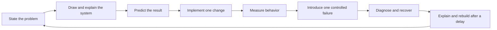

# Deployment learning path: understand, build, diagnose, remember

After the core deployment foundations, follow the [MLOps Project Track](../01-MLOps-Project-Track/README.md) for three in-depth project designs and the planned progression to AIOps, FinOps, and Forward Deployed Engineering.

This path connects the existing projects into a progression from a local process to stateful applications, mixed stacks, on-premises deployment, Kubernetes, and eventual cloud/hybrid operations.

**Your current constraints:** an i7 13th-generation laptop with 16 GB RAM, no cloud lab budget, and an interest in using cloud accounts later. The core exercises should work locally. Cloud deployment is an optional later phase. Study hours and a preferred backend language are not yet specified, so progress is based on demonstrated skills rather than calendar deadlines.

## Begin here

1. Read the [gap assessment and roadmap](ROADMAP.md).
2. Complete [Lab 01: Trace a request to a process](labs/01-request-to-process.md).
3. Copy the [design and lab worksheet](templates/DESIGN-AND-LAB.md) for each later experiment.
4. Use the [retention routine](RETENTION.md) and [progress.csv](progress.csv) to plan delayed reviews.

These files provide a plan, reusable records, and the first exercise. They do not implement all the proposed on-premises, mixed-stack, hybrid, or multi-cloud labs. Record implementation and verification status honestly as you build them.

Learn enough design to explain and predict the next experiment. You do not need to finish every system-design topic before starting a service. Use experiments to expose gaps, then return to the relevant theory.

## Local resource plan

These are initial allocation estimates to measure and adjust, not performance guarantees. Installed software, operating-system overhead, application runtimes, and free disk space affect what fits.

| Lab mode | Initial scope | Memory approach |
|---|---|---|
| Process basics | One local application | No VM or cluster required |
| Linux operations | One Linux VM, application and reverse proxy | Start around 2–4 GB for the guest |
| On-premises simulation | Two small Linux VMs, separating app/proxy from PostgreSQL | Start around 4–6 GB combined; add a third only if measured headroom allows |
| Containers | One app, PostgreSQL; later a small worker and queue | Keep the total container/VM backend budget around 4–6 GB initially |
| Kubernetes | One small local cluster with one application | Start around 6 GB for its backend; increase only after measuring host headroom |
| Failure-topology simulation | A second small cluster/site only when needed | Stop other lab modes first; use sequential exercises if both sites do not fit |

Aim to leave roughly 6–8 GB for the host OS, IDE, browser, and filesystem cache. Start with the lower allocations and monitor actual memory pressure. Docker on Windows may already use a Linux VM backend; include it in the total. Do not run the full VM lab, all five runtimes, a cluster, and the entire observability stack together.

Reuse one Linux backend where practical and stop it between sessions. Check virtualization support and available disk space before installing a hypervisor or cluster. This plan does not modify your laptop configuration.

A local cluster simulates orchestration, not independent physical failure domains. A local tunnel can teach routing and link loss, but cannot prove a provider's managed connectivity. Cloud IAM, quotas, billing, managed services, and real regional recovery require later provider-specific work. Creating an account does not make deployments cost-free.
