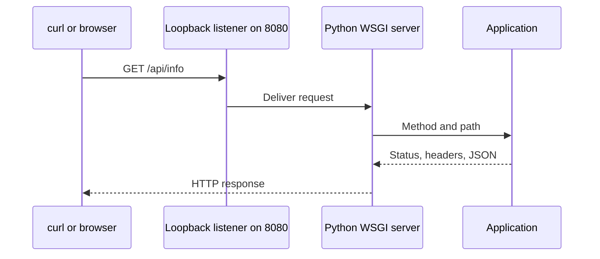

# Lab 01: Trace a request to a process

## What and why

Trace an HTTP request from a client to a listening process. Learn to distinguish an application response from a connection failure before adding containers, proxies, clusters, or clouds.

Use the existing Project 34 Python application. This is a local development-server exercise with synthetic configuration and no cloud resources. It does not demonstrate production serving, TLS, persistence, or container isolation.

## Understand and predict

A process executes the server program. A TCP listener binds an address and port. `127.0.0.1` is local loopback. HTTP carries a method/path and a response status. Receiving HTTP 404 means some server responded; it differs from failing to establish a connection.



Predict the result of `/api/info`, `/missing`, a port with no listener, and `/api/info` after the process stops.

Read [app.py](../../projects/34-standard-multistack-deployment/apps/python/app.py). Find route selection, status codes, JSON encoding, environment variables, logging, and the bind address. Explain what binding to `0.0.0.0` would change. The [Dockerfile](../../projects/34-standard-multistack-deployment/apps/python/Dockerfile) uses Gunicorn; the native exercise uses a development server.

## Implement on Windows PowerShell

Prerequisite: an installed Python runtime. In a terminal at the course repository folder:

```powershell
Set-Location '20. Final Mega Capstone Project/projects/34-standard-multistack-deployment'
$env:PORT = '8080'
$env:APP_ENV = 'learning'
$env:APP_VERSION = 'lab01'
python apps/python/app.py
```

This terminal stays occupied by the server. If port 8080 is already used, choose an unused port and update the URLs. Do not stop unrelated processes.

In a second PowerShell terminal:

```powershell
curl.exe -i http://127.0.0.1:8080/api/info
curl.exe -i http://127.0.0.1:8080/healthz
curl.exe -i http://127.0.0.1:8080/missing
Get-NetTCPConnection -LocalPort 8080 -State Listen
```

`curl.exe` explicitly selects the executable rather than a PowerShell alias. A browser can perform these GET requests if it is unavailable. Inspect the reported owning process using `Get-Process -Id PROCESS_ID`, replacing the placeholder.

Expect `/api/info` to report Python, `learning`, and `lab01`; `/healthz` to return 200; `/missing` to return 404. Compare the client output with the server log. `APP_VERSION` is supplied metadata, not independent proof of running code identity.

## Break, diagnose, recover

Stop your server with Ctrl+C in its terminal. Repeat:

```powershell
curl.exe --max-time 5 -i http://127.0.0.1:8080/api/info
```

If no other process has taken the port, expect a connection failure, not an HTTP status from this application. Explain which part of the request path disappeared. Restart the server and prove recovery. Then request a different unused port while the application is healthy; explain why that failure does not call for changing application code.

From the project folder in the second terminal, verify the shared contract:

```powershell
python scripts/smoke.py http://127.0.0.1:8080 --stack python --version lab01 --environment learning
```

## Evidence and recall

Save predictions, HTTP statuses, listener/process evidence, stopped-server error, and recovery output using the [worksheet](../templates/DESIGN-AND-LAB.md). Stop your server with Ctrl+C, confirm its listener disappears, and close its terminal to discard the session environment variables.

Schedule a delayed review in [progress.csv](../progress.csv). Without notes, explain why a healthy process can return 404, why correct code can be unreachable, and what a successful health response does not prove. Repeat with a different port.
