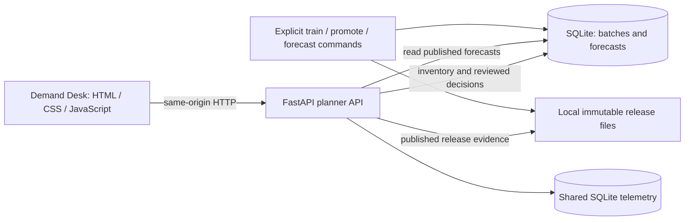
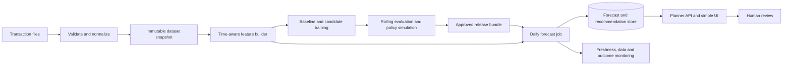

# M1 HLD: Retail demand forecasting and replenishment decision support

Status: local v1 implemented. Read [IMPLEMENTATION.md](IMPLEMENTATION.md) for the delivered subset and [../VERIFICATION.md](../VERIFICATION.md) for executed checks.

## Problem and decision

A small retailer must decide how much stock to request for the coming days. Recent sales, seasonal patterns, missing records, and changing demand complicate planning. A planner needs a versioned forecast, uncertainty information, and an understandable replenishment suggestion. Current [Amazon Business guidance](https://business.amazon.com/en/blog/supply-chain-forecasting) connects forecasting with inventory decisions; this project is a small independent learning implementation, not a reproduction of Amazon's internal system.

The business goal is to reduce simulated stockout and holding penalties while maintaining a declared service target. The ML goal is better out-of-time forecasting than a seasonal-naive baseline. These goals are related but require separate evaluation.

## Scope and data

Begin with 20–100 products and daily aggregates on one CPU machine. Provide an offline synthetic fixture with known missing-day, returns, and demand-shift cases. Optionally use [UCI Online Retail II](https://archive.ics.uci.edu/dataset/502/online+retail+ii), recording its license, citation, checksum, selection filters, and original time span.

Recorded sales are not unconstrained demand. Public transaction data does not establish stock availability, unmet demand, supplier lead times, or actual replenishment outcomes. Treat stockout censoring and missing-day interpretation explicitly. Inventory-policy evaluation uses a separate documented simulator; it cannot prove actual retail savings.

Out of scope initially: automatic purchase orders, real supplier integration, foundation models, and distributed training. A human planner reviews recommendations.

## Architecture

### Delivered local architecture

One FastAPI process serves the frontend and backend. The browser draws an SVG chart from actual API responses and never fabricates missing product data. Batch preparation runs separately from requests. UI inventory and review writes persist in the same local application database; a server restart preserves them.

A review binds together a batch ID, release ID, inventory revision, computed suggestion, and human decision. A later model promotion or stock change cannot rewrite that snapshot. Approvals require a batch published within 24 hours; stale results remain visible for investigation and deferral. The published method and historical observations always come from the batch's release, even if the active model pointer has moved.

### Broader target architecture

The following ingestion, rolling evaluation, and monitoring design includes extensions beyond the delivered local subset.

The first implementation is a modular Python application with separate batch commands and API process. Local Parquet/artifact files and SQLite or DuckDB keep the baseline small. Add PostgreSQL for concurrent serving and MLflow for experiment/registry workflows once the initial contracts work. A batch job writes forecasts atomically; the serving path never trains a model.

## Key decisions

| Decision | Why | Tradeoff |
|---|---|---|
| Daily batch forecasting | Fits the planner's decision cadence | Intra-day changes wait for the next explicit run |
| Seasonal baseline before ML | Establishes whether model complexity adds value | May remain the best deployable method for sparse products |
| Rolling chronological evaluation | Matches prediction from available history | More expensive than one random split; random rows would leak temporal structure |
| Human-reviewed replenishment | Predictions and simulator assumptions are uncertain | No claim of autonomous inventory optimization |
| One application with separate jobs | Fits the laptop and clarifies responsibilities | Requires deliberate boundaries if scaled later |

An initial candidate can use lag/calendar features with a CPU tree model. Quantile models can add intervals only after the point-forecast baseline works. Evaluate interval calibration rather than presenting arbitrary bands as confidence.

## Reliability, trust, and deployment

Transactions cross an ingestion trust boundary; invalid rows enter a quarantine report. Training artifacts cross a release boundary; serving loads only an approved compatible release. A planner can view recommendations; model promotion and dataset replacement have separate permissions when authentication is introduced.

If ingestion fails, retain the previous forecast with an explicit `stale` flag and its original timestamp; never silently label it fresh. Batch retries use a stable run key. A failed candidate does not replace an approved forecast. Model rollback does not rewrite historical forecasts or planner decisions.

Progress from scripts to Compose to an optional Kubernetes CronJob plus API Deployment. Model production and forecast production are distinct jobs. Start one service and one database at a time; keep training concurrency at one.

## Acceptance evidence

- A chronological baseline and candidate report, with zero-demand and sparse-product handling.
- A proof that changing future rows cannot alter earlier features or predictions.
- Successful recovery from malformed input, late data, failed batch publication, and stale forecasts.
- Measured forecast freshness and API latency under declared local conditions.
- A policy simulation comparing inventory outcomes under identical assumptions, with sensitivity analysis.
- An explicit record of whether the candidate earned promotion. No improvement claim is required if it did not.
