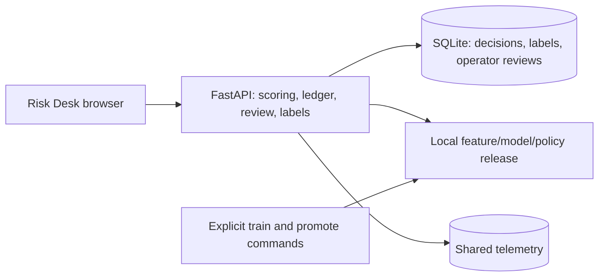
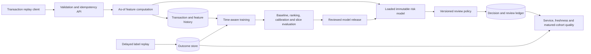

# M2 HLD: Payment-risk scoring with delayed feedback

Status: local v1 implemented with simulated transactions. See [IMPLEMENTATION.md](IMPLEMENTATION.md); no real payment system is connected.

## Problem and decision

A payment platform must assess suspicious events quickly while limiting unnecessary customer friction and a finite review workload. Fraud patterns change, labels arrive late, and an apparently accurate model can miss most fraud in an imbalanced dataset. The [2025 EBA/ECB report](https://www.eba.europa.eu/publications-and-media/press-releases/joint-eba-ecb-report-payment-fraud-strong-authentication-remains-effective-fraudsters-are-adapting) documents adaptive fraud patterns and losses across payment instruments. It motivates the problem; it does not validate this proposed model.

Build a simulated risk API and review queue. Outputs are advisory `low_risk`, `review`, or `unavailable` outcomes. No real payment is authorized, blocked, or transferred. Business evaluation considers fraud capture, false-positive friction, review capacity, and assumed error costs separately.

## Data and scope

Start with a bounded deterministic transaction stream and delayed label simulator, informed by the authors' [Fraud Detection Handbook](https://fraud-detection-handbook.github.io/fraud-detection-handbook/Chapter_3_GettingStarted/Introduction.html). Retain generation seeds, scenario definitions, and source attribution if reusing code. Synthetic scenarios make operational tests reproducible but do not establish performance against real adversaries.

Use pseudonymous entity IDs, event and arrival timestamps, amount/currency, terminal/merchant context, and fraud labels with their own availability time. Introduce known pattern shifts and missing-label periods. Do not use raw card details or personal data.

## Architecture

### Delivered local system

One process serves static frontend files and the API. Scoring saves the exact feature vector and release ID inside a serialized SQLite write transaction. A completed event retry returns its original decision. The dashboard displays active-model metrics separately from the original model evidence for a selected event.

Analyst review and observed outcome are independent records. Reviews finalize a human decision with a rationale; simulator labels become eligible for coverage only at their availability timestamp. Neither action moves money. Missing release evidence disables new scoring in the UI while the ledger remains inspectable. Model training does not automatically ingest UI labels.

### Broader target system

The following diagram includes later production extensions. PostgreSQL, tenant identity, shadow routing, and mature-cohort monitoring are not running background services in the local version.

Begin with a Python API and PostgreSQL rather than an independent feature-store platform and message broker. A single shared feature library defines offline and online calculations. Add Redis only if measured latency justifies caching, with explicit freshness and reconstruction semantics.

Training, serving, and reviewing are separate roles. The training process cannot directly change the active production policy. Server-side identity scopes all event/history/decision access; a tenant field in a request body alone is not authorization.

## Decisions and tradeoffs

| Decision | Reason | Consequence |
|---|---|---|
| Rules and logistic baseline first | Make the value of ML measurable | A complex candidate may be rejected |
| Store scored feature snapshots | Reproduce decisions and detect training-serving disagreement | Additional storage and retention management |
| Chronological evaluation with label availability | Reproduces what could actually be known | Less usable recent training data |
| Shadow before reviewed promotion | Compare a candidate without changing review outcomes | Extra inference/resource cost |
| Explicit degraded response | Dependency failure must not look like a confident low-risk result | The caller/reviewer needs an agreed fallback policy |

Feature drift is not the same as fraud-quality decline. Review labels can be selection-biased because reviewed events are not a random population. Evaluation must define label maturity/coverage and report that bias rather than assuming every unlabeled event is legitimate.

## Deployment and resilience

Start with recorded request replay, one API process, one database, and serial training. Containerize after the full journey works. Add optional Kubernetes and separate logical dev/staging environments later. The same immutable feature/model/policy bundle is promoted; environments supply their own secrets and endpoints.

A proposed local target is p95 scoring latency below 100 ms at 10 requests/second over a 60-second run, with payload size, CPU/memory, and cold/warm state recorded. This is a test hypothesis, not an achieved service-level guarantee. Measure feature queries and model execution separately.

When the model or required feature store is unavailable, respond with an explicit unavailable state or a separately versioned, documented fallback policy. Keep failures out of the low-risk success count. Model rollback restores preprocessing and thresholds together while preserving the decision ledger.

## Required demonstrations

Show that chronological and label-aware evaluation differs from a naive shuffled evaluation; the shuffled result is a teaching comparison and cannot select a release. Prove duplicate-request handling, consistent feature snapshots, delayed-label reconciliation, candidate shadowing, timeout behavior, and recovery after a bad release.

Report average precision/PR-AUC, recall at a fixed review capacity or false-positive rate, calibration, and important slices. Accuracy alone is inadequate. Any expected-loss calculation must identify assumed costs and simulator coverage; it is not actual money saved.
