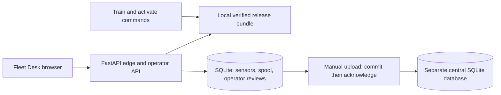

# M3 HLD: Equipment health and remaining-life estimation at the edge

Status: local CPU simulation implemented; no physical machinery is controlled. See [IMPLEMENTATION.md](IMPLEMENTATION.md) and [../VERIFICATION.md](../VERIFICATION.md).

## Problem and decision

Industrial operators need to identify degrading equipment and plan inspection while machines operate in sites with inconsistent connectivity. A useful model must handle missing sensors, changing operating conditions, and safe model updates. NIST's [AI for Manufacturing program](https://www.nist.gov/programs-projects/artificial-intelligence-ai-manufacturing) identifies integration and measurement work including maintenance-related case studies. This project studies those engineering concerns at small scale.

The application estimates remaining operating cycles and creates an inspection advisory. It does not automatically stop equipment or claim that a benchmark model is suitable for real safety-critical machinery.

## Data and transfer limits

Start with deterministic sensor fixtures for ingestion/retry tests, then optionally use the public [NASA C-MAPSS turbofan degradation benchmark](https://catalog.data.gov/dataset/cmapss-jet-engine-simulated-data), beginning with a bounded FD001 experiment. Record source, access date, citation/terms, checksum, unit selection, and preprocessing rules.

These are simulated turbofan trajectories, not observations from the user's factory. Results demonstrate benchmark modeling and deployment behavior. They do not establish avoided manufacturing downtime, transfer to unrelated machines, or lead time measured in hours. Remaining life is expressed in the dataset's operating cycles.

## Architecture

### Delivered local system

One FastAPI process serves the browser and local inference. The central adapter writes a second database in that process; it is not a networked cloud service. Sensor acceptance and enqueueing share a transaction. Inspection reviews bind to the latest sample and its immutable prediction. A newer sample prevents finalizing an outdated review, while retrying an already saved review still returns its original snapshot.

The fleet groups by site and equipment together. The browser shows the latest 60 readings, warmup/gap states, remaining-life estimates, and queue/central counts. A manual upload acknowledges up to 100 rows; inference needs the local model and edge database, not the central database. Read panels distinguish unavailable model evidence from missing sensor history.

### Broader target system

The following design includes later signed updates, remote identity, independent sites, and centralized training integrations.

```mermaid
flowchart LR
    Replay[Sensor trajectory replay] --> Edge[Edge validator and rolling features]
    Edge --> LocalModel[Local approved model]
    LocalModel --> Advisory[Inspection advisory]
    Edge --> Spool[(Durable local upload spool)]
    Spool --> Ingest[Central ingestion and deduplication]
    Ingest --> History[(Versioned telemetry history)]
    History --> Train[Entity-aware model training]
    Train --> Eval[Remaining-life and warning evaluation]
    Eval --> Registry[Approved signed release bundle]
    Registry --> Update[Staged edge update]
    Update --> LocalModel
    Advisory --> Audit[(Local advisory log)]
    Audit --> Spool
```

The edge keeps inference running without central connectivity using an already approved artifact. Central services own historical training, validation, and release approval. The central server is not required on every prediction request.

Begin with two logical processes or Compose networks on one laptop. Add separate VMs only after resource measurement. All local sites share one physical failure domain; a simulated network cut does not demonstrate physical site resilience.

## Design choices

| Choice | Reason | Tradeoff |
|---|---|---|
| CPU feature-based baseline | Enables bounded training and inference on the laptop | May be weaker than advanced sequence models |
| Hold out complete equipment units | Tests generalization beyond memorizing a machine's trajectory | Less apparent training/evaluation data |
| Local inference and bounded spool | Continues during link loss | Edge storage and model-age policies need explicit operation |
| Staged immutable model distribution | Avoids partially updated preprocessing/model pairs | More release state than copying a model file |
| Advisory plus operator review | Benchmark uncertainty and operational context matter | No autonomous maintenance or machinery control |

Use an age-only or population baseline and a small regression candidate with trailing-window summaries. The challenge is a reliable lifecycle, not requiring deep learning. Add uncertainty estimates only with a defined calibration and coverage test.

## Trust and failure boundaries

Device identity authenticates central uploads and constrains site access. Production identity rotation/revocation is a later integration; local demo credentials must not imply mutual authentication has been established. Model manifests are validated before activation. Checksums protect integrity; a trusted signature/key distribution mechanism protects authenticity.

A disconnected edge retains its active approved model and records release age. At a declared model-expiry limit, it degrades explicitly according to the operator policy rather than silently asserting confidence. Full disk, missing sensors, incompatible units, and sensor-clock changes have separate states and observable counters.

## Evidence and deployment progression

First prove window construction and unit-isolated evaluation. Next serve a prediction locally. Then add a durable spool and link interruption. Finally stage a corrupt/incompatible candidate, reject it, activate a valid candidate, and restore a previous approved release.

Measure remaining-life error on held-out units, warning precision/recall and lead cycles under a declared event policy, edge inference latency/memory, duplicate upload behavior, and reconnection recovery. A proposed resilience exercise is a ten-minute simulated link interruption with a bounded sensor rate and enough pre-calculated spool capacity. It remains a target until tested.

Remote backup/restore, real device certificates, cloud object storage, and physical fleet validation are later deployment extensions. Each requires separate evidence.
