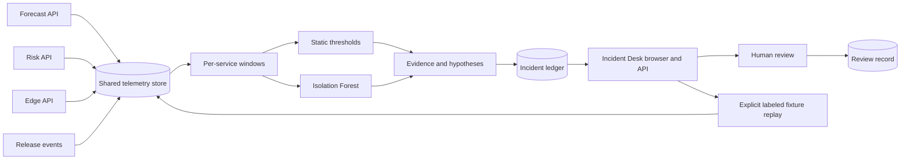

# AIOps HLD: Detect, correlate evidence, and support incident review

Status: local v1 implemented; see [IMPLEMENTATION.md](IMPLEMENTATION.md) for boundaries.

## Problem

An operator of the three ML products needs to distinguish service failure, unusual load, deployment regression, and disconnected consumers. The system should reduce investigation effort while exposing the evidence behind each suggestion. ML anomalies and temporal correlations are observations, not proof of causality.

## Architecture

Use the existing Python/SQLite stack to keep resource use small. The first detector is trained on reproducible synthetic healthy windows; its held-out fixture comparison shows false-alert and detection behavior. Real service middleware provides an integration path. Production adoption requires learning and evaluating appropriate service-specific baselines.

The delivered browser and API run in one FastAPI process. Refresh reads current windows and retained incidents; Analyze explicitly evaluates eligible windows and records completed runs. New incidents preserve the exact sample and release-event snapshots that supported their hypotheses, so an expired current window does not destroy the evidence for a past review. Legacy records expose only the details originally captured.

The service overview always includes the three MLOps services and separates no recent samples, too few samples, and eligible windows. Eligibility is a data-coverage state, not a health verdict. Detector evidence for an old incident is loaded from its original release, separately from the active model used by a new analysis.

## Boundaries and tradeoffs

The monitor reads telemetry and writes incident/review records. Its optional learning fixture endpoint also writes explicitly simulated telemetry. It has no remediation executor or deployment integration. A release-regression suggestion includes evidence references and a next diagnostic check; it does not automatically revert a model.

SQLite fits a one-host lab and shared Compose volume. It is not a distributed telemetry bus. HTTP request latency and error counts are observed; CPU/memory and network state are not automatically measured. Queue depth is available only where a producer emits it. Missing signals cannot be inferred as healthy.

Use explicit fixture tags to distinguish replayed faults from observed service failures. Preserve proposals and rejection decisions for later evaluation. FinOps can subsequently attribute monitoring/inference overhead; that project is not implemented in this stage.

## Acceptance

Compare the ML detector with rules, measure false positives/recall on independent labeled fixtures, consume actual service HTTP failures, retain an incident after the telemetry window expires, avoid duplicate records for identical evidence, and prove that approval does not execute any remediation.
