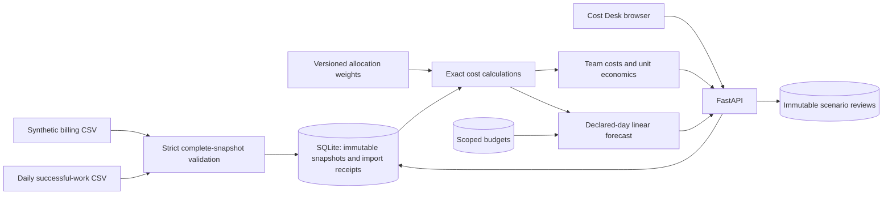

# HLD: cost governance for a shared ML platform

## Problem and decision

A team operates batch forecasting, online payment scoring, edge inference, and observability. Shared infrastructure makes ownership unclear, untagged charges hide responsibility, and a lower total bill may simply reflect less useful work. Engineers and budget owners need a common view of cost, usage, allocation assumptions, and proposed changes.

The product helps a local learner answer: which team owns a charge, what spending might look like at month end, how cost relates to successful work, and what evidence is needed before accepting a savings hypothesis. It does not demonstrate measured cloud savings or employer-specific production practices.

These responsibilities align with the FinOps Foundation's [Allocation](https://www.finops.org/framework/capabilities/allocation/), [Budgeting](https://www.finops.org/framework/capabilities/budgeting/), and [Unit Economics](https://www.finops.org/framework/capabilities/unit-economics/) capabilities. Shared allocation methods vary; this project deliberately chooses fixed weights to make reconciliation visible.

## Delivered architecture

One process serves HTML/CSS/JavaScript and the API; SQLite holds application state. Calculations happen on demand over a bounded snapshot. No broker, Kubernetes cluster, feature store, model registry, or external billing API is required. AWS/Azure/GCP/on-premises are synthetic source labels within the input, not deployment targets exercised by the application.

## Decisions and tradeoffs

| Decision | Why | Tradeoff |
|---|---|---|
| Complete immutable billing snapshots | Publish a reconciled view without partial imports | Incremental provider exports and corrections need a later ingestion design |
| Integer micro-units | Preserve six decimal places and allocation totals | Provider currencies/precision need explicit normalization before real use |
| One currency per snapshot | Avoid meaningless cross-currency sums | No consolidated FX view; another publication changes the active scope |
| Fixed shared-cost weights | Explainable, auditable showback | Proxy usage or direct metering may be fairer for a real platform |
| Explicit unallocated bucket | Ownership gaps remain visible | Human metadata work is needed to close them |
| Separate usage denominators | Prevent billing-line multiplication of business units | Correct source coverage and unit definitions must be governed |
| Linear run-rate forecast | Easy to calculate and challenge | Ignores seasonality, billing delays, commitments, and one-off credits |
| Reviewed hypothesis only | Preserve a decision before an operational change | The product cannot claim realized savings |

Forecasting in a real FinOps practice combines historical information and planned changes; the [FinOps forecasting capability](https://www.finops.org/framework/capabilities/forecasting/) provides the broader context. The delivered linear estimate is a teaching baseline, not a universal forecasting method.

## Trust and consistency

Validate both CSVs before committing anything. Duplicate import receipts cannot republish an older snapshot accidentally on retry. New publications deliberately replace the current pointer while preserving prior snapshots. Allocation and budget writes use expected revisions to reject lost updates. A review must match the current billing ID and policy revision; its original calculated basis remains immutable after later changes.

The browser is not authoritative for costs or savings. It submits assumptions; the backend calculates and saves the result. Same-origin checks and input bounds support a local trust boundary, but the product has no authenticated users or cloud write credentials/integration.

## Production progression

After the local workflow is understood, add provider ingestion adapters and reconciliation against actual invoices; explicitly define billed/effective cost semantics, refunds, taxes, discounts, currencies, and corrections. Then add authenticated ownership, audited rule changes, database migrations, retention, reporting exports, and usage-source validation.

Measure before automating: source completeness, allocation coverage, forecast error on past closed months, quality/latency impact of an optimization, and realized cost change under comparable workload. Local laptop usage estimates, hypothetical price models, and actual cloud invoices must remain separate sources of evidence.
