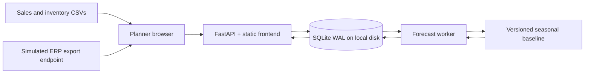
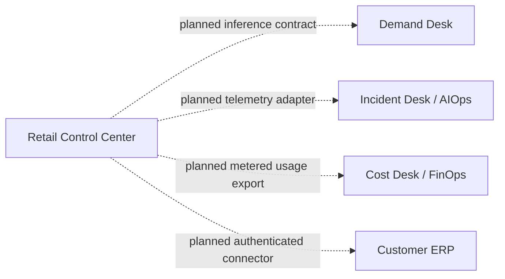

# High-level design

## Implemented boundary

One customer deployment, one warehouse, one shared local database, and two processes using the same codebase. This is a modular application with an asynchronous worker; it does not become a microservice architecture merely because it has two processes.

The simulated ERP endpoint serves synthetic CSV fixtures. It is an integration contract exercise, not a network connector to a real ERP. Both uploads and the simulated export enter the same validation path.

## Request and data flow

1. The API validates both CSVs, canonicalizes their values, and creates a content hash. In one transaction it stores the immutable snapshot, publishes its current pointer, and saves a retry receipt.
2. The planner requests a forecast for that snapshot. The API inserts one durable job per snapshot and algorithm version. It returns a job ID before calculation.
3. The worker claims a job with a time-limited lease and ownership token. Calculation uses the immutable snapshot. Completion publishes the result only if the worker still owns an unexpired lease.
4. The browser refreshes to display the result and calculation assumptions.
5. A review transaction checks that the job succeeded and still belongs to the current snapshot. It saves the decision and full recommendation. Approval never sends a purchase order.

## Decisions and tradeoffs

| Decision | Why now | Limit / migration trigger |
| --- | --- | --- |
| Same-origin static frontend + FastAPI | One deployable UI/API, no Node toolchain needed | Separate frontend deployment when its lifecycle warrants it |
| SQLite WAL + short transactions | Durable, inspectable, and small enough for a laptop | PostgreSQL and a migration strategy when multiple hosts or write contention matter |
| Database-backed job queue | Work survives restarts without another broker | Add a broker and transactional outbox when delivery volume or isolation requires them |
| Fixed 30-second lease, no heartbeat | Computation is bounded to 50 SKUs and completes quickly locally | Long-running model jobs need heartbeat renewal, timeout policy, and resource isolation |
| Seasonal baseline | Gives understandable forecasts on actual imported data | Add a trained model only behind a customer-input contract and temporal evaluation |
| Immutable input and review snapshots | Decisions remain explainable after new imports | Add retention/export policies before data grows indefinitely |
| One final review per SKU/job | Prevents conflicting final decisions in this pilot | Add explicit supersession if the customer needs amendments |

The existing Demand Desk forecasts from the dataset saved with its release. Calling that API would not forecast this customer's imported sales. Milestone 2 must add an explicit inference contract, validate compatible product/features, and record the selected release and fallback reason. This milestone does not pretend those integrations are already wired.

## Failure behavior

- **Bad export:** 422; no current pointer changes.
- **Lost HTTP response:** unchanged retry returns the original receipt. A later import remains current.
- **Worker down:** queue persists. API readiness does not imply worker health; the UI shows queued/running status and attempts.
- **Worker crash after claim:** another worker can reclaim after expiry. The previous token cannot publish.
- **Repeated calculation failure:** stop after three attempts and retain a failed job. Automatic retries wait for the next worker iteration; no exponential backoff is needed for this local deterministic calculation. There is no manual retry endpoint yet.
- **New import while old job runs:** old job can complete for audit, but cannot receive a new current-snapshot review.
- **Database unavailable:** requests fail visibly. No fake successful response or in-memory substitution.

## Later integration boundaries

Dashed links are unimplemented. Each requires a contract, timeout/retry policy, evidence provenance, unavailable-state UX, and integration tests. AIOps hypotheses must remain distinct from proved causes; cost estimates must remain distinct from measured savings.

## Deployment progression

Native processes → local Compose → single on-premises host → customer-approved cloud pilot. Keep SQLite on a local filesystem shared by these two processes, not across cloud hosts or a network filesystem. Do not copy this database design into multi-cloud active-active deployments. Authentication, TLS, secrets, database migrations, external backups, image digest promotion, and load targets belong to later environment acceptance work.
