# Low-level design

## API contracts

Interactive request schemas are at `/docs`; every write model forbids unknown fields. Request IDs use 8–80 ASCII letters, digits, hyphens, or underscores.

| Method and route | Contract |
| --- | --- |
| GET `/v1/erp/export` | Synthetic sales/inventory CSV strings and source disclosure |
| POST `/v1/imports` | `request_id`, `sales_csv`, `inventory_csv`; returns `batch_id`, row count, through-date |
| POST `/v1/jobs` | `request_id`, current `batch_id`; returns deterministic `job_id` |
| GET `/v1/desk` | Current snapshot summary, latest 30 jobs/results, latest 50 reviews |
| POST `/v1/reviews` | `request_id`, `job_id`, `sku`, `decision`, `reviewer`, `notes`; returns saved recommendation and `executed:false` |
| GET `/healthz` | API process liveness |
| GET `/readyz` | Database readability; explicitly does not report worker readiness |

## Input and forecast contract

Sales header: `date,sku,units`. Inventory header: `sku,on_hand,safety_stock`. Header order is exact; one optional leading UTF-8 BOM is accepted. Data field whitespace is trimmed. All quantities are integers from 0 to 1,000,000. Duplicate rows are rejected, including identical duplicates. Inventory has at most 50 unique SKUs. Both inputs must cover exactly the same SKU set. Each SKU must cover the same 28–366 consecutive calendar dates. Future dates and noncanonical dates fail. Missing sales days never become implicit zeros.

CSV string limits are 1,000,000 characters for sales and 50,000 for inventory; they are application validation limits, not streaming HTTP body limits. Inputs are bounded for this lab, but a deployed gateway should reject oversized HTTP bodies before parsing them.

Canonical snapshot JSON sorts object keys. Equivalent parsed data yields the same SHA-256 batch ID. Receipts hash the validated request payload including the CSV strings; a byte-level CSV change with the same request ID conflicts even if it would parse to the same snapshot. Receipts are scoped to operation type.

For every SKU, forecast days 1–7 repeat the last seven observations in order. A separate seven-day temporal backtest compares the final observed week against the previous week's values. It does not use the final week as its own backtest prediction.

`suggested_units = max(0, sum(next_7_days) + safety_stock - on_hand)`

This is a simplified planning policy. Inventory age is disclosed, not independently verified. Historical snapshots are explicitly replays. Approvals over 24 hours after job completion fail, but that check alone does not establish source-data freshness. Actual purchasing would need a stronger business freshness contract.

## Database

| Table | Identity and purpose |
| --- | --- |
| `batches` | `id` hash PK; immutable canonical source snapshot, creation time |
| `current_batch` | Singleton slot 1; currently published batch ID |
| `receipts` | Operation-prefixed request ID PK; payload hash and original response |
| `jobs` | Hash of batch ID and algorithm version PK; state, attempts, lease/token, result/error, timestamps |
| `reviews` | Request ID PK; unique hash of job ID and SKU; immutable full decision snapshot |

SQLite WAL permits readers while a writer operates. Mutations use `BEGIN IMMEDIATE` to serialize competing writers before checking receipts or state. The desk uses one read transaction so its snapshot and job list are consistent. Connections commit or roll back and always close. Tables initialize idempotently; no schema migration framework exists yet.

## Job state machine

```mermaid
stateDiagram-v2
    [*] --> queued: enqueue unique batch/method
    queued --> running: claim; increment attempts; issue token and lease
    running --> succeeded: publish with current unexpired token
    running --> queued: computation error before attempt 3
    running --> failed: computation error on attempt 3
    running --> running: expired lease reclaimed; new token; attempts below 3
    running --> failed: expired third lease
```

`claim` obtains an eligible row under a write transaction. The worker calculates outside that transaction. `finish` checks job ID, running state, ownership token, and lease expiry in the update itself. A stale worker's completion changes zero rows. This provides retryable execution with one accepted completion; it does not promise exactly-once execution of arbitrary external side effects.

Failed jobs remain visible. There is no automatic reset of the attempts counter and no retry button that silently changes evidence. In this first milestone, diagnose a failed job, fix the cause, and use a new corrected data snapshot; an intentional operational replay API is later work. Identical successful snapshots reuse their original job, including its completion time.

## Review transaction

1. Look up the request receipt; return an exact previous response or reject changed reuse.
2. Require a successful job for the currently published batch.
3. Reject approval if its execution evidence is older than 24 hours; deferral remains allowed.
4. Find the requested SKU in the saved result.
5. Require no existing final review for that job/SKU.
6. Insert the full recommendation, assumptions, human input, and timestamp, plus its receipt, in the same transaction.

An unchanged retry after a newer import still returns its original successful review. A new review of that old forecast fails. A new snapshot gets a new forecast and review target. The local UI shows only recent history; the complete ledger remains in the database.
