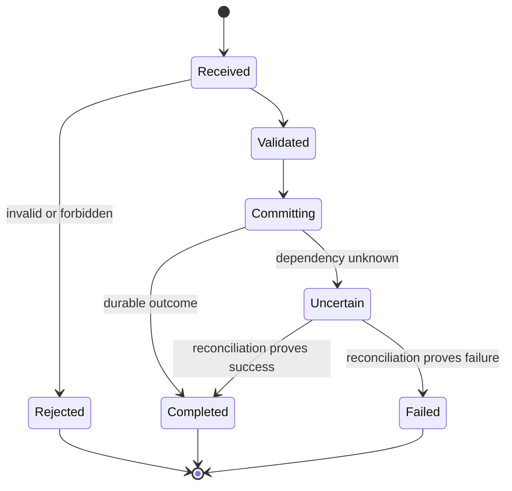

# Java Banking Microservices Platform - LLD

## Rules and contracts

- Separate transport, domain, persistence, and provider adapters.
- Enforce invariants in the domain owner, never only in the UI.
- Make errors, timeouts, retries, idempotency, side effects, cancellation, and cleanup explicit.
- Bound request size, queues, connections, workers, memory, retries, logs, and metrics.

| Workload | Responsibility | Port | Health |
|---|---|---:|---|
| `gateway` | Public API and routing | 8080 | `/actuator/health` |
| `accounts` | Account ownership and queries | 8081 | `/actuator/health` |
| `ledger` | Idempotent transfer journal | 8082 | `/actuator/health` |
| `frontend` | Vue banking portal | 8080 | `/health` |

| Concern | Contract |
|---|---|
| Correlation | Accept/create `X-Request-ID`, return it, log it safely |
| Idempotency | Retryable writes require `Idempotency-Key` and stable outcome |
| Deadline | Internal work finishes before caller deadline |
| Errors | Stable code, safe message, request ID, retryability, correct status |
| Validation | Type, required fields, bounds, size, normalization |
| Security | Authenticate, authorize action/resource, encode output, audit |
| Compatibility | Additive evolution and owned deprecation |

## Persistence, concurrency, and dependencies

- Stable keys, database constraints for uniqueness/idempotency, smallest complete transaction, query-derived indexes, resumable migrations.
- Shared state has an explicit lock, atomic, transaction, actor, queue, or owner.
- Files, sockets, transactions, threads/tasks, temporary data, and locks release on every exit path.
- No infinite retry: safe operation, attempt cap, backoff/jitter, concurrency isolation, caller deadline.

## Telemetry and tests

Emit request count/duration, in-flight work, stable errors, dependency latency, saturation, version, and readiness. Never put secrets or unbounded IDs in metric labels.

Unit tests prove invariants; contract tests prove schema/error/timeout compatibility; integration tests use real adapters; E2E protects the journey; load finds saturation; fault tests prove recovery; security tests reject unauthorized, malformed, oversized, and injected input.

Rollout sequence: expand -> mixed versions -> migrate -> verify -> contract -> cleanup.
