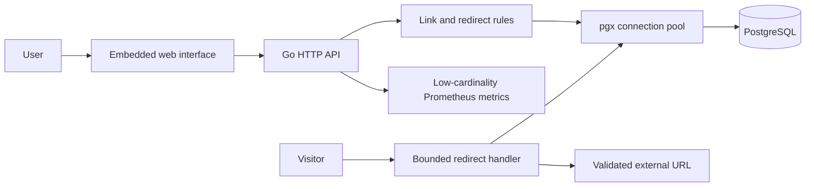
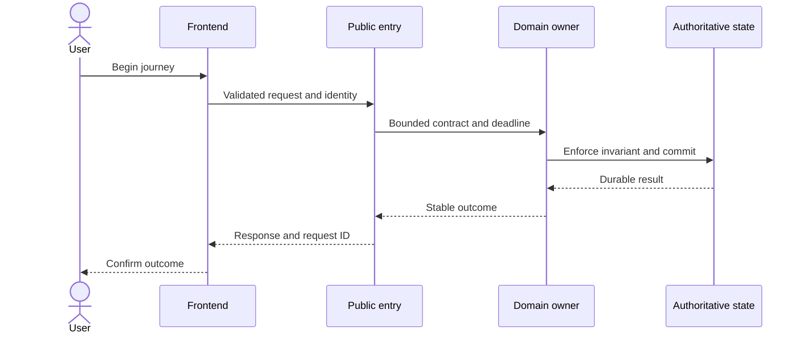
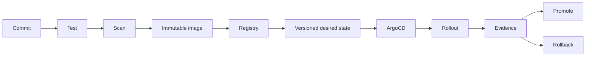

# Go Cloud-Native URL Shortener - HLD

## Scope and architecture

The **Cloud-native service** owns the shortener critical journey. It prioritizes correctness, secure boundaries, reversible delivery, observable outcomes, and a path from Compose to Kubernetes.

| Workload | Responsibility | Port | Health |
|---|---|---:|---|
| `app` | Embedded UI, short-link API, redirect path, persistence, and operational telemetry | 8080 | `/health` |

## Quality attributes

| Attribute | Initial objective | HLD response |
|---|---|---|
| Availability | 99.9% monthly | Replicas, readiness, PDB, graceful termination |
| Latency | p95 below 500 ms under modeled load | Bounded chain, deadlines, capacity test, degradation |
| Durability | No acknowledged critical write silently lost | Idempotency, authoritative state, backup/restore, reconciliation |
| Security | Least privilege and no production secret in Git | Non-root, RBAC, NetworkPolicy, runtime secret, audit |
| Recovery | Initial RTO 60m / RPO 15m | IaC, GitOps, backup, restore order, exercise |
| Delivery | Reversible immutable release | Scan, digest, readiness, progressive gate, rollback criteria |

These objectives are hypotheses until load, failure, security, and restore evidence exists.

## Critical journey

## Data, security, reliability, capacity

- Domain owners define identifiers, invariants, transactions, retention, deletion, backup, and reconciliation.
- Cross-boundary writes carry stable idempotency keys; migrations use expand-migrate-contract.
- Trust comes from verified identity and resource authorization, not network location.
- Remote calls have a deadline, bounded safe retry, jitter, isolation, stable error, and telemetry.
- Estimate peak requests/s, payload, service time, concurrency, storage growth, bandwidth, skew, headroom, and failure reserve.

## Delivery

## Review checklist

- Actors, journeys, constraints, scale, SLOs, and data sensitivity are measurable.
- Every box has responsibility/owner; every arrow has protocol, identity, timeout, retry, data, and failure meaning.
- Data authority, migration, backup, restore, security, cost, rollout, and operations are explicit.
