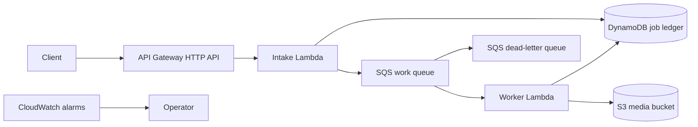

# AWS Serverless Media Processing Pipeline

Event-driven capstone for learning API Gateway, Lambda, SQS, dead-letter queues, DynamoDB idempotency, S3 events, least-privilege IAM, alarms, and infrastructure as code.



## What this project teaches

- At-least-once delivery, idempotent consumers, duplicate messages, visibility timeouts, partial batch failure, and poison-message isolation.
- Lambda time/memory/concurrency controls, structured logs, correlation IDs, and cost-aware serverless operations.
- Terraform as the deployment authority and AWS SAM for local validation/invocation.
- IAM scoped by action and resource; encrypted S3, SQS, DynamoDB, and log retention.

## Validate locally

```bash
python -m unittest discover -s tests -v
sam validate --lint
sam build
sam local invoke IntakeFunction -e events/intake-api.json
terraform -chdir=terraform init -backend=false
terraform -chdir=terraform validate
```

The local SAM invoke needs Docker and AWS-compatible test credentials only if the function reaches AWS services. Unit tests use fakes and do not need an AWS account.

## Deploy safely

```bash
terraform -chdir=terraform init
terraform -chdir=terraform plan -out=reviewed.tfplan
terraform -chdir=terraform apply reviewed.tfplan
```

Configure encrypted, versioned, locked remote state before team use. Review account, region, IAM, quotas, public API exposure, log/data retention, KMS strategy, cost alarms, and the exact plan. Destroying the stack can remove queues and job records; production data lifecycles require explicit retention and recovery decisions.

See `docs/HLD.md`, `docs/LLD.md`, `docs/RUNBOOK.md`, and `docs/THREAT-MODEL.md`.
