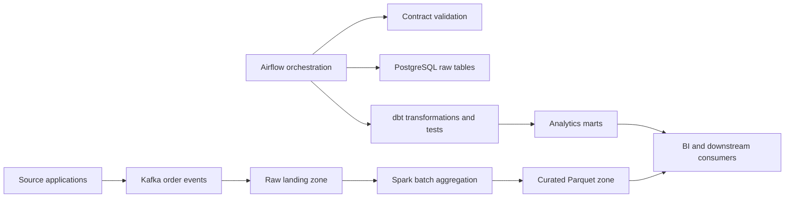

# Modern Batch and Streaming Data Platform

An industry-shaped data engineering capstone combining Apache Airflow 3, Apache Spark 4, dbt, Apache Kafka 4, PostgreSQL, data contracts, quality checks, lineage-friendly transformations, CI, Kubernetes batch workloads, and Terraform.



## What this project teaches

- Batch versus streaming boundaries, event schemas, replay, idempotent ingestion, Kafka consumer groups, and back-pressure.
- Airflow 3 TaskFlow DAG authoring through the public `airflow.sdk` interface, retries, scheduling, quality gates, and operational ownership.
- Spark transformations, partitioned Parquet outputs, dbt staging/mart layers, source tests, and repeatable backfills.
- Separate local and production concerns: Compose for learning; managed orchestration, object storage, encrypted networks, and catalog services for production.

## Fast start

```bash
cp .env.example .env
docker compose config
docker compose up --build airflow-init
docker compose up --build -d postgres kafka airflow-api airflow-scheduler airflow-dag-processor
# Airflow UI: http://localhost:8095 (admin / local-development-only)
docker compose --profile demo run --rm producer
docker compose --profile batch run --rm spark-batch
docker compose --profile transform run --rm dbt run
docker compose --profile transform run --rm dbt test
```

Run `bash scripts/test.sh` for offline contract/unit checks and configuration validation. Generated Parquet is written below `data/curated/` and is intentionally ignored.

## Production adoption gate

Do not lift the local Compose topology directly into production. Decide the managed Airflow/Kafka/Spark services, schema registry, checkpoint and replay policy, object-store format, catalog, data classification, retention, lineage, encryption, private networking, workload identity, cost model, RPO/RTO, and ownership first. See `docs/HLD.md`, `docs/LLD.md`, `docs/RUNBOOK.md`, and `docs/THREAT-MODEL.md`.
