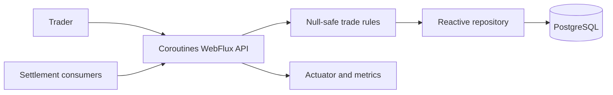

# Kotlin Reactive Energy Trading Service

Production-oriented **Reactive enterprise service** capstone using **Kotlin 2.4 / Java 25 / Spring Boot 4.1 / WebFlux / R2DBC / PostgreSQL** with **HTTP API**.



## Workloads

| Workload | Responsibility | Port | Health |
|---|---|---:|---|
| `app` | Kotlin coroutine API, deterministic trade rules, reactive persistence, health, and metrics | 8080 | `/health` |

## Included DevOps assets

- Runnable application and frontend source.
- Non-root multi-stage Dockerfiles and `docker-compose.yml`.
- Kubernetes Deployments, Services, probes, resources, HPA, PDB, Ingress, NetworkPolicy, ConfigMap, Secret example, and Kustomize overlays.
- Helm, Argo CD, Prometheus resources, and Kyverno policy.
- GitHub Actions, Jenkins, Ansible, and Terraform for AWS VPC/EKS/ECR/optional RDS.
- HLD, LLD, dependency register, threat model, and operations runbook.

## Run locally

```bash
cp .env.example .env
docker compose config
docker compose build
docker compose up -d
curl http://localhost:8098/health
```

Open `http://localhost:8098`. Stop with `docker compose down`; add `--volumes` only for disposable local data.

## Validate

```bash
bash scripts/test.sh
docker compose build
docker compose up -d
bash scripts/smoke-test.sh http://localhost:8098
docker compose down
```

Windows: `./scripts/validate.ps1`.

## Kubernetes, Helm, and GitOps

Replace image names and example secrets first.

```bash
kubectl apply -k k8s/overlays/dev
helm lint helm
helm template energy-trading helm --namespace energy-kotlin
kubectl apply -f argocd/application.yaml
```

## Terraform warning

Terraform creates billable AWS resources. Configure encrypted remote state, review account/region/cost and the exact plan, and apply only through an authorized workflow. Never commit credentials.

## Production gates

1. Replace domains, repository, registry, owners, secrets, and cloud placeholders.
2. Use intentionally operated stateful dependencies with backup, restore, RTO, and RPO evidence.
3. Pin/scan dependencies and images, generate SBOM/provenance, sign artifacts, and enforce admission policy.
4. Define SLIs/SLOs, capacity reserve, alerts, rollout abort conditions, and rollback limits.
5. Test authorization, malformed input, duplicate work, dependency timeout, overload, migration, restore, and reconciliation.

See `docs/HLD.md`, `docs/LLD.md`, `docs/DEPENDENCIES.md`, `docs/VERSION-POLICY.md`, `docs/THREAT-MODEL.md`, and `docs/RUNBOOK.md`.
