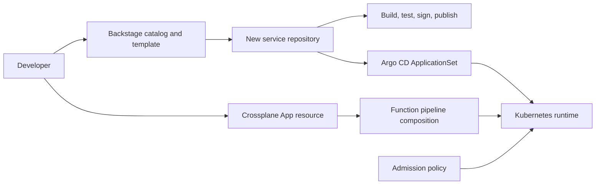

# Internal Developer Platform and Golden Path

A platform-engineering capstone built around Backstage 1.49, Crossplane v2, Argo CD, Kyverno, Kubernetes, GitHub Actions, and Terraform. The project is intentionally a control-plane reference implementation rather than another business API.



## What to build and demonstrate

1. Register the sample domain, system, component, owner, and API in Backstage.
2. Run the `production-service` template and create a repository containing source, CI, catalog metadata, Kubernetes resources, and an Argo CD application.
3. Install Crossplane v2 and apply the `App` XRD/composition. Create an `App` and inspect composed Deployment and Service resources.
4. Prove the Kyverno policy rejects privileged, unbounded, mutable-tag workloads.
5. Measure lead time, deployment frequency, change-failure rate, developer wait time, and golden-path adoption.

This repository stores overlays and platform contracts; bootstrap an actual Backstage application with the official create-app tool, then merge `backstage/app-config.yaml` and mount `catalog/` plus `templates/`. Never enable guest authentication outside local development.

## Validate

```bash
kubectl kustomize .
kubectl apply --dry-run=client -f crossplane/
kubectl apply --dry-run=client -f argocd/
terraform -chdir=terraform init -backend=false
terraform -chdir=terraform validate
```

See `docs/HLD.md`, `docs/LLD.md`, `docs/RUNBOOK.md`, `docs/THREAT-MODEL.md`, and `docs/PLATFORM-SCORECARD.md` before treating this as a production platform.
