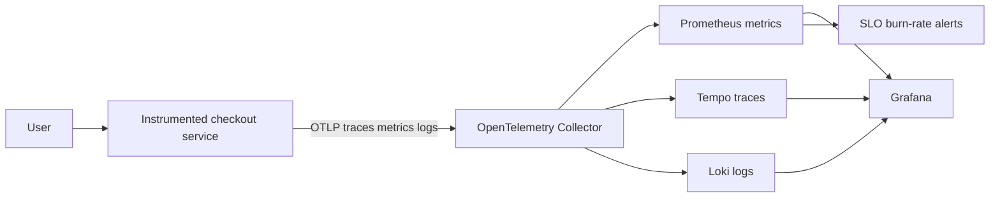

# OpenTelemetry Observability and SRE Platform

A runnable three-pillar observability capstone using OpenTelemetry Collector 0.157, Prometheus 3.12, Loki 3.7, Tempo 2.10, Grafana 13.1, and an instrumented FastAPI checkout service.



## Run the lab

```bash
cp .env.example .env
docker compose config
docker compose up --build -d
curl http://localhost:8099/health
curl -X POST http://localhost:8099/api/checkout -H 'content-type: application/json' -d '{"cartId":"CART-1001","items":3,"total":149.90}'
```

- Checkout API: `http://localhost:8099`
- Prometheus: `http://localhost:8100`
- Grafana: `http://localhost:8101` (`admin` and the configured password)

Generate both successful and failed requests with `python scripts/load.py`. In Grafana, move from RED metrics to an exemplar/trace and then to correlated logs. Trigger the burn-rate alert, write an incident timeline, and calculate error-budget consumption.

The Compose topology is a learning environment. Production requires HA collectors, authenticated OTLP, tenant isolation, object storage, retention controls, cardinality budgets, sampling policy, PII filtering, query limits, backups, and cost ownership. See the HLD, LLD, runbook, threat model, and telemetry-governance document.
