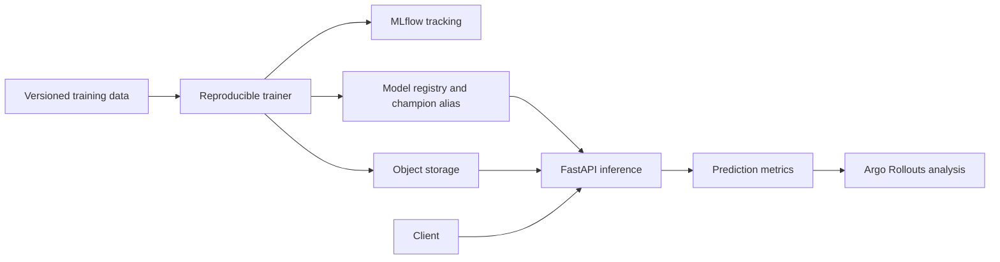

# MLOps Model Delivery Platform

A production-shaped model lifecycle capstone using MLflow 3.15, scikit-learn, FastAPI, PostgreSQL, S3-compatible object storage, model aliases, contract tests, observability, and Kubernetes canary analysis.



## Run locally

```bash
cp .env.example .env
docker compose config
docker compose up --build -d postgres minio minio-init mlflow
docker compose --profile train run --rm trainer
docker compose up --build -d api
curl http://localhost:8102/health
curl -X POST http://localhost:8102/predict -H 'content-type: application/json' -d '{"features":[0.2,-1.1,0.7,1.5]}'
```

- Inference API: `http://localhost:8102`
- MLflow: `http://localhost:8103`
- MinIO console: `http://localhost:8104`

## Required exercises

1. Add dataset version/checksum capture and a feature contract.
2. Add evaluation gates for accuracy, calibration, fairness slices, latency, and artifact vulnerability/provenance.
3. Promote a challenger with a reviewed model card and registry alias change.
4. Deploy through the Argo Rollout, force a canary regression, and prove automatic abort.
5. Simulate drift, retraining, rollback, artifact loss, and registry unavailability.

Synthetic data keeps the example self-contained; it does not make this a real fraud model. Production use requires approved data, privacy/legal review, feature lineage, reproducible environments, bias/safety evaluation, human escalation, monitoring, and a documented rollback authority.
