# Secure Software Factory

An end-to-end software-supply-chain capstone implementing SLSA 1.2 evidence, CycloneDX/SPDX SBOMs, vulnerability policy, keyless Sigstore signing, provenance verification, immutable CI dependencies, and Kubernetes admission enforcement.

```mermaid
flowchart LR
    Commit --> CI[Isolated CI build]
    CI --> Test[Test and lint]
    Test --> Image[OCI image by digest]
    Image --> SBOM[Syft SBOM]
    SBOM --> Scan[Grype policy gate]
    Scan --> Provenance[SLSA provenance]
    Provenance --> Sign[Cosign keyless signature]
    Sign --> Registry[OCI registry]
    Registry --> Admission[Kyverno verifyImages]
    Admission --> Runtime[Kubernetes runtime]
```



## Required demonstration

1. Build the sample application without exposing publishing credentials to pull-request jobs.
2. Generate SPDX and CycloneDX SBOMs; scan the immutable image digest and retain SARIF plus JSON evidence.
3. Sign and attest the pushed digest through GitHub OIDC. Never sign a mutable tag.
4. Verify signer identity, issuer, digest, and SLSA predicate before promotion.
5. Prove the admission policy rejects unsigned images and the CI policy rejects tag-pinned third-party actions.
6. Produce a release evidence bundle and rehearse compromised-builder and vulnerable-package response.

## Local validation

```bash
python -m unittest discover -s tests -v
python scripts/verify_action_pins.py .github/workflows
docker compose config
kubectl kustomize k8s
```

Publishing and keyless signing run only for protected `main` pushes. Forked and pull-request workflows receive read-only permissions and no cloud credentials. Replace example repository identities and registry coordinates before use.
