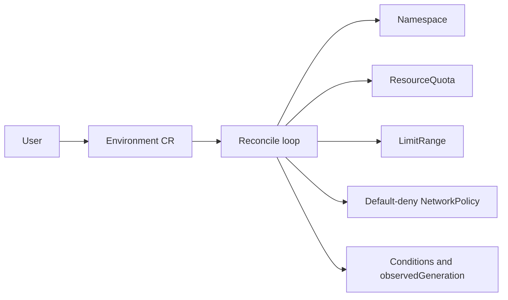

# Go Kubernetes Environment Operator

A Kubernetes 1.36/controller-runtime 0.24 capstone that implements a real declarative API and idempotent control loop in Go 1.26. An `Environment` custom resource creates and continuously reconciles a governed tenant namespace.



## What to demonstrate

1. Install the CRD/RBAC/controller and create `config/samples/environment.yaml`.
2. Prove repeated reconciliation is idempotent and manual drift is repaired.
3. Submit invalid quota and owner values and observe schema/domain validation.
4. Delete the custom resource and trace finalizer-driven namespace cleanup.
5. Run two replicas and prove only the leader reconciles.
6. Inject API conflicts and timeouts; verify bounded requeue, events, status conditions and metrics.

## Validate

```bash
go test ./... -race -cover
go vet ./...
kubectl kustomize config
docker build -t environment-operator:dev .
```

Never point this learning operator at a shared cluster until deletion behavior, RBAC, admission rules and namespace ownership are reviewed.
