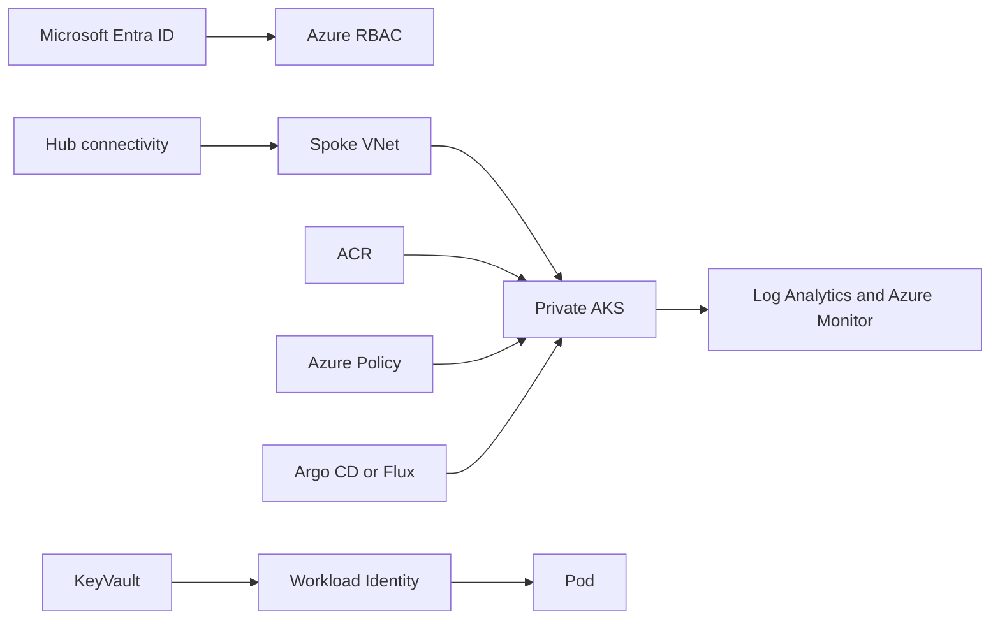

# Azure Enterprise Platform and AKS Landing Zone

A production-shaped Azure platform capstone using Bicep, AKS, Cilium, private networking, Azure Container Registry, Key Vault, Azure Monitor, Azure Policy, Entra Workload Identity and GitOps-ready Kubernetes contracts.



## Required demonstration

1. Run a subscription-scope Bicep what-if; review every resource, role and monthly cost before deployment.
2. Deploy a private AKS baseline into an application landing-zone subscription connected to centrally owned network/DNS services.
3. Use Entra Workload Identity for Key Vault access; prove the pod has no client secret.
4. Pull through private ACR, enforce Azure Policy and Kubernetes admission controls, and publish diagnostic logs centrally.
5. Exercise node-pool upgrade, availability-zone failure, Key Vault rotation, backup/restore and regional recovery runbooks.

## Validate without provisioning

```bash
az bicep build --file infra/main.bicep
az deployment sub what-if --location centralindia --template-file infra/main.bicep --parameters infra/dev.bicepparam
kubectl kustomize k8s
```

The supplied defaults are examples, not cost authorization. Private DNS, hub peering, Defender plans, backup vaults, production node sizing and organization policy assignments must be owned by the relevant platform teams.
