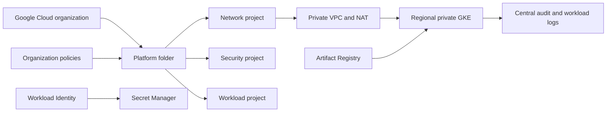

# Google Cloud Enterprise Platform and GKE Landing Zone

A Google Cloud foundation capstone using Terraform, organization/folder/project boundaries, Shared-VPC-ready networking, private regional GKE, Workload Identity Federation, Cloud KMS, Secret Manager, Artifact Registry, Pub/Sub, Binary Authorization, centralized logging and Cloud Build.



## Required demonstration

1. Review and plan the organization/folder/project bootstrap separately from workload infrastructure.
2. Prove GKE nodes and control plane are private, egress is controlled, and tenant workloads use Workload Identity rather than JSON keys.
3. Build an immutable image with Cloud Build, retain provenance, enforce Binary Authorization and deploy through GitOps.
4. Validate project isolation, IAM inheritance, Shared VPC ownership, log sinks, KMS/Secret Manager access and budget alerts.
5. Recreate the cluster from Terraform/GitOps and rehearse regional workload and state recovery.

## Validate without provisioning

```bash
terraform -chdir=terraform/bootstrap init -backend=false
terraform -chdir=terraform/bootstrap validate
terraform -chdir=terraform/workload init -backend=false
terraform -chdir=terraform/workload validate
kubectl kustomize k8s
gcloud builds submit --config cloudbuild.yaml --no-source # use only after configuring a project
```

Organization creation, billing attachment, domain identity, shared networking and security-center activation require enterprise administrators. Never test them in a production organization without a reviewed plan and rollback strategy.
