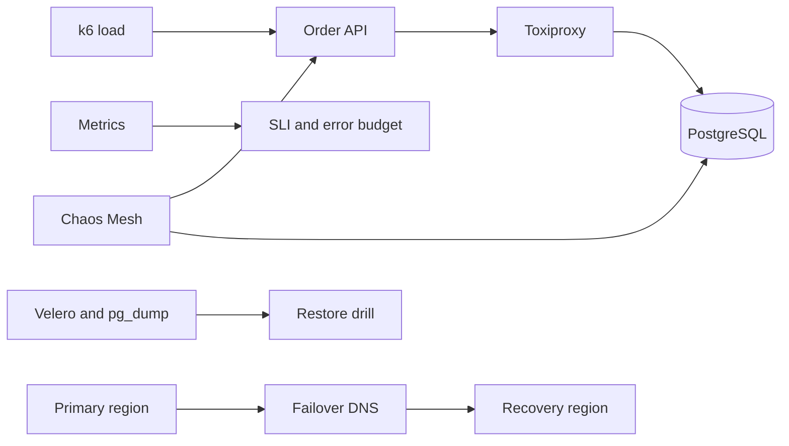

# Reliability and Disaster-Recovery Engineering Lab

A measurable SRE capstone combining a fault-aware FastAPI/PostgreSQL workload, Toxiproxy dependency injection, k6 load tests, Chaos Mesh experiments, PodDisruptionBudgets, Velero backup schedules, restore jobs, multi-region DNS Terraform, error budgets and scored game-day evidence.



## Required game days

1. Inject 500 ms database latency, then a 20-second outage; measure detection, mitigation and recovery.
2. Delete pods and drain a node while k6 holds steady load; verify the PDB and readiness behavior.
3. Restore a database backup into an isolated namespace and verify data checksums, not just Job success.
4. Simulate regional loss and perform a controlled DNS failover; record measured RTO, RPO and stale-write risk.
5. Exhaust the monthly error budget and prove release policy changes automatically.

## Local start

```bash
cp .env.example .env
docker compose up --build -d
python -m unittest discover -s tests -v
k6 run load/order-api.js
powershell -File scripts/set-db-latency.ps1 -LatencyMs 500
python scripts/score_game_day.py evidence/example.json
```

Chaos and recovery resources are deliberately not auto-applied. Establish blast radius, steady-state hypothesis, abort conditions, owner approval and backup proof before every experiment.
