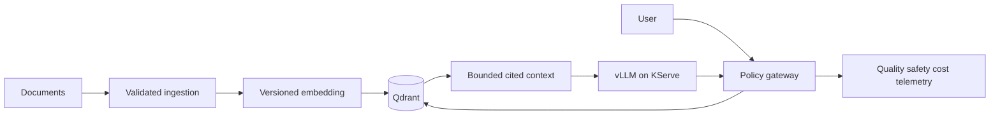

# LLMOps and Retrieval-Augmented Generation Platform

An end-to-end LLM delivery capstone using an OpenAI-compatible gateway, governed RAG ingestion, Qdrant 1.18, vLLM 0.26, KServe contracts, offline evaluation, prompt/version metadata, injection controls, tenant filtering, observability, GPU-aware deployment and rollback evidence.



## Required demonstration

1. Ingest versioned, authorized documents with tenant, source, checksum and retention metadata.
2. Evaluate retrieval recall, citation coverage, groundedness, refusal behavior, prompt-injection resistance, latency and token cost against a fixed dataset.
3. Deploy vLLM behind KServe with GPU resource limits, batching, autoscaling and an immutable model/prompt release.
4. Canary a model or prompt; promote only when quality, safety, latency and cost gates pass.
5. Trace a request from gateway through retrieval and inference without logging sensitive prompts or document content.
6. Revoke a document/model and prove cache, vector, artifact and serving rollback behavior.

## Local start

```bash
cp .env.example .env
docker compose up --build -d
python -m unittest discover -s tests -v
python scripts/ingest_sample.py
curl -s http://localhost:8107/v1/answer -H 'Content-Type: application/json' -d '{"tenant":"demo","question":"What is the refund policy?"}'
```

Local Compose uses a deterministic development embedding and mock OpenAI-compatible model so the workflow runs without a GPU. The `gpu` profile and Kubernetes resources demonstrate vLLM/KServe; model licenses, weights, CUDA compatibility and GPU cost must be reviewed before use.
