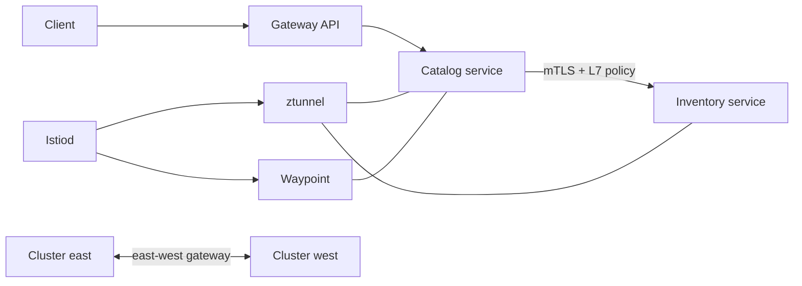

# Istio Ambient Zero-Trust and Multi-Cluster Service Mesh

A platform-networking capstone for Istio 1.30 ambient mode, Gateway API, waypoint proxies, workload identity, strict mTLS, authorization, traffic management, multi-cluster topology and mesh observability.



## Outcomes

- Build a sidecarless ambient mesh and explain ztunnel versus waypoint responsibilities.
- Enforce default-deny L4/L7 policy with SPIFFE-style service identity and strict mTLS.
- Route with Kubernetes Gateway API, retries, timeouts and controlled egress.
- Model primary-primary multi-cluster failure, certificate trust and locality-aware recovery.
- Validate mesh policy as code before applying it to a cluster.

## Start

```powershell
python -m unittest discover -s tests -v
kubectl kustomize k8s
./scripts/validate.ps1
```

Install Gateway API CRDs and Istio 1.30 with `helm/istio-values.yaml` before applying the rendered resources. The two kind configurations are deliberately separate so you can practice trust-domain and east-west-gateway setup without touching a shared cluster.
