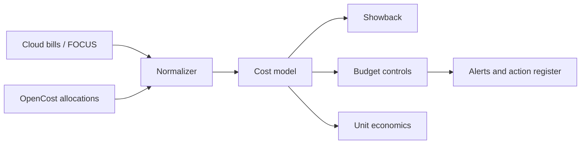

# FinOps, OpenCost and FOCUS Governance Platform

A cost-engineering capstone using OpenCost, Prometheus, FOCUS-shaped billing data, showback/chargeback, unit economics, budget policy, anomaly detection, rightsizing evidence and accountable optimization.



## Outcomes

- Reconcile Kubernetes allocation cost with provider billing instead of treating estimates as invoices.
- Attribute cost using owner, product, environment and cost-center dimensions.
- Calculate cost per request/order/model token and distinguish useful growth from waste.
- Implement budget thresholds, anomaly evidence and safe rightsizing recommendations.
- Run a FinOps operating cadence across engineering, finance and product stakeholders.

## Start

```powershell
python -m unittest discover -s tests -v
python scripts/report.py data/opencost-allocations.json policies/budgets.json
kubectl kustomize k8s
```

The sample values are intentionally synthetic. Never use a recommendation as an automated production resize until seasonality, headroom, disruption budgets and service objectives have been reviewed.
