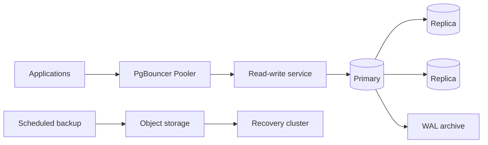

# CloudNativePG PostgreSQL Database Platform

A database-platform capstone using PostgreSQL 18, CloudNativePG 1.30, PgBouncer, online migrations, WAL archiving, scheduled backups, point-in-time recovery, observability, disruption controls and evidence-driven restore drills.



## Outcomes

- Operate a declarative HA database without pretending Kubernetes alone solves database reliability.
- Design transaction pooling, connection budgets, synchronous replication and topology spread.
- Apply expand/migrate/contract schema changes with explicit rollback and backup gates.
- Prove backup integrity through isolated PITR drills and checksum evidence.
- Define database SLOs for availability, latency, replication lag, transaction age and recovery.

## Start

```powershell
Copy-Item .env.example .env
docker compose up -d postgres migrate
python -m unittest discover -s tests -v
kubectl kustomize k8s
```

The Kubernetes manifests assume the CloudNativePG and Barman Cloud Plugin CRDs are installed. Replace object-store and identity placeholders before any cluster application.
