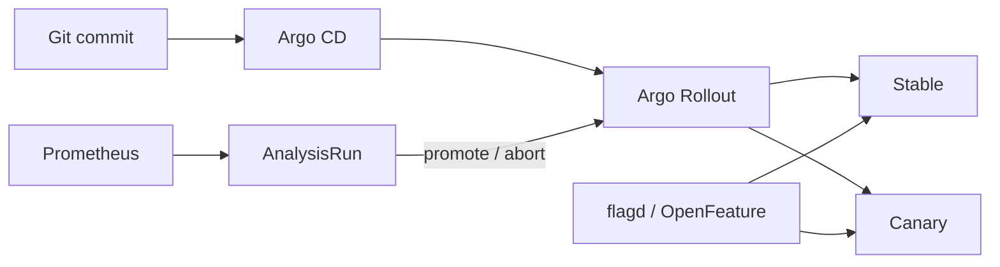

# Progressive Delivery and OpenFeature Platform

A release-engineering capstone using Argo Rollouts 1.9.1, Prometheus analysis, OpenFeature, flagd, automated rollback, canary/blue-green strategies, feature-flag governance and separation of deployment from release.



## Outcomes

- Distinguish deployment, traffic exposure and feature release.
- Build canary steps with measurable success, latency and business guardrails.
- Automate rollback while preserving GitOps reconciliation semantics.
- Govern flag ownership, expiry, safe defaults, targeting and emergency kills.
- Rehearse roll-forward, rollback and flag-disable incident decisions.

## Start

```powershell
docker compose config
python -m unittest discover -s tests -v
python scripts/simulate.py
kubectl kustomize k8s
```

Install Argo Rollouts and the OpenFeature Operator before applying the Kubernetes resources. Use real metric names and tested Prometheus queries before enabling automated production promotion.
