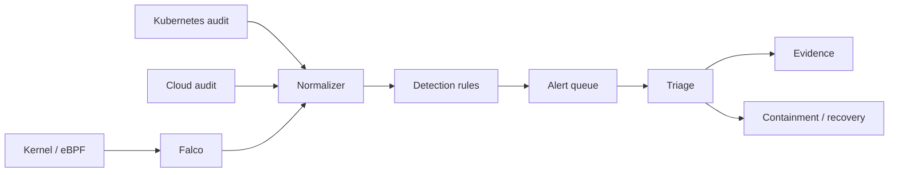

# Cloud-Native Detection and Incident Response Platform

A security-operations capstone using Falco 0.44.1, eBPF/runtime signals, Tetragon policies, Kubernetes audit events, Sigma-style analytics, detection-as-code tests, evidence preservation and containment runbooks.



## Outcomes

- Treat detections like production code with fixtures, expected matches and false-positive review.
- Correlate runtime, Kubernetes and cloud-control-plane identities.
- Separate high-confidence prevention from detection-only learning rules.
- Preserve timelines, hashes, commands and ownership for incident evidence.
- Rehearse containment without destroying evidence or expanding blast radius.

## Start

```powershell
python -m unittest discover -s tests -v
python scripts/hunt.py evidence/events.jsonl detections/rules.json
docker compose config
kubectl kustomize k8s
```

Falco needs privileged host access and a compatible Linux kernel. Run it only in a disposable Linux lab or an approved security environment; Compose validation does not grant permission to monitor a developer workstation.

`k8s/audit-policy.yaml` is kube-apiserver configuration, not an object applied through the Kubernetes API, so it is intentionally excluded from the Kustomization.
