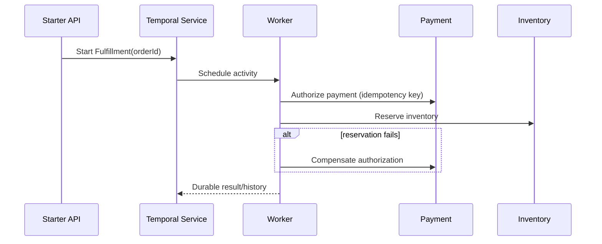

# Temporal Durable Workflow Platform

A distributed-systems capstone using Temporal 1.31, Python SDK workflows, activities, signals, queries, retries, timeouts, idempotency, saga compensation, history replay, worker versioning and production persistence operations.



## Outcomes

- Explain durable execution, event history and deterministic workflow code.
- Design activity retry, timeout, heartbeat and idempotency boundaries.
- Implement signals, queries, cancellation and saga compensation.
- Replay histories before deploying workflow-code changes.
- Operate Temporal persistence, visibility, worker queues and safe upgrades.

## Start

```powershell
docker compose config
python -m unittest discover -s tests -v
python scripts/replay.py history/fulfillment.json
kubectl kustomize k8s
```

For a live lab, copy `.env.example` to `.env`, start Compose, install the Python dependencies and run the worker/starter. The unit and replay exercises remain dependency-free so workflow design can be validated before infrastructure is available.
