# Standard Multi-Stack Application Deployment

**One delivery method, five runnable stacks: Python, Node.js, Java, Go, and .NET.**

This is the starting project for learning a common container delivery pattern: review code, build and test an image, scan it, publish it, and promote its immutable digest through dev, staging, and production. Application build commands vary by language; the release contract stays consistent. Organizations adapt this pattern to their scale, risk, and platform. Kubernetes is the reference deployment target here, not a requirement for every application.

The samples are small, stateless services that let you learn deployment without database or business-domain complexity. For full applications, use the [stack adaptation guide](docs/STACKS.md) to connect this method to the other Module 20 projects.

## Architecture

```mermaid
flowchart LR
    Developer --> PR[Code review]
    PR --> CI[Build and contract test]
    CI --> Scan[SBOM and vulnerability gate]
    Scan --> Registry[GHCR image digest]
    Registry --> Change[Environment promotion PR]
    Change --> Git[Reviewed desired state]
    Git --> Argo[Argo CD]
    Argo --> Dev[Dev]
    Dev --> Staging[Staging verification]
    Staging --> Prod[Production approval]
    Prod --> Observe[Observe and verify]
    Observe --> Revert[Revert release commit if needed]
    Revert --> Git
```



CI has no cluster credentials. Argo CD reads approved configuration. Each environment refers to the **same image digest**; changing environment configuration does not rebuild the application.

## Included stacks

| Selection | Runtime/server | Build | Example endpoint |
|---|---|---|---|
| `python` | Python 3.13, WSGI, Gunicorn | Install pinned Python requirements | `/api/info` |
| `node` | Node.js 24, native HTTP | Copy dependency-free JavaScript | `/api/info` |
| `java` | Java 21, JDK HTTP server | Compile in JDK image; run in JRE image | `/api/info` |
| `go` | Go 1.26, `net/http` | Compile static binary; distroless runtime | `/api/info` |
| `dotnet` | .NET 10, ASP.NET Core | Restore and publish; ASP.NET runtime | `/api/info` |

These demonstrate runtime packaging, not complete Flask, Express, Spring, or domain applications. Runtime tags are chosen baselines, not a promise of perpetual support. See [version and security responsibilities](docs/DEPLOYMENT.md#production-adoption).

## Start locally

Prerequisites: Docker Engine/Desktop with **Linux containers** and Compose v2, plus Python 3.10+ for the shared scripts. Kubernetes validation also needs `kubectl` with Kustomize support. Run these commands **inside this project folder**.

```bash
cp .env.example .env
```

On PowerShell, use `Copy-Item .env.example .env`. Edit `.env` and select `STACK=python`, `node`, `java`, `go`, or `dotnet`. Start one at a time on the same local port:

```bash
docker compose config --quiet
docker compose up --build -d
python scripts/smoke.py http://127.0.0.1:8180 --stack python --version dev --environment local
docker compose logs app
docker compose down
```

Match `--stack` to your selection. Open `http://127.0.0.1:8180/api/info` for the JSON response. There is no frontend at `/`. Stop Compose before switching stacks. The examples use no passwords, databases, external APIs, or persistent volumes.

To compare two stacks simultaneously, run independent project copies with distinct `docker compose -p` names and different `HOST_PORT` values.

## Common application contract

| Concern | Contract |
|---|---|
| Network | Listen on `0.0.0.0:8080` inside the container; Service exposes port 80 |
| Liveness | `GET /healthz` returns `200 {"status":"ok"}` while the process can serve requests |
| Readiness | `GET /readyz` returns 200 when it can accept traffic; these stateless examples have no dependency checks |
| Business smoke check | `GET /api/info` returns service, stack, version, and environment |
| Failure contract | Unknown route returns JSON 404; POST returns JSON 405 |
| Configuration | `APP_ENV` and `APP_VERSION`; secrets must come from a separate secret provider |
| Runtime | Non-root UID 10001, read-only root filesystem, writable bounded `/tmp`, no Linux capabilities |
| Shutdown | SIGTERM handling through the runtime/server; 30-second termination window includes a 5-second Kubernetes drain delay |
| Logs | Request/status records on stdout; collect centrally and add request/trace correlation for real applications |
| Artifact identity | Registry digest is authoritative; `APP_VERSION` is informative source metadata |

Startup probes allow initialization before liveness checks begin. Readiness controls traffic eligibility; liveness failures can restart containers. Do not make liveness depend on the database. These roles follow [Kubernetes probe guidance](https://kubernetes.io/docs/concepts/workloads/pods/probes/).

## Project layout

```text
apps/                    Five application sources and Dockerfiles
compose.yaml             Common local runtime restrictions
.github/workflows/       Image CI and independent configuration validation
k8s/base/                Shared Deployment, Service, ServiceAccount, NetworkPolicy
k8s/overlays/            Five stacks x dev/staging/prod
k8s/namespaces/          Platform-owned namespace definitions
k8s/optional/            HTTPS Gateway routing example
argocd/                  Restricted project and Application examples
scripts/                 Smoke checks, validation, native checks, promotion
tests/                   Promotion safety and artifact consistency tests
docs/                    Deployment procedure, stack mapping, runbook, assessment
```

Kustomize files use JSON syntax, which is valid YAML, so the promotion script can safely edit structured configuration with Python's standard library. Overlays add stack-specific names and selectors so all five services can coexist in an environment.

## Validate and deploy

```bash
python scripts/validate.py
python scripts/test_native.py
```

The first command renders all 15 overlays and runs promotion tests without connecting to a cluster. The optional native checks exercise installed Python, Node, and Java runtimes. Python's native mode uses a development WSGI server; Docker uses Gunicorn. Rendering does not prove cluster admission, scheduling, registry access, or application availability.

Follow [DEPLOYMENT.md](docs/DEPLOYMENT.md) for repository setup, CI, registry access, namespaces, GitOps, promotion, and post-deployment verification. Follow [RUNBOOK.md](docs/RUNBOOK.md) for rollout failure and rollback. Complete [CAPSTONE.md](docs/CAPSTONE.md) for the final submission.

See [VERIFICATION.md](docs/VERIFICATION.md) for checks executed in this workspace and the remaining runtime/deployment checks.

## Scope and platform integration

Included automation builds, contract-tests, exports the tested image, produces a CycloneDX SBOM, blocks HIGH/CRITICAL vulnerabilities, publishes on main, and records the digest. Promotion edits files for review. GitHub branch protection, production review, registry pull access, platform provisioning, signing/admission, DNS/TLS, alerts, and backup operations require the documented setup. The sample services do not implement authentication, persistence, metrics, or distributed tracing.

Use existing portfolio foundations for [AWS/EKS](../10-go-url-shortener/README.md), [Azure/AKS](../24-azure-enterprise-platform/README.md), [GCP/GKE](../25-gcp-enterprise-platform/README.md), [observability](../20-opentelemetry-observability-platform/README.md), [artifact trust](../22-secure-software-factory/README.md), and [PostgreSQL operations](../30-cloudnative-postgresql-database-platform/README.md). Infrastructure has a separate plan/review/apply lifecycle from application releases.
