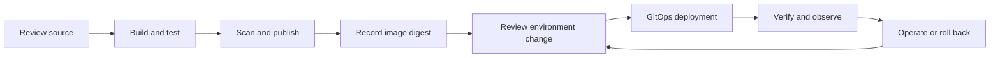

# DevOps Master Class

**Learn to design, deliver, troubleshoot, and operate software—from the first local process to cloud infrastructure, Kubernetes, platform engineering, and applied MLOps.**

This repository is a self-paced learning library and practical project workspace. It brings together **20 curriculum modules**, a **34-project capstone portfolio**, a deployment learning path, and additional **MLOps, AIOps, FinOps, and Forward Deployed Engineering (FDE)** applications. Lessons explain the concepts; labs, source code, configuration, architecture documents, and failure exercises help turn those concepts into working skills.

The central question throughout the material is: **Can you explain how a system works, deliver a change safely, recognize when it fails, and demonstrate recovery?**

Start with [Module 1][module-1] for foundations, the [Deployment Learning Path][learning-path] for a guided sequence of experiments, or [Project 34: Standard Multi-Stack Deployment][project-34] if you already know basic Git and Docker and want a concrete delivery exercise.

## Contents

- [Why this project exists](#why-this-project-exists)
- [Who this is for](#who-this-is-for)
- [What you should be able to do](#what-you-should-be-able-to-do)
- [Repository structure](#repository-structure)
- [The complete curriculum](#the-complete-curriculum)
- [Projects and practical work](#projects-and-practical-work)
- [Specialization tracks](#specialization-tracks)
- [Choose a learning route](#choose-a-learning-route)
- [Prerequisites and lab setup](#prerequisites-and-lab-setup)
- [Run your first deployment project](#run-your-first-deployment-project)
- [How to practice and measure progress](#how-to-practice-and-measure-progress)
- [What is covered and what is not](#what-is-covered-and-what-is-not)
- [Verification and project maturity](#verification-and-project-maturity)
- [Contributing improvements](#contributing-improvements)

## Why this project exists

Learning individual tools is only part of DevOps work. A successful build still needs a trustworthy artifact, repeatable deployment, useful health checks, appropriate access controls, and a recovery plan. A running service still needs ownership, monitoring, incident handling, and a cost model.

This project connects those responsibilities into one learning journey. You begin with operating-system and application fundamentals, then work through containers, delivery pipelines, infrastructure, orchestration, security, and operations. Later modules ask you to reason about reliability, architecture, developer experience, and cost together.

The practical material gives you systems to inspect and change. Compare a monolith with microservices, follow a request through a proxy and application, trace a release from source to image digest, break a dependency in a lab, and explain the evidence behind your diagnosis. The intended result is a portfolio of reproducible work and defensible decisions.

## Who this is for

| Learner | How to use the material |
|---|---|
| New DevOps learners | Build the mental model first, then practice Git, Linux, scripting, application runtime, and containers in sequence. |
| Developers moving into operations | Connect application behavior to packaging, configuration, deployment, telemetry, and rollback. |
| System administrators and cloud engineers | Extend infrastructure skills into reviewed automation, CI/CD, Kubernetes, GitOps, and service ownership. |
| DevOps engineers and SREs | Work through diagnosis, service objectives, incident response, recovery evidence, and architectural tradeoffs. |
| Platform engineers | Explore templates, catalogs, platform APIs, tenant boundaries, policy, and developer workflows. |
| Learners exploring ML infrastructure | Study data contracts, model evaluation, release identity, serving, and monitoring using local applications. |
| Interview and portfolio candidates | Use designs, demonstrations, incident write-ups, and measured results to explain what you have built. |

You do not need to know every language in the catalog. Start with one familiar stack and compare other implementations when their operational differences become relevant. Advanced projects assume the foundations taught earlier in the course.

## What you should be able to do

After completing the relevant lessons and demonstrating the exercises, you should be able to:

1. **Explain a running service:** follow traffic through DNS, networking, a reverse proxy, the application, and its data dependencies; identify configuration, permissions, logs, and process ownership.
2. **Automate repeatable work:** write Bash and Python utilities with validation, useful errors, reports, and tests.
3. **Deliver a traceable release:** review changes, build and test, scan, publish, promote the same image digest, verify deployment, and recover from a bad release.
4. **Manage infrastructure as code:** understand state, plans, dependencies, access boundaries, configuration management, drift, and review before applying changes.
5. **Operate containers and Kubernetes:** configure workloads, networking, storage, health probes, resources, and rollout behavior; troubleshoot failures systematically.
6. **Use operational evidence:** correlate metrics, logs, and traces; define service objectives; investigate incidents; and write runbooks and postmortems.
7. **Defend design decisions:** explain tradeoffs in availability, scaling, persistence, queues, security, recovery, ownership, and cost.
8. **Build a reproducible portfolio:** leave source, instructions, tests, architecture, release records, and recovery evidence another learner can follow.

Progress depends on practice. Reading a lesson or copying a configuration alone does not demonstrate these outcomes.

## Repository structure

```text
DevOps-Master-Class/
├── README.md
├── 1. Mental Model & Environment Setup/
├── 2. Git, GitHub & Engineering Workflow/
├── ... modules 3–7 ...
├── 8. CI/
│   └── CD Pipelines__GitHub Actions_Jenkins_GitLab CI/
├── ... modules 9–19 ...
├── 20. Final Mega Capstone Project/
│   ├── Lesson 20.*.md
│   ├── 00-Deployment-Learning-Path/
│   ├── 01-MLOps-Project-Track/
│   ├── 02-FinOps-Project-Track/
│   ├── 03-FDE-Project-Track/
│   └── projects/
│       ├── README.md
│       ├── 01-python-commerce-microservices/
│       ├── ... projects 02–33 ...
│       └── 34-standard-multistack-deployment/
└── tools/
```

Read lesson files in **numeric order**: `Lesson 3.2.md` precedes `Lesson 3.10.md`. Folder names contain spaces, so quote paths in terminal commands. Module 8's lessons are inside its nested CI/CD folder.

The [capstone overview][capstone] connects the practical routes. Each project's README is the entry point for its dependencies, commands, ports, architecture, and limits. This is a collection of independent exercises; there is no single root command that starts every application.

The `tools/` directory contains a lesson-expansion maintenance script. It is for maintaining course material and is not required to run the learner projects.

## The complete curriculum

Each row links to the module folder. The practice column describes skills and evidence to work toward through the lessons and related projects; it does not imply a separately packaged application for every row.

| Module | What it teaches | Practice and intended result |
|---|---|---|
| **[1. Mental Model & Environment Setup][module-1]** | Environments, deployment versus release, rollback, availability objectives, architecture components, failure thinking, and workspace setup. | Create a learning repository and architecture notes; explain the path from a developer change to a running service. |
| **[2. Git, GitHub & Engineering Workflow][module-2]** | Branching, pull requests, reviews, versioning, releases, Actions foundations, repository security, and access controls. | Practice a reviewed change and release workflow with status checks, traceability, and repository governance. |
| **[3. Linux, Bash & Networking][module-3]** | Filesystems, permissions, users, processes, systemd, logs, storage, CPU/memory, shell automation, networking, and SSH. | Build a health-check toolkit; diagnose process, access, resource, DNS, and connectivity failures. |
| **[4. Python for DevOps Automation][module-4]** | Project structure, APIs, configuration validation, logging, reporting, testing, and CI integration. | Build an audit/reporting CLI and automation toolkit with predictable inputs, outputs, and failure behavior. |
| **[5. Application Runtime & Production App Basics][module-5]** | Configuration, secrets, logs, PM2/systemd, Nginx, HTTPS, release directories, atomic deployment, shutdown, and rollback. | Operate an application behind a proxy; practice health-checked deployment and recovery. |
| **[6. Docker & Container Fundamentals][module-6]** | Images, layers, caching, Dockerfiles, Compose, networking, persistence, security, registries, resource limits, and troubleshooting. | Package and run an application stack; explain image identity, persistence, resource use, and rollback. |
| **[7. Artifact Management & Registries][module-7]** | Versioning, checksums, digests, ECR/GHCR, software bills of materials (SBOMs), provenance, signing, promotion, retention, and permissions. | Follow an artifact from build to verification and design retention that preserves rollback options. |
| **[8. CI/CD Pipelines][module-8]** | Pipeline workflows using GitHub Actions, Jenkins, and GitLab CI. | Connect build, test, security checks, publication, deployment, and verification into a repeatable process. |
| **[9. DevSecOps Security Gates][module-9]** | Static analysis, secret/dependency/image/IaC scanning, Dockerfile checks, license policies, policy as code, DAST, and exceptions. | Collect security evidence and make explicit pass/fail and exception decisions before release. |
| **[10. Kubernetes Production Operations][module-10]** | Cluster architecture, local labs, workloads, Services, ingress, configuration, access, storage, resources, and rollout operations. | Deploy declaratively and explain how traffic reaches a healthy replica. |
| **[11. Advanced Kubernetes Troubleshooting][module-11]** | Diagnosis across workload, scheduling, networking, storage, and cluster failure scenarios. | Turn symptoms into hypotheses, inspect events and runtime evidence, recover, and document the cause. |
| **[12. Terraform, Ansible & Infrastructure as Code][module-12]** | Declarative infrastructure, Terraform workflows and state, AWS resources, IAM troubleshooting, and configuration automation. | Review infrastructure changes; distinguish provisioning, application delivery, and configuration management. |
| **[13. AWS Production Architecture][module-13]** | An extensive AWS lesson collection covering cloud architecture and service operations. | Connect identity, networking, compute, data, and operations; adapt AWS-backed capstone designs to a reviewed lab. |
| **[14. GitOps with Argo CD][module-14]** | Desired state, reconciliation, drift, Argo CD architecture, bootstrapping, environment delivery, and secrets integration. | Promote reviewed configuration, investigate drift, and restore an earlier desired state. |
| **[15. Observability][module-15]** | Prometheus, recording/alerting rules, Alertmanager, Grafana, Loki, Tempo, OpenTelemetry, instrumentation, and correlation. | Follow a failure through metrics, logs, and traces; build dashboards and alerts that support operational decisions. |
| **[16. SRE, Incident Response & On-call][module-16]** | Ownership, SLIs/SLOs, error budgets, capacity, toil, alerting, incident command, runbooks, postmortems, and disaster recovery. | Run an incident exercise, communicate status, measure recovery, and write follow-up actions. |
| **[17. System Design for DevOps & SRE][module-17]** | Requirements, estimation, APIs, load balancing, storage, consistency, caching, queues, scaling, degradation, and multi-region recovery. | Produce a design and defend capacity, reliability, and operational tradeoffs. |
| **[18. Platform Engineering][module-18]** | Platform as a product, catalogs, ownership, scorecards, templates, APIs, multi-tenancy, GitOps, supply chain, and governance. | Design a developer workflow with clear contracts, guardrails, ownership, and platform service objectives. |
| **[19. FinOps & Cost Optimization][module-19]** | Allocation, tagging, budgets, forecasts, anomalies, rightsizing, Kubernetes costs, commitments, and unit economics. | Explain who owns a cost, what useful output it supports, and how to test an optimization. |
| **[20. Final Mega Capstone Project][module-20]** | Requirements, architecture decisions, infrastructure, applications, delivery, observability, SRE, platform capabilities, cost, and evidence. | Assemble a submission with design, implementation, verification, an incident drill, and operational handover. |

## Projects and practical work

The [34-project portfolio index][portfolio] provides the detailed technology matrix, setup guidance, and adoption boundaries. These projects offer different environments in which to apply the curriculum. Prerequisites and implementation depth vary: some are local applications; others require Kubernetes, cloud accounts, or additional platform services.

### Common delivery starting point

**[Project 34: Standard Multi-Stack Application Deployment][project-34]** provides small Python, Node.js, Java, Go, and .NET services with a shared HTTP contract. It includes Docker Compose, CI examples, 15 Kubernetes overlays, Argo CD configuration, promotion scripts, smoke checks, an operations runbook, and a capstone assessment.



Use the same artifact through environment promotion and keep infrastructure changes under their own review lifecycle. The small sample services let you focus on delivery before adding databases and business workflows.

### Application and data projects

| # | Project | Main practice opportunity |
|---|---|---|
| 1 | [Python Commerce][project-1] | FastAPI/React microservices, service boundaries, and application delivery. |
| 2 | [Java Banking][project-2] | Spring Boot/Vue microservices and enterprise application operations. |
| 3 | [Node Booking][project-3] | Node/Next.js microservices and separate service release boundaries. |
| 4 | [PHP Inventory][project-4] | A PHP/Vue modular monolith with PostgreSQL. |
| 5 | [C++ Telemetry][project-5] | Compiled application packaging, SQLite persistence, and telemetry service operations. |
| 6 | [Node Helpdesk][project-6] | A Node/React modular monolith; compare its operational complexity with Project 3. |
| 7 | [Python Learning][project-7] | A Python/PostgreSQL monolith and a manageable application starting point. |
| 8 | [Java Supply Chain][project-8] | A Spring Boot monolith; compare deployment boundaries with Project 2. |
| 9 | [MERN Collaboration][project-9] | MongoDB, Express, React, and Node with separate API/UI concerns. |
| 10 | [Go URL Shortener][project-10] | A small Go service, PostgreSQL, request handling, and runtime operations. |
| 11 | [AWS Serverless Media Pipeline][project-11] | Lambda, queues, object storage, idempotency, retries, and dead-letter handling. |
| 12 | [TypeScript B2B SaaS][project-12] | NestJS/Angular delivery and an enterprise two-tier application. |
| 13 | [.NET Insurance Claims][project-13] | ASP.NET Core packaging and modular-monolith operations. |
| 14 | [Django Logistics][project-14] | Web applications plus Celery workers, Redis, and background-job operations. |
| 15 | [Rails Subscription Billing][project-15] | Rails/Hotwire conventions and a stateful release lifecycle. |
| 16 | [Modern Data Platform][project-16] | Airflow, Kafka, Spark, and dbt; data contracts, ingestion, transformation, and replay. |
| 17 | [Rust Payment Risk][project-17] | An event-driven Rust service, PostgreSQL, NATS, and operational tradeoffs. |
| 18 | [Kotlin Energy Trading][project-18] | Reactive services, database access, and enterprise API operation. |

### Platform, reliability, and advanced operations projects

| # | Project | Main practice opportunity |
|---|---|---|
| 19 | [Internal Developer Platform][project-19] | Backstage templates, Crossplane APIs, Argo CD, and policy guardrails. |
| 20 | [OpenTelemetry Observability Platform][project-20] | Correlating metrics, logs, and traces with Prometheus, Loki, Tempo, and Grafana. |
| 21 | [MLOps Model Delivery][project-21] | Training, experiment/registry metadata, inference, model governance, and rollout. |
| 22 | [Secure Software Factory][project-22] | SBOMs, provenance, signatures, vulnerability evidence, and admission decisions. |
| 23 | [Go Kubernetes Operator][project-23] | Custom APIs, reconciliation, status, leader election, drift repair, and finalization. |
| 24 | [Azure Enterprise Platform][project-24] | Azure landing-zone concepts, AKS, workload identity, and secrets integration. |
| 25 | [GCP Enterprise Platform][project-25] | GCP foundations, GKE, workload identity, and artifact admission controls. |
| 26 | [Reliability and Disaster Recovery Lab][project-26] | Fault injection, load, recovery, restore checks, and measured RTO/RPO. |
| 27 | [LLMOps RAG Platform][project-27] | Retrieval, model/prompt governance, evaluation, vector data, and serving contracts. |
| 28 | [Istio Zero-Trust Multi-Cluster Mesh][project-28] | Service identity, encrypted communication, traffic policy, and multi-cluster networking. |
| 29 | [FinOps Governance][project-29] | OpenCost, billing-shaped data, allocation, showback, and cost accountability. |
| 30 | [Cloud-Native PostgreSQL][project-30] | Availability, pooling, migration, backups, point-in-time recovery, and restore evidence. |
| 31 | [Progressive Delivery][project-31] | Canary traffic, metric analysis, feature flags, and separation of deployment from exposure. |
| 32 | [Detection and Response][project-32] | Runtime/audit signals, detection rules, incident evidence, and scoped response. |
| 33 | [Temporal Durable Workflows][project-33] | Retries, compensation, replay, worker failures, and compatible workflow evolution. |
| 34 | [Standard Multi-Stack Deployment][project-34] | One repeatable delivery contract across five application runtimes. |

### Practical assets included

Depending on the project, you will find application source, Dockerfiles and Compose files, tests and smoke scripts, Kubernetes manifests, Kustomize/Helm packaging, CI examples, Argo CD applications, Terraform, Ansible, observability configuration, and operations documents.

Architecture material commonly includes a **high-level design (HLD)**, a **low-level design (LLD)**, dependency boundaries, threat considerations, and runbook guidance. The portfolio index explains which asset sets apply to which projects. Serverless, data, operator, and platform projects use different deployment and verification approaches from ordinary web applications.

Do not assume every project contains every asset or that every supplied integration has been deployed. Read its implementation and verification notes before selecting a lab.

## Specialization tracks

These tracks live alongside the original 34-project catalog. They provide additional local applications and guided exercises rather than replacing the core curriculum.

| Track/application | What is implemented or provided | What to learn and practice |
|---|---|---|
| [Deployment Learning Path][learning-path] | Roadmap, first request-to-process lab, worksheet, progress tracker, retention routine, and local resource plan. | Predict, design, experiment, introduce a controlled failure, recover, and repeat later. Later on-premises/hybrid experiments include planned work. |
| [Demand Desk][demand] | Demand forecasting, saved inventory reviews, training/evaluation, serving, and local releases. | Time-aware splits, baseline comparison, uncertainty, and the boundary between forecasts and replenishment decisions. |
| [Risk Desk][risk] | Payment scoring, analyst reviews, delayed outcome labels, and local model releases. | Online inference, class imbalance, delayed feedback, evaluation, and reviewed decisions. |
| [Fleet Desk][fleet] | Equipment-health prediction, sensor histories, inspection reviews, and durable upload status. | Time-series windows, entity isolation, edge/disconnected-operation concepts, and recovery. |
| [Incident Desk][incident] | Shared telemetry, anomaly/rule comparisons, incident persistence, controlled replays, and human proposal review. | Evidence-based triage and the limits of anomaly detection. Reviews do not automatically execute remediation. |
| [Cost Desk / FinOps track][finops-track] | A local frontend/API/SQLite application for synthetic billing, allocation, budgets, forecasts, unit economics, and savings hypotheses. | Trace cost to owners and workloads; test allocation and forecasting. Provider billing and real usage collectors remain extensions. |
| [Retail Operations Control Center / FDE track][fde-track] | Customer export → validated snapshot → durable forecast job → replenishment review, with a separate worker. | Discovery, data integration, acceptance criteria, design, recovery, and handover. Trained-service integration and several production controls are later milestones. |

For the four ML/incident applications, begin with the [MLOps/AIOps overview][mlops-track] and [quick start][mlops-quickstart]. The core path uses small CPU models and synthetic datasets; it does not require a GPU, paid model API, or cloud account. Initial dependency installation requires access to the package sources.

Synthetic data makes exercises repeatable. It does not establish real customer value, real-world fraud detection, equipment safety, forecasting accuracy, or realized savings. Record those as separate evaluation questions.

## Choose a learning route

### Route A: Build the foundations

Work through Modules **1–5**, then **6–9**, then **10–14**, followed by **15–20**. Complete exercises and module capstones as you go. Use one application repeatedly so each new delivery or infrastructure concept has a familiar workload.

Begin with the [environment setup lesson][environment-setup] and [request-to-process lab][first-lab]. Move forward when you can explain the current system and reproduce its key behavior.

### Route B: Learn through application delivery

Begin with [Project 34][project-34] after the Git, runtime, and Docker foundations. Run one stack, inspect its contract, test a change, and study promotion and rollback. Then choose [Python Learning][project-7] or [Node Helpdesk][project-6] to add persistence and business behavior. Compare with microservices after you can operate the simpler application.

### Route C: Deepen operations and platform skills

Use Modules **10–19** with the observability, reliability, software-factory, database, operator, and platform projects. Choose an operational question—such as detecting latency, recovering data, or preventing an untrusted image—and produce evidence that your solution addresses it.

### Route D: Move into ML operations and customer solutions

Complete a local delivery exercise, then follow **Demand Desk → Risk Desk → Fleet Desk → Incident Desk → Cost Desk → FDE**. Keep the current application reproducible before adding infrastructure or integrations. Use implementation maps to distinguish working local behavior from wider production designs.

There is no fixed completion deadline. The AWS collection and advanced catalog are substantial; select projects according to your objective rather than trying to run everything at once.

## Prerequisites and lab setup

| Stage | What you need |
|---|---|
| Read and plan | A Markdown viewer/editor; Git for cloning and keeping practice history. |
| Linux and shell labs | A suitable Linux environment, such as a VM or WSL on Windows; Bash for Bash-specific scripts. |
| Container projects | Docker Engine/Desktop in Linux-container mode and Compose v2, plus memory/disk for the chosen stack. |
| Project 34 scripts | Python 3.10+; container images supply application runtimes. Native checks need the runtimes being tested. |
| MLOps/AIOps suite | The track's documented Python environment and pinned dependencies; its quick start specifies Python 3.14. |
| Kubernetes labs | `kubectl`, a compatible cluster when needed, and Helm/Kustomize tooling as required by the project. |
| Infrastructure/cloud labs | The documented Terraform/Ansible/provider tooling, an authorized lab account, and a resource/cost plan. |

Install tools for the exercise you are about to perform. Consult its files for runtime versions and dependencies; the catalog uses different language and framework baselines.

The deployment path includes an initial plan for a **16 GB laptop**. Treat it as an allocation estimate, not a hardware guarantee. Run one lab at a time, leave memory for the host, and stop unused containers or clusters. Large data platforms, multiple clusters, and GPU-serving scenarios have different requirements.

Cloud accounts are optional for the initial local path. Cloud IAM, managed services, billing, and real regional recovery require provider-specific exercises later; local simulation cannot verify them.

## Run your first deployment project

Clone the repository and enter Project 34:

```bash
git clone https://github.com/vivek-rob-mec/DevOps-Master-Class.git
cd "DevOps-Master-Class/20. Final Mega Capstone Project/projects/34-standard-multistack-deployment"
```

Create local configuration using the command for your shell:

```bash
# Bash
cp .env.example .env
```

```powershell
# PowerShell
Copy-Item .env.example .env
```

The example defaults to `STACK=python`, `HOST_PORT=8180`, `APP_ENV=local`, and `APP_VERSION=dev`. With Docker running in Linux-container mode, run these commands from the project directory:

```bash
docker compose config --quiet
docker compose up --build -d
python scripts/smoke.py http://127.0.0.1:8180 --stack python --version dev --environment local
docker compose logs app
```

Use your installed Python command (`python3` if appropriate). Open **http://127.0.0.1:8180/api/info** to inspect the response. This project exposes a JSON API; it has no frontend at `/`.

Stop the application when finished:

```bash
docker compose down
```

To try another stack, stop the current one, edit `STACK` in `.env`, rebuild, and match the smoke script's `--stack` argument to the selection. Follow the [project README][project-34] for validation and the [deployment procedure][standard-deployment] for CI, registry, Kubernetes, and GitOps setup.

These commands start a local example. Publishing images and deploying to a cluster require the additional setup in the project documentation.

## How to practice and measure progress

Use a repeatable loop for each meaningful change:

1. **State the problem.** Write the user journey, expected behavior, constraints, and failure you want to understand.
2. **Draw and predict.** Identify processes, networks, data, trust boundaries, and ownership. Predict which signals will change.
3. **Build the smallest useful version.** Verify normal behavior before adding more components.
4. **Make one controlled change.** Introduce a bounded lab failure or release change; keep the recovery path available.
5. **Observe and diagnose.** Record commands, timestamps, logs, metrics, test output, and the reasoning behind your next action.
6. **Recover and verify.** Confirm user-facing behavior and the data outcome, not just that a process restarted.
7. **Explain and repeat.** Record the result, update the runbook, and reproduce the exercise after a delay without copying the solution.

Use the supplied [design and lab worksheet][worksheet], [retention routine][retention], and [progress tracker][progress] to keep consistent records.

### Practice ideas across the course

| Area | Example exercise | Useful evidence |
|---|---|---|
| Git and delivery | Review a change, create a release, and undo a faulty change using the documented workflow. | Commit/review history, release identity, and before/after behavior. |
| Linux and networking | Diagnose a stopped process, incorrect permission, wrong port, or failed dependency lookup. | Hypotheses, diagnostic commands, root cause, and verified repair. |
| Containers | Rebuild a service, inspect configuration, test persistence, and compare health behavior. | Image identity, Compose output, logs, and application checks. |
| Kubernetes and GitOps | Investigate an unhealthy rollout or configuration drift in a disposable lab. | Events, workload status, desired-state changes, and recovery checks. |
| Security and supply chain | Exercise a documented scanner/policy fixture and explain why it passes or fails. | Findings, policy decision, artifact identity, and reviewed exceptions where applicable. |
| Observability and SRE | Introduce a bounded failure, locate the signal, follow the runbook, and recover. | Timeline, alert behavior, correlated telemetry, and postmortem. |
| Database recovery | Rehearse a documented backup/restore scenario using disposable data. | Restore commands, data checks, recovery time, and stated recovery point. |
| MLOps | Train a candidate, compare with the baseline, and test release/recovery behavior. | Data split, metrics, eligibility decision, release record, and serving checks. |
| FinOps | Import fixture billing and test ownership, shared-cost allocation, or a budget case. | Reconciled totals, rules, forecast assumptions, and savings hypotheses. |
| FDE | Import customer-shaped data, process a job, and record a reviewed business decision. | Acceptance criteria, validation feedback, durable state, and handover notes. |

Choose exercises supported by the selected project's runbook. Keep fault injection and recovery experiments within your own lab.

### What a strong capstone submission contains

- A problem statement, scope, assumptions, and measurable acceptance criteria.
- An HLD, an LLD where useful, and decisions that explain alternatives and tradeoffs.
- Source/configuration with documented setup, dependency versions, and example inputs.
- Tests and smoke checks with actual results and an explanation of what remains unverified.
- A delivery record tying source, artifact identity, configuration, and environment together.
- Operational guidance covering ownership, health, telemetry, incidents, and recovery.
- A controlled failure/recovery report with timestamps and data checks.
- A cost/resource estimate and a clear list of remaining limitations.

Use [Project 34's capstone assignment][standard-capstone] and the broader [Module 20 lessons][module-20] for the final exercise. For ML projects, use the [delivery and evidence standard][mlops-evidence].

## What is covered and what is not

| Area | Covered here | Boundary or remaining work |
|---|---|---|
| DevOps learning | Foundations, delivery, infrastructure, security, observability, reliability, platforms, and cost. | Coverage is broad, not exhaustive across every vendor, service, or tool. |
| Application code | Multiple stacks with source and deployment assets. | These are learning baselines, not complete commercial products. |
| Programming | Bash/Python automation and examples in several languages. | This is not a full language, algorithms, frontend design, or software-engineering degree curriculum. |
| Cloud | Extensive AWS lessons plus Azure/GCP platform projects. | Depth differs by provider. Templates need account-specific setup and verification. |
| On-premises/hybrid | A deployment roadmap, design guidance, and staged exercises. | The learning path explicitly includes planned rather than fully implemented experiments. |
| CI/CD | Nested workflow examples, Jenkins pipelines, and project-specific assets. | GitHub does not automatically run workflows nested inside course folders. Put a chosen project at its own repository root or deliberately adapt a root workflow and paths. |
| Security | Scanning, artifact trust, policy, threat considerations, identity, and response exercises. | Examples do not establish compliance. Local applications may lack production authentication/authorization. |
| Reliability | SLOs, incidents, rollback, game days, backups, and recovery exercises. | Local checks do not prove production scale, high availability, or regional disaster recovery. |
| ML and AI | Local training/serving/evaluation, AIOps triage, and separate ML/LLM platform examples. | The core track is not advanced ML research or large-scale training; synthetic results do not prove real-world model performance. |
| FinOps | Allocation concepts and working synthetic-data applications. | Cost Desk's provider labels are not connected accounts. Real collectors, invoice reconciliation, and realized savings need additional work. |
| Customer delivery | An FDE local milestone with discovery, import, processing, review, and handover exercises. | Simulated requirements are not customer validation; later integrations and production controls remain planned. |
| Career preparation | Exercises, interview-defense material, and evidence for a portfolio. | There is no job-placement, certification, or fixed-time mastery guarantee. |

Before using a project beyond a local lab, follow its deployment and adoption notes. Replace placeholder repositories, registries, domains, secrets sources, identity settings, and resource assumptions. Establish the access controls, data handling, monitoring, backups, and cost ownership needed for the actual environment.

Runtime tags and package versions are chosen baselines. Check compatibility and support status when building your environment; pinned tools are not guaranteed to remain current indefinitely.

## Verification and project maturity

Distinguish **material included**, **checks executed**, and **behavior verified in your target environment**. These are different claims.

Project verification records describe completed checks and remaining gaps. For example, [Project 34's record][standard-verification] documents native HTTP checks, manifest rendering, promotion tests, and configuration checks, while recording container, registry, CI, and live-cluster checks that were not executed in that session.

The [MLOps/AIOps verification record][mlops-verification] and individual implementation maps provide context for the local tracks. Some older overview wording may lag newer milestones; use the selected project's source, setup instructions, and explicit verification records together.

Treat lesson commands and snippets as exercises to understand and adapt. Some later lessons contain generated mastery workbooks with repeated scenarios and review prompts. Use them for targeted rehearsal; completing a volume of text is not a substitute for a working demonstration.

When publishing results, record the date, operating system, tool versions, command, observed result, and limitations. A passing unit test does not imply a passing container build; rendered Kubernetes configuration does not imply a healthy deployment.

## Contributing improvements

Useful improvements include correcting a broken command, clarifying an explanation, updating a dependency with verification, adding a focused failure exercise, or documenting an implementation gap.

Keep changes scoped to the relevant module or project. Explain the problem, the updated behavior or guidance, and how you checked it. For documentation, verify links and example paths. For application changes, run the relevant tests and update verification notes where appropriate.

Commit example configuration and reproducible source. Keep credentials, private datasets, virtual environments, caches, and generated runtime state out of version control using the project's ignore rules. Label simulated inputs, expected results, and checks you have not performed.

The goal is for the next learner to understand the system, reproduce the work, and know exactly what has—and has not—been demonstrated.

[module-1]: 1.%20Mental%20Model%20%26%20Environment%20Setup
[module-10]: 10.%20Kubernetes%20Production%20Operations
[module-11]: 11.%20Advanced%20Kubernetes%20Troubleshooting
[module-12]: 12.%20Terraform%2C%20Ansible%20%26%20Infrastructure%20as%20Code
[module-13]: 13.%20AWS%20Production%20Architecture
[module-14]: 14.%20GitOps%20with%20ArgoCD
[module-15]: 15.%20Observability%20with%20Prometheus%2C%20Grafana%2C%20Loki%2C%20Tempo%20%26%20OpenTelemetry
[module-16]: 16.%20SRE%2C%20Incident%20Response%20%26%20On-call
[module-17]: 17.%20System%20Design%20for%20DevOps%20%26%20SRE
[module-18]: 18.%20Platform%20Engineering
[module-19]: 19.%20FinOps%20%26%20Cost%20Optimization
[module-2]: 2.%20Git%2C%20GitHub%20%26%20Engineering%20Workflow
[module-20]: 20.%20Final%20Mega%20Capstone%20Project
[module-3]: 3.%20Linux%2C%20Bash%20%26%20Networking
[module-4]: 4.%20Python%20for%20DevOps%20Automation
[module-5]: 5.%20Application%20Runtime%20%26%20Production%20App%20Basics
[module-6]: 6.%20Docker%20%26%20Container%20Fundamentals
[module-7]: 7.%20Artifact%20Management%20%26%20Registries
[module-8]: 8.%20CI
[module-9]: 9.%20DevSecOps%20Security%20Gates
[project-1]: 20.%20Final%20Mega%20Capstone%20Project/projects/01-python-commerce-microservices/README.md
[project-2]: 20.%20Final%20Mega%20Capstone%20Project/projects/02-java-banking-microservices/README.md
[project-3]: 20.%20Final%20Mega%20Capstone%20Project/projects/03-node-booking-microservices/README.md
[project-4]: 20.%20Final%20Mega%20Capstone%20Project/projects/04-php-inventory-monolith/README.md
[project-5]: 20.%20Final%20Mega%20Capstone%20Project/projects/05-cpp-telemetry-monolith/README.md
[project-6]: 20.%20Final%20Mega%20Capstone%20Project/projects/06-node-helpdesk-monolith/README.md
[project-7]: 20.%20Final%20Mega%20Capstone%20Project/projects/07-python-learning-monolith/README.md
[project-8]: 20.%20Final%20Mega%20Capstone%20Project/projects/08-java-supply-chain-monolith/README.md
[project-9]: 20.%20Final%20Mega%20Capstone%20Project/projects/09-mern-team-collaboration/README.md
[project-10]: 20.%20Final%20Mega%20Capstone%20Project/projects/10-go-url-shortener/README.md
[project-11]: 20.%20Final%20Mega%20Capstone%20Project/projects/11-aws-serverless-media-pipeline/README.md
[project-12]: 20.%20Final%20Mega%20Capstone%20Project/projects/12-typescript-nestjs-angular-saas/README.md
[project-13]: 20.%20Final%20Mega%20Capstone%20Project/projects/13-dotnet-insurance-monolith/README.md
[project-14]: 20.%20Final%20Mega%20Capstone%20Project/projects/14-django-logistics-workers/README.md
[project-15]: 20.%20Final%20Mega%20Capstone%20Project/projects/15-rails-subscription-billing/README.md
[project-16]: 20.%20Final%20Mega%20Capstone%20Project/projects/16-modern-data-platform/README.md
[project-17]: 20.%20Final%20Mega%20Capstone%20Project/projects/17-rust-payment-risk-service/README.md
[project-18]: 20.%20Final%20Mega%20Capstone%20Project/projects/18-kotlin-energy-trading-api/README.md
[project-19]: 20.%20Final%20Mega%20Capstone%20Project/projects/19-internal-developer-platform/README.md
[project-20]: 20.%20Final%20Mega%20Capstone%20Project/projects/20-opentelemetry-observability-platform/README.md
[project-21]: 20.%20Final%20Mega%20Capstone%20Project/projects/21-mlops-model-delivery-platform/README.md
[project-22]: 20.%20Final%20Mega%20Capstone%20Project/projects/22-secure-software-factory/README.md
[project-23]: 20.%20Final%20Mega%20Capstone%20Project/projects/23-go-kubernetes-operator/README.md
[project-24]: 20.%20Final%20Mega%20Capstone%20Project/projects/24-azure-enterprise-platform/README.md
[project-25]: 20.%20Final%20Mega%20Capstone%20Project/projects/25-gcp-enterprise-platform/README.md
[project-26]: 20.%20Final%20Mega%20Capstone%20Project/projects/26-reliability-disaster-recovery-lab/README.md
[project-27]: 20.%20Final%20Mega%20Capstone%20Project/projects/27-llmops-rag-platform/README.md
[project-28]: 20.%20Final%20Mega%20Capstone%20Project/projects/28-istio-zero-trust-multicluster-mesh/README.md
[project-29]: 20.%20Final%20Mega%20Capstone%20Project/projects/29-finops-opencost-focus-governance/README.md
[project-30]: 20.%20Final%20Mega%20Capstone%20Project/projects/30-cloudnative-postgresql-database-platform/README.md
[project-31]: 20.%20Final%20Mega%20Capstone%20Project/projects/31-progressive-delivery-openfeature-platform/README.md
[project-32]: 20.%20Final%20Mega%20Capstone%20Project/projects/32-cloud-native-detection-response-platform/README.md
[project-33]: 20.%20Final%20Mega%20Capstone%20Project/projects/33-temporal-durable-workflow-platform/README.md
[project-34]: 20.%20Final%20Mega%20Capstone%20Project/projects/34-standard-multistack-deployment/README.md
[capstone]: 20.%20Final%20Mega%20Capstone%20Project/README.md
[portfolio]: 20.%20Final%20Mega%20Capstone%20Project/projects/README.md
[learning-path]: 20.%20Final%20Mega%20Capstone%20Project/00-Deployment-Learning-Path/README.md
[first-lab]: 20.%20Final%20Mega%20Capstone%20Project/00-Deployment-Learning-Path/labs/01-request-to-process.md
[worksheet]: 20.%20Final%20Mega%20Capstone%20Project/00-Deployment-Learning-Path/templates/DESIGN-AND-LAB.md
[retention]: 20.%20Final%20Mega%20Capstone%20Project/00-Deployment-Learning-Path/RETENTION.md
[progress]: 20.%20Final%20Mega%20Capstone%20Project/00-Deployment-Learning-Path/progress.csv
[environment-setup]: 1.%20Mental%20Model%20%26%20Environment%20Setup/Lesson%201.7.md
[mlops-track]: 20.%20Final%20Mega%20Capstone%20Project/01-MLOps-Project-Track/README.md
[mlops-quickstart]: 20.%20Final%20Mega%20Capstone%20Project/01-MLOps-Project-Track/QUICKSTART.md
[mlops-evidence]: 20.%20Final%20Mega%20Capstone%20Project/01-MLOps-Project-Track/DELIVERY-AND-EVIDENCE.md
[mlops-verification]: 20.%20Final%20Mega%20Capstone%20Project/01-MLOps-Project-Track/VERIFICATION.md
[demand]: 20.%20Final%20Mega%20Capstone%20Project/01-MLOps-Project-Track/01-demand-forecasting/README.md
[risk]: 20.%20Final%20Mega%20Capstone%20Project/01-MLOps-Project-Track/02-payment-risk/README.md
[fleet]: 20.%20Final%20Mega%20Capstone%20Project/01-MLOps-Project-Track/03-predictive-maintenance/README.md
[incident]: 20.%20Final%20Mega%20Capstone%20Project/01-MLOps-Project-Track/04-aiops-incident-triage/README.md
[finops-track]: 20.%20Final%20Mega%20Capstone%20Project/02-FinOps-Project-Track/README.md
[fde-track]: 20.%20Final%20Mega%20Capstone%20Project/03-FDE-Project-Track/README.md
[standard-deployment]: 20.%20Final%20Mega%20Capstone%20Project/projects/34-standard-multistack-deployment/docs/DEPLOYMENT.md
[standard-capstone]: 20.%20Final%20Mega%20Capstone%20Project/projects/34-standard-multistack-deployment/docs/CAPSTONE.md
[standard-verification]: 20.%20Final%20Mega%20Capstone%20Project/projects/34-standard-multistack-deployment/docs/VERIFICATION.md
